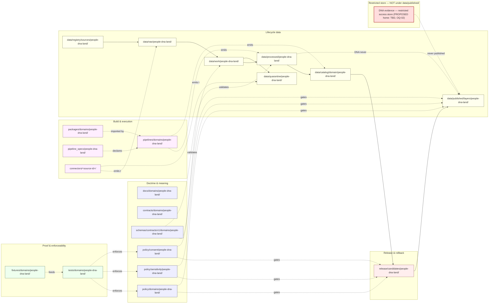

<!-- [KFM_META_BLOCK_V2]
doc_id: kfm://doc/people-dna-land/file-system-plan
title: People / Genealogy / DNA / Land — File System Plan
type: standard
version: v2
status: draft
owners: [TODO: People/DNA/Land domain steward] ; [TODO: Sensitivity reviewer] ; [TODO: Docs steward]
created: 2026-05-18
updated: 2026-06-07
policy_label: public
related:
  - ../../doctrine/directory-rules.md             # Directory Rules v1.3 — §12 Domain Placement Law (authority)
  - ../../../ai-build-operating-contract.md         # CONTRACT_VERSION = "3.0.0"
  - ./README.md
  - ./DATA_LIFECYCLE.md
  - ./DEFINITION_OF_DONE.md
  - ./DNA_HANDLING.md
  - ./EXPANSION_BACKLOG.md
  - ./EXPANSION_PLAN.md
  - contracts/domains/people-dna-land/
  - schemas/contracts/v1/domains/people-dna-land/
  - policy/domains/people-dna-land/
  - policy/sensitivity/people-dna-land/
  - policy/consent/people-dna-land/
  - tests/domains/people-dna-land/
  - release/candidates/people-dna-land/
tags: [kfm, domain, people, genealogy, dna, land, directory-rules, lane-plan, sensitivity]
notes:
  - CONTRACT_VERSION = "3.0.0" pinned per ai-build-operating-contract.md v3.0.
  - All concrete repo paths below are PROPOSED until verified against mounted-repo evidence.
  - Sensitivity posture is CONFIRMED doctrine; implementation maturity is UNKNOWN.
  - SLUG CONFLICT (OQ-01) has TWO axes — (a) slug `people-dna-land` (Directory Rules §12, line 928, CONFIRMED) vs `people` (Atlas §24.13 crosswalk, self-labeled PROPOSED); and (b) whether a `domains/` segment sits under schemas/contracts/v1/ and contracts/ (DIRRULES §12 = yes; Atlas §24.13 = no). Directory Rules §12 is canonical placement law and WINS; this plan uses the §12 form throughout.
  - CROSS-SIBLING NOTE: sibling docs DATA_LIFECYCLE/DEFINITION_OF_DONE/DNA_HANDLING/EXPANSION_* used the Atlas §24.13 `people` root form. That is the weaker authority; this plan flags the inconsistency for DRIFT_REGISTER reconciliation rather than silently re-flipping (OQ-01).
  - Consent terms are ConsentGrant + RevocationReceipt (Atlas ubiquitous language).
[/KFM_META_BLOCK_V2] -->

# People / Genealogy / DNA / Land — File System Plan

> Lane-by-lane plan for where People/Genealogy/DNA/Land files live across the KFM monorepo, what each lane owns, and what the trust membrane forbids — with the deny-by-default posture for living-person, DNA, and person-parcel joins made explicit.

    

<!-- Shields.io static endpoints; targets are informational only. -->

|Field                |Value                                                                                                                           |
|---------------------|--------------------------------------------------------------------------------------------------------------------------------|
|**Status**           |Draft                                                                                                                           |
|**Owners**           |TODO — People/DNA/Land domain steward (NEEDS VERIFICATION)                                                                      |
|**Last reviewed**    |2026-06-07                                                                                                                      |
|**Authority**        |Directory Rules v1.3 §12 (Domain Placement Law) is the placement authority. This plan is the domain’s instantiation of that law.|
|**Sensitivity class**|**Highest** — combines living-person, DNA/genomic, person-to-parcel, and consent-bearing data.                                  |


> [!CAUTION]
> **This is the most sensitive domain in KFM.** Living-person output and DNA-derived outputs are **denied or restricted by default**. Raw kit/vendor IDs and DNA segments are **never public**. Assessor/tax records are **not title truth**. Parcel geometry is **not title-boundary proof**. Every lane below assumes these defaults and tightens them; no lane relaxes them. CONFIRMED doctrine — [DOM-PEOPLE] [ENCY §20.5].

-----

## Contents

1. [Purpose and scope](#1-purpose-and-scope)
1. [Domain identity, boundary, and non-ownership](#2-domain-identity-boundary-and-non-ownership)
1. [The §12 lane pattern, instantiated](#3-the-12-lane-pattern-instantiated)
1. [Lane fan-out and lifecycle diagram](#4-lane-fan-out-and-lifecycle-diagram)
1. [Per-lane responsibilities](#5-per-lane-responsibilities)
1. [Sensitivity, consent, and policy lanes](#6-sensitivity-consent-and-policy-lanes)
1. [Cross-domain and multi-domain rules](#7-cross-domain-and-multi-domain-rules)
1. [Sources and connectors lane](#8-sources-and-connectors-lane)
1. [Domain-specific anti-patterns](#9-domain-specific-anti-patterns)
1. [Placement protocol walk-through](#10-placement-protocol-walk-through)
1. [Verification checklist for reviewers](#11-verification-checklist-for-reviewers)
1. [Open questions and NEEDS VERIFICATION](#12-open-questions-and-needs-verification)
1. [Related docs](#13-related-docs)

-----

## 1. Purpose and scope

This document maps the **People / Genealogy / DNA / Land** domain onto the KFM monorepo lane pattern defined in **Directory Rules v1.3 §12 (Domain Placement Law)**. It answers, for every governance and lifecycle responsibility this domain bears, the question:

> *Where does this file go, and what does it own?*

It is **not** a domain model, a source register, a sensitivity policy, or a runbook. Those each have their own files (see §13). This plan is the placement spine — the table reviewers and authors consult before proposing, creating, moving, or renaming any file that carries People, Genealogy, DNA, Land, consent, or person-parcel content.

**Authority of these rules:** CONFIRMED — Directory Rules v1.3 §12 is canonical placement law.
**Authority of any specific path quoted below:** PROPOSED until verified against mounted-repo evidence. The session in which this plan was authored did not mount the live repository; presence of any specific lane folder is **NEEDS VERIFICATION**.

[↑ Back to top](#contents)

-----

## 2. Domain identity, boundary, and non-ownership

### 2.1 One-line purpose

CONFIRMED doctrine / PROPOSED implementation: **Govern assertion-first person evidence, genealogy relationships, restricted DNA evidence, land instruments, ownership intervals, chain-of-title reasoning, consent, policy decisions, review, correction, graph projection, EvidenceBundle views, and rollback.** [DOM-PEOPLE] [ENCY]

### 2.2 What this domain owns

CONFIRMED / PROPOSED — the People/DNA/Land bounded context owns the following object families. Field-level shape lives under `schemas/`; meaning lives under `contracts/`; this list names ownership, not shape. [DOM-PEOPLE] [ENCY]

|Object family                                                  |One-line role                                                                          |
|---------------------------------------------------------------|---------------------------------------------------------------------------------------|
|**Person Assertion**                                           |Source-bound claim that a person existed with attributes at a time.                    |
|**PersonCanonical**                                            |Reviewed canonical person record derived from assertions.                              |
|**Person Identity Candidate**                                  |Pre-canonical merge candidate awaiting review.                                         |
|**NameAssertion**                                              |Source-bound name claim distinct from the person identity.                             |
|**LifeEvent**                                                  |Birth, baptism, marriage, divorce, death, burial, etc., as evidence-bound events.      |
|**Residence Event**                                            |Person-at-place-at-time, with source and geometry roles.                               |
|**Migration Event**                                            |Movement between residences with route and uncertainty.                                |
|**Genealogy Relationship** / **RelationshipAssertion**         |Parent/child/spouse/sibling relations as evidence-bound assertions.                    |
|**FamilyGroup**                                                |Group projection over relationships.                                                   |
|**Relationship Hypothesis**                                    |Unreviewed inference from DNA, document, or graph evidence.                            |
|**DNA Match Evidence**                                         |Restricted match evidence from vendor or analytic source.                              |
|**DNASegment**                                                 |Restricted shared-segment evidence.                                                    |
|**DNAKitToken**                                                |Internal token for kit identity; never public; raw vendor IDs not logged.              |
|**LandInstrument** / **Deed Instrument** / **Title Instrument**|Patents, deeds, mortgages, liens, easements, leases, mineral/water/access instruments. |
|**LegalDescription**                                           |Metes/bounds/PLSS/lot-block descriptions bound to instruments.                         |
|**Assessor Record** / **TaxRecord**                            |Tax-roll context; explicitly **not** title truth.                                      |
|**Parcel Version** / **LandParcel**                            |Versioned parcel geometry; explicitly **not** title-boundary proof without source role.|
|**Land Ownership Assertion**                                   |Source-bound ownership claim with a temporal interval.                                 |
|**Ownership Interval**                                         |Continuous ownership span derived from instruments.                                    |
|**ConsentGrant** / **RevocationReceipt**                       |Consent envelope and its revocation; gates DNA / living-person handling.               |

### 2.3 What this domain explicitly does **not** own

CONFIRMED / PROPOSED [DOM-PEOPLE] [ENCY]:

- **Settlements, Roads/Rail, Archaeology, Hydrology, Agriculture, Hazards, Spatial Foundation** provide *context* but **do not weaken** the living-person, DNA, title, or parcel-boundary controls owned here.
- **Frontier Matrix** (chapter 17) owns county-year panels, Public Land Records, Land Office Records, admin boundary changes, and aggregate frontier observations. It explicitly **defers** to this domain on living-person, DNA, title, parcel, and ownership decisions.
- **Settlements / Infrastructure** owns the legal and infrastructure status of cemeteries, schools, courts, and townships as *places*. Person-place links cross the lane boundary under §7.

[↑ Back to top](#contents)

-----

## 3. The §12 lane pattern, instantiated

Directory Rules v1.3 §12 (line 928) **explicitly enumerates `people-dna-land`** as the canonical domain slug in the uniform lane pattern. Below is the §12 pattern with the slug substituted in. **Each path is PROPOSED until verified in the mounted repo.**

```text
docs/domains/people-dna-land/
contracts/domains/people-dna-land/
schemas/contracts/v1/domains/people-dna-land/
policy/domains/people-dna-land/
tests/domains/people-dna-land/
fixtures/domains/people-dna-land/
packages/domains/people-dna-land/
pipelines/domains/people-dna-land/
pipeline_specs/people-dna-land/
data/raw/people-dna-land/
data/work/people-dna-land/
data/quarantine/people-dna-land/
data/processed/people-dna-land/
data/catalog/domain/people-dna-land/
data/published/layers/people-dna-land/
data/registry/sources/people-dna-land/
release/candidates/people-dna-land/
```

In addition to the uniform §12 pattern, this domain uses two **cross-cutting policy lanes** that organize by sensitivity class rather than by domain. These are PROPOSED and discussed in §6:

```text
policy/sensitivity/people-dna-land/
policy/consent/people-dna-land/
```

> [!WARNING]
> **Slug conflict has two axes (OQ-01).** This is the central placement tension for the lane, and it is genuinely unresolved:
> 
> 1. **Slug.** Directory Rules §12 enumerates **`people-dna-land`** (CONFIRMED, line 928). The Atlas §24.13 crosswalk uses **`people`** — but that crosswalk **self-labels every responsibility-root path as PROPOSED** and says confirmation requires a mounted repo.
> 1. **`domains/` segment.** Directory Rules §12 places the domain **under a `domains/` segment** for `contracts/`, `schemas/contracts/v1/`, `policy/`, `tests/`, `fixtures/`, `packages/`, `pipelines/` (e.g., `schemas/contracts/v1/domains/people-dna-land/`). The Atlas §24.13 form **omits `domains/`** (e.g., `schemas/contracts/v1/people/`).
> 
> **Per the Authority Ladder and operating contract source hierarchy, Directory Rules wins on path conflicts.** Directory Rules §12 is canonical placement law; Atlas §24.13 is an explicitly PROPOSED crosswalk. This plan therefore uses the **§12 form (`domains/people-dna-land/`)** throughout. Reconciliation by ADR is OQ-01. [DIRRULES §12] [Atlas §24.13] [DEEP-RESEARCH slug-drift register]

> [!IMPORTANT]
> **Cross-document inconsistency, surfaced not smoothed.** Sibling People/DNA/Land docs authored in this sprint (`DATA_LIFECYCLE.md`, `DEFINITION_OF_DONE.md`, `DNA_HANDLING.md`, `EXPANSION_BACKLOG.md`, `EXPANSION_PLAN.md`) adopted the Atlas §24.13 `people` root form (e.g., `schemas/contracts/v1/people/`, `policy/sensitivity/people/`). That form follows the **weaker** authority. This plan does **not** silently re-flip the siblings; it records the divergence as a single drift item (OQ-01) so one ADR can reconcile all six documents at once and a `DRIFT_REGISTER.md` entry can track it until then.

[↑ Back to top](#contents)

-----

## 4. Lane fan-out and lifecycle diagram

The diagram below shows how the People/DNA/Land domain segment fans out across responsibility roots, and how lifecycle data flows from RAW to PUBLISHED through the trust membrane. **PROPOSED** — illustrative of doctrine; specific paths require mounted-repo verification.



> [!IMPORTANT]
> The diagram reflects **doctrine**, not verified implementation. Connectors emit only to `data/raw/` or `data/quarantine/`; watchers emit receipts and candidate decisions only. Promotion to `data/published/` and updates to `data/catalog/` are governed state transitions, never direct writes. The **DNA branch never reaches `data/published/`** under default policy; DNA-derived outputs live in a separate restricted store with steward-gated access. The restricted-store home is **NEEDS VERIFICATION** (see OQ-02). DNA handling detail is in `DNA_HANDLING.md`.

[↑ Back to top](#contents)

-----

## 5. Per-lane responsibilities

Each lane below has a single primary responsibility. Multi-responsibility files MUST be split, not placed at a “convenient” intersection. Status of the **rules** below is CONFIRMED (they restate Directory Rules); status of the **paths** is PROPOSED.

### 5.1 Doctrine and meaning lanes

- **`docs/domains/people-dna-land/`** — Domain README, this `FILE_SYSTEM_PLAN.md`, the domain model, the source ledger, the sensitivity profile, the consent register, design notes, and the sibling lane docs (`DATA_LIFECYCLE.md`, `DEFINITION_OF_DONE.md`, `DNA_HANDLING.md`, `EXPANSION_BACKLOG.md`, `EXPANSION_PLAN.md`). Explains; does not decide. PROPOSED.
- **`contracts/domains/people-dna-land/`** — Object-family **meaning** in Markdown form: Person Assertion, PersonCanonical, LifeEvent, RelationshipAssertion, DNA Match Evidence, LandInstrument, Ownership Interval, ConsentGrant, etc. Pairs with `schemas/`. Never the only place validation lives. PROPOSED.
- **`schemas/contracts/v1/domains/people-dna-land/`** — Machine-checkable **shape** (JSON Schema or equivalent) for every object family this domain owns. Default home per **ADR-0001 (schema home)**. PROPOSED.
- **`policy/domains/people-dna-land/`** — Domain-scoped admissibility, validation gate, review-state, and release-state policy fragments (Rego/OPA or equivalent). PROPOSED.

### 5.2 Cross-cutting policy lanes (sensitivity class, not domain class)

These lanes organize by sensitivity *class*, which crosses domain boundaries. The People/DNA/Land slice of each is treated as the **anchor** because this domain is where most living-person and consent enforcement lives.

- **`policy/sensitivity/people-dna-land/`** — Living-person denial, DNA segment restriction, raw-vendor-ID no-log, redaction profiles, geoprivacy/generalization receipts for residence and parcel context. PROPOSED.
- **`policy/consent/people-dna-land/`** — `ConsentGrant` records, consent-state lifecycle (granted, restricted, revoked), `RevocationReceipt` and revocation cleanup rules, AI-inference consent classes. PROPOSED.

> [!WARNING]
> **Sensitivity and consent are not aliases.** Sensitivity governs *what may be shown*; consent governs *what the data subject permitted*. A revocation under `policy/consent/` MUST trigger an immediate downstream cleanup pass (see §6.4). Conflating the two — e.g., treating a DNA segment as “allowed” because sensitivity policy permits it generally — is the failure mode covered by validators in §5.3.

### 5.3 Proof and enforceability lanes

- **`tests/domains/people-dna-land/`** — Tests that prove policy and schema rules **actually deny / abstain / answer / error** as written. Includes the seven validator categories from [DOM-PEOPLE]:
1. Person assertion evidence tests
1. GEDCOM import rights / living-flag tests
1. DNA consent and raw-ID no-log tests
1. Revocation cleanup tests
1. Legal-description and chain-of-title gap tests
1. Assessor-as-title denial
1. Graph projection safety tests
   All PROPOSED. [DOM-PEOPLE] [ENCY]
- **`fixtures/domains/people-dna-land/`** — Golden, valid, and invalid sample data: synthetic GEDCOM trees, redacted DNA match fixtures (no real kit IDs, ever), synthetic deeds, PLSS test descriptions, malformed-instrument cases, living-person trigger cases. PROPOSED.

### 5.4 Build and execution lanes

- **`packages/domains/people-dna-land/`** — Shared libraries imported by multiple deployables (e.g., chain-of-title reasoner, relationship-hypothesis solver, redaction-receipt builder). No source-fetching here. PROPOSED.
- **`pipelines/domains/people-dna-land/`** — Executable pipeline logic for the lane: assertion ingest, relationship resolution, DNA segment normalization (within the restricted store), instrument-chain assembly, parcel-version reconciliation. PROPOSED.
- **`pipeline_specs/people-dna-land/`** — Declarative pipeline configuration: which source descriptors feed which validators, which policy bundles apply, which receipts are emitted. PROPOSED.
- **`connectors/<source-id>/`** — Source-specific fetchers and admitters (see §8). Connectors are **not** domain-segmented at the root; one connector per source. PROPOSED.

### 5.5 Lifecycle data lanes

|Phase     |Path (PROPOSED)                                         |Gate                                               |Notes                                                                                                |
|----------|--------------------------------------------------------|---------------------------------------------------|-----------------------------------------------------------------------------------------------------|
|RAW       |`data/raw/people-dna-land/<source_id>/<run_id>/`        |`SourceDescriptor` exists                          |Immutable. DNA RAW MUST NOT be world-readable.                                                       |
|WORK      |`data/work/people-dna-land/<run_id>/`                   |Validation/policy gate pass                        |Normalization workspace.                                                                             |
|QUARANTINE|`data/quarantine/people-dna-land/<reason>/<run_id>/`    |Quarantine reason recorded                         |Living-person triggers, consent-missing kits, rights-unresolved instruments land here.               |
|PROCESSED |`data/processed/people-dna-land/<dataset_id>/<version>/`|`EvidenceRef` + `ValidationReport` + digest closure|Public-safe candidates only. DNA-derived **not** here unless steward-reviewed for restricted release.|
|CATALOG   |`data/catalog/domain/people-dna-land/`                  |Catalog/proof closure                              |`EvidenceBundle`, graph/triplet projection.                                                          |
|PUBLISHED |`data/published/layers/people-dna-land/`                |`ReleaseManifest`, correction path, rollback target|Public-safe artifacts only. **No DNA segments. No raw kit IDs. No living-person identifying output.**|
|Registry  |`data/registry/sources/people-dna-land/`                |Per-source `*.source.yaml`                         |Source-rights, freshness, citation.                                                                  |

### 5.6 Release and rollback lanes

- **`release/candidates/people-dna-land/`** — Promotion candidates awaiting `PromotionDecision`. PROPOSED.
- **`release/manifests/`**, **`release/rollback_cards/`**, **`release/correction_notices/`** — Cross-domain, **not** domain-segmented. The People/DNA/Land manifest, rollback card, or correction notice for a given release lives alongside every other domain’s, indexed by release ID. (Exact subfolder names NEEDS VERIFICATION.)

[↑ Back to top](#contents)

-----

## 6. Sensitivity, consent, and policy lanes

This domain’s sensitivity posture is the **strictest** in KFM. The lanes below carry the rules; the tests in §5.3 prove they enforce. Full DNA-specific handling is in `DNA_HANDLING.md`; full tier mechanics are in `DATA_LIFECYCLE.md` §6.

### 6.1 The four deny-by-default invariants

CONFIRMED / PROPOSED [DOM-PEOPLE] [ENCY §20.5]:

|#|Invariant                                       |Default outcome|Counter-rule                                                                                                                 |
|-|------------------------------------------------|---------------|-----------------------------------------------------------------------------------------------------------------------------|
|1|Living-person identifying output                |DENY public    |Only with legal basis + consent/review + release state proven.                                                               |
|2|DNA segments, raw kit IDs, vendor IDs           |DENY public    |Restricted steward/research access only with policy approval (T3 only under named research agreement).                       |
|3|Person-to-parcel join exposing private ownership|DENY public    |Public surfaces show parcel context with **warnings**, not title truth (generalized parcel + de-identified person → T2 only).|
|4|Assessor / tax record as title truth            |DENY           |Assessor records are *context*; title authority lives in `LandInstrument` chains.                                            |

### 6.2 `policy/sensitivity/people-dna-land/` — what lives here

PROPOSED contents:

- Living-person detection rules (date-of-birth thresholds, vital-records cross-checks, death-date evidence requirements).
- DNA segment access classes; raw kit ID no-log rule; vendor ID hashing/tokenization (client-side HMAC per `DNA_HANDLING.md` §6).
- Residence redaction profiles (cell-level generalization, point-to-tract suppression; k-anonymity for living-person overlays).
- Parcel context geoprivacy: parcel may appear; current owner identity may not, unless rights and review say otherwise.
- Geoprivacy transform receipt requirements (mirrors the rare-fauna pattern; redaction receipts emitted as cross-cutting `data/receipts/`).

### 6.3 `policy/consent/people-dna-land/` — what lives here

PROPOSED contents:

- `ConsentGrant` records and consent-state lifecycle (granted → restricted → revoked).
- Consent classes for AI inference (e.g., “evidence summary allowed,” “relationship hypothesis allowed,” “public surface forbidden”).
- `RevocationReceipt` and revocation cleanup rules: what data, derivatives, receipts, and graph edges must be purged or marked stale on revocation.
- Living-person consent for personal data publication (where applicable).

### 6.4 Revocation cleanup contract (PROPOSED)

When a `ConsentGrant` transitions to **revoked**, the pipelines lane MUST:

1. Emit a **CorrectionNotice** in `release/correction_notices/` for any prior public derivative.
1. Mark affected `EvidenceBundle` references **stale** and detach them from public claim surfaces.
1. Purge or tombstone the revoked kit’s segments and tokens in the restricted store; emit a `RevocationReceipt` and a redaction receipt under `data/receipts/`.
1. Schedule a **RollbackCard** in `release/rollback_cards/` if any public release depended on the revoked data.
1. Update the graph projection: remove or shade Relationship Hypotheses derived from the revoked DNA evidence.
1. Fail closed if the revocation endpoint is unreachable at render time.

This contract is **PROPOSED**; concrete tooling and SLAs are NEEDS VERIFICATION. [C6-08]

### 6.5 What does **not** publish under any circumstance

- Raw DNA-vendor kit identifiers (logged, exported, or returned by any API).
- Shared-segment cM values or chromosome ranges in public form.
- Living-person home addresses, contact info, or unredacted residence points.
- “Most likely owner” claims from assessor records as if they were title.
- AI-generated relationship statements about living persons without explicit consent and review state.

[↑ Back to top](#contents)

-----

## 7. Cross-domain and multi-domain rules

This domain crosses lanes more than most. Apply Directory Rules §12’s *multi-domain and cross-cutting files* rule when in doubt: a file that legitimately spans domains lives under the **lowest common responsibility root without a domain segment**.

### 7.1 Cross-lane relations (CONFIRMED / PROPOSED)

|Related lane                |Relation type                                                       |Constraint                                                                                                                                                  |
|----------------------------|--------------------------------------------------------------------|------------------------------------------------------------------------------------------------------------------------------------------------------------|
|Settlements / Infrastructure|residence, cemetery, school, court, county, township, place relation|Relation MUST preserve ownership, source role, sensitivity, and `EvidenceBundle` support; living-person fields fail closed.                                 |
|Roads / Rail                |migration, access, movement                                         |Same constraint.                                                                                                                                            |
|Archaeology                 |historic person, land, documentary, cultural-place context          |Archaeology’s deny-default for sensitive geometry **and** People’s deny-default for living-person both apply — whichever is stricter wins.                  |
|Agriculture                 |farm, land use, producer-adjacent context with privacy              |Agriculture’s farm-private rules and People’s living-person rules both apply; private person-parcel joins denied by default.                                |
|Frontier Matrix (Ch. 17)    |Public Land Records, Land Office Records, frontier observations     |Frontier Matrix owns the aggregate / matrix-cell view; this domain owns the underlying assertions. **No matrix cell may publish identifying personal data.**|
|Spatial Foundation          |`GeographyVersion`, CRS, base layers                                |Inherited; no person-data on base layers.                                                                                                                   |

### 7.2 Where cross-domain files go

Per Directory Rules §12, a file that legitimately spans domains MUST NOT live under one domain’s segment. Examples for this lane:

- **Person × parcel join validator** → `tools/validators/<topic>/...` (e.g., `tools/validators/person-parcel/`) — not `tools/validators/domains/people-dna-land/`.
- **Cemetery person-place ontology** → cross-domain doctrine under `docs/architecture/people-place-joins.md`, or a cross-domain contract under `contracts/<topic>/...` — not under one of the two domains. **PROPOSED home.**
- **Migration × roads route schema** → `schemas/contracts/v1/<topic>/...` (e.g., `schemas/contracts/v1/migration-routes/`) — not under a single domain folder. **PROPOSED home.**
- **Cross-domain sensitivity policy** (e.g., archaeology × people for historic-burial joins) → a cross-domain segment under `policy/sensitivity/` — exact form is **OQ-03.**

[↑ Back to top](#contents)

-----

## 8. Sources and connectors lane

Source registration lives in `data/registry/sources/people-dna-land/<source-id>.source.yaml` (PROPOSED form). Source fetchers live in `connectors/<source-id>/` — **not domain-segmented at the root**, one connector per source ID.

### 8.1 Source families and where they enter

|Source family                                                                                      |Role                                             |Default sensitivity                                      |RAW path (PROPOSED)                                     |
|---------------------------------------------------------------------------------------------------|-------------------------------------------------|---------------------------------------------------------|--------------------------------------------------------|
|Vital / cemetery / burial / obituary records                                                       |authority / observation                          |Living-person screen on every record                     |`data/raw/people-dna-land/<vital-source-id>/`           |
|Church / school / military / census / directory records                                            |observation / context                            |Living-person screen                                     |`data/raw/people-dna-land/<source-id>/`                 |
|Court / probate records                                                                            |authority / observation                          |Living-person screen; rights review                      |`data/raw/people-dna-land/<court-source-id>/`           |
|GEDCOM / GEDZip / tree overlays                                                                    |observation / model (never authority)            |Living-flag honored; rights NEEDS VERIFICATION per upload|`data/raw/people-dna-land/<gedcom-source-id>/`          |
|DNA vendor match / segment / triangulation CSVs                                                    |observation / model (restricted)                 |**DENY public**; restricted store only                   |`data/raw/people-dna-land/<dna-source-id>/` (restricted)|
|Patent / deed / mortgage / lien / easement / lease / mineral / water / access / probate instruments|authority / observation                          |Rights per jurisdiction                                  |`data/raw/people-dna-land/<instrument-source-id>/`      |
|Assessor / tax roll records                                                                        |observation / context                            |**Not title**; aggregation rules apply                   |`data/raw/people-dna-land/<assessor-source-id>/`        |
|Plat / survey / metes-bounds / PLSS / subdivision / derived geometry                               |authority (survey) / observation (parcel-version)|Geometry-role distinction enforced                       |`data/raw/people-dna-land/<geometry-source-id>/`        |

All rows above are PROPOSED until per-source descriptors are filled and rights review is recorded.

### 8.2 Connector invariants

Connectors in this domain MUST:

- Emit only to `data/raw/people-dna-land/` or `data/quarantine/people-dna-land/`.
- Never write to `data/processed/`, `data/catalog/`, `data/published/`, or any restricted DNA store directly.
- Hash or tokenize vendor kit IDs at admission; raw vendor IDs are never persisted to receipts or logs.
- Quarantine on missing rights, missing consent, or living-person triggers — never fall through to WORK.
- Emit a `RunReceipt` per fetch including: source role, rights state, sensitivity state, citation, observed time, retrieval time, content hash, and (for DNA vendors) the export-format version.

[↑ Back to top](#contents)

-----

## 9. Domain-specific anti-patterns

In addition to the general anti-patterns in Directory Rules §13, the following are specific to this lane. PROPOSED enforcement via tests in §5.3.

<details>
<summary><strong>Click to expand: People/DNA/Land anti-pattern register</strong></summary>

|Anti-pattern                                                     |What goes wrong                                                                |Counter-rule                                                                                             |
|-----------------------------------------------------------------|-------------------------------------------------------------------------------|---------------------------------------------------------------------------------------------------------|
|**DNA segments under `data/published/`**                         |Trust membrane breach; restricted data becomes public.                         |DNA derivatives **never** land in `data/published/`. Restricted store only.                              |
|**Raw kit IDs in receipts or logs**                              |Vendor ID leakage; re-identification risk.                                     |Tokenize at admission; receipts carry tokens, never raw IDs.                                             |
|**Assessor record exposed as “current owner”**                   |Title misrepresentation.                                                       |Assessor surfaces carry a “**not title**” warning; current ownership only via `LandInstrument` chain.    |
|**Parcel geometry as title boundary**                            |Boundary disputes elevated to “truth”; PLSS/metes-bounds source role collapsed.|Geometry-role boundary tests enforce source-role distinction.                                            |
|**Relationship Hypothesis published as RelationshipAssertion**   |Inferred hypothesis presented as evidence-grounded.                            |Hypotheses remain hypotheses; promotion requires review state.                                           |
|**Living-person AI inference without consent class**             |AI substitutes for evidence; consent state ignored.                            |Focus Mode DENY unless consent class permits; `AIReceipt` records the policy decision.                   |
|**Person-parcel join exposing private ownership**                |Public surface joins identity to current parcel without rights check.          |Person-parcel join validator (cross-domain) denies by default.                                           |
|**GEDCOM living-flag ignored on import**                         |Tree overlay leaks living individuals into public derivatives.                 |GEDCOM import test; living-flag honored or quarantine.                                                   |
|**Revocation that does not propagate**                           |Revoked DNA evidence remains in graph or evidence bundles.                     |Revocation cleanup contract (§6.4) enforced by test.                                                     |
|**A new `people/`, `genealogy/`, `dna/`, or `land/` root folder**|Domain becomes root; lifecycle fragments.                                      |Domain lives only as a segment inside responsibility roots (§12).                                        |
|**Schema authored under `jsonschema/` or `policies/`**           |Compatibility root hardens into authority.                                     |Schemas under `schemas/contracts/v1/domains/people-dna-land/`.                                           |
|**Restricted DNA store conflated with `data/registry/`**         |Restricted data treated as registry metadata.                                  |Restricted store is a distinct home (OQ-02); registry only carries source descriptors and rights.        |
|**Mixing `people` and `people-dna-land` slugs across roots**     |Two competing lane homes; reviewers lose the authoritative one.                |Use the §12 form `domains/people-dna-land/` until OQ-01 ADR lands; log divergence in `DRIFT_REGISTER.md`.|

</details>

[↑ Back to top](#contents)

-----

## 10. Placement protocol walk-through

To make §4 of Directory Rules concrete, here is a worked example for one new file in this domain.

**Scenario.** A reviewer adds a Rego policy fragment that denies any public response that joins a `PersonCanonical` to a current-vintage `Parcel Version` unless an explicit `ConsentGrant` and a `ReleaseManifest` reference exist.

|Step|Question                                               |Answer for this file                                                                                                                                                                                                                   |
|----|-------------------------------------------------------|---------------------------------------------------------------------------------------------------------------------------------------------------------------------------------------------------------------------------------------|
|1   |What is the file’s **primary responsibility**?         |Decides allow/deny → `policy/`                                                                                                                                                                                                         |
|2   |Is it lifecycle data?                                  |No — skip Step 2.                                                                                                                                                                                                                      |
|3   |Is it domain-specific?                                 |Yes — `people-dna-land`. But also crosses with `settlements` (parcel context). The denial pivots on **person identity + consent**, so the primary domain is People/DNA/Land. Cross-lane reviewers from Settlements should be on the PR.|
|4   |Is it sensitivity-class policy or domain-scoped policy?|Sensitivity-class (it enforces a deny-by-default invariant from §6.1) → `policy/sensitivity/people-dna-land/` rather than `policy/domains/people-dna-land/`.                                                                           |
|5   |Cite the rule.                                         |Directory Rules §12 (lane pattern) + §4 Step 1 (`policy/` for allow/deny) + this plan §5.2 (sensitivity lane scope) + this plan §6.1 invariant #3 (person-parcel join).                                                                |

**Proposed path.** `policy/sensitivity/people-dna-land/person_parcel_join.deny.rego` — **PROPOSED**, pending repo verification of the `.deny.rego` naming convention (OQ-05).

**Required co-changes:**

- A matching test under `tests/domains/people-dna-land/` proving DENY fires on a negative fixture and ABSTAIN/ANSWER fires on a positive consented fixture.
- A fixture pair under `fixtures/domains/people-dna-land/`.
- A reference to the policy in the relevant `policy/domains/people-dna-land/` README index (if such an index exists; otherwise NEEDS VERIFICATION).

> [!TIP]
> If a path proposed in a PR cannot cite a rule from Directory Rules **and** a lane in this plan, mark it **PROPOSED** and open an entry in `docs/registers/VERIFICATION_BACKLOG.md` or `docs/registers/DRIFT_REGISTER.md` rather than letting it harden.

[↑ Back to top](#contents)

-----

## 11. Verification checklist for reviewers

For any PR that proposes, creates, moves, or renames a People/DNA/Land file:

- [ ] Path uses the §12 lane pattern with slug `people-dna-land` under a `domains/` segment where §12 requires it (not `people`, not `genealogy`, not `dna`, not `land`).
- [ ] No new root-level `people/`, `genealogy/`, `dna/`, or `land/` folder is introduced.
- [ ] Schema home is `schemas/contracts/v1/domains/people-dna-land/` (per ADR-0001 + §12).
- [ ] Domain-scoped policy lives in `policy/domains/people-dna-land/`; sensitivity-class policy in `policy/sensitivity/people-dna-land/`; consent-class policy in `policy/consent/people-dna-land/`.
- [ ] Connectors live under `connectors/<source-id>/`, **not** under a domain segment at the root.
- [ ] DNA-related artifacts do not appear under `data/published/`.
- [ ] Raw vendor kit IDs do not appear in receipts, logs, or fixtures.
- [ ] Living-person triggers route to `data/quarantine/people-dna-land/<reason>/`, not WORK.
- [ ] Cross-domain files use the lowest-common responsibility root **without** a domain segment.
- [ ] Tests in `tests/domains/people-dna-land/` exercise the DENY/ABSTAIN/ANSWER/ERROR paths.
- [ ] Fixtures contain only synthetic data — no real persons, no real kit IDs, no real instruments traceable to current owners.
- [ ] If the PR uses the `people` (Atlas §24.13) form anywhere, it cites OQ-01 and adds a `DRIFT_REGISTER.md` note.
- [ ] PR description cites the Directory Rules section **and** the lane in this plan that justifies the placement.

[↑ Back to top](#contents)

-----

## 12. Open questions and NEEDS VERIFICATION

|#        |Item                                                                                                                                                                                                                                                                                     |Evidence that would settle it                                                                                                                                  |
|---------|-----------------------------------------------------------------------------------------------------------------------------------------------------------------------------------------------------------------------------------------------------------------------------------------|---------------------------------------------------------------------------------------------------------------------------------------------------------------|
|**OQ-01**|Reconcile both axes of the slug conflict: (a) slug `people-dna-land` (Directory Rules §12, CONFIRMED) vs `people` (Atlas §24.13, PROPOSED); (b) `domains/` segment present (§12) vs absent (§24.13). Also reconcile the five sibling People/DNA/Land docs that adopted the `people` form.|ADR amending/affirming Directory Rules §12 (or an Atlas supplement adopting §12), plus a `DRIFT_REGISTER.md` entry; then align all six lane docs in one change.|
|**OQ-02**|Canonical home for the **restricted DNA store**. Doctrine implies a “separate restricted store” but does not name the path.                                                                                                                                                              |ADR + per-root README declaring the store’s class and access controls.                                                                                         |
|**OQ-03**|Whether cross-domain sensitivity policy (archaeology × people, agriculture × people) belongs under a `joins/` segment or a `<class>/<a>-<b>/` segment under `policy/sensitivity/`.                                                                                                       |ADR or `policy/sensitivity/README.md` per-root rule.                                                                                                           |
|**OQ-04**|Whether `data/registry/sources/people-dna-land/` is the canonical form vs `data/registry/sources/<source-id>/`. Directory Rules §4 Step 3 shows both.                                                                                                                                    |Per-root README in `data/registry/` + ADR.                                                                                                                     |
|**OQ-05**|Naming convention for Rego policy files (`*.deny.rego` vs `*.rego` with embedded decision).                                                                                                                                                                                              |Repo inspection + per-root README.                                                                                                                             |
|**OQ-06**|Whether `policy/consent/` is the canonical home for DNA-kit consent or whether consent belongs under `policy/sensitivity/people-dna-land/consent/`.                                                                                                                                      |ADR.                                                                                                                                                           |
|**OQ-07**|Whether runbooks for this domain live under `docs/runbooks/people-dna-land/` (subfolder) or `docs/runbooks/people_dna_land_<topic>.md` (flat-prefix).                                                                                                                                    |ADR; Directory Rules §18 OPEN-DR-02 recommends Pattern A (subfolder).                                                                                          |
|**OQ-08**|Exact route names for the four governed-API People/DNA/Land resolvers (decision envelope, layer manifest, Evidence Drawer payload, Focus Mode answer).                                                                                                                                   |`apps/governed-api/` routing manifest.                                                                                                                         |
|**OQ-09**|Living-person policy: birth-date thresholds, death-evidence requirements, fallback rules when DOB unknown.                                                                                                                                                                               |`policy/sensitivity/people-dna-land/living_person.*` + tests.                                                                                                  |
|**OQ-10**|DNA consent/revocation enforcement: SLA from revocation to graph/receipt/manifest cleanup; cache-invalidation reachability.                                                                                                                                                              |`policy/consent/people-dna-land/` + revocation tests + a runbook.                                                                                              |
|**OQ-11**|Land instrument chain logic: gap policy, conflicting-grant resolution, mineral/surface separation handling.                                                                                                                                                                              |`contracts/domains/people-dna-land/LandInstrument.md` + chain-closure tests.                                                                                   |
|**OQ-12**|Geometry-role boundary logic: PLSS vs survey vs assessor vs derived.                                                                                                                                                                                                                     |Geometry-role validator + fixtures.                                                                                                                            |
|**OQ-13**|UI/API restricted-field no-leak behavior at the trust membrane.                                                                                                                                                                                                                          |Governed-API contract tests; Focus Mode policy tests.                                                                                                          |
|**OQ-14**|Whether MapLibre / Evidence Drawer / Focus Mode have any People/DNA/Land-specific implementation today.                                                                                                                                                                                  |Repo inspection of `packages/maplibre-runtime/`, `apps/explorer-web/`, `apps/governed-api/`.                                                                   |
|**OQ-15**|Owning team / steward for this domain. Currently TBD.                                                                                                                                                                                                                                    |`CODEOWNERS` entry.                                                                                                                                            |

[↑ Back to top](#contents)

-----

## 13. Related docs

<!-- Placeholders preserved where target docs are PROPOSED. -->

- [`docs/doctrine/directory-rules.md`](../../doctrine/directory-rules.md) — Directory Rules v1.3; placement authority and lifecycle invariant. **Authoritative.**
- [`ai-build-operating-contract.md`](../../../ai-build-operating-contract.md) — operating contract v3.0 (`CONTRACT_VERSION = "3.0.0"`).
- [`./README.md`](./README.md) — People/DNA/Land domain landing page. **PROPOSED / TODO.**
- [`./DATA_LIFECYCLE.md`](./DATA_LIFECYCLE.md) — lifecycle, tiers, receipts (sibling).
- [`./DEFINITION_OF_DONE.md`](./DEFINITION_OF_DONE.md) — promotion-readiness checklist (sibling).
- [`./DNA_HANDLING.md`](./DNA_HANDLING.md) — DNA & genomic handling sub-policy (sibling).
- [`./EXPANSION_BACKLOG.md`](./EXPANSION_BACKLOG.md) — work register (sibling).
- [`./EXPANSION_PLAN.md`](./EXPANSION_PLAN.md) — domain expansion plan (sibling).
- [`./SENSITIVITY_PROFILE.md`](./SENSITIVITY_PROFILE.md) — living-person, DNA, person-parcel deny defaults. **PROPOSED.**
- [`./CONSENT_REGISTER.md`](./CONSENT_REGISTER.md) — `ConsentGrant` lifecycle and revocation contract. **PROPOSED.**
- [`docs/runbooks/people-dna-land/`](../../runbooks/people-dna-land/) — lifecycle operations (PROPOSED; subfolder convention unresolved, OQ-07).
- [`docs/domains/archaeology/FILE_SYSTEM_PLAN.md`](../archaeology/FILE_SYSTEM_PLAN.md) — adjacent lane (historic-person, burial, cultural context). **PROPOSED.**
- [`docs/domains/settlements-infrastructure/FILE_SYSTEM_PLAN.md`](../settlements-infrastructure/FILE_SYSTEM_PLAN.md) — adjacent lane (residence, cemetery, court, township). **TODO** if absent.
- [`docs/domains/agriculture/FILE_SYSTEM_PLAN.md`](../agriculture/FILE_SYSTEM_PLAN.md) — adjacent lane (farm/operator privacy, private-join denial). **PROPOSED.**
- [`docs/architecture/contract-schema-policy-split.md`](../../architecture/contract-schema-policy-split.md) — contract vs schema vs policy boundary. **PROPOSED home.**
- [`docs/adr/ADR-0001-schema-home.md`](../../adr/ADR-0001-schema-home.md) — schema home convention. **PROPOSED home.**
- [`docs/registers/DRIFT_REGISTER.md`](../../registers/DRIFT_REGISTER.md) — where mounted-repo vs plan conflicts (incl. OQ-01 slug divergence) get recorded.
- [`docs/registers/VERIFICATION_BACKLOG.md`](../../registers/VERIFICATION_BACKLOG.md) — `NEEDS VERIFICATION` items from §12.

-----

**Last reviewed:** 2026-06-07 · **Edition:** v2 (draft) · **CONTRACT_VERSION:** 3.0.0 · **Authority:** Directory Rules v1.3 §12 (Domain Placement Law) · [↑ Back to top](#contents)