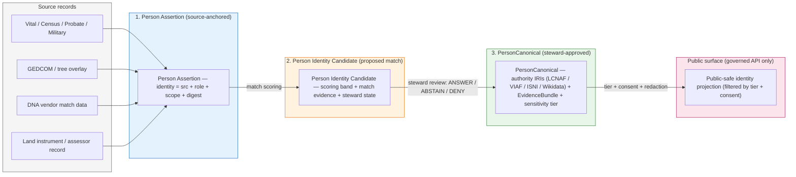
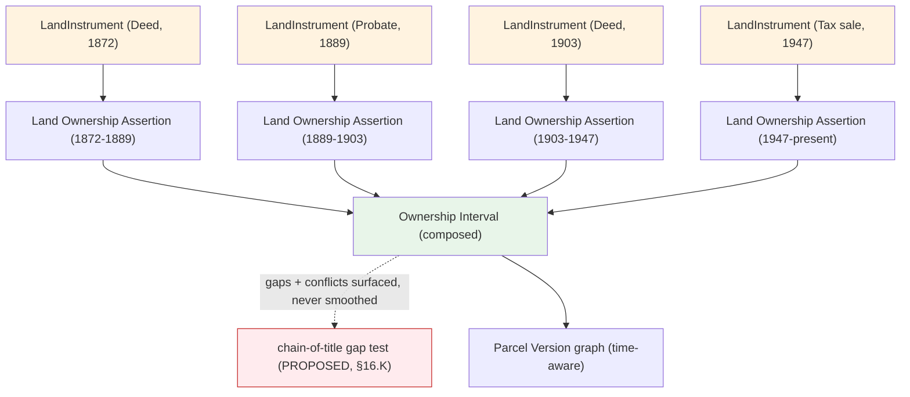
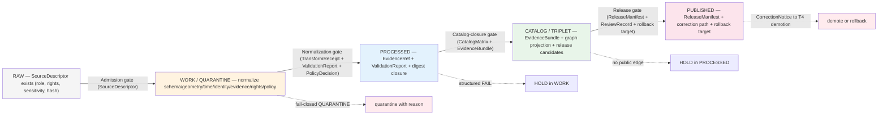

<!-- [KFM_META_BLOCK_V2]
doc_id: kfm://doc/people-dna-land/identity-model/v2
title: People / DNA / Land — Identity Model
type: standard
version: v2
status: draft
owners: [TODO: Docs steward] ; [TODO: People/DNA/Land domain steward]
created: 2026-05-18
updated: 2026-06-07
policy_label: public
related:
  - ../../doctrine/directory-rules.md            # Directory Rules v1.3
  - ../../../ai-build-operating-contract.md       # CONTRACT_VERSION = "3.0.0"
  - ../../doctrine/truth-posture.md
  - ../../doctrine/trust-membrane.md
  - ../../doctrine/lifecycle-law.md
  - ./README.md
  - ./DATA_LIFECYCLE.md
  - ./DEFINITION_OF_DONE.md
  - ./DNA_HANDLING.md
  - ./EXPANSION_BACKLOG.md
  - ./EXPANSION_PLAN.md
  - ./FILE_SYSTEM_PLAN.md
  - ../../standards/PROV.md
  - ../../standards/SENSITIVITY_RUBRIC.md
  - ../../standards/CANONICALIZATION.md
  - contracts/people/
  - schemas/contracts/v1/people/
  - policy/sensitivity/people/
  - policy/consent/people/
tags: [kfm, domain, people, dna, land, identity, governance]
notes:
  - CONTRACT_VERSION = "3.0.0" pinned per ai-build-operating-contract.md v3.0.
  - Repository presence of every cited path is NEEDS VERIFICATION until repo inspection.
  - Implementation-layer specifics (field shapes, schema URIs, route names, test IDs) are PROPOSED.
  - Doctrine claims grounded in Atlas v1.1 Ch. 16 / §24, Pass-10 Idea Index, Directory Rules v1.3, and the Domain-Driven Design Reference.
  - SLUG CONFLICT (OQ-PDL-SLUG-01) — docs lane `people-dna-land` is CONFIRMED in Directory Rules v1.3 §6.1/§12; responsibility-root slug is `people` per Atlas §24.13 (self-labeled PROPOSED). Sibling FILE_SYSTEM_PLAN.md uses the §12 `people-dna-land` form for responsibility roots; this doc uses the §24.13 `people` form. Divergence flagged for one-ADR reconciliation; see §2 and §17.
  - Consent terms are ConsentGrant + RevocationReceipt (Atlas ubiquitous language).
[/KFM_META_BLOCK_V2] -->

# People / DNA / Land — Identity Model

> **How KFM names, distinguishes, anchors, and resolves persons, families, DNA evidence, and land instruments across time — under a governed, evidence-first, deny-by-default trust membrane.**

[](#0-status--authority)
[](#1-purpose)
[](#0-status--authority)
[-red)](#7-sensitivity--publication-posture)
[](#7-sensitivity--publication-posture)
[](#)

> [!IMPORTANT]
> **This is a domain identity-model reference, not policy and not implementation truth.** When this document disagrees with `docs/doctrine/`, accepted ADRs, `contracts/`, `schemas/`, or `policy/sensitivity/people/` / `policy/consent/people/`, **those win**. File the disagreement to `docs/registers/DRIFT_REGISTER.md` per Directory Rules §2.5. No path, field, route, or behavior named here is promoted to repo state by this document.

> [!CAUTION]
> **Living-person, raw DNA, and private person-parcel joins are T4 deny-default.** This document explains the *model* of identity for those object classes; it does **not** authorize their publication. Promotion through the lifecycle requires `EvidenceBundle`, `PolicyDecision`, `ReviewRecord`, `ReleaseManifest`, a correction path, and a rollback target — never a model alone.

---

## Mini TOC

- [0. Status & Authority](#0-status--authority)
- [1. Purpose](#1-purpose)
- [2. Repo Fit](#2-repo-fit)
- [3. Scope & Boundary](#3-scope--boundary)
- [4. Ubiquitous Language](#4-ubiquitous-language)
- [5. Identity Rule — The Deterministic Formula](#5-identity-rule--the-deterministic-formula)
- [6. Identity Resolution — From Assertion to Canonical](#6-identity-resolution--from-assertion-to-canonical)
- [7. Sensitivity & Publication Posture](#7-sensitivity--publication-posture)
- [8. Temporal Handling](#8-temporal-handling)
- [9. Authority Anchoring Ladder](#9-authority-anchoring-ladder)
- [10. DNA Identity Model](#10-dna-identity-model)
- [11. Land Identity Model](#11-land-identity-model)
- [12. Cross-Domain Identity References](#12-cross-domain-identity-references)
- [13. EvidenceBundle Resolution for Identity Claims](#13-evidencebundle-resolution-for-identity-claims)
- [14. Pipeline Shape — Identity Through the Lifecycle](#14-pipeline-shape--identity-through-the-lifecycle)
- [15. Governed AI Behavior for Identity](#15-governed-ai-behavior-for-identity)
- [16. Validators, Tests, Fixtures](#16-validators-tests-fixtures)
- [17. Open Questions & Verification Backlog](#17-open-questions--verification-backlog)
- [18. Related Docs](#18-related-docs)
- [Appendix A — Vocabulary Crosswalk](#appendix-a--vocabulary-crosswalk)
- [Appendix B — Worked Identity Trace (Illustrative)](#appendix-b--worked-identity-trace-illustrative)

---

## 0. Status & Authority

| Field | Value |
|---|---|
| **Document type** | Domain reference (standard doc) |
| **Authority of these rules** | **CONFIRMED doctrine** where derived from Atlas v1.1 Ch. 16 / §24, the Pass-10 Idea Index, Directory Rules v1.3, and the Domain-Driven Design Reference |
| **Authority of repo paths** | **PROPOSED** until verified against mounted repo; **NEEDS VERIFICATION** for every named path |
| **Contract version** | `CONTRACT_VERSION = "3.0.0"` (ai-build-operating-contract.md v3.0) |
| **Domain ownership** | People / Genealogy / DNA / Land (Atlas v1.1 Ch. 16) `[DOM-PEOPLE]` |
| **Responsibility roots** | `schemas/contracts/v1/people/`, `contracts/people/`, `policy/sensitivity/people/`, `policy/consent/people/` (PROPOSED per Atlas §24.13; conflicts with Directory Rules §12 — see §2 and OQ-IDM-11) |
| **Owner (steward)** | *TODO* — Docs steward + People/DNA/Land domain steward |
| **Reviewers required for change** | Domain steward + at least one of: Docs steward, Policy steward, Trust-membrane steward |
| **Last reviewed** | 2026-06-07 |

> [!NOTE]
> **Truth posture.** Every "the system does X" claim in this document is bounded by what is visible in attached doctrine and supplied artifacts. No mounted repository, CI workflow, dashboard, or runtime log was inspected in this authoring session. Implementation-depth claims remain **PROPOSED** or **NEEDS VERIFICATION** accordingly.

[↑ Back to top](#mini-toc)

---

## 1. Purpose

This document defines **how KFM names, distinguishes, anchors, and resolves the identities** of the object families owned by the People / Genealogy / DNA / Land domain. It answers four questions:

1. **What does it mean to be the same person, family, DNA observation, or parcel across time and sources?**
2. **What deterministic rule produces an identifier for each object family?**
3. **How do assertions from many sources resolve into a single canonical identity — without collapsing evidence, sovereignty, consent, or rights?**
4. **What identity surfaces are public, restricted, or denied by default?**

This document **does not**:

- Define field-level schema shape — that lives in `schemas/contracts/v1/people/` (PROPOSED).
- Define admissibility / consent / publication policy — that lives in `policy/sensitivity/people/` and `policy/consent/people/` (PROPOSED).
- Authorize publication of any identity, DNA evidence, or land claim — promotion is a **governed state transition**, not a model statement.
- Provide a chain-of-title legal opinion — KFM identity is **assertion-first, evidence-bound, and never a substitute for a recorded title search**.

> [!TIP]
> If you are looking for **field shapes**, see the matching schema home (PROPOSED: `schemas/contracts/v1/people/`). If you are looking for **release decisions**, see `release/` and `policy/`. If you are looking for **what an object means**, see the matching contract under `contracts/people/` (PROPOSED). This document explains the **identity model that binds those three together**.

[↑ Back to top](#mini-toc)

---

## 2. Repo Fit

**Path (PROPOSED):** `docs/domains/people-dna-land/IDENTITY_MODEL.md`

Placement justified by:

- **Directory Rules v1.3 §6.1** — `docs/domains/<domain>/` is the canonical location for human-facing domain references, with `people-dna-land/` named explicitly (CONFIRMED).
- **Directory Rules v1.3 §4** Step 1 — "Explains something to humans" → `docs/`.
- **Directory Rules v1.3 §12** — a domain appears as a **segment** inside the responsibility root, never as a root itself.

```text
docs/
└── domains/
    ├── README.md
    └── people-dna-land/
        ├── README.md              (PROPOSED — orientation; NEEDS VERIFICATION)
        ├── IDENTITY_MODEL.md      ◄── this file
        ├── DATA_LIFECYCLE.md      (sibling — in flight)
        ├── DEFINITION_OF_DONE.md  (sibling — in flight)
        ├── DNA_HANDLING.md        (sibling — in flight)
        ├── EXPANSION_BACKLOG.md   (sibling — in flight)
        ├── EXPANSION_PLAN.md      (sibling — in flight)
        └── FILE_SYSTEM_PLAN.md    (sibling — in flight; placement-spine doc)
```

> [!WARNING]
> **Responsibility-root slug conflict (OQ-IDM-11 / OQ-PDL-SLUG-01) — two axes.** This is unresolved across the lane:
>
> 1. **Slug.** The **docs lane** `people-dna-land` is **CONFIRMED** (Directory Rules v1.3 §6.1, and §12 line 928 enumerates the slug). The **non-docs responsibility roots** in this document use `people` (e.g., `schemas/contracts/v1/people/`, `policy/sensitivity/people/`) per Atlas §24.13 — but that crosswalk **self-labels every responsibility-root path PROPOSED**.
> 2. **`domains/` segment.** Directory Rules §12 places non-docs lanes **under a `domains/` segment** (e.g., `schemas/contracts/v1/domains/people-dna-land/`); the Atlas §24.13 form **omits** it (`schemas/contracts/v1/people/`).
>
> **Per the operating-contract source hierarchy, Directory Rules wins on path conflicts.** The sibling `FILE_SYSTEM_PLAN.md` is the placement-spine doc and uses the **§12 form** (`domains/people-dna-land/`); this identity-model doc retains the §24.13 `people` form for continuity with the other siblings. The divergence is **surfaced, not smoothed**: it is logged as one drift item so a single ADR can align all lane docs at once, with a `DRIFT_REGISTER.md` entry until then. [DIRRULES §6.1/§12] [Atlas §24.13]

**Upstream (consumed):**

- `docs/doctrine/lifecycle-law.md` — the RAW → WORK / QUARANTINE → PROCESSED → CATALOG / TRIPLET → PUBLISHED invariant
- `docs/doctrine/truth-posture.md` — cite-or-abstain doctrine
- `docs/doctrine/trust-membrane.md` — public/canonical split, governed API
- `docs/standards/PROV.md` — provenance vocabulary (PROV-O, PAV)
- `docs/standards/CANONICALIZATION.md` — JCS-vs-URDNA2015 decision matrix (**PROPOSED in corpus, Pass-10 C8-05; not yet authored**)
- `docs/standards/SENSITIVITY_RUBRIC.md` — **PROPOSED in corpus (Pass-10 C6-01); not yet authored**

**Downstream (cites this doc):**

- `contracts/people/<object_family>.md` (PROPOSED) — semantic contracts referencing the identity rule
- `schemas/contracts/v1/people/<object_family>.schema.json` (PROPOSED) — schemas enforcing field shape consistent with the rule
- `policy/sensitivity/people/` and `policy/consent/people/` (PROPOSED) — admissibility rules referencing identity tiers
- `docs/runbooks/people-dna-land/` (PROPOSED, NEEDS VERIFICATION) — runbooks referencing the identity model

[↑ Back to top](#mini-toc)

---

## 3. Scope & Boundary

### 3.1 What this domain — and this document — owns

**CONFIRMED / PROPOSED** (Atlas v1.1 §16.B). The People/DNA/Land domain owns identity for the following object families. This document defines the identity model for **each** of them:

| Family | Object families (representative) | Identity-bearing role |
|---|---|---|
| **Person** | Person Assertion · Person Identity Candidate · PersonCanonical · NameAssertion | DDD **Entity** (life-cycle continuity across sources and time) |
| **Family / relationship** | Genealogy Relationship · RelationshipAssertion · FamilyGroup · Relationship Hypothesis | Mixed: relationship instances are Entities; structural roles are Value-Object-shaped |
| **Life history events** | LifeEvent · Residence Event · Migration Event | DDD **Entity** (each occurrence is a distinguishable event) |
| **DNA evidence** | DNA Match Evidence · DNASegment · DNAKitToken | Identity tokenized; **never** keyed to raw genotype at rest |
| **Consent** | ConsentGrant · RevocationReceipt | Entity (grant) + receipt; gates DNA / living-person release |
| **Land** | Land Ownership Assertion · Deed Instrument · Title Instrument · Assessor Record · TaxRecord · Parcel Version · Ownership Interval · LandParcel · LegalDescription · LandInstrument | Mixed: instruments and parcel versions are Entities; legal descriptions and bounded geometries lean Value-Object-shaped |

> [!NOTE]
> **Domain-Driven Design framing.** The Domain-Driven Design Reference distinguishes objects defined by **identity** (Entities — life-cycle continuity, "the model must define what it means to be the same thing") from objects defined by **attributes** (Value Objects — immutable, side-effect-free). KFM's People/DNA/Land model places the identity-bearing objects above as Entities and treats things like `NameVariant`, normalized `LegalDescription` strings, and DNA segment endpoints as Value Objects that **describe** an entity without **being** one. [DDD]

### 3.2 What this domain explicitly does **not** own

**CONFIRMED / PROPOSED** (Atlas v1.1 §16.B): Settlements, roads, archaeology, hydrology, agriculture, hazards, and spatial foundation **provide context** to People/DNA/Land but **do not weaken** living-person, DNA, title, or parcel-boundary controls. Specifically:

- **Settlement / place identity** — owned by the Settlements domain. Residence events *anchor to* settlement membership; they do not *redefine* it.
- **Route / corridor identity** — owned by the Roads/Rail/Trade domain. Migration events *traverse* routes; they do not *own* them.
- **Cultural / sovereignty identity** — Indigenous community context is **steward-reviewed and rights-bounded**, owned by Archaeology / Cultural Heritage edges with sovereignty review.
- **Spatial foundation** — Coordinate Reference Profiles, GeographyVersions, and Geometry Fingerprints are owned by Spatial Foundation. Parcel geometry **cites** these; it does not own them.
- **Frontier Matrix cells** — analytical aggregates (population observations, etc.) are owned by Frontier Matrix; they are not edited by this domain.

> [!WARNING]
> **Assessor / tax records are not title truth.** **CONFIRMED / PROPOSED** (Atlas v1.1 §16.I): assessor and tax-roll records carry value information but are explicitly *not* title evidence. Treating them as title is an anti-pattern that fails the `assessor-as-title denial` test (PROPOSED, Atlas §16.K).

[↑ Back to top](#mini-toc)

---

## 4. Ubiquitous Language

A compact, repo-native glossary of identity terms. **CONFIRMED terms / PROPOSED field realization** unless otherwise noted. Full per-object semantics live in `contracts/people/` (PROPOSED).

| Term | Definition | Identity nature |
|---|---|---|
| **Person Assertion** | A claim about a person attributable to one source at one observation time. The atomic unit of person evidence. Multiple assertions about the same logical person may differ in name, dates, places, and qualifications. | Entity, source-anchored |
| **Person Identity Candidate** | A **proposed match** between two or more Person Assertions believed to refer to the same individual. Carries match evidence, scoring band, and steward state; **not** yet a canonical identity. | Entity, candidate-state |
| **PersonCanonical** | The steward-approved, consolidated identity for a logical person across assertions. Anchors authority IRIs (LCNAF, VIAF, ISNI, Wikidata) and is the addressable identity for public surfaces — subject to sensitivity tier and consent. | Entity, canonical |
| **NameAssertion** | A claim about a person's name (legal, vernacular, transliterated, married, religious, etc.) from one source at one time. A Person may carry many NameAssertions. | Entity, name-bearing |
| **LifeEvent** | An assertion that a person experienced an event (birth, marriage, death, naturalization, enlistment, etc.). Bound to source, time, place, and evidence. | Entity |
| **Residence Event / Migration Event** | A LifeEvent specialization for occupying a place or moving between places. **Residence events anchor settlement membership; living-person residence fields fail closed.** | Entity |
| **Genealogy Relationship** | A directional assertion between two persons (parent-of, spouse-of, sibling-of, etc.). Carries evidence, qualifications, and time bounds. | Entity, two-place |
| **RelationshipAssertion** | An atomic source claim about a relationship. Multiple RelationshipAssertions consolidate into a Genealogy Relationship under review. | Entity, source-anchored |
| **FamilyGroup** | A grouping of related persons (typically nuclear) used for analytical context. Membership is evidence-bound and revisable. | Entity |
| **Relationship Hypothesis** | A proposed relationship inferred from indirect evidence (e.g., DNA + documentary), explicitly **never** promoted to graph truth without consent, review, and evidence closure. | Entity, hypothesis-state |
| **DNA Match Evidence** | A claim, from a DTC vendor or comparable source, that two test-takers share genetic material. **Raw segments are never public.** Stored as tokens with HMAC binding (see §10). | Entity, restricted |
| **DNASegment** | A specific shared chromosomal segment between two kits, expressed in tokenized form. **T4 deny-default.** | Entity, restricted |
| **DNAKitToken** | A tenant-scoped, salted HMAC token standing in for a raw DTC kit identifier. The kit's raw vendor ID is **never** at rest in the canonical store. | Value Object, opaque |
| **ConsentGrant** | The consent envelope authorizing a defined use of living-person or DNA data, with scope, TTL, and ledger reference. Gates DNA-derived and living-person handling. | Entity |
| **RevocationReceipt** | The record produced when a ConsentGrant is revoked; drives tombstoning, derivative invalidation, and CorrectionNotice. | Receipt |
| **LandParcel** | A polygon-bearing land entity whose identity is bound to a GeographyVersion and a LegalDescription. **Parcel geometry is not title.** | Entity |
| **Parcel Version** | A specific version of a LandParcel at a moment in cadastral history; a parcel may have many versions across subdivisions, mergers, and survey revisions. | Entity, time-bearing |
| **Ownership Interval** | A continuous interval during which a LandParcel was owned by one Person or organization, supported by one or more LandInstruments. Chain-of-title reasoning composes Ownership Intervals. | Entity, time-bearing |
| **LegalDescription** | A textual or PLSS-coded description of a land boundary. Normalized for hashing, but the textual form is preserved verbatim as source. | Value-Object-leaning |
| **LandInstrument** | A recorded legal instrument affecting title or rights (deed, mortgage, lien, easement, lease, mineral, water, access, probate). Each is an Entity with its own identity. | Entity |

> [!NOTE]
> **Term stability is non-negotiable.** Preserve KFM compound terms exactly: `PersonCanonical` (not "canonical person"), `LifeEvent` (not "life-event"), `DNAKitToken` (not "DNA token"), `Ownership Interval` (not "ownership period"), `ConsentGrant` (not "ConsentReceipt"). Renaming silently to industry-generic vocabulary is a doctrine violation per Directory Rules §13.

[↑ Back to top](#mini-toc)

---

## 5. Identity Rule — The Deterministic Formula

### 5.1 The rule

**PROPOSED** (Atlas v1.1 §16.E — the Atlas labels the *deterministic basis* PROPOSED for every object family in this domain; the six-time distinction in §8 is CONFIRMED):

> **The deterministic identity of any object in People / DNA / Land is a function of four components: `source id` + `object role` + `temporal scope` + `normalized digest`.**

The intent is that two assertions from the *same source* describing the *same object* in the *same role* over the *same time-relevant scope*, after canonicalization, produce the *same* identifier — and that any change in any of those four components yields a *different* identifier. This makes deduplication, change detection, idempotent ingestion, and tombstoning possible without semantic guesswork.

```text
identity(obj) = digest_fn( canonicalize( source_id ⊕ object_role ⊕ temporal_scope ⊕ payload ) )
```

> [!NOTE]
> **DDD grounding.** The rule operationalizes the Domain-Driven Design Entity pattern: "define an operation that is guaranteed to produce a unique result for each object … it must correspond to the identity distinctions in the model." JCS+SHA-256 (§5.3) is how KFM attaches that guaranteed-unique symbol. [DDD] [KFM JCS+SHA-256 spec-hash identity pattern]

### 5.2 Component definitions

| Component | What it captures | Notes |
|---|---|---|
| **source id** | The SourceDescriptor identity for the originating source (authority, observation, context, or model role). | Mandatory. Anchors rights, sensitivity, freshness. |
| **object role** | Which object family within People/DNA/Land this is (PersonAssertion, NameAssertion, LandInstrument, etc.). | Prevents collisions across object families that might otherwise digest identically. |
| **temporal scope** | The time-relevant scope bound to this assertion — typically the observed or valid interval. | Distinct from `retrieved_at` and `released_at`; see §8. |
| **normalized digest** | A canonicalized hash over the assertion's identity-relevant payload, excluding volatile fields (timestamps, ordering, derived UUIDs). | **CONFIRMED** (Pass-10 C1-02): canonicalize via **RFC 8785 JCS** then **SHA-256**, recorded as `jcs:sha256:<hex>`. |

### 5.3 Canonicalization — what gets normalized

**CONFIRMED** for the canonicalization step (Pass-10 C1-02):

- **JSON layer:** RFC 8785 JCS (JSON Canonicalization Scheme). Deterministic key ordering, whitespace stripping, number normalization. The KFM `spec_hash` is `jcs:sha256:<hex>` over the JCS output. The corpus is explicit that hashing developer-formatted JSON is **not** acceptable, because reformatting would change the hash and break re-runs and audits.
- **Exclusions:** Volatile fields are excluded from the canonicalized payload — timestamps not part of identity, derived UUIDs, row ordering, and retrieval ordering.
- **RDF-equivalent alternative:** W3C URDNA2015 is reserved for cases where RDF semantic equivalence is the relevant invariant. The default for receipts and identity digests in this domain is **JCS** unless the consumer explicitly requires RDF normalization.

> [!IMPORTANT]
> **The choice of canonicalization is reviewable and must be recorded.** Mixing JCS and URDNA2015 hashes for the same logical object produces silent verification failures downstream (**Pass-10 C8-05**, an identified tension). This document defaults to **JCS+SHA-256** for all People/DNA/Land identity digests. Any departure requires an ADR and a recorded reason in the EvidenceBundle. The decision matrix belongs in `docs/standards/CANONICALIZATION.md` (PROPOSED, C8-05).

### 5.4 What the rule does *not* do

The deterministic identity formula is a **structural** rule. It is not, on its own:

- **A merge decision.** Two Person Assertions with identical normalized digests are by-construction the same assertion; two Person Assertions with *different* digests but referring to the *same* logical person require **Person Identity Candidate** machinery and steward review (§6).
- **A truth claim.** Two source-faithful assertions can disagree about a person's birth year; both retain their identity. KFM keeps them both, links them, and records the dispute — never silently picks one.
- **A consent grant.** A computable identity for a living-person assertion does not authorize any public release of that assertion. Tier defaults (§7) and consent gates govern release independently.

[↑ Back to top](#mini-toc)

---

## 6. Identity Resolution — From Assertion to Canonical

### 6.1 The three-level hierarchy (PROPOSED)

People identity in KFM moves through three deliberately distinct levels. The model is **assertion-first**: KFM never starts with a canonical identity and merges sources into it; it starts with source-anchored assertions and *constructs* the canonical identity from them under governance.



### 6.2 What each level commits to

| Level | What's true here | What's NOT true here |
|---|---|---|
| **1. Person Assertion** | A source said this. The assertion is reproducible from the source. Identity is digest-stable. | KFM has not yet claimed two assertions refer to the same person. |
| **2. Person Identity Candidate** | KFM has scored a possible match between two or more assertions, with explicit match evidence and a confidence band. The candidate is reviewable. | KFM has not yet declared the match canonical. The candidate can be rejected, narrowed, or split. |
| **3. PersonCanonical** | A steward (with separation-of-duties at release maturity) has approved the consolidated identity. Authority IRIs anchor it. An EvidenceBundle resolves it. | The canonical identity is not a public release. Release requires a separate `ReleaseManifest`, tier compatibility, consent (for living persons), and rollback target. |

### 6.3 The match-scoring stance

**PROPOSED** (Atlas KFM-P17-IDEA-0005 — Authority IDs and GLO anchors for identity resolution): person-place-event links combine **authority identifiers**, **GLO patent anchors**, **co-mentions**, and **negative evidence** into a **deterministic confidence band**.

Concretely (PROPOSED elaboration):

- **Authority anchoring** — co-occurrence on the same LCNAF / VIAF / ISNI / Wikidata IRI strengthens a match; conflict weakens it.
- **GLO patent anchors** — for nineteenth-century Kansas persons, a Bureau of Land Management GLO patent anchored to a person's name + place + date is high-strength evidence (PROPOSED dependency, KFM-P17-IDEA-0005).
- **Co-mentions** — appearance in the same census household, the same probate file, the same cemetery plot, or the same church register provides correlation strength.
- **Negative evidence** — explicit absence (e.g., "no person of that name in the 1880 census of this township") narrows the candidate space deterministically.

The output is a confidence band, not a binary verdict, and the band is **recorded in the candidate's EvidenceBundle**. Steward review converts a candidate into a canonical only when the EvidenceBundle supports it and the review is recorded.

> [!TIP]
> **Cite-or-abstain.** When evidence does not support promotion to PersonCanonical, KFM's governed AI and runtime surfaces **ABSTAIN** rather than fluently asserting a relationship. Cite-or-abstain is the default truth posture; relationship hypotheses without consent, evidence, and review do not become public claims.

### 6.4 Anti-patterns to avoid

> [!WARNING]
> **Do not** start by minting a PersonCanonical and binding source records to it. That collapses the assertion-first model and erases reviewable evidence. Always: **assertion → candidate → canonical**.
>
> **Do not** treat a high match score as equivalent to a steward approval. A score is one input to a review, not its substitute.
>
> **Do not** use authority IRIs (LCNAF, VIAF, ISNI, Wikidata) as the *root* truth of who a person is. They are **routing anchors** — useful for crosswalk, not authoritative for biographical fact (Pass-10 C7-01, C7-02). Especially: Wikidata is a routing anchor, not a sole-source-of-truth for sensitive claims about living persons.

[↑ Back to top](#mini-toc)

---

## 7. Sensitivity & Publication Posture

### 7.1 Default tiers for this domain

**CONFIRMED / PROPOSED** (Atlas v1.1 §24.5 — Master Sensitivity / Rights Tier Reference; tiers are T0 Open · T1 Generalized · T2 Reviewer · T3 Restricted · T4 Denied):

| Object class | Default tier | Allowed transforms (per §24.5.2) | Required gates |
|---|---|---|---|
| **People/DNA — living-person fields** | **T4** | Aggregation by tract or county + AggregationReceipt → **T1** | Consent or aggregation gate + ReviewRecord |
| **People/DNA — raw DNA segment data** | **T4** | No transform releases this to a public tier; **T3 only** under explicit research agreement | Named ConsentGrant + ReviewRecord + PolicyDecision |
| **People/Land — private person-parcel join** | **T4** | Generalized parcel + de-identified person → **T2 only** | RedactionReceipt + ReviewRecord |
| **Person — historical (non-living) public-figure fields** | **T1 or T0** (case-by-case) | Standard release; authority-anchored | EvidenceBundle + ReleaseManifest |
| **LandInstrument — recorded public document** | **T0 or T1** | Standard release (transcription/abstract); preserve sensitive joins as denied | EvidenceBundle + ReleaseManifest |
| **Parcel Version geometry** | **T1** | Generalized public-safe; never asserted as title | RedactionReceipt or AggregationReceipt |

> [!CAUTION]
> **T4 is the floor for living persons, raw DNA, and private person-parcel joins.** The model permits derivation downward only through receipts, review, and policy. A canonical identity at T4 is still T4: it is *named* internally, but no public surface emits it without the lifecycle's required artifacts.

### 7.2 Tier transitions

**CONFIRMED doctrine** (Atlas v1.1 §24.5.3): tier upgrades (toward more public) always need a transform receipt **and** a review record. Tier downgrades (toward less public) **never** need both — a `CorrectionNotice` alone is sufficient to demote or remove a published claim.

| Transition | Required artifact | Required reviewer | Reversibility |
|---|---|---|---|
| T4 → T3 | PolicyDecision + ReviewRecord + ConsentGrant | Steward + rights-holder where applicable | Reversible |
| T4 → T2 | PolicyDecision + ReviewRecord | Steward | Reversible |
| T4 → T1 | RedactionReceipt + ReviewRecord | Steward | Reversible |
| T1 → T0 | ReleaseManifest + ReviewRecord | Steward + release authority | Reversible (RollbackCard) |
| Any tier → T4 (downgrade) | CorrectionNotice (+ RevocationReceipt where consent-driven) | Steward + rights-holder where applicable | Always permitted |

### 7.3 The k-anonymity floor for living-person overlays

**CONFIRMED** (Pass-10 C6-06): living-people overlays render only when at least *k* individuals fall in the rendering cell. When *k* is not met, a server-side fallback (radius mask, centroid, or denial) applies. The decision is enforced by the policy decision point (PDP) and recorded in audit.

> [!NOTE]
> **`k` is policy, not model.** The model permits k-anonymity as a tier-transition transform; the specific *value* of `k` (default k=10 / cell ≈ 500 m / fallback radius ≈ 250 m per DNA_HANDLING.md) and the named redaction profile live in `policy/sensitivity/people/` (PROPOSED) — not in this document.

[↑ Back to top](#mini-toc)

---

## 8. Temporal Handling

**CONFIRMED** doctrine across every People/DNA/Land object (Atlas v1.1 §16.E): **source, observed, valid, retrieval, release, and correction times stay distinct where material.**

| Time dimension | Meaning | Why distinct |
|---|---|---|
| **source_time** | When the source document itself was created (e.g., census enumeration date). | Anchors what the source could have known. |
| **observed_time** | When the observation in the source actually occurred (e.g., a death date asserted by an obituary). | Different from when the obituary was published. |
| **valid_time** | The interval during which the assertion is held to apply (e.g., a residence interval). | Allows time-aware queries. |
| **retrieval_time** | When KFM fetched the source. | Anchors freshness and source-state at fetch. |
| **release_time** | When KFM published the derived assertion via a governed surface. | Distinct from observed_time; relevant for embargo and correction. |
| **correction_time** | When KFM corrected, demoted, or tombstoned the published assertion. | Required for auditability and downstream derivative invalidation. |

> [!NOTE]
> **Collapsing time dimensions is a CONFIRMED anti-pattern.** Treating "the date the death was recorded" as "the date of death" silently destroys distinctions that downstream consumers need — and that a correction path may have to reconstruct. KFM's temporal model is verbose by design; the verbosity is the feature.

[↑ Back to top](#mini-toc)

---

## 9. Authority Anchoring Ladder

**CONFIRMED** (Pass-10 C7-01 through C7-04): personal-name authorities are consulted in a specific order so that anchoring decisions are reviewable and resolvable to upstream stability.

```text
LCNAF  →  VIAF  →  ISNI  →  Wikidata  →  local stewarded authority
(U.S.    (intl.    (ISO     (routing      (KFM-controlled,
canonical  cluster  fallback  substrate,    rights-aware)
for          across   for intl.   not a single
published   national  presence)   source of truth)
names)      auths)
```

| Rank | Authority | Role | Caveats |
|---|---|---|---|
| 1 | **LCNAF** (Library of Congress Name Authority File) | **CONFIRMED** primary anchor for U.S.-published persons. Most U.S. archive/library partners describe holdings using LCNAF. | Coverage of vernacular Kansas names — Indigenous, immigrant, women's — is uneven; defaulting to LCNAF can encode that unevenness. |
| 2 | **VIAF** (Virtual International Authority File) | **CONFIRMED** cluster of national authorities for names with international presence. | VIAF clusters merge and split as upstream authorities revise; receipt must record cluster ID at fetch time so drift is detectable. |
| 3 | **ISNI** | **CONFIRMED** ISO-standard 16-digit identifier; fallback when LCNAF is unavailable but international identification matters. | Occasional clustering errors; keep at least one parallel authority. |
| 4 | **Wikidata** (QID) | **CONFIRMED** universal crosswalk substrate. Stored alongside upstream authority IRI as a **routing anchor**, not a truth source. | Community-edited; not a sole source for sensitive living-person claims. |
| 5 | **Local stewarded authority** | KFM-controlled record when none of the above apply (e.g., a nineteenth-century Kansas farmer with no library cataloging trace). | Must carry rights, evidence, and review state explicitly. |

> [!IMPORTANT]
> **Authority IRIs are anchors, not identities.** A `PersonCanonical` may carry an LCNAF IRI and a VIAF cluster ID *as anchors*, but its KFM identity is governed by the deterministic identity rule (§5). When an upstream authority (e.g., VIAF) splits a cluster, KFM does **not** silently split its canonical — it raises a verification entry and reviews the split as evidence (PROPOSED VIAF stability policy, Pass-10 C7-03).

### 9.1 Kansas-first authorities

**CONFIRMED** (Pass-10 C7-08): Kansas-first dossiers run against Kansas-specific authorities even when federal authorities are present, because the local authorities carry detail (cultural specificity, occurrence-level provenance) that federal authorities aggregate away. Kansas-specific authority IRIs (KSHS, KHRI, county historical societies) are **stored in parallel** with federal/international anchors when available.

[↑ Back to top](#mini-toc)

---

## 10. DNA Identity Model

### 10.1 The core invariant

> **CONFIRMED / PROPOSED** (Atlas v1.1 §16.I; Pass-10 C9-03): **raw DNA segment data, raw kit/vendor IDs, and full genotype files are not public, are not at rest in canonical stores, and are denied by default at every public surface.**

DNA evidence enters KFM as **tokens and aggregates**, never as raw genotype. The tokenization model is **PROPOSED** (Atlas KFM-P17-PROG-0016 — client-side DNA salt and token model):

- **Tenant-scoped client salt** — each tenant's data is salted with a tenant-specific secret so that tokens are not cross-tenant comparable.
- **HMAC person tokens** — a person's DTC kit identifier is replaced with an HMAC-derived token that is comparable within tenant but not invertible to the kit ID.
- **HMAC match tokens** — the *match relationship* between two kits is itself tokenized and stored only as a match token, not as the underlying kit pair.
- **Detached signatures** — match evidence carries a detached signature binding the token, the match parameters, and the receipt.
- **No raw genotype at rest** — full genotype files (e.g., DTC raw downloads) live only in encrypted storage with strict access scoping, **never** in the canonical store or its derivatives.

Full handling detail (storage, retention, vendor risk, governed-AI boundaries) lives in `DNA_HANDLING.md`.

### 10.2 Identity model for DNA objects

| Object | Identity formula (PROPOSED, conforms to §5) | Public visibility |
|---|---|---|
| **DNAKitToken** | `digest( tenant_salt ⊕ object_role="DNAKitToken" ⊕ vendor_kit_id )` | Never public; opaque internally |
| **DNA Match Evidence** | `digest( source_id ⊕ object_role="DNAMatchEvidence" ⊕ valid_time ⊕ JCS(tokens_pair, params) )` | T4 default; aggregate-only paths to T1 under consent |
| **DNASegment** | `digest( source_id ⊕ object_role="DNASegment" ⊕ valid_time ⊕ JCS(token_pair, chr, start_cm, end_cm, build) )` | T4; never to T0/T1; T3 only under explicit research agreement |

> [!CAUTION]
> **Revocation is part of the identity contract.** When a `ConsentGrant` is revoked, the revocation **must** propagate through the canonical store and every derivative: tombstones for the canonical record, invalidation of any DNAKitToken-bearing match evidence, a `RevocationReceipt`, and a `CorrectionNotice` for any release that referenced it. The boundary between tombstone (audit trace retained) and full erasure (right-to-be-forgotten) is **OPEN** — see §17 and Pass-10 C5-09.

### 10.3 The 23andMe lesson

**CONFIRMED context** (Pass-10 C9-07): the 23andMe Chapter 11 filing in March 2025 established that **vendor solvency is a consent-relevant variable** for DTC genomic data. KFM's response posture (PROPOSED): the DNAKitToken model and tenant-scoped salts make KFM resilient to a vendor's loss of control over raw kit data, because KFM does not retain the raw kit IDs that would be the keys to vendor-side breach. A vendor-loss simulation drill is **PROPOSED future work** (Pass-10 C9-03).

[↑ Back to top](#mini-toc)

---

## 11. Land Identity Model

### 11.1 Identity-bearing land objects

| Object | What it is | Identity rule application |
|---|---|---|
| **LandParcel** | A polygon-bearing land entity. | Identity bound to a `GeographyVersion` and a normalized `LegalDescription`; `digest( source_id ⊕ "LandParcel" ⊕ valid_time ⊕ JCS(legal_desc_canonical, geography_version) )`. |
| **Parcel Version** | A specific version of a LandParcel at a moment in cadastral history. | Parcel may have many Parcel Versions across subdivisions, mergers, surveys. Each is its own Entity. |
| **LandInstrument** | A recorded legal instrument (deed, mortgage, lien, easement, lease, mineral, water, access, probate). | Anchored to the recording authority (county recorder, BLM GLO, etc.) and the recorded book/page/instrument number. |
| **Land Ownership Assertion** | A claim that a specific Person held a specific kind of interest in a specific Parcel Version over a specific interval. | The atomic unit of chain-of-title reasoning. |
| **Ownership Interval** | A continuous interval of ownership composed from one or more Land Ownership Assertions, with gaps and conflicts surfaced. | Time-bearing Entity. |
| **Deed Instrument / Title Instrument / Assessor Record / TaxRecord** | Specializations of LandInstrument by recording-authority class (Assessor/Tax are administrative, never title). | Each has its own identity within its recording class. |
| **LegalDescription** | The textual or PLSS-coded description of a parcel boundary. | Value-Object-leaning. Normalized for hashing; original text preserved verbatim. |

### 11.2 The chain-of-title model



### 11.3 Anti-patterns the model refuses

> [!WARNING]
> - **Assessor records are not title evidence.** They are administrative value-and-roll information; treating them as title fails the `assessor-as-title denial` test (PROPOSED, Atlas §16.K).
> - **Parcel geometry is not legal description.** Geometry cites a `GeographyVersion`; the **LegalDescription** is the authoritative boundary statement. Geometry is a representation, often imprecise.
> - **Private person-parcel joins are denied by default.** Joining a living person to a private parcel is a T4 join. Public surfaces never emit it without consent, redaction, and review (Atlas v1.1 §24.5.2; Deny-by-Default Register §20.5).
> - **Chain-of-title gaps are surfaced, never smoothed.** A missing instrument between 1889 and 1903 stays missing in the model and is flagged in the Ownership Interval. KFM does not fluently invent a transfer to close the gap.

[↑ Back to top](#mini-toc)

---

## 12. Cross-Domain Identity References

**CONFIRMED doctrine** (Atlas v1.1 §16.F and §24.4.14): People/DNA/Land identities are *referenced by* other domains under explicit constraints. Each cross-lane edge must preserve ownership, source role, sensitivity, and EvidenceBundle support.

| Related lane | Relation type | Constraint |
|---|---|---|
| **Settlements** | Residence, cemetery, school, court, county, township, place anchoring | Residence events anchor settlement membership; **living-person fields fail closed** at the settlement edge |
| **Roads / Rail / Trade** | Migration, access, movement | Movement events traverse routes; route identity remains with the Roads domain |
| **Archaeology / Cultural Heritage** | Historic person, land, documentary, cultural-place context | Cultural affiliations cited with **rights, sovereignty, and steward review** |
| **Agriculture** | Farm, land use, producer-adjacent context | LandParcel context may bound field-candidate joins; **private person-parcel joins denied by default** |
| **Frontier Matrix** | Aggregated population observations feeding matrix cells | People aggregates feed cells; the matrix does not edit identities |

> [!NOTE]
> **One-way reads, never silent writes.** A cross-domain reference is a *read* of a People/DNA/Land identity, never a write back. The owning domain (this one) is the only domain that can promote a Person Assertion to a Person Identity Candidate or a Person Identity Candidate to a PersonCanonical.

[↑ Back to top](#mini-toc)

---

## 13. EvidenceBundle Resolution for Identity Claims

**CONFIRMED doctrine** (Atlas KFM-P26-IDEA-0003): the **EvidenceBundle** is the canonical artifact contract for consequential claims. For identity, every claim that depends on evidence — every PersonCanonical, every Genealogy Relationship, every DNA Match Evidence, every Ownership Interval — must resolve to an EvidenceBundle.

### 13.1 EvidenceRef resolution triad

**PROPOSED** (Atlas KFM-P26-IDEA-0002 — EvidenceRef resolution triad):

| Resolution channel | What it does | Trust posture |
|---|---|---|
| **Deterministic `spec_hash` lookup** | Resolves a reference to its content-addressed bundle via the JCS+SHA-256 hash. | Strongest — content-addressed, offline-verifiable. |
| **Runtime run-receipt lookup** | Resolves a reference to the run that produced it, including parameters and lineage. | Strong — runtime-bound. |
| **Quarantine attestation** | For inputs crossing trust boundaries from RAW or QUARANTINE, attests that the boundary crossing was reviewed. | Required at trust-membrane boundaries. |

### 13.2 What an identity-relevant EvidenceBundle contains

**PROPOSED minimum** (Atlas KFM-P26-PROG-0004 — evidence_bundle.schema.json):

- **bundle_id** and **spec_hash** (JCS+SHA-256, format `jcs:sha256:<hex>`)
- **identity** of the asserting object (Person Assertion, PersonCanonical, etc.) per the rule in §5
- **inputs** (SourceDescriptor IRIs, fetched payload digests)
- **parameters** (match-scoring parameters, redaction profile, canonicalization choice)
- **artifacts** (links to JSON-LD graph fragments, run receipts, signatures)
- **checks** (validator outcomes, policy decisions)
- **integrity** (detached payload mode for large binaries; bundle binds payload by hash)
- **signatures** (cosign keyless signing, transparency-log binding — Pass-10 C1-03)

> [!TIP]
> **The bundle is the unit of publication.** A claim travels with its evidence, its identifiers, and its verifiability in one object that survives republication and supports offline verification (Pass-10 C8-04 — Evidence-Bundle JSON-LD as content-addressed graph fragments).

[↑ Back to top](#mini-toc)

---

## 14. Pipeline Shape — Identity Through the Lifecycle

**CONFIRMED doctrine / PROPOSED lane application** (Atlas v1.1 §16.H): People/DNA/Land follows the universal invariant **RAW → WORK / QUARANTINE → PROCESSED → CATALOG / TRIPLET → PUBLISHED**, with promotion as a **governed state transition**, not a file move.



### 14.1 What changes about identity at each stage

| Stage | Identity treatment |
|---|---|
| **RAW** | Source payload immutable. Identity not yet computed; source-descriptor identity carried as `source_id`. |
| **WORK / QUARANTINE** | Person Assertion identity computed under §5 (`digest( source_id ⊕ object_role ⊕ temporal_scope ⊕ normalized digest )`). Quarantine for rights/policy/identity failures. |
| **PROCESSED** | Identity stable; assertion is comparable to other assertions; Person Identity Candidate scoring may begin. |
| **CATALOG / TRIPLET** | PersonCanonical may be promoted under review. EvidenceBundle closes. Graph projection (PROV-O, CIDOC-CRM, kfm:) emitted. |
| **PUBLISHED** | Public-safe projection emitted via the governed API. Public clients **never** touch the canonical store directly. |

> [!IMPORTANT]
> **Promotion is a governed state transition, not a file move.** Doctrine, not directory layout, determines whether an object has advanced through the lifecycle.

[↑ Back to top](#mini-toc)

---

## 15. Governed AI Behavior for Identity

**CONFIRMED doctrine / PROPOSED implementation** (Atlas v1.1 §16.L; `[GAI]`):

| Operation | AI permitted to do | AI must NOT do |
|---|---|---|
| Summarize a **released** People/DNA/Land EvidenceBundle | Yes, with citation | Substitute its summary for the bundle |
| Compare evidence across released bundles | Yes | Promote a comparison to a canonical claim |
| Explain evidence limitations | Yes | Reframe a limitation as a stronger claim |
| Draft steward-review notes | Yes | Issue the review itself |
| Operate when evidence is insufficient | **ABSTAIN** | Fluently fill the gap |
| Operate when policy / rights / sensitivity / release state blocks | **DENY** | Bypass via paraphrase or restatement |
| Read RAW or WORK content | Never | (this is T4 for AI per the Deny-by-Default Register) |

Every Focus Mode answer over this domain returns a **Runtime Response Envelope** in one of four finite outcomes — **ANSWER / ABSTAIN / DENY / ERROR** — with an `AIReceipt` carrying prompt and parameters.

[↑ Back to top](#mini-toc)

---

## 16. Validators, Tests, Fixtures

**PROPOSED** (Atlas v1.1 §16.K — Validators, tests, fixtures). The following tests are the **enforceability proof** of this identity model. Each is a candidate; presence in the mounted repo is **NEEDS VERIFICATION**.

| Test | What it proves | Status |
|---|---|---|
| **Person assertion evidence tests** | Every Person Assertion carries a resolvable EvidenceRef and the §5 identity rule produces a stable digest. | PROPOSED |
| **GEDCOM import rights / living-flag tests** | GEDCOM imports correctly carry rights metadata and the living-person flag; living-person joins fail closed. | PROPOSED |
| **DNA consent and raw-ID no-log tests** | DNA ingestion never logs raw kit IDs or genotypes; tokens are HMAC-bound. | PROPOSED |
| **Revocation cleanup tests** | DTC consent revocation propagates to tombstones, derivative invalidation, RevocationReceipt, and CorrectionNotice. | PROPOSED |
| **Legal-description and chain-of-title gap tests** | LegalDescription normalization is stable; chain-of-title gaps are surfaced, never smoothed. | PROPOSED |
| **Assessor-as-title denial** | Assessor / tax records are not promotable as title evidence. | PROPOSED |
| **Graph projection safety tests** | Graph projection (PROV-O / CIDOC-CRM / kfm:) does not leak T4 fields into the public layer. | PROPOSED |

[↑ Back to top](#mini-toc)

---

## 17. Open Questions & Verification Backlog

**NEEDS VERIFICATION** (Atlas v1.1 §16.N): the following items require **mounted repo files, schemas, registry entries, tests, logs, emitted artifacts, review records, or release manifests** to settle. Until then, the corresponding parts of this model are doctrinally bounded but implementation-bounded.

| ID | Item | Evidence that would settle it |
|---|---|---|
| OQ-IDM-01 | Verify living-person policy enforcement (T4 default at every public surface). | `policy/sensitivity/people/`, fixtures, runtime DENY traces. |
| OQ-IDM-02 | Verify DNA consent/revocation enforcement (tokenization, no-log, tombstone, RevocationReceipt, derivative invalidation). | `policy/consent/people/`, ingestion tests, revocation runbook. |
| OQ-IDM-03 | Verify land instrument chain logic (gap surfacing, assessor-as-title denial). | Chain-of-title tests, fixtures, validation reports. |
| OQ-IDM-04 | Verify geometry-role boundary logic (geometry-not-title; private join denial). | Schemas, fixtures, runtime DENY traces. |
| OQ-IDM-05 | Verify UI/API restricted-field no-leak behavior. | UI snapshot tests, API contract tests, redaction-receipt verification. |
| OQ-IDM-06 | Pin canonicalization default (JCS vs URDNA2015) and document the receipt-recorded choice. | `docs/standards/CANONICALIZATION.md` + test-vector suite (Pass-10 C8-05). |
| OQ-IDM-07 | Define VIAF cluster-split rebinding policy for PersonCanonical. | VIAF stability policy doc (Pass-10 C7-03). |
| OQ-IDM-08 | Define tombstone-vs-erasure boundary for living-person and DTC data. | Revocation runbook (`docs/runbooks/people-dna-land/` PROPOSED, NEEDS VERIFICATION); Pass-10 C5-09. |
| OQ-IDM-09 | Define `kfm:` namespace base IRI and versioning for People/DNA/Land properties. | Namespace policy (Pass-10 Gap 8.3). |
| OQ-IDM-10 | Resolve `PROV.md` vs corpus-named `PROVENANCE.md` (Directory Rules §18 OPEN-DR-01). | ADR. |
| OQ-IDM-11 | **(new)** Reconcile both axes of the slug conflict (slug `people-dna-land` §12 vs `people` §24.13; `domains/` segment present vs absent) and align this doc with sibling `FILE_SYSTEM_PLAN.md`. | ADR + `DRIFT_REGISTER.md` entry; then align all lane docs in one change. |

[↑ Back to top](#mini-toc)

---

## 18. Related Docs

- **Doctrine**
  - `docs/doctrine/directory-rules.md` — Directory Rules v1.3; placement law that puts this file here
  - `ai-build-operating-contract.md` — operating contract v3.0 (`CONTRACT_VERSION = "3.0.0"`)
  - `docs/doctrine/truth-posture.md` — cite-or-abstain
  - `docs/doctrine/trust-membrane.md` — public/canonical split
  - `docs/doctrine/lifecycle-law.md` — RAW → PUBLISHED invariant
  - `docs/doctrine/authority-ladder.md` — source-role and authority ordering

- **Standards (KFM crosswalks to external)**
  - `docs/standards/PROV.md` — W3C PROV-O / PAV (provenance)
  - `docs/standards/CANONICALIZATION.md` — JCS vs URDNA2015 decision matrix (**PROPOSED**, Pass-10 C8-05)
  - `docs/standards/SENSITIVITY_RUBRIC.md` — **PROPOSED, not yet authored** (Pass-10 C6-01)
  - `docs/standards/SIGNING.md` — **PROPOSED, not yet authored** (Pass-10 C1-03)
  - `docs/standards/REDACTION_DETERMINISM.md` — **PROPOSED, not yet authored** (Pass-10 C6-03)

- **Within this domain (siblings — in flight this sprint)**
  - `docs/domains/people-dna-land/README.md` (PROPOSED / TODO)
  - `docs/domains/people-dna-land/DATA_LIFECYCLE.md`
  - `docs/domains/people-dna-land/DEFINITION_OF_DONE.md`
  - `docs/domains/people-dna-land/DNA_HANDLING.md`
  - `docs/domains/people-dna-land/EXPANSION_BACKLOG.md`
  - `docs/domains/people-dna-land/EXPANSION_PLAN.md`
  - `docs/domains/people-dna-land/FILE_SYSTEM_PLAN.md` (placement-spine; uses §12 slug form)

- **Domain neighbors (Atlas v1.1 §24.4.14 cross-edges)**
  - `docs/domains/settlements-infrastructure/` — residence anchoring; living-person fail-closed
  - `docs/domains/archaeology/` — sovereignty-bounded cultural affiliations
  - `docs/domains/agriculture/` — LandParcel-bounded field-candidate joins
  - `docs/domains/roads-rail-trade/` — migration / access edges

- **Atlas / encyclopedia**
  - Atlas v1.1 Ch. 16 — People / Genealogy / DNA / Land Ownership (canonical domain chapter)
  - Atlas v1.1 §24.5 — Master Sensitivity / Rights Tier Reference
  - Atlas v1.1 §24.13 — Atlas ↔ Dossier ↔ Responsibility-Root Crosswalk
  - `KFM_Encyclopedia.md` — domain/object/source/capability spine

[↑ Back to top](#mini-toc)

---

## Appendix A — Vocabulary Crosswalk

<details>
<summary><strong>Click to expand — KFM identity terms mapped to external vocabularies</strong></summary>

**Status:** PROPOSED crosswalk; not normative. Authoritative semantics live in `contracts/people/` (PROPOSED). External vocabularies are conformance references, not replacements for KFM terminology.

| KFM term | CIDOC-CRM | PROV-O | Schema.org | `kfm:` extension |
|---|---|---|---|---|
| **PersonCanonical** | `E21 Person` (and `E74 Group` for organizations) | — | `schema:Person` | `kfm:PersonCanonical` |
| **Person Assertion** | `E13 Attribute Assignment` over `E21 Person` | `prov:Entity` derived via `prov:wasAttributedTo` source | — | `kfm:PersonAssertion` |
| **NameAssertion** | `E41 Appellation` (with `E13` assignment) | `prov:Entity` | `schema:name` (with `schema:additionalName`, `schema:alternateName` for variants) | `kfm:NameAssertion` |
| **LifeEvent** | `E5 Event` (specializations: `E67 Birth`, `E68 Dissolution`, `E69 Death`, etc.) | `prov:Activity` (lifecycle role) | `schema:Event` | `kfm:LifeEvent` |
| **Genealogy Relationship** | Symmetric/directional via `E21 ↔ E21` linked through events | `prov:Entity` with relationship type | `schema:relatedTo` family | `kfm:GenealogyRelationship` |
| **LandParcel / Parcel Version** | `E27 Site` (or `E26 Physical Feature`) | — | `schema:Place` (loose fit) | `kfm:LandParcel`, `kfm:ParcelVersion` |
| **LandInstrument** | `E31 Document` (recording-class specialization) | `prov:Entity` cited as source | `schema:LegalDocument` (loose fit) | `kfm:LandInstrument` |
| **Ownership Interval** | Composed via `E5 Event` (acquisition, transfer) on `E27 Site` | `prov:Activity` for the acquisition; `prov:wasAttributedTo` person | — | `kfm:OwnershipInterval` |
| **EvidenceBundle** | `E13 Attribute Assignment` cluster | `prov:Bundle` | — | `kfm:EvidenceBundle` |
| **DNA Match Evidence** | (no direct CIDOC fit; treated as restricted observation) | `prov:Entity` (restricted) | — | `kfm:DNAMatchEvidence` |
| **ConsentGrant / RevocationReceipt** | (no direct CIDOC fit; governance object) | `prov:Entity` / `prov:Activity` | — | `kfm:ConsentGrant`, `kfm:RevocationReceipt` |

> **Caveat:** CIDOC-CRM E13 is preferred for scholarly attribution; PROV-O is preferred for graph-layer claim provenance. The dividing line between the two is **not fully settled** in the corpus (Pass-10 C8-03 open question). Use both; record the choice in the bundle.

</details>

[↑ Back to top](#mini-toc)

---

## Appendix B — Worked Identity Trace (Illustrative)

<details>
<summary><strong>Click to expand — Illustrative trace from source records to PersonCanonical</strong></summary>

> [!NOTE]
> **This trace is illustrative, not sourced from a specific KFM record.** It demonstrates the identity model's shape; it does not assert that this person exists in the KFM catalog. All field names and structural choices are PROPOSED.

### Scenario

Two source records appear to refer to the same person:

1. **Source A** — 1880 U.S. Census, Douglas County, Kansas: "Mary E. Johnson, age 34, born Indiana, married, head-of-household-spouse."
2. **Source B** — 1900 U.S. Census, Douglas County, Kansas: "Mary Eliz. Johnson, age 54, born Indiana, widowed, head-of-household."

### Step 1 — Each source produces a Person Assertion

```json
{
  "object_role": "PersonAssertion",
  "source_id": "kfm://source/usc-1880-douglas-ks/pa-001",
  "temporal_scope": { "observed_time": "1880-06-01" },
  "payload_canonical": {
    "name": "Mary E. Johnson",
    "age": 34,
    "birth_place": "Indiana",
    "marital_status": "married",
    "household_role": "spouse"
  },
  "spec_hash": "jcs:sha256:<hex-of-canonicalized-payload>"
}
```

A second, structurally identical assertion is emitted from Source B with its own `spec_hash`.

### Step 2 — Match scoring produces a Person Identity Candidate

A candidate is opened that links the two assertions. The candidate's EvidenceBundle records:

- **Authority anchoring** — neither assertion carries an LCNAF IRI (rural farm-household woman, sparse cataloging). Wikidata QID absent. **Local stewarded authority** opened.
- **Co-mentions** — both in Douglas County, KS. Same birth place (Indiana). Age progression consistent (34 → 54 over 20 years).
- **Negative evidence** — no death certificate in Douglas County 1880–1900 indexed for "Mary E. Johnson"; supports continuity.
- **Confidence band** — `0.78` (PROPOSED scoring scale; actual scoring rubric lives in policy, PROPOSED / NEEDS VERIFICATION).
- **Steward state** — `PENDING_REVIEW`.

### Step 3 — Steward review promotes to PersonCanonical (or doesn't)

A steward reviews the candidate. If the EvidenceBundle supports promotion:

```json
{
  "object_role": "PersonCanonical",
  "kfm_id": "kfm://person/<deterministic-from-rule>",
  "constituent_assertions": [
    "kfm://source/usc-1880-douglas-ks/pa-001",
    "kfm://source/usc-1900-douglas-ks/pa-027"
  ],
  "authority_anchors": {
    "lcnaf": null,
    "viaf": null,
    "isni": null,
    "wikidata": null,
    "local_authority": "kfm://authority/local/mary-e-johnson-douglas-ks-1846"
  },
  "evidence_bundle": "kfm://bundle/<spec-hash>",
  "review_record": "kfm://review/<record-id>",
  "sensitivity_tier": "T1",
  "released_at": null
}
```

If the review does **not** support promotion, the candidate stays in `PENDING_REVIEW` or is split / rejected — and no PersonCanonical emerges. **Cite-or-abstain is the default.**

### Step 4 — Public surface filtering

Because the person is historical (not living), the default tier is **T1** rather than T4. A `ReleaseManifest` and `ReviewRecord` permit emission via the governed API. Public clients query the People/DNA/Land decision-envelope resolver and receive an `ANSWER` with the EvidenceBundle reference. Living-person fields, DNA fields, and private person-parcel joins would emit **DENY** instead.

</details>

[↑ Back to top](#mini-toc)

---

> **Related docs:** [Directory Rules v1.3](../../doctrine/directory-rules.md) · [Truth Posture](../../doctrine/truth-posture.md) · [Trust Membrane](../../doctrine/trust-membrane.md) · [Lifecycle Law](../../doctrine/lifecycle-law.md) · [PROV](../../standards/PROV.md) · [File System Plan](./FILE_SYSTEM_PLAN.md) · [Data Lifecycle](./DATA_LIFECYCLE.md) · [DNA Handling](./DNA_HANDLING.md)
>
> **Last updated:** 2026-06-07 · **Status:** draft · **CONTRACT_VERSION:** 3.0.0 · **Owner:** *TODO* — Docs steward + People/DNA/Land domain steward
>
> [↑ Back to top](#mini-toc)
