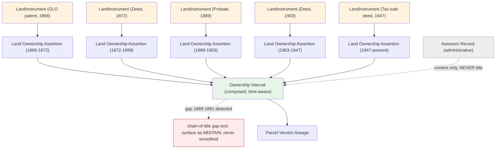
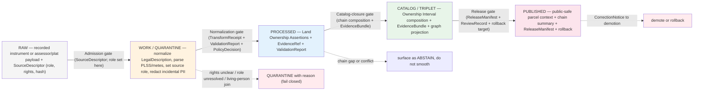

<!-- [KFM_META_BLOCK_V2]
doc_id: kfm://doc/people-dna-land/land-ownership/v1
title: People / DNA / Land — Land Ownership Model
type: standard
version: v1
status: draft
owners: [TODO: People/DNA/Land domain steward] ; [TODO: Land/records source steward] ; [TODO: Docs steward]
created: 2026-06-07
updated: 2026-06-07
policy_label: public
related:
  - ../../doctrine/directory-rules.md            # Directory Rules v1.3
  - ../../../ai-build-operating-contract.md       # CONTRACT_VERSION = "3.0.0"
  - ./README.md
  - ./IDENTITY_MODEL.md
  - ./DATA_LIFECYCLE.md
  - ./DEFINITION_OF_DONE.md
  - ./FILE_SYSTEM_PLAN.md
  - ./EXPANSION_BACKLOG.md
  - ../../standards/PROV.md
  - contracts/people/
  - schemas/contracts/v1/people/
  - policy/sensitivity/people/
tags: [kfm, domain, people, land, ownership, chain-of-title, source-role, governance]
notes:
  - CONTRACT_VERSION = "3.0.0" pinned per ai-build-operating-contract.md v3.0.
  - Repository presence of every cited path is NEEDS VERIFICATION until repo inspection.
  - This document is a domain reference. It is NOT a title opinion, a legal abstract, or a substitute for a licensed title search.
  - SLUG CONFLICT (OQ-LAND-SLUG-01) — docs lane `people-dna-land` is CONFIRMED (Directory Rules v1.3 §6.1/§12); responsibility-root slug is `people` per Atlas §24.13 (self-labeled PROPOSED). Sibling FILE_SYSTEM_PLAN.md uses the §12 `people-dna-land` form for non-docs roots; this doc uses the §24.13 `people` form for continuity with the other siblings. Flagged for one-ADR reconciliation; see §3.
  - Assessor / tax records carry source_role = administrative (Atlas §24.1.1) and NEVER satisfy a title claim; parcel geometry is NOT a title boundary.
[/KFM_META_BLOCK_V2] -->

# People / DNA / Land — Land Ownership Model

> **How KFM represents land instruments, ownership intervals, and chain-of-title reasoning — assertion-first, evidence-bound, source-role-preserving, and explicit that assessor data is not title and parcel geometry is not a boundary.**

[](#0-status--authority)
[](#1-purpose)
[](#0-status--authority)
[](#1-purpose)
[-red)](#8-sensitivity--publication-posture)

> [!CAUTION]
> **KFM land ownership is evidence, not title.** This document describes how KFM *records and reasons about* ownership claims from public instruments. It is **not** a chain-of-title legal opinion and **never** substitutes for a recorded title search by a qualified professional. Two doctrine rules are load-bearing throughout: **assessor / tax records are not title truth** (they are `administrative` source-role), and **parcel geometry is not a title boundary** (it is a spatial version of a record). [DOM-PEOPLE] [ENCY §16.I]

> [!IMPORTANT]
> When this document disagrees with `docs/doctrine/`, accepted ADRs, `contracts/`, `schemas/`, or `policy/`, **those win**. File the disagreement to `docs/registers/DRIFT_REGISTER.md`. No path, field, route, or behavior named here is promoted to repo state by this document.

---

## Mini TOC

- [0. Status & Authority](#0-status--authority)
- [1. Purpose](#1-purpose)
- [2. Scope & Boundary](#2-scope--boundary)
- [3. Repo Fit](#3-repo-fit)
- [4. Ubiquitous Language](#4-ubiquitous-language)
- [5. Source Roles — The Anti-Collapse Spine](#5-source-roles--the-anti-collapse-spine)
- [6. Land Instruments](#6-land-instruments)
- [7. Chain-of-Title & Ownership Intervals](#7-chain-of-title--ownership-intervals)
- [8. Sensitivity & Publication Posture](#8-sensitivity--publication-posture)
- [9. Parcel Geometry vs. Legal Description vs. Title](#9-parcel-geometry-vs-legal-description-vs-title)
- [10. Mineral, Water, and Severed-Estate Interests](#10-mineral-water-and-severed-estate-interests)
- [11. Cross-Domain References](#11-cross-domain-references)
- [12. Pipeline Shape — Land Through the Lifecycle](#12-pipeline-shape--land-through-the-lifecycle)
- [13. Governed AI Behavior for Land](#13-governed-ai-behavior-for-land)
- [14. Validators, Tests, Fixtures](#14-validators-tests-fixtures)
- [15. Anti-Patterns the Model Refuses](#15-anti-patterns-the-model-refuses)
- [16. Open Questions & Verification Backlog](#16-open-questions--verification-backlog)
- [17. Related Docs](#17-related-docs)

---

## 0. Status & Authority

| Field | Value |
|---|---|
| **Document type** | Domain reference (standard doc) |
| **Authority of these rules** | **CONFIRMED doctrine** where derived from Atlas v1.1 Ch. 16 / §24, the Pass-10 Idea Index, Directory Rules v1.3, and the Domain-Driven Design Reference |
| **Authority of repo paths** | **PROPOSED** until verified against mounted repo; **NEEDS VERIFICATION** for every named path |
| **Contract version** | `CONTRACT_VERSION = "3.0.0"` |
| **Domain ownership** | People / Genealogy / DNA / Land (Atlas v1.1 Ch. 16) `[DOM-PEOPLE]` |
| **Responsibility roots** | `schemas/contracts/v1/people/`, `contracts/people/`, `policy/sensitivity/people/` (PROPOSED per Atlas §24.13; conflicts with Directory Rules §12 — see §3 and OQ-LAND-SLUG-01) |
| **Owner (steward)** | *TODO* — domain steward + land/records source steward |
| **Last reviewed** | 2026-06-07 |

> [!NOTE]
> **Truth posture.** No mounted repository, schema, test, or runtime log was inspected in this authoring session. Implementation-depth claims remain **PROPOSED** or **NEEDS VERIFICATION**. Doctrine grounded in attached corpus is **CONFIRMED**.

[↑ Back to top](#mini-toc)

---

## 1. Purpose

This document defines **how KFM names, distinguishes, and reasons about land ownership** within the People / Genealogy / DNA / Land domain. It answers:

1. What land objects does this domain own, and what does each *mean*?
2. How does KFM keep deed/patent/title instruments distinct from assessor/tax compilations and from parcel geometry?
3. How does chain-of-title reasoning compose ownership intervals from instruments — surfacing gaps rather than smoothing them?
4. What land surfaces are public, restricted, or denied by default?

This document **does not**:

- Render a **title opinion** or a marketable-title determination — KFM records evidence; it does not certify title.
- Define field-level schema shape — that lives in `schemas/contracts/v1/people/` (PROPOSED).
- Define publication / sensitivity policy — that lives in `policy/sensitivity/people/` (PROPOSED).
- Authorize any release — promotion is a **governed state transition**, never a model statement.

[↑ Back to top](#mini-toc)

---

## 2. Scope & Boundary

### 2.1 Land objects this domain owns

**CONFIRMED / PROPOSED** (Atlas v1.1 §16.B–C):

`Land Ownership Assertion` · `Deed Instrument` · `Title Instrument` · `Assessor Record` · `TaxRecord` · `Parcel Version` · `Ownership Interval` · `LandParcel` · `LegalDescription` · `LandInstrument`. [DOM-PEOPLE] [ENCY]

### 2.2 What this domain does **not** own

**CONFIRMED / PROPOSED** (Atlas v1.1 §16.B):

- **Parcel base geometry, CRS, GeographyVersions** — owned by **Spatial Foundation**. Land objects *cite* these; they do not own them. The PLSS lattice is the cadastral spine, maintained as a cross-domain join key, not as a People/Land asset.
- **Public Land Records, Land Office Records, county-year land aggregates** — owned by **Frontier Matrix** (Ch. 17). Frontier Matrix explicitly **defers** to this domain on title, parcel, and ownership *decisions*; this domain never edits matrix cells.
- **Place / settlement identity** (townships, county seats, recording jurisdictions as *places*) — owned by **Settlements / Infrastructure**.
- **Agricultural land use / operator context** — owned by **Agriculture**; LandParcel context may bound field-candidate joins, but **private person-parcel joins are denied by default**. [Atlas §24.4.14]

> [!WARNING]
> **The boundary that matters most:** other domains may provide geometry, place names, and aggregates as *context*, but none of them weakens the **title controls** or the **private person-parcel deny-default** owned here. [DOM-PEOPLE] [ENCY §16.B]

[↑ Back to top](#mini-toc)

---

## 3. Repo Fit

**Path (PROPOSED):** `docs/domains/people-dna-land/LAND_OWNERSHIP.md`

Placement justified by Directory Rules v1.3 §6.1 (`docs/domains/<domain>/` is the human-facing domain reference home; `people-dna-land/` named explicitly, CONFIRMED) and §12 (a domain is a **segment** inside responsibility roots, never a root).

> [!WARNING]
> **Responsibility-root slug conflict (OQ-LAND-SLUG-01) — two axes.** (1) **Slug:** docs lane `people-dna-land` is CONFIRMED (Directory Rules §6.1/§12, line 928); the non-docs roots in this doc use `people` per Atlas §24.13, which **self-labels PROPOSED**. (2) **`domains/` segment:** §12 places non-docs lanes under a `domains/` segment (`schemas/contracts/v1/domains/people-dna-land/`); §24.13 omits it (`schemas/contracts/v1/people/`). Directory Rules wins on path conflicts; the sibling `FILE_SYSTEM_PLAN.md` uses the §12 form, while this doc retains the §24.13 `people` form for continuity with the other siblings. The divergence is **surfaced, not smoothed** — logged as one drift item so a single ADR reconciles all lane docs at once. [DIRRULES §6.1/§12] [Atlas §24.13]

[↑ Back to top](#mini-toc)

---

## 4. Ubiquitous Language

**CONFIRMED terms / PROPOSED field realization.** Full per-object semantics live in `contracts/people/` (PROPOSED).

| Term | Definition | Source-role posture |
|---|---|---|
| **LandParcel** | A polygon-bearing land entity whose identity binds to a `GeographyVersion` and a `LegalDescription`. **Geometry is not title.** | Geometry: `observation`/`model`; identity cites Spatial Foundation. |
| **Parcel Version** | A specific version of a LandParcel at a point in cadastral history; a parcel has many versions across subdivisions, mergers, and survey revisions. | Time-bearing Entity. |
| **LegalDescription** | The textual or PLSS-coded boundary statement (metes-and-bounds, lot-block, aliquot). Normalized for hashing; **original text preserved verbatim**. | Value-Object-leaning; the authoritative boundary statement, above geometry. |
| **LandInstrument** | A recorded legal instrument affecting title or rights: patent, deed, mortgage, lien, easement, lease, mineral, water, access, probate. | The *instrument record* is `authority` for its own existence/recording. |
| **Deed Instrument / Title Instrument** | LandInstrument specializations that convey or evidence title interests. | `authority` (recorded); the *derived ownership claim* is an assertion. |
| **Assessor Record / TaxRecord** | Tax-roll and valuation compilations. **Not title.** | **`administrative`** (Atlas §24.1.1) — never collapsed to observation or title. |
| **Land Ownership Assertion** | A cited claim that a Person held a specific *interest* in a specific Parcel Version over a specific *interval*. The atomic unit of chain-of-title reasoning. | `observation`/`assertion`, source-anchored. |
| **Ownership Interval** | A continuous interval composed from one or more Land Ownership Assertions, with **gaps and conflicts surfaced, never smoothed**. | Time-bearing Entity; bitemporal. |

> [!NOTE]
> **Term stability is non-negotiable.** Preserve compound terms exactly: `Parcel Version` (not "parcel record"), `Ownership Interval` (not "ownership period"), `LegalDescription` (not "legal desc"). Renaming to generic vocabulary is a doctrine violation (Directory Rules §13).

[↑ Back to top](#mini-toc)

---

## 5. Source Roles — The Anti-Collapse Spine

**CONFIRMED doctrine** (Atlas §24.1.1): KFM treats **source role** as a first-class identity attribute, **set at admission** in the `SourceDescriptor` and **preserved through every promotion**. Promotion never upgrades a role; that is a separate governed transition. The seven canonical roles are:

| Role | Definition (CONFIRMED) | Land example | Allowed downstream |
|---|---|---|---|
| **observed** | A direct, first-hand evidentiary record tied to place and time. | A surveyor's field measurement; a recorder's contemporaneous entry. | May feed modeled/aggregate; never relabeled regulatory/administrative. |
| **regulatory** | An authoritative determination with legal/administrative force. | A condemnation order; a platting approval; a zoning determination. | Cite as regulatory context; never an "observed" event. |
| **modeled** | A derived product from inputs/assumptions; uncertainty preserved. | A reconstructed parcel boundary from georeferenced plats. | Cite with model identity + run receipt + bounds. |
| **aggregate** | A summary over a unit; individual-record fidelity lost. | County land-value totals; acreage-in-farms by county-year. | Aggregation receipt; never a per-place record. |
| **administrative** | A compiled agency record for administration/registration/accounting — **not** an observation or a regulation. | **Land office tract book; deed index compilation; assessor roll.** | Cite as administrative context; **never collapsed with observation or regulation.** |
| **candidate** | A proposed record awaiting validation/dedup/review. | An unresolved owner-name match; a duplicate parcel candidate. | Candidate evidence in WORK/QUARANTINE only; no PUBLISHED edge without promotion. |
| **synthetic** | Generated by simulation/reconstruction/AI; no first-hand observation. | An AI-drafted chain summary; a reconstructed historical plat scene. | Reality Boundary Note + Representation Receipt; never queried as observed reality. |

### 5.1 The land-specific anti-collapse DENY conditions

**CONFIRMED** (Atlas §24.1.2):

| Collapse pattern | Denied outcome | Required guardrail |
|---|---|---|
| **Administrative compilation cited as observation** (e.g., assessor roll presented as an observed ownership-event timeline). | DENY publication of compilation as observed event timeline. | Source-role tag preserved; named `LifeEvent` / `AdminEvent` types kept distinct. |
| **Aggregate cited as per-place truth** (e.g., county land-value total joined to a single parcel). | DENY join from aggregate cell to single record; ABSTAIN at AI. | Aggregation receipt; geometry-scope guard. |
| **Modeled boundary labeled as observed/surveyed.** | DENY at publication; ABSTAIN at AI. | Run receipt + uncertainty surface + role-preserving DTO field. |
| **Candidate owner-match exposed publicly.** | DENY at trust membrane; route to QUARANTINE. | Promotion gate; no PUBLISHED edge to WORK/QUARANTINE. |

> [!CAUTION]
> **The assessor-as-title collapse is the single most likely land failure mode.** An assessor record names a *taxpayer of record* for a valuation cycle — it is `administrative`, and it is neither title nor an observed conveyance. Treating it as "current owner" or as title evidence fails the `assessor-as-title denial` test (Atlas §16.K) and trips the §24.1.2 administrative-collapse DENY. [DOM-PEOPLE] [ENCY]

[↑ Back to top](#mini-toc)

---

## 6. Land Instruments

### 6.1 Instrument families and their roles

**CONFIRMED / PROPOSED** (Atlas §16.D source family: `patent/deed/mortgage/lien/easement/lease/mineral/water/access/probate instruments`):

| Instrument | What it evidences | Source role of the *record* | Title-bearing? |
|---|---|---|---|
| **Land patent** (federal GLO) | Original transfer of public land to a private party. | `authority` (recorded federal act). | Yes — root of title for patented land. |
| **Deed** | A conveyance of an interest between parties. | `authority` (recorded). | Yes (for the interest conveyed). |
| **Mortgage / lien** | An encumbrance against an interest. | `authority` (recorded). | Encumbrance, not conveyance. |
| **Easement / access** | A non-possessory right over another's land. | `authority` (recorded). | Burdens title; not ownership. |
| **Lease** | A possessory interest for a term. | `authority` (recorded). | Limited interest; not fee. |
| **Mineral / water instrument** | A severed-estate or appropriative right (see §10). | `authority` (recorded) / `regulatory` (appropriation permits). | Severed interest; see §10. |
| **Probate** | Transfer by succession (will/intestacy). | `authority` (court record) / `administrative` (index). | Yes (for the devised/inherited interest). |
| **Assessor / tax roll** | Valuation and taxpayer-of-record. | **`administrative`.** | **No.** |

> [!NOTE]
> **Rights and current terms are NEEDS VERIFICATION per source** (Atlas §16.D). A recorded public instrument is generally public, but recording-jurisdiction rights, redaction obligations (e.g., incidental personal data on plats), and freshness all require per-source review and a `data/registry/sources/people-dna-land/<source-id>.source.yaml` entry. **Sensitive joins fail closed.** [DOM-PEOPLE] [ENCY]

### 6.2 Identity rule for instruments

**PROPOSED** (conforms to the domain identity rule, Atlas §16.E — `source id + object role + temporal scope + normalized digest`, with the deterministic basis labeled PROPOSED and the six-time distinction CONFIRMED):

```text
identity(LandInstrument) = jcs_sha256(
    source_id ⊕ object_role="LandInstrument" ⊕ recording_time ⊕
    JCS( recording_authority, book_page_or_instrument_no, instrument_type, parties_normalized )
)
```

The recorded **book/page or instrument number** plus the **recording authority** anchor the instrument; the `LegalDescription` and parties are part of the canonicalized payload. Canonicalization is **RFC 8785 JCS + SHA-256**, recorded as `jcs:sha256:<hex>` (Pass-10 C1-02).

[↑ Back to top](#mini-toc)

---

## 7. Chain-of-Title & Ownership Intervals

### 7.1 The composition model

Chain-of-title reasoning composes **Ownership Intervals** from **Land Ownership Assertions**, each backed by a `LandInstrument`. The chain is a time-aware graph over a `Parcel Version` lineage.



### 7.2 Gaps and conflicts are surfaced, never smoothed

**CONFIRMED doctrine** (Atlas §16.K — legal-description and chain-of-title gap tests; cite-or-abstain truth posture):

- A **gap** (no instrument linking two adjacent intervals) is **recorded as a gap** in the Ownership Interval and surfaced in viewing products. KFM does **not** fluently invent a conveyance to close it.
- A **conflict** (two instruments asserting incompatible interests for the same period) keeps **both** assertions, links them, and records the dispute. KFM never silently picks a winner.
- When an AI surface is asked to state ownership across a gap or conflict, it **ABSTAINs** rather than asserting continuity. [GAI]

### 7.3 Interests are typed, not flattened

An Ownership Interval composes interests of distinct kinds — fee simple, life estate, undivided fractional, leasehold, mineral, easement-burdened — and **does not flatten them to "owned/not owned."** A mortgage does not transfer ownership; an easement burdens it; a tax sale conveys subject to redemption rights. The model preserves the interest *type* on each Land Ownership Assertion.

> [!WARNING]
> **A chain is not a title opinion.** Even a gapless KFM chain composed entirely from `authority`-role recorded instruments is **evidence about** title, not a determination **of** title. Marketability, priority, and validity are legal conclusions KFM does not render. Viewing products must carry that boundary in plain language. [DOM-PEOPLE]

[↑ Back to top](#mini-toc)

---

## 8. Sensitivity & Publication Posture

### 8.1 Default tiers (CONFIRMED, Atlas §24.5; T0 Open · T1 Generalized · T2 Reviewer · T3 Restricted · T4 Denied)

| Object class | Default tier | Allowed transform | Required gate |
|---|---|---|---|
| **Private person-parcel join** (living person ↔ private parcel) | **T4** | Generalized parcel + de-identified person → **T2 only** | RedactionReceipt + ReviewRecord |
| Historical owner ↔ parcel (deceased, public records) | T1 (with evidence + death-date margin) | n/a | EvidenceBundle + ReleaseManifest |
| Recorded public LandInstrument (patent/deed) | T0 or T1 | Transcription/abstract; preserve sensitive joins as denied | EvidenceBundle + ReleaseManifest |
| Assessor / tax record (administrative) | T1–T2 | UI must label "tax-roll view, not title" | UI policy + label receipt |
| Parcel Version geometry | T1 | Generalized public-safe; never asserted as title | RedactionReceipt or AggregationReceipt |

**CONFIRMED** (Atlas §20.5 Deny-by-Default Register): for People/DNA/Land, *private person-parcel joins* are denied by default and allowed only with **consent + policy + restricted authorized surface**. [DOM-PEOPLE]

### 8.2 Why the private join is T4

Joining a **living** person's identity to a **private** parcel produces a residence-grade disclosure (where someone lives / what they own) with re-identification and safety risk. It is therefore T4 deny-default, demotable to T2 only after generalizing the parcel and de-identifying the person, with a `RedactionReceipt` and `ReviewRecord` (Atlas §24.5.2). The Agriculture cross-edge restates the same rule: `LandParcel` context may bound field-candidate joins, but private person-parcel joins are denied by default (Atlas §24.4.14).

> [!CAUTION]
> **Incidental personal data on instruments and plats.** Historical plats and field notes sometimes carry handwritten personal information. Per the PLSS/plat ingest guidance, a reliable redaction step must run before public release; the redaction is recorded as a receipt. Living-person fields surfaced incidentally fail closed. [PLSS plat-ingest guidance]

[↑ Back to top](#mini-toc)

---

## 9. Parcel Geometry vs. Legal Description vs. Title

Three things are routinely — and wrongly — conflated. The model keeps them distinct:

| Layer | What it is | Authority | Common mistake |
|---|---|---|---|
| **Parcel geometry** | A polygon, often digitized from a county GIS or reconstructed from plats. Cites a `GeographyVersion`. | `observation` / `modeled`; owned (as base geometry) by Spatial Foundation. | Treating the polygon edge as the legal boundary. |
| **LegalDescription** | The textual/PLSS boundary statement of record (metes-and-bounds, aliquot, lot-block). | The authoritative boundary statement, above geometry. | Replacing it with a simplified geometry for "tidiness." |
| **Title** | The legal status of ownership and encumbrances. | A legal conclusion KFM does **not** render. | Reading a gapless chain or an assessor "owner" as title. |

> [!IMPORTANT]
> **Geometry is a representation; the LegalDescription is the record; title is a conclusion.** When geometry and LegalDescription disagree, the LegalDescription governs the *record* and the disagreement is surfaced — geometry is never silently treated as the boundary of record. PLSS is the cadastral spine for alignment, not a per-parcel boundary authority. [DOM-PEOPLE] [ENCY §16.I]

[↑ Back to top](#mini-toc)

---

## 10. Mineral, Water, and Severed-Estate Interests

Land in Kansas is frequently a **severed estate**: surface and minerals owned separately, with appropriative water rights tracked independently.

- **Mineral interests** are conveyed and reserved by their own instruments (mineral deeds, reservations in deeds, leases). A surface-estate chain says nothing authoritative about the mineral estate; the model keeps **separate Ownership Intervals** for severed estates and never infers one from the other.
- **Water rights** are appropriative and administered separately. Per corpus guidance, **water-right identifiers are preserved verbatim**, and documentation must explain the WIMAS / WWC5 distinction. Water-rights data is occasionally restricted; sensitivity-tag where appropriate. A water right attaches to a use/appropriation, not simply to surface ownership. [Pass-23 water-rights card]
- **Access / easement interests** burden a parcel without conveying it; they appear as burdens on the Ownership Interval, not as ownership.

> [!WARNING]
> **Never collapse severed estates.** Asserting that the surface owner "owns the minerals" or "holds the water right" because they hold the surface deed is a source-role/interest-type collapse. Each estate carries its own instruments and its own interval. [DOM-PEOPLE]

[↑ Back to top](#mini-toc)

---

## 11. Cross-Domain References

**CONFIRMED** (Atlas §16.F, §24.4.14): each cross-lane edge must preserve ownership, source role, sensitivity, and EvidenceBundle support.

| Related lane | Relation | Constraint |
|---|---|---|
| **Spatial Foundation** | Parcel geometry, CRS, GeographyVersion, PLSS lattice | Land objects cite geometry; geometry is not title or boundary truth. |
| **Frontier Matrix** | Public Land Records, Land Office Records, county-year land aggregates | Matrix owns the aggregate view; this domain owns title/parcel/ownership decisions; aggregates never join to a single parcel as per-place truth. |
| **Agriculture** | Farm / land-use / operator context | LandParcel context may bound field-candidate joins; **private person-parcel joins denied by default.** |
| **Settlements / Infrastructure** | Recording jurisdictions, townships, county seats as *places* | Place identity owned by Settlements; ownership claims anchor to, never redefine, place. |
| **Archaeology / Cultural Heritage** | Historic land, documentary, cultural-place context | Cultural affiliations cited with rights, sovereignty, steward review. |

[↑ Back to top](#mini-toc)

---

## 12. Pipeline Shape — Land Through the Lifecycle

**CONFIRMED doctrine / PROPOSED lane application** (Atlas §16.H): land follows **RAW → WORK / QUARANTINE → PROCESSED → CATALOG / TRIPLET → PUBLISHED**, promotion as a governed state transition.



> [!IMPORTANT]
> **Source role is set at admission and never edited in place.** A correction produces a **new SourceDescriptor** and a `CorrectionNotice` — never an in-place role edit (Atlas §24.1.3). Assessor records enter as `administrative` and stay `administrative` through every promotion.

[↑ Back to top](#mini-toc)

---

## 13. Governed AI Behavior for Land

**CONFIRMED doctrine / PROPOSED implementation** (Atlas §16.L; `[GAI]`):

| Operation | AI MAY | AI MUST NOT |
|---|---|---|
| Summarize a **released** land EvidenceBundle / chain summary | Yes, with citation | Substitute its summary for the bundle |
| Explain a chain-of-title **gap or conflict** | Yes — describe the gap | Invent a conveyance to close the gap |
| Distinguish assessor data from title | Yes — state the boundary | Present assessor "owner" as title |
| Draft a steward-review note on an instrument under review | Yes | Issue the review itself |
| Operate when evidence is insufficient / chain broken | **ABSTAIN** | Assert continuity or ownership |
| Operate when rights / sensitivity / release state blocks (e.g., private person-parcel) | **DENY** | Bypass via paraphrase |
| Render a title opinion or marketability conclusion | Never | (out of scope; legal conclusion) |

Every Focus Mode answer returns a finite **ANSWER / ABSTAIN / DENY / ERROR** envelope with an `AIReceipt`.

[↑ Back to top](#mini-toc)

---

## 14. Validators, Tests, Fixtures

**PROPOSED** (Atlas §16.K). Presence in the mounted repo is **NEEDS VERIFICATION**.

| Test | What it proves | Status |
|---|---|---|
| **Legal-description normalization tests** | PLSS/metes-and-bounds parsing is deterministic; original text preserved verbatim; normalized form is hash-stable. | PROPOSED |
| **Chain-of-title gap tests** | Gaps between adjacent Ownership Intervals are surfaced as ABSTAIN, never smoothed. | PROPOSED |
| **Chain-of-title conflict tests** | Incompatible instruments for the same period both retained and flagged; no silent winner. | PROPOSED |
| **Assessor-as-title denial** | Assessor/tax (`administrative`) records cannot be cited/rendered/AI-summarized as title. | PROPOSED |
| **Source-role anti-collapse tests** | Administrative→observation, aggregate→per-place, modeled→observed, candidate→PUBLISHED edges all DENY. | PROPOSED |
| **Geometry-role boundary tests** | Parcel geometry not asserted as legal boundary; LegalDescription governs the record. | PROPOSED |
| **Private person-parcel join denial** | Living-person ↔ private-parcel join denied at the trust membrane; T2 only after redaction + review. | PROPOSED |
| **Severed-estate separation tests** | Surface, mineral, and water interests carry distinct intervals; none inferred from another. | PROPOSED |
| **Incidental-PII redaction tests** | Personal data on plats/field notes redacted before public release; redaction receipt emitted. | PROPOSED |

Fixtures (PROPOSED, under `fixtures/domains/people-dna-land/land/`): synthetic patents/deeds with explicit `LegalDescription`; gap and conflict chains; assessor-vs-title negative fixtures; severed-estate cases; PLSS test descriptions; living-person-join negative fixtures. **Synthetic only — no instruments traceable to current owners.**

[↑ Back to top](#mini-toc)

---

## 15. Anti-Patterns the Model Refuses

> [!WARNING]
> - **Assessor record as "current owner" or title.** It is `administrative`; current ownership comes only from a `LandInstrument` chain. (Fails assessor-as-title denial + administrative-collapse DENY.)
> - **Parcel geometry as the legal boundary.** Geometry cites a `GeographyVersion`; the `LegalDescription` is the boundary of record.
> - **Smoothing a chain-of-title gap.** Gaps stay visible and ABSTAIN; KFM never invents a transfer.
> - **Flattening interest types.** A mortgage/easement/lease is not a transfer of ownership; severed estates are not inferred from the surface.
> - **Private person-parcel join on a public surface.** T4 deny-default; T2 only after redaction + review.
> - **Editing source role in place.** Role is set at admission; corrections produce a new SourceDescriptor + CorrectionNotice.
> - **Treating a KFM chain as a title opinion.** Even a gapless chain is evidence about title, not a determination of it.
> - **Mixing `people` and `people-dna-land` slugs across roots.** Use one form per OQ-LAND-SLUG-01; log divergence in `DRIFT_REGISTER.md`.

[↑ Back to top](#mini-toc)

---

## 16. Open Questions & Verification Backlog

**NEEDS VERIFICATION** (Atlas §16.N): each requires mounted repo files, schemas, tests, logs, receipts, or release manifests to settle.

| ID | Item | Evidence that would settle it |
|---|---|---|
| OQ-LAND-01 | Verify land-instrument chain logic (gap surfacing, conflict retention) in implementation. | Chain-of-title tests, fixtures, ValidationReports. |
| OQ-LAND-02 | Verify assessor-as-title denial and source-role anti-collapse enforcement. | Source-role validator, negative fixtures, PolicyDecision logs. |
| OQ-LAND-03 | Verify geometry-role boundary logic (geometry ≠ legal boundary; PLSS as spine, not authority). | Schemas, geometry-role tests, runtime DENY traces. |
| OQ-LAND-04 | LegalDescription parser: PLSS/metes/aliquot coverage, parser-version pin, uncertainty handling. | `contracts/people/LegalDescription.md` + parser tests + version pin. |
| OQ-LAND-05 | Private person-parcel join enforcement (T4 default; T2 redaction path). | `policy/sensitivity/people/`, redaction-receipt verification, no-leak tests. |
| OQ-LAND-06 | Severed-estate handling: separate intervals for surface/mineral/water; verbatim water-right IDs; WIMAS/WWC5 distinction documented. | Severed-estate fixtures + tests; water-rights source descriptors. |
| OQ-LAND-07 | Incidental-PII redaction on plats/field notes before public release. | Redaction pipeline + receipt verification. |
| OQ-LAND-08 | Tax-sale / redemption-right modeling: how redemption windows are represented in an Ownership Interval. | `contracts/people/OwnershipInterval.md` + fixtures. |
| OQ-LAND-09 | Recording-jurisdiction rights review per source (county recorders, BLM GLO). | `data/registry/sources/people-dna-land/` entries + rights review. |
| OQ-LAND-SLUG-01 | Reconcile both axes of the slug conflict (`people-dna-land` §12 vs `people` §24.13; `domains/` segment) and align with sibling FILE_SYSTEM_PLAN.md. | ADR + `DRIFT_REGISTER.md` entry; then align all lane docs. |

[↑ Back to top](#mini-toc)

---

## 17. Related Docs

- `docs/doctrine/directory-rules.md` — Directory Rules v1.3; placement law.
- `ai-build-operating-contract.md` — operating contract v3.0 (`CONTRACT_VERSION = "3.0.0"`).
- `docs/domains/people-dna-land/IDENTITY_MODEL.md` — identity rule, source roles, authority ladder (sibling).
- `docs/domains/people-dna-land/DATA_LIFECYCLE.md` — lifecycle, tiers, receipts (sibling).
- `docs/domains/people-dna-land/DEFINITION_OF_DONE.md` — promotion-readiness checklist (sibling).
- `docs/domains/people-dna-land/FILE_SYSTEM_PLAN.md` — placement-spine (sibling; uses §12 slug form).
- `docs/domains/people-dna-land/EXPANSION_BACKLOG.md` — land work items (C-PDL-05/06, T-PDL-05/06).
- `docs/standards/PROV.md` — provenance vocabulary.
- Atlas v1.1 Ch. 16 — People / Genealogy / DNA / Land Ownership.
- Atlas v1.1 §24.1 — Master Source-Role Anti-Collapse Register.
- Atlas v1.1 §24.5 — Master Sensitivity / Rights Tier Reference.
- `docs/registers/DRIFT_REGISTER.md` · `docs/registers/VERIFICATION_BACKLOG.md`.

---

<sub>**Last reviewed:** 2026-06-07 · **Edition:** v1 (draft) · **CONTRACT_VERSION:** 3.0.0 · **Scope:** evidence about title, not a title opinion · [↑ Back to top](#mini-toc)</sub>
