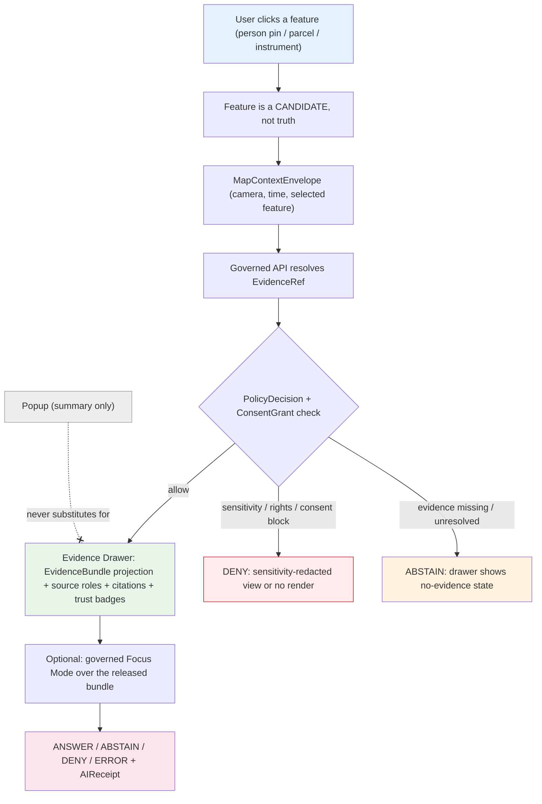

<!-- [KFM_META_BLOCK_V2]
doc_id: kfm://doc/people-dna-land/map-and-viewing-products/v1
title: People / DNA / Land — Map & Viewing Products
type: standard
version: v1
status: draft
owners: [TODO: People/DNA/Land domain steward] ; [TODO: Sensitivity reviewer] ; [TODO: Map/UI steward] ; [TODO: Docs steward]
created: 2026-06-07
updated: 2026-06-07
policy_label: public
related:
  - ../../doctrine/directory-rules.md            # Directory Rules v1.3 (§7.2.a, §11, §12)
  - ../../../ai-build-operating-contract.md       # CONTRACT_VERSION = "3.0.0"
  - ../../architecture/map-shell.md
  - ../../architecture/maplibre-3d.md
  - ./README.md
  - ./IDENTITY_MODEL.md
  - ./LAND_OWNERSHIP.md
  - ./DNA_HANDLING.md
  - ./DATA_LIFECYCLE.md
  - ./FILE_SYSTEM_PLAN.md
  - schemas/contracts/v1/maplibre/
  - policy/sensitivity/people/
tags: [kfm, domain, people, dna, land, viewing-products, maplibre, evidence-drawer, focus-mode, sensitivity]
notes:
  - CONTRACT_VERSION = "3.0.0" pinned per ai-build-operating-contract.md v3.0.
  - Repository presence of every cited path is NEEDS VERIFICATION until repo inspection.
  - MapLibre GL JS is the SOLE browser renderer via packages/maplibre-runtime/ (Directory Rules v1.3 §7.2.a/§11; Cesium retired). The sole-renderer ADR is itself PROPOSED (OPEN-DR-10) — flagged in §3.
  - The eight domain products in §4 are PROPOSED (Atlas §16.G). The six cross-cutting surfaces in §5 are CONFIRMED doctrine (identical across all 16 domain chapters).
  - SLUG CONFLICT (OQ-VIEW-SLUG-01) — docs lane `people-dna-land` CONFIRMED (DIRRULES §6.1/§12); responsibility-root slug `people` per Atlas §24.13 (PROPOSED). Sibling FILE_SYSTEM_PLAN.md uses the §12 form; this doc uses the §24.13 form for continuity. Flagged for one-ADR reconciliation.
  - Consent terms are ConsentGrant + RevocationReceipt.
[/KFM_META_BLOCK_V2] -->

# People / DNA / Land — Map & Viewing Products

> **What this domain renders, how each product clicks through to evidence, and what the trust membrane forbids on every public surface — with living-person, DNA, and private person-parcel content deny-by-default.**

[-1565c0)](#3-rendering-discipline)
[-red)](#6-sensitivity-on-the-surface)

> [!CAUTION]
> **Rendering is not publication, and rendered features are not truth.** A layer toggle is not a release; a popup is not the Evidence Drawer; a rendered feature is a *candidate* whose truth support lives in its `EvidenceBundle`. Living-person identifying output, raw DNA, and private person-parcel joins are **deny-by-default** on every product below. No product relaxes those defaults. [MAP-MASTER] [DOM-PEOPLE] [ENCY §20.5]

> [!IMPORTANT]
> When this document disagrees with `docs/doctrine/`, the MapLibre master doctrine, accepted ADRs, `contracts/`, `schemas/`, or `policy/`, **those win**. File the disagreement to `docs/registers/DRIFT_REGISTER.md`. No product, route, DTO, or behavior named here is promoted to repo state by this document.

---

## Mini TOC

- [0. Status & Authority](#0-status--authority)
- [1. Purpose](#1-purpose)
- [2. Scope & Boundary](#2-scope--boundary)
- [3. Rendering Discipline](#3-rendering-discipline)
- [4. The Eight Domain Viewing Products](#4-the-eight-domain-viewing-products)
- [5. Cross-Cutting Viewing Surfaces](#5-cross-cutting-viewing-surfaces)
- [6. Sensitivity on the Surface](#6-sensitivity-on-the-surface)
- [7. The Seven No-Leak Rules](#7-the-seven-no-leak-rules)
- [8. DTO & Contract Surfaces](#8-dto--contract-surfaces)
- [9. Click-to-Evidence Flow](#9-click-to-evidence-flow)
- [10. Governed AI / Focus Mode on These Products](#10-governed-ai--focus-mode-on-these-products)
- [11. Validators, Tests, Fixtures](#11-validators-tests-fixtures)
- [12. Anti-Patterns the Surface Refuses](#12-anti-patterns-the-surface-refuses)
- [13. Open Questions & Verification Backlog](#13-open-questions--verification-backlog)
- [14. Related Docs](#14-related-docs)

---

## 0. Status & Authority

| Field | Value |
|---|---|
| **Document type** | Domain reference (standard doc) |
| **Authority of these rules** | **CONFIRMED doctrine** where derived from Atlas v1.1 §16.G / §24, the MapLibre Master `[MAP-MASTER]`, the Governed AI dossier `[GAI]`, and Directory Rules v1.3 |
| **Authority of repo paths** | **PROPOSED** until verified against mounted repo; **NEEDS VERIFICATION** for every named path |
| **Contract version** | `CONTRACT_VERSION = "3.0.0"` |
| **Renderer** | MapLibre GL JS, sole browser renderer via `packages/maplibre-runtime/` (Directory Rules v1.3 §7.2.a/§11) |
| **Responsibility roots** | `policy/sensitivity/people/`, `schemas/contracts/v1/people/` (PROPOSED per Atlas §24.13; conflicts with §12 — see §3) |
| **Last reviewed** | 2026-06-07 |

> [!NOTE]
> **Truth posture.** No mounted repository, renderer build, or runtime log was inspected in this authoring session. The eight domain products (§4) are **PROPOSED** (Atlas §16.G). The cross-cutting surfaces (§5) and the no-leak rules (§7) are **CONFIRMED doctrine**. Implementation maturity is **NEEDS VERIFICATION**.

[↑ Back to top](#mini-toc)

---

## 1. Purpose

This document specifies **the viewing products of the People / Genealogy / DNA / Land domain**: what each renders, how each resolves to evidence, and what each must never expose. It answers:

1. Which map and timeline products does this domain offer, and what does each show?
2. How does each product click through to a governed `EvidenceBundle` rather than asserting truth from pixels?
3. How do sensitivity tiers, consent state, and the trust membrane constrain what reaches a public surface?

This document **does not**:

- Define renderer internals — those live in `packages/maplibre-runtime/` and `docs/architecture/maplibre-3d.md`.
- Define sensitivity *policy* — that lives in `policy/sensitivity/people/` and `policy/consent/people/` (PROPOSED).
- Define DTO field shapes — those live in `schemas/contracts/v1/maplibre/` and `schemas/contracts/v1/people/` (PROPOSED).
- Authorize any release — a rendered product is not a published artifact.

[↑ Back to top](#mini-toc)

---

## 2. Scope & Boundary

This domain renders **person, family, life-event, migration, and land** content. It does **not** own:

- The **map shell, base layers, CRS, geometry** — owned by Spatial Foundation + the map-shell architecture.
- **Settlement / place** rendering — owned by Settlements; residence products *anchor to* place, never redefine it.
- **Route / corridor** rendering — owned by Roads/Rail; migration paths *cite* routes, never own them.
- **County-year matrix panels** — owned by Frontier Matrix; demographic aggregates feed cells, this domain does not render the matrix.

Every cross-lane render must preserve ownership, source role, sensitivity, and `EvidenceBundle` support (Atlas §16.F).

[↑ Back to top](#mini-toc)

---

## 3. Rendering Discipline

**CONFIRMED doctrine** (Directory Rules v1.3 §7.2.a / §11; `[MAP-MASTER]`): **MapLibre GL JS is KFM's sole browser-side renderer.** All People/DNA/Land layers render through `packages/maplibre-runtime/`, the single governed renderer adapter. There is no second renderer; 3D (terrain, fill-extrusion, point clouds) is an alternate *rendering mode* inside the one adapter, not an alternate truth path.

- Application/feature code MUST NOT import `maplibre-gl`, `three`, `3d-tiles-renderer`, `deck.gl`, or `maplibre-gl-lidar` directly; all access goes through `packages/maplibre-runtime/`, which enforces admission, attaches evidence references, and emits receipts.
- Every rendered layer consumes the same `EvidenceBundle` and `DecisionEnvelope` as any other surface. **Rendered features are candidates; the EvidenceBundle carries truth support.** `[MAP-MASTER]`
- Each render-frame batch emits a `RepresentationReceipt` (subtype of `RenderReceipt`).

> [!WARNING]
> **Two doctrine items here are themselves PROPOSED-pending-ADR:**
> 1. **Sole-renderer / Cesium-retired** is **PROPOSED** until the renderer-decision ADR is accepted (Directory Rules §18.e **OPEN-DR-10**). This doc treats the sole-renderer layout as the doctrine target.
> 2. **Slug conflict (OQ-VIEW-SLUG-01):** docs lane `people-dna-land` is CONFIRMED (§6.1/§12); the non-docs roots here use `people` (Atlas §24.13, PROPOSED). Sibling `FILE_SYSTEM_PLAN.md` uses the §12 form; this doc uses the §24.13 form for sibling continuity. Surfaced, not smoothed; routed to one ADR + `DRIFT_REGISTER.md`.

[↑ Back to top](#mini-toc)

---

## 4. The Eight Domain Viewing Products

**PROPOSED** (Atlas §16.G, verbatim list): *historical person profile maps; residence/event timelines; migration paths with uncertainty; land parcel context with warnings; chain-of-title summaries; instrument timeline views; restricted DNA/consent review; living-person review.* [DOM-PEOPLE] [ENCY]

| # | Product | What it shows | Default tier | Hard limits |
|---|---|---|---|---|
| **VP-1** | **Historical person profile map** | A deceased person's life events, residences, and land context anchored in space and time, each citing an `EvidenceBundle`. | T1 (deceased, public records, death-date margin) | No living relatives; no DNA; no private person-parcel join. |
| **VP-2** | **Residence / event timeline** | A time-aware strip of `LifeEvent` / `Residence Event` records with map thumbnails and evidence snapshots. | T1 historical / T4 if living | Living-person residence fields **fail closed**; settlement anchoring reads, never rewrites, place. |
| **VP-3** | **Migration paths with uncertainty** | Derived movement between residences rendered **with explicit uncertainty** (uncertainty surface / generalization), never as a precise verified track. | T1 historical | Path is `modeled`/derived — never labeled observed; route geometry cited from Roads/Rail, not owned. |
| **VP-4** | **Land parcel context with warnings** | A parcel's context (Parcel Version geometry + LegalDescription summary) carrying a visible **"geometry is not boundary; assessor is not title"** warning. | T1–T2 | Parcel geometry not asserted as title boundary; assessor (`administrative`) labeled "tax-roll view, not title." |
| **VP-5** | **Chain-of-title summary** | A composed Ownership Interval view; **gaps and conflicts surfaced, never smoothed**; explicitly "evidence about title, not a title opinion." | T1 (public instruments) | No invented conveyance to close a gap; severed estates kept distinct (see LAND_OWNERSHIP.md). |
| **VP-6** | **Instrument timeline view** | A time-ordered strip of `LandInstrument` records (patent → deed → probate → tax sale) each clicking to its recorded source. | T0–T1 (recorded public) | Incidental personal data on plats redacted before public render; recording rights NEEDS VERIFICATION per source. |
| **VP-7** | **Restricted DNA / consent review** | A **restricted, authenticated, steward-only** surface for `DNA Match Evidence` and `ConsentGrant` state. Never a public surface. | **T4 → T3** only under named agreement | No raw segments; no cM/chromosome ranges; render-time consent check blocks revoked/expired display before draw. |
| **VP-8** | **Living-person review** | A **restricted reviewer** surface for adjudicating living-person assertions and consent. | **T4** | Never public; living-person identifying fields never reach a public product. |

> [!NOTE]
> **VP-1 through VP-6 are the public-capable products** (subject to tier + evidence + release). **VP-7 and VP-8 are restricted reviewer surfaces** that exist precisely so sensitive review happens *off* the public path. The first releasable public slice (per EXPANSION_PLAN.md) exercises VP-1, VP-2, VP-5, and VP-6 for a single deceased person.

[↑ Back to top](#mini-toc)

---

## 5. Cross-Cutting Viewing Surfaces

**CONFIRMED doctrine** (Atlas domain callout C2, identical across all 16 chapters; `[MAP-MASTER]` `[GAI]`): every domain — including this one — composes its products from six cross-cutting surfaces.

| Surface | What it does here | Doctrine |
|---|---|---|
| **Evidence Drawer** | The authoritative click-through: resolves a clicked feature to its `EvidenceBundle` projection, source roles, citations, and policy state. A popup may *summarize*; the drawer *resolves*. | CONFIRMED |
| **Time-aware state** | A `valid_time` / `observed_time` scope propagated across map + timeline so VP-2/VP-3/VP-6 stay temporally coherent. The six time dimensions stay distinct (IDENTITY_MODEL.md §8). | CONFIRMED |
| **Trust badges** | Visible annotations of source role, review state, and freshness on a feature — **annotations, not proof substitutes**. | CONFIRMED |
| **Sensitivity-redacted view** | The default public rendering: generalized geometry, k-anonymized overlays, withheld living/DNA fields, each backed by a `RedactionReceipt`. | CONFIRMED |
| **Correction / stale-state view** | Shows when a published claim has been corrected, demoted, or its evidence marked stale (e.g., after a `RevocationReceipt`). | CONFIRMED |
| **Governed Focus Mode** | The bounded AI surface over released evidence; returns a finite `ANSWER / ABSTAIN / DENY / ERROR` envelope with an `AIReceipt`. | CONFIRMED |

> [!IMPORTANT]
> **The popup/drawer split is load-bearing.** A popup is a convenience summary; the **Evidence Drawer is the only surface that resolves evidence and policy state**. A Focus Mode answer is never produced from rendered features alone — rendered features are candidates; the `EvidenceBundle` carries truth support. `[MAP-MASTER]`

[↑ Back to top](#mini-toc)

---

## 6. Sensitivity on the Surface

**CONFIRMED** (Atlas §24.5; §20.5 Deny-by-Default Register). Tiers: T0 Open · T1 Generalized · T2 Reviewer · T3 Restricted · T4 Denied.

| Surface content | Default tier | What the public product shows |
|---|---|---|
| Living-person identifying fields | **T4** | Nothing public; T1 only via tract/county aggregation + `AggregationReceipt`. |
| Raw DNA segments / kit IDs | **T4** | Never rendered anywhere public; restricted steward surface (VP-7) only; T3 under named agreement. |
| Private person-parcel join | **T4** | Parcel context with warnings only; the *living-person ↔ private parcel* join is denied (T2 only after generalized parcel + de-identified person + `RedactionReceipt` + `ReviewRecord`). |
| Living-person residence overlay | **T4** | k-anonymity floor (default k=10 / cell ≈ 500 m / fallback radius ≈ 250 m per DNA_HANDLING.md); below k, server-side fallback or denial. |
| Historical deceased-person fields | T1 (with evidence + death-date margin) | Full profile (VP-1/VP-2). |
| Recorded public instruments | T0–T1 | Transcription/abstract (VP-6); incidental PII redacted first. |

> [!CAUTION]
> **Render-time consent verification blocks the draw.** A revoked, expired, or invalid `ConsentGrant` is treated as **DENY before the layer or drawer renders** — not as a post-hoc filter. Consent failure stops the render. [MAP-MASTER ML-058-034] [GAI]

> [!WARNING]
> **Style-only hiding fails the sensitivity test.** Sensitive geometry hidden only by a MapLibre style filter is still in the tileset and recoverable via devtools or higher zoom. Geoprivacy requires **transformation + RedactionReceipt + policy gate at the tile/data layer**, not a style toggle. [MAP-MASTER]

[↑ Back to top](#mini-toc)

---

## 7. The Seven No-Leak Rules

**CONFIRMED doctrine** (`[MAP-MASTER]`): every product above is bound by these.

| # | Rule | Why |
|---|---|---|
| 1 | AI is interpretive and evidence-subordinate. | Generated text never outranks the `EvidenceBundle`. |
| 2 | No unreleased tile load. | A layer toggle is not publication; unreleased layers do not render. |
| 3 | No sensitive geometry hidden only by style filters. | Geoprivacy requires transformation + redaction receipts + policy gates. |
| 4 | No popup as Evidence Drawer substitute. | A popup summarizes; the drawer resolves evidence and policy state. |
| 5 | No Focus Mode answer from rendered features alone. | Rendered features are candidates; the `EvidenceBundle` carries truth support. |
| 6 | No uncited export or screenshot. | Exports must preserve citation and release context (and pass a `CitationValidationReport`). |
| 7 | Public rendering requires released artifacts. | Released layer + evidence refs + policy label + sensitivity posture + rights status + rollback target. |

[↑ Back to top](#mini-toc)

---

## 8. DTO & Contract Surfaces

**PROPOSED** (object map per `[MAP-MASTER]`; schema home `schemas/contracts/v1/maplibre/` per Directory Rules §6.4/ADR-0001):

| DTO / artifact | Role for these products | Status |
|---|---|---|
| `LayerManifest` | Released layer metadata (IDs, sources, tiles, policy label, time scope, rollback target) for each public product. | PROPOSED |
| `StyleManifest` | Style JSON version + attribute whitelist; prevents label over-density and style drift. | PROPOSED |
| `TileArtifactManifest` | PMTiles/MVT/COG digest + release state + cache invalidation for parcel/migration layers. | PROPOSED |
| `MapReleaseManifest` | Binds layer/style/tile manifests + policy decisions + rollback target; normal UI consumes only released manifests. | PROPOSED |
| `EvidenceBundle` | Canonical evidence support resolved from `EvidenceRef`; **outranks any UI projection**. | CONFIRMED doctrine / PROPOSED schema |
| `EvidenceDrawerPayload` | Governed projection of a clicked feature's evidence, candidate IDs, policy state, citations, errors. | PROPOSED |
| `MapContextEnvelope` | Camera, bounds, zoom, selected layer/version/time, feature candidate — passed to Focus Mode. | PROPOSED |
| `FocusModeRequest` / `FocusModeResponse` | Bounded AI request/finite-outcome response; no direct model or raw-source access. | PROPOSED |
| `AIReceipt` | Provider/model/runtime, context IDs, citation validation, policy decision, finite outcome. | PROPOSED |
| `CitationValidationReport` | Claim↔citation pass/fail, missing/stale evidence; required for exports and Focus Mode. | PROPOSED |
| `RepresentationReceipt` | Emitted by `packages/maplibre-runtime/` after each render-frame batch (layer set, projection, ViewState, redaction transforms). | PROPOSED |
| `RedactionReceipt` | Records the public-safe transform (generalization, k-anonymity, suppression) applied to a sensitive layer. | CONFIRMED object family / PROPOSED schema |

[↑ Back to top](#mini-toc)

---

## 9. Click-to-Evidence Flow

> [!NOTE]
> A click never asserts truth. It selects a **candidate**, builds a `MapContextEnvelope`, resolves the `EvidenceRef` under policy + consent, and only then opens the Evidence Drawer with the governed projection. Sensitivity, rights, or consent blocks short-circuit to a redacted view or no render.

[↑ Back to top](#mini-toc)

---

## 10. Governed AI / Focus Mode on These Products

**CONFIRMED doctrine / PROPOSED implementation** (Atlas §16.L; `[GAI]`):

| On a product, AI MAY | AI MUST NOT |
|---|---|
| Summarize a released VP-1/VP-2/VP-5/VP-6 `EvidenceBundle` with citation | Substitute its summary for the bundle |
| Explain a chain-of-title gap or a migration-path uncertainty | Invent a conveyance or assert a precise track |
| Distinguish assessor data from title in VP-4/VP-5 | Present assessor (`administrative`) as title |
| Draft a steward-review note in VP-7/VP-8 | Issue the review; infer a living-person identity or relationship |
| Operate when evidence is insufficient | Fluently fill the gap → must **ABSTAIN** |
| Operate when sensitivity/rights/consent/release blocks | Bypass → must **DENY** |
| Read released `EvidenceBundle` projections only | Read RAW / WORK / QUARANTINE, or render-answer from features alone |

Every Focus Mode answer returns a finite **ANSWER / ABSTAIN / DENY / ERROR** envelope with an `AIReceipt`; exports additionally require a passing `CitationValidationReport`.

[↑ Back to top](#mini-toc)

---

## 11. Validators, Tests, Fixtures

**PROPOSED** (Atlas §16.K and `[MAP-MASTER]` no-leak suite). Presence in the mounted repo is **NEEDS VERIFICATION**.

| Test | What it proves | Status |
|---|---|---|
| **Side-channel no-leak audit** | No T4 field reaches a label, popup, drawer payload, AI text, layer manifest, or tile across VP-1…VP-8. | PROPOSED |
| **Unreleased-tile-load denial** | A layer toggle cannot load an unreleased tileset. | PROPOSED |
| **Style-only-hiding denial** | Sensitive geometry hidden by style alone fails; transformation + receipt required. | PROPOSED |
| **Render-time consent test** | Revoked/expired/invalid `ConsentGrant` blocks layer/drawer render before draw. | PROPOSED |
| **Popup-vs-drawer test** | Popup never carries evidence/policy resolution that only the drawer may carry. | PROPOSED |
| **Focus-Mode-from-features denial** | A Focus Mode answer cannot be produced from rendered features without an `EvidenceBundle`. | PROPOSED |
| **Migration-uncertainty render test** | VP-3 renders uncertainty; never a precise verified track; `modeled` role preserved. | PROPOSED |
| **Parcel-not-title label test** | VP-4/VP-5 carry the "geometry not boundary / assessor not title" warning. | PROPOSED |
| **k-anonymity floor test** | Living-person overlays render only at/above the k floor; otherwise fallback or denial. | PROPOSED |
| **Uncited-export denial** | Export/screenshot without citation + release context + `CitationValidationReport` is denied. | PROPOSED |
| **Trust-badge accessibility + snapshot** | On-map badges are accessible, keyboard-navigable, and visually regression-tested. | PROPOSED |

[↑ Back to top](#mini-toc)

---

## 12. Anti-Patterns the Surface Refuses

> [!WARNING]
> - **Popup as Evidence Drawer.** A popup summarizes; only the drawer resolves evidence + policy state.
> - **Layer toggle as publication.** Toggling visibility is not a release; unreleased layers do not load.
> - **Style-only geoprivacy.** Hiding sensitive geometry by style filter leaves it in the tileset.
> - **Focus Mode answering from pixels.** Rendered features are candidates; the `EvidenceBundle` carries truth.
> - **Migration path as a verified track.** VP-3 is `modeled`/derived and must render uncertainty.
> - **Parcel polygon as title boundary; assessor as owner.** VP-4/VP-5 carry the "not boundary / not title" warning.
> - **Living-person or DNA field on a public product.** T4 deny-default; VP-7/VP-8 are restricted reviewer surfaces only.
> - **Uncited export.** Exports must preserve citation + release context.
> - **A second renderer or direct renderer-library import in app code.** MapLibre is the sole renderer; all access via `packages/maplibre-runtime/`.
> - **Mixing `people` and `people-dna-land` slugs across roots.** Use one form per OQ-VIEW-SLUG-01; log divergence in `DRIFT_REGISTER.md`.

[↑ Back to top](#mini-toc)

---

## 13. Open Questions & Verification Backlog

**NEEDS VERIFICATION** (Atlas §16.N): each requires mounted repo files, schemas, tests, logs, receipts, or release manifests to settle.

| ID | Item | Evidence that would settle it |
|---|---|---|
| OQ-VIEW-01 | Verify UI/API restricted-field no-leak behavior across all eight products (incl. error messages). | Side-channel audit tests; `EvidenceDrawerPayload` contract tests; AIReceipt evaluator. |
| OQ-VIEW-02 | Verify render-time consent enforcement (revoked/expired `ConsentGrant` blocks draw). | `policy/consent/people/` + render-time consent tests + ML-058-034 binding. |
| OQ-VIEW-03 | Define migration-path uncertainty rendering (uncertainty surface vs generalization) and its `modeled`-role label. | `contracts/people/MigrationEvent.md` + uncertainty render fixtures. |
| OQ-VIEW-04 | Define the parcel "geometry-not-title / assessor-not-title" warning copy and placement. | UI copy spec + `policy/sensitivity/people/` label receipt. |
| OQ-VIEW-05 | Define k-anonymity floor parameters for living-person overlays (k value, cell, fallback). | `policy/sensitivity/people/` + k-anonymity tests (C6-06). |
| OQ-VIEW-06 | Exact governed-API route names for these products (decision envelope, layer manifest, drawer payload, Focus Mode). | `apps/governed-api/` routing manifest (Atlas §16.J marks route TBD). |
| OQ-VIEW-07 | VP-7/VP-8 restricted-surface access model (auth, steward roles, audit). | `policy/` + reviewer SoD (Atlas §24.7) + access logs. |
| OQ-VIEW-08 | Compact event-timeline strip contract for VP-2/VP-6 (ISO time, thumbnails, evidence snapshot, a11y). | Event contract + timeline fixtures (KFM-P16-FEAT-0003). |
| OQ-VIEW-SLUG-01 | Reconcile slug conflict (`people-dna-land` §12 vs `people` §24.13; `domains/` segment) and align with sibling FILE_SYSTEM_PLAN.md. | ADR + `DRIFT_REGISTER.md` entry; then align all lane docs. |
| OQ-VIEW-RENDER-01 | Confirm sole-renderer / Cesium-retired disposition once the renderer-decision ADR lands. | Directory Rules §18.e OPEN-DR-10 acceptance. |

[↑ Back to top](#mini-toc)

---

## 14. Related Docs

- `docs/doctrine/directory-rules.md` — Directory Rules v1.3; §7.2.a sole-renderer, §11 UI/Map roots, §12 placement.
- `ai-build-operating-contract.md` — operating contract v3.0 (`CONTRACT_VERSION = "3.0.0"`).
- `docs/architecture/map-shell.md` · `docs/architecture/maplibre-3d.md` — renderer + 3D feature surface doctrine.
- `docs/domains/people-dna-land/IDENTITY_MODEL.md` — identity, temporal model, governed-AI behavior (sibling).
- `docs/domains/people-dna-land/LAND_OWNERSHIP.md` — chain-of-title, assessor-not-title, parcel-not-boundary (sibling; backs VP-4/VP-5/VP-6).
- `docs/domains/people-dna-land/DNA_HANDLING.md` — DNA restriction, k-anonymity, consent (sibling; backs VP-7).
- `docs/domains/people-dna-land/DATA_LIFECYCLE.md` — tiers, receipts, lifecycle (sibling).
- `docs/domains/people-dna-land/FILE_SYSTEM_PLAN.md` — placement-spine (sibling; uses §12 slug form).
- Atlas v1.1 §16.G — domain viewing products · §16.F cross-lane relations · §24.5 sensitivity tiers · §20.5 deny register.
- `[MAP-MASTER]` MapLibre Master — renderer, Evidence Drawer, Focus Mode, no-leak rules, DTO object map.
- `docs/registers/DRIFT_REGISTER.md` · `docs/registers/VERIFICATION_BACKLOG.md`.

---

**Last reviewed:** 2026-06-07 · **Edition:** v1 (draft) · **CONTRACT_VERSION:** 3.0.0 · **Renderer:** MapLibre (sole) · [↑ Back to top](#mini-toc)
