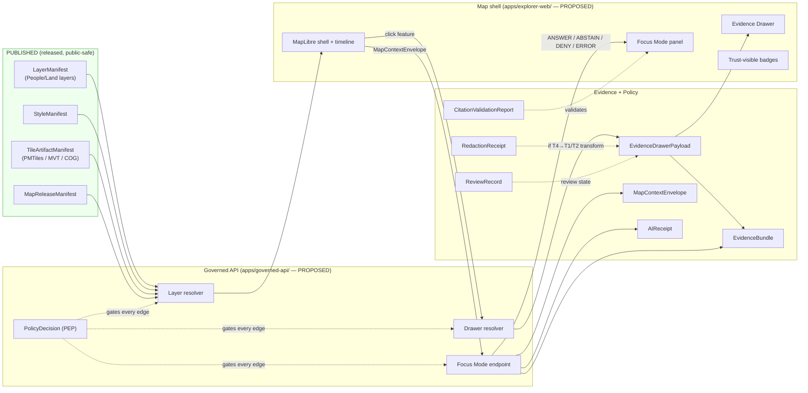

<!-- [KFM_META_BLOCK_V2]
doc_id: kfm://doc/people-dna-land/map-ui-contracts
title: People / DNA / Land — Map & UI Contracts
type: standard
version: v1
status: draft
owners: TBD (People-DNA-Land domain steward; Map/UI steward)
created: 2026-05-19
updated: 2026-05-19
policy_label: public-doctrine
related:
  - docs/architecture/map-shell.md
  - docs/doctrine/trust-membrane.md
  - docs/doctrine/lifecycle-law.md
  - docs/domains/people-dna-land/README.md
  - docs/domains/archaeology/MAP_UI_CONTRACTS.md
  - docs/standards/SENSITIVITY_RUBRIC.md
  - schemas/contracts/v1/map/
  - schemas/contracts/v1/people/
  - policy/sensitivity/people/
  - policy/consent/people/
tags: [kfm, domain, people, dna, land, map, ui, contracts, sensitivity, governance]
notes:
  - All path claims under repo roots are PROPOSED until a mounted repo verifies them.
  - Naming variance for the directory segment `people-dna-land` follows Directory Rules §12 Domain Placement Law.
  - Parallel placement-naming question with OPEN-ENC-04 (per-domain dossier naming alignment).
[/KFM_META_BLOCK_V2] -->

# People / DNA / Land — Map & UI Contracts

> The doctrinal contract surface that any KFM map or UI must satisfy before it can render, click, narrate, or export anything sourced from the **People, Genealogy, DNA, and Land Ownership** domain.

     

**Status:** draft · **Owners:** TBD (domain steward + Map/UI steward) · **Last updated:** 2026-05-19

> [!IMPORTANT]
> This is the **most sensitive consumer-facing surface in KFM**. Living-person fields, raw DNA identifiers, DNA segments, and private person-parcel joins are **denied by default** and may only be exposed through consent-bound, policy-approved, restricted surfaces. A map UI that does not honour every contract in this document is not fit to render People/DNA/Land data.

---

## Contents

- [1. Scope and non-scope](#1-scope-and-non-scope)
- [2. Map & UI contract topology](#2-map--ui-contract-topology)
- [3. Required object families and contracts](#3-required-object-families-and-contracts)
- [4. Domain layer families](#4-domain-layer-families)
- [5. Trust-visible layer states](#5-trust-visible-layer-states)
- [6. Deny-by-default register (this domain)](#6-deny-by-default-register-this-domain)
- [7. Sensitivity tiers and allowed transforms](#7-sensitivity-tiers-and-allowed-transforms)
- [8. Click → Evidence Drawer contract](#8-click--evidence-drawer-contract)
- [9. Focus Mode contract](#9-focus-mode-contract)
- [10. Cross-lane consumption rules](#10-cross-lane-consumption-rules)
- [11. Validation, tests, and fixtures](#11-validation-tests-and-fixtures)
- [12. Open questions and verification backlog](#12-open-questions-and-verification-backlog)
- [13. Related docs](#13-related-docs)

---

## 1. Scope and non-scope

**This document governs (CONFIRMED doctrine):**

- What KFM's Map UI MUST display, hide, redact, or refuse when the underlying object belongs to the People/Genealogy/DNA/Land Ownership domain. `[DOM-PEOPLE]` `[MAP-MASTER]` `[ENCY]`
- Which manifest, evidence, policy, AI-receipt, and release-state contracts are required between the **map shell** and the **governed API** when rendering this domain. `[MAP-MASTER]` `[GAI]` `[ENCY]`
- How each domain object family resolves to a trust-visible UI state via `EvidenceDrawerPayload`, `EvidenceBundle`, and `PolicyDecision`. `[ENCY]` `[GAI]`

**This document does not govern (CONFIRMED scope boundaries):**

- The object model, identity rules, or temporal handling of People/DNA/Land objects themselves — those live in the domain dossier and chapter 16 of the v1.0 Atlas. `[DOM-PEOPLE]` `[ENCY]`
- The renderer, the tile pipeline, or the style engine — those are defined in the MapLibre master and the shared map shell. `[MAP-MASTER]`
- Schema files, contract Markdown, policy bundles, or test fixtures — those live under `schemas/`, `contracts/`, `policy/`, `tests/`, and `fixtures/` as PROPOSED `[DIRRULES]`. This doc is the **explanation**; those roots are the **enforcement**.

> [!NOTE]
> Throughout this doc, **CONFIRMED** means doctrine grounded in attached project sources; **PROPOSED** means an implementation path, route, schema home, or behaviour not yet verified against a mounted repository; **NEEDS VERIFICATION** means a checkable item explicitly carried into §12.

[↑ Back to top](#contents)

---

## 2. Map & UI contract topology

The map UI never reads canonical or internal stores. It reads only **released** artifacts through a **governed API**, and every consequential claim resolves to an `EvidenceBundle` before display. `[MAP-MASTER]` `[GAI]` `[DIRRULES]`



> [!CAUTION]
> The shell MUST NOT read `data/raw/`, `data/work/`, `data/quarantine/`, candidate releases, raw model output, or unreleased tile URLs. The **trust membrane** is what makes the map safe to publish. `[DIRRULES]` `[MAP-MASTER]`

[↑ Back to top](#contents)

---

## 3. Required object families and contracts

Every People/DNA/Land map surface MUST resolve these object families before exposing any feature, drawer payload, AI answer, or export. **Field shapes shown are reproduced from the MapLibre master where confirmed; schema homes are PROPOSED per Directory Rules §6.4 and ADR-0001.** `[MAP-MASTER]` `[ENCY]` `[DIRRULES]`

| Family | Purpose for this domain | Key fields (CONFIRMED from MapLibre master) | Schema home (PROPOSED) |
|---|---|---|---|
| `SourceDescriptor` | Names the upstream record family (vital, census, GEDCOM, DNA vendor, deed, plat, assessor, …) and its rights/sensitivity posture. | `source_id`, source role, rights, sensitivity, citation, time, hash. | `schemas/contracts/v1/sources/source_descriptor.schema.json` |
| `LayerManifest` | Binds a People/Land UI layer to governed source/evidence/policy semantics. | `layer_id`, `title`, `geometry_type`, `source_id`, `source_layer`, `evidence_ref_field`, `temporal_fields`, `policy_label`, `release_state`. | `schemas/contracts/v1/map/layer_manifest.schema.json` |
| `StyleManifest` | Controls style identity, sprites, glyphs, design tokens for People/Land overlays. | `style_id`, `version`, `style_json_url`, `sprites`, `glyphs`, `style_digest`, `layer_ids`, `release_id`. | `schemas/contracts/v1/map/style_manifest.schema.json` |
| `TileArtifactManifest` | Binds PMTiles / MVT / COG / MBTiles bytes for People/Land layers to digests and rollback targets. | `artifact_id`, `type`, `url`, `digest`, `zooms`, `bounds`, `format`, `source_layers`, `metadata`, `range_required`, `cors_required`. | `schemas/contracts/v1/map/tile_artifact_manifest.schema.json` |
| `MapReleaseManifest` | Coordinates the released set of People/Land layers/styles/tiles plus rollback target. | `release_id`, `layer_manifests`, `style_manifest`, `tile_artifacts`, `release_time`, `supersedes`, `rollback_target`, `cache_keys`. | `schemas/contracts/v1/map/map_release_manifest.schema.json` |
| `EvidenceBundle` | Truth-bearing evidence package — outranks any rendered feature, popup, or generated language. | `bundle_id`, `source_refs`, `claims`, `citations`, `spec_hash`, `rights_status`, `sensitivity`, `limitations`, `receipts`. | `schemas/contracts/v1/evidence/evidence_bundle.schema.json` |
| `EvidenceDrawerPayload` | What the Drawer shows when a user clicks a People/Land feature. | `feature_id`, `layer_id`, `evidence_bundle_refs`, source summary, citations, policy state, release state, limitations. | `schemas/contracts/v1/ui/evidence_drawer_payload.schema.json` |
| `MapContextEnvelope` | Bounded map context the shell sends to governed API / Focus Mode. | `visible_layers`, `bounds`, `zoom`, `pitch`, `bearing`, `filters`, `time_window`, `selected_features`, `evidence_refs`. | `schemas/contracts/v1/ui/map_context_envelope.schema.json` |
| `FocusModeRequest` / `FocusModeResponse` | Structured request/response for governed AI synthesis over the People/Land map. | request: `question`, `map_context_envelope`, `evidence_refs`, `policy_context`, `user_role`. response: `outcome`, `answer`, `citations`, `abstain_reason`, `deny_reason`, `evidence_used`, `policy_decisions`, `ai_receipt_id`. | `schemas/contracts/v1/ai/focus_mode_*.schema.json` |
| `PolicyDecision` | The allow/deny/abstain/restrict verdict that gates every edge in §2. | `decision_id`, `input_ref`, `policy_id`, `outcome`, `obligations`, `reasons`, `timestamps`, `reviewer`. | `schemas/contracts/v1/policy/policy_decision.schema.json` |
| `PromotionDecision` | Governed state transition into release for People/Land artifacts. | `promotion_id`, `candidate_ref`, `gates`, `outcome`, `reviewer`, `rollback_target`, `reasons`. | `schemas/contracts/v1/release/promotion_decision.schema.json` |
| `CitationValidationReport` | Cite-or-abstain gate before any drawer/export/AI display. | `report_id`, `answer_id`, `citation_refs`, `resolved`, `missing`, `unsupported`, `verdict`. | `schemas/contracts/v1/evidence/citation_validation_report.schema.json` |
| `AIReceipt` | Audit trail for any Focus Mode call over this domain. | `receipt_id`, `model_provider`, `model_id`, `context_hash`, `evidence_ids`, `citation_report_id`, `policy_ids`, `runtime`, `outcome`. | `schemas/contracts/v1/ai/ai_receipt.schema.json` |
| `RunReceipt` | Watcher/run evidence for any People/Land source refresh feeding the layer. | source URL, ETag, `spec_hash`, artifacts, provider. | `schemas/contracts/v1/source/run_receipt.schema.json` |
| `RedactionReceipt` | Record of any field- or geometry-level transform applied to People/Land data before release. | (CONFIRMED object family; field shape NEEDS VERIFICATION) | `schemas/contracts/v1/governance/redaction_receipt.schema.json` |
| `ReviewRecord` | Steward / rights-holder / consent review record required for any tier-down motion. | (CONFIRMED object family; field shape NEEDS VERIFICATION) | `schemas/contracts/v1/governance/review_record.schema.json` |
| `RollbackCard` | The reversible release pointer a People/Land `MapReleaseManifest` MUST carry. | (CONFIRMED object family; field shape NEEDS VERIFICATION) | `schemas/contracts/v1/release/rollback_card.schema.json` |

> [!NOTE]
> **PROPOSED schema home.** Per Atlas v1.1 §24.13, the People/DNA/Land lane lives under `schemas/contracts/v1/people/`, `contracts/people/`, `policy/sensitivity/people/`, and `policy/consent/people/`. Confirmation of these specific paths requires a mounted repo and ADR per Directory Rules §2.4 / §6.4. `[DIRRULES]`

[↑ Back to top](#contents)

---

## 4. Domain layer families

The domain's published viewing products (PROPOSED per `[DOM-PEOPLE]` Atlas §16.G) map to the following Map UI layer families. Each row names the layer family, what it can render, and the **default sensitivity tier** that gates publication.

| Layer family | What it renders | Domain object basis (CONFIRMED owned by People/DNA/Land) | Default tier (PROPOSED) | Public-safe form (PROPOSED) |
|---|---|---|---|---|
| **Historical person profile map** | Anchor points / arcs for a single deceased subject across time. | Person Assertion, PersonCanonical, NameAssertion, LifeEvent | **T1** if all anchors are deceased and rights-clear; **T4** if any anchor implicates a living person. | Generalized point + Evidence Drawer citation. |
| **Residence / event timeline (map-linked)** | Time-sliced points for residence and life events. | Residence Event, LifeEvent | **T1** for deceased; **T4** for living. | Tract-/county-aggregated when any subject is living; deceased points only at native precision. |
| **Migration path layer** | Arcs between residence anchors with uncertainty. | Migration Event | **T1** when endpoints are deceased and well-sourced; **T4** otherwise. | Uncertainty cone rendered, not a deterministic line. |
| **Land parcel context layer** | Historical parcel polygons with title-status warnings. | Parcel Version, Ownership Interval, LegalDescription | **T1** when geometry is from public cadastral/PLSS sources and parties are deceased. | Warning chip: *“Parcel geometry is reconstructed; not survey truth.”* |
| **Chain-of-title summary panel** | Ordered list of instruments transferring an Ownership Interval. | Deed Instrument, Title Instrument, Land Ownership Assertion, Ownership Interval | **T1** when all parties are deceased and rights-clear. | Instrument timeline only; no person-parcel join when any party is living. |
| **Instrument timeline view** | Per-parcel deed/probate/mortgage timeline. | Deed Instrument, Title Instrument, Assessor Record, TaxRecord, LandInstrument | **T1–T2** depending on instrument type and party status. | Assessor/tax data MUST carry an *“assessor is not title”* annotation. |
| **Restricted DNA / consent review surface** | Internal steward surface for DNA evidence triage. | DNA Match Evidence, DNASegment, DNAKitToken, Relationship Hypothesis | **T3 / T4 (restricted authorized surface only)**. | Never public; named-consent-bound; raw IDs never logged. |
| **Living-person review surface** | Internal steward surface for living-person assertions awaiting consent or aggregation. | Person Assertion (living), Genealogy Relationship (involving living), FamilyGroup (with living members) | **T2 / T3 (reviewer / restricted)**. | Never published in identifying form. |

> [!WARNING]
> Style filters are **not** a privacy mechanism. Sensitive geometry MUST be transformed (generalized, aggregated, or withheld) before rendering, not merely hidden by a layer toggle or style expression. A layer that hides sensitive points behind opacity is treated as a leak. `[MAP-MASTER]` `[DOM-PEOPLE]`

[↑ Back to top](#contents)

---

## 5. Trust-visible layer states

Map trust state is first-class layer metadata, generated from evidence, policy, release, source-currentness, and artifact integrity — not painted on by hand. `[MAP-MASTER]` `[ENCY]`

| State | Meaning (PROPOSED vocabulary) | Required UI signal | Map UI behaviour for People/DNA/Land |
|---|---|---|---|
| `verified` | Manifests resolve, evidence closure passes, policy allows, release current. | Default rendering with trust badge. | Render normally; click resolves to Drawer. |
| `degraded` | Layer loads but a non-blocking gate is amber (e.g., one source stale). | Visible badge; Drawer explains degradation. | Render with warning chip; AI may answer with `degraded` flag. |
| `stale` | Source-watch cadence exceeded for one or more upstream sources. | Stale badge; cache age visible. | Render permitted; Focus Mode SHOULD abstain on time-sensitive claims. |
| `quarantined` | Underlying source or artifact is held; not eligible for public layer. | Layer hidden from public catalog. | NEVER rendered in the public shell. |
| `needs review` | Awaiting steward / rights-holder / consent reviewer. | Layer absent from public catalog; reviewer surface only. | Visible only on the restricted review surface. |
| `denied` | PolicyDecision = DENY (rights, sensitivity, release, or consent missing). | Layer absent or replaced with denial chip with reason. | NEVER rendered; if the user requested it, surface the deny reason. |
| `error` | Artifact verification failed (digest, signature, citation closure). | Fail-closed; visible error chip with reason. | Do not render the layer; show error state. |
| `unverified` | Verification not yet executed in this session. | Treated as not-yet-trusted. | Behave as `denied` until verification completes. |

The trust-state vocabulary above is **PROPOSED** and should be shared across API, UI, and release manifests; harmonising the exact enum is tracked in §12. `[KFM-P1-FEAT-0044]`

[↑ Back to top](#contents)

---

## 6. Deny-by-default register (this domain)

The People/DNA/Land row of the deny-by-default register, **reproduced verbatim from Atlas v1.0 §20.5 / Atlas v1.1 §24.5** as CONFIRMED doctrine. `[DOM-PEOPLE]` `[ENCY]`

| Surface | **Denied by default** | Allowed **only when** | Citation |
|---|---|---|---|
| People/DNA/Land map layers | living-person private output, raw DNA ids, DNA segments, private person-parcel joins | consent + policy + restricted authorized surface | `[DOM-PEOPLE]` |
| Evidence Drawer (this domain) | exposing living-person identifying fields, raw DNA segment data, kit/vendor IDs | consent token resolves AND PolicyDecision = ALLOW AND surface is restricted | `[DOM-PEOPLE]` `[GAI]` |
| Focus Mode (this domain) | answering on living persons or DNA-derived identity claims | citations resolve AND policy allows AND the answer is bounded to deceased / aggregated subjects | `[GAI]` `[DOM-PEOPLE]` |
| Map export / screenshot | exporting any frame that contains denied content | RedactionReceipt + ReviewRecord + PolicyDecision | `[MAP-MASTER]` `[ENCY]` |
| Graph projection on public surface | projecting living-person or DNA edges into public graph views | PolicyDecision + aggregation/de-identification with RedactionReceipt | `[DOM-PEOPLE]` `[ENCY]` |

> [!IMPORTANT]
> **Assessor and tax records are not title truth.** A parcel polygon, however precisely drawn, does not establish ownership; a chain-of-title summary requires resolved Deed / Title Instruments. The Map UI MUST surface this distinction at every relevant layer. `[DOM-PEOPLE]`

[↑ Back to top](#contents)

---

## 7. Sensitivity tiers and allowed transforms

Tiers follow the Master Sensitivity / Rights Tier Reference in Atlas v1.1 §24.5. Reproduced rows are CONFIRMED doctrine; transform mechanisms specific to this domain are PROPOSED.

| Domain / object class | Default tier | Allowed transforms (PROPOSED) | Required gates | Citation |
|---|---|---|---|---|
| People/DNA — living-person fields | **T4** | Aggregation by tract or county + `AggregationReceipt` → **T1** | Consent or aggregation gate + `ReviewRecord` | `[DOM-PEOPLE]` |
| People/DNA — raw DNA segment data | **T4** | No transform releases this to a public tier; **T3** only under explicit research agreement | Named consent + `ReviewRecord` + `PolicyDecision` | `[DOM-PEOPLE]` |
| People/Land — private person-parcel join | **T4** | Generalized parcel + de-identified person → **T2** only | `RedactionReceipt` + `ReviewRecord` | `[DOM-PEOPLE]` |
| People — deceased person assertion (rights-clear) | **T1** | Direct render after evidence + release | `EvidenceBundle` closure + `ReleaseManifest` | `[DOM-PEOPLE]` `[ENCY]` |
| Land — historical parcel geometry (public cadastral) | **T1** | Direct render with title-truth warning | `EvidenceBundle` closure + `ReleaseManifest` | `[DOM-PEOPLE]` `[ENCY]` |

**Tier transitions (CONFIRMED, from Atlas §24.5.3):** every motion from a higher tier toward T0/T1 requires a paired artifact and reviewer, and is reversible via `CorrectionNotice` / `RollbackCard`. Specifically for this domain:

- **T4 → T3** requires `PolicyDecision` + `ReviewRecord` + named agreement (with rights-holder where applicable).
- **T4 → T2** requires `PolicyDecision` + `ReviewRecord` (steward).
- **T4 → T1** requires `RedactionReceipt` + `ReviewRecord` (steward).
- **T1 → T0** requires `ReleaseManifest` + `ReviewRecord` (steward + release authority).

<details>
<summary><strong>Geoprivacy mechanism reference (CONFIRMED from Pass-10 dossier)</strong> — k-anonymity and consent tokens</summary>

The Pass-10 corpus develops two named mechanisms relevant to this domain:

- **k-anonymity for living-people overlays.** Default profile `density_k_anonymity_grid` with `k=10`, `cell_m=500`, and a fallback `radius_mask` at 250 m. Living-people overlays render only when at least *k* individuals fall in a cell; otherwise a server-side radius mask is applied. The PDP evaluates an OPA gate that allows clear views only when the JWT is valid, embargo has passed, the consent token is unrevoked, scopes match, and either *k* is met or the fallback mask was applied. `[KFM-Pass-10 C6-06]` Status: **CONFIRMED doctrine / PROPOSED implementation.**
- **Compact consent tokens.** Consent is expressed as a short-lived signed token (JWT or GA4GH-style visa) carrying scopes, audience, expiry, `revocation_endpoint`, `consent_history_hash`, and a `redaction_profile` reference. The token travels with the data and is checked on every render; the PDP introspects the token's revocation endpoint on every access decision and fails closed when introspection cannot be completed. `[KFM-Pass-10 C6-07]` Status: **CONFIRMED doctrine / PROPOSED implementation.**

These mechanisms are referenced here as the dominant geoprivacy and consent patterns identified by the corpus for living-people overlays; their exact bundle paths, OPA rule names, and runtime locations remain NEEDS VERIFICATION.

</details>

[↑ Back to top](#contents)

---

## 8. Click → Evidence Drawer contract

A click on any People/DNA/Land feature MUST resolve through the Drawer pipeline below before any consequential UI claim is shown. Map popups MAY display a brief label as a cue, but a popup MUST NOT substitute for the Drawer when the claim is consequential. `[ML-059-061]` `[KFM-P1-FEAT-0065]`

```mermaid
sequenceDiagram
  autonumber
  participant U as User
  participant S as Map shell
  participant G as Governed API (drawer resolver)
  participant P as PolicyDecision (PEP)
  participant E as EvidenceBundle store
  participant D as Evidence Drawer

  U->>S: Click feature (layer_id, feature_id)
  S->>G: Request EvidenceDrawerPayload (feature_id, layer_id, MapContextEnvelope)
  G->>P: Evaluate policy<br/>(rights, sensitivity, release, consent)
  alt PolicyDecision = ALLOW
    G->>E: Resolve EvidenceBundle refs
    E-->>G: EvidenceBundle (+ limitations)
    G-->>S: EvidenceDrawerPayload (ANSWER)
    S->>D: Render citations, source, sensitivity, release state
  else PolicyDecision = ABSTAIN
    G-->>S: EvidenceDrawerPayload (ABSTAIN + reason)
    S->>D: Render abstain card with reason
  else PolicyDecision = DENY
    G-->>S: EvidenceDrawerPayload (DENY + reason)
    S->>D: Render denial chip with reason
  else PolicyDecision = ERROR
    G-->>S: EvidenceDrawerPayload (ERROR + reason)
    S->>D: Render error state; fail closed
  end
```

**Drawer payload requirements (CONFIRMED doctrine):**

- The Drawer MUST surface: source summary, citations, policy state, release state, sensitivity, and limitations. `[ML-N-070]` `[ML-N-071]` `[ML-N-072]` `[ML-N-073]`
- The Drawer MUST NOT hide an abstention from a review or stewardship surface. `[ML-N-069]`
- Unresolved evidence roles MUST show abstention reason rather than a fabricated answer. `[ML-N-073]`
- Composed claims (e.g., chain-of-title) need drawer role groups for each required `EvidenceRef`. `[ML-N-074]`
- Tiles MUST link to source, license, and receipt in the Drawer. `[ML-N-071]`
- For deceased subjects with full evidence closure: Drawer renders citations and lets the user follow into the underlying source.
- For living-subject features that somehow reach a public layer: Drawer renders **DENY** with the policy reason — the layer should not have been rendered in the first place (see §6).

[↑ Back to top](#contents)

---

## 9. Focus Mode contract

Focus Mode is governed AI bounded to released evidence. It MUST answer only when the citations resolve and policy allows; otherwise it abstains, denies, or errors. There is no fifth outcome. `[GAI]` `[MAP-MASTER]`

**Inputs (CONFIRMED required):**

- `FocusModeRequest` carrying `question`, `MapContextEnvelope`, `evidence_refs`, `policy_context`, `user_role`.
- The `MapContextEnvelope` MUST be bounded: only visible layers, current bounds, current zoom/pitch/bearing, current filters, current time window, and currently selected features — never the canonical store, never raw model output. `[MAP-MASTER]`

**Outputs (CONFIRMED required envelope):**

- `FocusModeResponse` with finite `outcome` in `{ANSWER, ABSTAIN, DENY, ERROR}`, plus `citations`, optional `abstain_reason` / `deny_reason`, `evidence_used`, `policy_decisions`, and an `ai_receipt_id`. `[MAP-MASTER]`
- A `CitationValidationReport` MUST pass before any ANSWER is rendered. `[MAP-MASTER]` `[ML-064-054]`
- An `AIReceipt` MUST be created for every call; private reasoning is not stored. `[GAI]`

**Domain-specific behaviour (PROPOSED from `[DOM-PEOPLE]` §L; CONFIRMED doctrinally):**

- AI MAY summarize released People/DNA/Land `EvidenceBundle`s, compare evidence, explain limitations, and draft steward-review notes.
- AI MUST **ABSTAIN** when evidence is insufficient (e.g., chain-of-title gap, missing instrument, ambiguous identity candidate).
- AI MUST **DENY** when policy, rights, sensitivity, or release state blocks the request — including any prompt that requests living-person identification, DNA segment-derived relationship inference for non-consented subjects, or private person-parcel joins.
- AI MUST NOT override CARE labels, sovereignty tags, or consent revocations. `[ML-064-105]`
- Focus Mode MAY summarize evidence with sensitive coordinates only when the response itself does not expose them; otherwise generalize or DENY. `[ML-064-067]`

> [!CAUTION]
> Generated language is not evidence. A Focus Mode answer never outranks an `EvidenceBundle`, a `PolicyDecision`, or a `ReleaseManifest`. If a fluent answer disagrees with the evidence, the answer is wrong. `[GAI]` `[ENCY]`

[↑ Back to top](#contents)

---

## 10. Cross-lane consumption rules

People/DNA/Land **consumes from** other domains under named relations; the constraint on every edge is that ownership, source role, sensitivity, and EvidenceBundle support are preserved. `[DOM-PEOPLE]` Atlas §16.F / §24.4.14.

| This domain consumes from | Relation (CONFIRMED doctrine) | Map UI constraint |
|---|---|---|
| Settlements / Infrastructure | residence, cemetery, school, court, county, township, place relation | Residence events anchor settlement membership; **living-person fields fail closed.** `[DOM-SETTLE]` `[DOM-PEOPLE]` |
| Roads / Rail / Trade Routes | migration, access, movement | Migration paths render with uncertainty; movement claims require source-role traceability. `[DOM-ROADS]` `[DOM-PEOPLE]` |
| Archaeology / Cultural Heritage | historic person, land, documentary, cultural-place context | Indigenous community context is **steward-reviewed and rights-bounded**; cultural affiliations cited with sovereignty review. `[DOM-ARCH]` `[DOM-PEOPLE]` |
| Agriculture | farm, land use, producer-adjacent context with privacy | LandParcel context may bound field-candidate joins; **private person-parcel joins denied by default.** `[DOM-AG]` `[DOM-PEOPLE]` |
| Frontier Matrix | aggregated population observations feed matrix cells | Matrix cells are **analytical releases with their own evidence and rollback**; this domain does not edit cells. `[UNIFIED]` |
| Spatial Foundation | CRS, GeographyVersion, projection, generalization | All People/Land map products carry a `GeographyVersion`. `[MAP-MASTER]` |
| Planetary / 3D | 3D rendering of generalized parcel / settlement context | 3D scenes carry a Reality Boundary Note; **sensitive content denied.** `[MAP-MASTER]` `[UIAI]` |

[↑ Back to top](#contents)

---

## 11. Validation, tests, and fixtures

Every Map UI surface that claims to implement these contracts MUST pass the validation set below. Domain-specific items are reproduced from `[DOM-PEOPLE]` §K; cross-cutting items from the MapLibre master. All items are PROPOSED until the mounted-repo presence of the corresponding test/fixture is verified.

**People/DNA/Land-specific validators (PROPOSED, from `[DOM-PEOPLE]` §K):**

- Person assertion evidence tests.
- GEDCOM import rights / living-flag tests.
- DNA consent and raw-ID no-log tests.
- Revocation cleanup tests.
- Legal-description and chain-of-title gap tests.
- Assessor-as-title denial tests.
- Graph projection safety tests (no living-person edges leak into public projection).

**Cross-cutting map/UI validators (CONFIRMED required, from MapLibre master):**

- Schema validation for every manifest in §3.
- No public RAW / WORK / QUARANTINE path.
- No unreleased tile load.
- Proof / signature checks on tile artifacts.
- Source-layer validity.
- Range / CORS / CDN probes.
- Visual regression for every released style.
- Keyboard accessibility and alt-text for Drawer media. `[ML-064-091]`
- Focus Mode cite / abstain / deny fixtures.
- Rollback restore.
- Cache invalidation record checks.
- Click-to-EvidenceBundle resolution tests.
- Sensitive geometry denial fixtures.

> [!NOTE]
> Test paths (`tests/domains/people/...`, `fixtures/domains/people/...`) and policy bundle paths (`policy/sensitivity/people/...`, `policy/consent/people/...`) follow Directory Rules §6 lane patterns and Atlas §24.13. They are **PROPOSED** until repo evidence confirms presence and naming.

[↑ Back to top](#contents)

---

## 12. Open questions and verification backlog

The items below are checkable but unverified in this docs-only session. Each is mirrored into the project's `docs/registers/VERIFICATION_BACKLOG.md` per Directory Rules §2.5 / §4.5.

| ID | Question | Evidence that would settle it | Status |
|---|---|---|---|
| OPEN-PDL-MUI-01 | Does the repo enforce living-person policy at every UI/API edge for this domain? | mounted repo policy bundles, OPA tests, route tests | NEEDS VERIFICATION `[DOM-PEOPLE]` §N |
| OPEN-PDL-MUI-02 | How is DNA consent / revocation enforced end-to-end, and where do receipts live? | consent token introspection logic, revocation tests, receipt manifests | NEEDS VERIFICATION `[DOM-PEOPLE]` §N |
| OPEN-PDL-MUI-03 | What is the land-instrument chain logic, and how is a chain-gap surfaced in the Drawer? | chain-of-title resolver code, fixtures, drawer fixture tests | NEEDS VERIFICATION `[DOM-PEOPLE]` §N |
| OPEN-PDL-MUI-04 | Where is the geometry-role boundary (parcel-context vs title-truth) drawn at runtime? | resolver code, layer manifests, drawer assertions | NEEDS VERIFICATION `[DOM-PEOPLE]` §N |
| OPEN-PDL-MUI-05 | Does the UI / API restricted-field no-leak behaviour actually hold under negative fixtures? | negative-fixture tests, route tests, drawer tests | NEEDS VERIFICATION `[DOM-PEOPLE]` §N |
| OPEN-PDL-MUI-06 | What is the canonical trust-state vocabulary shared across API, UI, and release manifests? | enum source-of-truth (schema, ADR) | NEEDS VERIFICATION `[KFM-P1-FEAT-0044]` |
| OPEN-PDL-MUI-07 | What minimum fields must `EvidenceDrawerPayload` expose for each People/Land artifact family? | schema, fixtures, Drawer renderer | NEEDS VERIFICATION `[KFM-P1-FEAT-0065]` |
| OPEN-PDL-MUI-08 | What consent schema reconciles JWT, GA4GH Passport, OAuth introspection, and revocation endpoints? | consent envelope schema + ADR | NEEDS VERIFICATION `[KFM-P1-IDEA-0033]` |
| OPEN-PDL-MUI-09 | Is `k=10, cell_m=500, radius_mask=250m` the right default for living-people overlays in Kansas? | PDP fixtures, density studies, policy review | NEEDS VERIFICATION `[KFM-Pass-10 C6-06]` |
| OPEN-PDL-MUI-10 | Naming variance — `people-dna-land` vs alternative compound names elsewhere in the corpus. Parallel to OPEN-ENC-04. | ADR per Directory Rules §2.4 / §6.1 | NEEDS VERIFICATION |

[↑ Back to top](#contents)

---

## 13. Related docs

Most links below are **placeholder targets** pending repo verification (paths are CONFIRMED by Directory Rules but file presence is NEEDS VERIFICATION).

- `../README.md` — People / Genealogy / DNA / Land Ownership domain README. *(NEEDS VERIFICATION)*
- `../../../docs/architecture/map-shell.md` — MapLibre shell architecture. *(NEEDS VERIFICATION)*
- `../../../docs/architecture/governed-api.md` — Governed API trust membrane. *(NEEDS VERIFICATION)*
- `../../../docs/doctrine/trust-membrane.md` — Trust membrane doctrine. *(NEEDS VERIFICATION)*
- `../../../docs/doctrine/lifecycle-law.md` — RAW → PUBLISHED lifecycle law. *(NEEDS VERIFICATION)*
- `../../../docs/doctrine/directory-rules.md` — Directory Rules (CONFIRMED present). *(CONFIRMED in attached corpus)*
- `../../../docs/standards/SENSITIVITY_RUBRIC.md` — Sensitivity rubric (PROPOSED in corpus). *(NEEDS VERIFICATION)*
- `../../../docs/standards/REDACTION_DETERMINISM.md` — Redaction determinism (PROPOSED in corpus). *(NEEDS VERIFICATION)*
- `../../../docs/standards/PROV.md` — Provenance profile (CONFIRMED authored). *(NEEDS VERIFICATION in repo)*
- `../../archaeology/MAP_UI_CONTRACTS.md` — sibling sensitive-domain contracts doc. *(NEEDS VERIFICATION — likely not yet authored)*
- Atlas v1.1 Ch. 16 / Ch. 24.5 / Ch. 24.14 — `[DOM-PEOPLE]` doctrine source. *(CONFIRMED in attached corpus)*
- MapLibre Master — `[MAP-MASTER]` — Map shell, Evidence Drawer, Focus Mode doctrine. *(CONFIRMED in attached corpus)*

---

<sub>**Last updated:** 2026-05-19 · **Status:** draft · **Owners:** TBD · [↑ Back to top](#contents)</sub>
