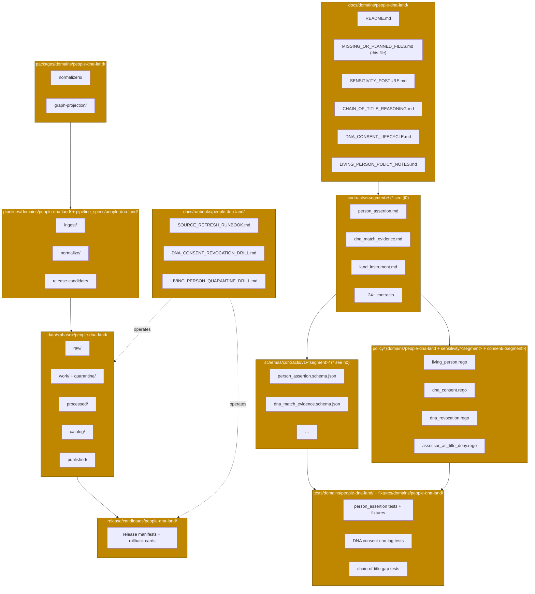

<!-- [KFM_META_BLOCK_V2]
doc_id: kfm://doc/domain/people-dna-land/missing-or-planned-files
title: MISSING_OR_PLANNED_FILES — People, Genealogy, DNA, Land Ownership
type: register
subtype: domain-inventory
version: v0.2
status: draft
owners: <people-dna-land-stewards>  # PLACEHOLDER — assign before review
created: 2026-05-19
updated: 2026-06-07
policy_label: public
contract_version: "3.0.0"
related:
  - docs/domains/people-dna-land/README.md            # PROPOSED; NEEDS VERIFICATION
  - docs/doctrine/directory-rules.md
  - docs/doctrine/lifecycle-law.md                    # PROPOSED placement; NEEDS VERIFICATION
  - docs/doctrine/trust-membrane.md                   # PROPOSED placement; NEEDS VERIFICATION
  - docs/registers/VERIFICATION_BACKLOG.md            # PROPOSED; NEEDS VERIFICATION
  - docs/registers/DRIFT_REGISTER.md                  # PROPOSED; NEEDS VERIFICATION
  - docs/atlases/KFM_Domains_Culmination_Atlas_v1_1.pdf  # PROPOSED per ADR-S-02
  - control_plane/document_registry.yaml              # PROPOSED; NEEDS VERIFICATION
extends:
  - KFM Domains Culmination Atlas v1.1 — Ch. 16 (People/Genealogy/DNA/Land), Ch. 24.5 (Sensitivity tiers), Ch. 24.12 (Master Open-ADR Backlog), Ch. 24.13 (Atlas Section ↔ Dossier ↔ Responsibility Root Crosswalk)
  - Directory Rules v1.3 — §5 (responsibility roots), §6.1 (docs/), §6.1.b (runbooks), §6.5 (policy/), §6.6 (tests/fixtures/), §7 (schema home / trust membrane), §8 (compatibility roots), §12 (Domain Placement Law), §13 (anti-patterns), §16 (path-validation checklist), §18 (open-DR backlog)
  - Pass 23 + Pass 32 Consolidated Deduplicated Atlas — [DOM-PEOPLE], [GAI], [DIRRULES], [ENCY]
  - Pass-10 Idea Index — C6 (Sensitivity/Redaction/Geoprivacy), C9 (Consent & DTC Genomic Inputs)
authority_posture: planning / gap-inventory artifact — subordinate to attached doctrine, ADRs, and any mounted-repo evidence; supersedes no source doctrine
truth_labels: [CONFIRMED, PROPOSED, INFERRED, NEEDS VERIFICATION, UNKNOWN, DEFERRED, CONFLICTED]
tags: [kfm, domain, people-dna-land, inventory, planning, governance, sensitivity-T4]
notes:
  - "CONTRACT_VERSION pinned to 3.0.0 per ai-build-operating-contract.md."
  - "No mounted repo was inspected in the authoring session. Every quoted file path is PROPOSED and every presence claim is NEEDS VERIFICATION."
  - "OPEN CONFLICT (new in v0.2): Atlas Ch. 24.13 crosswalk uses the short segment 'people' for schemas/contracts/policy-sensitivity/policy-consent roots; Directory Rules §12 examples use 'people-dna-land' for domains/ segments. See OQ-PDL-SEG-01 / ADR candidate. This inventory follows Directory Rules placement and flags the divergence rather than smoothing it."
  - "Path layout derives from Directory Rules §12 (Domain Placement Law). Object families derive from Atlas Ch. 16 §E and Appendix C."
  - "Sensitivity default is T4 (deny by default) for living-person fields, raw DNA identifiers, DNA segments, and private person-parcel joins — Atlas Ch. 24.5.2."
  - "This inventory is doctrine-derived, not invented; it must not be cited as proof that any file exists in the mounted repository."
[/KFM_META_BLOCK_V2] -->

# MISSING_OR_PLANNED_FILES — People, Genealogy, DNA, Land Ownership

> Doctrine-derived gap inventory for the **People/DNA/Land** (`people-dna-land`) domain across the KFM responsibility-rooted lane pattern. Names what should exist, why, and the planning status of each item — pending mounted-repo verification.

| Status | Owners | Last updated |
|---|---|---|
| Draft — planning inventory; no mounted-repo verification | `<people-dna-land-stewards>` *(PLACEHOLDER — assign before review)* | 2026-06-07 |

> [!IMPORTANT]
> **What this document is.** A doctrine-derived enumeration of files the People/DNA/Land domain should populate across the KFM lane pattern, with a planning-status label per item.
>
> **What this document is *not*.** A statement about what exists in the mounted repository. No repo was inspected in the authoring session; every presence claim defaults to **NEEDS VERIFICATION**. This document is not authority for path placement (that is `docs/doctrine/directory-rules.md` §12) and does not amend any contract, schema, policy, or ADR.

> [!CAUTION]
> **Sensitive domain.** This lane covers living people, genealogy, DNA/genomic data, and private land-ownership assertions — all **T4 / deny-by-default** under Atlas Ch. 24.5.2 and the operating contract's §23.2 sensitive-domain matrix. No file in this lane may carry real living-person identifiers, real DNA segments, or precise private person-parcel joins without `RedactionReceipt` + `ReviewRecord` + `PolicyDecision`. See [§7](#7-sensitivity-guardrails--default-deny-register).

---

## Table of contents

0. [Blocking conflict — segment naming (`people` vs `people-dna-land`)](#0-blocking-conflict--segment-naming-people-vs-people-dna-land)
1. [Purpose & scope](#1-purpose--scope)
2. [How to read this inventory](#2-how-to-read-this-inventory)
3. [Domain footprint across responsibility roots](#3-domain-footprint-across-responsibility-roots)
4. [Inventory by responsibility root](#4-inventory-by-responsibility-root)
   - [4.1 `docs/domains/people-dna-land/`](#41-docsdomainspeople-dna-land--doctrine-surfaces)
   - [4.2 `contracts/<segment>/`](#42-contractssegment--object-meaning)
   - [4.3 `schemas/contracts/v1/<segment>/`](#43-schemascontractsv1segment--machine-shape)
   - [4.4 `policy/`](#44-policy--admissibility--release)
   - [4.5 `tests/` + `fixtures/`](#45-testsdomainspeople-dna-land--fixturesdomainspeople-dna-land--proof)
   - [4.6 `packages/domains/people-dna-land/`](#46-packagesdomainspeople-dna-land--shared-implementation)
   - [4.7 `pipelines/` + `pipeline_specs/`](#47-pipelinesdomainspeople-dna-land--pipeline_specspeople-dna-land--pipeline-shape)
   - [4.8 `data/` lanes (RAW → PUBLISHED)](#48-data-lanes--lifecycle-artifacts-raw--published)
   - [4.9 `release/candidates/people-dna-land/`](#49-releasecandidatespeople-dna-land--release-decisions)
   - [4.10 `docs/runbooks/people-dna-land/`](#410-docsrunbookspeople-dna-land--operational-procedures)
5. [Cross-cutting items not under the domain segment](#5-cross-cutting-items-not-under-the-domain-segment)
6. [Validators, tests, fixtures — corpus K. backlog](#6-validators-tests-fixtures--corpus-k-backlog)
7. [Sensitivity guardrails — default-deny register](#7-sensitivity-guardrails--default-deny-register)
8. [Open questions & ADR backlog cross-reference](#8-open-questions--adr-backlog-cross-reference)
9. [Acceptance criteria for closing this inventory](#9-acceptance-criteria-for-closing-this-inventory)
10. [Changelog](#changelog-v01--v02)
11. [Related docs](#related-docs)

---

## 0. Blocking conflict — segment naming (`people` vs `people-dna-land`)

> [!WARNING]
> **CONFLICTED — resolve before any `schemas/`, `contracts/`, or `policy/sensitivity/` file in this lane is authored as canonical.** Two CONFIRMED-doctrine sources disagree on the segment name for this domain. This is not smoothed over; it is escalated as **OQ-PDL-SEG-01**, an ADR candidate.

Two authoritative sources name the domain segment differently:

| Source (CONFIRMED) | Root family | Segment used | Example path |
|---|---|---|---|
| **Directory Rules v1.3 §6.5, §6.6, §12** | `policy/domains/`, `tests/domains/`, `fixtures/domains/` | **`people-dna-land`** | `policy/domains/people-dna-land/`, `tests/domains/people-dna-land/` |
| **Atlas v1.1 Ch. 24.13 crosswalk (row 16)** | `schemas/`, `contracts/`, `policy/sensitivity/`, `policy/consent/` | **`people`** | `schemas/contracts/v1/people/`, `contracts/people/`, `policy/sensitivity/people/`, `policy/consent/people/` |

Both documents are CONFIRMED doctrine, and both are explicitly PROPOSED-at-the-path-level (Atlas Ch. 24.13 closes with *"every responsibility-root path above is PROPOSED; confirmation requires inspection of a mounted repo"*). Neither is wrong on its face; they are **two naming conventions for the same lane that have not been reconciled**.

**Resolution posture for this inventory (per operating contract source hierarchy + Directory Rules §0):**

- Where Directory Rules gives an explicit example (`policy/domains/`, `tests/domains/`, `fixtures/domains/`, `packages/domains/`, `pipelines/domains/`), this inventory uses **`people-dna-land`** — Directory Rules wins on placement.
- Where only the Atlas crosswalk gives a path (`schemas/contracts/v1/<segment>/`, `contracts/<segment>/`, `policy/sensitivity/<segment>/`, `policy/consent/<segment>/`), this inventory writes the segment as **`<segment>`** and annotates each affected row, because the crosswalk says `people` while the lane convention says `people-dna-land`.
- **No `schemas/`, `contracts/`, or `policy/sensitivity/` file is authored as canonical** until **OQ-PDL-SEG-01** is resolved by ADR. The likeliest clean outcomes: (A) adopt `people-dna-land` everywhere for consistency with the `domains/` lane convention; (B) keep `people` for the four crosswalk roots and `people-dna-land` for the `domains/`-style roots, documenting the asymmetry; (C) adopt `people` everywhere and update Directory Rules examples. Option A is the lowest-surprise default but the ADR owns the decision.

> [!NOTE]
> This conflict did not exist as a flagged item in v0.1, which used `people-dna-land` uniformly across all roots — including the four roots the Atlas crosswalk assigns to `people`. v0.2 surfaces the divergence rather than silently picking one.

[↑ Back to top](#table-of-contents)

---

## 1. Purpose & scope

This document is a **planning-grade inventory** of the files the People/DNA/Land domain should populate across the KFM responsibility roots, derived from CONFIRMED-doctrine sources:

- **Directory Rules §12 (Domain Placement Law)** — every KFM domain fans out across `docs/`, `contracts/`, `schemas/`, `policy/`, `tests/`, `fixtures/`, `packages/`, `pipelines/`, `pipeline_specs/`, `data/`, and `release/` rather than becoming a root folder. The `people-dna-land` segment is named explicitly in the §6.5/§6.6/§12 examples.
- **Atlas Ch. 16 — People, Genealogy, DNA, Land Ownership ([DOM-PEOPLE], [ENCY])** — names the object families (§E, Appendix C), source families (§D), sensitivity posture (§I, Ch. 24.5.2), pipeline shape (§H), viewing products (§G), validator backlog (§K), governed-AI behavior (§L), and verification backlog (§N) for this domain.
- **Pass-10 Idea Index C6/C9** — sensitivity rubric, redaction profiles, k-anonymity, consent tokens (JWT / GA4GH visas), DTC genomic inputs, and vendor-loss posture.

Scope is **the People/DNA/Land lane** across responsibility roots, plus a small set of cross-cutting files (runbooks, registers, ADRs) that serve this domain but live outside the domain segment by Directory Rules §12.

Out of scope: object-family *meaning* (lives in `contracts/`), field-level *shape* (lives in `schemas/`), admissibility *decisions* (lives in `policy/`), source identity (lives in `data/registry/`), and any actual implementation. This document only names what should exist.

[↑ Back to top](#table-of-contents)

---

## 2. How to read this inventory

### 2.1 Status legend

Each row carries a **Planning status** drawn from a small, stable vocabulary aligned to the operating contract §8 truth labels:

| Label | Meaning |
|---|---|
| **PROPOSED — corpus-named** | The corpus (Atlas Ch. 16, Directory Rules, Encyclopedia, Pass-10) directly names the artifact or its purpose. PROPOSED in implementation; author next. |
| **PROPOSED — lane-derived** | The Domain Placement Law (Directory Rules §12) implies the path under the lane pattern; the corpus does not name it individually, but its existence follows from the pattern. |
| **NEEDS VERIFICATION** | The artifact may already exist in the mounted repository or be planned elsewhere; this session cannot confirm. |
| **DEFERRED — pending ADR** | The artifact depends on an open ADR (segment name, source-role vocabulary, sensitivity scheme, triplet plural) and SHOULD NOT be authored canonically until the ADR is accepted. |
| **CONFLICTED** | Two CONFIRMED sources disagree (e.g., §0 segment naming). Surfaced and tracked; not silently resolved. |
| **CONFIRMED** | Used only if session evidence directly confirms presence. No rows are CONFIRMED in this draft, by construction — no repo was mounted. |

### 2.2 Path-status conventions

> [!NOTE]
> Every path printed in this document is **PROPOSED** under Directory Rules §0 ("authority of any specific path quoted here is PROPOSED until verified against mounted-repo evidence"). Stated once here rather than per row. The *Planning status* column refines what to do about each path. Where §0's segment conflict applies, the path uses `<segment>` and is annotated.

File extensions follow Directory Rules §6 conventions:

- `contracts/` → `.md` (semantic meaning in Markdown).
- `schemas/` → `.schema.json` (JSON Schema; default home `schemas/contracts/v1/...` per ADR-0001).
- `policy/` → `.rego` (OPA/Rego bundles per Atlas Ch. 24.11 and Directory Rules §6.5 `bundles/`; engine choice is **NEEDS VERIFICATION**).
- `pipelines/` → executable pipeline code (engine choice **NEEDS VERIFICATION**).
- `pipeline_specs/` → declarative pipeline configuration.

[↑ Back to top](#table-of-contents)

---

## 3. Domain footprint across responsibility roots

The People/DNA/Land lane fans across canonical roots. Each appearance of the segment is **PROPOSED**; the *responsibility split* between roots is **CONFIRMED doctrine** (Directory Rules §5, §12). Segment names marked `*` are subject to the §0 conflict.

> [!WARNING]
> The diagram shows **PROPOSED structure**, not present-day repository state. No node has been confirmed against a mounted repo in this session. Segment names marked `*` and `<segment>` are subject to the [§0 conflict](#0-blocking-conflict--segment-naming-people-vs-people-dna-land).

[↑ Back to top](#table-of-contents)

---

## 4. Inventory by responsibility root

Each subsection lists the files the lane pattern and Atlas Ch. 16 imply, in tabular form. Bulk rows are wrapped in `
` to keep visible scrolling tolerable.

### 4.1 `docs/domains/people-dna-land/` — doctrine surfaces

**Authority class:** Canonical (Directory Rules §6.1). **Purpose:** human-facing dossier, sensitivity posture notes, runbook pointers, and per-domain doctrine. *(Segment `people-dna-land` is uncontested under `docs/domains/`.)*

| File | Purpose | Doctrine basis | Planning status |
|---|---|---|---|
| `README.md` | Domain landing page; conforms to folder-README contract (Directory Rules §15). | DIRRULES §15 | **PROPOSED — lane-derived** |
| `MISSING_OR_PLANNED_FILES.md` *(this file)* | Gap inventory across responsibility roots. | DIRRULES §12; DOM-PEOPLE | **PROPOSED — corpus-derived** *(in draft)* |
| `DOMAIN_DOSSIER.md` | Per-domain dossier mirroring Atlas Ch. 16 sections A–N. | DOM-PEOPLE; ENCY | **PROPOSED — corpus-named** |
| `SENSITIVITY_POSTURE.md` | Living-person, DNA, title, and parcel-boundary controls and tier defaults (T0–T4). | DOM-PEOPLE §I; Atlas Ch. 24.5.2 | **PROPOSED — corpus-named** |
| `CHAIN_OF_TITLE_REASONING.md` | Chain-of-title reasoning, assessor-vs-title separation, parcel-geometry-vs-title-truth boundary. | DOM-PEOPLE §B, §K; Atlas Ch. 16 | **PROPOSED — corpus-named** |
| `GEDCOM_INGEST_NOTES.md` | GEDCOM / GEDZip overlay rights, living-flag handling, source-role posture. | DOM-PEOPLE §D | **PROPOSED — corpus-named** |
| `DNA_CONSENT_LIFECYCLE.md` | Consent grants, revocation receipts, vendor terms, GA4GH AAI / passport posture, DTC vendor-loss posture. | DOM-PEOPLE §C; Pass-10 C9-03, C9-04, C9-07, C6-07, C6-08 | **PROPOSED — corpus-named** |
| `LIVING_PERSON_POLICY_NOTES.md` | k-anonymity defaults, differential-privacy aggregation thresholds, quarantine triggers for living-person joins. | Pass-10 C6-05, C6-06; DOM-PEOPLE §I | **PROPOSED — corpus-named** |
| `OBJECT_FAMILY_MAP.md` | Cross-reference from Atlas Ch. 16 §E / Appendix C object families to `contracts/` files in this lane. | DOM-PEOPLE §E; Atlas App. C | **PROPOSED — lane-derived** |

[↑ Back to top](#table-of-contents)

### 4.2 `contracts/<segment>/` — object meaning

**Authority class:** Canonical (Directory Rules §6.4). **Purpose:** Markdown semantic-meaning files, one per object family. Field-level shape lives in `schemas/`; admissibility in `policy/`.

> [!WARNING]
> **Segment is CONFLICTED (see [§0](#0-blocking-conflict--segment-naming-people-vs-people-dna-land)).** Atlas Ch. 24.13 assigns `contracts/people/`; the `domains/` lane convention would give `contracts/domains/people-dna-land/`. Resolve **OQ-PDL-SEG-01** by ADR before authoring these as canonical. Paths below use `<segment>`.

The object families below are drawn from Atlas Ch. 16 §E (object table), §B (scope/ownership list), §C (ubiquitous language), and Appendix C. **CONFIRMED** as terms in the corpus; **PROPOSED** as `contracts/` files.

<strong>Person, name, life events</strong> (9 contracts)

| File | Object family | Doctrine basis | Planning status |
|---|---|---|---|
| `README.md` | Folder contract (Directory Rules §15) | DIRRULES §15 | **PROPOSED — lane-derived** |
| `person_assertion.md` | Person Assertion | DOM-PEOPLE §B, §C, §E | **PROPOSED — corpus-named** |
| `person_canonical.md` | PersonCanonical | DOM-PEOPLE §C, §E | **PROPOSED — corpus-named** |
| `person_identity_candidate.md` | Person Identity Candidate | DOM-PEOPLE §B | **PROPOSED — corpus-named** |
| `name_assertion.md` | NameAssertion | DOM-PEOPLE §C, §E | **PROPOSED — corpus-named** |
| `life_event.md` | LifeEvent | DOM-PEOPLE §C, §E | **PROPOSED — corpus-named** |
| `residence_event.md` | Residence Event | DOM-PEOPLE §B, §E | **PROPOSED — corpus-named** |
| `migration_event.md` | Migration Event | DOM-PEOPLE §B, §E | **PROPOSED — corpus-named** |
| `family_group.md` | FamilyGroup | DOM-PEOPLE §B, §E | **PROPOSED — corpus-named** |

<strong>Relationships</strong> (3 contracts)

| File | Object family | Doctrine basis | Planning status |
|---|---|---|---|
| `relationship_assertion.md` | RelationshipAssertion | DOM-PEOPLE §C | **PROPOSED — corpus-named** |
| `genealogy_relationship.md` | Genealogy Relationship | DOM-PEOPLE §B, §E | **PROPOSED — corpus-named** |
| `relationship_hypothesis.md` | Relationship Hypothesis | DOM-PEOPLE §B; Pass-10 C9-03 | **PROPOSED — corpus-named** |

<strong>DNA evidence &amp; consent</strong> (5 contracts)

| File | Object family | Doctrine basis | Planning status |
|---|---|---|---|
| `dna_match_evidence.md` | DNA Match Evidence | DOM-PEOPLE §B, §C, §E | **PROPOSED — corpus-named** |
| `dna_kit_token.md` | DNAKitToken | DOM-PEOPLE §C | **PROPOSED — corpus-named** |
| `dna_segment.md` | DNASegment | DOM-PEOPLE §E | **PROPOSED — corpus-named** |
| `consent_grant.md` | ConsentGrant (JWT / GA4GH AAI passport / visa) | DOM-PEOPLE §C; Pass-10 C6-07, C9-04 | **PROPOSED — corpus-named** |
| `revocation_receipt.md` | RevocationReceipt | DOM-PEOPLE §C; Pass-10 C6-08 | **PROPOSED — corpus-named** |

<strong>Land, parcel, title, ownership</strong> (10 contracts)

| File | Object family | Doctrine basis | Planning status |
|---|---|---|---|
| `land_parcel.md` | LandParcel | DOM-PEOPLE §C, App. C | **PROPOSED — corpus-named** |
| `legal_description.md` | LegalDescription | DOM-PEOPLE §C | **PROPOSED — corpus-named** |
| `land_instrument.md` | LandInstrument (parent) | DOM-PEOPLE §C | **PROPOSED — corpus-named** |
| `deed_instrument.md` | Deed Instrument | DOM-PEOPLE §B | **PROPOSED — corpus-named** |
| `title_instrument.md` | Title Instrument | DOM-PEOPLE §B | **PROPOSED — corpus-named** |
| `assessor_record.md` | Assessor Record | DOM-PEOPLE §B, §I | **PROPOSED — corpus-named** |
| `tax_record.md` | TaxRecord | DOM-PEOPLE §B | **PROPOSED — corpus-named** |
| `parcel_version.md` | Parcel Version | DOM-PEOPLE §B | **PROPOSED — corpus-named** |
| `ownership_interval.md` | Ownership Interval | DOM-PEOPLE §B | **PROPOSED — corpus-named** |
| `land_ownership_assertion.md` | Land Ownership Assertion | DOM-PEOPLE §B | **PROPOSED — corpus-named** |

> [!NOTE]
> **Source-role anti-collapse (CONFIRMED doctrine).** Each contract above MUST record the source role (`observed | regulatory | modeled | aggregate | administrative | candidate | synthetic`) fixed at admission. Assessor / tax records are `administrative` and never satisfy a title claim; GEDCOM / tree imports are `modeled` / `candidate`. Role collapse at publication is a DENY.

[↑ Back to top](#table-of-contents)

### 4.3 `schemas/contracts/v1/<segment>/` — machine shape

**Authority class:** Canonical (Directory Rules §7; default home per ADR-0001). **Purpose:** JSON Schema for each contract above; valid/invalid fixtures land under `tests/` and `fixtures/`.

> [!WARNING]
> **Segment is CONFLICTED (see [§0](#0-blocking-conflict--segment-naming-people-vs-people-dna-land)).** Atlas Ch. 24.13 assigns `schemas/contracts/v1/people/`. Resolve **OQ-PDL-SEG-01** before authoring. Paths below use `<segment>`.

> [!NOTE]
> One `.schema.json` per `contracts/` file. The full enumeration mirrors §4.2 row-for-row; collapsed here to avoid repetition. Naming follows the contract filename with the `.schema.json` extension.

<strong>Expand schema list (mirrors §4.2)</strong>

| Schema file | Source contract | Planning status |
|---|---|---|
| `person_assertion.schema.json` | `person_assertion.md` | **PROPOSED — corpus-named** |
| `person_canonical.schema.json` | `person_canonical.md` | **PROPOSED — corpus-named** |
| `person_identity_candidate.schema.json` | `person_identity_candidate.md` | **PROPOSED — corpus-named** |
| `name_assertion.schema.json` | `name_assertion.md` | **PROPOSED — corpus-named** |
| `life_event.schema.json` | `life_event.md` | **PROPOSED — corpus-named** |
| `residence_event.schema.json` | `residence_event.md` | **PROPOSED — corpus-named** |
| `migration_event.schema.json` | `migration_event.md` | **PROPOSED — corpus-named** |
| `family_group.schema.json` | `family_group.md` | **PROPOSED — corpus-named** |
| `relationship_assertion.schema.json` | `relationship_assertion.md` | **PROPOSED — corpus-named** |
| `genealogy_relationship.schema.json` | `genealogy_relationship.md` | **PROPOSED — corpus-named** |
| `relationship_hypothesis.schema.json` | `relationship_hypothesis.md` | **PROPOSED — corpus-named** |
| `dna_match_evidence.schema.json` | `dna_match_evidence.md` | **PROPOSED — corpus-named** |
| `dna_kit_token.schema.json` | `dna_kit_token.md` | **PROPOSED — corpus-named** |
| `dna_segment.schema.json` | `dna_segment.md` | **PROPOSED — corpus-named** |
| `consent_grant.schema.json` | `consent_grant.md` | **PROPOSED — corpus-named** |
| `revocation_receipt.schema.json` | `revocation_receipt.md` | **PROPOSED — corpus-named** |
| `land_parcel.schema.json` | `land_parcel.md` | **PROPOSED — corpus-named** |
| `legal_description.schema.json` | `legal_description.md` | **PROPOSED — corpus-named** |
| `land_instrument.schema.json` | `land_instrument.md` | **PROPOSED — corpus-named** |
| `deed_instrument.schema.json` | `deed_instrument.md` | **PROPOSED — corpus-named** |
| `title_instrument.schema.json` | `title_instrument.md` | **PROPOSED — corpus-named** |
| `assessor_record.schema.json` | `assessor_record.md` | **PROPOSED — corpus-named** |
| `tax_record.schema.json` | `tax_record.md` | **PROPOSED — corpus-named** |
| `parcel_version.schema.json` | `parcel_version.md` | **PROPOSED — corpus-named** |
| `ownership_interval.schema.json` | `ownership_interval.md` | **PROPOSED — corpus-named** |
| `land_ownership_assertion.schema.json` | `land_ownership_assertion.md` | **PROPOSED — corpus-named** |

> [!CAUTION]
> **Anti-pattern alert (Directory Rules §13.1).** Do **not** create `contracts/<segment>/<x>.schema.json`. Per ADR-0001 the canonical schema home is `schemas/contracts/v1/...`; semantic Markdown lives in `contracts/`; the two MUST NOT diverge. If a blueprint shows `contracts/<segment>/<x>.schema.json`, treat it as lineage / CONFLICTED and migrate under ADR-0001 before any new schema lands.

[↑ Back to top](#table-of-contents)

### 4.4 `policy/` — admissibility & release

**Authority class:** Canonical (Directory Rules §6.5; `policy/` is the canonical singular — if `policies/` exists, treat it as compatibility/mirror per §8). **Purpose:** allow / deny / restrict / abstain decisions for this lane. Engine is OPA/Rego per the §6.5 `bundles/` convention; final engine choice is **NEEDS VERIFICATION**.

> [!IMPORTANT]
> **Policy spans three sub-roots for this lane.** Directory Rules §6.5 shows `policy/domains/people-dna-land/` for domain rules; Atlas Ch. 24.13 additionally assigns `policy/sensitivity/people/` and `policy/consent/people/`. The `domains/` segment is uncontested as `people-dna-land`; the `sensitivity/` and `consent/` segments are subject to the [§0 conflict](#0-blocking-conflict--segment-naming-people-vs-people-dna-land). Rules below are grouped by their sub-root.

**`policy/domains/people-dna-land/` — domain admissibility**

| File | Decision it encodes | Doctrine basis | Planning status |
|---|---|---|---|
| `README.md` | Folder contract | DIRRULES §15 | **PROPOSED — lane-derived** |
| `assessor_as_title_deny.rego` | Deny treating assessor / tax (`administrative`) records as title truth. | DOM-PEOPLE §B, §I, §K | **PROPOSED — corpus-named** |
| `legal_description_gap.rego` | Detect chain-of-title gaps; require steward review on publication. | DOM-PEOPLE §K | **PROPOSED — corpus-named** |
| `graph_projection_safety.rego` | Filter sensitive nodes/edges from graph/triplet projections. | DOM-PEOPLE §G, §K | **PROPOSED — corpus-named** |
| `gedcom_living_flag.rego` | Honour GEDCOM living-person flag; deny living-person evidence release. | DOM-PEOPLE §D, §K | **PROPOSED — corpus-named** |

**`policy/sensitivity/<segment>/` — sensitivity gates** *(segment CONFLICTED, §0)*

| File | Decision it encodes | Doctrine basis | Planning status |
|---|---|---|---|
| `living_person.rego` | Deny / restrict living-person fields; k-anonymity + DP-aggregation gates. | DOM-PEOPLE §I; Pass-10 C6-05, C6-06 | **PROPOSED — corpus-named** |
| `raw_dna_no_publish.rego` | Deny raw kit/vendor IDs and raw DNA segments from public publication. | DOM-PEOPLE §I; Atlas Ch. 24.5.2 (T4); Pass-10 C9-03 | **PROPOSED — corpus-named** |
| `private_person_parcel_join.rego` | Deny private person-parcel joins by default; allow only with `RedactionReceipt` → T2. | Atlas Ch. 24.5.2 (T4 People/Land join) | **PROPOSED — corpus-named** |

**`policy/consent/<segment>/` — consent gates** *(segment CONFLICTED, §0)*

| File | Decision it encodes | Doctrine basis | Planning status |
|---|---|---|---|
| `dna_consent.rego` | Allow only with valid, unrevoked consent token; scope matching. | DOM-PEOPLE §I; Pass-10 C6-07, C9-04 | **PROPOSED — corpus-named** |
| `dna_revocation.rego` | Revocation cleanup; fail-closed on introspection failure. | DOM-PEOPLE §K; Pass-10 C6-08 | **PROPOSED — corpus-named** |
| `consent_token_introspection.rego` | OAuth 2.0 introspection / GA4GH AAI fail-closed behavior; PDP introspects on every render. | Pass-10 C6-07, C6-08, C9-04 | **PROPOSED — corpus-named** |

> [!IMPORTANT]
> All rules above are **deny-by-default** (Atlas Ch. 24.5; Pass-10 C6-01 rubric rank 5 = fail-closed). Authoring SHOULD start from a deny stance and add explicit, evidenced allow paths — never the reverse.

[↑ Back to top](#table-of-contents)

### 4.5 `tests/domains/people-dna-land/` + `fixtures/domains/people-dna-land/` — proof

**Authority class:** Canonical (Directory Rules §6.6). **Purpose:** deterministic proof of the validators and policies above; valid/invalid examples. *(Segment `people-dna-land` is uncontested under `tests/domains/` and `fixtures/domains/`.)*

| File / directory | What it proves | Doctrine basis | Planning status |
|---|---|---|---|
| `tests/.../person_assertion_evidence_test.<ext>` | Person assertions resolve to an `EvidenceBundle`; abstain otherwise. | DOM-PEOPLE §K | **PROPOSED — corpus-named** |
| `tests/.../gedcom_import_rights_test.<ext>` | GEDCOM import respects rights and living-flag; living-person fields fail closed. | DOM-PEOPLE §K | **PROPOSED — corpus-named** |
| `tests/.../dna_consent_no_log_test.<ext>` | DNA consent + raw-ID no-log: raw vendor IDs and DNA segments are never logged. | DOM-PEOPLE §K; Pass-10 C9-03 | **PROPOSED — corpus-named** |
| `tests/.../revocation_cleanup_test.<ext>` | RevocationReceipt drives downstream cleanup; introspection fail-closed. | DOM-PEOPLE §K; Pass-10 C6-08 | **PROPOSED — corpus-named** |
| `tests/.../chain_of_title_gap_test.<ext>` | Chain-of-title gap detection blocks promotion. | DOM-PEOPLE §K | **PROPOSED — corpus-named** |
| `tests/.../assessor_as_title_denial_test.<ext>` | Assessor / tax records cannot be cited as title truth. | DOM-PEOPLE §K | **PROPOSED — corpus-named** |
| `tests/.../graph_projection_safety_test.<ext>` | Sensitive nodes/edges are filtered from graph projections. | DOM-PEOPLE §K | **PROPOSED — corpus-named** |
| `tests/.../person_parcel_join_denial_test.<ext>` | Private person-parcel joins denied by default. | Atlas Ch. 24.5.2 (T4) | **PROPOSED — corpus-named** |
| `fixtures/.../valid/` | Public-safe positive examples per contract. | DIRRULES §6.6 | **PROPOSED — lane-derived** |
| `fixtures/.../invalid/` | Cases the validators MUST reject (missing consent, living-person leak, etc.). | DIRRULES §6.6; DOM-PEOPLE §I | **PROPOSED — lane-derived** |
| `fixtures/.../golden/` | Stable reference outputs for normalizers and projections. | DIRRULES §6.6 | **PROPOSED — lane-derived** |
| `fixtures/.../synthetic/` | Synthetic, public-domain GEDCOM / DNA / deed examples; no real living-person data. | DOM-PEOPLE §D, §I; Pass-10 C6 | **PROPOSED — corpus-derived** |

> [!CAUTION]
> **No real living-person, real DNA segment, or real private parcel-owner data may live in `fixtures/` or `tests/` at any tier above T1.** Synthetic and public-domain examples only — restating the deny-by-default posture of Atlas Ch. 24.5.2 and Pass-10 C6-01 (rank 5 fail-closed).

[↑ Back to top](#table-of-contents)

### 4.6 `packages/domains/people-dna-land/` — shared implementation

**Authority class:** Canonical (Directory Rules §7 / §10 deployable-and-shared). **Purpose:** shared, reusable libraries that multiple deployables import. One-off pipeline-step code belongs in `pipelines/` or `tools/`, not here. *(Segment uncontested under `packages/domains/`.)*

> [!NOTE]
> Directory Rules §13 (v1.2 drift item) flags repo-observed `runtime/people/` as a possible misplaced adapter. Shared People/DNA/Land libraries belong in `packages/domains/people-dna-land/`, not in a domain-named `runtime/` folder. **NEEDS VERIFICATION** against the mounted repo.

| Subpath | Responsibility | Doctrine basis | Planning status |
|---|---|---|---|
| `README.md` | Package landing | DIRRULES §15 | **PROPOSED — lane-derived** |
| `normalizers/` | Schema, geometry, time, identity normalizers for People/DNA/Land sources. | DOM-PEOPLE §H (WORK/QUARANTINE) | **PROPOSED — corpus-named** |
| `evidence-projection/` | Resolve `EvidenceRef` → `EvidenceBundle` for People/DNA/Land claims. | DOM-PEOPLE §J; ENCY | **PROPOSED — corpus-named** |
| `graph-projection/` | Safe graph/triplet projection with sensitivity-aware filtering. | DOM-PEOPLE §G, §K | **PROPOSED — corpus-named** |
| `consent/` | Consent token validation, GA4GH AAI introspection, revocation propagation. | Pass-10 C6-07, C6-08, C9-04 | **PROPOSED — corpus-named** |
| `chain-of-title/` | Ownership-interval reasoning, gap detection, instrument timeline composition. | DOM-PEOPLE §G, §K | **PROPOSED — corpus-named** |
| `redaction/` | Geoprivacy generalization, k-anonymity / DP fallback, RedactionReceipt emission. | Pass-10 C6-02, C6-05, C6-06; Atlas Ch. 24.5.2 | **PROPOSED — corpus-named** |

[↑ Back to top](#table-of-contents)

### 4.7 `pipelines/domains/people-dna-land/` + `pipeline_specs/people-dna-land/` — pipeline shape

**Authority class:** Canonical (Directory Rules §5; `_specs/` = *what should run*, `pipelines/` = *how it runs*). **Purpose:** carry RAW → PUBLISHED under the lifecycle invariant. *(Segment uncontested under `pipelines/domains/`.)*

| File / directory | Phase served | Doctrine basis | Planning status |
|---|---|---|---|
| `pipelines/.../ingest/` | RAW capture: vital records, GEDCOM, DNA exports, land instruments, assessor rolls, geometry sources. | DOM-PEOPLE §D, §H | **PROPOSED — corpus-named** |
| `pipelines/.../normalize/` | WORK / QUARANTINE: schema/geometry/time/identity normalization; rights/policy gates. | DOM-PEOPLE §H | **PROPOSED — corpus-named** |
| `pipelines/.../evidence-closure/` | PROCESSED → CATALOG: emit `EvidenceBundle`, validate digest closure. | DOM-PEOPLE §H | **PROPOSED — corpus-named** |
| `pipelines/.../graph-build/` | CATALOG / TRIPLET: graph and triplet projections under sensitivity filters. | DOM-PEOPLE §G, §H | **PROPOSED — corpus-named** |
| `pipelines/.../release-candidate/` | PUBLISHED candidate assembly; `ReleaseManifest`, rollback target. | DOM-PEOPLE §M | **PROPOSED — corpus-named** |
| `pipeline_specs/people-dna-land/<name>.yaml` | Declarative spec per pipeline above. | DIRRULES §5 | **PROPOSED — lane-derived** |

> [!IMPORTANT]
> Pipelines MUST NOT skip phases. A pipeline that writes directly to `data/published/` from `data/raw/` is the **lifecycle-skip anti-pattern**; promotion is a governed state transition, not a file move (Directory Rules §2.1, §13).

[↑ Back to top](#table-of-contents)

### 4.8 `data/` lanes — lifecycle artifacts (RAW → PUBLISHED)

**Authority class:** Canonical (Directory Rules §5, §9). **Purpose:** physical home for lifecycle artifacts under the lifecycle invariant. *(Segment uncontested under `data/<phase>/`.)*

| Path | Phase | What lands here | Doctrine basis | Planning status |
|---|---|---|---|---|
| `data/raw/people-dna-land/` | RAW | Immutable source payloads + `SourceDescriptor`. Rights, sensitivity, citation, time, hash captured. | DOM-PEOPLE §H | **PROPOSED — corpus-named** |
| `data/work/people-dna-land/` | WORK | In-flight normalization; pre-validation. | DOM-PEOPLE §H | **PROPOSED — corpus-named** |
| `data/quarantine/people-dna-land/` | QUARANTINE | Hold for sensitive joins, rights conflicts, consent gaps. | DOM-PEOPLE §H, §I | **PROPOSED — corpus-named** |
| `data/processed/people-dna-land/` | PROCESSED | Validated normalized objects + `EvidenceRef`, `ValidationReport`. | DOM-PEOPLE §H | **PROPOSED — corpus-named** |
| `data/catalog/domain/people-dna-land/` | CATALOG | Catalog records, `EvidenceBundle`, release candidates. | DOM-PEOPLE §H; DIRRULES §9 | **PROPOSED — corpus-named** |
| `data/triplets/people-dna-land/` | TRIPLET | Triplet / graph projections (sensitivity-filtered). | DIRRULES §18.a (`triplets/` plural is the form this doc uses; ADR recommended to freeze) | **PROPOSED — lane-derived** *(plural form pending OPEN-DR-09-e)* |
| `data/published/layers/people-dna-land/` | PUBLISHED | Public-safe layer artifacts, served via governed API. | DOM-PEOPLE §H, §M | **PROPOSED — corpus-named** |
| `data/registry/sources/people-dna-land/` | REGISTRY | `SourceDescriptor` registry entries per source family. | DOM-PEOPLE §D | **PROPOSED — corpus-named** |
| `data/receipts/.../people-dna-land/` | RECEIPTS | `RunReceipt`, `RedactionReceipt`, `AggregationReceipt`, `RepresentationReceipt`. | DIRRULES §9, §13.2; Atlas Ch. 24.5 | **PROPOSED — lane-derived** |
| `data/proofs/.../people-dna-land/` | PROOFS | Resolved `EvidenceBundle` instances per release. | DIRRULES §13.2; DOM-PEOPLE §M | **PROPOSED — lane-derived** |

> [!NOTE]
> **`triplets/` plural is now PROPOSED — lane-derived, not DEFERRED.** Directory Rules v1.3 §18.a states the document uses `triplets/` (plural) consistently and recommends a one-line ADR to freeze it; the repo-observed singular `data/triplet/` is logged as drift (OPEN-DR-09-e). v0.1 marked this row DEFERRED; v0.2 follows the v1.3 stated default of plural and flags the freeze-ADR.

> [!CAUTION]
> Public clients MUST read via `apps/governed-api/` — never directly from `data/raw/`, `data/work/`, `data/quarantine/`, or canonical stores. This is the **trust-membrane invariant** (Directory Rules §7).

[↑ Back to top](#table-of-contents)

### 4.9 `release/candidates/people-dna-land/` — release decisions

**Authority class:** Canonical (Directory Rules §5). **Purpose:** release *decisions* (distinct from `data/published/` *artifacts*). *(Segment uncontested under `release/candidates/`.)*

| File pattern | What it records | Doctrine basis | Planning status |
|---|---|---|---|
| `<candidate-id>/ReleaseManifest.json` | Published artifact set, digests, policy posture, rollback target. | DOM-PEOPLE §M | **PROPOSED — corpus-named** |
| `<candidate-id>/PromotionDecision.json` | A→G promotion gate result for this candidate. | DOM-PEOPLE §M; ENCY | **PROPOSED — corpus-named** |
| `<candidate-id>/RollbackCard.json` | Rollback decision and target. | DOM-PEOPLE §M; ENCY App. E | **PROPOSED — corpus-named** |
| `<candidate-id>/CorrectionNotice.json` | Correction lineage for this release. | DOM-PEOPLE §M; ENCY | **PROPOSED — corpus-named** |
| `<candidate-id>/ReviewRecord.json` | Steward / separation-of-duties review record (§24.2 cross-cutting receipt). | Atlas Ch. 24.5.3 | **PROPOSED — corpus-named** |

> [!NOTE]
> `ReviewRecord` is a **§24.2 cross-cutting receipt**, not a domain-owned object; it is instanced per release candidate here but its schema lives at the cross-cutting receipt home. There is no `ACCEPTED` outcome — finite outcomes are `ANSWER / ABSTAIN / DENY / ERROR`; a passed promotion is an `ANSWER` queued per §24.3.1.

[↑ Back to top](#table-of-contents)

### 4.10 `docs/runbooks/people-dna-land/` — operational procedures

**Authority class:** Canonical (Directory Rules §6.1.b). **Purpose:** operational runbooks. Subfolder convention follows **Pattern A** (subfolder) per Directory Rules §6.1.b and §18 OPEN-DR-02 (Pattern A is the pending-ADR recommendation; new authors SHOULD adopt the subfolder for any domain that already has one).

| File | What it covers | Doctrine basis | Planning status |
|---|---|---|---|
| `SOURCE_REFRESH_RUNBOOK.md` | Source-refresh lifecycle (RAW → PUBLISHED). Mirrors the fauna runbook pattern. | DIRRULES §6.1.b; DOM-PEOPLE §H | **PROPOSED — lane-derived** |
| `DNA_CONSENT_REVOCATION_DRILL.md` | Revocation propagation drill: consent revoked → downstream cleanup → republish without affected evidence. | DOM-PEOPLE §K; Pass-10 C6-08 | **PROPOSED — corpus-named** |
| `LIVING_PERSON_QUARANTINE_DRILL.md` | Living-person detection → quarantine → review → release-only-on-aggregation drill. | DOM-PEOPLE §I; Atlas Ch. 24.5.2 | **PROPOSED — corpus-named** |
| `CHAIN_OF_TITLE_GAP_RUNBOOK.md` | Gap detection in chain-of-title; steward review path; correction notice. | DOM-PEOPLE §K | **PROPOSED — corpus-named** |
| `GEDCOM_INGEST_RUNBOOK.md` | GEDCOM / GEDZip ingestion under rights + living-flag fail-closed. | DOM-PEOPLE §D, §K | **PROPOSED — corpus-named** |
| `DTC_VENDOR_LOSS_DRILL.md` | Vendor-loss simulation (23andMe Ch. 11 scenario); consent posture under vendor-solvency change. | Pass-10 C9-03, C9-07 | **PROPOSED — corpus-named** |

> [!NOTE]
> Subfolder vs flat naming for runbooks is **OPEN — pending ADR** (Directory Rules §18 OPEN-DR-02). This inventory adopts Pattern A (subfolder), consistent with the existing `docs/runbooks/fauna/` subfolder.

[↑ Back to top](#table-of-contents)

---

## 5. Cross-cutting items not under the domain segment

Per Directory Rules §12 (multi-domain and cross-cutting files), items that span more than this lane do **not** sit under a `people-dna-land/` (or `people/`) segment. They belong at the lowest common responsibility root.

| Item | Correct home (per §12) | Why it is not under the domain segment | Planning status |
|---|---|---|---|
| Cross-lane geometry validator (parcel × hydrology × archaeology) | `tools/validators/geometry/` | Not owned by a single domain. | **PROPOSED — lane-derived** |
| Shared sensitivity tier definitions (T0–T4) | `policy/sensitivity/` (canonical) and/or `docs/standards/SENSITIVITY_RUBRIC.md` | Cross-domain doctrine; Atlas Ch. 24.5; Pass-10 C6-01. | **PROPOSED — corpus-named** |
| Consent token JWT / GA4GH passport schema (if reused beyond this lane) | `schemas/contracts/v1/runtime/consent_grant.schema.json`, else under the People/DNA/Land schema segment | If reused outside this lane, move to common runtime. | **NEEDS VERIFICATION** *(reuse scope)* |
| Master sensitivity / verification register | `docs/registers/VERIFICATION_BACKLOG.md` + `policy/sensitivity/` | Repo-wide register, not per domain. | **PROPOSED — lane-derived** |
| Living-person OPA policy fixtures | `policy/fixtures/living_persons/` | Shared OPA fixture set, distinct from `tests/fixtures/` (DIRRULES §6.5, §6.6). | **PROPOSED — corpus-named** *(Pass-10 C6-06)* |
| ADRs that touch this domain (segment name, sensitivity scheme, source-role vocabulary) | `docs/adr/` | ADRs are repo-wide. See §8. | **PROPOSED — corpus-named** |

> [!IMPORTANT]
> Do not create `tools/validators/domains/people-dna-land/...` for a cross-domain validator. That is the **convenience-root anti-pattern** (Directory Rules §13). Place the validator at `tools/validators/<topic>/...` and let multiple domains import it.

[↑ Back to top](#table-of-contents)

---

## 6. Validators, tests, fixtures — corpus K. backlog

Atlas Ch. 16 §K names a validator/test/fixture backlog for this domain. Each entry is **PROPOSED** in corpus doctrine and **PROPOSED** in implementation. Policy targets are split across the `domains/`, `sensitivity/`, and `consent/` sub-roots per [§4.4](#44-policy--admissibility--release).

| Backlog item (Atlas Ch. 16 §K) | Where it lands (PROPOSED) | Planning status |
|---|---|---|
| Person assertion evidence tests | `tests/domains/people-dna-land/person_assertion_evidence_test.<ext>` | **PROPOSED — corpus-named** |
| GEDCOM import rights/living-flag tests | `tests/.../gedcom_import_rights_test.<ext>` + `policy/domains/people-dna-land/gedcom_living_flag.rego` | **PROPOSED — corpus-named** |
| DNA consent and raw-ID no-log tests | `tests/.../dna_consent_no_log_test.<ext>` + `policy/consent/<segment>/dna_consent.rego` + `policy/sensitivity/<segment>/raw_dna_no_publish.rego` | **PROPOSED — corpus-named** |
| Revocation cleanup tests | `tests/.../revocation_cleanup_test.<ext>` + `policy/consent/<segment>/dna_revocation.rego` + `docs/runbooks/people-dna-land/DNA_CONSENT_REVOCATION_DRILL.md` | **PROPOSED — corpus-named** |
| Legal-description and chain-of-title gap tests | `tests/.../chain_of_title_gap_test.<ext>` + `policy/domains/people-dna-land/legal_description_gap.rego` + `docs/runbooks/people-dna-land/CHAIN_OF_TITLE_GAP_RUNBOOK.md` | **PROPOSED — corpus-named** |
| Assessor-as-title denial | `tests/.../assessor_as_title_denial_test.<ext>` + `policy/domains/people-dna-land/assessor_as_title_deny.rego` | **PROPOSED — corpus-named** |
| Graph projection safety tests | `tests/.../graph_projection_safety_test.<ext>` + `policy/domains/people-dna-land/graph_projection_safety.rego` | **PROPOSED — corpus-named** |

[↑ Back to top](#table-of-contents)

---

## 7. Sensitivity guardrails — default-deny register

Atlas Ch. 24.5.2 sets the **deny-by-default register** for this domain. These are not file-creation tasks — they are invariants every item in this inventory must honour. Values below are reproduced verbatim from the Atlas Ch. 24.5.2 People rows.

| Object / surface | Default tier | Allowed transforms (PROPOSED, per Atlas 24.5.2) | Required gates |
|---|---|---|---|
| Living-person fields | **T4** (deny by default) | Aggregation by tract or county + `AggregationReceipt` → T1 | Consent or aggregation gate + `ReviewRecord` |
| Raw DNA segment data / kit IDs | **T4** | No transform releases this to a public tier; T3 only under explicit research agreement | Named consent + `ReviewRecord` + `PolicyDecision` |
| Private person-parcel join | **T4** | Generalized parcel + de-identified person → T2 only | `RedactionReceipt` + `ReviewRecord` |
| Assessor / tax record cited as title truth | **DENY** (always) | None — assessor is `administrative`, not title | Source-role gate; `PolicyDecision` |
| Chain-of-title with unresolved gap | **Quarantine** | Steward review + correction notice | `ReviewRecord` + `CorrectionNotice` |

> [!WARNING]
> These are **CONFIRMED doctrine** (Atlas Ch. 24.5.2; Pass-10 C6). Any file whose authoring would relax these defaults — even temporarily — requires an explicit `PolicyDecision`, `ReviewRecord`, and (where third-party rights apply) a named `agreement`. Default-allow paths are not acceptable. Tier transitions are governed: T4 → T1 requires `RedactionReceipt` + `ReviewRecord` + `PolicyDecision` plus Promotion Gates A–G (Atlas Ch. 24.5.3).

[↑ Back to top](#table-of-contents)

---

## 8. Open questions & ADR backlog cross-reference

These open questions affect this inventory. Resolution lies outside this document. **OQ-PDL-SEG-01** is new in v0.2 and is the only *blocking* item.

| ID | Question | Affects in this inventory | Priority |
|---|---|---|---|
| **OQ-PDL-SEG-01** *(new, v0.2)* | Segment name conflict: Atlas Ch. 24.13 `people` vs Directory Rules §12 `people-dna-land`. ADR candidate. | §0; §4.2; §4.3; §4.4 (`sensitivity/`, `consent/`); §6 | **BLOCKING** |
| **ADR-S-01** (Atlas 24.12) | Confirm or amend ADR-0001 (schema home `schemas/contracts/v1/...`). | §4.3 — all schema paths | High |
| **ADR-S-04** (Atlas 24.12) | Source-role vocabulary v1 — canonical enum and evolution rule. | §4.1 (`OBJECT_FAMILY_MAP.md`), §4.2 (role anti-collapse), §4.4 (`assessor_as_title_deny.rego`), §4.8 (`data/registry/sources/`) | High |
| **ADR-S-05** (Atlas 24.12) | Sensitivity tier scheme (T0–T4) — adopt as canonical or revise. | §7 — entire register depends on the tier scheme | High |
| **ADR-S-13** (Atlas 24.12) | Drift register triage. | §5 — drift entries for sensitivity, consent. | Med |
| **ADR-S-14** (Atlas 24.12) | Cross-lane join policy. | §5 — private person-parcel joins; cross-domain validator placement. | Med |
| **OPEN-DR-02** (DIRRULES §18.b) | `docs/runbooks/<domain>/` subfolder vs flat. | §4.10 — chose Pattern A pending ADR. | Low |
| **OPEN-DR-09-e** (DIRRULES §18.a) | `triplets/` (plural) vs `triplet/` (singular) in `data/`. | §4.8 — uses plural per v1.3 default; ADR recommended to freeze. | Low |
| **OPEN-DR carry-forward** (DIRRULES §8, §18) | `policies/` vs `policy/` canonicalization. | §4.4 — uses `policy/` (canonical singular per §6.5). | Low |

> [!NOTE]
> No item should be authored as canonical until its dependent ADR is accepted. **OQ-PDL-SEG-01 blocks** §4.2, §4.3, and the `sensitivity/`/`consent/` halves of §4.4. Items flagged **DEFERRED — pending ADR** are explicit; items subject to vocabulary or scheme decisions (T-tier scheme, source-role enum) SHOULD be authored with placeholders that fill in once the ADR lands.

[↑ Back to top](#table-of-contents)

---

## 9. Acceptance criteria for closing this inventory

This inventory is **closed** when each criterion below is independently verifiable.

- [ ] **OQ-PDL-SEG-01** (segment name) is resolved by ADR; §0, §4.2, §4.3, §4.4 paths frozen to the chosen segment.
- [ ] Mounted-repo inspection performed; **Planning status** refreshed so every row reads **CONFIRMED — present** or **PLANNED — to be authored**.
- [ ] **ADR-0001** confirmed or amended; §4.3 schema paths anchored.
- [ ] **ADR-S-04 (source-role vocabulary)** accepted; §4.1, §4.2, §4.4, §4.8 references updated.
- [ ] **ADR-S-05 (T0–T4 sensitivity scheme)** accepted; §7 register frozen.
- [ ] **OPEN-DR-02 (runbook subfolder)** accepted; §4.10 paths frozen.
- [ ] **OPEN-DR-09-e** (`triplets/` plural) accepted; §4.8 path frozen.
- [ ] Each `contracts/<segment>/*.md` in §4.2 authored or explicitly deferred with rationale in `docs/registers/VERIFICATION_BACKLOG.md`.
- [ ] Each `schemas/contracts/v1/<segment>/*.schema.json` in §4.3 authored or deferred.
- [ ] Each `policy/.../*.rego` in §4.4 authored or deferred, with deny-by-default verified.
- [ ] Atlas Ch. 16 §K backlog (§6) has full file-level coverage: tests, fixtures, policies, runbooks.
- [ ] Domain `README.md` authored to meet Directory Rules §15 (folder README contract).
- [ ] Sensitivity register (§7) mirrored in `policy/sensitivity/` and `docs/standards/SENSITIVITY_RUBRIC.md`.
- [ ] No file in this lane reads RAW/WORK/QUARANTINE directly from a public client (trust-membrane invariant; Directory Rules §7).
- [ ] `GENERATED_RECEIPT.json` for this doc wired into CI with `human_review.state == "approved"`.

[↑ Back to top](#table-of-contents)

---

## Changelog v0.1 → v0.2

| Change | Type (per contract §37) | Reason |
|---|---|---|
| Added §0 blocking segment-name conflict (`people` vs `people-dna-land`) with `OQ-PDL-SEG-01`. | reconciliation | Atlas Ch. 24.13 and Directory Rules §12 disagree on the canonical segment; v0.1 silently used one and missed the conflict. |
| Changed `contracts/`, `schemas/`, `policy/sensitivity/`, `policy/consent/` paths to `<segment>` with annotations. | reconciliation | Honours §0 conflict; stops asserting a contested segment as settled. |
| Split §4.4 `policy/` into `domains/`, `sensitivity/`, `consent/` sub-roots. | gap closure | Atlas Ch. 24.13 assigns `policy/sensitivity/people/` and `policy/consent/people/`; v0.1 placed all rules under one segment. |
| Reclassified §4.8 `triplets/` row from DEFERRED to PROPOSED — lane-derived (plural). | clarification | Directory Rules v1.3 §18.a states plural is the form in use and recommends a freeze-ADR; full deferral overstated the uncertainty. |
| Added Pass-10 C6/C9 basis to DNA, consent, redaction, and runbook rows. | gap closure | Pass-10 C6-01/05/06/07/08 and C9-03/04/07 directly ground these items; v0.1 under-cited them. |
| Added source-role anti-collapse note to §4.2; `ReviewRecord`/`ANSWER`-not-`ACCEPTED` note to §4.9. | clarification | Recurring KFM corrections; aligns with finite-outcome doctrine. |
| Added CONTRACT_VERSION pin, §23.2 sensitive-domain CAUTION, expanded TOC and changelog. | housekeeping | Doctrine-adjacent doc presentation standard. |
| Bumped `updated` to 2026-06-07; version v0.1 → v0.2. | housekeeping | Revision date. |

> **Backward compatibility.** All v0.1 section anchors are preserved except §4.2/§4.3 headings, which changed from `contractsdomainspeople-dna-land` / `schemascontractsv1domainspeople-dna-land` to `contractssegment` / `schemascontractsv1segment` to reflect the §0 conflict. Inbound links to those two anchors will break; see Section 2 anchor-breakage note.

[↑ Back to top](#table-of-contents)

---

## Related docs

- `docs/domains/people-dna-land/README.md` *(PROPOSED; NEEDS VERIFICATION)*
- `docs/doctrine/directory-rules.md` — §5 responsibility roots, §6.1 docs/, §6.1.b runbooks, §6.5 policy/, §6.6 tests/fixtures/, §7 schema home + trust membrane, §8 compatibility roots, §12 Domain Placement Law, §13 anti-patterns, §16 path-validation checklist, §18 open-DR backlog
- `docs/doctrine/lifecycle-law.md` *(PROPOSED placement per DIRRULES §6.1)*
- `docs/doctrine/trust-membrane.md` *(PROPOSED placement per DIRRULES §6.1)*
- `docs/atlases/KFM_Domains_Culmination_Atlas_v1_1.pdf` — Ch. 16 (People/Genealogy/DNA/Land), Ch. 24.5 (Sensitivity Matrix), Ch. 24.12 (Master Open-ADR Backlog), Ch. 24.13 (Responsibility Root Crosswalk) *(PROPOSED placement per ADR-S-02)*
- `KFM Components Pass-10 — Idea Index` — C6 (Sensitivity/Redaction/Geoprivacy), C9 (Consent & DTC Genomic Inputs)
- `docs/registers/VERIFICATION_BACKLOG.md` *(PROPOSED; NEEDS VERIFICATION)*
- `docs/registers/DRIFT_REGISTER.md` *(PROPOSED; NEEDS VERIFICATION)*
- `docs/standards/SENSITIVITY_RUBRIC.md` *(PROPOSED in corpus, Pass-10 C6-01; not yet authored per DIRRULES §0 deferred-items list)*
- `docs/standards/PROV.md` *(authored prior session; naming variance vs corpus `PROVENANCE.md` → DIRRULES §18 OPEN-DR-01)*
- `docs/runbooks/fauna/SOURCE_REFRESH_RUNBOOK.md` — pattern reference for §4.10 *(CONFIRMED authored prior session per DIRRULES §6.1.b note; NEEDS VERIFICATION in mounted repo)*

---

<strong>Last updated:</strong> 2026-06-07 ·
<strong>Edition:</strong> v0.2 inventory ·
<strong>CONTRACT_VERSION:</strong> 3.0.0 ·
<strong>Authority posture:</strong> planning / gap-inventory; subordinate to doctrine and ADRs ·
<a href="#missing_or_planned_files--people-genealogy-dna-land-ownership">↑ Back to top</a>

