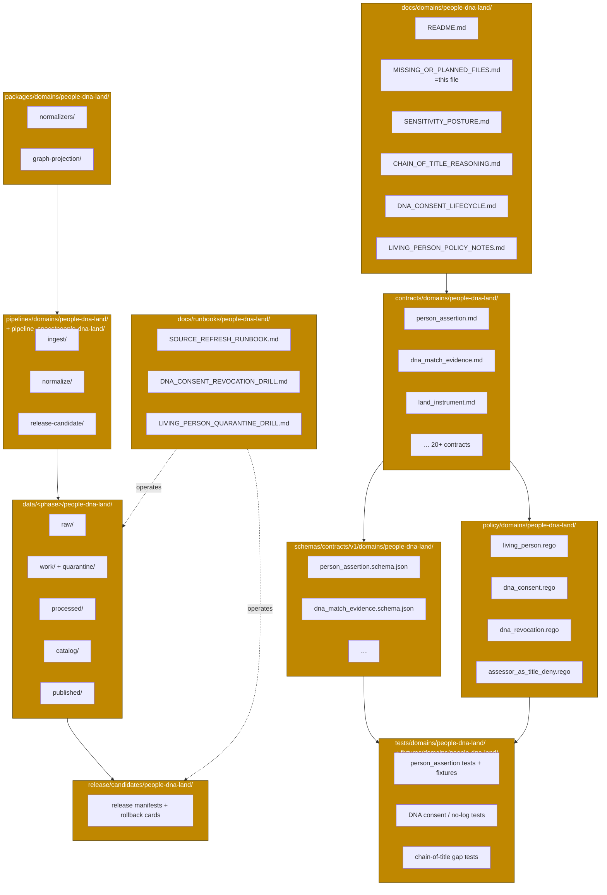

<!-- [KFM_META_BLOCK_V2]
doc_id: kfm://doc/domain/people-dna-land/missing-or-planned-files
title: MISSING_OR_PLANNED_FILES — People, Genealogy, DNA, Land Ownership
type: register
subtype: domain-inventory
version: v0.1
status: draft
owners: <people-dna-land-stewards>  # PLACEHOLDER — assign before review
created: 2026-05-19
updated: 2026-05-19
policy_label: public
related:
  - docs/domains/people-dna-land/README.md            # PROPOSED; NEEDS VERIFICATION
  - docs/doctrine/directory-rules.md
  - docs/doctrine/lifecycle-law.md
  - docs/doctrine/trust-membrane.md
  - docs/registers/VERIFICATION_BACKLOG.md            # PROPOSED; NEEDS VERIFICATION
  - docs/registers/DRIFT_REGISTER.md                  # PROPOSED; NEEDS VERIFICATION
  - docs/atlases/KFM_Domains_Culmination_Atlas_v1_1.pdf  # PROPOSED per ADR-S-02
  - control_plane/document_registry.yaml              # PROPOSED; NEEDS VERIFICATION
extends:
  - KFM Domains Culmination Atlas v1.1 — Ch. 16 (People/Genealogy/DNA/Land), Ch. 24.5 (Sensitivity tiers), Ch. 24.12 (Master Open-ADR Backlog)
  - Directory Rules v1.1 — §6.1 (docs/), §6.1.b (runbooks), §7.4 (schema home), §12 (Domain Placement Law), §15 (folder README contract), §16 (path-validation checklist)
  - Pass 23 + Pass 32 Consolidated Deduplicated Atlas — [DOM-PEOPLE], [GAI], [DIRRULES], [ENCY]
authority_posture: planning / gap-inventory artifact — subordinate to attached doctrine, ADRs, and any mounted-repo evidence; supersedes no source doctrine
truth_labels: [CONFIRMED, PROPOSED, INFERRED, NEEDS VERIFICATION, UNKNOWN, DEFERRED]
tags: [kfm, domain, people-dna-land, inventory, planning, governance, sensitivity-T4]
notes:
  - "No mounted repo was inspected in the authoring session. Every quoted file path is PROPOSED and every presence claim is NEEDS VERIFICATION."
  - "Path layout derives from Directory Rules §12 (Domain Placement Law). Object families derive from Atlas Ch. 16 (People/Genealogy/DNA/Land)."
  - "Sensitivity default is T4 (deny by default) for living-person fields, raw DNA identifiers, DNA segments, and private person-parcel joins — Atlas Ch. 24.5."
  - "This inventory is doctrine-derived, not invented; it must not be cited as proof that any file exists in the mounted repository."
[/KFM_META_BLOCK_V2] -->

# MISSING_OR_PLANNED_FILES — People, Genealogy, DNA, Land Ownership

> Doctrine-derived gap inventory for the **People/DNA/Land** (`people-dna-land`) domain across the KFM responsibility-rooted lane pattern. Names what should exist, why, and the status of each item — pending mounted-repo verification.

| Status | Owners | Last updated |
|---|---|---|
| Draft — planning inventory; no mounted-repo verification | `<people-dna-land-stewards>` *(PLACEHOLDER — assign before review)* | 2026-05-19 |

> [!IMPORTANT]
> **What this document is.** A doctrine-derived enumeration of files the People/DNA/Land domain should populate across the KFM lane pattern, with a planning-status label per item.
>
> **What this document is *not*.** A statement about what exists in the mounted repository. No repo was inspected in the authoring session; every presence claim defaults to **NEEDS VERIFICATION**. This document is not authority for path placement (that is `docs/doctrine/directory-rules.md` §12) and does not amend any contract, schema, policy, or ADR.

---

## Table of contents

1. [Purpose & scope](#1-purpose--scope)
2. [How to read this inventory](#2-how-to-read-this-inventory)
3. [Domain footprint across responsibility roots](#3-domain-footprint-across-responsibility-roots)
4. [Inventory by responsibility root](#4-inventory-by-responsibility-root)
   - [4.1 `docs/domains/people-dna-land/`](#41-docsdomainspeople-dna-land--doctrine-surfaces)
   - [4.2 `contracts/domains/people-dna-land/`](#42-contractsdomainspeople-dna-land--object-meaning)
   - [4.3 `schemas/contracts/v1/domains/people-dna-land/`](#43-schemascontractsv1domainspeople-dna-land--machine-shape)
   - [4.4 `policy/domains/people-dna-land/`](#44-policydomainspeople-dna-land--admissibility--release)
   - [4.5 `tests/` + `fixtures/`](#45-testsdomainspeople-dna-land--fixturesdomainspeople-dna-land--proof)
   - [4.6 `packages/domains/people-dna-land/`](#46-packagesdomainspeople-dna-land--shared-implementation)
   - [4.7 `pipelines/` + `pipeline_specs/`](#47-pipelinesdomainspeople-dna-land--pipeline_specspeople-dna-land--pipeline-shape)
   - [4.8 `data/` lanes (RAW → PUBLISHED)](#48-data-lanes--lifecycle-artifacts-raw--published)
   - [4.9 `release/candidates/people-dna-land/`](#49-releasecandidatespeople-dna-land--release-decisions)
   - [4.10 `docs/runbooks/people-dna-land/`](#410-docsrunbookspeople-dna-land--operational-procedures)
5. [Cross-cutting items not under the domain segment](#5-cross-cutting-items-not-under-the-domain-segment)
6. [Validators, tests, fixtures — corpus K. backlog](#6-validators-tests-fixtures--corpus-k-backlog)
7. [Sensitivity guardrails — default-deny register](#7-sensitivity-guardrails--default-deny-register)
8. [Open questions & ADR backlog cross-reference](#8-open-questions--adr-backlog-cross-reference)
9. [Acceptance criteria for closing this inventory](#9-acceptance-criteria-for-closing-this-inventory)
10. [Related docs](#related-docs)

---

## 1. Purpose & scope

This document is a **planning-grade inventory** of the files the People/DNA/Land domain should populate across the KFM responsibility roots, derived from two CONFIRMED-doctrine sources:

- **Directory Rules §12 (Domain Placement Law)** — every KFM domain MUST fan out across `docs/`, `contracts/`, `schemas/`, `policy/`, `tests/`, `fixtures/`, `packages/`, `pipelines/`, `pipeline_specs/`, `data/`, and `release/` rather than become a root folder. The `people-dna-land` segment is explicitly named.
- **Atlas Ch. 16 — People, Genealogy, DNA, Land Ownership ([DOM-PEOPLE], [ENCY])** — names the object families, source families, sensitivity posture, pipeline shape, viewing products, validator backlog, governed-AI behavior, and verification backlog for this domain.

Scope is **the people-dna-land lane** across responsibility roots, plus a small set of cross-cutting files (runbooks, registers, ADRs) that legitimately serve this domain but live outside the domain segment by Directory Rules §12.

Out of scope: object-family meaning (lives in `contracts/`), field-level shape (lives in `schemas/`), admissibility decisions (lives in `policy/`), source identity (lives in `data/registry/`), and any actual implementation. This document only names what should exist.

[↑ Back to top](#table-of-contents)

---

## 2. How to read this inventory

### 2.1 Status legend

Each row carries a **Planning status** drawn from a small, stable vocabulary:

| Label | Meaning |
|---|---|
| **PROPOSED — corpus-named** | The corpus (Atlas Ch. 16, Directory Rules, or Encyclopedia) directly names the artifact or its purpose. PROPOSED in implementation; should be authored next. |
| **PROPOSED — lane-derived** | The Domain Placement Law (Directory Rules §12) implies the path under the lane pattern; the corpus does not name it individually but its existence is implied by the pattern. |
| **NEEDS VERIFICATION** | The artifact may already exist in the mounted repository or be planned elsewhere; this session cannot confirm. |
| **DEFERRED — pending ADR** | The artifact depends on an open ADR (e.g., source-role vocabulary, sensitivity tier scheme) and SHOULD NOT be authored until the ADR is accepted. |
| **CONFIRMED** | Used only if session evidence directly confirms presence (no rows in this draft are CONFIRMED, by construction — no repo was mounted). |

### 2.2 Path-status conventions

> [!NOTE]
> Every path printed in this document is **PROPOSED** under Directory Rules §0 ("Authority of any specific path quoted here is PROPOSED until verified against mounted-repo evidence"). This is stated once here rather than repeated per row. The *Planning status* column then refines what should be done about each path.

File extensions follow Directory Rules §6.3–§6.5 conventions:

- `contracts/` → `.md` (semantic meaning in Markdown)
- `schemas/` → `.schema.json` (JSON Schema, default home `schemas/contracts/v1/...` per ADR-0001)
- `policy/` → `.rego` (OPA bundles per Atlas Ch. 24.11; engine choice is **DEFERRED — pending ADR**)
- `pipelines/` → executable pipeline code (engine choice **NEEDS VERIFICATION**)
- `pipeline_specs/` → declarative pipeline configuration

[↑ Back to top](#table-of-contents)

---

## 3. Domain footprint across responsibility roots

The people-dna-land lane fans across canonical roots. Each appearance of the segment is **PROPOSED**; the *responsibility split* between roots is **CONFIRMED doctrine** (Directory Rules §12).

> [!WARNING]
> The diagram above shows **PROPOSED structure**, not present-day repository state. No node in this diagram has been confirmed against a mounted repo in this session.

[↑ Back to top](#table-of-contents)

---

## 4. Inventory by responsibility root

Each subsection lists the files the lane pattern and Atlas Ch. 16 imply, in tabular form. Bulk rows are wrapped in `
` to keep visible scrolling tolerable.

### 4.1 `docs/domains/people-dna-land/` — doctrine surfaces

**Authority class:** Canonical (Directory Rules §6.1). **Purpose:** human-facing dossier, sensitivity posture notes, runbook pointers, and per-domain doctrine for the People/Genealogy/DNA/Land lane.

| File | Purpose | Doctrine basis | Planning status |
|---|---|---|---|
| `README.md` | Domain landing page; conforms to folder-README contract (Directory Rules §15). | DIRRULES §15 | **PROPOSED — lane-derived** |
| `MISSING_OR_PLANNED_FILES.md` *(this file)* | Gap inventory across responsibility roots. | DIRRULES §12; DOM-PEOPLE | **PROPOSED — corpus-derived** *(in draft)* |
| `DOMAIN_DOSSIER.md` | Per-domain dossier mirroring Atlas Ch. 16 sections A–N. | DOM-PEOPLE; ENCY | **PROPOSED — corpus-named** |
| `SENSITIVITY_POSTURE.md` | Living-person, DNA, title, and parcel-boundary controls and tier defaults (T4 / T3 / T2 / T1 / T0). | DOM-PEOPLE §I; ENCY Ch. 24.5 | **PROPOSED — corpus-named** |
| `CHAIN_OF_TITLE_REASONING.md` | Doctrine for chain-of-title reasoning, assessor-vs-title separation, and parcel-geometry-vs-title-truth boundary. | DOM-PEOPLE §A; Atlas Ch. 16 | **PROPOSED — corpus-named** |
| `GEDCOM_INGEST_NOTES.md` | GEDCOM / GEDZip overlay rights, living-flag handling, and source-role posture. | DOM-PEOPLE §D; Pass-10 C9 | **PROPOSED — corpus-named** |
| `DNA_CONSENT_LIFECYCLE.md` | Consent grants, revocation receipts, vendor terms, and GA4GH-style passport posture. | DOM-PEOPLE §C; Pass-10 C9-03..C9-04, C6-07..C6-08 | **PROPOSED — corpus-named** |
| `LIVING_PERSON_POLICY_NOTES.md` | k-anonymity defaults, aggregation thresholds, and quarantine triggers for living-person joins. | Pass-10 C6-05..C6-06; DOM-PEOPLE §I | **PROPOSED — corpus-named** |
| `OBJECT_FAMILY_MAP.md` | Cross-reference from Atlas Ch. 16 object families to `contracts/` files in this lane. | DOM-PEOPLE §E | **PROPOSED — lane-derived** |

[↑ Back to top](#table-of-contents)

### 4.2 `contracts/domains/people-dna-land/` — object meaning

**Authority class:** Canonical (Directory Rules §6.3). **Purpose:** Markdown semantic-meaning files, one per object family from Atlas Ch. 16. Field-level shape lives in `schemas/`; admissibility in `policy/`.

<strong>Person, Name, Life Events</strong> (9 contracts)

| File | Object family | Doctrine basis | Planning status |
|---|---|---|---|
| `README.md` | Folder contract (Directory Rules §15) | DIRRULES §15 | **PROPOSED — lane-derived** |
| `person_assertion.md` | Person Assertion | DOM-PEOPLE §B, §E | **PROPOSED — corpus-named** |
| `person_canonical.md` | PersonCanonical | DOM-PEOPLE §C, §E | **PROPOSED — corpus-named** |
| `person_identity_candidate.md` | Person Identity Candidate | DOM-PEOPLE §B | **PROPOSED — corpus-named** |
| `name_assertion.md` | NameAssertion | DOM-PEOPLE §C | **PROPOSED — corpus-named** |
| `life_event.md` | LifeEvent | DOM-PEOPLE §C, §E | **PROPOSED — corpus-named** |
| `residence_event.md` | Residence Event | DOM-PEOPLE §B, §E | **PROPOSED — corpus-named** |
| `migration_event.md` | Migration Event | DOM-PEOPLE §B, §E | **PROPOSED — corpus-named** |
| `family_group.md` | FamilyGroup | DOM-PEOPLE §B | **PROPOSED — corpus-named** |

<strong>Relationships</strong> (3 contracts)

| File | Object family | Doctrine basis | Planning status |
|---|---|---|---|
| `relationship_assertion.md` | RelationshipAssertion | DOM-PEOPLE §C | **PROPOSED — corpus-named** |
| `genealogy_relationship.md` | Genealogy Relationship | DOM-PEOPLE §B | **PROPOSED — corpus-named** |
| `relationship_hypothesis.md` | Relationship Hypothesis | DOM-PEOPLE §B; DOM-PEOPLE Pass-10 C9-03 | **PROPOSED — corpus-named** |

<strong>DNA evidence & consent</strong> (5 contracts)

| File | Object family | Doctrine basis | Planning status |
|---|---|---|---|
| `dna_match_evidence.md` | DNA Match Evidence | DOM-PEOPLE §B, §C | **PROPOSED — corpus-named** |
| `dna_kit_token.md` | DNAKitToken | DOM-PEOPLE §C | **PROPOSED — corpus-named** |
| `dna_segment.md` | DNASegment | DOM-PEOPLE §E | **PROPOSED — corpus-named** |
| `consent_grant.md` | ConsentGrant (JWT / GA4GH-style passport) | DOM-PEOPLE §C; Pass-10 C6-07 | **PROPOSED — corpus-named** |
| `revocation_receipt.md` | RevocationReceipt | DOM-PEOPLE §C; Pass-10 C6-08 | **PROPOSED — corpus-named** |

<strong>Land, parcel, title, ownership</strong> (8 contracts)

| File | Object family | Doctrine basis | Planning status |
|---|---|---|---|
| `land_parcel.md` | LandParcel | DOM-PEOPLE §C | **PROPOSED — corpus-named** |
| `legal_description.md` | LegalDescription | DOM-PEOPLE §C | **PROPOSED — corpus-named** |
| `land_instrument.md` | LandInstrument (parent) | DOM-PEOPLE §C | **PROPOSED — corpus-named** |
| `deed_instrument.md` | Deed Instrument | DOM-PEOPLE §B | **PROPOSED — corpus-named** |
| `title_instrument.md` | Title Instrument | DOM-PEOPLE §B | **PROPOSED — corpus-named** |
| `assessor_record.md` | Assessor Record | DOM-PEOPLE §B, §I | **PROPOSED — corpus-named** |
| `tax_record.md` | TaxRecord | DOM-PEOPLE §B | **PROPOSED — corpus-named** |
| `parcel_version.md` | Parcel Version | DOM-PEOPLE §B | **PROPOSED — corpus-named** |
| `ownership_interval.md` | Ownership Interval | DOM-PEOPLE §B | **PROPOSED — corpus-named** |
| `land_ownership_assertion.md` | Land Ownership Assertion | DOM-PEOPLE §B | **PROPOSED — corpus-named** |

[↑ Back to top](#table-of-contents)

### 4.3 `schemas/contracts/v1/domains/people-dna-land/` — machine shape

**Authority class:** Canonical (Directory Rules §7.4; default home per ADR-0001). **Purpose:** JSON Schema for each contract above; valid/invalid fixtures land under `tests/`.

> [!NOTE]
> One `.schema.json` per `contracts/` file. The full enumeration mirrors §4.2 row-for-row; collapsed here to avoid repetition. Naming convention follows the contract file with `.schema.json` extension (e.g., `person_assertion.schema.json`).

<strong>Expand schema list (mirrors §4.2)</strong>

| Schema file | Source contract | Planning status |
|---|---|---|
| `person_assertion.schema.json` | `contracts/.../person_assertion.md` | **PROPOSED — corpus-named** |
| `person_canonical.schema.json` | `contracts/.../person_canonical.md` | **PROPOSED — corpus-named** |
| `person_identity_candidate.schema.json` | `contracts/.../person_identity_candidate.md` | **PROPOSED — corpus-named** |
| `name_assertion.schema.json` | `contracts/.../name_assertion.md` | **PROPOSED — corpus-named** |
| `life_event.schema.json` | `contracts/.../life_event.md` | **PROPOSED — corpus-named** |
| `residence_event.schema.json` | `contracts/.../residence_event.md` | **PROPOSED — corpus-named** |
| `migration_event.schema.json` | `contracts/.../migration_event.md` | **PROPOSED — corpus-named** |
| `family_group.schema.json` | `contracts/.../family_group.md` | **PROPOSED — corpus-named** |
| `relationship_assertion.schema.json` | `contracts/.../relationship_assertion.md` | **PROPOSED — corpus-named** |
| `genealogy_relationship.schema.json` | `contracts/.../genealogy_relationship.md` | **PROPOSED — corpus-named** |
| `relationship_hypothesis.schema.json` | `contracts/.../relationship_hypothesis.md` | **PROPOSED — corpus-named** |
| `dna_match_evidence.schema.json` | `contracts/.../dna_match_evidence.md` | **PROPOSED — corpus-named** |
| `dna_kit_token.schema.json` | `contracts/.../dna_kit_token.md` | **PROPOSED — corpus-named** |
| `dna_segment.schema.json` | `contracts/.../dna_segment.md` | **PROPOSED — corpus-named** |
| `consent_grant.schema.json` | `contracts/.../consent_grant.md` | **PROPOSED — corpus-named** |
| `revocation_receipt.schema.json` | `contracts/.../revocation_receipt.md` | **PROPOSED — corpus-named** |
| `land_parcel.schema.json` | `contracts/.../land_parcel.md` | **PROPOSED — corpus-named** |
| `legal_description.schema.json` | `contracts/.../legal_description.md` | **PROPOSED — corpus-named** |
| `land_instrument.schema.json` | `contracts/.../land_instrument.md` | **PROPOSED — corpus-named** |
| `deed_instrument.schema.json` | `contracts/.../deed_instrument.md` | **PROPOSED — corpus-named** |
| `title_instrument.schema.json` | `contracts/.../title_instrument.md` | **PROPOSED — corpus-named** |
| `assessor_record.schema.json` | `contracts/.../assessor_record.md` | **PROPOSED — corpus-named** |
| `tax_record.schema.json` | `contracts/.../tax_record.md` | **PROPOSED — corpus-named** |
| `parcel_version.schema.json` | `contracts/.../parcel_version.md` | **PROPOSED — corpus-named** |
| `ownership_interval.schema.json` | `contracts/.../ownership_interval.md` | **PROPOSED — corpus-named** |
| `land_ownership_assertion.schema.json` | `contracts/.../land_ownership_assertion.md` | **PROPOSED — corpus-named** |

> [!CAUTION]
> Anti-pattern alert (Directory Rules §13.1). Do **not** create `contracts/domains/people-dna-land/<x>.schema.json` files. Per ADR-0001 the canonical schema home is `schemas/contracts/v1/...`; semantic Markdown lives in `contracts/`; the two must not diverge.

[↑ Back to top](#table-of-contents)

### 4.4 `policy/domains/people-dna-land/` — admissibility & release

**Authority class:** Canonical (Directory Rules §6.5; singular `policy/` per §0). **Purpose:** allow / deny / restrict / abstain decisions for this lane. Engine choice (OPA / Conftest / alternative) is **NEEDS VERIFICATION** per Unified Manual §23 backlog.

| File | Decision it encodes | Doctrine basis | Planning status |
|---|---|---|---|
| `README.md` | Folder contract | DIRRULES §15 | **PROPOSED — lane-derived** |
| `living_person.rego` | Deny / restrict living-person fields; k-anonymity gates | DOM-PEOPLE §I; Pass-10 C6-06 | **PROPOSED — corpus-named** |
| `dna_consent.rego` | Allow only with valid, unrevoked consent token; scope matching | DOM-PEOPLE §I; Pass-10 C6-07, C9-04 | **PROPOSED — corpus-named** |
| `dna_revocation.rego` | Revocation cleanup; fail-closed on introspection failure | Atlas Ch.16 §K; Pass-10 C6-08 | **PROPOSED — corpus-named** |
| `raw_dna_no_publish.rego` | Deny raw kit/vendor IDs and raw DNA segments from public publication | DOM-PEOPLE §I; Atlas Ch. 24.5 (T4) | **PROPOSED — corpus-named** |
| `assessor_as_title_deny.rego` | Deny treating assessor / tax records as title truth | DOM-PEOPLE §I, §K | **PROPOSED — corpus-named** |
| `private_person_parcel_join.rego` | Deny private person-parcel joins by default; allow only with redaction receipt | Atlas Ch. 24.5 (T4 People/Land join) | **PROPOSED — corpus-named** |
| `graph_projection_safety.rego` | Filter sensitive nodes/edges from graph projections | Atlas Ch.16 §K (graph projection safety tests) | **PROPOSED — corpus-named** |
| `gedcom_living_flag.rego` | Honour GEDCOM living-person flag; deny living-person evidence release | Atlas Ch.16 §K (GEDCOM import rights/living-flag tests) | **PROPOSED — corpus-named** |
| `legal_description_gap.rego` | Detect chain-of-title gaps; require steward review on publication | Atlas Ch.16 §K (legal-description and chain-of-title gap tests) | **PROPOSED — corpus-named** |
| `consent_token_introspection.rego` | OAuth 2.0 introspection / GA4GH AAI fail-closed behavior | Pass-10 C6-07; C9-04 | **PROPOSED — corpus-named** |

> [!IMPORTANT]
> All of the rules above are **deny-by-default** in posture (Atlas Ch. 24.5 / Sensitivity Matrix). Authoring SHOULD start from a deny stance and add explicit, evidenced allow paths — not the reverse.

[↑ Back to top](#table-of-contents)

### 4.5 `tests/domains/people-dna-land/` + `fixtures/domains/people-dna-land/` — proof

**Authority class:** Canonical (Directory Rules §6.6). **Purpose:** deterministic proof of the validators and policies above; valid/invalid examples.

| File / directory | What it proves | Doctrine basis | Planning status |
|---|---|---|---|
| `tests/.../person_assertion_evidence_test.<ext>` | Person assertions resolve to an `EvidenceBundle`; abstain otherwise. | Atlas Ch.16 §K | **PROPOSED — corpus-named** |
| `tests/.../gedcom_import_rights_test.<ext>` | GEDCOM import respects rights and living-flag; living-person fields fail closed. | Atlas Ch.16 §K | **PROPOSED — corpus-named** |
| `tests/.../dna_consent_no_log_test.<ext>` | DNA consent + raw-ID no-log: raw vendor IDs and DNA segments are never logged. | Atlas Ch.16 §K | **PROPOSED — corpus-named** |
| `tests/.../revocation_cleanup_test.<ext>` | RevocationReceipt drives downstream cleanup; introspection fail-closed. | Atlas Ch.16 §K; Pass-10 C6-08 | **PROPOSED — corpus-named** |
| `tests/.../chain_of_title_gap_test.<ext>` | Chain-of-title gap detection blocks promotion. | Atlas Ch.16 §K | **PROPOSED — corpus-named** |
| `tests/.../assessor_as_title_denial_test.<ext>` | Assessor / tax records cannot be cited as title truth. | Atlas Ch.16 §K | **PROPOSED — corpus-named** |
| `tests/.../graph_projection_safety_test.<ext>` | Sensitive nodes/edges are filtered from graph projections. | Atlas Ch.16 §K | **PROPOSED — corpus-named** |
| `tests/.../person_parcel_join_denial_test.<ext>` | Private person-parcel joins denied by default. | Atlas Ch. 24.5 (T4) | **PROPOSED — corpus-named** |
| `fixtures/.../valid/` | Public-safe positive examples per contract. | DIRRULES §6.6 | **PROPOSED — lane-derived** |
| `fixtures/.../invalid/` | Cases the validators MUST reject (missing consent, living-person leak, etc.). | DIRRULES §6.6; DOM-PEOPLE §I | **PROPOSED — lane-derived** |
| `fixtures/.../golden/` | Stable reference outputs for normalizers and projections. | DIRRULES §6.6 | **PROPOSED — lane-derived** |
| `fixtures/.../synthetic/` | Synthetic, public-domain GEDCOM / DNA / deed examples; no real living-person data. | DOM-PEOPLE §D, §I | **PROPOSED — corpus-derived** |

> [!WARNING]
> **No real living-person, real DNA segment, or real private parcel-owner data may live in `fixtures/` or `tests/` at any sensitivity tier above T1.** Synthetic and public-domain examples only. This restates the default-deny posture of Atlas Ch. 24.5.

[↑ Back to top](#table-of-contents)

### 4.6 `packages/domains/people-dna-land/` — shared implementation

**Authority class:** Canonical (Directory Rules §7.2). **Purpose:** shared, reusable libraries that multiple deployables import. Pipeline-step code that is one-off belongs in `pipelines/` or `tools/`, not here.

| Subpath | Responsibility | Doctrine basis | Planning status |
|---|---|---|---|
| `README.md` | Package landing | DIRRULES §15 | **PROPOSED — lane-derived** |
| `normalizers/` | Schema, geometry, time, identity normalizers for People/DNA/Land sources. | DOM-PEOPLE §H (WORK/QUARANTINE) | **PROPOSED — corpus-named** |
| `evidence-projection/` | Resolve `EvidenceRef` → `EvidenceBundle` for People/DNA/Land claims. | DOM-PEOPLE §J; ENCY | **PROPOSED — corpus-named** |
| `graph-projection/` | Safe graph/triplet projection with sensitivity-aware filtering. | DOM-PEOPLE §G, §K | **PROPOSED — corpus-named** |
| `consent/` | Consent token validation, GA4GH-style introspection, revocation propagation. | Pass-10 C6-07, C6-08, C9-04 | **PROPOSED — corpus-named** |
| `chain-of-title/` | Ownership-interval reasoning, gap detection, instrument timeline composition. | DOM-PEOPLE §G, §K | **PROPOSED — corpus-named** |
| `redaction/` | Geoprivacy generalization, k-anonymity fallback, RedactionReceipt emission. | Pass-10 C6-05, C6-06; Atlas Ch. 24.5 | **PROPOSED — corpus-named** |

[↑ Back to top](#table-of-contents)

### 4.7 `pipelines/domains/people-dna-land/` + `pipeline_specs/people-dna-land/` — pipeline shape

**Authority class:** Canonical (Directory Rules §5; `_specs/` = *what should run*, `pipelines/` = *how it runs*). **Purpose:** carry RAW → PUBLISHED for this domain under the lifecycle invariant.

| File / directory | Phase served | Doctrine basis | Planning status |
|---|---|---|---|
| `pipelines/.../ingest/` | RAW capture: vital records, GEDCOM, DNA exports, land instruments, assessor rolls, geometry sources. | DOM-PEOPLE §D, §H | **PROPOSED — corpus-named** |
| `pipelines/.../normalize/` | WORK / QUARANTINE: schema/geometry/time/identity normalization; rights/policy gates. | DOM-PEOPLE §H | **PROPOSED — corpus-named** |
| `pipelines/.../evidence-closure/` | PROCESSED → CATALOG: emit `EvidenceBundle`, validate digest closure. | DOM-PEOPLE §H | **PROPOSED — corpus-named** |
| `pipelines/.../graph-build/` | CATALOG / TRIPLET: graph and triplet projections under sensitivity filters. | DOM-PEOPLE §G, §H | **PROPOSED — corpus-named** |
| `pipelines/.../release-candidate/` | PUBLISHED candidate assembly; `ReleaseManifest`, rollback target. | DOM-PEOPLE §M | **PROPOSED — corpus-named** |
| `pipeline_specs/people-dna-land/<name>.yaml` | Declarative spec per pipeline above. | DIRRULES §5 | **PROPOSED — lane-derived** |

> [!IMPORTANT]
> Pipelines MUST NOT skip phases. A pipeline that writes directly to `data/published/` from `data/raw/` is the **lifecycle-skip anti-pattern** (Directory Rules §13.5).

[↑ Back to top](#table-of-contents)

### 4.8 `data/` lanes — lifecycle artifacts (RAW → PUBLISHED)

**Authority class:** Canonical (Directory Rules §5, §9). **Purpose:** physical home for lifecycle artifacts under the lifecycle invariant.

| Path | Phase | What lands here | Doctrine basis | Planning status |
|---|---|---|---|---|
| `data/raw/people-dna-land/` | RAW | Immutable source payloads + `SourceDescriptor`. Rights, sensitivity, citation, time, hash captured. | DOM-PEOPLE §H | **PROPOSED — corpus-named** |
| `data/work/people-dna-land/` | WORK | In-flight normalization; pre-validation. | DOM-PEOPLE §H | **PROPOSED — corpus-named** |
| `data/quarantine/people-dna-land/` | QUARANTINE | Hold for sensitive joins, rights conflicts, consent gaps. | DOM-PEOPLE §H, §I | **PROPOSED — corpus-named** |
| `data/processed/people-dna-land/` | PROCESSED | Validated normalized objects + `EvidenceRef`, `ValidationReport`. | DOM-PEOPLE §H | **PROPOSED — corpus-named** |
| `data/catalog/domain/people-dna-land/` | CATALOG | Catalog records, `EvidenceBundle`, release candidates. | DOM-PEOPLE §H | **PROPOSED — corpus-named** |
| `data/triplets/people-dna-land/` *(or `triplet/` — see §8 OPEN-DR carry-forward)* | TRIPLET | Triplet / graph projections (sensitivity-filtered). | DIRRULES §18.a (`triplets/` vs `triplet/`) | **DEFERRED — pending ADR on plural form** |
| `data/published/layers/people-dna-land/` | PUBLISHED | Public-safe layer artifacts, served via governed API. | DOM-PEOPLE §H, §M | **PROPOSED — corpus-named** |
| `data/registry/sources/people-dna-land/` | REGISTRY | `SourceDescriptor` registry entries per source family. | DOM-PEOPLE §D | **PROPOSED — corpus-named** |
| `data/receipts/.../people-dna-land/` | RECEIPTS | `RunReceipt`, `RedactionReceipt`, `AggregationReceipt`, `RepresentationReceipt`. | DIRRULES §13.2; Atlas Ch. 24.5 | **PROPOSED — lane-derived** |
| `data/proofs/.../people-dna-land/` | PROOFS | Resolved `EvidenceBundle` instances per release. | DIRRULES §13.2; DOM-PEOPLE §M | **PROPOSED — lane-derived** |

> [!CAUTION]
> Public clients MUST read via `apps/governed-api/` — never directly from `data/raw/`, `data/work/`, `data/quarantine/`, or canonical stores. This is the **trust-membrane invariant** (Directory Rules §7.1).

[↑ Back to top](#table-of-contents)

### 4.9 `release/candidates/people-dna-land/` — release decisions

**Authority class:** Canonical (Directory Rules §5). **Purpose:** release *decisions* (distinct from `data/published/` *artifacts*).

| File pattern | What it records | Doctrine basis | Planning status |
|---|---|---|---|
| `<candidate-id>/ReleaseManifest.json` | Published artifact set, digests, policy posture, rollback target. | DOM-PEOPLE §M; Unified Manual §3.4 | **PROPOSED — corpus-named** |
| `<candidate-id>/PromotionDecision.json` | A→G promotion gate result for this candidate. | DOM-PEOPLE §M; ENCY | **PROPOSED — corpus-named** |
| `<candidate-id>/RollbackCard.json` | Rollback decision and target. | DOM-PEOPLE §M | **PROPOSED — corpus-named** |
| `<candidate-id>/CorrectionNotice.json` | Correction lineage for this release. | DOM-PEOPLE §M; ENCY App. E | **PROPOSED — corpus-named** |
| `<candidate-id>/ReviewRecord.json` | Steward / separation-of-duties review record. | Atlas Ch. 24.5 | **PROPOSED — corpus-named** |

[↑ Back to top](#table-of-contents)

### 4.10 `docs/runbooks/people-dna-land/` — operational procedures

**Authority class:** Canonical (Directory Rules §6.1.b). **Purpose:** operational runbooks. Subfolder convention follows **Pattern A** per `directory-rules.md` §6.1.b, pending ADR (OPEN-DR-02).

| File | What it covers | Doctrine basis | Planning status |
|---|---|---|---|
| `SOURCE_REFRESH_RUNBOOK.md` | Source-refresh lifecycle (RAW → PUBLISHED) for People/DNA/Land sources. Mirrors the fauna runbook pattern. | DIRRULES §6.1.b; DOM-PEOPLE §H | **PROPOSED — lane-derived** |
| `DNA_CONSENT_REVOCATION_DRILL.md` | Revocation propagation drill: consent revoked → downstream cleanup → republish without affected evidence. | Atlas Ch.16 §K; Pass-10 C6-08 | **PROPOSED — corpus-named** |
| `LIVING_PERSON_QUARANTINE_DRILL.md` | Living-person detection → quarantine → review → release-only-on-aggregation drill. | DOM-PEOPLE §I; Atlas Ch. 24.5 | **PROPOSED — corpus-named** |
| `CHAIN_OF_TITLE_GAP_RUNBOOK.md` | Gap detection in chain-of-title; steward review path; correction notice. | DOM-PEOPLE §K | **PROPOSED — corpus-named** |
| `GEDCOM_INGEST_RUNBOOK.md` | GEDCOM / GEDZip ingestion under rights + living-flag fail-closed. | DOM-PEOPLE §D, §K | **PROPOSED — corpus-named** |
| `DTC_VENDOR_LOSS_DRILL.md` | Vendor-loss simulation (23andMe-class scenario); consent posture under vendor solvency change. | Pass-10 C9-03, C9-07 | **PROPOSED — corpus-named** |

> [!NOTE]
> Subfolder vs flat naming for runbooks is **OPEN — pending ADR** (Directory Rules §18 OPEN-DR-02). This inventory adopts Pattern A (subfolder); a future ADR may freeze either pattern.

[↑ Back to top](#table-of-contents)

---

## 5. Cross-cutting items not under the domain segment

Per Directory Rules §12 (multi-domain and cross-cutting files), items that legitimately span more than this lane do **not** sit under `people-dna-land/`. They belong at the lowest common responsibility root.

| Item | Correct home (per §12) | Why it is not under `people-dna-land/` | Planning status |
|---|---|---|---|
| Cross-lane geometry validator (parcel × hydrology × archaeology) | `tools/validators/geometry/` | Not owned by a single domain. | **PROPOSED — lane-derived** |
| Shared sensitivity tier definitions (T0–T4) | `policy/sensitivity/` (canonical) and/or `docs/standards/SENSITIVITY_RUBRIC.md` | Cross-domain doctrine; Atlas Ch. 24.5; corpus-proposed (Pass-10 C6-01). | **PROPOSED — corpus-named** *(per DIRRULES §0 "items deliberately deferred")* |
| Consent token JWT / GA4GH passport schema (shared with any consent-bearing lane) | `schemas/contracts/v1/runtime/consent_grant.schema.json` and/or under People/DNA/Land if not reused | If reused outside this lane, move to common runtime. | **NEEDS VERIFICATION** *(reuse scope)* |
| Master sensitivity register | `docs/registers/VERIFICATION_BACKLOG.md` + `policy/sensitivity/` | Repo-wide register, not per domain. | **PROPOSED — lane-derived** |
| Living-person OPA policy fixtures | `policy/fixtures/living_persons/` | Shared OPA fixture set. | **PROPOSED — corpus-named** *(Pass-10 C6-06)* |
| ADRs that touch this domain (sensitivity scheme, source-role vocabulary, etc.) | `docs/adr/` | ADRs are repo-wide. See §8 for the cross-reference. | **PROPOSED — corpus-named** |

> [!IMPORTANT]
> Do not create `tools/validators/domains/people-dna-land/...` for a cross-domain validator. That is the **convenience-root anti-pattern** under Directory Rules §13.5. Place the validator at `tools/validators/<topic>/...` and let multiple domains import it.

[↑ Back to top](#table-of-contents)

---

## 6. Validators, tests, fixtures — corpus K. backlog

Atlas Ch. 16 §K names a validator/test/fixture backlog for this domain. Each entry below is **PROPOSED** in corpus doctrine and PROPOSED in implementation.

| Backlog item (Atlas Ch.16 §K) | Where it lands (PROPOSED) | Planning status |
|---|---|---|
| Person assertion evidence tests | `tests/domains/people-dna-land/person_assertion_evidence_test.<ext>` | **PROPOSED — corpus-named** |
| GEDCOM import rights/living-flag tests | `tests/domains/people-dna-land/gedcom_import_rights_test.<ext>` + `policy/.../gedcom_living_flag.rego` | **PROPOSED — corpus-named** |
| DNA consent and raw-ID no-log tests | `tests/domains/people-dna-land/dna_consent_no_log_test.<ext>` + `policy/.../dna_consent.rego` + `policy/.../raw_dna_no_publish.rego` | **PROPOSED — corpus-named** |
| Revocation cleanup tests | `tests/domains/people-dna-land/revocation_cleanup_test.<ext>` + `policy/.../dna_revocation.rego` + `docs/runbooks/.../DNA_CONSENT_REVOCATION_DRILL.md` | **PROPOSED — corpus-named** |
| Legal-description and chain-of-title gap tests | `tests/domains/people-dna-land/chain_of_title_gap_test.<ext>` + `policy/.../legal_description_gap.rego` + `docs/runbooks/.../CHAIN_OF_TITLE_GAP_RUNBOOK.md` | **PROPOSED — corpus-named** |
| Assessor-as-title denial | `tests/domains/people-dna-land/assessor_as_title_denial_test.<ext>` + `policy/.../assessor_as_title_deny.rego` | **PROPOSED — corpus-named** |
| Graph projection safety tests | `tests/domains/people-dna-land/graph_projection_safety_test.<ext>` + `policy/.../graph_projection_safety.rego` | **PROPOSED — corpus-named** |

[↑ Back to top](#table-of-contents)

---

## 7. Sensitivity guardrails — default-deny register

Atlas Ch. 20.5 / Ch. 24.5 sets the **deny-by-default register** for this domain. These are not file-creation tasks — they are invariants every item in this inventory must honour.

| Object / surface | Default tier | Allowed transforms (PROPOSED) | Required gates |
|---|---|---|---|
| Living-person fields | **T4** (deny by default) | Aggregation by tract or county + `AggregationReceipt` → T1 | Consent or aggregation gate + `ReviewRecord` |
| Raw DNA kit IDs / segments | **T4** | No transform releases this to a public tier; T3 only under explicit research agreement | Named consent + `ReviewRecord` + `PolicyDecision` |
| Private person-parcel join | **T4** | Generalized parcel + de-identified person → T2 only | `RedactionReceipt` + `ReviewRecord` |
| Assessor / tax record cited as title truth | **DENY** (always) | None — assessor is not title | Source-role gate; `PolicyDecision` |
| Chain-of-title with unresolved gap | **Quarantine** | Steward review + correction notice | `ReviewRecord` + `CorrectionNotice` |

> [!WARNING]
> These are **CONFIRMED doctrine** (Atlas Ch. 24.5). Any file in this inventory whose authoring would relax these defaults — even temporarily — requires an explicit `PolicyDecision`, `ReviewRecord`, and (where third-party rights apply) `agreement`. Default-allow paths are not acceptable.

[↑ Back to top](#table-of-contents)

---

## 8. Open questions & ADR backlog cross-reference

These are pre-existing open questions from Atlas Ch. 24.12 and Directory Rules §18 that materially affect this inventory. Resolution lies outside this document.

| Atlas / DIRRULES ID | Question | Affects in this inventory |
|---|---|---|
| **ADR-S-01** (Atlas 24.12) | Confirm or amend ADR-0001 (schema home: `schemas/contracts/v1/...`) | §4.3 — all `schemas/contracts/v1/domains/people-dna-land/` paths |
| **ADR-S-04** (Atlas 24.12) | Source-role vocabulary v1 — canonical enum and evolution rule | §4.1 (`OBJECT_FAMILY_MAP.md`), §4.4 (`assessor_as_title_deny.rego`), §4.8 (`data/registry/sources/`) |
| **ADR-S-05** (Atlas 24.12) | Sensitivity tier scheme (T0–T4) — adopt as canonical or revise | §7 (Sensitivity guardrails) — entire register depends on the tier scheme |
| **ADR-S-13** (Atlas 24.12) | Drift register triage | §5 (cross-cutting items) — drift entries for sensitivity, consent, etc. |
| **ADR-S-14** (Atlas 24.12) | Cross-lane join policy | §5 — private person-parcel joins; cross-domain validator placement |
| **OPEN-DR-02** (DIRRULES §18.b) | `docs/runbooks/<domain>/` subfolder vs flat | §4.10 — chose Pattern A pending ADR |
| **OPEN-DR carry-forward** (DIRRULES §18.a) | `triplets/` (plural) vs `triplet/` (singular) | §4.8 — `data/triplets/people-dna-land/` marked DEFERRED |
| **OPEN-DR carry-forward** (DIRRULES §18.a) | `policies/` vs `policy/` canonicalization | §4.4 — assumes `policy/` (the singular canonical per §0) |

> [!NOTE]
> No item in this inventory should be authored as canonical until its dependent ADR is accepted. Items flagged **DEFERRED — pending ADR** are explicit; items merely subject to vocabulary or scheme decisions (T-tier scheme, source-role enum) are noted in the row above and SHOULD be authored with placeholders that can be filled in once the ADR lands.

[↑ Back to top](#table-of-contents)

---

## 9. Acceptance criteria for closing this inventory

This inventory is **closed** when each criterion below is independently verifiable.

- [ ] Mounted-repo inspection has been performed and the **Planning status** column has been refreshed: every row reads either **CONFIRMED — present** or **PLANNED — to be authored**.
- [ ] **ADR-0001** is confirmed or amended; §4.3 schema paths anchored.
- [ ] **ADR-S-04 (source-role vocabulary)** is accepted; §4.1, §4.4, §4.8 references updated.
- [ ] **ADR-S-05 (T0–T4 sensitivity scheme)** is accepted; §7 register frozen.
- [ ] **OPEN-DR-02 (runbook subfolder)** is accepted; §4.10 paths frozen.
- [ ] **OPEN-DR carry-forward** on `triplets/` vs `triplet/` is accepted; §4.8 path frozen.
- [ ] Each `contracts/.../*.md` in §4.2 has been authored or explicitly deferred with rationale in `docs/registers/VERIFICATION_BACKLOG.md`.
- [ ] Each `schemas/contracts/v1/.../*.schema.json` in §4.3 has been authored or deferred.
- [ ] Each `policy/.../*.rego` in §4.4 has been authored or deferred, with deny-by-default verified.
- [ ] Atlas Ch.16 §K backlog (§6 here) has full file-level coverage: tests, fixtures, policies, runbooks.
- [ ] Domain `README.md` is authored to meet Directory Rules §15 (folder README contract).
- [ ] Sensitivity register (§7) is mirrored in `policy/sensitivity/` and `docs/standards/SENSITIVITY_RUBRIC.md`.
- [ ] No file in this lane reads RAW/WORK/QUARANTINE directly from a public client (trust-membrane invariant; Directory Rules §7.1).

[↑ Back to top](#table-of-contents)

---

## Related docs

- `docs/domains/people-dna-land/README.md` *(PROPOSED; NEEDS VERIFICATION)*
- `docs/doctrine/directory-rules.md` — §12 Domain Placement Law, §6.1 docs/, §6.1.b runbooks, §7.4 schema home, §15 folder README contract, §16 path-validation checklist
- `docs/doctrine/lifecycle-law.md` *(PROPOSED placement per DIRRULES §6.1)*
- `docs/doctrine/trust-membrane.md` *(PROPOSED placement per DIRRULES §6.1)*
- `docs/atlases/KFM_Domains_Culmination_Atlas_v1_1.pdf` — Ch. 16 (People/Genealogy/DNA/Land), Ch. 24.5 (Sensitivity Matrix), Ch. 24.12 (Master Open-ADR Backlog) *(PROPOSED placement per ADR-S-02)*
- `docs/registers/VERIFICATION_BACKLOG.md` *(PROPOSED; NEEDS VERIFICATION)*
- `docs/registers/DRIFT_REGISTER.md` *(PROPOSED; NEEDS VERIFICATION)*
- `docs/standards/SENSITIVITY_RUBRIC.md` *(PROPOSED in corpus, Pass-10 C6-01; not yet authored per DIRRULES §0 deferred-items list)*
- `docs/standards/PROV.md` *(authored prior session; naming variance vs corpus `PROVENANCE.md` → DIRRULES §18 OPEN-DR-01)*
- `docs/runbooks/fauna/SOURCE_REFRESH_RUNBOOK.md` — pattern reference for §4.10 *(CONFIRMED authored prior session; NEEDS VERIFICATION in mounted repo)*

---

<strong>Last updated:</strong> 2026-05-19 ·
<strong>Edition:</strong> v0.1 inventory ·
<strong>Authority posture:</strong> planning / gap-inventory; subordinate to doctrine and ADRs ·
<a href="#missing_or_planned_files--people-genealogy-dna-land-ownership">↑ Back to top</a>

