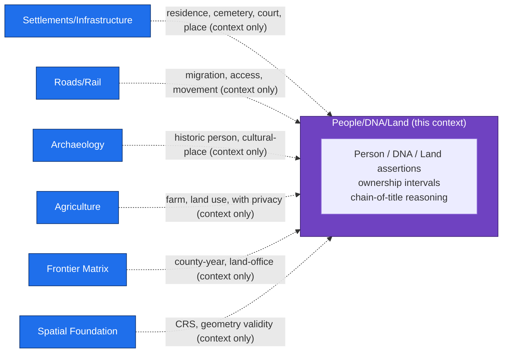
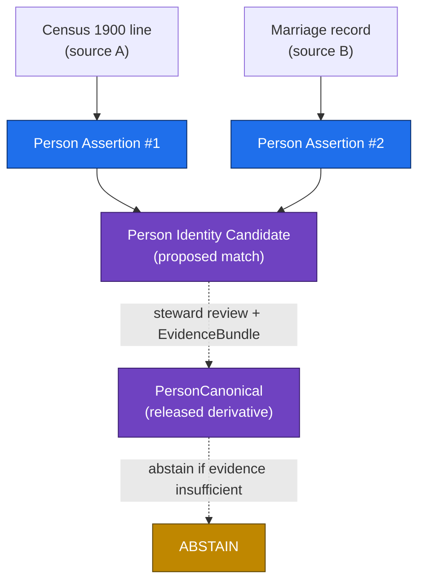
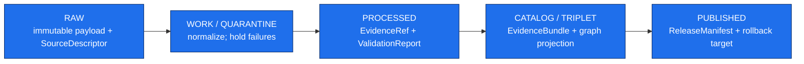

<!-- [KFM_META_BLOCK_V2]
doc_id: kfm://doc/domain/people-dna-land/people-domain-model
title: PEOPLE_DOMAIN_MODEL — People, Genealogy, DNA, Land Ownership
type: standard
subtype: domain-model
version: v0.1
status: draft
owners: <people-dna-land-stewards>  # PLACEHOLDER — assign before review
created: 2026-06-07
updated: 2026-06-07
policy_label: public
contract_version: "3.0.0"
related:
  - docs/domains/people-dna-land/README.md                     # PROPOSED; NEEDS VERIFICATION
  - docs/domains/people-dna-land/MISSING_OR_PLANNED_FILES.md   # authored prior session (v0.2)
  - docs/doctrine/directory-rules.md
  - docs/doctrine/lifecycle-law.md                             # PROPOSED placement; NEEDS VERIFICATION
  - docs/doctrine/trust-membrane.md                            # PROPOSED placement; NEEDS VERIFICATION
  - docs/atlases/KFM_Domains_Culmination_Atlas_v1_1.pdf        # PROPOSED per ADR-S-02
  - ai-build-operating-contract.md
extends:
  - KFM Domains Culmination Atlas v1.1 — Ch. 16 (People/Genealogy/DNA/Land) §A–§N, Ch. 24.5 (Sensitivity tiers), Ch. 24.13 (Responsibility Root Crosswalk), Appendix C (Object family index)
  - Domain-Driven Design Reference (Eric Evans, 2015) — Entities, Value Objects, Aggregates, Factories, Bounded Context, Ubiquitous Language
  - Directory Rules v1.3 — §5, §7 (trust membrane / schema home), §12 (Domain Placement Law)
  - Pass-10 Idea Index — C6 (Sensitivity/Redaction/Geoprivacy), C9 (Consent & DTC Genomic Inputs)
authority_posture: domain-model doctrine for the People/DNA/Land bounded context — subordinate to ai-build-operating-contract.md, Directory Rules, the Atlas, and any mounted-repo evidence; supersedes no source doctrine
truth_labels: [CONFIRMED, PROPOSED, INFERRED, NEEDS VERIFICATION, UNKNOWN, CONFLICTED]
tags: [kfm, domain, people-dna-land, domain-model, ddd, bounded-context, governance, sensitivity-T4]
notes:
  - "CONTRACT_VERSION pinned to 3.0.0 per ai-build-operating-contract.md."
  - "No mounted repo was inspected. Field-level realizations, identity-rule digests, route names, and DTO shapes are PROPOSED; presence claims are NEEDS VERIFICATION."
  - "Domain ownership boundary, object families, and sensitivity posture are CONFIRMED doctrine from Atlas Ch. 16 §B/§E/§I and Appendix C."
  - "OPEN CONFLICT carried from MISSING_OR_PLANNED_FILES v0.2: segment name 'people' (Atlas Ch. 24.13) vs 'people-dna-land' (Directory Rules §12). Tracked as OQ-PDL-SEG-01."
  - "DDD pattern vocabulary (Entity/Value Object/Aggregate) is mapped onto KFM object families as an INFERRED modeling lens; KFM's assertion-first identity rule is the governing constraint, not classical mutable-entity identity."
[/KFM_META_BLOCK_V2] -->

# PEOPLE_DOMAIN_MODEL — People, Genealogy, DNA, Land Ownership

> The bounded-context model for the **People/DNA/Land** (`people-dna-land`) domain: what it owns, what it refuses to own, the object families and their identity rules, the aggregate boundaries and invariants, and the governance that keeps living-person, DNA, title, and parcel-boundary truth from leaking.

[](#1-domain-identity--purpose)
[](#1-domain-identity--purpose)
[](#3-bounded-context--ownership)
[](#9-sensitivity-rights--publication-posture)
[](#5-identity-model--assertion-first)
[](#related-docs)
[](#1-domain-identity--purpose)

| Status | Owners | Last updated |
|---|---|---|
| Draft — domain model; no mounted-repo verification | `<people-dna-land-stewards>` *(PLACEHOLDER — assign before review)* | 2026-06-07 |

> [!CAUTION]
> **Sensitive domain — deny by default.** This context governs living people, genealogy, DNA/genomic data, and private land-ownership assertions. Every object class here is **T4 / deny-by-default** under Atlas Ch. 24.5.2 and the operating contract's §23.2 sensitive-domain matrix unless an explicit transform + receipt chain lifts it. No model surface may carry real living-person identifiers, real DNA segments, or precise private person-parcel joins without `RedactionReceipt` + `ReviewRecord` + `PolicyDecision`. See [§9](#9-sensitivity-rights--publication-posture).

---

## Table of contents

1. [Domain identity & purpose](#1-domain-identity--purpose)
2. [How to read this model](#2-how-to-read-this-model)
3. [Bounded context & ownership](#3-bounded-context--ownership)
4. [Ubiquitous language](#4-ubiquitous-language)
5. [Identity model — assertion-first](#5-identity-model--assertion-first)
6. [Object families & DDD mapping](#6-object-families--ddd-mapping)
7. [Aggregates & invariants](#7-aggregates--invariants)
8. [Source families & source-role anti-collapse](#8-source-families--source-role-anti-collapse)
9. [Sensitivity, rights & publication posture](#9-sensitivity-rights--publication-posture)
10. [Lifecycle (RAW → PUBLISHED)](#10-lifecycle-raw--published)
11. [API, contract & schema surfaces](#11-api-contract--schema-surfaces)
12. [Governed AI behavior](#12-governed-ai-behavior)
13. [Cross-lane relations](#13-cross-lane-relations)
14. [Open questions register](#open-questions-register)
15. [Open verification backlog](#open-verification-backlog)
16. [Changelog](#changelog-v00--v01)
17. [Definition of done](#definition-of-done)
18. [Related docs](#related-docs)

---

## 1. Domain identity & purpose

**CONFIRMED doctrine / PROPOSED implementation.** The People/DNA/Land context governs *assertion-first* person evidence, genealogy relationships, restricted DNA evidence, land instruments, ownership intervals, chain-of-title reasoning, consent, policy decisions, review, correction, graph projection, `EvidenceBundle` views, and rollback (Atlas Ch. 16 §A).

The defining stance is **assertion-first**: the domain does not assert that a person *was* someone or that a parcel *belongs* to someone. It records *who asserted what, from which source, at which time, under which release state*, and lets evidence — not fluency — carry any public claim. A name on a census line is a `NameAssertion`, not a fact about a person; a deed is a `Deed Instrument`, not a determination of title.

> [!IMPORTANT]
> Three boundary truths govern everything below (Atlas Ch. 16 §I):
> 1. **Assessor / tax records are not title truth.** They are `administrative` source-role records.
> 2. **Parcel geometry is not title boundary.** A `LandParcel` polygon is a representation, not a legal determination of where ownership ends.
> 3. **Living-person and DNA-derived output is denied or restricted by default.** Raw kit/vendor IDs and DNA segments are never public.

[↑ Back to top](#table-of-contents)

---

## 2. How to read this model

This document is a **domain model**, not an implementation record. It states the bounded context's meaning, identity rules, aggregate boundaries, and invariants so that `contracts/`, `schemas/`, `policy/`, and `tests/` can be authored consistently against it.

| Label | Meaning in this doc |
|---|---|
| **CONFIRMED** | Grounded in the indexed corpus (Atlas Ch. 16, DDD Reference, Directory Rules, Pass-10). |
| **PROPOSED** | A modeling choice or path not yet verified against a mounted repo. |
| **INFERRED** | Derivable from confirmed doctrine (e.g., the DDD entity/value-object lens applied to KFM object families). |
| **NEEDS VERIFICATION** | Checkable against repo/schema/test evidence; not yet checked. |
| **CONFLICTED** | Two CONFIRMED sources disagree (see [OQ-PDL-SEG-01](#open-questions-register)). |

> [!NOTE]
> Every path in this document is **PROPOSED** under Directory Rules §0 until verified against mounted-repo evidence. The segment name for `schemas/`, `contracts/`, and `policy/sensitivity/` is **CONFLICTED** (`people` vs `people-dna-land`); this model uses `<segment>` for those roots and `people-dna-land` where Directory Rules gives an explicit example.

[↑ Back to top](#table-of-contents)

---

## 3. Bounded context & ownership

A **bounded context** (DDD Reference) is the boundary within which each term has one defined meaning and one owner. Inside this context, `LandParcel`, `Ownership Interval`, `Person Assertion`, and `DNA Match Evidence` mean exactly one thing.

### 3.1 What this domain owns

**CONFIRMED / PROPOSED** (Atlas Ch. 16 §B): Person Assertion · Person Identity Candidate · Genealogy Relationship · FamilyGroup · LifeEvent · Residence Event · Migration Event · Land Ownership Assertion · Deed Instrument · Title Instrument · Assessor Record · TaxRecord · Parcel Version · Ownership Interval · DNA Match Evidence · Relationship Hypothesis.

Appendix C also lists `PersonCanonical`, `NameAssertion`, `DNASegment`, and `LandParcel` as core families; §C adds `DNAKitToken`, `ConsentGrant`, `RevocationReceipt`, `LegalDescription`, and `LandInstrument` to the ubiquitous language.

### 3.2 What this domain explicitly does *not* own

**CONFIRMED / PROPOSED** (Atlas Ch. 16 §B): Settlements, roads, archaeology, hydrology, agriculture, hazards, and spatial foundation provide *context* but do not weaken living-person, DNA, title, or parcel-boundary controls. The Frontier Matrix context owns county-year panels, land-office and public-land records, and frontier definitions — **not** living-person, DNA, title, parcel, or ownership decisions (Atlas Ch. 17 §B).



> [!WARNING]
> Context relations are **dashed for a reason**: a related lane may supply context, but a cross-lane relation MUST preserve ownership, source role, sensitivity, and `EvidenceBundle` support (Atlas Ch. 16 §F). A settlements record never overrides a title control here.

[↑ Back to top](#table-of-contents)

---

## 4. Ubiquitous language

**CONFIRMED** terms (Atlas Ch. 16 §C). Each term is a confirmed term with a **PROPOSED field realization** — meaning it is constrained by source role, evidence, time, and release state, but its concrete fields await `schemas/` authoring.

| Term | Meaning in this context (constrained by source role, evidence, time, release state) |
|---|---|
| `Person Assertion` | A claim *about* a person sourced from one record; not a person. |
| `PersonCanonical` | A reconciled identity thread across assertions; a released derivative, never raw truth. |
| `Person Identity Candidate` | A proposed match between assertions, pending resolution. |
| `NameAssertion` | A name as stated by one source at one time. |
| `LifeEvent` / `Residence Event` / `Migration Event` | Time-scoped event evidence about a person. |
| `Genealogy Relationship` / `RelationshipAssertion` | An asserted relationship between persons. |
| `Relationship Hypothesis` | A `modeled` / `candidate` relationship, often DNA- or tree-derived; not asserted fact. |
| `FamilyGroup` | A grouping construct over persons and relationships. |
| `DNA Match Evidence` | Evidence of a genetic match; restricted. |
| `DNAKitToken` | A token standing in for a DNA kit; never the raw kit. |
| `DNASegment` | A genetic segment; **never public** (T4). |
| `ConsentGrant` | A consent record (JWT / GA4GH AAI passport or visa) authorizing a bounded use. |
| `RevocationReceipt` | A record that a prior consent was revoked, driving downstream cleanup. |
| `LandParcel` | A parcel representation; **not** a title boundary. |
| `LegalDescription` | A textual legal description of land. |
| `LandInstrument` | Parent of `Deed Instrument`, `Title Instrument`; a recorded land document. |
| `Assessor Record` / `TaxRecord` | `administrative` records; **never** title truth. |
| `Parcel Version` | A versioned parcel state over time. |
| `Ownership Interval` | A time-bounded asserted ownership span. |
| `Land Ownership Assertion` | A claim of ownership, evidence-bound; not a legal determination. |

[↑ Back to top](#table-of-contents)

---

## 5. Identity model — assertion-first

DDD's **Entity** pattern says: when an object is distinguished by *identity* rather than attributes, make identity primary, and "the model must define what it means to be the same thing" (DDD Reference, *Entities*). KFM applies this but with a governance twist — identity is **deterministic and assertion-first**, not a mutable database key.

**PROPOSED deterministic identity basis** (Atlas Ch. 16 §E, uniform across object families):

```text
identity = source_id + object_role + temporal_scope + normalized_digest
```

**CONFIRMED temporal handling** (Atlas Ch. 16 §E): source, observed, valid, retrieval, release, and correction times stay **distinct where material**. A model that collapses "when the record says it happened" into "when we retrieved it" is wrong here.

> [!IMPORTANT]
> **Why assertion-first matches DDD's identity warning.** The DDD Reference warns that "mistaken identity can lead to data corruption." In genealogy and land, mistaken identity is the *central* failure mode: two people with the same name, a parcel re-described across surveys, a DNA match misattributed. By keying identity to `source_id + object_role + temporal_scope + normalized_digest`, two assertions about the "same" person remain distinct objects until a `Person Identity Candidate` resolution is reviewed — the model refuses to silently merge.



[↑ Back to top](#table-of-contents)

---

## 6. Object families & DDD mapping

The DDD classification (Entity vs Value Object) is applied as an **INFERRED modeling lens**. KFM's governing rule is the assertion-first identity basis in [§5](#5-identity-model--assertion-first); the lens below aids schema authoring, not a reclassification of doctrine.

| Object family | DDD lens (INFERRED) | Why | Atlas basis |
|---|---|---|---|
| `Person Assertion` | Entity (assertion-keyed) | Distinguished by source+role+time+digest, not attributes. | §B, §E |
| `PersonCanonical` | Entity (reconciled thread) | A continuity thread across assertions; released derivative. | §C, §E |
| `Person Identity Candidate` | Entity (proposed) | A reviewable match object. | §B |
| `NameAssertion` | Value Object | Defined by its content at a time; carried by an assertion. | §C, §E |
| `LifeEvent` / `Residence Event` / `Migration Event` | Entity (event-keyed) | Time-scoped, source-bound event evidence. | §B, §E |
| `Genealogy Relationship` / `RelationshipAssertion` | Entity (relationship-keyed) | Distinguished assertion linking persons. | §B, §C |
| `Relationship Hypothesis` | Entity (`modeled`/`candidate`) | Derived, reviewable; never asserted fact. | §B |
| `FamilyGroup` | Aggregate root (grouping) | Composes persons + relationships under one boundary. | §B |
| `DNA Match Evidence` | Entity (restricted) | Evidence object, T4. | §B, §C |
| `DNAKitToken` | Value Object (token) | Stand-in identifier; never the raw kit. | §C |
| `DNASegment` | Value Object (restricted) | Segment content; T4, never public. | §E |
| `ConsentGrant` | Entity (consent-keyed) | Has a lifecycle: grant → use → revoke. | §C; Pass-10 C6-07, C9-04 |
| `RevocationReceipt` | Value Object (receipt) | Immutable record of a revocation event. | §C; Pass-10 C6-08 |
| `LandParcel` | Entity (parcel-keyed) | Continuity across versions; representation, not boundary. | §C, App. C |
| `Parcel Version` | Value Object (versioned state) | A parcel's state at a time. | §B |
| `LegalDescription` | Value Object | Textual description content. | §C |
| `LandInstrument` (+ `Deed`, `Title`) | Entity (instrument-keyed) | A recorded document with identity. | §B, §C |
| `Assessor Record` / `TaxRecord` | Entity (`administrative`) | Record with identity; **never** title. | §B, §I |
| `Ownership Interval` | Value Object (time span) | A bounded asserted span over a parcel. | §B |
| `Land Ownership Assertion` | Entity (assertion-keyed) | Evidence-bound ownership claim. | §B |

[↑ Back to top](#table-of-contents)

---

## 7. Aggregates & invariants

DDD's **Aggregate** pattern (DDD Reference): cluster objects under a root that enforces invariants as a unit. The aggregate groupings below are **PROPOSED** — they organize the object families into consistency boundaries the contracts and policies must hold.

<details>
<summary><strong>Proposed aggregate boundaries</strong></summary>

| Aggregate (root) | Members | Invariant the root enforces (PROPOSED) |
|---|---|---|
| **Person aggregate** (`PersonCanonical`) | Person Assertions, NameAssertions, LifeEvents, Residence/Migration Events | A `PersonCanonical` exists only via reviewed `Person Identity Candidate` resolution; living-person fields are T4 by default. |
| **Relationship aggregate** (`FamilyGroup`) | Genealogy Relationships, RelationshipAssertions, Relationship Hypotheses | Hypotheses (`modeled`/`candidate`) never promote to asserted relationships without evidence + review. |
| **DNA aggregate** (`DNA Match Evidence`) | DNAKitToken, DNASegment, ConsentGrant, RevocationReceipt | No member is released without a valid, unrevoked `ConsentGrant`; raw segments never cross the publication boundary; a `RevocationReceipt` forces downstream cleanup. |
| **Land aggregate** (`LandParcel`) | Parcel Versions, LegalDescriptions, LandInstruments (Deed/Title), Assessor/Tax Records, Ownership Intervals, Land Ownership Assertions | Assessor/tax never satisfy a title claim; parcel geometry ≠ title boundary; chain-of-title gaps quarantine the assertion. |

</details>

### 7.1 Domain invariants (CONFIRMED doctrine)

These hold across every aggregate and must be expressed as `policy/` rules + `tests/`:

1. **Cite-or-abstain.** A public claim resolves an `EvidenceRef` → `EvidenceBundle`, or the surface ABSTAINs (Atlas Ch. 16 §L).
2. **Deny-by-default for sensitive classes.** Living-person, DNA, and private person-parcel joins are T4 unless lifted by a receipt chain (§9).
3. **Source-role anti-collapse.** Role is fixed at admission; assessor/tax = `administrative`; GEDCOM/tree = `modeled`/`candidate`; role collapse at publication is a DENY ([§8](#8-source-families--source-role-anti-collapse)).
4. **Assessor-is-not-title.** No reasoning path lets an `administrative` record satisfy a title claim (Atlas Ch. 16 §I, §K).
5. **Geometry-is-not-title.** Parcel geometry never determines a title boundary (Atlas Ch. 16 §I).
6. **Consent gates DNA.** No DNA member releases without a valid, unrevoked `ConsentGrant`; revocation fails closed (Pass-10 C6-07, C6-08, C9-04).
7. **Promotion is a governed transition**, not a file move; blocked by unclear rights, unresolved role, missing evidence, unresolved sensitivity, or absent release state (Atlas Ch. 16 §I; Directory Rules §2.1).

[↑ Back to top](#table-of-contents)

---

## 8. Source families & source-role anti-collapse

**CONFIRMED** source families (Atlas Ch. 16 §D). Each enters as `authority / observation / context / model` *as the source role requires*; rights and current terms are **NEEDS VERIFICATION**; sensitive joins **fail closed**.

| Source family | Typical source role(s) | Note |
|---|---|---|
| Vital / cemetery / burial / obituary / church / school / military / census / directory / court / probate records | observation / authority | Person & life-event evidence. |
| GEDCOM / GEDZip / tree overlays | `modeled` / `candidate` | Tree imports are not asserted fact; living-flag honored. |
| DNA vendor match CSV / segment / triangulation data | observation (restricted) | T4; consent-gated; raw never republished. |
| Patent / deed / mortgage / lien / easement / lease / mineral / water / access / probate instruments | authority / observation | Land instruments. |
| Assessor & tax roll records | `administrative` | **Never** title truth. |
| Plat / survey / metes-and-bounds / PLSS / subdivision / derived geometry | modeled / observation | Parcel geometry; **not** title boundary. |

> [!NOTE]
> The seven canonical source roles are `observed | regulatory | modeled | aggregate | administrative | candidate | synthetic`. Role is fixed at admission and **DENY-collapsed** at publication. The exact canonical enum is **DEFERRED — pending ADR-S-04** (source-role vocabulary v1).

[↑ Back to top](#table-of-contents)

---

## 9. Sensitivity, rights & publication posture

**CONFIRMED** (Atlas Ch. 16 §I; Ch. 24.5.2). Living-person and DNA-derived output is denied or restricted by default; raw kit/vendor IDs and DNA segments are not public; assessor/tax records and parcel geometry are not title truth. Unclear rights, unresolved source role, missing evidence, unresolved sensitivity, or absent release state **blocks public promotion**.

| Object / surface | Default tier | Allowed transform (per Atlas 24.5.2) | Required gates |
|---|---|---|---|
| Living-person fields | **T4** | Aggregation by tract/county + `AggregationReceipt` → T1 | Consent or aggregation gate + `ReviewRecord` |
| Raw DNA segment data / kit IDs | **T4** | No public transform; T3 only under named research agreement | Named consent + `ReviewRecord` + `PolicyDecision` |
| Private person-parcel join | **T4** | Generalized parcel + de-identified person → T2 only | `RedactionReceipt` + `ReviewRecord` |
| Assessor / tax cited as title | **DENY** (always) | None — `administrative` is not title | Source-role gate; `PolicyDecision` |
| Chain-of-title with unresolved gap | **Quarantine** | Steward review + correction notice | `ReviewRecord` + `CorrectionNotice` |

> [!WARNING]
> Tier transitions are governed (Atlas Ch. 24.5.3). T4 → T1 requires `RedactionReceipt` + `ReviewRecord` + `PolicyDecision` plus Promotion Gates A–G, and is reversible: a correction may demote a published T1 back to T4 with a `CorrectionNotice`.

[↑ Back to top](#table-of-contents)

---

## 10. Lifecycle (RAW → PUBLISHED)

**CONFIRMED doctrine / PROPOSED lane application** (Atlas Ch. 16 §H). The context follows the lifecycle invariant; promotion is a governed state transition.



| Stage | Gate (CONFIRMED doctrine) | Status |
|---|---|---|
| RAW | `SourceDescriptor` exists (role, rights, sensitivity, citation, time, hash). | PROPOSED |
| WORK / QUARANTINE | Validation + policy gate pass, or quarantine reason recorded. | PROPOSED |
| PROCESSED | `EvidenceRef`, `ValidationReport`, digest closure exist. | PROPOSED |
| CATALOG / TRIPLET | Catalog/proof closure passes; graph/triplet projections sensitivity-filtered. | PROPOSED |
| PUBLISHED | `ReleaseManifest`, correction path, rollback target, review/policy state exist; served via governed API only. | PROPOSED |

[↑ Back to top](#table-of-contents)

---

## 11. API, contract & schema surfaces

**PROPOSED** governed surfaces (Atlas Ch. 16 §J). All routes are TBD/UNKNOWN; finite outcomes are `ANSWER / ABSTAIN / DENY / ERROR` (there is no `ACCEPTED`).

| Surface | DTO / schema (PROPOSED) | Outcomes | Status |
|---|---|---|---|
| Feature/detail resolver | `PeopleDNALandDecisionEnvelope` | ANSWER / ABSTAIN / DENY / ERROR | PROPOSED; route UNKNOWN |
| Layer manifest resolver | `LayerManifest` / domain layer descriptor | ANSWER / DENY / ERROR | PROPOSED; public-safe release only |
| Evidence Drawer payload | `EvidenceDrawerPayload` + `EvidenceBundle` projection | ANSWER / ABSTAIN / DENY / ERROR | PROPOSED; evidence + policy filtered |
| Focus Mode answer | `Runtime Response Envelope` + `AIReceipt` | ANSWER / ABSTAIN / DENY / ERROR | PROPOSED; AI never root truth |
| Schema responsibility root | `schemas/contracts/v1/<segment>/` | finite validator outcomes | PROPOSED; segment CONFLICTED (OQ-PDL-SEG-01); verify per Directory Rules + ADR |

> [!CAUTION]
> Public clients reach these surfaces only through `apps/governed-api/` — never directly from `data/raw/`, `data/work/`, `data/quarantine/`, or canonical stores (trust-membrane invariant, Directory Rules §7).

[↑ Back to top](#table-of-contents)

---

## 12. Governed AI behavior

**CONFIRMED doctrine / PROPOSED implementation** (Atlas Ch. 16 §L; [GAI]). AI may summarize released People/DNA/Land `EvidenceBundle`s, compare evidence, explain limitations, and draft steward-review notes. AI **MUST ABSTAIN** when evidence is insufficient and **MUST DENY** where policy, rights, sensitivity, or release state blocks the request.

> [!IMPORTANT]
> `EvidenceBundle` outranks generated language. AI never reads RAW or WORK content — only released bundles (Atlas Ch. 24.5.2, Governed AI row). Every Focus Mode answer carries an `AIReceipt`.

[↑ Back to top](#table-of-contents)

---

## 13. Cross-lane relations

**CONFIRMED / PROPOSED** (Atlas Ch. 16 §F). Every relation MUST preserve ownership, source role, sensitivity, and `EvidenceBundle` support.

| Related lane | Relation type | Constraint |
|---|---|---|
| Settlements/Infrastructure | residence, cemetery, school, court, county, township, place | Preserve ownership/role/sensitivity/evidence |
| Roads/Rail | migration, access, movement | Preserve ownership/role/sensitivity/evidence |
| Archaeology | historic person, land, documentary, cultural-place context | Preserve ownership/role/sensitivity/evidence |
| Agriculture | farm, land use, producer-adjacent context with privacy | Preserve ownership/role/sensitivity/evidence; private joins deny |

[↑ Back to top](#table-of-contents)

---

## Open questions register

| ID | Question | Owner role | Resolution path |
|---|---|---|---|
| OQ-PDL-SEG-01 | Segment name: Atlas Ch. 24.13 `people` vs Directory Rules §12 `people-dna-land` for `schemas/`, `contracts/`, `policy/sensitivity/`. | Docs steward + architecture | ADR (carried from MISSING_OR_PLANNED_FILES v0.2) |
| OQ-PDL-ID-02 | Confirm the deterministic identity digest (`source_id + object_role + temporal_scope + normalized_digest`) and its `spec_hash` form. | Domain steward | ADR / schema authoring (`jcs:sha256:<hex>` per RFC 8785) |
| OQ-PDL-AGG-03 | Confirm the four proposed aggregate boundaries (§7) against `contracts/` once authored. | Domain steward | Repo inspection + contract review |
| OQ-PDL-ROLE-04 | Canonical source-role enum (ADR-S-04) — fix the seven-role vocabulary. | Architecture | ADR-S-04 |
| OQ-PDL-TIER-05 | T0–T4 scheme adoption (ADR-S-05) — freeze §9 register. | Governance | ADR-S-05 |

## Open verification backlog

These remain `NEEDS VERIFICATION` before promotion from `draft` to `published` (Atlas Ch. 16 §N):

1. Living-person policy enforcement (schemas, registry, tests, logs, review records).
2. DNA consent / revocation enforcement.
3. Land-instrument chain logic.
4. Geometry-role boundary logic (geometry ≠ title).
5. UI/API restricted-field no-leak behavior.
6. The PROPOSED aggregate boundaries (§7) and identity digest (§5) against authored schemas.
7. Segment-name resolution (OQ-PDL-SEG-01) before any `schemas/`/`contracts/` path is treated as canonical.

## Changelog v0.0 → v0.1

| Change | Type (per contract §37) | Reason |
|---|---|---|
| Initial domain model authored from Atlas Ch. 16 §A–§N + Appendix C. | new | First model for the People/DNA/Land bounded context. |
| Added DDD entity/value-object/aggregate lens (§6, §7). | new | Grounds schema authoring against DDD Reference; marked INFERRED. |
| Carried OQ-PDL-SEG-01 segment conflict from MISSING_OR_PLANNED_FILES v0.2. | reconciliation | Avoids asserting a contested segment as settled. |
| Folded Pass-10 C6/C9 consent and sensitivity basis into §7, §8, §9. | gap closure | Grounds the consent and redaction invariants. |

> **Backward compatibility.** New document; no prior anchors to preserve.

## Definition of done

This document is done enough to enter the repository when:

- it is placed at `docs/domains/people-dna-land/PEOPLE_DOMAIN_MODEL.md` per Directory Rules §6.1;
- a docs steward and the People/DNA/Land domain steward review it;
- it is linked from `docs/domains/people-dna-land/README.md` and any doctrine/domain index;
- it does not conflict with accepted ADRs (especially ADR-0001, ADR-S-04, ADR-S-05);
- OQ-PDL-SEG-01 is logged in `docs/registers/DRIFT_REGISTER.md` until resolved by ADR;
- the `GENERATED_RECEIPT.json` planned in Section 2 is wired into CI with `human_review.state == "approved"`;
- future changes follow the operating contract's §37 lifecycle.

[↑ Back to top](#table-of-contents)

---

## Related docs

- `docs/domains/people-dna-land/README.md` *(PROPOSED; NEEDS VERIFICATION)*
- `docs/domains/people-dna-land/MISSING_OR_PLANNED_FILES.md` — file inventory (v0.2; source of OQ-PDL-SEG-01)
- `docs/doctrine/directory-rules.md` — §5, §7 trust membrane / schema home, §12 Domain Placement Law
- `docs/doctrine/lifecycle-law.md` *(PROPOSED placement)*
- `docs/doctrine/trust-membrane.md` *(PROPOSED placement)*
- `docs/atlases/KFM_Domains_Culmination_Atlas_v1_1.pdf` — Ch. 16 (People/DNA/Land), Ch. 24.5 (Sensitivity), Ch. 24.13 (Crosswalk), Appendix C *(PROPOSED placement per ADR-S-02)*
- `ai-build-operating-contract.md` — `CONTRACT_VERSION = "3.0.0"`; §23.2 sensitive-domain matrix
- Domain-Driven Design Reference (Eric Evans, 2015) — Entities, Value Objects, Aggregates, Bounded Context

---

<sub>
<strong>Last updated:</strong> 2026-06-07 ·
<strong>Edition:</strong> v0.1 model ·
<strong>CONTRACT_VERSION:</strong> 3.0.0 ·
<strong>Authority posture:</strong> domain-model doctrine; subordinate to operating contract, Directory Rules, and the Atlas ·
<a href="#people_domain_model--people-genealogy-dna-land-ownership">↑ Back to top</a>
</sub>
