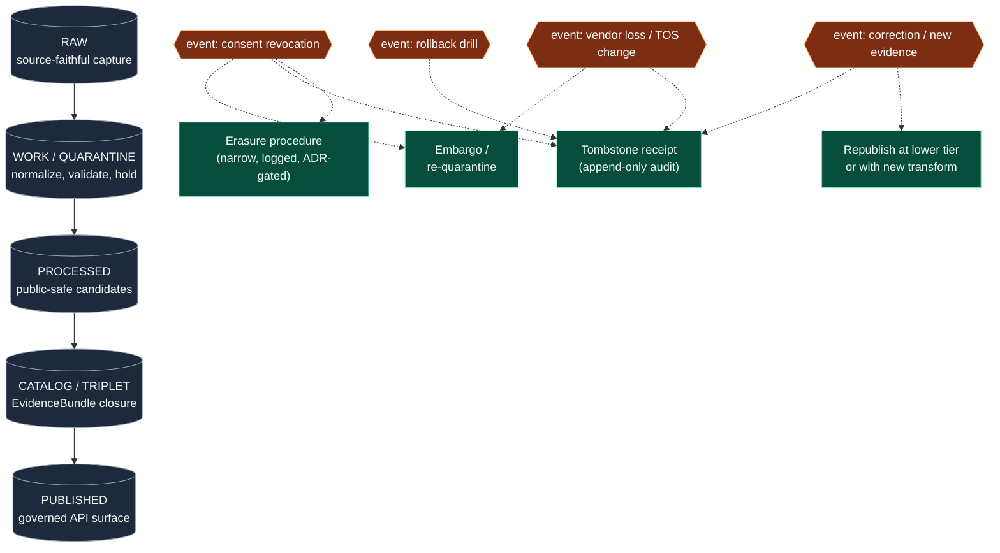

<!-- [KFM_META_BLOCK_V2]
doc_id: kfm://doc/docs-domains-people-dna-land-preservation-matrix
title: People · DNA · Land — Preservation Matrix
type: standard
version: v0.1
status: draft
owners: People/DNA/Land domain steward + Docs steward (PLACEHOLDER — confirm in ADR-S-people-stewards)
created: 2026-05-19
updated: 2026-05-19
policy_label: public-doctrine
related:
  - docs/domains/people-dna-land/README.md
  - docs/domains/people-dna-land/ARCHITECTURE.md
  - docs/domains/people-dna-land/VERIFICATION_BACKLOG.md
  - docs/doctrine/directory-rules.md
  - docs/doctrine/lifecycle-law.md
  - docs/doctrine/trust-membrane.md
  - docs/standards/SENSITIVITY_RUBRIC.md
  - docs/runbooks/revocation.md
  - docs/registers/DRIFT_REGISTER.md
tags: [kfm, domain, people, dna, land, preservation, retention, consent, tombstone, CARE]
notes:
  - PROPOSED synthesis assembling CONFIRMED corpus doctrine into matrix form for this domain.
  - No mounted repo inspected in this authoring session — all repo paths are PROPOSED / NEEDS VERIFICATION.
  - Open question OPEN-PRES-01: tombstone vs. erasure boundary not yet codified upstream.
[/KFM_META_BLOCK_V2] -->

# People · DNA · Land — Preservation Matrix

> A reviewable, per-object map of what must be preserved, what must be transformed, what must be tombstoned, and what (rarely, narrowly) must be erased — for the most ethically loaded domain in KFM.

---

### Status & ownership

| Field | Value |
|---|---|
| **Doc class** | Standard doc · domain dossier member |
| **Edition** | v0.1 (initial authoring) |
| **Authority of the matrix shape** | PROPOSED — synthesis aligned with [ENCY] §6.2, Atlas v1.1 §24.5, Directory Rules §12 |
| **Authority of doctrinal rules cited** | CONFIRMED — see citations inline |
| **Authority of any specific path / route / schema URI** | PROPOSED / NEEDS VERIFICATION until repo inspection |
| **Owners (PLACEHOLDER)** | People/DNA/Land domain steward; Docs steward; release authority (separation of duties at maturity) |
| **Conflict rule** | When this matrix disagrees with the domain ARCHITECTURE, doctrine, ADRs, or Atlas v1.1, **doctrine wins** and the disagreement files to `docs/registers/DRIFT_REGISTER.md` per Directory Rules §2.5 |
| **Last reviewed** | 2026-05-19 |

> [!IMPORTANT]
> **Deny-default posture.** Every row in this matrix begins from T4 (denied) unless an explicit, evidenced, policy-approved transform path is named. Living-person fields, raw DNA, and private person-parcel joins are denied by default; quiet promotion is a failure mode, not a feature. [DOM-PEOPLE] [ENCY Atlas v1.1 §24.5]

---

## 📑 Contents

1. [Scope](#1-scope)
2. [How to read this matrix](#2-how-to-read-this-matrix)
3. [Sensitivity tier recap](#3-sensitivity-tier-recap)
4. [Preservation flow](#4-preservation-flow)
5. [Object-class preservation matrix](#5-object-class-preservation-matrix)
6. [Trigger → action matrix](#6-trigger--action-matrix)
7. [Tombstone vs. erasure decision matrix](#7-tombstone-vs-erasure-decision-matrix)
8. [Source-family preservation profile](#8-source-family-preservation-profile)
9. [Anti-patterns this matrix exists to prevent](#9-anti-patterns-this-matrix-exists-to-prevent)
10. [Open questions & verification backlog](#10-open-questions--verification-backlog)
11. [Related docs](#11-related-docs)

---

## 1. Scope

**This matrix governs preservation duties for objects owned by the People, Genealogy, DNA, and Land Ownership domain** — i.e., the object families enumerated in [DOM-PEOPLE] §B and [ENCY] Appendix C: *Person Assertion, PersonCanonical, NameAssertion, LifeEvent, Residence Event, Migration Event, Genealogy Relationship, FamilyGroup, DNA Match Evidence, DNASegment, DNAKitToken, ConsentGrant, RevocationReceipt, Relationship Hypothesis, LandParcel, LegalDescription, LandInstrument, Deed Instrument, Title Instrument, Assessor Record, TaxRecord, Parcel Version, Ownership Interval.* [DOM-PEOPLE] [ENCY]

**What this matrix is.** A 2-D reference layer that crosses domain object classes with the preservation duties imposed by the KFM lifecycle invariant, the tier scheme, the consent regime, the audit-ledger discipline, and the rollback contract. It is a reading aid for stewards and reviewers — not a separate authority.

**What this matrix is not.**

- It is **not** the policy. Policy lives in `policy/sensitivity/people/`, `policy/consent/people/`, and `policy/domains/people-dna-land/` (PROPOSED paths per Directory Rules §6.5).
- It is **not** the schema. Schema lives in `schemas/contracts/v1/domains/people-dna-land/` (PROPOSED per ADR-0001 schema-home convention).
- It is **not** the runbook. Revocation drills, vendor-loss playbooks, and erasure procedures live in `docs/runbooks/` (PROPOSED).
- It is **not** a release surface. No object listed here is published merely because the matrix names it.

**Bounded non-ownership.** This matrix does **not** govern: Frontier-Matrix demographic panels (those aggregate from this domain but their preservation duties live with [DOM-FM]); Archaeology cultural-heritage records (see [DOM-ARCH]); Settlements infrastructure (see [DOM-SETTLE]). When a record straddles a boundary, preservation duties stack — not collapse. [DOM-PEOPLE] [ENCY]

[↑ back to top](#people--dna--land--preservation-matrix)

---

## 2. How to read this matrix

Every preservation rule in this domain is a function of **four** independent variables. A row is a preservation rule **only if all four are answered**:

1. **What kind of object is it?** (Person Assertion · LandInstrument · DNASegment · …)
2. **What lifecycle phase is it in?** (RAW · WORK/QUARANTINE · PROCESSED · CATALOG/TRIPLET · PUBLISHED)
3. **What is its sensitivity tier today?** (T0 · T1 · T2 · T3 · T4 per Atlas v1.1 §24.5)
4. **What event is firing?** (steady state · consent revocation · vendor-loss · correction · sovereignty change · subject death · re-tier downgrade · rollback drill)

Read the matrix as: *"Given object X in phase Y at tier Z, when event E fires, do A."* Where any of X/Y/Z/E is unresolved, the answer **defaults to deny / quarantine / abstain** — never to publish. [ENCY] [DIRRULES]

> [!NOTE]
> **Truth-label key.** **CONFIRMED** = grounded in attached doctrine. **PROPOSED** = doctrine implies but does not codify; awaiting verification. **NEEDS VERIFICATION** = checkable against a mounted repo, not yet checked. **UNKNOWN** = not resolvable from current evidence. Every retention number in this matrix is **PROPOSED** until a Retention SLA ADR lands ([Pass 10 Appendix C.1 item 3](#10-open-questions--verification-backlog)).

[↑ back to top](#people--dna--land--preservation-matrix)

---

## 3. Sensitivity tier recap

Reproduced compactly from Atlas v1.1 §24.5 for in-page reference; the master tier table at [ENCY] Atlas v1.1 §24.5 governs. [ENCY]

| Tier | Name | Default audience | People · DNA · Land application |
|---|---|---|---|
| **T0** | Open | Any public client via governed API | Aggregate / pre-1900 / fully-published vital records where rights are clean. |
| **T1** | Generalized | Any public client, after recorded transform | County-aggregated population panels; generalized parcel polygons. |
| **T2** | Reviewer | Stewards · reviewers · named collaborators | Working person-assertion graphs prior to release; relationship hypotheses. |
| **T3** | Restricted | Named authorized parties under recorded agreement | DNA segments under explicit research-agreement; living-person review datasets. |
| **T4** | Denied | — | Raw DNA segments · living-person fields · private person-parcel joins · raw DTC kits. |

> [!WARNING]
> **Tier upgrades (toward more public) require both a transform receipt AND a review record.** Tier downgrades (toward less public) need a `CorrectionNotice` alone — correction is always sufficient to restrict. [ENCY Atlas v1.1 §24.5.3]

[↑ back to top](#people--dna--land--preservation-matrix)

---

## 4. Preservation flow

The CONFIRMED lifecycle invariant from Directory Rules §0 is `RAW → WORK/QUARANTINE → PROCESSED → CATALOG/TRIPLET → PUBLISHED`. For this domain, preservation branches off that spine at four event hinges: consent revocation, vendor-loss, correction, and rollback. [DIRRULES] [DOM-PEOPLE] [ENCY]

> [!NOTE]
> **PROPOSED diagram.** The five lifecycle phases are CONFIRMED [DIRRULES]; the four event hinges are CONFIRMED [DOM-PEOPLE §M, ENCY §24.5, Pass 10 C5-09 / C6-08 / C9-07]. The dashed paths show which preservation actions are valid responses — but the *choice* between tombstone, erasure, embargo, or republication is governed by §§6–7 below, not by the diagram alone.

[↑ back to top](#people--dna--land--preservation-matrix)

---

## 5. Object-class preservation matrix

Rows are the object families this domain owns ([DOM-PEOPLE] §B). Columns are the preservation duties that follow from KFM doctrine. Default-tier values reproduce [ENCY] Atlas v1.1 §24.5; retention values are **PROPOSED** placeholders awaiting the Retention SLA ADR ([Pass 10 Appendix C.1 item 3](#10-open-questions--verification-backlog)).

| Object class | Default tier | RAW retention | Derived retention | Audit / tombstone retention | Erasure-eligible? | Citation |
|---|---|---|---|---|---|---|
| Person Assertion (deceased subject) | T0–T1 | indefinite (historical record) | indefinite | indefinite | NO — historical claim | [DOM-PEOPLE §I] |
| Person Assertion (living subject) | T4 | encrypted RAW only; PROPOSED ≤ TTL of consent | only via aggregation/k-anon → T1 | indefinite tombstone, no claim retained | NEEDS VERIFICATION | [DOM-PEOPLE §I], [Pass 10 C6-06, C6-08] |
| PersonCanonical | mirrors strongest input | mirrors strongest input | mirrors strongest input | indefinite | NEEDS VERIFICATION | [DOM-PEOPLE §E] |
| NameAssertion | T0–T1 | source-vintage | indefinite (graph projection) | indefinite | NO | [DOM-PEOPLE §C] |
| LifeEvent · Residence · Migration | T0–T2 by living-flag | source-vintage | indefinite for deceased; consent-bound for living | indefinite | per subject status | [DOM-PEOPLE §C] |
| Genealogy Relationship | T1–T2 | source-vintage | indefinite (graph projection) | indefinite | NO unless living-leak | [DOM-PEOPLE §B] |
| FamilyGroup | T1–T2 | source-vintage | indefinite | indefinite | NO | [DOM-PEOPLE §B] |
| Relationship Hypothesis | T2 default | working set only | NEVER published as truth | indefinite (audit) | NO | [DOM-PEOPLE §I] |
| **DNA Match Evidence** | **T4** | encrypted RAW, scoped access, PROPOSED TTL bound by consent | aggregate / k-anonymized only, with `AggregationReceipt` | indefinite tombstone | NEEDS VERIFICATION — see §7 | [DOM-PEOPLE §I], [Pass 10 C9-03, C9-04] |
| **DNASegment** | **T4** forever-T4 unless named research agreement → T3 | encrypted RAW only | NEVER public; T3 only under named consent | indefinite tombstone | NEEDS VERIFICATION | [ENCY Atlas v1.1 §24.5.2], [Pass 10 C9-03] |
| **DNAKitToken** | **T4** | pointer-only; raw kit/vendor ID NEVER logged | never derived | indefinite tombstone | NEEDS VERIFICATION | [DOM-PEOPLE §C], [Pass 10 C9-03] |
| **ConsentGrant** | T2 | signed manifest, indefinite | indefinite (governs other rows) | indefinite | NO (would destroy audit) | [Pass 10 C6-07, KFM-P17-PROG-0018] |
| **RevocationReceipt** | T2 | signed manifest, indefinite, append-only | indefinite | indefinite (this *is* the audit) | NO | [Pass 10 C5-09, C6-08, KFM-P19-IDEA-0003] |
| LandParcel (current) | T0–T1 | source-vintage | indefinite | indefinite | NO | [DOM-PEOPLE §C] |
| LegalDescription | T0 | indefinite | indefinite | indefinite | NO | [DOM-PEOPLE §C] |
| LandInstrument · Deed · Title (historical) | T0 | indefinite (public record) | indefinite | indefinite | NO | [DOM-PEOPLE §B] |
| Assessor Record · TaxRecord | T1–T2 | source-vintage | indefinite as *evidence*; never as title truth | indefinite | NO | [DOM-PEOPLE §I] — "assessor/tax records are not title truth" |
| Parcel Version | T0–T1 | source-vintage | indefinite | indefinite | NO | [DOM-PEOPLE §B] |
| Ownership Interval | T0–T1 | source-vintage | indefinite | indefinite | NO | [DOM-PEOPLE §B] |
| **Private person-parcel join** | **T4** | working set only; never persisted publicly | T2 only via generalized parcel + de-identified person | indefinite tombstone | NEEDS VERIFICATION | [ENCY Atlas v1.1 §24.5.2] |

> [!CAUTION]
> **Quiet defaults are failure modes.** Any row without an explicit tier, transform, and gate falls to T4 / DENY at runtime. The matrix does not "discover" a public-safe path for an unlabeled record. If a steward cannot place a record into a row above, the record stays in WORK/QUARANTINE. [ENCY] [DIRRULES]

[↑ back to top](#people--dna--land--preservation-matrix)

---

## 6. Trigger → action matrix

Preservation is event-driven. Steady-state retention is the easy column; the hard columns are what fires when consent is withdrawn, when a DTC vendor files Chapter 11, when a subject dies, or when new evidence corrects a claim. [Pass 10 C5-09, C6-08, C9-07]

| Trigger | RAW action | WORK / PROCESSED action | CATALOG / PUBLISHED action | Audit ledger action | Cache / tile action |
|---|---|---|---|---|---|
| **Consent revocation** (subject withdraws) | Hold in encrypted RAW pending erasure decision; **never delete silently** | Re-quarantine working derivatives | Append `RevocationReceipt`; remove from layer manifest at next release | Append signed tombstone with `revocation_id` and supersession ref | Invalidate PMTiles / tile cache via revocation endpoint (`embargo_until = now`) |
| **DTC vendor loss / TOS change** (e.g., 23andMe Ch. 11) | Embargo all affected raw exports; freeze ingestion | Halt promotion of dependent derivatives | Demote affected layers to T4; emit `CorrectionNotice` | Append vendor-watch event + per-record tombstones for ambiguous-consent records | Cache purge for affected vendor-derived layers |
| **Correction** (new evidence supersedes a published claim) | RAW preserved | Working derivative re-validated | Republish under new digest; old release tombstoned, not deleted | Append correction lineage with supersession ref | Cache invalidation; downstream derivatives recompiled |
| **Subject death** (living → deceased status change) | RAW preserved | Re-classify living-flag; rerun policy gate | Promote previously denied fields if rights and evidence support | Append status-change receipt | No invalidation unless tier moved |
| **Sovereignty / CARE-authority change** | RAW preserved | Re-evaluate `authority_to_control` field | Default-deny until renewed consent grant | Append CARE-event entry | Embargo applies until renewed |
| **Rollback drill / replay** | RAW used as replay input | Replay validates from RAW to current release | Compare replayed release to current; record any drift | Append `RollbackCard` exercise receipt | None (drill is non-public) |
| **Right-to-erasure request** | See §7 — **escalates to ADR-gated procedure** | — | — | Tombstone always; erasure only after ADR + named authority | — |

> [!IMPORTANT]
> **Tombstone before delete.** Across every event row above, the **first** action is to append an immutable record (tombstone, correction, receipt). Physical removal of any object is a **second, separate, ADR-gated action** — never an alternative to recording. [Pass 10 C1-06, C5-09]

[↑ back to top](#people--dna--land--preservation-matrix)

---

## 7. Tombstone vs. erasure decision matrix

The corpus is explicit that **tombstones satisfy explainability but not erasure** ([Pass 10 C5-09 tensions]). For this domain, the boundary between "tombstone is sufficient" and "physical erasure is required" is currently **NEEDS VERIFICATION** — it depends on the right-to-erasure framework that applies to the subject (jurisdiction, vendor TOS, CARE/sovereignty obligations) and on whether the audit-ledger immutability is preserved by external archival proof. [Pass 10 §8.4 explicit gap], [Pass 10 KFM-P9-PROG-0018]

| Scenario | Tombstone alone? | Physical erasure required? | Gate | Status |
|---|---|---|---|---|
| Public deceased-subject claim corrected | YES | NO | `CorrectionNotice` + `ReviewRecord` | CONFIRMED doctrine |
| Living-subject record where consent was never valid (ingested in error) | NO | YES — quarantine + delete RAW + tombstone | ADR-gated; steward + rights-holder sign-off | PROPOSED |
| Living-subject record under valid revoked consent | YES (default) | Only if revocation grant requires deletion | `RevocationReceipt` + DUO-code check | NEEDS VERIFICATION |
| Raw DNA segment under revoked DTC consent (e.g., vendor Ch. 11) | YES (default) | If vendor TOS or jurisdiction mandates erasure | ADR-gated; vendor-watch trigger | NEEDS VERIFICATION |
| CARE-controlled record where the controlling authority revokes | YES (default) | If the authority's revocation explicitly requires erasure | Steward + named authority sign-off | NEEDS VERIFICATION |
| Audit ledger itself | NEVER erased | NEVER | append-only invariant | CONFIRMED [Pass 10 C1-06] |

> [!WARNING]
> **Erasure is the narrowest exception to the append-only invariant, not the rule.** When erasure occurs, the *fact of erasure* is itself logged: an erasure receipt records who decided, on what evidence, under what authority, and which objects were removed — without restating the removed content. [Pass 10 §8.4, KFM-P9-PROG-0018]

[↑ back to top](#people--dna--land--preservation-matrix)

---

## 8. Source-family preservation profile

Per-source preservation diverges from per-object preservation: a single source can spawn many object instances, each with its own tier and retention. This table captures the **upstream** preservation duties at the source level. Source families reproduced from [DOM-PEOPLE] §D.

| Source family | Default tier of capture | RAW preservation | Vendor-watch applies? | Notes |
|---|---|---|---|---|
| Vital · cemetery · burial · obituary · church · school · military · census · directory · court · probate records | T0–T2 by living-flag | indefinite; source-faithful | NO | Living-flag determined at ingest; reverify at promotion. |
| GEDCOM / GEDCOM-X / GEDZip tree overlays | T2 working | **preserve original file as asset** + custom-tag provenance sidecar | NO | [Pass 10 C9-01], [KFM-P22-PROG-0046]. |
| FamilySearch API responses | T2 | RAW response + Passport claim fingerprint (not token) + response checksum | YES (OAuth2 scope revocation propagates) | Retention policy NEEDS VERIFICATION — open question [Pass 10 C9-02]. |
| DNA vendor match CSV · segment · triangulation data | T4 | encrypted RAW only; access-scoped; **raw genotype never republished** | YES — vendor-watch is mandatory | [Pass 10 C9-03, C9-07]. |
| DTC raw genomic exports (23andMe, AncestryDNA, MyHeritage) | T4 | encrypted RAW only; PROPOSED TTL bound by consent | YES — 23andMe Ch. 11 (2025) is the canonical scenario | [Pass 10 C9-03, C9-07]. |
| Patent · deed · mortgage · lien · easement · lease · mineral · water · access · probate instruments | T0 | indefinite (public record) | NO | [DOM-PEOPLE §D]. |
| Assessor and tax-roll records | T1–T2 | source-vintage; **never treated as title truth** | NO | [DOM-PEOPLE §I] — assessor-as-title denial validator. |
| Plat · survey · metes · bounds · PLSS · subdivision · derived geometry | T0–T1 | indefinite | NO | Geometry never carries title-boundary authority without source-role evidence [DOM-PEOPLE §I]. |
| Oral-history and cultural knowledge (cross-domain with [DOM-ARCH]) | T3–T4 default | sovereignty review required before any preservation transform | NO; CARE-authority watch applies | [Pass 10 C15-01..04]; CARE fields required in MetaBlock v2. |

[↑ back to top](#people--dna--land--preservation-matrix)

---

## 9. Anti-patterns this matrix exists to prevent

Drawn from [DOM-PEOPLE] §I, [ENCY] §24.5, Pass 10 C5-09 / C6-08 / C9-03 / C9-07, and the Directory Rules §13 anti-patterns. Each is a documented failure mode; the matrix exists so reviewers can name and refuse it.

- **Silent deletion of RAW after consent revocation.** Revocation appends; it does not delete by default. Deletion requires the §7 erasure path with its own receipt.
- **Treating tombstone as erasure.** Tombstone hides; erasure removes. Conflating them either leaks (treating erasure-required records as tombstoned-and-retained) or loses audit (treating tombstone-sufficient records as deleted).
- **Promoting Relationship Hypothesis as truth.** Hypotheses are working-set objects [DOM-PEOPLE §B]; they do not cross the publication boundary as claims.
- **Treating assessor or tax records as title truth.** Assessor-as-title denial is a doctrinal validator [DOM-PEOPLE §I, §K].
- **Treating parcel geometry as title-boundary proof.** Geometry without source-role evidence is context, not title [DOM-PEOPLE §I].
- **Persisting a private person-parcel join publicly.** T4 default; only generalized-parcel + de-identified-person → T2 paths exist [ENCY §24.5.2].
- **Logging raw kit / vendor DNA IDs.** Pointer-only [Pass 10 C9-03]; raw IDs never enter logs, receipts, or evidence bundles.
- **Vacuuming or partition-pruning evidence without an Archive Manifest.** Storage maintenance is a governance decision, not a janitorial one [Pass 10 KFM-P9-PROG-0010, -0011, -0018].
- **Falling back to T0 because a record's tier is unresolved.** Unlabeled records default to **T4 / DENY**, never to publish.
- **AI summarization standing in for evidence.** AI may summarize *released* EvidenceBundles only; it must ABSTAIN where evidence is insufficient and DENY where policy blocks [DOM-PEOPLE §L, GAI].

[↑ back to top](#people--dna--land--preservation-matrix)

---

## 10. Open questions & verification backlog

These items must resolve before any retention number, route, schema URI, or test name in this matrix becomes operational. Mirrors the per-domain Verification Backlog discipline in [DOM-PEOPLE] §N.

| ID | Item to verify | Evidence that would settle it | Status | Cross-ref |
|---|---|---|---|---|
| OPEN-PRES-01 | Tombstone vs. erasure boundary for personal data | ADR + documented jurisdictional / vendor-TOS / CARE-authority criteria | NEEDS VERIFICATION | [Pass 10 §8.4, C5-09] |
| OPEN-PRES-02 | Retention SLAs for each lifecycle tier (RAW … TOMBSTONED) | Retention SLA ADR with per-tier numbers | NEEDS VERIFICATION | [Pass 10 Appendix C.1 item 3] |
| OPEN-PRES-03 | FamilySearch response retention after consent revocation | FamilySearch Retention Policy doc aligned with GA4GH revocation semantics | NEEDS VERIFICATION | [Pass 10 C9-02] |
| OPEN-PRES-04 | DTC raw retention period — solvent vendor vs. distressed vendor | Vendor-watch SOP + retention triggers | NEEDS VERIFICATION | [Pass 10 C9-03, C9-07] |
| OPEN-PRES-05 | Consent vocabulary normalization (JWT · GA4GH Passport · MetaBlock v2) | Canonical normalization spec | NEEDS VERIFICATION | [Pass 10 §8.6] |
| OPEN-PRES-06 | DUO version handling in long-running consent grants | DUO compatibility profile pinned to policy bundle | NEEDS VERIFICATION | [Pass 10 C9-04] |
| OPEN-PRES-07 | Living-person policy enforcement (schema · validator · UI · API · CI) | Mounted repo: files, schemas, registry, tests, logs, manifests | NEEDS VERIFICATION | [DOM-PEOPLE §N] |
| OPEN-PRES-08 | DNA consent / revocation enforcement | Mounted repo: files, schemas, registry, tests, logs, manifests | NEEDS VERIFICATION | [DOM-PEOPLE §N] |
| OPEN-PRES-09 | Land instrument chain-of-title logic | Mounted repo: files, schemas, registry, tests, logs, manifests | NEEDS VERIFICATION | [DOM-PEOPLE §N] |
| OPEN-PRES-10 | Geometry-role boundary logic (geometry ≠ title) | Mounted repo: files, schemas, registry, tests, logs, manifests | NEEDS VERIFICATION | [DOM-PEOPLE §N] |
| OPEN-PRES-11 | UI / API restricted-field no-leak behavior | Mounted repo: files, schemas, registry, tests, logs, manifests | NEEDS VERIFICATION | [DOM-PEOPLE §N] |
| OPEN-PRES-12 | Object families that must never be vacuumed without external archival proof | Archive Manifest + retention/vacuuming policy ADR | NEEDS VERIFICATION | [Pass 10 KFM-P9-PROG-0010] |
| OPEN-PRES-13 | Erasure-receipt schema (what to log when log-without-content is required) | Schema + fixtures + policy test | PROPOSED | derived from §7 |
| OPEN-PRES-14 | Owner names for this matrix (steward, release authority, separation of duties) | ADR-S-people-stewards (PROPOSED) | UNKNOWN | placeholder in front-matter |

Why this backlog matters (click to expand)

Every entry above is a place where a quiet drift could turn the preservation matrix from a trust artifact into theater. The corpus is explicit that retention discipline without codified numbers becomes "answered ad hoc per domain" ([Pass 10 §8.4]); that the tombstone-erasure boundary is the most consequential unresolved question in the consent regime ([Pass 10 C5-09 open questions]); and that vendor-loss scenarios like 23andMe's March-2025 Chapter 11 filing have already moved consent posture from a steady-state concern to a live operational drill ([Pass 10 C9-07]). This matrix is honest about what it does not yet decide.

[↑ back to top](#people--dna--land--preservation-matrix)

---

## 11. Related docs

- `docs/domains/people-dna-land/README.md` — domain dossier landing page (PROPOSED authoring; consult before extending this matrix). [ENCY §6.2]
- `docs/domains/people-dna-land/ARCHITECTURE.md` — system architecture for this domain (PROPOSED authoring). [ENCY §6.2]
- `docs/domains/people-dna-land/VERIFICATION_BACKLOG.md` — open verification items including those mirrored in §10. [ENCY §6.2, DOM-PEOPLE §N]
- `docs/doctrine/directory-rules.md` — canonical placement and lifecycle invariant. [DIRRULES]
- `docs/doctrine/lifecycle-law.md` — promotion as governed transition, not file move. [DIRRULES]
- `docs/doctrine/trust-membrane.md` — public surface never reads canonical store directly. [DIRRULES §7.1]
- `docs/standards/SENSITIVITY_RUBRIC.md` — sensitivity-rank canonical rubric (PROPOSED; [Pass 10 C6-01]).
- `docs/runbooks/revocation.md` — operational revocation playbook (PROPOSED; [Pass 10 C5-09 expansion]).
- `docs/registers/DRIFT_REGISTER.md` — where conflicts with doctrine are filed. [DIRRULES §2.5]
- `KFM-encyclopedia .md` §6.2 — defines the domain-dossier convention this file participates in.
- Atlas v1.1 §24.5 — Master Sensitivity / Rights Tier Reference. [ENCY]
- Atlas v1.1 §24.6 — Master Pipeline Gate Reference. [ENCY]
- Pass 23 + Pass 32 Consolidated Atlas — stable-ID idea cards underpinning §§5–10 (citations inline as `[KFM-P*-*-####]`).

---

<i>Edit discipline: this matrix is a doctrine surface, not a release surface. Edits MUST preserve the lifecycle invariant, sensitivity defaults, and reversibility per [KFM-encyclopedia §13.1]. Promotions of any **PROPOSED** retention number, path, or test name to **CONFIRMED** require mounted-repo or test-log evidence; otherwise file a drift entry and leave the label.</i>

**Last updated:** 2026-05-19 · **Edition:** v0.1 · **Status:** draft · [↑ back to top](#people--dna--land--preservation-matrix)
