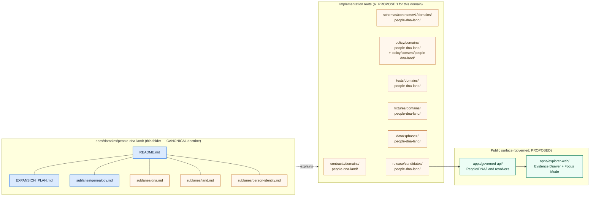
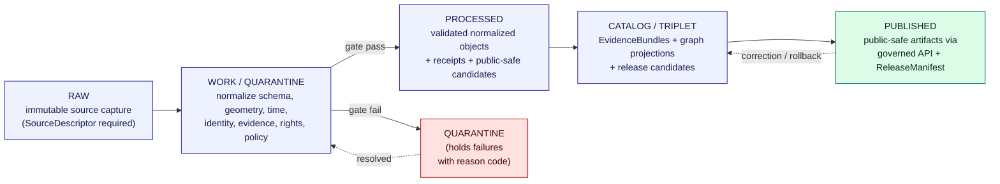

<!-- [KFM_META_BLOCK_V2]
doc_id: kfm://doc/docs-domains-people-dna-land-readme
title: People, Genealogy, DNA, and Land Ownership — Domain Landing Doc
type: standard
version: v1
status: draft
owners: Docs steward; Domain steward (People/DNA/Land); Sensitivity reviewer; Rights-holder representative
created: 2026-05-19
updated: 2026-05-19
policy_label: public-doctrine
related:
  - docs/doctrine/directory-rules.md
  - docs/domains/people-dna-land/EXPANSION_PLAN.md
  - docs/domains/people-dna-land/sublanes/genealogy.md
  - docs/atlases/KFM_Domains_Culmination_Atlas_v1_1.pdf
  - docs/standards/PROV.md
tags: [kfm, domain, people, genealogy, dna, land, sensitive]
notes:
  - Domain landing doc for the most sensitivity-loaded lane in KFM.
  - All repo-state claims are PROPOSED until verified against a mounted repository.
  - Default sensitivity posture for living-person, DNA, and private person-parcel joins is deny-by-default (T4).
[/KFM_META_BLOCK_V2] -->

# People, Genealogy, DNA, and Land Ownership

> The kinship, consent, and land-record slice of KFM — where unsourced family-tree folklore, raw DNA, vendor exports, and chain-of-title fragments meet the trust membrane. **Living-person and DNA-derived outputs are denied or restricted by default.**

<!-- Badges -->


| Field          | Value                                                                                                                       |
| -------------- | --------------------------------------------------------------------------------------------------------------------------- |
| **Status**     | `draft` — landing doc seeded; sublane docs and verification backlog open                                                    |
| **Owners**     | Docs steward · Domain steward (People/DNA/Land) · Sensitivity reviewer · Rights-holder representative · Release authority   |
| **Updated**    | 2026-05-19                                                                                                                  |
| **Authority**  | Canonical for the People/Genealogy/DNA/Land doctrine surface inside `docs/` *(per Directory Rules §6.1)*                    |
| **Implements** | Atlas v1.1 Ch. 16; Encyclopedia §7.14; Directory Rules §6.1, §12; Pass-10 categories C6 (Sensitivity) & C9 (Genealogy/DNA)  |

> [!IMPORTANT]
> This domain inherits the strictest defaults in KFM. Living-person fields, raw DNA segment data, private person-parcel joins, and DNA-derived hypotheses are **T4 (Denied) by default**. Promotion to any public tier requires an explicit transform, a recorded receipt, named review, and — for living persons and DNA — scoped, revocable consent. Doctrine: `[DOM-PEOPLE]`, `[ENCY]`, Atlas v1.1 Ch. 24.5.

---

## Mini-TOC

- [1. Scope and one-line purpose](#1-scope-and-one-line-purpose)
- [2. Authority level](#2-authority-level)
- [3. Status](#3-status)
- [4. What belongs here](#4-what-belongs-here)
- [5. What does NOT belong here](#5-what-does-not-belong-here)
- [6. Repo fit](#6-repo-fit)
- [7. Directory layout (this folder)](#7-directory-layout-this-folder)
- [8. Responsibility shape (diagram)](#8-responsibility-shape-diagram)
- [9. Ubiquitous language](#9-ubiquitous-language)
- [10. Object families](#10-object-families)
- [11. Inputs — key source families](#11-inputs--key-source-families)
- [12. Outputs and viewing products](#12-outputs-and-viewing-products)
- [13. Pipeline shape (RAW → PUBLISHED)](#13-pipeline-shape-raw--published)
- [14. Sensitivity, rights, and publication posture](#14-sensitivity-rights-and-publication-posture)
- [15. Cross-lane relations](#15-cross-lane-relations)
- [16. API, contract, and schema surfaces](#16-api-contract-and-schema-surfaces)
- [17. Validation](#17-validation)
- [18. Review burden and separation of duties](#18-review-burden-and-separation-of-duties)
- [19. Governed AI behavior](#19-governed-ai-behavior)
- [20. Publication, correction, and rollback](#20-publication-correction-and-rollback)
- [21. Open questions and verification backlog](#21-open-questions-and-verification-backlog)
- [22. ADRs](#22-adrs)
- [23. Related docs and folders](#23-related-docs-and-folders)
- [24. Appendix — extended reference](#24-appendix--extended-reference)
- [Truth labels used here](#truth-labels-used-here)

---

## 1. Scope and one-line purpose

**One-line purpose.** *(CONFIRMED doctrine / PROPOSED implementation.)* Govern assertion-first person evidence, genealogy relationships, restricted DNA evidence, land instruments, ownership intervals, chain-of-title reasoning, consent, policy decisions, review, correction, graph projection, EvidenceBundle views, and rollback for the People / Genealogy / DNA / Land Ownership lane.

The full canonical name of this domain per Atlas v1.1 Ch. 16 is **"People, Genealogy, DNA, and Land Ownership"**. The folder name `people-dna-land` is the abbreviated form already adopted in Directory Rules §6.1's `docs/domains/` sub-listing; both refer to the same lane. *(CONFIRMED doctrine; folder name CONFIRMED in directory-rules.md §6.1.)*

This domain is the most ethically loaded lane in KFM. The corpus is explicit that:

- **Person assertions are evidence, not facts.** Identity is an `EvidenceBundle` view over named, time-stamped assertions; canonicalization is a derived role bounded by source role and review state. *(CONFIRMED doctrine, `[DOM-PEOPLE]`.)*
- **DNA crosses the publication boundary only as aggregate or k-anonymized derivatives.** Raw vendor IDs, segment data, and triangulation outputs never become public. *(CONFIRMED doctrine, Pass-10 C9-03.)*
- **Assessor and tax records are not title truth.** Parcel geometry is not boundary proof without source role and evidence. *(CONFIRMED doctrine, `[DOM-PEOPLE]`.)*
- **Consent is revocable.** Revocation triggers tombstoning, downstream cleanup, and embargo-cache invalidation. *(CONFIRMED doctrine, Pass-10 C6-08 / C9-02.)*

> [!CAUTION]
> Any reviewer who finds a person, DNA, or land artifact in a public path without supporting `EvidenceBundle`, `PolicyDecision`, `ReviewRecord`, and `ReleaseManifest` should treat that artifact as **drift** and file against `docs/registers/DRIFT_REGISTER.md` *(PROPOSED register, per Directory Rules §13)*. Default-deny promotion is a core invariant; bypasses are not normalized through use.

[↑ back to top](#people-genealogy-dna-and-land-ownership)

---

## 2. Authority level

**Authority class:** **Canonical** for the People/Genealogy/DNA/Land doctrine surface inside `docs/`. *(CONFIRMED per Directory Rules §6.1 — `docs/domains/people-dna-land/` is listed as a canonical sub-tree of the human-facing control plane.)*

This README **explains**. It does not define schemas (those live under `schemas/contracts/v1/domains/people-dna-land/` — *PROPOSED*), does not define object meaning machine-readably (that lives under `contracts/domains/people-dna-land/` — *PROPOSED*), does not decide allow/deny (that lives under `policy/domains/people-dna-land/` — *PROPOSED*), and does not store data (that lives under `data/<phase>/people-dna-land/` — *PROPOSED*).

> [!NOTE]
> Per Directory Rules §6.1, `docs/` **explains**; `control_plane/` **indexes**; `contracts/` **defines meaning**; `schemas/` **defines shape**; `policy/` **decides admissibility**; `tests/fixtures/` **proves rules are enforceable**. This README sits in the first row of that table.

[↑ back to top](#people-genealogy-dna-and-land-ownership)

---

## 3. Status

| Item                                  | Status                                                                                            |
| ------------------------------------- | ------------------------------------------------------------------------------------------------- |
| Doctrine source (Atlas v1.1 Ch. 16)   | **CONFIRMED**                                                                                     |
| Folder placement (`docs/domains/people-dna-land/`) | **CONFIRMED** (Directory Rules §6.1)                                                 |
| Sublane convention (`sublanes/<x>.md`)| **PROPOSED** — pending ADR (see [§22](#22-adrs))                                                   |
| Schema home, contracts, policy paths  | **PROPOSED** — all `*/domains/people-dna-land/` segments labeled PROPOSED until mounted-repo check |
| Validator and CI coverage             | **NEEDS VERIFICATION** — no workflow, log, or test inspected this session                          |
| Source-family rights and currentness  | **NEEDS VERIFICATION** per source                                                                  |
| Living-person, DNA, and parcel-join lanes | **CONFIRMED doctrine** for deny-by-default / **PROPOSED implementation**                       |

[↑ back to top](#people-genealogy-dna-and-land-ownership)

---

## 4. What belongs here

This folder (`docs/domains/people-dna-land/`) holds **human-facing doctrine** for the People/Genealogy/DNA/Land lane. Concretely:

- A landing README (this file).
- One Markdown file per **sublane** (genealogy, DNA, land, person identity) — *sublane folder convention PROPOSED, see [§22](#22-adrs)*.
- A domain `EXPANSION_PLAN.md` describing roadmap and thin-slice ordering. *(CONFIRMED authored, prior session; mounted-repo presence NEEDS VERIFICATION.)*
- Worked-example notes (illustrative records, redaction walkthroughs) that explain the doctrine to humans without leaking sensitive data.
- Cross-references into `contracts/`, `schemas/`, `policy/`, `tests/`, `release/`, and `runbooks/`.

> [!TIP]
> If a file you are about to add is **machine-readable**, it does not belong here. Send it to `control_plane/`, `schemas/`, `policy/`, or `contracts/` per Directory Rules §4 (Placement Protocol).

[↑ back to top](#people-genealogy-dna-and-land-ownership)

---

## 5. What does NOT belong here

The following **explicitly do not belong** under `docs/domains/people-dna-land/`:

| Type of content                                            | Goes to instead                                                                |
| ---------------------------------------------------------- | ------------------------------------------------------------------------------ |
| Machine-readable schemas (`*.schema.json`, `*.shacl`, …)   | `schemas/contracts/v1/domains/people-dna-land/` *(PROPOSED)*                   |
| Object-meaning contracts (Markdown semantic specs)         | `contracts/domains/people-dna-land/` *(PROPOSED)*                              |
| OPA / policy bundles                                       | `policy/domains/people-dna-land/` *(PROPOSED)*                                 |
| Consent-token policy fragments                             | `policy/consent/people-dna-land/` *(PROPOSED, per Atlas Ch. 24.13)*            |
| Living-person, DNA, parcel records (RAW/WORK/PUBLISHED)    | `data/<phase>/people-dna-land/` *(PROPOSED)*                                   |
| Validator and test code                                    | `tests/domains/people-dna-land/` and `tools/validators/` *(PROPOSED)*          |
| Golden / valid / invalid fixtures                          | `fixtures/domains/people-dna-land/` *(PROPOSED)*                               |
| Release manifests, rollback cards, correction notices      | `release/` *(PROPOSED)*                                                        |
| Source descriptors (per-source admission records)          | `data/registry/sources/people-dna-land/` *(PROPOSED)*                          |
| Settlements/roads/archaeology context that *cites* this lane | The owning domain's `docs/domains/<…>/` folder                               |
| Runbooks for refreshes, rollbacks, drills                  | `docs/runbooks/people-dna-land/` *(PROPOSED, subfolder convention pending ADR)* |

> [!WARNING]
> **Living-person sample data must never appear in this folder, even as an example.** Use synthetic fixtures (`fixtures/synthetic/people-dna-land/`) or census-historical (deceased, public-domain) data only. *(CONFIRMED doctrine; Pass-10 C6.)*

[↑ back to top](#people-genealogy-dna-and-land-ownership)

---

## 6. Repo fit

| Aspect                  | Value                                                                                                                                              |
| ----------------------- | -------------------------------------------------------------------------------------------------------------------------------------------------- |
| **This folder**         | `docs/domains/people-dna-land/`                                                                                                                    |
| **Parent**              | [`../README.md`](../README.md) — `docs/domains/` landing *(PROPOSED authoring)*                                                                    |
| **Authority root**      | `docs/` (canonical) — Directory Rules §6.1                                                                                                         |
| **Upstream doctrine**   | Atlas v1.1 Ch. 16; Encyclopedia §7.14; Directory Rules §6.1 & §12; Pass-10 C6, C9, C14; Unified Implementation Architecture Build Manual          |
| **Sublanes (children)** | [`sublanes/genealogy.md`](sublanes/genealogy.md) *(CONFIRMED authored, prior session)* · `sublanes/dna.md` *(PROPOSED)* · `sublanes/land.md` *(PROPOSED)* · `sublanes/person-identity.md` *(PROPOSED)* |
| **Roadmap**             | [`EXPANSION_PLAN.md`](EXPANSION_PLAN.md) *(CONFIRMED authored, prior session)*                                                                     |
| **Downstream implementation** | `contracts/domains/people-dna-land/…` · `schemas/contracts/v1/domains/people-dna-land/…` · `policy/domains/people-dna-land/…` · `tests/domains/people-dna-land/…` · `fixtures/domains/people-dna-land/…` — **all PROPOSED** |
| **Public surface**      | `apps/governed-api/` resolvers and `apps/explorer-web/` Evidence Drawer / Focus Mode payloads — **all PROPOSED**                                   |

[↑ back to top](#people-genealogy-dna-and-land-ownership)

---

## 7. Directory layout (this folder)

> [!NOTE]
> Tree is **PROPOSED**. Mounted-repo verification required before any node is treated as canonical. Sublane folder convention (`sublanes/`) is not yet ratified in Directory Rules; see [§22 ADR-D-01](#22-adrs).

```text
docs/domains/people-dna-land/
├── README.md                          # this file
├── EXPANSION_PLAN.md                  # CONFIRMED authored (prior session) — roadmap, thin-slice ordering
└── sublanes/                          # PROPOSED — convention pending ADR (see §22)
    ├── genealogy.md                   # CONFIRMED authored (prior session) — kinship & life-event slice
    ├── dna.md                         # PROPOSED — DTC exports, GA4GH, consent, revocation
    ├── land.md                        # PROPOSED — patents, deeds, instruments, ownership intervals, chain-of-title
    └── person-identity.md             # PROPOSED — assertion-first identity, PersonCanonical, RelationshipAssertion
```

[↑ back to top](#people-genealogy-dna-and-land-ownership)

---

## 8. Responsibility shape (diagram)

The diagram below shows how this **doctrine surface** (`docs/domains/people-dna-land/`) relates to the canonical roots it explains. It is illustrative — not an implementation diagram.



> [!NOTE]
> The diagram is **doctrinal**, not architectural — implementation status of every node in the `Implementation` and `Public` clusters is **PROPOSED** until verified against a mounted repository.

[↑ back to top](#people-genealogy-dna-and-land-ownership)

---

## 9. Ubiquitous language

The terms below are the domain's stable vocabulary (Atlas v1.1 Ch. 16 §C). They are **CONFIRMED terms** with **PROPOSED field realization** — i.e., the meaning is doctrine; the exact schema fields await a mounted-repo verification.

| Term                     | Meaning                                                                                                                          |
| ------------------------ | -------------------------------------------------------------------------------------------------------------------------------- |
| **Person Assertion**     | A single, source-attributed claim about a person. Identity is built **from** assertions, not asserted directly.                  |
| **PersonCanonical**      | A derived, evidence-bound canonical view of a person; never sovereign — always a projection over assertions.                     |
| **NameAssertion**        | A source-attributed claim about a person's name(s), with time validity and confidence.                                           |
| **LifeEvent**            | A typed event (birth, baptism, marriage, death, burial, immigration, etc.) bound to evidence and time.                           |
| **RelationshipAssertion** | A claim of kinship or other relationship between persons, with evidence, time validity, and confidence.                         |
| **DNA Match Evidence**   | Evidence of genetic relationship from DTC vendor or research source; **restricted by default** (T4).                            |
| **DNAKitToken**          | An opaque, non-correlatable handle for a DNA kit; raw vendor kit IDs are not logged.                                            |
| **ConsentGrant**         | A scoped, revocable authorization (e.g., GA4GH Passport, OAuth2 grant) under which restricted material may be processed.        |
| **RevocationReceipt**    | A signed record that a `ConsentGrant` has been withdrawn; triggers tombstoning and downstream cleanup.                          |
| **LandParcel**           | A parcel record from cadastral or assessor sources. **Not** authoritative for title.                                            |
| **LegalDescription**     | A textual or surveyed description (metes & bounds, PLSS, lot/block) of a parcel boundary.                                       |
| **LandInstrument**       | A legal instrument transferring or encumbering land (patent, deed, mortgage, lien, easement, lease, mineral/water/access).      |
| **Ownership Interval**   | A time-bounded interval of asserted ownership, supported by one or more `LandInstrument`s and an `EvidenceBundle`.              |
| **Chain-of-Title**       | An ordered sequence of `Ownership Interval`s with gap and overlap controls; **gaps are surfaced, not silently filled**.         |
| **Relationship Hypothesis** | A *hypothesis* derived from DNA, GEDCOM, or other evidence — explicitly not a fact. Never promoted as public truth.          |

*Doctrine source: Atlas v1.1 Ch. 16 §C, Pass-10 C9, `[DOM-PEOPLE]`, `[ENCY]`.*

[↑ back to top](#people-genealogy-dna-and-land-ownership)

---

## 10. Object families

Per Atlas v1.1 Ch. 16 §B, this domain **owns** the following object families. All carry the **CONFIRMED ownership / PROPOSED field realization** posture, and all share KFM's standard temporal model — source, observed, valid, retrieval, release, and correction times stay distinct where material *(CONFIRMED)*.

| Object family             | Default sensitivity tier *(PROPOSED, per Atlas Ch. 24.5)* | Notes                                                                              |
| ------------------------- | --------------------------------------------------------- | ---------------------------------------------------------------------------------- |
| Person Assertion          | T0–T4 (varies; living → T4)                               | Identity built **from** assertions; never sovereign.                               |
| Person Identity Candidate | T2 (reviewer)                                             | Pre-canonical, awaiting review.                                                    |
| PersonCanonical           | T0–T4 (varies; living → T4)                               | Derived, evidence-bound; not a separate truth source.                              |
| NameAssertion             | T0–T4 (varies)                                            | Source-attributed name claim.                                                      |
| LifeEvent                 | T0–T4 (varies; living → T4)                               | Typed event with evidence and time.                                                |
| Residence Event           | T0–T4 (varies)                                            | Anchors person ↔ settlement membership.                                            |
| Migration Event           | T0–T4 (varies)                                            | Anchors person ↔ corridor / route relations to Roads/Rail.                         |
| Genealogy Relationship    | T0–T4 (varies; living → T4)                               | Kinship link; restricted when any endpoint is living.                              |
| FamilyGroup               | T0–T4 (varies)                                            | Cluster of related persons.                                                        |
| Land Ownership Assertion  | T1–T2                                                     | An ownership claim bound to a `LandInstrument` and time interval.                  |
| Deed Instrument           | T0–T1                                                     | Public record; geometry derivations are not boundary truth.                        |
| Title Instrument          | T1–T2                                                     | Title is not assessor data; assessor-as-title is denied.                           |
| Assessor Record           | T1                                                        | Cadastral / valuation snapshot — **not title**.                                    |
| TaxRecord                 | T1                                                        | Tax roll snapshot — **not title**.                                                 |
| Parcel Version            | T1                                                        | A versioned parcel geometry; not boundary proof without `LandInstrument` support.  |
| Ownership Interval        | T1–T2                                                     | Time interval of asserted ownership.                                               |
| DNA Match Evidence        | **T4** (denied by default)                                | Released only as aggregate / k-anonymized derivative; raw never republished.       |
| DNASegment                | **T4** (denied by default)                                | Raw segment data; no transform releases this to a public tier.                    |
| Relationship Hypothesis   | T2–T4 (varies; living → T4)                               | Always a hypothesis; never promoted as public truth.                              |

*Doctrine source: Atlas v1.1 Ch. 16 §B, §E; Ch. 24.5.2 (Per-domain tier matrix).*

[↑ back to top](#people-genealogy-dna-and-land-ownership)

---

## 11. Inputs — key source families

| Source family                                                                                  | Role *(per source)*                                  | Rights / sensitivity                                                                | Currentness               |
| ---------------------------------------------------------------------------------------------- | ---------------------------------------------------- | ----------------------------------------------------------------------------------- | ------------------------- |
| Vital, cemetery, burial, obituary, church, school, military, census, directory, court, probate records | authority / observation / context / model           | rights and current terms **NEEDS VERIFICATION** per source; sensitive joins fail closed | source-vintage / cadence-specific |
| GEDCOM 5.5, GEDCOM-X, GEDZip, family-tree overlays (FamilySearch et al.)                       | authority / observation / context / model           | rights and current terms **NEEDS VERIFICATION** per source; sensitive joins fail closed | source-vintage / cadence-specific |
| DNA vendor match CSV / segment / triangulation data (DTC: 23andMe, AncestryDNA, MyHeritage)    | observation / model (never authority)               | **T4 default**; consent-bound; raw never republished                                | snapshot at export time   |
| Patent, deed, mortgage, lien, easement, lease, mineral, water, access, probate instruments     | authority / observation / context                   | typically T0–T1; **rights NEEDS VERIFICATION** per recorder office                  | recording-cadence-specific |
| Assessor and tax-roll records                                                                  | observation / context (**never title authority**)   | T1; assessor-as-title is **denied** by policy                                      | annual / cyclical         |
| Plat, survey, metes & bounds, PLSS, subdivision, derived geometry                              | authority / observation / context                   | T1; geometry is **not** title-boundary proof without `LandInstrument` support      | survey-vintage-specific   |

> [!IMPORTANT]
> The 23andMe Chapter 11 filing (March 2025) is treated by the corpus as a trigger event that hardened consent and revocation requirements. The DTC vendor-loss simulation playbook is a Pass-10 C9-07 follow-up. *(CONFIRMED, Pass-10 C9-03 / C9-07.)*

*Doctrine source: Atlas v1.1 Ch. 16 §D; Pass-10 C9; Unified Manual §§DOM-PEOPLE 2-4.*

[↑ back to top](#people-genealogy-dna-and-land-ownership)

---

## 12. Outputs and viewing products

*(PROPOSED viewing products; doctrine source: Atlas v1.1 Ch. 16 §G.)*

- Historical person profile maps (deceased only, evidence-bound).
- Residence / event timelines, time-aware.
- Migration paths with explicit uncertainty.
- Land parcel context with **"not title"** warning banners.
- Chain-of-title summaries with gap / overlap markers.
- Instrument timeline views.
- Restricted DNA / consent review surfaces (steward-only).
- Living-person review surfaces (reviewer-only; never public).

All viewing products inherit the cross-cutting UI doctrine *(CONFIRMED)*:

- **Evidence Drawer** with EvidenceBundle projection.
- Time-aware state and trust badges.
- Sensitivity-redacted view.
- Correction / stale-state view.
- Governed **Focus Mode** — AI never the root truth source; `AIReceipt` always recorded.

*Doctrine source: `[MAP-MASTER]`, `[GAI]`, `[UIAI]`.*

[↑ back to top](#people-genealogy-dna-and-land-ownership)

---

## 13. Pipeline shape (RAW → PUBLISHED)

*(CONFIRMED doctrine / PROPOSED lane application.)* This domain follows KFM's lifecycle invariant — **promotion is a governed state transition, not a file move** *(Directory Rules §0)*.



| Stage             | Required gate (PROPOSED implementation)                                                                                                | Status   |
| ----------------- | --------------------------------------------------------------------------------------------------------------------------------------- | -------- |
| RAW               | `SourceDescriptor` exists with source role, rights, sensitivity, citation, time, and hash.                                              | PROPOSED |
| WORK / QUARANTINE | Validation and policy gate pass, **or** quarantine reason code recorded.                                                                | PROPOSED |
| PROCESSED         | `EvidenceRef`, `ValidationReport`, and digest closure exist; public-safe candidates emitted.                                            | PROPOSED |
| CATALOG / TRIPLET | Catalog and proof closure pass; `EvidenceBundle` and graph/triplet projections emitted.                                                 | PROPOSED |
| PUBLISHED         | `ReleaseManifest` issued; correction path active; rollback target named; review/policy state recorded.                                  | PROPOSED |

*Doctrine source: Atlas v1.1 Ch. 16 §H; Directory Rules §0 (Lifecycle invariant); Ch. 24.6 (Pipeline Gate Reference).*

[↑ back to top](#people-genealogy-dna-and-land-ownership)

---

## 14. Sensitivity, rights, and publication posture

> [!CAUTION]
> **Unclear rights, unresolved source role, missing evidence, unresolved sensitivity, or absent release state blocks public promotion.** *(CONFIRMED doctrine, `[ENCY]`, `[DIRRULES]`.)*

### 14.1 Tier defaults for this domain *(PROPOSED, per Atlas Ch. 24.5.2)*

| Domain / object class                  | Default tier  | Allowed transforms (PROPOSED)                                                  | Required gates                                       |
| -------------------------------------- | ------------- | ------------------------------------------------------------------------------ | ---------------------------------------------------- |
| People/DNA — **living-person fields**  | **T4** (denied) | Aggregation by tract or county + `AggregationReceipt` → T1                   | Consent or aggregation gate + `ReviewRecord`         |
| People/DNA — **raw DNA segment data**  | **T4** (denied) | **No transform releases this to a public tier**; T3 only under named research agreement | Named consent + `ReviewRecord` + `PolicyDecision`    |
| People/Land — **private person-parcel join** | **T4** (denied) | Generalized parcel + de-identified person → T2 only                       | `RedactionReceipt` + `ReviewRecord`                  |
| Deceased-person assertions             | T0–T1         | Standard generalization where applicable                                       | Standard release                                     |
| Land instruments (patent, deed, etc.)  | T0–T1         | Standard release; parcel-geometry not promoted as title boundary               | Standard release                                     |

### 14.2 Tier transitions

All T4 → T1/T2/T3 motions are **reversible**. Revocation of consent or agreement returns the object to T4 with a `CorrectionNotice`. Promotion to T1 (public) requires `RedactionReceipt` + `ReviewRecord`. Promotion to PUBLISHED at T0 requires `ReleaseManifest` + `ReviewRecord` + release-authority sign-off. *(CONFIRMED doctrine, Atlas Ch. 24.5.3.)*

### 14.3 Hard rules

- **Living-person and DNA-derived outputs are denied or restricted by default.** *(CONFIRMED, `[DOM-PEOPLE]`.)*
- **Raw kit/vendor IDs and DNA segments are not public.** *(CONFIRMED.)*
- **Assessor and tax records are not title truth.** *(CONFIRMED — assessor-as-title denial is a named validator, K7.)*
- **Parcel geometry is not title-boundary proof** without source role and evidence. *(CONFIRMED.)*
- **Relationship Hypothesis** stays a hypothesis. Never promoted as fact. *(CONFIRMED, Pass-10 KFM-P15-PROG-0034.)*
- **Consent is revocable.** Revocation triggers tombstones (`RevocationReceipt`), downstream cleanup, and embargo-cache invalidation. *(CONFIRMED, Pass-10 C6-08 / C9-02.)*
- **AI never reads RAW or WORK content.** AI surfaces consume only released `EvidenceBundle`s. *(CONFIRMED, `[GAI]`.)*

[↑ back to top](#people-genealogy-dna-and-land-ownership)

---

## 15. Cross-lane relations

*(Atlas v1.1 Ch. 16 §F and Ch. 24.4.14. All relations preserve ownership, source role, sensitivity, and EvidenceBundle support.)*

| This domain consumed by / consuming | Relation type                                                  | Constraint                                                              |
| ----------------------------------- | -------------------------------------------------------------- | ----------------------------------------------------------------------- |
| **Settlements**                     | residence, cemetery, school, court, county, township, place    | Living-person fields fail closed.                                       |
| **Roads/Rail**                      | migration, access, movement                                    | Migration paths carry uncertainty; living persons fail closed.          |
| **Archaeology / Cultural Heritage** | historic person, land, documentary, cultural-place context     | Cultural affiliations cited with rights, sovereignty, and steward review. |
| **Agriculture**                     | farm, land-use, producer-adjacent context with privacy         | Private person-parcel joins denied by default.                          |
| **Frontier Matrix**                 | aggregated population observations feed matrix cells           | Matrix cells are analytical releases with their own evidence and rollback. |
| **Planetary / 3D**                  | scenes may cite released domain artifacts under admission rules | Scenes are never an instruction or alert surface.                       |

[↑ back to top](#people-genealogy-dna-and-land-ownership)

---

## 16. API, contract, and schema surfaces

*(All entries PROPOSED; doctrine source: Atlas v1.1 Ch. 16 §J. Exact routes are UNKNOWN.)*

| Endpoint or artifact                          | DTO / schema                                              | Outcomes                            | Status                                                |
| --------------------------------------------- | --------------------------------------------------------- | ----------------------------------- | ----------------------------------------------------- |
| People/DNA/Land feature/detail resolver       | `PeopleDNALandDecisionEnvelope`                           | ANSWER / ABSTAIN / DENY / ERROR     | **PROPOSED**; exact route UNKNOWN                     |
| People/DNA/Land layer-manifest resolver       | `LayerManifest` / domain layer descriptor                 | ANSWER / DENY / ERROR               | **PROPOSED**; public-safe release only                |
| People/DNA/Land Evidence Drawer payload       | `EvidenceDrawerPayload` + `EvidenceBundle` projection     | ANSWER / ABSTAIN / DENY / ERROR     | **PROPOSED**; evidence- and policy-filtered           |
| People/DNA/Land Focus Mode answer             | `Runtime Response Envelope` + `AIReceipt`                 | ANSWER / ABSTAIN / DENY / ERROR     | **PROPOSED**; AI is never root truth                  |
| Schema responsibility root                    | `schemas/contracts/v1/domains/people-dna-land/`            | finite validator outcomes           | **PROPOSED**; verify with Directory Rules and ADR-0001 |

> [!NOTE]
> The four outcomes — ANSWER / ABSTAIN / DENY / ERROR — are the **finite Outcome enum** used across all KFM decision envelopes *(CONFIRMED doctrine, Atlas Ch. 24.3)*. Any new endpoint in this domain must return one of these four; intermediate or fuzzy outcomes are an anti-pattern.

[↑ back to top](#people-genealogy-dna-and-land-ownership)

---

## 17. Validation

*(All PROPOSED; doctrine source: Atlas v1.1 Ch. 16 §K.)*

| K# | Validator (PROPOSED)                          | What it proves                                                                         |
| -- | --------------------------------------------- | -------------------------------------------------------------------------------------- |
| K1 | Person assertion evidence tests               | Every `Person Assertion` resolves to an `EvidenceBundle`; orphan assertions fail.      |
| K2 | GEDCOM import rights / living-flag tests      | GEDCOM imports cannot bypass living-person screening or rights checks.                 |
| K3 | DNA consent and raw-ID no-log tests           | Raw vendor kit IDs never appear in logs; consent scope is recorded per record.         |
| K4 | Revocation cleanup tests                      | `RevocationReceipt` triggers tombstoning, downstream cleanup, embargo invalidation.    |
| K5 | Legal-description and chain-of-title gap tests | Gaps and overlaps in `Ownership Interval` chains are surfaced, not silently filled.    |
| K6 | Assessor-as-title denial                      | Assessor or tax records cannot be promoted as title authority.                         |
| K7 | Graph projection safety tests                 | Triplet / graph projections do not leak sensitive joins or living-person fields.       |

> [!TIP]
> All validators in this lane should additionally exercise **negative-state cases** — DENY, ABSTAIN, and ERROR paths — per the validator orchestrator pattern (Directory Rules §7.5.a). A validator that only proves the happy path leaves the trust membrane unproven.

*Test home: `tests/domains/people-dna-land/` *(PROPOSED)*. Fixture home: `fixtures/domains/people-dna-land/` *(PROPOSED)*.*

[↑ back to top](#people-genealogy-dna-and-land-ownership)

---

## 18. Review burden and separation of duties

*(Atlas v1.1 Ch. 24.7. CONFIRMED doctrine; named-individual assignments NEEDS VERIFICATION.)*

| Role                         | Duty in this domain                                                                                            |
| ---------------------------- | -------------------------------------------------------------------------------------------------------------- |
| **Source steward**           | Admission and rights confirmation for vital, GEDCOM, DTC, instrument, assessor, and survey source families.    |
| **Domain steward**           | Owns contracts and validators for `Person Assertion`, `LandInstrument`, `Ownership Interval`, etc.             |
| **Sensitivity reviewer**     | Reviews redaction, generalization, withholding, and tier transitions for living-person and DNA content.       |
| **Rights-holder representative** | Confirms living-person, DNA, and culturally sensitive release decisions; required for any T4 → T3 motion. |
| **Release authority**        | Issues `ReleaseManifest`s and authorizes PUBLISHED transitions; **distinct from authorship** for living-person and DNA releases. |
| **Correction reviewer**      | Reviews `CorrectionNotice` / `RollbackCard` before they amend a PUBLISHED claim.                              |
| **AI surface steward**       | Reviews Focus Mode templates, `AIReceipt`s, and policy bindings for this domain.                              |

> [!IMPORTANT]
> For any release motion touching **living persons**, **DNA**, or **private person-parcel joins**, the author **may not** also be the release authority. Separation of duties is enforced. *(CONFIRMED, Atlas Ch. 24.7.2.)*

[↑ back to top](#people-genealogy-dna-and-land-ownership)

---

## 19. Governed AI behavior

*(CONFIRMED doctrine / PROPOSED implementation, Atlas v1.1 Ch. 16 §L.)*

AI may:

- Summarize **released** People/DNA/Land `EvidenceBundle`s.
- Compare evidence and explain limitations.
- Draft steward-review notes and proposed corrections.

AI **must**:

- **ABSTAIN** when evidence is insufficient.
- **DENY** where policy, rights, sensitivity, or release state blocks the request.
- Emit an `AIReceipt` on every answer.

AI **must not**:

- Read RAW or WORK content directly.
- Promote a `Relationship Hypothesis` as fact.
- Synthesize living-person details, DNA inferences, or private person-parcel joins.
- Replace `EvidenceBundle` as the truth source.

*Doctrine source: `[GAI]`, Atlas Ch. 16 §L, Ch. 24.5 (Governed AI — RAW/WORK access denied).*

[↑ back to top](#people-genealogy-dna-and-land-ownership)

---

## 20. Publication, correction, and rollback

*(CONFIRMED doctrine / PROPOSED implementation, Atlas v1.1 Ch. 16 §M.)*

Publication in this domain requires, at minimum:

1. `ReleaseManifest` issued.
2. `EvidenceBundle` resolvable.
3. Validation and policy support documented.
4. `ReviewRecord` where required (always required for living-person, DNA, and private person-parcel joins).
5. Correction path active.
6. Stale-state rule honored.
7. Rollback target named.

Corrections follow the `CorrectionNotice` flow; rollbacks follow `RollbackCard`. Both are reviewed by the correction reviewer before they amend a PUBLISHED claim.

*Detailed flow: see `docs/runbooks/people-dna-land/SOURCE_REFRESH_RUNBOOK.md` (PROPOSED, not yet authored). The pattern follows the fauna runbook (CONFIRMED authored, prior session: `docs/runbooks/fauna/SOURCE_REFRESH_RUNBOOK.md`).*

[↑ back to top](#people-genealogy-dna-and-land-ownership)

---

## 21. Open questions and verification backlog

| ID        | Item                                                                                              | Evidence that would settle it                                                            | Status              |
| --------- | ------------------------------------------------------------------------------------------------- | ---------------------------------------------------------------------------------------- | ------------------- |
| OQ-PDL-01 | Verify living-person policy enforcement                                                           | Mounted repo files, schemas, registry entries, tests, logs, review records, manifests    | NEEDS VERIFICATION  |
| OQ-PDL-02 | Verify DNA consent / revocation enforcement                                                       | Mounted repo files + consent-token verifier + revocation cleanup tests                   | NEEDS VERIFICATION  |
| OQ-PDL-03 | Verify land-instrument chain logic and gap/overlap surfacing                                      | Mounted repo files + chain-of-title gap tests + fixtures                                  | NEEDS VERIFICATION  |
| OQ-PDL-04 | Verify geometry-role boundary logic (parcel ≠ title)                                              | Mounted repo files + assessor-as-title denial tests                                       | NEEDS VERIFICATION  |
| OQ-PDL-05 | Verify UI / API restricted-field no-leak behavior                                                  | Mounted repo files + tile field-allowlist tests + Evidence Drawer negative-case tests    | NEEDS VERIFICATION  |
| OQ-PDL-06 | Resolve sublane folder convention (`sublanes/`) vs flat (`docs/domains/people-dna-land/<x>.md`)   | ADR — see [§22](#22-adrs); parallel to Directory Rules OPEN-DR-02                        | OPEN                |
| OQ-PDL-07 | Resolve runbook subfolder convention for this domain (parallel to fauna's `runbooks/fauna/`)       | ADR — Directory Rules OPEN-DR-02                                                          | OPEN                |
| OQ-PDL-08 | Resolve folder-name canonicalization: `people-dna-land` (used here) vs alternate longer names      | Per-root README + Docs-steward decision (or ADR if naming generalizes across `docs/domains/`) | OPEN            |
| OQ-PDL-09 | Codify DTC-vendor compatibility matrix and vendor-loss-simulation playbook                         | `docs/runbooks/people-dna-land/DTC_VENDOR_LOSS_DRILL.md` (PROPOSED)                       | OPEN                |
| OQ-PDL-10 | Specify retention boundary: tombstone vs erasure for revoked living-person and DNA data            | Joint ADR with `docs/doctrine/lifecycle-law.md`; align with GDPR and Tribal data policies | OPEN                |
| OQ-PDL-11 | Define non-conforming GEDCOM acceptance thresholds (fail vs accept-with-warning)                   | ADR + per-source policy fragment + conformance-reporter test corpus                       | OPEN                |

[↑ back to top](#people-genealogy-dna-and-land-ownership)

---

## 22. ADRs

| ADR ID *(PROPOSED)*                | Topic                                                                                            | Status      |
| ---------------------------------- | ------------------------------------------------------------------------------------------------ | ----------- |
| ADR-D-01                           | Sublane folder convention for `docs/domains/<domain>/` (subfolder vs flat) — covers OQ-PDL-06    | PROPOSED    |
| ADR-D-02                           | Living-person retention boundary: tombstone vs erasure — covers OQ-PDL-10                        | PROPOSED    |
| ADR-D-03                           | DNA consent revocation propagation contract — covers OQ-PDL-02                                   | PROPOSED    |
| ADR-D-04                           | Chain-of-title gap-surfacing contract — covers OQ-PDL-03                                         | PROPOSED    |
| ADR-0001 *(EXTERNAL to this domain)* | Schema home (`schemas/contracts/v1/<…>`) — applies; this domain inherits                       | CONFIRMED (per Directory Rules §0) |

> [!NOTE]
> ADR home is `docs/adr/`. ADR IDs above are placeholders pending the docs steward's allocation. *(PROPOSED.)*

[↑ back to top](#people-genealogy-dna-and-land-ownership)

---

## 23. Related docs and folders

*(Some link targets are PROPOSED. Where a target is not yet authored, the link points to its proposed path so the broken-link surface tells the reviewer what's missing.)*

**Inside this folder**

- [`EXPANSION_PLAN.md`](EXPANSION_PLAN.md) — roadmap and thin-slice ordering *(CONFIRMED authored, prior session)*
- [`sublanes/genealogy.md`](sublanes/genealogy.md) — kinship & life-event slice *(CONFIRMED authored, prior session)*
- `sublanes/dna.md` — DTC, GA4GH, consent, revocation *(PROPOSED)*
- `sublanes/land.md` — patents, deeds, instruments, ownership intervals, chain-of-title *(PROPOSED)*
- `sublanes/person-identity.md` — assertion-first identity, `PersonCanonical`, `RelationshipAssertion` *(PROPOSED)*

**Parent and siblings**

- [`../README.md`](../README.md) — `docs/domains/` landing *(PROPOSED authoring)*
- [`../archaeology/`](../archaeology/) — cultural-context partner; sovereignty-aware *(PROPOSED authoring)*
- [`../settlements-infrastructure/`](../settlements-infrastructure/) — residence anchor *(PROPOSED authoring)*
- [`../roads-rail-trade/`](../roads-rail-trade/) — migration corridor partner *(PROPOSED authoring)*
- [`../agriculture/`](../agriculture/) — farm and land-use context *(PROPOSED authoring)*

**Doctrine and standards**

- [`../../doctrine/directory-rules.md`](../../doctrine/directory-rules.md) — placement law *(CONFIRMED authored)*
- `../../doctrine/authority-ladder.md` *(PROPOSED)*
- `../../doctrine/truth-posture.md` *(PROPOSED)*
- `../../doctrine/trust-membrane.md` *(PROPOSED)*
- `../../doctrine/lifecycle-law.md` *(PROPOSED)*
- [`../../standards/PROV.md`](../../standards/PROV.md) — provenance standard *(CONFIRMED authored, prior session; naming variance vs corpus `PROVENANCE.md` → Directory Rules OPEN-DR-01)*
- `../../standards/SENSITIVITY_RUBRIC.md` *(PROPOSED in corpus, Pass-10 C6-01; not yet authored)*
- `../../standards/REDACTION_DETERMINISM.md` *(PROPOSED in corpus, Pass-10 C6-03; not yet authored)*

**Implementation siblings (canonical roots)**

- `contracts/domains/people-dna-land/` *(PROPOSED)*
- `schemas/contracts/v1/domains/people-dna-land/` *(PROPOSED)*
- `policy/domains/people-dna-land/` and `policy/consent/people-dna-land/` *(PROPOSED)*
- `tests/domains/people-dna-land/` *(PROPOSED)*
- `fixtures/domains/people-dna-land/` *(PROPOSED)*
- `data/<phase>/people-dna-land/` *(PROPOSED)*
- `release/candidates/people-dna-land/` *(PROPOSED)*

[↑ back to top](#people-genealogy-dna-and-land-ownership)

---

## 24. Appendix — extended reference

<details>
<summary><strong>A.1 — Doctrine citations used in this README</strong></summary>

| Marker          | Source                                                                                                  |
| --------------- | ------------------------------------------------------------------------------------------------------- |
| `[DOM-PEOPLE]`  | Domain dossier: People, Genealogy, DNA, and Land Ownership                                              |
| `[ENCY]`        | KFM Encyclopedia §7.14                                                                                  |
| `[DIRRULES]`    | `docs/doctrine/directory-rules.md` (v1.1)                                                               |
| `[GAI]`         | Whole-UI Governed AI Expansion Report                                                                   |
| `[MAP-MASTER]`  | Master MapLibre Components-Functions-Features report                                                    |
| `[UIAI]`        | Whole-UI / Governed-AI cross-cutting doctrine                                                           |
| `[UNIFIED]`     | KFM Unified Implementation Architecture Build Manual                                                    |
| `[DDD]`         | Domain-Driven Design Reference (Eric Evans, 2015) — background only; KFM doctrine governs              |
| Atlas v1.1      | KFM Domains Culmination Atlas v1.1, esp. Ch. 16 (this domain) and Ch. 24 (cross-cutting registers)      |
| Pass-10         | KFM Components Pass-10 Idea Index — esp. C6 (Sensitivity), C9 (Genealogy/Genomics), C14 (Repo Hygiene)  |

</details>

<details>
<summary><strong>A.2 — Receipt and artifact types referenced</strong></summary>

| Type                  | Role                                                                                       |
| --------------------- | ------------------------------------------------------------------------------------------ |
| `SourceDescriptor`    | Admission record for a source family (rights, sensitivity, role, citation, time, hash).   |
| `EvidenceRef`         | Pointer to the evidence backing a claim.                                                  |
| `EvidenceBundle`      | Resolvable, governed projection of evidence supporting a published claim.                  |
| `ValidationReport`    | Output of a validator on a normalized object.                                              |
| `PolicyDecision`      | Allow / Deny / Restrict / Abstain outcome of a policy check (OPA-bound).                  |
| `ReviewRecord`        | Steward / sensitivity-reviewer / rights-holder sign-off.                                  |
| `RedactionReceipt`    | Record of a redaction / generalization transform with deterministic profile reference.    |
| `AggregationReceipt`  | Record of an aggregation transform that reaches k-anonymity for living persons.            |
| `ConsentGrant`        | Scoped, revocable authorization (GA4GH Passport, OAuth2, etc.).                            |
| `RevocationReceipt`   | Withdrawal of a `ConsentGrant`; triggers tombstoning and downstream cleanup.              |
| `ReleaseManifest`     | Signed release decision tying an artifact to its evidence, policy, and rollback target.   |
| `CorrectionNotice`    | Post-publication correction record.                                                       |
| `RollbackCard`        | Rollback decision and procedure binding to a prior published state.                        |
| `AIReceipt`           | Per-answer AI surface receipt with policy binding and EvidenceBundle reference.            |
| `RunReceipt`          | Per-pipeline-run receipt (dataset_id, fetch_time, source_url, response checksum, scope).  |

</details>

<details>
<summary><strong>A.3 — How a deceased-person assertion reaches PUBLISHED (illustrative)</strong></summary>

*(Illustrative — not a sourced exemplar. Marked PROPOSED.)*

1. **RAW** — A 1900 U.S. Census line item is captured by a source-specific connector with `SourceDescriptor` (rights: public domain; role: observation; time: enumeration date).
2. **WORK** — The line is normalized into one or more `Person Assertion`, `NameAssertion`, and `LifeEvent` objects. Place strings are anchored to GNIS; date intervals are normalized to ISO 8601.
3. **WORK/QUARANTINE** — Identity disambiguation runs; ambiguous candidates land in QUARANTINE for steward review.
4. **PROCESSED** — A validated, normalized assertion set emits with `EvidenceRef` and `ValidationReport`; digest closure passes.
5. **CATALOG / TRIPLET** — An `EvidenceBundle` is bundled with a CIDOC-CRM graph projection; a release candidate is staged.
6. **PUBLISHED** — `ReleaseManifest` is issued. The assertion becomes a layer feature in the public client, visible in the Evidence Drawer with trust badges. Correction path and rollback target are named.

At every stage, AI surfaces consume only the **released** `EvidenceBundle`. A living-person variant of this flow would terminate at WORK/QUARANTINE for review-only access, not at PUBLISHED.

</details>

<details>
<summary><strong>A.4 — Anti-patterns to watch for</strong></summary>

- **Assessor-as-title.** Treating an assessor or tax record as a title authority. **Denied.**
- **Parcel-as-boundary-proof.** Promoting parcel geometry as boundary truth without `LandInstrument` support. **Denied.**
- **Hypothesis-as-fact.** Publishing a `Relationship Hypothesis` (DNA, GEDCOM, or otherwise) as confirmed kinship. **Denied.**
- **Aggregation that doesn't reach k-anonymity.** Living-person aggregations below the k-threshold are not public-safe. **Denied.**
- **AI-as-truth.** Allowing a Focus Mode answer to displace the `EvidenceBundle`. **Denied.**
- **Tombstone instead of erasure where erasure is required.** Right-to-be-forgotten obligations may require true deletion, not just tombstoning. *(See OQ-PDL-10.)*
- **Standards-name drift.** Cross-references to `PROVENANCE.md` while the authored file is `PROV.md`. *(See Directory Rules OPEN-DR-01.)*

</details>

<details>
<summary><strong>A.5 — External standards this domain conforms to (where applicable)</strong></summary>

*Conformance is asserted by the corpus; mounted-repo verification of any specific binding remains NEEDS VERIFICATION.*

- **W3C PROV-O / PAV** — provenance for assertions and bundles. *(See [`../../standards/PROV.md`](../../standards/PROV.md).)*
- **CIDOC-CRM E21 / E13** — person and assertion modeling for graph projections.
- **GEDCOM 5.5 and GEDCOM-X** — genealogical interchange formats.
- **GA4GH AAI, Passports, DUO, Machine-Readable Consent Guidance** — consent and access control.
- **NIST SP 800-226** — differential privacy guidance for aggregates.
- **EDPB Guidelines 01/2025** — pseudonymisation.
- **ISO 19115** — geospatial metadata for parcel and instrument records. *(See `../../standards/ISO-19115.md`.)*
- **FAIR + CARE** principles — overall posture.

</details>

[↑ back to top](#people-genealogy-dna-and-land-ownership)

---

## Truth labels used here

| Label                | Meaning                                                                                              |
| -------------------- | ---------------------------------------------------------------------------------------------------- |
| **CONFIRMED**        | Verified this session from attached doctrine corpus and prior-session-authored artifacts.            |
| **PROPOSED**         | Design, path, placement, or recommendation not yet verified against a mounted repository.            |
| **NEEDS VERIFICATION** | Checkable, but not yet checked strongly enough to act as fact.                                     |
| **UNKNOWN**          | Not resolvable without more evidence than this session affords.                                       |
| **INFERRED**         | Reasonably derivable from visible evidence but not directly stated.                                  |
| **EXTERNAL**         | Sourced from authoritative external research; never used for KFM-specific repo or doctrine claims.   |

> [!NOTE]
> No mounted repo, CI workflow, dashboard, or runtime log was inspected during the authoring of this README. Every path under `contracts/`, `schemas/`, `policy/`, `tests/`, `fixtures/`, `data/`, `release/`, `apps/`, and `runtime/` named here is **PROPOSED** until mounted-repo verification. Doctrine claims grounded in Atlas v1.1, Encyclopedia, Directory Rules, Pass-10, Unified Manual, MapLibre-Master, and Governed-AI sources are **CONFIRMED**.

---

**Related docs:** [`EXPANSION_PLAN.md`](EXPANSION_PLAN.md) · [`sublanes/genealogy.md`](sublanes/genealogy.md) · [`../../doctrine/directory-rules.md`](../../doctrine/directory-rules.md) · [`../../standards/PROV.md`](../../standards/PROV.md) · [`../../atlases/`](../../atlases/) *(PROPOSED authoring)*

**Last updated:** 2026-05-19

[↑ back to top](#people-genealogy-dna-and-land-ownership)
