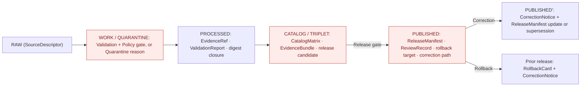
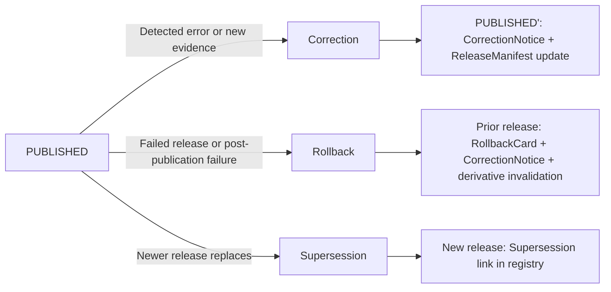
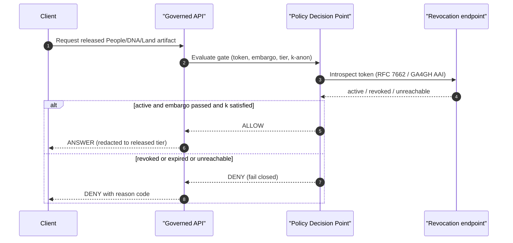

<!-- [KFM_META_BLOCK_V2]
doc_id: kfm://doc/docs-domains-people-dna-land-release-index
title: People / DNA / Land — Release Index
type: standard
subtype: domain-release-index
version: v1.1
status: draft
owners: <people-dna-land-domain-steward>; <release-authority>; <sensitivity-reviewer>; <rights-holder-representative>  # PLACEHOLDER — assign before review
created: 2026-05-19
updated: 2026-06-07
policy_label: restricted
contract_version: "3.0.0"
related:
  - docs/domains/people-dna-land/README.md                     # authored prior session (v1.1)
  - docs/domains/people-dna-land/PEOPLE_DOMAIN_MODEL.md         # authored prior session (v0.1)
  - docs/domains/people-dna-land/PEOPLE_PRESERVATION_MATRIX.md  # authored prior session (v0.2)
  - docs/domains/people-dna-land/MISSING_OR_PLANNED_FILES.md    # authored prior session (v0.2)
  - docs/standards/RELEASE_MANIFEST.md                # PROPOSED — NEEDS VERIFICATION
  - docs/standards/EVIDENCE_BUNDLE.md                 # PROPOSED — NEEDS VERIFICATION
  - docs/standards/CONSENT_TOKENS.md                  # PROPOSED — NEEDS VERIFICATION (Pass-10 C6-07)
  - docs/runbooks/people-dna-land/                    # PROPOSED — NEEDS VERIFICATION
  - docs/registers/DRIFT_REGISTER.md                  # CONFIRMED rule / PROPOSED presence
  - docs/registers/VERIFICATION_BACKLOG.md            # CONFIRMED rule / PROPOSED presence
  - docs/doctrine/directory-rules.md                  # CONFIRMED (project doctrine)
  - ai-build-operating-contract.md
tags: [kfm, domain, people, dna, land, release, sensitivity, governance]
notes:
  - "CONTRACT_VERSION pinned to 3.0.0 per ai-build-operating-contract.md."
  - "Domain-segment naming (`people-dna-land` vs `people`) is doctrinally unresolved between Directory Rules §6.1/§12 and Atlas v1.1 §24.13; tracked session-wide as OQ-PDL-SEG-01 (= local OPEN-PEOPLE-NAMING). See §13."
  - "ReleaseManifest contract is CONFIRMED doctrine (KFM-P7-PROG-0003 [NI-425]); the Pass-15 release-index extension (dataset_id, spec_hash, run_receipt, SPDX, timestamp, evidence_bundle_digest) is CONFIRMED. Per-domain sensitivity/consent extension fields are PROPOSED."
  - "All implementation-layer paths are PROPOSED until verified against a mounted repo."
[/KFM_META_BLOCK_V2] -->

# People / DNA / Land — Release Index

Governance contract for what may be published from the People / Genealogy / DNA / Land Ownership domain, in what form, behind which gates, and how it can be corrected or rolled back.

[](#1-purpose)
[](#2-what-this-index-governs)
[](#3-sensitivity-posture)
[](#3-sensitivity-posture)
[](#5-release-lifecycle-and-gates)
[](#13-open-questions-and-adr-backlog)
[](#14-related-docs)
[](#14-related-docs)

> **Status:** `draft` · **Owners:** `<domain steward · release authority · sensitivity reviewer · rights-holder representative>` *(PLACEHOLDER — assign before review)* · **Last updated:** `2026-06-07`

> [!IMPORTANT]
> **This domain is deny-by-default.** Living-person fields, raw DNA segment data, and private person-parcel joins are `T4` (denied) unless an explicit, reviewed, receipted transform demotes them to a lower tier. Nothing in this document creates a default permission to publish. If a release decision is ambiguous, the gate fails closed and the prior state is preserved.

> [!WARNING]
> **Segment-name conflict (OQ-PDL-SEG-01).** Directory Rules §6.1/§12 examples use **`people-dna-land`** (for `docs/domains/`, `policy/domains/`, `tests/domains/`, `data/<phase>/`); Atlas Ch. 24.13 crosswalk row 16 uses the short segment **`people`** (for `schemas/contracts/v1/people/`, `contracts/people/`, `policy/sensitivity/people/`, `policy/consent/people/`). This document uses `people-dna-land` where Directory Rules gives an explicit example and `<segment>` for the four crosswalk-only roots, pending ADR. See [§11](#11-related-artifacts-and-paths) and [§13](#13-open-questions-and-adr-backlog).

---

## Table of contents

1. [Purpose](#1-purpose)
2. [What this index governs](#2-what-this-index-governs)
3. [Sensitivity posture](#3-sensitivity-posture)
4. [Release manifest contract](#4-release-manifest-contract)
5. [Release lifecycle and gates](#5-release-lifecycle-and-gates)
6. [Per-class release postures](#6-per-class-release-postures)
7. [Release-index entry template](#7-release-index-entry-template)
8. [Correction, supersession, and rollback](#8-correction-supersession-and-rollback)
9. [Consent, revocation, and embargo](#9-consent-revocation-and-embargo)
10. [Decision outcomes for releases](#10-decision-outcomes-for-releases)
11. [Related artifacts and paths](#11-related-artifacts-and-paths)
12. [Verification backlog](#12-verification-backlog)
13. [Open questions and ADR backlog](#13-open-questions-and-adr-backlog)
14. [Related docs](#14-related-docs)

---

## 1. Purpose

**CONFIRMED doctrine.** This document is the human-facing release index for the People / Genealogy / DNA / Land Ownership domain — Chapter 16 of the *KFM Domains v1.1 Consolidated Atlas* ([DOM-PEOPLE], [ENCY]). It explains:

- which People/DNA/Land objects can become released artifacts at all,
- which gates a candidate must clear before promotion to `PUBLISHED`,
- what each release-index entry records (dataset, bundle, tile archive, layer manifest), and
- how a released claim is corrected, superseded, or rolled back.

**PROPOSED scope.** This document is governance, not the release ledger itself. The machine-readable release ledger and per-release `ReleaseManifest` artifacts live elsewhere — `release/candidates/people-dna-land/…` and `release/…` per Directory Rules §5 (CONFIRMED rule, PROPOSED presence pending mounted-repo verification).

> [!NOTE]
> **Authority order.** Where this document and the v1.0 / v1.1 Atlas appear to disagree, the Atlas governs the substantive claim and any conflict is filed to `docs/registers/DRIFT_REGISTER.md` per Directory Rules §13 (anti-pattern / drift discipline; ADR triggers per §2.4).

[↑ back to top](#table-of-contents)

---

## 2. What this index governs

**CONFIRMED scope, PROPOSED field realization.** The People/DNA/Land domain owns the following object families ([DOM-PEOPLE] §B):

| Object family | Notes |
|---|---|
| `Person Assertion`, `Person Identity Candidate`, `PersonCanonical` | Assertion-first; `PersonCanonical` is a release-state-aware derivative, never a sovereign claim. |
| `Genealogy Relationship`, `RelationshipAssertion`, `FamilyGroup`, `Relationship Hypothesis` | Evidence-bound; hypothesis confidence is exposed, not hidden. |
| `LifeEvent`, `Residence Event`, `Migration Event`, `NameAssertion` | Time-aware; valid / observed / source / retrieval / release / correction times stay distinct. |
| `Land Ownership Assertion`, `Deed Instrument`, `Title Instrument` | Land instruments are evidence, not title truth. |
| `Assessor Record`, `TaxRecord`, `Parcel Version`, `Ownership Interval` | Assessor records are `administrative`; assessor-as-title is denied. |
| `DNA Match Evidence`, `DNAKitToken`, `DNASegment` | DNA evidence; raw segments and kit IDs are non-public by doctrine. |

**Explicit non-ownership (CONFIRMED / PROPOSED, [DOM-PEOPLE] §B).** Settlements, roads, archaeology, hydrology, agriculture, hazards, and spatial foundation provide *context*; they do **not** weaken living-person, DNA, title, or parcel-boundary controls. The domain explicitly does *not* own: settlement legal status, route corridor semantics, or archaeological cultural-place ownership.

[↑ back to top](#table-of-contents)

---

## 3. Sensitivity posture

**CONFIRMED doctrine ([ENCY], [DOM-PEOPLE] §I).** Living-person output and DNA-derived outputs are **denied or restricted by default**. Raw kit IDs and DNA segments are not public. Assessor and tax records are not title truth. Parcel geometry is not legal boundary truth.

### 3.1 Default tier matrix

The table below applies the Atlas v1.1 §24.5.2 People rows to the release lane. Tier names and definitions are CONFIRMED doctrine; per-class transforms and gates are PROPOSED until validator and policy implementations are confirmed.

| Object class | Default tier | Allowed transforms (PROPOSED) | Required gates | Citation |
|---|---|---|---|---|
| Living-person fields (any field directly identifying a living person) | `T4` Denied | Aggregation by tract or county + `AggregationReceipt` → `T1` Generalized. | Consent **or** aggregation gate + `ReviewRecord`. | [DOM-PEOPLE §I]; Atlas §24.5.2 |
| Raw DNA segment / kit / vendor-ID data | `T4` Denied | None to a public tier; `T3` Restricted only under named research agreement. | Named consent + `ReviewRecord` + `PolicyDecision`. | [DOM-PEOPLE §I]; Atlas §24.5.2 |
| Private person↔parcel join | `T4` Denied | Generalized parcel + de-identified person → `T2` Reviewer only. | `RedactionReceipt` + `ReviewRecord`. | Atlas §24.5.2 |
| Person assertion (historical, well-deceased) | `T1` Generalized / `T2` Reviewer (PROPOSED) | Generalization; evidence-bundle citation. | Standard release closure. | [DOM-PEOPLE]; [ENCY] |
| Land instrument (deed / title / patent / assessor copy) | `T0` Open or `T1` (PROPOSED, source-dependent) | None when source rights permit; otherwise `RedactionReceipt` → `T1`. | Source-rights confirmation + `ReleaseManifest`. | [DOM-PEOPLE] |
| AI access to RAW / WORK / QUARANTINE for this domain | `T4` forever | None — boundary holds. | `PolicyDecision` + `AIReceipt` denial. | [GAI]; Atlas §24.5.2 |

> [!CAUTION]
> **A lower tier does not loosen the gates above it.** A `T1` release of an aggregated living-person layer still requires an `AggregationReceipt`, a `ReviewRecord`, and a `PolicyDecision`. Skipping any of these returns the candidate to `T4`.

### 3.2 Tier transitions (allowed motion)

Reproduced from Atlas §24.5.3. All transitions are **reversible** (CONFIRMED doctrine).

| From → To | Required artifact | Required reviewer | Reversibility |
|---|---|---|---|
| `T4` → `T3` | `PolicyDecision` + `ReviewRecord` + named agreement | Steward + rights-holder | Reversible — agreement revocation returns object to `T4` with `CorrectionNotice`. |
| `T4` → `T2` | `PolicyDecision` + `ReviewRecord` | Steward | Reversible — review revocation returns object to `T4`. |
| `T4` → `T1` | `RedactionReceipt` + `ReviewRecord` | Steward | Reversible — correction may demote a published `T1` back to `T4`. |
| `T1` → `T0` | `ReleaseManifest` + `ReviewRecord` | Steward + release authority | Reversible via `RollbackCard`. |

[↑ back to top](#table-of-contents)

---

## 4. Release manifest contract

**CONFIRMED doctrine** ([KFM-P7-PROG-0003], [NI-425]). When a promotion gate allows `CATALOG / TRIPLET → PUBLISHED`, it emits a `ReleaseManifest`: a single, signed, hashable JSON object that names every:

- included **dataset** by stable ID,
- included **`EvidenceBundle`** by `spec_hash`,
- included **PMTiles archive** by `spec_hash`,
- included **`LayerManifest`** by `spec_hash`.

Consumers — the web client, the catalog harvester, downstream pipelines — bind to the `ReleaseManifest`, not to floating "latest" pointers. A release is content-addressed by construction: any consumer that records the manifest's `spec_hash` is recording exactly which evidence it observed.

**CONFIRMED (Pass-15 addendum, [NI-425]).** `ReleaseManifest` expectations are extended with **release-index entries**, each carrying:

- `dataset_id` — stable domain identifier,
- `spec_hash` — canonical `jcs:sha256:<hex>` of the spec (per C1-02 / Directory Rules),
- `run_receipt` — pointer to the cosign-signed run receipt for the producing pipeline,
- `SPDX` — license identifier in the canonical allowlist (e.g., `CC0-1.0`, `CC-BY-4.0`; `ODC-By`/`PDDL`/`US-PD` allowlist closure is an open ADR per C5-02 — see [§13](#13-open-questions-and-adr-backlog)),
- `timestamp` — release time in ISO 8601 / RFC 3339,
- `evidence_bundle_digest` — digest of the supporting `EvidenceBundle`.

> [!NOTE]
> **Default-deny promotion (CONFIRMED, C5-02).** Promotion is denied unless `spec_hash` is present and matches a recomputation, the run receipt is cosign-signed and verifiable, SPDX rights are in the allowlist, at least one attestation bundle is published, and every dataset-quality check passes. Absence of evidence blocks promotion — the structural bedrock of evidence-first governance.

> [!NOTE]
> **Per-domain extension (PROPOSED).** For People/DNA/Land entries specifically, the release-index row **should also** carry the sensitivity tier of the released artifact, the active transform receipt(s) (`RedactionReceipt` / `AggregationReceipt`), and a `consent_token` reference where one applies. This is a domain-level proposal that does not contradict the canonical `ReleaseManifest` shape; resolution should be filed under the ADR-S-03 receipt-layout ADR or a dedicated People/DNA/Land release-extension ADR. **NEEDS VERIFICATION** against the live `release_manifest.schema.json`.

[↑ back to top](#table-of-contents)

---

## 5. Release lifecycle and gates

**CONFIRMED doctrine** ([DIRRULES], [DOM-PEOPLE] §H, [ENCY]). People/DNA/Land follows the standard KFM lifecycle:

```text
RAW  →  WORK / QUARANTINE  →  PROCESSED  →  CATALOG / TRIPLET  →  PUBLISHED
```

Promotion is a governed state transition, not a file move. A transition is **closed** only when (i) every required artifact exists, (ii) every required artifact *resolves* — not just references — its dependencies (`EvidenceRef` → `EvidenceBundle`, `source_id` → `SourceDescriptor`), and (iii) the policy gate evaluated and recorded its decision. Missing any of these means the transition fails closed and the prior state is preserved.



**Per-domain gate notes (CONFIRMED / PROPOSED, [DOM-PEOPLE], [ENCY]):**

- `Validation` failures on living-person, DNA, or person-parcel content hold in `QUARANTINE` with a structured reason; they do **not** advance.
- `Catalog` closure for this domain requires `EvidenceBundle` plus the appropriate sensitivity receipt (`RedactionReceipt` / `AggregationReceipt`) where the candidate would otherwise carry living-person, DNA, or private-parcel content.
- `Release` requires a `ReviewRecord` from the sensitivity reviewer **and**, where rights or sovereignty apply (e.g., named consent for DNA), a separate review from a rights-holder representative. Per Atlas §24.7.2, a sensitive-lane release requires **author + sensitivity reviewer + release authority + rights-holder rep**, and the author may not also approve. Separation of duties is maturity-dependent (Directory Rules §2; ADR-S-09).

> [!WARNING]
> **Reason-code surface for People/DNA/Land releases.** Expect `RIGHTS_UNKNOWN`, `SENSITIVITY_UNRESOLVED`, `REVIEW_NEEDED` / `REVIEW_INSUFFICIENT`, `RELEASE_MANIFEST_INVALID`, and `ROLLBACK_TARGET_MISSING` as dominant `DENY` reasons (Atlas §24.9.1 error-class table). The full reason-code catalog is PROPOSED in Atlas §24.6.

[↑ back to top](#table-of-contents)

---

## 6. Per-class release postures

The matrix below maps every object class to its release shape. **Status of the rules: CONFIRMED doctrine. Status of the named artifacts in the current repo: PROPOSED until verified.**

| Object class | Release form (PROPOSED) | Default tier | Required receipts | DENY-by-default conditions |
|---|---|---|---|---|
| `Person Assertion` (historical, well-deceased) | EvidenceBundle + Layer (point or address) | `T1`–`T2` | `SourceDescriptor`, `EvidenceBundle`, `ReleaseManifest` | Living-person flag set; rights unresolved; source role unknown. |
| `Person Identity Candidate` | EvidenceBundle (reviewer surface) | `T2` | `EvidenceBundle`, `ReviewRecord` | Conflicting assertions unresolved; weak evidence; living-person involved. |
| `Relationship Hypothesis` | EvidenceBundle with confidence | `T1`–`T2` | `EvidenceBundle` with confidence band | Living-person endpoints; DNA-only basis without consent. |
| `LifeEvent`, `Residence Event`, `Migration Event` | EvidenceBundle + (optional) PMTiles for migration paths | `T0`–`T1` | `EvidenceBundle`, `ReleaseManifest` | Living person; private location; uncertainty exceeds publishable threshold. |
| `Land Ownership Assertion`, `Deed`/`Title`/`Patent Instrument` | EvidenceBundle + instrument transcript | `T0`–`T1` | `EvidenceBundle`, source-rights confirmation | Chain-of-title gap; instrument rights unresolved. |
| `Parcel Version`, `Ownership Interval` | LayerManifest + PMTiles (parcel context) | `T1` (CAUTIONED) | `EvidenceBundle`, `LayerManifest`, "context-not-title" warning | Used as title truth; private person-parcel join active. |
| `Assessor Record`, `TaxRecord` | EvidenceBundle (administrative context) | `T1` | `EvidenceBundle`, source-rights confirmation | Treated as title truth (denied — assessor is `administrative`). |
| `DNA Match Evidence` (released derivative only) | EvidenceBundle (reviewer surface) | `T3` (named agreement) | `EvidenceBundle`, named consent, `ReviewRecord` | Raw segment data; revocation pending; consent expired. |
| `DNAKitToken`, raw `DNASegment` | **Not released** | `T4` | n/a | Always — no transform releases raw genomic content to a public tier. |

> [!TIP]
> **Reading the table.** "Release form" is what reaches `PUBLISHED`; it is never the canonical store or graph internal. Public clients and normal UI surfaces consume released forms only (trust-membrane invariant, Directory Rules §7).

[↑ back to top](#table-of-contents)

---

## 7. Release-index entry template

**PROPOSED template.** A release-index entry for this domain extends the canonical fields (§4) with the People/DNA/Land sensitivity surface. The canonical fields (`dataset_id`, `spec_hash`, `run_receipt`, `rights_spdx`, `timestamp`, `evidence_bundle_digest`) follow the C1-01 run-receipt shape (CONFIRMED); the `sensitivity`, `consent`, and `release` sub-objects are PROPOSED domain extensions. The shape below is illustrative until the canonical `release_manifest.schema.json` is verified in the mounted repo.

<details>
<summary><strong>Click to expand — illustrative release-index entry</strong></summary>

```json
{
  "dataset_id": "kfm:people-dna-land/<stable-id>",
  "spec_hash": "jcs:sha256:<hex>",
  "run_receipt": "kfm:receipt/<hex>",
  "evidence_bundle_digest": "sha256:<hex>",
  "rights_spdx": "CC-BY-4.0",
  "timestamp": "YYYY-MM-DDTHH:MM:SSZ",

  "sensitivity": {
    "tier": "T1",
    "tier_basis": ["AggregationReceipt", "ReviewRecord"],
    "transforms": [
      {"type": "aggregation", "grain": "county", "receipt": "kfm:receipt/<hex>"}
    ]
  },

  "consent": {
    "applies": false,
    "token_ref": null,
    "revocation_endpoint": null,
    "embargo_until": null
  },

  "release": {
    "manifest_ref": "kfm:release/<id>",
    "review_record": "kfm:review/<id>",
    "rollback_target": "kfm:release/<prior-id>",
    "correction_path": "kfm:correction/<id-or-null>"
  },

  "contents": {
    "evidence_bundles": [{"spec_hash": "jcs:sha256:<hex>"}],
    "layer_manifests":  [{"spec_hash": "jcs:sha256:<hex>"}],
    "pmtiles_archives": [{"spec_hash": "jcs:sha256:<hex>"}]
  }
}
```

**Notes (PROPOSED).** Field names follow the C1-01 run-receipt canonicalization where they overlap (`rights_spdx`, `spec_hash` formatting as `jcs:sha256:<hex>` per C1-02). Sensitivity, consent, and release sub-objects are proposed extensions specific to People/DNA/Land. The `consent.applies = true` branch requires the token to introspect on every render — see [§9](#9-consent-revocation-and-embargo).

</details>

[↑ back to top](#table-of-contents)

---

## 8. Correction, supersession, and rollback

**CONFIRMED doctrine** ([ENCY], [DIRRULES]). A released People/DNA/Land claim never undergoes a silent edit. Three reversible transitions are available, each with its own receipt and review:



| Transition | Trigger | Required artifacts | Stale-state behavior |
|---|---|---|---|
| **Correction** (`PUBLISHED → PUBLISHED'`) | Detected error or new evidence; downstream derivatives identified. | `CorrectionNotice`, `ReviewRecord`, invalidation list, `ReleaseManifest` update or supersession. | Stale-state announcement; **no silent edit**. |
| **Rollback** (`PUBLISHED → prior release`) | Failed release or post-publication failure; targeted prior release identified. | `RollbackCard`, `CorrectionNotice`, `ReleaseManifest` reverts, downstream-derivative invalidation. | Held at current state until rollback validated. |
| **Supersession** | A newer release replaces an older one (no defect required). | Supersession link in bundle registry; lineage chain entry. | Older release remains discoverable in lineage; not surfaced as current. |

> [!IMPORTANT]
> **Right-to-be-forgotten vs tombstone (open boundary).** Revocation of consent for living-person or DNA-derived material may require *true erasure* rather than a tombstone — the corpus is explicit that tombstones satisfy explainability but not erasure (Pass-10 C5-09). The boundary is flagged open and aligned with GDPR / applicable Tribal data policies. Until an ADR resolves it, People/DNA/Land defaults to erasure for living-person and DNA content where law requires, and tombstone-with-supersession for everything else. When erasure occurs, the *fact* of erasure is logged without restating removed content. **NEEDS VERIFICATION** against implemented policy. *(See [PEOPLE_PRESERVATION_MATRIX.md](PEOPLE_PRESERVATION_MATRIX.md) §7 for the full decision matrix.)*

[↑ back to top](#table-of-contents)

---

## 9. Consent, revocation, and embargo

**CONFIRMED doctrine (C6-07, C6-08, C9-04).** For any release that depends on consent (DNA-derived derivatives; named-agreement living-person research surfaces), consent is **machine-readable, signed, and introspected on every render** — not narrative text in a README.

A People/DNA/Land release that depends on consent **shall** carry, at minimum:

- a `consent_token` with `scopes`, `aud`, `exp`, `revocation_endpoint`, `consent_history_hash`, and a `redaction_profile` reference (JWT or GA4GH visa shape);
- an `embargo_until` field (release is denied if `now < embargo_until`);
- cache-invalidation hooks (PMTiles index bump, tile-server purge) so that revoked content does not survive in caches.



> [!WARNING]
> **Fail-closed on introspection outage.** If the revocation endpoint is unreachable, the rendering must fail closed even when this inconveniences users. This is doctrine, not preference (C6-07, C6-08).

[↑ back to top](#table-of-contents)

---

## 10. Decision outcomes for releases

**CONFIRMED doctrine.** Every governed-API surface returns one of four finite outcomes (Atlas §24.3). There is **no `ACCEPTED` outcome** — a passed promotion is an `ANSWER` queued per §24.3.1. For People/DNA/Land, the per-outcome posture is:

| Outcome | When it fires | What the client receives |
|---|---|---|
| `ANSWER` | All gates pass for the requested released artifact at the requested tier. | Released form only (never canonical store, graph internal, vector index, or RAW/WORK content). |
| `ABSTAIN` | Evidence is insufficient or the claim depends on unresolved sensitivity. | A structured abstention with cite-or-abstain reason; **never** a generated stand-in. |
| `DENY` | Policy, rights, sensitivity, review state, or release state blocks the request. | A reason code (e.g., `RIGHTS_UNKNOWN`, `SENSITIVITY_UNRESOLVED`, `REVIEW_NEEDED`, `CONSENT_REVOKED`) and any safe-to-disclose context. |
| `ERROR` | Infrastructure failure; gate cannot be evaluated. | Fail-closed; **no partial answer**. |

**Governed AI ([GAI], [DOM-PEOPLE] §L).** AI may summarize *released* People/DNA/Land `EvidenceBundle`s, compare evidence, explain limitations, and draft steward-review notes. AI **must** `ABSTAIN` when evidence is insufficient and **must** `DENY` where policy, rights, sensitivity, or release state blocks the request. AI never reads RAW or WORK content for this domain and emits an `AIReceipt` on every answer.

[↑ back to top](#table-of-contents)

---

## 11. Related artifacts and paths

**PROPOSED placement** per Directory Rules §5 / §12. All paths below are placement proposals, **NEEDS VERIFICATION** until a mounted-repo inspection confirms them. Segments marked `<segment>` are subject to the [§13 OQ-PDL-SEG-01 conflict](#13-open-questions-and-adr-backlog): Directory Rules §6.1/§12 use `people-dna-land`; Atlas v1.1 §24.13 uses `people` for `schemas/`/`contracts/`/`policy/sensitivity/`/`policy/consent/`.

```text
docs/domains/people-dna-land/
├── README.md                      # domain landing (per-folder README, §15 of Directory Rules)
├── RELEASE_INDEX.md               # THIS FILE
├── PEOPLE_DOMAIN_MODEL.md         # bounded context, identity, aggregates (authored prior session)
├── PEOPLE_PRESERVATION_MATRIX.md  # retention, tombstone, erasure (authored prior session)
├── MISSING_OR_PLANNED_FILES.md    # file inventory (authored prior session)
├── SENSITIVITY.md                 # PROPOSED — sensitivity profile for the domain
├── CONSENT.md                     # PROPOSED — consent-token contract specific to People/DNA
└── (runbooks live at docs/runbooks/people-dna-land/ per Directory Rules §6.1.b; subfolder convention pending §18 OPEN-DR-02)

# All paths below: PROPOSED — NEEDS VERIFICATION
release/
├── candidates/people-dna-land/    # release candidates, gated CATALOG → PUBLISHED
└── ...                            # ReleaseManifests, RollbackCards, CorrectionNotices

schemas/contracts/v1/<segment>/    # <segment> = people | people-dna-land — OQ-PDL-SEG-01
contracts/<segment>/
policy/domains/people-dna-land/    # domain admissibility (segment uncontested under domains/)
policy/sensitivity/<segment>/
policy/consent/<segment>/
tests/domains/people-dna-land/
fixtures/domains/people-dna-land/
data/<phase>/people-dna-land/
data/published/layers/people-dna-land/
data/registry/sources/people-dna-land/
```

**Upstream / downstream binding (PROPOSED, [DOM-PEOPLE] §F, [ENCY]):**

| Direction | Counterparts | Notes |
|---|---|---|
| **Upstream** (consumed by this domain) | `Settlements` (residence, cemetery, school, court, county, township, place); `Roads/Rail` (migration, access); `Archaeology` (historic person, documentary, cultural-place context); `Agriculture` (farm, producer-adjacent context). | Relation must preserve ownership, source role, sensitivity, and `EvidenceBundle` support. |
| **Downstream** (consumes from this domain) | `Frontier Matrix` (county-year panels cite well-deceased person assertions only); public Evidence Drawer; Focus Mode (released bundles only). | Living-person and raw-DNA payloads are **never** propagated downstream. |

[↑ back to top](#table-of-contents)

---

## 12. Verification backlog

Items below are drawn from Atlas v1.0 Ch. 16 §N (Verification backlog) and the Atlas v1.1 Ch. 24.12 Master Open-ADR backlog. They are **NEEDS VERIFICATION** until checked against mounted-repo files, schemas, registry entries, tests, logs, emitted artifacts, review records, or release manifests.

- [ ] Verify the **living-person policy** is implemented and enforced (validator + OPA rule + fail-closed test).
- [ ] Verify **DNA consent / revocation** is enforced on every render (PDP introspects revocation endpoint; cache invalidation fires; fail-closed on introspection outage).
- [ ] Verify **land-instrument chain logic** (chain-of-title gap test; assessor-as-title denial).
- [ ] Verify **geometry ↔ role boundary** (parcel geometry never used as title truth; address-as-evidence is not address-as-occupancy).
- [ ] Verify **UI / API restricted-field no-leak** behavior across Evidence Drawer, Focus Mode, AI surface, and tile rendering.
- [ ] Verify the **`ReleaseManifest` schema** (`release_manifest.schema.json`) supports the Pass-15 release-index extension and any People/DNA/Land-specific sub-objects.
- [ ] Verify **SPDX allowlist** for this domain (corpus confirms `CC0-1.0`, `CC-BY-4.0`; `ODC-By`, `PDDL`, `US-PD` are open questions per C5-02).
- [ ] Verify **rollback drill** completes end-to-end (RollbackCard → ReleaseManifest revert → derivative invalidation → cache purge → audit ledger entry).
- [ ] Verify **default-deny promotion gate** (C5-02): spec_hash recompute-match, cosign-verifiable receipt, SPDX-in-allowlist, attestation present, DQ pass — all required before `allow`.

[↑ back to top](#table-of-contents)

---

## 13. Open questions and ADR backlog

Open architectural questions surfaced by this document. Resolutions migrate to `docs/registers/VERIFICATION_BACKLOG.md` or `docs/adr/` per Directory Rules §2.4 / §13.

| # | Question | Why it's ADR-class | Suggested ADR title (PROPOSED) |
|---|---|---|---|
| **OQ-PDL-SEG-01** *(= local OPEN-PEOPLE-NAMING)* | Is the canonical domain segment `people-dna-land` (Directory Rules §6.1/§12) or `people` (Atlas v1.1 §24.13 crosswalk) for `schemas/`/`contracts/`/`policy/sensitivity/`/`policy/consent/`? | Inconsistent segment naming across roots forks docs, schema, and policy homes. Tracked session-wide across the domain doc set. | "Domain segment naming for People / DNA / Land." |
| **OPEN-PEOPLE-EXT** | Should the People/DNA/Land release-index extension (sensitivity, consent, transforms) live inside `release_manifest.schema.json` or in a domain-scoped sub-schema? | Creates a parallel home if domain-scoped (Directory Rules §2.4(5)); relates to ADR-S-03 receipt layout. | "Release-manifest extension for People / DNA / Land." |
| **OPEN-PEOPLE-CONSENT** | What is the cache TTL for revocation introspection results, and what is the precise erasure-vs-tombstone boundary for living-person / DNA content? | Right-to-be-forgotten alignment is doctrine-class for this domain (C5-09 open question). | "Consent token TTL and erasure boundary." |
| **OPEN-PEOPLE-RIGHTS** | Which SPDX identifiers are admissible for People/DNA/Land sources beyond `CC0-1.0` and `CC-BY-4.0`? | Allowlist closure is the structural bedrock of default-deny promotion (C5-02 open question). | "SPDX allowlist for People / DNA / Land sources." |
| **OPEN-PEOPLE-AUTHORITY** | Who is the release authority for `T3` named-agreement DNA releases — domain steward, rights-holder representative, both? | Separation-of-duties is operating-law invariant 9 (Atlas §24.7); under-specified separation invites silent author-approves-self events. Relates to ADR-S-09. | "Release authority and separation of duties for People / DNA / Land." |

[↑ back to top](#table-of-contents)

---

## 14. Related docs

> Links below are placement proposals (relative paths). Items marked **TODO** are not yet verified to exist; verify before relying on them.

- [`README.md`](./README.md) — domain landing page · *authored prior session (v1.1)*
- [`PEOPLE_DOMAIN_MODEL.md`](./PEOPLE_DOMAIN_MODEL.md) — bounded context, identity, aggregates · *authored prior session (v0.1)*
- [`PEOPLE_PRESERVATION_MATRIX.md`](./PEOPLE_PRESERVATION_MATRIX.md) — retention, tombstone, erasure · *authored prior session (v0.2)*
- [`MISSING_OR_PLANNED_FILES.md`](./MISSING_OR_PLANNED_FILES.md) — file inventory · *authored prior session (v0.2)*
- [`SENSITIVITY.md`](./SENSITIVITY.md) — sensitivity profile · **TODO**
- [`CONSENT.md`](./CONSENT.md) — consent-token contract · **TODO**
- [`docs/standards/RELEASE_MANIFEST.md`](../../standards/RELEASE_MANIFEST.md) — canonical `ReleaseManifest` standard · **TODO**
- [`docs/standards/EVIDENCE_BUNDLE.md`](../../standards/EVIDENCE_BUNDLE.md) — `EvidenceBundle` standard · **TODO**
- [`docs/standards/CONSENT_TOKENS.md`](../../standards/CONSENT_TOKENS.md) — consent-token standard (Pass-10 C6-07) · **TODO**
- [`docs/standards/PROV.md`](../../standards/PROV.md) — W3C PROV profile (naming variance vs `PROVENANCE.md` → Directory Rules OPEN-DR-01) · **NEEDS VERIFICATION**
- [`docs/runbooks/people-dna-land/`](../../runbooks/people-dna-land/) — operational runbooks for this domain · **TODO**
- [`docs/registers/DRIFT_REGISTER.md`](../../registers/DRIFT_REGISTER.md) — drift entries · CONFIRMED rule / PROPOSED presence
- [`docs/registers/VERIFICATION_BACKLOG.md`](../../registers/VERIFICATION_BACKLOG.md) — verification backlog · CONFIRMED rule / PROPOSED presence
- [`docs/doctrine/directory-rules.md`](../../doctrine/directory-rules.md) — placement doctrine · CONFIRMED
- `ai-build-operating-contract.md` — `CONTRACT_VERSION = "3.0.0"`; §23.2 sensitive-domain matrix · CONFIRMED

[↑ back to top](#table-of-contents)

---

**Last updated:** `2026-06-07` · **Version:** `v1.1 (draft)` · **CONTRACT_VERSION:** `3.0.0`
**Steward review cadence:** quarterly while `draft`; on every release otherwise.

[↑ back to top](#table-of-contents)
