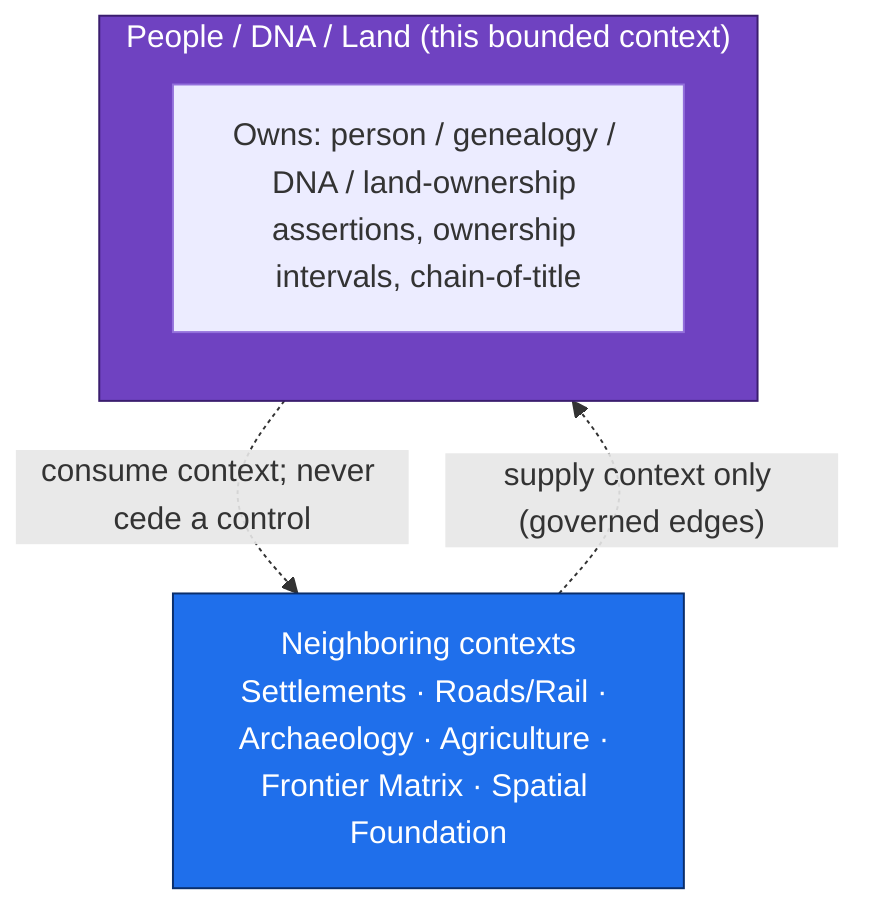
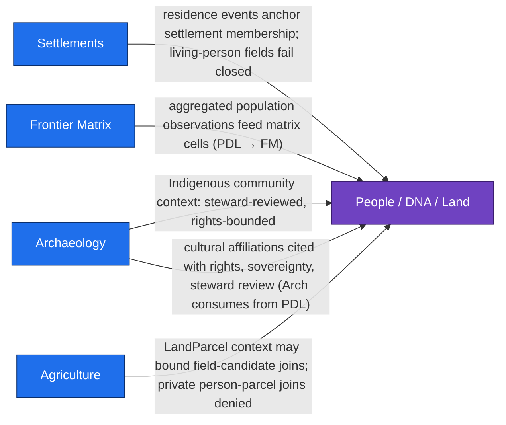
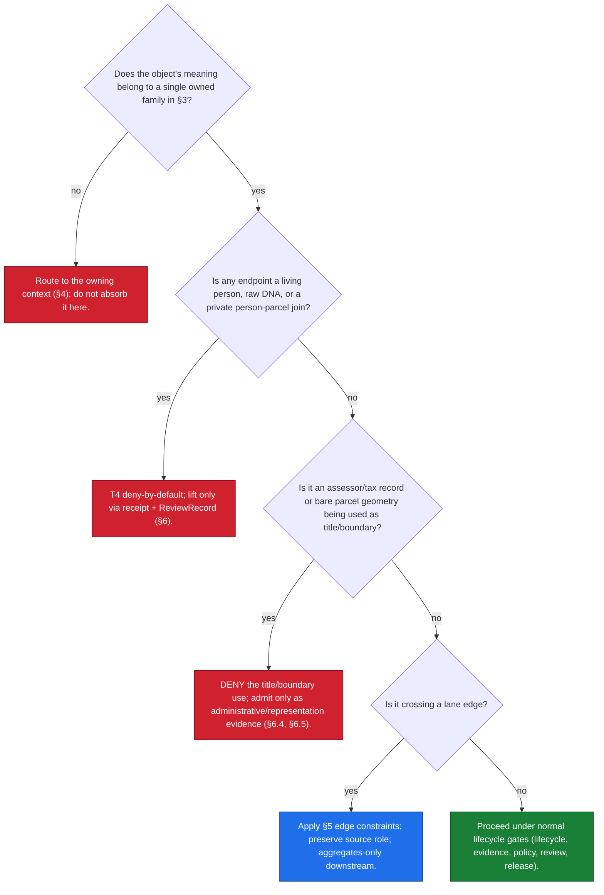

<!-- [KFM_META_BLOCK_V2]
doc_id: kfm://doc/domain/people-dna-land/scope-and-boundary
title: SCOPE_AND_BOUNDARY — People, Genealogy, DNA, Land Ownership
type: standard
subtype: domain-boundary
version: v0.1
status: draft
owners: <people-dna-land-domain-steward>; <docs-steward>  # PLACEHOLDER — assign before review
created: 2026-06-07
updated: 2026-06-07
policy_label: public-doctrine
contract_version: "3.0.0"
related:
  - docs/domains/people-dna-land/README.md                     # authored prior session (v1.1)
  - docs/domains/people-dna-land/PEOPLE_DOMAIN_MODEL.md         # authored prior session (v0.1)
  - docs/domains/people-dna-land/PEOPLE_PRESERVATION_MATRIX.md  # authored prior session (v0.2)
  - docs/domains/people-dna-land/RELEASE_INDEX.md               # authored prior session (v1.1)
  - docs/domains/people-dna-land/MISSING_OR_PLANNED_FILES.md    # authored prior session (v0.2)
  - docs/doctrine/directory-rules.md
  - docs/atlases/KFM_Domains_Culmination_Atlas_v1_1.pdf         # PROPOSED per ADR-S-02
  - ai-build-operating-contract.md
extends:
  - KFM Domains Culmination Atlas v1.1 — Ch. 16 §B (scope/ownership/non-ownership), §F (cross-lane relations); Ch. 17 §B (Frontier Matrix reciprocal non-ownership); Ch. 24.4.13–24.4.16 (cross-lane edge tables); Ch. 24.14 (object family × domain matrix)
  - Domain-Driven Design Reference (Eric Evans, 2015) — Bounded Context, Context Map, Domain Vision Statement
  - Directory Rules v1.3 — §7 (trust membrane), §12 (Domain Placement Law)
authority_posture: bounded-context boundary statement for the People/DNA/Land lane — subordinate to ai-build-operating-contract.md, Directory Rules, the Atlas, and any mounted-repo evidence; supersedes no source doctrine
truth_labels: [CONFIRMED, PROPOSED, INFERRED, NEEDS VERIFICATION, UNKNOWN, CONFLICTED]
tags: [kfm, domain, people-dna-land, scope, boundary, bounded-context, ownership, cross-lane]
notes:
  - "CONTRACT_VERSION pinned to 3.0.0 per ai-build-operating-contract.md."
  - "Ownership and non-ownership lists, and all four People-owned cross-lane edges, are CONFIRMED doctrine (Atlas Ch. 16 §B/§F, Ch. 24.4.14). The reciprocal non-ownership view is CONFIRMED from Atlas Ch. 17 §B."
  - "OPEN CONFLICT carried session-wide: segment 'people' (Atlas Ch. 24.13) vs 'people-dna-land' (Directory Rules §6.1/§12). Tracked as OQ-PDL-SEG-01."
  - "No mounted repo inspected; all paths PROPOSED."
[/KFM_META_BLOCK_V2] -->

# SCOPE_AND_BOUNDARY — People, Genealogy, DNA, Land Ownership

> The bounded-context boundary statement for the **People/DNA/Land** (`people-dna-land`) lane: what this context owns, what it deliberately refuses to own, who owns those things instead, and the directional cross-lane edges — each constrained so that a neighbor can supply context but never weaken a living-person, DNA, title, or parcel-boundary control.

| Status | Owners | Last updated |
|---|---|---|
| Draft — boundary statement; no mounted-repo verification | `<people-dna-land-domain-steward>` · `<docs-steward>` *(PLACEHOLDER)* | 2026-06-07 |

> [!CAUTION]
> **Sensitive domain.** This context governs living people, genealogy, DNA/genomic data, and private land-ownership assertions — **T4 / deny-by-default** under Atlas Ch. 24.5.2 and the operating contract's §23.2 matrix. The boundary rules below are not bureaucratic: a blurred boundary is how a neighbor's "context" relation becomes an unreviewed living-person leak. See [§6](#6-boundary-integrity-invariants).

> [!WARNING]
> **Segment-name conflict (OQ-PDL-SEG-01).** Directory Rules §6.1/§12 use **`people-dna-land`**; Atlas Ch. 24.13 uses the short segment **`people`** for `schemas/`/`contracts/`/`policy/sensitivity/`/`policy/consent/`. This doc concerns *conceptual* scope, not file placement, so the conflict touches it only in the path note at [§8](#8-relation-to-the-rest-of-the-doc-set). Tracked session-wide.

---

## Table of contents

1. [Purpose](#1-purpose)
2. [Bounded-context frame](#2-bounded-context-frame)
3. [What this context owns](#3-what-this-context-owns)
4. [What this context does not own](#4-what-this-context-does-not-own)
5. [Cross-lane edges (directional)](#5-cross-lane-edges-directional)
6. [Boundary-integrity invariants](#6-boundary-integrity-invariants)
7. [Boundary decision aid](#7-boundary-decision-aid)
8. [Relation to the rest of the doc set](#8-relation-to-the-rest-of-the-doc-set)
9. [Open questions](#open-questions-register)
10. [Open verification backlog](#open-verification-backlog)
11. [Changelog](#changelog-v00--v01)
12. [Definition of done](#definition-of-done)
13. [Related docs](#related-docs)

---

## 1. Purpose

A **bounded context** is the boundary within which each term has one defined meaning and one owner (DDD Reference, *Bounded Context*). This document is the boundary statement for the People/DNA/Land lane: it draws the line precisely so that `LandParcel`, `Ownership Interval`, `Person Assertion`, and `DNA Match Evidence` mean exactly one thing here, and so that neighboring lanes know exactly where their authority stops.

The one-line domain purpose (CONFIRMED, Atlas Ch. 16 §A): *govern assertion-first person evidence, genealogy relationships, restricted DNA evidence, land instruments, ownership intervals, chain-of-title reasoning, consent, policy decisions, review, correction, graph projection, EvidenceBundle views, and rollback.*

This document does **not** restate the identity model, aggregates, or invariants in depth — those live in [`PEOPLE_DOMAIN_MODEL.md`](PEOPLE_DOMAIN_MODEL.md). It restates only what is needed to make the boundary legible, then points at the directional edges and the rules that keep them safe.

[↑ Back to top](#table-of-contents)

---

## 2. Bounded-context frame

DDD's *Context Map* says: name each bounded context, make the name part of the ubiquitous language, and describe the points of contact between contexts — including translation, sharing, and levels of influence. KFM's responsibility-rooted architecture realizes this: each domain is a lane, and cross-lane relations are governed edges, not shared mutable state.

> [!NOTE]
> The arrows are **dashed and bidirectional-but-asymmetric** by design: a neighbor may supply context, and this context may consume it, but a cross-lane relation MUST preserve ownership, source role, sensitivity, and `EvidenceBundle` support (Atlas Ch. 16 §F). Context flows; control does not transfer.

[↑ Back to top](#table-of-contents)

---

## 3. What this context owns

**CONFIRMED / PROPOSED** (Atlas Ch. 16 §B; Appendix C). This context owns the following object families. "Owns" means: this context is the single authority for their meaning, identity, sensitivity, and release state.

| Owned object family | Why it is owned here |
|---|---|
| `Person Assertion` · `Person Identity Candidate` · `PersonCanonical` | Person identity is assertion-first and reconciled only under review; no other lane may assert a person. |
| `NameAssertion` | A name as stated by one source at one time. |
| `LifeEvent` · `Residence Event` · `Migration Event` | Person-scoped, time-bound event evidence. |
| `Genealogy Relationship` · `RelationshipAssertion` · `Relationship Hypothesis` | Kinship and relationship claims, including DNA/tree-derived hypotheses. |
| `FamilyGroup` | Grouping over persons and relationships. |
| `DNA Match Evidence` · `DNAKitToken` · `DNASegment` | Restricted genetic evidence; raw segments and kit IDs are non-public. |
| `ConsentGrant` · `RevocationReceipt` | The consent lifecycle that gates DNA and living-person release. |
| `Land Ownership Assertion` · `Ownership Interval` | Evidence-bound ownership claims and their time spans; chain-of-title reasoning. |
| `LandInstrument` (parent) · `Deed Instrument` · `Title Instrument` | Recorded land documents. |
| `Assessor Record` · `TaxRecord` | `administrative` records — owned here so that the "not title" rule is enforced at the boundary. |
| `LandParcel` · `LegalDescription` · `Parcel Version` | Parcel representations — owned so the "geometry is not title boundary" rule is enforced here. |

> [!IMPORTANT]
> Ownership of `Assessor Record`, `TaxRecord`, `LandParcel`, and `Parcel Version` is deliberate: these are exactly the objects most often *mistaken* for title truth. By owning them, this context owns the rule that they are **not** title truth ([§6](#6-boundary-integrity-invariants)).

[↑ Back to top](#table-of-contents)

---

## 4. What this context does not own

**CONFIRMED / PROPOSED** (Atlas Ch. 16 §B). Settlements, roads, archaeology, hydrology, agriculture, hazards, and spatial foundation provide *context* but do **not** weaken living-person, DNA, title, or parcel-boundary controls. The reciprocal view below is the load-bearing part of this boundary — it names who owns each adjacent thing instead.

| This context does NOT own | Owned instead by | Reciprocal confirmation |
|---|---|---|
| Settlement legal status; municipality / townsite / ghost-town status | **Settlements/Infrastructure** | Atlas Ch. 17 §B: "Settlements owns legal and infrastructure status." |
| Route / corridor semantics; movement-network identity | **Roads/Rail/Trade** | Atlas Ch. 17 §B: "Roads/Rail owns route/corridor semantics." |
| Archaeological site identity; cultural-place ownership; site coordinates | **Archaeology / Cultural Heritage** | Atlas Ch. 16 §B (does not own archaeology); Ch. 24.4.13. |
| County-year demographic panels; frontier definitions; land-office / public-land records | **Frontier Matrix** | Atlas Ch. 17 §B owns these; cites People only for aggregated population. |
| Coordinate reference profiles; geometry validity; generalization transforms | **Spatial Foundation** | Atlas Ch. 3 §B; Spatial Foundation owns spatial grammar, not domain truth. |
| Farm / land-use / producer truth | **Agriculture** | Atlas Ch. 9; People supplies parcel context only, with privacy. |
| Hydrology, soil, hazards truth | **Hydrology / Soil / Hazards** | context-only relations; no control transfer. |

> [!NOTE]
> **The Frontier Matrix mirror is the cleanest reciprocal proof.** Atlas Ch. 17 §B states the Frontier Matrix "explicitly does not own: People/DNA/Land owns living-person, DNA, title, parcel, and ownership decisions." Two contexts independently agreeing on the boundary is the strongest evidence that the line is correct (CONFIRMED).

> [!CAUTION]
> **A boundary subtlety, easily missed.** `Land Office Record` and `Public Land Record` are owned by **Frontier Matrix**, not by this context — even though this context owns `LandInstrument`, `Deed Instrument`, and `Title Instrument`. Land-office/public-land records are demographic-historical context; deeds/titles/patents are ownership evidence. Do not move land-office records into this lane. *(INFERRED from Atlas Ch. 16 §B vs Ch. 17 §B; flag as a boundary-clarity item, [OQ-PDL-BND-02](#open-questions-register).)*

[↑ Back to top](#table-of-contents)

---

## 5. Cross-lane edges (directional)

**CONFIRMED doctrine** (Atlas Ch. 24.4.13–24.4.14). Edges are directional and owned. The four edges **owned by** this context (it consumes context from the named lane) are the authoritative outbound list; the one inbound edge (Archaeology consuming from People/Land) is also named. Every edge preserves ownership, source role, sensitivity, and `EvidenceBundle` support.

| Edge (owner: People/DNA/Land) | Relation | Constraint | Citation |
|---|---|---|---|
| People/DNA/Land ↔ **Settlements** | Residence events anchor settlement membership. | Living-person fields fail closed. | Atlas Ch. 24.4.14 |
| People/DNA/Land → **Frontier Matrix** | Aggregated population observations feed matrix cells. | Only aggregates cross; living-person and raw-DNA payloads never propagate. | Atlas Ch. 24.4.14 |
| People/DNA/Land ↔ **Archaeology** | Indigenous community context. | Steward-reviewed and rights-bounded. | Atlas Ch. 24.4.14 |
| People/DNA/Land ↔ **Agriculture** | `LandParcel` context may bound field-candidate joins. | Private person-parcel joins denied by default. | Atlas Ch. 24.4.14 |
| **Archaeology** → People/Land *(inbound)* | Cultural affiliations cited from this lane. | Rights, sovereignty, and steward review required. | Atlas Ch. 24.4.13 |

> [!NOTE]
> Atlas Ch. 16 §F lists Settlements, Roads/Rail, Archaeology, and Agriculture as the per-domain cross-lane relations; Ch. 24.4.14 sharpens four of them into owned edges. The Roads/Rail relation (migration, access, movement) appears in §F but not in the Ch. 24.4.14 owned-edge table; it is **CONFIRMED at the §F level, INFERRED as an owned edge**. The Frontier Matrix and Planetary/3D directions are governed by those lanes' own edge tables (Ch. 24.4.15–24.4.16).

[↑ Back to top](#table-of-contents)

---

## 6. Boundary-integrity invariants

These are the rules that keep the boundary from being eroded through use. Each is **CONFIRMED doctrine** and must be enforceable as `policy/` + `tests/` (see [`MISSING_OR_PLANNED_FILES.md`](MISSING_OR_PLANNED_FILES.md) §4.4–§4.5).

1. **Context flows, control does not.** A neighbor relation may supply context; it never transfers ownership, source role, sensitivity, or release authority into or out of this lane (Atlas Ch. 16 §F).
2. **Living-person fields fail closed across every edge.** No cross-lane relation may expose a living-person field that this lane would otherwise deny (Atlas Ch. 24.4.14; §I).
3. **Private person-parcel joins are denied by default.** The Agriculture and Settlements edges may bound parcel context, but the join itself is T4 unless a `RedactionReceipt` + `ReviewRecord` lifts it (Atlas Ch. 24.5.2; Ch. 24.4.14).
4. **Assessor / tax records are never title truth.** Owned here precisely so the denial is enforced at the boundary; assessor records are `administrative` source-role (Atlas Ch. 16 §I, §K).
5. **Parcel geometry is never title boundary.** A `LandParcel` polygon is a representation; title boundary requires `LandInstrument` evidence (Atlas Ch. 16 §I).
6. **Aggregates only, downstream.** Only aggregated population observations cross to Frontier Matrix; raw person/DNA payloads never propagate downstream (Atlas Ch. 24.4.14).
7. **Source role survives the edge.** A `modeled`/`candidate`/`administrative` record consumed across a lane boundary keeps its role; cross-lane consumption never upcasts it to `observed`/title (Atlas Ch. 24.9.3 source-role anti-collapse).
8. **Public clients cross the boundary only via the governed API.** No neighbor and no public client reads this lane's RAW/WORK/QUARANTINE directly (trust-membrane invariant, Directory Rules §7).

> [!WARNING]
> The trust-membrane anti-pattern table (Atlas Ch. 24.9.2) names "aggregate cited as per-place observation" and "sensitive content released without redaction" as DENY conditions specifically implicating this lane. Boundary integrity is where those failures are caught.

[↑ Back to top](#table-of-contents)

---

## 7. Boundary decision aid

When a record, join, or relation arrives at the edge, walk this in order. Stop at the first match.

[↑ Back to top](#table-of-contents)

---

## 8. Relation to the rest of the doc set

This boundary statement is one of several People/DNA/Land doctrine surfaces. To avoid duplication:

| Concern | Lives in |
|---|---|
| Identity rules, aggregates, DDD entity/value-object lens, domain invariants | [`PEOPLE_DOMAIN_MODEL.md`](PEOPLE_DOMAIN_MODEL.md) |
| Retention, tombstone vs. erasure, consent lifecycle preservation | [`PEOPLE_PRESERVATION_MATRIX.md`](PEOPLE_PRESERVATION_MATRIX.md) |
| What may be published, gates, release-index entry shape, rollback | [`RELEASE_INDEX.md`](RELEASE_INDEX.md) |
| File inventory across responsibility roots; the segment-naming conflict | [`MISSING_OR_PLANNED_FILES.md`](MISSING_OR_PLANNED_FILES.md) |
| Domain landing, source families, validators, separation of duties | [`README.md`](README.md) |
| **Scope, ownership, non-ownership, cross-lane edges, boundary invariants** | **this file** |

> [!NOTE]
> **Path note (OQ-PDL-SEG-01).** This is a conceptual boundary doc, so the `people` vs `people-dna-land` segment conflict affects it only where it points at `policy/` and `tests/` homes for the invariants in §6. Those use `policy/domains/people-dna-land/` and `tests/domains/people-dna-land/` (Directory Rules segment), with `policy/sensitivity/<segment>/` pending the ADR. See the inventory doc for the full conflict treatment.

[↑ Back to top](#table-of-contents)

---

## Open questions register

| ID | Question | Owner role | Resolution path |
|---|---|---|---|
| OQ-PDL-SEG-01 | Segment name `people` (Atlas Ch. 24.13) vs `people-dna-land` (DIRRULES §6.1/§12). | Docs steward + architecture | ADR (carried session-wide) |
| OQ-PDL-BND-02 | Confirm `Land Office Record` / `Public Land Record` ownership sits with Frontier Matrix, not this lane, and document the deed/title-vs-land-office distinction. | Domain steward | Atlas Ch. 16 §B vs Ch. 17 §B reconciliation; boundary-clarity ADR |
| OQ-PDL-BND-03 | Confirm the Roads/Rail migration edge as an owned edge (§F lists it; Ch. 24.4.14 does not). | Domain steward | Atlas §F vs Ch. 24.4.14 reconciliation |
| OQ-PDL-BND-04 | Confirm boundary invariants (§6) are each realized as a `policy/` rule + `tests/` case. | Domain steward | Repo inspection once mounted |

## Open verification backlog

These remain `NEEDS VERIFICATION` before promotion from `draft` to `published`:

1. Each §6 invariant has a corresponding `policy/` rule and `tests/` case (cross-ref Atlas Ch. 16 §K backlog).
2. The §5 edge constraints are enforced at the governed-API boundary (no living-person leak across any edge).
3. OQ-PDL-BND-02 (land-office vs deed/title ownership) reconciled.
4. OQ-PDL-SEG-01 resolved before any `policy/sensitivity/` boundary rule is authored canonically.

## Changelog v0.0 → v0.1

| Change | Type (per contract §37) | Reason |
|---|---|---|
| Initial boundary statement authored from Atlas Ch. 16 §B/§F, Ch. 17 §B, Ch. 24.4.13–24.4.14. | new | First explicit bounded-context boundary for the lane. |
| Added reciprocal non-ownership table (§4) anchored to Frontier Matrix Ch. 17 §B. | new | The two-context agreement is the strongest boundary proof. |
| Added directional cross-lane edge table + diagram (§5) from Ch. 24.4.14. | new | Authoritative owned-edge list. |
| Flagged land-office vs deed/title ownership subtlety as OQ-PDL-BND-02. | gap closure | Easily-missed boundary error between this lane and Frontier Matrix. |
| Carried OQ-PDL-SEG-01 segment conflict; kept it scoped to the path note. | reconciliation | Consistent with the rest of the doc set without overstating its relevance to a conceptual doc. |

> **Backward compatibility.** New document; no prior anchors to preserve.

## Definition of done

This document is done enough to enter the repository when:

- it is placed at `docs/domains/people-dna-land/SCOPE_AND_BOUNDARY.md` per Directory Rules §6.1;
- a docs steward and the People/DNA/Land domain steward review it;
- it is linked from `docs/domains/people-dna-land/README.md`;
- it does not conflict with accepted ADRs (OQ-PDL-SEG-01, OQ-PDL-BND-02);
- OQ-PDL-SEG-01 and OQ-PDL-BND-02 are logged in `docs/registers/DRIFT_REGISTER.md` until resolved;
- the `GENERATED_RECEIPT.json` planned in Section 2 is wired into CI with `human_review.state == "approved"`;
- future changes follow the operating contract's §37 lifecycle.

[↑ Back to top](#table-of-contents)

---

## Related docs

- [`README.md`](README.md) — domain landing *(authored prior session, v1.1)*
- [`PEOPLE_DOMAIN_MODEL.md`](PEOPLE_DOMAIN_MODEL.md) — identity, aggregates, invariants *(v0.1)*
- [`PEOPLE_PRESERVATION_MATRIX.md`](PEOPLE_PRESERVATION_MATRIX.md) — retention, tombstone, erasure *(v0.2)*
- [`RELEASE_INDEX.md`](RELEASE_INDEX.md) — release gates and decisions *(v1.1)*
- [`MISSING_OR_PLANNED_FILES.md`](MISSING_OR_PLANNED_FILES.md) — file inventory; OQ-PDL-SEG-01 source *(v0.2)*
- `docs/doctrine/directory-rules.md` — §7 trust membrane, §12 Domain Placement Law
- `docs/atlases/KFM_Domains_Culmination_Atlas_v1_1.pdf` — Ch. 16 §B/§F, Ch. 17 §B, Ch. 24.4.13–24.4.16, Ch. 24.14 *(PROPOSED placement per ADR-S-02)*
- `ai-build-operating-contract.md` — `CONTRACT_VERSION = "3.0.0"`; §23.2 sensitive-domain matrix
- Domain-Driven Design Reference (Eric Evans, 2015) — Bounded Context, Context Map, Domain Vision Statement

---

<strong>Last updated:</strong> 2026-06-07 ·
<strong>Edition:</strong> v0.1 ·
<strong>CONTRACT_VERSION:</strong> 3.0.0 ·
<strong>Authority posture:</strong> bounded-context boundary statement; subordinate to operating contract, Directory Rules, and the Atlas ·
<a href="#scope_and_boundary--people-genealogy-dna-land-ownership">↑ Back to top</a>

