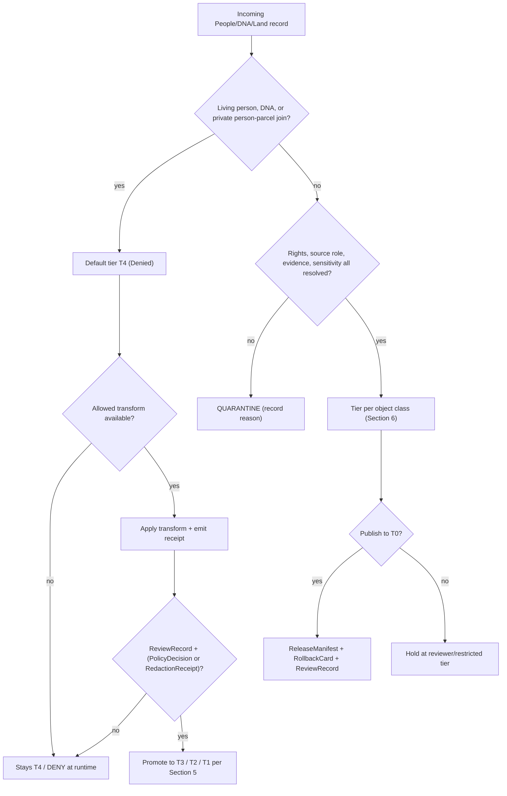

<!-- [KFM_META_BLOCK_V2]
doc_id: kfm://doc/people-dna-land-sensitivity-profile
title: People / DNA / Land — Sensitivity Profile
type: standard
version: v1
status: draft
owners: People-DNA-Land domain steward; Rights & Sovereignty reviewer; Docs steward (placeholder — NEEDS VERIFICATION)
created: 2026-06-07
updated: 2026-06-07
policy_label: public
related: [ai-build-operating-contract.md, directory-rules.md, policy/sensitivity/people/, policy/consent/people/, schemas/contracts/v1/people/, docs/domains/people-dna-land/]
tags: [kfm, sensitivity, people, dna, land, genealogy, geoprivacy, consent]
notes: [CONTRACT_VERSION = "3.0.0"; lane slug people-dna-land vs Atlas name "People / Genealogy / DNA / Land" is CONFLICTED, see OQ-PDL-01; all paths PROPOSED until repo mounted]
[/KFM_META_BLOCK_V2] -->

<a id="top"></a>

# People / DNA / Land — Sensitivity Profile

> The deny-by-default sensitivity contract for living-person, genealogy, DNA/genomic, and land-ownership evidence — naming the tiers, allowed transforms, required gates, and receipts that govern every release in this lane.

[](#status)
[](#3-deny-by-default-register)
[](#4-tier-matrix)
[](#footer)
[](#2-repo-fit)
[](#footer)

**Status:** `draft` · **Owners:** People-DNA-Land domain steward · Rights & Sovereignty reviewer · Docs steward *(placeholders — NEEDS VERIFICATION)* · **Updated:** 2026-06-07
**Pinned:** `CONTRACT_VERSION = "3.0.0"`

> [!CAUTION]
> This lane governs **living-person identity, DNA/genomic material, and private person↔parcel joins**. The default disposition for sensitive classes in this domain is **T4 — Denied**. No transform releases living-person identity or raw DNA segment data to a public tier. Treat every claim in this document as governing a strongest-default-deny surface. See [§3](#3-deny-by-default-register) and [§4](#4-tier-matrix).

---

## Contents

- [1. Scope](#1-scope)
- [2. Repo fit](#2-repo-fit)
- [3. Deny-by-default register](#3-deny-by-default-register)
- [4. Tier matrix](#4-tier-matrix)
- [5. Allowed tier transitions](#5-allowed-tier-transitions)
- [6. Object-class sensitivity defaults](#6-object-class-sensitivity-defaults)
- [7. Consent, revocation, and embargo](#7-consent-revocation-and-embargo)
- [8. Receipts required by this lane](#8-receipts-required-by-this-lane)
- [9. Governed AI posture](#9-governed-ai-posture)
- [10. Sensitivity decision flow](#10-sensitivity-decision-flow)
- [11. Inputs and exclusions](#11-inputs-and-exclusions)
- [Open questions register](#open-questions-register)
- [Open verification backlog](#open-verification-backlog)
- [Changelog v0 → v1](#changelog-v0--v1)
- [Definition of done](#definition-of-done)
- [Related docs](#related-docs)

---

## 1. Scope

**CONFIRMED doctrine / PROPOSED implementation.** This profile defines the sensitivity, rights, consent, and geoprivacy disposition for the People / DNA / Land lane: assertion-first person evidence, genealogy relationships, restricted DNA evidence, land instruments, ownership intervals, chain-of-title reasoning, consent decisions, and the receipts that make each release reviewable and reversible. `[DOM-PEOPLE] [ENCY]`

This document does **not** re-derive the sensitive-domain decision matrix. It instantiates the operating contract's §23.2 matrix and the Atlas Master Sensitivity / Rights Tier Reference (§24.5) **for this lane**. Where this profile and the operating contract appear to differ, the contract wins and the difference is a CONFLICTED candidate for ADR resolution. `[OPCON §23.2] [ENCY §24.5]`

> [!IMPORTANT]
> **Sensitivity is set at admission and never collapsed at publication.** Living-person output and DNA-derived outputs are denied or restricted by default; raw kit/vendor IDs and DNA segments are not public; assessor/tax records and parcel geometry are **not** title truth. Unclear rights, unresolved source role, missing evidence, unresolved sensitivity, or absent release state **blocks** public promotion. `[DOM-PEOPLE] [ENCY] [DIRRULES]`

[↑ Back to top](#top)

---

## 2. Repo fit

**PROPOSED placement (NEEDS VERIFICATION until repo mounted).** Per Directory Rules §12, a domain is a **lane segment inside a responsibility root**, never a root folder. Human-facing doctrine lives under `docs/`. This profile therefore lands at:

```text
docs/domains/people-dna-land/SENSITIVITY_PROFILE.md   ← this file (PROPOSED)
```

Upstream / sibling surfaces this profile governs or references (all **PROPOSED**, per Atlas §24.13 responsibility-root crosswalk):

| Responsibility | Path (PROPOSED) | Relation |
|---|---|---|
| Sensitivity policy | `policy/sensitivity/people/` | This profile is the human-facing companion to the machine policy here. |
| Consent policy | `policy/consent/people/` | Consent-token, revocation, and embargo enforcement. |
| Object meaning | `contracts/people/` *(or `contracts/domains/people-dna-land/`)* | Semantic contracts for the object families in [§6](#6-object-class-sensitivity-defaults). |
| Object shape | `schemas/contracts/v1/people/` | Canonical schema home (ADR-0001). |
| Tests / fixtures | `tests/domains/people-dna-land/`, `fixtures/domains/people-dna-land/` | Deny / no-leak / revocation-cleanup proof. |

> [!NOTE]
> **Path convention conflict (CONFLICTED → ADR candidate).** Atlas §24.13 lists schema/contract/policy homes under the segment `people/` (e.g., `schemas/contracts/v1/people/`), while Directory Rules §12 Step 3 shows the canonical domain-segment shape `schemas/contracts/v1/domains/<domain>/`. Directory Rules wins on the placement question; the divergence is filed as `OQ-PDL-02` and should be settled by ADR before any path is created. `[DIRRULES §12] [ENCY §24.13]`

[↑ Back to top](#top)

---

## 3. Deny-by-default register

**CONFIRMED doctrine.** The lane's entry in the Deny-by-Default Register (Atlas §20.5) is the controlling list of what is denied unless an explicit allow-condition is met. `[DOM-PEOPLE] [ENCY §20.5]`

| Denied by default | Allowed only when |
|---|---|
| Living-person private output | Consent + policy + restricted authorized surface. |
| Raw DNA kit / vendor identifiers | Never republished; aggregate or k-anonymized derivatives only. |
| DNA segment data | Named consent + research agreement (T3 only); never a public tier. |
| Private person ↔ parcel joins | Generalized parcel + de-identified person → T2 only. |

> [!WARNING]
> **Assessor / tax records and parcel geometry never satisfy a title claim.** Assessor and tax-roll records are an `administrative` source role; parcel geometry ≠ title boundary. A chain-of-title assertion requires deed/title `LandInstrument` evidence, not an assessor record. This is a recurring correction in the lane and must not be smoothed over. `[DOM-PEOPLE] [ENCY]`

[↑ Back to top](#top)

---

## 4. Tier matrix

**CONFIRMED tier scheme / PROPOSED per-class application.** The five-tier scheme (Atlas §24.5.1) and this lane's per-class defaults (§24.5.2). `[ENCY] [DOM-PEOPLE]`

| Tier | Name | Definition | Default audience |
|---|---|---|---|
| **T0** | Open | Public-safe; no transform beyond standard release. | Any public client via governed API. |
| **T1** | Generalized | Public-safe only after generalization, fuzzing, aggregation, or redaction; transform reviewed and recorded. | Any public client via governed API. |
| **T2** | Reviewer | Released only to authenticated reviewers or domain stewards; policy-bounded; correction path active. | Stewards, reviewers, named research collaborators. |
| **T3** | Restricted | Released only under named agreement (rights, sovereignty, consent) and recorded. | Named authorized parties only. |
| **T4** | Denied | Not released to any audience; existence of a record may be released only as steward review permits. | — |

Per-class defaults and the only transforms that may move them off the default tier:

| Object class | Default tier | Allowed transform (PROPOSED) | Required gates |
|---|---|---|---|
| People/DNA — living-person fields | **T4** | Aggregation by tract or county + `AggregationReceipt` → T1. | Consent or aggregation gate + `ReviewRecord`. |
| People/DNA — raw DNA segment data | **T4** | No transform reaches a public tier; **T3 only** under explicit research agreement. | Named consent + `ReviewRecord` + `PolicyDecision`. |
| People/Land — private person ↔ parcel join | **T4** | Generalized parcel + de-identified person → **T2 only**. | `RedactionReceipt` + `ReviewRecord`. |
| Person / Name assertion (historical, non-living) | T1 / T2 | Living-person fields denied; aggregate → T0. | Living-flag gate + `ReviewRecord` where required. |
| Land parcel (aggregate, non-private) | T0 aggregate | Private-join detail held at T2 / T4. | Standard release gates. |

[↑ Back to top](#top)

---

## 5. Allowed tier transitions

**CONFIRMED doctrine.** A tier **upgrade** (toward more public) always needs *both* a transform receipt *and* a review record. A tier **downgrade** (toward less public) never needs both — a `CorrectionNotice` alone is sufficient to remove or restrict. `[ENCY §24.5.3]`

| From → To | Required artifact | Required reviewer | Reversibility |
|---|---|---|---|
| T4 → T3 | `PolicyDecision` + `ReviewRecord` + agreement | Steward + rights-holder where applicable | Reversible: agreement revocation returns object to T4 with `CorrectionNotice`. |
| T4 → T2 | `PolicyDecision` + `ReviewRecord` | Steward | Reversible: review revocation returns object to T4. |
| T4 → T1 | `RedactionReceipt` + `ReviewRecord` | Steward | Reversible: correction may demote a published T1 to T4. |
| T3 → T2 | `PolicyDecision` + `ReviewRecord` | Steward | Reversible. |
| T2 → T1 | `RedactionReceipt` + `ReviewRecord` | Steward | Reversible. |
| T1 → T0 | `ReleaseManifest` + `ReviewRecord` | Steward + release authority | Reversible via `RollbackCard`. |
| Any tier → T4 (downgrade) | `CorrectionNotice` + `ReviewRecord` | Steward + rights-holder where applicable | Always permitted; precedes derivative invalidation. |

[↑ Back to top](#top)

---

## 6. Object-class sensitivity defaults

**CONFIRMED owned families / PROPOSED tier realization.** The lane owns these object families; each carries the listed sensitivity default. Living-person, DNA, title, and parcel-boundary controls are **not** weakened by context relations from other lanes (Settlements, Roads/Rail, Archaeology, Agriculture). `[DOM-PEOPLE] [ENCY]`

| Object family | Sensitivity default | Note |
|---|---|---|
| `PersonAssertion` / `NameAssertion` / `PersonCanonical` | T1 / T2; aggregate T0 | Living-person fields fail closed. |
| `GenealogyRelationship` / `RelationshipAssertion` / `FamilyGroup` | T1 / T2 | Living-person edges fail closed. |
| `LifeEvent` / `ResidenceEvent` / `MigrationEvent` | T1 / T2 | Residence events anchor settlement membership; living-person fields fail closed. |
| `DNAMatchEvidence` / `DNASegment` / `DNAKitToken` | **T4** | Internal; not cross-cited. Raw IDs and segments never public. |
| `RelationshipHypothesis` | T4 (DNA-derived) | Modeled; never authoritative on its own. |
| `LandOwnershipAssertion` / `DeedInstrument` / `TitleInstrument` | T0–T2 | Title evidence; chain-of-title gaps surfaced, not filled. |
| `AssessorRecord` / `TaxRecord` | T0–T2 | `administrative` role; **never** title truth. |
| `ParcelVersion` / `OwnershipInterval` | T0 aggregate; T2/T4 private | Geometry ≠ title boundary; private person↔parcel join denied by default. |

> [!NOTE]
> **GEDCOM / GEDZip / tree imports are `modeled` / `candidate`, not authority.** Import carries a living-flag and rights check at admission; sensitive joins fail closed. `[DOM-PEOPLE] [ENCY]`

[↑ Back to top](#top)

---

## 7. Consent, revocation, and embargo

**CONFIRMED doctrine / PROPOSED implementation.** DNA and consent-scoped material is governed by enforceable, machine-readable consent — not static text. The policy decision point (PDP) introspects the revocation endpoint on every render and **fails closed** when introspection cannot complete. `[Pass-10 C6-07] [Pass-10 C6-08] [Pass-10 C9-03]`

- **Consent tokens.** Consent travels with the data and is checked on every render. Scopes, expiry, and revocation are machine-readable.
- **Revocation is first-class.** On revocation: issue a signed tombstone, append a new `spec_hash` and `RunReceipt` to the ledger, and trigger cache-invalidation hooks (e.g., tile / PMTiles purge) so previously rendered output does not survive.
- **Embargo.** If `now < embargo_until`, the gate denies regardless of other approvals.
- **DTC raw genomic exports** (e.g., 23andMe, AncestryDNA, MyHeritage) are accepted only as user-controlled, consent-scoped inputs; raw genotype is never republished. Only k-anonymized or differentially-private aggregate derivatives may cross the publication boundary.

> [!WARNING]
> **Tombstone ≠ erasure (CONFLICTED → runbook needed).** A tombstone satisfies explainability but not a right-to-be-forgotten erasure obligation. The boundary between tombstoning and true deletion of personal data is unresolved and must be specified in a revocation runbook before relying on the revocation pathway. Tracked as `OQ-PDL-03`. `[Pass-10 C6-08]`

[↑ Back to top](#top)

---

## 8. Receipts required by this lane

**CONFIRMED receipt families / PROPOSED schema homes.** Every tier motion and every sensitive release in this lane emits auditable receipts. Schema home is `schemas/contracts/v1/` (ADR-0001); exact per-receipt paths are PROPOSED. `[ENCY] [DIRRULES]`

| Receipt | Emitted when |
|---|---|
| `RedactionReceipt` | Any generalization, redaction, or de-identification transform (e.g., T4 → T1, private-join → T2). |
| `AggregationReceipt` | Living-person fields aggregated to tract/county for T1 release. |
| `PolicyDecision` | Every allow/deny/restrict/abstain outcome on a sensitive request. |
| `ReviewRecord` | §24.2 cross-cutting review of any tier upgrade or downgrade *(not a domain-owned object)*. |
| `CorrectionNotice` | Any downgrade toward less public, including derivative invalidation. |
| `ReleaseManifest` + `RollbackCard` | T1 → T0 publication and its rollback target. |
| `AIReceipt` | Any Governed-AI answer touching this lane (see [§9](#9-governed-ai-posture)). |

[↑ Back to top](#top)

---

## 9. Governed AI posture

**CONFIRMED doctrine / PROPOSED implementation.** AI is interpretive, not the root truth source; `EvidenceBundle` outranks generated language. In this lane, AI **may** summarize released People/DNA/Land `EvidenceBundle`s, compare evidence, explain limitations, and draft steward-review notes. AI **must ABSTAIN** when evidence is insufficient and **must DENY** where policy, rights, sensitivity, or release state blocks the request. AI never reads RAW or WORK content — only released `EvidenceBundle`s. Finite outcomes: `ANSWER / ABSTAIN / DENY / ERROR`. `[GAI] [DOM-PEOPLE] [ENCY]`

```text
AI request touching People/DNA/Land
  → scope defined?            no  → NARROWED / ABSTAIN
  → EvidenceRef resolves to EvidenceBundle?  no → ABSTAIN
  → policy / sensitivity / rights / consent clear?  no → DENY
  → release state present?    no  → DENY
  → else                          → ANSWER (+ AIReceipt, cited)
```

[↑ Back to top](#top)

---

## 10. Sensitivity decision flow

**PROPOSED illustrative diagram** — reflects the §23.2 default disposition applied to this lane. `NEEDS VERIFICATION` against mounted policy and tests.



> [!NOTE]
> This diagram is a doctrine illustration, not a runtime guarantee. Enforcement is `NEEDS VERIFICATION` until `policy/sensitivity/people/`, `policy/consent/people/`, and the lane test suite are inspected in a mounted repo.

[↑ Back to top](#top)

---

## 11. Inputs and exclusions

**Accepted inputs (what this profile governs):** vital / cemetery / burial / obituary / church / school / military / census / directory / court / probate records; GEDCOM / GEDZip / tree overlays; DNA vendor match CSV / segment / triangulation data; patent / deed / mortgage / lien / easement / lease / mineral / water / access / probate instruments; assessor and tax-roll records; plat / survey / metes-and-bounds / PLSS / subdivision / derived geometry. `[DOM-PEOPLE] [ENCY]`

**Exclusions (governed elsewhere):**

| Not owned here | Owner lane |
|---|---|
| County-year population / economic aggregates | Frontier Matrix |
| Route / corridor semantics | Roads / Rail |
| Settlement legal & infrastructure status | Settlements / Infrastructure |
| Cultural affiliation / Indigenous-knowledge context | Archaeology / Cultural Heritage (steward + sovereignty review) |

> [!CAUTION]
> Context relations from other lanes (residence → settlement, migration → roads, person → archaeology, land → agriculture) **do not weaken** living-person, DNA, title, or parcel-boundary controls. Every cross-lane relation must preserve ownership, source role, sensitivity, and `EvidenceBundle` support. `[DOM-PEOPLE] [ENCY §24.4.14]`

[↑ Back to top](#top)

---

## Open questions register

| ID | Question | Owner role | Resolution path |
|---|---|---|---|
| OQ-PDL-01 | Is the canonical externally-presented lane name `people-dna-land` or "People / Genealogy / DNA / Land"? | Docs steward + domain steward | ADR + Directory Rules check |
| OQ-PDL-02 | Do lane paths use the `people/` segment (Atlas §24.13) or `domains/people-dna-land/` (Directory Rules §12)? | Architecture steward | ADR-0001-adjacent ADR |
| OQ-PDL-03 | Where is the boundary between tombstone and true erasure for personal/DNA data? | Rights & Sovereignty reviewer | `docs/runbooks/revocation.md` + GDPR / Tribal data policy alignment |
| OQ-PDL-04 | What is the cache TTL for revocation-introspection results, and the fail-closed window on introspection outage? | Consent / PDP owner | Standard + pilot measurement |

## Open verification backlog

These items remain `NEEDS VERIFICATION` before promotion from `draft` to `published`:

1. Living-person policy enforced in `policy/sensitivity/people/`.
2. DNA consent / revocation enforcement (token introspection, tombstone, cache invalidation).
3. Private person↔parcel join denial in policy and tests.
4. Geometry-role boundary (parcel geometry ≠ title boundary) enforced.
5. UI / API restricted-field no-leak behavior verified against fixtures.
6. Assessor-as-title denial test present and passing.
7. Schema/policy/contract path convention (OQ-PDL-02) resolved by ADR.

## Changelog v0 → v1

| Change | Type (per contract §37) | Reason |
|---|---|---|
| Initial sensitivity profile authored from Atlas §24.5 + §20.5 and §16 doctrine | new | Lane lacked a dedicated human-facing sensitivity contract. |
| Tier matrix, transitions, and receipts instantiated for this lane | clarification | Make "publish at tier N" a reviewable, repeatable action. |
| Path and lane-name conflicts surfaced as OQ-PDL-01/02 | gap closure | Atlas §24.13 vs Directory Rules §12 divergence. |

> **Backward compatibility.** New file; no prior anchors to preserve. Heading anchors and the `#top` anchor are stable targets for future revisions.

## Definition of done

This document is done enough to enter the repository when:

- it is placed according to Directory Rules (§12 domain-segment law);
- the domain steward, Rights & Sovereignty reviewer, and a docs steward review it;
- it is linked from the People/DNA/Land domain index and the doctrine/sensitivity index;
- it does not conflict with accepted ADRs (and OQ-PDL-01/02 are resolved or logged);
- any conflict with current repo conventions is logged in `docs/registers/DRIFT_REGISTER.md`;
- the `GENERATED_RECEIPT.json` planned in Section 2 is wired into CI;
- future changes follow the operating contract's §37 lifecycle.

[↑ Back to top](#top)

---

## Related docs

- `ai-build-operating-contract.md` — canonical operating contract (`CONTRACT_VERSION = "3.0.0"`), §23.2 sensitive-domain matrix.
- `directory-rules.md` — §12 Domain Placement Law; ADR-0001 schema home.
- `docs/domains/people-dna-land/README.md` — lane overview *(TODO — verify presence)*.
- `policy/sensitivity/people/` — machine sensitivity policy *(PROPOSED)*.
- `policy/consent/people/` — consent / revocation policy *(PROPOSED)*.
- Atlas v1.1 §24.5 (Master Sensitivity / Rights Tier Reference), §20.5 (Deny-by-Default Register), §16 (People / Genealogy / DNA / Land).

---

<sub>Last updated 2026-06-07 · Pinned `CONTRACT_VERSION = "3.0.0"` · Status: draft · [↑ Back to top](#top)</sub>
