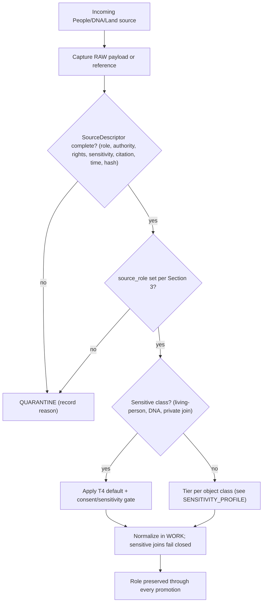

<!-- [KFM_META_BLOCK_V2]
doc_id: kfm://doc/people-dna-land-source-families
title: People / DNA / Land — Source Families
type: standard
version: v1
status: draft
owners: People-DNA-Land domain steward; Source steward; Rights & Sovereignty reviewer; Docs steward (placeholders — NEEDS VERIFICATION)
created: 2026-06-07
updated: 2026-06-07
policy_label: public
related: [ai-build-operating-contract.md, directory-rules.md, docs/domains/people-dna-land/SENSITIVITY_PROFILE.md, schemas/contracts/v1/source/source-descriptor.json, schemas/contracts/v1/people/, policy/sensitivity/people/, policy/consent/people/]
tags: [kfm, people, dna, land, genealogy, sources, source-role, provenance, admission]
notes: [CONTRACT_VERSION = "3.0.0"; lane slug people-dna-land vs Atlas name "People / Genealogy / DNA / Land" is CONFLICTED, see OQ-PDL-SRC-01; all paths PROPOSED until repo mounted; specific rights/terms per source family are NEEDS VERIFICATION]
[/KFM_META_BLOCK_V2] -->

<a id="top"></a>

# People / DNA / Land — Source Families

> The catalog of source families admitted into the People / DNA / Land lane — what each is, the source role it may carry, the rights and sensitivity posture at admission, and the anti-collapse rules that keep an observation from masquerading as a regulation, a model, an aggregate, or a title.

[](#status)
[](#3-source-role-taxonomy)
[](#4-role-fixed-at-admission)
[](#5-source-family-catalog)
[](#footer)
[](#footer)

**Status:** `draft` · **Owners:** People-DNA-Land domain steward · Source steward · Rights & Sovereignty reviewer · Docs steward *(placeholders — NEEDS VERIFICATION)* · **Updated:** 2026-06-07
**Pinned:** `CONTRACT_VERSION = "3.0.0"`

> [!CAUTION]
> Several source families in this lane carry **living-person, DNA/genomic, or private person↔parcel** content. Per the lane Sensitivity Profile, the default disposition for those classes is **T4 — Denied**, and sensitive joins **fail closed**. This catalog describes what is admitted and how it is role-tagged; it does **not** authorize publication. Release is governed separately. See [`SENSITIVITY_PROFILE.md`](./SENSITIVITY_PROFILE.md).

---

## Contents

- [1. Scope](#1-scope)
- [2. Repo fit](#2-repo-fit)
- [3. Source-role taxonomy](#3-source-role-taxonomy)
- [4. Role fixed at admission](#4-role-fixed-at-admission)
- [5. Source-family catalog](#5-source-family-catalog)
- [6. Source family to role mapping](#6-source-family-to-role-mapping)
- [7. Admission flow](#7-admission-flow)
- [8. Anti-collapse failure modes](#8-anti-collapse-failure-modes)
- [9. SourceDescriptor fields](#9-sourcedescriptor-fields)
- [10. Exclusions](#10-exclusions)
- [Open questions register](#open-questions-register)
- [Open verification backlog](#open-verification-backlog)
- [Changelog v0 → v1](#changelog-v0--v1)
- [Definition of done](#definition-of-done)
- [Related docs](#related-docs)

---

## 1. Scope

**CONFIRMED doctrine / PROPOSED implementation.** This document catalogs the source families admitted into the People / DNA / Land lane and binds each to the canonical source-role taxonomy. It is the human-facing companion to the lane's `SourceDescriptor` admission records and to the Atlas §16.D source-family table. `[DOM-PEOPLE] [ENCY]`

The lane governs assertion-first person evidence, genealogy relationships, restricted DNA evidence, land instruments, ownership intervals, and chain-of-title reasoning. Every admitted source carries a `SourceDescriptor` recording role, authority, rights, sensitivity, citation, time, and hash before any normalization occurs. `[DOM-PEOPLE] [ENCY] [DIRRULES]`

> [!IMPORTANT]
> **Two recurring lane corrections live in this catalog.** (1) Assessor and tax-roll records are an `administrative` source role and **never** satisfy a title claim. (2) GEDCOM / GEDZip / tree overlays are `modeled` / `candidate`, never authority on their own. Both are enforced here at the source-family level so the error cannot enter downstream. `[DOM-PEOPLE] [ENCY]`

[↑ Back to top](#top)

---

## 2. Repo fit

**PROPOSED placement (NEEDS VERIFICATION until repo mounted).** Per Directory Rules §12, a domain is a lane **segment** inside a responsibility root. Human-facing doctrine lives under `docs/`:

```text
docs/domains/people-dna-land/SOURCE_FAMILIES.md   ← this file (PROPOSED)
```

Sibling and upstream surfaces (all **PROPOSED**, per Atlas §24.13 crosswalk):

| Responsibility | Path (PROPOSED) | Relation |
|---|---|---|
| Source descriptor schema | `schemas/contracts/v1/source/source-descriptor.json` | Canonical `source_role` home (ADR-0001, Directory Rules §7.4). |
| Source registry | `data/registry/sources/people-dna-land/` *(or `.../people/`)* | Where admitted descriptors for this lane are recorded. |
| Sensitivity policy | `policy/sensitivity/people/` | Disposition for sensitive families admitted here. |
| Consent policy | `policy/consent/people/` | Consent-scoped DNA inputs. |
| Lane sensitivity doctrine | [`docs/domains/people-dna-land/SENSITIVITY_PROFILE.md`](./SENSITIVITY_PROFILE.md) | Tier disposition for the classes these sources feed. |

> [!NOTE]
> **Path convention conflict (CONFLICTED → ADR candidate).** Atlas §24.13 lists this lane's homes under the `people/` segment; Directory Rules §12 Step 3 shows the canonical `domains/people-dna-land/` segment. Directory Rules wins on placement; the divergence is filed as `OQ-PDL-SRC-02`. `[DIRRULES §12] [ENCY §24.13]`

[↑ Back to top](#top)

---

## 3. Source-role taxonomy

**CONFIRMED doctrine.** KFM treats source role as a first-class identity attribute. The lifecycle and the governed API both **fail closed** when roles are conflated. The seven canonical classes (Atlas §24.1.1): `[ENCY §24.1] [DOM-PEOPLE]`

| Role | Definition | Example in this lane | Allowed downstream use |
|---|---|---|---|
| `observed` | A direct reading, measurement, or first-hand evidentiary record tied to a place and time. | A vital record's recorded birth/death event; a first-hand probate entry. | May feed modeled or aggregate products; never relabeled regulatory or administrative. |
| `regulatory` | An authoritative determination by a governing body with legal or administrative force. | A recorded title determination or court judgment carrying legal force. | Cite as regulatory context; never an observed event or a modeled estimate. |
| `modeled` | A derived product from inputs, assumptions, or fitted parameters; uncertainty preserved. | A `RelationshipHypothesis` from DNA matches; a population-estimation surface. | Cite with model identity, run receipt, and bounds; never an observation. |
| `aggregate` | A published summary or average over a unit (county, tract, year); individual fidelity lost. | Census tract / county population aggregate. | Cite with aggregation receipt; never a per-place record. |
| `administrative` | A compiled record produced by an agency for administration, registration, or accounting. | Assessor record; tax roll; deed-index compilation; land-office tract book. | Cite as administrative context; **never** collapsed with observation or regulation. |
| `candidate` | A proposed record awaiting validation, dedup, or steward review; not yet authoritative. | Unresolved `PersonAssertion`; unmerged GEDCOM tree node; quarantined connector output. | May be cited as candidate in WORK / QUARANTINE; no PUBLISHED edge without promotion. |
| `synthetic` | Content from simulation, reconstruction, AI, or interpolation with no first-hand basis. | AI-drafted summary of a People/DNA/Land `EvidenceBundle`. | Carries Reality Boundary Note + Representation Receipt; never presented as observed reality. |

[↑ Back to top](#top)

---

## 4. Role fixed at admission

**CONFIRMED doctrine.** The role of a source is set at admission in the `SourceDescriptor` and is **preserved through every promotion**. Promotion does not upgrade an observation to a regulation, a model to an aggregate, or a candidate to a verified record — those are separate governed transitions with their own evidence and review requirements. `[ENCY] [DIRRULES]`

> [!WARNING]
> **Source role is never upgraded by promotion.** "Harmonizing" sources by relabeling their role (e.g., promoting a `modeled` DNA hypothesis to `observed`, or an `administrative` assessor record to a title `regulatory` fact) is a named anti-pattern. A role correction must produce a **new** `SourceDescriptor` plus a `CorrectionNotice`, never an in-place edit. `[ENCY §29.2] [DIRRULES]`

[↑ Back to top](#top)

---

## 5. Source-family catalog

**CONFIRMED source families (Atlas §16.D) / NEEDS VERIFICATION on rights and current terms.** The six admitted families. For all of them, rights and current terms are `NEEDS VERIFICATION`, freshness is source-vintage or cadence specific, and **sensitive joins fail closed**. `[DOM-PEOPLE] [ENCY]`

| Source family | Eligible role(s) | Rights / sensitivity | Freshness |
|---|---|---|---|
| Vital · cemetery · burial · obituary · church · school · military · census · directory · court · probate records | `observed` / `administrative` / `context` / `candidate` as role requires | Rights & current terms NEEDS VERIFICATION; living-person fields fail closed. | Source-vintage or cadence specific. |
| GEDCOM / GEDZip / tree overlays | `modeled` / `candidate` (not authority) | Rights NEEDS VERIFICATION; living-flag set at import; sensitive joins fail closed. | Source-vintage specific. |
| DNA vendor match CSV / segment / triangulation data | `observed` (kit-level) → `modeled` (hypothesis); raw IDs internal only | **Consent-scoped**; raw kit/vendor IDs and segments never public; T4 default. | Vendor-export-version specific. |
| Patent · deed · mortgage · lien · easement · lease · mineral · water · access · probate instruments | `observed` / `regulatory` / `administrative` as the instrument requires | Rights NEEDS VERIFICATION; instrument type fixes title weight. | Recording-date specific. |
| Assessor and tax-roll records | `administrative` (**never** title) | Rights NEEDS VERIFICATION; not title truth. | Roll-year specific. |
| Plat · survey · metes-and-bounds · PLSS · subdivision · derived geometry | `observed` / `modeled` (derived) | Geometry ≠ title boundary; rights NEEDS VERIFICATION. | Survey-vintage specific. |

> [!CAUTION]
> **DNA vendor data is the highest-sensitivity family here.** Raw direct-to-consumer genomic exports are a high-sensitivity asset accepted only under explicit, machine-readable consent. Raw genotype is never republished; only k-anonymized or differentially-private aggregate derivatives may cross the publication boundary, and the consent token is introspected on every render with fail-closed behavior. `[Pass-10 C9-03] [Pass-10 C6-07]`

[↑ Back to top](#top)

---

## 6. Source family to role mapping

**PROPOSED mapping** — the role a family *typically* carries and the lane control that prevents collapse. This is doctrine guidance, not a runtime assertion; enforcement is `NEEDS VERIFICATION`.

| Source family | Typical role at admission | Anti-collapse control |
|---|---|---|
| Vital / census / court / probate | `observed` | Named `LifeEvent` vs `AdminEvent` types; never an administrative compilation read as an observation. |
| Census tract / county totals | `aggregate` | Aggregation receipt; geometry-scope guard; no join from aggregate cell to a single person. |
| GEDCOM / tree overlays | `modeled` / `candidate` | Living-flag + rights check at import; never authority; no PUBLISHED edge until promoted. |
| DNA match / segment | `observed` kit → `modeled` hypothesis | Consent gate; raw-ID no-log; `RelationshipHypothesis` never authoritative alone. |
| Deed / title instruments | `observed` / `regulatory` | Title weight from instrument type; chain-of-title gaps surfaced, not filled. |
| Assessor / tax roll | `administrative` | **Assessor-as-title denial**; cite as administrative context only. |
| Plat / survey / PLSS / derived geometry | `observed` / `modeled` | Geometry-role boundary: parcel geometry ≠ title boundary. |

[↑ Back to top](#top)

---

## 7. Admission flow

**PROPOSED illustrative diagram** — the RAW → admission step for this lane. `NEEDS VERIFICATION` against mounted connectors, schemas, and policy.



> [!NOTE]
> This diagram is doctrine illustration, not a runtime guarantee. The admission gate, descriptor schema, and consent introspection are `NEEDS VERIFICATION` until inspected in a mounted repo.

[↑ Back to top](#top)

---

## 8. Anti-collapse failure modes

**CONFIRMED doctrine.** Collapse patterns most relevant to this lane and their denied outcomes (Atlas §24.1.2). `[ENCY §24.1.2] [DOM-PEOPLE]`

| Collapse pattern | Denied outcome | Required guardrail |
|---|---|---|
| Administrative compilation cited as observation (e.g., assessor record read as a recorded event). | DENY publication of compilation as an observed event timeline. | Source-role tag preserved; named `LifeEvent` / `AdminEvent` types. |
| Aggregate cited as a per-place truth (e.g., census tract total joined to one person). | DENY join from aggregate cell to a single record; ABSTAIN at AI surface. | Aggregation receipt; geometry-scope guard. |
| Modeled product labeled or queried as observed (e.g., DNA `RelationshipHypothesis` as fact). | DENY at publication; ABSTAIN at AI surface. | Run receipt + uncertainty surface + role-preserving DTO field. |
| Candidate record exposed on a public surface (e.g., unmerged tree node). | DENY at trust membrane; route to QUARANTINE. | Promotion gate; no PUBLISHED edge to WORK / QUARANTINE. |
| Synthetic content presented as observed reality (e.g., AI summary as evidence). | DENY publication; HOLD for steward review; ABSTAIN at AI. | Reality Boundary Note; Representation Receipt; `AIReceipt`. |

> [!WARNING]
> **The signature lane collapse is "assessor record → title."** An `administrative` assessor or tax-roll record presented as a title `regulatory` determination is a DENY condition. Title weight comes only from deed/title `LandInstrument` evidence. `[DOM-PEOPLE] [ENCY]`

[↑ Back to top](#top)

---

## 9. SourceDescriptor fields

**PROPOSED descriptor surface (illustrative, not authoritative; field presence NEEDS VERIFICATION).** Role lives on the `SourceDescriptor`; canonical schema home defaults to `schemas/contracts/v1/source/source-descriptor.json` per Directory Rules §7.4 / ADR-0001. `[DIRRULES]`

<details>
<summary><strong>Role-bearing descriptor fields relevant to this lane</strong></summary>

| Field | Type / vocabulary | Required? | Notes |
|---|---|---|---|
| `source_role` | enum: `observed` \| `regulatory` \| `modeled` \| `aggregate` \| `administrative` \| `candidate` \| `synthetic` | MUST | Set at admission; never edited in-place; correction → new descriptor + `CorrectionNotice`. |
| `role_authority` | string (issuing body / model identity / steward) | MUST when role ∈ {regulatory, modeled, aggregate} | Disambiguates authoring authority for cite text. |
| `role_aggregation_unit` | geometry-scope token (county, tract, year, …) | MUST when `source_role = aggregate` | Prevents geometry-scope drift on join. |
| `role_model_run_ref` | `EvidenceRef` → `ModelRunReceipt` | MUST when `source_role = modeled` | Pins inputs, parameters, version (e.g., DNA hypothesis run). |
| `role_synthetic_basis` | `{ method, inputs, reality_boundary_note_ref }` | MUST when `source_role = synthetic` | Records what is and is not real in the carrier. |
| `role_candidate_disposition` | enum: `pending` \| `merged` \| `rejected` \| `quarantined` | MUST when `source_role = candidate` | PUBLISHED edge forbidden until `merged`. |

</details>

> [!NOTE]
> These field names are illustrative from Atlas §24.1.3 and are **not** asserted as present in any mounted schema. Confirm against `schemas/contracts/v1/source/source-descriptor.json` before relying on them.

[↑ Back to top](#top)

---

## 10. Exclusions

**What this catalog does not cover (governed elsewhere):**

| Not a People/DNA/Land source family | Owner lane |
|---|---|
| County-year population / economic panels (as analytic releases) | Frontier Matrix |
| Road / rail / corridor route sources (TIGER/Line, KDOT, OSM) | Roads / Rail / Trade |
| Settlement / municipality / infrastructure source rosters | Settlements / Infrastructure |
| Archaeological site sources and cultural-affiliation records | Archaeology / Cultural Heritage (sovereignty + steward review) |
| Spatial foundation / CRS / geography-version sources | Spatial Foundation |

> [!CAUTION]
> Cross-lane context (residence → settlement, migration → roads, person → archaeology, land → agriculture) may **cite** these sources but never weakens this lane's living-person, DNA, title, or parcel-boundary controls. Every cross-lane relation must preserve ownership, source role, sensitivity, and `EvidenceBundle` support. `[DOM-PEOPLE] [ENCY §24.4.14]`

[↑ Back to top](#top)

---

## Open questions register

| ID | Question | Owner role | Resolution path |
|---|---|---|---|
| OQ-PDL-SRC-01 | Is the canonical lane name `people-dna-land` or "People / Genealogy / DNA / Land"? | Docs steward + domain steward | ADR + Directory Rules check |
| OQ-PDL-SRC-02 | Do source-registry/schema paths use `people/` (Atlas §24.13) or `domains/people-dna-land/` (Directory Rules §12)? | Architecture steward | ADR-0001-adjacent ADR |
| OQ-PDL-SRC-03 | What are the confirmed rights and current terms for each source family (especially DNA-vendor TOS)? | Source steward + Rights reviewer | Per-source license / TOS review; source ledger |
| OQ-PDL-SRC-04 | Which `SourceDescriptor` fields are actually present in the mounted schema? | Source steward | Inspect `schemas/contracts/v1/source/source-descriptor.json` |

## Open verification backlog

These items remain `NEEDS VERIFICATION` before promotion from `draft` to `published`:

1. Rights and current terms per source family (Atlas §16.D leaves all as NEEDS VERIFICATION).
2. `SourceDescriptor` field presence and `source_role` enum in the mounted schema.
3. Sensitive-join fail-closed behavior in policy and tests.
4. Assessor-as-title denial test present and passing.
5. GEDCOM import rights / living-flag tests.
6. DNA consent and raw-ID no-log tests.
7. Source-registry path convention (OQ-PDL-SRC-02) resolved by ADR.

## Changelog v0 → v1

| Change | Type (per contract §37) | Reason |
|---|---|---|
| Initial source-family catalog authored from Atlas §16.D and §24.1 | new | Lane lacked a dedicated human-facing source catalog. |
| Six families bound to the seven-role taxonomy with anti-collapse controls | clarification | Make role assignment reviewable per family. |
| Assessor-as-title and GEDCOM-as-candidate corrections enforced at source level | gap closure | Stop recurring collapse errors before normalization. |
| Path and lane-name conflicts surfaced as OQ-PDL-SRC-01/02 | gap closure | Atlas §24.13 vs Directory Rules §12 divergence. |

> **Backward compatibility.** New file; no prior anchors to preserve. `#top` and section anchors are stable targets for future revisions.

## Definition of done

This document is done enough to enter the repository when:

- it is placed according to Directory Rules (§12 domain-segment law);
- the domain steward, source steward, Rights & Sovereignty reviewer, and a docs steward review it;
- it is linked from the People/DNA/Land domain index and the source catalog index;
- it does not conflict with accepted ADRs (and OQ-PDL-SRC-01/02 are resolved or logged);
- any conflict with current repo conventions is logged in `docs/registers/DRIFT_REGISTER.md`;
- the `GENERATED_RECEIPT.json` planned in Section 2 is wired into CI;
- future changes follow the operating contract's §37 lifecycle.

[↑ Back to top](#top)

---

## Related docs

- [`docs/domains/people-dna-land/SENSITIVITY_PROFILE.md`](./SENSITIVITY_PROFILE.md) — tier disposition for classes these sources feed.
- `ai-build-operating-contract.md` — canonical operating contract (`CONTRACT_VERSION = "3.0.0"`), source-role anti-collapse.
- `directory-rules.md` — §12 Domain Placement Law; §7.4 / ADR-0001 schema home.
- `schemas/contracts/v1/source/source-descriptor.json` — canonical `source_role` home *(PROPOSED)*.
- `data/registry/sources/people-dna-land/` — admitted descriptors for this lane *(PROPOSED)*.
- Atlas v1.1 §16.D (source families), §24.1 (Master Source-Role Anti-Collapse Register).

---

<sub>Last updated 2026-06-07 · Pinned `CONTRACT_VERSION = "3.0.0"` · Status: draft · [↑ Back to top](#top)</sub>
