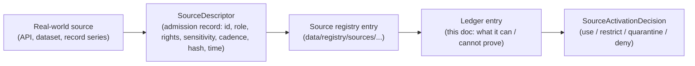
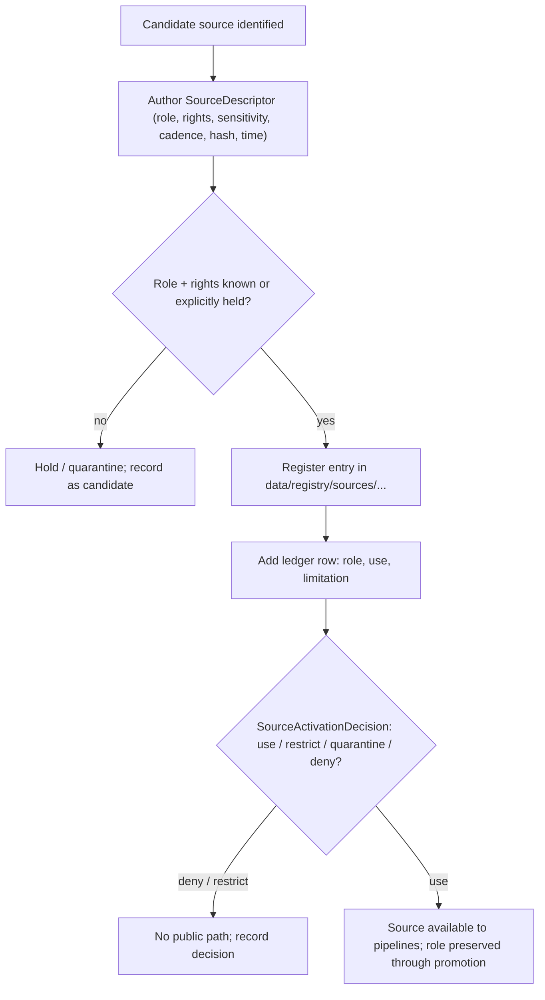

<!-- [KFM_META_BLOCK_V2]
doc_id: kfm://doc/people-dna-land-source-ledger
title: People / DNA / Land — Source Ledger
type: standard
version: v1
status: draft
owners: People-DNA-Land domain steward; Source steward; Rights & Sovereignty reviewer; Docs steward (placeholders — NEEDS VERIFICATION)
created: 2026-06-07
updated: 2026-06-07
policy_label: public
related: [ai-build-operating-contract.md, directory-rules.md, docs/domains/people-dna-land/SOURCE_FAMILIES.md, docs/domains/people-dna-land/SENSITIVITY_PROFILE.md, schemas/contracts/v1/source/source-descriptor.json, data/registry/sources/people-dna-land/, policy/sensitivity/people/, policy/consent/people/]
tags: [kfm, people, dna, land, genealogy, source-ledger, provenance, control-surface]
notes: [CONTRACT_VERSION = "3.0.0"; this ledger is a CONTROL SURFACE, not a bibliography; named source instances are PROPOSED/NEEDS VERIFICATION; lane slug people-dna-land vs Atlas name conflict, see OQ-PDL-LDG-01; all paths PROPOSED until repo mounted]
[/KFM_META_BLOCK_V2] -->

<a id="top"></a>

# People / DNA / Land — Source Ledger

> The control surface for this lane's sources: what each admitted source **can support** and what it **cannot prove**. A ledger, not a bibliography — every entry binds a source to a role, a rights posture, and an explicit limitation, and nothing here authorizes publication.

[](#status)
[](#1-scope)
[](#5-source-ledger)
[](#6-rights-and-activation-status)
[](#footer)
[](#footer)

**Status:** `draft` · **Owners:** People-DNA-Land domain steward · Source steward · Rights & Sovereignty reviewer · Docs steward *(placeholders — NEEDS VERIFICATION)* · **Updated:** 2026-06-07
**Pinned:** `CONTRACT_VERSION = "3.0.0"`

> [!IMPORTANT]
> **This ledger is a control surface, not a bibliography.** It states what each source can support and what it cannot prove. External facts embedded in source documents remain source-supported but `NEEDS VERIFICATION` before operational package pins, source activation, access decisions, or release claims. Listing a source here does **not** mean it is activated, rights-cleared, or publishable.

---

## Contents

- [1. Scope](#1-scope)
- [2. Repo fit](#2-repo-fit)
- [3. How to read this ledger](#3-how-to-read-this-ledger)
- [4. Source vs ledger entry vs descriptor](#4-source-vs-ledger-entry-vs-descriptor)
- [5. Source ledger](#5-source-ledger)
- [6. Rights and activation status](#6-rights-and-activation-status)
- [7. What each source cannot prove](#7-what-each-source-cannot-prove)
- [8. Admission to ledger flow](#8-admission-to-ledger-flow)
- [9. Maintenance](#9-maintenance)
- [Open questions register](#open-questions-register)
- [Open verification backlog](#open-verification-backlog)
- [Changelog v0 → v1](#changelog-v0--v1)
- [Definition of done](#definition-of-done)
- [Related docs](#related-docs)

---

## 1. Scope

**CONFIRMED doctrine / PROPOSED instances.** This ledger records the specific sources admitted into the People / DNA / Land lane and, for each, what it can and cannot support. It is the human-facing companion to the lane's `SourceDescriptor` admission records in the source registry. It sits beside two siblings: [`SOURCE_FAMILIES.md`](./SOURCE_FAMILIES.md) (the *family-level* role taxonomy) and [`SENSITIVITY_PROFILE.md`](./SENSITIVITY_PROFILE.md) (the tier disposition). `[DOM-PEOPLE] [ENCY] [DIRRULES]`

A `SourceDescriptor` must exist before any RAW capture: it records source identity, role, rights posture, sensitivity, cadence, authority scope, citation, time, and hash. Descriptors should be validated before fetch, before transformation, and before publication, so source authority does not collapse into generic data availability. `[ENCY] [DIRRULES] [Pass-23 KFM-P1-PROG-0007]`

> [!CAUTION]
> Many sources in this lane carry **living-person, DNA/genomic, or private person↔parcel** content. The default disposition for those classes is **T4 — Denied**, and sensitive joins **fail closed**. This ledger never raises a tier; release is governed by [`SENSITIVITY_PROFILE.md`](./SENSITIVITY_PROFILE.md).

[↑ Back to top](#top)

---

## 2. Repo fit

**PROPOSED placement (NEEDS VERIFICATION until repo mounted).** Per Directory Rules §12, the domain is a lane segment inside `docs/`:

```text
docs/domains/people-dna-land/SOURCE_LEDGER.md   ← this file (PROPOSED)
```

Sibling and downstream surfaces (all **PROPOSED**, per Atlas §24.13 crosswalk):

| Responsibility | Path (PROPOSED) | Relation |
|---|---|---|
| Source registry | `data/registry/sources/people-dna-land/` *(or `.../people/`)* | The machine-readable home for admitted `SourceDescriptor` records this ledger summarizes. |
| Source descriptor schema | `schemas/contracts/v1/source/source-descriptor.json` | Canonical `source_role` + rights field home (ADR-0001, §7.4). |
| Family taxonomy | [`docs/domains/people-dna-land/SOURCE_FAMILIES.md`](./SOURCE_FAMILIES.md) | Maps each source here to a family and role. |
| Sensitivity doctrine | [`docs/domains/people-dna-land/SENSITIVITY_PROFILE.md`](./SENSITIVITY_PROFILE.md) | Tier disposition for classes these sources feed. |
| Consent policy | `policy/consent/people/` | Consent-scoped DNA sources. |

> [!NOTE]
> **Path convention conflict (CONFLICTED → ADR candidate).** Atlas §24.13 lists lane homes under `people/`; Directory Rules §12 Step 3 shows `domains/people-dna-land/`. Directory Rules wins on placement; filed as `OQ-PDL-LDG-02`. `[DIRRULES §12] [ENCY §24.13]`

[↑ Back to top](#top)

---

## 3. How to read this ledger

Each entry binds a source to: a **stable source ID**, a **type**, a **status**, the **role it may support**, what it is **for** in this lane, and an explicit **limitation** — the thing it cannot prove. The limitation column is the point of the ledger.

| Column | Meaning |
|---|---|
| `source_id` | Stable identifier assigned at admission (e.g., `SRC-PDL-NNN`). Placeholder until registry is mounted. |
| Source / document | The dataset, API, or record series. |
| Type | API · dataset · record series · user-supplied export. |
| Status | `CONFIRMED` (named in corpus) · `PROPOSED` · `NEEDS VERIFICATION`. |
| Role it may support | The `source_role` it can carry (see [`SOURCE_FAMILIES.md`](./SOURCE_FAMILIES.md) §3). |
| Role in this lane | What it is used for. |
| Limitation (cannot prove) | What this source must **not** be cited as. |

[↑ Back to top](#top)

---

## 4. Source vs ledger entry vs descriptor



> [!NOTE]
> The descriptor and registry entry are the machine truth; this ledger is the human-readable control view over them. Where they disagree, the registry / descriptor governs and the divergence is logged in `docs/registers/DRIFT_REGISTER.md`.

[↑ Back to top](#top)

---

## 5. Source ledger

**PROPOSED entries / NEEDS VERIFICATION on rights, endpoints, and activation.** Source IDs below are placeholders (`SRC-PDL-*`) pending registry assignment. The named sources are CONFIRMED *as named in the corpus*; their admission, rights clearance, and activation are NEEDS VERIFICATION. `[DOM-PEOPLE] [ENCY] [Pass-10 C9] [Pass-10 C10] [Pass-32 KFM-P2-PROG-0011]`

<details open>
<summary><strong>Person, vital, and genealogy sources</strong></summary>

| `source_id` | Source / document | Type | Status | Role it may support | Limitation (cannot prove) |
|---|---|---|---|---|---|
| `SRC-PDL-001` | KSHS / Kansas Memory; county historical society records | record series | PROPOSED | `observed` / `administrative` | Not title truth; living-person fields fail closed. |
| `SRC-PDL-002` | U.S. Census (decadal schedules, tract/county aggregates) | dataset | PROPOSED | `observed` (schedule) / `aggregate` (tabulation) | Aggregate cell ≠ per-person record; no join from a cell to one individual. |
| `SRC-PDL-003` | Vital / cemetery / burial / obituary / church / school / military / court / probate records | record series | PROPOSED | `observed` / `administrative` | A compilation is not an observed event timeline; living-person fields denied. |
| `SRC-PDL-004` | FamilySearch RESTful API (OAuth 2.0); GEDCOM 5.5 / GEDCOM-X / tree overlays | API / user export | PROPOSED | `modeled` / `candidate` | Not authority; tree assertions are candidate evidence until promoted; living-flag set at import. |

</details>

<details>
<summary><strong>DNA / genomic sources (highest sensitivity)</strong></summary>

| `source_id` | Source / document | Type | Status | Role it may support | Limitation (cannot prove) |
|---|---|---|---|---|---|
| `SRC-PDL-010` | DTC raw genomic exports (23andMe, AncestryDNA, MyHeritage) | user-supplied export | PROPOSED | `observed` (kit) → `modeled` (hypothesis) | Raw genotype never republished; only k-anonymized / DP aggregates cross the publication boundary. |
| `SRC-PDL-011` | DNA vendor match CSV / segment / triangulation data | user-supplied export | PROPOSED | `observed` (match) / `modeled` (relationship) | A `RelationshipHypothesis` is not a verified relationship; raw kit/vendor IDs and segments are not public. |
| `SRC-PDL-012` | GA4GH AAI / Passports; Data Use Ontology (consent framework) | standard / framework | PROPOSED | (governs access, not a data source) | Not evidence; a consent framework, not a record of facts. |

</details>

<details>
<summary><strong>Land, parcel, and cadastral sources</strong></summary>

| `source_id` | Source / document | Type | Status | Role it may support | Limitation (cannot prove) |
|---|---|---|---|---|---|
| `SRC-PDL-020` | BLM CadNSDI (PLSS corners, section/township boundaries) | dataset | CONFIRMED (named) | `administrative` (present cadastre) | Cadastral control geometry ≠ title boundary; T/R/S keys fail closed on ambiguity. |
| `SRC-PDL-021` | BLM GLO scanned plats, field notes, land patents | record series | CONFIRMED (named) | `observed` (survey) / `administrative` (patent) | Historical survey ≠ present cadastre; patents modeled as evidence-bound temporal assertions, not map labels. |
| `SRC-PDL-022` | County Register of Deeds: patent/deed/mortgage/lien/easement/lease/mineral/water/access/probate instruments | record series | PROPOSED | `observed` / `regulatory` / `administrative` | Title weight from instrument type; chain-of-title gaps surfaced, not filled. |
| `SRC-PDL-023` | County assessor and tax-roll records | record series | PROPOSED | `administrative` (**never** title) | **Assessor record never satisfies a title claim**; cite as administrative context only. |
| `SRC-PDL-024` | Plat / survey / metes-and-bounds / subdivision / derived geometry | dataset | PROPOSED | `observed` / `modeled` (derived) | Parcel geometry ≠ title boundary. |

</details>

> [!WARNING]
> **The two signature limitations in this lane live here.** `SRC-PDL-023` (assessor/tax) is `administrative` and never title truth. `SRC-PDL-004` (GEDCOM/tree) is `modeled`/`candidate` and never authority. A reviewer should be able to trace any title or relationship claim back to a ledger entry whose role actually supports it. `[DOM-PEOPLE] [ENCY]`

[↑ Back to top](#top)

---

## 6. Rights and activation status

**NEEDS VERIFICATION across the board.** Atlas §16.D leaves rights and current terms for every People/DNA/Land source family as `NEEDS VERIFICATION`. No source is activated by appearing in this ledger; a `SourceActivationDecision` (with fixtures, validators, and policy gates) is required first. `[DOM-PEOPLE] [ENCY] [connected-dots §6]`

| Source group | Rights posture | Activation gate |
|---|---|---|
| KSHS / county society / vital records | Per-repository terms NEEDS VERIFICATION. | `SourceActivationDecision` + rights review. |
| Census | Public-domain expected; NEEDS VERIFICATION per series. | `SourceActivationDecision`. |
| FamilySearch / GEDCOM | API TOS + per-tree rights NEEDS VERIFICATION; living-flag mandatory. | Rights review + living-flag gate. |
| DTC genomic / vendor match | **Consent-scoped**; vendor TOS NEEDS VERIFICATION; vendor solvency is a consent-relevant variable. | Consent gate + `SourceActivationDecision` + named research agreement for any T3 use. |
| BLM CadNSDI / GLO | Federal source; terms NEEDS VERIFICATION. | `SourceActivationDecision`. |
| County deeds / assessor / plat | Per-county terms NEEDS VERIFICATION. | Rights review + `SourceActivationDecision`. |

> [!CAUTION]
> **DTC genomic vendor TOS must be re-checked before any bulk ingestion.** Vendor terms occasionally restrict third-party ingestion and change export formats without long deprecation windows; the legal-risk posture for each vendor is a per-vendor, re-verified decision. `[Pass-10 C9-03]`

[↑ Back to top](#top)

---

## 7. What each source cannot prove

This is the column reviewers should read first. Summarized as a quick-reference matrix:

| If someone wants to claim… | …they may **not** cite |
|---|---|
| A title or ownership boundary | Assessor/tax record (`SRC-PDL-023`); parcel/derived geometry (`SRC-PDL-024`); CadNSDI control geometry (`SRC-PDL-020`). |
| A verified family relationship | A GEDCOM/tree node (`SRC-PDL-004`) or a DNA hypothesis (`SRC-PDL-011`) on its own. |
| A per-person fact | A Census aggregate cell (`SRC-PDL-002`). |
| An observed life event | An administrative compilation read as an event timeline (`SRC-PDL-003`). |
| The present legal cadastre | A historical GLO survey (`SRC-PDL-021`). |

[↑ Back to top](#top)

---

## 8. Admission to ledger flow



> [!NOTE]
> Illustrative; not a runtime guarantee. The descriptor schema, registry, and activation gate are `NEEDS VERIFICATION` until inspected in a mounted repo.

[↑ Back to top](#top)

---

## 9. Maintenance

- A new source enters via a `SourceDescriptor` and a registry entry first, then a ledger row.
- A rights or terms change is a **correction**, not an in-place edit: produce a new descriptor + `CorrectionNotice` and update the status.
- Source role is **fixed at admission** and never upgraded by promotion.
- When a DNA-source consent is revoked, follow the revocation path (tombstone + cache invalidation) in [`SENSITIVITY_PROFILE.md`](./SENSITIVITY_PROFILE.md) §7.

[↑ Back to top](#top)

---

## Open questions register

| ID | Question | Owner role | Resolution path |
|---|---|---|---|
| OQ-PDL-LDG-01 | Is the canonical lane name `people-dna-land` or "People / Genealogy / DNA / Land"? | Docs steward + domain steward | ADR + Directory Rules check |
| OQ-PDL-LDG-02 | Does the source registry use `people/` (Atlas §24.13) or `domains/people-dna-land/` (Directory Rules §12)? | Architecture steward | ADR-0001-adjacent ADR |
| OQ-PDL-LDG-03 | What are the confirmed rights/terms and activation status for each ledger entry? | Source steward + Rights reviewer | Per-source license / TOS review; `SourceActivationDecision` |
| OQ-PDL-LDG-04 | What is the source-ID scheme and where are IDs assigned (registry vs ledger)? | Source steward | Inspect `data/registry/sources/...`; ADR if undefined |
| OQ-PDL-LDG-05 | What is the retention period for raw DTC files (solvent vs distressed vendor)? | Rights & Sovereignty reviewer | Vendor-loss-simulation runbook |

## Open verification backlog

These items remain `NEEDS VERIFICATION` before promotion from `draft` to `published`:

1. Rights and current terms per ledger entry (Atlas §16.D leaves all NEEDS VERIFICATION).
2. `SourceDescriptor` field presence and `source_role` enum in the mounted schema.
3. Source-registry path and ID-assignment convention (OQ-PDL-LDG-02 / -04).
4. `SourceActivationDecision` presence and gate behavior.
5. Consent-scoped DTC handling, raw-ID no-log, and revocation cleanup.
6. Assessor-as-title and parcel-geometry-as-title denial tests.
7. Named source instances actually admitted (vs aspirational corpus mentions).

## Changelog v0 → v1

| Change | Type (per contract §37) | Reason |
|---|---|---|
| Initial source ledger authored as a control surface for the lane | new | Lane lacked a dedicated source-control ledger distinct from the family catalog. |
| Named sources from corpus bound to roles and limitations | clarification | Make "what each source cannot prove" reviewable per entry. |
| Assessor-as-title and GEDCOM-as-candidate limitations pinned to specific entries | gap closure | Anchor the recurring corrections to traceable source IDs. |
| Rights/activation status separated into its own section as NEEDS VERIFICATION | gap closure | Prevent the ledger from being read as an activation grant. |

> **Backward compatibility.** New file; no prior anchors. `SRC-PDL-*` IDs are placeholders and will be reconciled to registry-assigned IDs (OQ-PDL-LDG-04).

## Definition of done

This document is done enough to enter the repository when:

- it is placed according to Directory Rules (§12 domain-segment law);
- the domain steward, source steward, Rights & Sovereignty reviewer, and a docs steward review it;
- it is linked from the People/DNA/Land domain index and the source catalog index;
- it does not conflict with accepted ADRs (and OQ-PDL-LDG-01/02/04 are resolved or logged);
- ledger `SRC-PDL-*` IDs are reconciled to registry-assigned IDs, or the placeholder scheme is documented;
- any conflict with current repo conventions is logged in `docs/registers/DRIFT_REGISTER.md`;
- the `GENERATED_RECEIPT.json` planned in Section 2 is wired into CI;
- future changes follow the operating contract's §37 lifecycle.

[↑ Back to top](#top)

---

## Related docs

- [`docs/domains/people-dna-land/SOURCE_FAMILIES.md`](./SOURCE_FAMILIES.md) — family-level source-role taxonomy.
- [`docs/domains/people-dna-land/SENSITIVITY_PROFILE.md`](./SENSITIVITY_PROFILE.md) — tier disposition and revocation path.
- `ai-build-operating-contract.md` — canonical operating contract (`CONTRACT_VERSION = "3.0.0"`).
- `directory-rules.md` — §12 Domain Placement Law; §7.4 / ADR-0001 schema home.
- `schemas/contracts/v1/source/source-descriptor.json` — canonical descriptor home *(PROPOSED)*.
- `data/registry/sources/people-dna-land/` — admitted descriptors for this lane *(PROPOSED)*.
- Atlas v1.1 §16.D (source families); Pass-10 C9/C10 (genealogy/genomic + Kansas-first datasets); Pass-32 KFM-P2-PROG-0011 (BLM CadNSDI / GLO).

---

<sub>Last updated 2026-06-07 · Pinned `CONTRACT_VERSION = "3.0.0"` · Status: draft · [↑ Back to top](#top)</sub>
