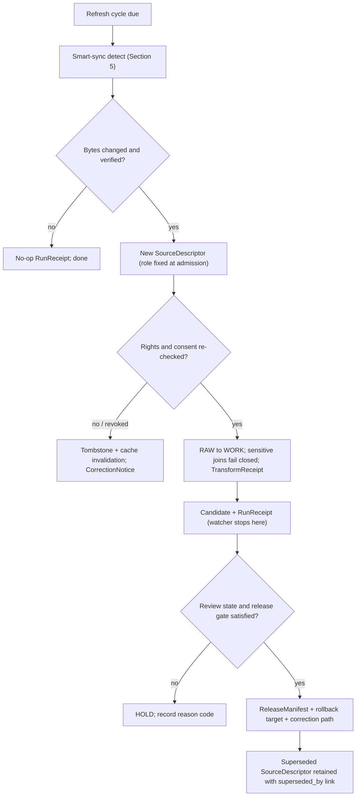

<!-- [KFM_META_BLOCK_V2]
doc_id: kfm://doc/people-dna-land-source-refresh-runbook
title: People / DNA / Land — Source Refresh Runbook
type: standard
version: v1
status: draft
owners: People-DNA-Land domain steward; Source steward; Rights & Sovereignty reviewer; Release authority; Docs steward (placeholders — NEEDS VERIFICATION)
created: 2026-06-07
updated: 2026-06-07
policy_label: public
related: [ai-build-operating-contract.md, directory-rules.md, docs/domains/people-dna-land/SOURCE_LEDGER.md, docs/domains/people-dna-land/SOURCE_FAMILIES.md, docs/domains/people-dna-land/SENSITIVITY_PROFILE.md, docs/standards/SMART_SYNC.md, policy/consent/people/]
tags: [kfm, people, dna, land, genealogy, runbook, source-refresh, watcher, stale-state]
notes: [CONTRACT_VERSION = "3.0.0"; PLACEMENT CONFLICT - runbooks live under docs/runbooks/ per Directory Rules 6.1.b, not docs/domains/; recommended path docs/runbooks/people-dna-land/SOURCE_REFRESH_RUNBOOK.md, see OQ-PDL-RUN-01; subfolder vs flat is OPEN-DR-02; all paths PROPOSED until repo mounted]
[/KFM_META_BLOCK_V2] -->

<a id="top"></a>

# People / DNA / Land — Source Refresh Runbook

> The operational procedure for re-checking, re-fetching, re-admitting, and re-releasing People / DNA / Land sources on cadence — watcher-driven, fail-closed, and consent-aware, with the watcher emitting receipts and candidate decisions only, never publishing.

[](#status)
[](#1-scope)
[](#3-watcher-as-non-publisher)
[](#7-consent-and-revocation-on-refresh)
[](#footer)
[](#footer)

**Status:** `draft` · **Owners:** People-DNA-Land domain steward · Source steward · Rights & Sovereignty reviewer · Release authority · Docs steward *(placeholders — NEEDS VERIFICATION)* · **Updated:** 2026-06-07
**Pinned:** `CONTRACT_VERSION = "3.0.0"`

> [!IMPORTANT]
> **Placement note.** Per Directory Rules §6.1.b, runbooks are canonically homed under `docs/runbooks/`, not `docs/domains/`. This file is drafted for the **recommended** path `docs/runbooks/people-dna-land/SOURCE_REFRESH_RUNBOOK.md` (Pattern A, domain subfolder, matching the existing fauna runbook). The requested `docs/domains/people-dna-land/...` location is a CONFLICTED placement candidate. See [Repo fit](#2-repo-fit) and `OQ-PDL-RUN-01`.

> [!CAUTION]
> This runbook touches **living-person, DNA/genomic, and private person↔parcel** sources. A refresh must re-check rights and consent on every cycle — a stale-but-still-running source is a risk, and a revoked-consent DNA source must be torn down (tombstone + cache invalidation), not merely skipped. The watcher never publishes; it proposes. Release stays a separate, reviewed gate.

---

## Contents

- [1. Scope](#1-scope)
- [2. Repo fit](#2-repo-fit)
- [3. Watcher as non-publisher](#3-watcher-as-non-publisher)
- [4. Refresh cadence by source](#4-refresh-cadence-by-source)
- [5. Smart-sync refresh procedure](#5-smart-sync-refresh-procedure)
- [6. Stale-state triggers and responses](#6-stale-state-triggers-and-responses)
- [7. Consent and revocation on refresh](#7-consent-and-revocation-on-refresh)
- [8. Re-admission and re-release flow](#8-re-admission-and-re-release-flow)
- [9. Failure handling and reason codes](#9-failure-handling-and-reason-codes)
- [10. Rollback](#10-rollback)
- [11. Pre-flight and post-flight checklists](#11-pre-flight-and-post-flight-checklists)
- [Open questions register](#open-questions-register)
- [Open verification backlog](#open-verification-backlog)
- [Changelog v0 → v1](#changelog-v0--v1)
- [Definition of done](#definition-of-done)
- [Related docs](#related-docs)

---

## 1. Scope

**CONFIRMED doctrine / PROPOSED instances.** This runbook explains how to operate periodic refresh of the sources catalogued in [`SOURCE_LEDGER.md`](../../domains/people-dna-land/SOURCE_LEDGER.md): when to re-check each source, how the watcher detects change without re-downloading unchanged bytes, what stale-state markers trigger which action, and how a refreshed source is re-admitted and re-released through governed gates. `[DOM-PEOPLE] [ENCY] [DIRRULES §6.1.b]`

Runbooks **explain how to operate**; they do not encode policy (`policy/`) or object meaning (`contracts/`). Disposition for sensitive classes is governed by [`SENSITIVITY_PROFILE.md`](../../domains/people-dna-land/SENSITIVITY_PROFILE.md); the source-role taxonomy by [`SOURCE_FAMILIES.md`](../../domains/people-dna-land/SOURCE_FAMILIES.md). `[DIRRULES §6.1.b]`

> [!NOTE]
> KFM separates **stale** from **wrong**. A stale claim's evidence, source freshness, or context has aged past its declared tolerance; a wrong claim's substance is incorrect. This runbook handles staleness; correctness errors go through the correction path. `[ENCY §24.8]`

[↑ Back to top](#top)

---

## 2. Repo fit

> [!WARNING]
> **The requested path conflicts with Directory Rules.** The task asked for `docs/domains/people-dna-land/SOURCE_REFRESH_RUNBOOK.md`. Directory Rules §6.1.b makes `docs/runbooks/` the canonical home for operational procedures (source refresh, rollback drills, validation runs, incident response). Two resolutions:
>
> - **Option A (recommended):** place at `docs/runbooks/people-dna-land/SOURCE_REFRESH_RUNBOOK.md` (Pattern A subfolder, matching the existing `docs/runbooks/fauna/SOURCE_REFRESH_RUNBOOK.md`).
> - **Option B:** keep under `docs/domains/people-dna-land/` only if an ADR explicitly relocates runbooks beside their domain dossiers — which would be a new convention and should be logged in `docs/registers/DRIFT_REGISTER.md`.
>
> This draft assumes **Option A**. Confirm before merge. Tracked as `OQ-PDL-RUN-01`.

**PROPOSED placement (NEEDS VERIFICATION until repo mounted).**

```text
docs/runbooks/people-dna-land/SOURCE_REFRESH_RUNBOOK.md   ← recommended (Option A)
docs/domains/people-dna-land/SOURCE_REFRESH_RUNBOOK.md    ← as requested (Option B; CONFLICTED)
```

Surfaces this runbook operates over (all **PROPOSED**):

| Responsibility | Path (PROPOSED) | Relation |
|---|---|---|
| Source ledger | [`docs/domains/people-dna-land/SOURCE_LEDGER.md`](../../domains/people-dna-land/SOURCE_LEDGER.md) | The sources this runbook refreshes. |
| Watcher / ingest | `tools/ingest/watchers/` | Canonical watcher entry points (e.g., HTTP/STAC watcher). |
| Smart-sync standard | `docs/standards/SMART_SYNC.md` | The detect-then-fetch pattern this runbook applies. |
| Source registry | `data/registry/sources/people-dna-land/` *(or `.../people/`)* | Where re-admitted `SourceDescriptor` records land. |
| Consent policy | `policy/consent/people/` | Consent re-check on DNA refresh. |

> [!NOTE]
> **Two open path conventions apply.** Lane-name slug `people-dna-land` vs Atlas "People / Genealogy / DNA / Land" (`OQ-PDL-RUN-02`); and runbook subfolder vs flat (Directory Rules §18 `OPEN-DR-02`). New authors SHOULD use Pattern A (subfolder). `[DIRRULES §6.1.b, §18]`

[↑ Back to top](#top)

---

## 3. Watcher as non-publisher

**CONFIRMED doctrine.** The watcher-as-non-publisher invariant: a worker that detects source change emits **receipts and candidate decisions only**. It MUST NOT write to `data/catalog/` or `data/published/`, and it MUST NOT act as an alert or release authority. `[DIRRULES] [ENCY]`

> [!WARNING]
> **A refresh never auto-publishes.** Detecting that a source changed produces a `RunReceipt` and a candidate; promotion to PUBLISHED is a separate governed transition requiring review state, `ReleaseManifest`, rollback target, and correction path. Quiet promotion via a CI shortcut is a named anti-pattern. `[DIRRULES §13] [ENCY §24.6]`

[↑ Back to top](#top)

---

## 4. Refresh cadence by source

**PROPOSED cadences / NEEDS VERIFICATION.** Cadence is recorded in each `SourceDescriptor`; the values below are starting points, not confirmed settings. When a source's cadence passes without a new admission, the **source-freshness-expired** stale marker fires. `[ENCY §24.8.1] [DOM-PEOPLE]`

| Source group (from ledger) | Suggested cadence | Change-detection method |
|---|---|---|
| KSHS / county society / vital records | Quarterly or on publisher release | HTTP validator (ETag/Last-Modified) + manifest checksum if available. |
| U.S. Census series | On series release (decadal / annual) | Manifest / release-tag poll. |
| FamilySearch API / GEDCOM trees | On user re-import; API per TOS | User-initiated; re-check living-flag each import. |
| DTC genomic / vendor match | On user re-upload; **consent re-checked every cycle** | Consent-token introspection on every render; no silent re-fetch. |
| BLM CadNSDI / GLO | Annual or on BLM release | Manifest checksum; T/R/S key re-validation. |
| County deeds / assessor / plat | Per-county cadence (often annual roll) | Publisher poll; re-validate role tags. |

> [!CAUTION]
> **Time-scope-outside-support is never refreshed silently.** If a claim's temporal scope falls outside the current data support window, mark it stale — do not auto-extend it on refresh. `[ENCY §24.8.1]`

[↑ Back to top](#top)

---

## 5. Smart-sync refresh procedure

**CONFIRMED pattern (smart-sync) / PROPOSED tool paths.** Detect first, fetch only on real change, verify bytes, then route through admission. `[Pass-10 C3-01] [Pass-10 C3-02]`

```text
1. POLL    HEAD / validator (ETag, Last-Modified) for each due source.
2. GATE    If validator unchanged → write a no-op RunReceipt; STOP for that source.
3. MANIFEST  If a checksums file exists, fetch it; compare to last known.
4. FETCH   Re-download only artifacts whose manifest entry changed.
5. VERIFY  sha256sum -c against the manifest; FAIL CLOSED on any mismatch.
6. ADMIT   Author a NEW SourceDescriptor (role fixed; correction = new descriptor + CorrectionNotice).
7. NORMALIZE  RAW → WORK; sensitive joins fail closed; emit TransformReceipt.
8. CANDIDATE  Produce candidate + RunReceipt. Watcher STOPS here (Section 3).
```

> [!TIP]
> Validators tell you *whether* the manifest changed; the manifest tells you *which* artifacts to fetch. Combining both avoids re-downloading unchanged bytes and refuses promotion when bytes do not match what the publisher claimed. `[Pass-10 C3-01] [Pass-10 C3-02]`

[↑ Back to top](#top)

---

## 6. Stale-state triggers and responses

**CONFIRMED doctrine.** The stale-state markers most relevant to a People/DNA/Land refresh and the required action for each (Atlas §24.8.1). `[ENCY §24.8.1]`

| Marker | Triggered by | Required action |
|---|---|---|
| Source freshness expired | Cadence in `SourceDescriptor` passed without new admission. | Re-admit or supersede; else mark dependent claims stale. |
| Rights status changed | Rights change in `SourceDescriptor` or rights-holder communication. | Re-evaluate tier; potentially downgrade; emit `CorrectionNotice`. |
| Review aged out | `ReviewRecord` older than the sensitive-lane review tolerance. | Trigger steward review; potentially downgrade tier. |
| Schema version drift | Object schema upgraded past the published claim's schema version. | Migrate, re-validate, re-release; or mark stale. |
| Geography version drift | `GeographyVersion` replaced; claim still bound to prior version. | Rebind to current version; re-release; or mark stale. |
| Time-scope outside support | Claim's temporal scope outside current support window. | Mark stale; **do not refresh silently**. |
| Policy version changed | Policy referenced by a `PolicyDecision` superseded. | Re-run gate; potentially supersede release. |

[↑ Back to top](#top)

---

## 7. Consent and revocation on refresh

**CONFIRMED doctrine / PROPOSED implementation.** For DNA and consent-scoped sources, a refresh is also a consent re-check. The policy decision point (PDP) introspects the revocation endpoint on every render and **fails closed** when introspection cannot complete. `[Pass-10 C6-07] [Pass-10 C6-08]`

- **Consent re-checked each cycle.** A refresh MUST verify the consent token's scope, expiry, and revocation before any re-admission of DNA-derived material.
- **Revocation triggers teardown, not skip.** On revocation: issue a signed tombstone, append a new `spec_hash` and `RunReceipt` to the ledger, and trigger cache-invalidation hooks (tile / PMTiles purge) so previously rendered output does not survive.
- **Embargo holds.** If `now < embargo_until`, deny regardless of refresh outcome.
- **Vendor TOS re-check.** Re-verify each DTC vendor's terms before bulk re-ingestion; vendor solvency is a consent-relevant variable.

> [!CAUTION]
> **Tombstone ≠ erasure (CONFLICTED → runbook needed).** A tombstone satisfies explainability but not a right-to-be-forgotten erasure obligation. The boundary must be specified in `docs/runbooks/revocation.md` before relying on the revocation pathway. Tracked as `OQ-PDL-RUN-03`. `[Pass-10 C6-08]`

[↑ Back to top](#top)

---

## 8. Re-admission and re-release flow



> [!NOTE]
> Illustrative; not a runtime guarantee. Watcher, gates, descriptor schema, and consent introspection are `NEEDS VERIFICATION` until inspected in a mounted repo.

[↑ Back to top](#top)

---

## 9. Failure handling and reason codes

**PROPOSED reason-code catalog (Atlas §24.6.3).** A refresh that fails any gate fails **closed** and preserves the prior state. `[ENCY §24.6.3]`

| Failure family | Reason code (PROPOSED) | Recovery path |
|---|---|---|
| Byte mismatch on verify | (smart-sync) checksum fail | Refuse promotion; quarantine the fetched artifact; re-fetch. |
| Missing required artifact | `MISSING_RECEIPT` / `MISSING_EVIDENCE` / `MISSING_REVIEW` | Re-emit receipt; re-run review; re-validate. |
| Rights / sensitivity unresolved | `RIGHTS_UNKNOWN` / `SENSITIVITY_UNRESOLVED` | Steward review; rights resolution; tier reassignment. |
| Source-role collapse risk | `ROLE_COLLAPSE` / `ROLE_DOWNCAST_FORBIDDEN` | Restore source role; refuse upcast. |
| Review state inadequate | `REVIEW_NEEDED` / `REVIEW_INSUFFICIENT` / `REVIEW_REJECTED` | Run required review; supply `ReviewRecord`. |
| Release infrastructure error | `RELEASE_MANIFEST_INVALID` / `ROLLBACK_TARGET_MISSING` | Manifest fix; supply rollback target. |

[↑ Back to top](#top)

---

## 10. Rollback

**CONFIRMED doctrine.** If a refreshed release fails post-publication, roll back to the targeted prior release; held at current state until rollback validated. Rollback does not silently delete history. `[ENCY §24.6.1] [ENCY Appendix E]`

1. Identify the prior release via its `RollbackCard` / rollback target.
2. Emit a `CorrectionNotice` listing invalidated downstream derivatives.
3. Revert `ReleaseManifest` to the prior release.
4. Retain the superseded `SourceDescriptor` with a `superseded_by` link in the source register.
5. For DNA sources, confirm cache invalidation actually purged previously rendered tiles.

[↑ Back to top](#top)

---

## 11. Pre-flight and post-flight checklists

<details open>
<summary><strong>Pre-flight (before running a refresh cycle)</strong></summary>

- [ ] Confirm which sources are **due** by `SourceDescriptor` cadence.
- [ ] Confirm watcher runs in non-publisher mode (no write to `data/catalog/` or `data/published/`).
- [ ] Confirm consent introspection endpoint reachable for DNA sources (else fail closed).
- [ ] Confirm rollback targets exist for any release that may be superseded.

</details>

<details>
<summary><strong>Post-flight (after a refresh cycle)</strong></summary>

- [ ] Every changed source produced a new `SourceDescriptor` (role preserved) + `RunReceipt`.
- [ ] No source role was upgraded by promotion.
- [ ] Revoked-consent DNA sources were tombstoned and caches invalidated.
- [ ] Stale markers were resolved (re-admit / supersede / mark stale) — none left silently running.
- [ ] No watcher write reached `data/published/`.
- [ ] Reason codes recorded for any failed gate.

</details>

[↑ Back to top](#top)

---

## Open questions register

| ID | Question | Owner role | Resolution path |
|---|---|---|---|
| OQ-PDL-RUN-01 | Should this runbook live at `docs/runbooks/people-dna-land/` (Directory Rules §6.1.b) or beside the domain dossier at `docs/domains/people-dna-land/`? | Architecture steward + docs steward | ADR + Directory Rules §6.1.b / §18 OPEN-DR-02 |
| OQ-PDL-RUN-02 | Is the canonical lane slug `people-dna-land` or "People / Genealogy / DNA / Land"? | Docs steward + domain steward | ADR + Directory Rules check |
| OQ-PDL-RUN-03 | Where is the tombstone vs erasure boundary for DNA/personal data on revocation? | Rights & Sovereignty reviewer | `docs/runbooks/revocation.md` + policy alignment |
| OQ-PDL-RUN-04 | What are the confirmed per-source cadences and change-detection methods? | Source steward | Inspect `SourceDescriptor` cadence fields; `docs/standards/SMART_SYNC.md` |
| OQ-PDL-RUN-05 | Should a missing publisher manifest block promotion or only downgrade the evidence-quality label? | Source steward | Decision recorded in SMART_SYNC standard + source registry `has_manifest` flag |

## Open verification backlog

These items remain `NEEDS VERIFICATION` before promotion from `draft` to `published`:

1. Runbook placement decision (OQ-PDL-RUN-01) and subfolder-vs-flat convention (OPEN-DR-02).
2. Per-source cadences and change-detection methods in mounted `SourceDescriptor` records.
3. Watcher non-publisher enforcement in tools and CI.
4. Consent-token introspection, revocation tombstone, and cache-invalidation behavior.
5. Stale-state marker emission in the Evidence Drawer.
6. Gate reason-code catalog presence and exit-code semantics.
7. Rollback drill executed for at least one People/DNA/Land release.

## Changelog v0 → v1

| Change | Type (per contract §37) | Reason |
|---|---|---|
| Initial source-refresh runbook authored for the lane | new | Lane lacked an operational refresh procedure. |
| Smart-sync detect-then-fetch procedure + stale-state response table instantiated | clarification | Make refresh repeatable and byte-safe. |
| Watcher-as-non-publisher and consent-re-check-on-refresh pinned | gap closure | Prevent auto-publish and post-revocation replay. |
| Placement conflict surfaced (docs/runbooks vs docs/domains) as OQ-PDL-RUN-01 | gap closure | Directory Rules §6.1.b vs requested path. |

> **Backward compatibility.** New file; no prior anchors. If Option A placement is accepted, relative links to the domain dossiers resolve as written (`../../domains/people-dna-land/...`); under Option B they would need adjustment.

## Definition of done

This document is done enough to enter the repository when:

- the placement decision (OQ-PDL-RUN-01) is resolved and the file lives at the agreed path under Directory Rules;
- the domain steward, source steward, Rights & Sovereignty reviewer, release authority, and a docs steward review it;
- it is linked from the runbooks index and the People/DNA/Land domain index;
- it does not conflict with accepted ADRs (and OQ-PDL-RUN-01/02 are resolved or logged);
- any conflict with current repo conventions is logged in `docs/registers/DRIFT_REGISTER.md`;
- the `GENERATED_RECEIPT.json` planned in Section 2 is wired into CI;
- a rollback drill has been executed for at least one lane release;
- future changes follow the operating contract's §37 lifecycle.

[↑ Back to top](#top)

---

## Related docs

- [`SOURCE_LEDGER.md`](../../domains/people-dna-land/SOURCE_LEDGER.md) — the sources this runbook refreshes.
- [`SOURCE_FAMILIES.md`](../../domains/people-dna-land/SOURCE_FAMILIES.md) — source-role taxonomy.
- [`SENSITIVITY_PROFILE.md`](../../domains/people-dna-land/SENSITIVITY_PROFILE.md) — tier disposition and revocation path.
- `docs/standards/SMART_SYNC.md` — detect-then-fetch smart-sync standard *(PROPOSED)*.
- `docs/runbooks/revocation.md` — tombstone vs erasure boundary *(TODO — OQ-PDL-RUN-03)*.
- `ai-build-operating-contract.md` — canonical operating contract (`CONTRACT_VERSION = "3.0.0"`).
- `directory-rules.md` — §6.1.b runbook placement; §13 anti-patterns; §18 OPEN-DR-02.
- Atlas v1.1 §24.6 (pipeline gates / reason codes), §24.8 (stale-state and supersession); Pass-10 C3/C6 (smart-sync, consent/revocation).

---

<sub>Last updated 2026-06-07 · Pinned `CONTRACT_VERSION = "3.0.0"` · Status: draft · [↑ Back to top](#top)</sub>
