<!-- [KFM_META_BLOCK_V2]
doc_id: kfm://doc/docs/domains/people-dna-land/SOURCE_REGISTRY
title: People / DNA / Land Domain — Source Registry
type: standard
version: v1
status: draft
owners: TODO — people-dna-land domain steward; source-registry steward; rights-holder representative; sensitivity reviewer; release authority
created: 2026-05-19
updated: 2026-05-19
policy_label: restricted
related:
  - docs/domains/people-dna-land/README.md
  - docs/domains/people-dna-land/SOURCE_REFRESH_RUNBOOK.md
  - docs/sources/SOURCE_DESCRIPTOR_STANDARD.md
  - docs/domains/archaeology/SOURCE_REGISTRY.md
  - docs/domains/habitat/SOURCE_REGISTRY.md
  - docs/domains/hazards/SOURCE_REGISTRY.md
  - directory-rules.md
  - schemas/contracts/v1/source/source-descriptor.json
  - data/registry/sources/people-dna-land/
  - policy/domains/people-dna-land/
  - policy/consent/people/
  - policy/sensitivity/people/
tags: [kfm, people, dna, land, genealogy, source-registry, governance, admission, sensitivity, consent]
notes:
  - Path follows Directory Rules §6.1 (docs/domains/people-dna-land/) and §12 domain-lane pattern.
  - This document is a human-facing control surface, not the machine-readable registry.
  - This domain carries the highest publication-sensitivity posture in KFM. T4 (Denied) is the default for living-person fields, raw DNA segments, and private person-parcel joins.
  - Folder slug (people-dna-land) intentionally encodes the three intertwined object families; aliasing or splitting requires an ADR.
[/KFM_META_BLOCK_V2] -->

# 👥 People / DNA / Land Domain — Source Registry

> Human-facing admission and authority-control surface for source families the **People / Genealogy / DNA / Land Ownership** domain may admit, quarantine, restrict, or deny. **Not a bibliography. Not the truth store. Not a publication authority. Not a substitute for consent.**

**Status:** draft &middot; **Owners:** TODO — people-dna-land domain steward; source-registry steward; rights-holder representative; sensitivity reviewer; release authority &middot; **Updated:** 2026-05-19

---

## Contents

1. [Purpose](#1-purpose)
2. [Repo fit](#2-repo-fit)
3. [What belongs here · Exclusions](#3-what-belongs-here--exclusions)
4. [The sensitivity boundary](#4-the-sensitivity-boundary)
5. [Source families](#5-source-families)
6. [Source-role discipline (anti-collapse)](#6-source-role-discipline-anti-collapse)
7. [SourceDescriptor field surface](#7-sourcedescriptor-field-surface)
8. [Sensitivity tiers and allowed transforms](#8-sensitivity-tiers-and-allowed-transforms)
9. [Consent, revocation, and DNA-specific controls](#9-consent-revocation-and-dna-specific-controls)
10. [Admission flow](#10-admission-flow)
11. [Pipeline shape](#11-pipeline-shape)
12. [Cross-lane relations](#12-cross-lane-relations)
13. [Anti-patterns and named denials](#13-anti-patterns-and-named-denials)
14. [Verification backlog and open questions](#14-verification-backlog-and-open-questions)
15. [Related docs](#15-related-docs)
16. [Appendix · Per-family admission notes](#16-appendix--per-family-admission-notes)

---

## 1. Purpose

This document is the **human-facing source registry** for the People / DNA / Land domain. It tells stewards, reviewers, and contributors:

- which **source families** the domain may admit and under what discipline;
- which **source roles** each family can legitimately carry (and which it cannot);
- what **rights, sensitivity, consent, and release class** apply at admission;
- which **publication tiers** are the default, and what governed transforms can lower a tier;
- which **anti-patterns** are blocked at the trust membrane.

It is paired with — and **does not replace** — the machine-readable registry under `data/registry/sources/people-dna-land/` (PROPOSED path; NEEDS VERIFICATION) and the canonical `SourceDescriptor` schema home under `schemas/contracts/v1/source/source-descriptor.json` (PROPOSED per Directory Rules §7.4 and ADR-0001; NEEDS VERIFICATION).

> [!IMPORTANT]
> **CONFIRMED doctrine.** The source registry is an **admission and authority-control surface**, not a bibliography. It exists to ensure that source material is admitted, quarantined, restricted, or denied **before** it can shape public claims — never after. [BLD-GREEN §9; IMPL-PIPE §13; BLD-COMP §8]

---

## 2. Repo fit

| Aspect | Value | Status |
|---|---|---|
| Canonical path | `docs/domains/people-dna-land/SOURCE_REGISTRY.md` | CONFIRMED by Directory Rules §6.1 listing |
| Owning root | `docs/` (human-facing control plane) | CONFIRMED |
| Domain segment | `people-dna-land/` inside `docs/domains/` | CONFIRMED by Directory Rules §6.1 |
| Doc class | Standard (KFM Meta Block v2 applies) | CONFIRMED |
| Upstream doctrine | `[DOM-PEOPLE]`, `[ENCY]`, `[DIRRULES]`, `[GAI]` | CONFIRMED |
| Downstream artifacts | `data/registry/sources/people-dna-land/` · `policy/domains/people-dna-land/` · `policy/consent/people/` · per-source descriptors · `SourceActivationDecision` records | PROPOSED |
| Pair documents | `README.md` (domain landing) · `SOURCE_REFRESH_RUNBOOK.md` (operations) | PROPOSED — NEEDS VERIFICATION |

> [!NOTE]
> The folder slug `people-dna-land` is **CONFIRMED by Directory Rules §6.1** (the canonical illustration includes this exact slug). It deliberately compounds the three intertwined object families. Aliasing, splitting (`people/`, `dna/`, `land/`), or renaming the slug requires an ADR; until then, all cross-references resolve to this slug.

[↑ back to top](#-people--dna--land-domain--source-registry)

---

## 3. What belongs here · Exclusions

### Belongs here

- Source families that **carry person, genealogy, DNA, or land-instrument evidence** relevant to Kansas territory and Kansas-resident lineage.
- Source-role discipline notes for each family (which roles a family may carry; which it may not).
- Rights, sensitivity, consent, and release-class tagging at the family level.
- Pointers to per-source `SourceDescriptor` entries in `data/registry/sources/people-dna-land/` (PROPOSED).
- Activation status (`allowed`, `restricted`, `denied`, `needs-review`) — never inferred from data availability alone.

### Does **not** belong here

| Topic | Lives where instead | Citation |
|---|---|---|
| The `SourceDescriptor` JSON Schema | `schemas/contracts/v1/source/source-descriptor.json` (PROPOSED) | [DIRRULES §7.4] |
| Policy decisions on allow/deny/restrict | `policy/domains/people-dna-land/`, `policy/consent/people/`, `policy/sensitivity/people/` | [DIRRULES §6.5] |
| Tests proving admission/redaction enforcement | `tests/domains/people-dna-land/` | [DIRRULES §4 Step 1] |
| Connector/watcher implementations | `connectors/<vendor>/` (e.g., GEDmatch, Ancestry, FamilyTreeDNA) | [DIRRULES §7.3] |
| Pipeline executable code | `pipelines/domains/people-dna-land/` | [DIRRULES §7.4] |
| Released catalog/publication artifacts | `data/catalog/domain/people-dna-land/`, `data/published/layers/people-dna-land/` | [DIRRULES §9.1] |
| Settlements, roads, archaeology, hydrology, agriculture sources | Their own domain `SOURCE_REGISTRY.md` files | [DOM-PEOPLE §B] |
| Frontier Matrix aggregate population panels | `docs/domains/frontier-matrix/` (PROPOSED domain segment) | [ENCY §17] |

> [!CAUTION]
> Settlements, roads, archaeology, hydrology, agriculture, hazards, and Spatial Foundation **provide context** to this domain — but they **do not weaken** living-person, DNA, title, or parcel-boundary controls. A context citation never lowers a sensitivity tier. [DOM-PEOPLE §B; CONFIRMED]

[↑ back to top](#-people--dna--land-domain--source-registry)

---

## 4. The sensitivity boundary

People / DNA / Land is the **highest-sensitivity domain in KFM**. Every source family in this registry is admitted under the assumption that **denial is the default**, and any tier reduction (T4 → T3 → T2 → T1 → T0) must be earned by a recorded, reviewable transform.

> [!WARNING]
> **CONFIRMED invariant.** Living-person output and DNA-derived outputs are **denied or restricted by default**; raw kit/vendor IDs and DNA segments are **not public**; assessor/tax records and parcel geometry are **not title truth**. Unclear rights, unresolved source role, missing evidence, unresolved sensitivity, or absent release state **blocks** public promotion. [DOM-PEOPLE §I; ENCY; DIRRULES]

### Four boundary claims this registry preserves

1. **Living-person fields fail closed.** Aggregation by tract or county with an `AggregationReceipt` is the only governed path from T4 to T1 for living-person attributes. [DOM-PEOPLE; Atlas §24.5.2 PROPOSED]
2. **Raw DNA segments and kit tokens are not public.** No transform releases raw DNA segments to T0 or T1. T3 only under named research agreement with a `ConsentGrant`, `ReviewRecord`, and `PolicyDecision`. [DOM-PEOPLE; Atlas §24.5.2 PROPOSED]
3. **Assessor and tax rolls are not title truth.** They are administrative compilations. Title authority lives in deeds, patents, and probate instruments under source-role `observed` (instrument) or `administrative` (compilation), never collapsed. [DOM-PEOPLE §K PROPOSED; Atlas §24.9 PROPOSED]
4. **Parcel geometry is not title-boundary proof.** Plat / survey / metes-and-bounds / PLSS / subdivision geometry is a **derived geometry**, not a title instrument. Boundary claims require a corresponding `LandInstrument`. [DOM-PEOPLE §C, §I; CONFIRMED doctrine]

[↑ back to top](#-people--dna--land-domain--source-registry)

---

## 5. Source families

The domain dossier `[DOM-PEOPLE]` enumerates six broad source families. Each is admitted family-wide here; individual sources within a family receive their own `SourceDescriptor`. **All `Activation` values below are PROPOSED until verified against a mounted registry.**

| # | Family | Typical examples | Carried roles (PROPOSED) | Default tier (PROPOSED) | Activation (PROPOSED) | Citation |
|---|---|---|---|---|---|---|
| 1 | **Vital / cemetery / burial / obituary / church / school / military / census / directory / court / probate records** | KS vital statistics; KSHS cemetery indexes; FamilySearch obituary collections; church registers; school censuses; military service files; decennial census; county directories; court dockets; probate files | `observed` (life event) · `administrative` (compilation) · `context` | T1 (historical/non-living) · **T4 (living-person fields)** | needs-review | [DOM-PEOPLE §D] |
| 2 | **GEDCOM / GEDZip / family-tree overlays** | User-submitted GEDCOM/GEDZip; Ancestry/FamilySearch/MyHeritage/WikiTree exports; researcher tree fragments | `context` · `candidate` (assertions for review) | T4 default; T2 reviewer where rights and living-flags resolved | needs-review | [DOM-PEOPLE §D] |
| 3 | **DNA vendor match CSV / segment / triangulation data** | AncestryDNA matches; 23andMe DNA Relatives exports; MyHeritage cM/segment data; FamilyTreeDNA chromosome browser exports; GEDmatch one-to-many / segment exports | `observed` (match measurement) · `model` (relationship hypothesis) · `candidate` | **T4 default. T3 only under named consent.** Raw segments never reach T0/T1. | denied by default | [DOM-PEOPLE §D; Pass-10 C9-03] |
| 4 | **Patent / deed / mortgage / lien / easement / lease / mineral / water / access / probate instruments** | BLM GLO land patents; county Register of Deeds filings; mortgage / lien records; easement & right-of-way grants; mineral & water severance; probate decrees | `observed` (instrument) · `regulatory` (recording-statute layer) | T0 (post-conveyance instruments, no living-person fields) · T2 (sensitive joins) | needs-review | [DOM-PEOPLE §D; Atlas §24.1 PROPOSED] |
| 5 | **Assessor and tax-roll records** | County assessor parcel rolls; tax payment ledgers; valuation records | `administrative` (compilation) — **never** `observed` (title) | T1 (historical) · T2 (current with owner names) · T4 (joined to living-person identity) | needs-review | [DOM-PEOPLE §D, §K PROPOSED] |
| 6 | **Plat / survey / metes-and-bounds / PLSS / subdivision / derived geometry** | BLM **CadNSDI** (canonical present-day PLSS); BLM **GLO** scanned plats and field notes (historical layer); county plats; private surveys; subdivision filings | `observed` (survey monument) · `derived` (computed geometry) · `regulatory` (recorded plat) | T0 (CadNSDI public layer) · T1 (derived geometry without owner) · T2 (joined to person) | allowed (CadNSDI/GLO) · needs-review (county/private) | [Atlas §24.1; Pass-23 KFM-P2-IDEA-0016] |

> [!NOTE]
> **Kansas cadastral spine (PROPOSED).** BLM CadNSDI provides the canonical present-day PLSS; GLO scanned plats and field notes provide the historical survey layer. They are joined on township/range/section keys with watcher-fail-closed on key ambiguity, and original strings retained for audit. CadNSDI answers *"what does the present-day cadastre say"*; GLO answers *"what did the original survey find"*. They are **not** merged into one source role. [Pass-23 KFM-P2-IDEA-0016; KFM-P2-PROG-0011]

### Family-level rights and freshness summary

| Family | Rights / sensitivity | Freshness cadence | Status |
|---|---|---|---|
| Vital / cemetery / obituary / church / school / military / census / directory / court / probate | rights and current terms **NEEDS VERIFICATION** per source; sensitive joins fail closed; living-person fields T4 | source-vintage; episodic for current records | [DOM-PEOPLE §D] CONFIRMED doctrine |
| GEDCOM / GEDZip / tree overlays | rights and current terms **NEEDS VERIFICATION** per submitter; living-flag enforcement at ingest; deletion-on-request supported | submission-driven | [DOM-PEOPLE §D] CONFIRMED doctrine |
| DNA vendor match / segment / triangulation | rights and current terms **NEEDS VERIFICATION** per vendor TOS; consent token required; revocation endpoint introspected on every render; vendor-solvency variable per Pass-10 C9-03/C9-07 | vendor cadence; consent state checked live | [DOM-PEOPLE §D; Pass-10 C9-03, C9-07] |
| Patent / deed / mortgage / lien / easement / lease / mineral / water / access / probate instruments | rights and current terms **NEEDS VERIFICATION** per recording jurisdiction | episodic / on-record | [DOM-PEOPLE §D] |
| Assessor and tax-roll records | rights and current terms **NEEDS VERIFICATION** per county; living-person joins T4 | annual roll cadence; current-roll restricted | [DOM-PEOPLE §D] |
| Plat / survey / metes-and-bounds / PLSS / subdivision / derived geometry | rights and current terms **NEEDS VERIFICATION** per source; CadNSDI public-safe; private surveys T2 | CadNSDI rolling; GLO archival | [DOM-PEOPLE §D] |

[↑ back to top](#-people--dna--land-domain--source-registry)

---

## 6. Source-role discipline (anti-collapse)

Source role is **set at admission and never edited in place**. Corrections produce a new `SourceDescriptor` and a `CorrectionNotice`. The People / DNA / Land domain is the locus of **three of KFM's named source-role collapse risks** — all are DENY at the trust membrane.

### The seven `source_role` values (PROPOSED enum)

| Role | Meaning here | People/DNA/Land example |
|---|---|---|
| `observed` | A direct observation, instrument record, or measurement | A recorded deed; a death certificate; a DNA segment measurement |
| `regulatory` | An authoritative layer issued by a recording or licensing authority | A recorded plat issued by a county Register of Deeds |
| `modeled` | A derivation produced by a defined model with a `ModelRunReceipt` | A relationship hypothesis derived from cM and segment counts |
| `aggregate` | A roll-up bound to a named geometry scope and time unit | A decadal county population from the census |
| `administrative` | A compilation produced for administrative use | An assessor's parcel roll; a probate court calendar |
| `candidate` | A pending assertion awaiting review | A GEDCOM-imported person record before steward review |
| `synthetic` | Generated content with a `RealityBoundaryNote` | An AI-drafted narrative; never an instrument or title |

### Named collapses that DENY at the trust membrane

| Collapse | Cited domains | Membrane decision | Mitigation | Citation |
|---|---|---|---|---|
| **Aggregate cited as per-place truth.** Decadal county population used to describe a household. | People/DNA/Land, Agriculture, Geology, Air | **DENY** at the join; **ABSTAIN** at AI. | `AggregationReceipt` + geometry-scope guard + matrix-cell semantics. | [Atlas §24.9 PROPOSED; DOM-PEOPLE] |
| **Administrative compilation cited as observation.** An assessor roll treated as a "lived event timeline." | People/Land, Settlements, Roads | **DENY** publication of compilation as an observed event series. | Source-role tag preserved; named `LifeEvent` / `AdminEvent` types. | [Atlas §24.9 PROPOSED; DOM-PEOPLE] |
| **Assessor-as-title.** An assessor record used to assert title. | People/Land | **DENY** publication and AI claim. | Title remains an `observed` instrument family; assessor remains `administrative`. | [DOM-PEOPLE §K PROPOSED] |
| **DNA candidate exposed as confirmed relationship.** A match treated as an established kinship. | People/DNA | **DENY** at the public membrane; route to QUARANTINE pending hypothesis review. | Promotion gate; relationship remains a `RelationshipHypothesis` until reviewed; never a `PUBLISHED` edge until merged. | [DOM-PEOPLE; Atlas §24.1.3 PROPOSED] |
| **Parcel geometry as title boundary.** A derived plat geometry used to assert a legal boundary. | People/Land | **DENY** boundary claim. | Geometry stays `observed` (survey) or `derived`; boundary requires a `LandInstrument`. | [DOM-PEOPLE §C, §I] |
| **Promotion that upgrades role.** A `modeled` relationship promoted to `observed`. | All | **DENY** at promotion. | Source role fixed at admission; correction produces a new descriptor. | [Atlas §24.9 PROPOSED; ENCY] |

[↑ back to top](#-people--dna--land-domain--source-registry)

---

## 7. SourceDescriptor field surface

PROPOSED descriptor surface for People / DNA / Land. **Schema home and field names remain PROPOSED until verified against the mounted `schemas/contracts/v1/source/source-descriptor.json`.** [DIRRULES §7.4; Atlas §24.1.3]

| Field | Type / vocabulary | Required? | People/DNA/Land notes |
|---|---|---|---|
| `source_id` | stable string, kebab-cased | MUST | e.g., `kfm:source:ks-vital-statistics`, `kfm:source:blm-cadnsdi`, `kfm:source:gedmatch-segment-export`. NEEDS VERIFICATION: id convention. |
| `source_family` | enum (six families above) | MUST | One of the six families in §5. |
| `source_role` | enum (seven values above) | MUST | Set at admission; never edited in place. |
| `role_authority` | string | MUST when role ∈ {`regulatory`, `modeled`, `aggregate`} | Issuing body, model identity, or aggregation steward. |
| `role_aggregation_unit` | geometry-scope token | MUST when `source_role = aggregate` | `county`, `tract`, `township`, `decade`, etc. Prevents geometry-scope drift on join. |
| `role_model_run_ref` | EvidenceRef → `ModelRunReceipt` | MUST when `source_role = modeled` | Pins relationship-hypothesis model inputs and version. |
| `role_synthetic_basis` | `{ method, inputs, reality_boundary_note_ref }` | MUST when `source_role = synthetic` | Records what is and is not real. |
| `role_candidate_disposition` | enum: `pending`, `merged`, `rejected`, `quarantined` | MUST when `source_role = candidate` | No `PUBLISHED` edge until `merged`. |
| `rights_terms` | object: `license`, `attribution`, `redistribution`, `commercial_use`, `derived_works`, `last_reviewed` | MUST | NEEDS VERIFICATION per source; sensitive joins fail closed when unresolved. |
| `sensitivity_tier` | enum: `T0`, `T1`, `T2`, `T3`, `T4` | MUST | Default `T4` for any family that may carry living-person, DNA, or person-parcel fields. |
| `living_person_handling` | enum: `block`, `aggregate_then_release`, `redact_then_release`, `n/a (historical only)` | MUST | Block is default for vital/cemetery/obituary/court/probate when the record may concern a living person. |
| `dna_class` | enum: `not_dna`, `match_count_only`, `segment_or_kit`, `raw_genotype` | MUST when family is DNA-adjacent | `raw_genotype` and `segment_or_kit` are T4 by default. |
| `consent_required` | boolean | MUST | `true` for any source that may carry living-person or DNA-derived content. |
| `consent_token_kind` | enum: `none`, `jwt`, `ga4gh_passport`, `signed_attestation` | MUST when `consent_required = true` | Token carries scopes, audience, expiry, revocation endpoint, consent-history hash. [Pass-10 C6-07] |
| `revocation_endpoint` | URL | MUST when `consent_token_kind ≠ none` | Introspected on every render; fail-closed on unreachable. [Pass-10 C6-08] |
| `cadence_class` | enum: `static`, `rolling`, `episodic`, `vendor`, `streaming` | MUST | E.g., GLO is `static`; CadNSDI is `rolling`; assessor rolls are `episodic` (annual). |
| `freshness_expectation` | duration | SHOULD | When a refresh becomes "stale." |
| `attribution_required` | object: `cite_text`, `cite_url`, `display_class` | MUST when `rights_terms.attribution = true` | Used by the governed API and the MapLibre Evidence Drawer. |
| `release_class` | enum: `public`, `reviewer`, `restricted`, `denied`, `needs-review` | MUST | Matches the activation decision in §10. |
| `vendor_solvency_class` | enum: `n/a`, `solvent`, `at_risk`, `distressed`, `bankrupt`, `wound_down` | MUST when family = DNA vendor | Tracks vendor TOS continuity; informs retention and revocation drills. [Pass-10 C9-07] |
| `ingest_hash` | bytes hex (BLAKE3 / SHA-256) | MUST | Tamper-evidence over the bytes admitted. |
| `time` | object: `source_time`, `observed_time`, `valid_time`, `retrieval_time`, `release_time`, `correction_time` | MUST | All six remain distinct where material. [DOM-PEOPLE §E] |
| `citation` | structured citation block | MUST | Renders in Evidence Drawer. |

[↑ back to top](#-people--dna--land-domain--source-registry)

---

## 8. Sensitivity tiers and allowed transforms

KFM publishes only the safest representation that still answers the steward's and the public's reasonable needs. People / DNA / Land applies the master tier scheme as follows. **Tier defaults are CONFIRMED doctrine for this domain; tier transforms are PROPOSED until OPA rules and review queues are verified in the mounted repo.** [ENCY §24.5; DOM-PEOPLE §I]

| Object class | Default tier | Allowed transforms (PROPOSED) | Required gates | Reversibility |
|---|---|---|---|---|
| Living-person fields (name, current address, contact, age, identifiers) | **T4** | Aggregation by tract or county + `AggregationReceipt` → T1 | Consent **or** aggregation gate + `ReviewRecord` | Reversible: aggregation may be re-evaluated; correction may demote a T1 to T4. |
| Raw DNA segment data / kit tokens / chromosome browser exports | **T4** | **No transform releases this to a public tier.** T3 only under explicit research agreement. | Named `ConsentGrant` + `ReviewRecord` + `PolicyDecision` | Reversible on revocation: returns to T4 with `CorrectionNotice` and `RevocationReceipt`. |
| Match-count-only DNA evidence (cM totals, count of shared segments, no segment coordinates) | T3 | k-anonymized aggregate of match populations → T1 with `RedactionReceipt` | `ConsentGrant` + `ReviewRecord` | Reversible on consent revocation. |
| Relationship hypotheses (modeled) | T2 | Generalize to relationship class (e.g., "close cousin range") + redact identifiers → T1 | `ModelRunReceipt` + `RedactionReceipt` + `ReviewRecord` | Reversible. |
| Private person-parcel join | **T4** | Generalized parcel geometry + de-identified person → **T2 only** | `RedactionReceipt` + `ReviewRecord` | Reversible. |
| Historical person records (decedent confirmed; rights resolved) | T1 | None required for public release | Standard release gate | Standard. |
| Land instruments (deeds, patents, probates; no living-person fields) | T0 | None required | Standard release gate | Standard. |
| Assessor / tax-roll record with current-owner name | T2 (current) · T1 (historical) | Redact owner identity → T1; aggregate by parcel-class → T0 | `RedactionReceipt` or `AggregationReceipt` + `ReviewRecord` | Reversible. |
| CadNSDI PLSS public layer | T0 | None | Standard release gate | Standard. |
| GLO historical plats / field notes (raster + OCR) | T0 | None for the imagery; OCR text marked `candidate` until reviewed | Standard release gate; OCR `role_candidate_disposition` until merged | Standard. |

Tier transitions follow the master allowed-motion ladder: **T4 → T3 → T2 → T1 → T0**, each step requiring a named artifact (`PolicyDecision`, `ReviewRecord`, `RedactionReceipt`, `AggregationReceipt`, `ConsentGrant`, `ReleaseManifest`) and an authorized reviewer. Each step is reversible. [ENCY §24.5.3]

> [!WARNING]
> The tier system is **operational, not advisory**. A tier reduction without the named artifact and reviewer is a doctrine violation, regardless of how plausible the public-safety story sounds.

[↑ back to top](#-people--dna--land-domain--source-registry)

---

## 9. Consent, revocation, and DNA-specific controls

People / DNA / Land is the only KFM domain in which **consent enforcement is part of every render**, not only every publication. This section names the rules; implementation lives in `policy/consent/people/` (PROPOSED) and the consent render gate (PROPOSED OPA package `policy.consent.render`). [Pass-23 KFM-P5-PROG-0007]

### Consent token shape (PROPOSED, drawn from Pass-10 C6-07)

A consent token (JWT or GA4GH passport) MUST carry, at minimum:

- `scopes` — what the holder consented to (display, aggregate, segment-match, raw genotype, etc.).
- `audience` — who may rely on the token.
- `exp` — expiry.
- `revocation_endpoint` — introspected on every render.
- `consent_history_hash` — links to the historical consent state.
- `redaction_profile` — which named profile governs derivation (e.g., `density_k_anonymity_grid`, `centroid_aggregate`).
- `jti` — token identifier for revocation lookup.

### ConsentDecision render gate (PROPOSED)

For each render, the `policy.consent.render` package emits a finite `ConsentDecision`:

| Outcome | Trigger | Surface behavior |
|---|---|---|
| `ALLOW` | DSSE envelope valid · Bitstring Status List non-revoked · requested scope ⊆ allowed scope · `now < retention.expires_at` | Render permitted with obligations propagated. |
| `DENY` | Any single check fails | Render blocked; default-deny outcome recorded. |
| `ABSTAIN` | Partial / unresolved evidence (e.g., revocation endpoint unreachable) | Render withheld; pending audit. |
| `ERROR` | System error during evaluation | Render withheld; incident logged. |

### DNA vendor controls

- **Vendor capability and TOS registry** (PROPOSED): per-vendor record of raw-data download support, match/segment export, API limits, and privacy requirements. [Pass-23 KFM-P18-PROG-0023]
- **Vendor solvency tracking**: `vendor_solvency_class` field per source descriptor; vendor-loss-simulation drill cited as suggested future work in Pass-10 C9-03 (post the 23andMe Chapter 11 filing, March 2025).
- **DTC raw-genomic export rule**: raw direct-to-consumer files are **high-sensitivity assets**, stored only in encrypted storage with strict access scoping; **never republished**. Only k-anonymized or differentially private aggregate derivatives may cross the publication boundary, and only under a documented consent scope. [Pass-10 C9-03]

### Revocation and erasure

- Revocation MUST be honored at the render gate, not only at the next publication cycle. [Pass-23 KFM-P5-PROG-0007]
- The boundary between **tombstone** (record retained for explainability, contents nulled) and **erasure** (record removed) is an open question; right-to-be-forgotten obligations may require true deletion. [Pass-10 C6-08]
- A `RevocationReceipt` is emitted for every honored revocation and is auditable. [DOM-PEOPLE §C]

> [!IMPORTANT]
> **CONFIRMED doctrine.** AI may summarize **released** People / DNA / Land `EvidenceBundle` content, compare evidence, explain limitations, and draft steward-review notes. AI MUST **ABSTAIN** when evidence is insufficient and **DENY** where policy, rights, sensitivity, or release state blocks the request. AI is never the root truth source for this domain. [GAI; DOM-PEOPLE §L]

[↑ back to top](#-people--dna--land-domain--source-registry)

---

## 10. Admission flow

PROPOSED source-activation flow, drawn from CONFIRMED doctrine. The watcher MUST NOT publish or rewrite catalog; it emits a `SourceIntakeRecord`, after which admission decisions follow. [BLD-COMP §§8.1–8.2; IMPL-PIPE §13; DOC-P18 §8.3]

1. **Propose** a new or updated `SourceDescriptor` (this registry receives a new row in §5).
2. **Review** source role, rights, sensitivity, cadence, access, and consent requirements.
3. **Resolve** rights and sensitivity; for DNA-adjacent sources, resolve consent posture and vendor TOS.
4. **Issue** a `SourceActivationDecision`: one of `allowed`, `restricted`, `denied`, `needs-review`.
5. **Stand up** fixtures, validators, and policy gates **before** any connector or watcher becomes active.
6. **Activate** the connector / watcher only after fixtures, validators, and policy gates exist and pass.
7. **Refresh** on cadence; emit `SourceIntakeRecord` and `ValidationReport` every tick.
8. **Re-evaluate** annually, or earlier on rights change, vendor TOS change, vendor distress, consent change, or doctrinal change.

### Activation decision matrix

| Outcome | Meaning | Downstream effect |
|---|---|---|
| `allowed` | Family may admit; per-source review applies | Connector eligible to run; pipeline gated by per-source `SourceDescriptor` |
| `restricted` | Family may admit only under named conditions (consent, redaction, generalization) | Connector eligible but `release_class ≠ public` until conditions verified |
| `denied` | Family rejected | No connector; no admission; no descriptor beyond a denial record |
| `needs-review` | Family unresolved | No admission; queued for steward and rights-holder review |

[↑ back to top](#-people--dna--land-domain--source-registry)

---

## 11. Pipeline shape

The People / DNA / Land lane follows the KFM lifecycle invariant. **Promotion is a governed state transition, not a file move.** [DIRRULES; DOM-PEOPLE §H]

```mermaid
flowchart LR
    %% Source admission and lifecycle for People/DNA/Land
    A["External source<br/>(vital · GEDCOM · DNA vendor ·<br/>instrument · assessor · plat/PLSS)"] -->|watcher tick| B["RAW<br/>data/raw/people-dna-land/&lt;source_id&gt;/&lt;run_id&gt;/<br/>(PROPOSED path)"]
    B --> C{"Admission gate<br/>SourceDescriptor +<br/>rights + sensitivity +<br/>consent (if applicable)"}
    C -->|pass| D["WORK<br/>normalize · identity ·<br/>living-flag screen ·<br/>consent check"]
    C -->|fail| Q["QUARANTINE<br/>reason recorded ·<br/>RIGHTS_UNKNOWN ·<br/>SENSITIVITY_UNRESOLVED ·<br/>CONSENT_MISSING"]
    D --> E{"Validation +<br/>policy gate<br/>(role discipline ·<br/>tier check)"}
    E -->|pass| F["PROCESSED<br/>validated objects ·<br/>receipts ·<br/>public-safe candidates"]
    E -->|fail| Q
    F --> G["CATALOG / TRIPLET<br/>EvidenceBundle ·<br/>graph projection ·<br/>release candidate"]
    G --> H{"Release decision<br/>ReleaseManifest +<br/>review state +<br/>rollback target"}
    H -->|approve| P["PUBLISHED<br/>governed API ·<br/>Evidence Drawer ·<br/>Focus Mode (cite-or-abstain)"]
    H -->|hold| R["HELD CASE<br/>reviewable; AI ABSTAINs<br/>citing the held case"]
    P -.->|consent revocation| X["RevocationReceipt +<br/>CorrectionNotice +<br/>RollbackCard"]
    X --> Q

    classDef sens fill:#fce4ec,stroke:#c2185b,color:#880e4f;
    classDef ok fill:#e8f5e9,stroke:#2e7d32,color:#1b5e20;
    classDef gate fill:#fff8e1,stroke:#f9a825,color:#5d4037;
    classDef quar fill:#ffebee,stroke:#b71c1c,color:#7f0000;
    class B,D,F,G ok;
    class C,E,H gate;
    class Q,R,X sens;
    class P sens;
```

> [!NOTE]
> Diagram is illustrative of the **governed flow shape**, not a route map of the mounted repo. Path `data/raw/people-dna-land/<source_id>/<run_id>/` follows Directory Rules §9.1 and §4 Step 3 patterns; **PROPOSED until verified.**

[↑ back to top](#-people--dna--land-domain--source-registry)

---

## 12. Cross-lane relations

This domain consumes from and feeds context to other lanes. Every relation must preserve ownership, source role, sensitivity, and `EvidenceBundle` support. [DOM-PEOPLE §F; Atlas §24.4.14]

| Owner | Related lane | Relation type | Constraint |
|---|---|---|---|
| People / DNA / Land | Settlements | residence · cemetery · school · court · county · township · place | Living-person fields fail closed; residence anchors settlement membership only via reviewed assertion. |
| People / DNA / Land | Roads / Rail | migration · access · movement | Migration-path uncertainty preserved; never published as exact route for a living person. |
| People / DNA / Land | Archaeology | historic person · land · documentary · cultural-place context | Cultural affiliations cited with rights, sovereignty, and steward review. Sovereignty review can elevate to T4. |
| People / DNA / Land | Agriculture | farm · land use · producer-adjacent context | `LandParcel` context may bound field-candidate joins; **private person-parcel joins denied by default.** |
| People / DNA / Land | Frontier Matrix | aggregate population observations feed matrix cells | Matrix cell ≠ per-place truth; `AggregationReceipt` enforces geometry-scope guard. |
| People / DNA / Land | Governed AI / Focus Mode | summarization of **released** `EvidenceBundle` only | AI never reads RAW or WORK content; cite-or-abstain at every render. |

[↑ back to top](#-people--dna--land-domain--source-registry)

---

## 13. Anti-patterns and named denials

The trust membrane DENIES these patterns regardless of how the request is phrased. The People / DNA / Land lane is the lane in which most of these collapses are tempting; the membrane is non-negotiable. [Atlas §24.9 PROPOSED; DOM-PEOPLE §I; ENCY]

| Anti-pattern | Membrane decision | Why |
|---|---|---|
| Treat assessor or tax roll as title authority | DENY publication; ABSTAIN at AI | Administrative compilation ≠ observed instrument. |
| Treat parcel geometry as legal boundary | DENY boundary claim | Geometry is derived; boundary requires a `LandInstrument`. |
| Promote a DNA candidate match to confirmed kinship | DENY at promotion gate | `candidate` role never edges to `PUBLISHED` until `merged`. |
| Join an aggregate cell to a single living person | DENY join; ABSTAIN at AI | Aggregate ≠ per-place truth. |
| Publish a living-person field without consent or aggregation | DENY at trust membrane | T4 default; only `AggregationReceipt` or `ConsentGrant` path opens lower tiers. |
| Republish raw DNA segment data | DENY at trust membrane | No transform path exists from raw segments to T0/T1. |
| Cite a GEDCOM tree as observation | DENY upgrade of role | Tree overlays are `candidate` or `context`, never `observed`. |
| Use the admin path as a public path to bypass the trust membrane | DENY at infra | Admin shortcuts must be justified, constrained, documented, and audited; deny-by-default infra. |
| Re-publish a corrected claim without invalidating derivatives | DENY publication | `CorrectionNotice` must list invalidated derivatives; `RollbackCard` if needed. |
| Let AI text stand in for an `EvidenceBundle` | DENY at every Focus Mode surface | Cite-or-abstain; `AIReceipt` mandatory; release state required. |
| Honor a stale consent token at render | DENY at render gate | Revocation introspected on every render; fail-closed when introspection cannot complete. |

[↑ back to top](#-people--dna--land-domain--source-registry)

---

## 14. Verification backlog and open questions

CONFIRMED carry-forward from `[DOM-PEOPLE §N]`. Each item resolves when mounted-repo evidence supplies it (files, schemas, registry entries, tests, logs, review records, release manifests).

| # | Item | Evidence that would settle it | Status |
|---|---|---|---|
| 1 | Verify living-person policy implementation | `policy/domains/people-dna-land/` + tests | NEEDS VERIFICATION |
| 2 | Verify DNA consent / revocation enforcement at render | `policy.consent.render` package + tests + render integration | NEEDS VERIFICATION |
| 3 | Verify land-instrument chain logic | `contracts/domains/people-dna-land/` + tests for chain-of-title and gap detection | NEEDS VERIFICATION |
| 4 | Verify geometry-role boundary logic | tests denying parcel-geometry-as-title-boundary | NEEDS VERIFICATION |
| 5 | Verify UI / API restricted-field no-leak behavior | governed-API contract tests + Evidence Drawer redaction tests | NEEDS VERIFICATION |
| 6 | Verify person-assertion evidence tests | `tests/domains/people-dna-land/` | NEEDS VERIFICATION |
| 7 | Verify GEDCOM import rights / living-flag tests | fixtures + tests | NEEDS VERIFICATION |
| 8 | Verify DNA consent and raw-ID no-log tests | logging audits + redaction tests | NEEDS VERIFICATION |
| 9 | Verify revocation cleanup tests | revocation drill artifacts | NEEDS VERIFICATION |
| 10 | Verify legal-description and chain-of-title gap tests | fixtures + tests | NEEDS VERIFICATION |
| 11 | Verify assessor-as-title denial | OPA rule + tests | NEEDS VERIFICATION |
| 12 | Verify graph-projection safety tests | tests denying sensitive triplet leakage | NEEDS VERIFICATION |
| 13 | Confirm Kansas vital-statistics, KSHS, BLM CadNSDI, BLM GLO source IDs | mounted registry | NEEDS VERIFICATION |
| 14 | Confirm per-vendor DNA TOS watchers | `connectors/<vendor>/` | NEEDS VERIFICATION |
| 15 | Resolve tombstone-vs-erasure boundary for revoked records | ADR | OPEN |

> [!TIP]
> When in doubt, **add the row, mark the status**. A documented unknown is part of the system; an undocumented assumption is a drift waiting to bite.

[↑ back to top](#-people--dna--land-domain--source-registry)

---

## 15. Related docs

PROPOSED targets. `NEEDS VERIFICATION` until each target exists in the mounted repo.

- `docs/domains/people-dna-land/README.md` — domain landing (PROPOSED)
- `docs/domains/people-dna-land/SOURCE_REFRESH_RUNBOOK.md` — operations (PROPOSED)
- `docs/domains/people-dna-land/ARCHITECTURE.md` — bounded context (PROPOSED)
- `docs/sources/SOURCE_DESCRIPTOR_STANDARD.md` — cross-cutting descriptor doctrine (PROPOSED)
- `docs/domains/archaeology/SOURCE_REGISTRY.md` — neighboring sensitive-lane precedent (CONFIRMED authored, prior session)
- `docs/domains/habitat/SOURCE_REGISTRY.md` — neighboring sensitive-lane precedent (CONFIRMED authored, prior session)
- `docs/domains/hazards/SOURCE_REGISTRY.md` — neighboring sensitive-lane precedent (CONFIRMED authored, prior session)
- `docs/runbooks/fauna/SOURCE_REFRESH_RUNBOOK.md` — operational template (CONFIRMED authored, prior session)
- `docs/standards/PROV.md` — provenance crosswalk (CONFIRMED authored, prior session; naming-variance question pending ADR per Directory Rules §18 OPEN-DR-01)
- `directory-rules.md` — placement and lifecycle authority (CONFIRMED)
- `schemas/contracts/v1/source/source-descriptor.json` — canonical schema home (PROPOSED per ADR-0001; NEEDS VERIFICATION)
- `policy/domains/people-dna-land/` — admit/deny/restrict policy (PROPOSED)
- `policy/consent/people/` — consent render gate (PROPOSED)
- `policy/sensitivity/people/` — tier and redaction policy (PROPOSED)
- `data/registry/sources/people-dna-land/` — machine-readable registry (PROPOSED)

[↑ back to top](#-people--dna--land-domain--source-registry)

---

## 16. Appendix · Per-family admission notes

<strong>Family 1 — Vital · cemetery · obituary · church · school · military · census · directory · court · probate records</strong>

- **Carried roles:** `observed` (life event), `administrative` (compilation of administrative records), `context` (county directory listings).
- **Living-person handling:** `block` by default for vital records (birth, marriage, current address) until decedency or consent resolves; `aggregate_then_release` for census-class data only via tract/county aggregation with `AggregationReceipt`.
- **Rights:** Per-jurisdiction; KS vital-statistics access rules NEEDS VERIFICATION. State-archive holdings often release post-50-year windows; current records typically blocked. KSHS cemetery indexes typically released; verify per index.
- **Anti-pattern:** A county directory (administrative compilation) cited as observation of where a person lived. The compilation date is not the residence date.
- **Activation:** `needs-review` family-wide; per-source review required.

<strong>Family 2 — GEDCOM / GEDZip / family-tree overlays</strong>

- **Carried roles:** `context` (researcher background), `candidate` (assertions for review). **Never** `observed`.
- **Living-flag enforcement at ingest:** GEDCOM `_PRIV` and Ancestry "Living Person" flags MUST be honored; absence does not imply consent.
- **Rights:** Per-submitter; trees may incorporate copyrighted sources (newspapers, books, photos) without rights resolution. Watcher fails closed when rights are unresolved.
- **Anti-pattern:** Promoting a tree-asserted relationship to a confirmed kinship. Trees are `candidate` until a steward merges them.
- **Activation:** `needs-review` family-wide; submitter-by-submitter review.

<strong>Family 3 — DNA vendor match / segment / triangulation data</strong>

- **Carried roles:** `observed` (the measurement itself), `model` (relationship hypothesis derived from cM and segment counts), `candidate` (unmerged match).
- **Vendor universe (Pass-10 C9-03 / KFM-P18-PROG-0023):** AncestryDNA, 23andMe, MyHeritage, FamilyTreeDNA, GEDmatch. Per-vendor TOS, raw-data download, segment export, and API limits MUST be recorded in the vendor capability registry.
- **Consent:** REQUIRED. Token kind: `jwt` or `ga4gh_passport`. Revocation introspected on every render.
- **Raw genotype:** Never republished. Encrypted storage with strict access scoping. Only k-anonymized or DP-aggregated derivatives cross the publication boundary, and only under explicit consent scope.
- **Vendor solvency:** Tracked per source; cite the 23andMe Chapter 11 filing (March 2025) as the canonical "vendor distress" precedent. Run vendor-loss-simulation drills.
- **Anti-pattern:** Treating a high-cM segment as confirmed kinship. The segment is `observed`; the kinship is `modeled` and remains `RelationshipHypothesis` until reviewed.
- **Activation:** `denied` by default; per-vendor, per-kit `restricted` only with consent in place.

<strong>Family 4 — Patent · deed · mortgage · lien · easement · lease · mineral · water · access · probate instruments</strong>

- **Carried roles:** `observed` (the instrument), `regulatory` (the recording statute layer).
- **Title authority lives here.** Assessor records do not.
- **Rights:** Public-record default; abstract-of-title services may carry licensing; verify per source.
- **Anti-pattern:** Inferring title from an unrecorded instrument or a recital in a later deed. Recital ≠ instrument.
- **Activation:** `needs-review` family-wide; allowed for most county Register-of-Deeds feeds after rights resolution.

<strong>Family 5 — Assessor and tax-roll records</strong>

- **Carried role:** `administrative`. **Never** `observed` (title) or `regulatory`.
- **Default tier:** T2 (current) · T1 (historical, decedent-only) · T4 (joined to living person).
- **Refresh cadence:** Annual roll cycles; assessor data is `episodic` not `streaming`.
- **Anti-pattern:** Assessor-as-title (`assessor-as-title denial`, per `[DOM-PEOPLE §K PROPOSED]`). DENY at trust membrane; ABSTAIN at AI.
- **Activation:** `needs-review` per county; allowed when historical-only and de-identified.

<strong>Family 6 — Plat · survey · metes-and-bounds · PLSS · subdivision · derived geometry</strong>

- **Carried roles:** `observed` (survey monument), `derived` (computed geometry), `regulatory` (recorded plat).
- **Cadastral spine:** BLM **CadNSDI** is the canonical present-day PLSS source; BLM **GLO** scanned plats and field notes are the historical layer. Joined on township/range/section keys; watcher fails closed on key ambiguity. [KFM-P2-IDEA-0016; KFM-P2-PROG-0011]
- **GLO legal-description normalization:** Parse township/range/section; normalize to county by **historical** boundary time slice; retain raw legal description for audit. [KFM-P17-PROG-0014]
- **Imagery:** GLO raster outputs stored as COG with WMTS/XYZ or IIIF deep-zoom delivery; high-res originals archived.
- **Anti-pattern:** Parcel geometry as title boundary. Geometry stays `observed` or `derived`; boundary claim requires a `LandInstrument` (Family 4).
- **Activation:** `allowed` for CadNSDI and GLO (public layers); `needs-review` for county and private surveys.

---

## Footer

> [!TIP]
> If something in this registry feels approximate, that is a feature: every PROPOSED row is a verification candidate. File evidence into `docs/registers/VERIFICATION_BACKLOG.md` (PROPOSED) and replace the label, do not erase it.

**Related docs:** [§15](#15-related-docs)
**Last updated:** 2026-05-19
**Version:** v1 (draft)

[↑ back to top](#-people--dna--land-domain--source-registry)
