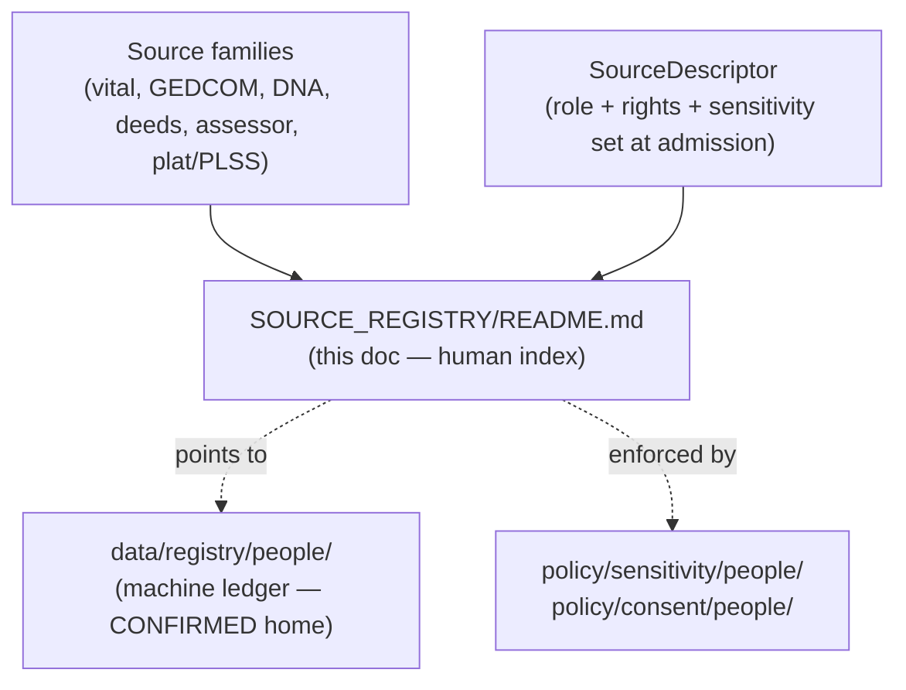
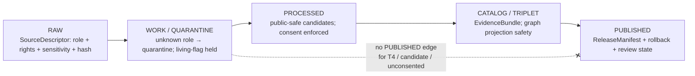

<!-- [KFM_META_BLOCK_V2]
doc_id: kfm://doc/people-dna-land-source-registry-readme
title: People / DNA / Land — Source Registry
type: standard
version: v1
status: draft
owners: <Source steward — PLACEHOLDER>, <People/DNA/Land domain steward — PLACEHOLDER>, <Sensitivity reviewer — PLACEHOLDER>, <Rights-holder representative — PLACEHOLDER>
created: 2026-06-06
updated: 2026-06-06
policy_label: restricted
related: [ai-build-operating-contract.md, directory-rules.md, docs/domains/people-dna-land/README.md, policy/sensitivity/people/, policy/consent/people/, schemas/contracts/v1/source/source-descriptor.json]
tags: [kfm, people, dna, land, genealogy, source-registry, sensitive, consent]
notes: [CONTRACT_VERSION = "3.0.0"; sources Atlas v1.1 ch.16 source families + §24.5 sensitivity tiers + §24.13 crosswalk; slug "people-dna-land" vs crosswalk "people/" is CONFLICTED pending ADR; SOURCE_REGISTRY/ subfolder-with-README pattern is PROPOSED]
[/KFM_META_BLOCK_V2] -->

<a id="top"></a>

# 🧬 People / DNA / Land — Source Registry

> Index and admission ledger for every source family feeding the People, Genealogy, DNA, and Land Ownership domain. This is the most sensitivity-charged source lane in KFM: living-person, DNA, and person-parcel content default to deny.


**Status:** `draft` · **Owners:** `<Source steward>` · `<Domain steward>` · `<Sensitivity reviewer>` · `<Rights-holder rep>` *(all PLACEHOLDER)* · **Updated:** 2026-06-06
**`CONTRACT_VERSION = "3.0.0"`** — governed by [`ai-build-operating-contract.md`](../../../../ai-build-operating-contract.md) and [`directory-rules.md`](../../../../directory-rules.md).

> [!CAUTION]
> **This lane fails closed.** Living-person output and DNA-derived outputs are denied or
> restricted by default; raw kit/vendor IDs and DNA segments are never public; assessor and
> tax records and parcel geometry are not title truth. Unclear rights, unresolved source
> role, missing evidence, unresolved sensitivity, or absent release state **blocks public
> promotion**. `[DOM-PEOPLE] [ENCY] [DIRRULES]` — *CONFIRMED doctrine.*

---

## Quick jump

- [1. Scope](#1-scope)
- [2. Repo fit](#2-repo-fit)
- [3. What belongs here](#3-what-belongs-here-accepted-inputs)
- [4. What does not belong here](#4-what-does-not-belong-here-exclusions)
- [5. Source families registered](#5-source-families-registered)
- [6. Sensitivity tiers and gates](#6-sensitivity-tiers-and-gates)
- [7. Admission and role discipline](#7-admission-and-role-discipline)
- [8. Registry entry shape](#8-registry-entry-shape-proposed)
- [Open questions register](#open-questions-register)
- [Open verification backlog](#open-verification-backlog)
- [Changelog](#changelog-v0--v1)
- [Definition of done](#definition-of-done)
- [Related docs](#related-docs)

---

## 1. Scope

This README is the landing page for the **People / DNA / Land source registry** — the
per-family ledger of every source admitted into the domain that governs assertion-first
person evidence, genealogy relationships, restricted DNA evidence, land instruments,
ownership intervals, and chain-of-title reasoning. `[DOM-PEOPLE] [ENCY]` — *CONFIRMED domain identity.*

Each registered source family carries, at admission: its **source role**, **rights /
sensitivity** posture, **freshness** cadence, and **status**. The registry is the source of
record for *which* sources exist and *under what terms*; it is not itself a schema, a
policy engine, or an `EvidenceBundle`.

[Back to top](#top)

## 2. Repo fit

> [!IMPORTANT]
> **Two placement conflicts surfaced — neither resolved here.** Per Directory Rules, a
> domain lives as a **lane** inside a responsibility root, and a registry's machine-readable
> home is `data/registry/`. The requested path is recorded as written, with the conflicts
> flagged for ADR. `[DIRRULES §3, §12]`
>
> - **CONFLICTED — domain slug.** The Atlas §24.13 crosswalk uses the People slug
>   **`people/`** (e.g., `schemas/contracts/v1/people/`, `policy/sensitivity/people/`,
>   `policy/consent/people/`). The requested doc segment is **`people-dna-land/`**. These
>   diverge; log to `docs/registers/DRIFT_REGISTER.md` and resolve by ADR before treating
>   either as canonical. `[ENCY §24.13] [DIRRULES]`
> - **PROPOSED — `SOURCE_REGISTRY/` subfolder + `README.md`.** A registry *index README*
>   under `docs/domains/<domain>/SOURCE_REGISTRY/` is a documentation landing page, distinct
>   from the machine-readable ledger that Directory Rules homes at `data/registry/`. This
>   doc is the **human-facing index**; it must not become a parallel registry home. The
>   subfolder convention is **not** in Directory Rules §12 and is **PROPOSED pending ADR.**

```text
docs/
└── domains/
    └── people-dna-land/                     # slug CONFLICTED vs §24.13 "people/"
        ├── README.md                         # domain lane landing (PROPOSED present)
        └── SOURCE_REGISTRY/                   # PROPOSED subfolder (not in §12)
            └── README.md                       # ← this file (human-facing index)

data/
└── registry/                                 # CONFIRMED rule: machine-readable registry home
    └── people/...                              # PROPOSED — actual entries NEEDS VERIFICATION

policy/
├── sensitivity/people/                       # §24.13 deny-default lanes (PROPOSED)
└── consent/people/                           # consent/revocation gate (PROPOSED)
```



> [!NOTE]
> The diagram shows **responsibility boundaries**, not verified repo structure. Every path
> is PROPOSED until checked against a mounted repo. The registry README *indexes* sources;
> it does not *replace* `data/registry/` or `EvidenceBundle`.

[Back to top](#top)

## 3. What belongs here (accepted inputs)

- An index entry per **registered source family** in the People / DNA / Land domain.
- Per-family: source role(s) at admission, rights / sensitivity posture, freshness cadence, status.
- Pointers to the machine-readable registry entry under `data/registry/...` and to the
  applicable `policy/sensitivity/people/` and `policy/consent/people/` entries.
- Links to the SourceDescriptor that pins each source's role.

## 4. What does not belong here (exclusions)

| Not here | Lives instead in |
|---|---|
| Object-family meaning (Person Assertion, LandInstrument, DNA Match Evidence, …) | `contracts/people/` |
| Field-level schema shape | `schemas/contracts/v1/people/` |
| Admit / deny / redact decisions as enforced policy | `policy/sensitivity/people/`, `policy/consent/people/` |
| The machine-readable registry entries themselves | `data/registry/...` |
| Released claims / evidence | `EvidenceBundle` via the governed API |
| Frontier-Matrix land-office / county-year panels | Frontier Matrix domain (it does **not** own living-person, DNA, title, or parcel decisions) |

> [!NOTE]
> Scope boundary is CONFIRMED doctrine: People/DNA/Land owns living-person, DNA, title,
> parcel, and ownership decisions; Settlements, Roads/Rail, Archaeology, Agriculture, and
> Spatial Foundation provide context but do not weaken those controls. `[DOM-PEOPLE] [ENCY]`

[Back to top](#top)

## 5. Source families registered

Source families are from the Atlas v1.1 ch.16 "Key source families" table. Role is recorded
as the dossier states it — **authority / observation / context / model, as the source role
requires** — meaning the specific role is pinned per-record at the SourceDescriptor, not as a
blanket family default. Rights and current terms are **NEEDS VERIFICATION**; sensitive joins
fail closed. `[DOM-PEOPLE] [ENCY]`

| Source family | Role(s) at admission | Rights / sensitivity | Freshness | Status |
|---|---|---|---|---|
| Vital / cemetery / burial / obituary / church / school / military / census / directory / court / probate records | authority · observation · context · model (as role requires) | rights + current terms NEEDS VERIFICATION; sensitive joins fail closed | source-vintage / cadence specific | `[DOM-PEOPLE] [ENCY]` |
| GEDCOM / GEDZip / tree overlays | authority · observation · context · model (as role requires) | rights + current terms NEEDS VERIFICATION; living-flag required on import; sensitive joins fail closed | source-vintage / cadence specific | `[DOM-PEOPLE] [ENCY]` |
| DNA vendor match CSV / segment / triangulation data | authority · observation · context · model (as role requires) | **T4 default**; raw kit/vendor IDs + segments never public; consent + no-log required | source-vintage / cadence specific | `[DOM-PEOPLE] [ENCY]` |
| Patent / deed / mortgage / lien / easement / lease / mineral / water / access / probate instruments | authority · observation · context · model (as role requires) | rights + current terms NEEDS VERIFICATION; instruments are not title truth without chain logic | source-vintage / cadence specific | `[DOM-PEOPLE] [ENCY]` |
| Assessor and tax roll records | authority · observation · context · model (as role requires) | **administrative — not title truth**; sensitive joins fail closed | source-vintage / cadence specific | `[DOM-PEOPLE] [ENCY]` |
| Plat / survey / metes-and-bounds / PLSS / subdivision / derived geometry | authority · observation · context · model (as role requires) | rights + current terms NEEDS VERIFICATION; geometry-role boundary applies | source-vintage / cadence specific | `[DOM-PEOPLE] [ENCY]` |

[Back to top](#top)

## 6. Sensitivity tiers and gates

Default tiers and allowed transforms for this domain's object classes are from Atlas v1.1
§24.5. Tier transitions are reversible; revocation returns an object to T4 with a
`CorrectionNotice`. `[DOM-PEOPLE]` — *CONFIRMED tier scheme (PROPOSED adoption, ADR-S-05).*

| Object class | Default tier | Allowed transform (PROPOSED) | Required gate |
|---|---|---|---|
| Living-person fields | **T4** | Aggregation by tract or county + `AggregationReceipt` → T1 | Consent or aggregation gate + `ReviewRecord` |
| Raw DNA segment data | **T4** | No transform releases to a public tier; T3 only under explicit research agreement | Named consent + `ReviewRecord` + `PolicyDecision` |
| Private person-parcel join | **T4** | Generalized parcel + de-identified person → T2 only | `RedactionReceipt` + `ReviewRecord` |

> [!WARNING]
> A join from an aggregate cell or assessor record to a single living person or parcel is a
> **source-role collapse and a privacy escalation**. Treat any cross-lane join touching
> living-person, DNA, or person-parcel content as T4 until a steward and rights-holder
> review clears it. Inference via side-channels (popup text, AI prose, map labels) is in
> scope for denial. `[DOM-PEOPLE] [ENCY]`

[Back to top](#top)

## 7. Admission and role discipline

Source role is a first-class identity attribute, **set at admission and never upgraded by
promotion**. Promotion does not turn a model into an observation, an administrative
compilation into a regulation, or a candidate into a verified record — those are separate
governed transitions. `[ENCY] [DIRRULES]` — *CONFIRMED doctrine.*



CONFIRMED admission rule: unknown source roles are quarantined; assessor/tax records are
never published as title truth; DNA raw IDs are not logged; revocation triggers cleanup.
`[DOM-PEOPLE] [ENCY]`

[Back to top](#top)

## 8. Registry entry shape (PROPOSED)

> [!NOTE]
> **PROPOSED schema home.** The machine-readable registry lives under `data/registry/...`
> (Directory Rules), and source role is a `SourceDescriptor` field whose canonical schema
> home defaults to `schemas/contracts/v1/source/source-descriptor.json` per §7.4 / ADR-0001.
> The shape below is illustrative for the *index*, not an authoritative schema. `[DIRRULES]`

<details>
<summary>Illustrative index entry (PROPOSED — not a schema)</summary>

```yaml
# Illustrative only — NEEDS VERIFICATION against data/registry/ and the SourceDescriptor schema
source_family_id: <slug>                 # e.g. dna-vendor-match
display_name: <human label>
source_role: observed | regulatory | modeled | aggregate | administrative | candidate | synthetic
rights:
  status: UNKNOWN | confirmed | restricted   # NEEDS VERIFICATION per family
  terms_ref: <link or TODO>
sensitivity:
  default_tier: T0 | T1 | T2 | T3 | T4       # living-person / DNA / person-parcel default T4
  policy_ref: policy/sensitivity/people/<...>
  consent_ref: policy/consent/people/<...>   # required for living-person / DNA
freshness:
  cadence: source-vintage | <interval>
descriptor_ref: schemas/contracts/v1/source/source-descriptor.json   # PROPOSED home
registry_ref: data/registry/people/<...>     # CONFIRMED responsibility root
status: PROPOSED | active | quarantined
```

</details>

---

## Open questions register

| ID | Question | Owner role | Resolution path |
|---|---|---|---|
| OQ-PEOPLE-SREG-01 | Is the domain slug `people/` (per §24.13 crosswalk) or `people-dna-land/` (as requested)? | Docs steward | DRIFT_REGISTER entry + ADR |
| OQ-PEOPLE-SREG-02 | Is a `SOURCE_REGISTRY/README.md` index subfolder canonical, or should the index be a single `SOURCE_REGISTRY.md`? | Docs steward | ADR (subfolder convention not in §12) |
| OQ-PEOPLE-SREG-03 | Confirm rights / current-terms status per source family. | Source steward | Mounted-repo registry + source agreements |
| OQ-PEOPLE-SREG-04 | Is the T0–T4 tier scheme adopted as canonical for this lane? | Sensitivity reviewer | **ADR-S-05** (sensitivity tier scheme) |
| OQ-PEOPLE-SREG-05 | Where do consent/revocation enforcement and DNA no-log live, and are they tested? | Domain steward + Sensitivity reviewer | Mounted-repo `policy/consent/people/` + tests |
| OQ-PEOPLE-SREG-06 | Confirm `SourceDescriptor` schema home and field names. | Domain steward | **ADR-S-01** / mounted-repo schema |

## Open verification backlog

These items remain `NEEDS VERIFICATION` before promotion from `draft` to `published`:

1. Domain slug resolution (`people/` vs `people-dna-land/`) and final file placement.
2. Whether `SOURCE_REGISTRY/` index subfolder is canonical vs a flat `SOURCE_REGISTRY.md`.
3. Rights and current-terms posture for each registered source family.
4. Living-person policy enforcement.
5. DNA consent / revocation enforcement and raw-ID no-log behavior.
6. Geometry-role boundary logic and assessor-as-title denial.
7. UI / API restricted-field no-leak behavior.
8. Presence of `data/registry/people/...` machine entries and the SourceDescriptor schema.

## Changelog v0 → v1

| Change | Type (per contract §37) | Reason |
|---|---|---|
| Initial People/DNA/Land source registry index README | new | No prior registry index README located in project evidence |
| Source families transcribed from Atlas v1.1 ch.16 | gap closure | Make per-family role + rights + freshness discoverable in-lane |
| Surfaced slug conflict (`people/` vs `people-dna-land/`) and subfolder-convention question | reconciliation | Directory Rules §12 / §24.13 divergence must not be smoothed |
| Tier table from §24.5; deny-default posture pinned | reconciliation | Align lane index with sensitivity scheme |

> **Backward compatibility.** New doc; no prior anchors to preserve. `#top` and section
> anchors are stable from v1 onward. If OQ-PEOPLE-SREG-01/02 resolve the path differently,
> this file moves under a migration note rather than silently.

## Definition of done

This document is done enough to enter the repository when:

- the slug and subfolder questions (OQ-PEOPLE-SREG-01/02) are resolved or logged as drift;
- it is placed according to Directory Rules and does not create a parallel registry home;
- a docs steward, source steward, sensitivity reviewer, and rights-holder rep review it;
- it is linked from the People/DNA/Land lane index;
- it does not conflict with accepted ADRs (notably ADR-S-01, ADR-S-04, ADR-S-05);
- any conflict with current repo conventions is logged in `docs/registers/DRIFT_REGISTER.md`;
- the `GENERATED_RECEIPT.json` planned in Section 2 is wired into CI;
- future changes follow the operating contract's §37 lifecycle.

---

## Related docs

- [`ai-build-operating-contract.md`](../../../../ai-build-operating-contract.md) — operating law (`CONTRACT_VERSION = "3.0.0"`)
- [`directory-rules.md`](../../../../directory-rules.md) — placement authority (§3, §7.4, §12, §2.4)
- `docs/domains/people-dna-land/README.md` — domain lane landing page *(TODO — verify slug + path)*
- `policy/sensitivity/people/` — sensitivity deny-default lanes *(PROPOSED)*
- `policy/consent/people/` — consent / revocation gates *(PROPOSED)*
- `data/registry/...` — machine-readable registry home *(CONFIRMED responsibility root; entries NEEDS VERIFICATION)*
- Atlas v1.1 ch.16 + §24.5 + §24.13 — domain dossier, tier scheme, crosswalk *(reference views, not authority)*

---

*Last updated: 2026-06-06 · `CONTRACT_VERSION = "3.0.0"` · policy_label: restricted · [Back to top](#top)*
