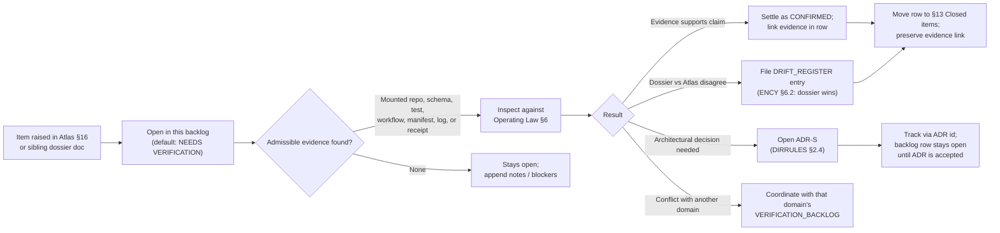

# People/DNA/Land — Verification Backlog

> Domain-scoped register of unverified, unsettled, or evidence-pending items for the People/Genealogy/DNA/Land Ownership domain. Source of truth for what this domain has *claimed* but not yet *proven*.

<!-- [KFM_META_BLOCK_V2]
doc_id: kfm://doc/people-dna-land/verification-backlog
title: People/DNA/Land — Verification Backlog
type: register
version: v1
status: draft
owners: People/DNA/Land steward + Docs steward — PROPOSED; reviewer assignment NEEDS VERIFICATION
created: 2026-05-19
updated: 2026-06-07
policy_label: public
related:
  - docs/domains/people-dna-land/README.md
  - docs/domains/people-dna-land/ARCHITECTURE.md
  - docs/domains/people-dna-land/SOURCE_REGISTRY.md
  - docs/domains/people-dna-land/SOURCE_LEDGER.md
  - docs/domains/people-dna-land/SOURCE_FAMILIES.md
  - docs/domains/people-dna-land/SENSITIVITY_PROFILE.md
  - docs/runbooks/people-dna-land/SOURCE_REFRESH_RUNBOOK.md
  - docs/registers/VERIFICATION_BACKLOG.md
  - docs/registers/DRIFT_REGISTER.md
  - docs/doctrine/directory-rules.md
  - docs/atlases/domains-v1.1.md
notes:
  - CONTRACT_VERSION = "3.0.0".
  - Item set seeded from Atlas v1.1 §16.N (5 items), §16.K (7 validator/test items), §16.I (sensitivity posture), §16.J (API/contract surfaces), §16.H (pipeline gates), §20.5 (deny-by-default register).
  - When this dossier disagrees with Atlas Ch. 16, dossier wins (Encyclopedia §6.2); the disagreement is filed to docs/registers/DRIFT_REGISTER.md.
  - Lane-slug placement docs/domains/people-dna-land/ is CONFIRMED at doctrine level (Directory Rules §12 names people-dna-land in the uniform domain-lane pattern). The externally-presented canonical lane NAME is unsettled (Atlas names it "People / Genealogy / DNA / Land"); slug-vs-name drift is an ADR candidate. See OPEN-PDL-VBL-05.
  - All other path claims below are PROPOSED until mounted-repo evidence verifies them.
  - source_role canonical enum (Atlas §24.1.1): observed | regulatory | modeled | aggregate | administrative | candidate | synthetic.
[/KFM_META_BLOCK_V2] -->

| Field | Value |
|---|---|
| **Status** | Draft (initial population) |
| **Owners** | People/DNA/Land steward + Docs steward — **PROPOSED**; actual assignment **NEEDS VERIFICATION** |
| **Last updated** | 2026-06-07 |
| **Pinned** | `CONTRACT_VERSION = "3.0.0"` |
| **Authority scope** | This domain only. Repo-wide items belong in [`docs/registers/VERIFICATION_BACKLOG.md`](../../registers/VERIFICATION_BACKLOG.md) |
| **Conflict rule** | Dossier wins over Atlas chapter; file disagreement to [`DRIFT_REGISTER`](../../registers/DRIFT_REGISTER.md). [Encyclopedia §6.2] |

---

## Contents

1. [Scope and authority](#1-scope-and-authority)
2. [How this backlog works](#2-how-this-backlog-works)
3. [Sensitivity context (read before triaging)](#3-sensitivity-context-read-before-triaging)
4. [Primary verification backlog (Atlas §16.N)](#4-primary-verification-backlog-atlas-16n)
5. [Validator and test backlog (Atlas §16.K)](#5-validator-and-test-backlog-atlas-16k)
6. [Policy and sensitivity verification (Atlas §16.I + §20.5)](#6-policy-and-sensitivity-verification-atlas-16i--205)
7. [API, contract, and schema verification (Atlas §16.J)](#7-api-contract-and-schema-verification-atlas-16j)
8. [Pipeline gate verification (Atlas §16.H)](#8-pipeline-gate-verification-atlas-16h)
9. [Cross-lane relation verification (Atlas §16.F)](#9-cross-lane-relation-verification-atlas-16f)
10. [Related ADR-S items (Atlas §24.12)](#10-related-adr-s-items-atlas-2412)
11. [Evidence forms and closure criteria](#11-evidence-forms-and-closure-criteria)
12. [Drift and ADR interactions](#12-drift-and-adr-interactions)
13. [Closed items](#13-closed-items)
14. [Open questions beyond the backlog](#14-open-questions-beyond-the-backlog)
15. [Related docs](#15-related-docs)

---

## 1. Scope and authority

> [!IMPORTANT]
> This backlog tracks items that the **People/Genealogy/DNA/Land Ownership** domain has *claimed* in doctrine but has **not yet proven** in implementation. Settling an item means producing admissible evidence — mounted-repo files, schemas, registry entries, tests, logs, emitted artifacts, review records, or release manifests — not adding more prose.

**CONFIRMED doctrine.** The People/DNA/Land domain owns assertion-first person evidence, genealogy relationships, restricted DNA evidence, land instruments, ownership intervals, chain-of-title reasoning, consent, policy decisions, review, correction, graph projection, EvidenceBundle views, and rollback. [Atlas §16.A] [DOM-PEOPLE] [ENCY]

**CONFIRMED placement (slug); CONFLICTED name.** This file lives at `docs/domains/people-dna-land/VERIFICATION_BACKLOG.md`. The lane-slug placement is CONFIRMED at doctrine level: Directory Rules §12 names **`people-dna-land`** in the uniform domain-lane pattern ("This pattern applies uniformly to: hydrology, soil, … people-dna-land, and any new domain"), and Encyclopedia §6.2 makes the per-domain dossier (README, ARCHITECTURE, PRESERVATION_MATRIX, VERIFICATION_BACKLOG, etc.) the authoritative home for the domain. [DIRRULES §12] [ENCY §6.2]

> [!NOTE]
> **Slug vs. canonical name (CONFLICTED → ADR candidate).** The *slug* `people-dna-land` is CONFIRMED, but the *externally-presented canonical lane name* is unsettled: Atlas Ch. 16 names the lane "People / Genealogy / DNA / Land," and schema/policy paths use the `people/` segment (`schemas/contracts/v1/people/`, `policy/sensitivity/people/`, `policy/consent/people/`). This slug-vs-name drift is tracked in the corpus slug-drift register and Atlas §24.13; resolve by ADR. See [OPEN-PDL-VBL-05](#14-open-questions-beyond-the-backlog). [ATLAS §24.13]

**Scope.**

- **In scope.** Items raised by Atlas Ch. 16 sections N (verification backlog), K (validators/tests), I (sensitivity), J (API/contract surfaces), H (pipeline gates), and F (cross-lane relations) — plus any item raised by review of this dossier or its sibling dossier docs.
- **Out of scope.** Cross-domain or repo-wide governance items belong in [`docs/registers/VERIFICATION_BACKLOG.md`](../../registers/VERIFICATION_BACKLOG.md). Architectural questions that warrant an ADR move to the [ADR-S backlog](#10-related-adr-s-items-atlas-2412) and on to `docs/adr/`. Drift between this dossier and the Atlas chapter is filed to [`docs/registers/DRIFT_REGISTER.md`](../../registers/DRIFT_REGISTER.md).

**Authority order on conflict.**

1. Mounted-repo evidence in this session (if any).
2. This dossier and its sibling dossier docs (`README.md`, `ARCHITECTURE.md`, `PRESERVATION_MATRIX.md`).
3. Atlas Ch. 16 (the chapter is synthesis; the dossier supersedes it on disagreement per Encyclopedia §6.2).
4. Encyclopedia Ch. 7.16.
5. Source dossier [DOM-PEOPLE].

> [!NOTE]
> No mounted repository is inspected in the authoring session for this document. Every path quoted below is **PROPOSED** until verified against repo evidence; every "claim X exists" item below stays **NEEDS VERIFICATION** until a reviewer attaches admissible evidence.

[Back to top](#contents)

---

## 2. How this backlog works

Each row carries five fields:

- **ID** — stable identifier of the form `KFM-PDL-VER-NNNN` (PDL = People/DNA/Land; VER = verification; NNNN = ordinal). IDs are append-only.
- **Item to verify** — the claim, behavior, or invariant whose evidence is missing.
- **Evidence that would settle it** — the *form* of admissible evidence (per Operating Law §6 "Evidence Rule").
- **Status** — one of: **NEEDS VERIFICATION**, **PROPOSED**, **UNKNOWN**, **INFERRED**, or **CONFIRMED**.
- **Notes / refs** — pointers to Atlas section, ADR-S id, or sibling dossier doc.

### 2.1 Item lifecycle

> [!CAUTION]
> "Settling" an item never means rewriting the claim in stronger language. It means attaching evidence that a reviewer could independently reproduce. Memory, plausibility, and generic best practice are not evidence (Operating Law §3).

### 2.2 Status legend

| Status | Meaning | Example |
|---|---|---|
| **NEEDS VERIFICATION** | Claim is checkable, but unchecked in this session. | "Living-person denial enforced in `policy/`" |
| **PROPOSED** | Design or path not yet committed or implemented. | "Schema home at `schemas/contracts/v1/people/`" |
| **UNKNOWN** | Not resolvable without more evidence; may also be a true gap. | Exact route name of the `PeopleDNALandDecisionEnvelope` resolver. |
| **INFERRED** | Reasonably derivable from visible evidence but not directly stated. | DNA segment data inherits the same redaction posture as DNA Match Evidence. |
| **CONFIRMED** | Verified this session from admissible evidence. | Used **only** when a reviewer attaches the evidence; not yet applied to any row below. |

[Back to top](#contents)

---

## 3. Sensitivity context (read before triaging)

> [!WARNING]
> The People/DNA/Land domain is the **most rights-sensitive** lane in KFM alongside Archaeology. Verification work must not itself become an information leak. Any reviewer who attaches evidence to a row in this backlog must confirm that the *evidence form* — not just the underlying object — is public-safe.

**Deny-by-default register (CONFIRMED doctrine, PROPOSED implementation).** Per Atlas §20.5:

| Denied by default | Allowed only when | Citation |
|---|---|---|
| Living-person private output | Consent + policy + restricted authorized surface | [DOM-PEOPLE] |
| Raw DNA kit/vendor IDs | Consent + policy + restricted authorized surface | [DOM-PEOPLE] |
| DNA segments | Consent + policy + restricted authorized surface | [DOM-PEOPLE] |
| Private person-parcel joins | Consent + policy + restricted authorized surface | [DOM-PEOPLE] |

**Additional sensitivity invariants (CONFIRMED doctrine).** Per Atlas §16.I:

- Living-person output and DNA-derived outputs are denied or restricted by default.
- Raw kit/vendor IDs and DNA segments are not public.
- Assessor/tax records and parcel geometry are **not** title truth.
- Unclear rights, unresolved source role, missing evidence, unresolved sensitivity, or absent release state **blocks** public promotion.

> [!IMPORTANT]
> **Consent does NOT publish data.** A consent grant (e.g., a `ConsentSidecar`) is a *constraint package* that bounds what a render gate may materialize; publication still requires a `ReleaseManifest` and the release gate. A reviewer must not read "consent present" as "release authorized." [Pass-23 KFM-P5-PROG-0005]

**Implication for this backlog.** Several items below describe controls whose *failure modes* themselves describe a sensitive leak. Reviewers attaching evidence (test fixtures, logs, request/response samples) must redact specifics and link to evidence rather than inline it.

[Back to top](#contents)

---

## 4. Primary verification backlog (Atlas §16.N)

These five items are CONFIRMED-raised by Atlas v1.1 §16.N. All carry **NEEDS VERIFICATION** status because no mounted-repo inspection has occurred. Evidence form for each is the canonical Atlas formulation ("mounted repo files, schemas, registry entries, tests, logs, emitted artifacts, review records, or release manifests").

| ID | Item to verify | Evidence that would settle it | Status | Notes / refs |
|---|---|---|---|---|
| `KFM-PDL-VER-0001` | Verify **living-person policy**: denied-by-default behavior is enforced for living-person identifiers, names, addresses, life events, and derived fields across all public surfaces. | `policy/consent/people/` rules, `policy/sensitivity/people/` rules, fixtures asserting DENY on living-person output, runtime/log samples showing DENY reason codes, ReleaseManifest entries excluding living-person artifacts. | NEEDS VERIFICATION | Atlas §16.N item 1; ties to §16.I, §20.5. |
| `KFM-PDL-VER-0002` | Verify **DNA consent/revocation enforcement**: consent is required before any DNA-derived publication; revocation propagates to derived artifacts, indexes, and caches; revocation cleanup tests exist; revocation is honored at the **render gate**, not only at publication. | Consent schema and policy in `policy/consent/people/`, render gate `policy/consent/render.rego`, revocation cleanup test fixtures, tombstone receipts, audit log of revocation events, cache-invalidation evidence (PMTiles index bump / tile purge). | NEEDS VERIFICATION | Atlas §16.N item 2; ties to §16.K "revocation cleanup tests" and "DNA consent and raw-ID no-log tests"; Pass-23 KFM-P5-PROG-0007. |
| `KFM-PDL-VER-0003` | Verify **land instrument chain logic**: deed/title/assessor/parcel-version assertions are temporally distinct, do not collapse "assessor record" (`administrative`) into "title truth", and surface chain-of-title gaps rather than silently bridging them. | Contracts for Deed Instrument, Title Instrument, Assessor Record, Parcel Version, Ownership Interval; validator tests for chain-of-title gap detection; legal-description test fixtures; cases that **must** DENY title-truth promotion when only assessor evidence exists. | NEEDS VERIFICATION | Atlas §16.N item 3; ties to §16.K "legal-description and chain-of-title gap tests" and "assessor-as-title denial". |
| `KFM-PDL-VER-0004` | Verify **geometry-role boundary logic**: parcel geometry is treated as a *source-role-dependent observation/derivation*, not as title truth; geometries from cadastral (`administrative`), plat/survey (`observed`), PLSS derivation (`modeled`), and assessor inputs are distinguished and never silently merged. | Contracts for Parcel Version and geometry-role; validator tests asserting geometry-role propagation through joins and projections; cases where mixed-role merges fail closed; documented transform receipts for any cross-role projection. | NEEDS VERIFICATION | Atlas §16.N item 4; ties to §16.D source families (plat/survey/metes/bounds/PLSS) and §16.K "graph projection safety tests". |
| `KFM-PDL-VER-0005` | Verify **UI/API restricted-field no-leak behavior**: restricted fields (living-person identifiers, raw DNA IDs, DNA segments, private person-parcel joins) do not appear in popups, labels, tile attributes, AI Focus Mode answers, Evidence Drawer payloads, exported reports, or logs. | UI/API contract tests against the restricted-field allowlist; tile attribute audits; Focus Mode template fixtures with redaction assertions; popup/export side-channel audits; AIReceipt redaction evidence. | NEEDS VERIFICATION | Atlas §16.N item 5; ties to §20.5 "sensitive-content side-channel audit" metric and §24.11.3 indicators. |

[Back to top](#contents)

---

## 5. Validator and test backlog (Atlas §16.K)

These seven validator/test items are CONFIRMED-raised by Atlas v1.1 §16.K as **PROPOSED**. They become inputs to closing the primary backlog above: each settled validator can attach evidence to one or more §4 items.

| ID | Validator / test | Closes (primary item) | Evidence form | Status |
|---|---|---|---|---|
| `KFM-PDL-VER-0006` | **Person assertion evidence tests** — every Person Assertion carries source role, evidence, time, and release state; bare assertions DENY. | partially `VER-0001` | Fixture pairs (valid / invalid) under `fixtures/domains/people-dna-land/`; test cases under `tests/domains/people-dna-land/`. | PROPOSED |
| `KFM-PDL-VER-0007` | **GEDCOM import rights/living-flag tests** — GEDCOM/GEDZip imports detect and tag living persons; rights and source role (`candidate`/`context`, never `observed`) propagate from the import. | `VER-0001` | Import test fixtures including living-flag edge cases; assertion logs of living-flag propagation; release-block tests. | PROPOSED |
| `KFM-PDL-VER-0008` | **DNA consent and raw-ID no-log tests** — raw kit IDs, vendor IDs, and DNA segments never appear in logs, traces, exports, or telemetry. | `VER-0002`, `VER-0005` | Log-redaction tests; side-channel scanners against test runs; explicit fixtures with raw IDs that must be redacted across all sinks. | PROPOSED |
| `KFM-PDL-VER-0009` | **Revocation cleanup tests** — DNA consent revocation removes derived rows, segments, match evidence, graph projections, tile attributes, and cached AIReceipts within the documented SLA. | `VER-0002` | End-to-end revocation simulation with receipts at each cleanup step; tombstone records; cache invalidation evidence. | PROPOSED |
| `KFM-PDL-VER-0010` | **Legal-description and chain-of-title gap tests** — gaps in chain-of-title are surfaced, not silently bridged; ambiguous legal descriptions DENY automatic ownership promotion. | `VER-0003` | Chain-of-title test fixtures with intentional gaps; validator output showing DENY reason codes; ambiguous-description fixtures. | PROPOSED |
| `KFM-PDL-VER-0011` | **Assessor-as-title denial** — assessor records and tax rolls are never promoted to title truth; cross-citation is allowed only with explicit source-role labels (`administrative`). | `VER-0003` | Test cases where assessor-only evidence is presented as title; expected DENY; receipts citing the assessor-as-title denial path. | PROPOSED |
| `KFM-PDL-VER-0012` | **Graph projection safety tests** — graph/triplet projections do not leak restricted fields, do not collapse source roles, and do not bridge person-parcel joins without policy support. | `VER-0004`, `VER-0005` | Projection fixtures with restricted source data; expected redacted or omitted edges; comparison against a public-safe ground-truth projection. | PROPOSED |

> [!TIP]
> Items `VER-0006` through `VER-0012` map one-to-one onto the seven `PROPOSED` validator items in Atlas §16.K. When the validator is implemented and exercised, attach evidence here and in the primary backlog row it closes.

[Back to top](#contents)

---

## 6. Policy and sensitivity verification (Atlas §16.I + §20.5)

These items track verification of policy enforcement specifically — the *gates*, not the *tests*.

| ID | Item to verify | Evidence form | Status |
|---|---|---|---|
| `KFM-PDL-VER-0013` | Policy home `policy/sensitivity/people/` exists, is reachable from the deny-by-default register, and emits reason-coded DENY/ABSTAIN/HOLD outcomes. | Policy files under `policy/sensitivity/people/`; reason-code enumeration; test runs showing reason codes in runtime envelopes. | NEEDS VERIFICATION |
| `KFM-PDL-VER-0014` | Consent policy home `policy/consent/people/` exists; consent objects have schemas; the render gate `policy/consent/render.rego` emits a finite `ConsentDecision` (ALLOW/DENY/ABSTAIN/ERROR); revocation is observable in policy decisions. | Consent schema (`schemas/contracts/v1/consent/`); consent-decision fixtures; PolicyDecision/ConsentDecision records showing consent state and revocation propagation. | NEEDS VERIFICATION |
| `KFM-PDL-VER-0015` | Private person-parcel join policy denies by default and only permits under the documented exception path. | Join policy file; test fixtures attempting private joins; expected DENY; documented exception path with PolicyDecision and review record. | NEEDS VERIFICATION |
| `KFM-PDL-VER-0016` | Sensitivity tier assignment for People/DNA/Land follows the canonical T0–T4 tier scheme (Atlas §24.5). | Sensitivity tier mapping in `policy/sensitivity/people/` or equivalent; tier-to-deny mapping; consistency check against §20.5 and §24.5.2. | NEEDS VERIFICATION |
| `KFM-PDL-VER-0017` | Side-channel audit (popups, labels, AI text, exports, logs) runs periodically and emits documented results. | CI workflow or scheduled job; audit reports under `docs/reports/` or `data/receipts/`; non-empty result history. | NEEDS VERIFICATION |

> [!NOTE]
> **PROPOSED dependency on ADR-S-05** (sensitivity tier scheme): `VER-0016` cannot fully settle until the canonical tier scheme is adopted (or revised) per the Open-ADR backlog (Atlas §24.12). See [§10](#10-related-adr-s-items-atlas-2412).

[Back to top](#contents)

---

## 7. API, contract, and schema verification (Atlas §16.J)

| ID | Item to verify | Evidence form | Status |
|---|---|---|---|
| `KFM-PDL-VER-0018` | `PeopleDNALandDecisionEnvelope` DTO exists with the four finite outcomes (ANSWER / ABSTAIN / DENY / ERROR) and is the only contract used by the feature/detail resolver. | Schema for the envelope under `schemas/contracts/v1/people/`; resolver code citing the schema; test cases for each outcome. | NEEDS VERIFICATION (route name UNKNOWN) |
| `KFM-PDL-VER-0019` | `LayerManifest` for People/DNA/Land emits only public-safe release artifacts; restricted layers are absent from the public manifest. | Layer manifest file or generator; public-manifest sample; comparison against restricted-layer list. | NEEDS VERIFICATION |
| `KFM-PDL-VER-0020` | `EvidenceDrawerPayload` for People/DNA/Land is evidence-filtered and policy-filtered before render. | Drawer payload schema; payload sample with redaction markers; policy filter trace. | NEEDS VERIFICATION |
| `KFM-PDL-VER-0021` | Focus Mode answer envelope includes an `AIReceipt` for every People/DNA/Land answer; ABSTAIN/DENY are first-class outcomes, not warnings appended to ANSWER. | Receipt schema; sample receipts; ABSTAIN/DENY rate distribution per §24.11.4 indicators. | NEEDS VERIFICATION |
| `KFM-PDL-VER-0022` | Schema home is confirmed at `schemas/contracts/v1/people/` per ADR-0001 (schema home) or by amendment ADR. | Mounted-repo schema home; ADR-0001 status; consistency with `schemas/contracts/v1/domains/<domain>/` convention. | PROPOSED (path); NEEDS VERIFICATION (presence) |

> [!NOTE]
> **Schema-segment drift to watch.** Atlas §24.13 lists this lane's schema home as `schemas/contracts/v1/people/`, while Directory Rules §12 shows the canonical domain-segment shape `schemas/contracts/v1/domains/<domain>/`. `VER-0022` must reconcile which form is canonical; flag to `DRIFT_REGISTER` if both appear. [DIRRULES §12; ATLAS §24.13]

[Back to top](#contents)

---

## 8. Pipeline gate verification (Atlas §16.H)

Each pipeline stage from RAW → PUBLISHED has a CONFIRMED doctrinal gate. Verification tracks whether the gate is *implemented* and *enforced*.

| ID | Stage | Gate (doctrine) | Evidence form | Status |
|---|---|---|---|---|
| `KFM-PDL-VER-0023` | RAW | `SourceDescriptor` exists with role, rights, sensitivity, citation, time, hash. | Source descriptor fixtures; admission tests that DENY on missing fields. | NEEDS VERIFICATION |
| `KFM-PDL-VER-0024` | WORK / QUARANTINE | Validation and policy gate pass, or quarantine reason is recorded. | Validator outputs; quarantine reason codes; quarantine register entries. | NEEDS VERIFICATION |
| `KFM-PDL-VER-0025` | PROCESSED | `EvidenceRef`, `ValidationReport`, and digest closure exist. | ValidationReport samples; digest manifests; EvidenceRef resolution tests. | NEEDS VERIFICATION |
| `KFM-PDL-VER-0026` | CATALOG / TRIPLET | Catalog/proof closure passes. | Catalog records; proof-closure check output; failed-closure DENY samples. | NEEDS VERIFICATION |
| `KFM-PDL-VER-0027` | PUBLISHED | `ReleaseManifest`, correction path, rollback target, and review/policy state exist. | Release manifest schema and sample; rollback target identifier; correction-notice template. | NEEDS VERIFICATION |

> [!IMPORTANT]
> Promotion is a **governed state transition, not a file move** (Directory Rules lifecycle invariant; Operating Law §5). Verifying gate `VER-0027` is not the same as verifying that a file appeared under `data/published/`.

[Back to top](#contents)

---

## 9. Cross-lane relation verification (Atlas §16.F)

Cross-lane relations preserve ownership, source role, sensitivity, and EvidenceBundle support. Verification tracks whether the relation type is supported in contracts and whether sensitivity propagates.

| ID | This domain ↔ Related lane | Relation type | Constraint to verify | Status |
|---|---|---|---|---|
| `KFM-PDL-VER-0028` | People/DNA/Land ↔ Settlements | residence, cemetery, school, court, county, township, place relation | Ownership, source role, sensitivity, EvidenceBundle preserved across join; living-person fields fail closed | NEEDS VERIFICATION |
| `KFM-PDL-VER-0029` | People/DNA/Land ↔ Roads/Rail | migration, access, movement | Ownership, source role, sensitivity, EvidenceBundle preserved across join | NEEDS VERIFICATION |
| `KFM-PDL-VER-0030` | People/DNA/Land ↔ Archaeology | historic person, land, documentary, cultural-place context | Sovereignty review path respected; sensitive sites never joined to private person rows | NEEDS VERIFICATION |
| `KFM-PDL-VER-0031` | People/DNA/Land ↔ Agriculture | farm, land use, producer-adjacent context with privacy | Aggregation receipts present; private-join denial default holds | NEEDS VERIFICATION |
| `KFM-PDL-VER-0032` | People/DNA/Land ↔ Frontier Matrix | aggregate population observations feed matrix cells (implicit: cells must not collapse PDL-owned fields into demographic aggregates without policy) | Verify cross-lane join policy; verify People/DNA/Land sovereignty over title, parcel, ownership decisions per Atlas §17.B | INFERRED from §17.B; NEEDS VERIFICATION as enforcement |

[Back to top](#contents)

---

## 10. Related ADR-S items (Atlas §24.12)

The Atlas Master Open-ADR Backlog (§24.12) carries 15 ADR-class questions. These touch People/DNA/Land directly or indirectly. An ADR-S item is **not** a backlog row in this dossier; it is a decision-class question routed through `docs/adr/`. Rows that depend on an ADR-S resolution carry an explicit dependency.

| ADR-S id | Question | Affects PDL items | Notes |
|---|---|---|---|
| `ADR-S-01` | Where is the canonical schema home? Confirm `schemas/contracts/v1/...` by ADR-0001 or amend (incl. `people/` vs `domains/people-dna-land/` segment). | `VER-0022` (schema home) | ADR-required per Directory Rules §2.4(3). |
| `ADR-S-05` | Sensitivity tier scheme (T0–T4) — adopt as canonical or revise. | `VER-0016` (tier assignment) | Tier scheme is referenced across Atlas (§24.5, §24.14) but treated as PROPOSED until ratified. |
| (lane-name) | Canonical externally-presented name of this lane (slug `people-dna-land` vs "People / Genealogy / DNA / Land"). | `OPEN-PDL-VBL-05` | Slug-drift register; Atlas §24.13. |
| Others | Source-role enum, receipt schema layout, cross-lane join policy, atlas/supplement lifecycle, etc. | Indirect; surface as needed when an item escalates. | Atlas §24.12 has the full 15-item list. |

> [!NOTE]
> Additional ADR-S items may apply once mounted-repo evidence is available. The current set above reflects only the explicitly named cross-references; others are **NEEDS VERIFICATION** until reviewer triage.

[Back to top](#contents)

---

## 11. Evidence forms and closure criteria

<strong>What counts as admissible evidence for each row type</strong> (click to expand)

Per Operating Law §6 (Evidence Rule), admissible evidence is any of: attached docs, visible code/configs, schemas, contracts, tests, workflows, manifests, logs, dashboards, artifacts, outputs, and authoritative sources. For *this* backlog, the practical evidence forms are:

| Row type | Minimum admissible evidence |
|---|---|
| Policy-enforcement row (e.g., `VER-0001`, `VER-0013`) | Policy file path, reason-code enumeration, **at least one DENY test fixture and its expected outcome**, **at least one runtime log/receipt** showing the reason code emitted in practice. |
| Validator/test row (`VER-0006` through `VER-0012`) | Test file path, fixture pair (valid / invalid), test run output showing PASS / FAIL distinction, **CI workflow** reference if the test is gated. |
| Contract/schema row (`VER-0018` through `VER-0022`) | Schema file path under `schemas/contracts/v1/people/`, contract doc under `contracts/people/` (or `contracts/domains/people-dna-land/`), **at least one consumer** (resolver, UI, or pipeline) citing the schema. |
| Pipeline-gate row (`VER-0023` through `VER-0027`) | Pipeline spec or executable; gate output (PASS / quarantine reason / closure failure); receipt or proof object tied to the gate. |
| Cross-lane row (`VER-0028` through `VER-0032`) | Cross-lane test cases; cross-lane contract for the relation type; sensitivity-propagation evidence. |
| ADR-S-dependent row | The corresponding ADR with `status: accepted`; the ADR's `decision` and `consequences` resolve the question. |

What does **not** count as evidence:

- Prose summaries restating the claim more confidently.
- A PR description asserting the change is "done."
- An Atlas reference (the Atlas is the *source* of the claim, not its proof).
- A user-supplied screenshot without a reproducible path to the underlying artifact.
- An AI summary or generated text (Governed AI Rule).

<strong>Closure protocol for a row</strong> (click to expand)

1. Reviewer attaches admissible evidence per the table above.
2. Reviewer changes row status to **CONFIRMED** and adds a `closed_on` timestamp and evidence link.
3. Reviewer moves the row from its working section into [§13 Closed items](#13-closed-items).
4. If closure resolves a primary backlog row, update the closure linkage in the primary row's notes.
5. If closure revealed drift from Atlas Ch. 16, file a `DRIFT_REGISTER` entry before closing.
6. If closure required a structural choice, ensure the ADR is referenced.

[Back to top](#contents)

---

## 12. Drift and ADR interactions

**Drift register entry conditions.**

- Atlas Ch. 16 says X; this dossier's authoritative content says not-X. Dossier wins (Encyclopedia §6.2); file the conflict.
- Repo evidence says X; this dossier says not-X. Open a drift entry **before** silently conforming the dossier to repo (DIRRULES §2.5).
- A backlog row points to a path that mounted-repo evidence disproves. File drift, mark the row UNKNOWN, do not silently move the row.

**ADR escalation conditions.** Per Directory Rules §2.4, escalate to ADR when the verification work would:

1. Create or amend a canonical responsibility root.
2. Change schema home, receipt class home, or another machine-readable register's location.
3. Bend a §3 invariant (RAW → … → PUBLISHED lifecycle; public clients use governed interfaces; cite-or-abstain; deterministic identity; provenance/receipts/reviews/corrections/rollback auditability; separation of release duties).
4. Introduce a parallel home for schemas, contracts, policy, sources, registries, releases, proofs, or receipts.

**Local invariants this backlog must not bend.**

- Living-person and DNA controls cannot be relaxed by a closure ("we tested it, so it's fine") without consent + policy + restricted authorized surface present in the evidence — and consent alone is not a release authority.
- Assessor records cannot become title truth via closure ("the assessor data agrees with title in this fixture") — `VER-0011` requires the *denial path*, not a happy-path test.
- Geometry-role boundary cannot collapse via closure — `VER-0004` requires the role-distinction evidence, not a merged-output sample.
- Source role is **fixed at admission**; no closure may demonstrate a role upgrade (e.g., `modeled` → `observed`) as acceptable. [Atlas §24.1]

[Back to top](#contents)

---

## 13. Closed items

> [!NOTE]
> No items have been moved to closed status. This section is the destination for rows whose admissible evidence has been attached and reviewed. It is append-only; rows never return to open status — if a previously settled control regresses, open a **new** row that cites the closed row in its notes.

| ID | Item | Closed on | Evidence link | Closing reviewer |
|---|---|---|---|---|
| — | — | — | — | — |

[Back to top](#contents)

---

## 14. Open questions beyond the backlog

These are questions that surface during dossier review but do not yet warrant a backlog row (because they have not yet been claimed as a property of the system). They are tracked here so the next dossier reviewer sees them.

- **OPEN-PDL-VBL-01.** Should the People/DNA/Land domain dossier carry its own `PRESERVATION_MATRIX.md` distinct from the cross-domain preservation matrix? Encyclopedia §6.2 lists `PRESERVATION_MATRIX` as a per-domain dossier file but does not mandate it. **UNKNOWN** until the dossier convention is settled.
- **OPEN-PDL-VBL-02.** Should DNA Match Evidence and DNASegment be distinct object families in `contracts/people/` (per Atlas §16.E listing both) or one with a discriminator field? **INFERRED** distinct from Atlas §16.E table; **NEEDS VERIFICATION** in schema.
- **OPEN-PDL-VBL-03.** Does the cross-lane join with Frontier Matrix (Ch. 17) require a join-policy doc at this domain's layer, at the Frontier Matrix layer, or at a shared cross-domain layer? **UNKNOWN**.
- **OPEN-PDL-VBL-04.** How should "Person Identity Candidate" (Atlas §16.B) differ from "PersonCanonical" (Atlas §16.C) in contract terms, and what is the promotion rule between them? **INFERRED** that PersonCanonical is the released/identity-resolved form; **NEEDS VERIFICATION**.
- **OPEN-PDL-VBL-05.** What is the canonical externally-presented lane name — slug `people-dna-land` (CONFIRMED placement per DIRRULES §12) vs Atlas "People / Genealogy / DNA / Land" (schema/policy use `people/`)? **CONFLICTED** in the slug-drift register; resolve by ADR. [ATLAS §24.13]
- **OPEN-PDL-VBL-06.** Is multi-party consent (a family genealogy claim where several living relatives have stake) representable in the `ConsentSidecar` shape? The corpus does not specify a multi-party shape. **UNKNOWN**. [Pass-23 KFM-P5-PROG-0005]

> [!TIP]
> Open questions promote into backlog rows once they are claimed in a dossier doc, an Atlas section, or an ADR. Until then, they live here.

[Back to top](#contents)

---

## 15. Related docs

- [`docs/domains/people-dna-land/README.md`](README.md) — domain dossier landing page (**PROPOSED**; presence **NEEDS VERIFICATION**).
- [`docs/domains/people-dna-land/ARCHITECTURE.md`](ARCHITECTURE.md) — domain architecture dossier (**PROPOSED**; presence **NEEDS VERIFICATION**).
- [`docs/domains/people-dna-land/SOURCE_REGISTRY.md`](SOURCE_REGISTRY.md) — admission/authority-control surface (**PROPOSED**).
- [`docs/domains/people-dna-land/SOURCE_LEDGER.md`](SOURCE_LEDGER.md) — "what each source cannot prove" control surface (**PROPOSED**).
- [`docs/domains/people-dna-land/SOURCE_FAMILIES.md`](SOURCE_FAMILIES.md) — family→role taxonomy (**PROPOSED**).
- [`docs/domains/people-dna-land/SENSITIVITY_PROFILE.md`](SENSITIVITY_PROFILE.md) — tier disposition + revocation path (**PROPOSED**).
- [`docs/domains/people-dna-land/PRESERVATION_MATRIX.md`](PRESERVATION_MATRIX.md) — preservation matrix (**PROPOSED** per ENCY §6.2; presence **NEEDS VERIFICATION**).
- `docs/runbooks/people-dna-land/SOURCE_REFRESH_RUNBOOK.md` — source refresh operations (**PROPOSED**; homed under `docs/runbooks/` per DIRRULES §6.1.b).
- [`docs/registers/VERIFICATION_BACKLOG.md`](../../registers/VERIFICATION_BACKLOG.md) — repo-wide verification backlog (cross-domain).
- [`docs/registers/DRIFT_REGISTER.md`](../../registers/DRIFT_REGISTER.md) — drift register (file conflicts here per ENCY §6.2 and DIRRULES §2.5).
- [`docs/adr/`](../../adr/) — ADR home (ADR-S items land here per Atlas §24.12).
- [`docs/doctrine/directory-rules.md`](../../doctrine/directory-rules.md) — placement and lifecycle doctrine (proposed canonical home; v1.3).
- [`docs/atlases/domains-v1.1.md`](../../atlases/domains-v1.1.md) — Atlas v1.1 Ch. 16 source (**PROPOSED** path; the underlying corpus is CONFIRMED).
- [DOM-PEOPLE] — People/Genealogy/DNA/Land Ownership Architecture Blueprint (source dossier).

---

**Last updated:** 2026-06-07
**Doc version:** v1 (initial population) · **Pinned** `CONTRACT_VERSION = "3.0.0"`
**Authority:** Domain dossier; supersedes Atlas Ch. 16.N on conflict (file disagreement to `DRIFT_REGISTER`).

[Back to top](#contents)
