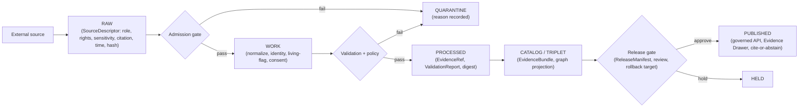

<!-- [KFM_META_BLOCK_V2]
doc_id: kfm://doc/people-dna-land/landing
title: People / Genealogy / DNA / Land Ownership — Domain Landing
type: standard
version: v1
status: draft
owners: People-DNA-Land domain steward; Rights & Sovereignty reviewer; Docs steward (placeholders — NEEDS VERIFICATION)
created: 2026-06-07
updated: 2026-06-07
policy_label: public
related: [ai-build-operating-contract.md, directory-rules.md, docs/domains/people-dna-land/README.md, docs/domains/people-dna-land/SENSITIVITY_PROFILE.md, docs/domains/people-dna-land/SOURCE_FAMILIES.md, docs/domains/people-dna-land/SOURCE_LEDGER.md, docs/domains/people-dna-land/SOURCE_REGISTRY.md, docs/domains/people-dna-land/VERIFICATION_BACKLOG.md, docs/runbooks/people-dna-land/SOURCE_REFRESH_RUNBOOK.md]
tags: [kfm, people, dna, land, genealogy, ownership, domain-landing, deny-by-default]
notes:
  - CONTRACT_VERSION = "3.0.0".
  - Filename people.md is a landing/index variant; the README-like convention is docs/domains/<domain>/README.md. If both exist, README.md should be canonical and this file an alias/index. See OQ-PDL-LAND-02.
  - Lane-slug placement docs/domains/people-dna-land/ is CONFIRMED (Directory Rules §12 names people-dna-land). Externally-presented canonical NAME is unsettled (Atlas "People / Genealogy / DNA / Land"; schema/policy use people/). See OQ-PDL-LAND-01.
  - Highest-sensitivity lane: living-person fields, raw DNA segments, private person-parcel joins default T4 (Denied).
[/KFM_META_BLOCK_V2] -->

<a id="top"></a>

# 👥 People / Genealogy / DNA / Land Ownership

> Domain landing page for the assertion-first lane that governs person evidence, genealogy relationships, restricted DNA evidence, land instruments, ownership intervals, chain-of-title reasoning, consent, and the receipts that make every claim inspectable, correctable, and reversible.

[](#status)
[](#repo-fit)
[](#7-sensitivity-and-publication-posture)
[](#9-consent-and-revocation)
[](#footer)
[](#footer)

**Status:** `draft` · **Owners:** People-DNA-Land domain steward · Rights & Sovereignty reviewer · Docs steward *(placeholders — NEEDS VERIFICATION)* · **Updated:** 2026-06-07
**Pinned:** `CONTRACT_VERSION = "3.0.0"`

> [!CAUTION]
> This is the **most rights-sensitive lane in KFM** alongside Archaeology. Living-person output, raw DNA segments/kit tokens, and private person↔parcel joins default to **T4 — Denied**. Nothing on this page authorizes publication; release is a separate governed gate. Assessor records are **not** title truth, and parcel geometry is **not** a title boundary.

---

## Contents

- [Repo fit](#repo-fit)
- [1. Identity and purpose](#1-identity-and-purpose)
- [2. Scope and non-ownership](#2-scope-and-non-ownership)
- [3. Ubiquitous language](#3-ubiquitous-language)
- [4. Object families](#4-object-families)
- [5. Source families](#5-source-families)
- [6. Pipeline shape](#6-pipeline-shape)
- [7. Sensitivity and publication posture](#7-sensitivity-and-publication-posture)
- [8. Cross-lane relations](#8-cross-lane-relations)
- [9. Consent and revocation](#9-consent-and-revocation)
- [10. Governed AI behavior](#10-governed-ai-behavior)
- [11. Viewing products](#11-viewing-products)
- [12. Dossier map](#12-dossier-map)
- [Open questions](#open-questions)
- [Related docs](#related-docs)

---

## Repo fit

**PROPOSED placement (NEEDS VERIFICATION until repo mounted).** Per Directory Rules §12, a domain is a lane segment inside responsibility roots; `docs/domains/<domain>/` is the human-facing dossier home. The slug `people-dna-land` is named explicitly in the §12 uniform pattern.

```text
docs/domains/people-dna-land/people.md   ← this file (landing/index)
docs/domains/people-dna-land/README.md   ← README-like landing (convention; see note)
```

| Responsibility root | Lane path (PROPOSED) |
|---|---|
| Object meaning | `contracts/domains/people-dna-land/` |
| Object shape | `schemas/contracts/v1/people/` *(or `…/domains/people-dna-land/` — drift, see OQ-PDL-LAND-01)* |
| Sensitivity policy | `policy/sensitivity/people/` |
| Consent policy | `policy/consent/people/` |
| Tests / fixtures | `tests/domains/people-dna-land/`, `fixtures/domains/people-dna-land/` |
| Lifecycle data | `data/<phase>/people-dna-land/`, `data/registry/sources/people-dna-land/` |
| Release | `release/candidates/people-dna-land/` |

> [!NOTE]
> **Filename convention (CONFLICTED → resolve).** KFM's README-like domain landing is conventionally `README.md`. This file is named `people.md`; if both exist, `README.md` should be canonical and `people.md` an alias or index. Tracked as `OQ-PDL-LAND-02`. The slug-vs-canonical-name drift (Atlas "People / Genealogy / DNA / Land" vs slug `people-dna-land`) is `OQ-PDL-LAND-01`. [DIRRULES §12; ATLAS §24.13]

[↑ Back to top](#top)

---

## 1. Identity and purpose

**CONFIRMED doctrine / PROPOSED implementation.** This domain governs assertion-first person evidence, genealogy relationships, restricted DNA evidence, land instruments, ownership intervals, chain-of-title reasoning, consent, policy decisions, review, correction, graph projection, `EvidenceBundle` views, and rollback. `[Atlas §16.A] [DOM-PEOPLE] [ENCY]`

"Assertion-first" is the lane's defining stance: a person, name, relationship, or ownership claim enters as an **assertion** carrying its source role, evidence, time, and release state — never as bare fact. Identity resolution and title conclusions are governed transitions, not assumptions.

[↑ Back to top](#top)

---

## 2. Scope and non-ownership

**This domain owns** (CONFIRMED/PROPOSED, Atlas §16.B): Person Assertion; Person Identity Candidate; Genealogy Relationship; FamilyGroup; LifeEvent; Residence Event; Migration Event; Land Ownership Assertion; Deed Instrument; Title Instrument; Assessor Record; TaxRecord; Parcel Version; Ownership Interval; DNA Match Evidence; Relationship Hypothesis. `[DOM-PEOPLE] [ENCY]`

**This domain does not own** (CONFIRMED/PROPOSED): Settlements, roads, archaeology, hydrology, agriculture, hazards, and spatial foundation provide context but **do not weaken** living-person, DNA, title, or parcel-boundary controls. `[DOM-PEOPLE] [ENCY]`

| Belongs here | Goes elsewhere |
|---|---|
| Person/name/relationship assertions; life/residence/migration events | County-year population aggregates → Frontier Matrix |
| Land instruments, ownership intervals, chain-of-title | Route/corridor semantics → Roads / Rail |
| DNA match evidence, relationship hypotheses, consent | Settlement legal & infrastructure status → Settlements |
| Parcel versions, legal descriptions | Cultural affiliation / Indigenous context → Archaeology (sovereignty review) |

> [!IMPORTANT]
> Context relations from other lanes never lower a sensitivity tier or override this domain's controls. Every cross-lane relation must preserve ownership, source role, sensitivity, and `EvidenceBundle` support. `[DOM-PEOPLE §F]`

[↑ Back to top](#top)

---

## 3. Ubiquitous language

**CONFIRMED terms / PROPOSED field realization** (Atlas §16.C). Each term's meaning is constrained by source role, evidence, time, and release state. `[DOM-PEOPLE] [ENCY]`

| Term | Meaning in this lane |
|---|---|
| `Person Assertion` | An asserted person claim carrying source role, evidence, time, release state. |
| `PersonCanonical` | The identity-resolved/released form of a person (INFERRED: promotion target of assertions). |
| `NameAssertion` | An asserted name, not a settled identity. |
| `LifeEvent` | A life event (birth, death, marriage, etc.) as evidence-bound assertion. |
| `RelationshipAssertion` / `Genealogy Relationship` | An asserted relationship between persons. |
| `DNA Match Evidence` | A measured DNA match; observation, not a confirmed relationship. |
| `DNAKitToken` | A reference token for a DNA kit; never public. |
| `ConsentGrant` | A machine-readable consent record bounding what may be rendered. |
| `RevocationReceipt` | Auditable record of an honored consent revocation. |
| `LandParcel` / `LegalDescription` / `LandInstrument` | Land objects; geometry ≠ title boundary; instrument carries title weight. |

[↑ Back to top](#top)

---

## 4. Object families

**CONFIRMED owned families (Atlas §16.E) / PROPOSED identity rule.** Identity rule (PROPOSED) is deterministic: source id + object role + temporal scope + normalized digest. Source, observed, valid, retrieval, release, and correction times stay distinct where material. `[DOM-PEOPLE] [ENCY]`

| Object family | Sensitivity default |
|---|---|
| Person Assertion / PersonCanonical / NameAssertion | T1 / T2; living-person fields T4; aggregate T0 |
| Genealogy Relationship / FamilyGroup / Relationship Hypothesis | T1 / T2; DNA-derived T4 |
| LifeEvent / Residence Event / Migration Event | T1 / T2; living-person fields fail closed |
| DNA Match Evidence / DNASegment / DNAKitToken | **T4** (internal; not cross-cited) |
| Land Ownership Assertion / Deed Instrument / Title Instrument | T0–T2 (title evidence) |
| Assessor Record / TaxRecord | T0–T2 (`administrative`; **never** title truth) |
| Parcel Version / Ownership Interval / LandParcel | T0 aggregate; T2/T4 private join |

[↑ Back to top](#top)

---

## 5. Source families

**CONFIRMED families (Atlas §16.D) / NEEDS VERIFICATION on rights.** Six families; rights and current terms are NEEDS VERIFICATION per source; sensitive joins fail closed. Full detail in [`SOURCE_FAMILIES.md`](./SOURCE_FAMILIES.md) and [`SOURCE_LEDGER.md`](./SOURCE_LEDGER.md). `[DOM-PEOPLE §D]`

1. Vital · cemetery · burial · obituary · church · school · military · census · directory · court · probate records
2. GEDCOM · GEDZip · family-tree overlays *(modeled / candidate; never authority)*
3. DNA vendor match CSV · segment · triangulation data *(consent-scoped; raw never public)*
4. Patent · deed · mortgage · lien · easement · lease · mineral · water · access · probate instruments
5. Assessor and tax-roll records *(administrative; never title)*
6. Plat · survey · metes-and-bounds · PLSS · subdivision · derived geometry *(geometry ≠ title boundary)*

[↑ Back to top](#top)

---

## 6. Pipeline shape

**CONFIRMED doctrine / PROPOSED lane application.** The lane follows the lifecycle invariant; promotion is a governed state transition, not a file move. `[DIRRULES] [DOM-PEOPLE §H]`



[↑ Back to top](#top)

---

## 7. Sensitivity and publication posture

**CONFIRMED invariant (Atlas §16.I).** Living-person output and DNA-derived outputs are denied or restricted by default; raw kit/vendor IDs and DNA segments are not public; assessor/tax records and parcel geometry are not title truth. Unclear rights, unresolved source role, missing evidence, unresolved sensitivity, or absent release state **blocks** public promotion. Full disposition in [`SENSITIVITY_PROFILE.md`](./SENSITIVITY_PROFILE.md). `[DOM-PEOPLE §I] [ENCY] [DIRRULES]`

| Class | Default tier | Only governed path off default |
|---|---|---|
| Living-person fields | T4 | Aggregation (tract/county) + `AggregationReceipt` → T1 |
| Raw DNA segment / kit tokens | T4 | No public tier; T3 only under named research agreement |
| Private person↔parcel join | T4 | Generalized parcel + de-identified person → T2 only |
| Historical (decedent, rights resolved) | T1 / T0 | Standard release gate |

[↑ Back to top](#top)

---

## 8. Cross-lane relations

**CONFIRMED/PROPOSED (Atlas §16.F, §24.4.14).** Every relation preserves ownership, source role, sensitivity, and `EvidenceBundle` support. `[DOM-PEOPLE §F]`

| Related lane | Relation | Constraint |
|---|---|---|
| Settlements | residence, cemetery, school, court, county, township, place | Living-person fields fail closed. |
| Roads / Rail | migration, access, movement | Never an exact route for a living person. |
| Archaeology | historic person, land, documentary, cultural-place context | Cultural affiliations under rights + sovereignty + steward review. |
| Agriculture | farm, land use, producer-adjacent context | Private person-parcel joins denied by default. |
| Frontier Matrix | aggregate population feeds matrix cells | Matrix cell ≠ per-place truth; `AggregationReceipt` enforces scope. |

[↑ Back to top](#top)

---

## 9. Consent and revocation

**CONFIRMED doctrine / PROPOSED implementation.** Consent is machine-readable and checked on every render; the policy decision point introspects the revocation endpoint and fails closed when it cannot complete. Full procedure in [`SENSITIVITY_PROFILE.md`](./SENSITIVITY_PROFILE.md) §7 and the [`SOURCE_REFRESH_RUNBOOK`](../../runbooks/people-dna-land/SOURCE_REFRESH_RUNBOOK.md). `[Pass-10 C6-07/C6-08; Pass-23 KFM-P5-PROG-0007]`

> [!IMPORTANT]
> **Consent does NOT publish data.** A consent grant constrains what a render gate may materialize; publication still requires a `ReleaseManifest` and the release gate. On revocation: signed tombstone + new `spec_hash` + `RunReceipt` + cache invalidation. `[Pass-23 KFM-P5-PROG-0005]`

[↑ Back to top](#top)

---

## 10. Governed AI behavior

**CONFIRMED doctrine / PROPOSED implementation (Atlas §16.L).** AI may summarize **released** People/DNA/Land `EvidenceBundle`s, compare evidence, explain limitations, and draft steward-review notes. AI **must ABSTAIN** when evidence is insufficient and **must DENY** where policy, rights, sensitivity, or release state blocks the request. AI never reads RAW or WORK content and is never the root truth source. Finite outcomes: `ANSWER / ABSTAIN / DENY / ERROR`. `[GAI] [DOM-PEOPLE §L]`

[↑ Back to top](#top)

---

## 11. Viewing products

**PROPOSED (Atlas §16.G).** Domain viewing products: historical person profile maps; residence/event timelines; migration paths with uncertainty; land parcel context with warnings; chain-of-title summaries; instrument timeline views; restricted DNA/consent review; living-person review. Cross-cutting (CONFIRMED): Evidence Drawer, time-aware state, trust badges, sensitivity-redacted view, correction/stale-state view, governed Focus Mode. `[DOM-PEOPLE §G] [MAP-MASTER] [GAI]`

[↑ Back to top](#top)

---

## 12. Dossier map

The People/DNA/Land dossier under `docs/domains/people-dna-land/` (all PROPOSED; presence NEEDS VERIFICATION):

| Doc | Role |
|---|---|
| `README.md` / `people.md` (this) | Domain landing and orientation |
| [`SENSITIVITY_PROFILE.md`](./SENSITIVITY_PROFILE.md) | Tier disposition, transitions, receipts, revocation |
| [`SOURCE_FAMILIES.md`](./SOURCE_FAMILIES.md) | Family → source-role taxonomy |
| [`SOURCE_LEDGER.md`](./SOURCE_LEDGER.md) | Instance-level "what each source cannot prove" |
| [`SOURCE_REGISTRY.md`](./SOURCE_REGISTRY.md) | Admission / authority-control surface |
| [`VERIFICATION_BACKLOG.md`](./VERIFICATION_BACKLOG.md) | Claimed-but-unproven items |
| `SOURCE_REFRESH_RUNBOOK.md` | Refresh operations *(homed under `docs/runbooks/people-dna-land/` per §6.1.b)* |
| `ARCHITECTURE.md` · `PRESERVATION_MATRIX.md` | Bounded context · preservation *(PROPOSED)* |

[↑ Back to top](#top)

---

## Open questions

| ID | Question | Owner role | Resolution path |
|---|---|---|---|
| OQ-PDL-LAND-01 | Canonical lane name: slug `people-dna-land` (CONFIRMED placement) vs Atlas "People / Genealogy / DNA / Land" (schema/policy use `people/`)? | Docs + domain steward | ADR + Atlas §24.13 |
| OQ-PDL-LAND-02 | Is the landing page `README.md` or `people.md`? If both, which is canonical? | Docs steward | Repo convention check + ADR if needed |
| OQ-PDL-LAND-03 | Schema segment `people/` vs `domains/people-dna-land/`? | Architecture steward | ADR-0001-adjacent ADR |

## Related docs

- [`SENSITIVITY_PROFILE.md`](./SENSITIVITY_PROFILE.md) · [`SOURCE_FAMILIES.md`](./SOURCE_FAMILIES.md) · [`SOURCE_LEDGER.md`](./SOURCE_LEDGER.md) · [`SOURCE_REGISTRY.md`](./SOURCE_REGISTRY.md) · [`VERIFICATION_BACKLOG.md`](./VERIFICATION_BACKLOG.md)
- `docs/runbooks/people-dna-land/SOURCE_REFRESH_RUNBOOK.md` — refresh operations *(PROPOSED)*
- `ai-build-operating-contract.md` — operating contract (`CONTRACT_VERSION = "3.0.0"`)
- `directory-rules.md` — §12 Domain Placement Law
- Atlas v1.1 §16 (People / Genealogy / DNA / Land Ownership), §24.13 (responsibility-root crosswalk)

---

<sub>Last updated 2026-06-07 · Pinned `CONTRACT_VERSION = "3.0.0"` · Status: draft · [↑ Back to top](#top)</sub>
