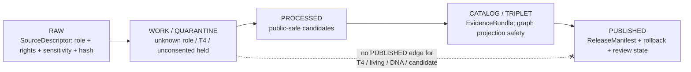

<!-- [KFM_META_BLOCK_V2]
doc_id: kfm://doc/people-dna-land-sublanes-index-readme
title: People / DNA / Land — Sublanes Index
type: standard
version: v1
status: draft
owners: <People/DNA/Land domain steward — PLACEHOLDER>, <Source steward — PLACEHOLDER>, <Sensitivity reviewer — PLACEHOLDER>, <Rights-holder representative — PLACEHOLDER>
created: 2026-06-06
updated: 2026-06-06
policy_label: restricted
related: [ai-build-operating-contract.md, directory-rules.md, docs/domains/people-dna-land/README.md, docs/domains/people-dna-land/sublanes/people/README.md, docs/domains/people-dna-land/sublanes/dna/README.md, docs/domains/people-dna-land/sublanes/land/README.md, policy/sensitivity/people/, policy/consent/people/]
tags: [kfm, people, dna, land, genealogy, sublanes, sensitive]
notes: [CONTRACT_VERSION = "3.0.0"; sources Atlas v1.1 ch.16 scope + object spine + §24.5 tiers; domain slug "people-dna-land" CONFIRMED by Directory Rules §12; the sublanes/ subfolder convention is NOT in §12 and is PROPOSED pending ADR (OQ-PEOPLE-SUB-01)]
[/KFM_META_BLOCK_V2] -->

<a id="top"></a>

# 🧭 People / DNA / Land — Sublanes Index

> Index for the documentation sub-slices of the People / DNA / Land domain — **people**, **dna**, and **land** — and the single place where the `sublanes/` convention itself is explained and gated.


**Status:** `draft` · **Owners:** `<Domain steward>` · `<Source steward>` · `<Sensitivity reviewer>` · `<Rights-holder rep>` *(all PLACEHOLDER)* · **Updated:** 2026-06-06
**`CONTRACT_VERSION = "3.0.0"`** — governed by [`ai-build-operating-contract.md`](../../../../ai-build-operating-contract.md) and [`directory-rules.md`](../../../../directory-rules.md).

> [!IMPORTANT]
> **This whole directory is PROPOSED.** Directory Rules §12 (Domain Placement Law) defines a
> domain as lane segments inside responsibility roots; it does **not** define a `sublanes/`
> layer *within* a domain. This index is authored at the requested path, but the `sublanes/`
> convention requires an ADR before it is treated as canonical. It is the same class of open
> question as the runbook-subfolder one (§18 OPEN-DR-02). See
> [Open questions](#open-questions-register). `[DIRRULES §12]`

> [!CAUTION]
> **The entire People / DNA / Land domain fails closed.** Living-person and DNA-derived
> outputs are denied or restricted by default; raw kit/vendor IDs and DNA segments are never
> public; assessor and tax records and parcel geometry are not title truth. Unclear rights,
> unresolved source role, missing evidence, unresolved sensitivity, or absent release state
> **blocks public promotion**. `[DOM-PEOPLE] [ENCY] [DIRRULES]` — *CONFIRMED.*

---

## Quick jump

- [1. Purpose](#1-purpose)
- [2. Repo fit and the sublane question](#2-repo-fit-and-the-sublane-question)
- [3. The three sublanes](#3-the-three-sublanes)
- [4. What this index is not](#4-what-this-index-is-not)
- [5. Shared posture across sublanes](#5-shared-posture-across-sublanes)
- [Open questions register](#open-questions-register)
- [Open verification backlog](#open-verification-backlog)
- [Changelog](#changelog-v0--v1)
- [Definition of done](#definition-of-done)
- [Related docs](#related-docs)

---

## 1. Purpose

This README indexes the documentation sub-slices of the People / DNA / Land domain. The
parent domain governs assertion-first person evidence, genealogy relationships, restricted
DNA evidence, land instruments, ownership intervals, chain-of-title reasoning, consent,
policy decisions, review, correction, graph projection, EvidenceBundle views, and rollback.
`[DOM-PEOPLE] [ENCY]` — *CONFIRMED domain identity.*

Those responsibilities split naturally into three slices — **people**, **dna**, **land** —
which mirror the domain's own name and its explicit sensitivity boundaries. This file is the
shared entry point and the gate for the `sublanes/` convention itself.

[Back to top](#top)

## 2. Repo fit and the sublane question

> [!NOTE]
> **Domain slug — CONFIRMED.** Directory Rules §12 names `people-dna-land` explicitly in the
> uniform list of domain slugs. `[DIRRULES §12]`
>
> **Sublane subfolder — PROPOSED / CONFLICTED.** §12 does not define a `sublanes/` layer.
> Until an ADR ratifies it, the `sublanes/` tree is **documentation-organizational only** and
> MUST NOT become a parallel authority home. Schema, policy, contract, registry, and
> lifecycle homes continue to live in their responsibility-root lanes keyed to the *whole*
> domain (`schemas/contracts/v1/domains/people-dna-land/`, `policy/domains/people-dna-land/`,
> `data/processed/people-dna-land/`, etc.). `[DIRRULES §3, §12, §2.4(5)]`

```text
docs/
└── domains/
    └── people-dna-land/                  # CONFIRMED slug (§12)
        ├── README.md                      # domain lane landing (PROPOSED present)
        └── sublanes/                       # PROPOSED layer — NOT in §12, pending ADR
            ├── README.md                    # ← this file (sublanes index)
            ├── people/
            │   └── README.md                # person / genealogy slice
            ├── dna/
            │   └── README.md                # restricted DNA slice
            └── land/
                └── README.md                # land instruments / title / parcel slice

# Authority homes stay keyed to the WHOLE domain, never to a sublane:
schemas/contracts/v1/domains/people-dna-land/   # §12 lane
policy/domains/people-dna-land/                  # §12 lane
policy/sensitivity/people/  ·  policy/consent/people/   # §24.13 deny-default + consent lanes
data/processed/people-dna-land/                  # §12 lifecycle lane
```

```mermaid
flowchart TD
  DOM["docs/domains/people-dna-land/README.md<br/>(domain lane landing — CONFIRMED §12)"]
  DOM --> IDX["sublanes/README.md ← this index<br/>(PROPOSED layer, pending ADR)"]
  IDX --> P["people/<br/>person · genealogy"]
  IDX --> D["dna/<br/>restricted DNA"]
  IDX --> L["land/<br/>title · parcel · instruments"]
  P -. "authority homes stay at" .-> LANE["…/domains/people-dna-land/ lanes (§12)"]
  D -. .-> LANE
  L -. .-> LANE
```

> [!WARNING]
> The tree and diagram show **proposed** structure, not verified repo state. Every path is
> PROPOSED until checked against a mounted repo. `[DIRRULES §12]`

[Back to top](#top)

## 3. The three sublanes

Each sublane carries a slice of the domain's owned object families. Ownership is from the
Atlas v1.1 ch.16 scope statement. `[DOM-PEOPLE] [ENCY]` — *CONFIRMED scope.*

| Sublane | Slice of the domain | Owned object families (from ch.16 scope) | Default sensitivity |
|---|---|---|---|
| [`people/`](people/README.md) | Person evidence and genealogy | Person Assertion, Person Identity Candidate, PersonCanonical, NameAssertion, LifeEvent, Residence Event, Migration Event, Genealogy Relationship, FamilyGroup, RelationshipAssertion, Relationship Hypothesis | living-person fields **T4** |
| [`dna/`](dna/README.md) | Restricted DNA evidence and consent | DNA Match Evidence, DNASegment, DNAKitToken, ConsentGrant, RevocationReceipt | raw DNA segments **T4** (no public-tier transform) |
| [`land/`](land/README.md) | Land instruments, ownership, parcels | Land Ownership Assertion, Deed Instrument, Title Instrument, Assessor Record, TaxRecord, Parcel Version, Ownership Interval, LandParcel, LegalDescription, LandInstrument | private person-parcel join **T4** |

> [!NOTE]
> The split is doctrine-aligned but the *folder names* `people` / `dna` / `land` are PROPOSED
> alongside the `sublanes/` convention itself (OQ-PEOPLE-SUB-02). `[DIRRULES §12]`

[Back to top](#top)

## 4. What this index is not

| Not here | Lives instead in |
|---|---|
| Object-family **meaning** | `contracts/domains/people-dna-land/` |
| Field-level **schema shape** | `schemas/contracts/v1/domains/people-dna-land/` |
| Admit / deny / redact **decisions** | `policy/sensitivity/people/`, `policy/consent/people/` |
| The machine-readable **source registry** | `data/registry/...` |
| Released claims / **evidence** | `EvidenceBundle` via the governed API |
| County-year panels, land-office records | Frontier Matrix domain (does **not** own living-person/DNA/title/parcel) |

[Back to top](#top)

## 5. Shared posture across sublanes

These rules apply uniformly to all three sublanes; individual sublane READMEs do not relax them.

- **Lifecycle invariant.** `RAW → WORK / QUARANTINE → PROCESSED → CATALOG / TRIPLET → PUBLISHED`; promotion is a governed state transition. `[DIRRULES] [DOM-PEOPLE] [ENCY]` — *CONFIRMED.*
- **Source role fixed at admission.** Never upgraded by promotion. `[ENCY] [DIRRULES]` — *CONFIRMED.*
- **Deny-by-default sensitivity.** Living-person, raw DNA segments, and private person-parcel joins default to **T4** (§24.5). `[DOM-PEOPLE]`
- **Consent and revocation.** DNA admission requires consent; revocation triggers cleanup and returns objects toward T4 with a `CorrectionNotice`. `[DOM-PEOPLE]`
- **Not title truth.** Assessor and tax records are administrative, not title; chain-of-title requires instrument logic. `[DOM-PEOPLE]`
- **No side-channel leaks.** Inference via popup text, AI prose, or map labels is in scope for denial. `[DOM-PEOPLE] [ENCY]`



[Back to top](#top)

---

## Open questions register

| ID | Question | Owner role | Resolution path |
|---|---|---|---|
| OQ-PEOPLE-SUB-01 | Is a `sublanes/<x>/` layer inside a domain canonical, or should sublanes be expressed differently (per-object docs, or no subdivision)? | Docs steward | **ADR** (class: §2.4(5); precedent OPEN-DR-02) + DRIFT_REGISTER entry |
| OQ-PEOPLE-SUB-02 | If `sublanes/` is adopted, are the canonical names `people` / `dna` / `land`? | Domain steward | Same ADR as OQ-PEOPLE-SUB-01 |
| OQ-PEOPLE-SUB-03 | Do schema/policy/contract/registry lanes ever subdivide by sublane, or stay keyed to the whole domain? | Domain steward | ADR; default per §12 is whole-domain lanes |
| OQ-PEOPLE-SUB-06 | Should this index live at `sublanes/README.md`, or should the parent domain README simply link the three sublanes directly (making this file redundant)? | Docs steward | Same ADR as OQ-PEOPLE-SUB-01 |

## Open verification backlog

These items remain `NEEDS VERIFICATION` before promotion from `draft` to `published`:

1. ADR ratification (or rejection) of the `sublanes/` convention; final placement of this index.
2. Whether the three sublane folders and their READMEs exist in the mounted repo.
3. Whether responsibility-root lanes ever subdivide by sublane.
4. Living-person, DNA consent/revocation, and land-instrument-chain enforcement.
5. UI / API restricted-field no-leak behavior across all three sublanes.

## Changelog v0 → v1

| Change | Type (per contract §37) | Reason |
|---|---|---|
| Initial sublanes index README | new | No prior sublanes index located in project evidence |
| Three-way split (people / dna / land) mapped to ch.16 owned object families | gap closure | Make the sub-slice structure discoverable from one entry point |
| Surfaced `sublanes/` convention as PROPOSED / not-in-§12 | reconciliation | §12 does not define sublanes; must not be smoothed into canon |
| Pinned shared deny-default posture across all three sublanes | reconciliation | Prevent a sublane README from appearing to relax domain controls |

> **Backward compatibility.** New doc; no prior anchors to preserve. `#top` and section
> anchors are stable from v1 onward. If OQ-PEOPLE-SUB-01/06 reject `sublanes/` or this index,
> the file moves or merges under a migration note rather than silently.

## Definition of done

This document is done enough to enter the repository when:

- the `sublanes/` convention (OQ-PEOPLE-SUB-01/02/06) is resolved by ADR or logged as drift;
- it is placed according to Directory Rules and creates no parallel authority home;
- a docs steward, domain steward, sensitivity reviewer, and rights-holder rep review it;
- it is linked from the People/DNA/Land domain lane README, and links the three sublanes;
- it does not conflict with accepted ADRs (notably ADR-S-05 and the sublane ADR);
- any conflict with current repo conventions is logged in `docs/registers/DRIFT_REGISTER.md`;
- the `GENERATED_RECEIPT.json` planned in Section 2 is wired into CI;
- future changes follow the operating contract's §37 lifecycle.

---

## Related docs

- [`ai-build-operating-contract.md`](../../../../ai-build-operating-contract.md) — operating law (`CONTRACT_VERSION = "3.0.0"`)
- [`directory-rules.md`](../../../../directory-rules.md) — placement authority (§3, §12, §2.4, §18 OPEN-DR-02)
- `docs/domains/people-dna-land/README.md` — parent domain lane landing *(TODO — verify path)*
- [`people/README.md`](people/README.md) — person / genealogy sublane *(PROPOSED)*
- [`dna/README.md`](dna/README.md) — restricted DNA sublane *(PROPOSED)*
- [`land/README.md`](land/README.md) — land / title / parcel sublane *(PROPOSED)*
- `policy/sensitivity/people/` · `policy/consent/people/` — deny-default + consent lanes *(PROPOSED)*
- Atlas v1.1 ch.16 — People/Genealogy/DNA/Land dossier *(reference view, not authority)*

---

*Last updated: 2026-06-06 · `CONTRACT_VERSION = "3.0.0"` · policy_label: restricted · [Back to top](#top)*
