<!-- [KFM_META_BLOCK_V2]
doc_id: kfm://doc/people-dna-land/sublanes/dna
title: People/DNA/Land — DNA Sublane
type: standard
version: v1
status: draft
owners: <people-dna-land domain steward — TODO>, <source steward — TODO>, <sensitivity reviewer — TODO>, <rights-holder representative — TODO>
created: 2026-05-18
updated: 2026-06-06
policy_label: restricted
related:
  # NEEDS VERIFICATION — every path below is PROPOSED until checked against a mounted repo
  - docs/domains/people-dna-land/README.md                  # parent domain lane landing
  - docs/domains/people-dna-land/sublanes/README.md         # sublanes index (PROPOSED layer)
  - docs/domains/people-dna-land/sublanes/people/README.md  # PROPOSED sibling sublane
  - docs/domains/people-dna-land/sublanes/land/README.md    # PROPOSED sibling sublane
  - directory-rules.md                                       # placement authority (repo root)
  - ai-build-operating-contract.md                           # operating law (CONTRACT_VERSION 3.0.0)
  - docs/standards/PROV.md
  - docs/standards/ISO-19115.md
  - docs/policy/living_persons_geoprivacy.md                 # PROPOSED, cited C6-06
  - docs/standards/DP_BUDGETS.md                             # PROPOSED, cited C6-05
  - docs/standards/CONSENT_TOKENS.md                         # PROPOSED, cited C6-07
tags: [kfm, domain, people-dna-land, dna, genomics, sensitivity, consent, policy]
notes:
  # CONTRACT_VERSION = "3.0.0"
  # Sensitivity default restricted; living-person + DNA-derived outputs deny-by-default.
  # sublanes/ is a PROPOSED organizational convention; NOT in Directory Rules §12; NEEDS ADR (OQ-PEOPLE-SUB-01).
  # Sibling sublanes are people / dna / land (3-way split per prior sublanes index); a separate genealogy sublane is NOT adopted.
[/KFM_META_BLOCK_V2] -->

# 🧬 People / DNA / Land — DNA Sublane

> Governance, sensitivity, consent, and publication posture for DNA, genomic, and DNA-derived assertions within the **People / DNA / Land** domain. DNA evidence is **restricted by default**; only consent-bound, redacted, or aggregated derivatives may cross the publication boundary.


**Status:** draft · **Owners:** _People/DNA/Land stewards_ — `TODO` · **Last updated:** 2026-06-06
**`CONTRACT_VERSION = "3.0.0"`** — governed by [`ai-build-operating-contract.md`](../../../../../ai-build-operating-contract.md) and [`directory-rules.md`](../../../../../directory-rules.md).

> [!IMPORTANT]
> **Default posture: DENY.** Living-person and DNA-derived outputs are denied or restricted by default. Raw kit/vendor identifiers and raw genotype data **never** cross the publication boundary; only consent-scoped, redacted, or differentially-private aggregates may be released, and every release is reversible through revocation, embargo, and tombstone. [CONFIRMED — DOM-PEOPLE §I; ENCY; Pass 10 C6 / C9-03]

---

## 📑 Contents

- [1. Scope](#1-scope)
- [2. Boundary and non-ownership](#2-boundary-and-non-ownership)
- [3. Ubiquitous language](#3-ubiquitous-language)
- [4. Source families and source roles](#4-source-families-and-source-roles)
- [5. Object families](#5-object-families)
- [6. Sensitivity, rights, and publication posture](#6-sensitivity-rights-and-publication-posture)
- [7. Consent and access-control architecture](#7-consent-and-access-control-architecture)
- [8. Redaction profiles and geoprivacy](#8-redaction-profiles-and-geoprivacy)
- [9. Pipeline shape — RAW → PUBLISHED](#9-pipeline-shape--raw--published)
- [10. API, contract, and schema surfaces](#10-api-contract-and-schema-surfaces)
- [11. Validators, tests, and fixtures](#11-validators-tests-and-fixtures)
- [12. Governed AI behavior](#12-governed-ai-behavior)
- [13. Publication, correction, and rollback](#13-publication-correction-and-rollback)
- [14. Cross-sublane and cross-lane relations](#14-cross-sublane-and-cross-lane-relations)
- [15. Open questions and verification backlog](#15-open-questions-and-verification-backlog)
- [16. Related docs](#16-related-docs)

---

## 1. Scope

The **DNA sublane** governs the admission, normalization, evidence binding, consent scoping, sensitivity treatment, and release posture of:

- DNA match evidence from direct-to-consumer (DTC) vendor exports.
- DNA segment data and triangulation derivatives.
- Relationship hypotheses derived in part or whole from DNA evidence.
- Aggregate or anonymized DNA-derived statistics (ancestry composition vectors, relatedness coefficients, IBD segment counts) intended for release.

It is the most-restricted sublane within People / DNA / Land. Every other sublane in this domain may **cite** DNA-derived evidence, but only via the governed surfaces this sublane defines; no other sublane may bypass DNA consent, redaction, or release controls. [CONFIRMED — DOM-PEOPLE; ENCY; Pass 10 C9-03]

> [!NOTE]
> **The `sublanes/` convention is PROPOSED, not canonical.** The parent `docs/domains/people-dna-land/` lane is sanctioned by Directory Rules §12 (and `people-dna-land` is an explicit §12 slug). But §12 does **not** define a `sublanes/<x>/` subdivision *within* a domain. The placement `docs/domains/people-dna-land/sublanes/dna/` is therefore **PROPOSED**, tracked as **OQ-PEOPLE-SUB-01** and the same class of open question as the runbook-subfolder one (Directory Rules §18 OPEN-DR-02). It needs ADR ratification before it is treated as canonical. [DIRRULES §12, §2.4(5)]

[⬆ Back to top](#-contents)

---

## 2. Boundary and non-ownership

| Owned by this sublane (CONFIRMED doctrine / PROPOSED implementation) | Explicitly **not** owned (kept in adjacent sublanes or domains) |
|---|---|
| `DNAMatchEvidence` and `DNASegment` admission, normalization, and EvidenceBundle binding. | Person identity resolution at the canonical level — that's the **people** sublane. |
| Consent receipts and consent tokens for DNA evidence. | Genealogy relationship publishing — handled in the **people** sublane's genealogy object families; DNA is one of several evidence kinds those relationships may cite. |
| DNA-derived aggregate and k-anonymized derivatives. | Land ownership, deeds, parcels — the **land** sublane. |
| Sensitivity policy profiles for DNA outputs. | Cross-domain consent infrastructure — shared governance kernel (CONFIRMED doctrine; PROPOSED implementation home). |
| Revocation propagation for DNA-derived published artifacts. | Audit ledger primitives — cross-cutting policy/proof layer. |

**Hard non-ownership** [CONFIRMED — DOM-PEOPLE §B; Pass 10 C9-03]:

- This sublane is **not** an authority over living-person status; living-person screening is a domain-wide gate, not a DNA-only concern.
- This sublane is **not** a relationship adjudicator. DNA evidence may **support** a `RelationshipHypothesis`; it never **becomes** a confirmed canonical relationship without separate review.
- This sublane is **not** a vendor-account proxy. KFM does not republish vendor-side identifiers.

> [!NOTE]
> **Sibling sublanes are `people` / `dna` / `land` (a three-way split).** A separate
> `genealogy` sublane is **not** adopted here; genealogy relationships live with the person
> object families in the `people` sublane. This reconciles an earlier draft that listed a
> fourth `genealogy` sibling. The split itself is PROPOSED alongside `sublanes/`
> (OQ-PEOPLE-SUB-02). [DIRRULES §12]

[⬆ Back to top](#-contents)

---

## 3. Ubiquitous language

KFM-specific casing and compound terms are preserved. External-standard terms are marked `EXTERNAL` and used only as conformance references.

| Term | Definition | Status | Citation |
|---|---|---|---|
| **DNA Match Evidence** (`DNAMatchEvidence`) | A discrete piece of vendor- or analyst-derived match evidence (shared cM, predicted relationship band, segment count, source kit IDs). | CONFIRMED term, PROPOSED field realization | DOM-PEOPLE §C; Atlas Ch. 16 §E |
| **DNASegment** | A reported IBD/HBD segment (chromosome, start, end, cM, possibly haplotype). | CONFIRMED term, PROPOSED field realization | Atlas Ch. 16 §E |
| **DNAKitToken** | Domain term for a tokenized reference to a DNA kit; carries no public-facing vendor identifier. | CONFIRMED term, PROPOSED field realization | DOM-PEOPLE §C; Atlas Ch. 16 §C |
| **RelationshipHypothesis** | An assertion about how two persons may be related, with cited evidence and confidence. **Never** equated to a canonical genealogy relationship. | CONFIRMED doctrine | DOM-PEOPLE §B; KFM-IDX-POL-003 |
| **ConsentGrant** | Domain term for the consent under which evidence is admitted; the machine-readable record below realizes it. | CONFIRMED term, PROPOSED field realization | DOM-PEOPLE §C |
| **RevocationReceipt** | Domain term for the signed record of a consent revocation event. | CONFIRMED term, PROPOSED field realization | DOM-PEOPLE §C |
| **ConsentReceipt** | A machine-readable record of the consent under which DNA evidence was admitted, including purposes, scope, retention, revocation reference, and signature envelope linkage. | PROPOSED | Pass 10 C6-07 / C9-04 |
| **Consent Token** | A short-lived signed token (JWT or GA4GH-style visa) carrying scopes, expiry, revocation endpoint, consent history hash, and a redaction-profile reference. | CONFIRMED doctrine — EXTERNAL framework | Pass 10 C6-07; GA4GH AAI / Passports |
| **DUO Code** | A Data Use Ontology code expressing data-use category (research-only, no-commercial, IRB-required, etc.). | EXTERNAL (GA4GH) | Pass 10 C9-04 |
| **Redaction Profile** | A named, versioned set of transforms (`density_k_anonymity_grid`, `radius_mask`, `seeded_jitter`, DP aggregator) applied before any DNA-derived layer is rendered. | CONFIRMED doctrine | Pass 10 C6-02, C6-04, C6-06 |
| **Tombstone** | A signed record that supersedes a revoked artifact and triggers cache invalidation across published surfaces. | CONFIRMED doctrine | Pass 10 C5-09, C6-08 |
| **Embargo** | A wall-clock gate (`embargo_until`) checked at every render; if `now < embargo_until`, the PDP denies regardless of other approvals. | CONFIRMED doctrine | Pass 10 C6-08 |
| **PDP** | Policy Decision Point — the governed gate that evaluates consent, embargo, k-anonymity, scope, and revocation state at access time. | CONFIRMED doctrine | Pass 10 C6-06 / C6-07 |

> [!NOTE]
> KFM's own domain terms (`DNAMatchEvidence`, `DNASegment`, `DNAKitToken`, `ConsentGrant`,
> `RevocationReceipt`) are the canonical vocabulary. `ConsentReceipt`, `Consent Token`,
> `DUO Code`, and `ConsentVC` are the machine-readable / EXTERNAL realizations that
> *implement* those domain terms — they do not replace them. [DOM-PEOPLE §C; Pass 10 C6/C9]

[⬆ Back to top](#-contents)

---

## 4. Source families and source roles

KFM **source roles** are set at admission and preserved through every promotion; a source role is never inferred from convenience, and promotion does not upgrade an observation to a regulation or a candidate to a verified record. [CONFIRMED — Atlas §24.1; ENCY; DIRRULES]

| Source family | Typical example | Source role(s) | Sensitivity default | Rights / consent | Status |
|---|---|---|---|---|---|
| **DTC raw genotype exports** | 23andMe, AncestryDNA, MyHeritage tab-delimited rsID files. | observed (user-controlled input) | **highest-restricted** — rubric 4–5 | per-user consent required; vendor ToS NEEDS VERIFICATION per-bulk-ingest | CONFIRMED policy — Pass 10 C9-03 |
| **DTC match CSV / segment exports** | Vendor "DNA Matches" or "Chromosome Browser" exports. | observed | highest-restricted | per-user consent required | CONFIRMED policy — Pass 10 C9-03 |
| **FamilySearch DNA-linked records** | OAuth2-scoped FamilySearch responses that reference DNA. | authority for tree data; observed for DNA links | restricted | OAuth2 grant scope + GA4GH Passport at fetch | CONFIRMED — Pass 10 C9-02 |
| **GEDCOM / GEDZip overlays** with DNA notes | User-supplied GEDCOM with embedded DNA references. | modeled / candidate (until reviewed) | restricted | rights NEEDS VERIFICATION; living-flag gate | CONFIRMED — DOM-PEOPLE; Pass 10 C9-01 |
| **Analyst-derived triangulation outputs** | Cluster reports from third-party tools. | candidate | highest-restricted | derived-consent chain required | PROPOSED |
| **Aggregated public statistics** | County-level ancestry composition cell. | aggregate | restricted until DP/k checks pass | aggregation receipt required | CONFIRMED doctrine — Pass 10 C6-05, C6-06 |

> [!NOTE]
> Source-role labels above use the canonical seven-role vocabulary (`observed`, `regulatory`,
> `modeled`, `aggregate`, `administrative`, `candidate`, `synthetic`) from the Atlas §24.1
> anti-collapse register, rather than ad-hoc synonyms. [Atlas §24.1; ADR-S-04 pending]

> [!WARNING]
> **Vendor solvency is a consent-relevant variable.** The 23andMe Chapter 11 filing (March 2025) sharpened the project's position that DTC raw files cannot be treated as static inputs; the retention/embargo posture must respond to vendor distress. [CONFIRMED — Pass 10 C9-03 / C9-07]

[⬆ Back to top](#-contents)

---

## 5. Object families

| Object | Purpose | Identity rule | Temporal handling | Sensitivity default |
|---|---|---|---|---|
| `Person Assertion` (referenced from people sublane) | Person an evidence row is about. | PROPOSED: source id + object role + temporal scope + normalized digest. | source / observed / valid / retrieval / release / correction kept distinct. | restricted if living |
| `DNAMatchEvidence` | Vendor-reported match between two kit holders. | PROPOSED deterministic basis. | observed time + retrieval time mandatory. | **highest-restricted** |
| `DNASegment` | A reported IBD/HBD segment. | PROPOSED deterministic basis. | observed time + retrieval time mandatory. | **highest-restricted** |
| `RelationshipHypothesis` | Hypothesis with cited evidence and confidence. | PROPOSED deterministic basis. | hypothesis-formed time + supersession allowed. | restricted by default |
| `ConsentReceipt` | Machine-readable consent under which evidence was admitted. | PROPOSED: holder pseudonym + purpose hash + issuance time. | issued / expires / revoked. | always restricted; never embedded in published payloads |
| `ConsentVC` (holder-controlled) | W3C-style Verifiable Credential form of a ConsentReceipt. | PROPOSED. | issuance / expiry. | holder presents; verifier checks signature + status list. |
| `RunReceipt` | Attested promotion step (RAW → … → PUBLISHED). | CONFIRMED doctrine — cross-cutting. | attested at step boundary. | n/a (governance artifact) |
| `OverlayPointer` | Public-safe opaque pointer that dereferences server-side under policy. | PROPOSED: nonce + scope + expiry. | short-lived. | public-safe (PII excluded by construction) |
| `Tombstone` | Supersession record for revoked DNA-derived artifacts. | CONFIRMED doctrine — cross-cutting. | event time + reason. | n/a |

Sources: Atlas Ch. 16 §E; Pass 10 C5-09 / C6-07 / C6-08. The illustrative `ConsentReceipt`, `ConsentVC`, `OverlayPointer` shapes are PROPOSED.

[⬆ Back to top](#-contents)

---

## 6. Sensitivity, rights, and publication posture

> [!IMPORTANT]
> **Five rules govern every DNA-derived output:**
>
> 1. **Default DENY** for living-person and DNA-derived identity or relationship outputs without authorized evidence, consent, and review state. [CONFIRMED — KFM-IDX-POL-003; DOM-PEOPLE §I]
> 2. **Raw genotype data is never republished.** Only aggregate or k-anonymized derived data crosses the publication boundary. [CONFIRMED — Pass 10 C9-03]
> 3. **Raw kit/vendor IDs and DNA segments are not public.** Exports must not embed personal identifiers in tiles, layers, or stories. [CONFIRMED — DOM-PEOPLE §I]
> 4. **A DNA match is evidence, not a relationship.** A `RelationshipHypothesis` remains a hypothesis; source-role collapse (treating one role as another) is forbidden across the people lane and applies with full force to DNA. [CONFIRMED — DOM-PEOPLE; Atlas §24.1]
> 5. **Unclear rights, unresolved source role, missing evidence, unresolved sensitivity, or absent release state blocks public promotion.** [CONFIRMED — ENCY; DIRRULES]

### 6.1 Sensitivity rubric placement

KFM's sensitivity rubric (C6-01) spans 0–5: 0 public/open … 5 sacred/critical (fail-closed). DNA artifacts cluster at the top of the rubric. [CONFIRMED — Pass 10 C6-01]

| Artifact class | Rubric tier (PROPOSED defaults) | Permitted release form |
|---|---|---|
| Raw DTC genotype file | **5 — highest-restricted** | Never republished. Encrypted storage with strict access scoping only. |
| Vendor match CSV (kit-level) | **5** | Never republished. |
| DNA segment table (kit-level) | **5** | Never republished. |
| Relatedness coefficient (pairwise, living) | **4** | Restricted; consent + DUO scope + steward review. |
| Ancestry composition vector (per-person, living) | **4** | Restricted; consent + redaction profile + steward review. |
| County-level ancestry aggregate | **2** (restricted-public) | DP-noised, k-anonymity satisfied, aggregation receipt published. |
| Hypothesis citation (deceased subject only) | **1–2** | Released with EvidenceBundle and source-role tags. |

> [!NOTE]
> The C6-01 rubric (0–5) and the Atlas §24.5 tier scheme (T0–T4) are two scales in the
> corpus. This sublane uses the **C6-01 0–5 rubric** because the DNA/consent doctrine
> (C6/C9) is expressed in those terms; the mapping between the 0–5 rubric and the T0–T4
> tier scheme is an open reconciliation (ADR-S-05). [Pass 10 C6-01; Atlas §24.5; ADR-S-05 pending]

[⬆ Back to top](#-contents)

---

## 7. Consent and access-control architecture

DNA evidence is admitted **only** with explicit consent expressed as a machine-readable artifact and is **renderable** only when the consent state is verifiable at access time.

### 7.1 Consent artifacts

```text
ConsentReceipt (internal)
  receipt_id, subject_pseudonym, controller, purposes[], scope,
  retention, sharing_rules, issued_at, expires_at?, revocation_status_ref,
  spec_hash, signature_envelope_ref

ConsentVC (holder-controlled)
  W3C Verifiable Credential form of the above; holder presents; verifier
  checks signature + status list.

Consent Token (transport)
  JWT or GA4GH-style visa carrying:
    scopes, audience, expiry, revocation_endpoint,
    consent_history_hash, redaction_profile, jti
```

Sources: Pass 10 C6-07 (token shape); Pass 10 C9-04 (GA4GH AAI / Passports / DUO). [CONFIRMED doctrine; PROPOSED schema homes — `schemas/governance/consent_receipt.schema.json` and `schemas/governance/overlay_pointer.schema.json` are PROPOSED and NEED VERIFICATION against Directory Rules; canonical schema home is `schemas/contracts/v1/...` per ADR-0001, so a `schemas/governance/` home is itself an open placement question.]

### 7.2 External alignment

| Framework | Role here | Status |
|---|---|---|
| **GA4GH AAI / Passports / DUO / MRCG** | Canonical access-control and consent vocabulary for any record involving human-subject data. | EXTERNAL — adopted; CONFIRMED in Pass 10 C9-04 |
| **OAuth 2.0 Token Introspection (RFC 7662)** | Shape of consent-token introspection at PDP. | EXTERNAL — cited in Pass 10 C6-07 / C9-05 |
| **W3C Verifiable Credentials** | Holder-controlled consent presentation. | EXTERNAL — cited in Pass 10 C6-07 |
| **NIST SP 800-226 (Differential Privacy)** | Procedural framework for DP parameter selection, budget documentation, and DP-release reporting. | EXTERNAL — Pass 10 C9-05 |
| **EDPB Guidelines 01/2025 (Pseudonymisation)** | Pseudonymisation posture and re-identification-key handling. | EXTERNAL — Pass 10 C9-05 |

> [!NOTE]
> A normalization layer that translates non-GA4GH consent (e.g., free-text consent in an oral-history release) into DUO codes is **PROPOSED** future work. [Pass 10 C9-04]

### 7.3 PDP gate (conceptual)

```text
ALLOW iff
  jwt.valid
  AND embargo_until <= now
  AND revocation_status(consent_token) == "unrevoked"
  AND scopes_match(request, consent_token)
  AND (k_anonymity_satisfied(request) OR fallback_mask_applied(request))
  AND release_state(artifact) == "PUBLISHED"
  AND policy_decision(artifact, request) == "ANSWER"
ELSE
  DENY (fail-closed; reason recorded in audit ledger)
```

Source: Pass 10 C6-06 / C6-07 / C6-08. [CONFIRMED doctrine — PROPOSED enforcement code path; route names and OPA bundle locations NEEDS VERIFICATION against the repo. The corpus is explicit that the PDP **fails closed when introspection cannot be completed.**]

[⬆ Back to top](#-contents)

---

## 8. Redaction profiles and geoprivacy

DNA-derived **layers** and **aggregates** are subject to deterministic, reproducible, policy-driven redaction. Redaction profiles are named, versioned, and recorded in receipts. [CONFIRMED — Pass 10 C6-02..C6-06]

| Profile | Applies to | Default parameters (PROPOSED) | Source |
|---|---|---|---|
| `density_k_anonymity_grid` | Living-person overlay where DNA-derived residence/cluster cell is plotted. | `k=10`, `cell_m=500`; fallback `radius_mask` at `250 m`. | Pass 10 C6-06 |
| `differential_privacy_aggregate` | County- or HUC-scale ancestry / relatedness counts. | epsilon TBD per-dataset; recorded in DP budget receipt. **Raw points are never DP-noised.** | Pass 10 C6-05; NIST SP 800-226 (EXTERNAL) |
| `seeded_jitter` | Public-safe single-point displays (only for non-living, non-DNA-sensitive contexts). | Per-record seed; deterministic and reproducible per receipt. **Not a substitute for k-anonymity on living-person data.** | Pass 10 C6-03 |
| `grid_generalization` | Coordinate snap to H3 hex or PostGIS square grid. | Cell size by sensitivity tier; PROPOSED defaults. | Pass 10 C6-04 |
| `centroid_plus_coarse_time` | Heatmap / time-aware density. | Cell + time-bin per profile. | Pass 10 C6-02 |

> [!WARNING]
> **k-anonymity does not protect against linkage attacks across multiple datasets.** It must be combined with consent enforcement, scope checks, and access control. [CONFIRMED — Pass 10 C6-06]

[⬆ Back to top](#-contents)

---

## 9. Pipeline shape — RAW → PUBLISHED

The DNA sublane follows the KFM lifecycle: `RAW → WORK / QUARANTINE → PROCESSED → CATALOG / TRIPLET → PUBLISHED`. Promotion is a **governed state transition**, not a file move. [CONFIRMED — DIRRULES; DOM-PEOPLE §H; ENCY]

```mermaid
flowchart LR
  A["RAW<br/>encrypted ingest<br/>DTC export, FamilySearch payload,<br/>GEDCOM with DNA notes"]
  B["WORK / QUARANTINE<br/>normalize, classify sensitivity,<br/>create ConsentReceipt(s),<br/>hold failures"]
  C["PROCESSED<br/>link to EvidenceBundles,<br/>attach signed RunReceipts,<br/>derive aggregates under DP / k"]
  D["CATALOG / TRIPLET<br/>register public-safe descriptors,<br/>store OverlayPointers (no PII),<br/>build release candidates"]
  E["PUBLISHED<br/>governed API enforces<br/>consent scope + revocation<br/>at every dereference"]

  A -->|"Gate A: SourceDescriptor + consent admission"| B
  B -->|"Gate B: validation + policy gate + EvidenceRef closure"| C
  C -->|"Gate C: catalog / proof closure + DP / k checks"| D
  D -->|"Gate D: ReleaseManifest + review state"| E
  E -.->|"revocation"| F["Tombstone +<br/>cache invalidation<br/>PMTiles bump, tile purge"]

  classDef raw fill:#fee,stroke:#b00,stroke-width:2px,color:#000
  classDef work fill:#ffe,stroke:#a80,color:#000
  classDef proc fill:#eff,stroke:#077,color:#000
  classDef cat fill:#efe,stroke:#070,color:#000
  classDef pub fill:#eef,stroke:#33b,color:#000
  classDef rev fill:#eee,stroke:#666,color:#000
  class A raw
  class B work
  class C proc
  class D cat
  class E pub
  class F rev
```



| Stage | Handling | Gate | Status |
|---|---|---|---|
| **RAW** | Capture vendor export, FamilySearch payload, or GEDCOM with DNA notes. Record source role, rights, consent reference, sensitivity, citation, time, and hash. | `SourceDescriptor` exists; consent admitted; encrypted storage; access-scoped. | PROPOSED |
| **WORK / QUARANTINE** | Normalize schema, identity, evidence, rights, and policy. Living-flag screening. Failures held with reason. | Validation + policy gate pass, or quarantine reason recorded. | PROPOSED |
| **PROCESSED** | Emit validated normalized objects; attach `RunReceipt`; derive aggregates only under DP/k. | `EvidenceRef`, `ValidationReport`, digest closure exist. | PROPOSED |
| **CATALOG / TRIPLET** | Emit catalog records, `EvidenceBundle`s, graph/triplet projections (with safety tests), `OverlayPointer`s only. | Catalog/proof closure passes; graph projection safety tests pass. | PROPOSED |
| **PUBLISHED** | Serve released public-safe artifacts via governed APIs and manifests. Revocation introspected on every render. | `ReleaseManifest`, correction path, rollback target, review/policy state exist. | PROPOSED |

Sources: Atlas Ch. 16 §H; UNIFIED (Domain Lanes); Pass 10 C6 / C9 (consent-first flow).

[⬆ Back to top](#-contents)

---

## 10. API, contract, and schema surfaces

> [!CAUTION]
> Every path, route, and schema URI below is **PROPOSED**. None have been verified against a mounted repo. Directory Rules ADRs and the schema-home decision (ADR-0001 per `directory-rules.md`) govern final placement.

| Surface | DTO / schema (PROPOSED) | Finite outcomes | Status |
|---|---|---|---|
| DNA feature/detail resolver | `PeopleDNALandDecisionEnvelope` (DNA projection) | ANSWER / ABSTAIN / DENY / ERROR | PROPOSED |
| DNA-aware Evidence Drawer payload | `EvidenceDrawerPayload + EvidenceBundle` (DNA projection) | ANSWER / ABSTAIN / DENY / ERROR | PROPOSED — evidence + policy filtered |
| DNA aggregate layer manifest | `LayerManifest` carrying redaction profile, DP epsilon, k threshold | ANSWER / DENY / ERROR | PROPOSED — public-safe release only |
| Consent receipt admission | `ConsentReceipt` JSON Schema | ANSWER / DENY / ERROR | PROPOSED |
| Consent revocation submit | Revocation endpoint per dataset class | ANSWER / ERROR | PROPOSED |
| Focus Mode answer (DNA queries) | `RuntimeResponseEnvelope + AIReceipt` | ANSWER / ABSTAIN / DENY / ERROR | PROPOSED — AI never root truth |

> [!NOTE]
> Finite outcomes use the contract's canonical set `ANSWER / ABSTAIN / DENY / ERROR`
> (the earlier `ACCEPTED` label has been normalized to `ANSWER`). [Operating contract §1; Atlas §24.2]

**PROPOSED file homes** (subject to Directory Rules and a follow-up ADR; verify against the mounted repo). Note these follow the **whole-domain** lane form per §12 — they do **not** subdivide by sublane:

```text
docs/domains/people-dna-land/sublanes/dna/README.md       (this file — PROPOSED placement, sublanes/ pending ADR)
schemas/contracts/v1/domains/people-dna-land/             (PROPOSED — §12 lane; canonical schema root per ADR-0001)
schemas/contracts/v1/source/source-descriptor.json        (PROPOSED — source role field home)
policy/domains/people-dna-land/                           (PROPOSED — §12 lane form)
policy/sensitivity/people/                                (PROPOSED — Atlas §24.13 crosswalk form)
policy/consent/people/                                    (PROPOSED — Atlas §24.13 crosswalk form)
tests/domains/people-dna-land/dna/                        (PROPOSED)
fixtures/domains/people-dna-land/dna/                     (PROPOSED — synthetic only)
data/raw/people-dna-land/                                 (PROPOSED — encrypted-only)
data/work/people-dna-land/                                (PROPOSED — encrypted-only)
data/quarantine/people-dna-land/                          (PROPOSED — encrypted-only)
data/processed/people-dna-land/                           (PROPOSED — derivatives only)
data/catalog/domain/people-dna-land/                      (PROPOSED)
data/published/layers/people-dna-land/                    (PROPOSED — public-safe aggregates only)
data/registry/sources/people-dna-land/                    (PROPOSED — source ledger, §12)
```

> [!IMPORTANT]
> **CONFLICTED — consent/sensitivity policy home.** The Atlas §24.13 crosswalk places these at
> `policy/sensitivity/people/` and `policy/consent/people/` (a `people` segment). Directory
> Rules §12 expresses every domain artifact in the lane form `policy/domains/<domain>/...`
> with the full `people-dna-land` slug. Both forms are PROPOSED and they diverge. Log to
> `docs/registers/DRIFT_REGISTER.md` and resolve by ADR; do not create both as parallel
> homes. [Atlas §24.13; DIRRULES §12; OQ-PEOPLE-DNA-11]

> [!NOTE]
> `directory-rules.md` §12 fixes the lane pattern: a domain MUST NOT become a root folder, and per-domain artifacts live under their respective responsibility roots (`docs/`, `schemas/`, `policy/`, `tests/`, etc.) with a domain segment. The DNA sublane respects this — `sublanes/` is a documentation-only organizational layer and adds **no** new authority home; schemas, policy, and lifecycle data stay keyed to the whole domain. The **canonical** path for domain schemas is `schemas/contracts/v1/...` per ADR-0001.

[⬆ Back to top](#-contents)

---

## 11. Validators, tests, and fixtures

The corpus enumerates PROPOSED tests for People/DNA/Land. The DNA sublane carries these specifically: [PROPOSED — DOM-PEOPLE §K; ENCY; Pass 10 C6 / C9]

- [ ] **DNA consent and raw-ID no-log tests** — assert no kit/vendor identifiers appear in any logged or exported artifact.
- [ ] **Revocation cleanup tests** — confirm tombstone emission, cache invalidation, and downstream layer refresh on consent revocation.
- [ ] **Graph projection safety tests** — confirm no DNA-derived edge crosses the publication boundary without redaction-profile evidence.
- [ ] **Consent-receipt schema validity** — `schemas/...consent_receipt.schema.json` validates required fields (purpose, retention, revocation reference, signature).
- [ ] **DP budget receipts** — every published aggregate carries epsilon and DP-release rationale traceable to NIST SP 800-226 (EXTERNAL).
- [ ] **k-anonymity render-time check** — overlays with `k < threshold` fall back to radius mask; decision recorded in PDP audit.
- [ ] **No-network fixtures** — fixture-first, hermetic test of the RAW → PROCESSED slice using synthetic DTC-shaped data.
- [ ] **Living-person screening** — GEDCOM import test enforces living-flag gate.
- [ ] **Vendor-loss simulation** — tabletop drill keyed to the 23andMe Chapter 11 scenario (Pass 10 C9-07).

Fixtures must be **synthetic** by construction — no real DTC files in fixture trees, even encrypted. [INFERRED from DOM-PEOPLE non-ownership of vendor data and the corpus fail-closed posture; NEEDS VERIFICATION against repo policy.]

[⬆ Back to top](#-contents)

---

## 12. Governed AI behavior

[CONFIRMED doctrine; PROPOSED implementation — DOM-PEOPLE §L; GAI; ENCY]

| AI behavior | Rule |
|---|---|
| **Permitted** | Summarize **released** DNA-derived `EvidenceBundle`s; compare two evidence rows; explain limitations of DTC match data; draft steward-review notes. |
| **Required abstention** | ABSTAIN when `EvidenceBundle` is missing, citations cannot be validated, source roles conflict, temporal scope is insufficient, or the user asks for unsupported inference. |
| **Required denial** | DENY direct access to RAW/WORK/QUARANTINE DNA artifacts; DENY identity or relationship inference about a living person from DNA without authorized evidence and access; DENY exact-residence exposure; DENY emergency or medical interpretation. |
| **Receipt** | Emit `AIReceipt` and `RuntimeResponseEnvelope` with outcome `ANSWER / ABSTAIN / DENY / ERROR`, `evidence_refs`, `policy_decision`, and `citation_validation`. |
| **Root-truth rule** | AI is interpretive. `EvidenceBundle` outranks generated language. AI **never** becomes the publication authority for DNA-derived claims. |

> [!IMPORTANT]
> A first AI fixture for this sublane should demonstrate `ABSTAIN` or `DENY` when a Focus Mode prompt asks for living-person DNA-derived identity or relationship assertions without authorized evidence and access. [PROPOSED — KFM-IDX-POL-003]

[⬆ Back to top](#-contents)

---

## 13. Publication, correction, and rollback

[CONFIRMED doctrine; PROPOSED implementation — ENCY Appendix E; Atlas Ch. 16 §M]

Every release of a DNA-derived artifact requires:

1. `ReleaseManifest` with explicit DNA-sensitivity declaration.
2. `EvidenceBundle` closure.
3. Validation report + policy decision (`ANSWER` at publication scope).
4. Review state where steward review is required (default for DNA-derived layers).
5. Correction path (`CorrectionNotice` channel open).
6. Stale-state rule (embargo + freshness policy).
7. Rollback target (`RollbackCard`) and revocation propagation plan.

**Revocation contract:** every published DNA-derived item exposes a `revocation_endpoint`, an `embargo_until` field, and cache invalidation hooks (PMTiles index bump, tile server purge). On revocation: issue a signed tombstone, append a new `spec_hash` and `RunReceipt` to the ledger, and trigger invalidation webhooks. **A revocation that does not invalidate caches is incomplete.** [CONFIRMED — Pass 10 C6-08]

> [!CAUTION]
> Tombstones provide explainability and supersession, **not erasure**. Where a
> right-to-be-forgotten or Tribal-data obligation requires true deletion of personal data,
> tombstoning alone is insufficient; the boundary between tombstone and physical erasure is
> an open question (Pass 10 C5-09 / C9-02) and must be settled before relying on revocation
> for compliance. [CONFIRMED tension — Pass 10 C5-09]

<details>
<summary>📋 Revocation runbook (PROPOSED — to be authored as a runbook)</summary>

1. Holder, steward, or PDP detects revocation trigger (explicit revoke, vendor-distress flag, embargo expiry change).
2. PDP marks consent token revoked; introspection-cache TTL bounds propagation.
3. Tombstone emitted; audit ledger appended with `RunReceipt` and `spec_hash`.
4. Downstream consumers receive invalidation webhook.
5. PMTiles/tile cache index bumped; CDN purge issued.
6. `LayerManifest` re-emitted with new state; `EvidenceBundle` flagged superseded.
7. AI surfaces receive new policy bundle pin; fluent generation cannot resurrect the artifact.
8. Steward review records the revocation reason and replacement pointer.
9. **Verify**: revocation drill end-to-end before relying on the pathway. [CONFIRMED rule — Pass 10 C6-08]

Status: PROPOSED runbook outline. Full procedure should land at `docs/runbooks/people-dna-land/revocation.md` (PROPOSED path; subfolder convention per Directory Rules §18 OPEN-DR-02 is itself unresolved; NEEDS VERIFICATION).

</details>

[⬆ Back to top](#-contents)

---

## 14. Cross-sublane and cross-lane relations

| This sublane | Related sublane / lane | Relation type | Constraint |
|---|---|---|---|
| DNA | **people** sublane (this domain) | DNA evidence may support a `Person Assertion` confidence band — never a canonical identity match alone. | Source role and EvidenceBundle preserved; living-person gate applies. |
| DNA | **people** sublane — genealogy object families | DNA evidence may support a `RelationshipHypothesis` — never auto-canonicalize a relationship. | Hypothesis remains hypothesis until separate review state. |
| DNA | **land** sublane (this domain) | Indirect only: DNA-supported person assertions may resolve a deed party — never a parcel-boundary claim. | Assessor/tax records are not title truth; DNA does not weaken that rule. |
| DNA | **Archaeology / Cultural Heritage** | Cultural sensitivity / ancestral remains contexts may invoke DENY by default; steward + sovereignty review required. | Sovereignty review path applies. [CONFIRMED — Atlas Ch. 15] |
| DNA | **Settlements / Infrastructure** | Residence / cemetery context only; never a vector for living-person disclosure. | Public-safe geometry transforms apply. |
| DNA | **Spatial Foundation** | DNA-derived overlays consume governed geometry layers downstream. | Public-safe geometry only; CRS metadata mandatory. |

Sources: Atlas Ch. 16 §F; KFM-IDX-POL-003; DOM-PEOPLE.

[⬆ Back to top](#-contents)

---

## 15. Open questions and verification backlog

| ID | Item | Evidence that would settle it | Status |
|---|---|---|---|
| OQ-PEOPLE-SUB-01 | Confirm `sublanes/` is a sanctioned subdivision under `docs/domains/<domain>/` (vs. flat docs per domain). | ADR or repo evidence; current `docs/domains/` tree. | **NEEDS VERIFICATION** |
| OQ-PEOPLE-DNA-02 | Confirm canonical path for DNA-specific schemas (whole-domain lane vs. any sublane segment). | Mounted repo + ADR-0001 application. | **NEEDS VERIFICATION** |
| OQ-PEOPLE-DNA-03 | Default epsilon values for DNA-derived DP releases. | `docs/standards/DP_BUDGETS.md` (PROPOSED — Pass 10 C6-05). | **UNKNOWN** |
| OQ-PEOPLE-DNA-04 | Default `k` for living-people overlays (county vs. rural calibration). | Pilot per Pass 10 C6-06; calibration record. | **UNKNOWN** |
| OQ-PEOPLE-DNA-05 | Retention period for raw DTC files (solvent-vendor vs. distressed-vendor cases). | Per-vendor retention policy; vendor-loss-simulation drill. | **UNKNOWN — Pass 10 C9-03 open** |
| OQ-PEOPLE-DNA-06 | Cache TTL for revocation-introspection results. | Pass 10 C6-07 / C6-08 open question. | **UNKNOWN** |
| OQ-PEOPLE-DNA-07 | DUO compatibility profile and policy-bundle version pin. | `docs/standards/DUO_PROFILE.md` (PROPOSED). | **NEEDS VERIFICATION** |
| OQ-PEOPLE-DNA-08 | FamilySearch retention policy on consent revocation (tombstone-only vs. physical purge). | Authored retention doc + alignment with GA4GH semantics. | **UNKNOWN — Pass 10 C9-02 open** |
| OQ-PEOPLE-DNA-09 | Existence and contents of consent-receipt and overlay-pointer schemas, and whether `schemas/governance/` or `schemas/contracts/v1/...` is the home. | Mounted repo inspection; ADR-0001. | **UNKNOWN** |
| OQ-PEOPLE-DNA-10 | Existence of OPA bundle for living-person geoprivacy. | Mounted repo inspection; CI policy parity. | **UNKNOWN** |
| OQ-PEOPLE-DNA-11 | Whether `policy/consent/people/` (Atlas §24.13) or `policy/domains/people-dna-land/consent/` (DIRRULES §12) is the canonical home. | Mounted repo + ADR. | **CONFLICTED — Atlas §24.13 vs DIRRULES §12** |
| OQ-PEOPLE-DNA-12 | Reconciliation of the C6-01 (0–5) sensitivity rubric with the Atlas §24.5 (T0–T4) tier scheme. | ADR-S-05. | **NEEDS VERIFICATION** |

[⬆ Back to top](#-contents)

---

## 16. Related docs

- [`docs/domains/people-dna-land/README.md`](../../README.md) — parent domain lane landing *(NEEDS VERIFICATION)*
- [`docs/domains/people-dna-land/sublanes/README.md`](../README.md) — sublanes index *(PROPOSED layer)*
- [`docs/domains/people-dna-land/sublanes/people/README.md`](../people/README.md) — PROPOSED sibling sublane
- [`docs/domains/people-dna-land/sublanes/land/README.md`](../land/README.md) — PROPOSED sibling sublane
- [`directory-rules.md`](../../../../../directory-rules.md) — directory placement law (§3, §12, §2.4, §18 OPEN-DR-02)
- [`ai-build-operating-contract.md`](../../../../../ai-build-operating-contract.md) — operating law (`CONTRACT_VERSION = "3.0.0"`)
- [`docs/standards/PROV.md`](../../../../standards/PROV.md) — provenance crosswalk
- [`docs/standards/ISO-19115.md`](../../../../standards/ISO-19115.md) — metadata crosswalk
- [`docs/standards/CONSENT_TOKENS.md`](../../../../standards/CONSENT_TOKENS.md) — PROPOSED consent-token standard profile
- [`docs/standards/DP_BUDGETS.md`](../../../../standards/DP_BUDGETS.md) — PROPOSED DP budgets profile
- [`docs/standards/DUO_PROFILE.md`](../../../../standards/DUO_PROFILE.md) — PROPOSED GA4GH DUO profile
- [`docs/policy/living_persons_geoprivacy.md`](../../../../policy/living_persons_geoprivacy.md) — PROPOSED policy doc
- [`docs/runbooks/people-dna-land/revocation.md`](../../../../runbooks/people-dna-land/revocation.md) — PROPOSED runbook
- `docs/adr/ADR-0001-schema-home.md` — canonical schema home *(TODO — verify path)*

> [!TIP]
> When adding a new DNA-derived layer, work this doc top-to-bottom as a checklist: scope → consent → redaction profile → pipeline gate → release manifest → revocation runbook. If any item is `TODO`, the artifact does not promote.

---

**Last updated:** 2026-06-06 · **Doc id:** `kfm://doc/people-dna-land/sublanes/dna` · **Status:** draft · `CONTRACT_VERSION = "3.0.0"`

[⬆ Back to top](#-contents)
