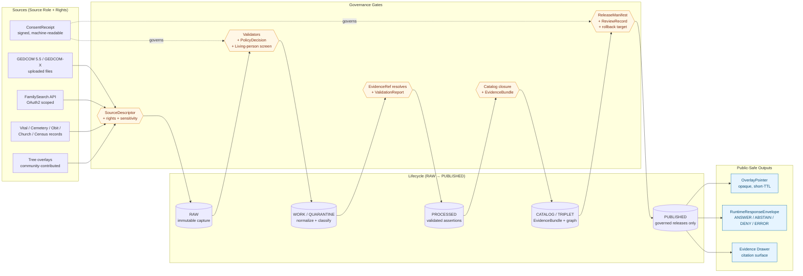

<!-- [KFM_META_BLOCK_V2]
doc_id: kfm://doc/people-dna-land/sublanes/genealogy
title: Genealogy Sublane — People / Genealogy / DNA / Land Ownership
type: standard
version: v1
status: draft
owners: <People-DNA-Land domain stewards — NEEDS VERIFICATION>
created: 2026-05-18
updated: 2026-05-18
policy_label: public
related:
  - docs/domains/people-dna-land/README.md
  - docs/domains/people-dna-land/sublanes/people.md
  - docs/domains/people-dna-land/sublanes/dna.md
  - docs/domains/people-dna-land/sublanes/land.md
  - docs/doctrine/directory-rules.md
  - docs/doctrine/trust-membrane.md
  - docs/doctrine/lifecycle-law.md
  - docs/architecture/contract-schema-policy-split.md
tags: [kfm, genealogy, people-dna-land, sublane, governance, FAIR-CARE]
notes:
  - "Sublane folder convention (docs/domains/<domain>/sublanes/) is PROPOSED; not yet ratified by ADR."
  - "All implementation paths in this doc are PROPOSED until verified against mounted repo evidence."
[/KFM_META_BLOCK_V2] -->

# Genealogy Sublane — People / Genealogy / DNA / Land Ownership

> **Assertion-first, evidence-bound, privacy-aware genealogical claims** — the sublane that turns GEDCOMs, vital records, and family trees into governed, public-safe history without becoming unsourced folklore.

[](#status)
[](../README.md)
[](#policy-and-sensitivity-posture)
[](#pipeline-shape-raw--published)
[](#fair--care-posture)
[](#truth-labels-used-here)

| Field            | Value                                                          |
| ---------------- | -------------------------------------------------------------- |
| **Status**       | Draft                                                          |
| **Owners**       | People-DNA-Land domain stewards · *NEEDS VERIFICATION*         |
| **Last updated** | 2026-05-18                                                     |
| **Parent**       | [`docs/domains/people-dna-land/README.md`](../README.md)       |
| **Sibling sublanes** | [`people.md`](./people.md) · [`dna.md`](./dna.md) · [`land.md`](./land.md) — *paths PROPOSED* |

---

## Quick jump

- [1. Scope and one-line purpose](#1-scope-and-one-line-purpose)
- [2. Repo fit](#2-repo-fit)
- [3. Inputs the sublane accepts](#3-inputs-the-sublane-accepts)
- [4. Exclusions and explicit non-ownership](#4-exclusions-and-explicit-non-ownership)
- [5. Sublane architecture (diagram)](#5-sublane-architecture-diagram)
- [6. Ubiquitous language](#6-ubiquitous-language)
- [7. Object families owned here](#7-object-families-owned-here)
- [8. Source families and source roles](#8-source-families-and-source-roles)
- [9. Pipeline shape (RAW → PUBLISHED)](#9-pipeline-shape-raw--published)
- [10. Policy and sensitivity posture](#10-policy-and-sensitivity-posture)
- [11. Publication: overlay pointers, not PII](#11-publication-overlay-pointers-not-pii)
- [12. Cross-lane and cross-sublane handoffs](#12-cross-lane-and-cross-sublane-handoffs)
- [13. Governed AI behavior in this sublane](#13-governed-ai-behavior-in-this-sublane)
- [14. Validators, fixtures, and CI gates](#14-validators-fixtures-and-ci-gates)
- [15. FAIR + CARE posture](#15-fair--care-posture)
- [16. Open questions and verification backlog](#16-open-questions-and-verification-backlog)
- [17. Related docs](#17-related-docs)
- [Truth labels used here](#truth-labels-used-here)

---

## 1. Scope and one-line purpose

**One-line purpose.** The Genealogy sublane governs assertion-first lineage evidence — GEDCOMs, family trees, vital records, and relationship hypotheses — under KFM's evidence-bound, privacy-aware, default-deny doctrine for living persons. *(CONFIRMED doctrine / PROPOSED implementation.)*

The Genealogy sublane is the **kinship and life-event slice** of the broader People / Genealogy / DNA / Land Ownership domain. It is the place where unsourced family-tree folklore meets KFM's trust membrane: every relationship is an assertion with evidence and confidence, never a sovereign fact; every published view is a derivative of governed claims, never the canonical store.

> [!IMPORTANT]
> Genealogy outputs that involve **living persons** or **DNA-derived inference** are denied or restricted by default. Historical research is supported where evidence, rights, and release controls allow it; living-person and DNA-derived outputs require explicit, scoped, revocable consent.

## 2. Repo fit

| Aspect            | Value                                                                                       |
| ----------------- | ------------------------------------------------------------------------------------------- |
| **This path**     | `docs/domains/people-dna-land/sublanes/genealogy.md` — *PROPOSED (see open question OQ-1)*  |
| **Authority root**| `docs/` — human-facing control plane (Directory Rules §6.1) — *CONFIRMED*                   |
| **Parent README** | [`../README.md`](../README.md) — the People / Genealogy / DNA / Land Ownership landing doc |
| **Upstream doctrine** | Atlas v1.1 Ch. 16; Encyclopedia §7.14; Directory Rules §12 (Domain Placement Law)       |
| **Downstream artifacts** | `contracts/domains/people-dna-land/genealogy/…` · `schemas/contracts/v1/domains/people-dna-land/genealogy/…` · `policy/domains/people-dna-land/genealogy/…` · `tests/domains/people-dna-land/genealogy/…` · `fixtures/domains/people-dna-land/genealogy/…` — *all PROPOSED* |

> [!NOTE]
> **Path PROPOSED.** Directory Rules §6.1 and §12 confirm `docs/domains/people-dna-land/` as the canonical home for this domain. The `sublanes/` subfolder is **not yet documented** in Directory Rules. This doc treats the location as PROPOSED and flags it in [§16 OQ-1](#16-open-questions-and-verification-backlog); an ADR is recommended to ratify the sublane-folder convention before broader rollout.

## 3. Inputs the sublane accepts

| Input family                                                                  | Source role                                  | Status        | Citation              |
| ----------------------------------------------------------------------------- | -------------------------------------------- | ------------- | --------------------- |
| GEDCOM 5.5 and GEDCOM-X files (uploaded `.ged`/`.gedz`/JSON-XML)              | authority / observation                      | CONFIRMED     | [DOM-PEOPLE] [ENCY] [Pass-10 C9-01] |
| FamilySearch API responses (OAuth2-scoped)                                    | observation                                  | CONFIRMED     | [Pass-10 C9-02]       |
| Vital records (birth, marriage, death) where public/legal                     | authority / observation                      | CONFIRMED     | [DOM-PEOPLE] [ENCY]   |
| Cemetery, burial, obituary, church, school, military, census, directory, court, probate records | authority / observation / context | CONFIRMED | [DOM-PEOPLE] [ENCY] |
| Tree overlays from genealogy clients and crowd platforms                      | observation / model (hypothesis)             | CONFIRMED     | [DOM-PEOPLE] [ENCY]   |
| Consent receipts (machine-readable, signed)                                   | governance artifact                          | PROPOSED      | [New-Ideas 5-8-26]    |

> [!CAUTION]
> **GEDCOM is treated as RAW only.** Never publish GEDCOM directly, never map GEDCOM identifiers directly, never expose GEDCOM identifiers in public surfaces. The lifecycle is `GEDCOM → RAW → Evidence Extraction → Governed Claims → EvidenceBundle → Policy Review → OverlayPointer → Published Runtime Envelope`. *(CONFIRMED doctrine / PROPOSED implementation. [New-Ideas 5-8-26])*

## 4. Exclusions and explicit non-ownership

Genealogy is one of four sublanes inside People / Genealogy / DNA / Land Ownership. The following are explicitly **out of scope** for this sublane and live elsewhere:

| Excluded                                              | Belongs in                                                            |
| ----------------------------------------------------- | --------------------------------------------------------------------- |
| DNA match evidence, DNA segments, DTC raw genotypes   | [`sublanes/dna.md`](./dna.md) — *PROPOSED*                            |
| Land ownership assertions, deeds, titles, parcel-version, chain-of-title | [`sublanes/land.md`](./land.md) — *PROPOSED*       |
| Canonical person records (`PersonCanonical`) and identity resolution across all sublanes | [`sublanes/people.md`](./people.md) — *PROPOSED* |
| Settlements, cemeteries as places, schools as places, court venues       | `docs/domains/settlements-infrastructure/` *(CONFIRMED parent)*    |
| Indigenous community context, cultural sovereignty review                | `docs/domains/archaeology/` *(CONFIRMED parent)*                    |
| Spatial foundation, base layers, hydrology context                       | `docs/domains/spatial-foundation/` (and sibling natural-system domains) |

This sublane consumes context from those neighbors via governed cross-lane edges — it does not redefine them.

## 5. Sublane architecture (diagram)

The diagram below shows how genealogical inputs traverse the trust membrane to become public-safe overlays. The shape is **CONFIRMED doctrine** (lifecycle invariant + trust membrane); specific arrows representing implementation are **PROPOSED**.



> [!NOTE]
> Public clients never read RAW, WORK, or QUARANTINE directly — that bypasses the trust membrane (Directory Rules §7.1, lifecycle law). All public reads flow through the governed API and resolve `EvidenceRef → EvidenceBundle` at dereference time. *(CONFIRMED doctrine.)*

[↑ Back to top](#genealogy-sublane--people--genealogy--dna--land-ownership)

## 6. Ubiquitous language

KFM-specific terms used in this sublane. Definitions are **CONFIRMED as terms**; field-level realization is **PROPOSED** pending schema home.

| Term                       | Definition (constrained by source role, evidence, time, release state) | Status |
| -------------------------- | ---------------------------------------------------------------------- | ------ |
| **PersonAssertion**        | A claim that a person existed with given attributes, bound to its source role and evidence — never sovereign truth. | CONFIRMED term / PROPOSED field |
| **PersonCanonical**        | The deterministically-identified canonical person reference, derived from one or more assertions after identity resolution. | CONFIRMED term / PROPOSED field |
| **NameAssertion**          | A claim that a person bore a name in a given context — multiple NameAssertions per person are expected (E82 Actor Appellation analog). | CONFIRMED term / PROPOSED field |
| **LifeEvent**              | An event in a person's life (birth, marriage, death, residence-start, etc.) carrying valid time, source time, and evidence. | CONFIRMED term / PROPOSED field |
| **GenealogyRelationship** (a.k.a. **RelationshipAssertion**) | An evidence-bound, confidence-scored claim of kinship between persons. Hypothesis until corroborated. | CONFIRMED term / PROPOSED field |
| **FamilyGroup**            | A bounded set of related persons, often nuclear, used for navigation and disambiguation. | CONFIRMED term / PROPOSED field |
| **RelationshipHypothesis** | A scored, evidence-weighted candidate relationship pending steward or evidence-closure decision. | CONFIRMED term / PROPOSED field |
| **PersonIdentityCandidate**| A pre-resolution candidate suggesting two PersonAssertions may refer to the same canonical person. | CONFIRMED term / PROPOSED field |
| **ConsentGrant**           | A scoped, revocable, time-bounded authorization for processing or publication of person-linked data. | CONFIRMED term / PROPOSED field |
| **RevocationReceipt**      | The signed record of consent withdrawal, triggering downstream embargo and tombstone propagation. | CONFIRMED term / PROPOSED field |

> [!TIP]
> The terms above are the **interior** vocabulary. The exterior vocabulary (CIDOC-CRM `E21 Person`, `E5 Event`, `E13 Attribute Assignment`, PROV-O `Activity / Entity / Agent`, Schema.org `Person`) is used in graph projections and web surfaces, with `sameAs` linkage to authority IRIs (Wikidata, LCNAF, VIAF, ISNI). *(CONFIRMED. [Pass-10 C8, C7])*

## 7. Object families owned here

Object families this sublane is responsible for, with identity and temporal handling.

| Object                       | Purpose                                                                                                                   | Identity rule (**PROPOSED**)                                          | Temporal handling (**CONFIRMED**)                                                                              |
| ---------------------------- | ------------------------------------------------------------------------------------------------------------------------- | --------------------------------------------------------------------- | -------------------------------------------------------------------------------------------------------------- |
| `PersonAssertion`            | Per-source claim that a person existed; evidence and confidence required.                                                  | source_id + object role + temporal scope + normalized digest          | source, observed, valid, retrieval, release, and correction times stay distinct where material                 |
| `NameAssertion`              | A name borne by a person in a given context; multiple per person.                                                          | source_id + object role + temporal scope + normalized digest          | same                                                                                                           |
| `LifeEvent`                  | Birth, marriage, death, baptism, naturalization, etc.                                                                      | source_id + object role + temporal scope + normalized digest          | same                                                                                                           |
| `ResidenceEvent`             | Person-at-place over an interval; bridges to settlements via residence relation.                                           | source_id + object role + temporal scope + normalized digest          | same                                                                                                           |
| `MigrationEvent`             | Person-between-places event chain; carries uncertainty.                                                                    | source_id + object role + temporal scope + normalized digest          | same                                                                                                           |
| `GenealogyRelationship`      | Evidence-bound, scored relationship claim.                                                                                 | source_id + object role + temporal scope + normalized digest          | same                                                                                                           |
| `FamilyGroup`                | Bounded set of related persons.                                                                                            | source_id + object role + temporal scope + normalized digest          | same                                                                                                           |
| `RelationshipHypothesis`     | Pre-decision scored candidate relationship.                                                                                | source_id + object role + temporal scope + normalized digest          | same                                                                                                           |
| `PersonIdentityCandidate`    | Pre-resolution merge candidate across PersonAssertions.                                                                    | source_id + object role + temporal scope + normalized digest          | same                                                                                                           |

*(Object purposes and lifecycle handling: [DOM-PEOPLE] [ENCY], Atlas v1.1 §16 E.)*

> [!NOTE]
> Identity rules above are **PROPOSED** until ratified by ADR. The temporal-distinction rule — source / observed / valid / retrieval / release / correction times treated separately — is **CONFIRMED doctrine** and applies uniformly across object families.

## 8. Source families and source roles

| Source family                                                                                                       | Source role(s)                            | Rights / sensitivity                                                          | Freshness               | Status                  |
| ------------------------------------------------------------------------------------------------------------------- | ----------------------------------------- | ----------------------------------------------------------------------------- | ----------------------- | ----------------------- |
| Vital / cemetery / burial / obituary / church / school / military / census / directory / court / probate records   | authority / observation / context / model | rights & current terms **NEEDS VERIFICATION**; sensitive joins fail closed    | source-vintage specific | [DOM-PEOPLE] [ENCY]     |
| GEDCOM / GEDZip / tree overlays                                                                                     | authority / observation / context / model | rights & current terms **NEEDS VERIFICATION**; sensitive joins fail closed    | source-vintage specific | [DOM-PEOPLE] [ENCY]     |
| FamilySearch API responses                                                                                          | observation                                | OAuth2-scoped consent; user-revocable                                          | live / cadence-bound    | [Pass-10 C9-02] CONFIRMED upstream / PROPOSED integration |
| DNA vendor match data (DTC genomic exports, segment, triangulation)                                                 | observation                                | **default-deny**; restricted-policy required                                  | source-vintage specific | [DOM-PEOPLE] [ENCY] — *out of scope for this sublane; see [`dna.md`](./dna.md)* |

> [!WARNING]
> Rights and current terms for every source family are flagged **NEEDS VERIFICATION**. Source admission MUST NOT proceed without a resolvable `SourceDescriptor` carrying source role, authority, rights, sensitivity, cadence, and a payload/reference hash. *(CONFIRMED doctrine / PROPOSED implementation.)*

[↑ Back to top](#genealogy-sublane--people--genealogy--dna--land-ownership)

## 9. Pipeline shape (RAW → PUBLISHED)

The lifecycle invariant — `RAW → WORK / QUARANTINE → PROCESSED → CATALOG / TRIPLET → PUBLISHED` — is **CONFIRMED doctrine**. Per-stage handling for genealogy is **PROPOSED implementation**.

| Stage              | Handling                                                                                                                         | Gate                                                                                | Status   |
| ------------------ | -------------------------------------------------------------------------------------------------------------------------------- | ----------------------------------------------------------------------------------- | -------- |
| **RAW**            | Capture immutable GEDCOM/API/scan payload with source role, rights, sensitivity, citation, time, hash. Create `ConsentReceipt`s. | `SourceDescriptor` exists; admission policy satisfied.                              | PROPOSED |
| **WORK / QUARANTINE** | Normalize schema (GEDCOM 5.5 ↔ GEDCOM-X), dates (ABT/BEF/AFT/BET/CAL → ISO 8601 intervals), places (anchor to GNIS/TGN where possible), identities, evidence, rights, sensitivity. Hold failures with quarantine reason. | Validation + policy gate pass, or quarantine reason recorded.                       | PROPOSED |
| **PROCESSED**      | Emit validated normalized assertions and receipts; produce public-safe candidates after living-person screen and redaction.       | `EvidenceRef` resolves, `ValidationReport` present, digest closure verified.        | PROPOSED |
| **CATALOG / TRIPLET** | Emit catalog records, `EvidenceBundle`s, graph/triplet projections (CIDOC-CRM `E21` / `E5` / `E13`, PROV-O), release candidates. | Catalog/proof closure passes.                                                       | PROPOSED |
| **PUBLISHED**      | Serve via governed API only. Public envelopes carry `OverlayPointer`s, not PII; `EvidenceRef`s resolve to bundles at dereference time. | `ReleaseManifest`, review state where required, rollback target, correction path. | PROPOSED |

*(Lifecycle invariant: Directory Rules §0, §9.1, lifecycle-law. Stage table adapted from Atlas v1.1 §16 H.)*

> [!IMPORTANT]
> **Promotion is a governed state transition, not a file move.** A path-level move that bypasses validators, policy gates, evidence-bundle creation, catalog closure, and release-decision recording violates the lifecycle invariant regardless of which directory the bytes end up in. *(CONFIRMED doctrine. [Directory Rules §9.1])*

## 10. Policy and sensitivity posture

### 10.1 Three-layer separation

The Genealogy sublane MUST keep three layers explicitly separate. Collapsing any pair into one is a **publication-level drift**:

1. **Canonical Human Assertions** — internal only; never public by default. Examples: PersonAssertion, RelationshipAssertion, LifeEvent claim, ResidenceEvent claim.
2. **Evidence Layer** — `EvidenceBundle`-backed, immutable lineage. Examples: census image, church record, obituary, gravestone photo, archive citation.
3. **Publication / Experience Layer** — derived and policy-filtered, downstream carrier — never sovereign truth. Examples: map overlays, timelines, story exports, graph views.

*(CONFIRMED architectural recommendation. [New-Ideas 5-8-26].)*

### 10.2 Fail-closed publication gates

The matrix below is **PROPOSED** and reflects the recommended baseline. Each row is a `MUST DENY` condition the OPA policy bundle should enforce at promotion and at dereference.

| Condition                                              | Decision |
| ------------------------------------------------------ | -------- |
| Missing `ConsentReceipt` for living-person scope       | DENY     |
| Missing retention field on `ConsentReceipt`            | DENY     |
| Unknown subject scope                                  | DENY     |
| Living person without explicit, scoped consent         | DENY     |
| Any DNA / genomic payload (handled in `dna.md`)        | DENY     |
| Exact burial coordinates in public export              | DENY     |
| Raw GEDCOM identifiers in overlay pointer              | DENY     |
| Unresolved `EvidenceRef`                               | DENY     |
| Publication before promotion                           | DENY     |
| Revoked consent (per status-list check)                | DENY     |
| Missing `spec_hash`                                    | DENY     |
| Invalid DSSE signature on receipt                      | DENY     |

*(Fail-closed table: [New-Ideas 5-8-26], reframed for this sublane. PROPOSED until policy bundle lands.)*

### 10.3 Reidentification Risk Score (proposed gate)

A pre-publication score evaluating uniqueness, spatial precision, temporal precision, relationship density, and small-community exposure. Outcomes:

- **ANSWER** — publish as-is
- **GENERALIZE** — coarsen geometry or time, or substitute initials / relationship labels
- **DELAY** — embargo until time-based risk diminishes
- **DENY** — withhold from public surface

This gate fits naturally into `DecisionEnvelope` semantics. *(PROPOSED. [New-Ideas 5-8-26].)*

> [!WARNING]
> The sensitivity rubric is **0–5** (public to highest-restricted) and applies across genealogy outputs. Per-class rubric calibration for genealogy is an **open expansion** ([Pass-10 C6-01]). Until calibration is published, default to the higher-restricted reading when in doubt.

[↑ Back to top](#genealogy-sublane--people--genealogy--dna--land-ownership)

## 11. Publication: overlay pointers, not PII

Public clients receive opaque, short-TTL pointers — never identifiers. Recommended runtime envelope shape (**PROPOSED**, illustrative, from [New-Ideas 5-8-26]):

```json
{
  "outcome": "ANSWER",
  "overlay_pointer": "overlay://9f2a...",
  "policy_label": "public",
  "retention": "P90D",
  "no_reidentification": true,
  "evidence_bundle_refs": [
    "kfm://evidence/..."
  ]
}
```

**Never** embed in public envelopes:

- names
- exact dates of birth
- GEDCOM IDs
- family IDs
- DNA markers (handled in `dna.md` — denied entirely from public)
- exact burial coordinates

**Always** prefer:

- opaque overlay pointers
- server-side dereference
- signed runtime envelopes (DSSE)
- short TTLs
- revocation-aware fetches
- policy evaluation at dereference time

This preserves rollback, revocation, and correction capability downstream. *(CONFIRMED doctrine / PROPOSED implementation.)*

<details>
<summary><strong>Verifiable Credential / SD-JWT flow (PROPOSED expansion)</strong></summary>

The corpus identifies a path toward selective-disclosure VCs (SD-JWT, BBS+ 2023) for consent: the holder presents a derived presentation containing only the fields a given overlay needs; the verifier checks the VC proof, the DSSE signature on the consent receipt pointer, and a privacy-preserving revocation status (W3C Bitstring Status List or accumulator). Any failure → DENY with reason surfaced.

Illustrative presentation shape (from [New-Ideas 5-10-26]):

```json
{
  "presentation": {
    "disclosed": { "relationship": "cousin", "lat": 38.97, "lon": -95.24 },
    "redactions": { "name": "J.D.", "dna_markers": "hashed-aggregate" }
  },
  "proofs": { "sdjwt": "...", "revocation": "good", "dsse": "valid" }
}
```

Status: **PROPOSED future expansion**. Baseline opaque-pointer model is sufficient for v1 publication. *(See [Pass-10 C9-04] for GA4GH AAI / Passports / DUO context.)*

</details>

## 12. Cross-lane and cross-sublane handoffs

The Genealogy sublane consumes and emits via governed edges. Edges are **CONFIRMED doctrine**; specific schema fields realizing each edge are **PROPOSED**.

| Edge direction | Counterpart                         | Relation                                                                          | Constraint                                                              |
| -------------- | ----------------------------------- | --------------------------------------------------------------------------------- | ----------------------------------------------------------------------- |
| consumes from  | `sublanes/people.md` (PROPOSED)     | `PersonCanonical` identity resolution                                             | Preserves source role + evidence; never overrides PersonAssertion lineage |
| consumes from  | `sublanes/dna.md` (PROPOSED)        | `DNAMatchEvidence` and segment data **only via restricted-access channel**         | Default-deny; review-required; never embedded in public overlays         |
| consumes from  | `sublanes/land.md` (PROPOSED)       | `OwnershipInterval`, residence-parcel context                                      | Assessor/tax ≠ title truth; parcel geometry ≠ title boundary             |
| consumes from  | `docs/domains/settlements-infrastructure/` | Residence, cemetery, school, court, county, township, place relation         | Living-person fields fail closed [Atlas v1.1 §24.4.14]                   |
| consumes from  | `docs/domains/roads-rail-trade/`    | Migration, access, movement context                                                | Preserves ownership, source role, sensitivity, EvidenceBundle support     |
| consumes from  | `docs/domains/archaeology/`         | Indigenous community context; cultural affiliation                                 | Steward-reviewed and rights-bounded; sovereignty preserved [Atlas v1.1 §24.4.13] |
| emits to       | `docs/domains/frontier-matrix/`     | Aggregated population observations feeding matrix cells                            | Matrix cells are analytical releases with own evidence and rollback      |
| emits to       | Governed AI (`runtime/`)            | Released EvidenceBundles for summarization                                          | ABSTAIN when evidence insufficient; DENY where policy blocks              |

*(Edge catalog: Atlas v1.1 §24.4.14 [DOM-PEOPLE]; Pass-10 cross-cutting themes.)*

## 13. Governed AI behavior in this sublane

| AI action                | Required posture                                                                                                                          | Outcome envelope                              |
| ------------------------ | ----------------------------------------------------------------------------------------------------------------------------------------- | --------------------------------------------- |
| Summarize a released `EvidenceBundle` for a historical person | Permitted; cite the bundle; bound confidence to bundle's confidence; preserve uncertainty in wording.                                | ANSWER + `evidence_refs` + citation_validation |
| Compare two `RelationshipHypothesis` candidates              | Permitted as evidence comparison only; never collapse hypothesis into fact.                                                          | ANSWER + bundle refs                          |
| Draft a steward review note                                  | Permitted; mark draft; require steward sign-off before any state transition.                                                          | ANSWER (draft) + review queue entry            |
| Infer a living-person relationship from DNA-derived evidence | **DENY**. Living-person + DNA-derived inference fails closed regardless of evidence.                                                 | DENY + reason                                  |
| Answer about a person when `EvidenceRef` is missing or unresolved | **ABSTAIN**. Cite the gap; do not synthesize.                                                                                  | ABSTAIN + gap reason                           |
| Generate a public surface (overlay, story, map label)        | Only from `PUBLISHED` releases via governed API; never directly from RAW/WORK/QUARANTINE; never bypass `OverlayPointer` discipline.   | ANSWER (governed) or DENY                     |

Every AI response in this sublane emits an `AIReceipt` with `outcome ∈ {ANSWER, ABSTAIN, DENY, ERROR}`, `evidence_refs`, `policy_decision`, and `citation_validation`. *(CONFIRMED doctrine. [ENCY], [GAI].)*

[↑ Back to top](#genealogy-sublane--people--genealogy--dna--land-ownership)

## 14. Validators, fixtures, and CI gates

### 14.1 Validators (PROPOSED homes)

| Validator                           | What it checks                                                                                  | PROPOSED path                                                                              |
| ----------------------------------- | ----------------------------------------------------------------------------------------------- | ------------------------------------------------------------------------------------------ |
| GEDCOM conformance reporter         | GEDCOM 5.5 / GEDCOM-X structural validity; reports tolerated deviations and rejected records.   | `tools/validators/genealogy/validate_gedcom.py` *(PROPOSED)*                               |
| Consent receipt validator           | Schema validity, signature presence, retention bounds, revocation URI, no raw identifiers leaking. | `tools/validators/genealogy/validate_consent_receipt.py` *(PROPOSED)*                    |
| Overlay pointer validator           | Opaque-only, expiry present, no PII fields, no GEDCOM refs, scope + retention labels present.    | `tools/validators/genealogy/validate_overlay_pointer.py` *(PROPOSED)*                     |
| EvidenceRef closure check           | Every published assertion resolves to a valid, signed `EvidenceBundle`.                          | shared validator under `tools/validators/evidence/` *(PROPOSED)*                          |
| Living-person screen                | Heuristic + policy check for living-person fields; fails closed when uncertain.                  | `tools/validators/genealogy/screen_living_persons.py` *(PROPOSED)*                        |

### 14.2 Negative fixtures (recommended early investments)

Negative fixtures are governance assets — they prove the rules are enforceable.

| Fixture                              | Expected | PROPOSED path                                                                |
| ------------------------------------ | -------- | ---------------------------------------------------------------------------- |
| `expired_receipt.json`               | FAIL     | `fixtures/domains/people-dna-land/genealogy/negative/` *(PROPOSED)*          |
| `revoked_receipt.json`               | FAIL     | same                                                                          |
| `living_person_export.json`          | FAIL     | same                                                                          |
| `missing_retention.json`             | FAIL     | same                                                                          |
| `raw_gedcom_overlay.json`            | FAIL     | same                                                                          |
| `unresolved_evidence_ref.json`       | FAIL     | same                                                                          |
| `exact_burial_coordinates.json`      | FAIL     | same                                                                          |
| `invalid_signature.json`             | FAIL     | same                                                                          |
| `valid_public_overlay.json`          | PASS     | `fixtures/domains/people-dna-land/genealogy/positive/` *(PROPOSED)*           |

*(Negative fixture set: [New-Ideas 5-8-26].)*

### 14.3 CI gate layers

```text
Schema Layer
  ├─ JSON schema validity
  ├─ required fields present
  └─ enum correctness

Governance Layer
  ├─ retention bounds enforced
  ├─ consent scope known and valid
  ├─ revocation status checked
  └─ living-person restrictions honored

Publication Layer
  ├─ no PII leakage
  ├─ no raw GEDCOM IDs
  ├─ generalized geometry rules satisfied
  └─ overlay expiry enforced

Provenance Layer
  ├─ spec_hash present
  ├─ DSSE signatures valid
  └─ EvidenceRefs resolvable
```

*(CI gate layering: [New-Ideas 5-8-26].)*

## 15. FAIR + CARE posture

The Genealogy sublane is one of the clearest sites where **FAIR by design, CARE in practice** applies ([Pass-10 C15]). The pairing is operationalized here as:

- **Findable** — every assertion carries a stable identifier and source citation; catalog records expose discovery metadata.
- **Accessible** — released artifacts are accessible via the governed API; sensitive layers gate at dereference, not at indexing.
- **Interoperable** — graph projection uses CIDOC-CRM (`E21 Person`, `E5 Event`, `E13 Attribute Assignment`) and Schema.org Person/Event for web surfaces; authority anchoring via Wikidata QID, LCNAF, VIAF, ISNI.
- **Reusable** — clear licensing, evidence-per-claim attribution, content-addressed bundles, deterministic rebuild from receipts.

CARE gates **what can publish**, to whom, on what terms:

- **Collective Benefit** — public-safe family/history story maps serve genealogical research while preserving descendant communities' interests.
- **Authority to Control** — Indigenous community context flows through the Archaeology domain's steward review (Atlas v1.1 §24.4.13); living-person scope is controlled by the subject via revocable consent.
- **Responsibility** — every published assertion carries provenance back to its evidence; corrections and rollbacks propagate.
- **Ethics** — DNA, living-person, and culturally sensitive content are denied by default; publication requires explicit policy approval.

> [!TIP]
> Where FAIR and CARE appear to conflict — e.g., a request to make an asset findable when community authority requires it not be findable at all — the corpus's posture is to use an explicit *not-findable-by-policy* convention so the catalog can record absence without leaking existence. *(PROPOSED expansion. [Pass-10 C15].)*

## 16. Open questions and verification backlog

| ID    | Item                                                                                                              | Evidence that would settle it                                                                          | Status               |
| ----- | ----------------------------------------------------------------------------------------------------------------- | ------------------------------------------------------------------------------------------------------ | -------------------- |
| OQ-1  | Is `docs/domains/<domain>/sublanes/` a ratified convention, or should sublane docs live flat at `docs/domains/<domain>/<sublane>.md`? | ADR amending Directory Rules §6.1; mounted-repo evidence of either pattern.                            | NEEDS VERIFICATION   |
| OQ-2  | When does a non-conforming GEDCOM file fail the gate vs. accept with a warning?                                   | GEDCOM conformance test corpus + threshold policy ([Pass-10 C9-01]).                                   | NEEDS VERIFICATION   |
| OQ-3  | Retention policy for FamilySearch responses after upstream consent revocation — embargo, surface, or escalate?    | FamilySearch retention policy doc; GA4GH consent revocation semantics alignment ([Pass-10 C9-02]).      | NEEDS VERIFICATION   |
| OQ-4  | Default `k` for living-person overlays — fixed at `k=10` or scaled with population density?                       | Pilot data; policy decision ([Pass-10 C6-06]).                                                          | NEEDS VERIFICATION   |
| OQ-5  | Per-domain calibration of the 0–5 sensitivity rubric for genealogy.                                                | Per-domain rubric calibration register ([Pass-10 C6-01]).                                              | NEEDS VERIFICATION   |
| OQ-6  | Schema homes (`schemas/contracts/v1/domains/people-dna-land/genealogy/…`) — confirm structure matches ADR-0001.    | Mounted-repo schemas tree; ADR-0001 reading.                                                            | NEEDS VERIFICATION   |
| OQ-7  | Owner / steward identity for the People / Genealogy / DNA / Land Ownership domain.                                 | `CODEOWNERS` / governance register entry.                                                               | NEEDS VERIFICATION   |
| OQ-8  | Consent receipt envelope: Kantara form vs. lightweight DSSE-wrapped JSON; VC/SD-JWT timing.                        | ADR — Consent Receipts as First-Class Governance Objects ([New-Ideas 5-8-26]).                          | NEEDS VERIFICATION   |
| OQ-9  | Authority-ladder ordering for person identifiers — Wikidata QID vs. LCNAF vs. VIAF vs. ISNI when they conflict.     | Authority-ladder formalization ([Pass-10 C7-02, C7-03, C7-04]).                                         | NEEDS VERIFICATION   |
| OQ-10 | Tombstone format for revoked content, and propagation SLA across downstream derivatives.                            | Tombstone-format spec ([Pass-10 C5-09]); revocation-event SLA ([Pass-10 C6-08]).                        | NEEDS VERIFICATION   |

> [!NOTE]
> All open questions above will be filed (or aliased) to `docs/registers/VERIFICATION_BACKLOG.md` when this doc is published. Items that propose new placements or conventions will additionally appear in `docs/registers/DRIFT_REGISTER.md`. *(PROPOSED. [Directory Rules §2.5].)*

## 17. Related docs

- [`../README.md`](../README.md) — People / Genealogy / DNA / Land Ownership domain landing *(PROPOSED)*
- [`./people.md`](./people.md) — People sublane: PersonCanonical, identity resolution *(PROPOSED)*
- [`./dna.md`](./dna.md) — DNA sublane: DNAMatchEvidence, DNASegment, restricted access *(PROPOSED)*
- [`./land.md`](./land.md) — Land Ownership sublane: deeds, titles, parcels, chain-of-title *(PROPOSED)*
- [`../../../doctrine/directory-rules.md`](../../../doctrine/directory-rules.md) — placement rules
- [`../../../doctrine/lifecycle-law.md`](../../../doctrine/lifecycle-law.md) — RAW → PUBLISHED invariant
- [`../../../doctrine/trust-membrane.md`](../../../doctrine/trust-membrane.md) — governed-API access discipline
- [`../../../architecture/contract-schema-policy-split.md`](../../../architecture/contract-schema-policy-split.md) — authority split
- [`../../../standards/PROV.md`](../../../standards/PROV.md) — provenance vocabulary profile
- [`../../../standards/ISO-19115.md`](../../../standards/ISO-19115.md) — metadata profile
- [`../../../runbooks/`](../../../runbooks/) — operational procedures (per-source refresh runbooks PROPOSED)

*(All link paths in this list are relative to this doc's PROPOSED location and **will need verification** once the sublane folder convention is ratified.)*

## Truth labels used here

| Label                | Meaning                                                                                                                       |
| -------------------- | ----------------------------------------------------------------------------------------------------------------------------- |
| **CONFIRMED**        | Verified in this session from attached KFM doctrine documents.                                                                |
| **PROPOSED**         | Design, recommendation, file path, or placement not yet verified in implementation.                                            |
| **INFERRED**         | Reasonably derivable from visible doctrine but not directly stated for this sublane specifically.                              |
| **NEEDS VERIFICATION** | Checkable, but not yet checked in this session — typically because repo is not mounted.                                     |
| **UNKNOWN**          | Not resolvable without additional evidence beyond this session.                                                                |
| **EXTERNAL**         | Sourced from authoritative external research (none used in this doc).                                                          |

---

[↑ Back to top](#genealogy-sublane--people--genealogy--dna--land-ownership)

**Related docs:** [Domain README](../README.md) · [Directory Rules](../../../doctrine/directory-rules.md) · [Lifecycle Law](../../../doctrine/lifecycle-law.md) · [Sibling sublanes: People](./people.md), [DNA](./dna.md), [Land](./land.md) *(siblings PROPOSED)*

**Last updated:** 2026-05-18 · **Status:** Draft · **Version:** v1
