<!-- [KFM_META_BLOCK_V2]
doc_id: kfm://doc/people-dna-land/sublanes/land
title: Land Sublane — People / Genealogy / DNA / Land Ownership
type: standard
version: v1
status: draft
owners: <People-DNA-Land domain steward — TODO>, <source steward — TODO>, <sensitivity reviewer — TODO>
created: 2026-06-06
updated: 2026-06-06
policy_label: restricted
related:
  # NEEDS VERIFICATION — every path below is PROPOSED until checked against a mounted repo
  - docs/domains/people-dna-land/README.md
  - docs/domains/people-dna-land/sublanes/README.md
  - docs/domains/people-dna-land/sublanes/people/README.md
  - docs/domains/people-dna-land/sublanes/dna/README.md
  - docs/domains/people-dna-land/sublanes/genealogy/README.md
  - directory-rules.md
  - ai-build-operating-contract.md
  - docs/standards/PROV.md
  - docs/standards/ISO-19115.md
tags: [kfm, land, people-dna-land, sublane, ownership, parcel, deed, title, governance]
notes:
  # CONTRACT_VERSION = "3.0.0"
  # sublanes/ folder convention is PROPOSED; not in Directory Rules §12; needs ADR (OQ-PEOPLE-SUB-01).
  # FILENAME: requested as flat sublanes/land.md; prior siblings used sublanes/<x>/README.md. Flat-vs-subfolder is unresolved (OQ-PEOPLE-SUB-13).
  # CONFIRMED hard rules: assessor/tax records and parcel geometry are NOT title truth; ownership is temporal evidence-bound assertion, not a map label.
[/KFM_META_BLOCK_V2] -->

# 🪧 Land Sublane — People / Genealogy / DNA / Land Ownership

> **Land ownership as temporal, evidence-bound assertion — never a map label, never title truth from a tax row.** The sublane that governs deeds, titles, parcels, assessor/tax context, and chain-of-title reasoning under KFM's evidence-first, public-safe doctrine.

| Field            | Value                                                          |
| ---------------- | -------------------------------------------------------------- |
| **Status**       | Draft                                                          |
| **Owners**       | People-DNA-Land domain stewards · *TODO / NEEDS VERIFICATION*  |
| **Last updated** | 2026-06-06                                                     |
| **Contract**     | `CONTRACT_VERSION = "3.0.0"`                                   |
| **Parent**       | [`docs/domains/people-dna-land/README.md`](../README.md)       |
| **Sibling sublanes** | [`people`](./people/README.md) · [`dna`](./dna/README.md) · [`genealogy`](./genealogy/README.md) — *paths PROPOSED* |

> [!IMPORTANT]
> **Two hard rules govern this sublane and never bend:**
>
> 1. **Assessor and tax records, and parcel geometry, are not title truth.** A tax row names a payer, not a legal owner; a parcel polygon shows an administrative footprint, not a legal boundary determination. [CONFIRMED — DOM-PEOPLE §I; UNIFIED §10.14]
> 2. **Land ownership is a temporal, evidence-bound assertion — not a map label alone.** Ownership exists over intervals, supported by instruments, and is published as a governed claim with evidence, never as a bare label on a polygon. [CONFIRMED — UNIFIED §10.14; DOM-PEOPLE §A]

---

## 📑 Contents

- [1. Scope and one-line purpose](#1-scope-and-one-line-purpose)
- [2. Repo fit](#2-repo-fit)
- [3. Boundary and explicit non-ownership](#3-boundary-and-explicit-non-ownership)
- [4. Ubiquitous language](#4-ubiquitous-language)
- [5. Object families owned here](#5-object-families-owned-here)
- [6. Source families and source roles](#6-source-families-and-source-roles)
- [7. Pipeline shape (RAW → PUBLISHED)](#7-pipeline-shape-raw--published)
- [8. Chain-of-title and the geometry-role boundary](#8-chain-of-title-and-the-geometry-role-boundary)
- [9. Policy and sensitivity posture](#9-policy-and-sensitivity-posture)
- [10. Cross-lane and cross-sublane handoffs](#10-cross-lane-and-cross-sublane-handoffs)
- [11. Governed AI behavior in this sublane](#11-governed-ai-behavior-in-this-sublane)
- [12. Validators, fixtures, and CI gates](#12-validators-fixtures-and-ci-gates)
- [13. Publication, correction, and rollback](#13-publication-correction-and-rollback)
- [14. Open questions and verification backlog](#14-open-questions-and-verification-backlog)
- [15. Related docs](#15-related-docs)

---

## 1. Scope and one-line purpose

**One-line purpose.** The Land sublane governs land-tenure evidence — deeds, titles, land instruments, assessor/tax context, parcels, and ownership intervals — as temporal, evidence-bound assertions with chain-of-title reasoning, under KFM's public-safe, evidence-first doctrine. *(CONFIRMED doctrine / PROPOSED implementation. [DOM-PEOPLE §A])*

The Land sublane is the **tenure and parcel slice** of the broader People / Genealogy / DNA / Land Ownership domain. It is where a deed becomes a governed `Land Ownership Assertion` bound to an `Ownership Interval` and supported by `LandInstrument` evidence — never a sovereign fact stamped on a map.

[↑ Back to top](#-land-sublane--people--genealogy--dna--land-ownership)

## 2. Repo fit

| Aspect            | Value                                                                                       |
| ----------------- | ------------------------------------------------------------------------------------------- |
| **This path**     | `docs/domains/people-dna-land/sublanes/land.md` — *PROPOSED (see [OQ-PEOPLE-SUB-01](#14-open-questions-and-verification-backlog))* |
| **Authority root**| `docs/` — human-facing control plane (Directory Rules §3) — *CONFIRMED*                     |
| **Domain slug**   | `people-dna-land` — *CONFIRMED, named explicitly in Directory Rules §12*                    |
| **Parent README** | [`../README.md`](../README.md) — the People / Genealogy / DNA / Land Ownership landing doc |
| **Upstream doctrine** | Atlas v1.1 Ch. 16; ENCY; UNIFIED §10.14; Directory Rules §12 (Domain Placement Law)     |
| **Downstream artifacts** | Whole-domain lanes per §12 — `schemas/contracts/v1/domains/people-dna-land/…` · `contracts/domains/people-dna-land/…` · `policy/domains/people-dna-land/…` · `tests/domains/people-dna-land/…` — *all PROPOSED; not subdivided by sublane* |

> [!NOTE]
> **Two layered PROPOSED questions.** (1) Directory Rules §12 confirms `docs/domains/people-dna-land/`
> as the domain home and `people-dna-land` as the slug — *CONFIRMED.* (2) The `sublanes/`
> subfolder is **not** in §12; it is the same class of open question as the runbook-subfolder
> one (§18 OPEN-DR-02) and needs an ADR before it is canonical — *PROPOSED, OQ-PEOPLE-SUB-01.*
> Per §12, responsibility-root artifacts live in **whole-domain** lanes and do **not**
> subdivide by sublane; `sublanes/` is a documentation-only layer that adds no authority home.
> [DIRRULES §3, §12]

> [!CAUTION]
> **Filename form is itself unresolved.** This file is requested as the **flat** form
> `sublanes/land.md`, but the sibling sublanes (`people`, `dna`, `genealogy`) were authored as
> the **subfolder** form `sublanes/<x>/README.md`. A domain cannot mix both conventions
> coherently. The flat-vs-subfolder choice is logged as **OQ-PEOPLE-SUB-13** and folds into
> the same `sublanes/` ADR. [DIRRULES §12; OQ-PEOPLE-SUB-01]

[↑ Back to top](#-land-sublane--people--genealogy--dna--land-ownership)

## 3. Boundary and explicit non-ownership

| Owned by this sublane | Explicitly **not** owned (lives elsewhere) |
|---|---|
| `Land Ownership Assertion`, `Ownership Interval` | Person identity resolution (`PersonCanonical`) — the **people** sublane |
| `Deed Instrument`, `Title Instrument`, `LandInstrument`, `LegalDescription` | DNA evidence, segments, consent — the **dna** sublane |
| `Assessor Record`, `TaxRecord` (as **administrative** context, never title) | Kinship and life events — the **genealogy** slice (or **people** under a 3-way split) |
| `Parcel Version`, `LandParcel` (as evidence-bound versions, never legal boundary) | County-year panels, land-office records, public-land records — **Frontier Matrix** |
| Chain-of-title reasoning over instruments | Settlement legal/infrastructure status — **Settlements / Infrastructure** |
| | Coordinate systems, geometry validity, generalization transforms — **Spatial Foundation** |

> [!NOTE]
> CONFIRMED non-ownership: the Frontier Matrix domain explicitly does **not** own
> living-person, DNA, title, parcel, or ownership decisions — those stay here. Conversely,
> this sublane does not own land-office or public-land *panel* data, which is Frontier Matrix's.
> [ENCY; UNIFIED §10.14/§10.15]

[↑ Back to top](#-land-sublane--people--genealogy--dna--land-ownership)

## 4. Ubiquitous language

KFM-specific casing and compound terms preserved. Definitions are **CONFIRMED as terms**; field-level realization is **PROPOSED** pending schema home. [DOM-PEOPLE §C; Atlas Ch. 16 §C]

| Term | Definition (constrained by source role, evidence, time, release state) | Status |
|---|---|---|
| **Land Ownership Assertion** | An evidence-bound claim that a party held an interest in a parcel over an interval — never sovereign title truth. | CONFIRMED term / PROPOSED field |
| **Ownership Interval** | The temporal span over which an ownership assertion holds; ownership is interval-valued, not instantaneous. | CONFIRMED term / PROPOSED field |
| **Deed Instrument** | A recorded conveyance document admitted as evidence for an ownership assertion. | CONFIRMED term / PROPOSED field |
| **Title Instrument** | A document bearing on legal title; evidence toward, not a determination of, title. | CONFIRMED term / PROPOSED field |
| **LandInstrument** | The general class of land-bearing instruments (patent, deed, mortgage, lien, easement, lease, mineral, water, access, probate). | CONFIRMED term / PROPOSED field |
| **LegalDescription** | The textual/metes-and-bounds/PLSS description tying an instrument to ground. | CONFIRMED term / PROPOSED field |
| **Assessor Record** | An administrative assessment record — names a payer/assessed party, **not** a legal owner. | CONFIRMED term / PROPOSED field |
| **TaxRecord** | A tax-roll record — administrative context, **not** title truth. | CONFIRMED term / PROPOSED field |
| **Parcel Version** | A versioned parcel state at a point in time; parcels change shape and identity over time. | CONFIRMED term / PROPOSED field |
| **LandParcel** | The parcel object as evidence-bound version — geometry is administrative footprint, **not** a legal boundary determination. | CONFIRMED term / PROPOSED field |

> [!TIP]
> The interior vocabulary above projects to exterior graph vocabularies (PROV-O, CIDOC-CRM,
> Schema.org) and authority anchors (Wikidata, GNIS for places) in graph/web surfaces, with
> `sameAs` linkage — never replacing the interior terms. [Pass-10 C7, C8]

[↑ Back to top](#-land-sublane--people--genealogy--dna--land-ownership)

## 5. Object families owned here

These object families are owned by the single `[DOM-PEOPLE]` bounded context; the table reflects the *proposed* land slice, not a doctrinal sub-partition. [DOM-PEOPLE §B/§E; OQ-PEOPLE-SUB-02]

| Object | Purpose | Identity rule (**PROPOSED**) | Temporal handling (**CONFIRMED**) |
|---|---|---|---|
| `Land Ownership Assertion` | Evidence-bound claim of an interest in a parcel over an interval. | source_id + object role + temporal scope + normalized digest | source, observed, valid, retrieval, release, and correction times stay distinct where material |
| `Ownership Interval` | Temporal span of an ownership assertion. | source_id + object role + temporal scope + normalized digest | same |
| `Deed Instrument` | Recorded conveyance as evidence. | source_id + object role + temporal scope + normalized digest | same |
| `Title Instrument` | Title-bearing document as evidence. | source_id + object role + temporal scope + normalized digest | same |
| `Assessor Record` | Administrative assessment record (not title). | source_id + object role + temporal scope + normalized digest | same |
| `TaxRecord` | Tax-roll record (administrative context). | source_id + object role + temporal scope + normalized digest | same |
| `Parcel Version` | Versioned parcel state at a point in time. | source_id + object role + temporal scope + normalized digest | same |
| `LandParcel` | Parcel object as evidence-bound version. | source_id + object role + temporal scope + normalized digest | same |

*(Object families and lifecycle handling: [DOM-PEOPLE] [ENCY], Atlas v1.1 §16 B/E.)*

> [!NOTE]
> Identity rules are **PROPOSED** until ratified by ADR. The temporal-distinction rule —
> source / observed / valid / retrieval / release / correction times treated separately — is
> **CONFIRMED doctrine** and is doubly important here: a deed's *recording* date, the
> *effective* date of conveyance, and KFM's *retrieval* and *release* dates are all distinct
> and must not collapse. [DOM-PEOPLE §E]

[↑ Back to top](#-land-sublane--people--genealogy--dna--land-ownership)

## 6. Source families and source roles

Role is *authority / observed / context / modeled as the source role requires* — pinned per-record at the SourceDescriptor, never a blanket family default. Rights and current terms are **NEEDS VERIFICATION**; sensitive joins fail closed. [DOM-PEOPLE §D; Atlas §24.1]

| Source family | Source role(s) | Rights / sensitivity | Freshness | Status |
|---|---|---|---|---|
| Patent / deed / mortgage / lien / easement / lease / mineral / water / access / probate instruments | authority / observed / context | rights & current terms **NEEDS VERIFICATION**; sensitive joins fail closed | source-vintage specific | [DOM-PEOPLE] [ENCY] |
| Assessor and tax-roll records | **administrative** / context | rights & current terms **NEEDS VERIFICATION**; not title truth; sensitive joins fail closed | source-vintage / cadence specific | [DOM-PEOPLE] [ENCY] |
| Plat / survey / metes-and-bounds / PLSS / subdivision / derived geometry | authority / observed / modeled (derived geometry) | rights & current terms **NEEDS VERIFICATION**; geometry-role boundary applies | source-vintage specific | [DOM-PEOPLE] [ENCY] |

> [!WARNING]
> **Assessor/tax = `administrative` role, not `observed` or `authority` over title.** Citing a
> tax roll as evidence of *ownership* is a source-role collapse (administrative compilation
> cited as observation/regulation) and is denied. Derived geometry from plat/PLSS is `modeled`,
> not an observed legal boundary. [Atlas §24.1 anti-collapse; DOM-PEOPLE §I]

[↑ Back to top](#-land-sublane--people--genealogy--dna--land-ownership)

## 7. Pipeline shape (RAW → PUBLISHED)

The lifecycle invariant — `RAW → WORK / QUARANTINE → PROCESSED → CATALOG / TRIPLET → PUBLISHED` — is **CONFIRMED doctrine**. Promotion is a governed state transition, not a file move. Per-stage handling is **PROPOSED implementation**. [DIRRULES §9; DOM-PEOPLE §H; ENCY]

```mermaid
flowchart LR
  A["RAW<br/>deed / instrument scan<br/>assessor + tax roll<br/>plat / PLSS geometry"]
  B["WORK / QUARANTINE<br/>normalize instrument + legal description,<br/>anchor geometry, classify source role,<br/>hold failures"]
  C["PROCESSED<br/>validated Land Ownership Assertions<br/>+ Ownership Intervals + RunReceipts"]
  D["CATALOG / TRIPLET<br/>EvidenceBundle + graph projection<br/>+ release candidates"]
  E["PUBLISHED<br/>governed API; ownership as cited<br/>assertion, parcel as versioned context"]

  A -->|"Gate A: SourceDescriptor + role + rights"| B
  B -->|"Gate B: validation + policy + EvidenceRef closure"| C
  C -->|"Gate C: catalog / proof closure"| D
  D -->|"Gate D: ReleaseManifest + review state + rollback"| E

  classDef raw fill:#fee,stroke:#b00,color:#000
  classDef work fill:#ffe,stroke:#a80,color:#000
  classDef proc fill:#eff,stroke:#077,color:#000
  classDef cat fill:#efe,stroke:#070,color:#000
  classDef pub fill:#eef,stroke:#33b,color:#000
  class A raw
  class B work
  class C proc
  class D cat
  class E pub
```

| Stage | Handling | Gate | Status |
|---|---|---|---|
| **RAW** | Capture immutable instrument scan / assessor / tax / plat payload with source role, rights, sensitivity, citation, time, hash. | `SourceDescriptor` exists; admission policy satisfied. | PROPOSED |
| **WORK / QUARANTINE** | Normalize instrument structure and `LegalDescription`; anchor geometry to PLSS/GNIS where possible; classify source role; hold failures with reason. | Validation + policy gate pass, or quarantine reason recorded. | PROPOSED |
| **PROCESSED** | Emit validated `Land Ownership Assertion`s + `Ownership Interval`s + receipts; public-safe candidates after sensitivity screen. | `EvidenceRef` resolves, `ValidationReport` present, digest closure verified. | PROPOSED |
| **CATALOG / TRIPLET** | Emit catalog records, `EvidenceBundle`s, graph/triplet projections, release candidates. | Catalog/proof closure passes; graph projection safety tests pass. | PROPOSED |
| **PUBLISHED** | Serve via governed API only. Ownership surfaces as cited assertion with interval and evidence; parcel surfaces as versioned context, never as title. | `ReleaseManifest`, review state where required, rollback target, correction path. | PROPOSED |

[↑ Back to top](#-land-sublane--people--genealogy--dna--land-ownership)

## 8. Chain-of-title and the geometry-role boundary

Two reasoning surfaces are specific to this sublane and each is flagged **NEEDS VERIFICATION** in the domain backlog. [DOM-PEOPLE §N]

**Chain-of-title reasoning.** Ownership over time is reconstructed from a sequence of instruments. The chain is an *evidence-linked hypothesis surface*, not a register of legal fact: gaps, conflicts, and ambiguous conveyances are preserved as open links, never silently bridged. The corpus flags both *legal-description / chain-of-title gap tests* and *verify land instrument chain logic* as PROPOSED/NEEDS VERIFICATION items. [DOM-PEOPLE §K/§N]

**Geometry-role boundary.** A parcel polygon plays one role (administrative footprint / cartographic context) and a legal boundary determination plays another; the two must not collapse. Derived geometry is `modeled`; an assessor footprint is `administrative`; neither is an `observed` or `authority` legal boundary. The corpus flags *verify geometry-role boundary logic* as a NEEDS VERIFICATION item. [DOM-PEOPLE §N; Atlas §24.1]

> [!CAUTION]
> Never publish a chain-of-title summary or a parcel boundary as settled legal fact. Both are
> evidence-bound assertions carrying uncertainty; publication requires `EvidenceBundle` support
> and review state, and the public surface must signal that ownership is an assertion, not a
> title determination. [DOM-PEOPLE §I; UNIFIED §10.14]

[↑ Back to top](#-land-sublane--people--genealogy--dna--land-ownership)

## 9. Policy and sensitivity posture

| Condition | Decision |
|---|---|
| Assessor/tax record published or cited as legal title | DENY (source-role collapse) |
| Parcel geometry published as a legal boundary determination | DENY (geometry-role collapse) |
| Ownership published as a bare map label without evidence/interval | DENY |
| Private person-parcel join exposing a living individual's holdings | DENY by default (T4) — see below |
| Unresolved `EvidenceRef` on a published assertion | DENY |
| Chain-of-title gap silently bridged | DENY (must preserve gap as open link) |
| Publication before promotion / missing `ReleaseManifest` | DENY |

> [!WARNING]
> **Private person-parcel joins fail closed.** A join linking a living person to a specific
> parcel/holding is a privacy escalation governed by the People/DNA/Land deny-default posture
> (default tier **T4**; generalized parcel + de-identified person → T2 only, with
> `RedactionReceipt` + `ReviewRecord`). Historical (deceased-subject) ownership is generally
> lower-sensitivity but still publishes as cited assertion, not title. [DOM-PEOPLE §I; Atlas §24.5]

CONFIRMED gate: unclear rights, unresolved source role, missing evidence, unresolved sensitivity, or absent release state blocks public promotion. [ENCY; DIRRULES]

[↑ Back to top](#-land-sublane--people--genealogy--dna--land-ownership)

## 10. Cross-lane and cross-sublane handoffs

Edges are **CONFIRMED doctrine**; the schema fields realizing each edge are **PROPOSED**.

| Edge direction | Counterpart | Relation | Constraint |
|---|---|---|---|
| consumes from | `sublanes/people/` (PROPOSED) | `PersonCanonical` to resolve a deed/assessment party | Preserves source role + evidence; party resolution never auto-confirms ownership |
| consumes from | `sublanes/genealogy/` (PROPOSED) | Residence/family context bearing on tenure | Genealogy relationships are hypotheses; never title evidence on their own |
| consumes from | `sublanes/dna/` (PROPOSED) | Indirect only: DNA-supported person assertion may resolve a deed party | Default-deny; never a parcel-boundary or ownership claim |
| consumes from | **Spatial Foundation** | Geometry validity, CRS, generalization transforms | Public-safe geometry only; geometry-role boundary preserved |
| consumes from | **Settlements / Infrastructure** | Place/township/county context for a parcel | Legal city ≠ census/historic place; living-person fields fail closed |
| emits to | **Frontier Matrix** | Aggregated tenure context feeding land/economy panels | Matrix cells are analytical releases with their own evidence + rollback; Matrix owns land-office/public-land panels, not title |
| emits to | Governed AI (`runtime/`) | Released `EvidenceBundle`s for summarization | ABSTAIN when evidence insufficient; DENY where policy blocks |

*(Edge catalog: Atlas v1.1 §16 F [DOM-PEOPLE]; UNIFIED §10.14/§10.15.)*

[↑ Back to top](#-land-sublane--people--genealogy--dna--land-ownership)

## 11. Governed AI behavior in this sublane

| AI action | Required posture | Outcome envelope |
|---|---|---|
| Summarize a released ownership `EvidenceBundle` for a historical parcel | Permitted; cite the bundle; preserve interval + uncertainty; never assert legal title. | ANSWER + `evidence_refs` + citation_validation |
| Compare two chain-of-title hypotheses | Permitted as evidence comparison; never collapse a hypothesis into a title determination. | ANSWER + bundle refs |
| State that an assessor/tax record proves ownership | **DENY** — source-role collapse. | DENY + reason |
| State a parcel polygon is a legal boundary | **DENY** — geometry-role collapse. | DENY + reason |
| Expose a living person's specific holdings | **DENY** by default — private person-parcel join. | DENY + reason |
| Answer when `EvidenceRef` is missing or unresolved | **ABSTAIN**; cite the gap; do not synthesize a chain. | ABSTAIN + gap reason |
| Generate a public surface (overlay, story, map label) | Only from `PUBLISHED` releases via governed API; never bypass the trust membrane; ownership rendered as cited assertion. | ANSWER (governed) or DENY |

Every AI response emits an `AIReceipt` with `outcome ∈ {ANSWER, ABSTAIN, DENY, ERROR}`, `evidence_refs`, `policy_decision`, and `citation_validation`. AI is interpretive; `EvidenceBundle` outranks generated language. [DOM-PEOPLE §L; ENCY; GAI]

[↑ Back to top](#-land-sublane--people--genealogy--dna--land-ownership)

## 12. Validators, fixtures, and CI gates

Validator and fixture homes use the **whole-domain** `people-dna-land` segment, not a `land` segment — per §12, tooling does not subdivide by sublane. All PROPOSED. [DOM-PEOPLE §K; DIRRULES §12]

| Validator | What it checks | PROPOSED path |
|---|---|---|
| Assessor-as-title denial | Asserts no assessor/tax record is published or cited as legal title. | `tools/validators/people-dna-land/assessor_not_title.py` *(PROPOSED)* |
| Geometry-role boundary check | Asserts parcel geometry is never emitted as a legal boundary determination. | `tools/validators/people-dna-land/geometry_role_boundary.py` *(PROPOSED)* |
| Legal-description / chain-of-title gap test | Confirms gaps and conflicts in a chain are preserved as open links, not bridged. | `tools/validators/people-dna-land/chain_of_title_gaps.py` *(PROPOSED)* |
| EvidenceRef closure check | Every published assertion resolves to a valid, signed `EvidenceBundle`. | shared validator under `tools/validators/evidence/` *(PROPOSED)* |
| Person-parcel join screen | Fails closed on living-person parcel joins lacking redaction + review. | `tools/validators/people-dna-land/person_parcel_join.py` *(PROPOSED)* |

| Negative fixture | Expected | PROPOSED path |
|---|---|---|
| `assessor_as_title.json` | FAIL | `fixtures/domains/people-dna-land/land/negative/` *(PROPOSED)* |
| `parcel_as_legal_boundary.json` | FAIL | same |
| `ownership_label_no_evidence.json` | FAIL | same |
| `living_person_parcel_join.json` | FAIL | same |
| `bridged_title_gap.json` | FAIL | same |
| `valid_historical_ownership_assertion.json` | PASS | `fixtures/domains/people-dna-land/land/positive/` *(PROPOSED)* |

[↑ Back to top](#-land-sublane--people--genealogy--dna--land-ownership)

## 13. Publication, correction, and rollback

Every release of a land artifact requires: `ReleaseManifest`; `EvidenceBundle` closure; validation report + `PolicyDecision` (`ANSWER` at publication scope); review state where required; correction path (`CorrectionNotice`); stale-state rule; rollback target (`RollbackCard`). [ENCY Appendix E; Atlas Ch. 16 §M]

> [!NOTE]
> Land records are correction-prone: re-recorded deeds, corrected legal descriptions, and
> reassessed parcels are routine. A correction MUST issue a `CorrectionNotice` listing
> invalidated derivatives (overlays, chain summaries, graph edges) and supply a rollback target;
> a corrected ownership claim that leaves a stale public overlay live is an incomplete
> correction. [ENCY; Atlas §24.1 governance anti-patterns]

[↑ Back to top](#-land-sublane--people--genealogy--dna--land-ownership)

## 14. Open questions and verification backlog

| ID | Item | Evidence that would settle it | Status |
|---|---|---|---|
| OQ-PEOPLE-SUB-01 | Is `docs/domains/<domain>/sublanes/` a ratified convention, or should sublane docs live flat at `docs/domains/<domain>/<sublane>.md`? | ADR amending Directory Rules §12; mounted-repo evidence. | NEEDS VERIFICATION |
| OQ-PEOPLE-SUB-02 | Is there a standalone `land` sublane, and how many sublanes total (3-way people/dna/land vs 4-way adding genealogy)? | ADR fixing sublane count and names; `[DOM-PEOPLE]` is one bounded context. | CONFLICTED |
| OQ-PEOPLE-SUB-13 | Flat `sublanes/land.md` vs subfolder `sublanes/land/README.md` — which form is canonical across all sublanes? | Same `sublanes/` ADR. | CONFLICTED |
| OQ-LAND-04 | Verify land-instrument chain logic (how the chain-of-title is constructed and where gaps are held). | Mounted-repo schemas, validators, tests. | NEEDS VERIFICATION |
| OQ-LAND-05 | Verify geometry-role boundary logic (parcel footprint vs legal boundary). | Mounted-repo schemas, policy, tests. | NEEDS VERIFICATION |
| OQ-LAND-06 | Confirm rights / current terms per land source family. | Source agreements; mounted-repo registry. | NEEDS VERIFICATION |
| OQ-LAND-07 | Confirm `schemas/contracts/v1/domains/people-dna-land/…` structure against ADR-0001. | Mounted-repo schemas tree; ADR-0001. | NEEDS VERIFICATION |
| OQ-LAND-08 | Default tier / transform for private person-parcel joins (T4 → T2 path). | ADR-S-05; sensitivity calibration. | NEEDS VERIFICATION |
| OQ-LAND-09 | Owner / steward identity for the People / Genealogy / DNA / Land Ownership domain. | `CODEOWNERS` / governance register. | NEEDS VERIFICATION |
| OQ-LAND-10 | Boundary with Frontier Matrix land-office / public-land panels (no overlap on title). | ADR / cross-lane edge register. | NEEDS VERIFICATION |

> [!NOTE]
> All open questions will be filed to `docs/registers/VERIFICATION_BACKLOG.md` when this doc is
> published; the CONFLICTED rows additionally go to `docs/registers/DRIFT_REGISTER.md`.
> *(PROPOSED. [DIRRULES §2.5])*

[↑ Back to top](#-land-sublane--people--genealogy--dna--land-ownership)

## 15. Related docs

- [`../README.md`](../README.md) — People / Genealogy / DNA / Land Ownership domain landing *(PROPOSED)*
- [`./README.md`](./README.md) — sublanes index *(PROPOSED layer)*
- [`./people/README.md`](./people/README.md) — People sublane: PersonCanonical, identity resolution *(PROPOSED)*
- [`./dna/README.md`](./dna/README.md) — DNA sublane: DNAMatchEvidence, restricted access *(PROPOSED)*
- [`./genealogy/README.md`](./genealogy/README.md) — Genealogy sublane: kinship, life events *(PROPOSED)*
- [`directory-rules.md`](../../../../directory-rules.md) — placement law (§3, §12, §2.4, §18 OPEN-DR-02)
- [`ai-build-operating-contract.md`](../../../../ai-build-operating-contract.md) — operating law (`CONTRACT_VERSION = "3.0.0"`)
- [`docs/standards/PROV.md`](../../../standards/PROV.md) — provenance vocabulary profile
- [`docs/standards/ISO-19115.md`](../../../standards/ISO-19115.md) — metadata profile
- Atlas v1.1 Ch. 16 — People/Genealogy/DNA/Land dossier *(reference view, not authority)*

---

**Last updated:** 2026-06-06 · **Doc id:** `kfm://doc/people-dna-land/sublanes/land` · **Status:** Draft · **Version:** v1 · `CONTRACT_VERSION = "3.0.0"`

[↑ Back to top](#-land-sublane--people--genealogy--dna--land-ownership)
