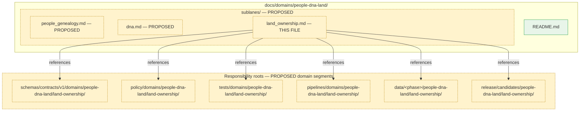
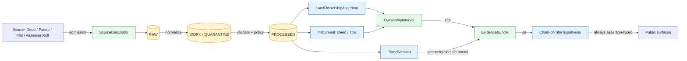

<!-- [KFM_META_BLOCK_V2]
doc_id: kfm://doc/people-dna-land/sublanes/land-ownership
title: Land Ownership Sublane — People / Genealogy / DNA / Land Ownership Domain
type: standard
version: v1
status: draft
owners: People / DNA / Land Domain Steward (TODO — confirm)
created: 2026-05-18
updated: 2026-05-18
policy_label: public
related:
  - docs/domains/people-dna-land/README.md
  - docs/domains/frontier-matrix/README.md
  - docs/doctrine/lifecycle-law.md
  - docs/doctrine/trust-membrane.md
  - docs/doctrine/directory-rules.md
  - docs/standards/PROV.md
tags: [kfm, domain, people-dna-land, land-ownership, sublane]
notes:
  - "Sublane subdirectory `sublanes/` is PROPOSED; not confirmed by an ADR or mounted-repo inspection."
  - "All repo paths PROPOSED pending Directory Rules-conformant mounted-repo check."
  - "Frontier Matrix owns LandOfficeRecord and PublicLandRecord; this sublane does not."
[/KFM_META_BLOCK_V2] -->

# 🪙 Land Ownership Sublane

> Assertion-first, evidence-bound governance of land instruments, ownership intervals, parcels, and chain-of-title reasoning inside the **People / Genealogy / DNA / Land Ownership** domain.


| Status | Owners | Last updated |
|---|---|---|
| `draft` | People / DNA / Land Domain Steward · *TODO confirm* | 2026-05-18 |

---

## 📑 On this page

1. [Sublane identity](#1-sublane-identity)
2. [Scope, boundary, and explicit non-ownership](#2-scope-boundary-and-explicit-non-ownership)
3. [Repo fit and proposed paths](#3-repo-fit-and-proposed-paths)
4. [Ubiquitous language](#4-ubiquitous-language)
5. [Object families](#5-object-families)
6. [Source families and source roles](#6-source-families-and-source-roles)
7. [Spatial and temporal model](#7-spatial-and-temporal-model)
8. [Cross-lane relations](#8-cross-lane-relations)
9. [Pipeline shape (RAW → PUBLISHED)](#9-pipeline-shape-raw--published)
10. [Sensitivity, rights, and publication posture](#10-sensitivity-rights-and-publication-posture)
11. [API, contract, and schema surfaces](#11-api-contract-and-schema-surfaces)
12. [Validators, tests, fixtures](#12-validators-tests-fixtures)
13. [Governed AI behavior](#13-governed-ai-behavior)
14. [Publication, correction, and rollback](#14-publication-correction-and-rollback)
15. [Verification backlog and open questions](#15-verification-backlog-and-open-questions)
16. [Related docs](#16-related-docs)

---

## 1. Sublane identity

**CONFIRMED doctrine / PROPOSED implementation.** The Land Ownership sublane governs the assertion-first, evidence-bound, time-aware representation of *who held what land, when, under what instrument, and against what evidence*. It is one bounded sublane inside the **People / Genealogy / DNA / Land Ownership** domain. It applies KFM's cite-or-abstain truth posture, deny-by-default sensitivity posture, and governed lifecycle (RAW → PUBLISHED) to land instruments, ownership intervals, parcel versions, and chain-of-title reasoning.

The sublane exists because land questions inside KFM are uniquely failure-prone: assessor records, tax rolls, parcel geometry, and convenience joins are routinely mistaken for title truth. This document codifies the controls that prevent that mistake.

> [!IMPORTANT]
> **Two foundational invariants** govern every artifact in this sublane and must be enforced at validator, policy, API, AI, and UI layers:
>
> 1. **Assessor and tax records are NOT title truth.** (CONFIRMED — `[DOM-PEOPLE]`, `[ENCY]`)
> 2. **Parcel geometry is NOT title proof.** Parcels are *geometry versions*, not boundary adjudications. (CONFIRMED — `[ENCY 7.14.D]`)

---

## 2. Scope, boundary, and explicit non-ownership

### 2.1 What this sublane **owns**

CONFIRMED domain ownership / PROPOSED field realization. Inside the People / DNA / Land domain, this sublane is the canonical home for:

- `LandOwnershipAssertion` — claim that an actor held a specified interest in identifiable land during a stated valid-time interval, supported by EvidenceRef.
- `DeedInstrument` — recorded instrument transferring or encumbering interest (deed, mortgage release, etc.).
- `TitleInstrument` — instrument bearing on chain-of-title (patent, quitclaim, warranty deed, sheriff's deed, court order).
- `AssessorRecord` — tax-roll record; **observation of the assessor's view**, never title truth.
- `TaxRecord` — payment / delinquency record; observation, not title evidence.
- `ParcelVersion` — versioned geometry + identifier snapshot of a parcel as published by some authority; **geometry version, not title proof**.
- `OwnershipInterval` — derived temporal interval expressing inferred or asserted ownership; always evidence-bound and assertion-typed.
- `LandParcel`, `LegalDescription`, `LandInstrument` — ubiquitous-language terms shared with the broader domain.

Source: `[DOM-PEOPLE 16.B]`, `[ENCY 7.14.C]`, Atlas v1.1 §16.E.

### 2.2 What this sublane **does not own**

> [!WARNING]
> **Frontier Matrix owns `LandOfficeRecord` and `PublicLandRecord`.** Their public-land/land-office context flows *into* this sublane as cited context but cannot be re-homed here. (CONFIRMED — `[ENCY 17.B]`, Atlas v1.1 §17.B and §24.4.15.)

Other explicit exclusions (CONFIRMED):

| Concern | Owning lane | Why excluded here |
|---|---|---|
| County / municipality / township geometry | Spatial Foundation + Settlements | Geometry authority is not in this sublane. |
| Public-land patent **aggregates** | Frontier Matrix | Matrix cell semantics, not per-claim. |
| Living-person decisions | People & Genealogy sublane (parent domain) | Default deny on living-person fields governs both. |
| DNA-derived inference about ownership | DNA sublane (parent domain) | DNA never authorizes title or parcel claims. |
| Cultural-affiliation context for land | Archaeology, with rights review | Sovereignty-bounded; cited not owned. |

[Back to top ↑](#-on-this-page)

---

## 3. Repo fit and proposed paths

> [!NOTE]
> All repo paths in this section are **PROPOSED**. They follow Directory Rules §12 ("Domain Placement Law") and §4 ("Where Does This File Go?"). The `sublanes/` subdirectory under a domain README is a **proposed organizational convention** — not confirmed by ADR or mounted-repo inspection. Treat as `NEEDS VERIFICATION`.

### 3.1 This file's home

```text
docs/domains/people-dna-land/sublanes/land_ownership.md   ← this file (PROPOSED)
```

The Directory Rules canonical pattern places per-domain doctrine under `docs/domains/<domain>/`. Decomposing a multi-axis domain ("People / Genealogy / DNA / Land Ownership") into `sublanes/` keeps the lifecycle and authority boundaries identical to the domain while letting reviewers locate axis-specific doctrine. (CONFIRMED placement root; PROPOSED `sublanes/` segment.)

### 3.2 Adjacent responsibility roots (PROPOSED)

These are where Land Ownership artifacts live across the canonical responsibility roots. Every path below is **PROPOSED pending mounted-repo conformance check**; do not treat as the current repo tree.

<details>
<summary><strong>Show proposed lane paths across responsibility roots</strong></summary>

```text
# Docs (this lane)
docs/domains/people-dna-land/
├── README.md                        # parent domain README (PROPOSED)
└── sublanes/
    ├── people_genealogy.md          # PROPOSED — sibling sublane
    ├── dna.md                       # PROPOSED — sibling sublane
    └── land_ownership.md            # ← THIS FILE

# Contracts (semantic Markdown; ADR-0001 default canonical = schemas/)
contracts/domains/people-dna-land/land-ownership/...      # PROPOSED

# Schemas (canonical machine shape per ADR-0001)
schemas/contracts/v1/domains/people-dna-land/land-ownership/
├── LandOwnershipAssertion.schema.json                    # PROPOSED
├── DeedInstrument.schema.json                            # PROPOSED
├── TitleInstrument.schema.json                           # PROPOSED
├── AssessorRecord.schema.json                            # PROPOSED
├── TaxRecord.schema.json                                 # PROPOSED
├── ParcelVersion.schema.json                             # PROPOSED
├── OwnershipInterval.schema.json                         # PROPOSED
└── LegalDescription.schema.json                          # PROPOSED

# Policy (sensitivity, consent, denial defaults)
policy/domains/people-dna-land/land-ownership/...         # PROPOSED

# Tests / fixtures
tests/domains/people-dna-land/land-ownership/...          # PROPOSED
fixtures/domains/people-dna-land/land-ownership/...       # PROPOSED

# Pipelines
pipelines/domains/people-dna-land/land-ownership/...      # PROPOSED
pipeline_specs/people-dna-land/land-ownership/...         # PROPOSED

# Lifecycle data (per Directory Rules §12)
data/raw/people-dna-land/land-ownership/...               # PROPOSED
data/work/people-dna-land/land-ownership/...              # PROPOSED
data/quarantine/people-dna-land/land-ownership/...        # PROPOSED
data/processed/people-dna-land/land-ownership/...         # PROPOSED
data/catalog/domain/people-dna-land/land-ownership/...    # PROPOSED
data/published/layers/people-dna-land/land-ownership/...  # PROPOSED
data/registry/sources/people-dna-land/land-ownership/...  # PROPOSED

# Release
release/candidates/people-dna-land/land-ownership/...     # PROPOSED
```

</details>

### 3.3 Sublane responsibility tree



> [!NOTE]
> Diagram nodes shown with dashed yellow borders are **PROPOSED**; solid green is **CONFIRMED**. The `sublanes/` segment requires either ADR ratification or established convention in the mounted repo.

[Back to top ↑](#-on-this-page)

---

## 4. Ubiquitous language

CONFIRMED terms / PROPOSED field realization. Each term carries meaning only inside this sublane's bounded context; the same word may mean something different in Frontier Matrix, Settlements, or Spatial Foundation, and crossing the boundary requires an explicit relation edge.

| Term | Bounded meaning here | Source |
|---|---|---|
| **LandOwnershipAssertion** | Time-bounded, evidence-bound claim that an actor held a stated interest in identifiable land. Never authoritative without resolvable EvidenceBundle. | `[DOM-PEOPLE]` `[ENCY]` |
| **DeedInstrument** | Recorded instrument transferring or encumbering interest in land. Source role: usually *authority* when from a recording office; *observation* otherwise. | `[DOM-PEOPLE]` `[ENCY]` |
| **TitleInstrument** | Any instrument bearing on the chain of title. Strongest when source role is *authority*. | `[DOM-PEOPLE]` `[ENCY]` |
| **AssessorRecord** | Observation of an assessor's view of a parcel and its owner-of-record. **Not title truth.** | `[DOM-PEOPLE]` `[ENCY]` |
| **TaxRecord** | Payment / delinquency observation. Not title truth. | `[DOM-PEOPLE]` `[ENCY]` |
| **ParcelVersion** | Versioned snapshot of parcel geometry + identifier as published by some authority at a specific time. **Geometry version, not title proof.** | `[ENCY 7.14.D]` |
| **OwnershipInterval** | Temporal interval expressing asserted ownership; always EvidenceRef-bound; deterministic identity from source id + role + temporal scope + normalized digest (PROPOSED). | `[DOM-PEOPLE]` `[ENCY]` |
| **LandParcel** | Identified parcel object; identity does not include geometry, since geometry versions. | `[DOM-PEOPLE]` `[ENCY]` |
| **LegalDescription** | Textual legal description (metes/bounds, PLSS section/township/range, lot/block). Parsing produces candidates, not adjudications. | `[DOM-PEOPLE]` `[ENCY]` |
| **LandInstrument** | Umbrella for patent / deed / mortgage / lien / easement / lease / mineral / water / access / probate instruments. | `[DOM-PEOPLE]` `[ENCY]` |

[Back to top ↑](#-on-this-page)

---

## 5. Object families

CONFIRMED ownership / PROPOSED schema realization. Each object's deterministic identity follows the PROPOSED basis `source_id + object_role + temporal_scope + normalized_digest`. Source, observed, valid, retrieval, release, and correction times are CONFIRMED to remain distinct where material.

| Object | Role within sublane | Identity basis (PROPOSED) | Temporal handling (CONFIRMED) |
|---|---|---|---|
| **LandOwnershipAssertion** | Evidence-bound ownership claim | source_id + role + scope + digest | distinct source / observed / valid / retrieval / release / correction times |
| **DeedInstrument** | Recorded instrument | source_id + role + scope + digest | as above |
| **TitleInstrument** | Title-bearing instrument | source_id + role + scope + digest | as above |
| **AssessorRecord** | Assessor observation | source_id + role + scope + digest | as above |
| **TaxRecord** | Tax-roll observation | source_id + role + scope + digest | as above |
| **ParcelVersion** | Versioned parcel geometry + id | source_id + role + scope + digest | as above |
| **OwnershipInterval** | Derived temporal interval | source_id + role + scope + digest | as above |

> [!CAUTION]
> **Identity does NOT include parcel geometry.** A geometry change is a new `ParcelVersion`, not a new parcel. Allowing geometry into identity makes parcels look like title objects; per `[ENCY 7.14.D]` they are not.

[Back to top ↑](#-on-this-page)

---

## 6. Source families and source roles

CONFIRMED doctrine / NEEDS VERIFICATION on per-source rights and current terms. Each source family carries an admission *role* that determines admissibility and reachable lifecycle states. Roles are not interchangeable; an assessor row admitted with role `observation` cannot later be cited as `authority` for title.

| Source family | Typical role(s) | Sensitivity default | Notes |
|---|---|---|---|
| Patent / deed / mortgage / lien / easement / lease / mineral / water / access / probate instruments | `authority` (when from recording office) · `observation` otherwise | T0 for public deed/patent text; T1+ when joined to living-person fields | Primary chain-of-title evidence. |
| Assessor and tax-roll records | `observation` | T1 default; T2+ if living-person joinable | **Never `authority` for title.** |
| Plat / survey / metes-bounds / PLSS / subdivision / derived geometry | `authority` for geometry version · `model` if derived | T0 for public plats | Defines `ParcelVersion`; not title proof. |
| Land patents (BLM-style historical) | `authority` for the federal patent act | T0 | Aggregate side belongs to Frontier Matrix; per-claim instrument context belongs here. |
| Court / probate records | `authority` / `observation` per record type | varies; sensitive joins fail closed | Probate may convey title; case files may not. |
| Genealogical tree overlays | `observation` (hypothesis) | T1+ | Trees are hypotheses, not authority. |

Rights / sensitivity status for each source family is `NEEDS VERIFICATION` per Atlas v1.1 §16.D — sensitive joins fail closed until rights and current terms are checked.

[Back to top ↑](#-on-this-page)

---

## 7. Spatial and temporal model

CONFIRMED doctrine.

- **Two distinct time axes are mandatory.** Every claim carries both *valid time* (when the world was that way) and *source time* (when the source said so). For instruments, also record *recording time*. For derivations, also record *retrieval*, *release*, and *correction* time. Collapsing these axes is a publication anti-pattern.
- **Parcels are geometry versions, not title proof.** A `ParcelVersion` snapshot at time *t* asserts geometry at *t* under some authority; it does not adjudicate title boundary.
- **`OwnershipInterval` is derived, not primary.** Intervals are computed from instruments + assertions + assessor observations under explicit rules; the rules must be inspectable.
- **Geometry version is part of identity for spatial claims.** Per `KFM-IDX-MOD-003`, a parcel boundary refresh must not silently change downstream statistics — geometry hashes are required.



> [!NOTE]
> Diagram shows the logical flow from sources to derived ownership claims. Chain-of-title is always *assertion-typed* — never published as adjudication.

[Back to top ↑](#-on-this-page)

---

## 8. Cross-lane relations

CONFIRMED doctrine on the edges; PROPOSED on field realization. Cross-lane edges must preserve **ownership-of-the-object**, **source role**, **sensitivity**, and **EvidenceBundle support** at every join.

| This sublane | Related lane | Relation type | Constraint |
|---|---|---|---|
| Land Ownership | **Frontier Matrix** | Cites `LandOfficeRecord` / `PublicLandRecord` as aggregate context | DENY rehosting; relation must be a cite edge, not an ownership move. |
| Land Ownership | **Settlements** | Parcel context inside a municipality / township / county | Settlements geometry is geometry-version-bound; parcel geometry is independent. |
| Land Ownership | **Spatial Foundation** | Coordinate reference, PLSS reference geometry | Spatial Foundation supplies `GeographyVersion`; consume, never re-author. |
| Land Ownership | **Roads/Rail** | Access easements, right-of-way context | Corridor semantics owned by Roads/Rail; easements remain here. |
| Land Ownership | **Agriculture** | Farm context, producer-adjacent | Private person-parcel joins denied by default. |
| Land Ownership | **Archaeology** | Cultural affiliation context | Sovereignty-bounded; steward review required. |
| Land Ownership | **People & Genealogy sublane** | Assertor of land claim is a person assertion | Living-person fields fail closed at the join. |
| Land Ownership | **DNA sublane** | None permitted by default | DNA NEVER authorizes title or parcel inference. |

> [!IMPORTANT]
> **DENY rule.** Aggregate public-land statistics published by Frontier Matrix MUST NOT be joined back to single-record `LandOwnershipAssertion` objects to claim per-place truth. (CONFIRMED — Atlas v1.1 §24.9.2 "Aggregate cited as a per-place truth": `DENY join from aggregate cell to single record; ABSTAIN at AI.`)

[Back to top ↑](#-on-this-page)

---

## 9. Pipeline shape (RAW → PUBLISHED)

CONFIRMED doctrine: RAW → WORK / QUARANTINE → PROCESSED → CATALOG / TRIPLET → PUBLISHED. Promotion is a governed state transition, not a file move. PROPOSED lane application below.

| Stage | Handling | Gate | Status |
|---|---|---|---|
| **RAW** | Capture immutable source payload or reference with source role, rights, sensitivity, citation, time, and hash. | `SourceDescriptor` exists. | PROPOSED |
| **WORK / QUARANTINE** | Normalize schema, geometry, time, identity, evidence, rights, and policy; hold failures. | Validation + policy gate pass, or quarantine reason recorded. | PROPOSED |
| **PROCESSED** | Emit validated normalized `LandOwnershipAssertion` / instruments / `ParcelVersion`, receipts, and public-safe candidates. | `EvidenceRef`, `ValidationReport`, and digest closure exist. | PROPOSED |
| **CATALOG / TRIPLET** | Emit catalog records, `EvidenceBundles`, graph/triplet projections, and release candidates. | Catalog / proof closure passes. | PROPOSED |
| **PUBLISHED** | Serve released public-safe artifacts through governed APIs and manifests. | `ReleaseManifest`, correction path, rollback target, and review/policy state exist. | PROPOSED |

> [!CAUTION]
> Watcher-as-non-publisher invariant applies. A connector or watcher that detects new deed filings emits to `data/raw/` or `data/quarantine/` and a `PROPOSED_WORK_RECORD` outbox; it does **not** write to `data/processed/`, `data/catalog/`, or `data/published/`.

[Back to top ↑](#-on-this-page)

---

## 10. Sensitivity, rights, and publication posture

CONFIRMED doctrine.

- **Assessor / tax records and parcel geometry are NOT title truth.** Surfaces presenting them must label source role; AI must `ABSTAIN` from title claims grounded only on them.
- **Living-person fields default-deny** at every public surface, regardless of which sublane originated the join.
- **Unclear rights, unresolved source role, missing evidence, unresolved sensitivity, or absent release state blocks public promotion.** (CONFIRMED — `[ENCY]` `[DIRRULES]`.)
- **Critical-infrastructure adjacency** (e.g., precise location of a private deed-holder near a sensitive infrastructure asset) may bump the join's sensitivity tier per Settlements policy; the deciding gate is policy, not formatting.

### Public-surface deny-default summary

| Surface | Default | Override path |
|---|---|---|
| Public map layer of parcels | DENY exact polygon when joined to person-of-record without rights | Steward review + redaction receipt |
| Chain-of-title PDF / story export | DENY for living persons | Default RESTRICT for ≤ 100-year deceased per source family; CONFIRMED governance, NEEDS VERIFICATION for the year threshold |
| Focus Mode AI summary of ownership | `ABSTAIN` when no resolvable `EvidenceBundle`; `DENY` when policy/rights/release block | — |
| Bulk export including assessor + person | DENY by default | Per-request review with `PolicyDecision` receipt |

[Back to top ↑](#-on-this-page)

---

## 11. API, contract, and schema surfaces

PROPOSED governed-API surfaces; exact routes UNKNOWN until mounted-repo / ADR confirms.

| Surface | DTO / schema | Outcomes | Status |
|---|---|---|---|
| Land Ownership feature/detail resolver | `LandOwnershipDecisionEnvelope` (PROPOSED) | `ANSWER` / `ABSTAIN` / `DENY` / `ERROR` | PROPOSED |
| Land Ownership layer manifest resolver | `LayerManifest` + sublane layer descriptor | `ANSWER` / `DENY` / `ERROR` | PROPOSED |
| Evidence Drawer payload (land claim) | `EvidenceDrawerPayload` + `EvidenceBundle` projection | `ANSWER` / `ABSTAIN` / `DENY` / `ERROR` | PROPOSED |
| Focus Mode answer (land scope) | `RuntimeResponseEnvelope` + `AIReceipt` | `ANSWER` / `ABSTAIN` / `DENY` / `ERROR` | PROPOSED |
| Schema responsibility root | `schemas/contracts/v1/domains/people-dna-land/land-ownership/` | finite validator outcomes | PROPOSED per ADR-0001 |

> [!NOTE]
> Schema home defaults to `schemas/contracts/v1/...` per ADR-0001. If the mounted repo shows divergence, file a `docs/registers/DRIFT_REGISTER.md` entry; do not silently conform.

[Back to top ↑](#-on-this-page)

---

## 12. Validators, tests, fixtures

CONFIRMED doctrinal need / PROPOSED implementation. The validator inventory below is drawn from `[DOM-PEOPLE]` §16.K and applied here.

- **Legal-description and chain-of-title gap tests** — detect unresolved or missing instruments between two adjacent `OwnershipInterval` endpoints. (PROPOSED)
- **Assessor-as-title denial** — fail closed when a public surface presents an `AssessorRecord` as a title claim. (PROPOSED)
- **Parcel-geometry-as-title denial** — fail closed when a `ParcelVersion` is presented as a title boundary adjudication. (PROPOSED — inferred companion to assessor-as-title denial.)
- **Graph-projection safety tests** — ensure derived graph or triplet projections of ownership do not leak living-person fields or restricted DNA-derived inference. (PROPOSED)
- **Schema validation, source-descriptor validation, rights validation, sensitivity validation, evidence closure, temporal logic, geometry validity, policy deny tests, citation validation, release-manifest validation, rollback drill, no-network fixtures, non-regression tests** — all CONFIRMED doctrinal categories from `[ENCY 7.14.K]`.

### Negative fixtures to require

| Fixture | Expected outcome |
|---|---|
| Assessor row presented as authority | `DENY` |
| Living-person field in public export | `DENY` |
| Geometry-version drift without geometry hash | `QUARANTINE` |
| Chain-of-title gap > policy threshold | `ABSTAIN` at AI; `RESTRICT` at publication |
| EvidenceRef unresolved at publish time | `DENY` promotion |

[Back to top ↑](#-on-this-page)

---

## 13. Governed AI behavior

CONFIRMED doctrine / PROPOSED implementation.

- AI **MAY** summarize released `EvidenceBundles` for this sublane; compare instruments; explain chain-of-title gaps and confidence boundaries; draft steward-review notes.
- AI **MUST `ABSTAIN`** when `EvidenceBundle` is missing, citations cannot be validated, source roles conflict, temporal scope is insufficient, or the user asks for unsupported inference (e.g., "who *really* owns parcel X today").
- AI **MUST `DENY`** direct RAW / WORK / QUARANTINE access; living-person ownership inference; DNA-derived ownership inference; assessor-as-title characterization; uncited authoritative claims.
- Every Focus Mode answer **MUST** emit an `AIReceipt` and a `RuntimeResponseEnvelope` with outcome `ANSWER` / `ABSTAIN` / `DENY` / `ERROR`, `evidence_refs`, `policy_decision`, and `citation_validation`.

> [!IMPORTANT]
> AI in this sublane is interpretive, never root truth. `EvidenceBundle` outranks generated language; an unsupported inference that "reads well" is still an `ABSTAIN`.

[Back to top ↑](#-on-this-page)

---

## 14. Publication, correction, and rollback

CONFIRMED doctrine / PROPOSED implementation. Publication requires:

- `ReleaseManifest` with digests and rollback target;
- `EvidenceBundle` closure for every cited claim;
- `ValidationReport` and `PolicyDecision` support;
- review state where required (steward review for chain-of-title summaries; rights review for instruments under restrictive terms);
- correction path via `CorrectionNotice`;
- stale-state rule for time-sensitive surfaces;
- rollback target via `RollbackCard`.

```mermaid
sequenceDiagram
  autonumber
  participant ST as Steward
  participant PIPE as Pipeline
  participant POL as Policy Gate
  participant REL as Release
  participant PUB as Public Surface

  ST->>PIPE: Promote LandOwnership claim<br/>(EvidenceBundle resolved)
  PIPE->>POL: PolicyDecision request
  POL-->>PIPE: ALLOW / RESTRICT / DENY
  alt ALLOW
    PIPE->>REL: ReleaseManifest + RollbackCard
    REL-->>PUB: Publish to governed API
    PUB-->>ST: Trust badges + Evidence Drawer
  else RESTRICT
    PIPE->>ST: Redaction Receipt issued
  else DENY
    PIPE->>ST: Hold; CorrectionNotice path
  end
```

[Back to top ↑](#-on-this-page)

---

## 15. Verification backlog and open questions

PROPOSED items requiring mounted-repo or ADR evidence to settle.

| Item | Evidence that would settle it | Status |
|---|---|---|
| Verify **land instrument chain logic** exists in code, tests, or schemas. | Mounted repo files, schemas, registry entries, tests, logs, emitted artifacts, review records, or release manifests. | NEEDS VERIFICATION |
| Verify **geometry-role boundary logic** (parcel-as-title denial enforcement). | Same as above. | NEEDS VERIFICATION |
| Verify **UI / API restricted-field no-leak behavior** for assessor + person joins. | Same as above. | NEEDS VERIFICATION |
| Confirm **`sublanes/` subdirectory convention** under `docs/domains/<domain>/`. | ADR ratification or mounted-repo convention. | NEEDS VERIFICATION |
| Confirm **canonical schema home** for sublane schemas (`schemas/contracts/v1/domains/people-dna-land/land-ownership/`). | ADR-0001 amendment or extension; mounted-repo conformance. | NEEDS VERIFICATION |
| Resolve **`LandOfficeRecord` / `PublicLandRecord` cite-edge contract** between Frontier Matrix and this sublane. | Cross-domain relation-edge ADR or contract. | NEEDS VERIFICATION |
| Define **public-vs-restricted threshold** for chain-of-title summaries (deceased-person window). | Policy ADR + sensitivity tier. | OPEN |
| Define **chain-of-title gap tolerance** for `ABSTAIN`-vs-`ANSWER` Focus Mode decisions. | Policy + threshold ADR. | OPEN |
| Confirm **`OwnershipInterval` derivation rules** as inspectable algorithm with deterministic identity. | Schema + algorithm doc + test fixtures. | NEEDS VERIFICATION |

[Back to top ↑](#-on-this-page)

---

## 16. Related docs

> [!NOTE]
> Targets below are **PROPOSED** locations following Directory Rules §6.1 and §12. Confirm at mounted-repo review.

- [`docs/domains/people-dna-land/README.md`](../README.md) — parent domain README (PROPOSED)
- [`docs/domains/people-dna-land/sublanes/people_genealogy.md`](./people_genealogy.md) — sibling sublane (PROPOSED)
- [`docs/domains/people-dna-land/sublanes/dna.md`](./dna.md) — sibling sublane (PROPOSED)
- [`docs/domains/frontier-matrix/README.md`](../../frontier-matrix/README.md) — owner of `LandOfficeRecord` / `PublicLandRecord` (PROPOSED)
- [`docs/doctrine/directory-rules.md`](../../../doctrine/directory-rules.md) — placement law for this file (CONFIRMED file role)
- [`docs/doctrine/trust-membrane.md`](../../../doctrine/trust-membrane.md) — governed-API discipline (PROPOSED path)
- [`docs/doctrine/lifecycle-law.md`](../../../doctrine/lifecycle-law.md) — RAW → PUBLISHED governance (PROPOSED path)
- [`docs/standards/PROV.md`](../../../standards/PROV.md) — provenance crosswalk
- [`docs/adr/`](../../../adr/) — ADRs governing schema home, sublane convention, and cross-domain edges
- [`docs/registers/VERIFICATION_BACKLOG.md`](../../../registers/VERIFICATION_BACKLOG.md) — open verification items (PROPOSED path)
- [`docs/registers/DRIFT_REGISTER.md`](../../../registers/DRIFT_REGISTER.md) — register drift if mounted repo diverges (PROPOSED path)

---

<details>
<summary><strong>📚 Appendix A — Source attribution for claims in this doc</strong></summary>

| Claim | Source |
|---|---|
| Domain owns LandOwnershipAssertion, DeedInstrument, TitleInstrument, AssessorRecord, TaxRecord, ParcelVersion, OwnershipInterval | `[ENCY 7.14.C]`, Atlas v1.1 §16.B |
| Frontier Matrix owns LandOfficeRecord, PublicLandRecord | `[ENCY 17.B]`, Atlas v1.1 §17.B, §24.4.15 |
| Parcels are geometry versions, not title proof | `[ENCY 7.14.D]` |
| Assessor / tax records are not title truth | Atlas v1.1 §16.I |
| RAW → WORK/QUARANTINE → PROCESSED → CATALOG/TRIPLET → PUBLISHED | `[DIRRULES]`, `[ENCY]`, `[UNIFIED]` |
| Cite-or-abstain truth posture | KFM-IDX-GOV-002, `[ENCY]` |
| Geography version is part of identity | KFM-IDX-MOD-003 |
| Domain placement under `docs/domains/<domain>/` | `[DIRRULES §12]`, `[DIRRULES §6.1]` |
| Schema home `schemas/contracts/v1/...` | ADR-0001 default per `[DIRRULES §7.4]` |
| Source-role anti-collapse (assessor ≠ title authority) | `[UNIFIED §3.7]`, Atlas v1.1 §24.9.2 |
| Watcher-as-non-publisher | `[DIRRULES §13.5]` |
| Aggregate-as-per-place-truth DENY | Atlas v1.1 §24.9.2 |
| Validator catalog (chain-of-title gap, assessor-as-title denial, graph projection safety) | `[DOM-PEOPLE 16.K]` |

All source identifiers above refer to KFM project knowledge documents; no external research was consulted for this draft.

</details>

<details>
<summary><strong>📐 Appendix B — Sublane responsibility-root cheat sheet (PROPOSED)</strong></summary>

```text
docs/domains/people-dna-land/sublanes/land_ownership.md
                              │
                              ├── meaning   → contracts/domains/people-dna-land/land-ownership/
                              ├── shape     → schemas/contracts/v1/domains/people-dna-land/land-ownership/
                              ├── policy    → policy/domains/people-dna-land/land-ownership/
                              ├── tests     → tests/domains/people-dna-land/land-ownership/
                              ├── fixtures  → fixtures/domains/people-dna-land/land-ownership/
                              ├── code      → packages/domains/people-dna-land/land-ownership/
                              ├── pipelines → pipelines/domains/people-dna-land/land-ownership/
                              ├── specs     → pipeline_specs/people-dna-land/land-ownership/
                              ├── data      → data/<phase>/people-dna-land/land-ownership/
                              ├── catalog   → data/catalog/domain/people-dna-land/land-ownership/
                              ├── layers    → data/published/layers/people-dna-land/land-ownership/
                              ├── sources   → data/registry/sources/people-dna-land/land-ownership/
                              └── release   → release/candidates/people-dna-land/land-ownership/
```

All paths PROPOSED; verify against Directory Rules §12 and mounted-repo state.

</details>

---

**Related docs:** [parent README](../README.md) · [Directory Rules](../../../doctrine/directory-rules.md) · [PROV crosswalk](../../../standards/PROV.md) · [Frontier Matrix README](../../frontier-matrix/README.md)
**Last updated:** 2026-05-18
[Back to top ↑](#-on-this-page)
