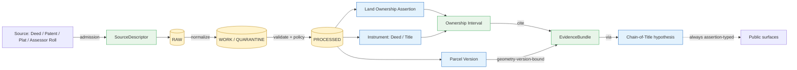

<!-- [KFM_META_BLOCK_V2]
doc_id: kfm://doc/people-dna-land/sublanes/land-ownership
title: Land Ownership Sublane — People / Genealogy / DNA / Land Ownership Domain
type: standard
version: v1
status: draft
owners: <People / DNA / Land Domain Steward — TODO>, <source steward — TODO>, <sensitivity reviewer — TODO>
created: 2026-05-18
updated: 2026-06-06
policy_label: restricted
related:
  # NEEDS VERIFICATION — every path below is PROPOSED until checked against a mounted repo
  - docs/domains/people-dna-land/README.md
  - docs/domains/people-dna-land/sublanes/README.md
  - docs/domains/people-dna-land/sublanes/land.md
  - docs/domains/people-dna-land/sublanes/people/README.md
  - docs/domains/people-dna-land/sublanes/dna/README.md
  - docs/domains/people-dna-land/sublanes/genealogy/README.md
  - docs/domains/frontier-matrix/README.md
  - directory-rules.md
  - ai-build-operating-contract.md
  - docs/standards/PROV.md
tags: [kfm, domain, people-dna-land, land-ownership, sublane]
notes:
  # CONTRACT_VERSION = "3.0.0"
  # DUPLICATION: this doc overlaps an existing sublanes/land.md authored earlier. One must be retired/merged. See OQ-PEOPLE-SUB-14.
  # sublanes/ subdirectory is PROPOSED; not confirmed by ADR or mounted-repo inspection (OQ-PEOPLE-SUB-01).
  # filename land_ownership.md (flat) vs land.md (flat) vs land/README.md (subfolder) — all three forms now exist in drafts (OQ-PEOPLE-SUB-13).
  # CONFIRMED: Frontier Matrix owns LandOfficeRecord and PublicLandRecord; this sublane does not.
[/KFM_META_BLOCK_V2] -->

# 🪙 Land Ownership Sublane

> Assertion-first, evidence-bound governance of land instruments, ownership intervals, parcels, and chain-of-title reasoning inside the **People / Genealogy / DNA / Land Ownership** domain.


| Status | Owners | Last updated |
|---|---|---|
| `draft` | People / DNA / Land Domain Steward · *TODO confirm* | 2026-06-06 |

> [!CAUTION]
> **Duplication alert — two land docs now exist.** An earlier draft authored
> `docs/domains/people-dna-land/sublanes/land.md` covering this same slice. This file
> (`land_ownership.md`) duplicates it under a different filename and a different
> sibling-naming scheme (this doc's siblings are `people_genealogy.md` + `dna.md`, i.e. a
> **two-axis** split; the other drafts use `people` / `dna` / `genealogy`, a **three- or
> four-axis** split). KFM must not maintain two parallel homes for one responsibility. One
> of these must be retired or merged. Logged as **OQ-PEOPLE-SUB-14** and routed to the
> `sublanes/` ADR. [DIRRULES §2.4(5), §13]

> [!IMPORTANT]
> **Two foundational invariants** govern every artifact in this sublane and must be enforced at validator, policy, API, AI, and UI layers:
>
> 1. **Assessor and tax records are NOT title truth.** (CONFIRMED — DOM-PEOPLE §I; UNIFIED §10.14)
> 2. **Parcel geometry is NOT title proof.** Parcels are *geometry versions*, not boundary adjudications. (CONFIRMED — DOM-PEOPLE §I; UNIFIED §10.14)

---

## 📑 On this page

1. [Sublane identity](#1-sublane-identity)
2. [Scope, boundary, and explicit non-ownership](#2-scope-boundary-and-explicit-non-ownership)
3. [Repo fit and proposed paths](#3-repo-fit-and-proposed-paths)
4. [Ubiquitous language](#4-ubiquitous-language)
5. [Object families](#5-object-families)
6. [Source families and source roles](#6-source-families-and-source-roles)
7. [Spatial and temporal model](#7-spatial-and-temporal-model)
8. [Cross-lane relations](#8-cross-lane-relations)
9. [Pipeline shape (RAW → PUBLISHED)](#9-pipeline-shape-raw--published)
10. [Sensitivity, rights, and publication posture](#10-sensitivity-rights-and-publication-posture)
11. [API, contract, and schema surfaces](#11-api-contract-and-schema-surfaces)
12. [Validators, tests, fixtures](#12-validators-tests-fixtures)
13. [Governed AI behavior](#13-governed-ai-behavior)
14. [Publication, correction, and rollback](#14-publication-correction-and-rollback)
15. [Verification backlog and open questions](#15-verification-backlog-and-open-questions)
16. [Related docs](#16-related-docs)

---

## 1. Sublane identity

**CONFIRMED doctrine / PROPOSED implementation.** The Land Ownership sublane governs the assertion-first, evidence-bound, time-aware representation of *who held what land, when, under what instrument, and against what evidence*. It is one bounded slice inside the **People / Genealogy / DNA / Land Ownership** domain. It applies KFM's cite-or-abstain truth posture, deny-by-default sensitivity posture, and governed lifecycle (RAW → PUBLISHED) to land instruments, ownership intervals, parcel versions, and chain-of-title reasoning. [DOM-PEOPLE §A]

The sublane exists because land questions inside KFM are uniquely failure-prone: assessor records, tax rolls, parcel geometry, and convenience joins are routinely mistaken for title truth. This document codifies the controls that prevent that mistake.

[Back to top ↑](#-on-this-page)

---

## 2. Scope, boundary, and explicit non-ownership

### 2.1 What this sublane **owns**

CONFIRMED domain ownership / PROPOSED field realization. Inside the People / DNA / Land domain, this slice is the canonical home for:

- `Land Ownership Assertion` — claim that an actor held a specified interest in identifiable land during a stated valid-time interval, supported by EvidenceRef.
- `Deed Instrument` — recorded instrument transferring or encumbering interest (deed, mortgage release, etc.).
- `Title Instrument` — instrument bearing on chain-of-title (patent, quitclaim, warranty deed, sheriff's deed, court order).
- `Assessor Record` — assessment record; **the assessor's administrative view**, never title truth.
- `TaxRecord` — payment / delinquency record; administrative context, not title evidence.
- `Parcel Version` — versioned geometry + identifier snapshot of a parcel as published by some authority; **geometry version, not title proof**.
- `Ownership Interval` — derived temporal interval expressing inferred or asserted ownership; always evidence-bound and assertion-typed.
- `LandParcel`, `LegalDescription`, `LandInstrument` — ubiquitous-language terms shared with the broader domain.

Source: DOM-PEOPLE §B/§C, Atlas v1.1 §16.E.

### 2.2 What this sublane **does not own**

> [!WARNING]
> **Frontier Matrix owns `Land Office Record` and `Public Land Record`.** Their public-land/land-office context flows *into* this sublane as cited context but cannot be re-homed here. The Frontier Matrix ↔ People/Land edge is explicitly "public land and land-office context **without living/DNA/title leakage**." (CONFIRMED — Atlas v1.1 §17.B/§17.E/§17.F; ENCY.)

Other explicit exclusions (CONFIRMED):

| Concern | Owning lane | Why excluded here |
|---|---|---|
| County / municipality / township geometry | Spatial Foundation + Settlements | Geometry authority is not in this sublane. |
| Public-land patent **aggregates** | Frontier Matrix | Matrix cell semantics, not per-claim. |
| Living-person decisions | People sublane (parent domain) | Default deny on living-person fields governs both. |
| DNA-derived inference about ownership | DNA sublane (parent domain) | DNA never authorizes title or parcel claims. |
| Cultural-affiliation context for land | Archaeology, with rights review | Sovereignty-bounded; cited not owned. |

[Back to top ↑](#-on-this-page)

---

## 3. Repo fit and proposed paths

> [!NOTE]
> All repo paths in this section are **PROPOSED**. They follow Directory Rules §12 ("Domain Placement Law") and §3 ("The Deeper Rule"). The `sublanes/` subdirectory under a domain README is a **proposed organizational convention** — not confirmed by ADR or mounted-repo inspection (OQ-PEOPLE-SUB-01). Treat as `NEEDS VERIFICATION`.

> [!CAUTION]
> **Filename collision.** This file is requested as `land_ownership.md` (underscore). Prior
> drafts use `land.md` (flat) for the *same* slice, and `people` / `dna` / `genealogy` siblings
> use the `<x>/README.md` **subfolder** form. Three filename conventions are now in play for one
> domain. The flat-vs-subfolder choice (OQ-PEOPLE-SUB-13) and the land.md-vs-land_ownership.md
> duplication (OQ-PEOPLE-SUB-14) must both be resolved by the same ADR before any of these
> land docs is treated as canonical. [DIRRULES §12, §13]

### 3.1 This file's home

```text
docs/domains/people-dna-land/sublanes/land_ownership.md   ← this file (PROPOSED)
```

Directory Rules places per-domain doctrine under `docs/domains/<domain>/` (CONFIRMED root). Decomposing a multi-axis domain into `sublanes/` keeps lifecycle and authority boundaries identical to the domain while letting reviewers locate axis-specific doctrine. (CONFIRMED placement root; PROPOSED `sublanes/` segment; PROPOSED filename.)

### 3.2 Adjacent responsibility roots (PROPOSED)

Every path below is **PROPOSED pending mounted-repo conformance check**.

> [!IMPORTANT]
> Per Directory Rules §12, responsibility-root artifacts use the **whole domain slug**
> (`people-dna-land`) and do **not** subdivide by sublane. The `…/people-dna-land/land-ownership/`
> sub-segments below are a *proposed* extension that the §12 lane pattern does not itself
> authorize; they presuppose the unresolved sublane convention and must not be created as
> divergent siblings ahead of the ADR. The safe default is whole-domain lanes
> (`schemas/contracts/v1/domains/people-dna-land/`, etc.).

<details>
<summary><strong>Show proposed lane paths across responsibility roots</strong></summary>

```text
# Docs (this lane)
docs/domains/people-dna-land/
├── README.md                        # parent domain README (PROPOSED)
└── sublanes/
    ├── land.md                      # PROPOSED — DUPLICATE of this slice (OQ-PEOPLE-SUB-14)
    ├── land_ownership.md            # ← THIS FILE (PROPOSED)
    ├── people/README.md             # PROPOSED — sibling sublane
    ├── dna/README.md                # PROPOSED — sibling sublane
    └── genealogy/README.md          # PROPOSED — sibling sublane

# Whole-domain responsibility lanes (§12) — NOT subdivided by sublane
schemas/contracts/v1/domains/people-dna-land/             # PROPOSED, canonical per ADR-0001
contracts/domains/people-dna-land/                        # PROPOSED (semantic Markdown)
policy/domains/people-dna-land/                           # PROPOSED
tests/domains/people-dna-land/                            # PROPOSED
fixtures/domains/people-dna-land/                         # PROPOSED
pipelines/domains/people-dna-land/                        # PROPOSED
data/raw/people-dna-land/                                 # PROPOSED
data/work/people-dna-land/                                # PROPOSED
data/quarantine/people-dna-land/                          # PROPOSED
data/processed/people-dna-land/                           # PROPOSED
data/catalog/domain/people-dna-land/                      # PROPOSED
data/published/layers/people-dna-land/                    # PROPOSED
data/registry/sources/people-dna-land/                    # PROPOSED
release/candidates/people-dna-land/                       # PROPOSED
```

</details>

### 3.3 Sublane responsibility tree

```mermaid
flowchart TB
  subgraph DOMAIN["docs/domains/people-dna-land/"]
    DR["README.md"]
    subgraph SUBL["sublanes/ — PROPOSED"]
      PG["people/README.md — PROPOSED"]
      DNA["dna/README.md — PROPOSED"]
      GEN["genealogy/README.md — PROPOSED"]
      LAND["land.md — PROPOSED (duplicate)"]
      LO["land_ownership.md — THIS FILE"]
    end
  end

  subgraph LANES["Responsibility roots — whole-domain lanes (§12)"]
    SC["schemas/contracts/v1/domains/people-dna-land/"]
    PO["policy/domains/people-dna-land/"]
    TS["tests/domains/people-dna-land/"]
    DT["data/&lt;phase&gt;/people-dna-land/"]
    RL["release/candidates/people-dna-land/"]
  end

  LO -->|references| SC
  LO -->|references| PO
  LO -->|references| TS
  LO -->|references| DT
  LO -->|references| RL
  LO -.->|DUPLICATE OF| LAND

  classDef confirmed fill:#e8f5e9,stroke:#2ea44f,stroke-width:1px;
  classDef proposed fill:#fff3cd,stroke:#b58105,stroke-width:1px,stroke-dasharray:3 2;
  class DR confirmed;
  class SUBL,PG,DNA,GEN,LAND,LO proposed;
  class LANES,SC,PO,TS,DT,RL proposed;
```



> [!NOTE]
> Dashed yellow nodes are **PROPOSED**; solid green is **CONFIRMED**. The `sublanes/` segment requires ADR ratification or established mounted-repo convention.

[Back to top ↑](#-on-this-page)

---

## 4. Ubiquitous language

CONFIRMED terms / PROPOSED field realization. Each term carries meaning only inside this sublane's bounded context; the same word may mean something different in Frontier Matrix, Settlements, or Spatial Foundation, and crossing the boundary requires an explicit relation edge. [DOM-PEOPLE §C]

| Term | Bounded meaning here | Source |
|---|---|---|
| **Land Ownership Assertion** | Time-bounded, evidence-bound claim that an actor held a stated interest in identifiable land. Never authoritative without resolvable EvidenceBundle. | DOM-PEOPLE; ENCY |
| **Deed Instrument** | Recorded instrument transferring or encumbering interest in land. Source role: usually `authority` when from a recording office; `observed` otherwise. | DOM-PEOPLE; ENCY |
| **Title Instrument** | Any instrument bearing on the chain of title. Strongest when source role is `authority`. | DOM-PEOPLE; ENCY |
| **Assessor Record** | The assessor's administrative view of a parcel and its owner-of-record. **Not title truth.** | DOM-PEOPLE; ENCY |
| **TaxRecord** | Payment / delinquency record. Administrative context, not title truth. | DOM-PEOPLE; ENCY |
| **Parcel Version** | Versioned snapshot of parcel geometry + identifier as published by some authority at a specific time. **Geometry version, not title proof.** | DOM-PEOPLE; ENCY |
| **Ownership Interval** | Temporal interval expressing asserted ownership; always EvidenceRef-bound; deterministic identity from source id + role + temporal scope + normalized digest (PROPOSED). | DOM-PEOPLE; ENCY |
| **LandParcel** | Identified parcel object; identity does **not** include geometry, since geometry versions. | DOM-PEOPLE; ENCY |
| **LegalDescription** | Textual legal description (metes/bounds, PLSS section/township/range, lot/block). Parsing produces candidates, not adjudications. | DOM-PEOPLE; ENCY |
| **LandInstrument** | Umbrella for patent / deed / mortgage / lien / easement / lease / mineral / water / access / probate instruments. | DOM-PEOPLE; ENCY |

[Back to top ↑](#-on-this-page)

---

## 5. Object families

CONFIRMED ownership / PROPOSED schema realization. These families are owned by the single `[DOM-PEOPLE]` bounded context. Each object's deterministic identity follows the PROPOSED basis `source_id + object_role + temporal_scope + normalized_digest`. Source, observed, valid, retrieval, release, and correction times are CONFIRMED to remain distinct where material. [DOM-PEOPLE §E]

| Object | Role within sublane | Identity basis (PROPOSED) | Temporal handling (CONFIRMED) |
|---|---|---|---|
| **Land Ownership Assertion** | Evidence-bound ownership claim | source_id + role + scope + digest | distinct source / observed / valid / retrieval / release / correction times |
| **Deed Instrument** | Recorded instrument | source_id + role + scope + digest | as above |
| **Title Instrument** | Title-bearing instrument | source_id + role + scope + digest | as above |
| **Assessor Record** | Assessor administrative view | source_id + role + scope + digest | as above |
| **TaxRecord** | Tax-roll record | source_id + role + scope + digest | as above |
| **Parcel Version** | Versioned parcel geometry + id | source_id + role + scope + digest | as above |
| **Ownership Interval** | Derived temporal interval | source_id + role + scope + digest | as above |

> [!CAUTION]
> **Identity does NOT include parcel geometry.** A geometry change is a new `Parcel Version`, not a new parcel. Allowing geometry into identity makes parcels look like title objects; per DOM-PEOPLE §I they are geometry versions, not boundary adjudications.

[Back to top ↑](#-on-this-page)

---

## 6. Source families and source roles

CONFIRMED doctrine / NEEDS VERIFICATION on per-source rights and current terms. Roles are not interchangeable; an assessor row admitted with role `administrative` cannot later be cited as `authority` for title. Source-role labels use the canonical seven-role vocabulary (`observed`, `regulatory`, `modeled`, `aggregate`, `administrative`, `candidate`, `synthetic`) from the Atlas §24.1 anti-collapse register. [DOM-PEOPLE §D; Atlas §24.1]

| Source family | Typical role(s) | Sensitivity default | Notes |
|---|---|---|---|
| Patent / deed / mortgage / lien / easement / lease / mineral / water / access / probate instruments | `authority` (recording office) · `observed` otherwise | low for public deed/patent text; higher when joined to living-person fields | Primary chain-of-title evidence. |
| Assessor and tax-roll records | `administrative` | restricted default; higher if living-person joinable | **Never `authority` or `observed` for title.** |
| Plat / survey / metes-bounds / PLSS / subdivision / derived geometry | `authority` for the geometry version · `modeled` if derived | low for public plats | Defines `Parcel Version`; not title proof. |
| Land patents (BLM-style historical) | `authority` for the federal patent act | low | Aggregate side belongs to Frontier Matrix; per-claim instrument context belongs here. |
| Court / probate records | `authority` / `observed` per record type | varies; sensitive joins fail closed | Probate may convey title; case files may not. |
| Genealogical tree overlays | `modeled` / `candidate` (hypothesis) | restricted | Trees are hypotheses, not authority. |

> [!WARNING]
> Citing an assessor/tax record (role `administrative`) as evidence of *ownership* is a
> source-role collapse — "administrative compilation cited as observation" — and is denied at
> the validator, policy, and AI layers. [Atlas §24.1 anti-collapse]

Rights / sensitivity status for each source family is `NEEDS VERIFICATION` per DOM-PEOPLE §D — sensitive joins fail closed until rights and current terms are checked.

[Back to top ↑](#-on-this-page)

---

## 7. Spatial and temporal model

CONFIRMED doctrine.

- **Distinct time axes are mandatory.** Every claim carries *valid time* and *source time*; instruments also carry *recording time*; derivations carry *retrieval*, *release*, and *correction* time. Collapsing these axes is a publication anti-pattern. [DOM-PEOPLE §E]
- **Parcels are geometry versions, not title proof.** A `Parcel Version` snapshot at time *t* asserts geometry at *t* under some authority; it does not adjudicate a title boundary. [DOM-PEOPLE §I]
- **`Ownership Interval` is derived, not primary.** Intervals are computed from instruments + assertions + assessor observations under explicit, inspectable rules.
- **Geometry version is part of identity for spatial claims.** A parcel boundary refresh must not silently change downstream statistics — geometry hashes are required. [INFERRED from the geometry-version doctrine; NEEDS VERIFICATION of the specific hashing mechanism.]



> [!NOTE]
> Chain-of-title is always *assertion-typed* — never published as adjudication.

[Back to top ↑](#-on-this-page)

---

## 8. Cross-lane relations

CONFIRMED doctrine on the edges; PROPOSED on field realization. Cross-lane edges must preserve **ownership-of-the-object**, **source role**, **sensitivity**, and **EvidenceBundle support** at every join. [Atlas §16.F; §17.F]

| This sublane | Related lane | Relation type | Constraint |
|---|---|---|---|
| Land Ownership | **Frontier Matrix** | Cites `Land Office Record` / `Public Land Record` as aggregate context | DENY rehosting; relation is a cite edge. Frontier↔People/Land edge forbids living/DNA/title leakage. |
| Land Ownership | **Settlements** | Parcel context inside a municipality / township / county | Settlements geometry is geometry-version-bound; parcel geometry is independent. |
| Land Ownership | **Spatial Foundation** | Coordinate reference, PLSS reference geometry | Spatial Foundation supplies `GeographyVersion`; consume, never re-author. |
| Land Ownership | **Roads/Rail** | Access easements, right-of-way context | Corridor semantics owned by Roads/Rail; easements remain here. |
| Land Ownership | **Agriculture** | Farm context, producer-adjacent | Private person-parcel joins denied by default. |
| Land Ownership | **Archaeology** | Cultural affiliation context | Sovereignty-bounded; steward review required. |
| Land Ownership | **People sublane** | Assertor of a land claim is a person assertion | Living-person fields fail closed at the join. |
| Land Ownership | **DNA sublane** | None permitted by default | DNA NEVER authorizes title or parcel inference. |

> [!IMPORTANT]
> **DENY rule.** Aggregate public-land statistics published by Frontier Matrix MUST NOT be joined back to single-record `Land Ownership Assertion` objects to claim per-place truth. (CONFIRMED — Atlas §24.1 anti-collapse: "Aggregate cited as a per-place truth → DENY join from aggregate cell to single record; ABSTAIN at AI.")

[Back to top ↑](#-on-this-page)

---

## 9. Pipeline shape (RAW → PUBLISHED)

CONFIRMED doctrine: RAW → WORK / QUARANTINE → PROCESSED → CATALOG / TRIPLET → PUBLISHED. Promotion is a governed state transition, not a file move. PROPOSED lane application below. [DIRRULES §9; DOM-PEOPLE §H]

| Stage | Handling | Gate | Status |
|---|---|---|---|
| **RAW** | Capture immutable source payload or reference with source role, rights, sensitivity, citation, time, and hash. | `SourceDescriptor` exists. | PROPOSED |
| **WORK / QUARANTINE** | Normalize schema, geometry, time, identity, evidence, rights, and policy; hold failures. | Validation + policy gate pass, or quarantine reason recorded. | PROPOSED |
| **PROCESSED** | Emit validated normalized `Land Ownership Assertion` / instruments / `Parcel Version`, receipts, and public-safe candidates. | `EvidenceRef`, `ValidationReport`, and digest closure exist. | PROPOSED |
| **CATALOG / TRIPLET** | Emit catalog records, `EvidenceBundle`s, graph/triplet projections, and release candidates. | Catalog / proof closure passes. | PROPOSED |
| **PUBLISHED** | Serve released public-safe artifacts through governed APIs and manifests. | `ReleaseManifest`, correction path, rollback target, and review/policy state exist. | PROPOSED |

> [!CAUTION]
> Watcher-as-non-publisher invariant applies. A connector that detects new deed filings emits to `data/raw/` or `data/quarantine/` and a proposed-work outbox; it does **not** write to `data/processed/`, `data/catalog/`, or `data/published/`. [CONFIRMED — ENCY watcher-as-non-publisher; DIRRULES]

[Back to top ↑](#-on-this-page)

---

## 10. Sensitivity, rights, and publication posture

CONFIRMED doctrine.

- **Assessor / tax records and parcel geometry are NOT title truth.** Surfaces presenting them must label source role; AI must `ABSTAIN` from title claims grounded only on them.
- **Living-person fields default-deny** at every public surface, regardless of which sublane originated the join.
- **Unclear rights, unresolved source role, missing evidence, unresolved sensitivity, or absent release state blocks public promotion.** (CONFIRMED — ENCY; DIRRULES.)
- **Critical-infrastructure adjacency** may bump the join's sensitivity tier per Settlements policy; the deciding gate is policy, not formatting.

### Public-surface deny-default summary

| Surface | Default | Override path |
|---|---|---|
| Public map layer of parcels | DENY exact polygon when joined to person-of-record without rights | Steward review + RedactionReceipt |
| Chain-of-title PDF / story export | DENY for living persons; deceased-subject window NEEDS VERIFICATION | Steward review; tier per source family |
| Focus Mode AI summary of ownership | `ABSTAIN` when no resolvable `EvidenceBundle`; `DENY` when policy/rights/release block | — |
| Bulk export including assessor + person | DENY by default | Per-request review with `PolicyDecision` receipt |

> [!NOTE]
> Private person-parcel joins default to tier **T4** (generalized parcel + de-identified person
> → T2 only, with `RedactionReceipt` + `ReviewRecord`) per Atlas §24.5. The exact
> deceased-subject "public vs restricted" year threshold is **NEEDS VERIFICATION** — the corpus
> does not fix a specific window; do not invent one. [Atlas §24.5; OQ]

[Back to top ↑](#-on-this-page)

---

## 11. API, contract, and schema surfaces

PROPOSED governed-API surfaces; exact routes UNKNOWN until mounted-repo / ADR confirms. Finite outcomes use the contract's canonical set.

| Surface | DTO / schema | Outcomes | Status |
|---|---|---|---|
| Land Ownership feature/detail resolver | `LandOwnershipDecisionEnvelope` (PROPOSED) | `ANSWER` / `ABSTAIN` / `DENY` / `ERROR` | PROPOSED |
| Land Ownership layer manifest resolver | `LayerManifest` + sublane layer descriptor | `ANSWER` / `DENY` / `ERROR` | PROPOSED |
| Evidence Drawer payload (land claim) | `EvidenceDrawerPayload` + `EvidenceBundle` projection | `ANSWER` / `ABSTAIN` / `DENY` / `ERROR` | PROPOSED |
| Focus Mode answer (land scope) | `RuntimeResponseEnvelope` + `AIReceipt` | `ANSWER` / `ABSTAIN` / `DENY` / `ERROR` | PROPOSED |
| Schema responsibility root | `schemas/contracts/v1/domains/people-dna-land/` | finite validator outcomes | PROPOSED per ADR-0001 |

> [!NOTE]
> Schema home defaults to `schemas/contracts/v1/...` per ADR-0001 (Directory Rules §7.4). If the mounted repo shows divergence, file a `docs/registers/DRIFT_REGISTER.md` entry; do not silently conform.

[Back to top ↑](#-on-this-page)

---

## 12. Validators, tests, fixtures

CONFIRMED doctrinal need / PROPOSED implementation. The validator inventory is drawn from DOM-PEOPLE §K and applied here. Validator/fixture homes use the **whole-domain** `people-dna-land` segment per §12.

- **Legal-description and chain-of-title gap tests** — detect unresolved or missing instruments between two adjacent `Ownership Interval` endpoints. (PROPOSED — DOM-PEOPLE §K)
- **Assessor-as-title denial** — fail closed when a public surface presents an `Assessor Record` as a title claim. (PROPOSED — DOM-PEOPLE §K)
- **Parcel-geometry-as-title denial** — fail closed when a `Parcel Version` is presented as a title boundary adjudication. (PROPOSED — INFERRED companion to assessor-as-title denial; the geometry-role-boundary item is in DOM-PEOPLE §N.)
- **Graph-projection safety tests** — ensure derived graph/triplet projections of ownership do not leak living-person fields or restricted DNA-derived inference. (PROPOSED — DOM-PEOPLE §K)
- **Schema, source-descriptor, rights, sensitivity, evidence-closure, temporal-logic, geometry-validity, policy-deny, citation-validation, release-manifest, rollback-drill, no-network-fixture, non-regression tests** — CONFIRMED doctrinal categories applied lane-wide. [ENCY; DOM-PEOPLE §K]

### Negative fixtures to require

| Fixture | Expected outcome |
|---|---|
| Assessor row presented as authority for title | `DENY` |
| Living-person field in public export | `DENY` |
| Geometry-version drift without geometry hash | `QUARANTINE` |
| Chain-of-title gap silently bridged | `DENY` (gap must be preserved as open link) |
| EvidenceRef unresolved at publish time | `DENY` promotion |

[Back to top ↑](#-on-this-page)

---

## 13. Governed AI behavior

CONFIRMED doctrine / PROPOSED implementation. [DOM-PEOPLE §L; GAI]

- AI **MAY** summarize released `EvidenceBundle`s for this sublane; compare instruments; explain chain-of-title gaps and confidence boundaries; draft steward-review notes.
- AI **MUST `ABSTAIN`** when `EvidenceBundle` is missing, citations cannot be validated, source roles conflict, temporal scope is insufficient, or the user asks for unsupported inference (e.g., "who *really* owns parcel X today").
- AI **MUST `DENY`** direct RAW / WORK / QUARANTINE access; living-person ownership inference; DNA-derived ownership inference; assessor-as-title characterization; uncited authoritative claims.
- Every Focus Mode answer **MUST** emit an `AIReceipt` and a `RuntimeResponseEnvelope` with outcome `ANSWER` / `ABSTAIN` / `DENY` / `ERROR`, `evidence_refs`, `policy_decision`, and `citation_validation`.

> [!IMPORTANT]
> AI in this sublane is interpretive, never root truth. `EvidenceBundle` outranks generated language; an unsupported inference that "reads well" is still an `ABSTAIN`.

[Back to top ↑](#-on-this-page)

---

## 14. Publication, correction, and rollback

CONFIRMED doctrine / PROPOSED implementation. Publication requires: `ReleaseManifest` with digests and rollback target; `EvidenceBundle` closure for every cited claim; `ValidationReport` + `PolicyDecision` support; review state where required (steward review for chain-of-title summaries; rights review for instruments under restrictive terms); correction path via `CorrectionNotice`; stale-state rule; rollback target via `RollbackCard`. [ENCY Appendix E; Atlas §16.M]

```mermaid
sequenceDiagram
  autonumber
  participant ST as Steward
  participant PIPE as Pipeline
  participant POL as Policy Gate
  participant REL as Release
  participant PUB as Public Surface

  ST->>PIPE: Promote Land Ownership claim (EvidenceBundle resolved)
  PIPE->>POL: PolicyDecision request
  POL-->>PIPE: ALLOW / RESTRICT / DENY
  alt ALLOW
    PIPE->>REL: ReleaseManifest + RollbackCard
    REL-->>PUB: Publish to governed API
    PUB-->>ST: Trust badges + Evidence Drawer
  else RESTRICT
    PIPE->>ST: RedactionReceipt issued
  else DENY
    PIPE->>ST: Hold; CorrectionNotice path
  end
```

> [!NOTE]
> Land records are correction-prone (re-recorded deeds, corrected legal descriptions, reassessed parcels). A `CorrectionNotice` MUST list invalidated derivatives and supply a rollback target; a corrected claim that leaves a stale public overlay live is an incomplete correction. [ENCY; Atlas §24.1]

[Back to top ↑](#-on-this-page)

---

## 15. Verification backlog and open questions

| ID | Item | Evidence that would settle it | Status |
|---|---|---|---|
| OQ-PEOPLE-SUB-01 | Confirm `sublanes/` subdirectory convention under `docs/domains/<domain>/`. | ADR ratification or mounted-repo convention. | NEEDS VERIFICATION |
| OQ-PEOPLE-SUB-13 | Filename form: `land.md` vs `land_ownership.md` vs `land/README.md` (flat vs underscore vs subfolder). | Same `sublanes/` ADR. | CONFLICTED |
| OQ-PEOPLE-SUB-14 | **Duplication: `land.md` and `land_ownership.md` cover the same slice. Which is retired/merged?** | ADR + DRIFT_REGISTER entry; one home only per §13. | CONFLICTED |
| OQ-PEOPLE-SUB-15 | Sibling-naming scheme: this doc's `people_genealogy.md` (two-axis) vs prior `people`/`dna`/`genealogy` (three/four-axis). | Same `sublanes/` ADR (sublane count + names). | CONFLICTED |
| OQ-LAND-04 | Verify **land-instrument chain logic** exists in code, tests, or schemas. | Mounted-repo files, schemas, tests, receipts. | NEEDS VERIFICATION |
| OQ-LAND-05 | Verify **geometry-role boundary logic** (parcel-as-title denial enforcement). | Same. | NEEDS VERIFICATION |
| OQ-LAND-06 | Verify **UI / API restricted-field no-leak** for assessor + person joins. | Same. | NEEDS VERIFICATION |
| OQ-LAND-07 | Confirm canonical schema home for domain schemas against ADR-0001. | ADR-0001; mounted-repo conformance. | NEEDS VERIFICATION |
| OQ-LAND-10 | Resolve `Land Office Record` / `Public Land Record` cite-edge contract between Frontier Matrix and this sublane. | Cross-domain relation-edge ADR or contract. | NEEDS VERIFICATION |
| OQ-LAND-11 | Define public-vs-restricted threshold for chain-of-title summaries (deceased-person window). | Policy ADR + sensitivity tier. | OPEN |
| OQ-LAND-12 | Define chain-of-title gap tolerance for `ABSTAIN`-vs-`ANSWER` Focus Mode decisions. | Policy + threshold ADR. | OPEN |
| OQ-LAND-13 | Confirm `Ownership Interval` derivation rules as an inspectable algorithm with deterministic identity. | Schema + algorithm doc + test fixtures. | NEEDS VERIFICATION |

> [!NOTE]
> All open questions will be filed to `docs/registers/VERIFICATION_BACKLOG.md` when this doc is published; the CONFLICTED rows additionally go to `docs/registers/DRIFT_REGISTER.md`. *(PROPOSED. [DIRRULES §2.5])*

[Back to top ↑](#-on-this-page)

---

## 16. Related docs

> [!NOTE]
> Targets below are **PROPOSED** locations following Directory Rules §3 and §12. Confirm at mounted-repo review.

- [`docs/domains/people-dna-land/README.md`](../README.md) — parent domain README (PROPOSED)
- [`docs/domains/people-dna-land/sublanes/README.md`](./README.md) — sublanes index (PROPOSED)
- [`docs/domains/people-dna-land/sublanes/land.md`](./land.md) — **duplicate land slice (OQ-PEOPLE-SUB-14)**
- [`docs/domains/people-dna-land/sublanes/people/README.md`](./people/README.md) — sibling sublane (PROPOSED)
- [`docs/domains/people-dna-land/sublanes/dna/README.md`](./dna/README.md) — sibling sublane (PROPOSED)
- [`docs/domains/people-dna-land/sublanes/genealogy/README.md`](./genealogy/README.md) — sibling sublane (PROPOSED)
- [`docs/domains/frontier-matrix/README.md`](../../frontier-matrix/README.md) — owner of `Land Office Record` / `Public Land Record` (PROPOSED)
- [`directory-rules.md`](../../../../directory-rules.md) — placement law (§3, §12, §2.4, §7.4) (CONFIRMED file role)
- [`ai-build-operating-contract.md`](../../../../ai-build-operating-contract.md) — operating law (`CONTRACT_VERSION = "3.0.0"`)
- [`docs/standards/PROV.md`](../../../standards/PROV.md) — provenance crosswalk
- `docs/registers/VERIFICATION_BACKLOG.md` · `docs/registers/DRIFT_REGISTER.md` — open items + drift (PROPOSED paths)

---

<details>
<summary><strong>📚 Appendix A — Source attribution for claims in this doc</strong></summary>

| Claim | Source |
|---|---|
| Domain owns Land Ownership Assertion, Deed/Title Instrument, Assessor Record, TaxRecord, Parcel Version, Ownership Interval | DOM-PEOPLE §B; Atlas v1.1 §16.E |
| Frontier Matrix owns Land Office Record, Public Land Record | Atlas v1.1 §17.B / §17.E |
| Frontier↔People/Land edge forbids living/DNA/title leakage | Atlas v1.1 §17.F |
| Parcels are geometry versions, not title proof; assessor/tax not title truth | DOM-PEOPLE §I; UNIFIED §10.14 |
| RAW → WORK/QUARANTINE → PROCESSED → CATALOG/TRIPLET → PUBLISHED | DIRRULES §9; ENCY; UNIFIED |
| Cite-or-abstain truth posture | ENCY; operating contract §1 |
| Domain placement under `docs/domains/<domain>/`; whole-domain lanes | DIRRULES §3, §12 |
| Schema home `schemas/contracts/v1/...` | ADR-0001 per DIRRULES §7.4 |
| Source-role anti-collapse (assessor ≠ title authority; aggregate ≠ per-place) | Atlas §24.1 |
| Private person-parcel join T4 → T2 transform | Atlas §24.5 |
| Validator catalog (chain-of-title gap, assessor-as-title denial, graph projection safety) | DOM-PEOPLE §K |

No external research was consulted for this draft. KFM-internal identifiers refer to project-knowledge documents.

</details>

---

**Last updated:** 2026-06-06 · **Doc id:** `kfm://doc/people-dna-land/sublanes/land-ownership` · **Status:** Draft · `CONTRACT_VERSION = "3.0.0"`

[Back to top ↑](#-on-this-page)
