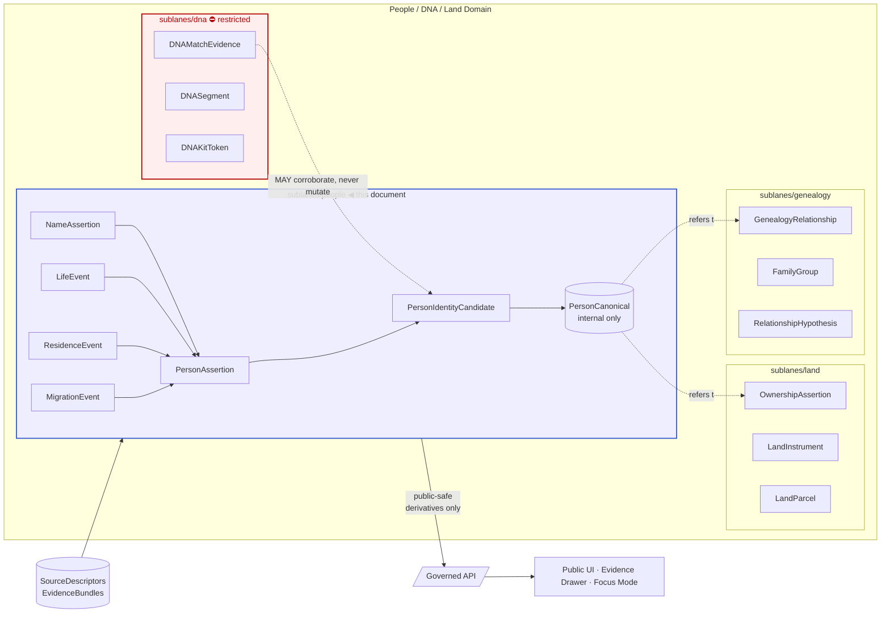

<!-- [KFM_META_BLOCK_V2]
doc_id: kfm://doc/docs/domains/people-dna-land/sublanes/people
title: People Sublane — People, Genealogy, DNA, and Land Ownership Domain
type: standard
version: v0.1
status: draft
owners: People/DNA/Land domain steward (TBD); Docs steward (TBD)
created: 2026-05-18
updated: 2026-05-18
policy_label: public
related:
  - docs/domains/people-dna-land/README.md
  - docs/domains/people-dna-land/sublanes/genealogy.md
  - docs/domains/people-dna-land/sublanes/dna.md
  - docs/domains/people-dna-land/sublanes/land.md
  - docs/doctrine/directory-rules.md
  - docs/doctrine/trust-membrane.md
  - docs/doctrine/lifecycle-law.md
tags: [kfm, domain, people, sublane, person-assertion, identity, life-events, residence, migration]
notes:
  - Sublane scope is doctrinal; sublanes/ path segment is PROPOSED pending ADR.
  - All implementation-layer paths PROPOSED until verified against mounted repo.
[/KFM_META_BLOCK_V2] -->

# People Sublane

> **Person assertions, person-canonical records, name assertions, life events, residences, and migrations — modeled as assertion-first, evidence-bound, privacy-aware claims under the People/DNA/Land domain.**


**Status:** `draft` · **Owners:** _TBD — People/DNA/Land steward; Docs steward_ · **Last updated:** _2026-05-18_

> [!IMPORTANT]
> This sublane handles **person-shaped assertions** (who someone was, what happened to them, where they lived, where they moved) — **not** DNA-derived identity, **not** land instruments or parcel chain-of-title, **not** relationship hypotheses scored from DNA matches. Those concerns live in sibling sublanes (`dna/`, `land/`) and are referenced where they intersect.

---

## Quick jump

- [1 · Scope](#1--scope)
- [2 · Repo fit](#2--repo-fit)
- [3 · Inputs](#3--inputs)
- [4 · Exclusions](#4--exclusions)
- [5 · Sublane structure](#5--sublane-structure)
- [6 · Ubiquitous language](#6--ubiquitous-language)
- [7 · Object families](#7--object-families)
- [8 · Source families](#8--source-families)
- [9 · Pipeline shape](#9--pipeline-shape-raw--published)
- [10 · Sensitivity, rights, and publication posture](#10--sensitivity-rights-and-publication-posture)
- [11 · Governed AI behavior](#11--governed-ai-behavior)
- [12 · Cross-sublane and cross-lane relations](#12--cross-sublane-and-cross-lane-relations)
- [13 · API, contract, and schema surfaces](#13--api-contract-and-schema-surfaces)
- [14 · Validators, tests, fixtures](#14--validators-tests-fixtures)
- [15 · Related docs](#15--related-docs)
- [16 · Open questions & verification backlog](#16--open-questions--verification-backlog)

---

## 1 · Scope

**CONFIRMED doctrine / PROPOSED implementation.** The People sublane represents people inside the Kansas Frontier Matrix (KFM) as **assertion-first, evidence-bound, privacy-aware** claims, with a strong default-deny posture for any output that touches **living persons** or that would equate a name on a record with an identified individual without supporting evidence. It owns the person-and-life-events portion of the broader People/Genealogy/DNA/Land domain and serves as the upstream context for the sibling `genealogy/`, `dna/`, and `land/` sublanes.

**This sublane owns** (CONFIRMED terms / PROPOSED field realization, per `[DOM-PEOPLE]`):

- `PersonAssertion` — a per-source claim that a person existed, with name, time, place, and source role.
- `PersonCanonical` — a curated, evidence-bound, internal-only canonical person record built from one or more `PersonAssertion`s.
- `NameAssertion` — a per-source name variant tied to a person and a temporal window.
- `PersonIdentityCandidate` — a proposed cross-source identity link, with confidence and supporting evidence, not yet promoted to `PersonCanonical`.
- `LifeEvent` — birth, baptism, marriage, divorce, death, burial, military service, naturalization, or other life-stage events anchored to a `PersonAssertion`.
- `ResidenceEvent` — a person-anchored residence at a place over a valid-time interval.
- `MigrationEvent` — a person-anchored move between two places, with directionality and uncertainty.
- `ReviewRecord` (sublane projection) — a recorded steward decision, dispute, correction, or annotation against any of the above.

> [!NOTE]
> Identity resolution **scoring** is owned here; relationship-hypothesis scoring **across persons** is shared with the `genealogy/` sublane. Where a single hypothesis spans both (e.g., "two `PersonAssertion`s are the same person AND that person is the mother of another `PersonAssertion`"), the *identity* edge is resolved here and the *relationship* edge is resolved in `genealogy/`.

[Back to top](#people-sublane)

---

## 2 · Repo fit

> [!WARNING]
> This document's path — `docs/domains/people-dna-land/sublanes/people.md` — is **PROPOSED**. Directory Rules §12 specifies `docs/domains/<domain>/` as the canonical doc home for a domain and lists `people-dna-land` as the domain segment. The `sublanes/` segment **is not documented** in `directory-rules.md` and should either be (a) ratified by an ADR amending §12 to allow a per-domain sublane segment, or (b) collapsed into `docs/domains/people-dna-land/people.md` and sibling files. Until resolved, treat this path as `PROPOSED / CONFLICTED` per §2.5.

**Domain home (CONFIRMED domain segment, PROPOSED tree):**

```text
docs/domains/people-dna-land/        # CONFIRMED segment per Directory Rules §12
├── README.md                         # PROPOSED — domain README
└── sublanes/                         # PROPOSED segment — needs ADR or rename
    ├── people.md                     # THIS DOCUMENT
    ├── genealogy.md                  # PROPOSED sibling
    ├── dna.md                        # PROPOSED sibling
    └── land.md                       # PROPOSED sibling
```

**Upstream (this sublane consumes from):**

- `docs/doctrine/directory-rules.md` — placement and lifecycle law.
- `docs/doctrine/trust-membrane.md` — public clients read governed APIs, not canonical stores. _PROPOSED path._
- `docs/doctrine/lifecycle-law.md` — RAW → WORK / QUARANTINE → PROCESSED → CATALOG / TRIPLET → PUBLISHED. _PROPOSED path._
- `docs/domains/people-dna-land/README.md` — domain-level scope, boundary, ubiquitous language. _PROPOSED path._

**Downstream (this sublane is referenced by):**

- `docs/domains/people-dna-land/sublanes/genealogy.md` — consumes `PersonAssertion`, `PersonCanonical`, `LifeEvent`. _PROPOSED path._
- `docs/domains/people-dna-land/sublanes/dna.md` — DNA evidence is **never** allowed to mutate `PersonCanonical` directly. _PROPOSED path._
- `docs/domains/people-dna-land/sublanes/land.md` — `OwnershipAssertion` may **reference** a `PersonCanonical`, but person↔parcel joins are restricted by sensitivity policy. _PROPOSED path._
- `docs/domains/settlements-infrastructure/` — residence events anchor settlement membership. _PROPOSED path._

[Back to top](#people-sublane)

---

## 3 · Inputs

**CONFIRMED doctrine / PROPOSED implementation.** Inputs admitted to this sublane MUST carry a `SourceDescriptor` with explicit source role (`authority` | `observation` | `context` | `model`), rights, sensitivity, citation, time, and hash. Rights status and sensitivity remain `NEEDS VERIFICATION` until reviewed; sensitive joins fail closed.

| Source family | Typical role | Examples | Status |
|---|---|---|---|
| Vital records | `authority` | birth, death, marriage certificates (where public/legal) | NEEDS VERIFICATION for rights and current terms |
| Cemetery / burial / obituary | `authority` / `observation` | gravestone surveys, FindAGrave-style overlays (rights-checked), newspaper obituaries | NEEDS VERIFICATION |
| Church records | `authority` / `observation` | baptism, marriage, burial registers | NEEDS VERIFICATION |
| School / military records | `authority` / `observation` | yearbooks (public), draft registrations, service records | NEEDS VERIFICATION |
| Census records | `authority` / `observation` | U.S. decennial census schedules, state censuses | NEEDS VERIFICATION |
| Directory records | `observation` / `context` | city directories, gazetteers | NEEDS VERIFICATION |
| Court / probate records | `authority` / `observation` | wills, guardianship, probate inventories | NEEDS VERIFICATION |
| GEDCOM / GEDZip / tree overlays | `context` / `model` (hypothesis) | uploaded family trees, FamilySearch tree exports | NEEDS VERIFICATION; treated as hypothesis, never authority |

> [!CAUTION]
> **Tree overlays are not authority.** A relationship asserted in an uploaded GEDCOM is admitted as a `context`/`model`-role hypothesis and MUST link through an `EvidenceBundle` to authoritative sources before any derived public output is permitted. This is the corpus's standing warning against unsourced family folklore hardening into a "fact."

[Back to top](#people-sublane)

---

## 4 · Exclusions

The following are **explicitly out of scope** for this sublane. Where the boundary is close, the redirect is named.

| Excluded content | Redirect | Why |
|---|---|---|
| DNA match evidence, DNA segments, DNA kit tokens | `docs/domains/people-dna-land/sublanes/dna.md` _(PROPOSED)_ | DNA-derived identity and relationship inference are restricted by default and require a separate governance surface. |
| Relationship hypotheses scored from DNA segments | `docs/domains/people-dna-land/sublanes/dna.md` _(PROPOSED)_ | DNA-derived relationships are not equivalent to evidence-bound genealogy relationships. |
| `GenealogyRelationship`, `FamilyGroup`, `RelationshipHypothesis` | `docs/domains/people-dna-land/sublanes/genealogy.md` _(PROPOSED)_ | Relationship modeling and family-group projection sit in the genealogy sublane. |
| Land instruments, deeds, titles, assessor/tax records | `docs/domains/people-dna-land/sublanes/land.md` _(PROPOSED)_ | Land governance has its own assertion-first model. Assessor/tax records are NOT title truth. |
| Parcel geometry, legal descriptions, PLSS-derived geometry | `docs/domains/people-dna-land/sublanes/land.md` _(PROPOSED)_ | Parcel geometry is a geometry version, not a title-boundary proof. |
| Settlement / municipality / census-place entities | `docs/domains/settlements-infrastructure/` _(PROPOSED)_ | Places that residences refer to live in the settlements lane. |
| Archaeological cultural affiliation of named individuals | `docs/domains/archaeology/` _(PROPOSED)_ | Steward-reviewed and rights-bounded; requires Archaeology sublane governance. |
| Living-person fields exposed to the public surface | _denied by policy_ | Living-person output fails closed by default; see §10. |
| Sovereign tribal-citizenship determinations | _not owned by KFM_ | KFM does not adjudicate citizenship or enrollment. |

[Back to top](#people-sublane)

---

## 5 · Sublane structure

The People sublane sits inside the People/DNA/Land domain and feeds three sibling sublanes through controlled references. It never reads downstream stores and never publishes directly to the public surface — publication is a governed state transition handled by the domain's release pipeline.



> [!NOTE]
> The diagram is **doctrinally grounded** (object families, sublane separation, governed-API trust membrane) but **path-free**. Mounted-repo verification is required before treating any specific module, route, or component name as canonical.

[Back to top](#people-sublane)

---

## 6 · Ubiquitous language

CONFIRMED terms from the People/DNA/Land domain that the People sublane uses. Field realization is PROPOSED until verified in `contracts/domains/people-dna-land/` and `schemas/contracts/v1/domains/people-dna-land/` _(PROPOSED paths per Directory Rules §3 / §12)_.

| Term | Definition (sublane-scoped) | Status |
|---|---|---|
| **PersonAssertion** | A per-source claim that a person existed, bound to source role, evidence, valid time, and release state. Never a public truth claim by itself. | CONFIRMED term / PROPOSED field realization |
| **PersonCanonical** | An internal-only curated record built from one or more reconciled `PersonAssertion`s and a `PersonIdentityCandidate` resolved by steward review. Never public by default. | CONFIRMED term / PROPOSED field realization |
| **NameAssertion** | A per-source name variant (formal, vernacular, alias, mis-transcription) attached to a `PersonAssertion` over a temporal window. | CONFIRMED term / PROPOSED field realization |
| **PersonIdentityCandidate** | A scored, evidence-linked proposal that two or more `PersonAssertion`s describe the same person. Promotion to `PersonCanonical` is a governed state transition. | INFERRED from corpus / PROPOSED |
| **LifeEvent** | A bounded life-stage event (birth, marriage, death, burial, naturalization, military service, etc.) anchored to a `PersonAssertion`. | CONFIRMED term / PROPOSED field realization |
| **ResidenceEvent** | A `PersonAssertion`-anchored residence at a place over a valid-time interval. The place is a reference into the settlements lane, not duplicated here. | CONFIRMED term / PROPOSED field realization |
| **MigrationEvent** | A `PersonAssertion`-anchored move between two places with directionality and uncertainty. | CONFIRMED term / PROPOSED field realization |
| **ConsentGrant** _(cross-sublane)_ | A holder-controlled, machine-readable consent record (Kantara-style receipt) referenced from this sublane when a person assertion derives from a consent-bearing source. | CONFIRMED term / PROPOSED field realization |
| **RevocationReceipt** _(cross-sublane)_ | A signed record that supersedes a `ConsentGrant` and triggers downstream tombstone and cache-invalidation behavior. | CONFIRMED term / PROPOSED field realization |
| **EvidenceBundle** _(cross-domain)_ | The governed evidentiary container any `PersonAssertion`-derived public output MUST resolve to before release. | CONFIRMED doctrine |
| **DecisionEnvelope** _(cross-domain)_ | The finite-outcome runtime envelope (`ANSWER` / `ABSTAIN` / `DENY` / `ERROR`) carrying every public response about a person. | CONFIRMED doctrine |

[Back to top](#people-sublane)

---

## 7 · Object families

**Identity rule (PROPOSED, domain-uniform).** Deterministic ID basis = `source_id + object_role + temporal_scope + normalized_digest`. The identity scheme is the domain-level proposal for stable `spec_hash`-based identity; the people sublane inherits it. Algorithm freeze and resolution path are specified at the domain or schema layer (see open questions §16).

**Temporal handling (CONFIRMED, domain-uniform).** Source time, observed time, valid time, retrieval time, release time, and correction time are kept distinct where material. Conflating these collapses provenance.

| Object | Purpose (sublane-scoped) | Temporal handling | Identity status |
|---|---|---|---|
| `PersonAssertion` | Per-source claim of personhood and identifying attributes. | source · observed · valid · retrieval · release · correction | PROPOSED deterministic basis |
| `PersonCanonical` | Internal-only reconciled person record. | source · observed · valid · retrieval · release · correction | PROPOSED deterministic basis |
| `NameAssertion` | Per-source name variant over a window. | source · observed · valid · retrieval · release · correction | PROPOSED deterministic basis |
| `PersonIdentityCandidate` | Proposed identity link between assertions. | source · observed · valid · retrieval · release · correction | PROPOSED deterministic basis |
| `LifeEvent` | Birth, marriage, death, burial, etc. | source · observed · valid · retrieval · release · correction | PROPOSED deterministic basis |
| `ResidenceEvent` | Residence over a valid-time interval. | source · observed · valid · retrieval · release · correction | PROPOSED deterministic basis |
| `MigrationEvent` | Movement between two places. | source · observed · valid · retrieval · release · correction | PROPOSED deterministic basis |

> [!TIP]
> **Three-layer separation is doctrine.** A `PersonAssertion` is not the same thing as a published map feature labeled with a person's name. The corpus explicitly separates: (1) **canonical human assertions** — internal-only; (2) **evidence layer** — `EvidenceBundle`-backed; (3) **publication / experience layer** — derived, policy-filtered, downstream-only. The people sublane participates in layers (1) and (2). Layer (3) is reached only through governed APIs.

<details>
<summary><strong>Worked example — illustrative only</strong></summary>

The following is **illustrative**, not extracted from a mounted source. It shows the doctrinal shape, not a verified contract.

```text
# A census enumerator records "Jno Smith, age 34, farmer, b. Ohio" in 1880.

PersonAssertion#A     ← source=US1880 census schedule (authority/observation)
NameAssertion#A1      ← "Jno Smith" linked to PersonAssertion#A
LifeEvent#A-birth     ← inferred birth ~1846, place=OH, low precision
ResidenceEvent#A-1880 ← place_ref=settlements:KS-…  valid=[1880-06-01, 1880-06-01]

# A different source — a township tax roll for 1885 — records "John Smith".

PersonAssertion#B     ← source=KS1885 tax roll (authority/observation)
NameAssertion#B1      ← "John Smith"
ResidenceEvent#B-1885 ← place_ref=settlements:KS-…  valid=[1885-…, 1885-…]

# Identity resolution proposes a link.

PersonIdentityCandidate#1
  ├─ links: PersonAssertion#A, PersonAssertion#B
  ├─ confidence: 0.62  (NOT promoted)
  ├─ evidence_refs: name match, county overlap, age plausibility
  └─ outstanding: requires steward review

# Until reviewed, no PersonCanonical exists. No public output joins these two.
# The Evidence Drawer shows two separate assertions and the candidate edge.
```

</details>

[Back to top](#people-sublane)

---

## 8 · Source families

Source families are the same set listed at the domain level; the people sublane uses the subset that produces person-shaped output. Each source MUST resolve to a `SourceDescriptor` with rights, sensitivity, citation, time, and hash before any work-state processing.

| Source family | Role(s) | Sensitivity default | Freshness |
|---|---|---|---|
| Vital / cemetery / burial / obituary / church / school / military / census / directory / court / probate records | `authority` · `observation` · `context` · `model` as source role requires | Living-person fields fail closed; sensitive joins fail closed | Source-vintage or cadence specific |
| GEDCOM / GEDZip / tree overlays | `context` · `model` (hypothesis) | Living-person fields fail closed; tree-asserted relationships are hypotheses, never authority | Source-vintage |

> [!WARNING]
> **Living-person screening is the gate, not the goal.** Source admission with a living-person flag does not by itself permit public output. The gate at PROCESSED / CATALOG / PUBLISHED enforces the actual policy decision; the source-level flag only routes the assertion into the correct policy path.

[Back to top](#people-sublane)

---

## 9 · Pipeline shape (RAW → PUBLISHED)

**CONFIRMED doctrine / PROPOSED lane application.** The People sublane follows the KFM lifecycle invariant: `RAW → WORK / QUARANTINE → PROCESSED → CATALOG / TRIPLET → PUBLISHED`. Promotion is a **governed state transition, not a file move** _(Directory Rules §0 lifecycle invariant)_.

| Stage | Handling | Gate | Status |
|---|---|---|---|
| **RAW** | Capture immutable source payload or reference with source role, rights, sensitivity, citation, time, and hash. | `SourceDescriptor` exists. | PROPOSED |
| **WORK / QUARANTINE** | Normalize schema, geometry, time, identity, evidence, rights, and policy; hold failures in quarantine. | Validation + policy gate pass, OR quarantine reason recorded. | PROPOSED |
| **PROCESSED** | Emit validated, normalized `PersonAssertion`, `LifeEvent`, `ResidenceEvent`, `MigrationEvent`, `NameAssertion` objects; emit `PersonIdentityCandidate`s; emit public-safe candidates with living-person and sensitivity transforms applied. | `EvidenceRef`, `ValidationReport`, and digest closure exist. | PROPOSED |
| **CATALOG / TRIPLET** | Emit catalog records, `EvidenceBundle`s, graph/triplet projections (with privacy controls), and release candidates. | Catalog / proof closure passes. | PROPOSED |
| **PUBLISHED** | Serve released public-safe artifacts through the governed API and release manifests. | `ReleaseManifest`, correction path, rollback target, and review/policy state exist. | PROPOSED |

> [!IMPORTANT]
> **Public clients never read RAW, WORK, QUARANTINE, PROCESSED, or CATALOG stores directly.** The trust membrane is enforced by reading only through governed APIs. A worker, watcher, or connector that publishes directly to `data/published/` violates the invariant (see Directory Rules §13).

[Back to top](#people-sublane)

---

## 10 · Sensitivity, rights, and publication posture

**CONFIRMED doctrine / PROPOSED enforcement.**

- **Living-person fields fail closed by default.** No public output names, locates, or relates a living person without an authorized policy decision and a steward review.
- **Unclear rights, unresolved source role, missing evidence, unresolved sensitivity, or absent release state blocks public promotion.**
- **Sensitive joins fail closed.** Person↔parcel, person↔DNA, person↔archaeology-site, and person↔court-record joins are denied by default at the public surface unless a policy decision permits them at the requested specificity.
- **Tree assertions are hypotheses.** A `PersonAssertion` derived from an uploaded GEDCOM is a `context`/`model` source and cannot be promoted to a public claim without authoritative corroboration.
- **Reidentification risk applies even to dead-person data.** Spatial precision, temporal precision, relationship density, and small-community exposure all factor into the publication decision. _(EXTERNAL recommendation in the corpus; the precise scoring rule is PROPOSED and remains NEEDS VERIFICATION.)_

> [!CAUTION]
> **Names in tiles are not safe by default.** The corpus's standing rule for the publication / experience layer is: **do not embed** names, exact dates of birth, GEDCOM IDs, family IDs, DNA markers, or exact burial coordinates in public tiles or layer payloads. Use opaque pointers and server-side dereference under policy.

[Back to top](#people-sublane)

---

## 11 · Governed AI behavior

**CONFIRMED doctrine / PROPOSED implementation.**

| AI action | Allowed? | Condition |
|---|---|---|
| Summarize a released `EvidenceBundle` that contains person-shaped assertions | ✅ ANSWER | Bundle is PUBLISHED; sensitivity is public; non-living-person scope. |
| Compare two `PersonAssertion`s in released bundles | ✅ ANSWER | Both bundles are PUBLISHED and public. |
| Draft a steward-review note on a `PersonIdentityCandidate` | ✅ ANSWER | Internal surface only; not a public release. |
| Infer a relationship between two persons | ⚠ ABSTAIN | Relationship modeling lives in the genealogy sublane; AI MUST defer there and resolve through `EvidenceBundle`. |
| Output anything about a living person | ⛔ DENY | Default-deny posture per §10. |
| Output anything DNA-derived | ⛔ DENY | DNA-derived inference is denied at the public surface by default. |
| Synthesize a person-shaped claim with no evidence resolution | ⛔ DENY / ABSTAIN | Cite-or-abstain is doctrine; ungrounded synthesis is not an allowed outcome. |

The finite outcome set is `ANSWER` / `ABSTAIN` / `DENY` / `ERROR`. AI is interpretive, not the root truth source. `EvidenceBundle` outranks generated language.

[Back to top](#people-sublane)

---

## 12 · Cross-sublane and cross-lane relations

**CONFIRMED / PROPOSED relations (per `[DOM-PEOPLE]`).** Each relation must preserve ownership, source role, sensitivity, and `EvidenceBundle` support.

| This sublane | Counterpart | Relation | Constraint |
|---|---|---|---|
| `people` | `genealogy` _(sublane)_ | `PersonCanonical` / `PersonAssertion` is the **subject** of `GenealogyRelationship` and `FamilyGroup`. | Identity edges resolved here; relationship edges resolved in genealogy. Bidirectional references only — never mutual writes. |
| `people` | `dna` _(sublane)_ | `DNAMatchEvidence` MAY **corroborate** a `PersonIdentityCandidate` but MUST NOT mutate `PersonCanonical` directly. | Default-deny on DNA-derived person assertions. |
| `people` | `land` _(sublane)_ | `OwnershipAssertion` references `PersonCanonical`; person↔parcel joins gated by sensitivity policy. | Assessor / tax records are NOT title truth; parcel geometry is NOT title-boundary proof. |
| `people` | Settlements / Infrastructure | `ResidenceEvent.place_ref` and `MigrationEvent.{from,to}_ref` reference settlement entities. | Living-person fields fail closed across the boundary. |
| `people` | Roads / Rail | `MigrationEvent` may reference a corridor or route for context. | Movement context only; never a privacy bypass. |
| `people` | Archaeology / Cultural Heritage | Cultural affiliations of named individuals are **steward-reviewed and rights-bounded**. | Indigenous community context cited under sovereignty rules. |
| `people` | Agriculture | `LandParcel` context may bound field-candidate joins; **private person-parcel joins denied by default**. | Producer-adjacent context with privacy. |
| `people` | Frontier Matrix | Aggregated population observations feed matrix cells. | Matrix cells are analytical releases with their own evidence and rollback; this sublane does not edit cells. |

[Back to top](#people-sublane)

---

## 13 · API, contract, and schema surfaces

**PROPOSED governed API surface; exact route names UNKNOWN.** Schema responsibility root is `schemas/contracts/v1/domains/people-dna-land/` per Directory Rules §3 default and ADR-0001 (schema home). Contracts root is `contracts/domains/people-dna-land/`. _All paths PROPOSED until verified._

| Surface | DTO / Schema | Outcomes | Status |
|---|---|---|---|
| People sublane feature / detail resolver _(route TBD)_ | `PeopleSublaneDecisionEnvelope` (composes the domain `PeopleDNALandDecisionEnvelope`) | `ANSWER` / `ABSTAIN` / `DENY` / `ERROR` | PROPOSED; exact route UNKNOWN |
| People sublane layer manifest resolver | `LayerManifest` / sublane layer descriptor | `ANSWER` / `DENY` / `ERROR` | PROPOSED; public-safe release only |
| People sublane Evidence Drawer payload | `EvidenceDrawerPayload` + `EvidenceBundle` projection | `ANSWER` / `ABSTAIN` / `DENY` / `ERROR` | PROPOSED; evidence- and policy-filtered |
| People sublane Focus Mode answer | `RuntimeResponseEnvelope` + `AIReceipt` | `ANSWER` / `ABSTAIN` / `DENY` / `ERROR` | PROPOSED; AI never root truth |
| Schema home | `schemas/contracts/v1/domains/people-dna-land/people/` _(PROPOSED)_ | finite validator outcomes | PROPOSED; ADR-bound |
| Contract home | `contracts/domains/people-dna-land/people/` _(PROPOSED)_ | semantic Markdown for object families | PROPOSED |
| Policy home | `policy/domains/people-dna-land/people/` _(PROPOSED)_ | OPA / Rego admissibility rules | PROPOSED |

[Back to top](#people-sublane)

---

## 14 · Validators, tests, fixtures

**All PROPOSED** _(per `[DOM-PEOPLE]` validators/tests/fixtures list, scoped to this sublane)_. Each test exists to prove that the default-deny posture and assertion-first model survive contact with the pipeline.

| Test / fixture | What it proves | Status |
|---|---|---|
| Person-assertion evidence test | A `PersonAssertion` without a resolvable `EvidenceBundle` fails the publication gate. | PROPOSED |
| GEDCOM import rights / living-flag test | Tree imports carrying a living-person flag never produce public output; rights-missing trees route to QUARANTINE. | PROPOSED |
| Identity-candidate non-promotion test | A `PersonIdentityCandidate` with confidence below the steward threshold never auto-promotes to `PersonCanonical`. | PROPOSED |
| Name-variant collision test | Identical name variants across sources do **not** by themselves collapse into one person. | PROPOSED |
| Residence/migration place-ref integrity test | `ResidenceEvent` / `MigrationEvent` references resolve to a settlements-lane entity at the requested temporal scope, or fail closed. | PROPOSED |
| Public-tile leakage fixture | No name, exact DOB, GEDCOM ID, family ID, DNA marker, or exact burial coordinate appears in a public tile or layer payload. | PROPOSED |
| Revocation cleanup test _(cross-sublane)_ | A `RevocationReceipt` against a consent-bearing source invalidates downstream public derivatives within the published cache TTL. | PROPOSED |
| Graph projection safety test | The sublane's contribution to the graph projection does not expose denied edges via inference. | PROPOSED |

> [!NOTE]
> Fixtures should include both **positive** paths (valid published `EvidenceBundle`-backed assertions) and **negative** paths (living-person export attempts, raw-GEDCOM leakage, revoked consent, missing retention, unresolved evidence). The corpus's standing recommendation is fixture-first development for sensitive sublanes.

[Back to top](#people-sublane)

---

## 15 · Related docs

- [`../README.md`](../README.md) — People/DNA/Land domain README _(PROPOSED path)_
- [`./genealogy.md`](./genealogy.md) — Genealogy sublane _(PROPOSED)_
- [`./dna.md`](./dna.md) — DNA sublane _(PROPOSED)_
- [`./land.md`](./land.md) — Land sublane _(PROPOSED)_
- [`../../../doctrine/directory-rules.md`](../../../doctrine/directory-rules.md) — Directory Rules (canonical placement law)
- [`../../../doctrine/trust-membrane.md`](../../../doctrine/trust-membrane.md) _(PROPOSED path)_ — Trust membrane: public clients consume governed APIs
- [`../../../doctrine/lifecycle-law.md`](../../../doctrine/lifecycle-law.md) _(PROPOSED path)_ — Lifecycle invariant
- [`../../../architecture/contract-schema-policy-split.md`](../../../architecture/contract-schema-policy-split.md) _(PROPOSED path)_ — Where object meaning, shape, and admissibility live
- [`../../../registers/VERIFICATION_BACKLOG.md`](../../../registers/VERIFICATION_BACKLOG.md) _(PROPOSED path)_ — Open verification items for the domain
- [`../../../registers/DRIFT_REGISTER.md`](../../../registers/DRIFT_REGISTER.md) _(PROPOSED path)_ — Drift entries (including the `sublanes/` segment status)
- _TODO: link to the People/DNA/Land domain ADR for schema home once authored._
- _TODO: link to the ADR that ratifies or rejects the `sublanes/` segment once authored._

[Back to top](#people-sublane)

---

## 16 · Open questions & verification backlog

| Item | Evidence that would settle it | Status |
|---|---|---|
| Does the repo use `docs/domains/people-dna-land/sublanes/` or a flat `docs/domains/people-dna-land/people.md` layout? | Mounted repo state, an ADR amending Directory Rules §12, or a per-root README in `docs/domains/people-dna-land/`. | NEEDS VERIFICATION |
| Where do `contracts/`, `schemas/`, `policy/`, `tests/`, and `fixtures/` for this sublane live? | Mounted repo files; ADR-0001 (schema home) confirmation. | NEEDS VERIFICATION |
| What is the exact governed-API route for the people sublane feature/detail resolver? | Mounted `apps/governed-api/` routes; OpenAPI document; service tests. | UNKNOWN |
| What is the steward-review threshold for promoting a `PersonIdentityCandidate` to `PersonCanonical`? | Policy doc or ADR; review console behavior; CI test fixtures. | NEEDS VERIFICATION |
| What is the precise reidentification-risk scoring rule (uniqueness · spatial · temporal · relationship density · small-community)? | Domain policy doc; rego rules; test fixtures. | NEEDS VERIFICATION |
| What public cache TTL applies to revocation-driven invalidation? | Release manifest doc; revocation pipeline runbook; cache config. | NEEDS VERIFICATION |
| Does the `ReviewRecord` projection live in this sublane, in `genealogy/`, or as a cross-sublane shared object? | Domain README; contracts registry; existing review console wiring. | NEEDS VERIFICATION |
| How are `RevocationReceipt`-driven tombstones materialized for `PersonCanonical` records derived from consent-bearing sources? | Tombstone schema; cleanup test; pipeline receipt envelope. | NEEDS VERIFICATION |
| Living-person determination — is the cutoff steward-set, age-rule-driven, or source-flag-driven? | Sensitivity policy; living-person screen tests. | NEEDS VERIFICATION |
| Is `PersonCanonical` ever exposed externally, even in aggregated form? | Policy decisions; release manifests; tile/layer audit. | NEEDS VERIFICATION |

---

### External sources

None consulted for this document. All claims derive from project knowledge (KFM domain blueprints, Directory Rules, Unified Implementation Architecture Build Manual, Idea Index, and the People/DNA/Land sections of the Domains Atlas and Encyclopedia) and the supplied conversation artifacts.

---

**Last updated:** 2026-05-18 · **Status:** `draft` · **Owners:** _TBD_ · [Back to top](#people-sublane)
