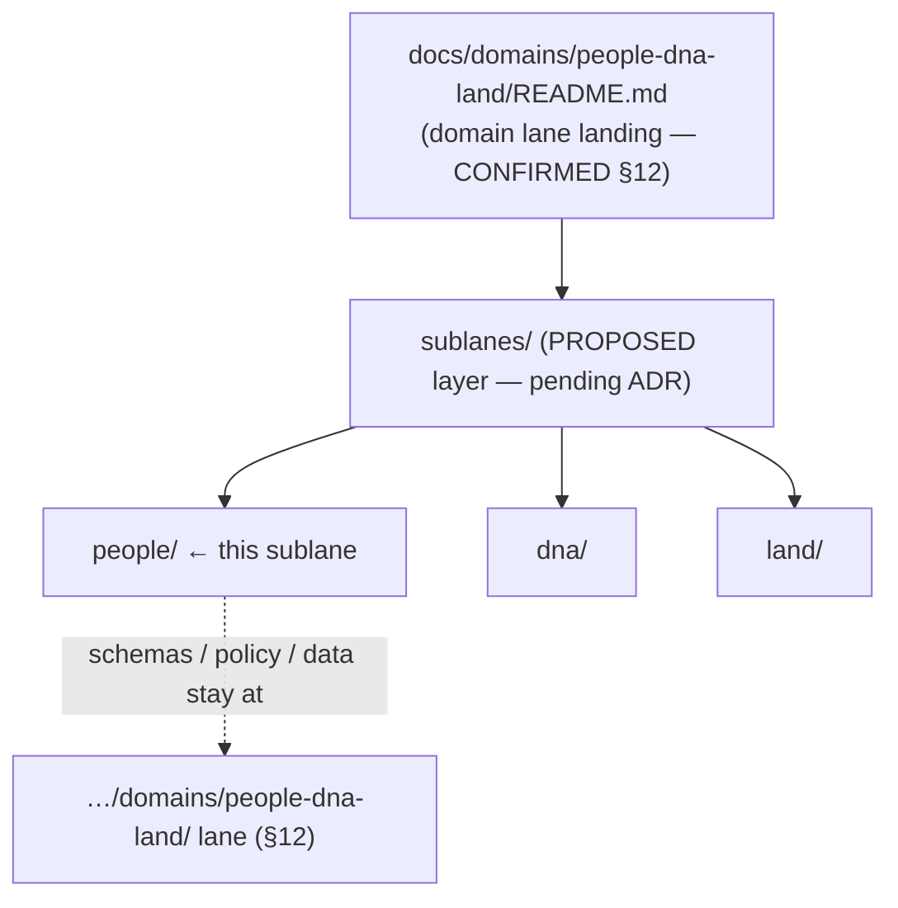
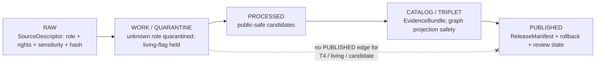

<!-- [KFM_META_BLOCK_V2]
doc_id: kfm://doc/people-dna-land-sublane-people-readme
title: People / DNA / Land — People Sublane
type: standard
version: v1
status: draft
owners: <People/DNA/Land domain steward — PLACEHOLDER>, <Source steward — PLACEHOLDER>, <Sensitivity reviewer — PLACEHOLDER>
created: 2026-06-06
updated: 2026-06-06
policy_label: restricted
related: [ai-build-operating-contract.md, directory-rules.md, docs/domains/people-dna-land/README.md, docs/domains/people-dna-land/sublanes/dna/README.md, docs/domains/people-dna-land/sublanes/land/README.md, policy/sensitivity/people/, policy/consent/people/]
tags: [kfm, people, genealogy, person, sublane, sensitive]
notes: [CONTRACT_VERSION = "3.0.0"; sources Atlas v1.1 ch.16 object/term spine; domain slug "people-dna-land" CONFIRMED by Directory Rules §12; the sublanes/ subfolder convention is NOT in §12 and is PROPOSED pending ADR]
[/KFM_META_BLOCK_V2] -->

<a id="top"></a>

# 👥 People / DNA / Land — People Sublane

> Landing page for the **People** sublane: assertion-first person evidence, names, life and residence and migration events, genealogy relationships, and family groups — the non-DNA, non-Land slice of the domain.


**Status:** `draft` · **Owners:** `<Domain steward>` · `<Source steward>` · `<Sensitivity reviewer>` *(all PLACEHOLDER)* · **Updated:** 2026-06-06
**`CONTRACT_VERSION = "3.0.0"`** — governed by [`ai-build-operating-contract.md`](../../../../../ai-build-operating-contract.md) and [`directory-rules.md`](../../../../../directory-rules.md).

> [!IMPORTANT]
> **The `sublanes/` subfolder convention is PROPOSED, not canonical.** Directory Rules §12
> (Domain Placement Law) defines a domain as a set of lane segments inside responsibility
> roots — `docs/domains/people-dna-land/`, `data/processed/people-dna-land/`, etc. It does
> **not** define a `sublanes/<x>/` subdivision *within* a domain. This file is authored at
> the requested path, but the `sublanes/` convention requires an ADR before it is treated as
> canonical. See [Open questions](#open-questions-register). `[DIRRULES §12]`

> [!CAUTION]
> **This sublane fails closed.** Living-person output is denied or restricted by default.
> Unclear rights, unresolved source role, missing evidence, unresolved sensitivity, or
> absent release state **blocks public promotion**. `[DOM-PEOPLE] [ENCY] [DIRRULES]` — *CONFIRMED.*

---

## Quick jump

- [1. Scope](#1-scope)
- [2. Repo fit and the sublane question](#2-repo-fit-and-the-sublane-question)
- [3. What belongs here](#3-what-belongs-here-accepted-inputs)
- [4. What does not belong here](#4-what-does-not-belong-here-exclusions)
- [5. Object families](#5-object-families)
- [6. Source families and roles](#6-source-families-and-roles)
- [7. Sensitivity and consent posture](#7-sensitivity-and-consent-posture)
- [8. Pipeline shape](#8-pipeline-shape)
- [Open questions register](#open-questions-register)
- [Open verification backlog](#open-verification-backlog)
- [Changelog](#changelog-v0--v1)
- [Definition of done](#definition-of-done)
- [Related docs](#related-docs)

---

## 1. Scope

The **People** sublane covers the person-evidence slice of the People / DNA / Land domain:
assertion-first person records, name assertions, the canonical-person resolution surface,
life/residence/migration events, genealogy relationships, and family groups. The parent
domain governs assertion-first person evidence, genealogy relationships, restricted DNA
evidence, land instruments, ownership intervals, chain-of-title reasoning, consent, policy
decisions, review, correction, graph projection, EvidenceBundle views, and rollback;
this sublane carries the **person and genealogy** portion of that mandate. `[DOM-PEOPLE] [ENCY]` — *CONFIRMED domain identity.*

The DNA and Land slices are siblings under the same parent domain and are **out of scope
here** (see [§4](#4-what-does-not-belong-here-exclusions)).

[Back to top](#top)

## 2. Repo fit and the sublane question

> [!NOTE]
> **Domain slug — CONFIRMED.** Directory Rules §12 names `people-dna-land` explicitly in the
> uniform list of domain slugs. The slug is settled. `[DIRRULES §12]`
>
> **Sublane subfolder — PROPOSED / CONFLICTED.** §12 does not define a `sublanes/` layer.
> The closest precedent is the open question on `docs/runbooks/<domain>/` subfolders
> (§18 OPEN-DR-02), which §12 also did not originally define and which is awaiting ADR. A
> `sublanes/people/` layer is the same class of question and is logged below. Until an ADR
> ratifies it, do **not** create parallel schema, policy, contract, or registry homes under
> `sublanes/`; those continue to live in their responsibility-root lanes keyed to the
> *whole* domain. `[DIRRULES §3, §12, §2.4(5)]`

```text
docs/
└── domains/
    └── people-dna-land/                  # CONFIRMED slug (§12)
        ├── README.md                      # domain lane landing (PROPOSED present)
        └── sublanes/                       # PROPOSED layer — NOT in §12, pending ADR
            ├── people/
            │   └── README.md                # ← this file
            ├── dna/
            │   └── README.md                # sibling (PROPOSED)
            └── land/
                └── README.md                # sibling (PROPOSED)

# Responsibility-root lanes remain keyed to the whole domain, NOT to a sublane:
schemas/contracts/v1/domains/people-dna-land/   # §12 lane (NOT schemas/.../people/)
policy/domains/people-dna-land/                  # §12 lane
policy/sensitivity/people/                        # §24.13 deny-default lane
policy/consent/people/                            # consent/revocation gate
data/processed/people-dna-land/                   # §12 lifecycle lane
```



> [!WARNING]
> The diagram and tree show **proposed** structure, not verified repo state. The `sublanes/`
> layer is documentation-organizational only; it must not become a parallel authority home
> for schemas, policy, contracts, or the registry. `[DIRRULES §12]`

[Back to top](#top)

## 3. What belongs here (accepted inputs)

- Orientation and navigation for the **person / genealogy** object families.
- Pointers to the person-evidence object contracts, schemas, and policy lanes (which live at
  the domain-level responsibility roots, not under `sublanes/`).
- Cross-references to the DNA and Land sibling sublanes where person evidence joins them.

## 4. What does not belong here (exclusions)

| Not here | Lives instead in |
|---|---|
| DNA evidence (DNA Match Evidence, DNASegment, DNAKitToken, ConsentGrant, RevocationReceipt) | `sublanes/dna/` *(PROPOSED)* |
| Land / title (Land Ownership Assertion, Deed/Title Instrument, Assessor/TaxRecord, Parcel Version, Ownership Interval, LandParcel, LegalDescription, LandInstrument) | `sublanes/land/` *(PROPOSED)* |
| Object-family **meaning** | `contracts/domains/people-dna-land/` |
| Field-level **schema shape** | `schemas/contracts/v1/domains/people-dna-land/` |
| Admit / deny / redact **decisions** | `policy/sensitivity/people/`, `policy/consent/people/` |
| Released claims / evidence | `EvidenceBundle` via the governed API |
| County-year panels, land-office records | Frontier Matrix domain (does **not** own living-person/title/parcel) |

> [!NOTE]
> CONFIRMED scope boundary: People/DNA/Land owns living-person, DNA, title, parcel, and
> ownership decisions; Settlements, Roads/Rail, Archaeology, Hydrology, Agriculture, Hazards,
> and Spatial Foundation provide context but do not weaken those controls. `[DOM-PEOPLE] [ENCY]`

[Back to top](#top)

## 5. Object families

Person/genealogy object families from the Atlas v1.1 ch.16 spine. Each carries the domain
identity rule and temporal handling. `[DOM-PEOPLE] [ENCY]` — *CONFIRMED object spine / PROPOSED field realization.*

| Object family | Purpose (within People/DNA/Land) |
|---|---|
| **Person Assertion** | An asserted person record tied to a source, role, time, and release state. |
| **PersonCanonical** | The resolved canonical-person surface across assertions. |
| **NameAssertion** | An asserted name tied to evidence and time. |
| **LifeEvent** | An asserted life event (birth, death, marriage, etc.). |
| **Residence Event** | An asserted residence at a place and time. |
| **Migration Event** | An asserted movement between places, with uncertainty. |
| **Genealogy Relationship** | An asserted relationship between persons. |
| **FamilyGroup** | A grouped family unit derived from relationships. |
| **RelationshipAssertion** | The assertion-level relationship claim. |
| **Relationship Hypothesis** | A proposed, not-yet-verified relationship (candidate role). |

> [!NOTE]
> **Identity rule (PROPOSED):** deterministic basis = source id + object role + temporal
> scope + normalized digest. **Temporal handling (CONFIRMED):** source, observed, valid,
> retrieval, release, and correction times stay distinct where material. `[DOM-PEOPLE] [ENCY]`

[Back to top](#top)

## 6. Source families and roles

Person-evidence source families from the Atlas ch.16 "Key source families" table. Role is
*authority / observation / context / model as the source role requires* — pinned per-record
at the SourceDescriptor, never a blanket family default. Rights and current terms are
**NEEDS VERIFICATION**; sensitive joins fail closed. `[DOM-PEOPLE] [ENCY]`

| Source family | Role(s) at admission | Sensitivity note |
|---|---|---|
| Vital / cemetery / burial / obituary / church / school / military / census / directory / court / probate records | authority · observation · context · model (as role requires) | living-flag required; sensitive joins fail closed |
| GEDCOM / GEDZip / tree overlays | authority · observation · context · model (as role requires) | living-flag required on import; sensitive joins fail closed |

> [!NOTE]
> DNA vendor data, land instruments, assessor/tax records, and plat/PLSS geometry are
> **sibling-sublane** sources and are not listed here. See `sublanes/dna/` and
> `sublanes/land/`. `[DOM-PEOPLE]`

[Back to top](#top)

## 7. Sensitivity and consent posture

| Object class | Default tier | Allowed transform (PROPOSED) | Required gate |
|---|---|---|---|
| Living-person fields | **T4** | Aggregation by tract or county + `AggregationReceipt` → T1 | Consent or aggregation gate + `ReviewRecord` |

Tier transitions are reversible — revocation returns an object to T4 with a
`CorrectionNotice`. `[DOM-PEOPLE]` — *CONFIRMED tier scheme (PROPOSED adoption, ADR-S-05).*

> [!CAUTION]
> A join from an aggregate cell, directory, or census record down to a single **living**
> person is a privacy escalation and a source-role collapse. Treat it as T4 until steward
> review clears it. Inference via side-channels — popup text, AI prose, map labels — is in
> scope for denial. `[DOM-PEOPLE] [ENCY]`

[Back to top](#top)

## 8. Pipeline shape

Person evidence follows the lifecycle invariant; source role is set at admission and never
upgraded by promotion. `[DIRRULES] [DOM-PEOPLE] [ENCY]` — *CONFIRMED doctrine / PROPOSED lane application.*



[Back to top](#top)

---

## Open questions register

| ID | Question | Owner role | Resolution path |
|---|---|---|---|
| OQ-PEOPLE-SUB-01 | Is a `sublanes/<x>/` layer inside a domain canonical, or should sublanes be expressed differently (e.g., per-object docs, or no subdivision)? | Docs steward | **ADR** (class: §2.4(5); precedent OPEN-DR-02) + DRIFT_REGISTER entry |
| OQ-PEOPLE-SUB-02 | If `sublanes/` is adopted, what are the canonical names — `people` / `dna` / `land`? | Domain steward | Same ADR as OQ-PEOPLE-SUB-01 |
| OQ-PEOPLE-SUB-03 | Do schema/policy/contract/registry lanes ever subdivide by sublane, or stay keyed to the whole domain? | Domain steward | ADR; default per §12 is whole-domain lanes |
| OQ-PEOPLE-SUB-04 | Confirm rights / current-terms status per person-evidence source family. | Source steward | Mounted-repo registry + source agreements |
| OQ-PEOPLE-SUB-05 | Where do living-flag enforcement and the PersonCanonical resolution surface live, and are they tested? | Domain steward + Sensitivity reviewer | Mounted-repo schemas + tests |

## Open verification backlog

These items remain `NEEDS VERIFICATION` before promotion from `draft` to `published`:

1. ADR ratification (or rejection) of the `sublanes/` convention; final placement of this file.
2. Whether responsibility-root lanes ever subdivide by sublane.
3. Rights and current-terms posture for each person-evidence source family.
4. Living-person policy and living-flag enforcement.
5. PersonCanonical identity-resolution and graph-projection safety.
6. UI / API restricted-field no-leak behavior.

## Changelog v0 → v1

| Change | Type (per contract §37) | Reason |
|---|---|---|
| Initial People-sublane README | new | No prior sublane README located in project evidence |
| Person/genealogy object families transcribed from Atlas v1.1 ch.16 | gap closure | Make the person slice discoverable in-lane |
| Surfaced `sublanes/` convention as PROPOSED / not-in-§12 | reconciliation | Directory Rules §12 does not define sublanes; must not be smoothed into canon |
| Confirmed `people-dna-land` slug against §12 | reconciliation | Resolves the slug question from the registry-README pass in this domain's favor |

> **Backward compatibility.** New doc; no prior anchors to preserve. `#top` and section
> anchors are stable from v1 onward. If OQ-PEOPLE-SUB-01 rejects `sublanes/`, this file
> moves or merges under a migration note rather than silently.

## Definition of done

This document is done enough to enter the repository when:

- the `sublanes/` convention (OQ-PEOPLE-SUB-01/02) is resolved by ADR or logged as drift;
- it is placed according to Directory Rules and creates no parallel authority home;
- a docs steward, domain steward, and sensitivity reviewer review it;
- it is linked from the People/DNA/Land domain lane README;
- it does not conflict with accepted ADRs (notably ADR-S-05 and the sublane ADR);
- any conflict with current repo conventions is logged in `docs/registers/DRIFT_REGISTER.md`;
- the `GENERATED_RECEIPT.json` planned in Section 2 is wired into CI;
- future changes follow the operating contract's §37 lifecycle.

---

## Related docs

- [`ai-build-operating-contract.md`](../../../../../ai-build-operating-contract.md) — operating law (`CONTRACT_VERSION = "3.0.0"`)
- [`directory-rules.md`](../../../../../directory-rules.md) — placement authority (§3, §12, §2.4, §18 OPEN-DR-02)
- `docs/domains/people-dna-land/README.md` — parent domain lane landing *(TODO — verify path)*
- `docs/domains/people-dna-land/sublanes/dna/README.md` — DNA sibling sublane *(PROPOSED)*
- `docs/domains/people-dna-land/sublanes/land/README.md` — Land sibling sublane *(PROPOSED)*
- `policy/sensitivity/people/` · `policy/consent/people/` — deny-default + consent lanes *(PROPOSED)*
- Atlas v1.1 ch.16 — People/Genealogy/DNA/Land dossier *(reference view, not authority)*

---

*Last updated: 2026-06-06 · `CONTRACT_VERSION = "3.0.0"` · policy_label: restricted · [Back to top](#top)*
