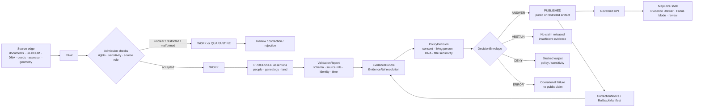

<!-- [KFM_META_BLOCK_V2]
doc_id: TODO(kfm://doc/<uuid>)
title: People, Genealogy/DNA, and Land Ownership Domain
type: standard
version: v1
status: draft
owners: TODO(domain stewardship owner)
created: TODO(YYYY-MM-DD; verify original file creation date)
updated: 2026-04-22
policy_label: restricted
related: [../README.md, ../../registers/AUTHORITY_LADDER.md, ../../../schemas/contracts/v1/people_dna_land/, ../../../policy/people/, ../../../policy/genealogy/, ../../../policy/land_ownership/]
tags: [kfm, domain, people, genealogy, dna, land-ownership, evidence, policy]
notes: [Direct mounted-repo implementation evidence was unavailable during authoring; verify doc_id, owners, original creation date, policy label, related links, and companion paths before publication.]
[/KFM_META_BLOCK_V2] -->

# People, Genealogy/DNA, and Land Ownership Domain

A governed landing page for assertion-first people records, restricted DNA evidence, and temporal land-ownership claims.

<a id="top"></a>


> [!IMPORTANT]
> **Status:** experimental  
> **Owners:** TODO(domain stewardship owner)  
> **Current evidence posture:** CONFIRMED doctrine / PROPOSED implementation plan / UNKNOWN mounted runtime behavior.  
> **Safety posture:** living-person and DNA-derived public output is denied or restricted by default until consent, evidence, source terms, sensitivity, review state, and policy allow it.

**Quick jumps:** [Scope](#scope) · [Repo fit](#repo-fit) · [Inputs](#inputs) · [Exclusions](#exclusions) · [Directory tree](#directory-tree) · [Quickstart](#quickstart) · [Usage](#usage) · [Diagram](#diagram) · [Reference tables](#reference-tables) · [Definition of done](#definition-of-done) · [FAQ](#faq) · [Appendix](#appendix)

---

## Scope

This directory defines the documentation boundary for the KFM People, Genealogy/DNA, and Land Ownership lane.

The lane exists to keep sensitive human, genealogical, DNA, and land-tenure claims from becoming casual map labels. Its public unit of value is the **inspectable claim**: a statement that can resolve back to admissible evidence, source role, time scope, policy posture, review state, release state, and correction lineage.

### Domain commitments

| Commitment | Status | Meaning |
|---|---:|---|
| Assertion-first people modeling | CONFIRMED doctrine | Preserve source-reported assertions before computing any reviewed canonical person view. |
| DNA restricted by default | CONFIRMED doctrine | DNA kit tokens, matches, segments, triangulation groups, and derived relationship hypotheses are restricted unless policy explicitly allows constrained release. |
| Land ownership as temporal evidence | CONFIRMED doctrine | Ownership claims require source role, effective time, recording time, evidence, and chain context. |
| Assessor rows are not title truth | CONFIRMED doctrine | Assessor/tax records can support assessor facts, not authoritative chain-of-title claims by themselves. |
| Parcel geometry is not title boundary proof | CONFIRMED doctrine | Boundary precision claims require source role and evidence support, not map geometry alone. |
| Public UI uses governed outputs | CONFIRMED doctrine / UNKNOWN implementation | Evidence Drawer, Focus Mode, map popups, and exports should consume governed APIs and released artifacts only. |

> [!NOTE]
> This README intentionally uses the hyphenated documentation path `people-genealogy-dna-land` and the machine-oriented family name `people_dna_land`. Keep both stable unless an ADR changes the convention.

---

## Repo fit

**Target path:** `docs/domains/people-genealogy-dna-land/README.md`

This README is the domain landing page. It should orient maintainers, reviewers, and contributors before they touch contracts, schemas, policies, fixtures, source registries, ingest plans, APIs, UI payloads, or generated artifacts for this lane.

| Relationship | Path | Role | Status |
|---|---|---|---:|
| Parent domain index | [`../README.md`](../README.md) | Links this lane to the broader `docs/domains/` map. | NEEDS VERIFICATION |
| Documentation authority register | [`../../registers/AUTHORITY_LADDER.md`](../../registers/AUTHORITY_LADDER.md) | Resolves corpus, repo, lineage, exploratory, and implementation-evidence authority. | NEEDS VERIFICATION |
| Canon / lineage / exploratory register | [`../../registers/CANONICAL_LINEAGE_EXPLORATORY.md`](../../registers/CANONICAL_LINEAGE_EXPLORATORY.md) | Prevents packet or blueprint material from acting as silent canon. | NEEDS VERIFICATION |
| Human semantic contracts | `../../../contracts/people_dna_land/` | Defines object meaning, invariants, lifecycle semantics, and review burdens. | PROPOSED |
| Machine schemas | `../../../schemas/contracts/v1/people_dna_land/` | Defines JSON Schema / OpenAPI-style structure for lane objects. | PROPOSED |
| Policy modules | `../../../policy/{people,genealogy,land_ownership,evidence}/` | Defines deny, abstain, allow, obligation, sensitivity, and publication behavior. | PROPOSED |
| Fixtures and contract tests | `../../../tests/fixtures/people_dna_land/` | Valid / invalid examples for evidence, consent, DNA, chain-of-title, and visibility cases. | PROPOSED |
| Source registry | `../../../data/registry/people_dna_land/` | SourceDescriptor records and source-family backlog. | PROPOSED |
| API notes | `../../api/people_dna_land.md` | Human-readable governed API contract notes. | PROPOSED |
| UI / Evidence Drawer notes | `../../ui/people_dna_land_evidence_drawer.md` | Payload guidance for Evidence Drawer, Focus Mode, map popups, and review surfaces. | PROPOSED |

---

## Inputs

### What belongs in this directory

Use this directory for **documentation about the lane**, not for source data or executable policy.

Accepted content includes:

- domain boundary notes for people, genealogy, DNA, land ownership, and cross-domain joins;
- source-role explanations for documentary, genealogy-tree, DNA, land-instrument, assessor/tax, and geometry sources;
- public-safety and sensitivity notes for living persons, DNA, residential links, tribal/cultural contexts, and title-sensitive outputs;
- diagrams that explain claim flow, evidence resolution, promotion, correction, rollback, or redaction;
- references to contracts, schemas, policies, fixtures, validators, runbooks, source registries, and emitted proof objects;
- migration notes when a later ADR changes path conventions or object names.

### Accepted domain source families

| Source family | Default role | Default posture | What it may support |
|---|---|---|---|
| Vital, cemetery, obituary, church, school, military, census, directory, court, probate | `people_documentary` | public or restricted depending on living status and terms | Source-reported people assertions, names, events, households, organizations, and place associations. |
| GEDCOM, GEDZip-style package, tree overlay | `genealogy_tree` | restricted until reviewed | Candidate person, relationship, and life-event assertions. |
| DNA match CSV, segment file, triangulation group | `dna_restricted` | restricted only | Restricted DNA evidence and relationship hypotheses; not public relationship truth by default. |
| Patent, deed, mortgage, lien, easement, lease, mineral/water/access interest, probate, partition, tax/sheriff sale | `land_instrument` | public or restricted based on terms and sensitivity | Time-scoped land events, instruments, and ownership-interest assertions. |
| Assessor / tax roll | `assessor_tax` | public fact only; not title truth | Assessor-reported facts, tax context, and administrative parcel references. |
| Plat, survey, metes/bounds, PLSS, subdivision, derived geometry, public map | `geometry_or_description` | depends on role and precision | Legal-description parsing, tract context, and geometry support when source role permits. |

---

## Exclusions

The following **do not belong** in this directory:

| Excluded material | Goes instead | Why |
|---|---|---|
| Raw GEDCOM, GEDZip, DNA match, DNA segment, deed image, parcel extract, or title source files | `../../../data/raw/`, `../../../data/work/`, or restricted storage after source admission | This directory is documentation, not source intake. |
| Living-person PII, raw kit IDs, vendor match IDs, consent secrets, or sensitive household joins | Restricted data store / consent ledger after policy review | Public docs must not leak restricted personal or DNA data. |
| JSON Schemas, OpenAPI contracts, or machine validation files | `../../../schemas/contracts/v1/people_dna_land/` | Keep executable structure separate from explanatory docs. |
| Rego policy or policy tests | `../../../policy/` and `../../../tests/policy/` | Policy belongs in the policy layer. |
| Validator source code or ingest scripts | `../../../tools/validators/` or `../../../tools/ingest/` | Executable checks belong outside docs. |
| Released artifacts, receipts, proof packs, catalog records, or runtime logs | `../../../data/receipts/`, `../../../data/proofs/`, `../../../data/catalog/`, `../../../release/` | Emitted instances are evidence objects, not lane documentation. |
| Unsupported relationship narratives or AI summaries | Governed API response envelopes with EvidenceBundle refs | Generated language is not root truth. |

> [!WARNING]
> Do not place real DNA data, raw living-person records, exact residential joins, unredacted title documents, or restricted source extracts in this documentation tree.

---

## Directory tree

Planned companion documentation should stay small, reviewable, and reversible.

```text
docs/domains/people-genealogy-dna-land/
├── README.md                         # this landing page
├── DECISIONS.md                      # PROPOSED: lane decisions and ADR cross-links
├── SOURCE_FAMILIES.md                # PROPOSED: source-family notes and role boundaries
├── PRIVACY_AND_SENSITIVITY.md        # PROPOSED: living-person, DNA, residential, and title-sensitive posture
├── VALIDATION.md                     # PROPOSED: validator, fixture, policy, and gate summary
├── API_AND_UI.md                     # PROPOSED: governed API, Evidence Drawer, Focus Mode payload notes
└── CHANGELOG.md                      # PROPOSED: doc evolution, supersession, and correction notes
```

Machine, policy, data, and test homes should remain outside this directory:

```text
contracts/people_dna_land/                         # PROPOSED human semantic contracts
schemas/contracts/v1/people_dna_land/              # PROPOSED machine contracts
policy/{people,genealogy,land_ownership,evidence}/ # PROPOSED policy modules
tests/fixtures/people_dna_land/                    # PROPOSED valid/invalid fixtures
data/registry/people_dna_land/                     # PROPOSED source descriptors
data/{raw,work,quarantine,processed,catalog,triplet,published}/
data/{receipts,proofs}/
```

[Back to top](#top)

---

## Quickstart

Run these checks before adding or revising lane files in a real checkout.

```bash
git status --short
git branch --show-current

find docs contracts schemas policy tools tests apps packages pipelines data .github \
  -maxdepth 3 -type f | sort | sed -n '1,250p'
```

Before committing any new lane path, verify the current repo convention and update this README if the proposed homes differ.

```bash
find docs/domains -maxdepth 2 -type f -name 'README.md' | sort
find contracts schemas policy tests tools data -maxdepth 3 -type f \
  | grep -E 'people|genealogy|dna|land|evidence|release|runtime|source' \
  | sort
```

Use these as **proposed** validation commands after schemas, policy, validators, and fixtures exist.

```bash
python -m tools.validators.evidence.source_descriptor_validator \
  data/registry/people_dna_land/sources.yaml

python -m tools.validators.evidence.evidence_ref_resolver \
  tests/fixtures/people_dna_land/historical_person_valid.json

python -m tools.validators.genealogy.dna_public_surface_validator \
  tests/fixtures/people_dna_land/dna_segment_public_invalid.json

python -m tools.validators.land_ownership.chain_of_title_validator \
  tests/fixtures/people_dna_land/chain_gap_invalid.json

pytest tests/contracts/cases/people_dna_land tests/policy tests/e2e/people_dna_land
```

> [!CAUTION]
> These commands are intentionally non-destructive. Treat them as a verification checklist until the repo’s actual validator names, package manager, and test runner are confirmed.

---

## Usage

Use this README when you are about to answer one of these questions:

| Question | Use this README to decide |
|---|---|
| “Can this person profile be public?” | Whether living-status, source terms, consent, sensitivity, EvidenceBundle, review, and policy allow it. |
| “Can this DNA match support a public relationship?” | Usually no. DNA evidence is restricted by default and produces hypotheses, not public truth, unless policy allows constrained release. |
| “Can this assessor owner be shown as title owner?” | No. Assessor/tax rows can support assessor facts, not title truth by themselves. |
| “Can a parcel polygon prove a boundary?” | No. Boundary claims need source role and evidence support. |
| “Can Focus Mode summarize a family, chain-of-title, or land/person link?” | Only after EvidenceRef resolves to EvidenceBundle and policy returns an allowable finite outcome. |
| “Where should I put the source data?” | Not here. Use governed lifecycle storage after source admission and policy review. |

### Minimum review posture

Every consequential claim in this lane should be able to answer:

1. What source reported it?
2. What role did that source have?
3. What person, relationship, event, place, parcel, tract, or instrument is being asserted?
4. What time scope applies?
5. What evidence bundle supports it?
6. What policy decision allowed, denied, or restricted it?
7. What review state and correction lineage apply?
8. What public artifact, if any, published it?

---

## Diagram

The lane follows KFM’s governed lifecycle and fails closed when evidence, consent, rights, sensitivity, or review state are insufficient.



[Back to top](#top)

---

## Reference tables

### Claim safety matrix

| Claim or output | Public default | Required support before release |
|---|---:|---|
| Historical person profile | Conditional | Historical/deceased status, source terms, EvidenceBundle, review state, confidence, correction refs. |
| Living-person profile | DENY | Explicit consent, allowed fields, policy decision, review, and restricted-output scope. |
| Unknown living status near present day | DENY or restricted | Living-status determination, policy support, and sensitivity review. |
| DNA kit token | DENY | Restricted-only handling; never raw kit ID in public docs, logs, or UI. |
| DNA segment | DENY | Restricted-only; public segment display is denied by default. |
| Relationship hypothesis from DNA | ABSTAIN or restricted | Consent, documentary evidence, review, restricted visibility, and policy approval. |
| Documentary relationship assertion | Conditional | Source role, evidence refs, time scope, confidence, and review state. |
| Land instrument event | Conditional | Instrument evidence, source role, effective/recording time, rights, and review. |
| Chain-of-title | ABSTAIN if incomplete | Chain steps, gaps/conflicts analysis, source roles, EvidenceBundle, policy decision. |
| Assessor owner statement | Public fact only | Clear `assessor_tax` source role and warning that it is not title truth. |
| Boundary precision claim | ABSTAIN if unsupported | Survey/deed-derived evidence, geometry role, legal description, and review. |

### Object family map

| Object family | What it is | What it is not |
|---|---|---|
| `SourceDescriptor` | Stable source-family description: role, rights, sensitivity, access, cadence, jurisdiction, citation, owner. | A claim or proof of valid ingest. |
| `SourceDocument` | Concrete source item such as deed image, census page, GEDCOM, docket, plat, patent, or DNA batch. | Canonical truth by itself. |
| `DatasetVersion` | Versioned source or normalized dataset identity with `spec_hash`, retrieval metadata, and checksums. | Publication approval. |
| `IngestReceipt` | Process memory for fetch/submission, actor/tool, hashes, lifecycle state, and outcome. | Release-significant proof. |
| `ValidationReport` | Deterministic validator result with finite status, reason codes, obligations, evidence refs, and audit ref. | Policy approval. |
| `EvidenceBundle` | Release-significant evidence package resolving EvidenceRef to sources, documents, validators, reviews, and integrity entries. | AI summary, receipt, or graph edge. |
| `DecisionEnvelope` | Finite outcome: `ANSWER`, `ABSTAIN`, `DENY`, or `ERROR` with reasons, obligations, audit ref, and evidence bundle ref. | Free-form narrative. |
| `PolicyDecision` | Policy engine output with outcome, reasons, obligations, and inputs. | Evidence. |
| `ReviewRecord` | Steward action such as approve, reject, require correction, merge, split, revoke, or promote. | Substitute for evidence. |
| `CorrectionNotice` | Object tying old artifact, corrected artifact, reason, affected claims, and public notice state. | Deletion of history. |
| `CatalogClosure` | Report that catalog, triplet, published, and EvidenceBundle refs close over the same hashes. | Proof of content validity by itself. |
| `GraphProjection` | Derived rebuildable graph/triplet representation according to policy. | Canonical truth. |
| `ReleaseManifest` | Published artifact index with hashes, evidence refs, policy refs, catalog refs, and rollback refs. | RAW or WORK data. |

### Surface boundary

| Surface | Belongs there | Must not contain |
|---|---|---|
| `docs/domains/people-genealogy-dna-land/` | Domain explanation, source-role rules, sensitivity posture, review checklists, diagrams, links. | Raw records, DNA data, policy code, schemas, emitted proofs. |
| `contracts/people_dna_land/` | Human object semantics, invariants, lifecycle expectations. | Machine schema as sole authority. |
| `schemas/contracts/v1/people_dna_land/` | JSON Schema / OpenAPI-like shape, enums, structural constraints. | Narrative doctrine as sole authority. |
| `policy/` | Allow / deny / abstain / obligation logic. | General domain prose or source files. |
| `tests/fixtures/` | Valid and invalid examples. | Real sensitive data. |
| `data/registry/people_dna_land/` | SourceDescriptor records and source backlog. | Raw source captures. |
| `data/receipts/` | Process memory. | Release-grade proof definitions. |
| `data/proofs/` | Proof-bearing emitted objects. | Contract definitions. |
| `release/` | Release manifests, promoted artifact references, rollback references. | RAW, WORK, or QUARANTINE material. |

---

## Definition of done

A first safe PR for this lane is complete only when these gates are satisfied:

- [ ] Phase 0 repo inventory confirms existing people, genealogy, DNA, land, evidence, policy, API, UI, and promotion surfaces.
- [ ] Schema-home ADR resolves whether this lane uses `schemas/contracts/v1/people_dna_land/`, `contracts/people_dna_land/`, or another repo-native convention.
- [ ] Owners and policy label are verified and this meta block is updated.
- [ ] Source families have SourceDescriptor records or a clearly separated backlog.
- [ ] Living-person public output has explicit DENY tests.
- [ ] DNA public output has explicit DENY tests.
- [ ] Assessor-only title claims have explicit DENY or ABSTAIN tests.
- [ ] Chain-of-title gaps have explicit ABSTAIN tests.
- [ ] EvidenceRef-to-EvidenceBundle resolution is required before public answers, drawer payloads, exports, and Focus responses.
- [ ] Correction, revocation, rollback, and graph-projection rebuild behavior are documented.
- [ ] README links are checked from this path.
- [ ] No real sensitive data is included in docs, examples, fixtures, or generated review artifacts.

[Back to top](#top)

---

## FAQ

### Can this lane publish living-person data?

Default posture: **DENY**. Living-person or plausibly living-person output requires consent, policy support, source terms, review state, field-level visibility, and restricted-output controls.

### Can DNA data be used for public genealogy stories?

Default posture: **DENY** for raw or segment-level DNA output. DNA can support restricted hypotheses and steward review. Public relationship claims need evidence-bound, policy-approved support and should not expose raw DNA identifiers, vendor IDs, segments, or triangulation details.

### Can assessor data show who owns land?

It can show an assessor-reported administrative fact when source terms allow it. It must not be promoted into title truth by itself.

### Can a parcel map prove a boundary?

No. Parcel geometry, public map geometry, and derived geometry are not title boundary proof unless source role, evidence, and review state support that claim.

### Can AI answer questions about families, DNA, or ownership?

Only through the governed API path. AI / Focus Mode must receive released, policy-safe context, resolve EvidenceRef to EvidenceBundle, emit a finite outcome, and cite or abstain. It cannot become the root truth source.

---

## Appendix

<details>
<summary>Illustrative public-safe Evidence Drawer payload</summary>

This is an illustrative shape only. It is not a confirmed live DTO.

```json
{
  "claim_id": "kfm://claim/TODO",
  "outcome": "ANSWER",
  "evidence_bundle_ref": "kfm://evidence-bundle/TODO",
  "evidence_refs": ["kfm://evidence-ref/TODO"],
  "source_roles": ["deed", "probate", "assessor_tax"],
  "policy_decision_ref": "kfm://policy-decision/TODO",
  "sensitivity_label": "public",
  "rights_status": "open",
  "review_state": "reviewed",
  "confidence": {
    "value": 0.0,
    "method": "source_role_weighted"
  },
  "time_scope": {
    "start": "TODO",
    "end": "TODO",
    "basis": "effective"
  },
  "spatial_scope": {
    "place_ref": "kfm://place/TODO",
    "geometry_role": "deed-derived"
  },
  "correction_refs": [],
  "provenance_chain": [],
  "visibility_notes": "Assessor facts are displayed only as assessor facts, not title truth.",
  "reason_codes": [],
  "obligations": []
}
```

</details>

<details>
<summary>Open verification backlog</summary>

- NEEDS VERIFICATION: current repo branch, target file existence, and adjacent README conventions.
- NEEDS VERIFICATION: owners, steward roles, review process, and CODEOWNERS.
- NEEDS VERIFICATION: schema home for people, genealogy/DNA, land ownership, evidence, release, and runtime envelopes.
- NEEDS VERIFICATION: policy engine availability, OPA/Conftest version, and policy test convention.
- NEEDS VERIFICATION: live API routes, framework, DTO naming, auth middleware, and route guards.
- NEEDS VERIFICATION: MapLibre shell path, Evidence Drawer implementation, Focus Mode implementation, and drawer payload contract.
- NEEDS VERIFICATION: source rights, source terms, citation text, update cadence, and allowed redistribution for each source family.
- NEEDS VERIFICATION: signing, promotion tooling, proof-pack conventions, release manifest home, and rollback implementation.
- NEEDS VERIFICATION: production deployment topology, reverse proxy, VPN, firewall, logs, and local exposure boundary.

</details>

[Back to top](#top)
