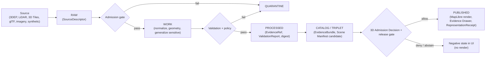

<!-- [KFM_META_BLOCK_V2]
doc_id: kfm://doc/planetary-3d/readme
title: Planetary / 3D / Digital Twin / Synthetic Spatial — Domain README
type: standard
version: v1
status: draft
owners: Planetary-3D domain steward; Renderer/MapLibre owner; Sensitivity reviewer; Docs steward (placeholders — NEEDS VERIFICATION)
created: 2026-06-07
updated: 2026-06-07
policy_label: public
related: [ai-build-operating-contract.md, directory-rules.md, docs/architecture/maplibre-3d.md, schemas/contracts/v1/scene/, contracts/scene/, policy/release/scene/, policy/maplibre/, packages/maplibre-runtime/]
tags: [kfm, planetary, 3d, digital-twin, synthetic, maplibre, scene, reality-boundary, carrier]
notes:
  - CONTRACT_VERSION = "3.0.0".
  - 3D is a CARRIER, never a truth source — it renders/relates/represents released governed evidence; never an instruction or alert surface.
  - Renderer doctrine: MapLibre GL JS is the sole browser-side renderer (Directory Rules v1.3); Cesium is RETIRED. Sole-renderer ADR is PROPOSED.
  - Slug planetary-3d is PROPOSED; Atlas §24.13 uses the scene/ segment (schemas/contracts/v1/scene/, contracts/scene/, policy/release/scene/). See OQ-P3D-01.
  - Synthetic / reconstructed / interpolated content must carry a Reality Boundary Note; living-person and DNA-linked locations do not enter terrain-anchored or true-3D scenes.
[/KFM_META_BLOCK_V2] -->

<a id="top"></a>

# 🌐 Planetary / 3D / Digital Twin / Synthetic Spatial Systems

> Domain README for the lane that **renders, relates, and represents** released governed evidence in 3D — terrain, point clouds, 3D Tiles, glTF, digital-twin and synthetic surfaces — under a strict carrier rule: 3D **carries** evidence, it never **authors** it, and it is never an instruction or alert surface.

[](#status)
[-1565c0)](#repo-fit)
[](#1-identity-and-purpose)
[-blueviolet)](#3-renderer-doctrine)
[](#7-3d-admission-and-sensitivity)
[](#footer)
[](#footer)

**Status:** `draft` · **Owners:** Planetary-3D domain steward · Renderer/MapLibre owner · Sensitivity reviewer · Docs steward *(placeholders — NEEDS VERIFICATION)* · **Updated:** 2026-06-07
**Pinned:** `CONTRACT_VERSION = "3.0.0"`

> [!IMPORTANT]
> **3D is a carrier, not a truth source.** This lane renders released governed evidence; it does not own geology, hydrology, archaeology, settlements, infrastructure, hazards, habitat, fauna, flora, people, land, roads, agriculture, soil, or atmosphere truth. A 3D scene may **cite** domain releases under admission rules; it is **never** an instruction or alert surface. `[ENCY] [MAP-MASTER] [UIAI]`

---

## Contents

- [Repo fit](#repo-fit)
- [1. Identity and purpose](#1-identity-and-purpose)
- [2. Scope and non-ownership](#2-scope-and-non-ownership)
- [3. Renderer doctrine](#3-renderer-doctrine)
- [4. Ubiquitous language](#4-ubiquitous-language)
- [5. Object families](#5-object-families)
- [6. Source families](#6-source-families)
- [7. 3D admission and sensitivity](#7-3d-admission-and-sensitivity)
- [8. Pipeline shape](#8-pipeline-shape)
- [9. Cross-lane relations](#9-cross-lane-relations)
- [10. Governed AI behavior](#10-governed-ai-behavior)
- [11. Viewing products](#11-viewing-products)
- [Open questions](#open-questions)
- [Verification backlog](#verification-backlog)
- [Related docs](#related-docs)

---

## Repo fit

**PROPOSED placement (NEEDS VERIFICATION until repo mounted).** Per Directory Rules §12, a domain is a lane segment inside responsibility roots. The docs landing lives under `docs/domains/<domain>/`.

```text
docs/domains/planetary-3d/README.md   ← this file (PROPOSED slug)
```

| Responsibility root | Lane path (PROPOSED) |
|---|---|
| Object meaning | `contracts/scene/`, `contracts/3d/` |
| Object shape | `schemas/contracts/v1/scene/`, `schemas/contracts/v1/maplibre/`, `schemas/contracts/v1/3d/` |
| Release / admission policy | `policy/release/scene/`, `policy/maplibre/3d-admission.rego`, `policy/maplibre/plugin-admission.rego` |
| Renderer adapter | `packages/maplibre-runtime/` (sole browser-side renderer) |
| Receipts | `data/receipts/` (`RepresentationReceipt`) |
| Architecture doctrine | `docs/architecture/maplibre-3d.md` |

> [!WARNING]
> **Slug is PROPOSED (CONFLICTED → ADR).** Atlas §24.13 lists this lane's homes under the `scene/` segment (`schemas/contracts/v1/scene/`, `contracts/scene/`, `policy/release/scene/`), not a `planetary-3d` segment. The docs slug `planetary-3d` is inferred from the lane title; reconcile the docs slug vs the `scene/` machine segment by ADR. Tracked as `OQ-P3D-01`. `[DIRRULES §12; ATLAS §24.13]`

[↑ Back to top](#top)

---

## 1. Identity and purpose

**CONFIRMED doctrine / PROPOSED implementation.** This domain governs terrain models, 3D tile sets, glTF assets, point clouds, digital-twin views, synthetic surfaces, scene manifests, representation receipts, reality-boundary notes, 3D admission decisions, and public-safe scenes. `[Atlas §18.A] [ENCY] [MAP-MASTER] [UIAI]`

The lane's defining stance is **3D as carrier**: 3D carries evidence; it never authors it. Every 3D layer consumes the same `EvidenceBundle` and `DecisionEnvelope` as 2D — 3D is an alternate **rendering mode** within one renderer, not an alternate truth path. `[maplibre-3d.md §4]`

[↑ Back to top](#top)

---

## 2. Scope and non-ownership

**This domain owns** (CONFIRMED/PROPOSED, Atlas §18.B): Scene Manifest; Terrain Model; 3D Tile Set; glTF Asset; Point Cloud; Digital Twin View; Synthetic Surface; ViewState; Representation Receipt; Reality Boundary Note; 3D Admission Decision. `[ENCY] [MAP-MASTER] [UIAI]`

**This domain does not own:** This lane renders, relates, or represents released governed evidence; it does **not** own geology, hydrology, archaeology, settlements, infrastructure, hazards, habitat, fauna, flora, people, land, roads, agriculture, soil, or atmosphere truth. `[ENCY] [MAP-MASTER] [UIAI]`

| Belongs here | Goes elsewhere |
|---|---|
| Scene manifests, terrain models, 3D tiles, glTF, point clouds | The underlying domain truth being rendered (each owning lane) |
| Synthetic/digital-twin views, reality-boundary notes | Subsurface stratigraphy (out of scope for browser rendering) |
| 3D admission decisions, representation receipts, view state | Emergency instruction / alert authority (never KFM) |

[↑ Back to top](#top)

---

## 3. Renderer doctrine

**CONFIRMED at doctrine level (Directory Rules v1.3) / PROPOSED ADR.** MapLibre GL JS is KFM's **sole browser-side renderer**; **Cesium is retired**. All 3D capability flows through MapLibre's native surface (terrain via `raster-dem` + `setTerrain`, globe projection, sky, hillshade, fill-extrusion) plus an admission-gated plugin ecosystem (three.js, `3d-tiles-renderer`, `maplibre-three-plugin`, `maplibre-gl-lidar`, deck.gl interleaved, `pmtiles`, `maplibre-cog-protocol`), hosted inside `packages/maplibre-runtime/`. `[DIRRULES v1.3 §0, §11; maplibre-3d.md §0.1]`

> [!IMPORTANT]
> Application code MUST NOT import renderer/plugin libraries directly — all 3D goes through the governed `packages/maplibre-runtime/` adapter, which runs the 3D Admission Decision before `setTerrain` / `setProjection({type:'globe'})` / any plugin layer, and emits a `RepresentationReceipt` after each render-frame batch. The dual-renderer posture (KFM-P2-FEAT-0012) is **PROPOSED-SUPERSEDED**; the sole-renderer ADR is `OQ-P3D-02`. `[DIRRULES v1.3 §7.2.a, §13.5; maplibre-3d.md Appendix B]`

[↑ Back to top](#top)

---

## 4. Ubiquitous language

**CONFIRMED terms / PROPOSED field realization** (Atlas §18.C; maplibre-3d §12). `[ENCY] [MAP-MASTER] [UIAI]`

| Term | Meaning in this lane |
|---|---|
| `Scene Manifest` | Declares the layers, projection, and view a 3D scene composes. |
| `Terrain Model` / `3D Tile Set` / `glTF Asset` / `Point Cloud` | Rendered geometry carriers, each evidence-bound. |
| `Digital Twin View` / `Synthetic Surface` | Composite / generated views; synthetic carries a Reality Boundary Note. |
| `ViewState` | The camera/projection/time-slice state of a render. |
| `Representation Receipt` | What was rendered, when, with which spec_hashes and plugin versions. |
| `Reality Boundary Note` | Tells the user where a scene is reconstructed / interpolated / synthetic, not observed. |
| `3D Admission Decision` | Governed allow/deny/abstain gating a layer's 3D participation. |
| `3D as carrier` | 3D *carries* evidence; never authors it. |

[↑ Back to top](#top)

---

## 5. Object families

**CONFIRMED owned families (Atlas §18.E) / PROPOSED identity rule.** Identity rule (PROPOSED): source id + object role + temporal scope + normalized digest; source/observed/valid/retrieval/release/correction times stay distinct where material. Sensitivity defaults vary by content (Atlas §24.14). `[ENCY] [MAP-MASTER] [UIAI]`

| Object family | Sensitivity default |
|---|---|
| Scene Manifest / ViewState / LayerManifest | T0 (manifest); content tiers vary |
| Terrain Model / 3D Tile Set / glTF Asset / Point Cloud | T0 / T1 / T2 / T4 by content sensitivity |
| Digital Twin View | by content sensitivity |
| Synthetic Surface | T1 / T2 with mandatory Reality Boundary Note (internal carrier; not cross-cited) |
| Representation Receipt | T0 (manifest) / T2 audit-only |
| Reality Boundary Note | T0 (must accompany synthetic/interpretive layers) |
| 3D Admission Decision | T2 / T0 depending on contents (a `PolicyDecision` subtype) |

[↑ Back to top](#top)

---

## 6. Source families

**CONFIRMED families (Atlas §18.D) / NEEDS VERIFICATION on rights.** Rights and current terms are NEEDS VERIFICATION per source; sensitive joins fail closed. `[ENCY] [MAP-MASTER] [UIAI]`

1. USGS 3DEP and terrain sources
2. LiDAR and point-cloud collections
3. 3D Tiles and glTF assets
4. Terrain services and imagery
5. 3D archaeology documentation *(steward + cultural review; generalized only)*
6. Synthetic and model surfaces *(carry Reality Boundary Note)*
7. Planetary datasets
8. MapLibre / tile / renderer artifacts

[↑ Back to top](#top)

---

## 7. 3D admission and sensitivity

**CONFIRMED default-deny matrix (maplibre-3d §8.1).** Every 3D-enabled layer passes the 3D Admission Decision **before** any terrain/globe/plugin call. `[maplibre-3d.md §8.1; ENCY §24.5]`

| Condition | Default |
|---|---|
| Missing `EvidenceBundle` for the layer | **DENY** |
| Missing `PolicyDecision` (rights, sensitivity, source authority) | **DENY** |
| Missing or drifted plugin pin | **DENY** |
| Living-person data | **DENY for 3D** |
| Archaeology without coordinate generalization | **DENY for terrain-anchored render** |
| Rare-species precise location | **DENY for terrain-anchored render** |
| Source role unknown (no `SourceDescriptor`) | **ABSTAIN** |
| Source role `modeled`/synthetic with no Reality Boundary Note | **ABSTAIN** |
| Stale-vs-released conflict | **ABSTAIN** + degraded badge |
| All gates clear | **ALLOW** |

> [!CAUTION]
> **Style filters never substitute for transformation.** A sensitive layer reaching MapLibre has already been generalized/redacted upstream and declares its transform and authorizing `PolicyDecision` in the `LayerManifest`; the renderer only ever sees the public-safe version. Living-person data and DNA-linked locations do **not** enter terrain-anchored or true-3D scenes. Globe projection does not lower the bar — a layer denied in 2D stays denied in globe. `[maplibre-3d.md §8.2, §8.4]`

[↑ Back to top](#top)

---

## 8. Pipeline shape

**CONFIRMED doctrine / PROPOSED lane application.** The lane follows the lifecycle invariant; promotion is a governed state transition, not a file move; sensitive content admitted only via steward-reviewed, generalized representation with a reality-boundary note. `[DIRRULES] [ENCY] [MAP-MASTER] [UIAI]`



[↑ Back to top](#top)

---

## 9. Cross-lane relations

**CONFIRMED/PROPOSED (Atlas §18.F, §24.4.16).** A 3D scene may cite domain releases under admission rules; never an instruction or alert surface. Every relation preserves ownership, source role, sensitivity, and `EvidenceBundle` support. `[ENCY] [MAP-MASTER] [UIAI]`

| Related lane | Relation | Constraint |
|---|---|---|
| Spatial Foundation | CRS, vertical datum, terrain, geometry support | Geometry/version support; no truth ownership transfer. |
| Archaeology | 3D documentation and cultural review | Admitted only via steward-reviewed, generalized 3D + reality-boundary note; site coords denied. |
| Infrastructure | critical facility/dependency scene exposure controls | Default-deny on critical detail; generalized only. |
| Hazards | scenario/exposure context | Context without emergency instruction; KFM is never an alert authority. |
| All domains | 3D scenes cite domain releases | Under admission rules; never an instruction/alert surface; Evidence Drawer discipline as for 2D. |

[↑ Back to top](#top)

---

## 10. Governed AI behavior

**CONFIRMED doctrine / PROPOSED implementation.** AI may summarize **released** evidence, compare it, and explain limitations, and MUST ABSTAIN when evidence is insufficient and DENY where policy, rights, sensitivity, or release state blocks the request. Synthetic content presented as observed reality is a DENY/HOLD condition; it carries a Reality Boundary Note and Representation Receipt. AI is never the root truth source. `[GAI] [ENCY §24.1.2]`

[↑ Back to top](#top)

---

## 11. Viewing products

**PROPOSED (Atlas §18.G).** Terrain evidence view; point-cloud review view; 3D tile scene view; glTF asset inspection; digital-twin composite view; synthetic-surface comparison; reality-boundary overlay; 3D admission review view; planetary reference view. Cross-cutting (CONFIRMED): Evidence Drawer, time-aware state, trust badges, sensitivity-redacted view, correction/stale-state view, governed Focus Mode. `[ENCY] [MAP-MASTER] [GAI]`

[↑ Back to top](#top)

---

## Open questions

| ID | Question | Owner role | Resolution path |
|---|---|---|---|
| OQ-P3D-01 | Docs slug `planetary-3d` vs the `scene/` machine segment (Atlas §24.13)? | Architecture + docs steward | ADR + Directory Rules §12 |
| OQ-P3D-02 | Accept the MapLibre-sole-renderer / retire-Cesium ADR (number to assign; ADR-0003 numbering conflict). | Renderer owner + docs steward | `docs/adr/ADR-NNNN-maplibre-sole-renderer-retire-cesium.md` |
| OQ-P3D-03 | `3d-tiles-renderer` and plugin licenses (Apache 2.0 / BSD-3 NEEDS VERIFICATION). | Renderer owner | Per-plugin license review; plugin-admission policy |
| OQ-P3D-04 | Plugin pin set and supply-chain attestation in `packages/maplibre-runtime/src/plugin-registry.ts`. | Renderer owner | Repo inspection + plugin-admission `PolicyDecision` |

## Verification backlog

These remain `NEEDS VERIFICATION` before promotion from `draft` to `published`:

1. 3D Admission Decision policy (`policy/maplibre/3d-admission.rego`) and schema present and enforced.
2. Plugin Admission policy and pinned plugin registry present.
3. `RepresentationReceipt` and `Reality Boundary Note` schemas present.
4. Sensitive-geometry transform (upstream generalization, not style filter) verified.
5. Living-person / DNA exclusion from terrain-anchored and true-3D scenes verified.
6. Sole-renderer ADR accepted; no `cesium*` segment present.
7. Per-source rights and current terms (Atlas §18.D leaves all NEEDS VERIFICATION).

## Related docs

- `docs/architecture/maplibre-3d.md` — sole-renderer doctrine, 3D feature surface, admission gates, plugin ecosystem.
- `ai-build-operating-contract.md` — operating contract (`CONTRACT_VERSION = "3.0.0"`).
- `directory-rules.md` — §12 Domain Placement Law; v1.3 renderer-decision refresh (Cesium retired).
- `schemas/contracts/v1/scene/`, `contracts/scene/`, `policy/release/scene/` — scene homes *(PROPOSED)*.
- `packages/maplibre-runtime/` — governed sole-renderer adapter *(PROPOSED)*.
- Atlas v1.1 §18 (Planetary / 3D / Digital Twin / Synthetic), §24.4.16 (edges), §24.13 (responsibility-root crosswalk).

---

<sub>Last updated 2026-06-07 · Pinned `CONTRACT_VERSION = "3.0.0"` · Status: draft · [↑ Back to top](#top)</sub>
