<!-- [KFM_META_BLOCK_V2]
doc_id: kfm://doc/NEEDS-VERIFICATION
title: Roads, Rail, and Trade Routes
type: standard
version: v1
status: draft
owners: NEEDS-VERIFICATION
created: NEEDS-VERIFICATION
updated: 2026-04-22
policy_label: NEEDS-VERIFICATION
related: [../../README.md, ../README.md, ../../../data/registry/transport/sources.yaml, ../../../schemas/transport/README.md, ../../../schemas/contracts/v1/transport/README.md, ../../../policy/transport/README.md, ../../../tests/transport/README.md]
tags: [kfm, domains, roads, rail, trade-routes, transport, evidence, maplibre, governance]
notes: [Target path provided by current task; baseline roads/rail/trade-routes plan uses transport as the machine-family shorthand; owners, created date, final policy label, target path existence, schema home, and related path validity need mounted-repo verification.]
[/KFM_META_BLOCK_V2] -->

<a id="top"></a>

# Roads, Rail, and Trade Routes

Governed domain landing page for Kansas movement-system evidence, public-safe transport layers, and time-aware claims about roads, rail, corridors, restrictions, facilities, and historic mobility.

<div align="left">


</div>

> [!IMPORTANT]
> **Status:** `experimental`  
> **Owners:** `NEEDS VERIFICATION`  
> **Path:** `docs/domains/roads-rail-trade-routes/README.md`  
> **Implementation posture:** source-grounded README draft; exact repo topology, CODEOWNERS, schema home, CI, route names, and runtime behavior still need direct checkout verification.  
> **Quick jumps:** [Scope](#scope) · [Repo fit](#repo-fit) · [Inputs](#inputs) · [Exclusions](#exclusions) · [Evidence snapshot](#evidence-snapshot) · [Domain model](#domain-model) · [Lifecycle](#lifecycle) · [Directory tree](#directory-tree) · [Quickstart](#quickstart) · [Map/UI/AI boundaries](#map-ui-and-ai-boundaries) · [Definition of done](#definition-of-done) · [Verification backlog](#verification-backlog) · [FAQ](#faq) · [Appendix](#appendix)

> [!WARNING]
> **Naming alignment needs verification.** The roads/rail/trade-routes architecture baseline uses `transport` as the machine-family shorthand and proposes `docs/domains/transport/README.md`. This file is authored at the explicit requested path, `docs/domains/roads-rail-trade-routes/README.md`. Treat `transport` below as the compact object-family and artifact prefix, not as a silent rename of the requested domain slug.

---

## Scope

This directory is the human-readable control plane for the KFM lane that handles movement systems across Kansas and adjacent frontier context.

It covers:

| Domain area | Required posture |
|---|---|
| Modern roads and highways | Geometry, jurisdiction, designation, restrictions, and status stay separate. Legal or official claims require governing or authoritative sources. |
| Historic roads and trails | Wagon roads, military roads, mail routes, emigrant routes, stage routes, cattle trails, market roads, grain/livestock corridors, and settlement corridors begin as evidence-backed claims with uncertainty profiles. |
| Rail corridors | Rail alignment, operator, ownership, status, abandonment, sidings, depots, yards, branches, crossings, and spurs are separate temporal facts. |
| Freight and logistics routes | Freight designation, modeled flow, observed movement, legal status, and administrative classification are not interchangeable. |
| Crossings and continuity facilities | Bridges, ferries, fords, river crossings, culverts, tunnels, terminals, depots, yards, and intermodal facilities are first-class objects with review and sensitivity controls. |
| Indigenous trade and mobility corridors | Default steward/review posture. Oral-history, treaty, cultural, or interpretive evidence must not be converted into falsely precise public geometry. |
| Graph projections | Routing, traversal, and corridor reasoning graphs are derived projections only. Graph edges never replace canonical records. |
| Evidence-backed UI and Focus Mode | Public and ordinary clients use governed APIs and released artifacts only; unsupported answers must `ABSTAIN`, policy-blocked answers must `DENY`, and system failures must return `ERROR`. |

### This lane protects three separations

1. **Thing vs. claim:** a road segment, a route designation, a historic route claim, and a public map line are different objects.
2. **Canonical vs. derived:** graph projections, tiles, generalized corridors, story nodes, and Focus answers are downstream products.
3. **Evidence vs. narration:** a polished route narrative is useful only when it resolves back to EvidenceBundle support, source role, review state, release state, and correction lineage.

<p align="right"><a href="#top">Back to top ↑</a></p>

---

## Repo fit

| Relationship | Path or link | Status | Role |
|---|---|---:|---|
| This README | [`./README.md`](./README.md) | CONFIRMED target path from task | Domain landing page and navigation hub. |
| Parent domain index | [`../README.md`](../README.md) | NEEDS VERIFICATION | Should list this lane among other KFM domain lanes. |
| Docs index | [`../../README.md`](../../README.md) | NEEDS VERIFICATION | Should connect domain docs to project-wide documentation. |
| Candidate transport alias | `../transport/README.md` | PROPOSED / NEEDS VERIFICATION | Baseline plan used `transport`; use ADR before aliasing or moving. |
| Source registry | `../../../data/registry/transport/` | PROPOSED | SourceDescriptor candidates, rights matrix, sensitivity defaults, and activation backlog. |
| Machine schemas | `../../../schemas/transport/` or `../../../schemas/contracts/v1/transport/` | CONFLICTED / NEEDS VERIFICATION | Schema home must be resolved by ADR before duplicate definitions appear. |
| Policy gates | `../../../policy/transport/` | PROPOSED | Publication, source-role, sensitivity, historic-corridor, Focus, and catalog-closure policy. |
| Validators | `../../../tools/validators/transport/` | PROPOSED | Schema, geometry, temporal, source-role, public-safety, proof, and runtime-envelope checks. |
| Fixtures and tests | `../../../tests/transport/` | PROPOSED | Valid/invalid fixtures, policy tests, runtime envelope tests, no-network pipeline tests. |
| Governed API | `../../../apps/governed-api/openapi/transport.openapi.yaml` | PROPOSED | Framework-neutral API contract for route, corridor, restriction, facility, evidence, and Focus surfaces. |
| MapLibre layer descriptors | `../../../ui/maplibre/layers/transport_layers.yaml` | PROPOSED | Released layer references and trust-visible layer metadata. |
| ADRs | `../../adr/ADR-transport-schema-home.md` | PROPOSED | First required decision record for schema placement and naming alignment. |

> [!NOTE]
> Do not treat these paths as implemented until the mounted repository proves them. This README is intentionally precise about proposed homes while keeping implementation depth bounded.

<p align="right"><a href="#top">Back to top ↑</a></p>

---

## Inputs

Material belongs here when it helps maintainers understand, review, or evolve the roads/rail/trade-routes lane.

| Accepted input | Belongs here when | Required handling |
|---|---|---|
| Domain architecture notes | They define lane boundaries, trust rules, and update responsibilities. | Label `CONFIRMED`, `PROPOSED`, `UNKNOWN`, or `NEEDS VERIFICATION` where confidence matters. |
| Source-family summaries | They describe source roles, rights posture, update cadence, sensitivity, or activation status. | Link to SourceDescriptor records; do not paste live secrets or unverified endpoint assumptions. |
| Data-model explanations | They clarify object families, identity, temporal scope, non-conflation rules, or public-safe geometry behavior. | Keep machine schema fields synchronized with schema index after schema-home ADR lands. |
| Lifecycle and promotion guidance | They explain RAW → WORK/QUARANTINE → PROCESSED → CATALOG/TRIPLET → PUBLISHED behavior. | Reference receipts, proofs, release manifests, rollback targets, and correction paths. |
| UI and Evidence Drawer notes | They document what MapLibre layers, popups, trust chips, drawers, and Focus surfaces may show. | Make EvidenceBundle, policy, review, freshness, and correction state visible. |
| Test and fixture inventories | They describe valid/invalid examples, deny cases, abstain cases, smoke tests, and promotion-gate tests. | Include both positive and negative fixtures; prevent raw/work/quarantine leakage. |
| Change history | It explains meaningful schema, source, policy, API, UI, release, or rollback changes. | Preserve supersession and correction lineage. |

<p align="right"><a href="#top">Back to top ↑</a></p>

---

## Exclusions

| Do not put here | Goes instead | Why |
|---|---|---|
| Raw source downloads, scans, tiles, or extracted geometry | `data/raw/transport/`, `data/work/transport/`, or source-controlled fixture homes after review | Docs are not a data lake. |
| Processed canonical records | `data/processed/transport/` or database/migration surfaces after repo verification | Human-readable docs must not become canonical storage. |
| Published PMTiles, GeoJSON, COGs, vector tiles, or release bundles | `data/published/transport/`, `data/releases/transport/`, and release manifests | Publication is a governed state transition, not a README attachment. |
| Machine schemas | `schemas/transport/` or `schemas/contracts/v1/transport/` after ADR | Schema authority must be singular and testable. |
| Policy code | `policy/transport/` | Policy must be executable or testable, not prose-only. |
| API route handlers or UI components | `apps/`, `packages/`, or `ui/` after repo inspection | Implementation belongs behind governed interfaces and verified package conventions. |
| Secrets, tokens, credentials, private endpoints | Never in Markdown | Source access must be governed and least-privilege. |
| Exact sensitive facility or culturally sensitive corridor geometry | Restricted steward-controlled storage, if allowed at all | Public release fails closed until sensitivity, rights, review, and transform receipts support disclosure. |
| Unreviewed AI answers or route narratives | Runtime receipts, evidence-backed examples, or denied/abstained fixtures | AI is interpretive only and cannot become source evidence. |
| Emergency navigation, closure, detour, or life-safety instructions | Official source systems and emergency channels | KFM is not an emergency alerting or live-routing authority. |

<p align="right"><a href="#top">Back to top ↑</a></p>

---

## Evidence snapshot

| Claim | Label | Basis |
|---|---:|---|
| KFM doctrine requires governed lifecycle movement from source edge through publication. | CONFIRMED doctrine | Repeated KFM pipeline and domain-lane doctrine. |
| The roads/rail/trade-routes lane should be evidence-first, map-first, time-aware, reviewable, correctable, and rollback-capable. | CONFIRMED doctrine / PROPOSED lane design | Roads/rail/trade-routes architecture baseline. |
| The durable value is not “a road layer,” but a governed transport-knowledge lane with inspectable claims. | CONFIRMED doctrine / PROPOSED lane design | Roads/rail/trade-routes baseline and KFM artifactization doctrine. |
| This README’s requested path is `docs/domains/roads-rail-trade-routes/README.md`. | CONFIRMED request | Current task. |
| The baseline plan proposed `docs/domains/transport/README.md` and `transport` object/artifact names. | CONFIRMED source detail | Roads/rail/trade-routes baseline. |
| Current target repo files, owners, branch, package manager, workflow YAML, schema home, test runner, UI shell, route names, and runtime logs are verified. | UNKNOWN | No mounted checkout was available during this authoring pass. |
| All source endpoints, licenses, terms, update cadence, steward roles, sensitive-location rules, signing toolchain, and public-release policy are current. | NEEDS VERIFICATION | Must be checked before source activation or publication. |

<p align="right"><a href="#top">Back to top ↑</a></p>

---

## Domain model

### Non-conflation rules

The lane must keep these concepts distinct:

| Concept | Must not be collapsed into |
|---|---|
| Road or rail physical alignment | Route designation, legal status, operator, freight role, public truth level |
| Corridor route | Segment geometry, graph edge, story narrative, tile feature |
| Route membership | Permanent identity; membership is temporal and evidence-scoped |
| Rail alignment | Operator, owner, abandonment status, or service state |
| Restriction event | Segment attribute without time, freshness, and source |
| Historic route claim | Exact public geometry unless reviewed and justified |
| Indigenous mobility corridor | Falsely precise polyline, public exact location, or unreviewed cultural interpretation |
| Graph edge | Canonical route truth |
| MapLibre feature | EvidenceBundle, policy decision, or release proof |

### Object-family map

| Object family | Purpose | Publication posture |
|---|---|---|
| `RoadSegment` | Physical road geometry segment, not designation. | Public only when rights, sensitivity, review, and source-role checks pass. Legal meaning requires authoritative support. |
| `RailSegment` | Physical rail alignment, not operator or owner. | Yard, spur, depot, and critical facility geometry require sensitivity review. |
| `CorridorRoute` | Named/designated route or corridor container. | Designation requires source-role support; route editions are temporal. |
| `RouteMembership` | Time-scoped relationship between route/corridor and segment/facility. | Contradictory memberships must be scoped or denied. |
| `NetworkNode` | Junction, terminal, depot node, crossing node, or graph anchor. | Graph-only nodes must be marked derived. |
| `Crossing` | Bridge, ferry, ford, grade crossing, interchange, or river crossing. | Exact display may be generalized where facility sensitivity requires. |
| `TransportFacility` | Depot, yard, terminal, siding, spur, intermodal site, culvert, tunnel. | Default sensitivity review for yards, depots, industrial facilities, and critical infrastructure. |
| `RestrictionEvent` | Closure, detour, embargo, speed/height/weight/access limit, work zone. | Requires event time interval, freshness, and authoritative source posture. |
| `StatusEvent` | Opening, abandonment, route change, transfer, washout, failure, restoration. | Public if reviewed, rights-safe, and time-scoped. |
| `OperatorAssignment` | Temporal owner/operator/role assignment. | Never infer from alignment alone. |
| `AlignmentVersion` | Versioned geometry state with supersession chain. | Derived/generalized versions never replace canonical alignment records. |
| `HistoricRouteClaim` | Claim about historic path, use, relation, or period. | EvidenceBundle required before public narrative; exact geometry denied unless reviewed. |
| `TradeRouteCorridor` | Indigenous, trade, migration, cattle, market, or settlement corridor abstraction. | Public-safe generalized by default; steward review controls sensitive release. |
| `PublicGeneralizationTransformReceipt` | Records exact-to-public-safe geometry transform. | Required when public output differs from internal/steward geometry. |

<p align="right"><a href="#top">Back to top ↑</a></p>

---

## Lifecycle

KFM’s transport lane follows the fixed trust path. Public clients never bypass it.

```mermaid
flowchart LR
  S["Source edge<br/>SourceDescriptor · rights · role · cadence"] --> R["RAW<br/>source bytes or immutable refs"]
  R --> W{"WORK validation<br/>schema · source role · geometry · time"}
  W -->|valid| P["PROCESSED<br/>normalized records"]
  W -->|invalid / restricted / ambiguous| Q["QUARANTINE<br/>reviewable hold"]
  P --> C["CATALOG<br/>STAC · DCAT · PROV"]
  P --> T["TRIPLET / GRAPH<br/>derived projection only"]
  C --> M["Proof pack + ReleaseManifest"]
  T --> M
  M --> G{"Promotion decision"}
  G -->|promote| Pub["PUBLISHED<br/>public-safe artifacts"]
  G -->|hold / deny| Q
  Pub --> API["Governed API<br/>release-aware · no raw/work access"]
  API --> UI["MapLibre shell<br/>layers · Evidence Drawer · Focus"]
  UI --> Corr["Correction / withdrawal / rollback"]

  classDef governed fill:#eef6ff,stroke:#4c6ef5,color:#1c2d5a;
  classDef blocked fill:#fff4e6,stroke:#f08c00,color:#5f370e;
  classDef public fill:#ebfbee,stroke:#2f9e44,color:#0b3d1b;

  class S,R,W,P,C,T,M,G,API,UI governed;
  class Q blocked;
  class Pub,Corr public;
```



### Promotion minimums

A public or steward-facing release must have:

| Gate | Required evidence | Failure behavior |
|---|---|---|
| Source activation | SourceDescriptor, source role, rights posture, access method, cadence, steward/reviewer owner | `DENY` activation or keep in backlog |
| Schema validity | JSON/schema validation for each object family | `QUARANTINE` or block release |
| Geometry/CRS discipline | CRS, precision, support, validity, transform receipts where needed | `ABSTAIN` for claims; block public layer |
| Temporal validity | `valid_from`, `valid_to`, event time, source date, or explicit unknown handling | Block contradictory or unscoped claims |
| Source-role gate | Legal/official claims use governing or authoritative sources | `DENY` unsupported authority claims |
| Rights/sensitivity gate | Rights summary, sensitivity class, public-safe transform reason | Fail closed |
| EvidenceBundle closure | EvidenceRef resolves to EvidenceBundle with source records and claim refs | `ABSTAIN` public answer |
| Catalog/proof closure | STAC/DCAT/PROV, CatalogMatrix, artifact digests, release manifest | `DENY` promotion |
| Runtime envelope | `ANSWER`, `ABSTAIN`, `DENY`, or `ERROR` only | No free-form runtime output |
| Rollback target | Rollback reference, correction path, alias invalidation plan | Block release |

<p align="right"><a href="#top">Back to top ↑</a></p>

---

## Directory tree

> [!CAUTION]
> This tree is **PROPOSED** until a real checkout confirms current conventions. It adapts the baseline `transport` family to the requested `roads-rail-trade-routes` documentation slug.

```text
docs/domains/roads-rail-trade-routes/
├── README.md
├── architecture.md
├── data_model.md
├── source_registry.md
├── schema_index.md
├── pipeline_inventory.md
├── lifecycle_and_promotion.md
├── catalog_and_proof_objects.md
├── api_surface.md
├── ui_layer_inventory.md
├── evidence_drawer_payloads.md
├── focus_mode_behavior.md
├── test_matrix.md
├── fixture_inventory.md
├── ci_gate_matrix.md
├── rollback_and_corrections.md
├── file_inventory.md
├── change_log.md
├── verification_backlog.md
└── extension_points.md
```

### Proposed adjacent control surfaces

```text
docs/adr/
├── ADR-transport-schema-home.md
├── ADR-transport-public-generalization.md
├── ADR-transport-graph-derived-status.md
└── ADR-transport-historic-corridor-uncertainty.md

data/registry/transport/
├── sources.yaml
├── source_groups.yaml
├── verification_backlog.yaml
├── rights_matrix.yaml
└── sensitivity_defaults.yaml

data/{raw,work,quarantine,processed}/transport/
data/catalog/{stac,dcat,prov}/transport/
data/{triplets,published,receipts,proofs,releases,rollback}/transport/

policy/transport/
tools/validators/transport/
tests/transport/
pipelines/transport/
ui/maplibre/
apps/governed-api/
```

<p align="right"><a href="#top">Back to top ↑</a></p>

---

## Quickstart

Use this only after the real repository is mounted.

```bash
# 1. Confirm checkout and working tree.
pwd
git status --short
git branch --show-current || true

# 2. Resolve the requested slug versus the baseline transport alias.
find docs/domains -maxdepth 3 -type f | sort | grep -E 'roads-rail-trade-routes|transport' || true

# 3. Check for parent README and ownership surfaces.
find docs .github -maxdepth 4 -type f | sort | grep -E 'docs/README.md|docs/domains/README.md|CODEOWNERS|workflows/README.md' || true

# 4. Inspect candidate transport control surfaces.
find data schemas contracts policy tools tests apps packages pipelines ui -maxdepth 5 -type f 2>/dev/null \
  | sort \
  | grep -E 'transport|roads|rail|trade|route|corridor' || true

# 5. Search for shared KFM trust objects before adding lane-specific duplicates.
grep -RInE 'EvidenceBundle|EvidenceRef|DecisionEnvelope|RuntimeResponseEnvelope|ReleaseManifest|CatalogMatrix|PromotionDecision|run_receipt|spec_hash|Focus Mode|Evidence Drawer|MapLibre|ABSTAIN|DENY|ANSWER' \
  docs contracts schemas policy tools tests apps packages data 2>/dev/null || true
```

> [!IMPORTANT]
> Do not add live source connectors before source descriptors, rights posture, source-role classification, valid/invalid fixtures, and fail-closed policy tests exist.

<p align="right"><a href="#top">Back to top ↑</a></p>

---

## Map, UI, and AI boundaries

### MapLibre

MapLibre is the disciplined 2D renderer for released, governed layer artifacts. It does not decide truth, policy, source authority, release state, or sensitivity.

| UI element | Allowed to consume | Not allowed to consume |
|---|---|---|
| Map layers | Released public-safe artifacts, LayerManifest entries, governed API layer metadata | RAW, WORK, QUARANTINE, internal canonical stores |
| Popups | Claim summaries, EvidenceRef links, trust badges, freshness, caveats | Unresolved claims or unreviewed generated text |
| Evidence Drawer | EvidenceBundle projection, source role, rights, review, release, correction state | Raw source payloads unless steward-authorized |
| Focus Mode | Scoped EvidenceBundle excerpts and released context after policy precheck | Direct browser prompt to model runtime |
| Story nodes | Derived narrative payloads with citations and layer refs | Narration that cannot cite supporting evidence |

### Focus Mode finite outcomes

| Outcome | Meaning |
|---|---|
| `ANSWER` | EvidenceBundle support, policy checks, citation validation, and release scope are sufficient. |
| `ABSTAIN` | Evidence is missing, stale, contradictory, unresolved, or outside scope. |
| `DENY` | Policy, rights, sensitivity, role, or access state blocks release. |
| `ERROR` | System failure, unavailable dependency, malformed request, or validator failure. |

### Transport-specific UI rules

- Route and corridor claims must show time scope.
- Historic route geometry must show uncertainty or public-generalization state.
- Rail operator assignments must show valid period and source support.
- Restriction events must show freshness and active interval.
- Sensitive facility/crossing geometry must show redacted or generalized state when applicable.
- Graph-derived route suggestions must be labeled as derived projection results, not canonical truth.

<p align="right"><a href="#top">Back to top ↑</a></p>

---

## Source families

These source families are candidates, not activated connectors.

| Source family | Intended role | Public posture |
|---|---|---|
| Census TIGER/Line | Public baseline/context for roads and statistical geographies | Usable only within its source role; not legal road status. |
| FHWA HPMS | Federal inventory/performance context | Legal meaning bounded to HPMS role and data dictionary. |
| FHWA National Highway Freight Network | Freight designation context | Do not infer commodity flow truth. |
| KDOT road resources | Kansas official roadway context where KDOT is publisher | Verify current layers, license, terms, and authoritative scope. |
| WZDx feeds | Operational work-zone exchange | Requires freshness, publisher authority, and stale-event handling. |
| KDOT rail resources | Kansas rail context where KDOT is publisher | Rail facilities require sensitivity review. |
| FRA rail and grade crossing datasets | Federal rail/crossing context | Exact crossing/facility display requires review. |
| Historic railroad atlases and archives | Archival evidence for alignments, depots, branches, abandonment narratives | Rights vary; uncertainty and georeferencing notes required. |
| Kansas Historical Society materials | Archival/cultural context and candidate claims | Item rights and cultural sensitivity require review. |
| County atlases and plat books | Historic road/rail/settlement/land framework evidence | Scale, date, scan provenance, and georeferencing uncertainty required. |
| Military road, emigrant trail, stage line, mail route, cattle trail records | Historic movement-claim evidence | Model as `HistoricRouteClaim` with uncertainty profile. |
| Indigenous corridor, treaty, reservation, movement, and cultural-history materials | Steward-governed contextual evidence | Public exact geometry denied by default. |
| Hydrology and flood-barrier sources | Crossing, flood closure, ferry, bridge, and route-viability context | Link to hydrology EvidenceBundle; do not duplicate hydrology truth. |

<p align="right"><a href="#top">Back to top ↑</a></p>

---

## Definition of done

A first credible PR for this lane should satisfy this checklist.

- [ ] Target path and alias decision are resolved or explicitly recorded in `ADR-transport-schema-home.md`.
- [ ] `owners`, `policy_label`, `created`, and related paths in the KFM meta block are verified.
- [ ] Parent README/index links are valid from this directory.
- [ ] Source registry skeleton exists with rights, sensitivity, cadence, activation state, and owner placeholders.
- [ ] Schema-home decision prevents duplicate canonical machine contracts.
- [ ] Valid and invalid fixtures exist for road, rail, historic corridor, restriction event, runtime answer, missing evidence, source-role misuse, and raw/work/quarantine leakage.
- [ ] Policy gates fail closed for sensitive exact geometry, unsupported authority claims, unreviewed Indigenous/cultural corridor precision, uncited Focus answers, and stale active restrictions.
- [ ] EvidenceBundle closure and CatalogMatrix closure are tested before promotion.
- [ ] MapLibre layer descriptors reference released artifacts only.
- [ ] Focus fixtures prove at least one cited `ANSWER` and one required `ABSTAIN`.
- [ ] Rollback/correction notes identify aliases, tiles, graph projections, release manifests, and drawer payloads to invalidate.
- [ ] README and adjacent docs remain readable in GitHub, with one H1, badges, quick jumps, and no unbounded wall-of-text sections.

<p align="right"><a href="#top">Back to top ↑</a></p>

---

## Verification backlog

| Item | Why it matters | Blocks |
|---|---|---|
| Mounted recursive repo tree | Confirms actual path reality and prevents duplicate docs. | Merge-ready path claims |
| `CODEOWNERS` for this path | Confirms owners and review duties. | Owner field finalization |
| Existing `docs/domains/transport` or `docs/domains/roads-rail-trade-routes` inventory | Determines whether this is a new doc, revision, alias, or migration. | Stable navigation |
| Schema home: `schemas/`, `schemas/contracts/v1/`, or `contracts/` | Prevents divergent object definitions. | Machine contracts |
| Policy engine and test runner | Determines Rego/OPA, Python, Node, or repo-native validators. | CI gates |
| Source endpoints, terms, and data dictionaries | Required before live source activation. | SourceDescriptor promotion |
| Steward/cultural review process | Required for Indigenous mobility corridors and culturally sensitive material. | Public release |
| Signing/proof toolchain | Required for release and rollback integrity. | Promotion |
| MapLibre/UI implementation path | Determines where layer descriptors and drawer/focus fixtures land. | UI binding |
| Graph storage/projection approach | Determines projection versioning and invalidation hooks. | Derived graph release |
| Public release alias mechanism | Required for correction, withdrawal, and rollback behavior. | Published artifacts |

<p align="right"><a href="#top">Back to top ↑</a></p>

---

## FAQ

### Why is this not just a roads layer?

Because KFM’s unit of value is the inspectable claim. A visible line on a map does not explain source role, time scope, legal meaning, review state, rights, sensitivity, correction lineage, or rollback target.

### Why use `transport` object names when the directory says roads, rail, and trade routes?

`transport` is a compact machine-family shorthand from the baseline architecture plan. The requested directory name remains the human-readable domain slug until a repository ADR confirms a different canonical home.

### Can historic routes be displayed as exact lines?

Not by default. Historic, Indigenous, cultural, archival, and oral-history-derived corridors require uncertainty modeling and public-safe generalization unless reviewed evidence supports precision and policy allows release.

### Can Focus Mode answer route questions?

Yes, but only through the governed API after EvidenceRef → EvidenceBundle resolution and policy checks. It must cite, abstain, deny, or error. It must not act as a direct chatbot over raw or unpublished data.

### Can MapLibre query source data directly?

No. MapLibre renders released artifacts and governed API responses. It is a renderer, not a truth source.

<p align="right"><a href="#top">Back to top ↑</a></p>

---

## Appendix

<details>
<summary>Proposed document set for this lane</summary>

| File | Role |
|---|---|
| `architecture.md` | End-to-end lane architecture and trust boundaries. |
| `data_model.md` | Object families, identity, temporal membership, geometry, and non-conflation rules. |
| `source_registry.md` | Human-readable source roles, rights posture, sensitivity, and activation discipline. |
| `schema_index.md` | Schema inventory and status map after schema-home ADR. |
| `pipeline_inventory.md` | Watchers, no-network pipelines, transformations, and handoff surfaces. |
| `lifecycle_and_promotion.md` | RAW → PUBLISHED lifecycle, promotion rules, quarantine reasons, rollback hooks. |
| `catalog_and_proof_objects.md` | EvidenceBundle, CatalogMatrix, STAC/DCAT/PROV, proof pack, release manifest, receipts. |
| `api_surface.md` | Governed API contracts and finite runtime outcomes. |
| `ui_layer_inventory.md` | MapLibre layer descriptors, trust chips, drawer/focus hooks. |
| `evidence_drawer_payloads.md` | Evidence Drawer payload shape and example states. |
| `focus_mode_behavior.md` | Bounded AI behavior, citation validation, abstain/deny/error states. |
| `test_matrix.md` | Unit, schema, policy, runtime, promotion, and rollback tests. |
| `fixture_inventory.md` | Valid, invalid, deny, abstain, and rollback fixtures. |
| `ci_gate_matrix.md` | CI workflows, required reports, and fail-closed behavior. |
| `rollback_and_corrections.md` | Correction notices, withdrawal records, alias invalidation, rollback manifests. |
| `file_inventory.md` | Canonical file/folder inventory and status labels. |
| `change_log.md` | Append-only change log for meaningful updates. |
| `verification_backlog.md` | Open repo, source, policy, release, steward, and runtime verification tasks. |
| `extension_points.md` | Future source, graph, API, UI, domain, and story hooks. |

</details>

<details>
<summary>Illustrative runtime envelope shape</summary>

This example is illustrative and must not be treated as a confirmed repo schema.

```json
{
  "object_type": "transport_runtime_response_envelope",
  "outcome": "ABSTAIN",
  "request_id": "req.transport.example",
  "scope": {
    "place": "Kansas",
    "time": "1870-1880",
    "release_scope": ["rel.transport.example"]
  },
  "reason_codes": ["insufficient_evidence", "historic_geometry_uncertain"],
  "evidence_bundle_refs": [],
  "citations": [],
  "policy_state": {
    "decision": "ABSTAIN",
    "obligations": ["request_review", "generalize_output"]
  },
  "freshness": {
    "status": "not_applicable_historic_claim"
  },
  "correction_state": {
    "state": "none"
  }
}
```

</details>

<details>
<summary>Pre-publish reviewer checklist</summary>

- [ ] Badges present.
- [ ] Owners present or deliberately marked `NEEDS VERIFICATION`.
- [ ] Status present.
- [ ] Quick jumps present.
- [ ] Repo fit, inputs, and exclusions present.
- [ ] Directory tree included and truth-labeled.
- [ ] Mermaid diagram included and grounded in KFM lifecycle.
- [ ] Tables used for object, source, gate, and verification matrices.
- [ ] Task list includes gates and definition of done.
- [ ] Code fences are language-tagged.
- [ ] Long appendix material is collapsed.
- [ ] Relative links are rechecked from this file location.
- [ ] No implementation, route, test, workflow, owner, or policy enforcement claim is upgraded beyond evidence.

</details>
