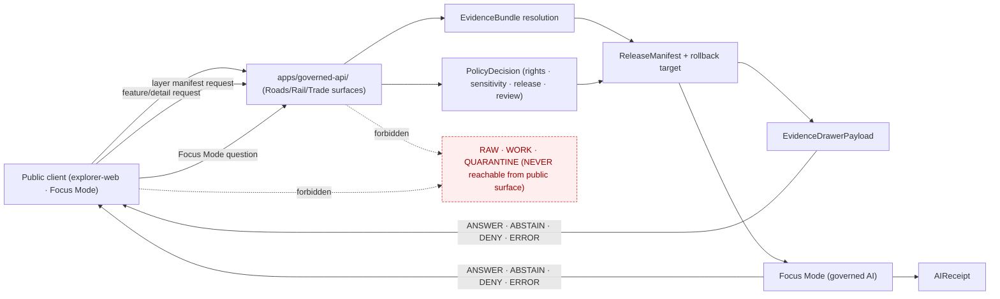

<!-- [KFM_META_BLOCK_V2]
doc_id: kfm://doc/docs-domains-roads-rail-trade-api-contracts
title: Roads / Rail / Trade — API Contracts
type: standard
version: v2
status: draft
owners: <TBD — Docs steward + Roads/Rail/Trade domain steward>
created: 2026-05-19
updated: 2026-06-07
policy_label: public
related:
  - docs/domains/roads-rail-trade/api-contracts/README.md   # PROPOSED twin — PATH COLLISION, see Path-collision callout
  - docs/doctrine/directory-rules.md
  - docs/doctrine/trust-membrane.md
  - docs/architecture/contract-schema-policy-split.md
  - docs/standards/PROV.md
  - schemas/contracts/v1/runtime/decision_envelope.schema.json   # PROPOSED path
  - schemas/contracts/v1/transport/                              # PROPOSED path (slug CONFLICTED — §11)
  - contracts/transport/                                         # PROPOSED path (slug CONFLICTED — §11)
tags: [kfm, domains, roads-rail-trade, api, contracts, governed-api]
notes:
  - 'CONTRACT_VERSION = "3.0.0" pinned per ai-build-operating-contract.md'
  - Standard doc; describes the Roads/Rail/Trade-facing surfaces of the governed API.
  - "PATH COLLISION: a twin exists at docs/domains/roads-rail-trade/api-contracts/README.md (folder form). This file is the flat-file form (API_CONTRACTS.md). Do not keep both. See Path-collision callout and ADR-RRT-API-06."
  - All paths, route names, DTO module locations, and validator IDs are PROPOSED until verified against a mounted repo.
  - Two doctrine sources disagree on the schema-home segment (Directory Rules §12 vs Atlas §24.13). See §11.
[/KFM_META_BLOCK_V2] -->

# Roads / Rail / Trade — API Contracts

> Domain-facing surfaces of the KFM governed API for roads, rail, historic routes, trade corridors, restrictions, facilities, and derived network projections — what is exposed, what is denied, and what each surface returns.

[](#1-status--authority)
[](#1-status--authority)
[](#2-scope--audience)
[](#3-authority--truth-posture)
[](#3-authority--truth-posture)
[](#9-trust-membrane-invariants)
[](#path-collision)
[](#)

| Field | Value |
|---|---|
| **Path (this file)** | `docs/domains/roads-rail-trade/API_CONTRACTS.md` (flat-file form) — **PATH COLLISION** with the folder form `api-contracts/README.md`; see below |
| **Status** | draft (not yet reviewed by Roads/Rail/Trade steward) |
| **Owners** | `<TBD>` Docs steward · `<TBD>` Roads/Rail/Trade domain steward |
| **Last updated** | 2026-06-07 |
| **Authority** | CONFIRMED doctrine basis (Atlas Ch. 13 §J, §24.3, §24.13); PROPOSED implementation; routes UNKNOWN |
| **Supersedes** | none (new file) |

<a id="path-collision"></a>

> [!WARNING]
> **Path collision — two homes for the same surface contract.** This file declares the **flat-file** form `docs/domains/roads-rail-trade/API_CONTRACTS.md`, while a **folder** form `docs/domains/roads-rail-trade/api-contracts/README.md` exists for the same scope. Both cannot be canonical — that would be a parallel documentation home. Two reconciliations, pick one:
> - **Option A — folder form (`api-contracts/README.md`).** Matches the kebab-case sibling lanes (`source-registry/`, `sublanes/`) and lets the API surface grow into multiple files (per-DTO, examples, OpenAPI). Favored if more than one API doc is expected.
> - **Option B — flat-file form (`API_CONTRACTS.md`).** Simpler; matches an UPPERCASE single-doc convention (cf. `PROV.md`, `SENSITIVITY_RUBRIC.md`). Favored if one doc suffices.
>
> The earlier draft's "CONFIRMED placement per Directory Rules §12" claim was **overstated** — §12 confirms the `docs/domains/roads-rail-trade/` lane, but does **not** adjudicate flat-file vs folder for an API doc. That choice is a per-root-README / ADR decision. Tracked as **ADR-RRT-API-06**; until resolved, treat this file's exact path as **PROPOSED** and retire the loser. `[DIRRULES]`

> [!IMPORTANT]
> **This doc is not implementation proof.** It declares the surface contracts the Roads/Rail/Trade lane is expected to expose through the KFM governed API. **No mounted repository was inspected in this authoring session.** Every route name, DTO module path, schema URI, validator ID, owner, and CI badge target is **PROPOSED** or **NEEDS VERIFICATION** until checked against current repo evidence. When this doc disagrees with an accepted ADR, `contracts/`, `schemas/`, or `policy/`, **those win** — file the disagreement to `docs/registers/DRIFT_REGISTER.md` per Directory Rules §2.5. **`CONTRACT_VERSION = "3.0.0"`.**

---

## Mini TOC

- [1. Status & Authority](#1-status--authority)
- [2. Scope & Audience](#2-scope--audience)
- [3. Authority & Truth Posture](#3-authority--truth-posture)
- [4. Surface Inventory](#4-surface-inventory)
- [5. Finite-Outcome Envelope](#5-finite-outcome-envelope)
- [6. Request → Decision → Response Flow](#6-request--decision--response-flow)
- [7. DTO and Schema Reference](#7-dto-and-schema-reference)
- [8. Domain-Specific DENY and ABSTAIN Drivers](#8-domain-specific-deny-and-abstain-drivers)
- [9. Trust Membrane Invariants](#9-trust-membrane-invariants)
- [10. Cross-Lane Edges Exposed Through This API](#10-cross-lane-edges-exposed-through-this-api)
- [11. Schema and Contract Home](#11-schema-and-contract-home)
- [12. Validator and Test Posture](#12-validator-and-test-posture)
- [13. Publication, Correction, Rollback](#13-publication-correction-rollback)
- [14. Examples — ANSWER, ABSTAIN, DENY, ERROR](#14-examples--answer-abstain-deny-error)
- [15. Verification Backlog](#15-verification-backlog)
- [16. Open ADRs](#16-open-adrs)
- [17. Related Docs](#17-related-docs)
- [18. Footer](#18-footer)

---

## 1. Status & Authority

This document is **doctrine-grounded** but **implementation-bounded**. It restates and operationalizes the API contract row of Atlas Ch. 13 §J for the Roads/Rail/Trade domain, the finite-outcome envelope from Atlas §24.3, and the schema-home crosswalk in Atlas §24.13. **CONFIRMED** content comes from those attached sources. **PROPOSED** content covers schema paths, route names, and validator identifiers that the project corpus does not nail down and that no mounted repository was available to verify.

Doctrine sources consulted (citations follow Atlas short names):

| Short name | Role for this doc |
|---|---|
| `[DOM-ROADS]` | Roads/Rail/Trade dossier — domain object families, source ledger, viewing products, sensitivity |
| `[ENCY]` | Encyclopedia — cross-cutting object families (EvidenceBundle, AIReceipt, ReleaseManifest, …) |
| `[GAI]` | Governed AI dossier — Focus Mode, RuntimeResponseEnvelope, AIReceipt, cite-or-abstain |
| `[MAP-MASTER]` | MapLibre master report — LayerManifest, TileArtifactManifest, MapReleaseManifest, EvidenceDrawerPayload |
| `[DIRRULES]` | Directory Rules — domain placement law, responsibility roots, lifecycle invariant |
| `[UNIFIED]` | Unified Implementation Architecture Build Manual — terminology and lifecycle contract |
| `[DDD]` | Domain-Driven Design Reference — bounded context, ubiquitous language framing |

[↑ back to top](#mini-toc)

---

## 2. Scope & Audience

**In scope.** Every public, semi-public, and trust-membrane-mediated API surface that returns Roads/Rail/Trade content, including:

- Per-feature / per-detail lookup of Road Segment, Rail Segment, CorridorRoute, Crossing, Bridge, Ferry, TransportFacility, Access Restriction (RestrictionEvent), Route Event (StatusEvent), Operator Status (OperatorAssignment), Historic RouteClaim, and TradeRouteCorridor objects. *(CONFIRMED owned-object set per `[DOM-ROADS]` §B; the parenthesized realizations are PROPOSED field names for the CONFIRMED owned objects.)*
- Layer manifest resolution for Roads/Rail/Trade public layers.
- Evidence Drawer payload assembly for Roads/Rail/Trade feature selection.
- Focus Mode (governed AI) answers scoped to Roads/Rail/Trade evidence.

**Out of scope.** Settlements-owned settlement and infrastructure claims, Hydrology-owned water evidence, and Archaeology/People/Land/Hazards canonical truth and sensitivity controls — these remain owned by their respective lanes. *(CONFIRMED non-ownership per `[DOM-ROADS]` §B.)* Roads/Rail/Trade may **cite** those domains' EvidenceBundles in a response, but never speaks for them.

**Audience.** API implementers, governed-API reviewers, downstream UI/AI consumers (explorer-web, review-console, Focus Mode clients), and the Roads/Rail/Trade domain steward who signs off on the surface contract.

[↑ back to top](#mini-toc)

---

## 3. Authority & Truth Posture

Claims in this doc carry the narrowest truthful label.

| Label | Meaning here | Examples in this doc |
|---|---|---|
| **CONFIRMED** | Stated in attached KFM doctrine (Atlas, Encyclopedia, MapLibre master, Directory Rules) | Finite-outcome set (ANSWER/ABSTAIN/DENY/ERROR); trust-membrane invariants; cross-lane non-ownership; §24.3.1/§24.3.2 outcome tables |
| **PROPOSED** | Design or path not yet verified against a mounted repo | Schema paths; `RoadsRailDecisionEnvelope` DTO; route names; this file's flat-file vs folder path |
| **INFERRED** | Derivable from visible evidence but not directly stated | Mapping of specific reason codes to specific gate failures for this lane |
| **NEEDS VERIFICATION** | Checkable, but not checked in this session | OpenAPI document presence, validator identifiers, CI workflow names |
| **UNKNOWN** | Not resolvable without more evidence | Actual public route names, framework choice, deployment surface |

> [!NOTE]
> The set **{ANSWER, ABSTAIN, DENY, ERROR}** is **CONFIRMED doctrine** across every public governed-API surface, Evidence Drawer payload, and Focus Mode answer per Atlas §24.3.1. The set is closed and stable; this domain does not add or rename outcomes. (Per §24.3.1, ANSWER is the only substantive read outcome — there is no `ACCEPTED` read outcome; `ACCEPTED` appears only on the correction/rollback surface in §24.3.2.)

[↑ back to top](#mini-toc)

---

## 4. Surface Inventory

The five rows below are the **CONFIRMED doctrine** surfaces from Atlas Ch. 13 §J for Roads/Rail/Trade. The DTO names, allowed outcomes, and surface roles are stated by the source; route names, base URLs, framework binding, and DTO module locations are **PROPOSED / UNKNOWN**.

| # | Surface (Atlas §J row) | Primary DTO / payload | Allowed outcomes | Public effect | Status |
|---|---|---|---|---|---|
| 1 | Roads/Rail feature/detail resolver | `RoadsRailDecisionEnvelope` | ANSWER · ABSTAIN · DENY · ERROR | Returns released Road/Rail/Trade feature evidence with citation, or a finite non-substantive outcome | PROPOSED governed API surface; **route UNKNOWN** |
| 2 | Roads/Rail layer manifest resolver | `LayerManifest` (domain layer descriptor) | ANSWER · DENY · ERROR | Returns a public-safe `LayerManifest` for a released Roads/Rail/Trade layer; never serves WORK/CATALOG layers | PROPOSED; **public-safe release only** |
| 3 | Roads/Rail Evidence Drawer payload | `EvidenceDrawerPayload` + `EvidenceBundle` projection | ANSWER · ABSTAIN · DENY · ERROR | Renders citations, source-role, policy state, release state, limitations for a selected feature | PROPOSED; **evidence- and policy-filtered** |
| 4 | Roads/Rail Focus Mode answer | `RuntimeResponseEnvelope` + `AIReceipt` | ANSWER · ABSTAIN · DENY · ERROR | Governed AI synthesis bounded by EvidenceBundles; AI is never the root truth source | PROPOSED; **AI never root truth** |
| 5 | Schema responsibility root | `schemas/contracts/v1/` *(default per Directory Rules)* | (validator-class outcomes) | Domain schemas, contracts, and runtime envelope live under the canonical schema home | PROPOSED; verify with Directory Rules + ADR-0001 |

*Doctrine basis:* surfaces 1–5 transcribed from Atlas v1.0 Ch. 13 §J, the §J "Schema responsibility root" row, and Atlas §24.13 (Atlas Section ↔ Dossier ↔ Responsibility Root Crosswalk). DTO names, outcome enumerations, and "exact route UNKNOWN" annotations are as written in the source.

> [!CAUTION]
> **Forbidden outcomes per surface (CONFIRMED doctrine, Atlas §24.3.2).** The layer manifest resolver must **not** return a layer that lacks a `ReleaseManifest` and must **not** serve WORK or CATALOG layers to public clients. The feature/detail resolver must **not** return an unreleased candidate as ANSWER and must **not** expose internal store identifiers. The Evidence Drawer payload must **not** include restricted geometry or uncited claim text. The Focus Mode answer must **not** generate uncited language as ANSWER or substitute model output for an `EvidenceBundle`.

[↑ back to top](#mini-toc)

---

## 5. Finite-Outcome Envelope

Every Roads/Rail/Trade surface in §4 returns one of four finite outcomes. The outcome set, the required artifacts behind each outcome, and the public-surface effect are **CONFIRMED doctrine** per Atlas §24.3.1.

| Outcome | When (CONFIRMED) | Required artifacts | Public-surface effect |
|---|---|---|---|
| **ANSWER** | Evidence sufficient · policy permits · release state allows · review state (where required) recorded | `EvidenceBundle` resolved; `PolicyDecision = allow`; `ReleaseManifest` applies | Substantive answer with Evidence Drawer and citation |
| **ABSTAIN** | Evidence insufficient or stale; AI surface cannot cite; no released alternative | `AIReceipt` with reason; **no claim emitted** | Non-substantive note with reason; **never invents** |
| **DENY** | Policy, rights, sensitivity, or release state forbids the answer (sensitive lanes default here) | `PolicyDecision = deny` + reason code; `AIReceipt` records denial | Denial reason; may offer a non-restricted alternative |
| **ERROR** | Governed API cannot evaluate — missing schema, malformed query, contract violation, infrastructure failure | Error envelope with diagnostic code; **no claim leakage** | Finite, actionable error; **never silently falls through** |

> [!NOTE]
> Three further outcomes exist in KFM doctrine (Atlas §24.3.1) but are **not** emitted directly on the public Roads/Rail/Trade read surfaces: **HOLD** (promotion / release / correction paused pending review — `PolicyDecision = hold`, surface stays in prior state), and the validator-class **PASS / FAIL** (internal; surface in `ValidationReport` objects upstream of release). The correction/rollback surface additionally returns **ACCEPTED / HOLD / DENY / ERROR** per §24.3.2. Public read surfaces collapse those upstream states into ANSWER / ABSTAIN / DENY / ERROR.

### 5.1 PROPOSED envelope shape

The corpus describes a `DecisionEnvelope` shape that every policy module emits and that the governed API normalizes downstream consumers around. The proposed canonical schema path is `schemas/contracts/v1/runtime/decision_envelope.schema.json`. *(Source: `KFM-P5-PROG-0001`, Pass 23 / Pass 32. PROPOSED.)*

```json
{
  "decision_id": "uuid",
  "outcome": "ANSWER | ABSTAIN | DENY | ERROR",
  "policy_family": "promotion | access | render | capability | consent | sensitivity",
  "reasons": ["string", "..."],
  "obligations": [
    { "type": "redact",  "op": "generalize_geometry", "level": "coarse" },
    { "type": "hold",    "op": "steward_review" },
    { "type": "deny" }
  ],
  "evaluated_at": "ISO-8601 timestamp"
}
```

> [!NOTE]
> The example above is **illustrative**, drawn from the corpus description. The exact field names, enum casing, and obligation shape are subject to ADR-class normalization before any production binding. The corpus itself flags that obligations exist in both `{type, op, level}` structured form and bare-string form, and recommends the structured form (`KFM-P5-PROG-0001` "Tensions").

[↑ back to top](#mini-toc)

---

## 6. Request → Decision → Response Flow

The diagram below is the **CONFIRMED doctrine** trust-membrane flow as expressed in `[MAP-MASTER]` §10 and `[ENCY]` §24.6, narrowed to the Roads/Rail/Trade lane. The diagram does **not** claim implementation maturity — it shows the gates a Roads/Rail/Trade request must pass before any ANSWER is emitted.



**Reading the diagram.**

1. Public clients enter through `apps/governed-api/` — the trust membrane in executable form *(CONFIRMED doctrine, `[DIRRULES]` §7.1)*.
2. Every request resolves `EvidenceRef → EvidenceBundle`, evaluates `PolicyDecision`, and confirms the relevant `ReleaseManifest` applies. Missing any of these means the surface **fails closed** to ABSTAIN or DENY *(CONFIRMED doctrine, `[ENCY]` §24.6)*.
3. The Evidence Drawer payload and Focus Mode answer are the public projections; the Focus Mode side always emits an `AIReceipt` recording provider, model, evidence refs, policy IDs, and the finite outcome *(CONFIRMED doctrine, `[MAP-MASTER]` schema table; `[GAI]`)*.
4. The dashed forbidden edges — public client or governed API reaching into RAW/WORK/QUARANTINE — are explicit anti-patterns per `[ENCY]` §24.9.2 and `[MAP-MASTER]` §10.

[↑ back to top](#mini-toc)

---

## 7. DTO and Schema Reference

The DTO names below are **CONFIRMED doctrine** identifiers (they appear by name in `[DOM-ROADS]` §J, `[MAP-MASTER]` §11, `[ENCY]`). Their schema paths are **PROPOSED** per `[MAP-MASTER]` §11 and Atlas §24.13.

| DTO / object family | Role in Roads/Rail/Trade surfaces | PROPOSED schema path |
|---|---|---|
| `RoadsRailDecisionEnvelope` | Domain-specific projection of the runtime `DecisionEnvelope` for surface #1 | `schemas/contracts/v1/transport/roads_rail_decision_envelope.schema.json` |
| `LayerManifest` | Binds a Roads/Rail/Trade UI layer to governed source/evidence semantics | `schemas/contracts/v1/ui/layer_manifest.schema.json` |
| `TileArtifactManifest` | Controls PMTiles/MVT/COG release artifacts for Roads/Rail/Trade layers | `schemas/contracts/v1/ui/tile_artifact_manifest.schema.json` |
| `MapReleaseManifest` | Defines the complete published map release that any Roads/Rail/Trade layer is part of | `schemas/contracts/v1/release/map_release_manifest.schema.json` |
| `EvidenceBundle` | Truth-bearing evidence object — outranks generated language | `schemas/contracts/v1/evidence/evidence_bundle.schema.json` |
| `EvidenceDrawerPayload` | Payload shown after click/selection on a Roads/Rail/Trade feature | `schemas/contracts/v1/ui/evidence_drawer_payload.schema.json` |
| `MapContextEnvelope` | Bounded map context sent into Focus Mode | `schemas/contracts/v1/ui/map_context_envelope.schema.json` |
| `FocusModeRequest` | Structured governed-synthesis request | `schemas/contracts/v1/ai/focus_mode_request.schema.json` |
| `FocusModeResponse` | Finite result envelope: ANSWER/ABSTAIN/DENY/ERROR | `schemas/contracts/v1/ai/focus_mode_response.schema.json` |
| `AIReceipt` | Audit record for model adapter, evidence refs, policy checks, citation validation, finite outcome | `schemas/contracts/v1/ai/ai_receipt.schema.json` |
| `CitationValidationReport` | Pass/fail report tying claims to EvidenceBundle/citations; required before public answer or export | `schemas/contracts/v1/evidence/citation_validation_report.schema.json` |
| `PolicyDecision` | Allow/deny/restrict/abstain/hold with rule IDs, source rights, sensitivity, role | `schemas/contracts/v1/policy/policy_decision.schema.json` |
| `PromotionDecision` | Governed state transition into release | `schemas/contracts/v1/release/promotion_decision.schema.json` |
| `RedactionReceipt` | Record of public-safe field/geometry transformation | `schemas/contracts/v1/evidence/redaction_receipt.schema.json` |
| `ReleaseManifest` / `RollbackCard` | Release decision; rollback target | `schemas/contracts/v1/release/...` |
| `DecisionEnvelope` (runtime) | Normalized policy output object | `schemas/contracts/v1/runtime/decision_envelope.schema.json` |

> [!NOTE]
> The DTOs above are **shared across all domains** except `RoadsRailDecisionEnvelope`, the Roads/Rail/Trade-specific projection per Atlas §J. Other domains have parallel envelopes (e.g., `HydrologyDecisionEnvelope`, `FloraDecisionEnvelope`). This file does not redefine the shared objects — see `docs/architecture/contract-schema-policy-split.md` (CONFIRMED present in Directory Rules §6.1) and `[MAP-MASTER]` §11 for canonical field intent. Individual schema-segment choices (`ui/` vs `map/` vs `release/`) are PROPOSED and `NEEDS VERIFICATION` against the mounted schema tree.

[↑ back to top](#mini-toc)

---

## 8. Domain-Specific DENY and ABSTAIN Drivers

The general policy gates (rights, sensitivity, release, review) apply to every domain. Roads/Rail/Trade adds a few **CONFIRMED-doctrine** drivers and a few **PROPOSED implementation** ones.

### 8.1 CONFIRMED-doctrine drivers (Atlas Ch. 13 §I)

| Trigger | Outcome | Doctrine basis |
|---|---|---|
| Indigenous trade or mobility corridor evidence without steward review | DENY or generalized-public-geometry ANSWER | `[DOM-ROADS]` §I |
| Oral-history, treaty, cultural, or interpretive evidence with unresolved rights | DENY (default) until steward review records resolution | `[DOM-ROADS]` §I; `[ENCY]` |
| Critical transport facility detail (operator-sensitive geometry, condition observation) without review | DENY or restricted-tier release | `[DOM-ROADS]` §I; `[DOM-SETTLE]` for infrastructure-class facilities |
| Unclear rights, unresolved source role, missing evidence, unresolved sensitivity, or absent release state | DENY (CONFIRMED universal cite-or-abstain rule) | `[ENCY]`; `[DIRRULES]` |

### 8.2 PROPOSED implementation drivers (Atlas Ch. 13 §K)

| Trigger | Outcome | Status |
|---|---|---|
| Route-membership vs. designation confusion (e.g., a US-route shield treated as a Road Segment identity) | DENY at validator; surface returns ERROR (`SCHEMA_MISMATCH` / `CONTRACT_DRIFT`) | PROPOSED test family |
| OSM or GNIS attribute treated as legal designation | DENY (source-role anti-collapse) | PROPOSED test family |
| Historic route claim served at modern-survey precision | DENY (overprecision); ANSWER only with generalized geometry + `RedactionReceipt` | PROPOSED test family |
| Operator/status temporal misalignment (status read across an event boundary) | ABSTAIN with reason `temporal_misalignment` | PROPOSED test family |
| Public-safe generalization missing its receipt | DENY at release; HOLD upstream | PROPOSED test family |
| Transport graph projection without rollback target | DENY at release (`ROLLBACK_TARGET_MISSING`) | PROPOSED test family |

> [!WARNING]
> **Cultural-sensitivity defaults are not optional.** Indigenous corridor evidence, oral-history claims, treaty references, and interpretive material **default to DENY or generalized geometry** under `[DOM-ROADS]` §I. A public ANSWER for any of these requires a `ReviewRecord` from the appropriate steward path. Do not bypass this with admin shortcuts — that is an explicit anti-pattern in `[ENCY]` §24.9.2 ("AI generation routed through admin shortcut. Admin bypass becomes a normal-path public route.").

[↑ back to top](#mini-toc)

---

## 9. Trust Membrane Invariants

CONFIRMED doctrine, transcribed from `[MAP-MASTER]` §10 and `[ENCY]` §24.6, applied to the Roads/Rail/Trade surfaces.

1. **No public RAW path.** RAW, WORK, QUARANTINE, unpublished candidate data, canonical/internal stores, graph internals, vector indexes, and source APIs are **never reachable** from a Roads/Rail/Trade public surface.
2. **No direct model client.** Focus Mode is an evidence-bounded adapter behind the governed API. No browser or map shell calls a model client directly. Local runtime settings (context length, decoding parameters) are explicit and auditable in the `AIReceipt`.
3. **No canonical / internal client fetch.** The MapLibre shell consumes released artifacts and the governed API — not source systems and not internal data stores.
4. **No unreleased tile load.** PMTiles / MVT / MLT / COG / 3D Tiles, style JSON, sprites, and glyphs for Roads/Rail/Trade layers must be released and `MapReleaseManifest`-bound.
5. **No sensitive geometry hidden only by style.** Indigenous corridor, sensitive facility, and overprecise historic-route geometry require **transformation, generalization, or a restricted tier** before public tile generation — not a style filter.
6. **No popup as Evidence Drawer substitute.** Popups may preview; material claims require `EvidenceDrawerPayload` and `EvidenceBundle` resolution.
7. **No uncited export.** Screenshots, Story Nodes, exports, and Focus Mode answers retain citations and `MapReleaseManifest` / version references.
8. **No Focus Mode answer from rendered features alone.** Rendered features are candidates; the `EvidenceBundle` carries truth support.
9. **No AI answer from RAW/WORK rather than EvidenceBundle.** AI becomes its own truth source if this is violated — explicit anti-pattern.
10. **No release without `ReleaseManifest` or `rollback target`.** A public Roads/Rail/Trade surface that cannot be rolled back is not releasable.

> [!TIP]
> The above is the **CONFIRMED doctrine boundary**. None of these invariants is a Roads/Rail/Trade-specific opinion; they are repo-wide and inherited. A Roads/Rail/Trade-specific implementation may add **stricter** rules (e.g., generalized-geometry-only for trade corridors) but **cannot weaken** these defaults. The browser renderer is `packages/maplibre-runtime/` — the sole governed renderer (v1.3; Cesium retired) — and is an alternate renderer, never an alternate truth path.

[↑ back to top](#mini-toc)

---

## 10. Cross-Lane Edges Exposed Through This API

CONFIRMED / PROPOSED cross-lane relations per `[DOM-ROADS]` §F. Each relation type is permitted only when ownership, source role, sensitivity, and `EvidenceBundle` support are preserved across the lane boundary.

| Related lane | Relation surfaced | Constraint (CONFIRMED / PROPOSED) |
|---|---|---|
| **Settlements / Infrastructure** | Depots, crossings, facilities, and dependencies between road/rail features and settlement-owned infrastructure | Roads/Rail/Trade may **cite** settlement-owned facility identity; never **owns** it. Critical-asset deny lane applies upstream. |
| **Hydrology** | Bridges, ferries, fords, and river crossings | Roads/Rail/Trade may **cite** hydrologic features for crossing context; water evidence ownership stays with Hydrology. |
| **Hazards** | Closure, detour, flood/fire/smoke exposure on transport features | Roads/Rail/Trade may **cite** hazard events as cause; KFM is **never** an alert authority. Hazards owns the event. |
| **Archaeology / Cultural Heritage** | Historic routes, Indigenous corridors, forts, and missions referenced as transport context | Archaeology retains sensitivity, sovereignty, and site-coordinate denial. Roads/Rail/Trade may render generalized corridor context only. |

> [!IMPORTANT]
> When a Roads/Rail/Trade API response references another lane's evidence, the **owning lane's** sensitivity and release posture wins. A Hazards-owned hazard event cited inside a Roads/Rail/Trade ANSWER does **not** get downgraded to Roads/Rail/Trade sensitivity defaults — Hazards remains the source of truth for that fact.

[↑ back to top](#mini-toc)

---

## 11. Schema and Contract Home

> [!WARNING]
> **Doctrine conflict between Directory Rules §12 and Atlas §24.13 — flag and resolve by ADR.**
>
> - **Directory Rules §12** (CONFIRMED rule) prescribes the lane pattern: `schemas/contracts/v1/domains/<domain>/`, with `<domain> = roads-rail-trade`.
> - **Atlas §24.13** (CONFIRMED doctrine table, row 13) prescribes `schemas/contracts/v1/transport/` and `contracts/transport/` for this lane — **without** the intermediate `domains/` segment, and using the slug `transport` rather than `roads-rail-trade`.
>
> Both are doctrine sources visible in this session. They disagree on (a) presence of the `domains/` segment and (b) the slug (`roads-rail-trade` vs `transport`). This is a real drift candidate, not a typo. **NEEDS VERIFICATION** against a mounted repo to determine which form is live, followed by an ADR per Directory Rules §2.4 to fix the canonical form. Until resolved, this doc uses both spellings explicitly and labels every schema path **PROPOSED**.

### 11.1 PROPOSED schema home (two doctrine variants)

| Variant | Source | PROPOSED path for Roads/Rail/Trade |
|---|---|---|
| **A (Directory Rules §12 pattern)** | `[DIRRULES]` §12 | `schemas/contracts/v1/domains/roads-rail-trade/` |
| **B (Atlas §24.13 row 13)** | `[ENCY]` Atlas §24.13 | `schemas/contracts/v1/transport/` |

The contract (semantic-meaning Markdown) home shows the same conflict: `contracts/domains/roads-rail-trade/` (Pattern A) vs `contracts/transport/` (Pattern B). Pick **one** under an ADR; do not let both harden into authority — that is anti-pattern §13.1 in `[DIRRULES]` (`contracts/` and `schemas/` both claiming the same authority; ADR-0001 makes `schemas/contracts/v1/...` canonical and `contracts/` semantic-Markdown only).

### 11.2 PROPOSED docs/policy/tests homes (Pattern A, per Directory Rules §12)

The other domain lanes (`docs/`, `policy/`, `tests/`, `fixtures/`, `pipelines/`, `data/`) **do** use the `domains/` segment in `[DIRRULES]` §12 with no Atlas-side variant; those are unambiguous.

```text
docs/domains/roads-rail-trade/
  ├── API_CONTRACTS.md            # this file (flat-file form — PATH COLLISION; see ADR-RRT-API-06)
  └── api-contracts/README.md     # twin (folder form — PATH COLLISION)
policy/domains/roads-rail-trade/  # PROPOSED — admissibility / sensitivity for transport
tests/domains/roads-rail-trade/   # PROPOSED — schema, contract, policy, runtime tests
fixtures/domains/roads-rail-trade/ # PROPOSED — golden / valid / invalid samples
pipelines/domains/roads-rail-trade/ # PROPOSED — executable pipeline logic
pipeline_specs/roads-rail-trade/  # PROPOSED — declarative pipeline configuration
data/raw/roads-rail-trade/        # PROPOSED — per-source RAW intake
data/processed/roads-rail-trade/  # PROPOSED
data/published/layers/roads-rail-trade/ # PROPOSED — public-safe published layers
release/candidates/roads-rail-trade/    # PROPOSED — release candidates
```

[↑ back to top](#mini-toc)

---

## 12. Validator and Test Posture

CONFIRMED doctrine: every governed Roads/Rail/Trade surface must be backed by deterministic tests. PROPOSED implementation: the validator/test families below come from `[DOM-ROADS]` §K and are not yet verified against repo evidence.

| Test family (Atlas §K) | What it proves | Where it would live (PROPOSED) | Status |
|---|---|---|---|
| Route membership and designation separation | A US-route shield is not collapsed into a Road Segment identity | `tests/domains/roads-rail-trade/contracts/route_membership_test.*` | PROPOSED |
| Operator / status temporal | Status and operator assignments do not read across event boundaries | `tests/domains/roads-rail-trade/contracts/temporal_test.*` | PROPOSED |
| OSM / GNIS legal-status denial | OSM and GNIS attributes are not promoted to legal designation | `tests/domains/roads-rail-trade/policy/legal_status_denial_test.*` | PROPOSED |
| Historic overprecision denial | Historic Route Claims are not served at modern-survey precision | `tests/domains/roads-rail-trade/policy/historic_precision_test.*` | PROPOSED |
| Public generalization receipt | Every generalized public geometry carries a `RedactionReceipt` | `tests/domains/roads-rail-trade/evidence/redaction_receipt_test.*` | PROPOSED |
| Transport graph projection rollback | Derived graph/connectivity projections have a rollback target and replay deterministically | `tests/domains/roads-rail-trade/release/rollback_test.*` | PROPOSED |
| Runtime envelope negative cases | The Focus Mode surface emits ABSTAIN / DENY / ERROR shape correctly when evidence is missing or policy blocks | `tests/runtime_proof/domains/roads-rail-trade/*` | PROPOSED |

> [!NOTE]
> Per `[DIRRULES]` §7.5.a, the canonical test-orchestrator contract is `tools/validators/validate_all.py` with exit codes `0 = pass`, `1 = any fail`, `2 = system error`. This contract is **PROPOSED / ADR-class** (Directory Rules §18 OPEN-DR-03; the live-repo path may be `tools/validate_all.py` per OPEN-DR-07). Roads/Rail/Trade tests should plug into the orchestrator rather than running standalone in CI.

[↑ back to top](#mini-toc)

---

## 13. Publication, Correction, Rollback

CONFIRMED doctrine, narrowed to Roads/Rail/Trade per `[DOM-ROADS]` §M and `[ENCY]` Appendix E.

| Transition | Required artifacts | Failure posture |
|---|---|---|
| CATALOG / TRIPLET → PUBLISHED | `ReleaseManifest`; rollback target; correction path; `ReviewRecord` (for sensitive corridor / facility content); `EvidenceBundle` resolved; `PolicyDecision = allow` | HOLD at CATALOG; no public surface change |
| PUBLISHED → PUBLISHED′ (correction) | `CorrectionNotice`; `ReviewRecord`; invalidation list of downstream derivatives; `ReleaseManifest` update or supersession | Stale-state announcement; **no silent edit** |
| PUBLISHED → prior release (rollback) | `RollbackCard`; `CorrectionNotice`; `ReleaseManifest` reverts; downstream derivative invalidation list | Held at current state until rollback validated |

> [!IMPORTANT]
> A **transport graph projection** (network connectivity layer derived from Road/Rail/Trade evidence) cannot publish without a rollback target. This is explicit in `[DOM-ROADS]` §K ("transport graph projection rollback tests") and inherited from the universal rule that **release without a rollback target is forbidden** (`[ENCY]` §24.6; reason code `ROLLBACK_TARGET_MISSING`). The correction/rollback surface itself returns `ACCEPTED / HOLD / DENY / ERROR` per §24.3.2 — distinct from the public read surfaces' ANSWER/ABSTAIN/DENY/ERROR.

[↑ back to top](#mini-toc)

---

## 14. Examples — ANSWER, ABSTAIN, DENY, ERROR

> [!NOTE]
> All four examples below are **illustrative**. They are constructed from `[DOM-ROADS]` §J doctrine and the `DecisionEnvelope` shape proposed in `KFM-P5-PROG-0001`. Field names, casing, and obligation shapes are subject to ADR-class normalization. Do not treat these as live API fixtures.

<details>
<summary><strong>14.1 ANSWER — released Road Segment with operator status</strong></summary>

```json
{
  "decision_id": "8f5c4c2e-1a3e-4f2a-9d51-2a0b4e9d9f01",
  "outcome": "ANSWER",
  "policy_family": "access",
  "reasons": [],
  "obligations": [
    { "type": "attribute", "op": "cite_source", "level": "required" }
  ],
  "evaluated_at": "2026-05-19T14:00:00Z",
  "payload": {
    "object_kind": "RoadSegment",
    "evidence_bundle_ref": "kfm://evidence/transport/road-seg-...",
    "release_manifest_ref": "kfm://release/manifest/transport/2026-05-...",
    "citations": ["KDOT KanPlan 2025-Q4 segment id ...", "GNIS name id ..."],
    "limitations": ["operator_status_observed_at differs from segment.valid_to"]
  }
}
```

CONFIRMED-doctrine basis: ANSWER requires `EvidenceBundle` resolved, `PolicyDecision = allow`, `ReleaseManifest` applies (Atlas §24.3.1). PROPOSED field names and `kfm://` URI shapes.
</details>

<details>
<summary><strong>14.2 ABSTAIN — Focus Mode question about a historic route claim with thin evidence</strong></summary>

```json
{
  "decision_id": "1e7a2b88-cc11-49a7-bd64-4f0d2b9aab12",
  "outcome": "ABSTAIN",
  "policy_family": "render",
  "reasons": ["evidence_thin", "no_released_alternative"],
  "obligations": [],
  "evaluated_at": "2026-05-19T14:01:00Z",
  "ai_receipt_ref": "kfm://receipt/ai/2026-05-...",
  "note": "No released Historic RouteClaim covers the requested year/segment with cited evidence."
}
```

CONFIRMED-doctrine basis: ABSTAIN requires an `AIReceipt` with reason and **no claim emitted** (Atlas §24.3.1). The system never invents a route under ABSTAIN.
</details>

<details>
<summary><strong>14.3 DENY — request for exact geometry of an Indigenous trade corridor without steward review</strong></summary>

```json
{
  "decision_id": "c2b9e0fa-d711-4a55-8c93-2e7b0e0d3344",
  "outcome": "DENY",
  "policy_family": "sensitivity",
  "reasons": ["indigenous_corridor", "review_required"],
  "obligations": [
    { "type": "redact", "op": "generalize_geometry", "level": "coarse" }
  ],
  "evaluated_at": "2026-05-19T14:02:00Z",
  "alternative": {
    "object_kind": "TradeRouteCorridor",
    "release_id": "kfm://release/transport/generalized-corridors/2026-...",
    "note": "Generalized public corridor is releasable; exact alignment is steward-controlled."
  }
}
```

CONFIRMED-doctrine basis: Indigenous trade/mobility corridor evidence defaults to steward review and generalized public geometry (`[DOM-ROADS]` §I). DENY offers a non-restricted alternative where possible (Atlas §24.3.1).
</details>

<details>
<summary><strong>14.4 ERROR — malformed feature/detail request</strong></summary>

```json
{
  "decision_id": "9b3d7c5a-2e98-4d10-91fa-7c2e8b5a01ab",
  "outcome": "ERROR",
  "policy_family": "access",
  "reasons": ["SCHEMA_MISMATCH", "missing_feature_id"],
  "obligations": [],
  "evaluated_at": "2026-05-19T14:03:00Z",
  "diagnostic": {
    "code": "ROADSRAIL_REQUEST_INVALID",
    "expected": "feature_id (string) and release_id (string)",
    "received": "feature_id (null)"
  }
}
```

CONFIRMED-doctrine basis: ERROR returns a finite, actionable diagnostic and **never silently falls through** to another lane (Atlas §24.3.1). Reason codes are PROPOSED per `[ENCY]` §24.6.
</details>

[↑ back to top](#mini-toc)

---

## 15. Verification Backlog

These items are **NEEDS VERIFICATION** until checked against a mounted repository, an OpenAPI document, or live CI evidence. Track in `docs/registers/VERIFICATION_BACKLOG.md`.

| ID | Item | Evidence that would settle it |
|---|---|---|
| VB-RRT-API-01 | Whether `schemas/contracts/v1/transport/` or `schemas/contracts/v1/domains/roads-rail-trade/` is the live schema home | Repo tree listing; ADR resolving Directory Rules §12 vs Atlas §24.13 |
| VB-RRT-API-02 | Whether `apps/governed-api/` exists and what route names expose the Roads/Rail/Trade surfaces | Repo tree + OpenAPI document |
| VB-RRT-API-03 | Whether `RoadsRailDecisionEnvelope` is realized as a distinct schema or as a domain projection of the generic `DecisionEnvelope` | Schema file inspection |
| VB-RRT-API-04 | Which DENY reason codes are actually emitted by the Roads/Rail/Trade lane | Policy bundle + runtime envelope log fixtures |
| VB-RRT-API-05 | Whether the seven Atlas §K validator families have corresponding tests under `tests/domains/roads-rail-trade/` | Repo tree + CI run evidence |
| VB-RRT-API-06 | Whether the Indigenous-corridor / cultural-corridor steward path is named and routed in `policy/` | Policy bundle inspection + ReviewRecord fixture |
| VB-RRT-API-07 | Whether transport graph projections currently have a rollback target shape | `release/rollback_cards/` inspection |
| VB-RRT-API-08 | Whether KDOT / FHWA / FRA / WZDx source terms allow re-publication at the planned tiers | Source descriptor + rights review |
| VB-RRT-API-09 | Last-reviewed date and ownership for this doc | Steward assignment |
| VB-RRT-API-10 | Whether `tools/validators/validate_all.py` (or `tools/validate_all.py`) orchestrates Roads/Rail/Trade tests | Validator registry inspection |
| VB-RRT-API-11 | Whether the flat-file (`API_CONTRACTS.md`) or folder (`api-contracts/README.md`) form is the live API-doc home | Repo tree listing; ADR-RRT-API-06 |

[↑ back to top](#mini-toc)

---

## 16. Open ADRs

The items below are **ADR-class** per Directory Rules §2.4. Each blocks promotion of an affected path from PROPOSED to canonical until an ADR is filed and accepted.

| ADR id (PROPOSED) | Question | Why ADR-class |
|---|---|---|
| ADR-RRT-API-01 | Schema-home form: `schemas/contracts/v1/transport/` (Atlas §24.13) vs `schemas/contracts/v1/domains/roads-rail-trade/` (Directory Rules §12) | Creates a parallel schema home — explicitly ADR-required (Directory Rules §2.4) |
| ADR-RRT-API-02 | Domain slug stability: `transport` vs `roads-rail-trade` | Slug change ripples through `data/`, `policy/`, `tests/`, `fixtures/`, `pipelines/`, `release/` paths |
| ADR-RRT-API-03 | Whether `RoadsRailDecisionEnvelope` is its own schema or `allOf`-extends `DecisionEnvelope` | Affects validator wiring and downstream typing across all domains |
| ADR-RRT-API-04 | DENY reason-code vocabulary for the Roads/Rail/Trade lane (Indigenous corridor / cultural evidence / overprecision / temporal misalignment / etc.) | Reason codes are doctrine-bearing strings; vocabulary stability matters for audits |
| ADR-RRT-API-05 | Whether transport graph projections require their own `ReleaseManifest` separate from feature-layer manifests | Bundling affects rollback scope and correction lineage |
| ADR-RRT-API-06 | API-doc home: flat-file `API_CONTRACTS.md` vs folder `api-contracts/README.md` | Parallel documentation home; one must be retired |

[↑ back to top](#mini-toc)

---

## 17. Related Docs

- `docs/domains/roads-rail-trade/api-contracts/README.md` — **twin API-contracts doc (folder form)** — PATH COLLISION, see ADR-RRT-API-06
- `docs/doctrine/directory-rules.md` — Canonical placement rules (Directory Rules)
- `docs/doctrine/trust-membrane.md` — Trust-membrane doctrine (CONFIRMED in Directory Rules §0 related-doctrine list)
- `docs/architecture/contract-schema-policy-split.md` — `contracts/` vs `schemas/` vs `policy/` split (CONFIRMED in Directory Rules §6.1)
- `docs/standards/PROV.md` — W3C PROV-O profile for KFM provenance *(see Directory Rules §18 OPEN-DR-01 — `PROV.md` vs `PROVENANCE.md` naming pending ADR)*
- `docs/domains/roads-rail-trade/README.md` — Roads/Rail/Trade lane README *(PROPOSED — not yet authored)*
- `docs/domains/roads-rail-trade/SOURCE_REGISTRY/README.md` — Roads/Rail/Trade source index *(PROPOSED)*
- `docs/domains/roads-rail-trade/sublanes/` — per-mode sublane dossiers (roads, rail, trade, trade-routes) *(PROPOSED)*
- `docs/atlases/` Ch. 13 — Roads/Rail/Trade chapter (doctrine basis for this file)
- `docs/registers/DRIFT_REGISTER.md` — drift entries (including the Directory Rules §12 vs Atlas §24.13 conflict in §11 and the path collision)
- `docs/registers/VERIFICATION_BACKLOG.md` — VB-RRT-API-* items from §15

[↑ back to top](#mini-toc)

---

## 18. Footer

> [!NOTE]
> **Doctrine vs implementation reminder.** This file documents the **intended** governed-API surface for the Roads/Rail/Trade lane based on attached KFM doctrine. Nothing in this file proves the lane is implemented, deployed, or wired into CI. Repo-state claims (routes, modules, validator IDs, owners, deployment) remain **PROPOSED / NEEDS VERIFICATION / UNKNOWN** until checked against a mounted repository.

---

**Related docs:** see [§17](#17-related-docs) · **Verification backlog:** see [§15](#15-verification-backlog) · **Open ADRs:** see [§16](#16-open-adrs)

**Last updated:** 2026-06-07 · **Doc version:** v2 · **CONTRACT_VERSION:** 3.0.0 · **Doc id:** `kfm://doc/docs-domains-roads-rail-trade-api-contracts` · **Status:** draft

[↑ back to top](#mini-toc)
