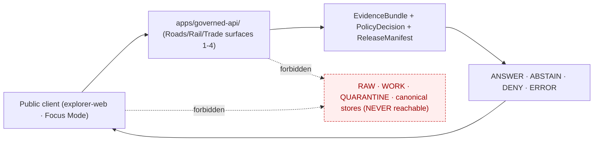

<!-- [KFM_META_BLOCK_V2]
doc_id: kfm://doc/docs-domains-roads-rail-trade-api-surfaces
title: Roads / Rail / Trade — API Surfaces (catalog & routing status)
type: standard
version: v0.1
status: draft
owners: <TBD — Docs steward + Roads/Rail/Trade domain steward>
created: 2026-06-07
updated: 2026-06-07
policy_label: public
related:
  - docs/domains/roads-rail-trade/API_CONTRACTS.md          # flat-file contracts doc (PATH COLLISION pair, see below)
  - docs/domains/roads-rail-trade/api-contracts/README.md   # folder contracts doc (PATH COLLISION pair)
  - docs/domains/roads-rail-trade/README.md
  - docs/doctrine/directory-rules.md
  - docs/doctrine/trust-membrane.md
  - docs/architecture/governed-api.md
  - docs/adr/ADR-0001-schema-home.md
tags: [kfm, domains, roads-rail-trade, api, surfaces, governed-api, routing]
notes:
  - 'CONTRACT_VERSION = "3.0.0" pinned per ai-build-operating-contract.md'
  - "SCOPE GUARD: this is a SURFACE CATALOG (which endpoints exist + routing/wiring status), NOT a contracts doc. DTO/schema/outcome SEMANTICS live in the API-contracts doc. Three API docs now overlap in this lane — see API-doc proliferation callout (ADR-RRT-API-07)."
  - "All routes, base URLs, framework bindings, and wiring states are UNKNOWN/PROPOSED until a mounted repo or OpenAPI document is inspected."
  - "Schema-home slug CONFLICTED: Directory Rules §12 (domains/roads-rail-trade/) vs Atlas §24.13 (transport/). See ADR-RRT-API-01/02."
[/KFM_META_BLOCK_V2] -->

# Roads / Rail / Trade — API Surfaces

> The **surface catalog** for the Roads/Rail/Trade lane of the KFM governed API: which surfaces exist, what each is for, its route/wiring status, and its public effect. This is the *inventory and routing-status* view — the *contract* view (DTO shapes, outcome semantics, schemas) lives in the API-contracts doc.

[-blueviolet)](#1-what-this-doc-is-and-is-not)

**Status:** draft · **Parent dossier:** [`docs/domains/roads-rail-trade/`](./README.md) · **Owners:** Docs steward `TBD` · Roads/Rail/Trade steward `TBD` · **Last updated:** 2026-06-07

> [!WARNING]
> **API-doc proliferation — three overlapping docs now describe this lane's API.** Before extending this file, resolve the overlap:
> 1. `docs/domains/roads-rail-trade/API_CONTRACTS.md` — flat-file contracts doc (DTO/schema/outcome semantics).
> 2. `docs/domains/roads-rail-trade/api-contracts/README.md` — folder contracts doc (same scope as #1; already a flagged collision, ADR-RRT-API-06).
> 3. `docs/domains/roads-rail-trade/API_SURFACES.md` *(this file)* — surface catalog / routing status.
>
> #1 and #2 are a confirmed collision (one must be retired). **This file (#3) deliberately does NOT redefine DTOs, outcome semantics, or schema homes** — it points to the surviving contracts doc for those. If a reviewer prefers a single API doc, fold this catalog into the contracts doc as a section and retire this file. Tracked as **ADR-RRT-API-07**. `[DIRRULES]`

> [!IMPORTANT]
> **Not implementation proof.** No mounted repository or OpenAPI document was inspected. Every route name, base URL, framework binding, deployment surface, and wiring state below is **UNKNOWN / PROPOSED / NEEDS VERIFICATION**. The five *surfaces* themselves are CONFIRMED doctrine (Atlas Ch. 13 §J); their *routing* is not. When this doc disagrees with an accepted ADR, `apps/governed-api/`, or an OpenAPI document, **those win** — file the drift to `docs/registers/DRIFT_REGISTER.md`. **`CONTRACT_VERSION = "3.0.0"`.**

---

## Quick navigation

- [1. What this doc is (and is not)](#1-what-this-doc-is-and-is-not)
- [2. Surface catalog](#2-surface-catalog)
- [3. Routing & wiring status](#3-routing--wiring-status)
- [4. Outcomes per surface (summary)](#4-outcomes-per-surface-summary)
- [5. Trust-membrane entry point](#5-trust-membrane-entry-point)
- [6. What each surface must never do](#6-what-each-surface-must-never-do)
- [7. Schema & contract home (pointer)](#7-schema--contract-home-pointer)
- [8. Open questions & verification backlog](#8-open-questions--verification-backlog)
- [9. Related docs](#9-related-docs)

---

## 1. What this doc is (and is not)

**Is.** A catalog of the Roads/Rail/Trade governed-API *surfaces* — the discrete endpoints/artifacts a client can reach — plus their purpose, public effect, and routing/wiring status. It answers "*what surfaces does this lane expose, and how wired are they?*"

**Is not.** A contracts doc. It does **not** define DTO field shapes, the finite-outcome semantics, reason-code vocabularies, or schema file paths. Those belong to the API-contracts doc (see [§7](#7-schema--contract-home-pointer) and the [proliferation callout](#api-doc-proliferation)). Where this catalog names a DTO, it does so only to identify the surface, not to specify it.

**Doctrine basis.** The five surfaces are transcribed CONFIRMED from Atlas Ch. 13 §J (the Roads/Rail §J table) and consolidated in the Atlas §20.3 Master API Surface Table. `[DOM-ROADS]` `[ENCY]`

[↑ back to top](#roads--rail--trade--api-surfaces)

---

## 2. Surface catalog

The five rows below are **CONFIRMED doctrine** from Atlas Ch. 13 §J. Routes, base URLs, and framework bindings are **UNKNOWN**.

| # | Surface | Purpose | Primary DTO (identifier only) | Public effect |
|---|---|---|---|---|
| 1 | **Feature / detail resolver** | Per-feature lookup of a released Road Segment, Rail Segment, CorridorRoute, Crossing, Bridge, Ferry, TransportFacility, Historic RouteClaim, TradeRouteCorridor, or a Route/Operator/Restriction event | `RoadsRailDecisionEnvelope` | Returns released feature evidence with citation, or a finite non-substantive outcome |
| 2 | **Layer manifest resolver** | Resolve a public-safe layer descriptor for a released Roads/Rail/Trade map layer | `LayerManifest` | Returns a release-bound `LayerManifest`; never serves WORK/CATALOG layers |
| 3 | **Evidence Drawer payload** | Assemble the citation/policy/limitation payload for a selected feature | `EvidenceDrawerPayload` + `EvidenceBundle` projection | Renders citations, source-role, policy state, release state, limitations |
| 4 | **Focus Mode answer** | Governed-AI synthesis bounded by released EvidenceBundles | `RuntimeResponseEnvelope` + `AIReceipt` | Governed AI answer; AI is never the root truth source |
| 5 | **Schema responsibility root** | Not a runtime endpoint — the canonical home for this lane's schemas/contracts | `schemas/contracts/v1/…` | Domain schemas/contracts/runtime envelope live here |

> [!NOTE]
> Row 5 is a *placement* surface, not a callable endpoint; it appears in the §J table for completeness. Its slug is **CONFLICTED** (`domains/roads-rail-trade/` per Directory Rules §12 vs `transport/` per Atlas §24.13) — see [§7](#7-schema--contract-home-pointer).

[↑ back to top](#roads--rail--trade--api-surfaces)

---

## 3. Routing & wiring status

All routing below is **UNKNOWN / PROPOSED** — there is no mounted repo or OpenAPI document in this session. Routes are illustrative placeholders to make the catalog legible, not asserted paths.

| Surface | PROPOSED route (illustrative only) | Method | Wiring status | Evidence that would settle it |
|---|---|---|---|---|
| Feature / detail resolver | `GET /api/v1/roads-rail-trade/features/{feature_id}` | GET | UNKNOWN — `route TBD` per §J | OpenAPI doc; `apps/governed-api/` route table |
| Layer manifest resolver | `GET /api/v1/roads-rail-trade/layers/{layer_id}/manifest` | GET | UNKNOWN | OpenAPI doc; `MapReleaseManifest` binding |
| Evidence Drawer payload | `GET /api/v1/roads-rail-trade/features/{feature_id}/evidence` | GET | UNKNOWN | OpenAPI doc; payload schema |
| Focus Mode answer | `POST /api/v1/roads-rail-trade/focus-mode` | POST | UNKNOWN | OpenAPI doc; `FocusModeRequest`/`Response` schema |
| Schema responsibility root | n/a (placement, not a route) | — | CONFLICTED slug | ADR resolving §12 vs §24.13 |

> [!CAUTION]
> **Do not cite these routes as real.** The `route TBD` / `exact route UNKNOWN` annotation is from the Atlas §J source itself. The placeholder paths above exist only so the catalog reads coherently; they carry no authority until verified against `apps/governed-api/` or an OpenAPI document (VB-RRT-SURF-01).

[↑ back to top](#roads--rail--trade--api-surfaces)

---

## 4. Outcomes per surface (summary)

The finite-outcome set is **CONFIRMED doctrine** (Atlas §24.3.1/§24.3.2). This table is a *summary pointer*; the authoritative per-outcome semantics (required artifacts, public effect, forbidden behaviors) live in the API-contracts doc.

| Surface | Allowed outcomes (CONFIRMED) | Forbidden behavior (CONFIRMED, §24.3.2) |
|---|---|---|
| Feature / detail resolver | `ANSWER / ABSTAIN / DENY / ERROR` | Returning an unreleased candidate as ANSWER; exposing internal store identifiers |
| Layer manifest resolver | `ANSWER / DENY / ERROR` | Returning a layer lacking a `ReleaseManifest`; serving WORK/CATALOG layers to public clients |
| Evidence Drawer payload | `ANSWER / ABSTAIN / DENY / ERROR` | Returning restricted geometry or uncited claim text |
| Focus Mode answer | `ANSWER / ABSTAIN / DENY / ERROR` | Generating uncited language as ANSWER; substituting model output for an `EvidenceBundle` |

> [!NOTE]
> `HOLD` (promotion/review state) and `PASS / FAIL` (validator-class) are real KFM outcomes but are **not** emitted on these public read surfaces; the correction/rollback surface returns `ACCEPTED / HOLD / DENY / ERROR`. None of those appear here. See the API-contracts doc §5 for the full envelope. `[ENCY]`

[↑ back to top](#roads--rail--trade--api-surfaces)

---

## 5. Trust-membrane entry point

CONFIRMED doctrine: public clients reach every surface above **only** through `apps/governed-api/` — the canonical public trust path. `[DIRRULES]` `[ENCY]`

The renderer behind surface #2's layers is `packages/maplibre-runtime/` — the sole governed browser-side renderer (v1.3; Cesium retired) — consuming the same released artifacts, never an alternate truth path. `[DIRRULES]` `[MAP-MASTER]`

[↑ back to top](#roads--rail--trade--api-surfaces)

---

## 6. What each surface must never do

CONFIRMED doctrine (Atlas §24.3.2 forbidden-behavior column; `[ENCY]` §24.9.2 anti-patterns), as a quick operational checklist. The full invariant set lives in the API-contracts doc §9.

- **No public RAW/WORK/QUARANTINE path** from any surface.
- **No unreleased candidate as ANSWER** (feature resolver).
- **No layer without a `ReleaseManifest`**, and **no WORK/CATALOG layer** to public clients (layer resolver).
- **No restricted geometry or uncited claim text** in a drawer payload.
- **No uncited Focus Mode ANSWER**, and **no model output substituted for an `EvidenceBundle`**.
- **No exact Indigenous/cultural-corridor geometry** without a steward `ReviewRecord` — DENY or generalized geometry by default. `[DOM-ROADS]` §I `[DOM-ARCH]`

[↑ back to top](#roads--rail--trade--api-surfaces)

---

## 7. Schema & contract home (pointer)

This catalog does **not** adjudicate the schema home; it points to the contracts doc, which carries the full treatment.

> [!WARNING]
> **Slug CONFLICTED.** Directory Rules §12 prescribes `schemas/contracts/v1/domains/roads-rail-trade/`; Atlas §24.13 (row 13) prescribes `schemas/contracts/v1/transport/` (and `contracts/transport/`), without the `domains/` segment and with the slug `transport`. Both are doctrine. Resolve by ADR per Directory Rules §2.4; do not let both harden (anti-pattern §13.1; ADR-0001 makes `schemas/contracts/v1/…` canonical and `contracts/` semantic-Markdown only). See ADR-RRT-API-01/02 in the contracts doc. `[DIRRULES]` `[ENCY §24.13]`

[↑ back to top](#roads--rail--trade--api-surfaces)

---

## 8. Open questions & verification backlog

Track in `docs/registers/VERIFICATION_BACKLOG.md` / `docs/registers/DRIFT_REGISTER.md`.

| ID | Item | Evidence that would settle it | Status |
|---|---|---|---|
| **ADR-RRT-API-07** | Three API docs overlap in this lane (`API_CONTRACTS.md`, `api-contracts/README.md`, `API_SURFACES.md`). Keep a catalog/contracts split, or consolidate? | Parent dossier README + ADR; `DRIFT_REGISTER.md` entry | CONFLICTED — doc proliferation |
| **VB-RRT-SURF-01** | Real route names / base URLs / framework binding for surfaces 1–4 | `apps/governed-api/` route table + OpenAPI document | UNKNOWN |
| **VB-RRT-SURF-02** | Whether `apps/governed-api/` exists and hosts these surfaces | Repo tree listing | NEEDS VERIFICATION |
| **VB-RRT-SURF-03** | Whether `RoadsRailDecisionEnvelope` is a distinct schema or a projection of `DecisionEnvelope` | Schema file inspection (see contracts doc ADR-RRT-API-03) | NEEDS VERIFICATION |
| **VB-RRT-SURF-04** | Schema-home slug (`domains/roads-rail-trade/` vs `transport/`) | ADR resolving §12 vs §24.13 | CONFLICTED |
| **VB-RRT-SURF-05** | Deployment surface, auth model, rate limits, versioning scheme for the lane's API | Deployment manifest + OpenAPI document | UNKNOWN |

[↑ back to top](#roads--rail--trade--api-surfaces)

---

## 9. Related docs

- **Contracts (DTO/schema/outcome semantics):** [`./API_CONTRACTS.md`](./API_CONTRACTS.md) and [`./api-contracts/README.md`](./api-contracts/README.md) — the two are a flagged collision (ADR-RRT-API-06); the surviving one is the authoritative contract source for this catalog.
- Parent dossier: [`./README.md`](./README.md) — Roads/Rail/Trade lane README *(PROPOSED — verify on mount)*.
- Doctrine: [`../../../doctrine/directory-rules.md`](../../doctrine/directory-rules.md) — Domain Placement Law (§12), responsibility roots.
- Doctrine: [`../../../doctrine/trust-membrane.md`](../../doctrine/trust-membrane.md) — trust-membrane boundary (CONFIRMED in Directory Rules related-doctrine list).
- Architecture: [`../../../architecture/governed-api.md`](../../architecture/governed-api.md) — governed-API surface definition.
- ADR: [`../../../adr/ADR-0001-schema-home.md`](../../adr/ADR-0001-schema-home.md) — schema-home rule.
- Atlas §20.3 — Master API Surface Table; Atlas Ch. 13 §J — Roads/Rail surface rows (doctrine basis).
- Registers: `docs/registers/VERIFICATION_BACKLOG.md`, `docs/registers/DRIFT_REGISTER.md` — destinations for §8 items.

---

<strong>Last updated:</strong> 2026-06-07 · <strong>Doc version:</strong> v0.1 (draft) · <strong>View:</strong> surface catalog (not contracts) · <strong>CONTRACT_VERSION:</strong> 3.0.0 · <strong>Owners:</strong> `TBD` · [↑ back to top](#roads--rail--trade--api-surfaces)
