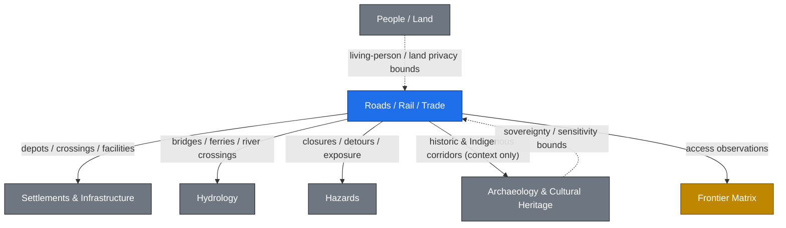
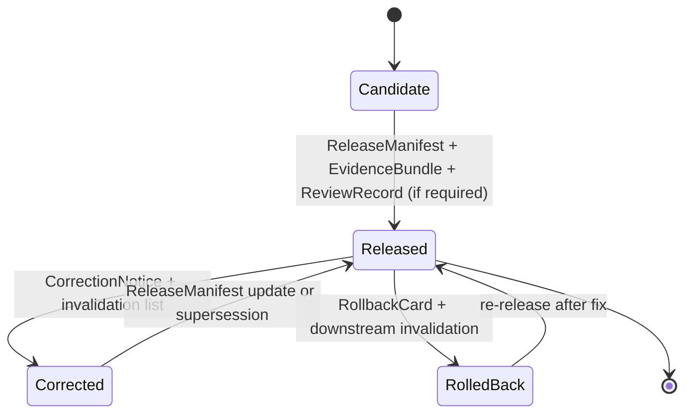

<!-- [KFM_META_BLOCK_V2]
doc_id: kfm://doc/docs-domains-roads-rail-trade-architecture
title: Roads, Rail, and Trade Routes — Domain Architecture
type: standard
version: v2
status: draft
owners: TODO (domain steward; release authority; sensitivity reviewer)
created: 2026-05-19
updated: 2026-06-07
policy_label: public
related:
  - docs/domains/roads-rail-trade/README.md
  - docs/domains/roads-rail-trade/API_CONTRACTS.md
  - docs/domains/roads-rail-trade/sublanes/README.md
  - docs/doctrine/directory-rules.md
  - docs/doctrine/lifecycle-law.md
  - docs/doctrine/trust-membrane.md
  - docs/architecture/governed-api.md
  - docs/architecture/contract-schema-policy-split.md
  - docs/standards/PROV.md
  - docs/atlases/Kansas_Frontier_Matrix_Domains_v1_1.md
tags: [kfm, domain, roads, rail, trade, transport, architecture]
notes:
  - 'CONTRACT_VERSION = "3.0.0" pinned per ai-build-operating-contract.md'
  - "File path docs/domains/roads-rail-trade/ARCHITECTURE.md is CONFIRMED by Directory Rules §6.1/§12 lane pattern; actual repo presence NEEDS VERIFICATION."
  - "All implementation-layer paths (contracts/, schemas/, policy/, tests/, data/, release/) are PROPOSED under Directory Rules §12; NEEDS VERIFICATION in mounted repo."
  - "Schema-home slug CONFLICTED: Directory Rules §12 (domains/roads-rail-trade/) vs Atlas §24.13 (transport/). See OPEN-RR-01."
  - "Cesium retired (v1.3 doctrine-target): packages/maplibre-runtime/ is the SOLE governed browser-side renderer; freeze rule in effect."
[/KFM_META_BLOCK_V2] -->

# Roads, Rail, and Trade Routes — Domain Architecture

> Governance, object semantics, lifecycle, and cross-lane boundaries for the Kansas roads, rail, historic routes, and trade-corridor lane.

<!-- Status / owners / badges -->


<!-- TODO: replace placeholder badges with live CI / release-state / coverage badges once endpoints are confirmed. -->

| Status | Owners | Last updated |
|---|---|---|
| `draft` — domain architecture, evidence-first | `TODO: domain steward · release authority · sensitivity reviewer` | 2026-06-07 |

> [!NOTE]
> This document **explains** how the Roads/Rail/Trade domain fits inside the KFM responsibility-root architecture. It does **not** define object meaning (that lives in `contracts/`), machine shape (`schemas/`), admissibility (`policy/`), or enforceability (`tests/` and `fixtures/`). Per Directory Rules, this doc decides nothing on its own; it indexes and explains the decisions that live in the authoritative roots. **`CONTRACT_VERSION = "3.0.0"`.**

---

## Contents

- [1. Scope and one-line purpose](#1-scope-and-one-line-purpose)
- [2. Repo fit and responsibility lanes](#2-repo-fit-and-responsibility-lanes)
- [3. What this domain owns](#3-what-this-domain-owns)
- [4. What this domain explicitly does not own](#4-what-this-domain-explicitly-does-not-own)
- [5. Ubiquitous language](#5-ubiquitous-language)
- [6. Source families](#6-source-families)
- [7. Object families](#7-object-families)
- [8. Cross-lane relations](#8-cross-lane-relations)
- [9. Pipeline shape and gates](#9-pipeline-shape-and-gates)
- [10. Sensitivity, rights, and publication posture](#10-sensitivity-rights-and-publication-posture)
- [11. API, contract, and schema surfaces](#11-api-contract-and-schema-surfaces)
- [12. Map and viewing products](#12-map-and-viewing-products)
- [13. Governed AI behavior in this domain](#13-governed-ai-behavior-in-this-domain)
- [14. Validators, tests, fixtures](#14-validators-tests-fixtures)
- [15. Publication, correction, and rollback](#15-publication-correction-and-rollback)
- [16. Open verification backlog](#16-open-verification-backlog)
- [17. Open questions and ADR candidates](#17-open-questions-and-adr-candidates)
- [Related docs](#related-docs)

---

## 1. Scope and one-line purpose

**CONFIRMED doctrine / PROPOSED implementation.** This domain governs Kansas roads, rail, historic routes, trade and mobility corridors, restrictions, transport facilities, graph projections, catalog/proof/release objects, governed APIs, MapLibre layers, the Evidence Drawer, Focus Mode answers, correction, and rollback for the transport lane. `[DOM-ROADS]` `[ENCY]`

The lane explicitly covers — per the Atlas — modern roads, historic roads, wagon roads, military / mail / emigrant / stage / cattle / trade corridors, rail corridors, depots, yards, crossings, restrictions, facilities, freight / logistics context, and derived graph projections. `[DOM-ROADS]`

> [!IMPORTANT]
> Derived graph and connectivity projections are **never** canonical truth. They are downstream carriers built from catalog records and EvidenceBundles, and they must be reversible to that source state. `[ENCY]` `[DIRRULES]`

[↑ back to top](#contents)

---

## 2. Repo fit and responsibility lanes

### 2.1 Where this document lives

| Question | Answer |
|---|---|
| **Doc path** | `docs/domains/roads-rail-trade/ARCHITECTURE.md` — CONFIRMED by the Directory Rules §6.1 tree and §12 Domain Placement Law lane pattern; actual repo presence PROPOSED (NEEDS VERIFICATION). |
| **Doc role** | Human-facing architecture for the Roads/Rail/Trade lane. Explains. Does **not** define meaning, shape, admissibility, or proof. |
| **Authority over this lane** | Atlas v1.1 chapter 13 (`[DOM-ROADS]`) for doctrine; Directory Rules for placement; ADRs for any binding change to canonical roots or schema-home rules. |

### 2.2 Lanes under each responsibility root — **PROPOSED** per Directory Rules §12

> [!CAUTION]
> Every path below is **PROPOSED** under the Domain Placement Law (Directory Rules §12). None has been verified against a mounted repository in this session. Do not treat this tree as evidence that any file exists. The schema/contract slug is additionally **CONFLICTED** (see the warning after the tree).

```text
docs/domains/roads-rail-trade/
contracts/domains/roads-rail-trade/
schemas/contracts/v1/domains/roads-rail-trade/
policy/domains/roads-rail-trade/
tests/domains/roads-rail-trade/
fixtures/domains/roads-rail-trade/
packages/domains/roads-rail-trade/
pipelines/domains/roads-rail-trade/
pipeline_specs/roads-rail-trade/
data/raw/roads-rail-trade/
data/work/roads-rail-trade/
data/quarantine/roads-rail-trade/
data/processed/roads-rail-trade/
data/catalog/domain/roads-rail-trade/
data/published/layers/roads-rail-trade/
data/registry/sources/roads-rail-trade/
release/candidates/roads-rail-trade/
```

> [!WARNING]
> **Schema/contract slug is CONFLICTED between two doctrine sources.** Directory Rules §12 prescribes the lane pattern `schemas/contracts/v1/domains/roads-rail-trade/` and `contracts/domains/roads-rail-trade/`; Atlas §24.13 (row 13) prescribes `schemas/contracts/v1/transport/` and `contracts/transport/` — without the `domains/` segment and with the slug `transport`. The `docs/`, `policy/`, `tests/`, `fixtures/`, `pipelines/`, and `data/` lanes above use the §12 `roads-rail-trade` form unambiguously; the schema/contract home is the disputed one. Resolve by ADR per Directory Rules §2.4. See [OPEN-RR-01](#17-open-questions-and-adr-candidates). `[DIRRULES §12]` `[ENCY §24.13]`

### 2.3 Authority boundary

```mermaid
flowchart LR
  subgraph DOC["docs/domains/roads-rail-trade/ — this lane (explanation)"]
    A["ARCHITECTURE.md (this file)"]
  end
  subgraph CONTRACTS["contracts/.../roads-rail-trade/ — meaning"]
    C1["road_segment.md"]
    C2["rail_segment.md"]
    C3["access_restriction.md"]
  end
  subgraph SCHEMAS["schemas/contracts/v1/.../roads-rail-trade/ — shape"]
    S1["*.schema.json"]
  end
  subgraph POLICY["policy/domains/roads-rail-trade/ — admissibility"]
    P1["promotion gates"]
    P2["sensitivity rules"]
  end
  subgraph TESTS["tests/ + fixtures/ — proof"]
    T1["validators · golden fixtures"]
  end
  subgraph DATA["data/.../roads-rail-trade/ — lifecycle"]
    D1["RAW → WORK/QUARANTINE → PROCESSED → CATALOG/TRIPLET → PUBLISHED"]
  end
  subgraph RELEASE["release/candidates/roads-rail-trade/ — release decisions"]
    R1["ReleaseManifest · RollbackCard"]
  end
  A -. "references" .-> CONTRACTS
  A -. "references" .-> SCHEMAS
  A -. "references" .-> POLICY
  A -. "references" .-> DATA
  A -. "references" .-> RELEASE
  CONTRACTS --> SCHEMAS
  SCHEMAS --> POLICY
  POLICY --> TESTS
  TESTS -. "enforces over" .-> DATA
  DATA --> RELEASE
  classDef explain fill:#0969da,stroke:#0a2e6b,color:#fff;
  classDef meaning fill:#1f6feb,stroke:#0a2e6b,color:#fff;
  classDef shape fill:#8250df,stroke:#3b1f7a,color:#fff;
  classDef policy fill:#bf8700,stroke:#5c4400,color:#fff;
  classDef proof fill:#1a7f37,stroke:#0e4d20,color:#fff;
  classDef data fill:#9a6700,stroke:#5c3e00,color:#fff;
  classDef release fill:#cf222e,stroke:#82071e,color:#fff;
  class DOC explain;
  class CONTRACTS meaning;
  class SCHEMAS shape;
  class POLICY policy;
  class TESTS proof;
  class DATA data;
  class RELEASE release;
```



> [!NOTE]
> NEEDS VERIFICATION: every node above corresponds to a PROPOSED lane path in §2.2. The diagram reflects Directory Rules §12 doctrine, not observed repo files. The `contracts/` / `schemas/` segments are abbreviated with `.../` because the slug is CONFLICTED (§2.2 warning).

[↑ back to top](#contents)

---

## 3. What this domain owns

**CONFIRMED / PROPOSED.** The Roads/Rail/Trade lane owns the following object roots: Road Segment; Historic Route; Rail Segment; Depot; Siding; Yard; Crossing; Bridge; Ferry; River Crossing; Freight Corridor; Route Event; Operator Status; Access Restriction; Network Edge; Movement Story Node. `[DOM-ROADS]` `[ENCY]`

These objects are owned in the bounded-context sense: their meaning, evidence requirements, sensitivity defaults, and release rules are decided in this lane. Other lanes may **cite** them but cannot redefine them.

> [!NOTE]
> The canonical owned-object names are `Route Event`, `Operator Status`, and `Access Restriction` (Atlas §B). The field realizations used in §5 / §7 (`StatusEvent`, `OperatorAssignment`, `RestrictionEvent`) are **PROPOSED** projections of those CONFIRMED owned objects, not separate canonical names.

[↑ back to top](#contents)

---

## 4. What this domain explicitly does not own

**CONFIRMED / PROPOSED.** Cross-lane truth boundaries (from the Atlas) — Roads/Rail/Trade does **not** own:

| Boundary | Owner | Why this matters |
|---|---|---|
| Settlement and infrastructure canonical identity (depots, stations, towns) | Settlements / Infrastructure | A depot's *facility identity* is settlement-owned; the *route relation* is roads/rail-owned. `[DOM-ROADS]` `[DOM-SETTLE]` |
| Water-feature evidence (rivers, fords, gauges) | Hydrology | A bridge crosses a river; the river itself is hydrology-owned. `[DOM-ROADS]` `[DOM-HYD]` |
| Hazard events and closure authority | Hazards | A closure *event* is hazards-owned; the *restriction record* against a route is roads/rail-owned. `[DOM-ROADS]` `[DOM-HAZ]` |
| Archaeological site coordinates and cultural sovereignty | Archaeology / Cultural Heritage and People / Land | Historic and Indigenous corridors are *cited as context only*; exact archaeological coordinates are denied. `[DOM-ROADS]` `[DOM-ARCH]` |

> [!WARNING]
> **Source-role collapse is forbidden.** A modern routing graph MUST NOT be presented as evidence of a historic route; a historic route claim MUST NOT be cited as an operational restriction. Source role is fixed at admission and never upgraded by promotion. `[ENCY]` `[DIRRULES]`

[↑ back to top](#contents)

---

## 5. Ubiquitous language

**CONFIRMED terms / PROPOSED field realization.** These terms have defined meaning inside this lane and travel with constraints on source role, evidence, time, and release state. `[DOM-ROADS]` `[ENCY]`

| Term | Role in this lane |
|---|---|
| **Road Segment** | Atomic length of roadway evidence; constrained by source role, evidence, time, release state. |
| **Rail Segment** | Atomic length of rail evidence; same constraints as Road Segment. |
| **CorridorRoute** | A composed route claim across segments; carries route designation distinct from segment membership. |
| **RouteMembership** | The associative link between a segment and a CorridorRoute; lets designation and geometry change independently. |
| **Network Node** | Junction / crossing / endpoint; anchors connectivity in derived graph projections. |
| **Crossing** | Specifically a road-rail or road-water crossing; carries cross-lane edges to Settlements, Hydrology, Hazards. |
| **TransportFacility** | Depot / siding / yard / facility within the transport lane; *identity* may be co-owned with Settlements. |
| **RestrictionEvent** *(PROPOSED realization of Access Restriction)* | A temporal restriction (closure, weight limit, hazard detour) against a route or segment. |
| **StatusEvent** *(PROPOSED realization of Route Event)* | A temporal operational state (open, suspended, abandoned, decommissioned). |
| **OperatorAssignment** *(PROPOSED realization of Operator Status)* | The temporal link from a route or facility to an operator (rail carrier, road authority). |
| **Historic RouteClaim** | A historic route as an evidence-bearing *claim*, never an observation; supports overprecision denial. |
| **TradeRouteCorridor** | A generalized historic trade or mobility corridor; default public geometry is generalized. |

Per Directory Rules and the trust-membrane doctrine, every public claim using these terms MUST resolve through an EvidenceRef into an EvidenceBundle before it can be cited as authoritative. `[ENCY]` `[GAI]`

[↑ back to top](#contents)

---

## 6. Source families

**CONFIRMED / NEEDS VERIFICATION.** Source-role assignment is fixed at admission and never upgraded. Rights, sensitivity, and freshness are source-specific. `[DOM-ROADS]` `[ENCY]`

| Source family | Typical source role(s) | Rights / sensitivity | Freshness posture |
|---|---|---|---|
| Census **TIGER/Line** roads | authority · observation · context | rights NEEDS VERIFICATION; sensitive joins fail closed | source-vintage (annual cadence) |
| **FHWA HPMS** | authority · observation · model | rights NEEDS VERIFICATION; sensitive joins fail closed | source-vintage |
| **FHWA National Highway Freight Network** | authority · context | rights NEEDS VERIFICATION | source-vintage |
| **WZDx** feeds | observation (live work-zone events) | rights NEEDS VERIFICATION; live-feed sensitivity defaults apply | live / event-driven |
| **KDOT / KanPlan / KanDrive / Kansas GIS** | authority · observation · context | rights NEEDS VERIFICATION | source-specific cadence |
| County / state **bridge and restriction data** | authority · observation | rights NEEDS VERIFICATION; structural-data sensitivity review may apply | source-specific cadence |
| **GNIS** names | authority (names) · context | rights NEEDS VERIFICATION; legal-status denial applies on misuse | infrequent updates |
| **OpenStreetMap** | observation · context (community) | rights NEEDS VERIFICATION; legal-status denial applies (no authoritative status claim) | rolling |
| **FRA GCIS** grade-crossing inventory | authority · observation | rights NEEDS VERIFICATION; safety-data review may apply | source-specific cadence |
| **FRA Form 57** rail incident reports | observation (regulatory) | rights NEEDS VERIFICATION; incident-data sensitivity review may apply | event-driven |
| **STB Class I** weekly reports | observation · context | rights NEEDS VERIFICATION | weekly; snapshot-week must be pinned in receipt |
| **HIFLD / NTAD** transport layers | authority · context | rights NEEDS VERIFICATION; critical-asset deny defaults may apply | source-vintage |
| **GTFS / GTFS-RT** transit feeds | authority (schedule) · observation (realtime) | rights NEEDS VERIFICATION; protobuf `.proto` schema version pinned at decode | scheduled / realtime |
| **KCATA** Kansas City metro feed | observation | rights NEEDS VERIFICATION | scheduled / realtime |

> [!NOTE]
> The first eight rows are the Atlas Ch. 13 §D roster (CONFIRMED listing). The rail-stack rows (FRA GCIS, Form 57, STB Class I, HIFLD, NTAD) are CONFIRMED at doctrine level via Pass-10 card **C10-05**; the transit rows (GTFS, GTFS-RT, KCATA, plus KanDrive/WZDx) via Pass-10 card **C10-04**. The corpus is explicit that GTFS-RT's protobuf serialization pins the `.proto` schema version and records it in the receipt at decode time (C10-04). Per-source rights, license, cadence, and authority verification remains **NEEDS VERIFICATION** until source descriptors are mounted (cf. PROPOSED card KFM-P20-PROG-0031, Kansas transit source descriptors).

[↑ back to top](#contents)

---

## 7. Object families

**CONFIRMED purpose / PROPOSED identity rule.** Every object below carries the same temporal contract: **source**, **observed**, **valid**, **retrieval**, **release**, and **correction** times stay distinct where material. `[DOM-ROADS]` `[ENCY]`

| Object | Purpose | Identity (PROPOSED) |
|---|---|---|
| **Road Segment** | Represents Road Segment evidence or released derivative within Roads/Rail. | `source_id + object_role + temporal_scope + normalized_digest` |
| **Rail Segment** | Represents Rail Segment evidence or released derivative within Roads/Rail. | same shape as Road Segment |
| **Crossing** | Road-rail, road-water, or rail-rail intersection node. | same shape |
| **Bridge** | Cross-lane structure; carries an edge to Hydrology. | same shape |
| **Ferry / River Crossing** | Time-bound water crossing; carries an edge to Hydrology. | same shape |
| **Depot · Siding · Yard** | Rail facilities; *identity* may co-own with Settlements/Infrastructure. | same shape |
| **TransportFacility** | Generic transport facility (terminal, intermodal, weigh station). | same shape |
| **RestrictionEvent** *(Access Restriction)* | Temporal restriction (closure, weight limit, detour). | same shape; temporal scope is mandatory |
| **StatusEvent** *(Route Event)* | Operational status change (open, suspended, abandoned). | same shape |
| **OperatorAssignment** *(Operator Status)* | Operator-to-route assignment over a time interval. | same shape |
| **CorridorRoute / RouteMembership** | Composed route + segment-to-route association. | route identity + membership association |
| **Historic RouteClaim** | Historic route as a claim, not an observation; uncertainty is a first-class field. | source-pinned; overprecision is denied at publication |
| **TradeRouteCorridor** | Generalized historic trade or mobility corridor. | source-pinned; public geometry default is generalized |
| **Network Edge** | Derived graph edge between Network Nodes; **never canonical truth.** | derived from segments + memberships |
| **Movement Story Node** | Narrative-anchor node for movement / journey stories. | source-pinned |

> [!TIP]
> When in doubt, the *route claim* and the *segment* are different objects. Designation, membership, geometry, and uncertainty change independently and on different cadences. Tests should preserve that separation. `[DOM-ROADS]`

[↑ back to top](#contents)

---

## 8. Cross-lane relations

**CONFIRMED / PROPOSED.** Every cross-lane edge MUST preserve ownership, source role, sensitivity tier, and EvidenceBundle support. `[DOM-ROADS]` `[ENCY]`

| Edge | Typical relation | Constraint |
|---|---|---|
| Roads/Rail → Settlements / Infrastructure | depots, crossings, facilities, dependencies | ownership preserved; settlement-owned facility identity, roads/rail-owned route relation |
| Roads/Rail → Hydrology | bridge / ferry / ford / river crossing | hydrology-owned water evidence; roads/rail-owned crossing object |
| Roads/Rail → Hazards | closure, detour, flood / fire / smoke exposure | hazards-owned event; roads/rail-owned RestrictionEvent |
| Roads/Rail → Archaeology / Cultural Heritage | historic routes, Indigenous corridors, forts, missions | context-only citation; exact archaeological coordinates denied |
| Roads/Rail → Frontier Matrix | access observations bound access cells in the matrix | matrix cells are derived; not a substitute for the underlying EvidenceBundles |



[↑ back to top](#contents)

---

## 9. Pipeline shape and gates

**CONFIRMED doctrine / PROPOSED lane application.** Roads/Rail follows the canonical KFM lifecycle: **RAW → WORK / QUARANTINE → PROCESSED → CATALOG / TRIPLET → PUBLISHED**, with promotion as a governed state transition — never a file move. `[DIRRULES]` `[DOM-ROADS]` `[ENCY]`

```mermaid
flowchart LR
  RAW["RAW — immutable source + SourceDescriptor"]:::raw
  WORK["WORK / QUARANTINE — normalize schema, geometry, time, identity, evidence, rights, policy"]:::work
  PROC["PROCESSED — validated normalized objects + receipts + public-safe candidates"]:::proc
  CAT["CATALOG / TRIPLET — catalog records, EvidenceBundles, graph projections, release candidates"]:::cat
  PUB["PUBLISHED — governed APIs + manifests + correction + rollback"]:::pub
  RAW -->|"SourceDescriptor exists"| WORK
  WORK -->|"validation + policy pass, or quarantine reason recorded"| PROC
  PROC -->|"EvidenceRef + ValidationReport + digest closure"| CAT
  CAT -->|"catalog / proof closure"| PUB
  PUB -. "correction / rollback" .-> CAT
  classDef raw fill:#cf222e,stroke:#82071e,color:#fff;
  classDef work fill:#bf8700,stroke:#5c4400,color:#fff;
  classDef proc fill:#9a6700,stroke:#5c3e00,color:#fff;
  classDef cat fill:#8250df,stroke:#3b1f7a,color:#fff;
  classDef pub fill:#1a7f37,stroke:#0e4d20,color:#fff;
```



<details>
<summary><strong>Lifecycle gate table (per Atlas §13.H — CONFIRMED doctrine / PROPOSED lane status)</strong></summary>

| Stage | Handling | Gate | Status |
|---|---|---|---|
| **RAW** | Capture immutable source payload or reference with source role, rights, sensitivity, citation, time, and hash. | `SourceDescriptor` exists. | PROPOSED |
| **WORK / QUARANTINE** | Normalize schema, geometry, time, identity, evidence, rights, and policy; hold failures. | Validation and policy gate pass, or quarantine reason is recorded. | PROPOSED |
| **PROCESSED** | Emit validated normalized objects, receipts, and public-safe candidates. | `EvidenceRef`, `ValidationReport`, and digest closure exist. | PROPOSED |
| **CATALOG / TRIPLET** | Emit catalog records, `EvidenceBundles`, graph / triplet projections, and release candidates. | Catalog / proof closure passes. | PROPOSED |
| **PUBLISHED** | Serve released public-safe artifacts through governed APIs and manifests. | `ReleaseManifest`, correction path, rollback target, and review / policy state exist. | PROPOSED |

</details>

> [!IMPORTANT]
> **Watcher-as-non-publisher.** Pipelines and workers in this lane emit receipts and candidate decisions; they do NOT write directly to `data/catalog/` or `data/published/`. Promotion to PUBLISHED is a governed state transition that requires the closure conditions above. `[DIRRULES]` `[ENCY]`

[↑ back to top](#contents)

---

## 10. Sensitivity, rights, and publication posture

**CONFIRMED / PROPOSED.** Indigenous trade and mobility corridors, oral history, treaty, cultural, and interpretive evidence default to **steward review and generalized public geometry**. Critical transport facilities require review. `[DOM-ROADS]` `[ENCY]`

**CONFIRMED doctrine.** Unclear rights, unresolved source role, missing evidence, unresolved sensitivity, or absent release state **blocks public promotion**. `[ENCY]` `[DIRRULES]`

> [!CAUTION]
> KFM is **never** an alert authority for live transport events. WZDx and similar live feeds may inform historical or analytical surfaces, but the governed API surface MUST NOT be used as a routing, dispatch, or life-safety instruction channel. The emergency-alert boundary is explicit doctrine. `[DOM-HAZ]` `[ENCY]`

### Default sensitivity dispositions

| Class of content | Default disposition | Receipt required at release |
|---|---|---|
| Modern public roads geometry (TIGER, KDOT base) | public, with attribution | `RedactionReceipt` on any sensitivity-driven generalization |
| Live WZDx work-zone events | review at admission; analytical use only | temporal-scope receipt; `RedactionReceipt` if generalized |
| Critical transport facility detail (capacity, vulnerability) | restricted / steward review | `RedactionReceipt` when published |
| Historic Indigenous trade / mobility corridors | generalized public geometry by default; sovereignty review where applicable | `RedactionReceipt` + `ReviewRecord` |
| Historic route claims (wagon, military, mail, cattle, stage) | public *as claim*, with uncertainty visible | `RedactionReceipt` if generalized; overprecision is denied |
| Rail incident detail (Form 57) | review at admission; aggregated public surface | `AggregationReceipt` when aggregated |

> [!NOTE]
> Receipt families above (`RedactionReceipt`, `AggregationReceipt`, `ReviewRecord`) are CONFIRMED cross-cutting receipt classes. The earlier `TransformReceipt` label is not a canonical KFM receipt family; geometry/field transformations for public-safety reasons use `RedactionReceipt`. The most-restrictive applicable row of the operating contract's §23.2 matrix governs. `[ENCY]`

[↑ back to top](#contents)

---

## 11. API, contract, and schema surfaces

**PROPOSED governed API surface; exact routes UNKNOWN.** Every surface emits a finite outcome — `ANSWER` / `ABSTAIN` / `DENY` / `ERROR` — and is reachable only through the trust membrane (`apps/governed-api/` per Directory Rules §7.1). `[GAI]` `[DIRRULES]`

| Endpoint or artifact | DTO / schema | Outcomes | Status |
|---|---|---|---|
| Roads/Rail feature / detail resolver | `RoadsRailDecisionEnvelope` | `ANSWER` / `ABSTAIN` / `DENY` / `ERROR` | PROPOSED; route UNKNOWN |
| Roads/Rail layer manifest resolver | `LayerManifest` / domain layer descriptor | `ANSWER` / `DENY` / `ERROR` | PROPOSED; public-safe release only |
| Roads/Rail Evidence Drawer payload | `EvidenceDrawerPayload` + `EvidenceBundle` projection | `ANSWER` / `ABSTAIN` / `DENY` / `ERROR` | PROPOSED; evidence and policy filtered |
| Roads/Rail Focus Mode answer | `RuntimeResponseEnvelope` + `AIReceipt` | `ANSWER` / `ABSTAIN` / `DENY` / `ERROR` | PROPOSED; AI never root truth |
| Schema responsibility root | `schemas/contracts/v1/...` per ADR-0001 | finite validator outcomes | PROPOSED; slug CONFLICTED (§2.2, OPEN-RR-01) |

> [!NOTE]
> Per ADR-0001, the **default machine-schema home** is `schemas/contracts/v1/...`. Any divergent schema home for this lane requires an ADR. The `contracts/.../roads-rail-trade/` home carries semantic Markdown only; executable validation lives in `schemas/`, admissibility in `policy/`, and proof in `tests/` + `fixtures/` (the meaning/shape/admissibility/proof split is documented in `docs/architecture/contract-schema-policy-split.md`, CONFIRMED present in Directory Rules §6.1). Full surface/outcome semantics live in `docs/domains/roads-rail-trade/API_CONTRACTS.md`. `[DIRRULES]`

[↑ back to top](#contents)

---

## 12. Map and viewing products

**PROPOSED.** Lane-specific viewing products surfaced through the governed map shell: `[DOM-ROADS]` `[ENCY]`

- Modern roads layer
- Rail alignment layer
- Facility / crossing view
- Restriction / status timeline
- Freight-corridor context view
- Historic route claim view (uncertainty visible)
- Generalized trade-route corridor view
- Derived graph / connectivity view (clearly labeled as derived, not canonical)

**CONFIRMED doctrine.** Cross-cutting viewing products that apply uniformly across all KFM domains: Evidence Drawer, time-aware state, trust badges, sensitivity-redacted view, correction / stale-state view, and governed Focus Mode. `[MAP-MASTER]` `[GAI]`

> [!WARNING]
> The map shell **MUST NOT** read canonical / internal stores directly. It consumes layer manifests and `EvidenceBundle` projections through the governed API. The renderer is `packages/maplibre-runtime/` — the **sole governed browser-side renderer** (v1.3; Cesium retired, freeze rule in effect) — a downstream carrier of governed evidence, never an alternate truth path. `[DIRRULES §11]` `[MAP-MASTER]`

[↑ back to top](#contents)

---

## 13. Governed AI behavior in this domain

**CONFIRMED doctrine / PROPOSED implementation.** AI in this lane may:

- Summarize **released** Roads/Rail `EvidenceBundles`.
- Compare evidence across released artifacts.
- Explain limitations, uncertainty, source role, and freshness.
- Draft steward-review notes.

AI MUST:

- `ABSTAIN` when evidence is insufficient.
- `DENY` where policy, rights, sensitivity, or release state blocks the request.
- Never substitute generated language for evidence, policy, review state, source authority, or release state. `[GAI]` `[DOM-ROADS]` `[ENCY]`

Every governed AI answer in this lane emits an `AIReceipt` carrying prompt scope, evidence refs, policy ref, outcome, reason code, model id, and timestamp. `[ENCY]` `[GAI]`

[↑ back to top](#contents)

---

## 14. Validators, tests, fixtures

**PROPOSED lane-specific tests** — none CONFIRMED in the mounted repo this session. `[DOM-ROADS]` `[ENCY]`

| Test family | Purpose |
|---|---|
| Route membership and designation separation | Prove `CorridorRoute` ≠ `RouteMembership` ≠ `Road/Rail Segment`. A change to designation must not silently rewrite segment evidence. |
| Operator / status temporal | Prove operator and status intervals do not overlap unsafely; temporal scope is mandatory. |
| OSM / GNIS legal-status denial | Prove that observation-tier sources cannot be promoted to legal-status authority. |
| Historic overprecision denial | Prove that historic route claims cannot publish geometry beyond evidence-supported precision. |
| Public generalization receipt | Prove that every public generalization carries a `RedactionReceipt`. |
| Transport graph projection rollback | Prove that derived `Network Edge` projections are reversible to source catalog records; rollback drills succeed. |

> [!NOTE]
> Fixtures for these tests live under `fixtures/domains/roads-rail-trade/` (or `tests/fixtures/...`) per Directory Rules §6.6. Both placements are permitted; only one canonical home should evolve in any given repo, and the choice should be documented in the lane README. `[DIRRULES §6.6]`

[↑ back to top](#contents)

---

## 15. Publication, correction, and rollback

**CONFIRMED doctrine / PROPOSED implementation.** Publication in this lane requires:

1. `ReleaseManifest` for the candidate.
2. `EvidenceBundle` for every claim.
3. Validation and policy support (`ValidationReport` + `PolicyDecision`).
4. `ReviewRecord` where required by sensitivity or materiality.
5. Correction path.
6. Stale-state rule.
7. Rollback target (`RollbackCard`). `[ENCY App. E]` `[DOM-ROADS]`



> [!IMPORTANT]
> **Separation of duties** applies at sensitivity-bearing release. The release authority for sensitive lane artifacts (Indigenous corridors, infrastructure detail, restriction events) SHOULD be distinct from the original author, where lane maturity justifies it. `[ENCY]` (reviewer separation-of-duties matrix)

[↑ back to top](#contents)

---

## 16. Open verification backlog

| Item to verify | Evidence that would settle it | Status |
|---|---|---|
| Verify KDOT / FHWA / FRA / WZDx source terms, rights, and cadence | mounted source descriptors, registry entries, license artifacts | NEEDS VERIFICATION |
| Verify Indigenous / cultural corridor policy and steward review path | policy bundle, ReviewRecord fixtures, sovereignty-review SOP | NEEDS VERIFICATION |
| Implement `RouteUncertaintyProfile` | schema, validator, fixtures, golden tests | NEEDS VERIFICATION |
| Verify transport graph projection and MapLibre integration | layer manifest, governed-API route, derived-graph rollback drill | NEEDS VERIFICATION |
| Verify rail-stack source admission (FRA GCIS, Form 57, STB Class I, HIFLD, NTAD — C10-05) | source descriptors, license texts, cadence pinning, STB snapshot-week receipts | NEEDS VERIFICATION |
| Resolve GTFS / GTFS-RT `.proto` schema-version pinning at decode (C10-04) | decoder version registry, receipt recording `.proto` version | NEEDS VERIFICATION |
| Resolve GCIS-vs-HIFLD geometry disagreement policy (C10-05 open question) | ADR or policy decision; reconciliation receipt format | NEEDS VERIFICATION |
| Resolve schema/contract slug (`domains/roads-rail-trade/` vs `transport/`) | ADR aligning Directory Rules §12 and Atlas §24.13 | NEEDS VERIFICATION |

[↑ back to top](#contents)

---

## 17. Open questions and ADR candidates

<details>
<summary><strong>Click to expand the candidate-ADR register for this lane</strong></summary>

| Candidate | Question | Why an ADR (or why not) |
|---|---|---|
| **OPEN-RR-01** | Schema/contract home slug: `schemas/contracts/v1/domains/roads-rail-trade/` + `contracts/domains/roads-rail-trade/` (Directory Rules §12) vs `schemas/contracts/v1/transport/` + `contracts/transport/` (Atlas §24.13, row 13)? | Two doctrine sources disagree (`domains/` segment + `roads-rail-trade` vs `transport`). Creates a parallel schema home; explicitly ADR-class per Directory Rules §2.4. Slug change ripples through every lane path. |
| **OPEN-RR-02** | Where does `RouteUncertaintyProfile` live: under the lane home or under a shared `schemas/contracts/v1/common/uncertainty/` home? | Per ADR-0001, default is the lane home. A common-uncertainty home would be a parallel schema home and therefore requires its own ADR. |
| **OPEN-RR-03** | What is the boundary between an "operational restriction" (Roads/Rail-owned `RestrictionEvent` / Access Restriction) and a "hazard event" (Hazards-owned)? Where does a flood-driven detour live? | Cross-lane edge constraints (§8) cover the relation, but the *primary record* needs an ADR or doctrine clarification. |
| **OPEN-RR-04** | Should historic route uncertainty be a first-class field on `Historic RouteClaim`, or a separate `RouteUncertaintyProfile` artifact joined by EvidenceRef? | Affects schema shape and overprecision-denial tests. Recommend ADR. |
| **OPEN-RR-05** | What is the policy when GCIS coordinates disagree with HIFLD geometry for the same crossing? | Pass-10 C10-05 raises this as an open question. Until resolved, both sources sit at PROCESSED with conflict tagged. |
| **OPEN-RR-06** | Cadence target for GTFS-RT fetch (sub-minute vs 30 s vs other)? | Pass-10 C10-04 raises this (corpus implies sub-minute, does not specify). Cadence drives connector design and source descriptor; recommend a one-week stability test (e.g., against KCATA) before fixing. |

</details>

[↑ back to top](#contents)

---

## Related docs

- [`docs/domains/roads-rail-trade/README.md`](./README.md) — Roads/Rail/Trade lane README *(PROPOSED — verify on mount)*
- [`docs/domains/roads-rail-trade/API_CONTRACTS.md`](./API_CONTRACTS.md) — governed-API surface contracts (DTO/outcome semantics)
- [`docs/domains/roads-rail-trade/sublanes/README.md`](./sublanes/README.md) — per-mode sublane dossiers (roads, rail, trade, trade-routes) *(PROPOSED)*
- [`docs/doctrine/directory-rules.md`](../../doctrine/directory-rules.md) — placement law, lifecycle law, authority order (CONFIRMED authored; mounted-repo presence NEEDS VERIFICATION)
- [`docs/doctrine/trust-membrane.md`](../../doctrine/trust-membrane.md) — public-surface trust boundary (CONFIRMED in Directory Rules related-doctrine list)
- [`docs/doctrine/lifecycle-law.md`](../../doctrine/lifecycle-law.md) — RAW → PUBLISHED invariant (CONFIRMED in Directory Rules related-doctrine list)
- [`docs/architecture/governed-api.md`](../../architecture/governed-api.md) — finite-outcome envelopes, `AIReceipt`, `DecisionEnvelope`
- [`docs/architecture/contract-schema-policy-split.md`](../../architecture/contract-schema-policy-split.md) — meaning / shape / admissibility / proof split (CONFIRMED in Directory Rules §6.1)
- [`docs/atlases/`](../../atlases/) — Atlas chapter 13, Roads / Rail / Trade Routes `[DOM-ROADS]`
- [`docs/standards/PROV.md`](../../standards/PROV.md) — provenance standard (naming variance vs `PROVENANCE.md` → Directory Rules §18 OPEN-DR-01)
- `docs/domains/settlements-infrastructure/` — adjacent lane; co-owns facility identity *(TODO when authored)*
- `docs/domains/hydrology/` — adjacent lane; owns water-feature evidence for crossings *(TODO when authored)*
- `docs/domains/hazards/` — adjacent lane; owns hazard events feeding `RestrictionEvent` *(TODO when authored)*
- `docs/domains/archaeology/` — adjacent lane; owns sensitive cultural corridor sovereignty *(TODO when authored)*

---

<sub><strong>Last updated:</strong> 2026-06-07 · <strong>Doc version:</strong> v2 · <strong>Doc type:</strong> standard · <strong>Lane:</strong> `roads-rail-trade` · <strong>CONTRACT_VERSION:</strong> 3.0.0 · <strong>Authority:</strong> `[DOM-ROADS]`, `[ENCY]`, `[DIRRULES]`, `[GAI]`, `[MAP-MASTER]` — see Atlas v1.1 ch. 13.</sub>
<sub>[↑ back to top](#contents)</sub>
