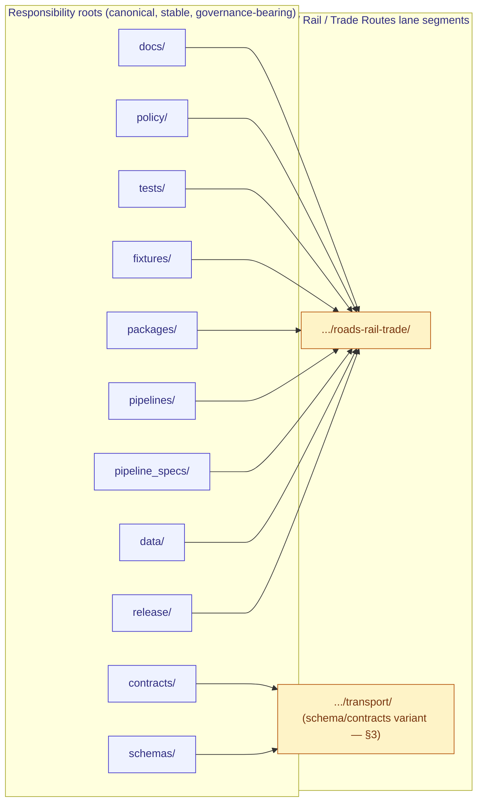

<!-- [KFM_META_BLOCK_V2]
doc_id: kfm://doc/<uuid-to-assign>
title: Canonical Paths — Roads / Rail / Trade Routes Domain
type: standard
version: v1
status: draft
owners: <roads-rail-trade stewards; see CODEOWNERS — TODO confirm>
created: 2026-05-19
updated: 2026-05-19
policy_label: public
related:
  - docs/doctrine/directory-rules.md
  - docs/domains/roads-rail-trade/README.md
  - docs/adr/ADR-0001-schema-home.md
  - docs/registers/DRIFT_REGISTER.md
  - docs/registers/VERIFICATION_BACKLOG.md
  - docs/atlases/kfm-domains-v1.1-pass23-32-consolidated-atlas.md
tags: [kfm, domain, roads-rail-trade, transport, canonical-paths, governance, directory-rules]
notes:
  - "Doctrine grounded in directory-rules.md §§4, 5, 6, 7, 12; Domains Atlas v1.0 Ch. 13 [DOM-ROADS]; Atlas §24.13 crosswalk."
  - "Naming variance flagged: docs segment is `roads-rail-trade/` per Directory Rules §12; schema/contracts segment is `transport/` per Atlas §24.13 crosswalk. See §11 OPEN-RRT-01."
  - "Specific repo presence of any path below is PROPOSED until verified against a mounted repository."
[/KFM_META_BLOCK_V2] -->

# Canonical Paths — Roads / Rail / Trade Routes Domain

> Registry of canonical repository paths for the **Roads / Rail / Trade Routes** lane, derived from `directory-rules.md` §12 (Domain Placement Law) and Atlas Ch. 13 [DOM-ROADS]. **All concrete paths below are PROPOSED until verified against a mounted repository.**


**Status:** draft · **Owners:** _roads-rail-trade stewards (placeholder — see CODEOWNERS)_ · **Last updated:** 2026-05-19

---

## Contents

- [1. Purpose & scope](#1-purpose--scope)
- [2. Doctrinal anchor — Domain Placement Law](#2-doctrinal-anchor--domain-placement-law)
- [3. Naming variance — `roads-rail-trade/` vs `transport/`](#3-naming-variance--roads-rail-trade-vs-transport)
- [4. Canonical lane tree](#4-canonical-lane-tree)
- [5. Path-by-path registry](#5-path-by-path-registry)
- [6. Cross-lane shared homes (no domain segment)](#6-cross-lane-shared-homes-no-domain-segment)
- [7. Lifecycle posture per phase](#7-lifecycle-posture-per-phase)
- [8. Sensitivity-driven path posture](#8-sensitivity-driven-path-posture)
- [9. Anti-patterns specific to this domain](#9-anti-patterns-specific-to-this-domain)
- [10. Verification backlog](#10-verification-backlog)
- [11. Open questions](#11-open-questions)
- [12. Related docs](#12-related-docs)
- [Appendix A — Owned object families and likely path nodes](#appendix-a--owned-object-families-and-likely-path-nodes)
- [Appendix B — Truth-label glossary](#appendix-b--truth-label-glossary)

---

## 1. Purpose & scope

This document is the **canonical-path registry** for the Roads / Rail / Trade Routes domain lane. It answers a single question for reviewers, authors, and tooling:

> *"For a file that belongs to Roads / Rail / Trade Routes, **where does it go**?"*

It does **not** decide whether a file should exist. Existence is decided by `contracts/`, `schemas/`, `policy/`, source descriptors, ADRs, and reviews. This document decides *where it goes once it exists.*

**Doctrinal grounding (CONFIRMED):**

- `directory-rules.md` §12 — Domain Placement Law: a domain is a **lane segment** inside responsibility roots, never a root folder.
- `directory-rules.md` §4 — Placement Protocol: pick exactly one primary responsibility, then add the lane segment.
- Atlas Ch. 13 [DOM-ROADS] — domain identity, scope, owned object families, cross-lane relations.
- Atlas §24.13 — Domain ↔ Dossier ↔ Responsibility Root crosswalk for Roads/Rail/Trade (row 13).

**Lifecycle invariant the lane MUST preserve (CONFIRMED):**
`RAW → WORK / QUARANTINE → PROCESSED → CATALOG / TRIPLET → PUBLISHED`, with promotion as a **governed state transition, not a file move**.

> [!IMPORTANT]
> **Specific repo presence of any path in this document is PROPOSED until verified against a mounted repository.** This file describes the canonical shape; it does not claim implementation depth. Author conformance and reviewer audits MUST cite this file *and* repo evidence, not this file alone.

[↑ back to top](#contents)

---

## 2. Doctrinal anchor — Domain Placement Law

CONFIRMED from `directory-rules.md` §12. A domain MUST NOT become a root folder. Roads / Rail / Trade Routes therefore does **not** look like:

```text
roads-rail-trade/
├── data/    schemas/   policy/   docs/
```

It MUST look like the lane pattern, with the domain appearing as a **segment** inside the responsibility root:



> [!NOTE]
> The two lane-segment labels (`roads-rail-trade/` vs `transport/`) reflect the **naming variance** documented in §3 below. Both appear in current KFM doctrine; the choice is not yet resolved by ADR.

[↑ back to top](#contents)

---

## 3. Naming variance — `roads-rail-trade/` vs `transport/`

CONFIRMED variance in current doctrine. Two distinct domain-segment labels appear in the corpus:

| Segment label | Where it appears | Status |
|---|---|---|
| `roads-rail-trade/` | `directory-rules.md` §12 (universal lane-pattern example list); `docs/` tree in §6.1 lists `domains/roads-rail-trade/` | CONFIRMED in directory rules |
| `transport/` | Atlas §24.13 crosswalk row 13: `schemas/contracts/v1/transport/` and `contracts/transport/`; Atlas v1.0 ch. 13 title is "Roads, Rail, and Trade Routes" but unified manual §30.8 uses "Roads / Rail / Trade Routes" and references `transport/` for the schema home | CONFIRMED in atlas crosswalk |
| `roads/rail/` (informal short form) | Dossier prose ("Roads/Rail") | INFERRED informal; not used as a path segment |

**Hypothesis (INFERRED, not confirmed by ADR):** the two segments may be intentional — `roads-rail-trade/` is the **human-facing** segment under `docs/`, while `transport/` is the **engineering** segment under `contracts/` and `schemas/` because the domain models a transport graph that is mathematically broader than the surface-level human label. If true, this is the only domain in §24.13 with a deliberate label split.

**This is ADR-class** per `directory-rules.md` §2.4 (a cross-root naming decision that affects discoverability, tooling, and crosswalk fidelity). See §11 OPEN-RRT-01.

> [!WARNING]
> **Until an ADR resolves this, this document records both segments as they appear in the corpus and DOES NOT silently pick one.** Authors creating new files MUST cite which doctrine source they followed, and reviewers MUST flag any path that mixes the two segments within one responsibility root.

[↑ back to top](#contents)

---

## 4. Canonical lane tree

The exact `directory-rules.md` §12 pattern, specialized for Roads / Rail / Trade Routes. **All paths PROPOSED** — verify against the mounted repo before promoting any path to canonical-in-implementation. The `<segment>` notation indicates the variance from §3.

```text
docs/domains/roads-rail-trade/                    # human-facing domain docs (per §12 and §6.1)
contracts/domains/transport/                      # object meaning (semantic Markdown) — Atlas §24.13
schemas/contracts/v1/domains/transport/           # machine shape (JSON Schema) — ADR-0001 canonical + §24.13
policy/domains/roads-rail-trade/                  # allow / deny / restrict / abstain rules
tests/domains/roads-rail-trade/                   # enforceability proof
fixtures/domains/roads-rail-trade/                # golden / valid / invalid samples
packages/domains/roads-rail-trade/                # shared library code, if reusable
pipelines/domains/roads-rail-trade/               # executable pipeline logic
pipeline_specs/roads-rail-trade/                  # declarative pipeline configuration
data/raw/roads-rail-trade/                        # immutable source captures
data/work/roads-rail-trade/                       # in-flight normalization
data/quarantine/roads-rail-trade/                 # failures held with reason
data/processed/roads-rail-trade/                  # validated normalized objects
data/catalog/domain/roads-rail-trade/             # STAC/DCAT/PROV records + bundle refs
data/published/layers/roads-rail-trade/           # public-safe released artifacts
data/registry/sources/roads-rail-trade/           # SourceDescriptors for transport sources
release/candidates/roads-rail-trade/              # release-candidate manifests scoped to lane
```

> [!NOTE]
> Doctrine source: Directory Rules §12 (universal lane pattern) for the `roads-rail-trade/` segments; Atlas §24.13 crosswalk for the `contracts/domains/transport/` and `schemas/contracts/v1/domains/transport/` segments. Until §11 OPEN-RRT-01 is resolved, treat the `transport/` segment as authoritative for `contracts/` and `schemas/` only — every other root uses `roads-rail-trade/`.

[↑ back to top](#contents)

---

## 5. Path-by-path registry

Every cell in the **Status** column is **PROPOSED** unless a session can verify presence in a mounted repository. The **Responsibility root** column cites the `directory-rules.md` section that justifies the placement; the **Domain segment** column shows the lane label per §3.

### 5.1 Governance and human-facing surfaces

| Canonical path | Responsibility root | Domain segment | Purpose | Status |
|---|---|---|---|---|
| `docs/domains/roads-rail-trade/` | `docs/` (§4 — explains to humans) | `roads-rail-trade/` | Domain README, object map, sensitivity notes, runbook index | **PROPOSED** |
| `docs/domains/roads-rail-trade/CANONICAL_PATHS.md` | `docs/` (§4) | `roads-rail-trade/` | **This document.** Registry of canonical lane paths | **PROPOSED** |
| `docs/domains/roads-rail-trade/README.md` | `docs/` (§4) | `roads-rail-trade/` | Lane orientation, scope, owned objects, cross-lane relations | **PROPOSED — NEEDS VERIFICATION** |
| `docs/runbooks/roads-rail-trade/SOURCE_REFRESH_RUNBOOK.md` _or flat_ `docs/runbooks/roads_rail_trade_source_refresh.md` | `docs/` (§4) | `roads-rail-trade/` (Pattern A) or flat (Pattern B) | Source-refresh lifecycle for transport sources | **PROPOSED — subfolder vs flat pending ADR (see §6.1 OPEN-DR-02 in directory rules)** |

### 5.2 Object meaning and machine shape

| Canonical path | Responsibility root | Domain segment | Purpose | Status |
|---|---|---|---|---|
| `contracts/domains/transport/` | `contracts/` (§4 — object meaning) | `transport/` | Semantic Markdown for `RoadSegment`, `RailSegment`, `CorridorRoute`, `TransportFacility`, `RestrictionEvent`, etc. | **PROPOSED** |
| `schemas/contracts/v1/domains/transport/` | `schemas/` (§4 — machine shape) | `transport/` | JSON Schema definitions; **ADR-0001 canonical home** | **PROPOSED** |
| `schemas/tests/valid/domains/transport/` | `schemas/` | `transport/` | Schema golden samples (validates) | **PROPOSED** |
| `schemas/tests/invalid/domains/transport/` | `schemas/` | `transport/` | Schema rejection samples (fails validation as expected) | **PROPOSED** |

### 5.3 Policy, tests, fixtures

| Canonical path | Responsibility root | Domain segment | Purpose | Status |
|---|---|---|---|---|
| `policy/domains/roads-rail-trade/` | `policy/` (§4 — admissibility) | `roads-rail-trade/` | allow / deny / restrict / abstain rules for transport | **PROPOSED** |
| `policy/sensitivity/roads-rail-trade/` _or_ `policy/sensitivity/transport/` | `policy/` (§4) | label per ADR — **NEEDS VERIFICATION** | Indigenous-corridor, critical-facility, generalization rules | **PROPOSED — segment-name pending §11 OPEN-RRT-01** |
| `policy/release/roads-rail-trade/` | `policy/` (§4) | `roads-rail-trade/` | Release-gate rules specific to transport lane | **PROPOSED** |
| `tests/domains/roads-rail-trade/` | `tests/` (§4 — enforceability proof) | `roads-rail-trade/` | Validator and pipeline tests for this lane | **PROPOSED** |
| `fixtures/domains/roads-rail-trade/` | `fixtures/` (§4 — sample data) | `roads-rail-trade/` | Golden / valid / invalid samples | **PROPOSED** |

### 5.4 Implementation and pipeline

| Canonical path | Responsibility root | Domain segment | Purpose | Status |
|---|---|---|---|---|
| `packages/domains/roads-rail-trade/` | `packages/` (§4 — shared library) | `roads-rail-trade/` | Reusable transport-graph, route-membership, network-edge code | **PROPOSED** |
| `pipelines/domains/roads-rail-trade/` | `pipelines/` (§4 — executable logic) | `roads-rail-trade/` | Ingest, normalize, validate, catalog, triplet, publish, rollback steps | **PROPOSED** |
| `pipeline_specs/roads-rail-trade/` | `pipeline_specs/` (§4 — declarative config) | `roads-rail-trade/` (no `domains/` segment per §12) | Pipeline definitions, schedules, gate wiring | **PROPOSED** |
| `connectors/` (no lane subfolder) | `connectors/` (§4 — source-specific fetch) | _none_ | Per-source connectors (e.g. `connectors/census/`, `connectors/kdot/`, `connectors/osm/`) emit to `data/raw/roads-rail-trade/` | **PROPOSED** |

### 5.5 Lifecycle data

| Canonical path | Responsibility root | Lifecycle phase | Purpose | Status |
|---|---|---|---|---|
| `data/raw/roads-rail-trade/<source_id>/<run_id>/` | `data/` (§4) | RAW | Immutable source payloads (TIGER, HPMS, NHFN, WZDx, KDOT, KanDrive, county bridge data, GNIS, OSM) | **PROPOSED** |
| `data/work/roads-rail-trade/` | `data/` | WORK | In-flight normalization buffers | **PROPOSED** |
| `data/quarantine/roads-rail-trade/` | `data/` | QUARANTINE | Failures held with reason code | **PROPOSED** |
| `data/processed/roads-rail-trade/` | `data/` | PROCESSED | Validated normalized objects + ValidationReports | **PROPOSED** |
| `data/catalog/domain/roads-rail-trade/` | `data/` | CATALOG | STAC/DCAT/PROV records + EvidenceBundle refs | **PROPOSED** |
| `data/triplets/roads-rail-trade/` | `data/` | TRIPLET | Graph/triplet projections (route membership, network edges) | **PROPOSED — phase name from §4 Step 2** |
| `data/published/layers/roads-rail-trade/` | `data/` | PUBLISHED | Public-safe released artifacts (PMTiles, GeoJSON, derived graph views) | **PROPOSED** |
| `data/registry/sources/roads-rail-trade/` _or_ `data/registry/roads-rail-trade/` | `data/` | REGISTRY | SourceDescriptors for transport sources | **PROPOSED — sub-segment per §4 Step 3** |
| `data/receipts/roads-rail-trade/` | `data/` | RECEIPTS | Ingest, validation, transform, redaction, promotion receipts | **PROPOSED** |
| `data/proofs/roads-rail-trade/` | `data/` | PROOFS | Closure proofs, Merkle, attestations scoped to lane outputs | **PROPOSED** |
| `data/rollback/roads-rail-trade/` | `data/` | ROLLBACK | Rollback targets pinned to specific releases | **PROPOSED** |

### 5.6 Release

| Canonical path | Responsibility root | Domain segment | Purpose | Status |
|---|---|---|---|---|
| `release/candidates/roads-rail-trade/` | `release/` (§4 — release decisions) | `roads-rail-trade/` | Release-candidate manifests scoped to lane | **PROPOSED** |
| `release/manifests/roads-rail-trade/` | `release/` | `roads-rail-trade/` | Accepted ReleaseManifests for transport layers | **PROPOSED — exact subfolder NEEDS VERIFICATION** |
| `release/corrections/roads-rail-trade/` | `release/` | `roads-rail-trade/` | CorrectionNotices targeting prior releases | **PROPOSED** |

[↑ back to top](#contents)

---

## 6. Cross-lane shared homes (no domain segment)

CONFIRMED from `directory-rules.md` §12: when a file legitimately spans domains, it lives under the **lowest common responsibility root** without a domain segment. Roads / Rail / Trade Routes has several cross-lane neighbors that produce shared files.

| Cross-lane concern | Likely canonical home | Why no `roads-rail-trade/` segment |
|---|---|---|
| Bridge / ferry / ford / river-crossing geometry overlap with Hydrology | `tools/validators/crossings/` _or_ `schemas/contracts/v1/crossings/` | Shared with Hydrology; neither owns it alone (Atlas Ch. 13 §F). |
| Depot / facility / dependency overlap with Settlements/Infrastructure | `tools/validators/facilities/` _or_ `schemas/contracts/v1/facilities/` | Settlements owns the canonical facility claim; Roads/Rail references it. |
| Closure / detour / hazard exposure overlap with Hazards | `tools/validators/hazard-exposure/` | Shared with Hazards; the **alert authority** stays with Hazards. |
| Historic-route / Indigenous-corridor / fort / mission overlap with Archaeology/Cultural Heritage | `policy/sensitivity/cultural-routes/` (PROPOSED) | Sovereignty review path lives with Archaeology; transport references the policy. |
| MapLibre layer manifests, tile specs, style fragments | `packages/maplibre/` and `data/published/layers/roads-rail-trade/` | The renderer is **not a truth path**; lane-specific tiles live under `data/published/`. |

> [!CAUTION]
> **Do not create a `tools/validators/domains/roads-rail-trade/` parallel to `tools/validators/<topic>/` for shared validators.** That fragments the validator catalog and breaks the §12 "lowest common responsibility root" rule. Shared validators belong under `tools/validators/<topic>/` without a domain segment.

[↑ back to top](#contents)

---

## 7. Lifecycle posture per phase

CONFIRMED doctrine / PROPOSED implementation. Atlas Ch. 13 §H specifies the per-phase gate for this lane. The table below pairs each phase with its canonical data path and gate.

| Phase | Canonical data path | Required gate | Watcher-as-non-publisher applies? |
|---|---|---|---|
| RAW | `data/raw/roads-rail-trade/<source_id>/<run_id>/` | SourceDescriptor exists; hash, citation, rights captured. | ✅ — connectors write here; watchers do not promote. |
| WORK / QUARANTINE | `data/work/roads-rail-trade/`, `data/quarantine/roads-rail-trade/` | Validation and policy gate pass, or quarantine reason recorded. | ✅ |
| PROCESSED | `data/processed/roads-rail-trade/` | EvidenceRef, ValidationReport, digest closure exist. | ✅ |
| CATALOG / TRIPLET | `data/catalog/domain/roads-rail-trade/`, `data/triplets/roads-rail-trade/` | Catalog/proof closure passes. | ✅ |
| PUBLISHED | `data/published/layers/roads-rail-trade/`, served via `apps/governed-api/` | ReleaseManifest, correction path, rollback target, review/policy state exist. | ✅ |

> [!IMPORTANT]
> **Promotion is a governed state transition, not a file move.** A file appearing under `data/processed/roads-rail-trade/` is not "promoted" by being copied or renamed into `data/catalog/domain/roads-rail-trade/`; promotion requires a PromotionDecision, an EvidenceBundle reference, a ValidationReport, and a passed policy gate. See `directory-rules.md` §7.1 (trust membrane) and Atlas Ch. 13 §H.

[↑ back to top](#contents)

---

## 8. Sensitivity-driven path posture

CONFIRMED / PROPOSED from Atlas Ch. 13 §I. The Roads / Rail / Trade Routes lane has two distinct sensitivity surfaces, each with implications for which paths a file may legitimately occupy.

### 8.1 Indigenous, treaty, cultural, and oral-history corridors

> [!WARNING]
> **Default posture is steward review and generalized public geometry.** Indigenous trade and mobility corridors, treaty-era routes, oral-history corridors, and interpretive evidence MUST NOT be published as precise geometry without explicit sovereignty-aware review. Promotion to `data/published/layers/roads-rail-trade/` is DENIED by default for these object families.

| Decision | Canonical home |
|---|---|
| Sensitivity rule for this class | `policy/sensitivity/roads-rail-trade/cultural-corridors.yaml` (PROPOSED) or shared `policy/sensitivity/cultural-routes/` (cross-lane with Archaeology) |
| Quarantined evidence | `data/quarantine/roads-rail-trade/` with reason code `cultural-sovereignty-review-required` |
| Generalized public geometry | `data/published/layers/roads-rail-trade/cultural-corridors-generalized/` (PROPOSED — naming NEEDS VERIFICATION) |
| Redaction receipts | `data/receipts/roads-rail-trade/redaction/` |

### 8.2 Critical transport facilities

> [!CAUTION]
> Critical transport facilities (key bridges, intermodal terminals, fuel/freight nodes) may carry security-sensitive geometry or attribute exposure. Publication requires review against `policy/sensitivity/roads-rail-trade/critical-facilities.yaml` (PROPOSED).

| Decision | Canonical home |
|---|---|
| Sensitivity rule for this class | `policy/sensitivity/roads-rail-trade/critical-facilities.yaml` (PROPOSED) |
| Public-safe candidates | `data/processed/roads-rail-trade/facilities/` → reviewed → `data/published/layers/roads-rail-trade/facilities/` |
| Denied / generalized | per redaction receipt under `data/receipts/roads-rail-trade/redaction/` |

### 8.3 Source-rights uncertainty (TIGER, HPMS, WZDx, KDOT, OSM, GNIS, county bridge data)

CONFIRMED from Atlas Ch. 13 §D — all listed source families carry "rights and current terms NEEDS VERIFICATION; sensitive joins fail closed." Until rights are confirmed, source records live under `data/quarantine/roads-rail-trade/<source>/` with reason `source-rights-needs-verification`, not under `data/processed/`.

[↑ back to top](#contents)

---

## 9. Anti-patterns specific to this domain

CONFIRMED from `directory-rules.md` §13.4 (Domain folders becoming root folders) and §13.5 (additional anti-patterns), specialized for this lane.

| Anti-pattern | Why it breaks the lane | Fix |
|---|---|---|
| **Root-level `roads/`, `rail/`, `transport/`, or `trade/` folder** | Violates §12 Domain Placement Law — domains MUST be segments inside responsibility roots. | Migrate to the §4 lane tree. Add a drift entry. |
| **Schema authored under `contracts/domains/transport/<x>.schema.json`** instead of `schemas/contracts/v1/domains/transport/<x>.schema.json` | Violates ADR-0001 schema-home canon. | Move to `schemas/contracts/v1/...`; keep `contracts/` as semantic Markdown only. |
| **Routing graph / derived network treated as canonical truth** | A graph projection is a **derivative**; it MUST NOT replace the road/rail/route evidence. Atlas Ch. 13 §K calls out "transport graph projection rollback tests." | Keep graph artifacts in `data/triplets/roads-rail-trade/` and `data/published/layers/roads-rail-trade/<graph-view>/`; never publish a graph as the canonical record. |
| **MapLibre style or layer manifest authored under `data/published/`** | The renderer is **not a truth path**. Styles and layer code belong in `packages/maplibre/` and `apps/explorer-web/`; manifests in `release/`. | Move style assets to `packages/maplibre/`; layer manifests to `release/manifests/roads-rail-trade/`. |
| **WZDx, KanDrive, or work-zone feeds written directly to `data/processed/`** | Connector-as-publisher anti-pattern. Connectors emit to `data/raw/` or `data/quarantine/`. | Route through `connectors/<source>/` → `data/raw/roads-rail-trade/<source>/<run_id>/`; let pipelines promote. |
| **A "Movement Story Node" stored alongside the canonical Road Segment** | Story nodes are interpretive overlays, not canonical road evidence. | Keep canonical road segments under `data/processed/roads-rail-trade/road-segments/`; place Movement Story Nodes under `data/catalog/domain/roads-rail-trade/story-nodes/` or a dedicated narrative lane. |
| **Indigenous-corridor or cultural-route geometry written to `data/processed/` without sensitivity review** | Bypasses §8.1 deny-by-default posture. | Route to `data/quarantine/roads-rail-trade/` with reason `cultural-sovereignty-review-required` until stewarded review is recorded. |
| **`tests/domains/roads-rail-trade/` containing only happy-path tests** | Violates the negative-state rule (Directory Rules §7.5.a): validators MUST exercise DENY / ABSTAIN / ERROR paths. | Add OSM/GNIS legal-status denial tests, historic-overprecision denial, public-generalization receipt tests (per Atlas Ch. 13 §K). |
| **`schemas/` segment is `roads-rail-trade/`** instead of `transport/` (or vice versa for `docs/`) | Confuses readers and breaks Atlas §24.13 crosswalk fidelity. | Until §11 OPEN-RRT-01 is resolved, follow §4 lane tree exactly: `docs/`, `policy/`, `tests/`, `fixtures/`, `packages/`, `pipelines/`, `pipeline_specs/`, `data/`, `release/` use `roads-rail-trade/`; `contracts/` and `schemas/` use `transport/`. |

[↑ back to top](#contents)

---

## 10. Verification backlog

The items below MUST be checked against a mounted repository before any path in this document is promoted from PROPOSED to CONFIRMED-in-implementation.

| ID | Item to verify | Evidence that would settle it | Status |
|---|---|---|---|
| VB-RRT-01 | `docs/domains/roads-rail-trade/` exists with a `README.md` and is the chosen segment label | `ls docs/domains/`, README content | **NEEDS VERIFICATION** |
| VB-RRT-02 | `schemas/contracts/v1/domains/transport/` exists and is the schema home (vs `schemas/contracts/v1/domains/roads-rail-trade/`) | repo inspection; ADR-0001 acceptance | **NEEDS VERIFICATION** |
| VB-RRT-03 | `contracts/domains/transport/` exists alongside the schema home | repo inspection | **NEEDS VERIFICATION** |
| VB-RRT-04 | `policy/sensitivity/roads-rail-trade/cultural-corridors.yaml` (or equivalent) exists and is wired to the publication gate | policy file content; gate test pass | **NEEDS VERIFICATION** |
| VB-RRT-05 | `data/raw/roads-rail-trade/<source>/<run_id>/` lifecycle structure is implemented for at least one source (e.g. TIGER, KDOT) | connector output; ingest receipt | **NEEDS VERIFICATION** |
| VB-RRT-06 | `release/candidates/roads-rail-trade/` is wired to the promotion gate | ReleaseManifest example; PromotionDecision record | **NEEDS VERIFICATION** |
| VB-RRT-07 | Transport-graph projection has a rollback target distinct from canonical road/rail records | rollback card + test | **NEEDS VERIFICATION** (Atlas Ch. 13 §K) |
| VB-RRT-08 | OSM/GNIS legal-status denial test exists | test file path; CI output | **NEEDS VERIFICATION** (Atlas Ch. 13 §K) |
| VB-RRT-09 | Historic-overprecision denial test exists | test file path; CI output | **NEEDS VERIFICATION** (Atlas Ch. 13 §K) |
| VB-RRT-10 | `apps/governed-api/` exposes the Roads/Rail feature/detail resolver, layer manifest resolver, Evidence Drawer payload, and Focus Mode endpoints | route table; integration test | **UNKNOWN** (Atlas Ch. 13 §J: "route TBD") |

[↑ back to top](#contents)

---

## 11. Open questions

<details>
<summary><strong>OPEN-RRT-01 — Lane-segment naming: `roads-rail-trade/` vs `transport/`</strong> (ADR-class)</summary>

**Question.** Should the lane segment be uniformly `roads-rail-trade/` across all responsibility roots, uniformly `transport/`, or **deliberately split** as the corpus currently shows (`roads-rail-trade/` for human-facing roots, `transport/` for `contracts/` and `schemas/`)?

**Why it matters.** Tooling, crosswalks, registries, and reviewer cognitive load all depend on a single canonical answer. The current split appears in `directory-rules.md` §12 (uniform `roads-rail-trade/`) vs Atlas §24.13 (split with `transport/` for schema/contracts roots). Both are CONFIRMED in their respective documents.

**Options.**
1. **Uniform `roads-rail-trade/`** everywhere. Pro: simplest. Con: `transport/` is the broader engineering label and already appears in §24.13.
2. **Uniform `transport/`** everywhere. Pro: matches schema-home convention; aligns with graph-projection neutrality. Con: drops the human-readable label that `directory-rules.md` §12 names directly; conflicts with `docs/` §6.1 tree.
3. **Deliberate split (status quo de facto)**: `roads-rail-trade/` for `docs/`, `policy/`, `tests/`, `fixtures/`, `packages/`, `pipelines/`, `pipeline_specs/`, `data/`, `release/`; `transport/` for `contracts/` and `schemas/`. Pro: matches both doctrine sources literally; preserves engineering-vs-human distinction. Con: only domain with a label split; reviewer surprise.

**Recommendation (INFERRED, not decided).** Option 3 (deliberate split) reflects the corpus as written and produces the least churn. Option 1 (uniform `roads-rail-trade/`) is the cleanest going forward. **An ADR MUST decide.**

**Resolution path.** Open ADR-NNNN-roads-rail-trade-vs-transport-lane-segment.md citing §12, §6.1, §24.13, and this document.

</details>

<details>
<summary><strong>OPEN-RRT-02 — Subfolder vs flat runbook convention</strong></summary>

**Question.** Should transport runbooks live under `docs/runbooks/roads-rail-trade/<runbook>.md` (Pattern A) or `docs/runbooks/roads_rail_trade_<runbook>.md` (Pattern B)?

**Status.** This is the same open question as `directory-rules.md` §18 OPEN-DR-02 (fauna). When OPEN-DR-02 is resolved, OPEN-RRT-02 inherits the decision. Until then, either pattern is acceptable; new authors SHOULD adopt Pattern A if the lane already has a subfolder runbook in flight.

</details>

<details>
<summary><strong>OPEN-RRT-03 — Movement Story Nodes: own lane segment or shared with Archaeology / People-Land?</strong></summary>

**Question.** "Movement Story Node" appears in the Roads/Rail owned-object list (Atlas Ch. 13 §B) but is interpretive in character. Should it live under `data/catalog/domain/roads-rail-trade/story-nodes/`, under a shared narrative lane, or split between this lane and Archaeology/Cultural Heritage?

**Status.** UNKNOWN. Needs ADR or a cross-lane relation note in §6.

</details>

<details>
<summary><strong>OPEN-RRT-04 — Transport-graph projection home: `data/triplets/` or `data/published/layers/`?</strong></summary>

**Question.** The derived transport graph is both a TRIPLET projection (graph projection of canonical evidence) and a PUBLISHED layer (consumed by clients). Which path is canonical, and which is a downstream copy?

**Status.** PROPOSED resolution: `data/triplets/roads-rail-trade/` holds the canonical projection; `data/published/layers/roads-rail-trade/<graph-view>/` holds a public-safe rendered copy. NEEDS VERIFICATION via mounted-repo inspection and an Atlas Ch. 13 §K rollback test.

</details>

<details>
<summary><strong>OPEN-RRT-05 — Source registry segment: `data/registry/sources/roads-rail-trade/` or `data/registry/roads-rail-trade/`?</strong></summary>

**Question.** `directory-rules.md` §4 Step 3 lists both `data/registry/<domain>/` and `data/registry/sources/<domain>/` as acceptable. Which is canonical for transport?

**Status.** UNKNOWN. Until decided, prefer `data/registry/sources/roads-rail-trade/` because all listed transport source families are external (TIGER, HPMS, NHFN, WZDx, KDOT, OSM, GNIS, county data) and registry-by-source is the more useful organization.

</details>

[↑ back to top](#contents)

---

## 12. Related docs

- `docs/doctrine/directory-rules.md` — placement doctrine; §§4, 5, 6, 7, 12 govern the lane pattern used here.
- `docs/domains/roads-rail-trade/README.md` — lane orientation (NEEDS VERIFICATION).
- `docs/adr/ADR-0001-schema-home.md` — schema-home canon (`schemas/contracts/v1/...`).
- `docs/atlases/kfm-domains-v1.1-pass23-32-consolidated-atlas.md` — Atlas Ch. 13 [DOM-ROADS] and §24.13 crosswalk.
- `docs/registers/DRIFT_REGISTER.md` — record path-conflicts here.
- `docs/registers/VERIFICATION_BACKLOG.md` — central register; mirror VB-RRT-* items here.
- `docs/runbooks/fauna/SOURCE_REFRESH_RUNBOOK.md` — precedent format for `SOURCE_REFRESH_RUNBOOK.md` under `docs/runbooks/<domain>/`.
- `docs/domains/atmosphere/CANONICAL_PATHS.md` — sibling lane registry; same pattern.
- `docs/domains/people-dna-land/CANONICAL_PATHS.md` — sibling lane registry; same pattern, denser sensitivity surface.

[↑ back to top](#contents)

---

## Appendix A — Owned object families and likely path nodes

CONFIRMED owned-object list from Atlas Ch. 13 §B. The "Likely schema node" column is **INFERRED** from the ubiquitous-language table (Atlas Ch. 13 §C) and follows kebab-case JSON Schema file-naming convention common across KFM (NEEDS VERIFICATION against mounted repo).

| Object family | Likely schema node (PROPOSED) | Likely contract doc (PROPOSED) | Sensitivity class |
|---|---|---|---|
| Road Segment | `schemas/contracts/v1/domains/transport/road-segment.schema.json` | `contracts/domains/transport/road-segment.md` | Default |
| Historic Route | `.../transport/historic-route.schema.json` | `.../transport/historic-route.md` | May intersect cultural / archaeology — review |
| Rail Segment | `.../transport/rail-segment.schema.json` | `.../transport/rail-segment.md` | Default |
| Depot | `.../transport/depot.schema.json` | `.../transport/depot.md` | Critical-facility check |
| Siding | `.../transport/siding.schema.json` | `.../transport/siding.md` | Default |
| Yard | `.../transport/yard.schema.json` | `.../transport/yard.md` | Critical-facility check |
| Crossing | `.../transport/crossing.schema.json` | `.../transport/crossing.md` | Cross-lane with Hydrology |
| Bridge | `.../transport/bridge.schema.json` | `.../transport/bridge.md` | Critical-facility check; cross-lane with Hydrology |
| Ferry | `.../transport/ferry.schema.json` | `.../transport/ferry.md` | Cross-lane with Hydrology |
| River Crossing | `.../transport/river-crossing.schema.json` | `.../transport/river-crossing.md` | Cross-lane with Hydrology |
| Freight Corridor | `.../transport/freight-corridor.schema.json` | `.../transport/freight-corridor.md` | Default |
| Route Event | `.../transport/route-event.schema.json` | `.../transport/route-event.md` | Temporal-status discipline |
| Operator Status | `.../transport/operator-status.schema.json` | `.../transport/operator-status.md` | Source-role anti-collapse |
| Access Restriction | `.../transport/access-restriction.schema.json` | `.../transport/access-restriction.md` | Default |
| Network Edge | `.../transport/network-edge.schema.json` | `.../transport/network-edge.md` | Graph projection — see §9 anti-pattern |
| Movement Story Node | `.../transport/movement-story-node.schema.json` | `.../transport/movement-story-node.md` | Interpretive — see §11 OPEN-RRT-03 |
| CorridorRoute (UL term) | `.../transport/corridor-route.schema.json` | `.../transport/corridor-route.md` | May intersect cultural — review |
| RouteMembership (UL term) | `.../transport/route-membership.schema.json` | `.../transport/route-membership.md` | Membership test required (Atlas §K) |
| TransportFacility (UL term) | `.../transport/transport-facility.schema.json` | `.../transport/transport-facility.md` | Critical-facility check |
| RestrictionEvent (UL term) | `.../transport/restriction-event.schema.json` | `.../transport/restriction-event.md` | Default |
| StatusEvent (UL term) | `.../transport/status-event.schema.json` | `.../transport/status-event.md` | Temporal discipline |
| OperatorAssignment (UL term) | `.../transport/operator-assignment.schema.json` | `.../transport/operator-assignment.md` | Default |
| Historic RouteClaim (UL term) | `.../transport/historic-route-claim.schema.json` | `.../transport/historic-route-claim.md` | Overprecision denial test required |
| TradeRouteCorridor (UL term) | `.../transport/trade-route-corridor.schema.json` | `.../transport/trade-route-corridor.md` | Generalized public geometry default |

> [!NOTE]
> These are **illustrative** file names following kebab-case JSON-Schema convention. Actual repo naming (kebab-case vs snake_case, `.schema.json` vs `.json`, plural vs singular) is NEEDS VERIFICATION. Update this table once a single object is verified in the repo.

[↑ back to top](#contents)

---

## Appendix B — Truth-label glossary

Defined in `directory-rules.md` §0 and applied throughout this document.

| Label | Meaning |
|---|---|
| **CONFIRMED** | Verified in-session from attached doctrine, workspace evidence, tests, logs, or generated artifacts. |
| **INFERRED** | Reasonably derivable from visible evidence but not directly stated. |
| **PROPOSED** | Design, path, placement, or recommendation not yet verified in implementation. |
| **UNKNOWN** | Not resolvable without more evidence. |
| **NEEDS VERIFICATION** | Checkable, but not yet checked strongly enough to act as fact. |

[↑ back to top](#contents)

---

**Related docs:** [`directory-rules.md`](../../doctrine/directory-rules.md) · [`ADR-0001-schema-home.md`](../../adr/ADR-0001-schema-home.md) · [`DRIFT_REGISTER.md`](../../registers/DRIFT_REGISTER.md) · [`VERIFICATION_BACKLOG.md`](../../registers/VERIFICATION_BACKLOG.md) · [`atmosphere/CANONICAL_PATHS.md`](../atmosphere/CANONICAL_PATHS.md) · [`people-dna-land/CANONICAL_PATHS.md`](../people-dna-land/CANONICAL_PATHS.md)

**Last updated:** 2026-05-19 · **Status:** draft · [↑ back to top](#contents)
