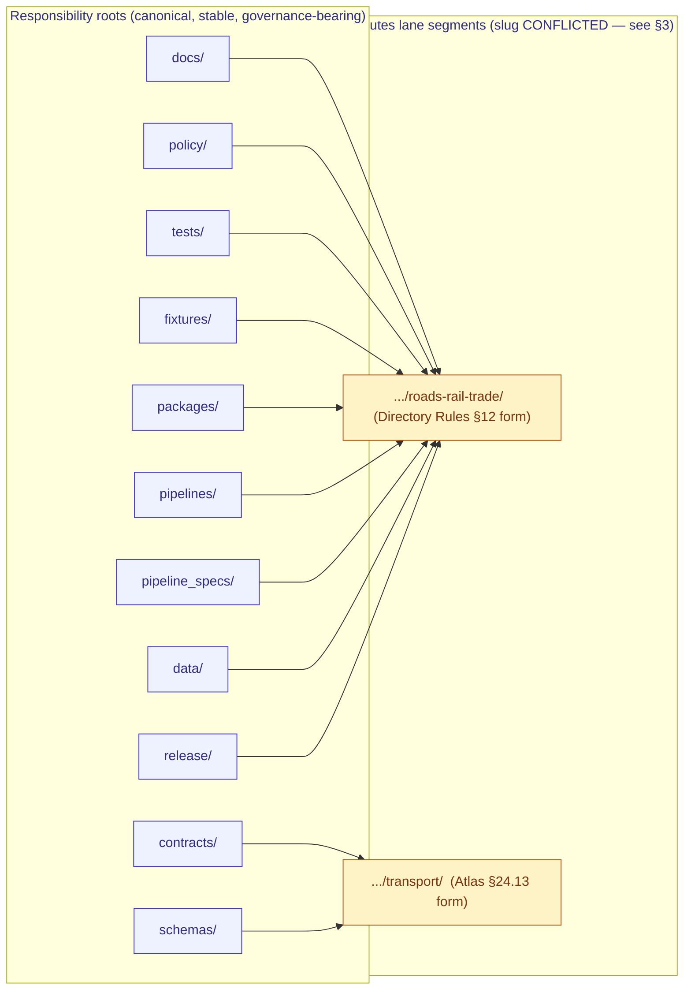

<!-- [KFM_META_BLOCK_V2]
doc_id: kfm://doc/docs-domains-roads-rail-trade-canonical-paths
title: Canonical Paths — Roads / Rail / Trade Routes Domain
type: standard
version: v2
status: draft
owners: <roads-rail-trade stewards; see CODEOWNERS — TODO confirm>
created: 2026-05-19
updated: 2026-06-07
policy_label: public
related:
  - docs/doctrine/directory-rules.md
  - docs/domains/roads-rail-trade/README.md
  - docs/domains/roads-rail-trade/ARCHITECTURE.md
  - docs/adr/ADR-0001-schema-home.md
  - docs/registers/DRIFT_REGISTER.md
  - docs/registers/VERIFICATION_BACKLOG.md
  - docs/atlases/kfm-domains-v1.1-pass23-32-consolidated-atlas.md
tags: [kfm, domain, roads-rail-trade, transport, canonical-paths, governance, directory-rules]
notes:
  - 'CONTRACT_VERSION = "3.0.0" pinned per ai-build-operating-contract.md'
  - "Doctrine grounded in directory-rules.md §§4, 5, 6, 7, 12; Domains Atlas Ch. 13 [DOM-ROADS]; Atlas §24.13 crosswalk."
  - "TWO-DIMENSIONAL slug conflict (corrected): (a) `domains/` segment present (Directory Rules §12) vs absent (Atlas §24.13, which uses no `domains/` segment for ANY domain); (b) slug `roads-rail-trade` (§12) vs `transport` (§24.13). See §3 / §11 OPEN-RRT-01. Neither source produces `domains/transport/` — do not fabricate that hybrid."
  - "Specific repo presence of any path below is PROPOSED until verified against a mounted repository."
  - "Cesium retired (v1.3 doctrine-target): packages/maplibre-runtime/ is the SOLE governed browser-side renderer; the §24.13 Spatial-Foundation row still shows the legacy packages/maplibre/ migration target. Flagged in §6."
[/KFM_META_BLOCK_V2] -->

# Canonical Paths — Roads / Rail / Trade Routes Domain

> Registry of canonical repository paths for the **Roads / Rail / Trade Routes** lane, derived from `directory-rules.md` §12 (Domain Placement Law) and Atlas Ch. 13 `[DOM-ROADS]`. **All concrete paths below are PROPOSED until verified against a mounted repository, and the schema/contract slug is CONFLICTED — see §3.**


**Status:** draft · **Owners:** _roads-rail-trade stewards (placeholder — see CODEOWNERS)_ · **Last updated:** 2026-06-07

---

## Contents

- [1. Purpose & scope](#1-purpose--scope)
- [2. Doctrinal anchor — Domain Placement Law](#2-doctrinal-anchor--domain-placement-law)
- [3. Slug conflict — two dimensions](#3-slug-conflict--two-dimensions)
- [4. Canonical lane tree](#4-canonical-lane-tree)
- [5. Path-by-path registry](#5-path-by-path-registry)
- [6. Cross-lane shared homes (no domain segment)](#6-cross-lane-shared-homes-no-domain-segment)
- [7. Lifecycle posture per phase](#7-lifecycle-posture-per-phase)
- [8. Sensitivity-driven path posture](#8-sensitivity-driven-path-posture)
- [9. Anti-patterns specific to this domain](#9-anti-patterns-specific-to-this-domain)
- [10. Verification backlog](#10-verification-backlog)
- [11. Open questions](#11-open-questions)
- [12. Related docs](#12-related-docs)
- [Appendix A — Owned object families and likely path nodes](#appendix-a--owned-object-families-and-likely-path-nodes)
- [Appendix B — Truth-label glossary](#appendix-b--truth-label-glossary)

---

## 1. Purpose & scope

This document is the **canonical-path registry** for the Roads / Rail / Trade Routes domain lane. It answers a single question for reviewers, authors, and tooling:

> *"For a file that belongs to Roads / Rail / Trade Routes, **where does it go**?"*

It does **not** decide whether a file should exist. Existence is decided by `contracts/`, `schemas/`, `policy/`, source descriptors, ADRs, and reviews. This document decides *where it goes once it exists.*

**Doctrinal grounding (CONFIRMED):**

- `directory-rules.md` §12 — Domain Placement Law: a domain is a **lane segment** inside responsibility roots, never a root folder.
- `directory-rules.md` §4 — Placement Protocol: pick exactly one primary responsibility, then add the lane segment.
- Atlas Ch. 13 `[DOM-ROADS]` — domain identity, scope, owned object families, cross-lane relations.
- Atlas §24.13 — Domain ↔ Dossier ↔ Responsibility Root crosswalk for Roads/Rail/Trade (row 13).

**Lifecycle invariant the lane MUST preserve (CONFIRMED):**
`RAW → WORK / QUARANTINE → PROCESSED → CATALOG / TRIPLET → PUBLISHED`, with promotion as a **governed state transition, not a file move**.

> [!IMPORTANT]
> **Specific repo presence of any path in this document is PROPOSED until verified against a mounted repository.** This file describes the canonical shape; it does not claim implementation depth. Author conformance and reviewer audits MUST cite this file *and* repo evidence, not this file alone. **`CONTRACT_VERSION = "3.0.0"`.**

[↑ back to top](#contents)

---

## 2. Doctrinal anchor — Domain Placement Law

CONFIRMED from `directory-rules.md` §12. A domain MUST NOT become a root folder. Roads / Rail / Trade Routes therefore does **not** look like:

```text
roads-rail-trade/
├── data/    schemas/   policy/   docs/
```

It MUST look like the lane pattern, with the domain appearing as a **segment** inside the responsibility root:



> [!NOTE]
> The two lane-segment labels (`roads-rail-trade/` vs `transport/`) reflect the **slug conflict** documented in §3. Both appear in current KFM doctrine; the choice is not yet resolved by ADR. The diagram shows the *de facto* corpus split (engineering roots → `transport/`, everything else → `roads-rail-trade/`) only as the status quo to be ratified or replaced — not as a settled rule.

[↑ back to top](#contents)

---

## 3. Slug conflict — two dimensions

CONFIRMED conflict in current doctrine. Two doctrine sources disagree along **two independent axes**, and an earlier draft of this registry accidentally fused them into a path (`schemas/contracts/v1/domains/transport/`) that **neither source produces**. Both axes must be resolved by ADR.

### 3.1 Axis A — is there a `domains/` segment?

| Source | Pattern | `domains/` segment? |
|---|---|---|
| **Directory Rules §12** | `schemas/contracts/v1/domains/<domain>/`, `contracts/domains/<domain>/` | **Yes** — `domains/` is present. |
| **Atlas §24.13 crosswalk** | `schemas/contracts/v1/<topic>/`, `contracts/<topic>/` | **No** — *no row in the entire §24.13 table uses a `domains/` segment* (e.g., `schemas/contracts/v1/hydrology/`, `.../fauna/`, `.../transport/`). |

This axis is **repo-wide**, not specific to this lane: §24.13 and §12 disagree on `domains/` for every domain. It is therefore an ADR that should be decided once, globally — most likely folding into ADR-0001 (schema home) or ADR-S-01.

### 3.2 Axis B — `roads-rail-trade` vs `transport` slug

| Source | Slug for this lane | Where |
|---|---|---|
| **Directory Rules §12 / §6.1** | `roads-rail-trade` | universal lane-pattern list; `docs/` tree lists `domains/roads-rail-trade/` |
| **Atlas §24.13 (row 13)** | `transport` | `schemas/contracts/v1/transport/`; `contracts/transport/`; note "Network identity governance" |

This axis is **specific to this lane** — most other §24.13 rows match their §12 slug (e.g., `hydrology`, `fauna`), but row 13 uses the broader engineering label `transport` where §12 would use `roads-rail-trade`.

### 3.3 What this means for paths

The four combinations:

| | slug `roads-rail-trade` | slug `transport` |
|---|---|---|
| **with `domains/`** | `schemas/contracts/v1/domains/roads-rail-trade/` — pure §12 form | `schemas/contracts/v1/domains/transport/` — **fabricated hybrid; in NO source** |
| **without `domains/`** | `schemas/contracts/v1/roads-rail-trade/` — in no source | `schemas/contracts/v1/transport/` — pure §24.13 form |

> [!WARNING]
> **Only the two diagonal cells are real.** Directory Rules §12 produces `schemas/contracts/v1/domains/roads-rail-trade/`; Atlas §24.13 produces `schemas/contracts/v1/transport/`. The earlier draft's `schemas/contracts/v1/domains/transport/` and `contracts/domains/transport/` are a **hybrid that appears in neither doctrine source** and MUST NOT be authored. Until an ADR resolves both axes, this document records the two real forms side by side and DOES NOT silently pick one. Authors creating new files MUST cite which doctrine source they followed; reviewers MUST flag any path that mixes the two.

### 3.4 Hypothesis (INFERRED — not in the corpus)

A *possible* reconciliation is a deliberate split: `roads-rail-trade/` as the **human-facing** slug under `docs/`, and `transport/` as the **engineering** slug under `contracts/`/`schemas/` because the lane models a transport graph broader than the surface label. This is **INFERRED reconstruction, stated nowhere in the corpus** — it is one option for the ADR, not a documented rule. Treat it as a hypothesis only. **ADR-class** per `directory-rules.md` §2.4. See §11 OPEN-RRT-01.

[↑ back to top](#contents)

---

## 4. Canonical lane tree

The `directory-rules.md` §12 pattern, specialized for Roads / Rail / Trade Routes. **All paths PROPOSED.** The `contracts/`/`schemas/` rows show **both** real forms (§3.3) because the slug is CONFLICTED; every other root uses the unambiguous §12 `roads-rail-trade/` segment.

```text
docs/domains/roads-rail-trade/                    # human-facing domain docs (§12, §6.1) — slug stable
policy/domains/roads-rail-trade/                  # allow / deny / restrict / abstain rules — slug stable
tests/domains/roads-rail-trade/                   # enforceability proof — slug stable
fixtures/domains/roads-rail-trade/                # golden / valid / invalid samples — slug stable
packages/domains/roads-rail-trade/                # shared library code, if reusable — slug stable
pipelines/domains/roads-rail-trade/               # executable pipeline logic — slug stable
pipeline_specs/roads-rail-trade/                  # declarative pipeline config (no domains/ segment per §12)
data/raw/roads-rail-trade/                        # immutable source captures — slug stable
data/work/roads-rail-trade/                       # in-flight normalization
data/quarantine/roads-rail-trade/                 # failures held with reason
data/processed/roads-rail-trade/                  # validated normalized objects
data/catalog/domain/roads-rail-trade/             # STAC/DCAT/PROV records + bundle refs
data/published/layers/roads-rail-trade/           # public-safe released artifacts
data/registry/sources/roads-rail-trade/           # SourceDescriptors for transport sources
release/candidates/roads-rail-trade/              # release-candidate manifests scoped to lane

# CONFLICTED — schema/contract home (pick ONE form via ADR; do NOT mix):
#   §12 form:      contracts/domains/roads-rail-trade/   +   schemas/contracts/v1/domains/roads-rail-trade/
#   §24.13 form:   contracts/transport/                  +   schemas/contracts/v1/transport/
#   FABRICATED (never author):   contracts/domains/transport/  /  schemas/contracts/v1/domains/transport/
```

> [!NOTE]
> Doctrine source: Directory Rules §12 (universal lane pattern) for the `roads-rail-trade/` segments; Atlas §24.13 crosswalk for the `transport/` segment. The `contracts/` and `schemas/` homes are the only CONFLICTED roots; the rest use `roads-rail-trade/` unambiguously. Resolve via §11 OPEN-RRT-01 before promoting any schema/contract path.

[↑ back to top](#contents)

---

## 5. Path-by-path registry

Every cell in the **Status** column is **PROPOSED** unless a session can verify presence in a mounted repository. The **Responsibility root** column cites the `directory-rules.md` section that justifies the placement; the **Slug** column shows the lane label per §3 and flags the CONFLICTED roots.

### 5.1 Governance and human-facing surfaces

| Canonical path | Responsibility root | Slug | Purpose | Status |
|---|---|---|---|---|
| `docs/domains/roads-rail-trade/` | `docs/` (§4 — explains to humans) | `roads-rail-trade/` (stable) | Domain README, object map, sensitivity notes, runbook index | **PROPOSED** |
| `docs/domains/roads-rail-trade/CANONICAL_PATHS.md` | `docs/` (§4) | `roads-rail-trade/` (stable) | **This document.** Registry of canonical lane paths | **PROPOSED** |
| `docs/domains/roads-rail-trade/README.md` | `docs/` (§4) | `roads-rail-trade/` (stable) | Lane orientation, scope, owned objects, cross-lane relations | **PROPOSED — NEEDS VERIFICATION** |
| `docs/runbooks/roads-rail-trade/SOURCE_REFRESH_RUNBOOK.md` _or flat_ `docs/runbooks/roads_rail_trade_source_refresh.md` | `docs/` (§4) | subfolder (Pattern A) or flat (Pattern B) | Source-refresh lifecycle for transport sources | **PROPOSED — subfolder vs flat pending Directory Rules §18 OPEN-DR-02** |

### 5.2 Object meaning and machine shape — **slug CONFLICTED (§3)**

| Canonical path | Responsibility root | Slug | Purpose | Status |
|---|---|---|---|---|
| `contracts/domains/roads-rail-trade/` **(§12)** _or_ `contracts/transport/` **(§24.13)** | `contracts/` (§4 — object meaning) | **CONFLICTED** | Semantic Markdown for `RoadSegment`, `RailSegment`, `CorridorRoute`, `TransportFacility`, `Access Restriction`, etc. | **PROPOSED — OPEN-RRT-01** |
| `schemas/contracts/v1/domains/roads-rail-trade/` **(§12)** _or_ `schemas/contracts/v1/transport/` **(§24.13)** | `schemas/` (§4 — machine shape) | **CONFLICTED** | JSON Schema definitions; **ADR-0001 canonical home** | **PROPOSED — OPEN-RRT-01** |
| `schemas/tests/valid/.../<slug>/` | `schemas/` | CONFLICTED | Schema golden samples (validates) | **PROPOSED** |
| `schemas/tests/invalid/.../<slug>/` | `schemas/` | CONFLICTED | Schema rejection samples (fails validation as expected) | **PROPOSED** |

### 5.3 Policy, tests, fixtures

| Canonical path | Responsibility root | Slug | Purpose | Status |
|---|---|---|---|---|
| `policy/domains/roads-rail-trade/` | `policy/` (§4 — admissibility) | `roads-rail-trade/` (stable) | allow / deny / restrict / abstain rules for transport | **PROPOSED** |
| `policy/sensitivity/roads-rail-trade/` _(§24.13 uses `policy/sensitivity/<topic>/` for sensitive lanes; row 13 lists none, so this is INFERRED)_ | `policy/` (§4) | INFERRED — NEEDS VERIFICATION | Indigenous-corridor, critical-facility, generalization rules | **PROPOSED** |
| `policy/release/roads-rail-trade/` | `policy/` (§4) | `roads-rail-trade/` (stable) | Release-gate rules specific to transport lane | **PROPOSED** |
| `tests/domains/roads-rail-trade/` | `tests/` (§4 — enforceability proof) | `roads-rail-trade/` (stable) | Validator and pipeline tests for this lane | **PROPOSED** |
| `fixtures/domains/roads-rail-trade/` | `fixtures/` (§4 — sample data) | `roads-rail-trade/` (stable) | Golden / valid / invalid samples | **PROPOSED** |

### 5.4 Implementation and pipeline

| Canonical path | Responsibility root | Slug | Purpose | Status |
|---|---|---|---|---|
| `packages/domains/roads-rail-trade/` | `packages/` (§4 — shared library) | `roads-rail-trade/` (stable) | Reusable transport-graph, route-membership, network-edge code | **PROPOSED** |
| `pipelines/domains/roads-rail-trade/` | `pipelines/` (§4 — executable logic) | `roads-rail-trade/` (stable) | Ingest, normalize, validate, catalog, triplet, publish, rollback steps | **PROPOSED** |
| `pipeline_specs/roads-rail-trade/` | `pipeline_specs/` (§4 — declarative config) | `roads-rail-trade/` (no `domains/` segment per §12) | Pipeline definitions, schedules, gate wiring | **PROPOSED** |
| `connectors/` (no lane subfolder) | `connectors/` (§4 — source-specific fetch) | _none_ | Per-source connectors (e.g. `connectors/census/`, `connectors/kdot/`, `connectors/osm/`) emit to `data/raw/roads-rail-trade/` | **PROPOSED** |

### 5.5 Lifecycle data

| Canonical path | Responsibility root | Lifecycle phase | Purpose | Status |
|---|---|---|---|---|
| `data/raw/roads-rail-trade/<source_id>/<run_id>/` | `data/` (§4) | RAW | Immutable source payloads (TIGER, HPMS, NHFN, WZDx, KDOT, KanDrive, county bridge data, GNIS, OSM, FRA GCIS/Form 57, STB, HIFLD/NTAD, GTFS/GTFS-RT) | **PROPOSED** |
| `data/work/roads-rail-trade/` | `data/` | WORK | In-flight normalization buffers | **PROPOSED** |
| `data/quarantine/roads-rail-trade/` | `data/` | QUARANTINE | Failures held with reason code | **PROPOSED** |
| `data/processed/roads-rail-trade/` | `data/` | PROCESSED | Validated normalized objects + ValidationReports | **PROPOSED** |
| `data/catalog/domain/roads-rail-trade/` | `data/` | CATALOG | STAC/DCAT/PROV records + EvidenceBundle refs | **PROPOSED** |
| `data/triplets/roads-rail-trade/` | `data/` | TRIPLET | Graph/triplet projections (route membership, network edges) | **PROPOSED — phase-folder name NEEDS VERIFICATION** |
| `data/published/layers/roads-rail-trade/` | `data/` | PUBLISHED | Public-safe released artifacts (PMTiles, GeoJSON, derived graph views) | **PROPOSED** |
| `data/registry/sources/roads-rail-trade/` _or_ `data/registry/roads-rail-trade/` | `data/` | REGISTRY | SourceDescriptors for transport sources | **PROPOSED — sub-segment per §4 Step 3, OPEN-RRT-05** |
| `data/receipts/roads-rail-trade/` | `data/` | RECEIPTS | Ingest, validation, redaction, aggregation, promotion receipts | **PROPOSED — receipt-home is ADR-S-03 (top-level vs per-domain)** |
| `data/proofs/roads-rail-trade/` | `data/` | PROOFS | Closure proofs, Merkle, attestations scoped to lane outputs | **PROPOSED** |
| `data/rollback/roads-rail-trade/` | `data/` | ROLLBACK | Rollback targets pinned to specific releases | **PROPOSED** |

### 5.6 Release

| Canonical path | Responsibility root | Slug | Purpose | Status |
|---|---|---|---|---|
| `release/candidates/roads-rail-trade/` | `release/` (§4 — release decisions) | `roads-rail-trade/` (stable) | Release-candidate manifests scoped to lane | **PROPOSED** |
| `release/manifests/roads-rail-trade/` | `release/` | `roads-rail-trade/` (stable) | Accepted ReleaseManifests for transport layers | **PROPOSED — exact subfolder NEEDS VERIFICATION** |
| `release/corrections/roads-rail-trade/` | `release/` | `roads-rail-trade/` (stable) | CorrectionNotices targeting prior releases | **PROPOSED** |

[↑ back to top](#contents)

---

## 6. Cross-lane shared homes (no domain segment)

CONFIRMED from `directory-rules.md` §12: when a file legitimately spans domains, it lives under the **lowest common responsibility root** without a domain segment. Roads / Rail / Trade Routes has several cross-lane neighbors that produce shared files.

| Cross-lane concern | Likely canonical home | Why no `roads-rail-trade/` segment |
|---|---|---|
| Bridge / ferry / ford / river-crossing geometry overlap with Hydrology | `tools/validators/crossings/` _or_ a shared schema topic | Shared with Hydrology; neither owns it alone (Atlas Ch. 13 §F). |
| Depot / facility / dependency overlap with Settlements/Infrastructure | `tools/validators/facilities/` _or_ a shared schema topic | Settlements owns the canonical facility claim; Roads/Rail references it. |
| Closure / detour / hazard exposure overlap with Hazards | `tools/validators/hazard-exposure/` | Shared with Hazards; the **alert authority** stays with Hazards. |
| Historic-route / Indigenous-corridor / fort / mission overlap with Archaeology/Cultural Heritage | `policy/sensitivity/cultural-routes/` (PROPOSED) | Sovereignty review path lives with Archaeology; transport references the policy. |
| MapLibre layer manifests, tile specs, style fragments | `packages/maplibre-runtime/` and `data/published/layers/roads-rail-trade/` | The renderer is **not a truth path**; lane-specific tiles live under `data/published/`. |

> [!CAUTION]
> **Do not create a `tools/validators/domains/roads-rail-trade/` parallel to `tools/validators/<topic>/` for shared validators.** That fragments the validator catalog and breaks the §12 "lowest common responsibility root" rule. Shared validators belong under `tools/validators/<topic>/` without a domain segment.

> [!NOTE]
> **Renderer home (v1.3).** The MapLibre row above uses `packages/maplibre-runtime/` — the **sole governed browser-side renderer** (v1.3; Cesium retired, freeze rule in effect). The Atlas §24.13 Spatial-Foundation row still lists the legacy `packages/maplibre/` migration target; that label predates the v1.3 rename and should be read as `packages/maplibre-runtime/`. `[DIRRULES]` `[MAP-MASTER]`

[↑ back to top](#contents)

---

## 7. Lifecycle posture per phase

CONFIRMED doctrine / PROPOSED implementation. Atlas Ch. 13 §H specifies the per-phase gate for this lane. The table below pairs each phase with its canonical data path and gate.

| Phase | Canonical data path | Required gate | Watcher-as-non-publisher applies? |
|---|---|---|---|
| RAW | `data/raw/roads-rail-trade/<source_id>/<run_id>/` | SourceDescriptor exists; hash, citation, rights captured. | Yes — connectors write here; watchers do not promote. |
| WORK / QUARANTINE | `data/work/roads-rail-trade/`, `data/quarantine/roads-rail-trade/` | Validation and policy gate pass, or quarantine reason recorded. | Yes |
| PROCESSED | `data/processed/roads-rail-trade/` | EvidenceRef, ValidationReport, digest closure exist. | Yes |
| CATALOG / TRIPLET | `data/catalog/domain/roads-rail-trade/`, `data/triplets/roads-rail-trade/` | Catalog/proof closure passes. | Yes |
| PUBLISHED | `data/published/layers/roads-rail-trade/`, served via `apps/governed-api/` | ReleaseManifest, correction path, rollback target, review/policy state exist. | Yes |

> [!IMPORTANT]
> **Promotion is a governed state transition, not a file move.** A file appearing under `data/processed/roads-rail-trade/` is not "promoted" by being copied or renamed into `data/catalog/domain/roads-rail-trade/`; promotion requires a PromotionDecision, an EvidenceBundle reference, a ValidationReport, and a passed policy gate. See `directory-rules.md` §7.1 (trust membrane) and Atlas Ch. 13 §H.

[↑ back to top](#contents)

---

## 8. Sensitivity-driven path posture

CONFIRMED / PROPOSED from Atlas Ch. 13 §I. The Roads / Rail / Trade Routes lane has two distinct sensitivity surfaces, each with implications for which paths a file may legitimately occupy.

### 8.1 Indigenous, treaty, cultural, and oral-history corridors

> [!WARNING]
> **Default posture is steward review and generalized public geometry.** Indigenous trade and mobility corridors, treaty-era routes, oral-history corridors, and interpretive evidence MUST NOT be published as precise geometry without explicit sovereignty-aware review. Promotion to `data/published/layers/roads-rail-trade/` is DENIED by default for these object families. Cultural truth and the sensitivity tier are owned by Archaeology / Cultural Heritage (`[DOM-ARCH]`), not by this lane.

| Decision | Canonical home |
|---|---|
| Sensitivity rule for this class | `policy/sensitivity/roads-rail-trade/cultural-corridors.yaml` (PROPOSED) or shared `policy/sensitivity/cultural-routes/` (cross-lane with Archaeology) |
| Quarantined evidence | `data/quarantine/roads-rail-trade/` with reason code `cultural-sovereignty-review-required` |
| Generalized public geometry | `data/published/layers/roads-rail-trade/cultural-corridors-generalized/` (PROPOSED — naming NEEDS VERIFICATION) |
| Redaction receipts | `data/receipts/roads-rail-trade/redaction/` |

### 8.2 Critical transport facilities

> [!CAUTION]
> Critical transport facilities (key bridges, intermodal terminals, fuel/freight nodes) may carry security-sensitive geometry or attribute exposure. Publication requires review against `policy/sensitivity/roads-rail-trade/critical-facilities.yaml` (PROPOSED).

| Decision | Canonical home |
|---|---|
| Sensitivity rule for this class | `policy/sensitivity/roads-rail-trade/critical-facilities.yaml` (PROPOSED) |
| Public-safe candidates | `data/processed/roads-rail-trade/facilities/` → reviewed → `data/published/layers/roads-rail-trade/facilities/` |
| Denied / generalized | per redaction receipt under `data/receipts/roads-rail-trade/redaction/` |

### 8.3 Source-rights uncertainty

CONFIRMED from Atlas Ch. 13 §D — all listed source families carry "rights and current terms NEEDS VERIFICATION; sensitive joins fail closed." Until rights are confirmed, source records live under `data/quarantine/roads-rail-trade/<source>/` with reason `source-rights-needs-verification`, not under `data/processed/`. This covers TIGER, HPMS, NHFN, WZDx, KDOT/KanDrive, county bridge data, GNIS, OSM, plus the rail/transit stacks (FRA GCIS/Form 57, STB Class I, HIFLD/NTAD, GTFS/GTFS-RT, KCATA) carried via Pass-10 cards C10-04/C10-05.

[↑ back to top](#contents)

---

## 9. Anti-patterns specific to this domain

CONFIRMED from `directory-rules.md` §13 (drift patterns), specialized for this lane.

| Anti-pattern | Why it breaks the lane | Fix |
|---|---|---|
| **Root-level `roads/`, `rail/`, `transport/`, or `trade/` folder** | Violates §12 Domain Placement Law — domains MUST be segments inside responsibility roots. | Migrate to the §4 lane tree. Add a drift entry. |
| **`schemas/contracts/v1/domains/transport/` or `contracts/domains/transport/` (the fabricated hybrid)** | This path appears in **neither** doctrine source — it fuses the §12 `domains/` segment with the §24.13 `transport` slug (see §3.3). | Use one *real* form: §12 (`…/domains/roads-rail-trade/`) or §24.13 (`…/transport/`). Resolve via OPEN-RRT-01. |
| **Schema authored under `contracts/...` instead of `schemas/contracts/v1/...`** | Violates ADR-0001 schema-home canon and anti-pattern §13.1. | Move to `schemas/contracts/v1/...`; keep `contracts/` as semantic Markdown only. |
| **Routing graph / derived network treated as canonical truth** | A graph projection is a **derivative**; it MUST NOT replace road/rail/route evidence. Atlas Ch. 13 §K calls out "transport graph projection rollback tests." | Keep graph artifacts in `data/triplets/roads-rail-trade/` and `data/published/layers/roads-rail-trade/<graph-view>/`; never publish a graph as the canonical record. |
| **MapLibre style or layer manifest authored under `data/published/`** | The renderer is **not a truth path**. Styles and layer code belong in `packages/maplibre-runtime/` and `apps/explorer-web/`; manifests in `release/`. | Move style assets to `packages/maplibre-runtime/`; layer manifests to `release/manifests/roads-rail-trade/`. |
| **WZDx, KanDrive, or work-zone feeds written directly to `data/processed/`** | Connector-as-publisher anti-pattern (watcher-as-non-publisher rule). | Route through `connectors/<source>/` → `data/raw/roads-rail-trade/<source>/<run_id>/`; let pipelines promote. |
| **A "Movement Story Node" stored alongside the canonical Road Segment** | Story nodes are interpretive overlays, not canonical road evidence. | Keep canonical road segments under `data/processed/roads-rail-trade/road-segments/`; place Movement Story Nodes under `data/catalog/domain/roads-rail-trade/story-nodes/` or a dedicated narrative lane (OPEN-RRT-03). |
| **Indigenous-corridor or cultural-route geometry written to `data/processed/` without sensitivity review** | Bypasses §8.1 deny-by-default posture. | Route to `data/quarantine/roads-rail-trade/` with reason `cultural-sovereignty-review-required` until stewarded review is recorded. |
| **`tests/domains/roads-rail-trade/` containing only happy-path tests** | Validators MUST exercise DENY / ABSTAIN / ERROR paths (negative-state rule). | Add OSM/GNIS legal-status denial tests, historic-overprecision denial, public-generalization receipt tests (per Atlas Ch. 13 §K). |
| **Mixing the two slug forms within one responsibility root** | Confuses readers and breaks Atlas §24.13 crosswalk fidelity. | Until OPEN-RRT-01 is resolved, follow §4: every root except `contracts/`/`schemas/` uses `roads-rail-trade/`; the two CONFLICTED roots pick one *real* form (never the hybrid). |

[↑ back to top](#contents)

---

## 10. Verification backlog

The items below MUST be checked against a mounted repository before any path in this document is promoted from PROPOSED to CONFIRMED-in-implementation.

| ID | Item to verify | Evidence that would settle it | Status |
|---|---|---|---|
| VB-RRT-01 | `docs/domains/roads-rail-trade/` exists with a `README.md` | `ls docs/domains/`, README content | **NEEDS VERIFICATION** |
| VB-RRT-02 | Which schema home is live: `schemas/contracts/v1/domains/roads-rail-trade/` (§12) or `schemas/contracts/v1/transport/` (§24.13) — and whether any `domains/` segment is used repo-wide | repo inspection; ADR-0001 / OPEN-RRT-01 | **NEEDS VERIFICATION** |
| VB-RRT-03 | The matching `contracts/...` home exists alongside the schema home | repo inspection | **NEEDS VERIFICATION** |
| VB-RRT-04 | `policy/sensitivity/roads-rail-trade/cultural-corridors.yaml` (or equivalent) exists and is wired to the publication gate | policy file content; gate test pass | **NEEDS VERIFICATION** |
| VB-RRT-05 | `data/raw/roads-rail-trade/<source>/<run_id>/` lifecycle structure is implemented for at least one source (e.g. TIGER, KDOT) | connector output; ingest receipt | **NEEDS VERIFICATION** |
| VB-RRT-06 | `release/candidates/roads-rail-trade/` is wired to the promotion gate | ReleaseManifest example; PromotionDecision record | **NEEDS VERIFICATION** |
| VB-RRT-07 | Transport-graph projection has a rollback target distinct from canonical road/rail records | rollback card + test | **NEEDS VERIFICATION** (Atlas Ch. 13 §K) |
| VB-RRT-08 | OSM/GNIS legal-status denial test exists | test file path; CI output | **NEEDS VERIFICATION** (Atlas Ch. 13 §K) |
| VB-RRT-09 | Historic-overprecision denial test exists | test file path; CI output | **NEEDS VERIFICATION** (Atlas Ch. 13 §K) |
| VB-RRT-10 | `apps/governed-api/` exposes the Roads/Rail feature/detail resolver, layer manifest resolver, Evidence Drawer payload, and Focus Mode endpoints | route table; integration test | **UNKNOWN** (Atlas Ch. 13 §J: "route TBD") |
| VB-RRT-11 | Receipt home: top-level `data/receipts/` vs per-domain `data/receipts/roads-rail-trade/` | repo inspection; ADR-S-03 | **NEEDS VERIFICATION** |

[↑ back to top](#contents)

---

## 11. Open questions

<details>
<summary><strong>OPEN-RRT-01 — Schema/contract slug: two-axis conflict (ADR-class)</strong></summary>

**Question.** Two independent axes (see §3) must be decided:
- **Axis A:** is there a `domains/` segment? Directory Rules §12 says yes; Atlas §24.13 uses none for any domain.
- **Axis B:** slug `roads-rail-trade` (§12) vs `transport` (§24.13, row 13).

**Why it matters.** Tooling, crosswalks, registries, and reviewer cognitive load all depend on a single canonical answer. The earlier draft fused the two axes into `schemas/contracts/v1/domains/transport/`, a path that exists in **neither** source — that hybrid must never be authored.

**Options (the two *real* forms, plus the recommendation).**
1. **§12 form everywhere:** `schemas/contracts/v1/domains/roads-rail-trade/` + `contracts/domains/roads-rail-trade/`. Pro: matches the §12 lane pattern and the human-facing `docs/` slug; one slug across all roots. Con: diverges from the §24.13 crosswalk, which would need a correction.
2. **§24.13 form for schema/contracts:** `schemas/contracts/v1/transport/` + `contracts/transport/`, with `roads-rail-trade/` elsewhere. Pro: matches the crosswalk as written; `transport` is the broader engineering label. Con: only domain with a slug split; reviewer surprise; no `domains/` segment diverges from §12.
3. **Resolve Axis A globally first** (does *any* lane use `domains/`?), then Axis B for this lane. Pro: Axis A is repo-wide and shouldn't be decided per-lane. Recommended sequencing.

**Recommendation (INFERRED, not decided).** Decide Axis A once, repo-wide (most likely folding into ADR-0001 / ADR-S-01). For Axis B, Option 1 (`roads-rail-trade` everywhere) is the cleanest going forward; Option 2 reflects the crosswalk as literally written. **An ADR MUST decide both.** The "deliberate human-vs-engineering split" idea (§3.4) is a hypothesis only, stated nowhere in the corpus.

**Resolution path.** Open `ADR-NNNN-roads-rail-trade-schema-slug.md` citing §12, §6.1, §24.13, ADR-0001, and this document; add a `DRIFT_REGISTER.md` entry.
</details>

<details>
<summary><strong>OPEN-RRT-02 — Subfolder vs flat runbook convention</strong></summary>

**Question.** Should transport runbooks live under `docs/runbooks/roads-rail-trade/<runbook>.md` (Pattern A) or `docs/runbooks/roads_rail_trade_<runbook>.md` (Pattern B)?

**Status.** This is the same open question as `directory-rules.md` §18 OPEN-DR-02. When OPEN-DR-02 is resolved, OPEN-RRT-02 inherits the decision. Until then, either pattern is acceptable; new authors SHOULD adopt Pattern A if the lane already has a subfolder runbook in flight.
</details>

<details>
<summary><strong>OPEN-RRT-03 — Movement Story Nodes: own lane segment or shared with Archaeology / People-Land?</strong></summary>

**Question.** "Movement Story Node" appears in the Roads/Rail owned-object list (Atlas Ch. 13 §B) but is interpretive in character. Should it live under `data/catalog/domain/roads-rail-trade/story-nodes/`, under a shared narrative lane, or split between this lane and Archaeology/Cultural Heritage?

**Status.** UNKNOWN. Needs ADR or a cross-lane relation note in §6.
</details>

<details>
<summary><strong>OPEN-RRT-04 — Transport-graph projection home: `data/triplets/` or `data/published/layers/`?</strong></summary>

**Question.** The derived transport graph is both a TRIPLET projection (graph projection of canonical evidence) and a PUBLISHED layer (consumed by clients). Which path is canonical, and which is a downstream copy?

**Status.** PROPOSED resolution: `data/triplets/roads-rail-trade/` holds the canonical projection; `data/published/layers/roads-rail-trade/<graph-view>/` holds a public-safe rendered copy. NEEDS VERIFICATION via mounted-repo inspection and an Atlas Ch. 13 §K rollback test.
</details>

<details>
<summary><strong>OPEN-RRT-05 — Source registry segment: `data/registry/sources/roads-rail-trade/` or `data/registry/roads-rail-trade/`?</strong></summary>

**Question.** `directory-rules.md` §4 Step 3 lists both `data/registry/<domain>/` and `data/registry/sources/<domain>/` as acceptable. Which is canonical for transport?

**Status.** UNKNOWN. Until decided, prefer `data/registry/sources/roads-rail-trade/` because all listed transport source families are external (TIGER, HPMS, NHFN, WZDx, KDOT, OSM, GNIS, county data, and the rail/transit stacks) and registry-by-source is the more useful organization.
</details>

[↑ back to top](#contents)

---

## 12. Related docs

- `docs/doctrine/directory-rules.md` — placement doctrine; §§4, 5, 6, 7, 12 govern the lane pattern used here.
- `docs/domains/roads-rail-trade/README.md` — lane orientation (NEEDS VERIFICATION).
- `docs/domains/roads-rail-trade/ARCHITECTURE.md` — domain architecture (sibling doc; carries the same slug conflict in its §2.2 / OPEN-RR-01).
- `docs/adr/ADR-0001-schema-home.md` — schema-home canon (`schemas/contracts/v1/...`).
- `docs/atlases/kfm-domains-v1.1-pass23-32-consolidated-atlas.md` — Atlas Ch. 13 `[DOM-ROADS]` and §24.13 crosswalk.
- `docs/registers/DRIFT_REGISTER.md` — record path-conflicts here (including OPEN-RRT-01).
- `docs/registers/VERIFICATION_BACKLOG.md` — central register; mirror VB-RRT-* items here.
- `docs/domains/atmosphere/CANONICAL_PATHS.md` — sibling lane registry; same pattern *(if authored)*.
- `docs/domains/people-dna-land/CANONICAL_PATHS.md` — sibling lane registry; same pattern, denser sensitivity surface *(if authored)*.

[↑ back to top](#contents)

---

## Appendix A — Owned object families and likely path nodes

CONFIRMED owned-object list from Atlas Ch. 13 §B. The "Likely schema node" column is **INFERRED** from the ubiquitous-language table (Atlas Ch. 13 §C) and follows kebab-case JSON Schema file-naming convention common across KFM (NEEDS VERIFICATION against mounted repo). **The `<slug>` segment is CONFLICTED (§3)** — paths show `<slug>` rather than asserting `transport` or `roads-rail-trade`, and never the fabricated `domains/transport/` hybrid.

| Object family | Likely schema node (PROPOSED) | Likely contract doc (PROPOSED) | Sensitivity class |
|---|---|---|---|
| Road Segment | `schemas/contracts/v1/<slug>/road-segment.schema.json` | `contracts/<slug>/road-segment.md` | Default |
| Historic Route | `…/<slug>/historic-route.schema.json` | `…/<slug>/historic-route.md` | May intersect cultural / archaeology — review |
| Rail Segment | `…/<slug>/rail-segment.schema.json` | `…/<slug>/rail-segment.md` | Default |
| Depot | `…/<slug>/depot.schema.json` | `…/<slug>/depot.md` | Critical-facility check |
| Siding | `…/<slug>/siding.schema.json` | `…/<slug>/siding.md` | Default |
| Yard | `…/<slug>/yard.schema.json` | `…/<slug>/yard.md` | Critical-facility check |
| Crossing | `…/<slug>/crossing.schema.json` | `…/<slug>/crossing.md` | Cross-lane with Hydrology |
| Bridge | `…/<slug>/bridge.schema.json` | `…/<slug>/bridge.md` | Critical-facility check; cross-lane with Hydrology |
| Ferry | `…/<slug>/ferry.schema.json` | `…/<slug>/ferry.md` | Cross-lane with Hydrology |
| River Crossing | `…/<slug>/river-crossing.schema.json` | `…/<slug>/river-crossing.md` | Cross-lane with Hydrology |
| Freight Corridor | `…/<slug>/freight-corridor.schema.json` | `…/<slug>/freight-corridor.md` | Default |
| Route Event | `…/<slug>/route-event.schema.json` | `…/<slug>/route-event.md` | Temporal-status discipline |
| Operator Status | `…/<slug>/operator-status.schema.json` | `…/<slug>/operator-status.md` | Source-role anti-collapse |
| Access Restriction | `…/<slug>/access-restriction.schema.json` | `…/<slug>/access-restriction.md` | Default |
| Network Edge | `…/<slug>/network-edge.schema.json` | `…/<slug>/network-edge.md` | Graph projection — see §9 anti-pattern |
| Movement Story Node | `…/<slug>/movement-story-node.schema.json` | `…/<slug>/movement-story-node.md` | Interpretive — see §11 OPEN-RRT-03 |
| CorridorRoute (UL term) | `…/<slug>/corridor-route.schema.json` | `…/<slug>/corridor-route.md` | May intersect cultural — review |
| RouteMembership (UL term) | `…/<slug>/route-membership.schema.json` | `…/<slug>/route-membership.md` | Membership test required (Atlas §K) |
| TransportFacility (UL term) | `…/<slug>/transport-facility.schema.json` | `…/<slug>/transport-facility.md` | Critical-facility check |
| RestrictionEvent (UL realization of Access Restriction) | `…/<slug>/restriction-event.schema.json` | `…/<slug>/restriction-event.md` | Default |
| StatusEvent (UL realization of Route Event) | `…/<slug>/status-event.schema.json` | `…/<slug>/status-event.md` | Temporal discipline |
| OperatorAssignment (UL realization of Operator Status) | `…/<slug>/operator-assignment.schema.json` | `…/<slug>/operator-assignment.md` | Default |
| Historic RouteClaim (UL term) | `…/<slug>/historic-route-claim.schema.json` | `…/<slug>/historic-route-claim.md` | Overprecision denial test required |
| TradeRouteCorridor (UL term) | `…/<slug>/trade-route-corridor.schema.json` | `…/<slug>/trade-route-corridor.md` | Generalized public geometry default |

> [!NOTE]
> These are **illustrative** file names following kebab-case JSON-Schema convention, with `<slug>` standing in for the CONFLICTED segment (§3). The UL "realization" rows (RestrictionEvent / StatusEvent / OperatorAssignment) are PROPOSED field realizations of the canonical owned objects Access Restriction / Route Event / Operator Status. Actual repo naming (kebab vs snake_case, `.schema.json` vs `.json`, plural vs singular) is NEEDS VERIFICATION. Update this table once a single object is verified in the repo.

[↑ back to top](#contents)

---

## Appendix B — Truth-label glossary

Defined in `directory-rules.md` §0 and applied throughout this document.

| Label | Meaning |
|---|---|
| **CONFIRMED** | Verified in-session from attached doctrine, workspace evidence, tests, logs, or generated artifacts. |
| **INFERRED** | Reasonably derivable from visible evidence but not directly stated. |
| **PROPOSED** | Design, path, placement, or recommendation not yet verified in implementation. |
| **UNKNOWN** | Not resolvable without more evidence. |
| **NEEDS VERIFICATION** | Checkable, but not yet checked strongly enough to act as fact. |
| **CONFLICTED** | Two doctrine sources disagree; surfaced and flagged, never silently resolved. |

[↑ back to top](#contents)

---

**Related docs:** [`directory-rules.md`](../../doctrine/directory-rules.md) · [`ARCHITECTURE.md`](./ARCHITECTURE.md) · [`ADR-0001-schema-home.md`](../../adr/ADR-0001-schema-home.md) · [`DRIFT_REGISTER.md`](../../registers/DRIFT_REGISTER.md) · [`VERIFICATION_BACKLOG.md`](../../registers/VERIFICATION_BACKLOG.md)

**Last updated:** 2026-06-07 · **Doc version:** v2 · **Status:** draft · **CONTRACT_VERSION:** 3.0.0 · [↑ back to top](#contents)
