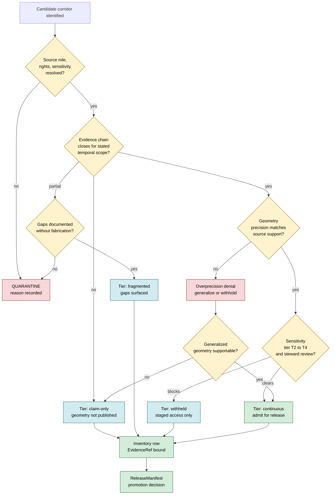

<!-- [KFM_META_BLOCK_V2]
doc_id: kfm://doc/roads-rail-trade/continuity-inventory
title: Roads / Rail / Trade Routes — Continuity Inventory
type: standard
version: v0.1
status: draft
owners: <Roads/Rail/Trade Routes lane steward — TODO>
created: 2026-05-19
updated: 2026-05-19
policy_label: public
related:
  - kfm://doctrine/directory-rules
  - kfm://doctrine/truth-posture
  - kfm://doctrine/trust-membrane
  - kfm://doctrine/lifecycle-law
  - kfm://atlas/dom-roads
  - docs/domains/roads-rail-trade/README.md
  - docs/architecture/governed-api.md
  - docs/standards/PROV.md
tags: [kfm, roads-rail-trade, continuity, inventory, evidence, temporal]
notes:
  - INFERRED: "Continuity Inventory" is a synthesized organizing artifact aggregating Historic RouteClaim, TradeRouteCorridor, CorridorRoute, and RouteMembership doctrine.
  - NEEDS VERIFICATION: live repo placement, schema home for inventory records, validator wiring, release pathway.
[/KFM_META_BLOCK_V2] -->

# Roads / Rail / Trade Routes — Continuity Inventory

> Lane-scoped register of named long-lived transport corridors and the evidence state — temporal, spatial, documentary, operational — under which each is admitted, generalized, withheld, or denied for public release.

[](#15-status-history)
[](#)
[](./README.md)
[](../../doctrine/truth-posture.md)
[](../../standards/SENSITIVITY_RUBRIC.md)
[](#15-status-history)

| Field | Value |
|---|---|
| **Status** | draft |
| **Owners** | Roads/Rail/Trade Routes lane steward — `TODO` |
| **Last updated** | 2026-05-19 |
| **Authority class** | Standard reference for the `roads-rail-trade` domain lane |
| **Placement basis** | Directory Rules §12 — domain lane pattern, `docs/domains/roads-rail-trade/` |

---

## Quick jump

- [1. Purpose and scope](#1-purpose-and-scope)
- [2. Repo fit](#2-repo-fit)
- [3. Ubiquitous language for continuity](#3-ubiquitous-language-for-continuity)
- [4. Continuity tiers](#4-continuity-tiers)
- [5. Inventory scope: what gets inventoried](#5-inventory-scope-what-gets-inventoried)
- [6. Classification flow](#6-classification-flow)
- [7. Per-corridor inventory record shape](#7-per-corridor-inventory-record-shape)
- [8. Lifecycle and gates](#8-lifecycle-and-gates)
- [9. Sensitivity, rights, generalization](#9-sensitivity-rights-generalization)
- [10. Governed AI behavior](#10-governed-ai-behavior)
- [11. Cross-domain relations](#11-cross-domain-relations)
- [12. Source families consulted](#12-source-families-consulted)
- [13. Open questions and verification backlog](#13-open-questions-and-verification-backlog)
- [14. Related docs](#14-related-docs)
- [15. Status history](#15-status-history)
- [Appendix A — Illustrative inventory rows](#appendix-a--illustrative-inventory-rows)

---

## 1. Purpose and scope

> [!NOTE]
> **The Continuity Inventory is a synthesized organizing artifact.** The phrase "Continuity Inventory" does not appear verbatim in `[DOM-ROADS]` or `[ENCY]`; the artifact is **INFERRED** from the doctrine's explicit treatment of `Historic RouteClaim`, `TradeRouteCorridor`, `CorridorRoute`, `RouteMembership`, temporal separation rules, and the corpus-named candidates (Santa Fe Trail, Pony Express, Butterfield / Smoky Hill, forts, stations, depots). Promotion of this artifact to a normative lane fixture is **PROPOSED** pending steward review.

### 1.1 What the inventory is

CONFIRMED doctrine: The `roads-rail-trade` lane owns named corridor concepts (`CorridorRoute`, `TradeRouteCorridor`, `Historic RouteClaim`, `RouteMembership`) whose meaning is constrained by source role, evidence, time, and release state. The corpus also names specific Kansas frontier corridors (Santa Fe Trail, Pony Express, Butterfield / Smoky Hill) as concrete candidates for a normalized `FeatureCollection` with evidence refs.

INFERRED purpose: The Continuity Inventory is the register that:

1. Enumerates the **named corridors** the lane commits to tracking as first-class, evidence-bundled entities — distinct from raw road / rail segments.
2. Classifies each corridor's **continuity state** along four axes (temporal, spatial, documentary, operational — see §4).
3. Records the **publication posture** (admit / generalize / withhold / deny) and the policy basis for it.
4. Holds the **EvidenceRef → EvidenceBundle** linkages that earn each corridor's public visibility.

### 1.2 What the inventory is not

- **Not a routing graph.** Graph projections (`Network Edge`, `Network Node`) are derived layers and never replace canonical evidence per `[DOM-ROADS]`. The inventory cites the graph; the graph does not cite the inventory.
- **Not the schema home.** The inventory record shape sketched in §7 is **PROPOSED**; canonical field-level validation belongs in `schemas/contracts/v1/domains/roads-rail-trade/...` per `[DIRRULES]` ADR-0001 (NEEDS VERIFICATION against mounted repo).
- **Not a source registry.** Source-family rights and freshness are governed by the lane's source registry (PROPOSED at `data/registry/sources/roads-rail-trade/`), not here.
- **Not an alert surface.** Live restriction / closure / WZDx events are `RestrictionEvent` / `StatusEvent` series; they reference corridors by inventory ID but are not themselves inventoried for continuity.

[↑ back to top](#quick-jump)

---

## 2. Repo fit

CONFIRMED placement basis: Directory Rules §12 names `roads-rail-trade` as a canonical domain lane and prescribes the lane pattern across responsibility roots.

```text
docs/domains/roads-rail-trade/
├── README.md
├── CONTINUITY_INVENTORY.md           ← this file
└── <other lane docs — NEEDS VERIFICATION>
```

PROPOSED upstream / downstream surfaces (paths bounded — NEEDS VERIFICATION in a mounted repo):

| Direction | Surface | Role |
|---|---|---|
| Upstream | `contracts/domains/roads-rail-trade/` | Semantic meaning of `Historic RouteClaim`, `TradeRouteCorridor`, `CorridorRoute`, `RouteMembership` |
| Upstream | `schemas/contracts/v1/domains/roads-rail-trade/` | Machine-checkable shape of inventory record (PROPOSED) |
| Upstream | `policy/domains/roads-rail-trade/` | Admissibility, generalization, denial rules |
| Upstream | `data/registry/sources/roads-rail-trade/` | Source-family entries cited by inventory rows |
| Downstream | `data/catalog/domain/roads-rail-trade/` | EvidenceBundles linked from inventory rows |
| Downstream | `data/published/layers/roads-rail-trade/` | Public-safe corridor layers per release manifest |
| Downstream | `release/candidates/roads-rail-trade/` | Promotion candidates citing inventory IDs |
| Adjacent | `docs/standards/PROV.md` | Provenance vocabulary for corridor lineage |
| Adjacent | `docs/standards/SENSITIVITY_RUBRIC.md` | T0–T4 tiers applied per row |

[↑ back to top](#quick-jump)

---

## 3. Ubiquitous language for continuity

The terms below extend the lane's existing ubiquitous language from `[DOM-ROADS]` §C with continuity-specific vocabulary. Source-grounded terms are marked CONFIRMED; synthesized terms are marked INFERRED and are PROPOSED for steward review.

| Term | Definition | Source |
|---|---|---|
| **Corridor** | A named, long-lived movement geometry (modern highway corridor, historic trail, rail line, trade route) treated as a first-class lane entity with its own EvidenceBundle support. | CONFIRMED — `CorridorRoute`, `TradeRouteCorridor` in `[DOM-ROADS]` |
| **CorridorContinuity** | The evidence-supported statement that a corridor exists as an unbroken, evidence-traceable entity across a stated temporal scope and spatial extent. | INFERRED from temporal-separation doctrine `[ENCY]` |
| **Continuity tier** | A four-valued classification (`continuous`, `fragmented`, `claim-only`, `withheld`) capturing the strongest continuity statement the lane can defend for a corridor. | INFERRED — see §4 |
| **Continuity axis** | One of four orthogonal axes along which continuity is judged: temporal, spatial, documentary, operational. | INFERRED |
| **RouteMembership** | The relation linking a `Road Segment` or `Rail Segment` to a `CorridorRoute` for a stated temporal scope. | CONFIRMED — `[DOM-ROADS]` §C |
| **Historic RouteClaim** | A claim about a historic corridor's existence, geometry, or use, distinct from a modern administrative road designation. | CONFIRMED — `[DOM-ROADS]` §C |
| **Overprecision denial** | The lane's standing denial of public-safe geometry that asserts spatial precision the source evidence cannot support — especially for historic and Indigenous corridors. | CONFIRMED — `[DOM-ROADS]` §K validator list |
| **Generalization receipt** | The transform receipt emitted when a corridor's public geometry is generalized from a higher-precision internal representation. | CONFIRMED — `[ENCY]` Redaction Receipt family; PROPOSED implementation |
| **Inventory row** | A single corridor entry in this inventory, carrying identity, continuity classification, evidence refs, sensitivity tier, and release posture. | INFERRED — see §7 |

> [!IMPORTANT]
> Field-level realization of every term above is **PROPOSED** until verified against the lane's mounted schema home. The terms are stable as ubiquitous language regardless.

[↑ back to top](#quick-jump)

---

## 4. Continuity tiers

INFERRED rubric (PROPOSED for steward review): every inventory row carries a **continuity tier** — the strongest defensible statement about the corridor's continuity, judged jointly across four axes.

### 4.1 The four axes

| Axis | What it asks | Doctrinal basis |
|---|---|---|
| **Temporal** | Is the corridor evidence-supported across each claimed era (e.g., pre-territorial, territorial, statehood, modern)? | Temporal-separation doctrine — CONFIRMED `[ENCY]`, `[DOM-ROADS]` §E |
| **Spatial** | Is the corridor geometrically continuous end-to-end at the precision the lane is willing to publish? | Overprecision denial — CONFIRMED `[DOM-ROADS]` §K |
| **Documentary** | Does the evidence chain (source → EvidenceRef → EvidenceBundle) close without gaps for each segment? | Cite-or-abstain — CONFIRMED `[ENCY]`, `[DIRRULES]` |
| **Operational** | Is the corridor's status / operator history reconstructable across its claimed scope? | `StatusEvent`, `OperatorAssignment` — CONFIRMED `[DOM-ROADS]` §C |

### 4.2 The four tiers

| Tier | Plain language | Required conditions | Public posture |
|---|---|---|---|
| **`continuous`** | Evidence-traceable end-to-end across stated scope, on every relevant axis. | Closed EvidenceBundle along the corridor's stated extent and time scope; no overprecision; sensitivity cleared. | Admit for public release with full attribution. |
| **`fragmented`** | Evidence supports the corridor as a real entity, but with documented gaps on one or more axes. | Closed EvidenceBundle for a strict subset; gaps explicitly recorded as `corridor_gap` rows; no fabricated bridging. | Admit with gap markers visible in Evidence Drawer; AI must surface gaps when asked. |
| **`claim-only`** | A `Historic RouteClaim` exists, but evidence is insufficient to assert geometry at any publishable precision. | At least one CONFIRMED claim source; no evidence sufficient for spatial publication. | Default-deny on geometric publication; admit textual claim with abstention badge; AI must ABSTAIN on geometry questions. |
| **`withheld`** | Sensitivity, rights, or steward direction blocks publication regardless of evidence completeness. | Sensitivity tier T2–T4 unresolved, or steward hold, or treaty / cultural review pending. | DENY public surfaces; admit only behind staged access; AI must DENY on retrieval. |

> [!CAUTION]
> A corridor's continuity tier is **not a quality score** and does not rank corridors against each other. It is the publication-decision input that determines how the EvidenceBundle is exposed, generalized, or withheld. A `claim-only` tier is fully respectable — many of the most important Indigenous and pre-statehood corridors will live here by design.

### 4.3 Tier transitions

CONFIRMED doctrine: promotion between tiers is a **governed state transition, not a file move** (per `[DIRRULES]` lifecycle invariant). The minimal transition record (PROPOSED shape):

```text
TierTransition:
  inventory_id: <stable id>
  from_tier: claim-only | fragmented | continuous | withheld
  to_tier:   claim-only | fragmented | continuous | withheld
  trigger:   evidence_added | evidence_retracted | steward_review | sensitivity_change | correction
  evidence_ref: <EvidenceRef resolving to EvidenceBundle>
  decision_envelope: <PromotionDecision>
  receipt:   <transition receipt id>
  effective: <ISO 8601, distinct from source_time>
```

[↑ back to top](#quick-jump)

---

## 5. Inventory scope: what gets inventoried

### 5.1 In scope

CONFIRMED scope from `[DOM-ROADS]` §B (objects owned by the lane). The inventory tracks **named corridor entities** drawn from the lane's object families:

| Object family | Inventoried as continuity entity? | Notes |
|---|---|---|
| `CorridorRoute` | **Yes** | Primary inventory target. |
| `TradeRouteCorridor` | **Yes** | Includes Indigenous mobility / trade corridors — see §9. |
| `Historic RouteClaim` | **Yes** | Becomes a `claim-only` inventory row until evidence supports promotion. |
| `Freight Corridor` | **Yes** | Modern-era corridor with FHWA-derived membership. |
| `Movement Story Node` | **Yes** (as anchor) | Inventoried where it anchors a corridor's continuity story; not standalone. |
| `Road Segment` | **No** | Inventoried only as `RouteMembership` of a corridor row. |
| `Rail Segment` | **No** | Inventoried only as `RouteMembership` of a corridor row. |
| `Depot`, `Siding`, `Yard`, `Bridge`, `Ferry`, `Crossing`, `River Crossing`, `TransportFacility` | **No** | Inventoried under their own object family; cited from inventory rows as anchors. |
| `RestrictionEvent`, `StatusEvent`, `OperatorAssignment`, `Route Event`, `Access Restriction` | **No** | Time-series events; cite an inventory id but are not continuity entities themselves. |
| `Network Edge`, `Network Node` | **No** | Derived graph layer; cite the inventory, never replace it. |

### 5.2 Explicitly out of scope

CONFIRMED non-ownership from `[DOM-ROADS]` §B:

- Settlement and infrastructure canonical claims — owned by Settlements / Infrastructure.
- Water-feature evidence — owned by Hydrology (river crossings reference but do not own the water feature).
- Archaeology, People / Land, and Hazards canonical truth — those lanes retain their own sensitivity policies.

### 5.3 Corpus-named candidate corridors

CONFIRMED corpus mentions (Pass-20 / `[MAP-MASTER]`): the following are explicitly named as candidates for a normalized lane FeatureCollection. **Inclusion as candidates is CONFIRMED. Continuity tier per corridor is NEEDS VERIFICATION** and must be earned against actual evidence:

| Candidate corridor | Class | Continuity tier | Sensitivity tier |
|---|---|---|---|
| Santa Fe Trail | Historic / trade | NEEDS VERIFICATION | NEEDS VERIFICATION |
| Pony Express | Historic / mail | NEEDS VERIFICATION | NEEDS VERIFICATION |
| Butterfield / Smoky Hill | Historic / stage | NEEDS VERIFICATION | NEEDS VERIFICATION |
| Forts, stations, depots (as anchors) | Anchor facilities | n/a — not corridors | NEEDS VERIFICATION |

Additional candidates (PROPOSED for inclusion based on `[DOM-ROADS]` scope language — military / mail / emigrant / stage / cattle / trade corridors) require steward enumeration before they take inventory rows.

[↑ back to top](#quick-jump)

---

## 6. Classification flow

INFERRED decision flow (PROPOSED): the diagram below sketches the steps from raw corridor candidate to public-safe inventory row, anchored in CONFIRMED doctrine for cite-or-abstain, default-deny on sensitivity, and overprecision denial.



> [!NOTE]
> **Diagram status: NEEDS VERIFICATION.** The flow encodes CONFIRMED doctrine (cite-or-abstain, default-deny on unresolved sensitivity, overprecision denial, governed promotion) but the exact gate ordering, gate names, and decision-envelope mapping must be validated against the lane's policy bundle and contracts before this diagram is treated as normative.

[↑ back to top](#quick-jump)

---

## 7. Per-corridor inventory record shape

PROPOSED record shape for an inventory row. **Field-level realization is PROPOSED**; canonical shape belongs in `schemas/contracts/v1/domains/roads-rail-trade/...` per `[DIRRULES]` ADR-0001 (NEEDS VERIFICATION).

<details>
<summary><strong>Show illustrative record shape (PROPOSED — not normative)</strong></summary>

```yaml
# Illustrative shape — PROPOSED, not a binding schema
inventory_id: kfm:roads-rail-trade/corridor/<stable-slug>
display_name: "<human-readable corridor name>"
class: corridor_route | trade_route_corridor | historic_route_claim | freight_corridor
era_scopes:
  - label: "<era label, e.g., 1821-1880>"
    valid_time:
      start: <ISO 8601, with calendar-system tag if pre-Gregorian>
      end:   <ISO 8601 or 'open'>
    source_time:
      observed: <ISO 8601>
      retrieval: <ISO 8601>
    notes: "<scope notes>"
continuity:
  tier: continuous | fragmented | claim-only | withheld
  axes:
    temporal:    supported | partial | absent
    spatial:     supported | partial | absent
    documentary: closed | partial | open
    operational: supported | partial | absent | n/a
  gaps:
    - segment_id: <RouteMembership id>
      axis: temporal | spatial | documentary | operational
      reason: <free text, must cite source>
sensitivity:
  tier: T0 | T1 | T2 | T3 | T4   # see docs/standards/SENSITIVITY_RUBRIC.md
  steward_review:
    required: true | false
    state: pending | cleared | held
    reviewer: "<steward ref>"
  generalization:
    public_geometry_precision: <precision band>
    receipt_ref: <generalization receipt id>
evidence:
  bundle_ref: <EvidenceRef resolving to EvidenceBundle>
  source_role_summary:
    authority:   [<source ids>]
    observation: [<source ids>]
    context:     [<source ids>]
    model:       [<source ids>]
release:
  posture: admit | generalize | withhold | deny
  manifest_ref: <ReleaseManifest id>
  correction_path: <correction-notice ref or 'none'>
  rollback_target: <prior-state ref or 'none'>
cross_lane_refs:
  settlements: [<anchor ids>]
  hydrology:   [<crossing ids>]
  archaeology: [<context refs — denied for public exposure>]
  hazards:     [<closure / restriction context>]
truth_label: CONFIRMED | INFERRED | PROPOSED | NEEDS VERIFICATION | UNKNOWN
```

</details>

Field-level constraints CONFIRMED from doctrine:

- `source`, `observed`, `valid`, `retrieval`, `release`, and `correction` times must stay distinct where material — CONFIRMED `[DOM-ROADS]` §E.
- `bundle_ref` MUST resolve to a closed `EvidenceBundle` before public claim authority — CONFIRMED `[ENCY]`.
- Identity rule for the corridor family: PROPOSED deterministic basis `source id + object role + temporal scope + normalized digest` — `[DOM-ROADS]` §E.

[↑ back to top](#quick-jump)

---

## 8. Lifecycle and gates

CONFIRMED doctrine / PROPOSED lane application: an inventory row follows the lane's pipeline shape from `[DOM-ROADS]` §H, with continuity-specific obligations at each stage.

| Stage | Continuity-specific handling | Gate (CONFIRMED doctrine; PROPOSED implementation) |
|---|---|---|
| **RAW** | Capture corridor candidate descriptor with claimed name, era, source role, rights, sensitivity, citation, time, hash. | `SourceDescriptor` exists. |
| **WORK / QUARANTINE** | Normalize geometry to precision the source supports; reject overprecision; flag fragmentary geometry; record sensitivity. | Validation and policy gate pass, or quarantine reason is recorded. |
| **PROCESSED** | Emit normalized corridor object, gap rows, generalization receipts, sensitivity decisions. | `EvidenceRef`, `ValidationReport`, and digest closure exist. |
| **CATALOG / TRIPLET** | Emit `EvidenceBundle`, continuity tier classification, RouteMembership projections, cross-lane refs (deny-by-default on archaeology / sensitive). | Catalog and proof closure passes; tier transition recorded. |
| **PUBLISHED** | Serve admit / generalize tiers via governed APIs; `withheld` and `claim-only` exposed per posture. | `ReleaseManifest`, correction path, rollback target, review / policy state exist. |

CONFIRMED validators / tests from `[DOM-ROADS]` §K — all PROPOSED implementation. Each is directly relevant to this inventory:

- Route membership and designation separation tests — prevents conflating administrative road designations with corridor membership.
- Operator / status temporal tests — guards operational-axis continuity claims.
- OSM / GNIS legal-status denial — prevents promoting context-role sources to authority role.
- **Historic overprecision denial** — directly enforces §4 spatial-axis discipline.
- **Public generalization receipt tests** — proves generalization is auditable.
- Transport graph projection rollback tests — keeps graph from displacing canonical inventory.

[↑ back to top](#quick-jump)

---

## 9. Sensitivity, rights, generalization

> [!WARNING]
> **Indigenous trade and mobility corridors, oral history, treaty, cultural, and interpretive evidence default to steward review and generalized public geometry.** Critical transport facilities require review. (CONFIRMED — `[DOM-ROADS]` §I, `[ENCY]`.)

### 9.1 Default-deny rules

CONFIRMED from `[ENCY]` and `[DIRRULES]`:

- Unclear rights → blocks public promotion.
- Unresolved source role → blocks public promotion.
- Missing evidence → blocks public promotion.
- Unresolved sensitivity → blocks public promotion.
- Absent release state → blocks public promotion.

Any inventory row entering CATALOG without all five resolved stays at `claim-only` or `withheld` posture by default.

### 9.2 Generalization is auditable, not silent

CONFIRMED doctrine (Redaction Receipt object family — `[ENCY]`): every public geometry that differs from the highest-precision internal representation MUST be accompanied by a generalization receipt recording:

- The transform applied (smoothing, snapping, corridor-width buffering, snap-to-modern-road, etc.).
- The precision band asserted publicly.
- The reason (sensitivity tier, overprecision avoidance, steward direction, source-precision ceiling).
- The decision-envelope reference.

> [!TIP]
> The generalization receipt is the lane's defense against the question *"why does the public layer differ from what's in the source?"* — keep the receipt resolvable from the inventory row.

### 9.3 Cross-domain sensitivity inheritance

When a corridor's evidence touches archaeology, people / land, or hazards, **the most restrictive sensitivity tier across all touched lanes governs** the corridor's public posture. The inventory row records the inherited tier and the lane that contributed it.

[↑ back to top](#quick-jump)

---

## 10. Governed AI behavior

CONFIRMED doctrine / PROPOSED implementation from `[GAI]` and `[DOM-ROADS]` §L, applied to this inventory:

| AI action | Behavior |
|---|---|
| **Summarize a `continuous` corridor** | ANSWER with EvidenceBundle citations; AIReceipt records the bundle ref and inventory id. |
| **Summarize a `fragmented` corridor** | ANSWER with explicit gap surfacing; never bridge gaps with generated language. |
| **Answer a geometry question on a `claim-only` corridor** | ABSTAIN — evidence insufficient for spatial claim. |
| **Answer any question on a `withheld` corridor** | DENY — policy / sensitivity / release state blocks. |
| **Compare two corridors** | ANSWER only across corridors whose postures both admit comparison; otherwise narrow scope or ABSTAIN. |
| **Draft a steward-review note** | Permitted; AIReceipt records the inventory id, draft scope, and that the draft is non-authoritative. |
| **Generate corridor geometry the inventory does not assert** | DENY — generation is never a substitute for evidence. |

CONFIRMED invariant (`[GAI]`): AI is interpretive, not the root truth source. The inventory's EvidenceBundle outranks any generated summary about a corridor.

[↑ back to top](#quick-jump)

---

## 11. Cross-domain relations

CONFIRMED relation types from `[DOM-ROADS]` §F. Each must preserve ownership, source role, sensitivity, and EvidenceBundle support:

| This domain | Related lane | Relation type | Constraint for inventory rows |
|---|---|---|---|
| `roads-rail-trade` | Settlements / Infrastructure | Depots, crossings, facilities, dependencies | Anchor refs cite settlement object family; do not re-own. |
| `roads-rail-trade` | Hydrology | Bridge / ferry / ford / river crossing | Crossing evidence cites hydrology water feature; do not claim water authority. |
| `roads-rail-trade` | Hazards | Closure, detour, flood / fire / smoke exposure | Status / restriction events cite hazard refs; KFM is never an alert authority `[DOM-HAZ]`. |
| `roads-rail-trade` | Archaeology / Cultural Heritage | Historic routes, Indigenous corridors, forts, missions | **Exact archaeological coordinates denied** for public exposure; corridor context cited only `[DOM-ROADS]` §F, `[DOM-ARCH]`. |

[↑ back to top](#quick-jump)

---

## 12. Source families consulted

CONFIRMED source families from `[DOM-ROADS]` §D. Rights and current terms are **NEEDS VERIFICATION** per the dossier. Each source's role is bounded by the source-role authority ladder:

| Source family | Role surface | Continuity-axis relevance |
|---|---|---|
| Census TIGER/Line roads | authority / observation / context / model — as role requires | Spatial baseline for modern-era corridor membership. |
| FHWA HPMS | authority / observation / context / model | Operational axis for modern highway corridors. |
| FHWA National Highway Freight Network | authority / observation / context / model | Defines `Freight Corridor` membership. |
| WZDx feeds | authority / observation / context / model | Operational axis — `StatusEvent` / `RestrictionEvent`; not continuity itself. |
| KDOT / KanPlan / KanDrive / Kansas GIS | authority / observation / context / model | State-level corridor designation and condition. |
| County / state bridge and restriction data | authority / observation / context / model | Anchor facilities along corridors. |
| GNIS names | authority / observation / context / model | Place-name anchors; not corridor authority on its own. |
| OpenStreetMap | authority / observation / context / model | **Context role by default**; legal-status denial test prevents promotion to authority. |
| *Indigenous oral history, treaty, cultural sources* | Steward-mediated; sensitivity-bound | Documentary axis for Indigenous / trade corridors — steward review required. |
| *Historic maps, plats, government surveys, county histories* | Authority / observation / context — role-specific | Temporal axis for pre-statehood and territorial corridors. |

> [!IMPORTANT]
> No source on this list is automatically promoted to `authority` role for any corridor. Source role is per-corridor, per-claim — set by the policy bundle and recorded in the EvidenceBundle.

[↑ back to top](#quick-jump)

---

## 13. Open questions and verification backlog

Tracked here for triage; resolutions migrate to `docs/registers/VERIFICATION_BACKLOG.md` or an ADR as appropriate.

| ID | Question | Resolution path | Status |
|---|---|---|---|
| OPEN-CI-01 | Should the Continuity Inventory live as Markdown (this doc), as machine-readable YAML / JSON under `control_plane/`, or as a `data/registry/...` entry? Likely **all three** with this doc as the spec. | ADR-class. | NEEDS VERIFICATION |
| OPEN-CI-02 | Where does the canonical inventory-record schema live? Default per `[DIRRULES]` ADR-0001 is `schemas/contracts/v1/domains/roads-rail-trade/continuity-inventory.schema.json`. | Verify against mounted repo. | NEEDS VERIFICATION |
| OPEN-CI-03 | Are the four continuity tiers (`continuous`, `fragmented`, `claim-only`, `withheld`) the right cut? Alternatives (5-tier with `superseded`, or collapse `claim-only` / `withheld` into one) need steward review. | Lane steward decision. | OPEN |
| OPEN-CI-04 | How are corridor identities issued — slug, UUID, or content-addressed digest? | ADR or per-root README. | NEEDS VERIFICATION |
| OPEN-CI-05 | Per-corridor steward / reviewer assignments for the corpus-named candidates (Santa Fe Trail, Pony Express, Butterfield / Smoky Hill). | Lane governance. | OPEN |
| OPEN-CI-06 | Generalization receipt format — reuses the lane-wide redaction-receipt shape, or needs corridor-specific extension fields? | Contracts review. | NEEDS VERIFICATION |
| OPEN-CI-07 | Indigenous corridor enumeration — must be steward-led, not lane-led; this inventory must accept that some corridors will remain `claim-only` or `withheld` indefinitely. | Steward partnership. | OPEN, by intent |
| OPEN-CI-08 | Cross-lane reference back-pressure — when archaeology raises a corridor's sensitivity tier, what triggers re-evaluation here? | Policy bundle wiring. | NEEDS VERIFICATION |
| OPEN-CI-09 | Verify `RouteUncertaintyProfile` implementation (named in `[DOM-ROADS]` §N as a NEEDS VERIFICATION item); the inventory likely consumes it for fragmented-tier gap detail. | Mounted-repo inspection. | NEEDS VERIFICATION |
| OPEN-CI-10 | Verify Indigenous / cultural corridor policy (named in `[DOM-ROADS]` §N as NEEDS VERIFICATION); blocks publication of any T2+ corridor row. | Policy review. | NEEDS VERIFICATION |

[↑ back to top](#quick-jump)

---

## 14. Related docs

> Some entries below are placeholders or refer to artifacts whose mounted-repo presence is NEEDS VERIFICATION; treat unresolved links as `TODO` until the lane's docs index confirms them.

- [`docs/doctrine/directory-rules.md`](../../doctrine/directory-rules.md) — placement law, lifecycle invariant, schema-home rule.
- [`docs/doctrine/truth-posture.md`](../../doctrine/truth-posture.md) — cite-or-abstain, truth-label discipline.
- [`docs/doctrine/trust-membrane.md`](../../doctrine/trust-membrane.md) — public-surface posture.
- [`docs/doctrine/lifecycle-law.md`](../../doctrine/lifecycle-law.md) — RAW → PUBLISHED governance.
- [`docs/standards/PROV.md`](../../standards/PROV.md) — provenance vocabulary used by inventory EvidenceBundles. *(Naming variance vs corpus `PROVENANCE.md` — see Directory Rules §18 OPEN-DR-01.)*
- [`docs/standards/SENSITIVITY_RUBRIC.md`](../../standards/SENSITIVITY_RUBRIC.md) — T0–T4 tiers. **`TODO`** — PROPOSED in corpus (Pass-10 C6-01); authoring status NEEDS VERIFICATION.
- [`docs/standards/REDACTION_DETERMINISM.md`](../../standards/REDACTION_DETERMINISM.md) — generalization-receipt determinism. **`TODO`** — PROPOSED in corpus (Pass-10 C6-03).
- `docs/domains/roads-rail-trade/README.md` — lane orientation. **`TODO`** — placement CONFIRMED per `[DIRRULES]` §12; authoring status NEEDS VERIFICATION.
- `docs/architecture/governed-api.md` — Evidence Drawer, Focus Mode, finite outcomes.
- `contracts/domains/roads-rail-trade/` — corridor object meaning. **`TODO` paths PROPOSED.**
- `schemas/contracts/v1/domains/roads-rail-trade/` — corridor machine shape. **`TODO` paths PROPOSED.**

[↑ back to top](#quick-jump)

---

## 15. Status history

| Version | Date | Note |
|---|---|---|
| v0.1 | 2026-05-19 | Initial draft. INFERRED organizing artifact synthesized from `[DOM-ROADS]`, `[ENCY]`, `[DIRRULES]`, `[GAI]`, and Pass-20 corpus-named corridor candidates. No mounted repo inspected; all path and schema claims bounded PROPOSED / NEEDS VERIFICATION. |

[↑ back to top](#quick-jump)

---

## Appendix A — Illustrative inventory rows

> [!NOTE]
> **These rows are illustrative, not normative.** They show the shape an inventory row takes, using the three CONFIRMED corpus-named candidates (Santa Fe Trail, Pony Express, Butterfield / Smoky Hill). Continuity tier, sensitivity tier, evidence refs, and steward state shown as `<TBD>` placeholders — these are NEEDS VERIFICATION and must be earned against actual evidence and steward review before any row is treated as authoritative.

<details>
<summary><strong>Illustrative row — Santa Fe Trail (NEEDS VERIFICATION)</strong></summary>

```yaml
# ILLUSTRATIVE ONLY — NEEDS VERIFICATION
inventory_id: kfm:roads-rail-trade/corridor/santa-fe-trail
display_name: "Santa Fe Trail"
class: trade_route_corridor
era_scopes:
  - label: "Trade era (Becknell to railroad displacement)"
    valid_time: { start: "1821", end: "1880" }
    notes: "Approximate scope; precise terminal dates NEEDS VERIFICATION."
continuity:
  tier: "<TBD — likely fragmented; verify against evidence>"
  axes:
    temporal:    "<TBD>"
    spatial:     "<TBD — overprecision risk on rural alignments>"
    documentary: "<TBD>"
    operational: partial   # operations ended; status reconstructable
sensitivity:
  tier: "<TBD — may inherit T2+ from Indigenous corridor overlap>"
  steward_review: { required: true, state: pending }
evidence:
  bundle_ref: "<TBD>"
release:
  posture: "<TBD — likely generalize>"
truth_label: NEEDS VERIFICATION
```

</details>

<details>
<summary><strong>Illustrative row — Pony Express (NEEDS VERIFICATION)</strong></summary>

```yaml
# ILLUSTRATIVE ONLY — NEEDS VERIFICATION
inventory_id: kfm:roads-rail-trade/corridor/pony-express
display_name: "Pony Express"
class: historic_route_claim
era_scopes:
  - label: "Operational era"
    valid_time: { start: "1860-04", end: "1861-10" }
    notes: "Short operational scope; well-attested termini, intermediate alignment varies by source."
continuity:
  tier: "<TBD — likely fragmented or claim-only on segment geometry>"
  axes:
    temporal:    supported   # brief, well-bounded scope
    spatial:     "<TBD — segment geometry varies across sources>"
    documentary: "<TBD>"
    operational: supported   # short, well-documented operation
sensitivity:
  tier: "<TBD>"
  steward_review: { required: true, state: pending }
evidence:
  bundle_ref: "<TBD>"
release:
  posture: "<TBD>"
truth_label: NEEDS VERIFICATION
```

</details>

<details>
<summary><strong>Illustrative row — Butterfield / Smoky Hill (NEEDS VERIFICATION)</strong></summary>

```yaml
# ILLUSTRATIVE ONLY — NEEDS VERIFICATION
inventory_id: kfm:roads-rail-trade/corridor/butterfield-smoky-hill
display_name: "Butterfield Overland Despatch / Smoky Hill Route"
class: historic_route_claim
era_scopes:
  - label: "Stage / mail / freight era"
    valid_time: { start: "1865", end: "<TBD>" }
    notes: "Composite corridor — name aggregates related stage / freight operations; scope NEEDS VERIFICATION."
continuity:
  tier: "<TBD>"
  axes:
    temporal:    "<TBD>"
    spatial:     "<TBD>"
    documentary: "<TBD>"
    operational: "<TBD>"
sensitivity:
  tier: "<TBD>"
  steward_review: { required: true, state: pending }
evidence:
  bundle_ref: "<TBD>"
release:
  posture: "<TBD>"
truth_label: NEEDS VERIFICATION
```

</details>

[↑ back to top](#quick-jump)

---

**Related**: [Directory Rules](../../doctrine/directory-rules.md) · [Truth Posture](../../doctrine/truth-posture.md) · [PROV](../../standards/PROV.md) · [Roads / Rail / Trade — Lane README](./README.md) (`TODO`)

**Last updated**: 2026-05-19 · **Doc version**: v0.1 · **Status**: draft

[↑ back to top](#quick-jump)
