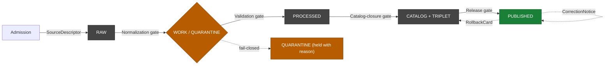

<!-- [KFM_META_BLOCK_V2]
doc_id: kfm://doc/roads-rail-trade-data-lifecycle
title: Roads, Rail & Trade — Data Lifecycle
type: standard
version: v1-draft
status: draft
owners: TODO — assign domain steward(s)
created: 2026-05-19
updated: 2026-06-07
policy_label: public
related:
  - docs/doctrine/directory-rules.md
  - docs/doctrine/lifecycle-law.md            # NEEDS VERIFICATION
  - docs/domains/roads-rail-trade/README.md   # NEEDS VERIFICATION
  - docs/standards/PROV.md                    # NEEDS VERIFICATION (see OPEN-DR-01)
  - docs/standards/ISO-19115.md               # NEEDS VERIFICATION
  - docs/runbooks/roads-rail-trade/           # NEEDS VERIFICATION (see OPEN-DR-02)
  - ai-build-operating-contract.md            # CONTRACT_VERSION = "3.0.0"
tags: [kfm, domain, lifecycle, roads-rail-trade, transport, governance]
notes:
  - CONTRACT_VERSION = "3.0.0" pinned; doctrine-adjacent doc.
  - Mounted-repo presence of sibling docs is NEEDS VERIFICATION.
  - Path placement follows Directory Rules Step 1-5 and Domain Placement Law.
  - SEGMENT-NAMING CONFLICT - Directory Rules 24.13 crosswalk uses the segment "transport" for this domain's schema/contract roots; this doc uses "roads-rail-trade" for data-lane/docs segments. Surfaced as an ADR candidate. See OQ-RRT-LC-01 and Section 2.
  - All implementation-layer paths and artifact IDs are PROPOSED.
[/KFM_META_BLOCK_V2] -->
# Roads, Rail & Trade — Data Lifecycle

> Governed promotion path for Kansas roads, rail, historic routes, trade and mobility corridors, transport facilities, restrictions, and derived graph projections — from admitted source to public-safe release.

<!-- Badges: placeholders; Shields.io targets to be wired during build. -->


| Status | Owners | Updated |
|---|---|---|
| **Draft** — PROPOSED implementation, CONFIRMED doctrine alignment | _TODO — assign domain steward(s)_ | _2026-06-07 (placeholder)_ |

> [!NOTE]
> This document describes how Roads/Rail/Trade material **moves through governance**, not where the bytes happen to sit on disk. Promotion is a **governed state transition**, not a file move. Path-shaped claims in this doc are **PROPOSED** until a mounted-repo inspection confirms them.

> [!CAUTION]
> **Segment-naming conflict (CONFLICTED).** Directory Rules §24.13 (Atlas ↔ Dossier ↔ Responsibility-Root crosswalk) names the schema/contract segment for this domain `transport` (`schemas/contracts/v1/transport/`, `contracts/transport/`), not `roads-rail-trade`. This doc uses `roads-rail-trade` for `data/`, `docs/`, `policy/`, and `tests/` segments and now uses `transport` for the schema/contract roots. The two-name split is unresolved doctrine. Tracked as **OQ-RRT-LC-01** and surfaced as an ADR candidate. Do not treat either name as canonical until the ADR lands.

---

## Contents

- [1. Scope and audience](#1-scope-and-audience)
- [2. The lifecycle invariant for this domain](#2-the-lifecycle-invariant-for-this-domain)
- [3. Phase-by-phase handling](#3-phase-by-phase-handling)
- [4. Gates and required artifacts](#4-gates-and-required-artifacts)
- [5. Domain-specific lifecycle concerns](#5-domain-specific-lifecycle-concerns)
- [6. Sensitivity tier posture](#6-sensitivity-tier-posture)
- [7. Receipts × phase mapping](#7-receipts--phase-mapping)
- [8. Failure-closed reason codes (PROPOSED)](#8-failure-closed-reason-codes-proposed)
- [9. Proposed data-lane paths](#9-proposed-data-lane-paths)
- [10. Validators and tests covering the lifecycle](#10-validators-and-tests-covering-the-lifecycle)
- [11. Cross-lane promotion notes](#11-cross-lane-promotion-notes)
- [12. Open questions register](#12-open-questions-register)
- [13. Open verification backlog](#13-open-verification-backlog)
- [14. Changelog](#14-changelog)
- [15. Definition of done](#15-definition-of-done)
- [16. Related docs](#16-related-docs)

---

## 1. Scope and audience

**What this doc covers.** The governed path that Roads/Rail/Trade source material follows from admission through public release: the per-phase handling rules, the gate artifacts required for each promotion, the receipts that must accompany each transition, the domain-specific failure modes that **must** fail closed, and the open verification items still owed before any of this becomes implementation fact.

**What this doc does not cover.** Object definitions, ubiquitous language, cross-lane relation semantics, and viewing-product design — those are the responsibility of the domain README and adjacent dossier material (`[DOM-ROADS]`). Schemas and contracts live under `schemas/contracts/v1/` per **ADR-0001** (NEEDS VERIFICATION in mounted repo); the per-domain segment is `transport` per Directory Rules §24.13 (CONFIRMED in the indexed crosswalk; see §9 and OQ-RRT-LC-01). Source-rights specifics and refresh cadence live in domain runbooks under `docs/runbooks/roads-rail-trade/` (NEEDS VERIFICATION; subfolder convention pending — see **§18 OPEN-DR-02** in `directory-rules.md`).

**Owned objects (CONFIRMED term / PROPOSED field realization).** Road Segment, Historic RouteClaim, Rail Segment, Depot, Siding, Yard, Crossing, Bridge, Ferry, River Crossing, Freight Corridor, TradeRouteCorridor, Route Event, Operator Status, Access Restriction, TransportFacility, RestrictionEvent, Network Node / Network Edge, Movement Story Node, and derived graph projections. `[DOM-ROADS §E]`

**Not owned (deferred to other lanes).** Settlement and infrastructure canonical claims belong to Settlements/Infrastructure. Water evidence belongs to Hydrology. Archaeology/People-Land/Hazards retain their own truth and sensitivity policies even where Roads/Rail relations cross them. `[DOM-ROADS §B]`

[Back to top ↑](#roads-rail--trade--data-lifecycle)

---

## 2. The lifecycle invariant for this domain

**CONFIRMED doctrine / PROPOSED lane application.** Roads/Rail/Trade follows the master invariant `RAW → WORK / QUARANTINE → PROCESSED → CATALOG / TRIPLET → PUBLISHED`, with promotion as a governed state transition rather than a file move. The same lifecycle, gates, receipts, and tier semantics that apply across all KFM domains apply here without exception. `[DIRRULES] [DOM-ROADS §H] [ENCY]`



> [!IMPORTANT]
> **Trust-membrane rule (CONFIRMED).** Public clients, normal UI surfaces, and the governed AI surface **never** reach RAW, WORK, QUARANTINE, canonical/internal stores, graph internals, vector indexes, source APIs, or direct model runtimes. The gates below are the **only** routes into PUBLISHED, and PUBLISHED is the **only** state from which the governed API may return `ANSWER`. `[GAI] [MAP-MASTER] [ENCY]`

[Back to top ↑](#roads-rail--trade--data-lifecycle)

---

## 3. Phase-by-phase handling

The per-phase handling for Roads/Rail/Trade matches the CONFIRMED domain-uniform pipeline shape `[DOM-ROADS §H] [ENCY]`. Domain-specific notes call out the source families, object decisions, and policy questions that bind to each phase in this lane.

| Phase | Handling | Gate | Status |
|---|---|---|---|
| **RAW** | Capture immutable source payload (or stable reference) for each admitted transport feed — TIGER/Line, FHWA HPMS, FHWA NHFN, WZDx, KDOT / KanPlan / KanDrive / Kansas GIS, county/state bridge & restriction data, GNIS, OpenStreetMap — with source role, rights, sensitivity, citation, time, and hash. | `SourceDescriptor` exists. | PROPOSED |
| **WORK / QUARANTINE** | Normalize schema, geometry, time, identity, evidence, rights, and policy. Hold failures (legal-status drift, unresolved historic alignment precision, sovereignty-sensitive corridor signal, missing rights). | Validation and policy gate pass, **or** quarantine reason is recorded. | PROPOSED |
| **PROCESSED** | Emit validated, normalized Roads/Rail objects (Road/Rail Segments, Crossings, Facilities, Restriction & Operator Events) and **public-safe candidates** (generalized historic geometry, redacted critical-facility detail). | `EvidenceRef`, `ValidationReport`, and digest closure exist. | PROPOSED |
| **CATALOG / TRIPLET** | Emit catalog records, `EvidenceBundle`s, and graph/triplet projections (network edges, route memberships). Release candidates assembled. Graph is **derived**, never canonical. | Catalog/proof closure passes. | PROPOSED |
| **PUBLISHED** | Serve released public-safe artifacts (modern roads layer, rail alignments, facility/crossing view, restriction/status timeline, freight-corridor context, generalized historic route claim, generalized trade-route corridor, derived graph view) through governed APIs and manifests only. | `ReleaseManifest`, correction path, rollback target, and review/policy state exist. | PROPOSED |

<details>
<summary>Per-phase domain notes — click to expand</summary>

**RAW (admission).** The domain has multiple authoritative source families (`[DOM-ROADS §D]`); a single dataset may have legitimate roles as *authority* (KDOT for state highways), *observation* (WZDx event feeds), *context* (OSM/GNIS naming), and *model* (graph derivation) without those roles being interchangeable. The `SourceDescriptor` MUST fix the role at admission; later upcasts ("OSM became authoritative for a stretch") are forbidden without an explicit, reviewed source-role change. Per `[DOM-ROADS §D]`, current rights and source terms for every family are **NEEDS VERIFICATION**, and sensitive joins fail closed.

**WORK / QUARANTINE.** Quarantine is **expected** in this lane, not exceptional. The CONFIRMED domain validators (PROPOSED implementation) include **OSM/GNIS legal-status denial** and **historic overprecision denial** — both of which produce quarantine outcomes by design `[DOM-ROADS §K]`. Quarantine entries MUST record the reason code (see §8) so subsequent review is reproducible.

**PROCESSED.** Public-safe candidates for Roads/Rail are not "the cleaned version"; they are the version that has survived **generalization** for sensitive routes, **redaction** of critical-facility detail, and **role-preserving** normalization. The corresponding `RedactionReceipt` and `AggregationReceipt` are emitted here when applicable and persist as `EvidenceRef` targets through the rest of the pipeline.

**CATALOG / TRIPLET.** Derived **graph projections** (route memberships, network edges, movement story nodes) live in `data/triplets/` and are explicitly **not** the truth source — they are a queryable projection over `EvidenceBundle`s, which outrank any graph projection `[ENCY]`. Graph projection rollback (PROPOSED in `[DOM-ROADS §K]`) is a domain-specific test: a published graph view MUST be rebuildable or revertible without rewriting canonical Road/Rail Segment records.

**PUBLISHED.** Only the governed API surface, governed MapLibre layers, and the Evidence Drawer / Focus Mode pathways may serve Roads/Rail content. Direct source-API passthrough (e.g., proxying WZDx as a "live feed") is forbidden by the trust membrane.

</details>

[Back to top ↑](#roads-rail--trade--data-lifecycle)

---

## 4. Gates and required artifacts

CONFIRMED doctrine — every gate fails closed if any required artifact is missing, unresolved, or has no recorded `PolicyDecision`. The prior state is preserved on failure. This table specializes the master Lifecycle Gate Reference `[ENCY §24.6.1] [DIRRULES]` to the Roads/Rail lane.

| Gate (transition) | Pre-condition | Required artifacts (PROPOSED minimum) | Failure-closed outcome |
|---|---|---|---|
| Admission (— → RAW) | Source identity and rights minimally established at discovery; source-role intent set. | `SourceDescriptor` (role, authority, rights, sensitivity, cadence); payload or reference hash. | Source not admitted; logged as candidate awaiting steward. |
| Normalization (RAW → WORK/QUARANTINE) | Schema, geometry, time, identity, evidence, rights, and policy rules are runnable. | `TransformReceipt`; `ValidationReport` (working set); `PolicyDecision`; QUARANTINE for failures. | Quarantine with reason; never silently promotes. |
| Validation (WORK → PROCESSED) | Validators deterministic and tied to fixtures; required receipts present. | `ValidationReport` pass; `RedactionReceipt` if sensitivity applies (Indigenous corridors, critical-facility detail, sensitive historic alignment); `AggregationReceipt` if applies (generalized trade-route corridor). | Stay in WORK; structured `FAIL` outcome. |
| Catalog closure (PROCESSED → CATALOG/TRIPLET) | `EvidenceRef`s resolve; catalog matrix and digests close. | `CatalogMatrix` entry; `EvidenceBundle`; graph/triplet projections if applicable. | HOLD at PROCESSED; structured `FAIL`; no public edge. |
| Release (CATALOG/TRIPLET → PUBLISHED) | Review state where required; release authority distinct from original author when materiality applies. | `ReleaseManifest`; rollback target; correction path; `ReviewRecord` (if required). | HOLD at CATALOG; no public surface change. |
| Correction (PUBLISHED → PUBLISHED′) | Detected error or new evidence; downstream derivatives identified. | `CorrectionNotice`; `ReviewRecord`; invalidation list; `ReleaseManifest` update or supersession. | Stale-state announcement; no silent edit. |
| Rollback (PUBLISHED → prior release) | Failed release or post-publication failure; prior release identified. | `RollbackCard`; `CorrectionNotice`; `ReleaseManifest` reverts; downstream derivative invalidation. | Held at current state until rollback validated. |

> [!WARNING]
> **Deny-by-default promotion.** Unclear rights, unresolved source role, missing evidence, unresolved sensitivity, or absent release state **blocks public promotion** for this domain — including for transport feeds with low individual risk like a county bridge inventory. The default is DENY, not "promote with a caveat." `[ENCY] [DIRRULES]`

[Back to top ↑](#roads-rail--trade--data-lifecycle)

---

## 5. Domain-specific lifecycle concerns

Five lifecycle concerns recur in this lane and shape what the gates above must actually catch. Each is CONFIRMED in `[DOM-ROADS]` doctrine; the PROPOSED implementation hooks are listed in §10.

### 5.1 Indigenous trade and mobility corridors

CONFIRMED policy default — **Indigenous trade and mobility corridors, oral history, treaty, cultural, and interpretive evidence default to steward review and generalized public geometry** `[DOM-ROADS §I]`. In lifecycle terms this means: admission may proceed under steward control, but **PROCESSED → CATALOG → PUBLISHED requires a `RedactionReceipt` and `ReviewRecord` at minimum**, and the public-safe candidate is a generalized corridor — never the precise alignment from a single source.

### 5.2 Critical transport facilities

CONFIRMED cross-lane rule — **critical transport facilities require review** `[DOM-ROADS §I]`, and the Settlements/Infrastructure tier matrix treats critical-asset detail as **T4 default, generalized footprint to T1 only after steward review**, with condition/vulnerability detail held to **T3 named-party-only release, never T0/T1** `[ENCY §24.5.2] [DOM-SETTLE]`. A bridge inventory may be admissible at RAW, but precise structural condition and vulnerability traits do not travel to PUBLISHED at any public tier without explicit named-party agreement and review.

### 5.3 Historic-route overprecision

A historic wagon road, military trail, or stage route whose source admits substantial alignment uncertainty must not publish at modern-survey precision. The **historic overprecision denial** validator (PROPOSED, `[DOM-ROADS §K]`) blocks PROCESSED → CATALOG when an object's geometric precision exceeds what its source role and uncertainty support. A `Historic RouteClaim` carries its uncertainty into the Evidence Drawer via an `UncertaintySurface` (the doctrinal carrier named for this object class in `[ENCY §16]`); the published geometry generalizes it.

### 5.4 OSM / GNIS legal-status drift

OSM and GNIS are admissible as *context* sources for road and place naming, **not** as authority for legal-status fields (jurisdiction, official designation, ownership). The **OSM/GNIS legal-status denial** validator (PROPOSED, `[DOM-ROADS §K]`) enforces this by rejecting any normalization that would promote OSM/GNIS values into authority-role fields without a separate authority source to back the claim. Quarantine is the expected outcome where this fires.

### 5.5 Graph projection is derived, not canonical

The derived transport graph (network edges, route memberships, movement story nodes) is a queryable projection over `EvidenceBundle`s. **Transport graph projection rollback tests** (PROPOSED, `[DOM-ROADS §K]`) prove that the graph view can be revoked or rebuilt without rewriting the canonical Road/Rail Segment records that feed it. At the manifest level a published graph view is `T0`; it inherits content tiers from its constituent objects.

[Back to top ↑](#roads-rail--trade--data-lifecycle)

---

## 6. Sensitivity tier posture

CONFIRMED tier scheme (Atlas v1.1 §24.5) `[ENCY]`; per-row applications below are CONFIRMED for explicitly named classes and **PROPOSED for the rest**, pending steward / ADR confirmation (ADR-S-05 adopts the T0–T4 scheme as canonical).

| Object class | Default tier | Allowed transforms (PROPOSED) | Required gates |
|---|---|---|---|
| Road Segment (modern, authority source) | **T0** | None required for public-safe attributes; vintage labeling required. | Standard Gates A–G; `ReleaseManifest`. |
| Rail Segment (modern, authority source) | **T0** | None required for public-safe attributes; operator-status temporal labeling required. | Standard Gates A–G; `ReleaseManifest`. |
| Historic RouteClaim / unverified historic alignment | **T1** | Generalization + `UncertaintySurface` + `RedactionReceipt` for sensitive historic content. | `RedactionReceipt` + `ReviewRecord`. |
| Indigenous trade / mobility corridor | **T4** default | Steward review + generalized geometry + `RedactionReceipt` → **T1** generalized public layer where supported. | Sovereignty / steward review + `RedactionReceipt` + `ReviewRecord` + `PolicyDecision`. |
| TransportFacility — public detail | **T0 – T1** | Generalization where critical-asset rules apply. | `ReleaseManifest`; `RedactionReceipt` if applicable. |
| TransportFacility — critical asset detail | **T4** | Generalized facility footprint + suppressed dependency → **T1**. | Steward review + `RedactionReceipt`. `[DOM-SETTLE]` |
| TransportFacility — condition / vulnerability | **T4** | **T3** to named authorities only; never **T0 / T1**. | Steward review + named-party agreement. `[DOM-SETTLE]` |
| RestrictionEvent / Operator Status | **T0 – T1** | Stale-state labeling required; freshness cadence enforced. | `ReleaseManifest`; `CorrectionNotice` on stale. |
| Derived graph projection (Network Edge / Route Membership) | manifest **T0**; content varies | None on the projection itself; constituent objects retain their own tier. | `ReleaseManifest`; rollback target. |

> [!CAUTION]
> The tier table above is the **release posture**, not the storage posture. A T4 object in QUARANTINE is still T4. Tier *motion* follows the master transition table `[ENCY §24.5.3]`: a tier **upgrade (toward more public)** always needs **both** a transform receipt **and** a `ReviewRecord` (e.g., `T4 → T1` requires `RedactionReceipt` + `ReviewRecord`; `T1 → T0` requires `ReleaseManifest` + `ReviewRecord`); a tier **downgrade (toward less public)** never needs both — `CorrectionNotice` + `ReviewRecord` alone is sufficient, is **always permitted**, and **precedes** derivative invalidation.

[Back to top ↑](#roads-rail--trade--data-lifecycle)

---

## 7. Receipts × phase mapping

CONFIRMED doctrine for the master receipt × lifecycle mapping `[ENCY §24.2]`. The marks below indicate where each receipt class is normally emitted, amended, or referenced for Roads/Rail/Trade. Receipts created earlier remain referenced (not duplicated) at later phases via `EvidenceRef`.

| Receipt | RAW | WORK / Q | PROCESSED | CATALOG / TRIPLET | PUBLISHED |
|---|:---:|:---:|:---:|:---:|:---:|
| `SourceDescriptor` | • | • | • | • | • |
| `TransformReceipt` |  | • | • | • |  |
| `RedactionReceipt`<br/><sub>(historic, Indigenous, critical-facility)</sub> |  | • | • | • | • |
| `AggregationReceipt`<br/><sub>(generalized trade-route corridor)</sub> |  | • | • | • | • |
| `ModelRunReceipt`<br/><sub>(graph derivation)</sub> |  | • | • | • |  |
| `AIReceipt` |  |  |  | • | • (Focus Mode only) |
| `ReviewRecord` |  | • | • | • | • |
| `PolicyDecision` | • | • | • | • | • |
| `ValidationReport` |  | • | • | • |  |
| `ReleaseManifest` |  |  |  | • | • |
| `CorrectionNotice` |  |  |  |  | • |
| `RollbackCard` |  |  |  | • | • |
| `RealityBoundaryNote`<br/><sub>(if any 3D/synthetic scene admits)</sub> |  |  | • | • | • |

> [!NOTE]
> `ModelRunReceipt`, `AIReceipt`, and `RealityBoundaryNote` are listed here as the receipt families this lane is expected to emit when graph derivation, Focus Mode, or 3D/synthetic scenes apply. Their exact field shape is **NEEDS VERIFICATION** against `schemas/contracts/v1/receipts/` (ADR-S-03 governs receipt-home layout).

[Back to top ↑](#roads-rail--trade--data-lifecycle)

---

## 8. Failure-closed reason codes (PROPOSED)

PROPOSED catalog of reason codes for failed Roads/Rail/Trade transitions, drawn from the master reason-code catalog `[ENCY §24.6]` and the domain validator list `[DOM-ROADS §K]`. NEEDS VERIFICATION against the mounted-repo validator registry once available. Finite runtime outcomes remain `ANSWER / ABSTAIN / DENY / ERROR` `[GAI]`; the codes below are the structured reasons attached to a `FAIL`/`DENY`/quarantine result.

| Failure family | Reason code (PROPOSED) | Gate(s) where it fires | Recovery path |
|---|---|---|---|
| Missing required artifact | `MISSING_RECEIPT`, `MISSING_EVIDENCE`, `MISSING_REVIEW` | Normalization / Validation / Catalog / Release | Re-emit missing receipt; re-run review; re-validate. |
| Schema / contract mismatch | `SCHEMA_MISMATCH`, `CONTRACT_DRIFT` | Normalization / Validation | Schema fix and/or ADR; re-run validator. |
| Rights / sensitivity unresolved | `RIGHTS_UNKNOWN`, `SENSITIVITY_UNRESOLVED` | Admission / Validation / Catalog / Release | Steward review; rights resolution; tier reassignment. |
| Source-role collapse | `ROLE_COLLAPSE`, `ROLE_DOWNCAST_FORBIDDEN` | Validation / Catalog / Release | Restore source role; refuse upcast. |
| Legal-status drift (OSM/GNIS into authority field) | `OSM_LEGAL_STATUS_DENY`, `GNIS_LEGAL_STATUS_DENY` | Validation | Move value to context-role field or back to QUARANTINE. |
| Historic overprecision | `HISTORIC_OVERPRECISION_DENY` | Validation / Catalog | Apply generalization + `UncertaintySurface`; re-validate. |
| Critical-facility exposure | `CRITICAL_FACILITY_DETAIL_DENY` | Validation / Catalog / Release | Generalize footprint; route detail through named-party path. |
| Indigenous-corridor exposure | `INDIGENOUS_CORRIDOR_REVIEW_PENDING` | Validation / Catalog / Release | Sovereignty / steward review; `RedactionReceipt`; generalize. |
| Review state inadequate | `REVIEW_NEEDED`, `REVIEW_INSUFFICIENT`, `REVIEW_REJECTED` | Catalog / Release | Run required review; supply `ReviewRecord`. |
| Release infrastructure error | `RELEASE_MANIFEST_INVALID`, `ROLLBACK_TARGET_MISSING` | Release | Manifest fix; supply rollback target. |
| Graph rebuild required | `GRAPH_PROJECTION_STALE`, `GRAPH_ROLLBACK_REQUIRED` | Catalog (derived) / Release | Rebuild projection; revert published graph view. |

> [!TIP]
> The OSM/GNIS, historic-overprecision, critical-facility, and Indigenous-corridor reason codes above are **PROPOSED domain-specific extensions** of the master catalog. They are listed separately because they encode the validators that this lane is uniquely responsible for proving (see §10).

[Back to top ↑](#roads-rail--trade--data-lifecycle)

---

## 9. Proposed data-lane paths

PROPOSED per Directory Rules Step 1–5 (path placement quick check) and the Domain Placement Law (domain = a segment inside a responsibility root, never a root folder). NEEDS VERIFICATION against a mounted-repo `git ls-tree`.

> [!CAUTION]
> **Two segment names are in play (CONFLICTED).** Directory Rules §24.13 names the schema/contract segment `transport`; this doc uses `roads-rail-trade` for `data/`, `docs/`, `policy/`, and `tests/` segments. The schema/contract sibling block below has been corrected to `transport` to match §24.13. Whether the data/docs lanes should also be `transport` (or §24.13 should be amended to `roads-rail-trade`) is **OQ-RRT-LC-01**, an ADR candidate. Until resolved, treat both segment names as `PROPOSED / CONFLICTED` and avoid creating divergent siblings under both names.

```text
data/
├── raw/
│   └── roads-rail-trade/<source_id>/<run_id>/          # PROPOSED
│       e.g.  tiger_line/2024_run_001/
│             fhwa_hpms/2024_run_001/
│             wzdx_kandrive/2026-06-07/
├── work/
│   └── roads-rail-trade/<run_id>/                      # PROPOSED
├── quarantine/
│   └── roads-rail-trade/<reason>/<run_id>/             # PROPOSED
│       e.g.  osm_legal_status_deny/...
│             historic_overprecision_deny/...
│             indigenous_corridor_review_pending/...
├── processed/
│   └── roads-rail-trade/<dataset_id>/<version>/        # PROPOSED
├── catalog/
│   └── domain/roads-rail-trade/                        # PROPOSED (per DIRRULES Step 3: data/catalog/domain/<domain>/)
├── triplets/
│   └── graph_deltas/roads-rail-trade/                  # PROPOSED
├── published/
│   └── layers/roads-rail-trade/                        # PROPOSED (per DIRRULES Step 3: data/published/layers/<domain>/)
└── registry/
    └── sources/roads-rail-trade/                       # PROPOSED (per DIRRULES Step 3: data/registry/sources/<domain>/)
```

Sibling responsibility roots (PROPOSED placement; NEEDS VERIFICATION). Schema/contract segment is `transport` per §24.13; other segments follow this doc's `roads-rail-trade` form pending OQ-RRT-LC-01:

```text
docs/domains/roads-rail-trade/
contracts/transport/                                    # per DIRRULES §24.13 crosswalk
schemas/contracts/v1/transport/                         # per DIRRULES §24.13 + ADR-0001 schema home
policy/domains/roads-rail-trade/
tests/domains/roads-rail-trade/
fixtures/domains/roads-rail-trade/
pipelines/domains/roads-rail-trade/
pipeline_specs/roads-rail-trade/
release/candidates/roads-rail-trade/
```

> [!NOTE]
> **Paths are not authority.** A move into `data/processed/roads-rail-trade/` does not constitute promotion; promotion requires the gate artifacts in §4. A file's location records that it is *currently held in a phase*, not that it has *passed through the gates*.

[Back to top ↑](#roads-rail--trade--data-lifecycle)

---

## 10. Validators and tests covering the lifecycle

PROPOSED domain validators from `[DOM-ROADS §K]`. Each one targets a specific gate-failure mode. NEEDS VERIFICATION against mounted-repo test fixtures and CI configuration.

| Validator / test | Targets gate | Failure-closed reason code (PROPOSED) | Status |
|---|---|---|---|
| Route membership and designation separation | Validation, Catalog | `ROLE_COLLAPSE`, `CONTRACT_DRIFT` | PROPOSED |
| Operator / status temporal | Validation | `MISSING_RECEIPT`, `SCHEMA_MISMATCH` | PROPOSED |
| OSM / GNIS legal-status denial | Validation | `OSM_LEGAL_STATUS_DENY`, `GNIS_LEGAL_STATUS_DENY` | PROPOSED |
| Historic overprecision denial | Validation / Catalog | `HISTORIC_OVERPRECISION_DENY` | PROPOSED |
| Public generalization receipt | Validation / Catalog / Release | `MISSING_RECEIPT` (`RedactionReceipt` / `AggregationReceipt`) | PROPOSED |
| Transport graph projection rollback | Catalog (derived) / Release | `GRAPH_ROLLBACK_REQUIRED`, `GRAPH_PROJECTION_STALE` | PROPOSED |
| Critical-facility detail denial | Validation / Catalog / Release | `CRITICAL_FACILITY_DETAIL_DENY` | PROPOSED *(cross-lane: `[DOM-SETTLE]`)* |
| Indigenous-corridor review pending | Validation / Catalog / Release | `INDIGENOUS_CORRIDOR_REVIEW_PENDING` | PROPOSED |

> [!TIP]
> **The negative-state rule applies.** CONFIRMED doctrine: validators MUST test DENY, ABSTAIN, ERROR, quarantine, stale, restricted, and review-needed paths — not only successful publication. A passing test suite that proves only happy paths is, for governance purposes, equivalent to no tests `[UNIFIED]`.

[Back to top ↑](#roads-rail--trade--data-lifecycle)

---

## 11. Cross-lane promotion notes

CONFIRMED cross-lane edges for this domain `[DOM-ROADS §F]`. The lifecycle implication is: **promotion in Roads/Rail/Trade must not silently promote material owned by another lane**, and cross-lane relations must preserve ownership, source role, sensitivity, and `EvidenceBundle` support on both sides.

| Related lane | Relation type | Lifecycle implication |
|---|---|---|
| **Settlements / Infrastructure** | Depots, crossings, transport facilities, dependencies. | Facility *canonical claims* are Settlements'; Roads/Rail publishes the **relation** plus the route-side `EvidenceBundle`. Critical-asset detail follows Settlements' T4-default rules. |
| **Hydrology** | Bridge / ferry / ford / river crossing. | Water evidence is Hydrology's; Roads/Rail publishes the crossing relation plus route-side evidence. Joint releases require both lanes' release manifests. |
| **Hazards** | Closure, detour, flood/fire/smoke exposure. | Hazards owns the hazard event; Roads/Rail publishes the *restriction* it imposes. KFM never acts as an emergency-alert authority (boundary holds at T4 forever per `[DOM-HAZ]`). |
| **Archaeology / Cultural Heritage** | Historic routes, Indigenous corridors, forts, missions. | Archaeology and cultural review govern sensitivity for the cultural side; Roads/Rail MUST default to **T4** for Indigenous corridor specifics until steward / sovereignty review supports generalized release. |

[Back to top ↑](#roads-rail--trade--data-lifecycle)

---

## 12. Open questions register

| ID | Question | Owner role | Resolution path |
|---|---|---|---|
| OQ-RRT-LC-01 | Should the domain segment be `transport` (per Directory Rules §24.13 schema/contract crosswalk) or `roads-rail-trade` (this doc's data/docs/policy/tests form)? The split currently spans two names. | Directory-Rules steward + domain steward | ADR amending §24.13 or this doc; until then both names are `PROPOSED / CONFLICTED`. |
| OQ-RRT-LC-02 | Is the runbook home `docs/runbooks/roads-rail-trade/` (subfolder) or flat? | Docs steward | Resolve via §18 OPEN-DR-02 ADR in `directory-rules.md`. |
| OQ-RRT-LC-03 | What is the exact governed-API route for Roads/Rail surfaces? Atlas lists "route TBD" / `RoadsRailDecisionEnvelope`. | API steward | `apps/governed-api/` route-table inspection. |
| OQ-RRT-LC-04 | Does the lane carry the `UncertaintySurface` (Atlas §16 / §24.13 "Network identity governance") or a separate `RouteUncertaintyProfile` as the historic-precision carrier? | Domain steward + schema steward | Schema + validator + fixtures under `schemas/contracts/v1/transport/`. |
| OQ-RRT-LC-05 | When is release authority separation enforced by tooling vs. convention for material Roads/Rail publications? | Release authority | Resolve via ADR-S-09 (reviewer separation-of-duties threshold). |

## 13. Open verification backlog

These items remain `NEEDS VERIFICATION` before promotion from `draft` to `published`:

1. Verify KDOT / FHWA / FRA / WZDx / source-family terms and current rights against source-registry entries + mounted-repo configs + steward review.
2. Verify Indigenous / cultural corridor policy and review workflow against `policy/domains/roads-rail-trade/` + `ReviewRecord` template + steward sign-off.
3. Resolve the `UncertaintySurface` vs `RouteUncertaintyProfile` carrier question (OQ-RRT-LC-04): schema + validator + fixtures + tests.
4. Verify transport graph projection and MapLibre integration: graph build artifact + `LayerManifest` + governed-API route.
5. Verify mounted-repo presence of `data/<phase>/roads-rail-trade/` (or `transport/`) lanes via `git ls-tree` or directory-walker output.
6. Confirm release authority separation for material publications: `ReviewRecord` + `ReleaseManifest` signed by distinct authority.
7. Confirm stale-state / freshness cadence per source family: source-watch CI + `CorrectionNotice` drill.
8. Confirm schema/contract segment name (OQ-RRT-LC-01) via ADR; until then `transport` per §24.13 is authoritative for the schema/contract roots only.
9. Confirm the runbook home convention (OQ-RRT-LC-02) via §18 OPEN-DR-02 resolution.
10. Confirm the exact governed-API route (OQ-RRT-LC-03) via `apps/governed-api/` route table.

## 14. Changelog

| Change | Type (per contract §37) | Reason |
|---|---|---|
| Surfaced the `transport` vs `roads-rail-trade` segment-naming conflict; corrected schema/contract sibling paths to `transport` per Directory Rules §24.13; added OQ-RRT-LC-01. | reconciliation | Indexed §24.13 crosswalk uses `transport` for schema/contract roots; the prior draft used `roads-rail-trade` everywhere with an unverified §6.1/§12 attribution. |
| Aligned §6 tier-motion CAUTION callout verbatim to the master transition table `[ENCY §24.5.3]` (upgrade needs receipt + review; downgrade needs correction alone and precedes derivative invalidation). | clarification | Removes ambiguity about upgrade vs downgrade requirements. |
| Replaced "uncertainty band" with the doctrinal `UncertaintySurface` carrier (Atlas §16) in §5.3 and §6; flagged the `RouteUncertaintyProfile` alternative as OQ-RRT-LC-04. | clarification | Aligns to the named doctrinal carrier; prior term was non-canonical. |
| Added the four doctrine-doc companion sections (Open questions, Verification backlog, Changelog, Definition of done) and an OQ-style ID scheme. | gap closure | Doc encodes operating-law-adjacent lifecycle rules; companion sections are required for doctrine-adjacent docs. |
| Pinned `CONTRACT_VERSION = "3.0.0"` (badge, meta-block notes, related list); refreshed `updated` to 2026-06-07. | housekeeping | Doctrine-adjacent doc requirement. |
| Linked validators in §10 to the negative-state rule and to `[ENCY §24.6.1]` master gate table; tightened RFC-2119 MUST usage. | clarification | Strengthens traceability without changing doctrine. |

> **Backward compatibility.** All section anchors and the H1 anchor are preserved; §1–§11 retain their headings and IDs. New sections (§12–§16) are appended; the old "Verification backlog" (former §12) is preserved as §13 "Open verification backlog" with all prior rows retained and extended. The old "Related docs" (former §13) is preserved as §16. No prior content was removed.

## 15. Definition of done

This document is done enough to enter the repository when:

- it is placed according to Directory Rules (Step 1–5; domain as a segment, not a root);
- a docs steward and the Roads/Rail domain steward review it;
- it is linked from the docs index and the doctrine/domain index;
- it does not conflict with accepted ADRs (in particular, OQ-RRT-LC-01 is resolved or explicitly deferred with a `DRIFT_REGISTER.md` entry);
- any conflict with current repo conventions is logged in `docs/registers/DRIFT_REGISTER.md`;
- the `GENERATED_RECEIPT.json` planned in the authoring notes is wired into CI;
- future changes follow the operating contract's §37 lifecycle.

[Back to top ↑](#roads-rail--trade--data-lifecycle)

---

## 16. Related docs

Placeholders below are PROPOSED targets. Mounted-repo presence is NEEDS VERIFICATION for every link.

- [`docs/doctrine/directory-rules.md`](../../doctrine/directory-rules.md) — placement law, lifecycle invariant, and the §24.13 responsibility-root crosswalk.
- [`docs/doctrine/lifecycle-law.md`](../../doctrine/lifecycle-law.md) — TODO: NEEDS VERIFICATION.
- [`docs/domains/roads-rail-trade/README.md`](./README.md) — domain README — TODO: NEEDS VERIFICATION.
- [`docs/standards/PROV.md`](../../standards/PROV.md) — provenance external-standard profile (filename pending §18 OPEN-DR-01: `PROV.md` vs `PROVENANCE.md`).
- [`docs/standards/ISO-19115.md`](../../standards/ISO-19115.md) — metadata external-standard profile — NEEDS VERIFICATION.
- [`docs/runbooks/roads-rail-trade/SOURCE_REFRESH_RUNBOOK.md`](../../runbooks/roads-rail-trade/SOURCE_REFRESH_RUNBOOK.md) — TODO: PROPOSED; subfolder convention pending per §18 OPEN-DR-02.
- [`ai-build-operating-contract.md`](../../../ai-build-operating-contract.md) — operating contract; `CONTRACT_VERSION = "3.0.0"`.
- [`docs/adr/`](../../adr/) — relevant ADRs once authored: ADR-0001 (schema home), ADR-S-04 (source-role vocabulary), ADR-S-05 (sensitivity tier scheme), ADR-S-09 (reviewer separation-of-duties).

Atlas / corpus references (not repo paths):

- `[DOM-ROADS]` — Roads, Rail, and Trade Routes dossier.
- `[ENCY]` — KFM Domain & Capability Encyclopedia.
- `[DIRRULES]` — Directory Rules.
- `[GAI]` — Governed AI dossier.
- `[MAP-MASTER]` — Master MapLibre components / functions / features.
- `[DOM-SETTLE]` — Settlements / Infrastructure dossier (critical-asset rules).
- `[DOM-HAZ]` — Hazards dossier (alert-authority boundary).
- `[UNIFIED]` — Unified / pipeline lineage (negative-state rule).

---

_Last updated: **2026-06-07** (placeholder; replace with commit date on merge)._
_Doc version: **v1-draft**._ · _Pins `CONTRACT_VERSION = "3.0.0"`._
_Owners: **TODO — assign domain steward(s)**._

[Back to top ↑](#roads-rail--trade--data-lifecycle)
