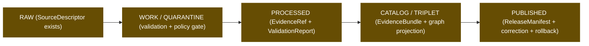
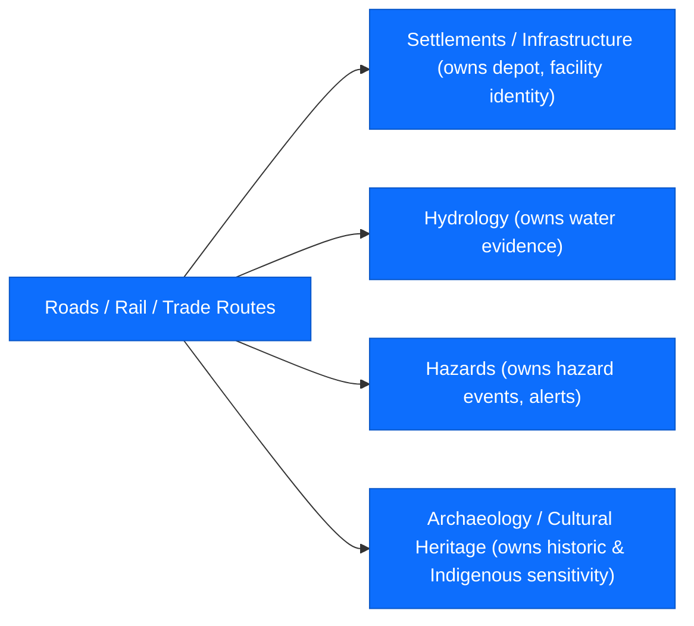

<!-- [KFM_META_BLOCK_V2]
doc_id: kfm://doc/roads-rail-trade-expansion-backlog
title: Roads, Rail, and Trade Routes — Expansion Backlog
type: standard
version: v0.2
status: draft
owners: TODO (Roads/Rail/Trade Routes domain stewards)
created: 2026-05-19
updated: 2026-06-07
policy_label: public
related:
  - docs/domains/roads-rail-trade/README.md
  - docs/domains/roads-rail-trade/SOURCES.md
  - docs/domains/roads-rail-trade/SENSITIVITY.md
  - docs/domains/roads-rail-trade/DATA_LIFECYCLE.md
  - docs/atlases/KFM_Domains_Culmination_Atlas_v1_1.pdf
  - docs/doctrine/directory-rules.md
  - ai-build-operating-contract.md            # CONTRACT_VERSION = "3.0.0"
tags: [kfm, domain, roads-rail-trade, transport, backlog, planning]
notes:
  - CONTRACT_VERSION = "3.0.0" pinned; doctrine-adjacent planning artifact.
  - Atlas v1.1 Ch. 13 ("Roads, Rail, and Trade Routes") is the doctrinal baseline for this backlog.
  - Implementation maturity is UNKNOWN in this docs-only authoring pass; all path/route claims are PROPOSED until repo-verified.
  - SEGMENT-NAMING CONFLICT - Directory Rules 24.13 crosswalk names the schema/contract segment "transport"; this doc uses "roads-rail-trade" for docs/data/policy/tests segments. Surfaced as Q-08 and an ADR candidate.
[/KFM_META_BLOCK_V2] -->

# Roads, Rail, and Trade Routes — Expansion Backlog

> Working list of doctrine-grounded, evidence-aware expansion items for the **Roads / Rail / Trade Routes** domain lane. Tracks what to research, design, build, verify, and pilot — without claiming repository implementation.

<p>
  
  
  
  
  
  
  
</p>

**Status:** `draft` · **Owners:** _TODO — Roads/Rail/Trade Routes domain stewards (see [`CODEOWNERS`](../../../CODEOWNERS) — PROPOSED path)_ · **Last updated:** 2026-06-07

> [!IMPORTANT]
> This is a **planning artifact**, not a repository-state document. Every item below is **PROPOSED**, **NEEDS VERIFICATION**, or **UNKNOWN** with respect to the current mounted repo. Doctrine items are labeled **CONFIRMED** where they are grounded in attached project sources. No item here may be quoted as evidence of implementation.

> [!CAUTION]
> **Segment-naming conflict (CONFLICTED).** Directory Rules §24.13 (Atlas ↔ Dossier ↔ Responsibility-Root crosswalk) names the schema/contract segment for this domain `transport` (`schemas/contracts/v1/transport/`, `contracts/transport/`), **not** `roads-rail-trade`. This backlog uses `roads-rail-trade` for `docs/`, `data/`, `policy/`, and `tests/` segments. Schema/contract path rows below have been corrected to `transport` to match §24.13; the data/docs lanes keep `roads-rail-trade` pending resolution. Tracked as **Q-08**, an ADR candidate. Until the ADR lands, treat both names as `PROPOSED / CONFLICTED` and do not create divergent siblings under both.

---

## 📑 Contents

- [1. Purpose & how to use](#1-purpose--how-to-use)
- [2. Lifecycle anchors for backlog items](#2-lifecycle-anchors-for-backlog-items)
- [3. Backlog at a glance](#3-backlog-at-a-glance)
- [4. Tracks](#4-tracks)
  - [4.1 Research track](#41-research-track)
  - [4.2 Writing / documentation track](#42-writing--documentation-track)
  - [4.3 Architecture / design track](#43-architecture--design-track)
  - [4.4 Implementation track](#44-implementation-track)
  - [4.5 Domain-deepening / pilots track](#45-domain-deepening--pilots-track)
  - [4.6 Verification track](#46-verification-track)
  - [4.7 Missing-evidence track](#47-missing-evidence-track)
- [5. Atlas v1.1 Ch. 13.N — Verification backlog (canonical four)](#5-atlas-v11-ch-13n--verification-backlog-canonical-four)
- [6. Cross-lane backlog dependencies](#6-cross-lane-backlog-dependencies)
- [7. Sensitivity & publication gating notes](#7-sensitivity--publication-gating-notes)
- [8. Definition of done for a backlog item](#8-definition-of-done-for-a-backlog-item)
- [9. How to add, promote, or close a backlog item](#9-how-to-add-promote-or-close-a-backlog-item)
- [10. Open questions register](#10-open-questions-register)
- [11. Changelog](#11-changelog)
- [Related docs](#related-docs)

---

## 1. Purpose & how to use

This backlog organizes the **Roads, Rail, and Trade Routes** domain's outstanding research, design, implementation, pilot, verification, and missing-evidence items into a single ordered reference. It is the lane-specific successor to:

- the four verification items recorded in **Atlas v1.1 Ch. 13.N** _(CONFIRMED doctrine source)_,
- the `Roads/Rail` rows of the Atlas's API/contract (Ch. 13.J), validator (Ch. 13.K), and source-family (Ch. 13.D) tables _(CONFIRMED doctrine source)_,
- relevant rail-/transport-shaped expansion items in the **Pass 10 Idea Index** §10 Expansion Agenda and the **Pass 23 + Pass 32 Consolidated Atlas** transport source-role cards _(CONFIRMED doctrine sources)_,
- and the open-verification posture for the Roads/Rail lane carried through the Unified Implementation Architecture Build Manual _(CONFIRMED doctrine source for the lane; the specific "§30.8" anchor is NEEDS VERIFICATION — see Q-09)_.

It is **not** an authority surface. Doctrine remains in `[DOM-ROADS]`, `[ENCY]`, `[DIRRULES]`, `[MAP-MASTER]`, and `[GAI]`. ADRs, not this backlog, decide structural changes. The backlog records intent and surfaces evidence-gathering work; promotion to actual repo change requires an ADR or PR with mounted-repo evidence.

> [!NOTE]
> **Reading conventions used below**
>
> - **Track** — the kind of work (research, writing, architecture, implementation, domain-deepening, verification, missing-evidence).
> - **Priority** — `H` (high / blocking), `M` (medium / supporting), `L` (low / valuable but lower-leverage).
> - **Status label** — `PROPOSED`, `NEEDS VERIFICATION`, `UNKNOWN`, or `INFERRED`. `CONFIRMED` is reserved for doctrine grounding, not implementation.
> - **Evidence basis** — the doctrinal source(s) that motivate the item.

---

## 2. Lifecycle anchors for backlog items

CONFIRMED doctrine: every Roads/Rail artifact moves through the lane lifecycle below. Backlog items map onto stages so that "what we are about to build" is always pinned to the stage it actually changes. _Promotion remains a governed state transition, not a file move._ `[DIRRULES] [DOM-ROADS §H] [ENCY]`



Each backlog item below names the stage(s) it most directly affects, so that gating can be reasoned about against the lane's lifecycle, not against an ad-hoc "feature" mental model.

[⬆ Back to top](#-contents)

---

## 3. Backlog at a glance

The single-shot priority view. Detailed entries follow in [§4 Tracks](#4-tracks).

| Priority | Item | Track | Stage touched | Status |
|---|---|---|---|---|
| **H** | Verify rights, terms, and cadence for KDOT / FHWA / FRA / WZDx / KanPlan / KanDrive sources. | Verification | RAW | NEEDS VERIFICATION _(Atlas Ch. 13.N)_ |
| **H** | Establish Indigenous / cultural-corridor publication policy and steward-review path. | Verification + Architecture | CATALOG, PUBLISHED | NEEDS VERIFICATION _(Atlas Ch. 13.N)_ |
| **H** | Design and implement `RouteUncertaintyProfile` (uncertainty surface, generalization receipt). | Architecture + Implementation | PROCESSED, PUBLISHED | NEEDS VERIFICATION _(Atlas Ch. 13.N)_ |
| **H** | Verify transport-graph projection ↔ MapLibre layer integration (route TBD). | Verification + Implementation | CATALOG, PUBLISHED | NEEDS VERIFICATION _(Atlas Ch. 13.N)_ |
| **H** | Author KDOT / KanPlan / KanDrive / FRA harvest-cadence + API-stability dossier. | Missing-evidence | RAW | PROPOSED |
| **H** | Implement OSM/GNIS legal-status denial validator. | Implementation | WORK/QUARANTINE | PROPOSED _(Atlas Ch. 13.K)_ |
| **H** | Implement historic-overprecision denial validator. | Implementation | WORK/QUARANTINE | PROPOSED _(Atlas Ch. 13.K)_ |
| **H** | Implement public-generalization receipt tests. | Implementation | PROCESSED, PUBLISHED | PROPOSED _(Atlas Ch. 13.K)_ |
| **M** | Pilot the unified rail view on a single Kansas corridor (Pass 10 names the BNSF Transcon corridor). | Domain-deepening | PUBLISHED | PROPOSED _(Pass 10 §10.5)_ |
| **M** | Implement Route-membership ↔ designation separation tests. | Implementation | PROCESSED | PROPOSED _(Atlas Ch. 13.K)_ |
| **M** | Implement operator/status temporal tests (operator changes over time). | Implementation | PROCESSED | PROPOSED _(Atlas Ch. 13.K)_ |
| **M** | Implement transport-graph projection rollback tests. | Implementation | CATALOG | PROPOSED _(Atlas Ch. 13.K)_ |
| **M** | Build a GTFS-rt / transit feed-quality dashboard scoped to Kansas operators. | Implementation | RAW, WORK/QUARANTINE | PROPOSED _(Pass 10 §10.4; C10-04)_ |
| **M** | Author `RoadsRailDecisionEnvelope` shape and finalize Evidence Drawer payload contract. | Architecture | CATALOG, PUBLISHED | PROPOSED _(Atlas Ch. 13.J)_ |
| **M** | Author historic-corridor source-role package (military / mail / emigrant / stage / cattle / trade). | Writing | RAW | PROPOSED _(Build Manual — NEEDS VERIFICATION, Q-09)_ |
| **L** | Surface backlog progress in a domain dashboard (placeholder; lives under `docs/dashboards/` if at all). | Writing | n/a | PROPOSED |

> [!TIP]
> Treat the high-priority block above as **the minimum set** for any "Roads/Rail lane goes from doctrine to first published slice" milestone. The medium block can begin in parallel where doctrine is firm; the low block waits.

[⬆ Back to top](#-contents)

---

## 4. Tracks

Each track below is grouped by responsibility, following the **Pass 10 Expansion Agenda** eight-track structure (§10.1 Research, §10.2 Writing, §10.3 Architecture, §10.4 Implementation, §10.5 Domain-Deepening, §10.6 Verification, §10.7 Missing-Evidence, §10.8 Pilots) _(CONFIRMED doctrine source for the structure; the specific items here are PROPOSED for the Roads/Rail lane)_.

### 4.1 Research track

| # | Item | Priority | Status | Evidence basis |
|---|---|---|---|---|
| R-01 | Determine current rights and licensing terms for **KDOT / KanPlan / KanDrive / Kansas GIS** distributions. | H | NEEDS VERIFICATION | Atlas Ch. 13.D; Ch. 13.N |
| R-02 | Determine current rights/licensing for **FHWA HPMS**, **FHWA NHFN**, and **FRA** rail datasets. | H | NEEDS VERIFICATION | Atlas Ch. 13.D; Ch. 13.N |
| R-03 | Determine current rights/licensing and cadence for **WZDx feeds**. | H | NEEDS VERIFICATION | Atlas Ch. 13.D; Pass 10 C10-04 |
| R-04 | Determine usage posture for **Census TIGER/Line** roads and the **GNIS** names registry inside the Roads/Rail lane. | M | NEEDS VERIFICATION | Atlas Ch. 13.D |
| R-05 | Determine acceptable role(s) of **OpenStreetMap** evidence (context, observation, never authority for legal status). | M | PROPOSED | Atlas Ch. 13.D; Ch. 13.K (OSM/GNIS legal-status denial) |
| R-06 | Determine acceptable **NTAD / NBI / Transitland / NTM GTFS / STB rail-status** ingestion shapes. | M | PROPOSED | KFM-P12-PROG-0029 _(CONFIRMED card; Pass 23 + 32)_ |
| R-07 | Determine the Indigenous / cultural-corridor **steward-review** model and the entities authorized to act as stewards. | H | NEEDS VERIFICATION | Atlas Ch. 13.I; Ch. 13.N |

> [!NOTE]
> Research items resolve **before** the corresponding source enters the RAW lane. A source whose rights/terms are unresolved cannot be promoted out of QUARANTINE per CONFIRMED doctrine.

### 4.2 Writing / documentation track

| # | Item | Priority | Status | Evidence basis |
|---|---|---|---|---|
| W-01 | Author `docs/domains/roads-rail-trade/README.md` lane landing page (scope, ownership, lifecycle, sensitivity quick reference). | H | PROPOSED | DIRRULES Step 1–3; Atlas Ch. 13.A–B |
| W-02 | Author `docs/domains/roads-rail-trade/SOURCES.md` source dossier (per source family from Atlas Ch. 13.D, with role, rights, cadence, status). | H | PROPOSED | Atlas Ch. 13.D |
| W-03 | Author `docs/domains/roads-rail-trade/SENSITIVITY.md` — Indigenous corridor, cultural, critical-facility posture, generalization rules. | H | PROPOSED | Atlas Ch. 13.I |
| W-04 | Author `docs/domains/roads-rail-trade/UBIQUITOUS_LANGUAGE.md` — Road Segment, Rail Segment, CorridorRoute, RouteMembership, Network Node, Crossing, TransportFacility, RestrictionEvent, Operator Status, Historic RouteClaim, TradeRouteCorridor _(terms per Atlas Ch. 13.C/E; see Q-04 on Historic Route vs Historic RouteClaim)_. | H | PROPOSED | Atlas Ch. 13.C |
| W-05 | Author historic-corridor source-role notes for military / mail / emigrant / stage / cattle / trade routes — what role each can hold, when each can claim alignment, and the uncertainty default. | M | PROPOSED | Build Manual — NEEDS VERIFICATION (Q-09) |
| W-06 | Add a Roads/Rail-specific FAIR + CARE instantiation page (per-domain CARE rules for living-people / Indigenous / cultural evidence on routes). | M | PROPOSED | Pass 10 §10.2 (Per-domain FAIR+CARE instantiation guides) |
| W-07 | Author the domain's **Definition of Done** for an EvidenceBundle entering PUBLISHED. | M | PROPOSED | Pass 10 §10.2 + C14-05 (Per-domain Definitions of Done); Atlas Ch. 13.M |

### 4.3 Architecture / design track

| # | Item | Priority | Status | Evidence basis |
|---|---|---|---|---|
| A-01 | Design `RouteUncertaintyProfile` (uncertainty surface, source-role mix, generalization parameters). _Reconcile with the doctrinal `UncertaintySurface` carrier (Atlas §16) — see Q-10._ | H | NEEDS VERIFICATION | Atlas Ch. 13.N |
| A-02 | Design `RoadsRailDecisionEnvelope` shape and ANSWER / ABSTAIN / DENY / ERROR semantics. | H | PROPOSED | Atlas Ch. 13.J |
| A-03 | Design the **Roads/Rail Evidence Drawer payload** (`EvidenceDrawerPayload + EvidenceBundle` projection, evidence/policy filtered). | H | PROPOSED | Atlas Ch. 13.J |
| A-04 | Design the **Roads/Rail layer manifest** (`LayerManifest`) descriptor for governed map publication. | H | PROPOSED | Atlas Ch. 13.J; [MAP-MASTER] |
| A-05 | Design Indigenous-corridor and culturally-sensitive-route **redaction / generalization** transforms and the `RedactionReceipt` format. | H | NEEDS VERIFICATION | Atlas Ch. 13.I; Ch. 13.N |
| A-06 | Design `Operator Status` and route/status-event temporal model (open intervals, end-dates from STB or successor events). | M | PROPOSED | Atlas Ch. 13.C/E; Ch. 13.K (operator/status temporal tests) |
| A-07 | Design the transport-graph projection contract (canonical record vs. derived edge, never replacing canonical). | M | PROPOSED | Atlas Ch. 13.K; KFM-P14-PROG-0014 _(CONFIRMED card)_ |
| A-08 | Design `Historic RouteClaim` vs. `Road Segment` separation — claims are not segments; alignment uncertainty is first-class. | M | PROPOSED | Atlas Ch. 13.C; Ch. 13.K (historic overprecision denial) |
| A-09 | Confirm schema home for Roads/Rail contracts. **PROPOSED:** `schemas/contracts/v1/transport/` per Directory Rules §24.13 crosswalk + ADR-0001 schema-home rule; requires ADR confirmation (segment-name conflict, Q-08). | H | NEEDS VERIFICATION | DIRRULES §24.13; ADR-0001; Atlas Ch. 13.J |

<details>
<summary>📐 PROPOSED schema/contract lane layout (per Directory Rules Step 1–3 + §24.13)</summary>

```text
contracts/transport/                                    # per DIRRULES §24.13 crosswalk
schemas/contracts/v1/transport/                         # per DIRRULES §24.13 + ADR-0001 schema home
policy/domains/roads-rail-trade/
tests/domains/roads-rail-trade/
fixtures/domains/roads-rail-trade/
packages/domains/roads-rail-trade/
pipelines/domains/roads-rail-trade/
pipeline_specs/roads-rail-trade/
data/raw/roads-rail-trade/
data/work/roads-rail-trade/
data/quarantine/roads-rail-trade/
data/processed/roads-rail-trade/
data/catalog/domain/roads-rail-trade/
data/published/layers/roads-rail-trade/
data/registry/sources/roads-rail-trade/
release/candidates/roads-rail-trade/
```

All entries above are **PROPOSED** placements grounded in Directory Rules Step 1–3 and the §24.13 responsibility-root crosswalk. **The schema/contract segment is `transport` per §24.13; the docs/data/policy/tests segments use `roads-rail-trade`.** This two-name split is the CONFLICTED item Q-08. Actual presence and any deviation must be verified against the mounted repo and the relevant ADR(s) before being treated as canon.

</details>

### 4.4 Implementation track

Each row is **PROPOSED** unless otherwise marked; no claim is made about whether the corresponding files currently exist in the repository.

| # | Item | Priority | Status | Evidence basis |
|---|---|---|---|---|
| I-01 | Validator: **Route-membership and designation separation** (a road segment may belong to multiple designations / routes without collapsing them). | M | PROPOSED | Atlas Ch. 13.K |
| I-02 | Validator: **operator/status temporal** (operator changes, opens/closes, status transitions stay temporally consistent). | M | PROPOSED | Atlas Ch. 13.K |
| I-03 | Validator: **OSM / GNIS legal-status denial** (these sources cannot establish jurisdictional legal status). | H | PROPOSED | Atlas Ch. 13.K |
| I-04 | Validator: **historic overprecision denial** (Historic RouteClaim cannot publish meter-grade alignments without supporting evidence). | H | PROPOSED | Atlas Ch. 13.K |
| I-05 | Test: **public generalization receipt** (every generalized public geometry has a `RedactionReceipt` / `AggregationReceipt` resolving to the transform). | H | PROPOSED | Atlas Ch. 13.K |
| I-06 | Test: **transport-graph projection rollback** (graph-derived layers roll back cleanly when their evidence base is corrected). | M | PROPOSED | Atlas Ch. 13.K |
| I-07 | Implementation: `RouteUncertaintyProfile` schema, fixtures, and validator. | H | NEEDS VERIFICATION | Atlas Ch. 13.N |
| I-08 | Implementation: `RoadsRailDecisionEnvelope` resolver + Evidence Drawer payload assembler. | M | PROPOSED | Atlas Ch. 13.J |
| I-09 | Implementation: Roads/Rail **layer manifest** emitter for governed publication. | M | PROPOSED | Atlas Ch. 13.J |
| I-10 | Implementation: a **GTFS-rt / transit feed-quality** monitor scoped to Kansas operators (cadence, completeness, alignment drift). | M | PROPOSED | Pass 10 §10.4; C10-04 |
| I-11 | Implementation: **STB rail-status** ingestor (active vs. abandoned, line-of-road events). | M | PROPOSED | KFM-P12-PROG-0029 _(CONFIRMED card)_; Pass 10 C10-05 |
| I-12 | Implementation: **NBI** annual bridge-snapshot ingestor and crossing reconciliation against state/county bridge data, paired with **FRA GCIS / NARN** crossing topology. | M | PROPOSED | KFM-P12-PROG-0029; KFM-P14-PROG-0014 _(CONFIRMED cards)_ |
| I-13 | Implementation: **Indigenous-corridor steward-review queue** wiring (no public surface without steward decision). | H | NEEDS VERIFICATION | Atlas Ch. 13.I; Ch. 13.N |
| I-14 | Implementation: governed **Focus Mode** AIReceipt path for Roads/Rail summaries; never substitutes for evidence. | M | PROPOSED | Atlas Ch. 13.L; [GAI] |

### 4.5 Domain-deepening / pilots track

| # | Item | Priority | Status | Evidence basis |
|---|---|---|---|---|
| P-01 | **Pilot: unified rail view** on a single Kansas corridor (Pass 10 §10.5 names the BNSF Transcon corridor; the Kansas extent is in scope — see Q-06). | M | PROPOSED | Pass 10 §10.5; C10-05 |
| P-02 | **Pilot: modern + historic road overlay** on a single Kansas county, with `RouteUncertaintyProfile` driving generalization on the historic side. | M | PROPOSED | Atlas Ch. 13.K; Build Manual — NEEDS VERIFICATION (Q-09) |
| P-03 | **Pilot: bridge / ferry / river-crossing reconciliation** across Hydrology ↔ Roads/Rail on a single watershed. | L | PROPOSED | Atlas Ch. 13.F |
| P-04 | **Pilot: closure / detour Evidence Drawer** during a single WZDx event window. | M | PROPOSED | Atlas Ch. 13.F (Hazards relation) |
| P-05 | **Pilot: generalized Indigenous-trade-corridor public layer** with steward-approved generalization band and full receipt. | M | NEEDS VERIFICATION | Atlas Ch. 13.I |

> [!CAUTION]
> Cultural-corridor pilots (P-05) **MUST NOT** start before R-07 (steward-review model) and A-05 (redaction/generalization transform + `RedactionReceipt`) are resolved. Doctrine fails closed on unresolved cultural sensitivity per CONFIRMED `[ENCY]` and `[DIRRULES]`.

### 4.6 Verification track

These items are checkable but unchecked in this docs-only session. Each must be verified against mounted-repo files, schemas, registry entries, tests, logs, emitted artifacts, review records, or release manifests before being acted on as fact.

| # | Item | Priority | Status | Evidence basis |
|---|---|---|---|---|
| V-01 | Verify whether `docs/domains/roads-rail-trade/` exists in the mounted repo and which README/landing files are already present. | H | UNKNOWN | This document |
| V-02 | Verify whether any Roads/Rail contracts, schemas (`transport/`?), policies, fixtures, tests, pipelines, or release candidates exist today. | H | UNKNOWN | DIRRULES §24.13; Atlas Ch. 13 |
| V-03 | Verify whether any Roads/Rail layer is currently published anywhere in `data/published/layers/`. | H | UNKNOWN | DIRRULES Step 3 |
| V-04 | Verify whether any `RoadsRailDecisionEnvelope` route currently exists in the governed-API surface. | H | UNKNOWN | Atlas Ch. 13.J ("exact route UNKNOWN") |
| V-05 | Verify whether the four Atlas Ch. 13.N items already have ADR or migration-note status. | H | NEEDS VERIFICATION | Atlas Ch. 13.N |
| V-06 | Verify whether the Roads/Rail lane is referenced from existing cross-domain ADRs (especially ADR-0001 schema-home and any ADR concerning derived graph projections). | M | NEEDS VERIFICATION | DIRRULES §2.4 |
| V-07 | Verify the schema/contract segment name in the mounted repo (`transport/` per §24.13 vs `roads-rail-trade/`). Resolves Q-08. | H | NEEDS VERIFICATION | DIRRULES §24.13; ADR candidate |

### 4.7 Missing-evidence track

| # | Item | Priority | Status | Evidence basis |
|---|---|---|---|---|
| ME-01 | Document **KDOT / KanPlan / KanDrive** API stability and harvest cadence per endpoint (Pass 10 §10.7 "Kansas-authority API stability" applied to Roads/Rail). | H | PROPOSED | Pass 10 §10.7 |
| ME-02 | Document **FRA / STB / NTAD / NBI** publication cadences and the canonical snapshot strategy (snapshot-week de-duplication for STB Class I). | M | PROPOSED | KFM-P12-PROG-0029 _(CONFIRMED card)_; Pass 10 C10-05 |
| ME-03 | Document **WZDx** feed inventory for Kansas operators (which agencies emit, how often, license posture). | M | PROPOSED | Atlas Ch. 13.D; Pass 10 C10-04 |
| ME-04 | Document the **historic-corridor source set** (state archives, monographs, newspapers, ferry/stage records, military post records) and the role each can hold under doctrine. | M | PROPOSED | Build Manual — NEEDS VERIFICATION (Q-09) |
| ME-05 | Document **per-source debounce windows** for transport feeds (Pass 10 §10.7 missing-evidence item applied to Roads/Rail). | M | PROPOSED | Pass 10 §10.7 |

[⬆ Back to top](#-contents)

---

## 5. Atlas v1.1 Ch. 13.N — Verification backlog (canonical four)

The Atlas defines four lane-level verification items. They are restated here against the cross-track items above so the backlog stays anchored to the doctrinal source.

| Atlas Ch. 13.N item | Doctrinal status | Cross-track linkage in this backlog |
|---|---|---|
| Verify KDOT / FHWA / FRA / WZDx / source terms. | NEEDS VERIFICATION | R-01, R-02, R-03, ME-01, ME-02, ME-03 |
| Verify Indigenous / cultural corridor policy. | NEEDS VERIFICATION | R-07, A-05, W-03, I-13, P-05 |
| Implement `RouteUncertaintyProfile`. | NEEDS VERIFICATION | A-01, I-07, P-02 |
| Verify transport graph and MapLibre integration. | NEEDS VERIFICATION | A-07, I-08, I-09, V-03, V-04 |

> [!NOTE]
> Treat this section as the **fixed point** of the backlog. New items elsewhere may evolve; these four are the doctrine-anchored minimum, restated verbatim from Atlas Ch. 13.N.

[⬆ Back to top](#-contents)

---

## 6. Cross-lane backlog dependencies

Roads/Rail does not stand alone. CONFIRMED Atlas Ch. 13.F relations dictate which other domains must be at a compatible maturity before specific Roads/Rail backlog items can close.



| Backlog item | Depends on (other lane) | Reason _(CONFIRMED doctrine)_ |
|---|---|---|
| P-03, A-07 (bridge / ferry / crossing reconciliation, graph projection) | Hydrology | "Roads/Rail ↔ Hydrology: bridge/ferry/ford/river crossing" — must preserve ownership, source role, sensitivity, and EvidenceBundle support. `[DOM-ROADS §F]` |
| P-04, I-08 (closure / detour drawer) | Hazards | "Roads/Rail ↔ Hazards: closure, detour, flood/fire/smoke exposure." `[DOM-ROADS §F]`; KFM is never an alert authority. `[DOM-HAZ]` |
| I-12, A-06 (depot, siding, yard, facility identity) | Settlements / Infrastructure | "Roads/Rail ↔ Settlements/Infrastructure: depots, crossings, facilities, dependencies" — facility identity is settlement-owned. `[DOM-ROADS §F] [DOM-SETTLE]` |
| R-07, A-05, W-03, I-13, P-05 (Indigenous / cultural corridors) | Archaeology / Cultural Heritage | "Roads/Rail ↔ Archaeology/Cultural Heritage: historic routes, Indigenous corridors, forts, missions" — site coords denied; corridors generalized. `[DOM-ROADS §F] [DOM-ARCH]` |

[⬆ Back to top](#-contents)

---

## 7. Sensitivity & publication gating notes

CONFIRMED doctrine for Roads/Rail _(Atlas Ch. 13.I, Ch. 13.M)_, restated as gating rules for backlog promotion:

- **Indigenous trade and mobility corridors, oral history, treaty, cultural, and interpretive evidence** default to steward review and generalized public geometry. _Backlog items touching this material may not move past WORK / QUARANTINE without a resolved steward path._
- **Critical transport facilities** require review. _Public surfaces with facility-level precision require explicit policy support; condition/vulnerability detail is T4 default and T3 named-party-only per_ `[DOM-SETTLE]`.
- **Unclear rights, unresolved source role, missing evidence, unresolved sensitivity, or absent release state** blocks public promotion. _Any backlog item lacking these resolutions stops at PROCESSED at best, never PUBLISHED._
- **Publication requires** `ReleaseManifest`, `EvidenceBundle`, validation/policy support, review state where required, correction path, stale-state rule, and rollback target. _A backlog item is not "done" until each of these is reachable from the artifact it produces._

> [!WARNING]
> A green test suite is **not** the publication gate. The publication gate is doctrinal closure: evidence, policy, review, manifest, correction path, rollback. Any backlog item that proposes shipping a Roads/Rail surface without all six remains **PROPOSED**, regardless of its test status. (Negative-state rule: validators must also test DENY / ABSTAIN / quarantine / stale / restricted paths — `[UNIFIED]`.)

[⬆ Back to top](#-contents)

---

## 8. Definition of done for a backlog item

A Roads/Rail backlog item is "done" only when every applicable line below resolves to a verifiable artifact. _Doctrine basis: `[DIRRULES]`, `[DOM-ROADS]`, `[ENCY]`, `[GAI]`._

- [ ] Owning **responsibility root** identified per DIRRULES Step 1–4 and any ADR (schema/contract segment = `transport` per §24.13 pending Q-08).
- [ ] **Doctrinal anchor** named (Atlas chapter/section, Pass-N card, Pass 10 §, or new ADR).
- [ ] **Source role / rights / sensitivity** resolved for every source family touched.
- [ ] **EvidenceBundle / EvidenceRef** path identified for every claim the item makes public-facing.
- [ ] **Validator / test / fixture** added or updated under `tests/domains/roads-rail-trade/` and `fixtures/domains/roads-rail-trade/` _(PROPOSED paths)_.
- [ ] **Policy decision** (allow / deny / restrict / abstain) documented under `policy/domains/roads-rail-trade/` _(PROPOSED path)_.
- [ ] **ReleaseManifest** entry, **correction path**, and **rollback target** exist for any artifact promoted to PUBLISHED.
- [ ] **Cross-lane impact** flagged for Settlements, Hydrology, Hazards, Archaeology if relevant.
- [ ] **Adjacent docs** (`README.md`, `SOURCES.md`, `SENSITIVITY.md`, `UBIQUITOUS_LANGUAGE.md`, `DATA_LIFECYCLE.md`) updated where behavior or terminology shifted.
- [ ] **Drift register** entry opened in `docs/registers/DRIFT_REGISTER.md` _(PROPOSED path)_ if the change conflicts with current repo state.

[⬆ Back to top](#-contents)

---

## 9. How to add, promote, or close a backlog item

Backlog hygiene rules. The intent is to keep this file **inspectable**, **reversible**, and **boring**, in line with KFM's default posture.

1. **Add** — open a PR that:
   - inserts a row in the relevant track table in [§4](#4-tracks),
   - includes a doctrine anchor and a truth label (`PROPOSED` / `NEEDS VERIFICATION` / `UNKNOWN`),
   - adds the item to the at-a-glance table in [§3](#3-backlog-at-a-glance) only if priority is `H`,
   - names the lifecycle stage(s) the item touches.
2. **Promote** (`PROPOSED` → underway) — the PR that begins implementation references the backlog row, and:
   - if the change touches contracts, schemas, policy, sources, registries, releases, proofs, or receipts in a structural way, an **ADR is required** per DIRRULES §2.4,
   - any change to a domain's source-role taxonomy or sensitivity defaults requires a corresponding update to [§7](#7-sensitivity--publication-gating-notes).
3. **Verify** (`NEEDS VERIFICATION` → `CONFIRMED`) — only allowed when verification is grounded in **mounted-repo evidence** (files, schemas, tests, workflows, manifests, logs, dashboards, generated artifacts). Doc references alone do not promote a label from `NEEDS VERIFICATION` to `CONFIRMED`.
4. **Close** — strike-through or move to a completed list with a forward link to the PR / ADR / ReleaseManifest that closes it. Closed rows are **retained**, not deleted, so this file functions as a small lane-level history.
5. **Conflict with mounted repo** — record in `docs/registers/DRIFT_REGISTER.md` _(PROPOSED path)_ per DIRRULES §2.5 rather than silently re-aligning the backlog to repo state.

[⬆ Back to top](#-contents)

---

## 10. Open questions register

Surfaced from this authoring pass. Each is tracked so it is not lost when the backlog ages.

| # | Question | Status | Settles when… |
|---|---|---|---|
| Q-01 | Does the canonical Roads/Rail schema home live under `schemas/contracts/v1/transport/` per DIRRULES §24.13, or does an existing ADR override it? | NEEDS VERIFICATION | A mounted-repo check and ADR-0001 / any successor ADR confirm. |
| Q-02 | What is the route name for the `RoadsRailDecisionEnvelope` resolver? Atlas Ch. 13.J marks this `UNKNOWN`. | UNKNOWN | The governed-API surface defines the route in code + tests. |
| Q-03 | Which Kansas entities can act as **stewards** for Indigenous / cultural corridor publication decisions? | NEEDS VERIFICATION | A signed steward-review charter is recorded. |
| Q-04 | Is `Historic Route` (Atlas Ch. 13.B owns-list) the same object as `Historic RouteClaim` (Atlas Ch. 13.C ubiquitous language / Ch. 13.E object family), or two related objects? _The Atlas uses both spellings — a confirmed intra-Atlas inconsistency, not a typo to silently pick._ | NEEDS VERIFICATION / CONFLICTED | An ADR or doctrine clarification resolves the naming. |
| Q-05 | Where do transport-graph projections live in the lifecycle — `CATALOG / TRIPLET` only, or also as a separate `data/published/layers/roads-rail-trade/graph/` surface? | NEEDS VERIFICATION | An ADR or a published layer manifest resolves placement. |
| Q-06 | Does the Pass 10 "BNSF Transcon" pilot example (§10.5) translate cleanly to a Kansas-only segment for P-01, or does it require a multi-state policy decision first? | NEEDS VERIFICATION | A pilot scoping memo names the Kansas extent. |
| Q-07 | Are there ADRs already accepted that constrain transport-graph behavior (e.g., "derived graph never replaces canonical record")? | NEEDS VERIFICATION | A mounted ADR list is checked. |
| Q-08 | Should the domain segment be `transport` (Directory Rules §24.13 schema/contract crosswalk) or `roads-rail-trade` (this doc's docs/data/policy/tests form)? The split spans two names. | NEEDS VERIFICATION / CONFLICTED | ADR amending §24.13 or this doc; until then both names are `PROPOSED / CONFLICTED`. (Same conflict as the DATA_LIFECYCLE doc's OQ-RRT-LC-01.) |
| Q-09 | Does the Build Manual contain a "§30.8 Roads / Rail / Trade Routes" open-verification section, as earlier drafts asserted? The lane's open-verification posture is CONFIRMED; the specific "§30.8" anchor was not located in the indexed corpus. | NEEDS VERIFICATION | A mounted-repo / Build-Manual section check confirms or corrects the anchor. |
| Q-10 | Is the historic-precision carrier the doctrinal `UncertaintySurface` (Atlas §16), a new `RouteUncertaintyProfile` (Atlas Ch. 13.N), or both? | NEEDS VERIFICATION | Schema + validator + fixtures under the transport schema home. |

[⬆ Back to top](#-contents)

---

## 11. Changelog

| Change | Type (per contract §37) | Reason |
|---|---|---|
| Surfaced the `transport` vs `roads-rail-trade` segment-naming conflict; corrected schema/contract path rows (A-09, §4.3 details, DoD) to `transport` per Directory Rules §24.13; added Q-08 and V-07. | reconciliation | Indexed §24.13 crosswalk uses `transport` for schema/contract roots; prior draft used `roads-rail-trade` everywhere with an unverified §12 attribution. |
| Tightened Pass 10 citations to the correct Expansion-Agenda tracks (§10.4 Implementation for GTFS-rt; §10.5 Domain-Deepening for the rail pilot; §10.2 Writing for FAIR+CARE and Definitions of Done; §10.7 Missing-Evidence for API stability / debounce); added Pass 10 stack-card IDs (C10-04, C10-05, C14-05). | clarification | Prior section numbers were close but track labels were imprecise; all now verified against the Pass 10 dossier. |
| Confirmed `KFM-P12-PROG-0029` (NTAD/NBI/transit/rail source-role package) as a real Pass 23 + 32 card and added `KFM-P14-PROG-0014` (FRA GCIS / NARN crossing topology) to A-07 and I-12. | gap closure | Both cards are CONFIRMED in the consolidated atlas; they strengthen rail-ingestion items. |
| Flagged the Build Manual "§30.8" anchor as NEEDS VERIFICATION (Q-09); softened citations that leaned on it from CONFIRMED to the lane-level posture. | reconciliation | The lane's open-verification posture is confirmed corpus-wide, but the specific "§30.8" anchor was not located in the indexed corpus; per anti-overclaim discipline. |
| Replaced "uncertainty band" with the doctrinal `UncertaintySurface` carrier (Atlas §16) where the historic-precision carrier is named; added Q-10 to reconcile it with `RouteUncertaintyProfile`. | clarification | Aligns to the named doctrinal carrier; surfaces the carrier-name question instead of silently merging the two. |
| Kept Q-04 (`Historic Route` vs `Historic RouteClaim`) and labeled it CONFLICTED. | clarification | The Atlas genuinely uses both spellings; resolving it unilaterally would smooth over a real intra-doctrine conflict. |
| Added a Changelog (§11); pinned `CONTRACT_VERSION = "3.0.0"` (badge, meta-block, related list); refreshed dates to 2026-06-07; bumped version v0.1 → v0.2; added `DATA_LIFECYCLE.md` to related docs. | housekeeping | Doctrine-adjacent planning artifact requirements. |

> **Backward compatibility.** All §1–§10 anchors and the `#-contents` TOC anchor are preserved; §11 is appended. No backlog rows were removed; A-06/A-07/I-11/I-12 were re-cited (not renumbered). The "Open questions register" gained Q-08–Q-10; Q-01 was re-anchored to §24.13. Any external link to the doc's prior end is unaffected.

[⬆ Back to top](#-contents)

---

## Related docs

Linked targets are **PROPOSED** repo placements per Directory Rules unless otherwise verified.

- [`docs/domains/roads-rail-trade/README.md`](./README.md) — lane landing page _(PROPOSED)_
- [`docs/domains/roads-rail-trade/SOURCES.md`](./SOURCES.md) — source dossier _(PROPOSED)_
- [`docs/domains/roads-rail-trade/SENSITIVITY.md`](./SENSITIVITY.md) — Indigenous / cultural / critical-facility posture _(PROPOSED)_
- [`docs/domains/roads-rail-trade/UBIQUITOUS_LANGUAGE.md`](./UBIQUITOUS_LANGUAGE.md) — Roads/Rail ubiquitous language _(PROPOSED)_
- [`docs/domains/roads-rail-trade/DATA_LIFECYCLE.md`](./DATA_LIFECYCLE.md) — lane data-lifecycle standard _(PROPOSED; companion doc)_
- [`docs/doctrine/directory-rules.md`](../../doctrine/directory-rules.md) — Directory Rules (placement authority; §24.13 crosswalk) _(PROPOSED path)_
- [`docs/atlases/KFM_Domains_Culmination_Atlas_v1_1.pdf`](../../atlases/KFM_Domains_Culmination_Atlas_v1_1.pdf) — Domain Atlas v1.1, Ch. 13 _(PROPOSED path, per Atlas App. G)_
- [`docs/registers/DRIFT_REGISTER.md`](../../registers/DRIFT_REGISTER.md) — drift register _(PROPOSED path)_
- [`docs/registers/ADR_INDEX.md`](../../registers/ADR_INDEX.md) — ADR index, including ADR-0001 (schema home) _(PROPOSED path)_
- [`ai-build-operating-contract.md`](../../../ai-build-operating-contract.md) — operating contract; `CONTRACT_VERSION = "3.0.0"`

Atlas / corpus references (not repo paths):

- `[DOM-ROADS]` Roads/Rail/Trade dossier · `[ENCY]` Encyclopedia · `[DIRRULES]` Directory Rules · `[MAP-MASTER]` MapLibre master · `[GAI]` Governed AI · `[DOM-SETTLE]` Settlements/Infrastructure · `[DOM-ARCH]` Archaeology · `[DOM-HAZ]` Hazards · `[UNIFIED]` Unified/pipeline lineage.
- Pass 10 Idea Index §10 Expansion Agenda; cards C10-04 (Transit Stack), C10-05 (Rail Stack), C14-05 (Definition of Done).
- Pass 23 + 32 Consolidated Atlas cards `KFM-P12-PROG-0029` (NTAD/NBI/transit/rail source-role package), `KFM-P14-PROG-0014` (FRA GCIS / NARN crossing topology).

---

> [!NOTE]
> **Truth-label posture for this file.** Doctrine claims sourced from `[DOM-ROADS]`, `[ENCY]`, `[DIRRULES]`, `[MAP-MASTER]`, `[GAI]`, the Atlas v1.1 Ch. 13, and the Pass 10 Expansion Agenda are **CONFIRMED**. The Build Manual "§30.8" anchor is **NEEDS VERIFICATION** (Q-09). Every implementation, route, path, owner, schedule, and ADR linkage is **PROPOSED**, **NEEDS VERIFICATION**, or **UNKNOWN** until checked against the mounted repository.

---

_Last updated: 2026-06-07 · Pins `CONTRACT_VERSION = "3.0.0"` · Maintained under `docs/domains/roads-rail-trade/`_

[⬆ Back to top](#-contents)
