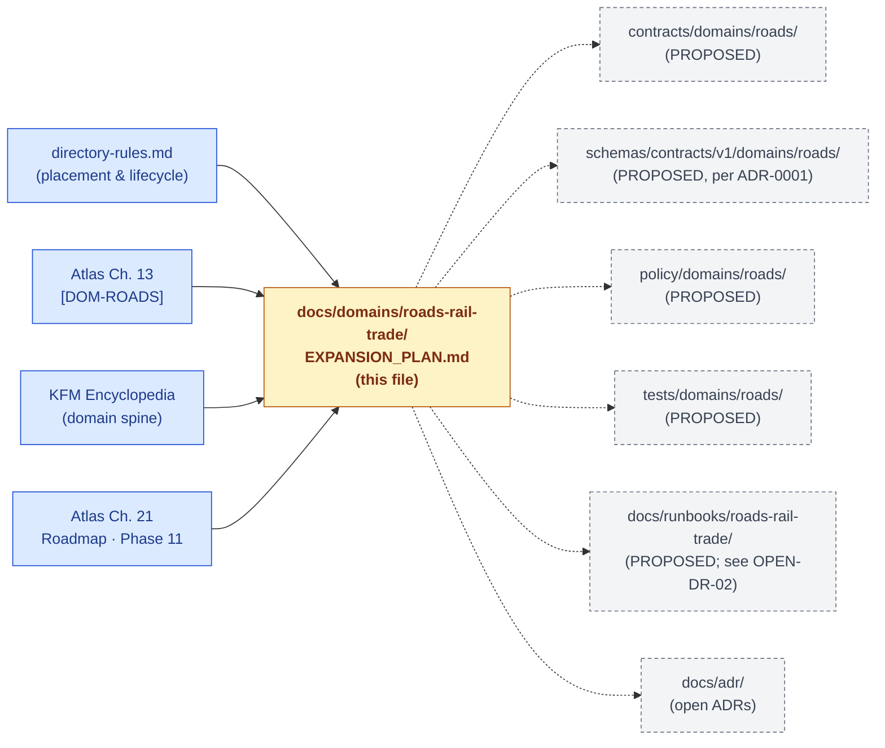
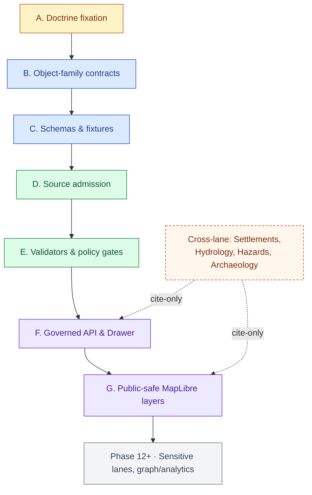

<!-- [KFM_META_BLOCK_V2]
doc_id: kfm://doc/roads-rail-trade-expansion-plan
title: Roads, Rail, and Trade Routes — Expansion Plan
type: standard
version: v0.1
status: draft
owners: TBD (Roads/Rail/Trade-Routes domain steward; KFM core; data steward) — NEEDS VERIFICATION
created: 2026-05-19
updated: 2026-05-19
policy_label: public
related:
  - docs/doctrine/directory-rules.md
  - docs/atlases/KFM_Domains_v1_1_plus_Pass23_Pass32_Consolidated_Atlas.md
  - docs/domains/README.md
  - docs/registers/VERIFICATION_BACKLOG.md
  - docs/adr/
tags: [kfm, roads, rail, trade-routes, domain, expansion, roadmap]
notes:
  - EXPANSION_PLAN.md filename pattern is PROPOSED; ADR may freeze the doc-type
  - Repo not mounted; all implementation-level paths/routes/schemas are PROPOSED
[/KFM_META_BLOCK_V2] -->

# Roads, Rail, and Trade Routes — Expansion Plan

> Phased, governance-first plan for bringing Kansas roads, rail, historic routes, and trade-and-mobility corridors into the KFM trust membrane: RAW → WORK/QUARANTINE → PROCESSED → CATALOG/TRIPLET → PUBLISHED.


**Status:** draft · **Owners:** TBD — _NEEDS VERIFICATION_ · **Last updated:** 2026-05-19

---

## 📑 Contents

1. [Purpose and scope](#1-purpose-and-scope)
2. [Repo fit and authority basis](#2-repo-fit-and-authority-basis)
3. [Doctrinal anchor — what we are expanding into](#3-doctrinal-anchor--what-we-are-expanding-into)
4. [Expansion principles](#4-expansion-principles)
5. [Phased expansion plan](#5-phased-expansion-plan)
6. [Source activation plan](#6-source-activation-plan)
7. [Object family and contract expansion](#7-object-family-and-contract-expansion)
8. [Validator, test, and fixture buildout](#8-validator-test-and-fixture-buildout)
9. [API and governed surface expansion](#9-api-and-governed-surface-expansion)
10. [MapLibre layers and viewing products](#10-maplibre-layers-and-viewing-products)
11. [Sensitivity, rights, and publication posture](#11-sensitivity-rights-and-publication-posture)
12. [Cross-lane integration plan](#12-cross-lane-integration-plan)
13. [Governed AI rollout](#13-governed-ai-rollout)
14. [Verification backlog](#14-verification-backlog)
15. [Open ADRs and decisions needed](#15-open-adrs-and-decisions-needed)
16. [Rollback and failure modes](#16-rollback-and-failure-modes)
17. [Related docs](#17-related-docs)
18. [Appendix — illustrative artifacts](#18-appendix--illustrative-artifacts)

---

## 1. Purpose and scope

**CONFIRMED doctrine, PROPOSED implementation.** This document plans the phased build-out of the Roads, Rail, and Trade Routes domain lane inside KFM. It tracks how doctrine — captured in the Domains v1.1 Consolidated Atlas Ch. 13 [DOM-ROADS] [ENCY] — is expected to land as contracts, schemas, policy, fixtures, validators, governed APIs, MapLibre layers, Evidence Drawer payloads, Focus Mode answers, ReleaseManifests, correction paths, and rollback targets.

The plan covers:

- **What** the domain owns and explicitly does not own.
- **How** the work is sequenced against the master Programming Possibilities Backlog (notably **Phase 11 — Transport and settlements expansion** in the Atlas Ch. 21 roadmap). [DOM-ROADS] [UNIFIED]
- **Which** sources, objects, contracts, schemas, validators, and surfaces are in scope for each phase.
- **Where** open questions and verification debts sit, and **what** evidence would settle them.

> [!IMPORTANT]
> This plan is **doctrine-anchored, implementation-bounded.** No mounted repo, CI, workflow, manifest, dashboard, or runtime log was inspected when this document was authored. Every claim about routes, paths, packages, schemas, tests, and deployment state is **PROPOSED** until verified against the mounted repository.

[↑ back to top](#contents)

---

## 2. Repo fit and authority basis

### 2.1 Where this file lives

**CONFIRMED placement basis.** `docs/domains/roads-rail-trade/` is listed as a canonical domain lane under `docs/` in Directory Rules §6.1. [DIRRULES] The Encyclopedia §5 Per-domain chapter index also routes per-domain chapters to `docs/domains/<domain>/`. [ENCY]

**PROPOSED filename pattern.** `EXPANSION_PLAN.md` as a per-domain doc type is **not yet codified** in Directory Rules or in a documented `docs/domains/<domain>/` template. See [§15 — Open ADRs](#15-open-adrs-and-decisions-needed), open question **OPEN-RRT-01**.

### 2.2 Authority ladder

| Layer | Anchor | Status |
|---|---|---|
| Doctrine | KFM Domains v1.1 Atlas Ch. 13 (Roads, Rail, and Trade Routes); [DOM-ROADS] source dossier | **CONFIRMED** |
| Placement / lifecycle | `directory-rules.md` (Directory Rules) | **CONFIRMED** |
| Cross-domain spine | KFM Encyclopedia (master domain/object/source/capability spine) | **CONFIRMED** |
| Cross-cutting capability | KFM Master MapLibre Components-Functions-Features; Governed AI dossier [GAI] | **CONFIRMED doctrine** |
| Roadmap context | Atlas Ch. 21 Programming Possibilities Backlog (Phase 11) | **CONFIRMED as plan** |
| Implementation (paths, routes, schemas, tests) | none verified in this session | **PROPOSED / NEEDS VERIFICATION** |

### 2.3 Upstream and downstream docs



> [!NOTE]
> Dashed boxes are PROPOSED downstream artifacts. Their existence in the mounted repo is **NEEDS VERIFICATION**.

[↑ back to top](#contents)

---

## 3. Doctrinal anchor — what we are expanding into

The atlas chapter (Atlas Ch. 13) is the doctrinal anchor. The plan does not restate the whole chapter; the items below are the load-bearing facts the expansion follows.

### 3.1 Domain identity (Atlas §13.A)

> **CONFIRMED doctrine / PROPOSED implementation.** Govern Kansas roads, rail, historic routes, trade and mobility corridors, restrictions, facilities, graph projections, catalog/proof/release objects, governed APIs, MapLibre UI, Evidence Drawer, Focus Mode, correction, and rollback. [DOM-ROADS] [ENCY]

### 3.2 What this domain owns (Atlas §13.B)

`Road Segment` · `Historic Route` · `Rail Segment` · `Depot` · `Siding` · `Yard` · `Crossing` · `Bridge` · `Ferry` · `River Crossing` · `Freight Corridor` · `Route Event` · `Operator Status` · `Access Restriction` · `Network Edge` · `Movement Story Node`. [DOM-ROADS] [ENCY]

### 3.3 What this domain explicitly does **not** own (Atlas §13.B)

| Concern | Owner |
|---|---|
| Settlement and infrastructure canonical claims (depot/facility identity) | **Settlements / Infrastructure** [DOM-SETTLE] |
| Water evidence (rivers, fords, flow regimes) | **Hydrology** [DOM-HYD] |
| Cultural site coordinates and Indigenous-corridor truth/sensitivity policy | **Archaeology / Cultural Heritage** [DOM-ARCH] |
| Person, residence, ownership context | **People / DNA / Land** [DOM-PEOPLE] |
| Hazard events, closures, alert authority | **Hazards** [DOM-HAZ] |

> [!WARNING]
> Cross-lane work below MUST preserve ownership. Roads/Rail can **cite** settlement identity, water evidence, or archaeological context, but MUST NOT canonicalize them.

### 3.4 Pipeline shape (Atlas §13.H)

**CONFIRMED doctrine.** `RAW → WORK / QUARANTINE → PROCESSED → CATALOG / TRIPLET → PUBLISHED`, with promotion as a governed state transition, not a file move. [DIRRULES] [DOM-ROADS] [ENCY]

### 3.5 Roadmap position

**CONFIRMED as plan.** Atlas Ch. 21 places Roads/Rail in **Phase 11 — Transport and settlements expansion**, with exit criteria *"road/rail and settlement identity public-safe layers"* and rollback posture *"disable facility layer if leak"*. The governance spine (Phases 0–9) is the precondition for Phase 11. [DOM-ROADS] [UNIFIED]

[↑ back to top](#contents)

---

## 4. Expansion principles

These are not new rules — they are the operating doctrine the expansion follows.

1. **CONFIRMED:** Build the governance spine first. Source ledger, schemas, fixtures, validators, policy gates, EvidenceBundle closure, finite envelopes, release manifests, correction path, rollback targets — before any public feature. [ENCY] [UNIFIED]
2. **CONFIRMED:** Cite-or-abstain default. Public Roads/Rail claims resolve `EvidenceRef → EvidenceBundle` or **ABSTAIN**. AI never roots truth. [GAI] [ENCY]
3. **CONFIRMED:** Deny-by-default for sensitive content. Indigenous trade and mobility corridors, treaty, cultural, and interpretive evidence default to steward review and generalized public geometry. Critical transport facilities require review. [DOM-ROADS]
4. **CONFIRMED:** Promotion is a governed state transition. The pipeline does not skip stages, and watchers never publish. [DIRRULES]
5. **CONFIRMED:** Responsibility-rooted placement. Domain content lives **inside** responsibility roots (`contracts/`, `schemas/`, `policy/`, `tests/`, `data/`, `release/`, `docs/`), not as a root-level domain folder. [DIRRULES §3, §12]
6. **PROPOSED:** Smallest reversible change. Prefer adapters, validators, fixtures, and ADRs over broad rewrites. Backward compatibility is preferred but documented breakage is acceptable.

[↑ back to top](#contents)

---

## 5. Phased expansion plan

Phasing aligns with the master roadmap. **Phase 11 of the master roadmap is decomposed here into Roads/Rail-specific sub-phases A–G.** Each sub-phase carries a doctrinal anchor, an exit criterion, and a failure/rollback posture.

> [!NOTE]
> Phase numbering inside this domain (A–G) is **PROPOSED** and is **not** a parallel master-roadmap renumbering. It is a finer-grained decomposition of master-roadmap Phase 11 for the Roads/Rail/Trade-Routes lane only.

| Sub-phase | Scope | Exit criterion | Rollback posture | Anchor |
|---|---|---|---|---|
| **A · Doctrine fixation** | Atlas Ch. 13 reviewed; this `EXPANSION_PLAN.md` accepted; open ADRs filed (see §15) | Plan accepted; open questions tracked in `docs/registers/VERIFICATION_BACKLOG.md` | Revert this doc; preserve correction note | §3, §15 |
| **B · Object-family contracts** | Markdown contracts for the 16 owned objects under `contracts/domains/roads/` (PROPOSED) | Each contract names purpose, identity rule, temporal handling, evidence linkage | Per-contract revert | §7 |
| **C · Schemas and no-network fixtures** | JSON Schemas under `schemas/contracts/v1/domains/roads/` (PROPOSED, per ADR-0001); valid/invalid fixtures | Schema validation passes on fixtures; invalid fixtures fail closed | Remove schema wave if ADR shifts | §7 |
| **D · Source admission & quarantine** | `SourceDescriptor` records for each source family (§6); rights/terms reviewed; admission gated | Each admitted source has descriptor + rights state + review record | Disable source descriptor | §6 |
| **E · Validators & policy gates** | Domain-specific validators (§8); deny-by-default tests; receipts for transforms | Reason-coded `DENY / ABSTAIN / ERROR / HOLD` outcomes pass | Disable only if stronger gate replaces | §8 |
| **F · Governed API & Evidence Drawer** | Roads/Rail feature/detail resolver, layer manifest resolver, Evidence Drawer payload, Focus Mode (§9, §10) | Released layer click opens Evidence Drawer; Focus Mode answers cite or ABSTAIN | Disable route or revert alias | §9 |
| **G · Public-safe MapLibre layers** | Modern roads, rail alignment, facilities/crossings, restriction timeline, freight corridor, historic claims, trade corridors, derived graph (§10) | Phase 11 master exit criterion: *"road/rail and settlement identity public-safe layers"* | *"disable facility layer if leak"* (master roadmap Phase 11 rollback) | §10, [UNIFIED] |

### 5.1 Dependency overview



> [!IMPORTANT]
> Sub-phase ordering reflects doctrine, **not a verified project plan**. No calendar dates, sprint allocations, or owner assignments are asserted here.

[↑ back to top](#contents)

---

## 6. Source activation plan

**CONFIRMED source families (Atlas §13.D).** [DOM-ROADS] [ENCY] Each row is **NEEDS VERIFICATION** for rights/terms/cadence/steward and **PROPOSED** for any specific endpoint, version, or activation state.

| Source family | Role (per source role taxonomy) | Rights / terms | Freshness / cadence | Activation status |
|---|---|---|---|---|
| Census TIGER/Line roads | authority / observation / context / model (per source role) | NEEDS VERIFICATION | source-vintage specific | NEEDS VERIFICATION |
| FHWA HPMS | authority / observation / context / model | NEEDS VERIFICATION | source-vintage specific | NEEDS VERIFICATION |
| FHWA National Highway Freight Network | authority / observation / context / model | NEEDS VERIFICATION | source-vintage specific | NEEDS VERIFICATION |
| WZDx feeds | authority / observation / context / model | NEEDS VERIFICATION | live / cadence specific | NEEDS VERIFICATION |
| KDOT / KanPlan / KanDrive / Kansas GIS | authority / observation / context / model | NEEDS VERIFICATION | source-vintage specific | NEEDS VERIFICATION |
| County / state bridge and restriction data | authority / observation / context / model | NEEDS VERIFICATION | source-vintage specific | NEEDS VERIFICATION |
| GNIS names | authority / observation / context / model | NEEDS VERIFICATION | source-vintage specific | NEEDS VERIFICATION |
| OpenStreetMap | authority / observation / context / model | NEEDS VERIFICATION (ODbL terms) | continuous; tile/dump cadence | NEEDS VERIFICATION |

> [!CAUTION]
> Per Atlas §13.K, **OSM and GNIS legal-status denial** is a PROPOSED validator. OSM tags and GNIS names MUST NOT be treated as legal-status authority. Use them as `context` or `observation` source roles only, with explicit deny tests on legal-status claims. [DOM-ROADS]

### 6.1 Activation checklist (per source, before admission)

<details>
<summary><b>Per-source activation checklist</b> (PROPOSED — derive from Atlas §13 and Directory Rules)</summary>

- [ ] **SourceDescriptor** exists and carries source role, rights, citation, time, hash. (Atlas §13.H · RAW gate.)
- [ ] **Rights and terms** reviewed; license / ODbL / data-use note recorded.
- [ ] **Steward / authority** identified; steward review note attached if culturally sensitive.
- [ ] **Cadence and freshness state** assigned (live / periodic / one-shot / archival).
- [ ] **Source-role taxonomy** assigned per Atlas Source-Role Anti-Collapse Register (Ch. 24.1).
- [ ] **Sensitivity classification** assigned; default deny path for unclear cases.
- [ ] **Quarantine reason codes** enumerated for known failure modes.
- [ ] **No-network fixture** included in `tests/domains/roads/` (PROPOSED path).
- [ ] **Live connector activation** opt-in only; never default-on.

</details>

[↑ back to top](#contents)

---

## 7. Object family and contract expansion

**CONFIRMED owned-object inventory (Atlas §13.B, §13.E).** [DOM-ROADS] [ENCY]

| Object family | Owned by | Contract status | Schema status | Notes |
|---|---|---|---|---|
| `Road Segment` | this domain | PROPOSED | PROPOSED | Identity: source id + object role + temporal scope + normalized digest |
| `Rail Segment` | this domain | PROPOSED | PROPOSED | Same identity pattern |
| `Crossing` | this domain | PROPOSED | PROPOSED | Cross-lane: settlements & hydrology |
| `Bridge` | this domain | PROPOSED | PROPOSED | Cross-lane: hydrology (river crossings) |
| `Ferry` | this domain | PROPOSED | PROPOSED | Historical and modern variants |
| `River Crossing` | this domain (cited from hydrology) | PROPOSED | PROPOSED | Hydrology owns water evidence |
| `Depot` · `Siding` · `Yard` | this domain (cited from settlements) | PROPOSED | PROPOSED | Settlements owns facility identity |
| `TransportFacility` | this domain (cited from settlements) | PROPOSED | PROPOSED | "facility identity is settlement-owned" [DOM-ROADS] |
| `Freight Corridor` | this domain | PROPOSED | PROPOSED | FHWA NHFN as principal source |
| `Route Event` · `Operator Status` · `Access Restriction` | this domain | PROPOSED | PROPOSED | Temporal: distinct source/observed/valid/retrieval/release/correction times |
| `Network Edge` · `Network Node` | this domain | PROPOSED | PROPOSED | Graph projection objects |
| `Historic Route` · `Historic RouteClaim` | this domain | PROPOSED | PROPOSED | Sensitive geometry by default |
| `TradeRouteCorridor` | this domain | PROPOSED | PROPOSED | Generalized public geometry by default |
| `Movement Story Node` | this domain | PROPOSED | PROPOSED | Narrative anchor; CARE/sensitivity gates apply |
| `RestrictionEvent` · `StatusEvent` · `OperatorAssignment` | this domain | PROPOSED | PROPOSED | Temporal event records |
| `RouteUncertaintyProfile` | this domain | **NEEDS IMPLEMENTATION** | PROPOSED | Atlas §13.N verification item |

### 7.1 Contract & schema home (per Directory Rules)

- **Contracts (semantic Markdown):** `contracts/domains/roads/` (**PROPOSED** — per Directory Rules §6.3 pattern).
- **Schemas (machine-checkable shape):** `schemas/contracts/v1/domains/roads/` (**PROPOSED** — per ADR-0001 default schema home).
- **Policy (admissibility):** `policy/domains/roads/` (**PROPOSED** — per Directory Rules §6.x pattern; default `policy/` per inspection).
- **Tests / fixtures:** `tests/domains/roads/` and `schemas/tests/{valid,invalid}/domains/roads/` (**PROPOSED**).

> [!NOTE]
> Per **ADR-0001** (default schema home is `schemas/contracts/v1/...`), any draft schemas authored under `contracts/<domain>/<x>.schema.json` are **CONFLICTED lineage** and MUST migrate before any new schema lands. [DIRRULES §6.4]

[↑ back to top](#contents)

---

## 8. Validator, test, and fixture buildout

**CONFIRMED PROPOSED validator list (Atlas §13.K).** [DOM-ROADS] [ENCY]

| # | Validator / test | Class | Status |
|---|---|---|---|
| 1 | Route membership and designation separation tests | invariant | PROPOSED |
| 2 | Operator / status temporal tests | invariant | PROPOSED |
| 3 | OSM / GNIS legal-status denial | deny-by-default | PROPOSED |
| 4 | Historic overprecision denial | deny-by-default | PROPOSED |
| 5 | Public generalization receipt tests | transform receipt | PROPOSED |
| 6 | Transport graph projection rollback tests | rollback / drill | PROPOSED |

### 8.1 Test orchestration

**PROPOSED.** Validators integrate with the repo-wide validator orchestrator. The Directory Rules drift register lists *"validator orchestration drift (CI calling individual validators instead of `tools/validators/validate_all.py`)"* as a v1.1-added anti-pattern. [DIRRULES §13.5] Roads/Rail validators MUST be reachable through the single orchestrator entry point once it is finalized (see **OPEN-DR-03** validator exit-code contract).

### 8.2 No-network fixture inventory (PROPOSED)

<details>
<summary><b>Suggested fixture coverage</b> — illustrative, not yet authored</summary>

- Valid: a single Census TIGER/Line road segment with full temporal stack (source/observed/valid/retrieval).
- Valid: an FHWA NHFN freight corridor with route designation + operator status event.
- Valid: a rail alignment with operator change and abandonment event.
- Valid: a crossing object that cites hydrology bridge evidence without canonicalizing water.
- Invalid: OSM tag asserting legal restriction class (should DENY).
- Invalid: GNIS name used as legal-route-designation authority (should DENY).
- Invalid: historic-route claim with exact coordinates and no generalization receipt (should DENY).
- Invalid: missing rollback target on a published facility layer (should DENY).
- Invalid: transport-graph projection without source `EvidenceBundle` (should DENY/ABSTAIN).

Fixture file homes are **PROPOSED**; coverage is **PROPOSED**; the list is **illustrative**, not exhaustive.

</details>

[↑ back to top](#contents)

---

## 9. API and governed surface expansion

**CONFIRMED PROPOSED governed surfaces (Atlas §13.J).** [DOM-ROADS] [ENCY]

| Endpoint or artifact | DTO / schema | Outcomes | Status |
|---|---|---|---|
| Roads/Rail feature/detail resolver (route TBD) | `RoadsRailDecisionEnvelope` | `ANSWER` / `ABSTAIN` / `DENY` / `ERROR` | PROPOSED; exact route **UNKNOWN** |
| Roads/Rail layer manifest resolver | `LayerManifest` / domain layer descriptor | `ANSWER` / `DENY` / `ERROR` | PROPOSED; public-safe release only |
| Roads/Rail Evidence Drawer payload | `EvidenceDrawerPayload` + `EvidenceBundle` projection | `ANSWER` / `ABSTAIN` / `DENY` / `ERROR` | PROPOSED; evidence & policy filtered |
| Roads/Rail Focus Mode answer | `RuntimeResponseEnvelope` + `AIReceipt` | `ANSWER` / `ABSTAIN` / `DENY` / `ERROR` | PROPOSED; AI never root truth |
| Schema responsibility root | `schemas/contracts/v1/` | finite validator outcomes | PROPOSED; verify with Directory Rules and ADR [DIRRULES] |

> [!WARNING]
> **Trust membrane.** Per Directory Rules §13.5 anti-pattern *"public route reads canonical store"*, the public Roads/Rail surfaces MUST be served by the governed API (`apps/governed-api/`, PROPOSED path), never by direct reads of `data/processed/`, `data/catalog/`, or `data/triplets/`.

### 9.1 Envelope shape (illustrative)

```text
RoadsRailDecisionEnvelope
├─ outcome           ∈ {ANSWER, ABSTAIN, DENY, ERROR}
├─ reasons[]         deterministic reason codes
├─ subject           e.g., Road Segment / RestrictionEvent / Corridor
├─ evidence_refs[]   resolved-only EvidenceBundle references
├─ policy_decision   PolicyDecision (release, sensitivity, rights, role)
├─ release_state     released / unreleased / stale / superseded
├─ correction_ref?   if a correction exists
├─ rollback_ref?     if the surface is in a rollback window
└─ ai_receipt?       only when AI participated; otherwise absent
```

The above is **illustrative**; field names align with cross-cutting envelopes catalogued in [MAP-MASTER] M (`MapReleaseManifest`, `EvidenceDrawerPayload`, `FocusModeRequest/Response`, `AIReceipt`, `PolicyDecision`).

[↑ back to top](#contents)

---

## 10. MapLibre layers and viewing products

**CONFIRMED PROPOSED viewing products (Atlas §13.G).** [DOM-ROADS] [ENCY]

| Layer / product | Purpose | Sensitivity default | Status |
|---|---|---|---|
| Modern roads layer | TIGER/HPMS-anchored network at current vintage | public | PROPOSED |
| Rail alignment layer | Current and historical rail alignments | public; historic alignment may be generalized | PROPOSED |
| Facility / crossing view | Crossings, bridges, ferries, depots (cited from settlements) | public for non-critical; review for critical | PROPOSED |
| Restriction / status timeline | Time-aware `RestrictionEvent` / `StatusEvent` | public | PROPOSED |
| Freight-corridor context | FHWA NHFN corridors as context | public | PROPOSED |
| Historic route claim view | `HistoricRouteClaim` over time | **default review + generalized geometry** | PROPOSED |
| Generalized trade-route corridor | `TradeRouteCorridor` (Indigenous, treaty, oral history corridors) | **default generalized; steward review** | PROPOSED |
| Derived graph / connectivity view | `NetworkEdge` / `NetworkNode` projection | public-safe; rollback target required | PROPOSED |

### 10.1 Cross-cutting viewing products (Atlas, Master MapLibre)

**CONFIRMED doctrine.** All Roads/Rail layers inherit cross-cutting viewing products: **Evidence Drawer**, time-aware state, trust badges, sensitivity-redacted view, correction / stale-state view, and governed **Focus Mode**. [MAP-MASTER] [GAI]

### 10.2 Layer manifest fields (per [MAP-MASTER] §M)

A `LayerManifest` entry for any Roads/Rail layer carries:

- `layer_id`, `title`, `domain` (`roads-rail-trade`)
- source refs, source-layer, style refs
- time extent
- `evidence_refs` (resolve to `EvidenceBundle`)
- `policy_state` (sensitivity, rights, release)
- `stale_state`, `public_safe` flag
- links to `StyleManifest`, `TileArtifactManifest`, `MapReleaseManifest`, `RollbackCard`

> [!NOTE]
> Layer-manifest field names above are **CONFIRMED in [MAP-MASTER] doctrine**; whether they appear under those exact keys in the mounted repo is **NEEDS VERIFICATION**.

[↑ back to top](#contents)

---

## 11. Sensitivity, rights, and publication posture

**CONFIRMED / PROPOSED (Atlas §13.I).** [DOM-ROADS] [ENCY]

> Indigenous trade and mobility corridors, oral history, treaty, cultural, and interpretive evidence default to **steward review and generalized public geometry**. Critical transport facilities require review.

**CONFIRMED doctrine (cross-cutting).** Unclear rights, unresolved source role, missing evidence, unresolved sensitivity, or absent release state **blocks public promotion**. [ENCY] [DIRRULES]

### 11.1 Deny-by-default register (Roads/Rail relevant rows)

| Surface | Denied by default | Allowed only when |
|---|---|---|
| Historic / Indigenous trade corridors (exact geometry) | exact coordinates, named sacred associations | steward review + transform receipt + EvidenceBundle |
| Critical transport facilities (detail) | exact attributes that aid targeting | steward review + public-safe generalization |
| Cross-lane archaeology associations | exact site coordinates pulled in via corridor join | denied — site coords stay archaeology-owned [DOM-ARCH] |
| AI summarization of restricted evidence | uncited or restricted prompt/output | `EvidenceBundle` + policy-safe context + `AIReceipt` [GAI] |

### 11.2 Publication closure

**CONFIRMED doctrine / PROPOSED implementation (Atlas §13.M).** Roads/Rail publication requires:

- `ReleaseManifest`
- `EvidenceBundle`
- validation / policy support
- review state where required
- correction path
- stale-state rule
- rollback target

[↑ back to top](#contents)

---

## 12. Cross-lane integration plan

**CONFIRMED relations (Atlas §13.F; Ch. 24.4.11).** [DOM-ROADS] [ENCY]

| This domain | Related lane | Relation | Constraint |
|---|---|---|---|
| Roads/Rail | Settlements / Infrastructure | depots, crossings, facilities, dependencies | preserve ownership, source role, sensitivity, EvidenceBundle support; **facility identity is settlement-owned** |
| Roads/Rail | Hydrology | bridge / ferry / ford / river crossing | preserve water-evidence ownership in hydrology |
| Roads/Rail | Hazards | closure, detour, flood / fire / smoke exposure | hazards remain hazard-owned; KFM is never alert authority [DOM-HAZ] |
| Roads/Rail | Archaeology / Cultural Heritage | historic routes, Indigenous corridors, forts, missions | exact archaeological coordinates **denied** in corridor context |
| Roads/Rail | Frontier Matrix | access observations bound the access cells | [UNIFIED] |

### 12.1 Cross-lane integration rules

1. **Cite, never canonicalize.** Roads/Rail joins to settlement facility records cite settlement identity; the source of truth stays in `docs/domains/settlements-infrastructure/`.
2. **Sensitivity follows the most-restrictive lane.** When a corridor surface joins archaeology context, the archaeology sensitivity policy applies to the joined view, not the corridor's lighter default.
3. **EvidenceBundle support is per-claim.** A multi-lane claim resolves all referenced `EvidenceRef`s before publication.
4. **No emergency-alert routing.** Hazards-sourced closures may be cited as context but never published as life-safety instruction. [DOM-HAZ]

[↑ back to top](#contents)

---

## 13. Governed AI rollout

**CONFIRMED doctrine / PROPOSED implementation (Atlas §13.L).** [GAI] [DOM-ROADS] [ENCY]

AI in this lane MAY:

- summarize released Roads/Rail `EvidenceBundle`s
- compare evidence
- explain limitations
- draft steward-review notes

AI in this lane MUST:

- `ABSTAIN` when evidence is insufficient
- `DENY` where policy, rights, sensitivity, or release state blocks the request
- emit an `AIReceipt` and validate citations
- never act as root truth source

> [!IMPORTANT]
> Per the Governed AI dossier, **EvidenceBundle outranks generated language.** The preferred order is: scope → retrieve evidence → resolve `EvidenceRef` → apply policy/sensitivity → answer with traceability or narrowed scope. [GAI]

[↑ back to top](#contents)

---

## 14. Verification backlog

**CONFIRMED PROPOSED items (Atlas §13.N).** [DOM-ROADS] [ENCY] These four open items are the doctrinal verification backlog for the Roads/Rail/Trade-Routes lane.

| # | Item to verify | Evidence that would settle it | Status |
|---|---|---|---|
| RRT-VB-01 | Verify **KDOT / FHWA / FRA / WZDx / source terms** (rights, license, cadence) | mounted repo source ledger, rights records, connector configs, terms-of-use receipts | NEEDS VERIFICATION |
| RRT-VB-02 | Verify **Indigenous / cultural corridor policy** (steward review pathway, generalization rule) | policy bundle, steward review records, transform receipts, ADR | NEEDS VERIFICATION |
| RRT-VB-03 | Implement **`RouteUncertaintyProfile`** (per Atlas §13.N) | contract, schema, fixtures, validator, publication test | NEEDS VERIFICATION |
| RRT-VB-04 | Verify **transport graph and MapLibre integration** (graph projection rollback, drawer click, layer manifest) | release manifest, layer manifest, drawer-click test, rollback drill | NEEDS VERIFICATION |

These items SHOULD be tracked in `docs/registers/VERIFICATION_BACKLOG.md` (PROPOSED canonical register per Directory Rules §6.1).

[↑ back to top](#contents)

---

## 15. Open ADRs and decisions needed

PROPOSED ADRs surfaced by this expansion plan:

| ID | Subject | Class | Why ADR-class |
|---|---|---|---|
| **OPEN-RRT-01** | Per-domain `EXPANSION_PLAN.md` doc type — codify or fold into the per-domain README | Doc-template | Standardizes a cross-domain doc pattern; per Directory Rules §17 a new convention crossing multiple domains is reviewer-class, not ADR-class — but if it materially changes per-domain doc home, escalate. |
| **OPEN-RRT-02** | Schema home for Roads/Rail (resolve against ADR-0001) | Schema-home | If contracts in `contracts/domains/roads/` already exist as machine schemas, migration plan required. [DIRRULES §6.4] |
| **OPEN-RRT-03** | Indigenous / cultural corridor policy gate (review pathway, generalization rule, transform receipt) | Policy / governance | Cultural-data policy with sovereignty implications is decision-of-record. |
| **OPEN-RRT-04** | `RouteUncertaintyProfile` object identity, schema, and publication rule | Object-family | Atlas §13.N flags it as a verification item; once specified, the object becomes part of the domain spine. |
| **OPEN-RRT-05** | Transport-graph projection rollback contract (drill cadence, manifest fields, atomic revert) | Release-discipline | Spans `release/` and `data/triplets/` lanes. |
| **OPEN-RRT-06** | Cross-lane edge contract Roads ↔ Settlements (facility identity ownership boundary) | Cross-lane | Confirms "facility identity is settlement-owned" as an enforced invariant, not just doctrine. |

> [!NOTE]
> Naming and numbering are **PROPOSED**. The repo's actual ADR registry may already cover one or more of these — verification needed.

[↑ back to top](#contents)

---

## 16. Rollback and failure modes

**CONFIRMED doctrine, PROPOSED implementation.** Rollback posture aligned with Atlas Ch. 21 Phase 11 and Atlas §13.M.

| Failure mode | Detection | Rollback action |
|---|---|---|
| Sensitive corridor geometry leaks at public precision | policy gate audit, drift register, post-publication review | revert layer registry entry; emit `RollbackCard`; preserve original `EvidenceBundle` |
| Critical-facility detail leaks | review/exposure audit | disable facility layer (master Phase 11 rollback posture) |
| Transport-graph projection drifts from source `EvidenceBundle` | digest mismatch on projection rebuild | rebuild graph from `EvidenceBundle` or disable derived view |
| WZDx or live source goes stale | freshness gate | mark `stale_state` on layer manifest; ABSTAIN on live answers |
| AI surface answers without citation closure | citation validation fails | disable AI adapter for the lane; preserve `AIReceipt` for audit |
| Schema or contract drift between `contracts/` and `schemas/` | CI mirror diff | freeze old; migrate per **ADR-0001**; emit drift entry [DIRRULES §13.5] |

### 16.1 Anti-patterns to prevent

<details>
<summary><b>Roads/Rail-specific anti-pattern register</b> (extends Directory Rules §13.5)</summary>

| Anti-pattern | Symptom | Fix |
|---|---|---|
| **Treating OSM/GNIS as legal authority** | Public-route designations derived from OSM `highway=*` tags or GNIS names | Source role `context` / `observation` only; validator #3 must DENY legal-status claims from these sources. |
| **Canonicalizing facility identity inside Roads/Rail** | Depot/yard identity asserted as Roads/Rail-owned | Cite settlement record; facility identity stays settlement-owned. |
| **Publishing exact historic-corridor geometry without review** | Indigenous / oral / treaty corridor with full-precision public geometry | Default review + generalization; validator #4 must DENY overprecision. |
| **AI answers without `EvidenceBundle` resolution** | Focus Mode `ANSWER` with `evidence_refs[]` empty | ABSTAIN; emit `AIReceipt` with reason. |
| **Direct read of `data/processed/` by web shell** | Roads layer reads canonical store | Route through `apps/governed-api/`. [DIRRULES §13.5] |
| **Watcher publishing live WZDx feed to `data/published/`** | Live-feed worker bypasses promotion gates | Watcher emits to `data/raw/` or `data/quarantine/`; pipeline promotes. [DIRRULES §13.5] |

</details>

[↑ back to top](#contents)

---

## 17. Related docs

- [`docs/doctrine/directory-rules.md`](../../doctrine/directory-rules.md) — **CONFIRMED authority** for placement and lifecycle
- [`docs/domains/README.md`](../README.md) — **PROPOSED** (per Directory Rules §6.1 tree)
- [`docs/atlases/`](../../atlases/) — KFM Domains v1.1 Consolidated Atlas (Ch. 13 anchor)
- [`docs/registers/VERIFICATION_BACKLOG.md`](../../registers/VERIFICATION_BACKLOG.md) — **PROPOSED** canonical register home
- [`docs/adr/`](../../adr/) — Open ADRs from §15 land here
- `docs/runbooks/roads-rail-trade/` — **PROPOSED** runbook home (subfolder pattern; see **OPEN-DR-02** in Directory Rules §18)
- `contracts/domains/roads/`, `schemas/contracts/v1/domains/roads/`, `policy/domains/roads/`, `tests/domains/roads/` — **PROPOSED** implementation roots

Sibling domain expansion plans (if/when authored under the same pattern):

- `docs/domains/settlements-infrastructure/EXPANSION_PLAN.md` — **PROPOSED**
- `docs/domains/hydrology/EXPANSION_PLAN.md` — **PROPOSED**
- `docs/domains/archaeology/EXPANSION_PLAN.md` — **PROPOSED**

[↑ back to top](#contents)

---

## 18. Appendix — illustrative artifacts

<details>
<summary><b>A. Illustrative `SourceDescriptor` shape (PROPOSED)</b></summary>

```yaml
# PROPOSED · illustrative only · do not treat as schema authority
source_id: kfm-src-kdot-roads-2026q2
domain: roads-rail-trade
source_family: KDOT / KanPlan / KanDrive / Kansas GIS
source_role: authority           # one of {authority, observation, context, model}
rights:
  license: NEEDS_VERIFICATION
  terms_ref: NEEDS_VERIFICATION
  steward: NEEDS_VERIFICATION
sensitivity:
  default: public
  exceptions: []                 # populated for critical-facility joins
freshness:
  cadence: NEEDS_VERIFICATION
  stale_after: NEEDS_VERIFICATION
citation:
  short_name: KDOT-2026Q2
  full: NEEDS_VERIFICATION
time:
  observed: NEEDS_VERIFICATION
  retrieved: NEEDS_VERIFICATION
hash: NEEDS_VERIFICATION
```

</details>

<details>
<summary><b>B. Illustrative deny-test (PROPOSED — OSM legal-status denial)</b></summary>

```yaml
# PROPOSED · illustrative · validator #3 (Atlas §13.K)
test_id: roads.osm-gnis.legal-status.deny
given:
  source: openstreetmap
  source_role: context
  feature_tags:
    highway: motorway
    legal_designation_claim: "US-50"
when:
  publish_as: legal_route_designation
expect:
  outcome: DENY
  reasons:
    - osm_not_legal_authority
    - legal_designation_requires_authority_source_role
```

</details>

<details>
<summary><b>C. Illustrative roadmap-phase exit gate (PROPOSED)</b></summary>

```text
Phase 11 (master) · Roads/Rail · sub-phase G exit:

  ALL OF:
   ✓ released LayerManifest for ≥1 of {modern roads, rail alignment, crossings}
   ✓ released layer click resolves to EvidenceDrawerPayload
   ✓ EvidenceBundle closure passes
   ✓ PolicyDecision returns ANSWER or DENY (no leak path)
   ✓ rollback target present; RollbackCard rehearsable
   ✓ Focus Mode answer cites or ABSTAINs (AIReceipt emitted)
   ✓ no public route reads data/processed/ directly
   ✓ deny-by-default holds for: OSM/GNIS legal-status, historic overprecision,
     critical-facility detail, Indigenous corridor exact geometry
```

</details>

[↑ back to top](#contents)

---

<sub>**Last updated:** 2026-05-19 · **Doc version:** v0.1 (draft) · **Anchor:** KFM Domains v1.1 Atlas Ch. 13 [DOM-ROADS] [ENCY] · [↑ back to top](#contents)</sub>
