<!-- [KFM_META_BLOCK_V2]
doc_id: kfm://doc/docs.domains.roads-rail-trade.file-system-plan
title: Roads, Rail, and Trade — File-System Plan
type: standard
version: v0.2
status: draft
owners: Roads/Rail/Trade domain steward (PLACEHOLDER) + Directory Rules steward (PLACEHOLDER)
created: 2026-05-19
updated: 2026-06-07
policy_label: public
related:
  - docs/doctrine/directory-rules.md
  - docs/domains/roads-rail-trade/README.md
  - docs/domains/roads-rail-trade/DATA_LIFECYCLE.md
  - docs/domains/roads-rail-trade/EXPANSION_BACKLOG.md
  - docs/atlases/KFM_Domains_Culmination_Atlas_v1_1.pdf
  - docs/adr/ADR-0001-schema-home.md
  - docs/registers/DRIFT_REGISTER.md
  - docs/registers/VERIFICATION_BACKLOG.md
  - ai-build-operating-contract.md            # CONTRACT_VERSION = "3.0.0"
tags: [kfm, domain, roads-rail-trade, transport, file-system, placement, directory-rules]
notes:
  - CONTRACT_VERSION = "3.0.0" pinned; doctrine-adjacent placement plan.
  - Lane spread across responsibility roots per Directory Rules §12 (Domain Placement Law), which names "roads-rail-trade" verbatim as a canonical domain segment.
  - Surfaces an unresolved naming conflict between domains/roads-rail-trade/ (Directory Rules §12) and transport/ (Atlas v1.1 §24.13 + Encyclopedia §7.1 crosswalk) — see OPEN-RRT-FSP-01; the deep-research report labels this a slug drift requiring ADR resolution.
  - Mounted-repo presence of every path here is NEEDS VERIFICATION, except where a CONFIRMED live-repo drift is cited in §9.
[/KFM_META_BLOCK_V2] -->

# Roads, Rail, and Trade — File-System Plan

> The placement plan for the Roads / Rail / Trade Routes domain across every KFM responsibility root, governed by Directory Rules §12. A domain lane, not a root folder.


**Status:** draft · **Owners:** Roads/Rail/Trade steward (PLACEHOLDER) + Directory Rules steward (PLACEHOLDER) · **Last updated:** 2026-06-07

---

## Contents

- [0. Status & Authority](#0-status--authority)
- [1. Scope of this Plan](#1-scope-of-this-plan)
- [2. Doctrine Foundations](#2-doctrine-foundations)
- [3. The Lane Pattern at a Glance](#3-the-lane-pattern-at-a-glance)
- [4. Domain Identity Recap](#4-domain-identity-recap)
- [5. Per-Responsibility-Root Layout](#5-per-responsibility-root-layout)
  - [5.1 `docs/domains/roads-rail-trade/`](#51-docsdomainsroads-rail-trade)
  - [5.2 `contracts/domains/roads-rail-trade/`](#52-contractsdomainsroads-rail-trade)
  - [5.3 `schemas/contracts/v1/domains/roads-rail-trade/`](#53-schemascontractsv1domainsroads-rail-trade)
  - [5.4 `policy/domains/roads-rail-trade/`](#54-policydomainsroads-rail-trade)
  - [5.5 `tests/` and `fixtures/`](#55-tests-and-fixtures)
  - [5.6 `packages/domains/roads-rail-trade/`](#56-packagesdomainsroads-rail-trade)
  - [5.7 `pipelines/domains/roads-rail-trade/` and `pipeline_specs/roads-rail-trade/`](#57-pipelinesdomainsroads-rail-trade-and-pipeline_specsroads-rail-trade)
  - [5.8 `data/<phase>/roads-rail-trade/`](#58-dataphaseroads-rail-trade)
  - [5.9 `data/registry/sources/roads-rail-trade/`](#59-dataregistrysourcesroads-rail-trade)
  - [5.10 `release/candidates/roads-rail-trade/`](#510-releasecandidatesroads-rail-trade)
  - [5.11 `connectors/`](#511-connectors)
- [6. Cross-Lane and Cross-Domain Files](#6-cross-lane-and-cross-domain-files)
- [7. Placement Matrix](#7-placement-matrix)
- [8. Sensitivity, Rights, and Deny-Lane Placement](#8-sensitivity-rights-and-deny-lane-placement)
- [9. Drift Watchlist](#9-drift-watchlist)
- [10. Open Questions and Verification Backlog](#10-open-questions-and-verification-backlog)
- [11. Changelog](#11-changelog)
- [12. Definition of Done](#12-definition-of-done)
- [13. Related Docs](#13-related-docs)
- [14. Appendix — Full Exhaustive Tree (collapsible)](#14-appendix--full-exhaustive-tree-collapsible)

---

## 0. Status & Authority

| Field | Value |
|---|---|
| **Document type** | Standard / placement plan (domain-scoped) |
| **Edition** | v0.2 — adds Changelog + Definition of Done; reconciles section anchors; pins `CONTRACT_VERSION` |
| **Authority of this plan** | **PROPOSED** layout / **CONFIRMED** placement law (Directory Rules §12) |
| **Authority of any quoted repo path** | **NEEDS VERIFICATION** until mounted-repo inspection (except CONFIRMED live-repo drifts cited in §9) |
| **Owner** | Roads/Rail/Trade steward (PLACEHOLDER) + Directory Rules steward (PLACEHOLDER) |
| **Reviewers required for change** | Domain steward + Directory Rules steward; ADR required if a canonical root or schema-home rule is touched |
| **Supersedes** | v0.1 (initial authoring, 2026-05-19) |
| **Superseded by** | Nothing (current) |
| **Related doctrine** | `docs/doctrine/directory-rules.md` §§3, 5, 9, 12, 13.1, 13.5, 15; `docs/adr/ADR-0001-schema-home.md`; Atlas v1.1 Ch. 13 + Ch. 24.13; `ai-build-operating-contract.md` v3.0 |
| **Lifecycle posture** | Doc artifact; not a lifecycle data object |
| **Last reviewed** | 2026-06-07 (authoring session) |

> [!CAUTION]
> **Memory is not evidence.** Every concrete repository-state claim in this plan is **NEEDS VERIFICATION** until checked against a mounted KFM repo, except where §9 cites a CONFIRMED live-repo drift. Where the plan says "this lives at X," read it as "Directory Rules §12 + Atlas v1.1 doctrine require this to live at X; mounted-repo presence is unverified."

[↑ back to top](#roads-rail-and-trade--file-system-plan)

---

## 1. Scope of this Plan

This document specifies **where Roads/Rail/Trade domain artifacts go** across every responsibility root in the KFM monorepo. It is the placement counterpart to the rest of this domain's dossier (the `README.md`, `DATA_LIFECYCLE.md`, `EXPANSION_BACKLOG.md`, `ARCHITECTURE.md`, etc.) — those files describe *what* the domain owns and *how* it behaves; this file describes *where* each artifact must live.

**In scope**

- The lane spread for Roads/Rail/Trade across all canonical responsibility roots.
- Cross-lane placement guidance for files that legitimately span Roads/Rail and another domain (Settlements/Infrastructure, Hydrology, Hazards, Archaeology/Cultural Heritage).
- Known drift, naming conflicts, and ADR-class open questions affecting this domain's placement.

**Out of scope**

- Object semantics, contracts, schemas, and policy rules — those live in their own dossier files and ultimately in `contracts/domains/roads-rail-trade/`, `schemas/contracts/v1/domains/roads-rail-trade/`, and `policy/domains/roads-rail-trade/`.
- Doctrine changes. This plan **applies** Directory Rules; it never amends them. Any rule change requires the discipline in Directory Rules §17 + an ADR per §2.4.
- Runtime behavior, API route names, deployment topology, or CI workflow specifics. Those are unverified in a docs-only session and are explicitly flagged **NEEDS VERIFICATION**.

[↑ back to top](#roads-rail-and-trade--file-system-plan)

---

## 2. Doctrine Foundations

This plan rests on four CONFIRMED doctrinal points from `docs/doctrine/directory-rules.md` and Atlas v1.1.

1. **Responsibility-rooted, not topic-rooted.** A file's location encodes ownership, governance, lifecycle, and authority. Topic alone does not justify a root folder. _(CONFIRMED — Directory Rules §3.)_
2. **Domain Placement Law.** A domain MUST NOT become a root folder. Roads/Rail/Trade lives as a **lane** inside each responsibility root, never as `transport/` or `roads/` at the repo root. _(CONFIRMED — Directory Rules §12, whose verbatim text states the lane pattern "applies uniformly to: hydrology, soil, fauna, flora, habitat, geology, atmosphere, **roads-rail-trade**, settlements-infrastructure, archaeology, hazards, agriculture, people-dna-land, and any new domain.")_
3. **Lifecycle invariant.** `RAW → WORK / QUARANTINE → PROCESSED → CATALOG / TRIPLET → PUBLISHED`. Promotion is a governed state transition, not a file move. _(CONFIRMED — Directory Rules §9.1; Atlas v1.1 Ch. 24.6.)_
4. **Schema-home rule (ADR-0001).** The default machine-schema home is `schemas/contracts/v1/...`. `contracts/domains/<domain>/` carries semantic Markdown only; it is **not** a parallel schema home. _(CONFIRMED — Directory Rules §6.4 + §13.1; ADR-0001.)_

> [!IMPORTANT]
> **Directory Rules wins over the Atlas crosswalk for placement (CONFIRMED conflict resolution).** Atlas v1.1 §24.13 and Encyclopedia §7.1 list `schemas/contracts/v1/transport/` and `contracts/transport/` for Roads/Rail (no `domains/` segment, and the slug `transport`). Directory Rules §12 names the lane `roads-rail-trade` under every responsibility root **with** a `domains/` segment. The Atlas §24.13 crosswalk explicitly marks its own paths "NEEDS VERIFICATION: every responsibility-root path above is PROPOSED," and Atlas Ch. 24 carries an explicit conflict rule: where a Chapter 24 register and a v1.0 section appear to disagree, **Chapter 24 does not override v1.0, and the conflict is filed to `docs/registers/DRIFT_REGISTER.md` per Directory Rules §2.5 for ADR resolution.** The KFM deep-research report independently classifies this exact discrepancy as a *slug drift requiring ADR resolution*. This plan therefore adopts the Directory Rules §12 lane pattern and surfaces the naming conflict as **OPEN-RRT-FSP-01** in §10.

[↑ back to top](#roads-rail-and-trade--file-system-plan)

---

## 3. The Lane Pattern at a Glance

Roads/Rail/Trade is **one domain** with files spread across **many responsibility roots**. The pattern below mirrors the lane structure documented verbatim for `hydrology/` in Directory Rules §12.

```mermaid
flowchart LR
  subgraph DOC["docs/ — human explanation"]
    direction TB
    DDOM["docs/domains/roads-rail-trade/ (this file lives here)"]
  end

  subgraph CON["contracts/ — object meaning (.md)"]
    direction TB
    CDOM["contracts/domains/roads-rail-trade/"]
  end

  subgraph SCH["schemas/ — machine shape (JSON Schema)"]
    direction TB
    SDOM["schemas/contracts/v1/domains/roads-rail-trade/"]
  end

  subgraph POL["policy/ — allow / deny / restrict / abstain"]
    direction TB
    PDOM["policy/domains/roads-rail-trade/"]
  end

  subgraph TF["tests/ + fixtures/ — proof"]
    direction TB
    TDOM["tests/domains/roads-rail-trade/"]
    FDOM["fixtures/domains/roads-rail-trade/"]
  end

  subgraph PKG["packages/ + pipelines/ — code"]
    direction TB
    PKGDOM["packages/domains/roads-rail-trade/"]
    PIPDOM["pipelines/domains/roads-rail-trade/"]
    SPECDOM["pipeline_specs/roads-rail-trade/"]
  end

  subgraph DATA["data/ — lifecycle"]
    direction TB
    DRAW["data/raw/roads-rail-trade/"]
    DWORK["data/work/roads-rail-trade/"]
    DQUAR["data/quarantine/roads-rail-trade/"]
    DPROC["data/processed/roads-rail-trade/"]
    DCAT["data/catalog/domain/roads-rail-trade/"]
    DPUB["data/published/layers/roads-rail-trade/"]
    DREG["data/registry/sources/roads-rail-trade/"]
  end

  subgraph REL["release/ — release decisions"]
    direction TB
    RCAND["release/candidates/roads-rail-trade/"]
  end

  DDOM -.explains.-> CON
  DDOM -.explains.-> SCH
  DDOM -.explains.-> POL
  CON -.constrains.-> SCH
  SCH -.validates.-> DATA
  POL -.gates.-> DATA
  TF -.proves.-> SCH
  TF -.proves.-> POL
  PKG -.executes.-> DATA
  DATA -.feeds.-> REL

  classDef docs fill:#1f6feb,stroke:#0a2e6b,color:#fff;
  classDef contracts fill:#6e40c9,stroke:#3c1f6b,color:#fff;
  classDef schemas fill:#1a7f37,stroke:#0a3d1b,color:#fff;
  classDef policy fill:#bf8700,stroke:#5c4400,color:#fff;
  classDef tests fill:#9a6700,stroke:#553700,color:#fff;
  classDef code fill:#0969da,stroke:#033d8b,color:#fff;
  classDef data fill:#cf222e,stroke:#82071e,color:#fff;
  classDef release fill:#116329,stroke:#0a3d1b,color:#fff;

  class DOC docs;
  class CON contracts;
  class SCH schemas;
  class POL policy;
  class TF tests;
  class PKG code;
  class DATA data;
  class REL release;
```



**Reading the diagram.** Each subgraph is a **responsibility root**. The `roads-rail-trade/` segment under each root is a **lane**. The arrows are governance directions, not import directions — `docs/` *explains* what `contracts/` and `schemas/` *enforce*, and `tests/` + `fixtures/` *prove* the rules are enforceable.

[↑ back to top](#roads-rail-and-trade--file-system-plan)

---

## 4. Domain Identity Recap

A short recap so this plan is readable on its own; the full identity lives in `README.md` and `ARCHITECTURE.md` in this same folder.

| Aspect | Value | Status |
|---|---|---|
| **Atlas chapter** | Atlas v1.1 Ch. 13 — Roads, Rail, and Trade Routes | CONFIRMED |
| **Dossier short name** | `[DOM-ROADS]` | CONFIRMED |
| **Canonical domain segment** | `roads-rail-trade` | **CONFIRMED — Directory Rules §12 names it verbatim** |
| **Atlas-crosswalk segment** | `transport` (in `schemas/contracts/v1/transport/`, `contracts/transport/`) | **CONFLICTED** with §12 — slug drift; ADR-class. See OPEN-RRT-FSP-01 |
| **One-line purpose** | Govern Kansas roads, rail, historic routes, trade and mobility corridors, restrictions, facilities, graph projections, catalog/proof/release objects, governed APIs, MapLibre UI, Evidence Drawer, Focus Mode, correction, and rollback. | CONFIRMED doctrine / PROPOSED implementation |
| **Owned object families** | Road Segment, Historic Route, Rail Segment, Depot, Siding, Yard, Crossing, Bridge, Ferry, River Crossing, Freight Corridor, Route Event, Operator Status, Access Restriction, Network Edge, Movement Story Node _(Ch. 13.B owns-list spelling is `Historic Route`; Ch. 13.C/E use `Historic RouteClaim` — intra-Atlas naming inconsistency, see OPEN-RRT-FSP-03)_ | CONFIRMED doctrine / PROPOSED field realization |
| **Explicit non-ownership** | Settlements/Infrastructure owns settlement and infrastructure canonical claims; Hydrology owns water evidence; Archaeology/People/Land/Hazards retain their truth and sensitivity policies | CONFIRMED |
| **Cross-lane edges** | Settlements/Infrastructure (depots, crossings, facilities, dependencies); Hydrology (bridge/ferry/ford/river crossing); Hazards (closure, detour, flood/fire/smoke exposure); Archaeology/Cultural Heritage (historic routes, Indigenous corridors, forts, missions) | CONFIRMED doctrine |
| **Key source families** | Census TIGER/Line roads; FHWA HPMS; FHWA NHFN; WZDx; KDOT / KanPlan / KanDrive / Kansas GIS; county/state bridge & restriction data; GNIS; OpenStreetMap | CONFIRMED list; rights/cadence per source NEEDS VERIFICATION |

[↑ back to top](#roads-rail-and-trade--file-system-plan)

---

## 5. Per-Responsibility-Root Layout

Each subsection below shows the **PROPOSED** layout for the Roads/Rail/Trade lane inside one responsibility root. The lane segment (`roads-rail-trade/`) is **CONFIRMED** by Directory Rules §12; the **contents** of each lane are PROPOSED illustrative file lists pending mounted-repo inspection and per-file PR-level discipline.

> [!IMPORTANT]
> **Per-root README rule.** Per Directory Rules §15, each responsibility root carries a README declaring its authority class, status, and what does / does not belong. New domain lanes added by a PR MUST be reflected in the owning root's README (e.g., adding `policy/domains/roads-rail-trade/` requires a one-line acknowledgment in `policy/README.md`).

### 5.1 `docs/domains/roads-rail-trade/`

**Class:** canonical (under `docs/`, the human-facing control plane). **CONFIRMED placement** — Directory Rules §6.1 lists `docs/domains/<domain>/` as the per-domain dossier home, and §12 names `roads-rail-trade`.

```text
docs/domains/roads-rail-trade/
├── README.md                       # PROPOSED: domain dossier landing page (single H1, mini-TOC, fit, inputs/exclusions)
├── ARCHITECTURE.md                 # PROPOSED: pipeline shape, governed API surfaces, MapLibre integration, AI behavior
├── OBJECT_FAMILIES.md              # PROPOSED: Road Segment, Rail Segment, CorridorRoute, RouteMembership, Network Node, Crossing, TransportFacility, RestrictionEvent, Operator Status, Historic RouteClaim, TradeRouteCorridor
├── SOURCE_FAMILIES.md              # PROPOSED: Census TIGER/Line, FHWA HPMS, FHWA NHFN, WZDx, KDOT/KanPlan/KanDrive/Kansas GIS, county/state bridge & restriction, GNIS, OpenStreetMap
├── UBIQUITOUS_LANGUAGE.md          # PROPOSED: ubiquitous-language glossary (Atlas v1.1 Ch. 13 C.)
├── CROSS_LANE_RELATIONS.md         # PROPOSED: Settlements/Infrastructure ↔ Hydrology ↔ Hazards ↔ Archaeology edges
├── DATA_LIFECYCLE.md               # PROPOSED: RAW → WORK/QUARANTINE → PROCESSED → CATALOG/TRIPLET → PUBLISHED for this domain
├── SENSITIVITY_POSTURE.md          # PROPOSED: Indigenous trade & mobility corridor handling; critical transport facility review
├── API_AND_SCHEMA_SURFACES.md      # PROPOSED: RoadsRailDecisionEnvelope, LayerManifest, EvidenceDrawerPayload, Focus Mode envelope
├── VALIDATOR_PLAN.md               # PROPOSED: route membership/designation separation; operator/status temporal; OSM/GNIS legal-status denial; historic overprecision denial; public generalization receipt; transport-graph projection rollback
├── PUBLICATION_CORRECTION_ROLLBACK.md  # PROPOSED: ReleaseManifest, EvidenceBundle, correction path, stale-state rule, rollback target
├── EXPANSION_BACKLOG.md            # PROPOSED: per-domain backlog mirroring Atlas v1.1 Ch. 13 N. items
├── FILE_SYSTEM_PLAN.md             # THIS FILE — placement plan across responsibility roots
└── _images/                        # PROPOSED: dossier-local diagrams (Mermaid is preferred; raster only when needed)
```

> [!NOTE]
> **Why a separate `FILE_SYSTEM_PLAN.md`?** Directory Rules §4 (placement protocol, Steps 1–5) is a *general* protocol; this file is the *domain-specific* application of that protocol. It lives next to the rest of the dossier so a reviewer evaluating a Roads/Rail PR can answer "where does this file go?" without leaving `docs/domains/roads-rail-trade/`. The doctrine that drives it stays in `docs/doctrine/directory-rules.md`.

### 5.2 `contracts/domains/roads-rail-trade/`

**Class:** canonical. **Contents:** semantic Markdown describing what each Roads/Rail object **means** — *not* JSON Schema. (Schema-home rule, ADR-0001 + Directory Rules §13.1.)

```text
contracts/domains/roads-rail-trade/
├── README.md                       # PROPOSED: contract semantics, invariants, authority
├── road_segment.md                 # PROPOSED
├── historic_route.md               # PROPOSED  (see OPEN-RRT-FSP-03: Historic Route vs Historic RouteClaim)
├── rail_segment.md                 # PROPOSED
├── depot.md                        # PROPOSED
├── siding.md                       # PROPOSED
├── yard.md                         # PROPOSED
├── crossing.md                     # PROPOSED
├── bridge.md                       # PROPOSED
├── ferry.md                        # PROPOSED
├── river_crossing.md               # PROPOSED
├── freight_corridor.md             # PROPOSED
├── route_event.md                  # PROPOSED
├── operator_status.md              # PROPOSED
├── access_restriction.md           # PROPOSED
├── network_edge.md                 # PROPOSED
├── movement_story_node.md          # PROPOSED
├── corridor_route.md               # PROPOSED — covers CorridorRoute + RouteMembership semantics
├── transport_facility.md           # PROPOSED
├── restriction_event.md            # PROPOSED
├── historic_route_claim.md         # PROPOSED  (see OPEN-RRT-FSP-03)
└── trade_route_corridor.md         # PROPOSED
```

> [!WARNING]
> **No `*.schema.json` here.** Per Directory Rules §6.4 + §13.1 and ADR-0001, a machine schema under `contracts/` is a known drift. If a JSON Schema lands here, file it to `docs/registers/DRIFT_REGISTER.md` and migrate it to `schemas/contracts/v1/domains/roads-rail-trade/`.

### 5.3 `schemas/contracts/v1/domains/roads-rail-trade/`

**Class:** canonical (machine schema home per ADR-0001 + Directory Rules §6.4).

```text
schemas/contracts/v1/domains/roads-rail-trade/
├── README.md                                   # PROPOSED
├── road_segment.schema.json                    # PROPOSED
├── historic_route.schema.json                  # PROPOSED
├── rail_segment.schema.json                    # PROPOSED
├── depot.schema.json                           # PROPOSED
├── crossing.schema.json                        # PROPOSED
├── bridge.schema.json                          # PROPOSED
├── ferry.schema.json                           # PROPOSED
├── transport_facility.schema.json              # PROPOSED
├── corridor_route.schema.json                  # PROPOSED
├── route_membership.schema.json                # PROPOSED
├── network_node.schema.json                    # PROPOSED
├── network_edge.schema.json                    # PROPOSED
├── route_event.schema.json                     # PROPOSED
├── restriction_event.schema.json               # PROPOSED
├── operator_status.schema.json                 # PROPOSED
├── access_restriction.schema.json              # PROPOSED
├── historic_route_claim.schema.json            # PROPOSED
├── trade_route_corridor.schema.json            # PROPOSED
├── movement_story_node.schema.json             # PROPOSED
├── roads_rail_decision_envelope.schema.json    # PROPOSED — finite-outcome envelope for governed API
└── route_uncertainty_profile.schema.json       # PROPOSED — Atlas v1.1 Ch. 13 N. backlog item (reconcile with UncertaintySurface, OPEN-RRT-FSP-04)
```

**Validity fixtures** live under `schemas/tests/valid/roads-rail-trade/` and `schemas/tests/invalid/roads-rail-trade/` per Directory Rules §6.4.

### 5.4 `policy/domains/roads-rail-trade/`

**Class:** canonical. **Posture:** mixed. Some Roads/Rail surfaces (modern road geometry from authoritative sources) default to **public** (T0); others (Indigenous trade and mobility corridors, oral-history-derived routes, critical transport facilities) default to **steward review with generalized public geometry**.

```text
policy/domains/roads-rail-trade/
├── README.md                       # PROPOSED — declares posture, lists rules
├── source_role.rego                # PROPOSED — anti-collapse: authority / observation / context / model
├── rights.rego                     # PROPOSED — per-source rights enforcement (NEEDS VERIFICATION per source)
├── sensitivity_indigenous_corridors.rego   # PROPOSED — denial / generalization of cultural-corridor geometry
├── sensitivity_critical_facilities.rego    # PROPOSED — review gate for bridges, key crossings, freight chokepoints
├── overprecision_historic_routes.rego      # PROPOSED — denial of overprecise historic-route geometry
├── public_generalization.rego              # PROPOSED — receipt-bearing generalization for public release
└── network_identity.rego                   # PROPOSED — route membership vs. designation separation
```

> [!IMPORTANT]
> **Sensitivity placement note.** Atlas v1.1 §24.13 marks Settlements/Infrastructure (Ch. 14) with `policy/sensitivity/infrastructure/` as a critical-asset deny lane. Where a Roads/Rail file *exposes* critical-asset detail owned by Settlements (e.g., a bridge identity that doubles as an infrastructure asset), the **owning domain's sensitivity rules govern** — the rule lives under `policy/sensitivity/infrastructure/` (Settlements) and Roads/Rail consumes it. See §6 (Cross-lane).

### 5.5 `tests/` and `fixtures/`

**Class:** canonical for both. **Lane pattern:** `tests/domains/roads-rail-trade/` and `fixtures/domains/roads-rail-trade/`.

```text
tests/domains/roads-rail-trade/
├── README.md                                   # PROPOSED
├── test_route_membership_separation.py         # PROPOSED — Atlas v1.1 Ch. 13 K.
├── test_operator_status_temporal.py            # PROPOSED — Atlas v1.1 Ch. 13 K.
├── test_osm_gnis_legal_status_denial.py        # PROPOSED — Atlas v1.1 Ch. 13 K.
├── test_historic_overprecision_denial.py       # PROPOSED — Atlas v1.1 Ch. 13 K.
├── test_public_generalization_receipt.py       # PROPOSED — Atlas v1.1 Ch. 13 K.
├── test_transport_graph_projection_rollback.py # PROPOSED — Atlas v1.1 Ch. 13 K.
├── test_schema_round_trip.py                   # PROPOSED — golden/round-trip
└── e2e/
    └── runtime_proof/                          # PROPOSED — negative-state coverage (DENY/ABSTAIN/quarantine/stale)
        ├── harness.py
        ├── fixtures/
        └── expected/

fixtures/domains/roads-rail-trade/
├── README.md                       # PROPOSED
├── golden/                         # PROPOSED — known-good payloads (TIGER/Line, KDOT, OSM, GNIS, WZDx)
├── valid/                          # PROPOSED — should pass validators
└── invalid/                        # PROPOSED — should fail validators with specific reason codes
```

> [!TIP]
> **Negative-state rule.** CONFIRMED doctrine: validators MUST prove DENY / ABSTAIN / ERROR / quarantine / stale / restricted / review-needed paths, not only successful publication. A suite that proves only happy paths is, for governance purposes, equivalent to no tests.

### 5.6 `packages/domains/roads-rail-trade/`

**Class:** canonical. **Purpose:** shared library code for Roads/Rail consumed by `apps/governed-api/`, `pipelines/`, and `runtime/`.

```text
packages/domains/roads-rail-trade/
├── README.md                       # PROPOSED
├── pyproject.toml                  # PROPOSED — or equivalent package descriptor (lang TBD per repo convention)
├── src/
│   ├── identity/                   # PROPOSED — deterministic identity (source id + role + temporal scope + digest)
│   ├── geometry/                   # PROPOSED — generalization, simplification, snap-to-network
│   ├── temporal/                   # PROPOSED — source/observed/valid/retrieval/release/correction time handling
│   ├── network/                    # PROPOSED — route membership, designation separation, graph projection
│   ├── receipts/                   # PROPOSED — RedactionReceipt, AggregationReceipt emission helpers
│   └── envelopes/                  # PROPOSED — RoadsRailDecisionEnvelope builders (consumes shared runtime envelope)
└── tests/                          # PROPOSED — package-local unit tests (distinct from cross-cutting tests/)
```

> [!NOTE]
> **Language and package manager are NEEDS VERIFICATION.** The corpus does not pin a specific Python / Node / Rust toolchain for `packages/`. Adopt whatever the mounted repo already uses; the placement is what this plan governs.

### 5.7 `pipelines/domains/roads-rail-trade/` and `pipeline_specs/roads-rail-trade/`

**Class:** canonical for both. **Split:** `pipeline_specs/` says *what* should run (declarative); `pipelines/` is *how* it runs (executable).

```text
pipelines/domains/roads-rail-trade/
├── README.md                       # PROPOSED
├── ingest_tiger_roads.py           # PROPOSED — Census TIGER/Line connector→RAW
├── ingest_kdot_kandrive.py         # PROPOSED — KDOT/KanDrive connector→RAW
├── ingest_wzdx.py                  # PROPOSED — WZDx feed→RAW
├── normalize_road_segments.py      # PROPOSED — RAW→WORK
├── normalize_rail_segments.py      # PROPOSED — RAW→WORK
├── normalize_crossings.py          # PROPOSED — RAW→WORK
├── project_transport_graph.py      # PROPOSED — PROCESSED→CATALOG (graph/triplet projection)
└── generalize_for_public.py        # PROPOSED — emits RedactionReceipt + public-safe candidate

pipeline_specs/roads-rail-trade/
├── README.md                       # PROPOSED
├── tiger_roads.spec.yaml           # PROPOSED — declarative cadence, source pointer, validators
├── kdot_kandrive.spec.yaml         # PROPOSED
├── wzdx.spec.yaml                  # PROPOSED
├── osm_roads.spec.yaml             # PROPOSED — legal-status denial enforced via policy
└── ...                             # PROPOSED — one spec per source family
```

> [!NOTE]
> **`pipeline_specs/` segment asymmetry.** Per Directory Rules §12, the `pipeline_specs/` root takes the domain **directly** as the segment (`pipeline_specs/roads-rail-trade/`) — it does **not** nest under `domains/`, unlike `pipelines/domains/<domain>/`. This is the §12 shape. Do not introduce `pipeline_specs/domains/` without an ADR.

### 5.8 `data/<phase>/roads-rail-trade/`

**Class:** canonical. **Lifecycle phases** appear as the segment **above** the domain.

```text
data/raw/roads-rail-trade/<source_id>/<run_id>/         # PROPOSED — immutable source payload + hash + SourceDescriptor
data/work/roads-rail-trade/<run_id>/                    # PROPOSED — transformation candidates
data/quarantine/roads-rail-trade/<reason>/<run_id>/     # PROPOSED — rights / sensitivity / validation / source-role / temporal / evidence holds
data/processed/roads-rail-trade/<dataset_id>/<version>/ # PROPOSED — normalized + ValidationReport + receipts
data/catalog/domain/roads-rail-trade/                   # PROPOSED — catalog records + EvidenceBundle + graph/triplet projections (NOTE: catalog/domain/ singular per §12; see OPEN-RRT-FSP-02)
data/published/layers/roads-rail-trade/                 # PROPOSED — public-safe released artifacts (MapLibre layer manifests, PMTiles, GeoParquet, payloads)
data/rollback/roads-rail-trade/<release_id>/            # PROPOSED — alias-revert receipts (data plane)
```

> [!CAUTION]
> **Promotion ≠ file move.** Per Directory Rules §9.1 / Atlas v1.1 Ch. 24.6, a bytes-only move between `data/` phases that bypasses validators, policy gates, EvidenceBundle creation, catalog closure, and release-decision recording is a **violation of the lifecycle invariant** regardless of which directory the bytes ended up in. Roads/Rail is no exception. A current live-repo `data/trade-routes/` folder is a CONFIRMED drift whose contents move here — see §9 row 8.

### 5.9 `data/registry/sources/roads-rail-trade/`

**Class:** canonical. **Purpose:** per-domain source descriptors and rights pointers for the eight CONFIRMED source families.

```text
data/registry/sources/roads-rail-trade/
├── README.md                       # PROPOSED
├── tiger_line_roads.yaml           # PROPOSED — Census TIGER/Line roads
├── fhwa_hpms.yaml                  # PROPOSED — FHWA HPMS
├── fhwa_nhfn.yaml                  # PROPOSED — FHWA National Highway Freight Network
├── wzdx.yaml                       # PROPOSED — WZDx feeds
├── kdot_kanplan.yaml               # PROPOSED — KDOT/KanPlan/KanDrive/Kansas GIS
├── county_state_bridge.yaml        # PROPOSED — county/state bridge & restriction data
├── gnis_names.yaml                 # PROPOSED — GNIS names (for facility/crossing names)
└── osm_roads.yaml                  # PROPOSED — OpenStreetMap (legal-status denial enforced via policy)
```

Each `*.yaml` MUST carry: source identity, **source role** (authority / observation / context / model), rights & current-terms reference (**NEEDS VERIFICATION** for every source), sensitivity defaults, cadence, and pointer into `connectors/` (§5.11).

### 5.10 `release/candidates/roads-rail-trade/`

**Class:** canonical. **Purpose:** release-candidate records for Roads/Rail published artifacts.

```text
release/candidates/roads-rail-trade/
├── README.md                       # PROPOSED
└── <release_id>/
    ├── release_manifest.json       # PROPOSED — contents, digests, evidence_refs, rollback_target
    ├── evidence_bundle.json        # PROPOSED — cross-reference EvidenceBundle for the release
    ├── policy_decision.json        # PROPOSED — admit / deny / restrict / abstain decision record
    └── review_record.json          # PROPOSED — required where materiality applies (separation of duties)
```

Final **release decisions** (accepted manifests, correction notices, rollback cards) live under `release/manifests/`, `release/correction_notices/`, and `release/rollback_cards/` — **not** under a domain segment. Those are cross-domain release-plane objects per Directory Rules §9.2.

### 5.11 `connectors/`

**Class:** canonical. **Pattern:** per-source connector folders, **not** per-domain. Each connector emits into `data/raw/roads-rail-trade/` or `data/quarantine/roads-rail-trade/`; connectors **do not publish** (connector-as-non-publisher invariant, Directory Rules §13.5).

```text
connectors/
├── tiger_line/                     # PROPOSED — Census TIGER/Line (multi-domain; roads slice writes to roads-rail-trade)
├── fhwa_hpms/                      # PROPOSED
├── fhwa_nhfn/                      # PROPOSED
├── wzdx/                           # PROPOSED
├── kdot/                           # PROPOSED — KanPlan / KanDrive / Kansas GIS
├── county_state_bridge/            # PROPOSED
├── gnis/                           # PROPOSED — multi-domain (settlements, hydrology, roads)
└── osm/                            # PROPOSED — multi-domain
```

> [!NOTE]
> **Why connectors aren't under `domains/`.** Most connectors here are **multi-domain** by nature (GNIS feeds settlements, hydrology, and roads; OSM feeds essentially everything; TIGER/Line splits across roads, places, and water). Per Directory Rules §12 (multi-domain and cross-cutting files), they live at the **lowest common responsibility root without a domain segment**.

[↑ back to top](#roads-rail-and-trade--file-system-plan)

---

## 6. Cross-Lane and Cross-Domain Files

CONFIRMED edges from Atlas v1.1 Ch. 13 F. and Ch. 24.4.11. The placement rule is: **the owning domain hosts the canonical claim; Roads/Rail cites via EvidenceRef.**

| Roads/Rail relates to… | Type of relation | Canonical home for the shared claim | Roads/Rail's role |
|---|---|---|---|
| **Settlements / Infrastructure** | Depots, crossings, transport facilities, dependencies. Network nodes and crossings anchor settlement connectivity; **facility identity is settlement-owned**. | `contracts/domains/settlements-infrastructure/`, `schemas/contracts/v1/domains/settlements-infrastructure/`, `policy/sensitivity/infrastructure/` | Cites by EvidenceRef; never re-canonicalizes settlement identity |
| **Hydrology** | Bridge / ferry / ford / river crossing. **Hydrology owns water evidence.** | `contracts/domains/hydrology/`, `schemas/contracts/v1/domains/hydrology/` | Cites by EvidenceRef; bridge geometry stays Roads/Rail-owned, river identity stays Hydrology-owned |
| **Hazards** | Closure, detour, flood / fire / smoke exposure. **KFM is never an alert authority** (Atlas v1.1 Ch. 12). | `contracts/domains/hazards/`, `policy/release/hazards/` | Cites hazard events as context for restriction events; never proxies for an alert |
| **Archaeology / Cultural Heritage** | Historic routes, Indigenous corridors, forts, missions. **Historical corridor reconstructions cited as context only; exact archaeological coordinates denied.** | `contracts/domains/archaeology/`, `policy/sensitivity/archaeology/` | Cites by EvidenceRef under sovereignty-aware deny defaults |

**Cross-cutting validators and shared schemas** that span Roads/Rail and one or more of the above MUST live under the **lowest common responsibility root without a domain segment** (Directory Rules §12). Examples:

- A shared bridge-over-water validator → `tools/validators/bridge_river_crossing/...`, **not** `tools/validators/domains/roads-rail-trade/...`
- A cross-domain network schema joining road segments and settlements → `schemas/contracts/v1/network/...`, **not** under either single domain.

[↑ back to top](#roads-rail-and-trade--file-system-plan)

---

## 7. Placement Matrix

Compact view of every responsibility root × Roads/Rail/Trade lane. Use this when triaging a PR.

| Responsibility root | Lane segment | Authority class | This plan's status | Notes |
|---|---|---|---|---|
| `docs/` | `docs/domains/roads-rail-trade/` | Canonical | **CONFIRMED placement** (DR §6.1, §12); contents PROPOSED | Per-domain dossier home (this file's home) |
| `contracts/` | `contracts/domains/roads-rail-trade/` | Canonical | **CONFIRMED placement** (DR §12, §13.1); contents PROPOSED | Semantic Markdown only; no `*.schema.json` here |
| `schemas/` | `schemas/contracts/v1/domains/roads-rail-trade/` | Canonical | **CONFIRMED placement** (DR §6.4, §12; ADR-0001); contents PROPOSED | Conflicts with Atlas-crosswalk `schemas/contracts/v1/transport/` → OPEN-RRT-FSP-01 |
| `policy/` | `policy/domains/roads-rail-trade/` | Canonical | **CONFIRMED placement** (DR §12); contents PROPOSED | Plus consumes `policy/sensitivity/infrastructure/` (Settlements) and `policy/sensitivity/archaeology/` |
| `tests/` | `tests/domains/roads-rail-trade/` | Canonical | **CONFIRMED placement** (DR §12); contents PROPOSED | Six validator tests + e2e runtime-proof per Atlas v1.1 Ch. 13 K. |
| `fixtures/` | `fixtures/domains/roads-rail-trade/` | Canonical | **CONFIRMED placement** (DR §12); contents PROPOSED | Golden + valid + invalid; mounted-repo presence NEEDS VERIFICATION |
| `packages/` | `packages/domains/roads-rail-trade/` | Canonical | **CONFIRMED placement** (DR §12); contents PROPOSED | Language/toolchain NEEDS VERIFICATION |
| `pipelines/` | `pipelines/domains/roads-rail-trade/` | Canonical | **CONFIRMED placement** (DR §12); contents PROPOSED | One file per pipeline step |
| `pipeline_specs/` | `pipeline_specs/roads-rail-trade/` (no `domains/`) | Canonical | **CONFIRMED placement** (DR §12 asymmetry); contents PROPOSED | One spec per source family |
| `data/` (RAW) | `data/raw/roads-rail-trade/<source_id>/<run_id>/` | Canonical | **CONFIRMED placement** (DR §9.1, §12); contents PROPOSED | Immutable; deny-by-default for public |
| `data/` (WORK) | `data/work/roads-rail-trade/<run_id>/` | Canonical | **CONFIRMED placement**; contents PROPOSED | Transformation candidates |
| `data/` (QUARANTINE) | `data/quarantine/roads-rail-trade/<reason>/<run_id>/` | Canonical | **CONFIRMED placement**; contents PROPOSED | Reason-coded holds |
| `data/` (PROCESSED) | `data/processed/roads-rail-trade/<dataset_id>/<version>/` | Canonical | **CONFIRMED placement**; contents PROPOSED | Validated + receipts |
| `data/` (CATALOG) | `data/catalog/domain/roads-rail-trade/` | Canonical | **CONFIRMED placement** (DR §9.1 singular `domain/`); contents PROPOSED | Catalog records + EvidenceBundles + graph/triplet projections |
| `data/` (PUBLISHED) | `data/published/layers/roads-rail-trade/` | Canonical | **CONFIRMED placement**; contents PROPOSED | Public-safe artifacts only |
| `data/registry/` | `data/registry/sources/roads-rail-trade/` | Canonical | **CONFIRMED placement**; contents PROPOSED | Eight CONFIRMED source families |
| `release/` | `release/candidates/roads-rail-trade/` | Canonical | **CONFIRMED placement** (DR §9.2, §12); contents PROPOSED | Cross-domain release-plane manifests live outside the domain segment |
| `connectors/` | (no domain segment) | Canonical | **CONFIRMED placement**; per-source folders PROPOSED | Connectors are multi-domain; place under `connectors/<source>/` |
| `apps/` | (no Roads/Rail-specific app) | Canonical | n/a | Roads/Rail surfaces ride the shared `apps/governed-api/` and `apps/explorer-web/` |
| `runtime/`, `infra/`, `configs/`, `migrations/` | (no Roads/Rail-specific lane expected) | Canonical | n/a | These are cross-cutting; any Roads/Rail-specific entry requires an ADR |

[↑ back to top](#roads-rail-and-trade--file-system-plan)

---

## 8. Sensitivity, Rights, and Deny-Lane Placement

CONFIRMED doctrine (Atlas v1.1 Ch. 13 I.): Indigenous trade and mobility corridors, oral history, treaty, cultural, and interpretive evidence default to **steward review and generalized public geometry**. Critical transport facilities require review. Unclear rights, unresolved source role, missing evidence, unresolved sensitivity, or absent release state **block public promotion**.

Placement consequences for this plan:

- **Rights rules** for each source family → `policy/domains/roads-rail-trade/rights.rego` (per-source; each rule references the matching `data/registry/sources/roads-rail-trade/<source>.yaml`).
- **Indigenous-corridor / cultural-corridor** sensitivity rules → `policy/domains/roads-rail-trade/sensitivity_indigenous_corridors.rego`, **plus** consumption of `policy/sensitivity/archaeology/` rules owned by the Archaeology domain.
- **Critical transport facility** review rules → `policy/domains/roads-rail-trade/sensitivity_critical_facilities.rego`, **plus** consumption of `policy/sensitivity/infrastructure/` rules owned by Settlements/Infrastructure (condition/vulnerability detail is T4 default, T3 named-party-only).
- **OSM/GNIS legal-status denial** → `policy/domains/roads-rail-trade/source_role.rego` + the source-role declaration in the matching `data/registry/sources/roads-rail-trade/<source>.yaml`.
- **Historic-route overprecision denial** → `policy/domains/roads-rail-trade/overprecision_historic_routes.rego`.
- **Public generalization receipts** → emitted by `pipelines/domains/roads-rail-trade/generalize_for_public.py`, stored under `data/receipts/redaction/` (cross-cutting receipt home per Directory Rules §9.1).

> [!IMPORTANT]
> **Rule ownership vs. consumption.** Where a sensitivity rule applies to **a different domain's object** (e.g., a critical-bridge rule applies to an Infrastructure Asset), the rule lives in **the owning domain's policy folder**, and Roads/Rail consumes it. The opposite arrangement creates parallel authority (Directory Rules §13.1, §13.5) and is a drift candidate.

[↑ back to top](#roads-rail-and-trade--file-system-plan)

---

## 9. Drift Watchlist

The following drift patterns are specific to Roads/Rail/Trade and SHOULD be checked at every PR. Row 8 is a **CONFIRMED live-repo drift** (observed at commit `b6a279…` per Directory Rules §18.d); the rest are watch items.

| # | Drift symptom | Why it's bad | Fix |
|---|---|---|---|
| 1 | A new root-level `transport/` or `roads/` folder appears | Violates Directory Rules §12 (Domain Placement Law); fragments lifecycle | Move contents into the appropriate `<root>/domains/roads-rail-trade/` lane; record in `docs/registers/DRIFT_REGISTER.md` |
| 2 | JSON Schema lands in `contracts/domains/roads-rail-trade/*.schema.json` | Parallel authority with `schemas/contracts/v1/domains/roads-rail-trade/`; conflicts with ADR-0001 + §13.1 | Migrate to `schemas/contracts/v1/domains/roads-rail-trade/`; `contracts/` retains Markdown only |
| 3 | Both `schemas/contracts/v1/transport/` **and** `schemas/contracts/v1/domains/roads-rail-trade/` exist | The two source documents disagree (Atlas crosswalk vs. Directory Rules §12); divergence becomes silent canon | Block until OPEN-RRT-FSP-01 ADR resolves; until then, write only to `domains/roads-rail-trade/` |
| 4 | Indigenous-corridor geometry published to `data/published/layers/roads-rail-trade/` without `RedactionReceipt` | Violates Atlas v1.1 Ch. 13 I. (steward review + generalized public geometry) | Quarantine, raise as a release-state incident, file correction notice |
| 5 | Critical-facility detail (e.g., bridge structural data) published without consulting Settlements/Infrastructure rules | Bypasses `policy/sensitivity/infrastructure/`; cross-lane authority leak | Block release; require Settlements steward sign-off |
| 6 | A Roads/Rail file lives under `docs/runbooks/roads-rail-trade_<topic>.md` (flat) while another lives under `docs/runbooks/roads-rail-trade/<topic>.md` (subfolder) | Runbook drift per Directory Rules §13.5 / OPEN-DR-02 (still pending ADR) | Adopt subfolder pattern per current pending recommendation; align on ADR resolution |
| 7 | Roads/Rail-specific connector lands under `connectors/domains/roads-rail-trade/` | Connectors are multi-domain; no `domains/` segment under `connectors/` | Move to `connectors/<source>/` |
| 8 | **CONFIRMED live-repo drift:** a root-adjacent `data/trade-routes/` folder exists | Sibling to lifecycle phases; bypasses the `data/<phase>/roads-rail-trade/` structure (DR §18.d, observed at commit `b6a279…`) | Move contents to `data/{raw,processed,catalog,published}/roads-rail-trade/`; file/track the existing `DRIFT_REGISTER.md` entry; retire `data/trade-routes/` after mirror window |

[↑ back to top](#roads-rail-and-trade--file-system-plan)

---

## 10. Open Questions and Verification Backlog

These items are **explicitly not resolved** by this plan. They SHOULD be tracked in `docs/registers/VERIFICATION_BACKLOG.md` and resolved by ADR or per-root README where applicable.

### 10.a Placement and naming (ADR-class)

- **OPEN-RRT-FSP-01 — `domains/roads-rail-trade/` vs `transport/` segment.** Directory Rules §12 names `roads-rail-trade` as the canonical domain segment under every responsibility root (CONFIRMED verbatim). Atlas v1.1 §24.13 crosswalk and Encyclopedia §7.1 use `schemas/contracts/v1/transport/` and `contracts/transport/` (no `domains/` segment; different slug). The Atlas crosswalk explicitly marks itself "NEEDS VERIFICATION: every responsibility-root path above is PROPOSED," and Atlas Ch. 24 carries a conflict rule deferring to v1.0 + Directory Rules. The KFM deep-research report independently classifies this as a *slug drift requiring ADR resolution*. Parallel to OPEN-DR-01 (PROV vs PROVENANCE). **Resolution required by ADR.** Pending ADR, this plan adopts the §12 lane pattern (`domains/roads-rail-trade/` everywhere) and any new path under a `transport/` segment is a drift candidate to file to `docs/registers/DRIFT_REGISTER.md`.
- **OPEN-RRT-FSP-02 — `data/catalog/domain/` (singular) vs `domains/` (plural).** Directory Rules §12's own lane pattern writes `data/catalog/domain/<domain>/` (singular `domain`) while every other root uses `domains/` (plural). The catalog segment is asymmetric. Not strictly ADR-class but warrants a per-root README clarification at `data/README.md`. This plan follows §12 verbatim and uses `data/catalog/domain/roads-rail-trade/`.
- **OPEN-RRT-FSP-03 — `Historic Route` vs `Historic RouteClaim`.** Atlas Ch. 13.B owns-list spells the object `Historic Route`; Ch. 13.C ubiquitous language and Ch. 13.E object-family table spell it `Historic RouteClaim`. This is a confirmed intra-Atlas naming inconsistency (both spellings appear in the indexed corpus), affecting both `contracts/` and `schemas/` filenames in §5.2–§5.3. **Resolution by ADR or doctrine clarification.**

### 10.b Implementation (NEEDS VERIFICATION)

| Item | Evidence that would settle it | Status |
|---|---|---|
| Mounted-repo presence of `docs/domains/roads-rail-trade/` and the rest of this plan's paths | `git ls-tree`-equivalent inspection | NEEDS VERIFICATION |
| Each source family's current rights / terms (TIGER/Line, FHWA HPMS, FHWA NHFN, WZDx, KDOT/KanPlan/KanDrive, county/state bridge, GNIS, OSM) | Source-registry entries with rights pointers | NEEDS VERIFICATION |
| Indigenous / cultural-corridor policy specifics for Kansas | Steward consultation + `policy/sensitivity/archaeology/` rule set | NEEDS VERIFICATION (Atlas v1.1 Ch. 13 N.) |
| Concrete schema for `RouteUncertaintyProfile` and its relation to the doctrinal `UncertaintySurface` carrier (OPEN-RRT-FSP-04) | `schemas/contracts/v1/domains/roads-rail-trade/route_uncertainty_profile.schema.json` + Atlas §16 reconciliation | NEEDS VERIFICATION (Atlas v1.1 Ch. 13 N.) |
| Transport-graph projection + MapLibre layer integration | `packages/domains/roads-rail-trade/network/`, `data/published/layers/roads-rail-trade/`, MapLibre `LayerManifest` | NEEDS VERIFICATION (Atlas v1.1 Ch. 13 N.) |
| Exact governed-API route name for `RoadsRailDecisionEnvelope` | `apps/governed-api/` route registration | UNKNOWN (Atlas v1.1 Ch. 13 J. marks route TBD) |
| Language / toolchain for `packages/domains/roads-rail-trade/` | Repo-level `package.json` / `pyproject.toml` / `Cargo.toml` evidence | NEEDS VERIFICATION |
| Per-root READMEs declaring authority class | Per-root README presence per Directory Rules §15 | NEEDS VERIFICATION |
| Disposition of live-repo `data/trade-routes/` drift (§9 row 8) | `DRIFT_REGISTER.md` entry + migration to `data/<phase>/roads-rail-trade/` | NEEDS VERIFICATION (drift CONFIRMED at commit `b6a279…`) |

[↑ back to top](#roads-rail-and-trade--file-system-plan)

---

## 11. Changelog

| Change | Type (per contract §37) | Reason |
|---|---|---|
| Affirmed Directory Rules §12 as **CONFIRMED** authority for the `roads-rail-trade` segment (the verbatim §12 text names it); kept `transport` (§24.13/Encyclopedia §7.1) flagged as a CONFLICTED slug drift. Cited the deep-research report's independent "slug drift, ADR resolution needed" classification. | reconciliation | Verifies the v0.1 placement claim against the actual §12 text rather than leaving it asserted. |
| Re-anchored a few section citations: per-root README rule §6 → **§15**; parallel-authority rule §8.3 → **§13.1 / §13.5**; release-plane home §6.5 → **§9.2**. | clarification | The v0.1 anchors were partly imprecise; corrected against the indexed Directory Rules text. |
| Added §9 row 8: **CONFIRMED live-repo drift** `data/trade-routes/` (observed at commit `b6a279…` per DR §18.d) and its migration to `data/<phase>/roads-rail-trade/`. | gap closure | A real mounted-repo drift the plan should track; the only CONFIRMED repo-state claim in this doc. |
| Added OPEN-RRT-FSP-03 (`Historic Route` vs `Historic RouteClaim`) and OPEN-RRT-FSP-04 (`RouteUncertaintyProfile` vs `UncertaintySurface`); annotated affected filenames in §5.2–§5.3. | clarification | Surfaces two genuine doctrine inconsistencies instead of silently picking a spelling/carrier. |
| Updated the §3 and §5.7 notes to cite §12 (not a generic §4 Step 3) for the `pipeline_specs/` asymmetry; updated `packages/maplibre/` references to `packages/maplibre-runtime/` (v1.3 sole renderer; Cesium retired). | clarification | Aligns to Directory Rules v1.3. |
| Added §11 Changelog and §12 Definition of Done; pinned `CONTRACT_VERSION = "3.0.0"` (badge, meta-block, related); bumped v0.1 → v0.2; refreshed dates to 2026-06-07; added DATA_LIFECYCLE.md and EXPANSION_BACKLOG.md to related docs and the §5.1 dossier tree. | housekeeping | Doctrine-adjacent doc requirements; ties the three Roads/Rail dossier docs together. |

> **Backward compatibility.** All §0–§10 anchors are preserved; the former §11 "Related Docs" is now §13 and the former §12 "Appendix" is now §14. Any external link to `#11-related-docs` or `#12-appendix--full-exhaustive-tree-collapsible` would break — flagged here. No content was removed; OPEN-RRT-FSP-03/04 were added to §10.a.

## 12. Definition of Done

This document is done enough to enter the repository when:

- it is placed at `docs/domains/roads-rail-trade/FILE_SYSTEM_PLAN.md` per Directory Rules §12;
- the Roads/Rail domain steward **and** the Directory Rules steward review it;
- it is linked from `docs/domains/README.md` and the domain dossier `README.md`;
- it does not conflict with accepted ADRs — in particular OPEN-RRT-FSP-01 is resolved or explicitly deferred with a `DRIFT_REGISTER.md` entry;
- the live-repo `data/trade-routes/` drift (§9 row 8) has a tracked `DRIFT_REGISTER.md` entry;
- the `GENERATED_RECEIPT.json` planned in the authoring notes is wired into CI;
- future changes follow the operating contract's §37 lifecycle.

[↑ back to top](#roads-rail-and-trade--file-system-plan)

---

## 13. Related Docs

- `docs/doctrine/directory-rules.md` — the placement law this plan applies (§§3, 5, 9, 12, 13.1, 13.5, 15 in particular).
- `docs/domains/roads-rail-trade/README.md` — domain dossier landing page (**TODO** authored separately).
- `docs/domains/roads-rail-trade/DATA_LIFECYCLE.md` — lane data-lifecycle standard (companion doc).
- `docs/domains/roads-rail-trade/EXPANSION_BACKLOG.md` — lane expansion backlog (companion doc).
- `docs/domains/roads-rail-trade/ARCHITECTURE.md` — pipeline shape, APIs, MapLibre integration (**TODO**).
- `docs/adr/ADR-0001-schema-home.md` — schema-home rule for `schemas/contracts/v1/...`.
- `docs/atlases/KFM_Domains_Culmination_Atlas_v1_1.pdf` — Ch. 13 (Roads/Rail/Trade) + Ch. 24.13 (crosswalk).
- `docs/registers/DRIFT_REGISTER.md` — file drift entries here; especially OPEN-RRT-FSP-01 and the `data/trade-routes/` drift.
- `docs/registers/VERIFICATION_BACKLOG.md` — file NEEDS VERIFICATION items here.
- `docs/domains/README.md` — index of all per-domain dossiers (**TODO**).
- `ai-build-operating-contract.md` — operating contract; `CONTRACT_VERSION = "3.0.0"`.

[↑ back to top](#roads-rail-and-trade--file-system-plan)

---

## 14. Appendix — Full Exhaustive Tree (collapsible)

The trees below combine every section of §5 into a single navigable view. Helpful for PR review and onboarding; not authoritative on its own — §§5–7 are the authority.

<details>
<summary><b>Exhaustive Roads/Rail/Trade lane spread</b> (click to expand)</summary>

```text
docs/domains/roads-rail-trade/
├── README.md
├── ARCHITECTURE.md
├── OBJECT_FAMILIES.md
├── SOURCE_FAMILIES.md
├── UBIQUITOUS_LANGUAGE.md
├── CROSS_LANE_RELATIONS.md
├── DATA_LIFECYCLE.md
├── SENSITIVITY_POSTURE.md
├── API_AND_SCHEMA_SURFACES.md
├── VALIDATOR_PLAN.md
├── PUBLICATION_CORRECTION_ROLLBACK.md
├── EXPANSION_BACKLOG.md
├── FILE_SYSTEM_PLAN.md      # THIS FILE
└── _images/

contracts/domains/roads-rail-trade/
└── (semantic Markdown per object family — see §5.2)

schemas/contracts/v1/domains/roads-rail-trade/
└── (JSON Schema per object family + envelope schemas — see §5.3)

schemas/tests/valid/roads-rail-trade/
schemas/tests/invalid/roads-rail-trade/

policy/domains/roads-rail-trade/
└── (per-rule .rego files — see §5.4)

tests/domains/roads-rail-trade/
├── (validator tests per Atlas v1.1 Ch. 13 K.)
└── e2e/runtime_proof/

fixtures/domains/roads-rail-trade/
├── golden/
├── valid/
└── invalid/

packages/domains/roads-rail-trade/
└── src/{identity,geometry,temporal,network,receipts,envelopes}/

pipelines/domains/roads-rail-trade/
└── (one file per pipeline step — see §5.7)

pipeline_specs/roads-rail-trade/         # NOTE: no domains/ segment here (DR §12)
└── (one spec per source family — see §5.7)

data/raw/roads-rail-trade/<source_id>/<run_id>/
data/work/roads-rail-trade/<run_id>/
data/quarantine/roads-rail-trade/<reason>/<run_id>/
data/processed/roads-rail-trade/<dataset_id>/<version>/
data/catalog/domain/roads-rail-trade/    # NOTE: catalog/domain/ singular; per DR §12 / §9.1
data/published/layers/roads-rail-trade/
data/registry/sources/roads-rail-trade/
data/rollback/roads-rail-trade/<release_id>/

release/candidates/roads-rail-trade/<release_id>/

connectors/<source>/                     # NOTE: no domain segment; connectors are multi-domain
```

</details>

<details>
<summary><b>Quick "where does this Roads/Rail file go?" decision lattice</b> (click to expand)</summary>

| If the file's primary responsibility is… | …it belongs in this Roads/Rail lane |
|---|---|
| Explain a Roads/Rail concept to humans | `docs/domains/roads-rail-trade/<TOPIC>.md` |
| Define what a Roads/Rail object **means** | `contracts/domains/roads-rail-trade/<object>.md` |
| Define the **machine shape** of a Roads/Rail object | `schemas/contracts/v1/domains/roads-rail-trade/<object>.schema.json` |
| Allow / deny / restrict / abstain on a Roads/Rail surface | `policy/domains/roads-rail-trade/<rule>.rego` |
| Prove a Roads/Rail rule is enforceable | `tests/domains/roads-rail-trade/test_<topic>.py` |
| Hold a Roads/Rail validator fixture (golden, valid, invalid) | `fixtures/domains/roads-rail-trade/{golden,valid,invalid}/` |
| Shared Roads/Rail library code | `packages/domains/roads-rail-trade/src/` |
| Executable Roads/Rail pipeline step | `pipelines/domains/roads-rail-trade/<step>.py` |
| Declarative Roads/Rail pipeline configuration | `pipeline_specs/roads-rail-trade/<source>.spec.yaml` |
| Raw / work / quarantine / processed / catalog / published Roads/Rail data | `data/<phase>/roads-rail-trade/...` |
| Roads/Rail source descriptor / registry entry | `data/registry/sources/roads-rail-trade/<source>.yaml` |
| Roads/Rail release candidate | `release/candidates/roads-rail-trade/<release_id>/` |
| Per-source fetcher (multi-domain by nature) | `connectors/<source>/` — **no domain segment** |
| A file that legitimately spans Roads/Rail + Settlements + Hydrology | Lowest common responsibility root **without** a domain segment (DR §12) |
| A file that mostly belongs to Settlements/Infrastructure | Settlements lane — **not** Roads/Rail |

</details>

[↑ back to top](#roads-rail-and-trade--file-system-plan)

---

**Related docs:** `docs/doctrine/directory-rules.md` · `docs/adr/ADR-0001-schema-home.md` · `docs/atlases/KFM_Domains_Culmination_Atlas_v1_1.pdf` · `docs/registers/DRIFT_REGISTER.md` · `docs/registers/VERIFICATION_BACKLOG.md` · `ai-build-operating-contract.md` (`CONTRACT_VERSION = "3.0.0"`)

**Last updated:** 2026-06-07 · **Authority of paths:** PROPOSED layout / NEEDS VERIFICATION against mounted repo · **Authority of placement law:** CONFIRMED (Directory Rules §12)

[↑ back to top](#roads-rail-and-trade--file-system-plan)
