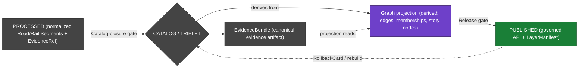

<!-- [KFM_META_BLOCK_V2]
doc_id: kfm://doc/docs.domains.roads-rail-trade.graph-projections
title: Roads, Rail, and Trade — Graph Projections
type: standard
version: v0.1
status: draft
owners: Roads/Rail/Trade domain steward (PLACEHOLDER) + Graph/Analytics steward (PLACEHOLDER)
created: 2026-06-07
updated: 2026-06-07
policy_label: public
related:
  - docs/doctrine/directory-rules.md
  - docs/domains/roads-rail-trade/README.md
  - docs/domains/roads-rail-trade/DATA_LIFECYCLE.md
  - docs/domains/roads-rail-trade/FILE_SYSTEM_PLAN.md
  - docs/domains/roads-rail-trade/EXPANSION_BACKLOG.md
  - docs/atlases/KFM_Domains_Culmination_Atlas_v1_1.pdf
  - ai-build-operating-contract.md            # CONTRACT_VERSION = "3.0.0"
tags: [kfm, domain, roads-rail-trade, transport, graph, triplets, projection, derived, governance]
notes:
  - CONTRACT_VERSION = "3.0.0" pinned; doctrine-adjacent standard doc.
  - CONFIRMED doctrine - "Graph Projection - derived layer, never canonical truth; queryable via governed API" (Encyclopedia Ch. 5.2 cross-domain systems index).
  - The transport graph projection lives under data/triplets/ (plural; canonical name per repository-structure guiding doc) and is NEVER the truth source - EvidenceBundle outranks it.
  - Segment-name conflict (roads-rail-trade vs transport) is inherited from the lane and tracked as OQ-RRT-GP-08 - see FILE_SYSTEM_PLAN OPEN-RRT-FSP-01.
  - All implementation-layer paths, schema names, and validator IDs are PROPOSED; mounted-repo presence is NEEDS VERIFICATION.
[/KFM_META_BLOCK_V2] -->
# Roads, Rail, and Trade — Graph Projections

> How the Roads/Rail/Trade transport graph is **derived** from `EvidenceBundle`s, **published** as a queryable connectivity view, and **rolled back** without rewriting canonical Road/Rail Segment records. A derived projection, never a truth source.

<!-- Badges: placeholders; Shields.io targets to be wired during build. -->


| Status | Owners | Updated |
|---|---|---|
| **Draft** — PROPOSED implementation, CONFIRMED doctrine alignment | _Roads/Rail/Trade steward (PLACEHOLDER) + Graph/Analytics steward (PLACEHOLDER)_ | _2026-06-07 (placeholder)_ |

> [!IMPORTANT]
> **The graph is derived, not canonical (CONFIRMED).** The transport graph — network edges, route memberships, movement story nodes — is a **queryable projection over `EvidenceBundle`s**. `EvidenceBundle` outranks the graph projection, the renderer, search indexes, and tiles. A published graph view MUST be rebuildable or revertible **without rewriting** the canonical Road/Rail Segment records that feed it. `[ENCY] [DOM-ROADS §K] [DIRRULES]`

> [!NOTE]
> This document describes how the projection is **governed**, not where the bytes happen to sit on disk. Path-shaped claims here are **PROPOSED** until a mounted-repo inspection confirms them. The segment-name split (`roads-rail-trade` vs `transport`) is inherited from the lane and tracked as **OQ-RRT-GP-08**.

---

## Contents

- [1. Scope and audience](#1-scope-and-audience)
- [2. What the projection is — and is not](#2-what-the-projection-is--and-is-not)
- [3. Where the projection sits in the lifecycle](#3-where-the-projection-sits-in-the-lifecycle)
- [4. Projection objects](#4-projection-objects)
- [5. Derivation: from EvidenceBundle to edge](#5-derivation-from-evidencebundle-to-edge)
- [6. Placement of graph artifacts](#6-placement-of-graph-artifacts)
- [7. Publication, the governed API, and the map view](#7-publication-the-governed-api-and-the-map-view)
- [8. Rollback, rebuild, and stale-state](#8-rollback-rebuild-and-stale-state)
- [9. Sensitivity inheritance](#9-sensitivity-inheritance)
- [10. Validators and tests](#10-validators-and-tests)
- [11. Cross-lane and downstream consumers](#11-cross-lane-and-downstream-consumers)
- [12. Open questions register](#12-open-questions-register)
- [13. Open verification backlog](#13-open-verification-backlog)
- [14. Changelog](#14-changelog)
- [15. Definition of done](#15-definition-of-done)
- [16. Related docs](#16-related-docs)

---

## 1. Scope and audience

**What this doc covers.** The governed handling of the Roads/Rail/Trade **transport graph projection**: what the projection is, where it sits in the lane lifecycle, the objects it contains, how each edge is derived from resolved evidence, where the artifacts are placed, how the projection is published through the governed API and the MapLibre derived-connectivity view, and — most importantly — how it is rolled back or rebuilt without touching canonical records. The audience is the Roads/Rail domain steward, the graph/analytics steward, and reviewers triaging a graph-related PR.

**What this doc does not cover.** Object semantics and ubiquitous language (the domain README and `OBJECT_FAMILIES.md`), the full lane lifecycle (`DATA_LIFECYCLE.md`), the full placement plan (`FILE_SYSTEM_PLAN.md`), and the expansion items that build the projection (`EXPANSION_BACKLOG.md`). Cross-domain graph runtime concerns beyond Roads/Rail belong to the cross-domain **Graph Projection** system doctrine `[ENCY]`.

**The one rule that governs everything below.** A projection is a **read model**. It answers "what connects to what, when, with what evidence" by reading resolved `EvidenceBundle`s. It never becomes the place where a fact first exists. If the graph and a canonical Road/Rail Segment record disagree, the canonical record wins and the graph is rebuilt — never the reverse.

[Back to top ↑](#roads-rail-and-trade--graph-projections)

---

## 2. What the projection is — and is not

CONFIRMED doctrine, from the cross-domain **Graph Projection** system entry `[ENCY]` and the Operating Law: `EvidenceBundle` outranks generated language, renderer state, **graph projections**, search indexes, tiles, and dashboards.

| The transport graph projection **is**… | The transport graph projection **is not**… |
|---|---|
| A derived read model over resolved `EvidenceBundle`s. | A canonical store. Canonical truth stays in Road/Rail Segment records and their evidence. |
| Queryable **only** through the governed API. | Directly reachable by public clients, the UI, or the AI surface (trust membrane). |
| Rebuildable from evidence at any time. | A place where a new fact may first appear. |
| Tier-inheriting from its constituent objects. | A way to upgrade or launder the tier of a sensitive object. |
| Revertible via `RollbackCard` without rewriting canonical records. | A reason to rewrite, move, or delete a canonical Road/Rail Segment. |

> [!WARNING]
> **A graph projection is never sovereign truth (CONFIRMED anti-pattern).** Treating "summaries, maps, tiles, graphs, vector indexes, scenes, or generated text as sovereign truth" is a named failure mode in the operating contract. The projection cites evidence; it is not evidence.

[Back to top ↑](#roads-rail-and-trade--graph-projections)

---

## 3. Where the projection sits in the lifecycle

CONFIRMED doctrine / PROPOSED lane application. The lane follows `RAW → WORK / QUARANTINE → PROCESSED → CATALOG / TRIPLET → PUBLISHED`, and the graph projection is emitted at the **CATALOG / TRIPLET** gate, alongside catalog records and `EvidenceBundle`s `[DIRRULES] [DOM-ROADS §H] [ENCY]`.



**Reading the diagram.** The `EvidenceBundle` is the canonical-evidence artifact emitted at catalog closure; the graph projection is derived **from** it and **reads** it. Both are gated into `PUBLISHED` by the release gate. Rollback or rebuild repoints the published view back to a prior CATALOG state without disturbing the `EvidenceBundle` lineage.

[Back to top ↑](#roads-rail-and-trade--graph-projections)

---

## 4. Projection objects

CONFIRMED owned objects for the derived graph, from the Roads/Rail dossier `[DOM-ROADS §B, §E, §G]`. Each is a **projection of** evidence, not a new claim. The PROPOSED schema home follows the lane's Domain Placement Law spread (`schemas/contracts/v1/domains/roads-rail-trade/` per Directory Rules §12 — note the `transport` segment conflict, OQ-RRT-GP-08).

| Projection object | What it represents | Derived from | Status |
|---|---|---|---|
| **Network Node** | A connection point (junction, depot, crossing, yard) in the transport network. | Road/Rail Segment endpoints, Crossings, Depots/Yards. | PROPOSED schema; CONFIRMED object family |
| **Network Edge** | A traversable connection between two Network Nodes. | Road/Rail Segments + their `EvidenceBundle`. | PROPOSED schema; CONFIRMED object family |
| **Route Membership** | The (many-to-many) belonging of a segment to a designation/route, kept **separate** from the segment itself. | Segment + designation evidence; never collapsed. | PROPOSED schema; CONFIRMED object family |
| **Movement Story Node** | A narrative anchor over the network (a trip, a corridor story, a movement episode). | Composed edges + Route Events + evidence. | PROPOSED schema; CONFIRMED object family |

> [!IMPORTANT]
> **Route membership ≠ designation collapse (CONFIRMED validator).** A single Road Segment may belong to multiple designations or routes without those designations collapsing into one. The **route-membership and designation-separation** validator enforces this; a projection that merges them fails closed with `ROLE_COLLAPSE` / `CONTRACT_DRIFT`. `[DOM-ROADS §K]`

[Back to top ↑](#roads-rail-and-trade--graph-projections)

---

## 5. Derivation: from EvidenceBundle to edge

Each edge is built by reading resolved evidence — never by asserting connectivity that no `EvidenceBundle` supports. The derivation is deterministic so the same evidence rebuilds the same graph.

```text
EvidenceBundle (resolved at CATALOG closure)
   │  carries: identity, inputs, parameters, artifacts, checks, integrity, signatures
   ▼
project_transport_graph  (PROPOSED pipeline step)
   │  - reads only released/catalog-closed EvidenceBundles
   │  - preserves source role (authority | observation | context | model)
   │  - preserves each object's sensitivity tier
   │  - records wasDerivedFrom + spec_hash lineage back to the bundle
   ▼
Network Edge / Route Membership / Movement Story Node
   │  - each carries an EvidenceRef back to its supporting bundle
   ▼
data/triplets/graph_deltas/roads-rail-trade/   (PROPOSED; derived, not canonical)
```

**Derivation invariants (PROPOSED implementation of CONFIRMED doctrine):**

1. **Evidence-first.** An edge exists only if a resolved `EvidenceBundle` supports the connection it asserts. No bundle → no edge (the projection ABSTAINs on that connection rather than inventing it). `[ENCY]`
2. **Role-preserving.** The projection carries each constituent object's source role; it never upcasts an `observation`/`context` edge into `authority`. `[DOM-ROADS §D]`
3. **Lineage-bearing.** Every projected element records `wasDerivedFrom`, `spec_hash`, and an `EvidenceRef` so the lineage from edge → bundle is auditable (mirrors the EvidenceBundle lineage-graph pattern). `[ENCY]`
4. **Deterministic.** Re-running derivation on the same catalog-closed evidence yields the same graph (basis for the rebuild/rollback guarantee in §8).

[Back to top ↑](#roads-rail-and-trade--graph-projections)

---

## 6. Placement of graph artifacts

PROPOSED per Directory Rules §12 (Domain Placement Law) and the canonical `data/triplets/` home. NEEDS VERIFICATION against a mounted-repo `git ls-tree`.

```text
data/triplets/                                   # CONFIRMED canonical name (plural; per repo-structure guiding doc)
├── graph_deltas/
│   └── roads-rail-trade/                        # PROPOSED — derived edges/memberships/story nodes (segment conflict: OQ-RRT-GP-08)
└── exports/
    └── roads-rail-trade/                        # PROPOSED — query/export snapshots over the projection

data/catalog/domain/roads-rail-trade/            # PROPOSED — catalog records + EvidenceBundle the projection reads
data/published/layers/roads-rail-trade/          # PROPOSED — public-safe derived-connectivity LayerManifest
data/rollback/roads-rail-trade/<release_id>/     # PROPOSED — graph-view revert receipts (data plane)

pipelines/domains/roads-rail-trade/
└── project_transport_graph.py                   # PROPOSED — PROCESSED→CATALOG graph derivation step

schemas/contracts/v1/domains/roads-rail-trade/   # PROPOSED — per Directory Rules §12 (transport segment per §24.13: OQ-RRT-GP-08)
├── network_node.schema.json
├── network_edge.schema.json
├── route_membership.schema.json
└── movement_story_node.schema.json
```

> [!CAUTION]
> **`data/triplets/` is plural and canonical.** The repository-structure guiding document fixes `data/triplets/` (plural) as the one canonical name, with `graph_deltas/` and `exports/` children. A singular `data/triplet/` is a CONFIRMED drift pattern — do not create it; if it exists, file to `docs/registers/DRIFT_REGISTER.md`.

> [!NOTE]
> **Paths are not authority.** A file landing in `data/triplets/graph_deltas/roads-rail-trade/` does not make the graph published or true; publication requires the release gate (§7) and the graph never outranks its evidence (§2).

[Back to top ↑](#roads-rail-and-trade--graph-projections)

---

## 7. Publication, the governed API, and the map view

CONFIRMED trust-membrane rule: public clients, the UI, and the AI surface reach the projection **only** through the governed API — never the graph internals directly `[ENCY] [GAI] [MAP-MASTER]`.

| Surface | Artifact / DTO | Outcomes | Status |
|---|---|---|---|
| Graph query resolver (governed API) | `RoadsRailDecisionEnvelope` | `ANSWER / ABSTAIN / DENY / ERROR` | PROPOSED; exact route UNKNOWN `[DOM-ROADS §J]` |
| Derived-connectivity layer | `LayerManifest` / domain layer descriptor | `ANSWER / DENY / ERROR` | PROPOSED; public-safe release only `[DOM-ROADS §J]` |
| Evidence Drawer payload | `EvidenceDrawerPayload` + `EvidenceBundle` projection | `ANSWER / ABSTAIN / DENY / ERROR` | PROPOSED; evidence + policy filtered `[DOM-ROADS §J]` |
| Focus Mode answer over the graph | Runtime Response Envelope + `AIReceipt` | `ANSWER / ABSTAIN / DENY / ERROR` | PROPOSED; AI never root truth `[GAI]` |

**Map realization.** The derived **graph / connectivity view** is one of the lane's PROPOSED viewing products `[DOM-ROADS §G]`. It is published as a `LayerManifest` and rendered through `packages/maplibre-runtime/` (the sole governed renderer; Cesium retired per Directory Rules v1.3). A click on a published edge opens the **Evidence Drawer**, resolving the edge's `EvidenceRef` to its `EvidenceBundle` — the same Evidence Drawer discipline applied to every other layer `[MAP-MASTER]`.

> [!IMPORTANT]
> **No direct graph passthrough.** Exposing a raw graph endpoint, a query console, or a vector index to the public bypasses the trust membrane and is forbidden. Every public graph answer is a governed-API response carrying finite outcomes and citing resolved evidence.

[Back to top ↑](#roads-rail-and-trade--graph-projections)

---

## 8. Rollback, rebuild, and stale-state

CONFIRMED rollback posture for derived graph/analytics: **"derived graph/triplets from evidence; not root truth → rebuild graph or disable view."** The projection's defining safety property is that it can be revoked or rebuilt **without rewriting canonical Road/Rail Segment records** `[UNIFIED] [DOM-ROADS §K]`.

| Situation | Action | Canonical records touched? |
|---|---|---|
| Evidence base corrected upstream | Rebuild the projection from the corrected `EvidenceBundle`s | No |
| Published graph view found unsafe / leaking | Disable the view (revert `LayerManifest`); rebuild after fix | No |
| Failed release of a graph view | `RollbackCard` repoints to the prior released graph view | No |
| Constituent object's tier downgraded (toward less public) | `CorrectionNotice` invalidates derived edges; rebuild at the new tier | No |

**Promotion-evidence discipline for major graph changes (CONFIRMED cards).** Major graph-runtime changes SHOULD require **restore-rehearsal evidence** before promotion (`KFM-P31-IDEA-0006`), and a **graph-invariant artifact** SHOULD be generated before and after the change — counts, constraints, representative query outputs (`KFM-P31-PROG-0003`). A before/after invariant diff is what proves a rebuild produced the same graph the evidence supports.

```text
Graph-change promotion checklist (PROPOSED, per the cards above)
[ ] restore rehearsal performed and recorded
[ ] graph-invariant artifact generated BEFORE the change (counts, constraints, query outputs)
[ ] graph-invariant artifact generated AFTER the change
[ ] before/after diff reviewed; unexpected drift blocks promotion
[ ] RollbackCard + rollback target exist for the published view
```

> [!CAUTION]
> **Stale-state, not silent edit.** If an upstream segment is corrected, the projection is marked stale and rebuilt; published graph answers carry the stale-state badge until the rebuild closes. A graph view is never silently edited in place — every change is a `CorrectionNotice` or a `RollbackCard`.

[Back to top ↑](#roads-rail-and-trade--graph-projections)

---

## 9. Sensitivity inheritance

CONFIRMED tier inheritance. At the manifest level a published graph view is `T0`; its **content inherits the tier of its constituent objects** `[ENCY §24.5]`. The projection cannot be used to launder a sensitive object into a more public tier.

| Constituent object | Tier | Effect on the projection |
|---|---|---|
| Road/Rail Segment (modern, authority source) | T0 | Edge publishable at T0. |
| Historic RouteClaim / unverified alignment | T1 | Edge carries generalization + `UncertaintySurface`; no meter-grade alignment. |
| Indigenous trade / mobility corridor | **T4** default | Edge **denied** at public tiers until steward review + `RedactionReceipt` generalize it to T1. |
| TransportFacility — critical-asset / condition detail | **T4** (T3 named-party only) | Edge exposing critical-asset detail is denied public release; route relation only, per Settlements rules `[DOM-SETTLE]`. |

> [!IMPORTANT]
> **A high-tier node taints its edges.** An edge touching a T4 node is at least as restricted as that node. The projection MUST evaluate the **most restrictive** tier among an edge's constituents before publishing it. Tier *upgrade* of any constituent (toward more public) requires a transform receipt **and** a `ReviewRecord`; tier *downgrade* (toward less public) requires `CorrectionNotice` alone and triggers a rebuild `[ENCY §24.5.3]`.

[Back to top ↑](#roads-rail-and-trade--graph-projections)

---

## 10. Validators and tests

PROPOSED validators from `[DOM-ROADS §K]` and the graph-promotion cards. NEEDS VERIFICATION against mounted-repo fixtures and CI.

| Validator / test | What it proves | Failure-closed reason code (PROPOSED) | Status |
|---|---|---|---|
| Transport graph projection rollback | A published graph view can be reverted/rebuilt without rewriting canonical Road/Rail Segment records. | `GRAPH_ROLLBACK_REQUIRED`, `GRAPH_PROJECTION_STALE` | PROPOSED `[DOM-ROADS §K]` |
| Route-membership / designation separation | A segment belongs to multiple routes without collapsing them. | `ROLE_COLLAPSE`, `CONTRACT_DRIFT` | PROPOSED `[DOM-ROADS §K]` |
| Evidence-first edge | Every edge resolves to a supporting `EvidenceBundle`; no orphan edges. | `MISSING_EVIDENCE` | PROPOSED |
| Tier-inheritance | An edge's published tier equals the most restrictive constituent tier. | `SENSITIVITY_UNRESOLVED`, `CRITICAL_FACILITY_DETAIL_DENY`, `INDIGENOUS_CORRIDOR_REVIEW_PENDING` | PROPOSED |
| Graph-invariant before/after diff | A rebuild reproduces counts, constraints, and representative query outputs the evidence supports. | `GRAPH_PROJECTION_STALE` | PROPOSED `[KFM-P31-PROG-0003]` |
| Restore-rehearsal gate | A major graph-runtime change carries restore-rehearsal evidence before promotion. | `REVIEW_NEEDED` | PROPOSED `[KFM-P31-IDEA-0006]` |

> [!TIP]
> **Negative-state rule (CONFIRMED).** These validators MUST prove DENY / ABSTAIN / ERROR / quarantine / stale / restricted paths — not only successful publication. A graph that only tests "the edge appears" proves nothing about whether an unsupported or over-tier edge is correctly refused. `[UNIFIED]`

[Back to top ↑](#roads-rail-and-trade--graph-projections)

---

## 11. Cross-lane and downstream consumers

CONFIRMED edges and consumers `[DOM-ROADS §F] [ENCY §24.4.11]`. The projection must preserve ownership, source role, sensitivity, and `EvidenceBundle` support on both sides of every cross-lane edge.

| Related lane / consumer | Relation | Constraint on the projection |
|---|---|---|
| **Settlements / Infrastructure** | Network nodes and crossings anchor settlement connectivity; **facility identity is settlement-owned**. | The graph cites facility identity by `EvidenceRef`; it never re-canonicalizes a settlement-owned node. |
| **Hydrology** | Bridge / ferry / ford / river-crossing edges. | River identity stays Hydrology-owned; the edge cites both lanes' evidence. |
| **Hazards** | Closure / detour edges from hazard events. | The graph publishes the *restriction* an event imposes; KFM is never an alert authority. |
| **Archaeology / Cultural Heritage** | Historic-corridor and Indigenous-corridor edges. | Cited as context only; exact archaeological coordinates denied; Indigenous corridors default T4 until steward review. |
| **Frontier Matrix** (downstream) | **Access observations bound the access cells in the matrix** `[ENCY §24.4.11]`. | The matrix consumes the released, public-safe graph; a graph rollback cascades a stale-state to dependent matrix cells. |

[Back to top ↑](#roads-rail-and-trade--graph-projections)

---

## 12. Open questions register

| ID | Question | Owner role | Resolution path |
|---|---|---|---|
| OQ-RRT-GP-01 | Does the projection live only in `data/triplets/graph_deltas/roads-rail-trade/`, or also as a separate published `data/published/layers/roads-rail-trade/graph/` surface? | Graph/Analytics steward | ADR or a published `LayerManifest`. |
| OQ-RRT-GP-02 | What is the exact governed-API route for the graph query resolver? Atlas marks it "route TBD". | API steward | `apps/governed-api/` route table. |
| OQ-RRT-GP-03 | What graph runtime backs the projection (e.g., property-graph store vs. triple store), and what is its `spec_hash` discipline? | Graph/Analytics steward | Mounted-repo runtime + `KFM-P31-PROG-0003` invariant artifacts. |
| OQ-RRT-GP-04 | What exactly constitutes a "graph-invariant artifact" for this lane (which counts, constraints, queries)? | Graph/Analytics steward | Schema + fixtures per `KFM-P31-PROG-0003`. |
| OQ-RRT-GP-05 | How does a graph rollback cascade stale-state to downstream Frontier Matrix access cells? | Matrix steward + Graph steward | Stale-state propagation ADR (relates to ADR-S-10). |
| OQ-RRT-GP-08 | Should the schema/contract segment be `transport` (Directory Rules §24.13) or `roads-rail-trade` (§12)? Inherited lane conflict. | Directory-Rules steward | Same ADR as FILE_SYSTEM_PLAN OPEN-RRT-FSP-01. |

## 13. Open verification backlog

These items remain `NEEDS VERIFICATION` before promotion from `draft` to `published`:

1. Verify the transport-graph projection ↔ MapLibre `LayerManifest` integration (Atlas Ch. 13.N item 4).
2. Verify the graph runtime, its `spec_hash` discipline, and the graph-invariant artifact shape (OQ-RRT-GP-03, OQ-RRT-GP-04).
3. Verify mounted-repo presence of `data/triplets/graph_deltas/roads-rail-trade/` (or `transport`) via `git ls-tree`.
4. Verify the exact governed-API route for the graph resolver (OQ-RRT-GP-02).
5. Verify the stale-state cascade from a graph rollback to Frontier Matrix access cells (OQ-RRT-GP-05).
6. Confirm the schema/contract segment name (OQ-RRT-GP-08) via the FILE_SYSTEM_PLAN OPEN-RRT-FSP-01 ADR.
7. Confirm restore-rehearsal and invariant-diff gates are wired into CI for graph-runtime changes.

## 14. Changelog

| Change | Type (per contract §37) | Reason |
|---|---|---|
| Initial authoring of the Roads/Rail/Trade graph-projections standard doc. | new | Companion to DATA_LIFECYCLE, FILE_SYSTEM_PLAN, and EXPANSION_BACKLOG; consolidates the "derived graph, never canonical" doctrine for this lane. |
| Anchored the derived-not-canonical rule to the Encyclopedia cross-domain Graph Projection entry and the roadmap Phase-13 rollback posture. | gap closure | Grounds the central claim in CONFIRMED corpus rather than asserting it. |
| Added the restore-rehearsal (`KFM-P31-IDEA-0006`) and graph-invariant (`KFM-P31-PROG-0003`) promotion-evidence discipline. | gap closure | Both are CONFIRMED cards directly applicable to graph-runtime changes. |
| Inherited the segment-name conflict as OQ-RRT-GP-08, pointing to FILE_SYSTEM_PLAN OPEN-RRT-FSP-01. | reconciliation | Keeps the three-doc conflict tracking consistent. |

> **Backward compatibility.** New document; no prior anchors to preserve. Cross-references DATA_LIFECYCLE, FILE_SYSTEM_PLAN, and EXPANSION_BACKLOG under their existing IDs.

## 15. Definition of done

This document is done enough to enter the repository when:

- it is placed at `docs/domains/roads-rail-trade/GRAPH_PROJECTIONS.md` per Directory Rules §12;
- the Roads/Rail domain steward **and** the graph/analytics steward review it;
- it is linked from the domain dossier `README.md` and from `DATA_LIFECYCLE.md`;
- it does not conflict with accepted ADRs — in particular OQ-RRT-GP-08 / OPEN-RRT-FSP-01 is resolved or explicitly deferred with a `DRIFT_REGISTER.md` entry;
- the `GENERATED_RECEIPT.json` planned in the authoring notes is wired into CI;
- future changes follow the operating contract's §37 lifecycle.

[Back to top ↑](#roads-rail-and-trade--graph-projections)

---

## 16. Related docs

Placeholders below are PROPOSED targets. Mounted-repo presence is NEEDS VERIFICATION for every link.

- [`docs/domains/roads-rail-trade/README.md`](./README.md) — domain dossier landing page — TODO: NEEDS VERIFICATION.
- [`docs/domains/roads-rail-trade/DATA_LIFECYCLE.md`](./DATA_LIFECYCLE.md) — lane lifecycle (the CATALOG/TRIPLET gate that emits this projection).
- [`docs/domains/roads-rail-trade/FILE_SYSTEM_PLAN.md`](./FILE_SYSTEM_PLAN.md) — placement plan (segment-name conflict OPEN-RRT-FSP-01).
- [`docs/domains/roads-rail-trade/EXPANSION_BACKLOG.md`](./EXPANSION_BACKLOG.md) — backlog (graph projection + rollback items).
- [`docs/doctrine/directory-rules.md`](../../doctrine/directory-rules.md) — placement law; `data/triplets/` canonical name.
- [`docs/atlases/KFM_Domains_Culmination_Atlas_v1_1.pdf`](../../atlases/KFM_Domains_Culmination_Atlas_v1_1.pdf) — Ch. 13 (Roads/Rail) + Ch. 24.4.11 (Frontier Matrix access cells).
- [`ai-build-operating-contract.md`](../../../ai-build-operating-contract.md) — operating contract; `CONTRACT_VERSION = "3.0.0"`.

Atlas / corpus references (not repo paths):

- `[DOM-ROADS]` Roads/Rail/Trade dossier · `[ENCY]` Encyclopedia (cross-domain Graph Projection system) · `[DIRRULES]` Directory Rules · `[MAP-MASTER]` MapLibre master · `[GAI]` Governed AI · `[DOM-SETTLE]` Settlements/Infrastructure · `[UNIFIED]` Unified/pipeline lineage (Phase-13 graph rollback posture).
- Pass 23 + 32 cards `KFM-P31-IDEA-0006` (restore rehearsal as promotion evidence), `KFM-P31-PROG-0003` (graph invariant artifact generator), `KFM-P26-FEAT-0008` (EvidenceBundle lineage graph view).

---

_Last updated: **2026-06-07** (placeholder; replace with commit date on merge)._
_Doc version: **v0.1**._ · _Pins `CONTRACT_VERSION = "3.0.0"`._
_Owners: **Roads/Rail/Trade steward (PLACEHOLDER) + Graph/Analytics steward (PLACEHOLDER)**._

[Back to top ↑](#roads-rail-and-trade--graph-projections)
