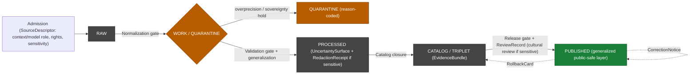

<!-- [KFM_META_BLOCK_V2]
doc_id: kfm://doc/docs.domains.roads-rail-trade.historic-routes
title: Roads, Rail, and Trade — Historic Routes
type: standard
version: v0.1
status: draft
owners: Roads/Rail/Trade domain steward (PLACEHOLDER) + Archaeology/Cultural-Heritage steward (PLACEHOLDER)
created: 2026-06-07
updated: 2026-06-07
policy_label: public
related:
  - docs/doctrine/directory-rules.md
  - docs/domains/roads-rail-trade/README.md
  - docs/domains/roads-rail-trade/DATA_LIFECYCLE.md
  - docs/domains/roads-rail-trade/FILE_SYSTEM_PLAN.md
  - docs/domains/roads-rail-trade/GRAPH_PROJECTIONS.md
  - docs/domains/roads-rail-trade/EXPANSION_BACKLOG.md
  - docs/domains/archaeology/SENSITIVITY.md
  - docs/atlases/KFM_Domains_Culmination_Atlas_v1_1.pdf
  - ai-build-operating-contract.md            # CONTRACT_VERSION = "3.0.0"
tags: [kfm, domain, roads-rail-trade, transport, historic-routes, sensitivity, sovereignty, generalization, governance]
notes:
  - CONTRACT_VERSION = "3.0.0" pinned; doctrine-adjacent standard doc on a SENSITIVE domain.
  - SENSITIVE-DOMAIN doc - touches Indigenous trade/mobility corridors, cultural heritage, and historic-route overprecision. Most-restrictive applicable row of operating-contract 23.2 applies. No exact coordinates or restricted-source-derived fields are included anywhere in this doc.
  - CONFIRMED doctrine - Indigenous trade and mobility corridors, oral history, treaty, cultural, and interpretive evidence default to steward review and generalized public geometry (Atlas Ch. 13.I).
  - NAMING CONFLICT - the Atlas owns-list (Ch. 13.B) spells the object "Historic Route" while ubiquitous language (Ch. 13.C) and viewing products (Ch. 13.G) spell it "Historic RouteClaim". Real intra-Atlas inconsistency tracked as OQ-RRT-HR-04; this doc uses "Historic RouteClaim" as the primary term and flags it.
  - All implementation-layer paths, schema names, validator IDs, and the H3/distance generalization parameters are PROPOSED; mounted-repo presence is NEEDS VERIFICATION.
[/KFM_META_BLOCK_V2] -->
# Roads, Rail, and Trade — Historic Routes

> How the Roads/Rail/Trade lane handles historic wagon roads, military trails, stage/mail routes, cattle trails, emigrant trails, and trade & mobility corridors — as **uncertain claims, generalized for public release**, with Indigenous and cultural corridors held to steward and sovereignty review. A claim about the past, never a survey-grade line.

<!-- Badges: placeholders; Shields.io targets to be wired during build. -->


| Status | Owners | Updated |
|---|---|---|
| **Draft** — PROPOSED implementation, CONFIRMED doctrine alignment | _Roads/Rail/Trade steward (PLACEHOLDER) + Archaeology/Cultural-Heritage steward (PLACEHOLDER)_ | _2026-06-07 (placeholder)_ |

> [!CAUTION]
> **This is a sensitive-domain document.** It covers historic routes that frequently overlap **Indigenous trade and mobility corridors, oral history, treaty, cultural, and interpretive evidence**, which **default to steward review and generalized public geometry** `[DOM-ROADS §I]`. The **most restrictive applicable row** of the operating contract's §23.2 sensitive-domain decision matrix governs. This document describes the governance posture only — it contains **no exact coordinates, no restricted-source-derived fields, and no precise alignments**, and it must never be used to derive them.

> [!IMPORTANT]
> **A historic route is a *claim*, not a survey line (CONFIRMED).** A `Historic RouteClaim` carries source role, evidence, uncertainty, and release state. Its published geometry is **generalized**; modern-survey precision for a route whose evidence cannot support it is denied by the **historic-overprecision** validator. `[DOM-ROADS §C, §K]`

---

## Contents

- [1. Scope and audience](#1-scope-and-audience)
- [2. The object: Historic RouteClaim](#2-the-object-historic-routeclaim)
- [3. Route families and their default source roles](#3-route-families-and-their-default-source-roles)
- [4. Uncertainty is first-class](#4-uncertainty-is-first-class)
- [5. Overprecision denial](#5-overprecision-denial)
- [6. Indigenous trade and mobility corridors](#6-indigenous-trade-and-mobility-corridors)
- [7. Sensitivity tiers and generalization parameters](#7-sensitivity-tiers-and-generalization-parameters)
- [8. Lifecycle for a historic route](#8-lifecycle-for-a-historic-route)
- [9. Publication and the map view](#9-publication-and-the-map-view)
- [10. Cross-lane edges](#10-cross-lane-edges)
- [11. Validators and tests](#11-validators-and-tests)
- [12. Open questions register](#12-open-questions-register)
- [13. Open verification backlog](#13-open-verification-backlog)
- [14. Changelog](#14-changelog)
- [15. Definition of done](#15-definition-of-done)
- [16. Related docs](#16-related-docs)

---

## 1. Scope and audience

**What this doc covers.** The governed handling of **historic routes** in the Roads/Rail/Trade lane: the `Historic RouteClaim` object, the route families and the source roles each may hold, how alignment uncertainty is carried as first-class data, how overprecision is denied, how Indigenous trade and mobility corridors are routed through steward and sovereignty review, the sensitivity tiers and generalization parameters that gate public release, the lifecycle a historic route follows, and how it is published. The audience is the Roads/Rail domain steward, the Archaeology/Cultural-Heritage steward, and reviewers triaging a historic-route PR.

**What this doc does not cover.** Modern road/rail network handling (the lane README and `DATA_LIFECYCLE.md`), the derived graph projection (`GRAPH_PROJECTIONS.md`), placement (`FILE_SYSTEM_PLAN.md`), and the full Archaeology sensitivity model (the Archaeology dossier `[DOM-ARCH]`, which **owns** the cultural-side sensitivity policy this lane consumes).

**The two rules that govern everything below.**

1. **Evidence over precision.** A historic route is published only at the precision its evidence supports, generalized to a public-safe band; the `EvidenceBundle` outranks any rendered line.
2. **Deny-by-default for cultural sensitivity.** Where Indigenous, cultural, treaty, oral-history, or sovereignty interests are present, the default disposition is steward review and generalized public geometry — not "publish with a caveat." `[DOM-ROADS §I] [ENCY] [DIRRULES]`

[Back to top ↑](#roads-rail-and-trade--historic-routes)

---

## 2. The object: Historic RouteClaim

CONFIRMED term / PROPOSED field realization. `Historic RouteClaim` is used inside this lane with meaning constrained by source role, evidence, time, and release state `[DOM-ROADS §C]`.

> [!NOTE]
> **Naming inconsistency (CONFLICTED — OQ-RRT-HR-04).** The Atlas owns-list (Ch. 13.B) spells the object `Historic Route`; the ubiquitous-language table (Ch. 13.C) and the viewing-products list (Ch. 13.G, "historic route claim view") spell it `Historic RouteClaim`. Both spellings appear in the indexed corpus — a real intra-Atlas inconsistency, not a typo to silently pick. This doc uses **`Historic RouteClaim`** as the primary term because it is the form that carries the "claim" semantics this lane depends on, and flags the conflict for ADR resolution.

A `Historic RouteClaim` is **a claim about a route's past existence and alignment**, not a present-day road. It is distinct from a `Road Segment` (a modern, often authority-sourced feature). The two MUST NOT be collapsed:

| | `Historic RouteClaim` | `Road Segment` |
|---|---|---|
| Asserts | A route existed / followed a corridor, per evidence | A road exists today, per an authority/observation source |
| Geometry | Generalized; carries an uncertainty band | Survey-grade where the source supports it |
| Default tier | **T1** (generalized) — or **T4** where cultural sensitivity applies | **T0** for modern authority sources |
| Identity basis (PROPOSED) | source id + object role + temporal scope + normalized digest | source id + object role + temporal scope + normalized digest |
| Carries | `UncertaintySurface`, `EvidenceRef`, source role, release state | `EvidenceRef`, source role, release state |

> [!IMPORTANT]
> **Claims are separated from segments (CONFIRMED validator).** The lane's object model keeps `Historic RouteClaim` separate from `Road Segment`; a claim is never promoted into a survey-grade segment without evidence that supports the upgrade. Collapsing them fails closed (`ROLE_COLLAPSE` / `CONTRACT_DRIFT`). `[DOM-ROADS §K]`

[Back to top ↑](#roads-rail-and-trade--historic-routes)

---

## 3. Route families and their default source roles

The historic-route families below are the kinds of routes this lane reconstructs. Source-role assignment (`authority | observation | context | model`) is fixed at admission and never upcast `[DOM-ROADS §D]`. The role examples are **PROPOSED** illustrations of how doctrine applies; rights and current terms for every historic source are **NEEDS VERIFICATION**.

| Route family | Typical evidence sources | Default source role (PROPOSED) | Default tier |
|---|---|---|---|
| Military trails / freight roads | State archives, military post records, monographs | `context` / `model` (rarely `authority`) | T1 |
| Mail & stage routes | Post-office records, stage-company records, newspapers | `context` / `model` | T1 |
| Emigrant / pioneer trails | Diaries, monographs, NPS trail studies | `context` / `model` | T1 |
| Cattle trails | County histories, drovers' records, monographs | `context` / `model` | T1 |
| Trade-route corridors (`TradeRouteCorridor`) | Trade-history monographs, archival maps | `context` / `model` | T1 (generalized corridor) |
| **Indigenous trade & mobility corridors** | Oral history, treaty, cultural & interpretive evidence | `context` only; **steward-controlled** | **T4 default** (see §6) |

> [!CAUTION]
> **OSM/GNIS cannot establish a historic legal designation.** OpenStreetMap and GNIS are admissible only as `context` for naming — never as `authority` for a route's jurisdiction, official designation, or legal status. The **OSM/GNIS legal-status denial** validator rejects any normalization that promotes them into authority-role fields. Quarantine is the expected outcome. `[DOM-ROADS §K]`

[Back to top ↑](#roads-rail-and-trade--historic-routes)

---

## 4. Uncertainty is first-class

A historic route's alignment is almost always uncertain. KFM treats that uncertainty as **data the public sees**, not as a footnote to hide.

CONFIRMED per-domain sensitivity matrix: **Roads/Rail historic uncertain routes are T1, with allowed transform "generalization; uncertainty surface" and required gate `UncertaintySurface`** `[ENCY §24.5.2]`.

```text
Historic RouteClaim
   ├── alignment geometry      → GENERALIZED (band, not a survey line)
   ├── UncertaintySurface      → carries the spread the evidence supports   [required gate]
   ├── source role             → context | model (fixed at admission)
   ├── EvidenceRef             → resolves to the supporting EvidenceBundle
   └── temporal scope          → source / observed / valid times kept distinct
```

> [!NOTE]
> **`UncertaintySurface` vs `RouteUncertaintyProfile` (OQ-RRT-HR-05).** The per-domain sensitivity matrix names the required carrier `UncertaintySurface` `[ENCY §24.5.2]`; the Roads/Rail verification backlog (Ch. 13.N) lists implementing a `RouteUncertaintyProfile`. These may be the same carrier under two names, or the profile may be the lane-specific realization of the surface. Reconcile via schema + ADR; this doc treats `UncertaintySurface` as the doctrinal carrier and `RouteUncertaintyProfile` as its PROPOSED lane realization.

The Evidence Drawer surfaces the uncertainty when a published historic route is clicked: the user sees the generalized band, the source role, the uncertainty, and the citation — never a false impression of survey precision.

[Back to top ↑](#roads-rail-and-trade--historic-routes)

---

## 5. Overprecision denial

CONFIRMED validator (PROPOSED implementation): **historic overprecision denial** `[DOM-ROADS §K]`. A historic route whose source admits substantial alignment uncertainty MUST NOT publish at modern-survey precision.

| Trigger | Gate where it fires | Outcome | Recovery |
|---|---|---|---|
| Object geometric precision exceeds what its source role and uncertainty support | Validation (WORK → PROCESSED) and Catalog closure | Fail closed: `HISTORIC_OVERPRECISION_DENY` | Apply generalization + attach `UncertaintySurface`; re-validate |

The rule is symmetric with the cultural-side denial: just as exact archaeological coordinates are denied, an over-precise historic alignment is denied because it **manufactures certainty the evidence does not contain**. Generalization is the fix, not a workaround.

> [!WARNING]
> **No precision laundering.** Joining a `context`-role historic source to a modern survey layer to "borrow" precision is forbidden — it is a source-role collapse (`ROLE_COLLAPSE`) and an overprecision violation at once. The historic claim keeps its own uncertainty; it does not inherit a modern segment's precision.

[Back to top ↑](#roads-rail-and-trade--historic-routes)

---

## 6. Indigenous trade and mobility corridors

> [!CAUTION]
> **This section describes the most restrictive posture in the lane.** Indigenous trade and mobility corridors, oral history, treaty, cultural, and interpretive evidence **default to steward review and generalized public geometry** `[DOM-ROADS §I]`. The cultural-side sensitivity policy is **owned by the Archaeology / Cultural-Heritage domain** `[DOM-ARCH]`; Roads/Rail **consumes** it and never re-derives a more permissive disposition.

CONFIRMED disposition, routed through the operating contract's §23.2 matrix (most restrictive applicable row) and the Archaeology tier model:

| Class | Default disposition | Required transform | Required reviewer (beyond domain steward) | Required receipts |
|---|---|---|---|---|
| Indigenous / cultural records (route context) | **DENY unless steward-approved** | None — steward gate | Tribal / cultural reviewer | `PolicyDecision`; `ReviewRecord` `[contract §23.2]` |
| Indigenous corridor geometry | **T4 default**; generalized public layer only after review | Generalized geometry + `RedactionReceipt` → T1 | Sovereignty / cultural reviewer; rights-holder rep | `RedactionReceipt` + `ReviewRecord` + `PolicyDecision` `[DOM-ARCH] [ENCY §24.5.2]` |
| Sacred / burial-associated route segments | **DENY exact location** | Buffer / generalize, or full denial | Cultural reviewer; rights-holder rep | `RedactionReceipt`; `PolicyDecision` `[contract §23.2]` |

**CARE and sovereignty are visible (CONFIRMED).** Map assets carry a CARE status block (public / generalized / restricted) with reviewers and review dates; the UI shows **CARE labels and sovereignty notice chips**; story nodes over sensitive narratives enforce **context-only spatial disclosure** `[MAP-MASTER]`. A published Indigenous-corridor layer is a **generalized corridor** — never the precise alignment from a single source — and exists only after a `RedactionReceipt` and a `ReviewRecord`.

> [!IMPORTANT]
> **Lifecycle consequence.** For Indigenous and cultural corridors, `PROCESSED → CATALOG → PUBLISHED` requires a `RedactionReceipt` **and** a `ReviewRecord` at minimum, with sovereignty/cultural review. Admission may proceed under steward control; promotion past WORK/QUARANTINE without a resolved steward path is denied. Tier *downgrade* (toward less public) is always permitted via `CorrectionNotice` and precedes derivative invalidation.

[Back to top ↑](#roads-rail-and-trade--historic-routes)

---

## 7. Sensitivity tiers and generalization parameters

CONFIRMED tier scheme (Atlas v1.1 §24.5); per-row applications are CONFIRMED for explicitly named classes and PROPOSED for the rest.

| Object class | Default tier | Allowed transform | Required gates |
|---|---|---|---|
| Historic RouteClaim — non-sensitive | **T1** | Generalization + `UncertaintySurface` | `ReleaseManifest`; `ReviewRecord` where material |
| Historic RouteClaim — sensitive historic content | **T1** | Generalization + `UncertaintySurface` + `RedactionReceipt` | `RedactionReceipt` + `ReviewRecord` |
| TradeRouteCorridor (generalized) | **T1** | Aggregation / generalization into a corridor band | `AggregationReceipt` and/or `RedactionReceipt` |
| Indigenous trade / mobility corridor | **T4** default | Steward + sovereignty review + generalized geometry + `RedactionReceipt` → **T1** | `RedactionReceipt` + `ReviewRecord` + `PolicyDecision` |
| Sacred / burial-associated segment | **T4** | Buffer/generalize or full denial; T3 only under named authorization | Sovereignty review + `ReviewRecord` + `PolicyDecision` |

**Generalization parameters (CONFIRMED from `[MAP-MASTER]`; apply where cultural sensitivity is present):**

- Archaeological / cultural layers are spatially generalized to **H3 r7–r9 footprints**; geometry **below H3 r7 is prohibited** for sensitive products.
- Where terrain is linked to archaeological / culturally sensitive locations, **coordinate generalization of at least 5 km** is required, and captures need alt text and metadata.
- Sensitive / sacred symbols **must not default to full public display**; generalized or hidden tiers are required.

> [!CAUTION]
> **Tier motion (CONFIRMED §24.5.3).** A tier *upgrade* (toward more public) always requires a transform receipt **and** a `ReviewRecord` (e.g., `T4 → T1` needs `RedactionReceipt` + `ReviewRecord`). A tier *downgrade* (toward less public) requires `CorrectionNotice` + `ReviewRecord` alone, is always permitted, and precedes derivative invalidation. Tier is a release posture, not a storage posture — a T4 corridor in QUARANTINE is still T4.

[Back to top ↑](#roads-rail-and-trade--historic-routes)

---

## 8. Lifecycle for a historic route

CONFIRMED doctrine / PROPOSED lane application. A historic route follows the master invariant; the cultural review path is what distinguishes a sensitive corridor from a non-sensitive trail.



| Phase | Historic-route handling | Fail-closed reason codes (PROPOSED) |
|---|---|---|
| RAW | Admit source with role fixed (`context`/`model`), rights, sensitivity, citation, hash. | `RIGHTS_UNKNOWN`, `SENSITIVITY_UNRESOLVED` |
| WORK / QUARANTINE | Hold overprecise alignments; hold sovereignty-sensitive corridors for steward review. | `HISTORIC_OVERPRECISION_DENY`, `INDIGENOUS_CORRIDOR_REVIEW_PENDING`, `OSM_LEGAL_STATUS_DENY` |
| PROCESSED | Emit generalized geometry + `UncertaintySurface`; `RedactionReceipt` if sensitive. | `MISSING_RECEIPT` (RedactionReceipt) |
| CATALOG / TRIPLET | Emit `EvidenceBundle`; release candidate assembled. | `MISSING_EVIDENCE` |
| PUBLISHED | Serve generalized public-safe layer; cultural review recorded where required. | `REVIEW_NEEDED`, `RELEASE_MANIFEST_INVALID` |

[Back to top ↑](#roads-rail-and-trade--historic-routes)

---

## 9. Publication and the map view

CONFIRMED viewing products `[DOM-ROADS §G]`: the **historic route claim view** and the **generalized trade-route corridor** are PROPOSED lane viewing products, served only through governed surfaces. The trust membrane holds: public clients reach them only via the governed API and `LayerManifest`, rendered through `packages/maplibre-runtime/` (the sole renderer).

| Surface | Artifact / DTO | Outcomes | Status |
|---|---|---|---|
| Historic route claim view | `LayerManifest` (generalized geometry + `UncertaintySurface`) | `ANSWER / DENY / ERROR` | PROPOSED; public-safe release only |
| Generalized trade-route corridor | `LayerManifest` + `AggregationReceipt`/`RedactionReceipt` | `ANSWER / DENY / ERROR` | PROPOSED |
| Evidence Drawer payload | `EvidenceDrawerPayload` + `EvidenceBundle` projection | `ANSWER / ABSTAIN / DENY / ERROR` | PROPOSED; evidence + policy filtered |
| Focus Mode answer | Runtime Response Envelope + `AIReceipt` | `ANSWER / ABSTAIN / DENY / ERROR` | PROPOSED; AI never root truth |

**What the public sees.** A generalized band with a trust badge, a CARE/sovereignty chip where cultural sensitivity applies, the uncertainty, the source role, and a resolvable citation — opened through the Evidence Drawer. **What the public never sees:** a precise single-source alignment, exact coordinates of a culturally sensitive corridor, or any restricted-source-derived field.

[Back to top ↑](#roads-rail-and-trade--historic-routes)

---

## 10. Cross-lane edges

CONFIRMED edges `[DOM-ROADS §F] [ENCY §24.4.11, §24.4.13]`. The placement rule is: the owning domain hosts the canonical claim; Roads/Rail cites by `EvidenceRef`.

| Related lane | Relation | Constraint on historic routes |
|---|---|---|
| **Archaeology / Cultural Heritage** | Historic routes and cultural paths; Indigenous corridors, forts, missions. | Archaeology **owns** the cultural-side sensitivity policy; Roads/Rail consumes it and defaults Indigenous-corridor specifics to **T4** until steward/sovereignty review supports generalized release. Exact archaeological coordinates are denied. `[DOM-ARCH]` |
| **Settlements / Infrastructure** | Forts, missions, townsites, reservation communities as route anchors. | Settlement identity is settlement-owned; the historic route cites it, never re-canonicalizes it. |
| **People / Genealogy / Land** | Cultural affiliations and Indigenous community context. | Cited with rights, sovereignty, and steward review; living-person fields fail closed. `[DOM-PEOPLE] [DOM-ARCH]` |
| **Hydrology** | Historic ferries, fords, river crossings. | River identity stays Hydrology-owned; the crossing relation cites both lanes' evidence. |

[Back to top ↑](#roads-rail-and-trade--historic-routes)

---

## 11. Validators and tests

PROPOSED validators from `[DOM-ROADS §K]` and the cultural-sensitivity rules. NEEDS VERIFICATION against mounted-repo fixtures and CI.

| Validator / test | What it proves | Failure-closed reason code (PROPOSED) | Status |
|---|---|---|---|
| Historic overprecision denial | A claim cannot publish above the precision its source/uncertainty support. | `HISTORIC_OVERPRECISION_DENY` | PROPOSED `[DOM-ROADS §K]` |
| Claim/segment separation | A `Historic RouteClaim` is not collapsed into a `Road Segment`. | `ROLE_COLLAPSE`, `CONTRACT_DRIFT` | PROPOSED `[DOM-ROADS §K]` |
| OSM/GNIS legal-status denial | Context sources cannot establish historic legal designation. | `OSM_LEGAL_STATUS_DENY`, `GNIS_LEGAL_STATUS_DENY` | PROPOSED `[DOM-ROADS §K]` |
| Public generalization receipt | Every generalized public geometry resolves to a `RedactionReceipt`/`AggregationReceipt`. | `MISSING_RECEIPT` | PROPOSED `[DOM-ROADS §K]` |
| Indigenous-corridor review pending | A sensitive corridor cannot reach a public tier without sovereignty/steward review. | `INDIGENOUS_CORRIDOR_REVIEW_PENDING` | PROPOSED |
| Generalization-floor enforcement | Sensitive cultural geometry is not finer than the H3 r7 / ≥5 km floor. | `SENSITIVITY_UNRESOLVED` | PROPOSED `[MAP-MASTER]` |

> [!TIP]
> **Negative-state rule (CONFIRMED).** These validators MUST prove DENY / ABSTAIN / quarantine / restricted / review-needed paths — not only successful publication. A suite that proves only "the historic layer renders" proves nothing about whether an over-precise or unreviewed sensitive corridor is correctly refused. `[UNIFIED]`

[Back to top ↑](#roads-rail-and-trade--historic-routes)

---

## 12. Open questions register

| ID | Question | Owner role | Resolution path |
|---|---|---|---|
| OQ-RRT-HR-01 | Which Kansas entities can act as **stewards / sovereignty reviewers** for Indigenous-corridor publication decisions? | Cultural/sovereignty steward | A signed steward-review charter is recorded. |
| OQ-RRT-HR-02 | What are the per-family rights and current terms for historic sources (archives, monographs, NPS trail studies, newspapers)? | Domain steward | `data/registry/sources/...` entries with rights pointers. |
| OQ-RRT-HR-03 | Are the H3 r7 floor and ≥5 km generalization the canonical thresholds for Roads/Rail cultural geometry, or Archaeology-owned defaults this lane inherits? | Archaeology steward | Archaeology sensitivity policy + ADR-S-05. |
| OQ-RRT-HR-04 | Is the object `Historic Route` (Ch. 13.B) or `Historic RouteClaim` (Ch. 13.C/G)? Confirmed intra-Atlas inconsistency. | Domain steward + schema steward | ADR or doctrine clarification. |
| OQ-RRT-HR-05 | Is the uncertainty carrier `UncertaintySurface` (Atlas §16/§24.5.2), `RouteUncertaintyProfile` (Ch. 13.N), or both? | Schema steward | Schema + validator + fixtures. |

## 13. Open verification backlog

These items remain `NEEDS VERIFICATION` before promotion from `draft` to `published`:

1. Verify the Indigenous/cultural-corridor policy and the sovereignty-review workflow (Atlas Ch. 13.N; Archaeology `policy/sensitivity/archaeology/`).
2. Verify the canonical generalization thresholds for this lane's cultural geometry (OQ-RRT-HR-03).
3. Resolve the `Historic Route` vs `Historic RouteClaim` naming (OQ-RRT-HR-04) by ADR.
4. Resolve the `UncertaintySurface` vs `RouteUncertaintyProfile` carrier (OQ-RRT-HR-05): schema + validator + fixtures.
5. Verify per-family rights/terms for historic sources (OQ-RRT-HR-02).
6. Verify mounted-repo presence of the historic-overprecision and Indigenous-corridor validators and their fixtures.
7. Confirm the steward / sovereignty-reviewer charter and named-party path (OQ-RRT-HR-01).

## 14. Changelog

| Change | Type (per contract §37) | Reason |
|---|---|---|
| Initial authoring of the Roads/Rail/Trade historic-routes standard doc. | new | Companion to DATA_LIFECYCLE, FILE_SYSTEM_PLAN, GRAPH_PROJECTIONS, and EXPANSION_BACKLOG; consolidates historic-route + cultural-sensitivity doctrine for this lane. |
| Routed Indigenous/cultural corridors through the operating-contract §23.2 matrix (most restrictive row) and the Archaeology tier model; recorded the CARE/sovereignty-chip and H3 r7 / ≥5 km generalization parameters. | gap closure | Grounds the most sensitive section in CONFIRMED corpus (Atlas §24.5.2, contract §23.2, MapLibre master). |
| Adopted `Historic RouteClaim` as the primary term and flagged the `Historic Route` (Ch. 13.B) inconsistency as OQ-RRT-HR-04. | clarification | The Atlas genuinely uses both spellings; resolving it unilaterally would smooth over a real conflict. |
| Treated `UncertaintySurface` as the doctrinal uncertainty carrier and `RouteUncertaintyProfile` as its PROPOSED lane realization (OQ-RRT-HR-05). | clarification | Aligns to the named §24.5.2 carrier while preserving the Ch. 13.N backlog term. |

> **Backward compatibility.** New document; no prior anchors to preserve. Cross-references the four companion Roads/Rail docs under their existing IDs.

## 15. Definition of done

This document is done enough to enter the repository when:

- it is placed at `docs/domains/roads-rail-trade/HISTORIC_ROUTES.md` per Directory Rules §12;
- the Roads/Rail domain steward **and** the Archaeology/Cultural-Heritage steward review it;
- a **sovereignty / cultural reviewer** confirms the §6 disposition is consistent with the Archaeology-owned policy;
- it is linked from the domain dossier `README.md` and from `DATA_LIFECYCLE.md`;
- it does not conflict with accepted ADRs — in particular OQ-RRT-HR-04 (naming) and the segment-name conflict (FILE_SYSTEM_PLAN OPEN-RRT-FSP-01) are resolved or explicitly deferred with `DRIFT_REGISTER.md` entries;
- the `GENERATED_RECEIPT.json` planned in the authoring notes is wired into CI;
- future changes follow the operating contract's §37 lifecycle.

[Back to top ↑](#roads-rail-and-trade--historic-routes)

---

## 16. Related docs

Placeholders below are PROPOSED targets. Mounted-repo presence is NEEDS VERIFICATION for every link.

- [`docs/domains/roads-rail-trade/README.md`](./README.md) — domain dossier landing page — TODO: NEEDS VERIFICATION.
- [`docs/domains/roads-rail-trade/DATA_LIFECYCLE.md`](./DATA_LIFECYCLE.md) — lane lifecycle (the gates a historic route passes).
- [`docs/domains/roads-rail-trade/GRAPH_PROJECTIONS.md`](./GRAPH_PROJECTIONS.md) — derived graph (historic edges inherit these tiers).
- [`docs/domains/roads-rail-trade/FILE_SYSTEM_PLAN.md`](./FILE_SYSTEM_PLAN.md) — placement (segment-name conflict OPEN-RRT-FSP-01).
- [`docs/domains/roads-rail-trade/EXPANSION_BACKLOG.md`](./EXPANSION_BACKLOG.md) — backlog (historic-corridor + uncertainty items).
- [`docs/domains/archaeology/SENSITIVITY.md`](../archaeology/SENSITIVITY.md) — the cultural-side sensitivity policy this lane consumes — TODO: NEEDS VERIFICATION.
- [`docs/doctrine/directory-rules.md`](../../doctrine/directory-rules.md) — placement law.
- [`docs/atlases/KFM_Domains_Culmination_Atlas_v1_1.pdf`](../../atlases/KFM_Domains_Culmination_Atlas_v1_1.pdf) — Ch. 13 (Roads/Rail), Ch. 24.5 (tiers), Ch. 24.4.13 (Archaeology edges).
- [`ai-build-operating-contract.md`](../../../ai-build-operating-contract.md) — operating contract; `CONTRACT_VERSION = "3.0.0"`; §23.2 sensitive-domain matrix.

Atlas / corpus references (not repo paths):

- `[DOM-ROADS]` Roads/Rail/Trade dossier · `[DOM-ARCH]` Archaeology/Cultural-Heritage dossier (owns cultural sensitivity) · `[ENCY]` Encyclopedia · `[DIRRULES]` Directory Rules · `[MAP-MASTER]` MapLibre master (CARE/sovereignty chips, H3 generalization floors) · `[GAI]` Governed AI · `[DOM-PEOPLE]` People/Genealogy/DNA/Land · `[UNIFIED]` Unified/pipeline lineage (negative-state rule).

---

_Last updated: **2026-06-07** (placeholder; replace with commit date on merge)._
_Doc version: **v0.1**._ · _Pins `CONTRACT_VERSION = "3.0.0"`._
_Owners: **Roads/Rail/Trade steward (PLACEHOLDER) + Archaeology/Cultural-Heritage steward (PLACEHOLDER)**._

[Back to top ↑](#roads-rail-and-trade--historic-routes)
