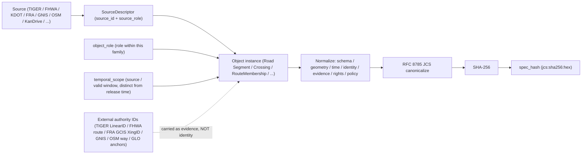

<!-- [KFM_META_BLOCK_V2]
doc_id: kfm://doc/docs.domains.roads-rail-trade.identity-model
title: Roads / Rail / Trade — Identity Model
type: standard
version: v0.2
status: draft
owners: Roads/Rail/Trade domain steward (PLACEHOLDER) + Schema steward (PLACEHOLDER)
created: 2026-05-19
updated: 2026-06-07
policy_label: public
related:
  - docs/domains/roads-rail-trade/README.md
  - docs/domains/roads-rail-trade/DATA_LIFECYCLE.md
  - docs/domains/roads-rail-trade/FILE_SYSTEM_PLAN.md
  - docs/domains/roads-rail-trade/GRAPH_PROJECTIONS.md
  - docs/domains/roads-rail-trade/HISTORIC_ROUTES.md
  - docs/standards/PROV.md
  - docs/standards/CANONICALIZATION.md
  - schemas/contracts/v1/source/source-descriptor.json   # CONFIRMED default home (DR §7.4 / ADR-0001)
  - docs/registers/DRIFT_REGISTER.md
  - ai-build-operating-contract.md                        # CONTRACT_VERSION = "3.0.0"
tags: [kfm, domain, roads-rail-trade, identity, spec_hash, source-role, governance]
notes:
  - CONTRACT_VERSION = "3.0.0" pinned; doctrine-adjacent identity standard.
  - Draft from KFM corpus (Atlas Ch. 13, §24.1, §24.13; Directory Rules §§3, 7.4, 12; Pass-10 C1-01/C1-02/C8-05; DDD Entities).
  - No mounted repo, schemas, tests, or runtime were inspected; implementation claims are PROPOSED / NEEDS VERIFICATION.
  - Segment-name conflict (roads-rail-trade vs transport) tracked as OQ-01; aligned to FILE_SYSTEM_PLAN OPEN-RRT-FSP-01 (Directory Rules §12 names roads-rail-trade verbatim and is the stronger authority).
[/KFM_META_BLOCK_V2] -->
# Roads / Rail / Trade — Identity Model

> *How transport objects in KFM are distinguished, hashed, anchored to external authorities, and kept from collapsing into one another across source, time, and release state.*

[](#)
[](#)
[](#)
[](#)
[](#)
[](#)
[](#)

| Field | Value |
|---|---|
| Status | **draft** |
| Owners | **Roads/Rail/Trade steward (PLACEHOLDER) + Schema steward (PLACEHOLDER)** |
| Last updated | 2026-06-07 |
| Doctrine basis | KFM Domains Atlas v1.1 Ch. 13 · §24.1 (source-role) · Pass-10 C1-01/C1-02/C8-05 · Directory Rules §§3, 7.4, 12 · DDD Reference (Entity / Value Object) |
| Implementation status | **PROPOSED** — repository not mounted this session; no schema, test, or runtime claim is asserted as present |

---

## Mini-TOC

1. [Purpose and scope](#1-purpose-and-scope)
2. [Doctrine basis and authority](#2-doctrine-basis-and-authority)
3. [Identity composition formula](#3-identity-composition-formula)
4. [The `spec_hash` convention](#4-the-spec_hash-convention)
5. [Object families and identity rules](#5-object-families-and-identity-rules)
6. [Temporal kinds and identity invariance](#6-temporal-kinds-and-identity-invariance)
7. [Source role and the anti-collapse rule](#7-source-role-and-the-anti-collapse-rule)
8. [External authority anchors (evidence, not identity)](#8-external-authority-anchors-evidence-not-identity)
9. [Cross-lane identity boundaries](#9-cross-lane-identity-boundaries)
10. [Validators and proof points](#10-validators-and-proof-points)
11. [Open questions and ADR backlog](#11-open-questions-and-adr-backlog)
12. [Changelog](#12-changelog)
13. [Definition of done](#13-definition-of-done)
14. [Related docs](#14-related-docs)
15. [Appendix — illustrative identity envelope](#appendix--illustrative-identity-envelope)

---

## 1. Purpose and scope

**CONFIRMED doctrine / PROPOSED implementation.** This document defines the **identity model** for the Roads / Rail / Trade domain in the Kansas Frontier Matrix (KFM): how every transport object family is distinguished as *the same thing* across evidence sources, time, and release state. It is the governance reference that downstream contracts, schemas, validators, EvidenceBundles, and graph projections in this lane MUST align to.

**In scope.** Identity composition for: `Road Segment`, `Rail Segment`, `CorridorRoute`, `RouteMembership`, `Network Node`, `Crossing`, `Bridge`, `Ferry`, `TransportFacility`, `RestrictionEvent`, `StatusEvent`, `OperatorAssignment`, `Historic RouteClaim`, `TradeRouteCorridor`, and the additional Roads/Rail object inventory of `Depot`, `Siding`, `Yard`, `River Crossing`, `Freight Corridor`, `Route Event`, `Operator Status`, `Access Restriction`, `Network Edge`, and `Movement Story Node`.

**Out of scope.** This document does NOT define rendering, tile production, policy decision flow, release-manifest shape, or correction/rollback mechanics — those live in their own standards and the companion lane docs (`DATA_LIFECYCLE.md`, `GRAPH_PROJECTIONS.md`, `HISTORIC_ROUTES.md`, `FILE_SYSTEM_PLAN.md`). It also does not assign canonical identity for objects owned by adjacent lanes (Settlements, Hydrology, Archaeology, People/Land); see [§9](#9-cross-lane-identity-boundaries).

> [!IMPORTANT]
> "Roads/Rail" is summarized in the Atlas Crosswalk (§24.13) with the headline note **"Network identity governance."** That phrase is this document's reason to exist. Identity, not topology or styling, is the governing concern for this lane.

---

## 2. Doctrine basis and authority

The rules below are CONFIRMED **doctrine** drawn from attached KFM corpus material. Any **implementation** — schema files, validator code, CI workflows, runtime contracts — is PROPOSED until verified against a mounted repository.

| Source | Role in this document | Truth status |
|---|---|---|
| KFM Domains Atlas v1.1 Ch. 13 — Roads/Rail/Trade | Object families, identity-rule pattern, temporal-kind doctrine | CONFIRMED doctrine |
| KFM Domains Atlas v1.1 §24.1 — Master Source-Role Anti-Collapse Register | Seven-role vocabulary; DENY conditions; descriptor fields | CONFIRMED doctrine |
| KFM Domains Atlas v1.1 §24.13 — Responsibility-Root Crosswalk | PROPOSED schema-home placement (`schemas/contracts/v1/transport/`) | CONFIRMED crosswalk note / PROPOSED + CONFLICTED placement (OQ-01) |
| Pass-10 Idea Index C1-02 — Deterministic spec_hash via RFC 8785 JCS + SHA-256 | Hashing convention for the normalized identity envelope | CONFIRMED doctrine |
| Pass-10 Idea Index C1-01 — Universal Run Receipt | Receipt envelope that pins `spec_hash`, source URL, validators | CONFIRMED doctrine |
| Pass-10 Idea Index C8-05 — JCS vs URDNA2015 canonicalization choice | JCS default; URDNA2015 only for RDF-semantic equivalence; choice recorded in receipt | CONFIRMED doctrine |
| Directory Rules §§3, 7.4, 12 — Deeper rule, schema home, Domain Placement Law | This doc's own placement; domain-as-lane; SourceDescriptor schema home | CONFIRMED rule / PROPOSED repo presence |
| DDD Reference — Entity / Value Object | Identity-vs-attribute distinction; "the model must define what it means to be the same thing" | CONFIRMED (external authoritative reference, ingested into KFM doctrine) |
| KFM-P17-IDEA-0005 — Authority IDs and GLO anchors for identity resolution | Authority identifiers carried alongside KFM identity | CONFIRMED card / PROPOSED implementation |
| KFM-P24-IDEA-0004 — Permanent Identifier preference pattern (hydrography example) | Pattern for preferring stable external IDs as **evidence** anchors | CONFIRMED card / PROPOSED implementation |

> [!NOTE]
> The DDD Reference is treated as ingested doctrine (it is an attached project document), not as external research. No web search was performed for this document.

[Back to top](#mini-toc)

---

## 3. Identity composition formula

**CONFIRMED doctrine for the formula; PROPOSED for field-level realization.** Every object family in this lane MUST derive its identity from the same four-part composition, normalized and hashed deterministically:

```text
identity_envelope = ( source_id , object_role , temporal_scope , normalized_digest )
spec_hash         = "jcs:sha256:" + sha256( rfc8785_canonicalize( identity_envelope ) )
```

This is the same composition the Atlas asserts for every transport object family ([§5](#5-object-families-and-identity-rules)) — *"source id + object role + temporal scope + normalized digest"* — and it is consistent with the identity rule used uniformly across every KFM domain in Atlas v1.1.



**Why these four parts, and not fewer.**

- **`source_id`** disambiguates the same-looking object recorded by two different authorities (e.g., a KDOT segment and a TIGER/Line segment that overlap geometrically but were produced under different roles, vintages, and rights).
- **`object_role`** disambiguates the same source asserting the same thing in two different roles (e.g., the same FHWA layer cited once as `regulatory` and once as an `aggregate` summary).
- **`temporal_scope`** disambiguates the same source/role across vintages without collapsing history (a Road Segment "as of 2010 TIGER" is not the same identity as the same alignment "as of 2024 TIGER", even if the geometry matches).
- **`normalized_digest`** locks the resolved bytes, so trivial reformatting does not silently mint a new identity — and so re-ingest of the same source at the same vintage produces the same hash.

> [!CAUTION]
> Identity MUST NOT be derived from raw geometry alone. Geometry is admissible **content** but not a sufficient identity, because: (a) two sources can publish the same alignment under different roles and rights; (b) precision and snapping differ across vintages; (c) historic and trade-route geometries are inherently uncertain. Use the four-part envelope, then verify geometry separately.

[Back to top](#mini-toc)

---

## 4. The `spec_hash` convention

**CONFIRMED doctrine (Pass-10 C1-02).** KFM normalizes the identity envelope and any spec/contract/EvidenceBundle JSON via **RFC 8785 JSON Canonicalization Scheme (JCS)** and then applies **SHA-256**, recording the result as `jcs:sha256:<hex>`. The canonicalization step is what makes the hash deterministic; hashing developer-formatted JSON is explicitly **not** acceptable, because trivial whitespace or key-order changes would mint different hashes and break re-runs and audits.

**Why this matters for the transport lane specifically.**

- Route designations, restriction events, and operator status are revised frequently. Without canonical hashing, every cosmetic re-export of a KDOT or FHWA layer would invalidate downstream evidence bundles.
- Historic and trade-route claims are merged from multiple low-precision sources; the canonical hash is the only honest way to say "these two normalized envelopes are byte-equivalent."
- Promotion gates (`ValidationReport`, `EvidenceRef`, `PromotionDecision`) are idempotent only if the hash is reproducible.

```text
# CONFIRMED format, illustrative example only — not a sample of a real Roads/Rail object
spec_hash = "jcs:sha256:e3b0c44298fc1c149afbf4c8996fb92427ae41e4649b934ca495991b7852b855"
```

> [!NOTE]
> **JCS is the default; URDNA2015 is the exception (CONFIRMED — C8-05).** The Pass-10 Index reserves **URDNA2015 + SHA-256** for cases where RDF-semantic equivalence is the relevant invariant (e.g., a federated SPARQL merge of JSON-LD graphs); JCS is the default for receipts and bundle hashes because it is faster and more widely implemented. The choice MUST be recorded in the run receipt. Most Roads/Rail identity envelopes are plain JSON and use JCS; graph-projection layers *may* need URDNA2015 — see `GRAPH_PROJECTIONS.md` and OQ-03.

[Back to top](#mini-toc)

---

## 5. Object families and identity rules

**CONFIRMED inventory** from Atlas Ch. 13 (Roads/Rail/Trade). The identity rule is the same four-part composition for every family; what varies is the natural object-role vocabulary and the typical authority anchor.

> [!NOTE]
> "Identity rule" below is the **PROPOSED deterministic basis** lifted verbatim from the Atlas: *source id + object role + temporal scope + normalized digest*. Field-name realization (`source_id`, `object_role`, etc.) is illustrative until verified against a mounted schema (OQ-04).

### 5.1 Network primitives

| Object family | Object role examples (illustrative) | Typical authority anchor *(evidence, not identity)* | Identity status |
|---|---|---|---|
| `Road Segment` | drivable_alignment, classified_segment | TIGER LinearID; KDOT segment ID; OSM way (low trust) | PROPOSED deterministic basis (formula §3) |
| `Rail Segment` | active_main, branch, abandoned, industrial_lead | FRA / HIFLD / NTAD rail-line ID | PROPOSED deterministic basis |
| `Network Node` | intersection, junction, terminus, grade_separation | derived; may anchor to TIGER node, OSM node, FRA GCIS where a crossing exists | PROPOSED deterministic basis |
| `Network Edge` | road_to_road, rail_to_rail, intermodal | derived from joined Road/Rail Segments | PROPOSED deterministic basis |

### 5.2 Designations and memberships

| Object family | Object role examples (illustrative) | Authority anchor *(evidence)* | Identity status |
|---|---|---|---|
| `CorridorRoute` | numbered_route, named_route, multi-segment_designation | FHWA route, NHFN corridor, KDOT route number | PROPOSED deterministic basis |
| `RouteMembership` | segment_in_route, time-bounded_membership | derived from a designation source | PROPOSED deterministic basis |
| `Freight Corridor` | NHFN segment, state freight plan corridor | FHWA NHFN | PROPOSED deterministic basis |

> [!IMPORTANT]
> **Designation is not segment, and segment is not designation.** A `Road Segment`'s identity MUST NOT depend on the routes it is a member of — designations change without the underlying alignment changing. `RouteMembership` is the explicit, separately-identified relation. The Atlas lists "Route membership and designation separation tests" as a PROPOSED validator for this lane.

### 5.3 Facilities, crossings, structures

| Object family | Object role examples (illustrative) | Authority anchor *(evidence)* | Identity status |
|---|---|---|---|
| `Crossing` | at-grade_rail_road, pedestrian, private | FRA GCIS Crossing ID | PROPOSED deterministic basis |
| `Bridge` | road_bridge, rail_bridge, pedestrian | NBI structure number; state inventory ID | PROPOSED deterministic basis |
| `Ferry` | vehicle_ferry, historic_ferry | GNIS; state/county records | PROPOSED deterministic basis |
| `River Crossing` | ford, ferry_site, historic_crossing | mixed (Hydrology evidence + transport evidence) | PROPOSED deterministic basis |
| `TransportFacility` | depot, siding, yard, intermodal_terminal | mixed | PROPOSED deterministic basis |
| `Depot` / `Siding` / `Yard` | typed facility | rail-operator records; historic maps | PROPOSED deterministic basis |

### 5.4 Time-bounded events

| Object family | Object role examples (illustrative) | Authority anchor *(evidence)* | Identity status |
|---|---|---|---|
| `RestrictionEvent` | closure, weight_limit, height_limit, hazmat_restriction | KanDrive, county records, WZDx | PROPOSED deterministic basis |
| `StatusEvent` | open, degraded, closed, advisory | KanDrive, WZDx | PROPOSED deterministic basis |
| `OperatorAssignment` | operator_assignment over time | regulatory filings; STB Class I where applicable | PROPOSED deterministic basis |
| `Operator Status` | active, in_receivership, abandoned | regulatory; historic | PROPOSED deterministic basis |
| `Access Restriction` | legal restriction; physical restriction | county/state records | PROPOSED deterministic basis |
| `Route Event` | grand_opening, decommissioning, realignment | historic maps; newspapers; archival | PROPOSED deterministic basis |

### 5.5 Historic and interpretive

| Object family | Object role examples (illustrative) | Authority anchor *(evidence)* | Identity status |
|---|---|---|---|
| `Historic Route` / `Historic RouteClaim` | named_trail, claimed_alignment, oral_corridor | historic maps; GLO; secondary scholarship; oral history *(steward-reviewed)* | PROPOSED deterministic basis |
| `TradeRouteCorridor` | generalized_corridor | mixed | PROPOSED deterministic basis |
| `Movement Story Node` | narrative-anchored point or segment along a route claim | curated | PROPOSED deterministic basis (entity-vs-value-object: OQ-06) |

> [!NOTE]
> **Naming inconsistency (CONFLICTED — see `HISTORIC_ROUTES.md` OQ-RRT-HR-04).** The Atlas owns-list (Ch. 13.B) spells the object `Historic Route`; the ubiquitous-language table (Ch. 13.C) and viewing products (Ch. 13.G) spell it `Historic RouteClaim`. Both appear in the corpus. This doc uses `Historic RouteClaim` as primary and defers resolution to the companion doc's open question.

> [!WARNING]
> Historic and trade-route identities are especially sensitive. Indigenous trade and mobility corridors, oral history, treaty, cultural, and interpretive evidence default to **steward review and generalized public geometry** per Atlas Roads/Rail §I. Identity envelopes for these families MUST NOT leak precise location through the digest — **generalize the geometry before computing the normalized digest**, and record the generalization in a `RedactionReceipt`. See `HISTORIC_ROUTES.md` for the full disposition.

[Back to top](#mini-toc)

---

## 6. Temporal kinds and identity invariance

**CONFIRMED doctrine.** The Atlas asserts uniformly for every Roads/Rail object: *"source, observed, valid, retrieval, release, and correction times stay distinct where material."* Identity composition uses only the **identity-relevant** temporal scope; event time and release time are properties of the object, not parts of the identity.

| Temporal kind | Definition | Role in identity? |
|---|---|---|
| `source_time` | When the source authored or published the record | **Part of `temporal_scope`** when the source dates the assertion |
| `observed_time` | When the real-world condition was observed (e.g., a crossing inspection, a closure start) | **Property of the object**, not its identity — a `StatusEvent` has `observed_at` |
| `valid_time` | The interval during which the assertion is asserted to be true | **Part of `temporal_scope`** where vintage matters (e.g., "TIGER 2024 segment") |
| `retrieval_time` | When KFM fetched the bytes | Carried in the run receipt; **not** in identity |
| `release_time` | When KFM published an artifact carrying this object | **Not** in identity — release is a separate state |
| `correction_time` | When a correction was issued | **Not** in identity — corrections produce new descriptors, not re-identified objects |

> [!IMPORTANT]
> Identity does **not** include `release_time` or `correction_time`. Two release manifests pointing at the same `spec_hash` are pointing at the same identity; a corrected object produces a **new** identity envelope and a `CorrectionNotice` linking the prior one. This preserves the corpus invariant that promotion is a governed state transition, not an in-place mutation.

[Back to top](#mini-toc)

---

## 7. Source role and the anti-collapse rule

**CONFIRMED doctrine (Atlas §24.1).** Every source carries a `source_role` field on its `SourceDescriptor`. The §24.1.1 register enumerates the canonical seven-role vocabulary; for Roads/Rail the roles apply as follows.

| `source_role` | Typical Roads/Rail example | Notes |
|---|---|---|
| `observed` | KanDrive incident; field bridge inspection | Direct observation evidence |
| `regulatory` | FHWA HPMS extract; NHFN designation | Authority determination, not observation |
| `modeled` | Travel-time model; freight-flow estimate | Pin model run via `role_model_run_ref` |
| `aggregate` | County-level VMT; HUC-corridor summary | Pin `role_aggregation_unit` |
| `administrative` | Government compilation, e.g., a published "historic routes" booklet; transport facility roster | Treat as compilation, NOT a timeline of observed events |
| `candidate` | OSM way; crowdsourced trail | Default-deny public surface until promotion (`role_candidate_disposition`) |
| `synthetic` | AI-generated narrative; reconstructed alignment | Reality Boundary Note required (`role_synthetic_basis`) |

> [!CAUTION]
> **Anti-collapse rule for Roads/Rail (CONFIRMED — §24.1.2 names Roads explicitly).** "Administrative compilation cited as observation" → **DENY** publication of compilation as observed event timeline; required guardrail is a preserved `source_role` tag and named `LifeEvent`/`AdminEvent` types. In identity terms: an `administrative` source MUST NOT mint identities of role `observed`. The `source_role` is part of the identity envelope precisely to make this collapse impossible at the hash layer. Role is set at admission and never upgraded by promotion (an observation never becomes a regulation; a candidate never becomes verified without a separate governed transition).

**Role-conditional descriptor fields (PROPOSED — Atlas §24.1.3).** Beyond `source_role`, the descriptor surface carries role-conditional fields that the identity envelope and its evidence should reference:

| Field | Required when | Purpose |
|---|---|---|
| `role_authority` | role ∈ {regulatory, modeled, aggregate} | Names the issuing body / model identity / steward for cite text |
| `role_aggregation_unit` | role = aggregate | Geometry-scope token (county, HUC, year…) preventing scope drift on join |
| `role_model_run_ref` | role = modeled | EvidenceRef → ModelRunReceipt pinning inputs/parameters/version |
| `role_synthetic_basis` | role = synthetic | `{ method, inputs, reality_boundary_note_ref }` recording what is and is not real |
| `role_candidate_disposition` | role = candidate | enum `pending | merged | rejected | quarantined`; PUBLISHED edge forbidden until merged |

`source_role` is set at admission and never edited in place. Corrections produce a **new** SourceDescriptor and a `CorrectionNotice`; the prior identity is preserved for audit. The canonical SourceDescriptor schema home defaults to `schemas/contracts/v1/source/source-descriptor.json` per Directory Rules §7.4 / ADR-0001 (NEEDS VERIFICATION; file presence not asserted).

[Back to top](#mini-toc)

---

## 8. External authority anchors (evidence, not identity)

**CONFIRMED principle / PROPOSED field realization.** Stable external identifiers — TIGER LinearIDs, FHWA route designations, FRA GCIS crossing IDs, NBI structure numbers, GNIS feature IDs, OSM way IDs, GLO patent anchors — are carried on KFM objects as **evidence**, not as canonical identity. This mirrors the Pass pattern asserted for hydrography (KFM-P24-IDEA-0004: prefer a stable Permanent Identifier but carry both as evidence) and the broader identity-resolution pattern (KFM-P17-IDEA-0005: combine authority identifiers, GLO anchors, co-mentions, and negative evidence into a **deterministic confidence band**).

| External anchor | Source family | Typical KFM use |
|---|---|---|
| TIGER `LINEARID` / `MTFCC` | Census TIGER/Line | Roads, road-class crosswalk |
| FHWA route number / NHFN ID | FHWA HPMS / NHFN | `CorridorRoute`, `Freight Corridor` |
| FRA GCIS Crossing ID | FRA GCIS | `Crossing` |
| NBI structure number | National Bridge Inventory *(NEEDS VERIFICATION as a named KFM source — OQ-07)* | `Bridge` |
| KDOT route / segment ID | KDOT / KanPlan / KanDrive | `Road Segment`, `RestrictionEvent`, `StatusEvent` |
| GNIS feature ID | GNIS | `Ferry`, named historic features |
| OSM way / node ID | OpenStreetMap | candidate-role evidence only |
| GLO patent anchor | GLO records *(via People/DNA/Land cross-citation)* | `Historic RouteClaim` co-anchor |

> [!NOTE]
> **Why external IDs are evidence, not identity.** External authorities can re-issue, retire, merge, or split their IDs without notifying KFM. If KFM identity were defined by an external ID, an upstream renumbering would silently mint or destroy KFM identities. Treating the external ID as evidence carried inside the identity envelope (and surfaced via the `EvidenceBundle`) keeps KFM identity stable under upstream churn while preserving the ability to cite the upstream record.

[Back to top](#mini-toc)

---

## 9. Cross-lane identity boundaries

**CONFIRMED doctrine** from Atlas Ch. 13 §B and §F. Roads/Rail does not own identities that belong to adjacent lanes. Cross-lane evidence is carried, but identity authority stays with the owning domain.

| Roads/Rail object | Adjacent lane | Identity authority | Roads/Rail carries |
|---|---|---|---|
| `Crossing`, `Bridge`, `Ferry`, `River Crossing` | Hydrology | Hydrology owns water evidence (e.g., reach, HUC) | A reference to Hydrology identity; the **crossing/bridge identity itself stays in Roads/Rail** |
| `TransportFacility`, `Depot`, `Yard`, intermodal hubs | Settlements / Infrastructure | Settlements owns settlement and infrastructure canonical claims | A reference where the facility is also an infrastructure asset; Roads/Rail keeps the *transport-role* identity |
| `Historic RouteClaim`, `TradeRouteCorridor`, Indigenous corridors | Archaeology / Cultural Heritage | Archaeology retains sensitivity policy and steward review | Generalized geometry, steward-reviewed; ABSTAIN/DENY where review state is unresolved |
| `RestrictionEvent` driven by flood/fire/smoke | Hazards | Hazards owns the hazard event identity | A relation linking the closure to the hazard; not a re-identified hazard |
| Historic alignments crossing patented land | People / Genealogy / DNA / Land | People/Land owns LandInstrument and patent identity | An evidence-only co-citation through GLO anchors |

> [!IMPORTANT]
> When a transport object's identity-relevant evidence comes primarily from another lane (e.g., a `River Crossing` whose existence is asserted by a Hydrology source), the Roads/Rail identity envelope MUST still be a Roads/Rail envelope — `source_id` may point at a Hydrology source, but `object_role` and the family stay in this lane. Cross-lane evidence does not relocate identity ownership.

[Back to top](#mini-toc)

---

## 10. Validators and proof points

**PROPOSED.** The Atlas Roads/Rail §K names the following validator targets. None are asserted as implemented in a mounted repo this session.

- [ ] Route membership and designation separation tests
- [ ] Operator / status temporal tests
- [ ] OSM / GNIS legal-status denial *(deny promotion of crowdsourced sources past WORK without explicit policy)*
- [ ] Historic overprecision denial *(deny publication of historic alignments at higher precision than evidence supports)*
- [ ] Public generalization receipt tests
- [ ] Transport graph projection rollback tests

Identity-specific proof points this document implies (PROPOSED additions to the validator surface):

- [ ] **Canonical-hash reproducibility test.** Re-canonicalizing the same identity envelope on two implementations produces identical `jcs:sha256:<hex>`.
- [ ] **Role-anti-collapse test.** An `administrative` source cannot produce an identity envelope whose `object_role` is observed-only.
- [ ] **Vintage-distinction test.** The same alignment from two TIGER vintages produces two distinct `spec_hash` values.
- [ ] **External-anchor-as-evidence test.** Changing an upstream external ID (e.g., TIGER `LINEARID` renumbering) without changing the identity envelope does NOT mint a new KFM identity, but DOES emit a `CorrectionNotice` recording the upstream change.
- [ ] **Cross-lane non-leak test.** A Hydrology-owned identity cannot appear as a Roads/Rail canonical identity.
- [ ] **Negative-state coverage.** Each test above MUST also prove its DENY / ABSTAIN / quarantine path, not only the success path.

> [!NOTE]
> These tests are PROPOSED and their schema homes are PROPOSED. The lane schema home is `schemas/contracts/v1/domains/roads-rail-trade/` per Directory Rules §12 (with `transport` as the deferring §24.13 alternative — OQ-01); the SourceDescriptor home is `schemas/contracts/v1/source/source-descriptor.json` per §7.4.

[Back to top](#mini-toc)

---

## 11. Open questions and ADR backlog

| # | Open question | Why it matters | Resolution path |
|---|---|---|---|
| OQ-01 | Schema-home naming: `schemas/contracts/v1/domains/roads-rail-trade/` (Directory Rules §12) vs. `schemas/contracts/v1/transport/` (Atlas §24.13). | Two doctrinal sources disagree on the literal segment. The FILE_SYSTEM_PLAN verified §12 names `roads-rail-trade` **verbatim**, making §12 the stronger authority; §24.13 self-marks PROPOSED and Ch. 24 defers to v1.0/Directory Rules. | Adopt `domains/roads-rail-trade/` pending ADR; file `transport` drift to `DRIFT_REGISTER.md` per §2.5. **Aligned with FILE_SYSTEM_PLAN OPEN-RRT-FSP-01.** |
| OQ-02 | Canonical name of the run-receipt/provenance standard (`PROV.md` vs `PROVENANCE.md`). | Identity envelopes are recorded in run receipts; the file name is referenced by this doc. | Open ADR (already flagged in standards-docs corpus as OPEN-DR-01). |
| OQ-03 | Are URDNA2015 + SHA-256 hashes required for any Roads/Rail graph-projection layer, or is JCS sufficient throughout? | Affects validator implementation and reproducibility tests. | NEEDS VERIFICATION against the `GRAPH_PROJECTIONS.md` contract once mounted; C8-05 default is JCS. |
| OQ-04 | Field-name canonical form (`source_id`/`object_role`/`temporal_scope`/`normalized_digest` vs. in-flight schema vocabulary). | Field names in this doc are illustrative; canonical names live in the schema. | Cross-check against `schemas/contracts/v1/source/source-descriptor.json` (CONFIRMED default home) once mounted. |
| OQ-05 | Treatment of OSM as a `candidate` source: is there a domain-specific promotion rule for OSM road segments meeting an evidence threshold? | The Atlas calls for "OSM/GNIS legal-status denial"; the threshold rule is not specified. | Open ADR scoped to the Roads/Rail policy lane. |
| OQ-06 | Does `Movement Story Node` participate in the same identity formula, or as a narrative-overlay value object without independent identity? | DDD distinction (entity vs. value object) matters for graph projections. | Document decision here once steward review confirms; coordinate with `GRAPH_PROJECTIONS.md`. |
| OQ-07 | NBI structure number as a named KFM source family for `Bridge` identity. | Asserted in this doc only as illustrative; not in the Atlas Ch. 13 §D source-family list. | NEEDS VERIFICATION against source registry. |

[Back to top](#mini-toc)

---

## 12. Changelog

| Change | Type (per contract §37) | Reason |
|---|---|---|
| Verified the seven-role enum (`observed \| regulatory \| modeled \| aggregate \| administrative \| candidate \| synthetic`) against Atlas §24.1.1 and confirmed the §7 anti-collapse callout (§24.1.2 names Roads explicitly). | reconciliation | Confirms the doc's load-bearing source-role claims rather than asserting them. |
| Added the §24.1.3 role-conditional descriptor fields (`role_authority`, `role_aggregation_unit`, `role_model_run_ref`, `role_synthetic_basis`, `role_candidate_disposition`) to §7. | gap closure | These are documented PROPOSED fields the identity envelope should reference. |
| Tightened the SourceDescriptor schema-home reference to the CONFIRMED default `schemas/contracts/v1/source/source-descriptor.json` (DR §7.4 / ADR-0001) in §7, §10, OQ-04, and the appendix. | clarification | Replaces the vaguer `.../source-descriptor.json` with the confirmed home. |
| Aligned OQ-01 to the FILE_SYSTEM_PLAN finding (§12 names `roads-rail-trade` verbatim; the stronger authority) instead of leaving the conflict neutral. | reconciliation | Keeps the segment-name conflict consistent across all five Roads/Rail docs. |
| Added C8-05 (JCS default / URDNA2015 exception) to §4 and the doctrine table; refined OQ-03. | gap closure | The doc's URDNA2015 note is now grounded in the specific confirmed card. |
| Replaced `doc_id: kfm://doc/TBD` and `owners: TBD` with reviewable placeholders; pinned `CONTRACT_VERSION = "3.0.0"`; bumped v1 → v0.2; refreshed dates to 2026-06-07; cross-linked the four companion Roads/Rail docs; flagged the `Historic Route`/`Historic RouteClaim` naming as OQ-RRT-HR-04 (companion doc). | housekeeping | Doctrine-doc requirements; ties the dossier set together. |
| Quoted all Mermaid node/edge labels containing `/`, `(`, `)` and removed `<br/>` inside labels. | clarification | Mermaid safety rule; prevents render failure on GitHub. |

> **Backward compatibility.** Mini-TOC items 1–11 keep their anchors; former items 12 "Related docs" and 13 "Appendix" are now 14 and 15. Links to `#12-related-docs` would shift to `#14-related-docs` — flagged here. No content removed.

## 13. Definition of done

This document is done enough to enter the repository when:

- it is placed at `docs/domains/roads-rail-trade/IDENTITY_MODEL.md` per Directory Rules §12;
- the Roads/Rail domain steward **and** the schema steward review it;
- it is linked from the domain dossier `README.md` and cross-referenced by `DATA_LIFECYCLE.md` and `GRAPH_PROJECTIONS.md`;
- the field-name vocabulary (OQ-04) is reconciled against the mounted `source-descriptor.json`, or the divergence is recorded;
- it does not conflict with accepted ADRs — in particular OQ-01 (segment naming) is resolved or explicitly deferred with a `DRIFT_REGISTER.md` entry;
- the `GENERATED_RECEIPT.json` planned in the authoring notes is wired into CI;
- future changes follow the operating contract's §37 lifecycle.

[Back to top](#mini-toc)

---

## 14. Related docs

> [!NOTE]
> Links below are PROPOSED targets; verify presence against a mounted repo before publication. Where a target may not yet exist, the link is a planning placeholder.

- [`docs/domains/roads-rail-trade/README.md`](./README.md) — *Roads/Rail/Trade lane landing page (PROPOSED)*
- [`docs/domains/roads-rail-trade/DATA_LIFECYCLE.md`](./DATA_LIFECYCLE.md) — *lane lifecycle (where identities are minted and promoted)*
- [`docs/domains/roads-rail-trade/FILE_SYSTEM_PLAN.md`](./FILE_SYSTEM_PLAN.md) — *placement; segment-name conflict OPEN-RRT-FSP-01 / OQ-01*
- [`docs/domains/roads-rail-trade/GRAPH_PROJECTIONS.md`](./GRAPH_PROJECTIONS.md) — *derived graph (consumes these identities)*
- [`docs/domains/roads-rail-trade/HISTORIC_ROUTES.md`](./HISTORIC_ROUTES.md) — *historic-route sensitivity; `Historic RouteClaim` naming (OQ-RRT-HR-04)*
- [`docs/standards/PROV.md`](../../standards/PROV.md) — *provenance standard profile; run-receipt vocabulary (OQ-02)*
- [`docs/standards/CANONICALIZATION.md`](../../standards/CANONICALIZATION.md) — *JCS vs URDNA2015 decision matrix (Pass-10 C8-05)*
- [`schemas/contracts/v1/source/source-descriptor.json`](../../../schemas/contracts/v1/source/source-descriptor.json) — *CONFIRMED default SourceDescriptor home (DR §7.4 / ADR-0001); NEEDS VERIFICATION*
- [`docs/registers/DRIFT_REGISTER.md`](../../registers/DRIFT_REGISTER.md) — *where to file the schema-home naming conflict (OQ-01)*
- [`ai-build-operating-contract.md`](../../../ai-build-operating-contract.md) — *operating contract; `CONTRACT_VERSION = "3.0.0"`*

---

## Appendix — illustrative identity envelope

> [!NOTE]
> The blocks below are **illustrative**. Field names are not drawn from a verified schema; they show the four-part composition this document specifies. Replace with canonical field names from `schemas/contracts/v1/source/source-descriptor.json` once that schema is mounted (OQ-04).

<details>
<summary><b>Illustrative `Road Segment` identity envelope (pseudo-JSON, not from a verified schema)</b></summary>

```json
{
  "object_family": "Road Segment",
  "source_id": "kfm:source:tiger-line:2024:ks",
  "source_role": "regulatory",
  "object_role": "drivable_alignment",
  "temporal_scope": {
    "source_time": "2024-01-01",
    "valid_time": { "start": "2024-01-01", "end": null }
  },
  "normalized_digest": {
    "method": "rfc8785-jcs+sha256",
    "value": "jcs:sha256:<computed-over-canonical-envelope>"
  },
  "evidence_anchors": {
    "tiger_linearid": "1104755123456",
    "kdot_segment_id": null,
    "fhwa_route": null,
    "osm_way": null
  },
  "spec_hash": "jcs:sha256:<computed-over-the-whole-envelope-minus-spec_hash>",
  "release_state": "not_released",
  "notes": "Illustrative only. Field names are PROPOSED; verify against mounted schema."
}
```

</details>

<details>
<summary><b>Illustrative `Crossing` (rail/road, FRA GCIS-anchored)</b></summary>

```json
{
  "object_family": "Crossing",
  "source_id": "kfm:source:fra-gcis:2025-snapshot",
  "source_role": "regulatory",
  "object_role": "at_grade_rail_road",
  "temporal_scope": {
    "source_time": "2025-Q1",
    "valid_time": { "start": "2025-01-01", "end": null }
  },
  "normalized_digest": {
    "method": "rfc8785-jcs+sha256",
    "value": "jcs:sha256:<computed>"
  },
  "evidence_anchors": {
    "fra_gcis_xing_id": "<XingID>",
    "tiger_linearid": null
  },
  "cross_lane_refs": {
    "hydrology": null
  },
  "spec_hash": "jcs:sha256:<computed>",
  "release_state": "not_released",
  "notes": "Illustrative only."
}
```

</details>

<details>
<summary><b>Illustrative `Historic RouteClaim` (steward-reviewed, generalized geometry)</b></summary>

```json
{
  "object_family": "Historic RouteClaim",
  "source_id": "kfm:source:glo-anchors+secondary-scholarship:bundle-001",
  "source_role": "administrative",
  "object_role": "claimed_alignment",
  "temporal_scope": {
    "source_time": "secondary-scholarship-1968",
    "valid_time": { "start": "1825", "end": "1872" }
  },
  "normalized_digest": {
    "method": "rfc8785-jcs+sha256",
    "value": "jcs:sha256:<computed-over-generalized-geometry>"
  },
  "evidence_anchors": {
    "glo_patent_refs": [ "<patent-id-1>", "<patent-id-2>" ],
    "secondary_scholarship_refs": [ "<citation>" ]
  },
  "sensitivity": {
    "steward_review_required": true,
    "generalization_applied": true,
    "redaction_receipt_ref": "<receipt-id>"
  },
  "spec_hash": "jcs:sha256:<computed>",
  "release_state": "review_required",
  "notes": "Illustrative only. Generalization MUST precede digest. Indigenous corridors and oral-history evidence default to DENY/HOLD per HISTORIC_ROUTES.md."
}
```

</details>

---

**Doctrine status:** CONFIRMED. **Implementation status:** PROPOSED (repository not mounted this session). **Pins** `CONTRACT_VERSION = "3.0.0"`.

### Related docs · Last updated · Back to top

- See [§14 Related docs](#14-related-docs).
- **Last updated:** 2026-06-07
- [Back to top](#roads--rail--trade--identity-model)
