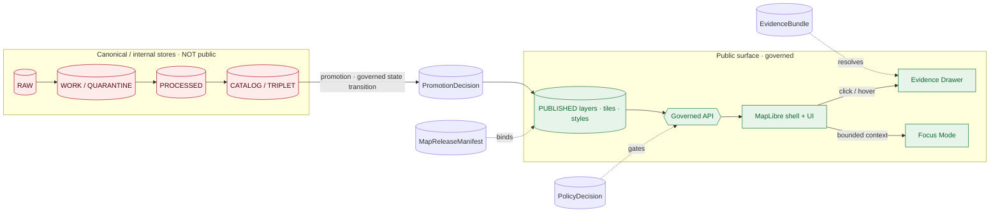
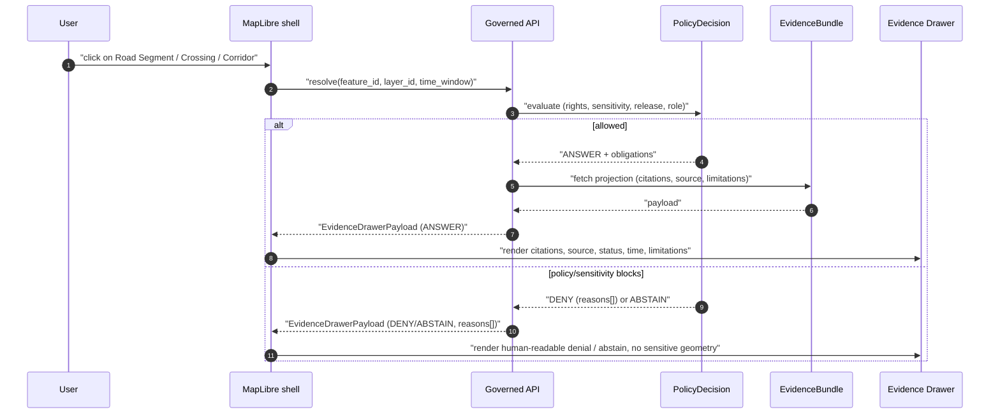

<!-- [KFM_META_BLOCK_V2]
doc_id: kfm://doc/docs.domains.roads-rail-trade.map-ui-contracts
title: Map UI Contracts — Roads, Rail, and Trade Routes
type: standard
version: v0.2
status: draft
owners: Roads/Rail/Trade domain steward (PLACEHOLDER) + Map-shell / UI steward (PLACEHOLDER)
created: 2026-05-19
updated: 2026-06-07
policy_label: public
related:
  - docs/domains/roads-rail-trade/README.md                # PROPOSED — NEEDS VERIFICATION
  - docs/domains/roads-rail-trade/DATA_LIFECYCLE.md
  - docs/domains/roads-rail-trade/FILE_SYSTEM_PLAN.md
  - docs/domains/roads-rail-trade/GRAPH_PROJECTIONS.md
  - docs/domains/roads-rail-trade/HISTORIC_ROUTES.md
  - docs/domains/roads-rail-trade/IDENTITY_MODEL.md
  - docs/architecture/maplibre-3d.md                       # PROPOSED — NEEDS VERIFICATION
  - docs/standards/PROV.md
  - schemas/contracts/v1/map/                              # PROPOSED schema home — NEEDS VERIFICATION
  - schemas/contracts/v1/ui/                               # PROPOSED schema home — NEEDS VERIFICATION
  - schemas/contracts/v1/ai/                               # PROPOSED schema home — NEEDS VERIFICATION
  - schemas/contracts/v1/runtime/decision_envelope.schema.json   # PROPOSED — NEEDS VERIFICATION
  - ai-build-operating-contract.md                         # CONTRACT_VERSION = "3.0.0"
tags: [kfm, domain:roads-rail-trade, ui, maplibre, contracts, governance]
notes:
  - CONTRACT_VERSION = "3.0.0" pinned; doctrine-adjacent map-UI contract profile.
  - Doctrine grounded in DOM-ROADS, MAP-MASTER, GAI, ENCY, DIRRULES; DecisionEnvelope shape from KFM-P5-PROG-0001.
  - Implementation paths PROPOSED pending mounted-repo verification.
  - Segment-name conflict (roads-rail-trade vs transport) tracked as OPEN-ROADS-UI-09; aligned to FILE_SYSTEM_PLAN OPEN-RRT-FSP-01 (Directory Rules §12 names roads-rail-trade verbatim and is the stronger authority).
  - The sole browser renderer is packages/maplibre-runtime/ (Directory Rules v1.3; Cesium retired).
[/KFM_META_BLOCK_V2] -->

# 🛣️ Map UI Contracts — Roads, Rail, and Trade Routes

> The contracts that bind the **Roads, Rail, and Trade Routes** domain to KFM's map UI — what the renderer is allowed to consume, what it must show, and what it must never bypass.

<!-- TODO: replace badge targets once owners, CI workflow names, and policy class are mounted -->


**Status:** draft &nbsp;·&nbsp; **Owners:** Roads/Rail/Trade steward (PLACEHOLDER) + Map-shell/UI steward (PLACEHOLDER) &nbsp;·&nbsp; **Updated:** 2026-06-07

---

## Mini-TOC

- [1 · Scope and bounds](#1--scope-and-bounds)
- [2 · Repo fit and adjacent docs](#2--repo-fit-and-adjacent-docs)
- [3 · The trust-membrane invariant for this domain](#3--the-trust-membrane-invariant-for-this-domain)
- [4 · Contract surfaces at a glance](#4--contract-surfaces-at-a-glance)
- [5 · LayerManifest — Roads/Rail layer profile](#5--layermanifest--roadsrail-layer-profile)
- [6 · EvidenceDrawerPayload — click resolution contract](#6--evidencedrawerpayload--click-resolution-contract)
- [7 · MapContextEnvelope — bounded context for Focus Mode](#7--mapcontextenvelope--bounded-context-for-focus-mode)
- [8 · FocusMode request/response — finite outcomes](#8--focusmode-requestresponse--finite-outcomes)
- [9 · Trust states surfaced to the UI](#9--trust-states-surfaced-to-the-ui)
- [10 · Sensitivity, generalization, and redaction](#10--sensitivity-generalization-and-redaction)
- [11 · Time-aware interaction](#11--time-aware-interaction)
- [12 · Cross-lane handoff rules](#12--cross-lane-handoff-rules)
- [13 · Anti-patterns specific to this surface](#13--anti-patterns-specific-to-this-surface)
- [14 · Validators, fixtures, and tests (PROPOSED)](#14--validators-fixtures-and-tests-proposed)
- [15 · Open questions register](#15--open-questions-register)
- [16 · Changelog](#16--changelog)
- [17 · Definition of done](#17--definition-of-done)
- [18 · Related docs](#18--related-docs)
- [Appendix A · Glossary](#appendix-a--glossary)
- [Appendix B · Source basis](#appendix-b--source-basis)

---

## 1 · Scope and bounds

**Purpose.** This document defines, **at the contract level**, how the Roads, Rail, and Trade Routes domain presents its released evidence to the KFM map UI — through the governed API, the Evidence Drawer, and Focus Mode — and what fields, finite outcomes, trust states, and obligations the UI is allowed to consume.

It is **not** a route blueprint for an existing service, **not** a wire-protocol spec, and **not** a UI styling guide. It is the **doctrinal binding surface** between this domain and the map shell.

> [!IMPORTANT]
> **Doctrine is CONFIRMED. Implementation is PROPOSED.** No claim below should be read as "the repo already has this." Concrete routes, schema files, validators, tests, dashboards, and UI wiring **NEEDS VERIFICATION** against the mounted repository before being treated as fact. Per [DOM-ROADS] §J the exact governed-API route is recorded as **UNKNOWN**.

**This contract applies to:** modern roads layers; rail alignment layers; facility/crossing views; restriction/status timelines; freight-corridor context; historic route claim views; generalized trade-route corridors; derived graph/connectivity views — and the Evidence Drawer, Focus Mode, and time-aware controls that resolve over them. *(PROPOSED viewing products from DOM-ROADS §G; CONFIRMED cross-cutting UI products from MAP-MASTER.)*

**This contract does not apply to:** settlement/infrastructure canonical claims (owned by Settlements/Infrastructure), water evidence (owned by Hydrology), or archaeological/cultural/people sensitivity policies (owned by their respective domains). *(CONFIRMED non-ownership from DOM-ROADS §B.)*

[Back to top](#-map-ui-contracts--roads-rail-and-trade-routes)

---

## 2 · Repo fit and adjacent docs

This file lives at `docs/domains/roads-rail-trade/MAP_UI_CONTRACTS.md` — a domain segment under the `docs/` responsibility root. **CONFIRMED path basis** — Directory Rules §12 (Domain Placement Law) names `roads-rail-trade` verbatim as a canonical domain segment, and §6.1 places per-domain dossiers under `docs/domains/<domain>/`; **CONFIRMED authoring; mounted-repo presence NEEDS VERIFICATION.**

```text
docs/
└── domains/
    └── roads-rail-trade/
        ├── README.md                 # PROPOSED — NEEDS VERIFICATION
        ├── DATA_LIFECYCLE.md         # companion (lifecycle)
        ├── FILE_SYSTEM_PLAN.md       # companion (placement)
        ├── GRAPH_PROJECTIONS.md      # companion (derived graph)
        ├── HISTORIC_ROUTES.md        # companion (historic-route sensitivity)
        ├── IDENTITY_MODEL.md         # companion (identity)
        ├── MAP_UI_CONTRACTS.md       # this file
        ├── SENSITIVITY.md            # PROPOSED — NEEDS VERIFICATION
        └── OPEN_QUESTIONS.md         # PROPOSED — NEEDS VERIFICATION
```

**Authority pointers** *(placement per Directory Rules §12; all PROPOSED until verified)*:

| Concern | Authority root | Path home |
|---|---|---|
| Object meaning (Road Segment, Rail Segment, CorridorRoute, …) | `contracts/` | `contracts/domains/roads-rail-trade/` |
| Object shape (JSON Schema) | `schemas/` | `schemas/contracts/v1/domains/roads-rail-trade/` |
| Allow / deny / restrict / abstain | `policy/` | `policy/domains/roads-rail-trade/` |
| Map-UI contract shapes (LayerManifest, EvidenceDrawerPayload, …) | `schemas/` | `schemas/contracts/v1/map/`, `schemas/contracts/v1/ui/`, `schemas/contracts/v1/ai/` |
| Tests / fixtures | `tests/`, `fixtures/` | `tests/domains/roads-rail-trade/`, `fixtures/domains/roads-rail-trade/` |
| Released layer artifacts | `data/published/layers/` | `data/published/layers/roads-rail-trade/` |
| Release decisions / rollback cards | `release/` | `release/candidates/roads-rail-trade/` |

> [!NOTE]
> The map-UI contract families (LayerManifest, StyleManifest, TileArtifactManifest, MapReleaseManifest, EvidenceDrawerPayload, MapContextEnvelope, FocusModeRequest, FocusModeResponse, AIReceipt, DecisionEnvelope, CitationValidationReport, PolicyDecision, PromotionDecision, rollback target) are **cross-cutting** — not owned by this domain. This document profiles how Roads/Rail/Trade Routes **uses** them, not where they live. The sole browser renderer is `packages/maplibre-runtime/` (Directory Rules v1.3; Cesium retired).

[Back to top](#-map-ui-contracts--roads-rail-and-trade-routes)

---

## 3 · The trust-membrane invariant for this domain

**CONFIRMED doctrine.** Every Roads/Rail/Trade Routes interaction the map UI participates in MUST flow through the governed API and resolve against released, manifest-bound artifacts. The renderer is **downstream of** released evidence; it is never the source of truth, never the policy gate, and never the publication authority. *(MAP-MASTER §10, GAI, DIRRULES §7.1.)*



*Diagram is doctrine-accurate; specific component placement and route names remain PROPOSED.*

**Hard invariants the UI MUST observe for this domain** *(CONFIRMED doctrine — MAP-MASTER components-and-features matrix):*

1. **No public RAW / WORK / QUARANTINE path.** The Roads/Rail UI does not fetch canonical or internal stores; it consumes released artifacts and governed-API envelopes only.
2. **No direct model client.** Focus Mode is an evidence-bounded adapter behind the governed API; the browser never speaks directly to a model runtime.
3. **No unreleased tile load.** PMTiles / MVT / MLT / COG / 3D Tiles, style JSON, sprites, and glyphs must be released and manifest-bound (`MapReleaseManifest`), with `release_state`, policy, rights, sensitivity, `evidence_refs`, hashes, and rollback valid before load.
4. **No popup as Evidence Drawer substitute.** Popups may preview; material claims require an `EvidenceDrawerPayload` resolved to an `EvidenceBundle`.
5. **No style-filter "hiding" of sensitive geometry.** Generalization, redaction, or denial must happen **before** public tile build — never via client-side opacity, expression, or paint filter.
6. **No uncited export.** Screenshots, story nodes, exports, and Focus answers retain citations and manifest/version references.

> [!CAUTION]
> If any of those six invariants is violated, the map UI is not the place to fix it. The fix happens upstream — in the pipeline, the policy gate, the release manifest, or the redaction receipt.

[Back to top](#-map-ui-contracts--roads-rail-and-trade-routes)

---

## 4 · Contract surfaces at a glance

The Roads/Rail/Trade Routes domain participates in the surfaces below. Status follows the Atlas: doctrine is **CONFIRMED**; specific routes, schema files, and field shapes are **PROPOSED** until the mounted repo is inspected.

| Surface | DTO / artifact | Outcomes UI may render | Doctrine | Repo status |
|---|---|---|---|---|
| Roads/Rail feature/detail resolver | `RoadsRailDecisionEnvelope` (a `DecisionEnvelope` shape) | ANSWER / ABSTAIN / DENY / ERROR | CONFIRMED [DOM-ROADS §J] | route **UNKNOWN**; PROPOSED governed-API surface |
| Roads/Rail layer manifest resolver | `LayerManifest` + domain layer descriptor | ANSWER / DENY / ERROR | CONFIRMED [DOM-ROADS §J] | PROPOSED — public-safe release only |
| Roads/Rail Evidence Drawer payload | `EvidenceDrawerPayload` + `EvidenceBundle` projection | ANSWER / ABSTAIN / DENY / ERROR | CONFIRMED [DOM-ROADS §J; MAP-MASTER §M/§N] | PROPOSED — evidence and policy filtered |
| Roads/Rail Focus Mode answer | `RuntimeResponseEnvelope` + `AIReceipt` | ANSWER / ABSTAIN / DENY / ERROR | CONFIRMED [DOM-ROADS §J; GAI; MAP-MASTER §O] | PROPOSED — AI never root truth |
| Roads/Rail layer release | `MapReleaseManifest` referencing `LayerManifest` + `StyleManifest` + `TileArtifactManifest` | release / rollback / supersede | CONFIRMED [MAP-MASTER §M] | PROPOSED — schema home `schemas/contracts/v1/map/` |
| Roads/Rail correction / rollback | `CorrectionNotice` + `RollbackCard` | corrected / rolled-back / superseded | CONFIRMED [ENCY App. E; DOM-ROADS §M] | PROPOSED |
| Schema responsibility root | `schemas/contracts/v1/...` | finite validator outcomes | CONFIRMED rule [DIRRULES] | PROPOSED placement; verify with ADR-0001 |

> [!NOTE]
> **Finite-outcome scope (CONFIRMED — Atlas §24.3.1).** The `DecisionEnvelope.outcome` enum is the four-value set **ANSWER / ABSTAIN / DENY / ERROR** (per KFM-P5-PROG-0001). The broader governed-surface outcome reference (§24.3.1) also defines **HOLD** (promotion/review paused, `ReviewRecord` pending) and the validator-class **PASS / FAIL**. The UI renders the four envelope outcomes; HOLD/PASS/FAIL appear at the release/validation layer, not as user-facing answer outcomes. Note: `ACCEPTED` is **not** a canonical outcome — the correction/rollback row uses release/rollback/supersede states, not `ACCEPTED`.

**CONFIRMED finite-outcome shape** for `DecisionEnvelope` *(from KFM-P5-PROG-0001; suggested schema home `schemas/contracts/v1/runtime/decision_envelope.schema.json`):*

```json
{
  "decision_id": "<UUID>",
  "outcome": "ANSWER | ABSTAIN | DENY | ERROR",
  "policy_family": "promotion | access | render | capability | consent | sensitivity",
  "reasons": ["<reason_code>", "..."],
  "obligations": [
    { "type": "redact", "op": "generalize_geometry", "level": "coarse" },
    { "type": "hold",   "op": "steward_review" },
    { "type": "deny" }
  ],
  "evaluated_at": "<ISO-8601 timestamp>"
}
```

*Field names and the `reasons[]`/`policy_family` vocabulary are CONFIRMED from KFM-P5-PROG-0001. The card flags one open tension: `obligations[]` appears in both structured-object and string forms; converging on the structured form is the recommended direction (OPEN-ROADS-UI-07).*

[Back to top](#-map-ui-contracts--roads-rail-and-trade-routes)

---

## 5 · LayerManifest — Roads/Rail layer profile

**CONFIRMED contract role.** A `LayerManifest` binds a published UI layer to its governed source / evidence / policy / release semantics. The UI MUST load Roads/Rail layers **only** through manifest-resolved descriptors. *(MAP-MASTER §M.)*

**Fields the UI is expected to consume** *(CONFIRMED field roster from MAP-MASTER §M / Object Map; per-field semantics PROPOSED until schema is mounted):*

| Field | Purpose for Roads/Rail | Status |
|---|---|---|
| `layer_id` | Stable layer identity (e.g., `kfm:roads-rail-trade/modern-roads-v1`). | CONFIRMED field |
| `title` | Human label rendered in the layer catalog. | CONFIRMED field |
| `geometry_type` | line, point, polygon, or graph projection. | CONFIRMED field |
| `source_id`, `source_layer` | Binds to `SourceDescriptor` and the source layer in tiles. | CONFIRMED field |
| `evidence_ref_field` | Field on each feature carrying the `EvidenceRef` used by the drawer. | CONFIRMED field |
| `temporal_fields` | The source / observed / valid / retrieval / release / correction times kept distinct. | CONFIRMED field [DOM-ROADS §E] |
| `policy_label` | public · restricted · denied · needs-review (or equivalent enum). | CONFIRMED field |
| `release_state` | released · stale · degraded · quarantined · denied · needs-review · error. | CONFIRMED field |

**Roads/Rail viewing products this profile must support** *(PROPOSED list from DOM-ROADS §G):*

- modern roads layer
- rail alignment layer
- facility / crossing view
- restriction / status timeline
- freight-corridor context
- historic route claim view
- generalized trade-route corridor
- derived graph / connectivity view

> [!NOTE]
> The **derived graph / connectivity view** is downstream of canonical Road Segment / Rail Segment / Crossing / Network Node objects. A graph projection MUST NOT be treated as the source of truth for any segment; it is a release-class derivative. See `GRAPH_PROJECTIONS.md`. *(CONFIRMED doctrine; DOM-ROADS §K validator "transport graph projection rollback tests" PROPOSED.)*

[Back to top](#-map-ui-contracts--roads-rail-and-trade-routes)

---

## 6 · EvidenceDrawerPayload — click resolution contract

**CONFIRMED doctrine.** Every consequential click on a Roads/Rail feature resolves through the governed API into an `EvidenceDrawerPayload` that projects an `EvidenceBundle`. Popups may preview; the drawer carries the claim. *(MAP-MASTER §M/§N; KFM-P1-FEAT-0065 — "Evidence Drawer required on layers, popovers, and AI answers".)*



**Fields the drawer is expected to surface** *(CONFIRMED field roster from MAP-MASTER §M):* `feature_id`, `layer_id`, `evidence_bundle_refs`, source summary, citations, policy state, release state, limitations.

**Roads/Rail-specific drawer expectations** *(PROPOSED, grounded in DOM-ROADS):*

- For a **Road Segment**: the drawer should surface segment identity, the governing `SourceDescriptor` (TIGER/Line, KDOT, OSM, GNIS, etc.), the temporal scope (observed / valid / release times kept distinct), and any `RestrictionEvent` / `OperatorAssignment` resolved at the click time.
- For a **Historic RouteClaim** or **TradeRouteCorridor**: the drawer must indicate **route uncertainty**, the source role of the supporting evidence (authority / observation / context / model), and an explicit limitations statement when geometry has been generalized. See `HISTORIC_ROUTES.md`.
- For a **Crossing** / **Bridge** / **Ferry**: cross-lane evidence from Hydrology (river crossing) or Hazards (closure, detour) MUST preserve ownership, source role, and `EvidenceBundle` support of the originating domain. *(CONFIRMED cross-lane constraint from DOM-ROADS §F.)*

> [!WARNING]
> If the drawer cannot resolve an `EvidenceRef` to an `EvidenceBundle` at click time, the finite outcome is **ABSTAIN**, not silent fall-through. Caching does not exempt the UI: a stale `EvidenceRef` is still an unresolved one. *(CONFIRMED cite-or-abstain rule from GAI; risk noted in v1.1 Atlas Master Risk Register.)*

[Back to top](#-map-ui-contracts--roads-rail-and-trade-routes)

---

## 7 · MapContextEnvelope — bounded context for Focus Mode

**CONFIRMED contract role.** `MapContextEnvelope` is the bounded, policy-safe projection of the user's current map state passed to the governed AI surface. It carries **references**, not raw features. *(MAP-MASTER §M, §O.)*

**Fields** *(CONFIRMED field roster from MAP-MASTER §M):* `visible_layers`, `bounds`, `zoom`, `pitch`, `bearing`, `filters`, `time_window`, `selected_features`, `evidence_refs`.

**Roads/Rail-specific obligations** *(PROPOSED, grounded in DOM-ROADS):*

- `visible_layers` MUST be `LayerManifest`-resolved IDs (e.g., `kfm:roads-rail-trade/historic-routes-claims-v1`), not free-form layer names.
- `time_window` MUST distinguish **observed** vs **valid** vs **release** times when material — e.g., a 1880s wagon-road claim viewed against a 2020s base map carries an observed time on the historic claim and a release time on the base. *(CONFIRMED temporal-separation rule from DOM-ROADS §E and MAP-MASTER §P.)*
- `selected_features` carries IDs and `evidence_refs`, **not** raw geometry or attributes. Focus Mode resolves evidence behind the membrane.
- For **sensitive corridors** (Indigenous trade and mobility, treaty, oral history, interpretive), the envelope MUST either omit the feature or carry only a generalized reference; the API MAY DENY at the envelope edge. *(CONFIRMED sensitivity default from DOM-ROADS §I; see `HISTORIC_ROUTES.md`.)*

[Back to top](#-map-ui-contracts--roads-rail-and-trade-routes)

---

## 8 · FocusMode request/response — finite outcomes

**CONFIRMED doctrine.** Focus Mode for Roads/Rail returns a `RuntimeResponseEnvelope` paired with an `AIReceipt`. The envelope is finite: **ANSWER · ABSTAIN · DENY · ERROR**. No fluent unsupported answer is allowed. *(GAI; MAP-MASTER §O; KFM-P1-FEAT-0066 — "Focus Mode stays evidence-bounded".)*

**Permitted Focus Mode behaviors for this domain** *(CONFIRMED from DOM-ROADS §L):*

- Summarize released Roads/Rail `EvidenceBundle`s.
- Compare evidence across sources (e.g., TIGER vs KDOT vs OSM segment) **with citations**.
- Explain limitations and uncertainty for historic alignments and trade-route corridors.
- Draft **steward-review notes** for human reviewers — never publication-ready text.

**Required behaviors** *(CONFIRMED from DOM-ROADS §L; GAI):*

- **ABSTAIN** when evidence is insufficient, the `EvidenceRef` fails to resolve, or the citation budget is not met.
- **DENY** where policy, rights, sensitivity, or release state blocks the request — including Indigenous corridor sensitivity, OSM/GNIS legal-status concerns, and historic overprecision. *(CONFIRMED denials from DOM-ROADS §K.)*

> [!IMPORTANT]
> The map UI MUST render `DENY` and `ABSTAIN` as **plain-language, accessible, evidence-free** messages with the `reasons[]` codes surfaced to the drawer. Color alone is not a trust signal; an icon plus text is required. *(CONFIRMED accessibility expectation from MAP-MASTER §S; "No color-alone trust styling".)*

[Back to top](#-map-ui-contracts--roads-rail-and-trade-routes)

---

## 9 · Trust states surfaced to the UI

**CONFIRMED doctrine.** Map layers expose trust states as **first-class layer metadata**, not as cosmetic styling. The UI badge is downstream of evidence, policy, release, source-currentness, and artifact-integrity checks. *(KFM-P1-FEAT-0044 — "Map trust states as first-class layer metadata".)*

| Trust state | Meaning for a Roads/Rail layer | UI obligation |
|---|---|---|
| `verified` | Released; evidence, policy, release-state, and digests all closed. | Render normally; drawer fully populated. |
| `degraded` | Released but with a known quality reduction (e.g., partial source coverage). | Show degraded badge + reason; drawer surfaces limitation. |
| `stale` | Source freshness exceeded; release still valid. | Show stale badge + age; drawer notes source cadence. |
| `quarantined` | Held at WORK/QUARANTINE; not public. | MUST NOT render the layer; catalog may show "held" state. |
| `denied` | Policy blocks public exposure (rights, sensitivity, sovereignty). | MUST NOT render geometry; catalog shows denial reason if permitted. |
| `needs review` | Evidence supports candidate state but steward review pending. | Render only candidate context; drawer says "review pending". |
| `error` | Resolution or integrity failure. | Drop to neutral state; surface error code; do not retry silently. |

> [!NOTE]
> The canonical trust-state vocabulary across API, UI, and release manifests is **NEEDS VERIFICATION** (recorded as an open question in KFM-P1-FEAT-0044, and here as OPEN-ROADS-UI-06). The table above mirrors the corpus vocabulary; treat the enum as PROPOSED until ratified by ADR. Note that `release_state` (a `LayerManifest` field, §5) and these UI trust states overlap but may not be identical enums — reconciling them is part of OPEN-ROADS-UI-06.

[Back to top](#-map-ui-contracts--roads-rail-and-trade-routes)

---

## 10 · Sensitivity, generalization, and redaction

**CONFIRMED doctrine.** Indigenous trade and mobility corridors, oral-history evidence, treaty material, cultural and interpretive evidence default to **steward review and generalized public geometry**. Critical transport facilities require review. *(DOM-ROADS §I; see `HISTORIC_ROUTES.md` for the full disposition.)*

**The UI's obligation surface** *(CONFIRMED at the doctrine level; PROPOSED at the implementation level):*

| Concern | Default | Allowed only when | Citation |
|---|---|---|---|
| Indigenous trade / mobility corridor exact geometry | **DENY** at public release; or generalize via `RedactionReceipt` | Steward review + transform receipt + EvidenceBundle support | [DOM-ROADS §I] |
| Historic alignment with low precision evidence | **Generalize** or label uncertainty explicitly | `UncertaintySurface` present (lane realization `RouteUncertaintyProfile`, NEEDS VERIFICATION — DOM-ROADS §N) | [DOM-ROADS §I, §K] |
| Critical transport facility detail | Review required | Steward review + public-safe generalization | [DOM-ROADS §I; DOM-SETTLE deny lane] |
| OSM / GNIS legal-status claim | **DENY** legal-status promotion | Authoritative source role explicit | [DOM-ROADS §K] |

**The redaction receipt rule** *(CONFIRMED — applies whenever public geometry is transformed):*

- Every transform that changes public-safe geometry (generalization, suppression, masking) MUST emit a `RedactionReceipt` recording the transform and its reason.
- The receipt is part of the release lineage; the drawer's "limitations" field MUST reference it when the user clicks on a generalized feature.
- **Style filters are not redaction.** Hiding geometry via paint/opacity/expression leaves the bytes in the tile and is forbidden for sensitive content. *(CONFIRMED anti-pattern from MAP-MASTER.)*

> [!NOTE]
> **Generalization floor (CONFIRMED from MAP-MASTER).** Where a corridor overlaps archaeological/cultural sensitivity, the applicable floors are H3 r7–r9 generalization (geometry below H3 r7 prohibited) and ≥5 km coordinate generalization for terrain-linked locations, with CARE labels and sovereignty notice chips in the UI. These are owned by the Archaeology sensitivity policy that this lane consumes — see `HISTORIC_ROUTES.md`.

[Back to top](#-map-ui-contracts--roads-rail-and-trade-routes)

---

## 11 · Time-aware interaction

**CONFIRMED doctrine.** The timeline / time slider filters released snapshots; it does **not** alter canonical truth. Source, observed, valid, retrieval, release, and correction times stay **distinct** wherever material. *(MAP-MASTER §P; DOM-ROADS §E.)*

**Roads/Rail-specific temporal rules** *(CONFIRMED rule; PROPOSED enforcement detail):*

- A **Historic RouteClaim** carries an *observed* or *valid* time on the claim itself and a *release* time on the public-safe derivative. The UI MUST NOT collapse these into a single "as-of" date.
- A **RestrictionEvent** has a *valid* time interval; the UI MUST distinguish "currently in effect" (valid) from "currently released as data" (release).
- A **StatusEvent** / **OperatorAssignment** is temporal by definition; the time slider must filter without flattening the originating source's authority window.
- **Stale-state badges** display when the source's freshness budget is exceeded, even if release is still valid. *(CONFIRMED stale-state rule from KFM-P1-FEAT-0044 / MAP-MASTER §S.)*

> [!TIP]
> If a Roads/Rail feature appears in a time window where the underlying source has no claim, the UI default is **omit, not interpolate**. Inferring presence from a neighboring time slice is a temporal anti-pattern.

[Back to top](#-map-ui-contracts--roads-rail-and-trade-routes)

---

## 12 · Cross-lane handoff rules

**CONFIRMED doctrine.** When a Roads/Rail feature renders alongside content from another domain, ownership, source role, sensitivity, and `EvidenceBundle` support of the **originating** domain are preserved. The Roads/Rail UI does **not** re-host another domain's truth. *(DOM-ROADS §F.)*

| Cross-lane | Roads/Rail role | Other lane role | UI obligation |
|---|---|---|---|
| Settlements / Infrastructure | Depots, crossings, facilities, dependencies | Owns settlement & infrastructure canonical claims | Cite Settlements as authority for facility identity; Roads/Rail provides transport context |
| Hydrology | Bridge / ferry / ford / river-crossing context | Owns water evidence | Cite Hydrology for water evidence; do not infer hydrography from a road crossing |
| Hazards | Closure, detour, flood / fire / smoke exposure | Owns hazard events and warnings | KFM is **not** an alert authority; route exposure context must not become life-safety guidance *(CONFIRMED deny-by-default from v1.1 Ch. 24.5)* |
| Archaeology / Cultural Heritage | Historic routes, Indigenous corridors, forts, missions | Retains sensitivity / sovereignty policy | Defer to Archaeology / Cultural sensitivity; geometry generalized or denied unless steward review supports it |

[Back to top](#-map-ui-contracts--roads-rail-and-trade-routes)

---

## 13 · Anti-patterns specific to this surface

**CONFIRMED anti-patterns** (Roads/Rail manifestations of cross-cutting trust-membrane failures; see MAP-MASTER and v1.1 Ch. 24.9 for the master register):

| Anti-pattern | Roads/Rail manifestation | Why it fails |
|---|---|---|
| Public client reads canonical store | UI fetches `data/processed/roads-rail-trade/` directly | Bypasses governed API; trust membrane breach |
| MapLibre as truth authority | A rendered freight-corridor tile cited as proof of corridor designation | Renderer is downstream; tiles simplify and select |
| Tiles as proof | A PMTiles archive presented as the corridor definition | TileArtifactManifest must link to source/evidence/proof |
| Layer toggle as publication | Turning on a `historic-routes-claims` layer treated as a release | `MapReleaseManifest` + `PromotionDecision` required |
| Style filters hiding sensitive geometry | Indigenous corridor masked only by paint opacity | Public bytes still expose exact geometry |
| Popup as Evidence Drawer | Click popup carrying citations in lieu of resolved drawer | Material claims need `EvidenceDrawerPayload` |
| Uncited Focus Mode answer | AI explains "the Chisholm Trail passed through Ellsworth" without citations | Cite-or-abstain rule broken |
| Aggregate as observation | Freight-corridor summary cited as per-segment observation | Source-role collapse; matrix-cell semantics violated |
| Graph projection as source of truth | Derived graph used to add segments not present in canonical Road/Rail records | Graph is a release-class derivative, not the canonical store |
| KFM as alert authority for restrictions | "This bridge is closed — do not cross" presented as guidance | Out-of-scope use; KFM is not an alert authority |

[Back to top](#-map-ui-contracts--roads-rail-and-trade-routes)

---

## 14 · Validators, fixtures, and tests (PROPOSED)

**PROPOSED** test families, grounded in DOM-ROADS §K and MAP-MASTER. Status is **PROPOSED** until the mounted repo confirms test homes, runners, and fixture roots.

<details>
<summary><strong>Domain-specific tests (DOM-ROADS §K)</strong></summary>

- Route membership and designation separation tests *(authority / observation / context / model roles do not collapse)*.
- Operator / status temporal tests *(StatusEvent / OperatorAssignment time fields stay distinct)*.
- OSM / GNIS legal-status denial *(non-authoritative source cannot promote legal designation)*.
- Historic overprecision denial *(claims with low-precision evidence cannot render at high zoom without uncertainty surface)*.
- Public generalization receipt tests *(every generalized public geometry carries a `RedactionReceipt`)*.
- Transport graph projection rollback tests *(graph projection has a rollback target and is not promoted ahead of canonical records)*.

</details>

<details>
<summary><strong>Cross-cutting Map-UI tests (MAP-MASTER)</strong></summary>

- Schema validation for `LayerManifest`, `StyleManifest`, `TileArtifactManifest`, `MapReleaseManifest`, `EvidenceDrawerPayload`, `MapContextEnvelope`, `FocusModeRequest`, `FocusModeResponse`, `DecisionEnvelope`.
- Catalog closure *(no orphaned layer / style / tile reference)*.
- Digest / signature checks on released tiles.
- No-public-RAW-path test *(UI cannot reach canonical stores)*.
- No-unreleased-tile-load test *(every loaded tile is manifest-bound)*.
- Click-to-EvidenceBundle test *(every drawer load resolves a bundle or returns ABSTAIN/DENY)*.
- Citation validation report on Focus Mode answers.
- Sensitive geometry denial *(generalized / suppressed before tile build)*.
- Visual regression on styles and badges.
- Accessibility checks *(keyboard, screen reader, alt text on drawer media)*.
- Tile load and interaction-to-drawer latency budgets.
- Cache invalidation after release / rollback.
- Rollback replay drill.
- **Negative-state coverage** *(each test above also proves its DENY / ABSTAIN / quarantine path, not only the success path)*.

</details>

[Back to top](#-map-ui-contracts--roads-rail-and-trade-routes)

---

## 15 · Open questions register

| ID | Question | Evidence that would settle it | Status |
|---|---|---|---|
| OPEN-ROADS-UI-01 | Exact governed-API route for the Roads/Rail feature/detail resolver. | Mounted `apps/governed-api/` routing table or OpenAPI spec. | **UNKNOWN** [DOM-ROADS §J] |
| OPEN-ROADS-UI-02 | Canonical KDOT / FHWA / FRA / WZDx source terms and rights status. | `SourceDescriptor` registry entries + rights review records. | **NEEDS VERIFICATION** [DOM-ROADS §N] |
| OPEN-ROADS-UI-03 | Indigenous / cultural corridor policy (acceptance threshold, generalization level, denial criteria). | `policy/domains/roads-rail-trade/` + steward review records; Archaeology-owned policy. | **NEEDS VERIFICATION** [DOM-ROADS §N] |
| OPEN-ROADS-UI-04 | `UncertaintySurface` / `RouteUncertaintyProfile` shape and binding to historic claims. | Schema + fixtures + UI consumer wiring. | **NEEDS VERIFICATION** [DOM-ROADS §N] |
| OPEN-ROADS-UI-05 | Transport graph projection contract and MapLibre integration. | Graph schema + rollback drill + release manifest; see `GRAPH_PROJECTIONS.md`. | **NEEDS VERIFICATION** [DOM-ROADS §N] |
| OPEN-ROADS-UI-06 | Canonical trust-state enum across API, UI, and release manifest; reconciliation with `LayerManifest.release_state`. | ADR ratifying vocabulary; schema lint. | **NEEDS VERIFICATION** [KFM-P1-FEAT-0044] |
| OPEN-ROADS-UI-07 | Whether `DecisionEnvelope.obligations[]` carries the structured object form or the string form for Roads/Rail policy. | Mounted `decision_envelope.schema.json` + policy fixtures. | **NEEDS VERIFICATION** [KFM-P5-PROG-0001 — tension documented in card] |
| OPEN-ROADS-UI-08 | Final repo placement and review record for this file. | Mounted-repo path + ADR or ReviewRecord. | **NEEDS VERIFICATION** [DIRRULES §16] |
| OPEN-ROADS-UI-09 | Schema/contract segment name: `domains/roads-rail-trade/` (Directory Rules §12) vs `transport/` (Atlas §24.13). | ADR; same as FILE_SYSTEM_PLAN OPEN-RRT-FSP-01. | **CONFLICTED** — §12 names `roads-rail-trade` verbatim (stronger authority); adopt it pending ADR |

[Back to top](#-map-ui-contracts--roads-rail-and-trade-routes)

---

## 16 · Changelog

| Change | Type (per contract §37) | Reason |
|---|---|---|
| Verified the MapLibre contract families (`LayerManifest`, `StyleManifest`, `TileArtifactManifest`, `MapReleaseManifest`, `EvidenceDrawerPayload`, `MapContextEnvelope`) and their field rosters against MAP-MASTER §M / Object Map; upgraded the §5/§6/§7 field statuses from PROPOSED to CONFIRMED-field. | reconciliation | The field names are confirmed in the master; only per-field semantics and schema presence remain PROPOSED. |
| Grounded the `DecisionEnvelope` shape and `policy_family` vocabulary in KFM-P5-PROG-0001 (verbatim); added the §24.3.1 finite-outcome note (HOLD/PASS/FAIL exist at the governed-surface level; `ACCEPTED` is not canonical). | gap closure | The doc's §4 JSON matches the card; the broader outcome set was worth stating so the four-value envelope isn't mistaken for the whole universe. |
| Aligned the segment-name handling to Directory Rules §12 (names `roads-rail-trade` verbatim) and added OPEN-ROADS-UI-09 pointing to FILE_SYSTEM_PLAN OPEN-RRT-FSP-01; corrected the §2 "Repo fit" basis to cite §12 (the verbatim authority) alongside §6.1. | reconciliation | Keeps the segment-name conflict consistent across all six Roads/Rail docs. |
| Added the H3 r7 / ≥5 km generalization-floor note to §10 and cross-linked `HISTORIC_ROUTES.md` as the owning sensitivity disposition. | gap closure | Grounds the UI generalization obligation in the confirmed MapLibre-master floors. |
| Replaced `owners: TBD` and the `kfm://doc/...map-ui-contracts` id with reviewable placeholders; pinned `CONTRACT_VERSION = "3.0.0"`; bumped v1 → v0.2; refreshed dates to 2026-06-07; cross-linked the five companion Roads/Rail docs; updated the renderer reference to `packages/maplibre-runtime/` (v1.3, Cesium retired). | housekeeping | Doctrine-doc requirements; ties the dossier set together. |
| Quoted all Mermaid node/edge labels containing `(`, `)`, `/`, `,` and the sequence-diagram message labels. | clarification | Mermaid safety rule; prevents render failure on GitHub. |
| Added §16 Changelog and §17 Definition of done; renumbered Related docs to §18. | housekeeping | Companion-section requirements. |

> **Backward compatibility.** All section anchors §1–§15 and both appendices keep their slugs; "Related docs" moved from §16 to §18. Links to `#16--related-docs` shift to `#18--related-docs` — flagged here. The H1 anchor (`#-map-ui-contracts--roads-rail-and-trade-routes`) is unchanged, so all "Back to top" links remain valid. No content removed.

## 17 · Definition of done

This document is done enough to enter the repository when:

- it is placed at `docs/domains/roads-rail-trade/MAP_UI_CONTRACTS.md` per Directory Rules §12;
- the Roads/Rail domain steward **and** the map-shell/UI steward review it;
- it is linked from the domain dossier `README.md` and cross-referenced by `GRAPH_PROJECTIONS.md` and `HISTORIC_ROUTES.md`;
- the trust-state enum (OPEN-ROADS-UI-06) and the `obligations[]` form (OPEN-ROADS-UI-07) are reconciled against mounted schemas, or the divergence is recorded;
- it does not conflict with accepted ADRs — in particular OPEN-ROADS-UI-09 (segment naming) is resolved or explicitly deferred with a `DRIFT_REGISTER.md` entry;
- the `GENERATED_RECEIPT.json` planned in the authoring notes is wired into CI;
- future changes follow the operating contract's §37 lifecycle.

[Back to top](#-map-ui-contracts--roads-rail-and-trade-routes)

---

## 18 · Related docs

> [!NOTE]
> All links below are **PROPOSED** until verified against the mounted repository. Update on first verification pass.

- [`docs/domains/roads-rail-trade/README.md`](./README.md) — domain README *(PROPOSED — NEEDS VERIFICATION)*
- [`docs/domains/roads-rail-trade/DATA_LIFECYCLE.md`](./DATA_LIFECYCLE.md) — lane lifecycle *(companion)*
- [`docs/domains/roads-rail-trade/FILE_SYSTEM_PLAN.md`](./FILE_SYSTEM_PLAN.md) — placement; segment-name conflict OPEN-RRT-FSP-01 / OPEN-ROADS-UI-09 *(companion)*
- [`docs/domains/roads-rail-trade/GRAPH_PROJECTIONS.md`](./GRAPH_PROJECTIONS.md) — derived graph / connectivity view *(companion)*
- [`docs/domains/roads-rail-trade/HISTORIC_ROUTES.md`](./HISTORIC_ROUTES.md) — historic-route sensitivity & generalization *(companion)*
- [`docs/domains/roads-rail-trade/IDENTITY_MODEL.md`](./IDENTITY_MODEL.md) — identity & spec_hash *(companion)*
- [`docs/architecture/maplibre-3d.md`](../../architecture/maplibre-3d.md) — MapLibre renderer / 3D surface *(PROPOSED — NEEDS VERIFICATION)*
- [`docs/doctrine/directory-rules.md`](../../doctrine/directory-rules.md) — placement authority *(CONFIRMED authored)*
- [`docs/standards/PROV.md`](../../standards/PROV.md) — provenance reference *(PROPOSED — NEEDS VERIFICATION)*
- `schemas/contracts/v1/map/` — `LayerManifest`, `StyleManifest`, `TileArtifactManifest`, `MapReleaseManifest` *(PROPOSED schema home)*
- `schemas/contracts/v1/ui/` — `EvidenceDrawerPayload`, `MapContextEnvelope` *(PROPOSED schema home)*
- `schemas/contracts/v1/ai/` — `FocusModeRequest`, `FocusModeResponse`, `AIReceipt` *(PROPOSED schema home)*
- `schemas/contracts/v1/runtime/decision_envelope.schema.json` — `DecisionEnvelope` *(PROPOSED schema home; KFM-P5-PROG-0001)*
- `ai-build-operating-contract.md` — operating contract; `CONTRACT_VERSION = "3.0.0"`

[Back to top](#-map-ui-contracts--roads-rail-and-trade-routes)

---

## Appendix A · Glossary

<details>
<summary><strong>Terms used in this contract</strong></summary>

- **CorridorRoute / RouteMembership** — CONFIRMED ubiquitous-language terms for the trade- and freight-corridor model. Field realization is PROPOSED. *(DOM-ROADS §C.)*
- **DecisionEnvelope** — Finite decision wrapper used by APIs, runtime surfaces, and UI/AI payloads. Shape: `{decision_id, outcome, policy_family, reasons[], obligations[], evaluated_at}`. *(CONFIRMED — KFM-P5-PROG-0001.)*
- **EvidenceBundle** — Resolved evidence package for a claim. Truth-bearing object that outranks generated language. *(CONFIRMED [ENCY].)*
- **EvidenceRef** — Reference that must resolve to an `EvidenceBundle` before a public claim has authority. *(CONFIRMED [ENCY].)*
- **EvidenceDrawerPayload** — Payload shown after click/selection, projecting an `EvidenceBundle`. *(CONFIRMED contract role + field roster [MAP-MASTER §M].)*
- **Focus Mode** — Bounded, evidence-only AI map context returning finite outcomes. *(CONFIRMED [GAI; MAP-MASTER §O].)*
- **Governed API** — Interface enforcing evidence, policy, release, finite outcomes, and audit. *(CONFIRMED [GAI; ENCY].)*
- **Historic RouteClaim / TradeRouteCorridor** — CONFIRMED terms in this domain for historic route and trade-corridor evidence; field realization PROPOSED. The owns-list spelling `Historic Route` (Ch. 13.B) differs from `Historic RouteClaim` (Ch. 13.C/G) — see `HISTORIC_ROUTES.md` OQ-RRT-HR-04. *(DOM-ROADS §C.)*
- **LayerManifest / StyleManifest / TileArtifactManifest / MapReleaseManifest** — The map release contract family. *(CONFIRMED field rosters [MAP-MASTER §M].)*
- **MapContextEnvelope** — Bounded map context sent to the governed API / Focus Mode. *(CONFIRMED field roster [MAP-MASTER §M].)*
- **Promotion** — Governed release transition, not a file move. *(CONFIRMED [DIRRULES].)*
- **Redaction Receipt** — Record of a public-safe field or geometry transformation. *(CONFIRMED object family / PROPOSED implementation [ENCY].)*
- **RollbackCard** — Rollback target and drill object preserving history while repointing current release state. *(CONFIRMED [ENCY App. E].)*
- **Trust membrane** — Doctrine boundary preventing raw, unreviewed, restricted, or generated state from becoming public truth. *(CONFIRMED [DIRRULES; GAI].)*

</details>

[Back to top](#-map-ui-contracts--roads-rail-and-trade-routes)

---

## Appendix B · Source basis

<details>
<summary><strong>Citation tags used above (short names)</strong></summary>

| Short name | Source role |
|---|---|
| `[DOM-ROADS]` | Roads, rail, and trade routes dossier — domain truth, source families, object families, cross-lane relations, sensitivity posture, API/contract/schema surfaces, validators, governed-AI behavior, publication/correction/rollback, verification backlog |
| `[MAP-MASTER]` | MapLibre Master — renderer, tiles, Evidence Drawer, Focus Mode, manifests, trust-visible states, accessibility |
| `[GAI]` | Governed AI dossier — AIReceipt, Focus Mode finite outcomes, cite-or-abstain |
| `[ENCY]` | Encyclopedia — master domain / object / source / capability spine |
| `[DIRRULES]` | Directory Rules — placement, lifecycle, authority roots |
| `[UIAI]` | Whole UI + AI report — UI doctrine |
| `[UNIFIED]` | Unified / pipeline lineage |

> [!NOTE]
> **SourceDescriptor schema-home drift (intra-corpus).** The MapLibre-master Object Map lists `schemas/contracts/v1/sources/source_descriptor.schema.json` (plural `sources/`, snake_case), while Atlas §24.1.3 gives the canonical default `schemas/contracts/v1/source/source-descriptor.json` (singular `source/`, kebab-case, per Directory Rules §7.4 / ADR-0001). This doc references source descriptors abstractly and defers the home to §7.4 / ADR-0001; the drift is a candidate for `DRIFT_REGISTER.md`.

All citation tags above are **CONFIRMED** by the v1.1 Atlas Appendix B citation index.

</details>

---

<sub>**Truth posture.** Every statement in this document is labeled CONFIRMED (doctrine grounded in the cited sources), PROPOSED (design / placement / field realization not yet verified in implementation), NEEDS VERIFICATION (checkable against a mounted repo), or UNKNOWN (not resolvable without more evidence). No statement of repo presence, route existence, schema file, test, workflow, dashboard, or deployment behavior is asserted; all such items remain bounded.</sub>

---

**Related docs:** see [§18](#18--related-docs) &nbsp;·&nbsp; **Last updated:** 2026-06-07 &nbsp;·&nbsp; **Pins** `CONTRACT_VERSION = "3.0.0"` &nbsp;·&nbsp; [Back to top](#-map-ui-contracts--roads-rail-and-trade-routes)
