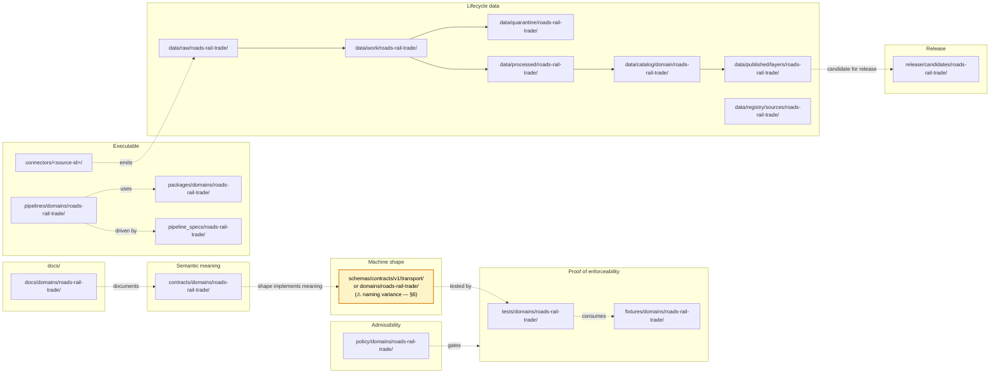

<!-- [KFM_META_BLOCK_V2]
doc_id: kfm://doc/docs/domains/roads-rail-trade/missing_or_planned_files
title: Roads, Rail, and Trade Routes — Missing or Planned Files
type: standard
version: v1
status: draft
owners: TBD — Roads/Rail/Trade domain stewards + Directory Rules reviewers
created: 2026-05-19
updated: 2026-05-19
policy_label: public
related:
  - docs/doctrine/directory-rules.md
  - docs/registers/VERIFICATION_BACKLOG.md
  - docs/registers/DRIFT_REGISTER.md
  - docs/domains/roads-rail-trade/README.md
  - docs/atlases/KFM_Domains_Culmination_Atlas_v1_1.pdf
  - kfm://doc/docs/standards/PROV
tags: [kfm, roads, rail, trade, transport, planning, directory-rules, backlog]
notes:
  - Repository not mounted in this session; all path claims are PROPOSED unless cited to doctrine.
  - Tracks the roads-rail-trade domain lane file inventory per Directory Rules §12.
  - Known slug-vs-segment variance: docs/domains/roads-rail-trade/ vs schemas/contracts/v1/transport/ — see §6.
[/KFM_META_BLOCK_V2] -->

# 🛤️ Roads, Rail, and Trade Routes — Missing or Planned Files

> Working inventory of every file the **roads-rail-trade** domain lane is expected to carry under Directory Rules §12 (Domain Placement Law), what its placement should be, and whether it is currently **present, planned, missing, deferred, or unverified**.

[](#)
[](#)
[](#)
[](#)
[](#)
[](../../doctrine/directory-rules.md)
[](#)
[](#)

| Field | Value |
|---|---|
| **Status** | `draft` — not yet reviewed |
| **Domain slug (Directory Rules §12)** | `roads-rail-trade` |
| **Schema segment (Atlas v1.1 §24.13)** | `transport` — *variance, ADR needed* |
| **Atlas chapter** | Ch. 13 — Roads, Rail, and Trade Routes |
| **Source dossier short-name** | `[DOM-ROADS]` |
| **Owners** | TBD — roads-rail-trade stewards + Directory Rules reviewers |
| **Last updated** | 2026-05-19 |
| **Repository inspection** | ❌ not performed this session — every path claim is **PROPOSED** until verified |

---

## Contents

- [1. Purpose and scope](#1-purpose-and-scope)
- [2. How to read this register](#2-how-to-read-this-register)
- [3. Status legend](#3-status-legend)
- [4. Lane summary diagram](#4-lane-summary-diagram)
- [5. Domain context — Roads, Rail, and Trade Routes](#5-domain-context--roads-rail-and-trade-routes)
- [6. Naming variance — `roads-rail-trade` vs `transport`](#6-naming-variance--roads-rail-trade-vs-transport)
- [7. File inventory by responsibility root](#7-file-inventory-by-responsibility-root)
  - [7.1 `docs/domains/roads-rail-trade/`](#71-docsdomainsroads-rail-trade)
  - [7.2 `contracts/domains/roads-rail-trade/`](#72-contractsdomainsroads-rail-trade)
  - [7.3 `schemas/contracts/v1/...` (transport / domains)](#73-schemascontractsv1-transport--domains)
  - [7.4 `policy/domains/roads-rail-trade/`](#74-policydomainsroads-rail-trade)
  - [7.5 `tests/domains/roads-rail-trade/`](#75-testsdomainsroads-rail-trade)
  - [7.6 `fixtures/domains/roads-rail-trade/`](#76-fixturesdomainsroads-rail-trade)
  - [7.7 `packages/domains/roads-rail-trade/`](#77-packagesdomainsroads-rail-trade)
  - [7.8 `pipelines/domains/roads-rail-trade/` and `pipeline_specs/roads-rail-trade/`](#78-pipelinesdomainsroads-rail-trade-and-pipeline_specsroads-rail-trade)
  - [7.9 `data/<phase>/roads-rail-trade/` (lifecycle lanes)](#79-dataphaseroads-rail-trade-lifecycle-lanes)
  - [7.10 `release/candidates/roads-rail-trade/`](#710-releasecandidatesroads-rail-trade)
  - [7.11 Connectors, registries, control plane](#711-connectors-registries-control-plane)
- [8. Cross-domain references](#8-cross-domain-references)
- [9. Open questions and verification backlog](#9-open-questions-and-verification-backlog)
- [10. Promotion and intake workflow](#10-promotion-and-intake-workflow)
- [11. Related docs](#11-related-docs)
- [12. Change log](#12-change-log)

---

## 1. Purpose and scope

This document is the **planning register** for the roads-rail-trade domain. It enumerates the files that the project's doctrine — Directory Rules §12 (Domain Placement Law), Atlas v1.1 Ch. 13 (Roads / Rail / Trade Routes), and the Encyclopedia spine — implies should exist for this domain lane, and tracks each file's current status against the repository.

> [!IMPORTANT]
> **This is a register, not a roadmap.** Inclusion of a file in any table below is **not** authorization to create it. Creation requires the Directory Rules §4 Placement Protocol, an owning per-root README (§9), and — where §2.4 applies — an ADR. The register exists so that *omissions are visible* and so that drift between doctrine and implementation can be detected.

> [!NOTE]
> **Scope.** This register tracks files **owned by or primarily serving** the roads-rail-trade domain lane. Files that legitimately span multiple domains (e.g., shared geometry validators, the Spatial Foundation reference frame) belong under non-domain segments per Directory Rules §12 "Multi-domain and cross-cutting files" and are intentionally **not** listed here.

[↑ back to top](#-roads-rail-and-trade-routes--missing-or-planned-files)

---

## 2. How to read this register

Each section below maps to one **responsibility root** under Directory Rules §3. Within each section, a table lists:

- **Path** — the PROPOSED file path under that root, following the Directory Rules §12 lane pattern.
- **Purpose** — one-line statement of what the file does.
- **Status** — present / planned / missing / deferred / NEEDS VERIFICATION (see §3).
- **Citation basis** — the doctrine source(s) that justify the file's existence.
- **Notes** — gating conditions, ADR dependencies, naming variances, or risks.

> [!WARNING]
> **No path here is authoritative.** Every concrete repo path is **PROPOSED** until verified against a mounted repository. The "Status" column reflects this session's inspection — which was **not** performed against a live repo. When the repo is mounted, statuses should be revised in a follow-up pass and reflected in the `Change log` (§12).

[↑ back to top](#-roads-rail-and-trade-routes--missing-or-planned-files)

---

## 3. Status legend

| Symbol | Status | Meaning |
|:---:|---|---|
| ✅ | **present** | Verified in the mounted repo this session. (Currently unused — repo not mounted.) |
| 🟡 | **planned** | Path is PROPOSED in doctrine, an ADR, or a prior-session artifact; not yet authored. |
| 🔴 | **missing** | Doctrine clearly expects this file; no draft known to exist; gap is open. |
| ⏸️ | **deferred** | Doctrine expects this file but ADR or scoping decision blocks authoring (e.g., schema home pending ADR-0001 amendment). |
| 🔍 | **NEEDS VERIFICATION** | Existence or content cannot be determined this session; mounted-repo inspection required. |
| ⚠️ | **CONFLICTED** | Two or more candidate placements exist (e.g., parallel schema homes); ADR required. |

Truth labels per the project's standard discipline:

- **CONFIRMED** — verified from attached doctrine or workspace evidence this session.
- **PROPOSED** — design or placement not yet verified in implementation.
- **INFERRED** — reasonably derivable from visible evidence but not directly stated.
- **NEEDS VERIFICATION** — checkable, but not checked strongly enough to act as fact.
- **UNKNOWN** — not resolvable without more evidence.

[↑ back to top](#-roads-rail-and-trade-routes--missing-or-planned-files)

---

## 4. Lane summary diagram

The diagram below shows the **expected lane pattern** for the roads-rail-trade domain per Directory Rules §12. It is a *target shape*, not a claim about the current repo.



> [!NOTE]
> The dashed lines are **doctrinal relationships** (Directory Rules §6.3–§6.5 and §9.1), not implementation arrows. The orange-bordered node marks a **known naming variance** discussed in §6.

[↑ back to top](#-roads-rail-and-trade-routes--missing-or-planned-files)

---

## 5. Domain context — Roads, Rail, and Trade Routes

CONFIRMED doctrine (Atlas v1.1 Ch. 13.A–B, `[DOM-ROADS]` `[ENCY]`): this domain governs Kansas roads, rail, historic routes, trade and mobility corridors, restrictions, facilities, graph projections, catalog/proof/release objects, governed APIs, MapLibre UI, Evidence Drawer, Focus Mode, correction, and rollback.

**This domain owns** (Atlas v1.1 §13.B):

> Road Segment · Historic Route · Rail Segment · Depot · Siding · Yard · Crossing · Bridge · Ferry · River Crossing · Freight Corridor · Route Event · Operator Status · Access Restriction · Network Edge · Movement Story Node

**This domain explicitly does not own** (Atlas v1.1 §13.B):

| Concern | Owner |
|---|---|
| Settlement and infrastructure canonical claims | Settlements/Infrastructure |
| Water evidence (bridge/ferry/ford context only) | Hydrology |
| Site truth and sensitivity for archaeological resources | Archaeology |
| Living-person and land-parcel claims | People/Land |
| Hazard event authority | Hazards |

**Source families** (Atlas v1.1 §13.D, plus Pass-10 C10-05 expansion):

| Source family | Typical role | Sensitivity / rights | Status |
|---|---|---|---|
| Census TIGER/Line roads | observation / context | NEEDS VERIFICATION | CONFIRMED in doctrine |
| FHWA HPMS | observation / context | NEEDS VERIFICATION | CONFIRMED in doctrine |
| FHWA National Highway Freight Network | observation | NEEDS VERIFICATION | CONFIRMED in doctrine |
| WZDx feeds (Work Zone Data Exchange v4.x) | observation, near-real-time | NEEDS VERIFICATION | CONFIRMED in doctrine |
| KDOT / KanPlan / KanDrive / Kansas GIS | authority (Kansas) | NEEDS VERIFICATION | CONFIRMED in doctrine |
| County/state bridge and restriction data | authority / observation | NEEDS VERIFICATION | CONFIRMED in doctrine |
| GNIS names (place anchor) | observation | public | CONFIRMED in doctrine |
| OpenStreetMap | context / model | ODbL terms, legal-status DENY | CONFIRMED in doctrine |
| FRA GCIS (grade crossings) | authority | NEEDS VERIFICATION | INFERRED from Pass-10 C10-05 |
| FRA Form 57 (rail incidents) | authority | NEEDS VERIFICATION | INFERRED from Pass-10 C10-05 |
| STB Class I weekly reports | authority | NEEDS VERIFICATION | INFERRED from Pass-10 C10-05 |
| HIFLD / NTAD (rail geospatial) | context | NEEDS VERIFICATION | INFERRED from Pass-10 C10-05 |
| GTFS / GTFS-RT (transit) | observation | NEEDS VERIFICATION | INFERRED from Pass-10 C10-04 |

**Sensitivity posture** (Atlas v1.1 §13.I, CONFIRMED doctrine): Indigenous trade and mobility corridors, oral history, treaty, cultural, and interpretive evidence default to **steward review and generalized public geometry**. Critical transport facilities require review. Unclear rights, unresolved source role, missing evidence, unresolved sensitivity, or absent release state blocks public promotion.

[↑ back to top](#-roads-rail-and-trade-routes--missing-or-planned-files)

---

## 6. Naming variance — `roads-rail-trade` vs `transport`

> [!WARNING]
> **OPEN-DR (NEW) — Domain folder slug vs schema-home segment.** Two project sources name this domain's repo home differently. Both are *defensible*; both should be reconciled by ADR before this lane is built out.

| Surface | Slug used | Source |
|---|---|---|
| Directory Rules §12 Domain Placement Law (verbatim list) | `roads-rail-trade` | CONFIRMED — `directory-rules.md` §12 (line 784) |
| Directory Rules §6.1 `docs/` tree | `roads-rail-trade/` | CONFIRMED — `directory-rules.md` §6.1 |
| Atlas v1.1 §24.13 (Atlas ↔ Dossier ↔ Responsibility-Root Crosswalk) | `transport` | CONFIRMED — `schemas/contracts/v1/transport/`, `contracts/transport/` |
| Atlas v1.1 §24.13 notes | "Network identity governance" | CONFIRMED |
| Pass-10 / Encyclopedia capability indexing | mixed; uses both `roads-rail-trade` and `transport` | INFERRED |

**Why this matters.** Per Directory Rules §13.5 the *Schema mirror divergence* anti-pattern is "`schemas/` and `contracts/` (or `policies/` and `policy/`) evolve separately." A slug-vs-segment split that crosses responsibility roots — `docs/domains/roads-rail-trade/` but `contracts/transport/` — risks the same drift. Either:

- **Option A — slug parity.** Use `roads-rail-trade` everywhere: `docs/domains/roads-rail-trade/`, `schemas/contracts/v1/domains/roads-rail-trade/`, `contracts/domains/roads-rail-trade/`, etc. Matches Directory Rules §12 literally. ADR amends Atlas v1.1 §24.13.
- **Option B — semantic parity.** Use `transport` as the short, domain-meaning segment in `schemas/`, `contracts/`, and `policy/` (per Atlas v1.1 §24.13); keep `roads-rail-trade` only as the `docs/domains/` slug and `data/<phase>/` lane label. ADR amends Directory Rules §12.
- **Option C — dual slug.** Maintain both; declare one as the canonical segment with the other as compatibility alias. ADR documents both.

This register's tables below show **both forms** wherever the variance applies, and mark every affected path ⚠️ **CONFLICTED** until ADR resolution.

**Recommended posture pending ADR:** treat the **Directory Rules §12 slug `roads-rail-trade`** as the canonical lane label for `docs/`, `tests/`, `fixtures/`, `data/`, `release/`, and `packages/` (Option A bias). Continue to record the `transport` segment from Atlas v1.1 §24.13 in `docs/registers/DRIFT_REGISTER.md` until reconciled.

| Verification target | Evidence that would settle it |
|---|---|
| Whether Directory Rules §12 list was authored before or after Atlas v1.1 §24.13 | Git log + commit metadata on `directory-rules.md` and the Atlas PDF generation date |
| Whether Atlas v1.1 §24.13 intended `transport` as a *short identifier* rather than a folder slug | Author intent in the Atlas v1.1 supersession appendix |
| Whether a prior-session ADR (e.g., a hypothetical ADR-000N) already settled this | `docs/adr/` inspection on a mounted repo |
| Whether other Atlas §24.13 rows have analogous variances (e.g., `settlements-infrastructure` vs `settlement`) | Cross-check all 14 rows in §24.13 against Directory Rules §12 list |

[↑ back to top](#-roads-rail-and-trade-routes--missing-or-planned-files)

---

## 7. File inventory by responsibility root

> [!NOTE]
> Every path below is **PROPOSED** unless explicitly cited otherwise. The repository is not mounted in this session; ✅ "present" cannot truthfully be asserted for any row.

### 7.1 `docs/domains/roads-rail-trade/`

Human-facing documentation for the domain. Owned by `docs/` per Directory Rules §6.1.

| Path | Purpose | Status | Citation basis | Notes |
|---|---|:---:|---|---|
| `docs/domains/roads-rail-trade/README.md` | Domain entry-point: scope, boundaries, terminology, ownership, link-out hub | 🔴 | Directory Rules §9 (per-root README required); Atlas v1.1 §13 | Should mirror Atlas v1.1 §13.A–N section headings |
| `docs/domains/roads-rail-trade/MISSING_OR_PLANNED_FILES.md` | **This file** — planning register | 🟡 | This document | Authored 2026-05-19 |
| `docs/domains/roads-rail-trade/UBIQUITOUS_LANGUAGE.md` | Term glossary (Road Segment, Rail Segment, CorridorRoute, RouteMembership, Network Node, Crossing, TransportFacility, RestrictionEvent, StatusEvent, OperatorAssignment, Historic RouteClaim, TradeRouteCorridor) | 🔴 | Atlas v1.1 §13.C (CONFIRMED 12 terms) | DDD reference also cites Ubiquitous Language as pattern |
| `docs/domains/roads-rail-trade/OBJECT_FAMILIES.md` | Per-object purpose, identity rule, temporal handling | 🔴 | Atlas v1.1 §13.E (CONFIRMED list of 16 owned objects) | Should cross-reference `contracts/domains/roads-rail-trade/` |
| `docs/domains/roads-rail-trade/SOURCE_FAMILIES.md` | Per-source role, rights, freshness, ingest cadence | 🔴 | Atlas v1.1 §13.D; Pass-10 C10-05 (rail); Pass-10 C3 (transit) | Rights tier per source — NEEDS VERIFICATION |
| `docs/domains/roads-rail-trade/PIPELINE.md` | RAW → PUBLISHED diagram + per-stage gates for this domain | 🔴 | Atlas v1.1 §13.H | Should reuse the canonical lifecycle diagram |
| `docs/domains/roads-rail-trade/SENSITIVITY.md` | Indigenous corridor posture, critical-facility review, historic uncertainty handling | 🔴 | Atlas v1.1 §13.I (CONFIRMED); `[DOM-ARCH]` cross-link required | Must coordinate with archaeology sovereignty review path |
| `docs/domains/roads-rail-trade/HISTORIC_ROUTES.md` | Santa Fe Trail, Pony Express, Butterfield/Smoky Hill, Chisholm Trail, military and cattle corridors — claim handling | 🟡 | Atlas v1.1 §13.B; Pass-32 KFM-P20-PROG-0013 ("Frontier routes FeatureCollection builder") | Authoring should follow `Historic RouteClaim` semantics, not assert canonical geometry |
| `docs/domains/roads-rail-trade/GRAPH_PROJECTIONS.md` | Derived graph/connectivity view doctrine; non-canonical-truth rule | 🔴 | Atlas v1.1 §13.G (PROPOSED "derived graph/connectivity view"); Unified Manual §6.8 (graph projections doctrine) | Must enforce "routing/traversal graphs do not replace canonical records" |
| `docs/domains/roads-rail-trade/API_SURFACES.md` | Endpoint inventory and DTO map (RoadsRailDecisionEnvelope, LayerManifest, EvidenceDrawerPayload, AIReceipt) | 🔴 | Atlas v1.1 §13.J (PROPOSED; exact route UNKNOWN) | Endpoint routes are NEEDS VERIFICATION |
| `docs/domains/roads-rail-trade/VERIFICATION_BACKLOG.md` | Domain-specific open questions (mirrors Atlas §13.N) | 🟡 | Atlas v1.1 §13.N (4 items) | May be folded into central `docs/registers/VERIFICATION_BACKLOG.md` instead — see §9 |
| `docs/domains/roads-rail-trade/CHANGELOG.md` | Lineage record for this domain's docs | 🟡 | DDD pattern; precedent from `docs/encyclopedia/` | Optional; depends on doc-velocity |

### 7.2 `contracts/domains/roads-rail-trade/`

Semantic meaning of domain objects (Markdown). Per Directory Rules §6.3.

> ⚠️ **CONFLICTED** path segment — Atlas v1.1 §24.13 uses `contracts/transport/`. See §6.

| Path (Option A — slug parity) | Purpose | Status | Citation basis | Notes |
|---|---|:---:|---|---|
| `contracts/domains/roads-rail-trade/README.md` | Per-root index of object meanings in this domain | 🔴 | Directory Rules §6.3, §9 | |
| `contracts/domains/roads-rail-trade/road_segment.md` | Meaning, invariants, time semantics for Road Segment | 🔴 | Atlas v1.1 §13.E | |
| `contracts/domains/roads-rail-trade/rail_segment.md` | Meaning, invariants for Rail Segment | 🔴 | Atlas v1.1 §13.E | |
| `contracts/domains/roads-rail-trade/historic_route_claim.md` | Claim semantics (not canonical geometry) for Historic Route | 🔴 | Atlas v1.1 §13.C; §13.I (overprecision DENY) | Tied to sensitivity policy |
| `contracts/domains/roads-rail-trade/trade_route_corridor.md` | Generalized corridor semantics | 🔴 | Atlas v1.1 §13.C | |
| `contracts/domains/roads-rail-trade/corridor_route.md` | Composite route identity rule | 🔴 | Atlas v1.1 §13.C | |
| `contracts/domains/roads-rail-trade/route_membership.md` | Membership relation between segments and a CorridorRoute | 🔴 | Atlas v1.1 §13.C | |
| `contracts/domains/roads-rail-trade/network_node.md` | Network identity governance unit | 🔴 | Atlas v1.1 §13.C; §24.13 notes ("Network identity governance") | |
| `contracts/domains/roads-rail-trade/network_edge.md` | Edge between Network Nodes | 🔴 | Atlas v1.1 §13.B | |
| `contracts/domains/roads-rail-trade/crossing.md` | Grade crossing semantics; FRA GCIS cross-reference | 🔴 | Atlas v1.1 §13.C; Pass-10 C10-05 | Coords disagreement (GCIS vs HIFLD) is a noted tension |
| `contracts/domains/roads-rail-trade/bridge.md` | Bridge semantics; Hydrology cross-lane link | 🔴 | Atlas v1.1 §13.B, §13.F | |
| `contracts/domains/roads-rail-trade/ferry.md` | Ferry semantics | 🔴 | Atlas v1.1 §13.E | |
| `contracts/domains/roads-rail-trade/river_crossing.md` | River-crossing semantics (ford/bridge/ferry) | 🔴 | Atlas v1.1 §13.B, §13.F | |
| `contracts/domains/roads-rail-trade/depot.md` | Depot semantics (rail) | 🔴 | Atlas v1.1 §13.B | |
| `contracts/domains/roads-rail-trade/siding.md` | Rail siding semantics | 🔴 | Atlas v1.1 §13.B | |
| `contracts/domains/roads-rail-trade/yard.md` | Rail yard semantics | 🔴 | Atlas v1.1 §13.B | |
| `contracts/domains/roads-rail-trade/transport_facility.md` | Generic transport facility (umbrella) | 🔴 | Atlas v1.1 §13.E | |
| `contracts/domains/roads-rail-trade/freight_corridor.md` | Freight corridor identity | 🔴 | Atlas v1.1 §13.B; FHWA NHFN source | |
| `contracts/domains/roads-rail-trade/route_event.md` | Route-level events (designation, decommission) | 🔴 | Atlas v1.1 §13.B | |
| `contracts/domains/roads-rail-trade/operator_status.md` | Operator/agency state at a point in time | 🔴 | Atlas v1.1 §13.B | |
| `contracts/domains/roads-rail-trade/operator_assignment.md` | OperatorAssignment relation semantics | 🔴 | Atlas v1.1 §13.C | |
| `contracts/domains/roads-rail-trade/access_restriction.md` | Access/closure/restriction semantics | 🔴 | Atlas v1.1 §13.B | |
| `contracts/domains/roads-rail-trade/restriction_event.md` | Time-bounded restriction event (e.g., WZDx work zone) | 🔴 | Atlas v1.1 §13.C; Pass-32 KFM-P8-PROG-0025 (WZDx v4.x) | |
| `contracts/domains/roads-rail-trade/status_event.md` | Time-bounded status change | 🔴 | Atlas v1.1 §13.C | |
| `contracts/domains/roads-rail-trade/movement_story_node.md` | Narrative anchor for movement stories | 🔴 | Atlas v1.1 §13.B | |
| `contracts/domains/roads-rail-trade/route_uncertainty_profile.md` | Per-route uncertainty profile (historic and modern) | 🔴 | Atlas v1.1 §13.N (item: "Implement RouteUncertaintyProfile") | Listed as NEEDS VERIFICATION in Atlas backlog |

### 7.3 `schemas/contracts/v1/...` (transport / domains)

Machine validation shape. Per Directory Rules §6.4 and **ADR-0001** (`schemas/contracts/v1/...` is canonical).

> ⚠️ **CONFLICTED** segment — Atlas v1.1 §24.13 lists `schemas/contracts/v1/transport/`; Directory Rules §12 implies `schemas/contracts/v1/domains/roads-rail-trade/`. See §6.

| Path (showing both candidate forms) | Purpose | Status | Citation basis | Notes |
|---|---|:---:|---|---|
| `schemas/contracts/v1/domains/roads-rail-trade/README.md`<br/>OR `schemas/contracts/v1/transport/README.md` | Per-root index of machine schemas in this domain | 🔴 | Directory Rules §6.4, §9 | Pick one — §6 |
| `.../road_segment.schema.json` | JSON Schema for Road Segment | 🔴 | Atlas v1.1 §13.J ("Schema responsibility root: `schemas/contracts/v1/`") | |
| `.../rail_segment.schema.json` | JSON Schema for Rail Segment | 🔴 | Atlas v1.1 §13.J | |
| `.../historic_route_claim.schema.json` | JSON Schema for Historic Route Claim (includes overprecision DENY field constraints) | 🔴 | Atlas v1.1 §13.E, §13.I | |
| `.../trade_route_corridor.schema.json` | JSON Schema for Trade Route Corridor (generalized geometry) | 🔴 | Atlas v1.1 §13.C | |
| `.../corridor_route.schema.json` | JSON Schema for Corridor Route | 🔴 | Atlas v1.1 §13.C | |
| `.../route_membership.schema.json` | JSON Schema for Route Membership relation | 🔴 | Atlas v1.1 §13.C | |
| `.../network_node.schema.json` | JSON Schema for Network Node | 🔴 | Atlas v1.1 §13.C | |
| `.../network_edge.schema.json` | JSON Schema for Network Edge | 🔴 | Atlas v1.1 §13.B | |
| `.../crossing.schema.json` | JSON Schema for Crossing (with GCIS-compatible id space) | 🔴 | Atlas v1.1 §13.C; Pass-10 C10-05 | |
| `.../bridge.schema.json` | JSON Schema for Bridge | 🔴 | Atlas v1.1 §13.B | |
| `.../ferry.schema.json` | JSON Schema for Ferry | 🔴 | Atlas v1.1 §13.E | |
| `.../river_crossing.schema.json` | JSON Schema for River Crossing | 🔴 | Atlas v1.1 §13.B | |
| `.../depot.schema.json` | JSON Schema for Depot | 🔴 | Atlas v1.1 §13.B | |
| `.../siding.schema.json` | JSON Schema for Siding | 🔴 | Atlas v1.1 §13.B | |
| `.../yard.schema.json` | JSON Schema for Yard | 🔴 | Atlas v1.1 §13.B | |
| `.../transport_facility.schema.json` | JSON Schema for Transport Facility | 🔴 | Atlas v1.1 §13.E | |
| `.../freight_corridor.schema.json` | JSON Schema for Freight Corridor | 🔴 | Atlas v1.1 §13.B | |
| `.../route_event.schema.json` | JSON Schema for Route Event | 🔴 | Atlas v1.1 §13.B | |
| `.../operator_status.schema.json` | JSON Schema for Operator Status | 🔴 | Atlas v1.1 §13.B | |
| `.../operator_assignment.schema.json` | JSON Schema for Operator Assignment | 🔴 | Atlas v1.1 §13.C | |
| `.../access_restriction.schema.json` | JSON Schema for Access Restriction | 🔴 | Atlas v1.1 §13.B | |
| `.../restriction_event.schema.json` | JSON Schema for Restriction Event (WZDx-compatible) | 🔴 | Atlas v1.1 §13.C; Pass-32 KFM-P8-PROG-0025 | |
| `.../status_event.schema.json` | JSON Schema for Status Event | 🔴 | Atlas v1.1 §13.C | |
| `.../movement_story_node.schema.json` | JSON Schema for Movement Story Node | 🔴 | Atlas v1.1 §13.B | |
| `.../route_uncertainty_profile.schema.json` | JSON Schema for Route Uncertainty Profile | 🔴 | Atlas v1.1 §13.N (PROPOSED) | |
| `.../roads_rail_decision_envelope.schema.json` | JSON Schema for RoadsRailDecisionEnvelope (governed API DTO) | 🔴 | Atlas v1.1 §13.J | ANSWER / ABSTAIN / DENY / ERROR enum |
| `.../evidence_drawer_payload_roads.schema.json` | JSON Schema for Evidence Drawer payload projection in this domain | 🔴 | Atlas v1.1 §13.J | |
| `.../layer_manifest_roads.schema.json` | JSON Schema for layer manifest descriptor | 🔴 | Atlas v1.1 §13.J | |

### 7.4 `policy/domains/roads-rail-trade/`

Admissibility — allow / deny / restrict / abstain decisions. Per Directory Rules §6.5.

> ⚠️ **CONFLICTED** segment — see §6. Atlas v1.1 §24.13 does not explicitly call out a `policy/transport/` home for this domain; the Directory Rules pattern is `policy/domains/<slug>/`.

| Path | Purpose | Status | Citation basis | Notes |
|---|---|:---:|---|---|
| `policy/domains/roads-rail-trade/README.md` | Per-root index of policy bundles for this domain | 🔴 | Directory Rules §9 | |
| `policy/domains/roads-rail-trade/legal_status_deny.rego` | DENY when OSM / GNIS data is used as legal authority | 🔴 | Atlas v1.1 §13.K (PROPOSED test); Pass-10 governance | OSM/GNIS legal-status denial test |
| `policy/domains/roads-rail-trade/historic_overprecision_deny.rego` | DENY public exposure of overprecise historic geometry | 🔴 | Atlas v1.1 §13.K (PROPOSED test); §13.I sensitivity | Tied to `route_uncertainty_profile.schema.json` |
| `policy/domains/roads-rail-trade/indigenous_corridor_review.rego` | Require steward review for Indigenous trade/mobility corridors | 🔴 | Atlas v1.1 §13.I (CONFIRMED doctrine) | Coordinates with archaeology sovereignty review path |
| `policy/domains/roads-rail-trade/critical_facility_review.rego` | Require review for critical transport facilities (bridges, key crossings) | 🔴 | Atlas v1.1 §13.I (CONFIRMED doctrine) | |
| `policy/domains/roads-rail-trade/route_designation_separation.rego` | Enforce separation between Route Designation, Route Membership, and Route Geometry | 🔴 | Atlas v1.1 §13.K (PROPOSED test: "Route membership and designation separation tests") | |
| `policy/domains/roads-rail-trade/operator_status_temporal.rego` | Enforce operator/status temporal validity (no overlapping operator assignments without resolution) | 🔴 | Atlas v1.1 §13.K (PROPOSED test) | |
| `policy/domains/roads-rail-trade/public_generalization_required.rego` | Public-release path MUST carry a generalization receipt | 🔴 | Atlas v1.1 §13.K (PROPOSED test); doctrine on Redaction Receipt | |
| `policy/domains/roads-rail-trade/graph_projection_non_canonical.rego` | DENY treating derived graph projections as canonical record source | 🔴 | Unified Manual §6.8; doctrine on watcher-as-non-publisher | |
| `policy/domains/roads-rail-trade/source_rights_gate.rego` | Per-source rights and current terms enforcement (TIGER, HPMS, NHFN, WZDx, KDOT, OSM, etc.) | 🔴 | Atlas v1.1 §13.D ("rights and current terms NEEDS VERIFICATION") | Per-source policy fragments |

### 7.5 `tests/domains/roads-rail-trade/`

Proof the rules are enforceable. Per Directory Rules §6.

| Path | Purpose | Status | Citation basis | Notes |
|---|---|:---:|---|---|
| `tests/domains/roads-rail-trade/README.md` | Per-root index of domain test layout | 🔴 | Directory Rules §9 | |
| `tests/domains/roads-rail-trade/test_route_designation_separation.py` | Route membership and designation separation tests | 🔴 | Atlas v1.1 §13.K (PROPOSED) | Negative-state rule per Directory Rules §7.5 |
| `tests/domains/roads-rail-trade/test_operator_status_temporal.py` | Operator/status temporal tests | 🔴 | Atlas v1.1 §13.K (PROPOSED) | |
| `tests/domains/roads-rail-trade/test_osm_gnis_legal_status_deny.py` | OSM/GNIS legal-status denial | 🔴 | Atlas v1.1 §13.K (PROPOSED) | |
| `tests/domains/roads-rail-trade/test_historic_overprecision_deny.py` | Historic overprecision denial | 🔴 | Atlas v1.1 §13.K (PROPOSED) | |
| `tests/domains/roads-rail-trade/test_public_generalization_receipt.py` | Public generalization receipt presence tests | 🔴 | Atlas v1.1 §13.K (PROPOSED) | |
| `tests/domains/roads-rail-trade/test_transport_graph_rollback.py` | Transport graph projection rollback tests | 🔴 | Atlas v1.1 §13.K (PROPOSED); §13.M | |
| `tests/domains/roads-rail-trade/test_wzdx_v4_validator.py` | WZDx v4.x roadworks validator and transformer | 🔴 | Pass-32 KFM-P8-PROG-0025 | Fail-closed schema gate |
| `tests/domains/roads-rail-trade/test_gcis_hiflid_coords_disagreement.py` | GCIS vs HIFLD crossing coords disagreement handling | 🔴 | Pass-10 C10-05 (named open question) | |
| `tests/domains/roads-rail-trade/test_stb_snapshot_dedup.py` | STB Class I snapshot-week de-duplication | 🔴 | Pass-10 C10-05 (named tension) | |
| `tests/domains/roads-rail-trade/test_evidence_bundle_closure.py` | EvidenceBundle closure for domain claims | 🔴 | Atlas v1.1 §13.J, §13.M | |
| `tests/domains/roads-rail-trade/test_release_manifest_present.py` | ReleaseManifest presence on published artifacts | 🔴 | Atlas v1.1 §13.M | |

### 7.6 `fixtures/domains/roads-rail-trade/`

Golden valid / invalid sample data for tests. Per Directory Rules §6.

| Path | Purpose | Status | Citation basis | Notes |
|---|---|:---:|---|---|
| `fixtures/domains/roads-rail-trade/README.md` | Per-root index of fixtures | 🔴 | Directory Rules §9 | |
| `fixtures/domains/roads-rail-trade/valid/road_segment/` | Valid Road Segment examples | 🔴 | Schema testing standard | |
| `fixtures/domains/roads-rail-trade/valid/rail_segment/` | Valid Rail Segment examples | 🔴 | Schema testing standard | |
| `fixtures/domains/roads-rail-trade/valid/wzdx_v4/` | Valid WZDx v4.x payloads | 🔴 | Pass-32 KFM-P8-PROG-0025 | |
| `fixtures/domains/roads-rail-trade/valid/historic_route_claim/santa_fe_trail.json` | Santa Fe Trail claim fixture | 🔴 | Pass-32 KFM-P20-PROG-0013 | Generalized geometry only |
| `fixtures/domains/roads-rail-trade/valid/historic_route_claim/chisholm_trail.json` | Chisholm Trail claim fixture | 🔴 | Atlas v1.1 §13.B (historic routes) | |
| `fixtures/domains/roads-rail-trade/valid/historic_route_claim/pony_express.json` | Pony Express claim fixture | 🔴 | Pass-32 KFM-P20-PROG-0013 | |
| `fixtures/domains/roads-rail-trade/invalid/overprecise_historic_geometry.json` | Trigger historic-overprecision DENY | 🔴 | Atlas v1.1 §13.K | |
| `fixtures/domains/roads-rail-trade/invalid/osm_as_legal_authority.json` | Trigger OSM/GNIS legal-status DENY | 🔴 | Atlas v1.1 §13.K | |
| `fixtures/domains/roads-rail-trade/invalid/missing_evidence_ref.json` | Trigger ABSTAIN on missing EvidenceRef | 🔴 | Atlas v1.1 §13.J | |
| `fixtures/domains/roads-rail-trade/invalid/operator_overlap.json` | Trigger temporal operator-status conflict | 🔴 | Atlas v1.1 §13.K | |

### 7.7 `packages/domains/roads-rail-trade/`

Shared library code used by multiple deployables. Per Directory Rules §6.

| Path | Purpose | Status | Citation basis | Notes |
|---|---|:---:|---|---|
| `packages/domains/roads-rail-trade/README.md` | Per-root index of domain libraries | 🔴 | Directory Rules §9 | |
| `packages/domains/roads-rail-trade/identity/` | Deterministic identity for Road Segment, Rail Segment, Crossing, etc. | 🔴 | Atlas v1.1 §13.E (PROPOSED identity rule); doctrine on deterministic identity | |
| `packages/domains/roads-rail-trade/wzdx_v4_transformer/` | WZDx v4.x → GeoParquet/PMTiles transformer | 🔴 | Pass-32 KFM-P8-PROG-0025 | |
| `packages/domains/roads-rail-trade/graph_projection/` | Transport graph projection builder (non-canonical) | 🔴 | Unified Manual §6.8 | |
| `packages/domains/roads-rail-trade/generalization/` | Geometry generalization library with redaction-receipt emission | 🔴 | Atlas v1.1 §13.I, §13.K | |
| `packages/domains/roads-rail-trade/frontier_routes/` | Frontier routes FeatureCollection builder | 🔴 | Pass-32 KFM-P20-PROG-0013 | |

### 7.8 `pipelines/domains/roads-rail-trade/` and `pipeline_specs/roads-rail-trade/`

Executable pipeline logic + declarative pipeline configuration. Per Directory Rules §3 (placement table).

| Path | Purpose | Status | Citation basis | Notes |
|---|---|:---:|---|---|
| `pipelines/domains/roads-rail-trade/README.md` | Per-root index | 🔴 | Directory Rules §9 | |
| `pipelines/domains/roads-rail-trade/ingest_tiger_roads.py` | TIGER/Line roads RAW capture | 🔴 | Atlas v1.1 §13.D, §13.H | |
| `pipelines/domains/roads-rail-trade/ingest_fhwa_hpms.py` | FHWA HPMS RAW capture | 🔴 | Atlas v1.1 §13.D | |
| `pipelines/domains/roads-rail-trade/ingest_fhwa_nhfn.py` | FHWA National Highway Freight Network RAW capture | 🔴 | Atlas v1.1 §13.D | |
| `pipelines/domains/roads-rail-trade/ingest_wzdx_v4.py` | WZDx v4.x feed RAW capture | 🔴 | Pass-32 KFM-P8-PROG-0025 | Near-real-time cadence |
| `pipelines/domains/roads-rail-trade/ingest_kdot_kanplan_kandrive.py` | KDOT / KanPlan / KanDrive RAW capture | 🔴 | Atlas v1.1 §13.D | Kansas authority |
| `pipelines/domains/roads-rail-trade/ingest_fra_gcis.py` | FRA GCIS grade crossings RAW capture | 🔴 | Pass-10 C10-05 | |
| `pipelines/domains/roads-rail-trade/ingest_fra_form57.py` | FRA Form 57 RAW capture | 🔴 | Pass-10 C10-05 | |
| `pipelines/domains/roads-rail-trade/ingest_stb_class1.py` | STB Class I weekly snapshots | 🔴 | Pass-10 C10-05 | |
| `pipelines/domains/roads-rail-trade/ingest_hifld_ntad.py` | HIFLD / NTAD rail geospatial RAW capture | 🔴 | Pass-10 C10-05 | |
| `pipelines/domains/roads-rail-trade/normalize_to_road_segment.py` | RAW → PROCESSED for Road Segment | 🔴 | Atlas v1.1 §13.H | |
| `pipelines/domains/roads-rail-trade/normalize_to_rail_segment.py` | RAW → PROCESSED for Rail Segment | 🔴 | Atlas v1.1 §13.H | |
| `pipelines/domains/roads-rail-trade/build_corridor_route.py` | Composite CorridorRoute assembly | 🔴 | Atlas v1.1 §13.E | |
| `pipelines/domains/roads-rail-trade/build_historic_route_claim.py` | Historic Route Claim normalization (with generalization) | 🔴 | Atlas v1.1 §13.E, §13.I | |
| `pipelines/domains/roads-rail-trade/project_to_graph.py` | Derived graph projection (non-canonical) | 🔴 | Unified Manual §6.8 | |
| `pipelines/domains/roads-rail-trade/emit_catalog_records.py` | STAC/DCAT/PROV records + EvidenceBundle | 🔴 | Atlas v1.1 §13.H, §13.J | |
| `pipelines/domains/roads-rail-trade/emit_pmtiles_layers.py` | PMTiles per layer for published surface | 🔴 | Atlas v1.1 §13.G; Pass-32 KFM-P8-PROG-0025 | |
| `pipeline_specs/roads-rail-trade/README.md` | Per-root index of pipeline specs | 🔴 | Directory Rules §9 | |
| `pipeline_specs/roads-rail-trade/tiger_roads.yaml` | Declarative spec for TIGER ingest | 🔴 | Atlas v1.1 §13.D | |
| `pipeline_specs/roads-rail-trade/wzdx_v4.yaml` | Declarative spec for WZDx ingest + validator | 🔴 | Pass-32 KFM-P8-PROG-0025 | |
| `pipeline_specs/roads-rail-trade/fra_gcis.yaml` | Declarative spec for GCIS ingest | 🔴 | Pass-10 C10-05 | |
| `pipeline_specs/roads-rail-trade/historic_routes.yaml` | Declarative spec for historic-route claim assembly | 🔴 | Pass-32 KFM-P20-PROG-0013 | |

### 7.9 `data/<phase>/roads-rail-trade/` (lifecycle lanes)

Lifecycle data. Per Directory Rules §9.1. **Promotion is a governed state transition, not a file move.**

| Path | Purpose | Status | Citation basis | Notes |
|---|---|:---:|---|---|
| `data/raw/roads-rail-trade/<source_id>/<run_id>/` | Source-edge captures with retrieval metadata and checksums | 🔴 | Directory Rules §9.1 | Per-source subdirectory |
| `data/work/roads-rail-trade/<run_id>/` | Normalized intermediates, candidate assertions | 🔴 | Directory Rules §9.1 | |
| `data/quarantine/roads-rail-trade/<reason>/<run_id>/` | Failed validation / rights / sensitivity / overprecise geometry | 🔴 | Directory Rules §9.1 | |
| `data/processed/roads-rail-trade/<dataset_id>/<version>/` | Validated canonical records | 🔴 | Directory Rules §9.1 | |
| `data/catalog/domain/roads-rail-trade/` | Domain catalog records (STAC/DCAT/PROV) | 🔴 | Directory Rules §9.1; Atlas v1.1 §13.H | |
| `data/published/layers/roads-rail-trade/` | Released public-safe artifacts (PMTiles, GeoParquet, FeatureCollections) | 🔴 | Directory Rules §9.1; Atlas v1.1 §13.G, §13.H | |
| `data/registry/sources/roads-rail-trade/` | Per-source SourceDescriptor records | 🔴 | Directory Rules §9.1; Atlas v1.1 §13.D | |
| `data/rollback/roads-rail-trade/<release_id>/` | Alias-revert receipts (data plane) | 🔴 | Directory Rules §9.1 (OPEN: vs `release/rollback_cards/`) | See Directory Rules §18.a OPEN |
| `data/receipts/ingest/<run_id>/` (cross-cutting) | Process memory — ingest run receipts | 🔴 | Directory Rules §9.1 | Not domain-scoped |
| `data/proofs/evidence_bundle/<bundle_id>/` (cross-cutting) | EvidenceBundle objects backing domain claims | 🔴 | Directory Rules §9.1 | Not domain-scoped |

### 7.10 `release/candidates/roads-rail-trade/`

Release decisions. Per Directory Rules §3 (placement table).

| Path | Purpose | Status | Citation basis | Notes |
|---|---|:---:|---|---|
| `release/candidates/roads-rail-trade/README.md` | Per-root index of pending release candidates for this domain | 🔴 | Directory Rules §9 | |
| `release/candidates/roads-rail-trade/<release_id>/manifest.json` | ReleaseManifest for a candidate release | 🔴 | Atlas v1.1 §13.M; Directory Rules §9.1 | |
| `release/candidates/roads-rail-trade/<release_id>/proof_pack/` | ProofPack bundle for the release | 🔴 | Atlas v1.1 §13.M | |
| `release/rollback_cards/roads-rail-trade/<release_id>.md` | Rollback decision record | 🔴 | Atlas v1.1 §13.M; Directory Rules §18.a OPEN | Placement vs `data/rollback/` is OPEN |
| `release/correction_notices/roads-rail-trade/<notice_id>.md` | Correction notice records | 🔴 | Atlas v1.1 §13.M | |

### 7.11 Connectors, registries, control plane

Cross-cutting roots that touch this domain.

| Path | Purpose | Status | Citation basis | Notes |
|---|---|:---:|---|---|
| `connectors/wzdx/` | WZDx feed connector (not domain-scoped per Directory Rules §3) | 🔴 | Pass-32 KFM-P8-PROG-0025; Directory Rules §3 | Per-source connector |
| `connectors/fhwa_hpms/` | FHWA HPMS connector | 🔴 | Atlas v1.1 §13.D | |
| `connectors/fhwa_nhfn/` | FHWA NHFN connector | 🔴 | Atlas v1.1 §13.D | |
| `connectors/kdot/` | KDOT / KanPlan / KanDrive connector | 🔴 | Atlas v1.1 §13.D | |
| `connectors/fra_gcis/` | FRA GCIS connector | 🔴 | Pass-10 C10-05 | |
| `connectors/fra_form57/` | FRA Form 57 connector | 🔴 | Pass-10 C10-05 | |
| `connectors/stb_class1/` | STB Class I weekly reports connector | 🔴 | Pass-10 C10-05 | |
| `connectors/hifld/`, `connectors/ntad/` | HIFLD / NTAD connectors | 🔴 | Pass-10 C10-05 | |
| `connectors/tiger_line/` | Census TIGER/Line connector | 🔴 | Atlas v1.1 §13.D | |
| `connectors/osm/` | OSM connector (legal-status DENY enforced at policy) | 🔴 | Atlas v1.1 §13.D, §13.K | |
| `connectors/gnis/` | GNIS names connector | 🔴 | Atlas v1.1 §13.D | |
| `control_plane/source_authority_register.yaml` (entries for transport sources) | Per-source authority register entries | 🔴 | Directory Rules §6.2 | Not domain-scoped file; entries added |
| `control_plane/domain_lane_register.yaml` (entry for roads-rail-trade) | Domain lane register entry | 🔴 | Directory Rules §6.2 | |

[↑ back to top](#-roads-rail-and-trade-routes--missing-or-planned-files)

---

## 8. Cross-domain references

CONFIRMED doctrine (Atlas v1.1 §13.F): the roads-rail-trade lane has explicit cross-lane relations whose evidence boundaries MUST be preserved.

| This domain | Related lane | Relation | Constraint |
|---|---|---|---|
| Roads/Rail/Trade | Settlements/Infrastructure | depots, crossings, facilities, dependencies | Settlements owns facility identity. EvidenceBundle support required. |
| Roads/Rail/Trade | Hydrology | bridge / ferry / ford / river crossing | Hydrology owns water evidence. |
| Roads/Rail/Trade | Hazards | closure, detour, flood/fire/smoke exposure | Hazards owns hazard events. Roads/Rail/Trade cites; never asserts hazard authority. |
| Roads/Rail/Trade | Archaeology / Cultural Heritage | historic routes, Indigenous corridors, forts, missions | Archaeology owns site truth and sovereignty review path. Exact archaeological coordinates DENIED. |
| Roads/Rail/Trade | People / Genealogy / Land | historic-route biographical anchoring | People/Land owns living-person and parcel privacy. |
| Roads/Rail/Trade | Frontier Matrix | access cells in the time-aware matrix | Roads/Rail/Trade emits access observations; matrix consumes. |
| Roads/Rail/Trade | Atmosphere / Air | smoke / visibility context for status events | Atmosphere owns observations. |

> [!CAUTION]
> **Indigenous corridors and historic-route coordinates** are dual-sensitivity claims. Atlas v1.1 §13.I and §15 (Archaeology) both apply. Default to **steward review + generalized geometry + DENY on overprecision**. Treat any cross-lane import from archaeology as `T4 default-deny` in policy until reconciled per archaeology sovereignty workflow.

[↑ back to top](#-roads-rail-and-trade-routes--missing-or-planned-files)

---

## 9. Open questions and verification backlog

Items carried forward from Atlas v1.1 §13.N plus this register's new findings.

### 9.1 Carried from Atlas v1.1 §13.N

| ID | Item | Evidence that would settle it | Status |
|---|---|---|---|
| ROADS-V-01 | Verify KDOT / FHWA / FRA / WZDx source terms | Mounted repo files, source registry entries, rights tier per source | NEEDS VERIFICATION |
| ROADS-V-02 | Verify Indigenous / cultural corridor policy | Mounted policy bundles, archaeology coordination record, steward-review workflow | NEEDS VERIFICATION |
| ROADS-V-03 | Implement RouteUncertaintyProfile | Schema home, tests, fixtures, validator entry | NEEDS VERIFICATION |
| ROADS-V-04 | Verify transport graph and MapLibre integration | Layer manifest, governed API DTO, MapLibre layer wiring, Evidence Drawer payload | NEEDS VERIFICATION |

### 9.2 New in this register

| ID | Item | Evidence that would settle it | Status |
|---|---|---|---|
| ROADS-DR-01 | **Resolve `roads-rail-trade` vs `transport` naming variance** between Directory Rules §12 and Atlas v1.1 §24.13 | ADR (new) reconciling slug vs segment; entry in `docs/registers/DRIFT_REGISTER.md` | OPEN — see §6 |
| ROADS-DR-02 | Confirm `release/rollback_cards/roads-rail-trade/` vs `data/rollback/roads-rail-trade/` boundary | ADR — already noted as OPEN in Directory Rules §18.a | OPEN |
| ROADS-V-05 | Resolve GCIS vs HIFLD crossing-coordinate disagreement policy | Pass-10 C10-05 names the issue; ADR or per-source disambiguation rule needed | OPEN (Pass-10 named) |
| ROADS-V-06 | STB Class I weekly snapshot overlap — snapshot-week dedup contract | Pipeline spec + receipt design; pilot on BNSF Transcon per Pass-10 C10-05 | OPEN (Pass-10 named) |
| ROADS-V-07 | OSM ODbL terms current rights posture (re-publication, share-alike trigger) | Up-to-date OSMF licensing review + source registry rights tier | NEEDS VERIFICATION |
| ROADS-V-08 | Whether `connectors/wzdx/` should be domain-segmented or remain source-segmented | Directory Rules §3 ("Source-specific fetcher / admitter") prefers source-segmented; confirm | INFERRED — source-segmented |
| ROADS-V-09 | Whether historic-route claim handling needs its own ADR (it is the highest-risk surface in this domain) | Sovereignty review interaction; archaeology coordination minutes | OPEN |
| ROADS-V-10 | Whether `docs/domains/roads-rail-trade/VERIFICATION_BACKLOG.md` is a separate file or folded into central `docs/registers/VERIFICATION_BACKLOG.md` | Docs steward decision per Directory Rules §6.1 | OPEN — recommended fold-in |
| ROADS-V-11 | Final list of source families (canonical set) — Atlas §13.D lists 8; Pass-10 expands to 13+ | Source-family register entry; ADR if new family added | OPEN |

All NEEDS VERIFICATION items SHOULD be mirrored into `docs/registers/VERIFICATION_BACKLOG.md` per Directory Rules §18; OPEN items SHOULD have a corresponding `docs/registers/DRIFT_REGISTER.md` entry until ADR resolution per Directory Rules §2.5.

[↑ back to top](#-roads-rail-and-trade-routes--missing-or-planned-files)

---

## 10. Promotion and intake workflow

Before any file in this register is created, the Directory Rules §4 **Placement Protocol** must be applied:

```text
Step 1 — Identify the responsibility (exactly one)
Step 2 — Identify the lifecycle phase (data/ only)
Step 3 — Identify the domain segment (NEVER a root folder)
Step 4 — Confirm authority (per-root README exists; ADR if §2.4 applies)
```

When marking a row in this register as 🟢 **present** after authoring, include in the PR description:

<details>
<summary><b>Checklist (copy into PR description when authoring a file from this register)</b></summary>

```text
[ ] File path matches Directory Rules §12 lane pattern
[ ] Owning responsibility root has a current per-root README
[ ] If naming variance applies (§6), the chosen form is documented and a DRIFT entry exists until ADR
[ ] Truth labels (CONFIRMED / PROPOSED / NEEDS VERIFICATION) applied where confidence materially matters
[ ] EvidenceBundle / EvidenceRef closure obligations preserved
[ ] If sensitive (Indigenous corridor / historic-route / critical facility), sensitivity workflow followed
[ ] If destructive (schema break, policy reverse, lifecycle skip), ADR exists per Directory Rules §2.4
[ ] This register's row updated from 🟡/🔴 → ✅ in the same PR
[ ] Changelog entry added in §12
```

</details>

> [!TIP]
> Bias toward **smallest useful, reversible change**. A single new schema with its README, contract, fixtures, and a single denial test is a complete reversible slice. A whole-lane drop is not.

[↑ back to top](#-roads-rail-and-trade-routes--missing-or-planned-files)

---

## 11. Related docs

> Repository not mounted; all link targets are PROPOSED.

- 🟡 [`docs/domains/roads-rail-trade/README.md`](./README.md) — domain entry point (planned)
- 🟡 [`docs/doctrine/directory-rules.md`](../../doctrine/directory-rules.md) — Domain Placement Law §12; per-root README §9; ADR triggers §2.4
- 🟡 [`docs/registers/VERIFICATION_BACKLOG.md`](../../registers/VERIFICATION_BACKLOG.md) — central verification register
- 🟡 [`docs/registers/DRIFT_REGISTER.md`](../../registers/DRIFT_REGISTER.md) — naming-variance drift entries
- 🟡 [`docs/standards/PROV.md`](../../standards/PROV.md) — provenance standard profile (naming variance: `PROVENANCE.md` — see Directory Rules §18.b OPEN-DR-01)
- 🟡 [`docs/standards/PMTILES.md`](../../standards/PMTILES.md) — published-layer delivery format
- 🟡 [`docs/standards/OGC-API-TILES.md`](../../standards/OGC-API-TILES.md) — tile-API conformance reference
- 🟡 [`docs/standards/ISO-19115.md`](../../standards/ISO-19115.md) — geospatial metadata reference
- 🟡 [`docs/adr/README.md`](../../adr/README.md) — ADR index (ROADS-DR-01 belongs here)
- 🟡 [`docs/atlases/KFM_Domains_Culmination_Atlas_v1_1.pdf`](../../atlases/KFM_Domains_Culmination_Atlas_v1_1.pdf) — Atlas v1.1, Ch. 13 + §24.13
- 🟡 [`docs/runbooks/roads-rail-trade/`](../../runbooks/roads-rail-trade/) — runbook subfolder (none authored; convention pending Directory Rules §18.b OPEN-DR-02)

[↑ back to top](#-roads-rail-and-trade-routes--missing-or-planned-files)

---

## 12. Change log

| Date | Change | By |
|---|---|---|
| 2026-05-19 | Initial draft. Authored from doctrine — Atlas v1.1 Ch. 13, Directory Rules §12, Pass-10 C10-05 / C10-04, Pass-32 KFM-P8-PROG-0025 / KFM-P20-PROG-0013, Unified Manual §6.8. Repo not mounted; all repo-state claims PROPOSED or NEEDS VERIFICATION. Naming variance flagged in §6 and ROADS-DR-01. | TBD |

---

<sub>**Status:** draft · **Last updated:** 2026-05-19 · **Doctrine basis:** Directory Rules §12; Atlas v1.1 Ch. 13 + §24.13; Pass-10 C10-05; `[DOM-ROADS]` `[ENCY]`</sub>

[↑ back to top](#-roads-rail-and-trade-routes--missing-or-planned-files)
