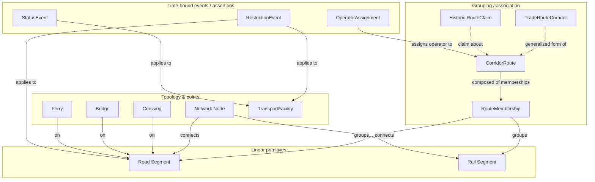

<!-- [KFM_META_BLOCK_V2]
doc_id: kfm://doc/roads-rail-trade-object-families
title: Roads, Rail & Trade Routes — Object Families
type: standard
version: v1
status: draft
owners: TODO-roads-rail-domain-steward
created: 2026-06-07
updated: 2026-06-07
policy_label: public
related: [docs/domains/roads-rail-trade/README.md, schemas/contracts/v1/domains/roads-rail/, contracts/domains/roads-rail/, policy/sensitivity/roads-rail/, ai-build-operating-contract.md]
tags: [kfm]
notes: [CONTRACT_VERSION = "3.0.0" pinned; object-family roster grounded in Atlas v1.0 Ch.13 §E and Ch.24.14; identity rule, source-role, and sensitivity columns are PROPOSED pending schema/ADR verification; path slug roads-rail-trade diverges from Atlas 24.13 crosswalk slug roads-rail and is an ADR candidate]
[/KFM_META_BLOCK_V2] -->

<a id="top"></a>

# 🛣️ Roads, Rail & Trade Routes — Object Families

> The canonical object-family roster for the Roads/Rail lane: what each family **is**, how it is **identified**, how its **source role** is preserved, and how **time** and **sensitivity** are handled — bounded to evidence, never sovereign by display.


<!-- TODO: replace placeholder badges with verified CI / build / last-updated endpoints once the repo is mounted -->

**Status:** `draft` · **Owners:** `TODO-roads-rail-domain-steward` · **Updated:** 2026-06-07 · **Contract:** `CONTRACT_VERSION = "3.0.0"`

---

## Quick jump

- [1. Scope & purpose](#1-scope--purpose)
- [2. Repo fit](#2-repo-fit)
- [3. What this lane owns / does not own](#3-what-this-lane-owns--does-not-own)
- [4. Object-family roster](#4-object-family-roster)
- [5. Family map (diagram)](#5-family-map-diagram)
- [6. Identity rule](#6-identity-rule)
- [7. Source role is identity (anti-collapse)](#7-source-role-is-identity-anti-collapse)
- [8. Temporal handling](#8-temporal-handling)
- [9. Sensitivity & publication posture](#9-sensitivity--publication-posture)
- [10. Cross-lane citation (ownership boundaries)](#10-cross-lane-citation-ownership-boundaries)
- [11. Lifecycle position](#11-lifecycle-position)
- [Open questions register](#open-questions-register)
- [Open verification backlog](#open-verification-backlog)
- [Changelog](#changelog-v0--v1)
- [Definition of done](#definition-of-done)
- [Related docs](#related-docs)

---

## 1. Scope & purpose

This document is the **object-family reference** for the Roads/Rail lane. It names the bounded set of object families the lane models, fixes their identity discipline, and binds each to source-role, temporal, and sensitivity rules so that downstream schemas, contracts, validators, and viewing products stay aligned to one vocabulary.

> [!NOTE]
> Object families here are **CONFIRMED doctrine** as a vocabulary spine; their **field-level realization** (schema bodies, identity-hash inputs, DTO shapes) is **PROPOSED / NEEDS VERIFICATION** until checked against a mounted repository. This doc describes the *meaning* of the families, not proof that schemas already implement them.

[↑ Back to top](#top)

---

## 2. Repo fit

| Aspect | Value | Status |
|---|---|---|
| This file | `docs/domains/roads-rail-trade/OBJECT_FAMILIES.md` | as requested |
| Responsibility root | `docs/` — "explain to humans" (Directory Rules §4, §12) | CONFIRMED rule |
| Domain segment | `roads-rail-trade` (lane inside `docs/`, never a root folder) | PROPOSED slug |
| Object **meaning** home | `contracts/domains/roads-rail/...` | PROPOSED |
| Object **shape** home | `schemas/contracts/v1/domains/roads-rail/...` (ADR-0001 canonical) | PROPOSED |
| Sensitivity policy home | `policy/sensitivity/roads-rail/...` | PROPOSED |
| Upstream doctrine | Atlas v1.0 Ch.13 §C/§E; Atlas v1.1 Ch.24.1, Ch.24.14 | CONFIRMED |

> [!IMPORTANT]
> **Slug divergence — ADR candidate.** The requested doc slug is `roads-rail-trade`, but the Atlas Crosswalk (Ch.24.13) and the cross-domain object index use the segment `roads-rail` for `schemas/contracts/v1/...` and `contracts/...`. Two different segment slugs for one lane risk a split-authority drift. Resolve to a single canonical segment via ADR; this doc honors the requested `docs/` slug while keeping schema/contract/policy homes on `roads-rail`. Flagged as `OQ-ROADS-OF-01`.

[↑ Back to top](#top)

---

## 3. What this lane owns / does not own

**Owns** — road and rail evidence and released derivatives, corridors and route membership, network topology, crossings/bridges/ferries, transport facilities, restriction/status events, operator assignments, and historic/trade-route claims. *(CONFIRMED / PROPOSED — Atlas Ch.13 §B)*

**Does not own** *(Atlas Ch.13 §B, CONFIRMED / PROPOSED):*

- **Settlements/Infrastructure** owns settlement and infrastructure canonical claims (depots, stations as infrastructure assets).
- **Hydrology** owns water evidence (a bridge/ferry/ford *cites* the crossing relation; the river is Hydrology's).
- **Archaeology / People / Land / Hazards** retain their own truth and sensitivity policies.

> [!CAUTION]
> A `TransportFacility` may carry **sensitive condition detail** (e.g., critical-infrastructure-adjacent restriction data). Such fields default to the **most restrictive applicable** sensitivity row and require steward review before public exposure. See [§9](#9-sensitivity--publication-posture). Do not include exact identifiers or restricted-source-derived condition fields without clearance.

[↑ Back to top](#top)

---

## 4. Object-family roster

The fourteen families below are the lane's vocabulary spine. **Family names are CONFIRMED doctrine; field realization is PROPOSED.**

| Object family | Purpose (what it represents) | Identity rule (PROPOSED basis) | Status |
|---|---|---|---|
| `Road Segment` | Road-segment evidence or released derivative within Roads/Rail. | source id + object role + temporal scope + normalized digest | CONFIRMED term / PROPOSED field |
| `Rail Segment` | Rail-segment evidence or released derivative. | source id + object role + temporal scope + normalized digest | CONFIRMED term / PROPOSED field |
| `CorridorRoute` | A named corridor/route grouping (e.g., highway, line, historic trail). | source id + object role + temporal scope + normalized digest | CONFIRMED term / PROPOSED field |
| `RouteMembership` | Membership of a segment in a corridor/route (associative). | source id + object role + temporal scope + normalized digest | CONFIRMED term / PROPOSED field |
| `Network Node` | A topological node (junction, terminus) in the transport graph. | source id + object role + temporal scope + normalized digest | CONFIRMED term / PROPOSED field |
| `Crossing` | A crossing point (grade crossing, intersection, river crossing). | source id + object role + temporal scope + normalized digest | CONFIRMED term / PROPOSED field |
| `Bridge` | A bridge structure on a segment. | source id + object role + temporal scope + normalized digest | CONFIRMED term / PROPOSED field |
| `Ferry` | A ferry crossing / service. | source id + object role + temporal scope + normalized digest | CONFIRMED term / PROPOSED field |
| `TransportFacility` | A facility (depot, station, yard, roster entry). | source id + object role + temporal scope + normalized digest | CONFIRMED term / PROPOSED field |
| `RestrictionEvent` | A restriction (weight/height/closure) bound to time and place. | source id + object role + temporal scope + normalized digest | CONFIRMED term / PROPOSED field |
| `StatusEvent` | A status/condition change event for a segment or facility. | source id + object role + temporal scope + normalized digest | CONFIRMED term / PROPOSED field |
| `OperatorAssignment` | Assignment of an operator/owner to a segment, line, or facility. | source id + object role + temporal scope + normalized digest | CONFIRMED term / PROPOSED field |
| `Historic RouteClaim` | A historical route assertion (claim, not observed event). | source id + object role + temporal scope + normalized digest | CONFIRMED term / PROPOSED field |
| `TradeRouteCorridor` | A generalized historic trade-route corridor. | source id + object role + temporal scope + normalized digest | CONFIRMED term / PROPOSED field |

> [!NOTE]
> The Atlas's **cross-domain object spine** (Ch.2) lists the lane's headline families as *Road Segment, Rail Segment, CorridorRoute, RouteMembership, Network Node, Crossing, Bridge, Ferry…* — an open-ended "…". The four families `StatusEvent`, `OperatorAssignment`, `Historic RouteClaim`, and `TradeRouteCorridor` appear in the Ch.13 §C ubiquitous-language list but are not all enumerated in every §E object table. They are retained here as **CONFIRMED terms** with **PROPOSED** object-family status pending §E reconciliation (`OQ-ROADS-OF-02`).

[↑ Back to top](#top)

---

## 5. Family map (diagram)



> [!NOTE]
> **NEEDS VERIFICATION.** Edge relationships above are an *illustrative* reading of the §C/§E vocabulary, not a verified schema graph. Cardinalities and exact association directions must be confirmed against `schemas/contracts/v1/domains/roads-rail/` once mounted.

[↑ Back to top](#top)

---

## 6. Identity rule

Each object family is an **entity** in the DDD sense — distinguished by a stable identity that runs through time even as attributes change, not by its attribute values.

```text
PROPOSED deterministic identity basis (all families):
    source id + object role + temporal scope + normalized digest

Operationalized via the system-wide spec_hash convention:
    JCS (RFC 8785) canonicalization → SHA-256 → recorded as jcs:sha256:<hex>
```

- **CONFIRMED doctrine:** identity is deterministic where practical; equality is a hash comparison, not a field-by-field walk.
- **PROPOSED:** the exact field set fed into the digest per family is unverified. The `spec_hash` (JCS+SHA-256, `jcs:sha256:<hex>`) is **CONFIRMED as the canonical convention** but its application to each Roads/Rail family is **NEEDS VERIFICATION**.

> [!IMPORTANT]
> Identity is **not** geometry. Two segments with identical coordinates from different sources, roles, or vintages are **distinct entities**. Geometry similarity must never collapse identity.

[↑ Back to top](#top)

---

## 7. Source role is identity (anti-collapse)

**CONFIRMED doctrine (Atlas Ch.24.1):** source role is a first-class identity attribute, **fixed at admission** in the `SourceDescriptor` and **preserved through every promotion**. Promotion never upgrades a role. The seven canonical roles:

`observed | regulatory | modeled | aggregate | administrative | candidate | synthetic`

For Roads/Rail the highest-risk collapse is **administrative-as-observed**:

> [!WARNING]
> **DENY:** an administrative compilation (e.g., a transport-facility roster, a deed/right-of-way index) presented as an **observed event timeline**. Required guardrail: preserve the source-role tag and use named event types (`RestrictionEvent`, `StatusEvent`) distinct from administrative records. *(Atlas Ch.24.1.2 — "Administrative compilation cited as observation"; domains at risk: People/Land, Settlements, **Roads**.)*

Each family's role is set by its source, not by the family name. A `Road Segment` may be `observed` (field survey), `administrative` (agency roster), `modeled` (reconstruction), or `candidate` (unmerged connector output) — and these are **not interchangeable**.

[↑ Back to top](#top)

---

## 8. Temporal handling

**CONFIRMED doctrine** for every family in this lane: the following time axes stay **distinct where material** and are never silently merged.

| Time axis | Meaning |
|---|---|
| source time | when the source asserts the fact held |
| observed time | when the observation/measurement was taken |
| valid time | the real-world interval the fact is true |
| retrieval time | when KFM fetched the source |
| release time | when KFM published the derivative |
| correction time | when a correction was issued |

This matters most for `RestrictionEvent`, `StatusEvent`, and `Historic RouteClaim`, where conflating *valid time* (when a closure was in effect) with *release time* (when KFM published it) would misrepresent the historical record.

[↑ Back to top](#top)

---

## 9. Sensitivity & publication posture

Sensitivity defaults are **PROPOSED** (Atlas Ch.24.14). Disposition for any specific object MUST route through the operating contract **§23.2 sensitive-domain decision matrix** — not re-derived here.

| Object family group | Sensitivity default (PROPOSED) | Note |
|---|---|---|
| `Road Segment` / `Rail Segment` / `CorridorRoute` | `T0` | Public-safe geometry/context. |
| `TransportFacility` | `T0` mostly; `T2`/`T4` for sensitive condition detail | Critical-infrastructure-adjacent detail fails closed. |
| `RestrictionEvent` / `StatusEvent` | follows underlying source/facility tier | Emergency-adjacent closures may inherit higher tiers. |

> [!CAUTION]
> Where rights, critical-infrastructure exposure, or precise location could enable harm, prefer **quarantine → generalize → redact → steward review** before publication, and emit a `RedactionReceipt` for any transform. Sensitive joins **fail closed** (Atlas Ch.13 §D). Link the disposition to `policy/sensitivity/roads-rail/` or surface that the entry is missing.

[↑ Back to top](#top)

---

## 10. Cross-lane citation (ownership boundaries)

Families here **cite** other lanes' truth; they never replace it. *(Atlas Ch.13 §F / Ch.24.14 — CONFIRMED / PROPOSED; each relation MUST preserve ownership, source role, sensitivity, and EvidenceBundle support.)*

| Related lane | Relation type | Constraint |
|---|---|---|
| Settlements/Infrastructure | depots, crossings, facilities, dependencies | Settlements owns the canonical infrastructure claim. |
| Hydrology | bridge / ferry / ford / river crossing | Hydrology owns the water evidence. |
| Hazards | closure, detour, flood/fire/smoke exposure | Hazard event owned by Hazards; cited as context. |
| Archaeology / Cultural Heritage | historic routes, Indigenous corridors, forts, missions | Steward review; generalize before public exposure. |

[↑ Back to top](#top)

---

## 11. Lifecycle position

**CONFIRMED doctrine / PROPOSED lane application** — every family moves through the governed lifecycle; promotion is a **state transition, not a file move**, and never upgrades source role.

```text
RAW → WORK / QUARANTINE → PROCESSED → CATALOG / TRIPLET → PUBLISHED
```

| Stage | Gate (PROPOSED) |
|---|---|
| RAW | `SourceDescriptor` exists (role, rights, sensitivity, citation, time, hash). |
| WORK / QUARANTINE | Validation + policy gate pass, or quarantine reason recorded. |
| PROCESSED | `EvidenceRef`, `ValidationReport`, digest closure exist. |
| CATALOG / TRIPLET | Catalog records + `EvidenceBundle` + release candidates. |
| PUBLISHED | Governed-API surface only; no `PUBLISHED` edge to WORK/QUARANTINE. |

> [!NOTE]
> A `candidate`-role object MUST NOT appear on a public surface; it routes to QUARANTINE until promoted (Atlas Ch.24.1.2).

[↑ Back to top](#top)

---

## Open questions register

| ID | Question | Owner role | Resolution path |
|---|---|---|---|
| `OQ-ROADS-OF-01` | Canonical lane segment slug: `roads-rail-trade` (docs) vs `roads-rail` (schemas/contracts/policy)? | Directory steward | ADR / Directory Rules §12 check |
| `OQ-ROADS-OF-02` | Are `StatusEvent`, `OperatorAssignment`, `Historic RouteClaim`, `TradeRouteCorridor` full object families or §C terms only? | Roads/Rail domain steward | §E reconciliation / repo inspection |
| `OQ-ROADS-OF-03` | Exact field set fed into each family's `spec_hash` identity digest? | Schema owner | `schemas/contracts/v1/domains/roads-rail/` inspection |
| `OQ-ROADS-OF-04` | Confirmed sensitivity tier for `TransportFacility` condition detail? | Policy steward + §23.2 matrix | `policy/sensitivity/roads-rail/` review |

## Open verification backlog

These items remain `NEEDS VERIFICATION` before promotion from `draft` to `published`:

1. Schema homes under `schemas/contracts/v1/domains/roads-rail/` exist and match the family roster.
2. `contracts/domains/roads-rail/` carries the semantic meaning for each family.
3. `SourceDescriptor` enforces `source_role` set-at-admission for ingested road/rail sources.
4. Mermaid family-map edges match verified schema associations and cardinalities.
5. `policy/sensitivity/roads-rail/` entries exist for `TransportFacility` and event families.
6. The lane segment slug is reconciled (`OQ-ROADS-OF-01`).

## Changelog v0 → v1

| Change | Type (per contract §37) | Reason |
|---|---|---|
| Initial object-family reference authored | new | No prior `OBJECT_FAMILIES.md` for this lane. |
| Roster consolidated from Atlas Ch.13 §C/§E + Ch.2 + Ch.24.14 | gap closure | Single-view roster for downstream schema/validator alignment. |
| Slug divergence surfaced as ADR candidate | reconciliation | `roads-rail-trade` vs `roads-rail` split-authority risk. |

> **Backward compatibility.** New file; no prior anchors to preserve. Heading IDs (`#4-object-family-roster`, etc.) are introduced here and should be treated as stable on future revisions.

## Definition of done

This document is done enough to enter the repository when:

- it is placed according to Directory Rules (lane segment under `docs/`, not a root folder);
- the Roads/Rail domain steward and a docs steward review it;
- it is linked from the lane README and the docs/doctrine index;
- it does not conflict with accepted ADRs (notably the `OQ-ROADS-OF-01` slug ADR);
- any conflict with current repo conventions is logged in `docs/registers/DRIFT_REGISTER.md`;
- the `GENERATED_RECEIPT.json` planned in Section 2 is wired into CI;
- future changes follow the operating contract's §37 lifecycle.

---

## Related docs

- [`docs/domains/roads-rail-trade/README.md`](./README.md) — lane overview *(TODO: verify exists)*
- [`schemas/contracts/v1/domains/roads-rail/`](../../../schemas/contracts/v1/domains/roads-rail/) — schema home *(PROPOSED)*
- [`contracts/domains/roads-rail/`](../../../contracts/domains/roads-rail/) — object meaning *(PROPOSED)*
- [`policy/sensitivity/roads-rail/`](../../../policy/sensitivity/roads-rail/) — sensitivity policy *(PROPOSED)*
- [`ai-build-operating-contract.md`](../../../ai-build-operating-contract.md) — `CONTRACT_VERSION = "3.0.0"`

*Last updated: 2026-06-07 · [↑ Back to top](#top)*
