<!-- [KFM_META_BLOCK_V2]
doc_id: kfm://doc/roads-rail-trade-pipeline
title: Roads, Rail & Trade Routes — Pipeline (RAW → PUBLISHED)
type: standard
version: v1
status: draft
owners: TODO-roads-rail-domain-steward
created: 2026-06-07
updated: 2026-06-07
policy_label: public
related: [docs/domains/roads-rail-trade/OBJECT_FAMILIES.md, docs/domains/roads-rail-trade/README.md, pipeline_specs/roads-rail-trade/, pipelines/domains/, schemas/contracts/v1/domains/roads-rail/, policy/sensitivity/roads-rail/, release/candidates/roads-rail-trade/, ai-build-operating-contract.md]
tags: [kfm]
notes: [CONTRACT_VERSION = "3.0.0" pinned; lifecycle and gate doctrine grounded in Atlas Ch.13 §H, Atlas Ch.24.6, Build Manual §6.1/§6.2 Gates A-G, and repo guiding document data/ lifecycle paths; stage Status values are PROPOSED lane application of CONFIRMED doctrine; route names and schema bodies NEEDS VERIFICATION; lane slug roads-rail-trade confirmed for docs/pipelines/pipeline_specs, roads-rail used for schemas/contracts per Atlas crosswalk - ADR candidate]
[/KFM_META_BLOCK_V2] -->

<a id="top"></a>

# 🛤️ Roads, Rail & Trade Routes — Pipeline (RAW → PUBLISHED)

> How Roads/Rail evidence moves from an admitted source to a public-safe, cited, reversible release — as a **governed state transition**, never a file move.


<!-- TODO: replace placeholder badges with verified CI / build / last-updated endpoints once the repo is mounted -->

**Status:** `draft` · **Owners:** `TODO-roads-rail-domain-steward` · **Updated:** 2026-06-07 · **Contract:** `CONTRACT_VERSION = "3.0.0"`

---

## Quick jump

- [1. Scope & purpose](#1-scope--purpose)
- [2. Repo fit](#2-repo-fit)
- [3. The lifecycle at a glance](#3-the-lifecycle-at-a-glance)
- [4. Stage reference](#4-stage-reference)
- [5. Promotion gates (A–G)](#5-promotion-gates-ag)
- [6. Receipts by phase](#6-receipts-by-phase)
- [7. Source-role discipline through the pipeline](#7-source-role-discipline-through-the-pipeline)
- [8. Watcher-as-non-publisher](#8-watcher-as-non-publisher)
- [9. Sensitivity & fail-closed joins](#9-sensitivity--fail-closed-joins)
- [10. Publication, correction & rollback](#10-publication-correction--rollback)
- [11. Data lifecycle paths](#11-data-lifecycle-paths)
- [Open questions register](#open-questions-register)
- [Open verification backlog](#open-verification-backlog)
- [Changelog](#changelog-v0--v1)
- [Definition of done](#definition-of-done)
- [Related docs](#related-docs)

---

## 1. Scope & purpose

This document describes the **governed lifecycle** that every Roads/Rail object family travels — `Road Segment`, `Rail Segment`, `CorridorRoute`, `RouteMembership`, `Network Node`, `Crossing`, `Bridge`, `Ferry`, `TransportFacility`, `RestrictionEvent`, and related event/claim families. It names each stage's handling, gate, and proof, and binds them to source-role, sensitivity, and correction discipline.

> [!NOTE]
> **CONFIRMED doctrine / PROPOSED lane application.** The lifecycle invariant and gate sequence are CONFIRMED system-wide. Their *specific* application to the Roads/Rail lane — stage `Status`, route names, schema bodies, validator IDs — is **PROPOSED / NEEDS VERIFICATION** until checked against a mounted repository.

[↑ Back to top](#top)

---

## 2. Repo fit

| Aspect | Value | Status |
|---|---|---|
| This file | `docs/domains/roads-rail-trade/PIPELINE.md` | as requested |
| Responsibility root | `docs/` — "explain to humans" (Directory Rules §4, §12) | CONFIRMED rule |
| Pipeline logic home | `pipelines/domains/<...>` and `pipelines/{ingest,normalize,validate,catalog,triplets,publish,rollback,watchers}/` | CONFIRMED rule / PROPOSED lane |
| Declarative spec home | `pipeline_specs/roads-rail-trade/` | CONFIRMED slug (repo guiding doc) |
| Schema home | `schemas/contracts/v1/domains/roads-rail/` (ADR-0001 canonical) | PROPOSED |
| Sensitivity policy home | `policy/sensitivity/roads-rail/` | PROPOSED |
| Release candidates | `release/candidates/roads-rail-trade/` | PROPOSED |
| Upstream doctrine | Atlas Ch.13 §H; Atlas Ch.24.6 (gates); Build Manual §6.1–§6.2 | CONFIRMED |

> [!IMPORTANT]
> **Lane slug split — ADR candidate (`OQ-ROADS-PL-01`).** The repo guiding document uses the segment `roads-rail-trade` for `docs/`, `pipelines/`, and `pipeline_specs/`; the Atlas Crosswalk (Ch.24.13) uses the abbreviated `roads-rail` for `schemas/contracts/v1/...` and `contracts/...`. One lane with two segment slugs risks split-authority drift on join. Resolve to a single canonical segment via ADR; this doc honors both established forms and flags the conflict.

[↑ Back to top](#top)

---

## 3. The lifecycle at a glance

**CONFIRMED doctrine:** promotion is a governed state transition, not a file move. Each arrow is a gate that **fails closed** when its required proof is absent.

```mermaid
flowchart LR
    PRE["Pre-RAW<br/>watcher / upload / source-change event"]
    RAW["RAW<br/>immutable capture"]
    WQ["WORK / QUARANTINE<br/>normalize · validate · hold failures"]
    PROC["PROCESSED<br/>validated normalized objects"]
    CAT["CATALOG / TRIPLET<br/>EvidenceBundle · projections · release candidate"]
    PUB["PUBLISHED<br/>governed-API surface only"]

    PRE -->|"Admission gate<br/>(EventRunReceipt)"| RAW
    RAW -->|"Normalization gate<br/>(SourceDescriptor exists)"| WQ
    WQ -->|"Validation gate<br/>(ValidationReport PASS)"| PROC
    PROC -->|"Catalog closure<br/>(EvidenceRef resolves)"| CAT
    CAT -->|"Release gate G<br/>(ReleaseManifest + rollback)"| PUB

    WQ -.->|"FAIL: hold with reason"| QUAR["QUARANTINE<br/>(no public edge)"]
    PUB -.->|"correction / rollback"| RB["RollbackCard<br/>CorrectionNotice"]

    classDef internal fill:#fff9c4,stroke:#f57f17,stroke-width:1px;
    classDef public fill:#c8e6c9,stroke:#1b5e20,stroke-width:2px;
    classDef held fill:#ffccbc,stroke:#bf360c,stroke-width:1px;
    class PRE,RAW,WQ,PROC,CAT internal
    class PUB public
    class QUAR,RB held
```



> [!CAUTION]
> There is **no PUBLISHED edge from WORK or QUARANTINE**. A `candidate`-role object never reaches a public surface without promotion (Atlas Ch.24.1.2).

[↑ Back to top](#top)

---

## 4. Stage reference

The lane mirrors the per-domain §H table (Atlas Ch.13 §H). **Handling and gates are CONFIRMED doctrine; the `Status` column is PROPOSED** pending repo verification.

| Stage | Handling | Gate | Status |
|---|---|---|---|
| **Pre-RAW** | Capture a watcher/upload/source-change event before admission; emit reason, observed validator, hash inputs, candidate destination. | `EventEnvelope` + `EventRunReceipt`. | PROPOSED |
| **RAW** | Capture immutable source payload or reference with source role, rights, sensitivity, citation, time, and hash. | `SourceDescriptor` exists. | PROPOSED |
| **WORK / QUARANTINE** | Normalize schema, geometry, time, identity, evidence, rights, and policy; hold failures with a recorded reason. | Validation + policy gate pass, or quarantine reason recorded. | PROPOSED |
| **PROCESSED** | Emit validated normalized objects, receipts, and public-safe candidates. | `EvidenceRef`, `ValidationReport`, and digest closure exist. | PROPOSED |
| **CATALOG / TRIPLET** | Emit catalog records, `EvidenceBundle`s, graph/triplet projections, and release candidates. | Catalog/proof closure passes. | PROPOSED |
| **PUBLISHED** | Serve released public-safe artifacts through governed APIs and manifests. | `ReleaseManifest`, correction path, rollback target, and review/policy state exist. | PROPOSED |

[↑ Back to top](#top)

---

## 5. Promotion gates (A–G)

The universal gate sequence (Build Manual §6.2 / Atlas Ch.24.6) applies to this lane. **Gate letters may be finalized by ADR; the minimum sequence is CONFIRMED doctrine.**

| Gate | Purpose | Required proof (PROPOSED minimum) |
|---|---|---|
| **A. Source identity** | `SourceDescriptor` exists; source role and authority class known. | `SourceDescriptor` validation report. |
| **B. Rights & terms** | License/terms/attribution resolved (TIGER/Line, FHWA, KDOT, OSM, GNIS terms — all `NEEDS VERIFICATION`). | `RightsReviewRecord`. |
| **C. Sensitivity** | Critical-transport-facility detail, Indigenous corridors, and precise-location risks resolved. | `PolicyDecision` + transform receipts. |
| **D. Schema / contract** | Artifacts match `schemas/contracts/v1/domains/roads-rail/` and API contracts. | `SchemaValidationReport`. |
| **E. Evidence closure** | `EvidenceRef` resolves to `EvidenceBundle`; citations valid. | `EvidenceBundle` + `CitationValidationReport`. |
| **F. Catalog / provenance** | STAC/DCAT/PROV and `CatalogMatrix` closed. | `CatalogMatrixReport`. |
| **G. Review / release / rollback** | `PromotionDecision`, release manifest, proof pack, rollback target, correction path; release authority distinct from author where materiality applies. | `PromotionReceipt` + `ReleaseManifest` + `RollbackCard`. |

> [!WARNING]
> Promoting on a partial gate set without recording held/denied gates is a forbidden anti-pattern. The promotion gate returns one of `ALLOW / DENY / HOLD / ERROR` and records every gate outcome.

[↑ Back to top](#top)

---

## 6. Receipts by phase

Receipts are **process memory** — hash-bound and replay-checkable. A dot means the receipt is normally emitted, amended, or referenced at that phase (Atlas Ch.24.2.2). Receipts created earlier are *referenced* (not duplicated) later via `EvidenceRef`.

| Receipt | Pre-RAW | RAW | WORK/QUAR | PROCESSED | CATALOG/TRIPLET | PUBLISHED |
|---|:---:|:---:|:---:|:---:|:---:|:---:|
| `EventRunReceipt` | • | | | | | |
| `SourceDescriptor` | | • | • | • | • | • |
| `TransformReceipt` | | | • | • | • | |
| `ValidationReport` | | | • | • | • | |
| `RedactionReceipt` | | | • | • | • | • |
| `AggregationReceipt` | | | • | • | • | • |
| `PolicyDecision` | | • | • | • | • | • |
| `ReviewRecord` | | | • | • | • | • |
| `ReleaseManifest` | | | | | • | • |
| `CorrectionNotice` | | | | | • | • |
| `RollbackCard` | | | | | • | • |

> [!NOTE]
> `ReviewRecord` is a §24.2 cross-cutting receipt — not a Roads/Rail-owned object. `RedactionReceipt` and `AggregationReceipt` appear for this lane wherever sensitive condition detail or freight-corridor aggregates require public-safe transforms.

[↑ Back to top](#top)

---

## 7. Source-role discipline through the pipeline

**CONFIRMED doctrine:** source role is set at admission (`SourceDescriptor`) and **preserved through every promotion**. Promotion never upgrades a role. The seven canonical roles:

`observed | regulatory | modeled | aggregate | administrative | candidate | synthetic`

For Roads/Rail the highest-risk collapse is **administrative-as-observed** (Atlas Ch.24.1.2):

> [!WARNING]
> **DENY:** an administrative compilation — a transport-facility roster, a deed/right-of-way index — presented as an **observed event timeline**. Guardrail: preserve the source-role tag and keep named event types (`RestrictionEvent`, `StatusEvent`) distinct from administrative records. Aggregate freight totals (e.g., HPMS-derived) must never be cited as a per-place truth — `AggregationReceipt` + geometry-scope guard required.

[↑ Back to top](#top)

---

## 8. Watcher-as-non-publisher

**CONFIRMED doctrine.** Watchers (source-change monitors, CDC, KanDrive/WZDx feeds) are **monitors, not publishers**. They emit Pre-RAW events with receipts — never direct published records.

- Watcher output includes reason, observed validator (ETag / Last-Modified), hash inputs, and candidate lifecycle destination.
- Pipeline logic lives under `pipelines/watchers/`; admission produces an `EventRunReceipt`.
- A source-health probe MUST NOT bypass evidence review and promotion gates.

[↑ Back to top](#top)

---

## 9. Sensitivity & fail-closed joins

**CONFIRMED / PROPOSED (Atlas Ch.13 §D, §I):** Indigenous trade and mobility corridors, oral-history, treaty, cultural, and interpretive evidence default to **steward review and generalized public geometry**. Critical transport facilities require review. Sensitive joins **fail closed**.

> [!CAUTION]
> Disposition for any specific object MUST route through the operating contract **§23.2 sensitive-domain decision matrix** — not re-derived here. Where rights, critical-infrastructure exposure, or precise location could enable harm, prefer **quarantine → generalize → redact → steward review** before publication, and emit a `RedactionReceipt` for any transform. Link the disposition to `policy/sensitivity/roads-rail/` or surface that the entry is missing.

[↑ Back to top](#top)

---

## 10. Publication, correction & rollback

A release is asserted by a `ReleaseManifest`; it lists assets, digests, evidence refs, policy posture, review state, correction path, and rollback target.

```text
PUBLISHED claim corrected
    → CorrectionNotice (claim_ref, prior_release_ref, change_summary, invalidates[], review_ref)
    → invalidate derivatives FIRST
    → RollbackCard (release_id, rollback_to, reason) repoints current release state
       while preserving history
```

> [!IMPORTANT]
> A correction that re-publishes a claim **must list invalidated derivatives**; a rollback preserves history rather than deleting prior meanings. A tier *downgrade* (toward less public) needs only a `CorrectionNotice`; a tier *upgrade* always needs both a transform receipt and a `ReviewRecord`.

[↑ Back to top](#top)

---

## 11. Data lifecycle paths

**CONFIRMED slug / PROPOSED presence** (repo guiding document). Domain appears as a *segment* inside `data/<phase>/`, never as a root folder.

```text
data/
├── raw/roads-rail-trade/<source_id>/<run_id>/
├── work/roads-rail-trade/<run_id>/
├── quarantine/roads-rail-trade/<reason>/<run_id>/
├── processed/roads-rail-trade/<dataset_id>/<version>/
├── catalog/{stac,dcat,prov}/...           # cross-cutting catalog homes
├── triplets/{graph_deltas,exports}/
├── receipts/{ingest,validation,pipeline,release}/
├── proofs/{evidence_bundle,proof_pack,validation_report,citation_validation}/
├── published/layers/<area>/               # public-safe released layers
└── rollback/roads-rail-trade/<release_id>/
```

> [!NOTE]
> **NEEDS VERIFICATION.** The lifecycle path *shape* above is CONFIRMED doctrine; whether these directories exist for this lane in a mounted repo is unverified. `triplets/` is the canonical plural name.

[↑ Back to top](#top)

---

## Open questions register

| ID | Question | Owner role | Resolution path |
|---|---|---|---|
| `OQ-ROADS-PL-01` | Reconcile lane slug `roads-rail-trade` (docs/pipelines/pipeline_specs) vs `roads-rail` (schemas/contracts). | Directory steward | ADR / Directory Rules §12 |
| `OQ-ROADS-PL-02` | Final gate-letter contract (A–G) for this lane. | Release authority | ADR per Build Manual §6.2 |
| `OQ-ROADS-PL-03` | Confirmed rights/terms for TIGER/Line, FHWA HPMS, FHWA NHFN, WZDx, KDOT/KanDrive, OSM, GNIS. | Rights reviewer | `RightsReviewRecord` per source |
| `OQ-ROADS-PL-04` | Governed-API route names and DTO bodies (`RoadsRailDecisionEnvelope`, `LayerManifest`). | API owner | Repo inspection |

## Open verification backlog

These items remain `NEEDS VERIFICATION` before promotion from `draft` to `published`:

1. Pipeline logic exists under `pipelines/` and `pipeline_specs/roads-rail-trade/`.
2. `data/<phase>/roads-rail-trade/` lifecycle directories exist.
3. Gate-emitting receipts (`EventRunReceipt`, `ValidationReport`, `ReleaseManifest`, `RollbackCard`) are wired for this lane.
4. Validators exist: route-membership/designation separation; operator/status temporal; OSM/GNIS legal-status denial; historic-overprecision denial.
5. `policy/sensitivity/roads-rail/` entries exist for facilities and corridors.
6. Slug reconciliation (`OQ-ROADS-PL-01`).

## Changelog v0 → v1

| Change | Type (per contract §37) | Reason |
|---|---|---|
| Initial pipeline doc authored | new | No prior `PIPELINE.md` for this lane. |
| Stage table + Gates A–G + receipt-by-phase consolidated | gap closure | Single operational view from Atlas §H, Ch.24.6, Build Manual §6.2. |
| Slug split surfaced as ADR candidate | reconciliation | `roads-rail-trade` vs `roads-rail`. |

> **Backward compatibility.** New file; no prior anchors to preserve. Heading IDs introduced here should be treated as stable on future revisions.

## Definition of done

This document is done enough to enter the repository when:

- it is placed according to Directory Rules (lane segment under `docs/`, not a root folder);
- the Roads/Rail domain steward and a docs steward review it;
- it is linked from the lane README and the docs/doctrine index;
- it does not conflict with accepted ADRs (notably the `OQ-ROADS-PL-01` slug ADR);
- any conflict with current repo conventions is logged in `docs/registers/DRIFT_REGISTER.md`;
- the `GENERATED_RECEIPT.json` planned in Section 2 is wired into CI;
- future changes follow the operating contract's §37 lifecycle.

---

## Related docs

- [`docs/domains/roads-rail-trade/OBJECT_FAMILIES.md`](./OBJECT_FAMILIES.md) — object-family reference
- [`docs/domains/roads-rail-trade/README.md`](./README.md) — lane overview *(TODO: verify exists)*
- [`pipeline_specs/roads-rail-trade/`](../../../pipeline_specs/roads-rail-trade/) — declarative pipeline specs *(PROPOSED presence)*
- [`schemas/contracts/v1/domains/roads-rail/`](../../../schemas/contracts/v1/domains/roads-rail/) — schema home *(PROPOSED)*
- [`policy/sensitivity/roads-rail/`](../../../policy/sensitivity/roads-rail/) — sensitivity policy *(PROPOSED)*
- [`ai-build-operating-contract.md`](../../../ai-build-operating-contract.md) — `CONTRACT_VERSION = "3.0.0"`

*Last updated: 2026-06-07 · [↑ Back to top](#top)*
