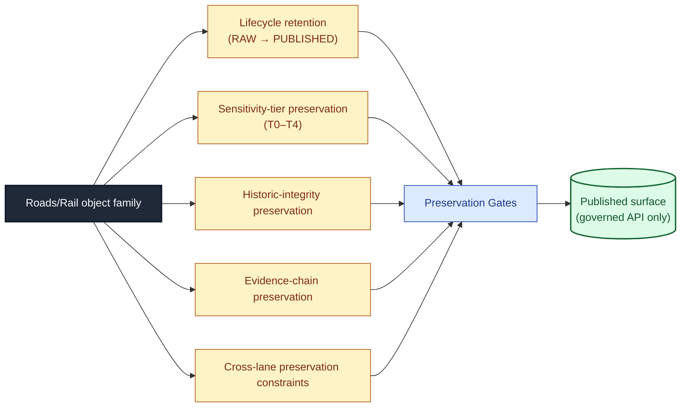
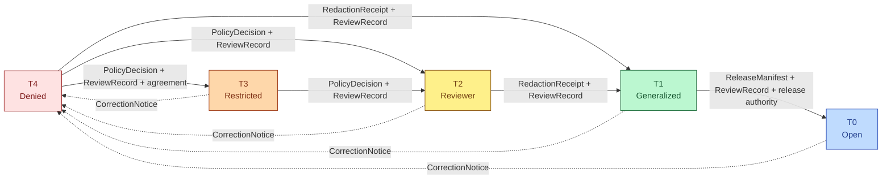
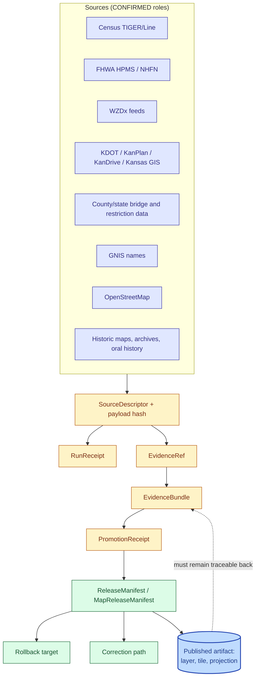
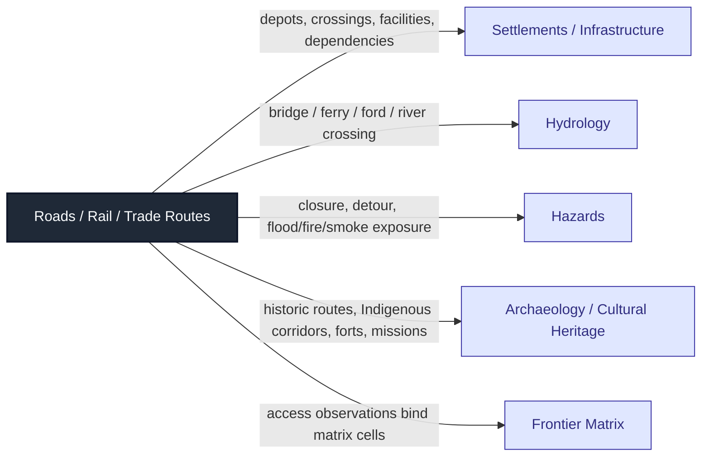

# 🚦 Roads, Rail, and Trade Routes — Preservation Matrix

> Domain-scoped operational matrix consolidating what must be preserved — and what may not be silently lost — for KFM Roads/Rail object families across lifecycle, sensitivity, historic-integrity, evidence-chain, and cross-lane dimensions.

<!-- [KFM_META_BLOCK_V2]
doc_id: kfm://doc/roads-rail-trade-preservation-matrix
title: Roads, Rail, and Trade Routes — Preservation Matrix
type: standard
version: v1
status: draft
owners: TODO — assign domain steward(s) for Roads/Rail/Trade Routes
created: 2026-05-19
updated: 2026-06-07
policy_label: public
related: [docs/domains/roads-rail-trade/README.md, docs/domains/roads-rail-trade/OBJECT_FAMILIES.md, docs/domains/roads-rail-trade/PIPELINE.md, docs/doctrine/directory-rules.md, docs/standards/PROV.md, docs/atlases/, schemas/contracts/v1/transport/, policy/sensitivity/transport/, ai-build-operating-contract.md]
tags: [kfm, domain, roads-rail-trade, preservation, retention, sensitivity, evidence, historic-integrity]
notes:
  - "CONTRACT_VERSION = 3.0.0 pinned for this doctrine-adjacent doc."
  - "Framing as a Preservation Matrix is PROPOSED (term not in corpus); the underlying five axes are CONFIRMED doctrine."
  - "Schema home schemas/contracts/v1/transport/ is CONFIRMED in Encyclopedia §7.11; the docs slug roads-rail-trade vs the schema slug transport is a DOCUMENTED divergence, not drift - flagged OQ-PRES-08."
  - "Per-object tier baselines in §5 align with Atlas Ch.24.14 (RoadSegment/RailSegment/CorridorRoute=T0; TransportFacility=T0/T2/T4) and doctrine-synthesis §16; entries beyond those rows are PROPOSED pending steward review."
  - "RouteUncertaintyProfile softened to the anchored object UncertaintySurface (doctrine-synthesis §16); reinstatement note in Appendix B."
  - "Retention SLAs across lifecycle tiers remain an unresolved KFM gap (Pass-10 §8.4)."
[/KFM_META_BLOCK_V2] -->

**Status:** draft &nbsp;·&nbsp; **Owners:** _TODO — assign Roads/Rail/Trade Routes domain steward(s)_ &nbsp;·&nbsp; **Last updated:** 2026-06-07 &nbsp;·&nbsp; **Contract:** `CONTRACT_VERSION = "3.0.0"`

> [!IMPORTANT]
> This document is **operational doctrine for the Roads/Rail/Trade Routes domain**. It does not override Atlas v1.1 Ch. 13 (DOM-ROADS), the Master Sensitivity / Rights Tier Reference (Atlas v1.1 Ch. 24.5), the Encyclopedia §7.11 lane definition, or `directory-rules.md`. Where this matrix appears to disagree, the upstream doctrine wins and the conflict belongs in `docs/registers/DRIFT_REGISTER.md`.

---

## Contents

- [1. Purpose and framing](#1-purpose-and-framing)
- [2. Scope and boundary](#2-scope-and-boundary)
- [3. The preservation axes](#3-the-preservation-axes)
- [4. Object × Lifecycle retention](#4-object--lifecycle-retention)
- [5. Object × Sensitivity tier baseline (T0–T4)](#5-object--sensitivity-tier-baseline-t0t4)
- [6. Historic-integrity preservation rules](#6-historic-integrity-preservation-rules)
- [7. Evidence-chain preservation](#7-evidence-chain-preservation)
- [8. Cross-lane preservation constraints](#8-cross-lane-preservation-constraints)
- [9. Preservation gates (RAW → PUBLISHED)](#9-preservation-gates-raw--published)
- [10. Failure modes and anti-patterns](#10-failure-modes-and-anti-patterns)
- [11. Validators, tests, and fixtures](#11-validators-tests-and-fixtures)
- [12. Open questions and verification backlog](#12-open-questions-and-verification-backlog)
- [13. Related docs](#13-related-docs)

---

## 1. Purpose and framing

In the KFM Roads/Rail/Trade Routes lane, *preservation* is not a single property — it is a small constellation of duties the system owes to its sources, its stewards, and the public. Each duty has a distinct failure mode if dropped silently. This matrix groups those duties so a reviewer can ask, for any object family, **what must persist, in what form, at what stage, under what review state**.

The framing rests on five **CONFIRMED** KFM doctrines:

1. **Lifecycle invariant.** `RAW → WORK / QUARANTINE → PROCESSED → CATALOG / TRIPLET → PUBLISHED`; promotion is a governed state transition, not a file move. [DIRRULES] [DOM-ROADS] [ENCY]
2. **Cite-or-abstain truth posture.** Material claims must resolve to admissible evidence; absent evidence yields ABSTAIN, not improvisation. [ENCY]
3. **Anti-collapse rule for derivatives.** Catalogs, triplets, graph projections, PMTiles, layer manifests, UI answers, and AI summaries are derivative surfaces, not root truth; they must remain traceable through `EvidenceRef → EvidenceBundle`, receipts, policy decisions, and release records. [UIA-BUILD]
4. **Deny-by-default promotion gate.** Unclear rights, unresolved source role, missing evidence, unresolved sensitivity, or absent release state blocks public promotion. [ENCY] [DIRRULES]
5. **Roads/Rail sensitivity posture.** Indigenous trade and mobility corridors, oral history, treaty, cultural, and interpretive evidence default to steward review and generalized public geometry; critical transport facilities require review. [DOM-ROADS] [ENCY]

> [!NOTE]
> **The framing as a single "Preservation Matrix" is PROPOSED.** The axes are KFM-confirmed doctrines; consolidating them into one domain-scoped matrix is an authoring decision made here to make multi-axis duties reviewable in one place. It introduces **no new duties**.

[↑ Back to top](#contents)

---

## 2. Scope and boundary

### 2.1 Owned objects (CONFIRMED per DOM-ROADS §B)

The Roads/Rail/Trade Routes lane owns: **Road Segment, Historic Route, Rail Segment, Depot, Siding, Yard, Crossing, Bridge, Ferry, River Crossing, Freight Corridor, Route Event, Operator Status, Access Restriction, Network Edge, Movement Story Node** (the verbatim DOM-ROADS §B roster), together with the lane-internal ubiquitous-language families **CorridorRoute, RouteMembership, Network Node, TransportFacility, RestrictionEvent, StatusEvent, OperatorAssignment, Historic RouteClaim,** and **TradeRouteCorridor** (DOM-ROADS §C). [DOM-ROADS]

> [!NOTE]
> The DOM-ROADS §B "owned" list and the §C ubiquitous-language list are two views of the same lane. §B names the public-facing object set; §C names the modeling vocabulary. This matrix governs both, but ownership and identity are anchored in DOM-ROADS, not introduced here.

### 2.2 Explicitly **not** owned (CONFIRMED per DOM-ROADS §B)

| Adjacent lane | What that lane owns instead |
|---|---|
| Settlements / Infrastructure | Settlement, facility, and infrastructure canonical claims (depot identity, facility identity). |
| Hydrology | Water evidence — including the water context of fords and river crossings. |
| Archaeology / Cultural Heritage | Site identity, exact-location truth, sovereignty review for sensitive cultural routes. |
| People / Land | Living-person, ownership, and parcel canonical claims. |
| Hazards | Hazard event identity (KFM is never an alert authority). |

This matrix governs **what Roads/Rail preserves about its own objects** and **how it preserves the citations to adjacent lanes** — it does not relocate ownership.

### 2.3 What this document is not

- Not a substitute for Atlas v1.1 Ch. 13 (DOM-ROADS) — that chapter remains the authoritative domain blueprint.
- Not a substitute for Atlas v1.1 Ch. 24.5 (Master Sensitivity / Rights Tier Reference) — the T0–T4 scheme is **PROPOSED** there (ADR-S-05) and applied here by analogy.
- Not a retention-SLA register. Quantitative retention windows per lifecycle tier remain an **open KFM gap** (Pass-10 §8.4; Expansion Agenda 10.1, priority H). This matrix defines **what must be preserved**, not **how long**, except where doctrine sets the floor (e.g., RAW under source identity).

[↑ Back to top](#contents)

---

## 3. The preservation axes

PROPOSED framing: five orthogonal preservation duties intersect at every Roads/Rail object family. The duties are independent — a Road Segment may be lifecycle-preserved (RAW retained) yet historically over-precise; a Historic Route may be culturally generalized yet still evidence-traceable.

| Axis | One-line definition | Primary failure if dropped |
|---|---|---|
| **Lifecycle retention** | Each stage preserves what its successor cannot reconstruct. | Silent loss of admitted source material; un-replayable history. |
| **Sensitivity-tier preservation** | Each object carries a default tier and only moves toward more-public with reviewed transforms. | Cultural / sovereignty harm; uncited generalization; over-exposure of critical facilities. |
| **Historic-integrity preservation** | Historic claims preserve uncertainty and resist overprecision. | Persuasive maps laundering weak evidence; archaeological-coord leakage via corridor reconstruction. |
| **Evidence-chain preservation** | `EvidenceRef` resolves to `EvidenceBundle`; receipts and manifests persist with the object. | Derived layer presented as root truth; correction and rollback become impossible. |
| **Cross-lane preservation constraints** | Citations to settlements, hydrology, hazards, archaeology preserve ownership, source role, sensitivity, and bundle support. | Cross-lane joins multiply inference risk; ownership boundaries silently drift. |

[↑ Back to top](#contents)

---

## 4. Object × Lifecycle retention

CONFIRMED doctrine: **RAW preserves admitted source material under source identity**; PROCESSED and downstream stages emit normalized derivatives, not replacements. Temporal vacuuming and archival partition pruning are governed retention decisions and must never be treated as silent deletion of evidence. [UIA-BUILD]

PROPOSED per-object retention duties for Roads/Rail. Quantitative SLAs are **NEEDS VERIFICATION** — they belong to a future retention-SLA register (see [§12](#12-open-questions-and-verification-backlog)).

| Object family | RAW must preserve | WORK / QUARANTINE must preserve | PROCESSED must preserve | CATALOG / TRIPLET must preserve | PUBLISHED must preserve | Never-vacuum-without-archive |
|---|---|---|---|---|---|---|
| **Road Segment** | Source payload + `SourceDescriptor` (TIGER/KDOT/OSM…) + hash | Normalization receipts; quarantine reasons for failed legal-status / overprecision | `EvidenceRef`, `ValidationReport`, digest closure | `CatalogMatrix` entry; `EvidenceBundle`; graph-edge projection | `ReleaseManifest`; rollback target; correction path | RAW payload; promotion receipts; correction lineage |
| **Rail Segment** | Source payload + `SourceDescriptor` (FRA / state / OSM…) + hash | Normalization receipts; operator/status temporal failures | `EvidenceRef`, `ValidationReport`, digest closure | `EvidenceBundle`; operator-status temporal projection | `ReleaseManifest`; rollback target | RAW payload; operator-status history |
| **Historic Route / Historic RouteClaim** | Source citation (historic map / trail study / archive) + hash | Quarantine for historic-overprecision and unresolved cultural-corridor signals | `EvidenceRef`; `UncertaintySurface` (see §6) | `EvidenceBundle` with uncertainty geometry | Generalized public-safe geometry only; uncertainty surfaced | RAW citation; uncertainty history; review record |
| **TradeRouteCorridor / Freight Corridor** | Source payload + role + hash | Normalization receipts; route-membership separation failures | `EvidenceRef`; `RouteMembership` provenance | `EvidenceBundle`; corridor projection | `ReleaseManifest`; rollback target | RAW payload; membership change history |
| **Depot / Siding / Yard / TransportFacility** | Source payload + facility identity citation back to **Settlements** (canonical owner) | Quarantine for facility-identity drift | `EvidenceRef`; Settlements-cite preserved | `EvidenceBundle`; settlement-anchor preserved | `ReleaseManifest`; deny-on-critical-facility paths | RAW payload; settlement-anchor lineage |
| **Bridge / Ferry / River Crossing / Crossing** | Source payload + cross-lane crossing context (Hydrology cite) + hash | Quarantine for missing hydrology context or status conflict | `EvidenceRef`; hydrology-cite preserved | `EvidenceBundle`; crossing graph edge | `ReleaseManifest`; rollback target | RAW payload; hydrology-cite history |
| **Route Event / RestrictionEvent / Access Restriction** | Source payload (WZDx / KanDrive / county) + hash + observed/effective time | Quarantine for temporal-validity failure | `EvidenceRef`; temporal-validity preserved | `EvidenceBundle`; status timeline | `ReleaseManifest`; correction path | RAW payload; status-timeline history |
| **Operator Status / OperatorAssignment** | Source payload + observed time + hash | Quarantine for source-role drift | `EvidenceRef`; operator-history preserved | `EvidenceBundle`; operator timeline | `ReleaseManifest`; rollback target | Operator-history lineage |
| **Network Edge / Network Node / Movement Story Node** | (Derived) source `EvidenceRef`s pointing to canonical roads/rail | Quarantine for unresolved evidence pointers | Derived projection only; never canonical | Graph-derived label preserved | Derived-flag preserved; never published as root truth | Graph-derivation receipts |

> [!CAUTION]
> **Network Edge, Network Node, and Movement Story Node are derived layers.** Per the anti-collapse rule, they must never be promoted to root truth. Preservation duty here means preserving the **derivation receipt** and the **graph-derived label**, not preserving the projection in place of its sources. [UIA-BUILD]

[↑ Back to top](#contents)

---

## 5. Object × Sensitivity tier baseline (T0–T4)

CONFIRMED lane baseline: the Encyclopedia §7.11 assigns Roads/Rail/Trade a default of **T1**; the Atlas Ch.24.14 per-object matrix sets `RoadSegment / RailSegment / CorridorRoute` at **T0** and `TransportFacility` at **T0 mostly, T2 / T4 for sensitive condition detail**. The effective lane range is therefore **T0–T2**, rising to **T4** for cultural-corridor and critical-facility-detail cases. [ENCY §7.11] [ENCY §24.14]

PROPOSED per-object tier baselines, applied by analogy to the Master Sensitivity / Rights Tier Reference (Atlas v1.1 Ch. 24.5; ADR-S-05 PROPOSED). Rows beyond the Atlas Ch.24.14 entries are **PROPOSED pending steward review**.

| Object class | Default tier | Allowed transform toward more public | Required gates | Downgrade-to-T4 trigger | Citation basis |
|---|---|---|---|---|---|
| Road Segment — modern, public-roadway | **T0** *(CONFIRMED, Ch.24.14)* | None required for public-roadway geometry from authoritative sources. | Standard `ReleaseManifest` + `ReviewRecord` per release maturity. | Rights-change detection; source revocation. | [DOM-ROADS] [ENCY §24.14] |
| Rail Segment — modern, public alignment | **T0** *(CONFIRMED, Ch.24.14)* | Generalization where source rights/precision require it. | `RedactionReceipt` if generalized. | Operator deny; rights revocation. | [DOM-ROADS] [ENCY §24.14] |
| Freight Corridor / TradeRouteCorridor — modern designation | **T0–T1** *(CorridorRoute T0 per Ch.24.14; T1 if generalized)* | Generalized layer for public; freight-context as cite-only. | `AggregationReceipt` or `RedactionReceipt`; `ReviewRecord`. | Critical-corridor flag; agreement revocation. | [DOM-ROADS] [ENCY §24.14] |
| Historic Route / Historic RouteClaim — non-sensitive | **T1** *(CONFIRMED, doctrine-synthesis §16: "historic uncertain routes = T1")* | Generalized geometry with uncertainty surfaced. | `RedactionReceipt` + `ReviewRecord`; `UncertaintySurface`. | Overprecision detected; new cultural context surfaced. | [DOM-ROADS] [DOM-ARCH] [ENCY] |
| **Indigenous trade / mobility corridor** | **T2 or T4** (per steward) | Steward review + generalization (coarse cell) → T2 or T1 only under explicit sovereignty review. | Sovereignty review + `ReviewRecord` + `PolicyDecision`. | Any sovereignty / cultural objection; rights-change detection. | [DOM-ROADS] [DOM-ARCH] [ENCY] |
| **Crossing near archaeological site** | **T4** (defer to Archaeology) | Deny exact-coord exposure; corridor cited as context only, never used to reconstruct site location. | Steward review + `RedactionReceipt` + `PolicyDecision`. | Cross-lane join attempted that could re-identify site. | [DOM-ROADS] [DOM-ARCH] [ENCY §24.5.2] |
| **Critical Bridge / Ferry / Crossing — vulnerability or condition detail** | **T4** (defer to Settlements / Infrastructure) | T3 to named authorities only; never T0 / T1. | Steward review + named-party agreement. | Any public surface attempting to publish vulnerability detail. | [DOM-ROADS] [DOM-SETTLE] [ENCY §24.5.2] |
| RestrictionEvent — public closure / detour | **T0–T1** | Generalized timing where source cadence requires; cite source feed (WZDx, KanDrive, etc.). | Standard `ReleaseManifest`. | Operator deny; feed revocation. | [DOM-ROADS] [ENCY] |
| Operator Status — public service state | **T0–T1** | Generalized aggregation where source policy requires. | Standard `ReleaseManifest`; agreement check. | Operator agreement change. | [DOM-ROADS] [ENCY] |
| Depot / Siding / Yard / TransportFacility — *cited identity only* | (Defer to **Settlements**; `TransportFacility` itself **T0 mostly, T2/T4** for sensitive detail per Ch.24.14) | Settlements owns the facility identity; Roads/Rail preserves the citation. | Cross-lane cite preserved per §8. | Settlements deny propagates. | [DOM-SETTLE] [DOM-ROADS] [ENCY §24.14] |

### 5.1 Allowed tier motion (CONFIRMED doctrine, Atlas v1.1 §24.5.3)

> [!IMPORTANT]
> **A tier upgrade (toward more public) always needs both a transform receipt and a review record. A tier downgrade (toward less public) never needs both — `CorrectionNotice` alone is sufficient.** Downgrades are always permitted; they precede derivative invalidation. [ENCY §24.5.3]

[↑ Back to top](#contents)

---

## 6. Historic-integrity preservation rules

Historic alignment claims are a recurring preservation risk in this lane — easy to over-render, easy to over-precision, frequently entangled with cultural sensitivity. The rules below are CONFIRMED in DOM-ROADS doctrine; their per-validator realization is PROPOSED.

| Rule | What it preserves | Failure mode if dropped | Status |
|---|---|---|---|
| **Historic overprecision denial** | Real positional uncertainty of historic routes. | Persuasive maps presenting weak evidence as canonical alignment. | PROPOSED validator [DOM-ROADS §K] |
| **Route membership / designation separation** | Distinction between *physical* alignment and *administrative* designation. | Designation drift silently rewriting historic geometry. | PROPOSED validator [DOM-ROADS §K] |
| **OSM / GNIS legal-status denial** | Legal status remains source-authored; community sources may not assert legal designation. | Crowd-sourced names laundered into authoritative legal records. | PROPOSED validator [DOM-ROADS §K] |
| **Indigenous corridor steward review** | Sovereignty, cultural, treaty, and oral-history context. | Cultural and sovereignty harm; treaty erasure. | CONFIRMED doctrine [DOM-ROADS §I] |
| **Archaeological-coordinate denial via corridor cite** | Archaeological exact coordinates never derivable from a Roads/Rail historic-route reconstruction. | Looting risk; cultural harm. | CONFIRMED doctrine [DOM-ROADS §F; DOM-ARCH] |
| **Uncertainty surfacing in public layer** | Public artifacts visibly carry uncertainty geometry, not a confident line. | False confidence; correction becomes politically costly. | PROPOSED layer rule [DOM-ROADS §G; MAP-MASTER] |
| **`UncertaintySurface`** | Pairs historic claim geometry with uncertainty bounds; the required gate artifact for T1 historic routes. | Uncertainty becomes a UI styling choice rather than a structural record. | CONFIRMED object family [doctrine-synthesis §16] / PROPOSED field realization |

> [!WARNING]
> **A confident historic line on a map is a louder claim than a paragraph of qualifications beside it.** Preserving historic integrity is partly a rendering discipline; this matrix only ensures the underlying record carries the uncertainty the renderer must surface.

[↑ Back to top](#contents)

---

## 7. Evidence-chain preservation

CONFIRMED doctrine: every published Roads/Rail claim must remain traceable through `EvidenceRef → EvidenceBundle`, receipts, policy decisions, and release records. Derivatives (graph projections, layer manifests, PMTiles, UI answers, AI summaries) are not root truth. [UIA-BUILD §§7–8]

| Artifact | Preservation duty in Roads/Rail | Source authority |
|---|---|---|
| `SourceDescriptor` | One per admitted source; role, rights, sensitivity, cadence, hash. | CONFIRMED doctrine [UIA-BUILD §8] |
| `EvidenceRef` | Pointer from every claim / feature / answer / layer to its evidence support. | CONFIRMED doctrine [UIA-BUILD §8] |
| `EvidenceBundle` | Resolved package: source, provenance, scope, citation, review context. | CONFIRMED doctrine [UIA-BUILD §8] |
| `ValidationReport` | One per WORK→PROCESSED transition; deterministic; tied to fixtures. | CONFIRMED doctrine [ENCY §24.6.1] |
| `RedactionReceipt` / `AggregationReceipt` | Required when sensitivity / generalization applies. | CONFIRMED doctrine [ENCY §24.5.3, §24.6.1] |
| `RunReceipt` / `PromotionReceipt` | Auditable record of intake, transform, validation, catalog, release, rebuild; one per Promotion Gate A–G. | CONFIRMED doctrine [UIA-BUILD §8] |
| `ReleaseManifest` / `MapReleaseManifest` | Published artifact set, digests, policy posture, rollback target. | CONFIRMED doctrine [UIA-BUILD §8] |
| `CorrectionNotice` | Required for any post-publication change; tier downgrade always permitted via correction. | CONFIRMED doctrine [ENCY §24.5.3] |
| `AIReceipt` / `RuntimeResponseEnvelope` | Bounded AI request/response accountability; AI never root truth. | CONFIRMED doctrine / PROPOSED implementation [UIA-BUILD §8] [GAI] |

> [!CAUTION]
> **A graph projection that cannot resolve back to its `EvidenceBundle` is not a Roads/Rail published artifact — it is a drift candidate.** Per the anti-collapse rule, derived layers do not become root truth. [UIA-BUILD §§7–8]

[↑ Back to top](#contents)

---

## 8. Cross-lane preservation constraints

CONFIRMED doctrine: cross-lane relations must preserve **ownership, source role, sensitivity, and `EvidenceBundle` support** at the boundary. [DOM-ROADS §F]

| Boundary | What Roads/Rail must preserve | Citation |
|---|---|---|
| **Roads/Rail ↔ Settlements / Infrastructure** | Settlements owns facility identity (Depot, Yard, critical asset). Roads/Rail preserves the **citation** to the canonical settlement-owned record; never overwrites it. Critical-asset condition / vulnerability detail remains at the Settlements-defined tier (T4 → T3 only to named authorities). | [DOM-ROADS §F] [DOM-SETTLE] [ENCY §24.5.2] |
| **Roads/Rail ↔ Hydrology** | Bridges, ferries, fords, river crossings preserve the hydrology cite as crossing context. Crossing identity stays Roads/Rail-owned; water context stays Hydrology-owned. | [DOM-ROADS §F] |
| **Roads/Rail ↔ Hazards** | Closure, detour, and flood/fire/smoke exposure observations cite the hazard event; **KFM is never an alert authority**. The Hazards T4-forever alert-authority boundary holds through Roads/Rail surfaces. | [DOM-ROADS §F] [DOM-HAZ] [ENCY §24.5.2] |
| **Roads/Rail ↔ Archaeology / Cultural Heritage** | Historic corridor reconstructions cite archaeology / cultural heritage **as context only**. Exact archaeological coordinates are **denied** at the Roads/Rail surface — corridor projections may not derive site location. Sovereignty review propagates. | [DOM-ROADS §F] [DOM-ARCH] |
| **Roads/Rail ↔ Frontier Matrix** | Access observations bind the access cells of the Frontier Matrix; matrix-cell publication remains the Frontier Matrix's release surface, not Roads/Rail's. | [ENCY] [UNIFIED] |

> [!IMPORTANT]
> **A cross-lane join is an inference-risk multiplier** (ADR-S-14 PROPOSED). Joins that could re-identify archaeological sites, infrastructure vulnerabilities, or sovereignty-sensitive cultural routes default to steward review and may be denied. [DIRRULES]

[↑ Back to top](#contents)

---

## 9. Preservation gates (RAW → PUBLISHED)

CONFIRMED lifecycle gates apply to every Roads/Rail object family. Per-gate preservation duty is summarized below; the universal gate matrix lives in Atlas v1.1 §24.6.1.

| Gate (transition) | Roads/Rail preservation duty | Required artifacts (PROPOSED minimum) | Failure-closed outcome |
|---|---|---|---|
| **Admission (— → RAW)** | Preserve source identity, role, rights, sensitivity, cadence, citation, time, payload hash. | `SourceDescriptor` + payload hash. | Source not admitted; logged as candidate awaiting steward. |
| **Normalization (RAW → WORK / QUARANTINE)** | Preserve every transform as a receipt; quarantine the failure rather than silently dropping it. | `TransformReceipt`; `ValidationReport` (working set); `PolicyDecision`; quarantine reason for failures. | Quarantine with reason; never silently promotes. |
| **Validation (WORK → PROCESSED)** | Preserve validator determinism (deterministic + fixture-tied). Preserve `RedactionReceipt` / `AggregationReceipt` where sensitivity / generalization applies. | `ValidationReport` pass + sensitivity receipts. | Stay in WORK; structured FAIL outcome. |
| **Catalog closure (PROCESSED → CATALOG / TRIPLET)** | Preserve `EvidenceRef` resolution closure; preserve graph/triplet derivation receipts. | `CatalogMatrix` entry; `EvidenceBundle`; graph/triplet projections (labeled derived). | HOLD at PROCESSED; structured FAIL outcome; no public edge. |
| **Release (CATALOG / TRIPLET → PUBLISHED)** | Preserve review state where required, **release authority distinct from original author** where materiality applies (ADR-S-09), correction path, rollback target. | `ReleaseManifest`; rollback target; correction path; `ReviewRecord` (if required). | HOLD at CATALOG; no public surface change. |
| **Correction (PUBLISHED → PUBLISHED′)** | Preserve correction lineage; never overwrite published artifact in place. Downgrade-to-T4 via `CorrectionNotice` always permitted. | `CorrectionNotice`; downstream-derivative identification. | Stale-state propagates downstream; rollback target remains addressable. |

> [!NOTE]
> **Reviewer separation-of-duties** (ADR-S-09 PROPOSED) is currently unresolved. Until the materiality threshold is set, this matrix records the requirement but does not enforce it; treat as `NEEDS VERIFICATION`. [DIRRULES]

[↑ Back to top](#contents)

---

## 10. Failure modes and anti-patterns

> [!WARNING]
> The following are **preservation failures** even when they leave the system technically functional. Each maps to an axis above; recognizing them in review is part of release maturity.

| Failure mode | What gets lost | Axis | Citation basis |
|---|---|---|---|
| **Silent vacuuming** | RAW payload or temporal history compacted away without an archive manifest; later queries silently return a different answer. | Lifecycle | [UIA-BUILD] |
| **Graph projection promoted to root truth** | Network-edge derivation receipt drops out; the projection is treated as canonical and cannot be rebuilt or rolled back. | Evidence-chain | Anti-collapse rule [UIA-BUILD §8] |
| **Historic overprecision** | Real positional uncertainty disappears into a confident line; correction becomes politically costly. | Historic-integrity | [DOM-ROADS §K] |
| **Cultural-corridor leakage** | An Indigenous trade or mobility corridor is published without steward review or generalization; sovereignty is harmed. | Sensitivity | [DOM-ROADS §I] [DOM-ARCH] [ENCY §24.5.2] |
| **Cross-lane archaeological reconstruction** | A Roads/Rail historic-route reconstruction is used to derive an archaeological site coordinate that Archaeology denies. | Cross-lane | [DOM-ROADS §F] [DOM-ARCH] |
| **Critical-facility over-publication** | Vulnerability or condition detail for a Bridge / Ferry / Crossing reaches a public tier. | Sensitivity | [DOM-SETTLE] [ENCY §24.5.2] |
| **Designation drift rewriting geometry** | An administrative-designation change silently rewrites the physical alignment record. | Historic-integrity | [DOM-ROADS §K] |
| **AI summary presented as evidence** | A Focus Mode answer about a Roads/Rail object lacks `AIReceipt` and `EvidenceBundle` resolution; AI fluency stands in for citation. | Evidence-chain | [GAI] [UIA-BUILD §8] |
| **Quarantine bypass** | A WORK/QUARANTINE failure is treated as a soft warning and a record is promoted anyway. | Lifecycle | Deny-by-default promotion gate [ENCY] |
| **Cross-lane join laundering sensitivity** | A join between a public Roads/Rail layer and a permitted Settlements layer yields a derived attribute that re-identifies a T4-restricted asset. | Cross-lane | ADR-S-14 PROPOSED [DIRRULES] |
| **Source-role collapse (admin → observed)** | An administrative facility roster or right-of-way index is published as an observed event timeline. | Lifecycle / Evidence-chain | Anti-collapse: Atlas §24.1.2 (Roads named at-risk) |

[↑ Back to top](#contents)

---

## 11. Validators, tests, and fixtures

PROPOSED validators per DOM-ROADS §K; the **preservation-specific** validators below extend that list. None are CONFIRMED implemented — all are `NEEDS VERIFICATION` until a mounted repo, schema, and test surface confirm them.

### 11.1 Confirmed-in-doctrine validators (PROPOSED implementation)

- PROPOSED: Route membership and designation separation tests. [DOM-ROADS §K]
- PROPOSED: Operator/status temporal tests. [DOM-ROADS §K]
- PROPOSED: OSM / GNIS legal-status denial. [DOM-ROADS §K]
- PROPOSED: Historic overprecision denial. [DOM-ROADS §K]
- PROPOSED: Public generalization receipt tests. [DOM-ROADS §K]
- PROPOSED: Transport graph projection rollback tests. [DOM-ROADS §K]

### 11.2 Preservation-axis-derived validators (PROPOSED, this document)

- PROPOSED: **RAW-payload-under-source-identity preservation test** — every promoted Road / Rail / Historic-Route record resolves back to a RAW `SourceDescriptor` and payload hash.
- PROPOSED: **No-silent-vacuum test** — temporal-record compaction must emit an archive manifest; vacuum receipts must reference an external archival proof for designated never-vacuum families.
- PROPOSED: **Tier-downgrade-via-correction test** — every T*→T4 transition emits a `CorrectionNotice` and propagates stale-state markers downstream.
- PROPOSED: **Cross-lane archaeological-coord denial test** — corridor projections cannot reconstruct archaeological exact coordinates within steward-defined tolerance.
- PROPOSED: **Critical-facility public-tier deny test** — vulnerability / condition detail for Bridge / Ferry / critical Crossing fails closed at T1 release.
- PROPOSED: **Source-role anti-collapse test** — admin-role facility/roster records cannot be emitted on an observed-event surface (Atlas §24.1.2).
- PROPOSED: **AIReceipt presence test** — every Roads/Rail Focus Mode answer carries an `AIReceipt` and resolves to an `EvidenceBundle` (target rate: 100%, per Atlas v1.1 §24.11).

> [!NOTE]
> Validator placement is governed by `directory-rules.md`. Cross-lane validators (e.g., archaeological-coord denial) belong under `tools/validators/<topic>/`, **not** under a domain-segmented validator folder. [DIRRULES §12]

[↑ Back to top](#contents)

---

## 12. Open questions and verification backlog

<strong>Click to expand — preservation-specific open questions and verification items</strong>

### 12.1 Cross-cutting (KFM gaps that block fully grounded entries above)

| ID | Item | Evidence that would settle it | Status |
|---|---|---|---|
| OQ-PRES-01 | **Retention SLAs across lifecycle tiers** (RAW, WORK, PROCESSED, CATALOG, PUBLISHED, TOMBSTONED). | A canonical retention-SLA register under `control_plane/` or `docs/doctrine/`, ratified by ADR. | OPEN — Pass-10 §8.4; Expansion Agenda 10.1 priority H |
| OQ-PRES-02 | **Which Roads/Rail object families must never be vacuumed without external archival proof?** | An explicit never-vacuum register tied to the retention SLA above. | OPEN |
| OQ-PRES-03 | **Sensitivity tier scheme adoption** (T0–T4). | ADR-S-05 resolution (adopt as canonical or revise). | PROPOSED — ADR-S-05 |
| OQ-PRES-04 | **Reviewer separation-of-duties threshold.** | ADR-S-09 resolution naming the materiality threshold and tooling. | PROPOSED — ADR-S-09 |
| OQ-PRES-05 | **Cross-lane join policy** (which joins require steward review, which are denied). | ADR-S-14 resolution + per-pair register. | PROPOSED — ADR-S-14 |
| OQ-PRES-06 | **Story / export receipt scope and retention.** | ADR-S-11 resolution. | PROPOSED — ADR-S-11 |
| OQ-PRES-07 | **Stale-state propagation rule** across the Roads/Rail ↔ Settlements ↔ Hydrology ↔ Hazards ↔ Archaeology graph. | ADR-S-10 resolution. | PROPOSED — ADR-S-10 |
| OQ-PRES-08 | **Lane slug reconciliation:** `roads-rail-trade` (docs/pipelines/pipeline_specs/data) vs `transport` (schema/contract/policy root, per ENCY §7.11). | ADR confirming the documented split, or unification. | OPEN — documented divergence, not drift |

### 12.2 Roads/Rail-specific verification (lifted from DOM-ROADS §N)

| Item | Evidence that would settle it | Status |
|---|---|---|
| Verify KDOT / FHWA / FRA / WZDx / source terms. | Mounted repo files, schemas, registry entries, tests, logs, emitted artifacts, review records, or release manifests. | NEEDS VERIFICATION |
| Verify Indigenous / cultural corridor policy and steward review workflow. | As above. | NEEDS VERIFICATION |
| Confirm `UncertaintySurface` schema realization for historic routes. | As above. | NEEDS VERIFICATION |
| Verify transport graph and MapLibre integration boundary. | As above. | NEEDS VERIFICATION |

### 12.3 Repository-state verification (per `directory-rules.md`)

| Path | Question | Status |
|---|---|---|
| `docs/domains/roads-rail-trade/` | Directory exists with a `README.md` declaring lane scope. | NEEDS VERIFICATION |
| `schemas/contracts/v1/transport/` | Schema responsibility root for Roads/Rail. | CONFIRMED in corpus (ENCY §7.11); mounted-repo presence NEEDS VERIFICATION |
| `policy/sensitivity/transport/` | Sensitivity policy lane for Roads/Rail (analogous to `policy/sensitivity/fauna/`). | PROPOSED |
| `tests/domains/roads-rail-trade/` | Test surface for Roads/Rail validators. | PROPOSED per `directory-rules.md` §12 |
| `release/candidates/roads-rail-trade/` | Release-candidate lane. | PROPOSED per `directory-rules.md` §12 |
| `data/{raw,work,quarantine,processed}/roads-rail-trade/` | Lifecycle lanes. | CONFIRMED slug (repo guiding doc); presence NEEDS VERIFICATION |
| Naming: `roads-rail-trade` (docs/data) vs `transport` (schema/contract/policy root). | Whether to keep as a documented divergence or unify. | OQ-PRES-08 → flag to `docs/registers/DRIFT_REGISTER.md` |

[↑ Back to top](#contents)

---

## 13. Related docs

> Placeholders below reflect prior-session-authored artifacts and Directory Rules-defined homes. Mounted-repo presence is `NEEDS VERIFICATION` unless noted.

- **Roads/Rail/Trade Routes domain README** — `docs/domains/roads-rail-trade/README.md` _(PROPOSED, NEEDS VERIFICATION)_
- **Object families** — `docs/domains/roads-rail-trade/OBJECT_FAMILIES.md` _(prior-session artifact)_
- **Pipeline (RAW → PUBLISHED)** — `docs/domains/roads-rail-trade/PIPELINE.md` _(prior-session artifact)_
- **Directory Rules** — `docs/doctrine/directory-rules.md` (CONFIRMED in corpus)
- **Lifecycle law** — `docs/doctrine/lifecycle-law.md` _(NEEDS VERIFICATION; per `directory-rules.md` §6.1)_
- **Trust membrane** — `docs/doctrine/trust-membrane.md` _(NEEDS VERIFICATION; per `directory-rules.md` §6.1)_
- **Authority ladder** — `docs/doctrine/authority-ladder.md` _(NEEDS VERIFICATION; per `directory-rules.md` §6.1)_
- **Provenance standard** — `docs/standards/PROV.md` _(CONFIRMED authored; naming variance vs `PROVENANCE.md` → see `directory-rules.md` §18 OPEN-DR-01)_
- **Sensitivity Rubric** — `docs/standards/SENSITIVITY_RUBRIC.md` _(PROPOSED per Pass-10 C6-01; not yet authored)_
- **Atlas v1.1 Ch. 13 — Roads / Rail / Trade Routes** — `docs/atlases/...` _(PROPOSED placement per ADR-S-02)_
- **Atlas v1.1 Ch. 24.5 — Master Sensitivity / Rights Tier Reference** — same atlas
- **Verification backlog** — `docs/registers/VERIFICATION_BACKLOG.md` _(per `directory-rules.md` §6.1)_
- **Drift register** — `docs/registers/DRIFT_REGISTER.md` _(per `directory-rules.md` §2.5)_
- **Operating contract** — `ai-build-operating-contract.md` — `CONTRACT_VERSION = "3.0.0"`

[↑ Back to top](#contents)

---

### Appendix A — Doctrine tag legend

<strong>Click to expand — doctrine source tags used in this document</strong>

| Tag | Source |
|---|---|
| `[DOM-ROADS]` | KFM Roads, Rail, and Trade Routes architecture (Atlas v1.0 Ch. 13; Atlas v1.1 retains verbatim). |
| `[DOM-ARCH]` | KFM Archaeology / Cultural Heritage architecture (Atlas Ch. 15). |
| `[DOM-SETTLE]` | KFM Settlements / Infrastructure architecture (Atlas Ch. 14). |
| `[DOM-HAZ]` | KFM Hazards architecture (Atlas Ch. 12). |
| `[ENCY]` | KFM Domain and Capability Encyclopedia (lane row §7.11; tiers §24.5, §24.14). |
| `[DIRRULES]` | `directory-rules.md` (canonical repo placement law). |
| `[UIA-BUILD]` | KFM Unified Implementation Architecture Build Manual. |
| `[GAI]` | KFM Governed AI doctrine. |
| `[MAP-MASTER]` | Master MapLibre Components / Functions / Features reference. |
| `[UNIFIED]` | Unified / pipeline lineage (Frontier Matrix synthesis). |

### Appendix B — Object-name reconciliation note

<strong>Click to expand — RouteUncertaintyProfile → UncertaintySurface</strong>

An earlier draft referenced a `RouteUncertaintyProfile` object as a NEEDS-VERIFICATION proposal. The corpus does not contain that name. The doctrine-synthesis per-domain sensitivity matrix (§16) names **`UncertaintySurface`** as the required gate artifact for "Roads / Rail — historic uncertain routes (T1)." This document has been reconciled to the anchored `UncertaintySurface`. If a future ADR or schema introduces a distinct route-scoped profile object, the §6 row and §4 retention column can be reinstated under the confirmed name.

---

Last updated: 2026-06-07 &nbsp;·&nbsp; Status: **draft** &nbsp;·&nbsp; Version: **v1** &nbsp;·&nbsp; `CONTRACT_VERSION = "3.0.0"` &nbsp;·&nbsp; [↑ Back to top](#contents)
