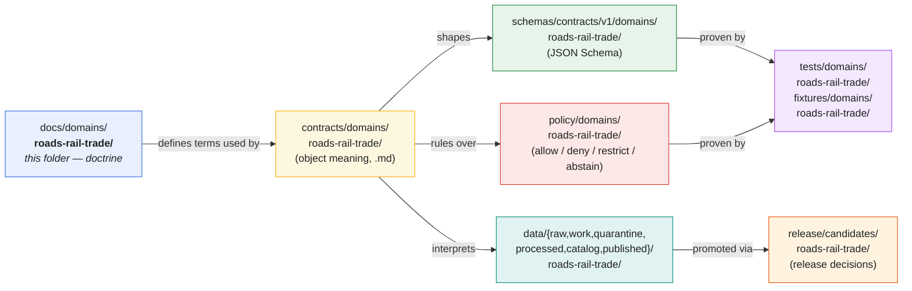

<!-- [KFM_META_BLOCK_V2]
doc_id: kfm://doc/docs-domains-roads-rail-trade-readme
title: Roads, Rail & Trade Routes — Domain Dossier README
type: readme
version: v1.0-draft
status: draft
authority_class: canonical (docs/, domain segment)
owners: TODO — CODEOWNERS entry NEEDS VERIFICATION
created: 2026-05-19
updated: 2026-05-19
policy_label: public
related:
  - ../README.md
  - ../../doctrine/directory-rules.md
  - ../../adr/
  - ../../../contracts/domains/roads-rail-trade/         # PROPOSED, NEEDS VERIFICATION
  - ../../../schemas/contracts/v1/domains/roads-rail-trade/  # PROPOSED, NEEDS VERIFICATION
  - ../../../policy/domains/roads-rail-trade/            # PROPOSED, NEEDS VERIFICATION
tags: [kfm, domain, roads, rail, trade-routes, transport]
notes:
  - Folder-level README per Directory Rules §15
  - Doctrine grounded in Atlas Ch. 13 [DOM-ROADS]
  - Implementation-layer paths are PROPOSED pending repo verification
[/KFM_META_BLOCK_V2] -->

# 🛣️ Roads, Rail & Trade Routes — Domain Dossier

> Doctrine, scope, and lane-crosswalk for Kansas roads, rail, historic routes, trade and mobility corridors,
> facilities, restrictions, graph projections, and their governed publication path.

<!-- Badges: placeholders pending CI / governance wiring -->


| Field          | Value                                                                                        |
|----------------|----------------------------------------------------------------------------------------------|
| **Status**     | `draft` · authoritative for doctrine; implementation references PROPOSED                     |
| **Authority**  | Canonical — `docs/` root, domain segment per Directory Rules §3, §12                         |
| **Owners**     | TODO — `CODEOWNERS` entry NEEDS VERIFICATION                                                 |
| **Updated**    | 2026-05-19                                                                                   |
| **Supersedes** | None (initial README)                                                                        |
| **Primary src**| Atlas Ch. 13 (`KFM_Domains_v1_1` Pt.1, pp. 83–89) [DOM-ROADS]; Directory Rules §6.1, §12     |

---

## 🧭 Mini-TOC

- [1. Purpose](#1-purpose)
- [2. Authority level & status](#2-authority-level--status)
- [3. Scope — what this domain owns](#3-scope--what-this-domain-owns)
- [4. Explicit non-ownership](#4-explicit-non-ownership)
- [5. Repo fit](#5-repo-fit)
- [6. Inputs — what belongs in `docs/domains/roads-rail-trade/`](#6-inputs--what-belongs-in-docsdomainsroads-rail-trade)
- [7. Exclusions — what does NOT belong here](#7-exclusions--what-does-not-belong-here)
- [8. Directory tree (PROPOSED)](#8-directory-tree-proposed)
- [9. Cross-root domain-lane crosswalk](#9-cross-root-domain-lane-crosswalk)
- [10. Pipeline shape (RAW → PUBLISHED)](#10-pipeline-shape-raw--published)
- [11. Ubiquitous language](#11-ubiquitous-language)
- [12. Main object families](#12-main-object-families)
- [13. Key source families](#13-key-source-families)
- [14. Cross-lane relations](#14-cross-lane-relations)
- [15. Map & viewing products](#15-map--viewing-products)
- [16. Sensitivity, rights, and publication posture](#16-sensitivity-rights-and-publication-posture)
- [17. Governed AI behavior](#17-governed-ai-behavior)
- [18. Validation, tests, fixtures](#18-validation-tests-fixtures)
- [19. Review burden](#19-review-burden)
- [20. Verification backlog & open questions](#20-verification-backlog--open-questions)
- [21. FAQ](#21-faq)
- [22. Related folders & docs](#22-related-folders--docs)
- [23. ADRs](#23-adrs)
- [Appendix A — Glossary deltas](#appendix-a--glossary-deltas)
- [Appendix B — Source-attribution map](#appendix-b--source-attribution-map)
- [Last reviewed · Back to top](#-last-reviewed)

---

## 1. Purpose

This folder is the **human-facing dossier** for the **Roads / Rail / Trade Routes** domain — one of fourteen
named domains in the Kansas Frontier Matrix (KFM). It explains what the domain governs, what objects it owns,
which source families it admits, how its evidence moves from RAW to PUBLISHED, and where the rest of the
domain's working surfaces (`contracts/`, `schemas/`, `policy/`, `tests/`, `data/`, `release/`, …) live across
the repository's responsibility roots.

> **CONFIRMED doctrine / PROPOSED implementation:** The domain governs Kansas roads, rail, historic routes,
> trade and mobility corridors, restrictions, facilities, graph projections, catalog/proof/release objects,
> governed APIs, MapLibre UI, Evidence Drawer, Focus Mode, correction, and rollback. — [DOM-ROADS] [ENCY]

The dossier **explains**; it does not **store source data** (`data/`), **define machine shape** (`schemas/`),
**decide admission** (`policy/`), or **prove enforceability** (`tests/`). See [§5 Repo fit](#5-repo-fit).

---

## 2. Authority level & status

| Attribute             | Value                                                                                                       |
|-----------------------|-------------------------------------------------------------------------------------------------------------|
| **Authority class**   | Canonical (`docs/` is a canonical root; this is a domain-segmented sub-folder per Directory Rules §3, §12)  |
| **Status**            | `draft` · CONFIRMED doctrine, PROPOSED implementation references                                            |
| **Doctrine baseline** | Atlas Ch. 13 — *Roads, Rail, and Trade Routes* [DOM-ROADS]                                                  |
| **Placement basis**   | Directory Rules §3 Step 3 (domain as segment, never root) and §6.1 (`docs/domains/roads-rail-trade/`)       |

> [!NOTE]
> The folder slug **`roads-rail-trade`** is the form used in Directory Rules §6.1. The Atlas long title is
> *"Roads, Rail, and Trade Routes."* If a divergent slug (e.g. `roads-rail-trade-routes/`) appears in
> implementation or in `docs/atlases/`, treat as drift (parallel to `OPEN-ENC-04` / `OPEN-DR-01`) and file
> against `docs/registers/DRIFT_REGISTER.md` for ADR resolution. **NEEDS VERIFICATION** in mounted repo.

---

## 3. Scope — what this domain owns

**CONFIRMED doctrine / PROPOSED field realization.** The Roads / Rail / Trade Routes domain owns the
following objects, each constrained by source role, evidence, time, and release state. [DOM-ROADS] [ENCY]

| # | Object                  | Notes                                                                              |
|---|-------------------------|------------------------------------------------------------------------------------|
| 1 | **Road Segment**        | Modern and inherited road linework as evidence; not authority over administration. |
| 2 | **Historic Route**      | Wagon, military, mail, emigrant, stage, cattle, and other historic corridors.      |
| 3 | **Rail Segment**        | Rail alignment evidence; operator status is a separate object.                     |
| 4 | **Depot**               | Rail depot and station object.                                                     |
| 5 | **Siding**              | Rail siding object.                                                                |
| 6 | **Yard**                | Rail yard object.                                                                  |
| 7 | **Crossing**            | Road-rail and at-grade crossing object.                                            |
| 8 | **Bridge**              | Transport bridge object; structure identity is settlement-owned.                   |
| 9 | **Ferry**               | Ferry crossing object.                                                             |
|10 | **River Crossing**      | Ford / fording crossing object; hydrology owns the water evidence.                 |
|11 | **Freight Corridor**    | Freight and logistics corridor context.                                            |
|12 | **Route Event**         | Designation, redesignation, decommissioning, etc.                                  |
|13 | **Operator Status**     | Operator-jurisdiction assertion over a segment in time.                            |
|14 | **Access Restriction**  | Closure, weight/height, permitting, seasonal limits.                               |
|15 | **Network Edge**        | Derived graph projection edge.                                                     |
|16 | **Movement Story Node** | Narrative + spatial + temporal + provenance + CARE link unit for Focus Mode.       |

Source: Atlas Ch. 13 §B [DOM-ROADS], cross-referenced to [ENCY]. Object-family detail (identity rule,
temporal handling) lives in [`contracts/domains/roads-rail-trade/`](../../../contracts/domains/roads-rail-trade/)
**(PROPOSED · NEEDS VERIFICATION)**.

---

## 4. Explicit non-ownership

**CONFIRMED doctrine.** The following claims belong to other domains and must enter via governed cross-lane
joins, **not** by mirror-authoring here. [DOM-ROADS] [ENCY]

| What is NOT owned                                              | Who owns it                                                |
|----------------------------------------------------------------|------------------------------------------------------------|
| Settlement & infrastructure canonical claims (depots, etc.)    | **Settlements / Infrastructure** ([DOM-SETTLE])            |
| Water evidence (rivers, fords, river crossings as hydrology)   | **Hydrology** ([DOM-HYD])                                  |
| Archaeological site identity & exact coordinates               | **Archaeology / Cultural Heritage** ([DOM-ARCH])           |
| Living-person residency, land-ownership history                | **People / Genealogy / DNA / Land** ([DOM-PEOPLE])         |
| Hazard event authority (closures from flood/fire/smoke)        | **Hazards** ([DOM-HAZ])                                    |

> [!IMPORTANT]
> Road & rail records may **cite** settlement, hydrology, archaeology, or hazard evidence, but a road
> dossier must never overwrite those domains' truth or sensitivity policies. Cross-domain references go
> through `EvidenceBundle` and governed APIs, not directly. — [DOM-ROADS §F] [ENCY]

---

## 5. Repo fit

`docs/` **explains**, `control_plane/` **indexes**, `contracts/` **defines meaning**, `schemas/` **defines
shape**, `policy/` **decides admission**, `tests/` **proves enforceability** (Directory Rules §6). This
folder fits inside the first of those roots and points at the others.



> [!NOTE]
> The diagram shows **conceptual relationships** between this folder and the canonical responsibility roots
> per Directory Rules §3 and §12. Every sibling path shown is **PROPOSED · NEEDS VERIFICATION** until a
> mounted-repo inspection (or `git ls-tree`-equivalent) confirms presence.

---

## 6. Inputs — what belongs in `docs/domains/roads-rail-trade/`

This folder accepts **human-readable doctrine, scope, and reference content** for the Roads / Rail / Trade
Routes domain. Specifically:

- This README (folder index + scope statement)
- Per-object dossiers (e.g. `road-segment.md`, `historic-route-claim.md`) — **PROPOSED structure**
- Cross-lane relation explainers (e.g. `relations-to-settlements.md`) — **PROPOSED structure**
- Source-family notes that don't merit a full `docs/sources/` entry — **PROPOSED scoping**
- Sensitivity / rights / publication-posture notes specific to this domain
- Glossary deltas (terms unique to this domain) — see [Appendix A](#appendix-a--glossary-deltas)
- Internal links to ADRs that govern this domain

Documents authored here follow the §15 folder-README contract for this index page, and the
component-README order — **Provenance → Promotion Contract → Citation → License → Contributing** — for any
release-attached component docs (atlas KFM-P7-PROG-0007). [DIRRULES §15 v1.1 note]

---

## 7. Exclusions — what does NOT belong here

> [!CAUTION]
> Anything that **stores**, **shapes**, **admits**, **proves**, **emits**, **publishes**, or **decides
> release for** Roads / Rail / Trade Routes objects does **not** belong in `docs/`. It belongs in the
> appropriate canonical responsibility root.

| Do **not** put here                                       | Put it in (PROPOSED — NEEDS VERIFICATION)                                  |
|-----------------------------------------------------------|----------------------------------------------------------------------------|
| JSON Schemas, JSON-LD contexts                            | `schemas/contracts/v1/domains/roads-rail-trade/`                           |
| Object-meaning Markdown (contract definitions)            | `contracts/domains/roads-rail-trade/`                                      |
| Allow / deny / restrict / abstain rules                   | `policy/domains/roads-rail-trade/`                                         |
| Validators, generators, repo-wide checkers                | `tools/validators/...` (cross-domain) or `tools/...`                       |
| Golden / valid / invalid fixtures                         | `fixtures/domains/roads-rail-trade/`                                       |
| Tests proving the rules                                   | `tests/domains/roads-rail-trade/`                                          |
| Source-specific fetchers / admitters                      | `connectors/<source>/`                                                     |
| Executable pipeline logic / declarative pipeline specs    | `pipelines/domains/roads-rail-trade/` · `pipeline_specs/roads-rail-trade/` |
| Lifecycle data (raw, work, quarantine, processed, etc.)   | `data/<phase>/roads-rail-trade/`                                           |
| Release manifests, promotion decisions, rollback cards    | `release/candidates/roads-rail-trade/` · `release/...`                     |
| Receipts, proofs                                          | `data/receipts/...`, `data/proofs/...` — **not** in `artifacts/`           |
| Operational runbooks (refresh, rollback drills)           | `docs/runbooks/...` — subfolder pattern pending ADR (OPEN-DR-02)           |
| Generic transport doctrine that spans multiple domains    | `docs/architecture/` or `docs/doctrine/`                                   |

> [!WARNING]
> Do **not** create a `roads-rail-trade/` folder at the repo root. The domain MUST appear as a **segment**
> inside a canonical responsibility root, never as a root itself (Directory Rules §3, §12, §13).

---

## 8. Directory tree (PROPOSED)

> [!NOTE]
> The tree below is **PROPOSED**. It reflects what this dossier folder *should* contain to satisfy the
> Atlas Ch. 13 doctrine plus the §15 folder-README contract. Mounted-repo presence of these files is
> **NEEDS VERIFICATION**. Author files only when there is real content; do not pre-create empty stubs.

```text
docs/domains/roads-rail-trade/
├── README.md                              # this file — folder index + scope (§15)
├── scope.md                               # PROPOSED — long-form scope and non-ownership prose
├── ubiquitous-language.md                 # PROPOSED — term-by-term glossary deltas
├── source-families.md                     # PROPOSED — source-role / rights / freshness per family
├── object-families.md                     # PROPOSED — object-family identity rules and temporal handling
├── cross-lane-relations.md                # PROPOSED — joins to Settlements, Hydrology, Hazards, Archaeology
├── viewing-products.md                    # PROPOSED — MapLibre layers and Evidence Drawer surfaces
├── sensitivity-and-publication.md         # PROPOSED — Indigenous corridors, critical facilities posture
├── governed-ai.md                         # PROPOSED — Focus Mode behavior for this domain
├── verification-backlog.md                # PROPOSED — domain-specific NEEDS VERIFICATION items
└── adr-index.md                           # PROPOSED — ADRs that govern this domain
```

If only a single sibling file is ever added, prefer folding it back into this README rather than letting a
single-file folder live in `docs/domains/roads-rail-trade/` (Directory Rules §3 anti-pattern).

---

## 9. Cross-root domain-lane crosswalk

Per Directory Rules §12 (Domain Placement Law), domain files appear as a **segment** inside each
responsibility root, never as a root themselves. The crosswalk below is the canonical pattern for this
domain. Every path is **PROPOSED · NEEDS VERIFICATION** in the mounted repo.

| Responsibility root | Domain lane path (PROPOSED)                                                          | Owns                                              |
|---------------------|---------------------------------------------------------------------------------------|---------------------------------------------------|
| `docs/`             | `docs/domains/roads-rail-trade/`                                                      | Doctrine, dossier, scope                          |
| `contracts/`        | `contracts/domains/roads-rail-trade/`                                                 | Object meaning (Markdown)                         |
| `schemas/`          | `schemas/contracts/v1/domains/roads-rail-trade/`                                      | JSON Schema (per ADR-0001)                        |
| `policy/`           | `policy/domains/roads-rail-trade/`                                                    | Admission decisions                               |
| `tests/`            | `tests/domains/roads-rail-trade/`                                                     | Proof of enforceability                           |
| `fixtures/`         | `fixtures/domains/roads-rail-trade/`                                                  | Golden / valid / invalid sample data              |
| `packages/`         | `packages/domains/roads-rail-trade/`                                                  | Shared domain library                             |
| `pipelines/`        | `pipelines/domains/roads-rail-trade/`                                                 | Executable pipeline logic                         |
| `pipeline_specs/`   | `pipeline_specs/roads-rail-trade/`                                                    | Declarative pipeline configuration                |
| `data/`             | `data/{raw,work,quarantine,processed}/roads-rail-trade/`                              | Lifecycle data (phase explicit)                   |
| `data/catalog/`     | `data/catalog/domain/roads-rail-trade/`                                               | Catalog records, EvidenceBundles                  |
| `data/published/`   | `data/published/layers/roads-rail-trade/`                                             | Public-safe published artifacts                   |
| `data/registry/`    | `data/registry/roads-rail-trade/` or `data/registry/sources/roads-rail-trade/`        | Source registry entries                           |
| `release/`          | `release/candidates/roads-rail-trade/`                                                | Release candidates, manifests, rollback cards     |

**Source:** Directory Rules §3 Step 3, §12 (Domain Placement Law). [DIRRULES]

---

## 10. Pipeline shape (RAW → PUBLISHED)

**CONFIRMED doctrine / PROPOSED lane application.** Roads / Rail follows the universal KFM lifecycle, with
promotion as a **governed state transition**, not a file movement. [DIRRULES] [DOM-ROADS] [ENCY]

```mermaid
flowchart LR
  classDef raw fill:#fff8e1,stroke:#f57c00;
  classDef work fill:#ffebee,stroke:#c62828;
  classDef proc fill:#e3f2fd,stroke:#1565c0;
  classDef cat fill:#e8f5e9,stroke:#2e7d32;
  classDef pub fill:#ede7f6,stroke:#4527a0;

  RAW["RAW<br/><i>source payload<br/>or reference</i>"]:::raw
  WQ["WORK / QUARANTINE<br/><i>normalize +<br/>hold failures</i>"]:::work
  PROC["PROCESSED<br/><i>validated +<br/>public-safe candidates</i>"]:::proc
  CAT["CATALOG / TRIPLET<br/><i>EvidenceBundles +<br/>graph projections</i>"]:::cat
  PUB["PUBLISHED<br/><i>served via<br/>governed APIs</i>"]:::pub

  RAW -- "SourceDescriptor exists" --> WQ
  WQ  -- "validation + policy pass<br/>OR quarantine reason recorded" --> PROC
  PROC -- "EvidenceRef + ValidationReport<br/>+ digest closure" --> CAT
  CAT -- "ReleaseManifest + review state<br/>+ correction path + rollback target" --> PUB
```



| Stage              | Handling                                                                                  | Gate                                                              | Status   |
|--------------------|--------------------------------------------------------------------------------------------|-------------------------------------------------------------------|----------|
| **RAW**            | Capture immutable source payload or reference with source role, rights, sensitivity, citation, time, hash. | `SourceDescriptor` exists.                                       | PROPOSED |
| **WORK/QUARANTINE**| Normalize schema, geometry, time, identity, evidence, rights, and policy; hold failures.  | Validation and policy gate pass, **or** quarantine reason recorded. | PROPOSED |
| **PROCESSED**      | Emit validated normalized objects, receipts, and public-safe candidates.                  | `EvidenceRef`, `ValidationReport`, and digest closure exist.      | PROPOSED |
| **CATALOG/TRIPLET**| Emit catalog records, `EvidenceBundle`s, graph/triplet projections, release candidates.   | Catalog / proof closure passes.                                   | PROPOSED |
| **PUBLISHED**      | Serve released public-safe artifacts through governed APIs and manifests.                 | `ReleaseManifest`, correction path, rollback target, review/policy state exist. | PROPOSED |

> [!IMPORTANT]
> **Trust membrane.** Public clients and standard UI surfaces consume **governed APIs / governed layer
> manifests** only. They must never reach RAW, WORK, QUARANTINE, canonical / internal stores, graph
> internals, vector indexes, source APIs, or direct model runtimes. — [ENCY] [GAI] [DIRRULES]

[↑ Back to top](#%EF%B8%8F-roads-rail--trade-routes--domain-dossier)

---

## 11. Ubiquitous language

**CONFIRMED term / PROPOSED field realization.** Each term carries the same KFM constraint: meaning bounded
by **source role, evidence, time, and release state**. [DOM-ROADS §C] [ENCY]

| Term                    | One-line meaning (in this domain)                                                          |
|-------------------------|---------------------------------------------------------------------------------------------|
| **Road Segment**        | Linework as evidence of a road, not authority over its administration.                      |
| **Rail Segment**        | Rail alignment as evidence; operator and status are separate objects.                       |
| **CorridorRoute**       | A named through-route across one or more segments at a stated time.                         |
| **RouteMembership**     | Assertion that a segment belongs to a named route within a time window.                     |
| **Network Node**        | Point where transport edges meet (typically a settlement crossing or facility).             |
| **Crossing**            | At-grade or grade-separated meeting of transport ways.                                      |
| **TransportFacility**   | Depot, station, yard, terminal — facility identity is settlement-owned (cross-lane join).    |
| **RestrictionEvent**    | Time-bounded access restriction (closure, weight, permitting).                              |
| **StatusEvent**         | Operator or designation state change in time.                                               |
| **OperatorAssignment**  | A jurisdiction or operator's authority over a segment within a window.                      |
| **Historic RouteClaim** | A historic-route assertion supported by source evidence — never asserted from geometry alone.|
| **TradeRouteCorridor**  | Generalized public-safe corridor for trade / mobility narratives.                           |
| **Movement Story Node** | Narrative + spatial + temporal + provenance + CARE link unit for Focus Mode.                |

> [!TIP]
> Capitalization and compound terms are **KFM-specific** and must be preserved when this language appears
> in contracts, schemas, policy, or tests. External research that supplies a "generic" synonym does **not**
> override these spellings.

---

## 12. Main object families

**CONFIRMED domain-defined object families / PROPOSED identity rule.** Identity is deterministic by
construction: `source id + object role + temporal scope + normalized digest`. Source, observed, valid,
retrieval, release, and correction times are kept **distinct where material**. [DOM-ROADS §E] [ENCY]

The full identity-and-temporal table lives in `contracts/domains/roads-rail-trade/` **(PROPOSED · NEEDS
VERIFICATION)**. A reproduction here would be a parallel definition home and is intentionally avoided per
Directory Rules anti-pattern §13.1.

| Object family             | Identity basis (PROPOSED)                                          | Notes                                            |
|---------------------------|---------------------------------------------------------------------|--------------------------------------------------|
| Road Segment              | source id + role + temporal scope + normalized digest               | Geometry is evidence, not authority              |
| Rail Segment              | source id + role + temporal scope + normalized digest               | Operator handled separately                      |
| Crossing                  | source id + role + temporal scope + normalized digest               | May reference hydrology for fords / ferries      |
| Bridge                    | source id + role + temporal scope + normalized digest               | Structure identity ⟶ Settlements                 |
| Ferry                     | source id + role + temporal scope + normalized digest               | Water body context ⟶ Hydrology                   |
| TransportFacility         | source id + role + temporal scope + normalized digest               | Facility identity ⟶ Settlements                  |
| RestrictionEvent          | source id + role + temporal scope + normalized digest               | Closure / detour context may join Hazards        |
| Historic RouteClaim       | source id + role + temporal scope + normalized digest               | Overprecision denial gate applies                |
| TradeRouteCorridor        | source id + role + temporal scope + normalized digest               | Public-safe generalization required              |
| Network Edge (derived)    | derived from CATALOG state                                          | Not the root truth — graph is not authority      |

---

## 13. Key source families

**CONFIRMED source families / NEEDS VERIFICATION rights & freshness.** Source role (`authority` /
`observation` / `context` / `model`) is set per-record, not by source name. Rights and current terms remain
NEEDS VERIFICATION; **sensitive joins fail closed**. [DOM-ROADS §D] [ENCY]

| Source family                                       | Typical role(s)             | Rights / sensitivity              | Freshness                  |
|-----------------------------------------------------|-----------------------------|-----------------------------------|----------------------------|
| Census **TIGER/Line** roads                         | authority / observation     | NEEDS VERIFICATION                | source-vintage             |
| FHWA **HPMS**                                       | authority / observation     | NEEDS VERIFICATION                | annual-class               |
| FHWA **National Highway Freight Network**           | authority / context         | NEEDS VERIFICATION                | source-vintage             |
| **WZDx** feeds                                      | observation                 | NEEDS VERIFICATION                | high-cadence               |
| **KDOT / KanPlan / KanDrive / Kansas GIS**          | authority / observation     | NEEDS VERIFICATION                | source-cadence specific    |
| County / state **bridge and restriction data**      | authority / observation     | NEEDS VERIFICATION                | source-cadence specific    |
| **GNIS** names                                      | authority / context         | NEEDS VERIFICATION                | low-cadence                |
| **OpenStreetMap**                                   | observation / context       | OSM/GNIS legal-status denial test (PROPOSED) | rolling                    |

> [!CAUTION]
> Per Atlas Ch. 13 §K (PROPOSED validators), **OSM and GNIS sources must not be treated as legal-status
> authorities** for jurisdiction, designation, or operator claims. A legal-status denial test is required
> at PROCESSED → CATALOG. [DOM-ROADS §K] [ENCY]

Source-rights confirmation tracks against `[DOM-ROADS §N]` and the `docs/registers/VERIFICATION_BACKLOG.md`
entry — see [§20](#20-verification-backlog--open-questions).

---

## 14. Cross-lane relations

| This domain      | Related lane                       | Relation type                                          | Constraint                                              |
|------------------|------------------------------------|---------------------------------------------------------|---------------------------------------------------------|
| Roads / Rail     | Settlements / Infrastructure       | depots, crossings, facilities, dependencies            | Preserve ownership, source role, sensitivity, EvidenceBundle |
| Roads / Rail     | Hydrology                          | bridge / ferry / ford / river crossing                  | Preserve ownership, source role, sensitivity, EvidenceBundle |
| Roads / Rail     | Hazards                            | closure, detour, flood / fire / smoke exposure          | Preserve ownership, source role, sensitivity, EvidenceBundle |
| Roads / Rail     | Archaeology / Cultural Heritage    | historic routes, Indigenous corridors, forts, missions  | Preserve ownership, source role, sensitivity, EvidenceBundle |
| Roads / Rail     | Frontier Matrix (aggregate)        | access observations bound the access cells              | Aggregate role; never per-place observation             |

Source: Atlas Ch. 13 §F and Atlas Ch. 24.4.11 (Edges owned by Roads / Rail / Trade Routes). [DOM-ROADS]
[DOM-SETTLE] [DOM-HYD] [DOM-HAZ] [DOM-ARCH] [ENCY]

[↑ Back to top](#%EF%B8%8F-roads-rail--trade-routes--domain-dossier)

---

## 15. Map & viewing products

**PROPOSED.** Domain viewing products are surfaced via the MapLibre shell and Evidence Drawer:

- Modern roads layer
- Rail alignment layer
- Facility / crossing view
- Restriction / status timeline
- Freight-corridor context
- Historic route claim view
- Generalized trade-route corridor
- Derived graph / connectivity view

**CONFIRMED cross-cutting doctrine** (applies to every domain): Evidence Drawer, time-aware state, trust
badges, sensitivity-redacted view, correction/stale-state view, and governed Focus Mode. — [MAP-MASTER]
[GAI]

> [!IMPORTANT]
> The MapLibre shell is a **renderer**, not a truth store, publication authority, policy authority,
> citation authority, or AI authority. Tiles, screenshots, popups, graph projections, and AI answers are
> **never sovereign truth**. Sensitive geometry MUST NOT be hidden by style filters alone — generalization
> happens upstream in the lifecycle. — [MAP-MASTER] [GAI] [DIRRULES]

---

## 16. Sensitivity, rights, and publication posture

**CONFIRMED doctrine / PROPOSED implementation.** [DOM-ROADS §I] [ENCY]

- **Indigenous trade and mobility corridors**, oral history, treaty, cultural, and interpretive evidence
  **default to steward review and generalized public geometry.**
- **Critical transport facilities require review.** Precise location exposure must be justified, generalized,
  or denied.
- **Historic-route overprecision** triggers a denial test at PROCESSED → CATALOG — a single source's coarse
  evidence must not become a precise public claim.

**CONFIRMED doctrine.** Unclear rights, unresolved source role, missing evidence, unresolved sensitivity, or
absent release state **blocks public promotion**. — [ENCY] [DIRRULES]

> [!WARNING]
> KFM is **never an alert authority** for transport disruption. Closures, detours, and hazard exposure are
> cited from Hazards as **context** — they are not life-safety instructions and must never substitute for
> official emergency guidance. — [DOM-HAZ] [ENCY]

---

## 17. Governed AI behavior

**CONFIRMED doctrine / PROPOSED implementation.** [GAI] [DOM-ROADS §L] [ENCY]

AI in this domain MAY:

- Summarize **released** Roads / Rail `EvidenceBundle`s.
- Compare evidence across released artifacts.
- Explain limitations and source-role distinctions.
- Draft steward-review notes.

AI MUST:

- **ABSTAIN** when evidence is insufficient.
- **DENY** where policy, rights, sensitivity, or release state blocks the request.
- Carry an `AIReceipt` for every Focus Mode answer.
- Cite released evidence — **uncited language is a cite-or-abstain violation**. [GAI] [ENCY]

AI MUST NOT:

- Substitute generated language for `EvidenceBundle`.
- Read RAW / WORK / QUARANTINE content as input.
- Present derived graph state as root truth.
- Issue transport guidance, routing instruction, or alert content.

---

## 18. Validation, tests, fixtures

**PROPOSED validators** for the Roads / Rail / Trade Routes domain (Atlas Ch. 13 §K). Implementation status
NEEDS VERIFICATION.

- [ ] **Route membership / designation separation** — a segment's route membership does not collapse with its administrative designation.
- [ ] **Operator / status temporal** — operator assignments and status events are distinct, time-bounded.
- [ ] **OSM / GNIS legal-status denial** — these sources cannot stand in as legal authority for jurisdiction or designation.
- [ ] **Historic overprecision denial** — coarse-evidence historic routes cannot become precise public claims.
- [ ] **Public generalization receipt** — every public-safe geometry transform emits a `RedactionReceipt`.
- [ ] **Transport graph projection rollback** — derived edges roll back cleanly to a prior release.

All validators live under `tests/domains/roads-rail-trade/` with `fixtures/domains/roads-rail-trade/`
**(PROPOSED · NEEDS VERIFICATION)**. The cross-domain validator orchestrator (`tools/validate_all.py` per
Directory Rules §7.5.a v1.1) governs aggregate exit-code reporting; this domain's tests integrate into that
contract rather than running a parallel orchestrator.

---

## 19. Review burden

| Change class                                                          | Required reviewer(s)                                |
|-----------------------------------------------------------------------|-----------------------------------------------------|
| Doctrine edit (this folder, scope, ubiquitous language, viewing products) | Docs steward + domain steward (TODO — NEEDS VERIFICATION) |
| New / changed source family or rights claim                           | Source-rights reviewer (TODO)                       |
| Indigenous / cultural corridor classification                         | Cultural-sensitivity steward + Archaeology lane     |
| Sensitivity tier or generalization rule change                        | Sensitivity reviewer + Release authority            |
| Schema / contract / policy change in sibling lanes                    | Per the relevant lane's own CODEOWNERS              |

**NEEDS VERIFICATION.** The exact CODEOWNERS entries for this domain are not confirmed in this session. A
proposed entry should accompany the first PR that adds owner-bearing changes here.

---

## 20. Verification backlog & open questions

Atlas Ch. 13 §N lists the canonical Roads / Rail backlog. These items track until a mounted-repo
inspection or release artifact resolves them.

| # | Item to verify                                            | Evidence that would settle it                                                                          | Status              |
|---|-----------------------------------------------------------|---------------------------------------------------------------------------------------------------------|---------------------|
| 1 | KDOT / FHWA / FRA / WZDx source terms                     | Source registry entries + rights review records + release manifests                                     | NEEDS VERIFICATION  |
| 2 | Indigenous / cultural corridor policy                     | Policy file + steward-review record + generalization tests + RedactionReceipt fixtures                  | NEEDS VERIFICATION  |
| 3 | `RouteUncertaintyProfile` implementation                  | Contract Markdown + JSON Schema + fixtures + validator                                                  | NEEDS VERIFICATION  |
| 4 | Transport graph + MapLibre integration                    | LayerManifest + click-to-EvidenceBundle test + graph rollback test                                      | NEEDS VERIFICATION  |
| 5 | Folder-slug ADR — `roads-rail-trade/` vs alternates       | Accepted ADR + drift register entry                                                                     | UNKNOWN             |
| 6 | Per-domain `CODEOWNERS` entry                             | `.github/CODEOWNERS` line referencing this domain                                                       | UNKNOWN             |

All open items are mirrored or escalated to `docs/registers/VERIFICATION_BACKLOG.md` per Directory Rules
§18.

---

## 21. FAQ

<details>
<summary><b>Q. Should I put my road-segment JSON Schema in this folder?</b></summary>

**No.** JSON Schemas live under `schemas/contracts/v1/domains/roads-rail-trade/` per **ADR-0001** (schema
home) and Directory Rules §6.4. Co-locating schemas with doctrine creates two parallel definition homes and
is the Directory Rules §13.1 anti-pattern.
</details>

<details>
<summary><b>Q. Where does the depot record live — Roads or Settlements?</b></summary>

**Facility identity is Settlement-owned**, but the depot's role as a network node and crossing point is
Roads/Rail-owned. The two domains join through `EvidenceBundle`s; neither overwrites the other. See
[§4 Non-ownership](#4-explicit-non-ownership) and Atlas Ch. 24.4.11.
</details>

<details>
<summary><b>Q. Can I publish a historic route as a single precise line?</b></summary>

**Generally no.** The PROPOSED `historic overprecision denial` validator blocks promotion of historic
geometry claimed at a precision the source evidence does not support. Generalization happens upstream and
emits a `RedactionReceipt`. — [DOM-ROADS §K]
</details>

<details>
<summary><b>Q. Can the MapLibre shell render an unreleased layer for preview?</b></summary>

**No.** Public clients consume **governed layer manifests** only; unreleased layers, RAW, WORK, and
QUARANTINE are off the public path. Internal review surfaces are governed separately and never become the
normal public route. — [MAP-MASTER] [GAI] [DIRRULES]
</details>

<details>
<summary><b>Q. Is OSM authoritative for Kansas highway designation?</b></summary>

**No.** OSM and GNIS are admitted as **observation / context**, not as legal-status authority. A legal-status
denial test is PROPOSED at PROCESSED → CATALOG. Designation evidence must come from KDOT / FHWA / county /
state authoritative records. — [DOM-ROADS §D, §K]
</details>

<details>
<summary><b>Q. The folder slug here is <code>roads-rail-trade</code>, but the Atlas chapter says "Roads, Rail, and Trade Routes." Is that a problem?</b></summary>

The slug `roads-rail-trade` is the form named in Directory Rules §6.1. A divergent slug (e.g.
`roads-rail-trade-routes/`) appearing elsewhere is a **naming-variance question** parallel to
`OPEN-DR-01` (`PROV.md` vs `PROVENANCE.md`). File against `docs/registers/DRIFT_REGISTER.md` and resolve by
ADR if it persists.
</details>

---

## 22. Related folders & docs

| Direction                | Target                                                                                  | Note                              |
|--------------------------|------------------------------------------------------------------------------------------|-----------------------------------|
| Parent index             | [`../README.md`](../README.md)                                                           | `docs/domains/` index             |
| Doctrine                 | [`../../doctrine/directory-rules.md`](../../doctrine/directory-rules.md)                 | Placement law, README contract    |
| Doctrine                 | [`../../doctrine/lifecycle-law.md`](../../doctrine/lifecycle-law.md)                     | RAW → PUBLISHED gates             |
| Architecture             | [`../../architecture/governed-api.md`](../../architecture/governed-api.md)               | Public-path discipline            |
| Architecture             | [`../../architecture/map-shell.md`](../../architecture/map-shell.md)                     | MapLibre + Evidence Drawer        |
| ADR home                 | [`../../adr/`](../../adr/)                                                               | ADR-0001 (schema home), more      |
| Atlases                  | `../../atlases/` (NEEDS VERIFICATION)                                                    | Versioned domain atlases          |
| Registers                | `../../registers/VERIFICATION_BACKLOG.md` (NEEDS VERIFICATION)                           | Backlog mirror                    |
| Registers                | `../../registers/DRIFT_REGISTER.md` (NEEDS VERIFICATION)                                 | For naming-variance entries       |
| Sibling — Settlements    | `../settlements-infrastructure/` (NEEDS VERIFICATION)                                    | Facility identity owner           |
| Sibling — Hydrology      | `../hydrology/` (NEEDS VERIFICATION)                                                     | Water-crossing evidence owner     |
| Sibling — Hazards        | `../hazards/` (NEEDS VERIFICATION)                                                       | Closure / detour context          |
| Sibling — Archaeology    | `../archaeology/` (NEEDS VERIFICATION)                                                   | Historic / Indigenous corridors   |

---

## 23. ADRs

| ADR ID                      | Subject                                                                       | Relevance to this domain                                              |
|-----------------------------|-------------------------------------------------------------------------------|------------------------------------------------------------------------|
| **ADR-0001**                | Schema home (`schemas/contracts/v1/...` as default)                            | Governs where this domain's JSON Schemas live                          |
| **ADR-S-01** *(proposed)*   | Confirm or amend ADR-0001 schema home                                          | Re-affirms canonical schema placement                                  |
| **ADR-S-02** *(proposed)*   | Doctrine artifact placement (`docs/atlases/` vs `docs/dossiers/`)              | Affects where the Roads/Rail dossier PDF lives                         |
| **ADR-S-04** *(proposed)*   | Source-role vocabulary v1                                                      | Affects every source family in [§13](#13-key-source-families)          |
| **ADR-S-05** *(proposed)*   | Sensitivity tier scheme                                                        | Affects [§16](#16-sensitivity-rights-and-publication-posture)          |
| *(see Atlas Ch. 24.12 for the full ADR-S backlog — 15 items)*                                                                                                                                |

ADRs listed as *proposed* are entries on the Atlas v1.1 Open-ADR Backlog (Ch. 24.12). They have not been
accepted in this session.

[↑ Back to top](#%EF%B8%8F-roads-rail--trade-routes--domain-dossier)

---

## Appendix A — Glossary deltas

> Terms whose meaning is **narrower** or **more specific** in this domain than in the cross-domain glossary.
> The cross-domain glossary lives at [`../../doctrine/`](../../doctrine/) (NEEDS VERIFICATION).

<details>
<summary><b>Expand glossary deltas</b></summary>

| Term                    | Cross-domain meaning                                | Roads / Rail / Trade Routes narrowing                                   |
|-------------------------|------------------------------------------------------|--------------------------------------------------------------------------|
| **Network Node**        | Any graph vertex.                                    | Crossing, depot junction, or facility anchor in a transport context.     |
| **Network Edge**        | Any graph edge.                                      | Derived transport edge; **not** root truth (catalog is).                 |
| **Operator**            | Any maintaining / responsible party.                 | Jurisdiction or operator with authority over a segment in time.          |
| **RestrictionEvent**    | Generic admissibility event.                         | Closure, weight, permitting, seasonal limit on a transport segment.      |
| **Movement Story Node** | (KFM-wide narrative + spatial unit, [MAP-MASTER].)   | Same definition; surfaced via transport corridors in this domain.        |

</details>

---

## Appendix B — Source-attribution map

<details>
<summary><b>Expand source-attribution map</b></summary>

| Short-name        | Source                                                                 | Role in this README                            |
|-------------------|------------------------------------------------------------------------|------------------------------------------------|
| **[DOM-ROADS]**   | KFM Roads, Rail, and Trade Routes Architecture Plan (Atlas Ch. 13)     | Primary doctrine for this domain               |
| **[ENCY]**        | KFM Encyclopedia (master domain / object / source / capability spine)  | Cross-domain doctrine anchor                   |
| **[DIRRULES]**    | Directory Rules                                                        | Placement law, lifecycle, README contract      |
| **[MAP-MASTER]**  | Master MapLibre Components / Functions / Features                      | Map shell, Evidence Drawer, Focus Mode         |
| **[GAI]**         | Governed AI dossier                                                    | AIReceipt, cite-or-abstain, finite outcomes    |
| **[UIAI]**        | Whole-UI + AI Expansion Report                                         | Governed-AI surface doctrine                   |
| **[DOM-SETTLE]**  | Settlements / Infrastructure dossier                                   | Facility-identity ownership boundary           |
| **[DOM-HYD]**     | Hydrology dossier                                                      | Water-crossing evidence ownership              |
| **[DOM-HAZ]**     | Hazards dossier                                                        | Closure / detour cross-lane relation           |
| **[DOM-ARCH]**    | Archaeology / Cultural Heritage dossier                                | Historic / Indigenous corridor sensitivity     |
| **[UNIFIED]**     | Unified Implementation Architecture Build Manual                       | Pipeline lineage, §6.8 scope baseline          |
| **[DDD]**         | Domain-Driven Design Reference                                         | Bounded context, ubiquitous language patterns  |

</details>

---

### 📅 Last reviewed

**2026-05-19** · Doctrine baseline: Atlas Ch. 13 [DOM-ROADS]; placement basis: Directory Rules §3, §6.1, §12.
Per Directory Rules §15, this README is due for re-review when **(a)** Atlas Ch. 13 supersedes,
**(b)** Directory Rules §6.1 or §12 changes, **(c)** a new sibling responsibility-root path is created for
this domain, or **(d)** six months elapse — whichever comes first.

[↑ Back to top](#%EF%B8%8F-roads-rail--trade-routes--domain-dossier)
